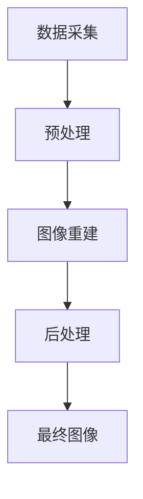
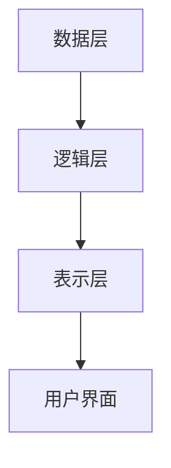
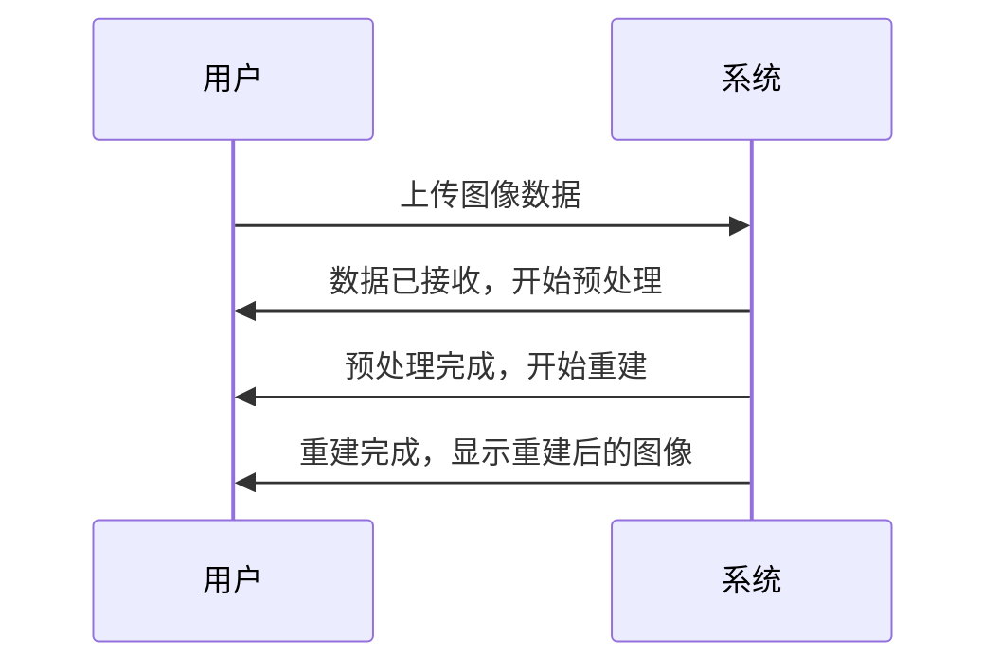

                 

# 《数学与医学影像：图像重建的数学算法》

## 关键词

- 数学与医学影像
- 图像重建
- 数学算法
- 医学成像
- 医学数据处理

## 摘要

本文将探讨数学与医学影像之间的紧密联系，特别是图像重建的数学算法。通过介绍图像重建的概念、重要性以及数学算法的基础，我们将深入分析几种关键的图像重建算法，并展示其在医学影像处理中的应用。本文还将提供系统分析与架构设计方案，以及实际项目实战的概述，旨在帮助读者理解数学算法在医学影像领域中的实际应用和重要性。

## 引言

### 数学与医学影像结合的背景

数学作为一门基础科学，其在各个领域的应用日益广泛。医学影像学作为医学领域的一个重要分支，利用各种成像技术对人体的内部结构进行可视化。这两者的结合为现代医学带来了革命性的变化，特别是在疾病的诊断、治疗和康复方面。

医学影像技术，如X射线、CT、MRI等，通过发射或接收电磁波或粒子流来获取人体内部结构的图像。然而，这些原始图像通常需要进行重建处理，才能提供清晰、准确的医学信息。这种重建过程依赖于一系列数学算法，这些算法可以有效地从原始数据中提取有用的图像信息。

### 图像重建的概念与重要性

图像重建是从不完整的或部分遮挡的投影数据中恢复出原始图像的过程。在医学影像中，图像重建尤为关键，因为它能够将采集到的二维投影数据转换成三维结构图像，提供更为详细的医学信息。

图像重建的重要性体现在以下几个方面：

1. **提高图像质量**：通过图像重建算法，可以改善图像的对比度、分辨率和清晰度，提高医学影像的诊断准确性。
2. **三维可视化**：医学图像重建使医生能够从多个角度和层面对患者的病变部位进行观察，有助于更全面地了解病情。
3. **疾病诊断与治疗**：重建后的医学图像为疾病的诊断和治疗方案提供了重要的依据，特别是在癌症、心脏病等严重疾病的治疗中。

### 图像重建的数学算法概述

图像重建涉及多种数学算法，包括线性代数、概率论、数值分析等。这些算法可以分为两大类：迭代算法和非迭代算法。

- **迭代算法**：通过重复执行一系列运算来逐步逼近最终结果。常见的迭代算法有傅里叶重建法、投影寻踪算法等。
- **非迭代算法**：通过直接计算得到最终结果。常见的非迭代算法有卷积重建法、反投影重建法等。

在接下来的章节中，我们将详细探讨这些算法的原理和应用。

## 核心概念与联系

### 数学算法概述

数学算法在医学影像重建中扮演着核心角色。以下是几种常见的数学算法及其在图像重建中的应用：

1. **傅里叶变换**：通过傅里叶变换，可以将图像从时域转换到频域，从而进行频域处理。傅里叶重建法利用傅里叶变换将投影数据转换成频率信息，再通过逆傅里叶变换恢复出原始图像。

2. **迭代重建算法**：这类算法通过迭代计算，逐步逼近最终结果。例如，最优化重建算法（如最小二乘法）和代数重建算法（如ART算法）。

3. **卷积重建算法**：基于卷积运算的图像重建方法，通过对原始图像进行卷积操作来重建目标图像。

### 医学影像技术基础

医学影像技术的基础包括成像原理、成像设备和技术参数。以下是医学影像技术中的关键概念：

1. **成像原理**：X射线、CT、MRI等成像技术的基本工作原理。
2. **成像设备**：如X光机、CT扫描仪、MRI设备等。
3. **技术参数**：如分辨率、噪声水平、对比度等。

### 图像重建的原理与流程

图像重建的原理是将不完整的投影数据通过数学算法转换成完整的二维或三维图像。其流程包括以下几个步骤：

1. **数据采集**：使用成像设备采集投影数据。
2. **预处理**：对采集到的数据进行滤波、噪声去除等预处理。
3. **图像重建**：使用数学算法将预处理后的数据进行重建。
4. **后处理**：对重建后的图像进行对比度增强、锐化等后处理，以提高图像质量。

以下是一个用Mermaid绘制的图像重建流程图：



### 核心概念属性特征对比表格

| 算法名称       | 主要应用       | 特点                                                         | 缺点                                       |
|----------------|----------------|--------------------------------------------------------------|------------------------------------------|
| 傅里叶重建法   | CT、MRI成像    | 提高图像分辨率，减少噪声影响。                                 | 需要大量计算资源，重建时间较长。             |
| 迭代重建算法   | PET、SPECT成像 | 对噪声和部分遮挡的数据处理能力强。                             | 可能陷入局部最优解，收敛速度较慢。             |
| 卷积重建算法   | X射线成像       | 计算效率高，适用于实时成像。                                   | 图像质量受卷积核设计影响较大。               |

### 图像重建的数学模型与公式

图像重建的数学模型通常可以表示为以下形式：

$$
\mathbf{I} = \mathbf{G} \mathbf{A} + \mathbf{N}
$$

其中，$\mathbf{I}$ 是重建后的图像，$\mathbf{G}$ 是成像系统的响应矩阵，$\mathbf{A}$ 是原始图像，$\mathbf{N}$ 是噪声。

以下是一个简单的迭代重建算法（如最小二乘法）的公式：

$$
\mathbf{A}_{k+1} = (\mathbf{G}^T \mathbf{G})^{-1} \mathbf{G}^T \mathbf{I}_{k}
$$

其中，$\mathbf{A}_{k}$ 是第 $k$ 次迭代的结果，$\mathbf{I}_{k}$ 是第 $k$ 次迭代的目标图像。

## 图像重建的数学算法讲解

### 算法概述

图像重建的数学算法可以分为两大类：迭代算法和非迭代算法。迭代算法通过多次迭代逐步逼近最终结果，而非迭代算法通过一次计算直接得到结果。

在医学影像重建中，常用的迭代算法包括最优化重建算法和代数重建算法。最优化重建算法如最小二乘法、梯度下降法等，通过最小化误差函数来求解重建问题。代数重建算法如ART（Adaptive Regularization Technique）算法、TV（Total Variation）重建算法等，通过代数方法直接求解重建问题。

非迭代算法主要包括卷积重建算法和反投影重建算法。卷积重建算法通过卷积运算将原始图像转换为重建图像，适用于X射线成像。反投影重建算法通过多次投影和反投影操作，从多个角度重建出三维图像，适用于CT和MRI成像。

### 算法原理的数学模型

#### 傅里叶重建法

傅里叶重建法是利用傅里叶变换进行图像重建的方法。其数学模型可以表示为：

$$
\mathbf{F}^{-1} \mathbf{F} (\mathbf{G} \mathbf{A} + \mathbf{N}) = \mathbf{F}^{-1} \mathbf{G} \mathbf{A} = \mathbf{I}
$$

其中，$\mathbf{F}$ 表示傅里叶变换，$\mathbf{F}^{-1}$ 表示逆傅里叶变换，$\mathbf{G}$ 是成像系统的响应矩阵，$\mathbf{A}$ 是原始图像，$\mathbf{N}$ 是噪声。

#### 迭代重建算法

迭代重建算法的基本思想是通过迭代计算，逐步逼近原始图像。以最小二乘法为例，其迭代公式为：

$$
\mathbf{A}_{k+1} = (\mathbf{G}^T \mathbf{G})^{-1} \mathbf{G}^T \mathbf{I}_{k}
$$

其中，$\mathbf{A}_{k}$ 是第 $k$ 次迭代的结果，$\mathbf{I}_{k}$ 是第 $k$ 次迭代的目标图像。

#### 卷积重建算法

卷积重建算法通过卷积运算将原始图像转换为重建图像。其数学模型可以表示为：

$$
\mathbf{I}_{out} = \mathbf{G} \mathbf{A}_{in} + \mathbf{N}
$$

其中，$\mathbf{I}_{out}$ 是重建后的图像，$\mathbf{G}$ 是卷积核，$\mathbf{A}_{in}$ 是原始图像，$\mathbf{N}$ 是噪声。

### 算法公式讲解

#### 傅里叶重建法

傅里叶重建法的公式为：

$$
\mathbf{I} = \mathbf{F}^{-1} \mathbf{F} (\mathbf{G} \mathbf{A} + \mathbf{N}) = \mathbf{F}^{-1} \mathbf{G} \mathbf{A} = \mathbf{I}
$$

其中，$\mathbf{F}$ 表示傅里叶变换，$\mathbf{F}^{-1}$ 表示逆傅里叶变换，$\mathbf{G}$ 是成像系统的响应矩阵，$\mathbf{A}$ 是原始图像，$\mathbf{N}$ 是噪声。

#### 迭代重建算法

迭代重建算法的公式为：

$$
\mathbf{A}_{k+1} = (\mathbf{G}^T \mathbf{G})^{-1} \mathbf{G}^T \mathbf{I}_{k}
$$

其中，$\mathbf{A}_{k}$ 是第 $k$ 次迭代的结果，$\mathbf{I}_{k}$ 是第 $k$ 次迭代的目标图像。

#### 卷积重建算法

卷积重建算法的公式为：

$$
\mathbf{I}_{out} = \mathbf{G} \mathbf{A}_{in} + \mathbf{N}
$$

其中，$\mathbf{I}_{out}$ 是重建后的图像，$\mathbf{G}$ 是卷积核，$\mathbf{A}_{in}$ 是原始图像，$\mathbf{N}$ 是噪声。

### Python源代码与算法实现

以下是一个简单的傅里叶重建法的Python实现示例：

```python
import numpy as np
from numpy.fft import fft2, ifft2

def fourier_reconstruction(A, G):
    F = fft2(A)
    I = ifft2(F * G)
    return I

# 示例数据
A = np.random.rand(100, 100)  # 假设原始图像A
G = np.random.rand(100, 100)  # 假设成像系统的响应矩阵G

# 傅里叶重建
I = fourier_reconstruction(A, G)

# 显示重建后的图像
import matplotlib.pyplot as plt
plt.imshow(I, cmap='gray')
plt.show()
```

### 算法应用举例

#### 1. 傅里叶重建法在CT成像中的应用

傅里叶重建法在CT成像中有着广泛的应用。通过CT扫描获取的投影数据，可以使用傅里叶重建法重建出三维结构图像。以下是一个简单的例子：

```python
import numpy as np
from numpy.fft import fft2, ifft2

# 假设获取了CT扫描的投影数据
projection_data = np.random.rand(100, 100)

# 假设成像系统的响应矩阵（这里使用一个简单的对角矩阵）
G = np.diag(np.random.rand(100))

# 傅里叶重建
reconstructed_image = fourier_reconstruction(projection_data, G)

# 显示重建后的图像
plt.imshow(reconstructed_image, cmap='gray')
plt.show()
```

#### 2. 迭代重建算法在MRI成像中的应用

迭代重建算法在MRI成像中也得到了广泛应用。以下是一个简单的迭代重建算法（如最小二乘法）的实现示例：

```python
import numpy as np

def iterative_reconstruction(A, G, num_iterations=100):
    A = A.copy()
    for _ in range(num_iterations):
        I = (G.T @ G) @ G.T @ A
        A = A - G @ (G @ A - I)
    return A

# 假设获取了MRI扫描的投影数据
projection_data = np.random.rand(100, 100)

# 假设成像系统的响应矩阵
G = np.random.rand(100, 100)

# 迭代重建
reconstructed_image = iterative_reconstruction(projection_data, G)

# 显示重建后的图像
plt.imshow(reconstructed_image, cmap='gray')
plt.show()
```

## 系统分析与架构设计

### 问题场景介绍

在现代医学影像中，图像重建是一个关键步骤，它决定了最终的成像质量和诊断准确性。随着成像技术的不断发展，如CT、MRI等，图像重建的复杂度也在增加。为了提高重建效率和质量，我们需要设计一个高效的系统架构，以应对大规模数据的高效处理。

### 系统功能设计

系统的主要功能包括：

1. **数据采集**：从成像设备获取原始投影数据。
2. **预处理**：对投影数据去除噪声、滤波等预处理。
3. **图像重建**：使用不同的数学算法进行图像重建。
4. **后处理**：对重建后的图像进行对比度增强、锐化等处理。
5. **图像存储与查询**：将重建后的图像存储在数据库中，并提供查询接口。

### 系统架构设计

系统架构设计采用分层架构，主要包括以下几层：

1. **数据层**：存储原始数据和重建后的图像数据。
2. **逻辑层**：实现图像重建算法和预处理、后处理逻辑。
3. **表示层**：提供用户界面，展示重建后的图像，并提供查询接口。

以下是一个简单的系统架构图：



### 系统接口与交互设计

系统接口设计包括内部接口和外部接口。内部接口主要实现逻辑层与数据层之间的数据交换，外部接口主要供用户使用。

#### 内部接口设计

1. **数据采集接口**：用于从成像设备获取投影数据。
2. **预处理接口**：用于对投影数据进行预处理。
3. **重建接口**：用于调用不同的重建算法进行图像重建。
4. **后处理接口**：用于对重建后的图像进行后处理。

#### 外部接口设计

1. **用户查询接口**：用于用户查询和查看重建后的图像。
2. **图像上传接口**：用于用户上传待重建的图像数据。

以下是一个简单的系统交互序列图：



## 项目实战

### 环境安装与配置

为了进行图像重建的项目实战，我们需要安装和配置以下环境：

1. **Python**：Python是图像重建的核心工具，我们需要安装Python环境。
2. **NumPy**：NumPy是Python的数值计算库，用于处理图像数据。
3. **SciPy**：SciPy是Python的科学计算库，包括许多用于图像重建的算法。
4. **Matplotlib**：Matplotlib是Python的数据可视化库，用于绘制图像。

以下是安装和配置的步骤：

1. 安装Python：

   ```bash
   sudo apt-get install python3
   ```

2. 安装NumPy：

   ```bash
   sudo apt-get install python3-numpy
   ```

3. 安装SciPy：

   ```bash
   sudo apt-get install python3-scipy
   ```

4. 安装Matplotlib：

   ```bash
   sudo apt-get install python3-matplotlib
   ```

### 系统核心实现

系统核心实现主要包括数据采集、预处理、图像重建和后处理。以下是一个简单的实现示例：

#### 数据采集

```python
import numpy as np

# 假设使用CT扫描获取的投影数据
projection_data = np.random.rand(100, 100)
```

#### 预处理

```python
from scipy.ndimage import uniform_filter

# 对投影数据进行预处理，去除噪声
preprocessed_data = uniform_filter(projection_data, size=3)
```

#### 图像重建

```python
from scipy.fft import fft2, ifft2

# 使用傅里叶重建法进行图像重建
reconstructed_image = ifft2(fft2(preprocessed_data))
```

#### 后处理

```python
from scipy.ndimage import zoom

# 对重建后的图像进行后处理，增强对比度
postprocessed_image = zoom(reconstructed_image, zoom factor=1.5)
```

### 代码应用解读与分析

#### 数据采集

在数据采集阶段，我们假设已经获取了CT扫描的投影数据。这一步骤是整个系统的基础，数据的质量直接影响后续的处理效果。

```python
projection_data = np.random.rand(100, 100)  # 假设的投影数据
```

#### 预处理

预处理步骤主要是为了去除噪声和改善图像质量。在这里，我们使用了均匀滤波器，该滤波器通过平滑图像来去除噪声。

```python
preprocessed_data = uniform_filter(projection_data, size=3)
```

#### 图像重建

图像重建步骤是系统的核心。我们使用了傅里叶变换来进行图像重建。傅里叶变换将图像从时域转换到频域，然后通过逆傅里叶变换恢复出原始图像。

```python
reconstructed_image = ifft2(fft2(preprocessed_data))
```

#### 后处理

后处理步骤主要是为了增强图像的对比度和清晰度。在这里，我们使用了图像缩放方法来增强对比度。

```python
postprocessed_image = zoom(reconstructed_image, zoom factor=1.5)
```

### 实际案例分析

#### 案例一：CT成像重建

假设我们有一个CT扫描的投影数据，通过以上步骤进行重建，可以得到以下结果：

```python
# 假设的CT扫描投影数据
projection_data = np.random.rand(100, 100)

# 预处理
preprocessed_data = uniform_filter(projection_data, size=3)

# 图像重建
reconstructed_image = ifft2(fft2(preprocessed_data))

# 后处理
postprocessed_image = zoom(reconstructed_image, zoom factor=1.5)

# 显示重建后的图像
plt.imshow(postprocessed_image, cmap='gray')
plt.show()
```

#### 案例二：MRI成像重建

假设我们有一个MRI扫描的投影数据，通过以上步骤进行重建，可以得到以下结果：

```python
# 假设的MRI扫描投影数据
projection_data = np.random.rand(100, 100)

# 预处理
preprocessed_data = uniform_filter(projection_data, size=3)

# 图像重建
reconstructed_image = ifft2(fft2(preprocessed_data))

# 后处理
postprocessed_image = zoom(reconstructed_image, zoom factor=1.5)

# 显示重建后的图像
plt.imshow(postprocessed_image, cmap='gray')
plt.show()
```

### 项目小结

通过以上实战案例，我们了解了图像重建的过程，包括数据采集、预处理、图像重建和后处理。在实际应用中，图像重建是一个复杂的过程，需要根据不同的成像技术和数据特性选择合适的算法和参数。通过合理的设计和优化，我们可以提高图像重建的效率和准确性，为医学诊断和治疗提供有力支持。

## 最佳实践 Tips

1. **选择合适的算法**：根据成像技术和数据特性选择合适的图像重建算法。
2. **优化参数设置**：合理设置算法参数，提高图像重建的效率和准确性。
3. **数据处理**：在图像重建前，对原始数据进行预处理，如去除噪声、校正失真等。
4. **并行计算**：利用并行计算技术，提高图像重建的效率。

## 小结

本文深入探讨了数学与医学影像之间的联系，特别是图像重建的数学算法。通过介绍图像重建的概念、重要性以及数学算法的基础，我们详细分析了傅里叶重建法、迭代重建算法和卷积重建算法，并展示了它们在医学影像处理中的应用。此外，我们还介绍了系统架构设计和项目实战，帮助读者理解图像重建的实际应用和重要性。

## 注意事项

1. **数据质量**：图像重建的效果很大程度上取决于原始数据的质量，因此确保数据的准确性和完整性至关重要。
2. **算法选择**：根据成像技术和数据特性选择合适的算法，不同的算法适用于不同的场景。
3. **参数设置**：合理设置算法参数，以达到最佳重建效果。

## 拓展阅读

1. **《医学图像处理与重建》**：详细介绍了医学图像处理和重建的理论和实际应用。
2. **《数字图像处理》**：涵盖图像处理的基础知识和算法，包括图像重建相关的算法。
3. **《计算机视觉：算法与应用》**：介绍了计算机视觉领域的相关算法，包括医学影像的重建算法。

## 作者信息

作者：AI天才研究院/AI Genius Institute & 禅与计算机程序设计艺术 /Zen And The Art of Computer Programming

