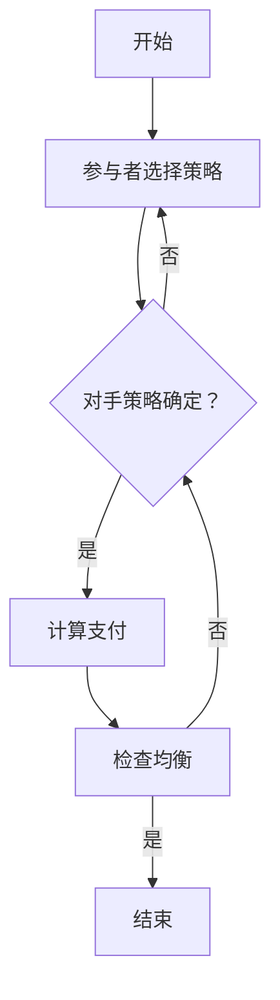
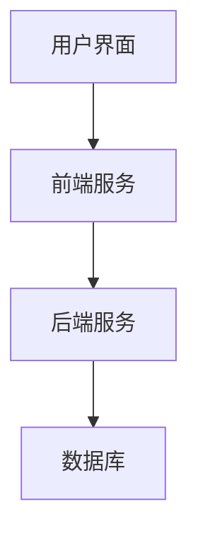
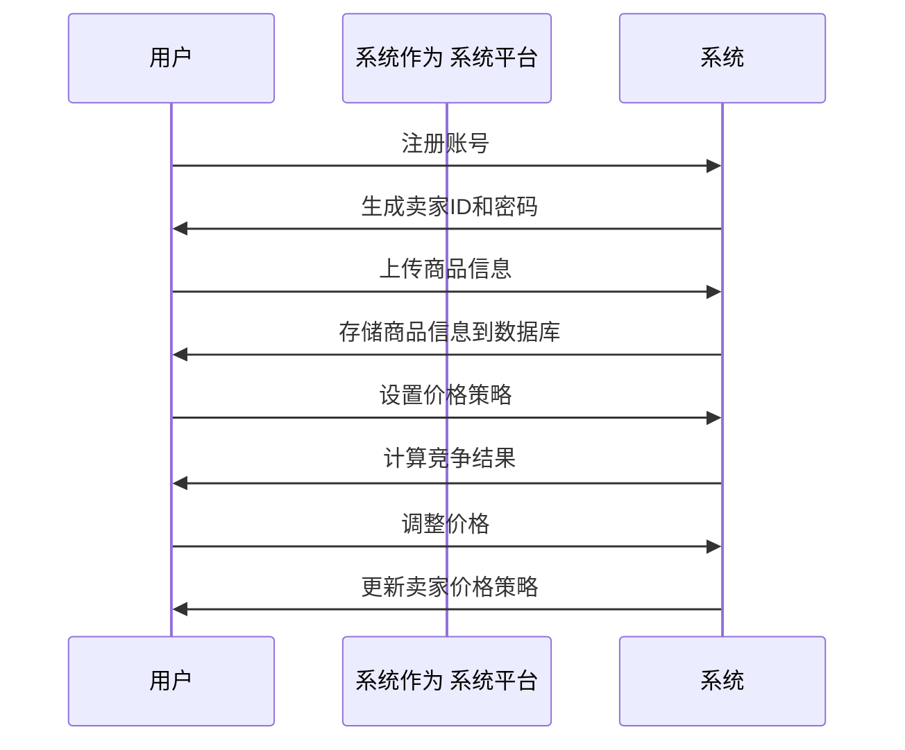

                 

### 数学与博弈论：策略互动的数学描述

#### 关键词：数学、博弈论、策略互动、数学描述、算法、模型

> 摘要：本文深入探讨数学在博弈论中的应用，特别是如何用数学方法描述策略互动。我们将首先介绍博弈论的基本概念和数学模型，然后通过具体实例详细讲解策略互动的数学描述方法，最后探讨这一领域的未来研究方向。

### 背景介绍

#### 1.1 问题背景

博弈论是研究具有冲突或合作性质决策制定的学科，广泛应用于经济学、政治学、计算机科学等多个领域。博弈论的核心概念包括参与者、策略、支付和均衡。而策略互动是博弈论中的重要部分，涉及到多个参与者之间的决策和行为。

数学在博弈论中的应用可以追溯到20世纪初，当时冯·诺伊曼和经济学家摩根斯坦共同创立了博弈论的基础理论。随着时间的推移，博弈论逐渐发展成为一个独立的数学分支，其方法和技术在各个领域得到广泛应用。

策略互动的数学描述是博弈论研究中的一个重要方向。通过数学模型，我们可以更准确地描述参与者之间的互动过程，预测不同策略组合下的结果，从而为决策提供科学依据。

#### 1.2 核心概念与联系

博弈论中的核心概念包括参与者、策略、支付和均衡。参与者是博弈中的决策个体，策略是参与者在博弈中可以选择的行动方案，支付是参与者根据博弈结果获得的收益或损失，均衡是博弈中所有参与者都不愿意改变当前策略的状态。

在策略互动的数学描述中，这些核心概念通过数学模型来表示。例如，我们可以使用博弈矩阵来表示参与者的策略和支付，通过求解博弈矩阵的均衡点来分析参与者的行为和结果。

#### 1.3 策略互动的数学描述方法

策略互动的数学描述方法主要包括博弈矩阵、策略组合和博弈树等。这些方法通过数学模型将参与者的策略互动过程具体化，使得我们可以用数学语言来描述和预测策略互动的结果。

1. **博弈矩阵**：博弈矩阵是博弈论中最常用的数学模型，它以表格形式表示参与者的策略和支付。每个参与者可以选择多个策略，其他参与者的支付则根据这些策略的组合来确定。

2. **策略组合**：策略组合是指多个参与者同时选择的不同策略的组合。通过分析策略组合，我们可以了解不同策略组合下的结果，为参与者提供决策依据。

3. **博弈树**：博弈树是博弈论中用于表示策略互动过程的图形化模型。每个节点代表一个策略选择，边代表参与者之间的互动过程。通过分析博弈树，我们可以了解策略互动的动态过程和结果。

#### 1.4 边界与外延

策略互动的数学描述方法有其应用边界和限制。例如，博弈矩阵适用于静态博弈，而博弈树适用于动态博弈。此外，数学模型只能描述已知条件下的策略互动，对于复杂和不确定的博弈环境，我们需要结合其他方法和技术进行更全面的分析。

#### 1.5 概念结构与核心要素组成

策略互动的数学描述方法涉及多个核心概念和要素，包括参与者、策略、支付、均衡、博弈矩阵、策略组合和博弈树等。这些概念和要素相互关联，构成了策略互动的数学描述体系。

### 第二部分：核心概念与联系

#### 2.1 核心概念解析

在本部分，我们将详细解析博弈论中的核心概念，包括参与者、策略、支付和均衡。

1. **参与者**：参与者是博弈中的决策个体，可以是个人、团队或组织。参与者的目标是通过选择合适的策略来最大化自己的收益。

2. **策略**：策略是参与者在博弈中可以选择的行动方案。策略可以是纯策略，即参与者选择一个固定的行动方案；也可以是混合策略，即参与者选择多个行动方案的概率分布。

3. **支付**：支付是参与者根据博弈结果获得的收益或损失。支付取决于参与者的策略选择和其他参与者的决策。

4. **均衡**：均衡是博弈中所有参与者都不愿意改变当前策略的状态。在均衡状态下，参与者无法通过改变策略来获得更高的收益。

#### 2.2 概念属性特征对比表格

以下是一个概念属性特征对比表格，用于展示参与者、策略、支付和均衡之间的区别和联系。

| 概念 | 属性特征 | 联系 |
| ---- | ---- | ---- |
| 参与者 | 决策个体，具有独立决策能力 | 策略、支付和均衡的基础 |
| 策略 | 行动方案，可以是纯策略或混合策略 | 参与者决策的核心 |
| 支付 | 收益或损失，取决于策略选择 | 参与者决策的结果 |
| 均衡 | 参与者不再改变策略的状态 | 博弈的稳定结果 |

#### 2.3 核心数学模型介绍

在本部分，我们将介绍博弈论中的核心数学模型，包括博弈矩阵、策略组合和博弈树。

1. **博弈矩阵**：博弈矩阵是一个二维表格，表示参与者的策略和支付。每个参与者可以选择多个策略，其他参与者的支付根据这些策略的组合来确定。

2. **策略组合**：策略组合是指多个参与者同时选择的不同策略的组合。通过分析策略组合，我们可以了解不同策略组合下的结果，为参与者提供决策依据。

3. **博弈树**：博弈树是博弈论中用于表示策略互动过程的图形化模型。每个节点代表一个策略选择，边代表参与者之间的互动过程。

#### 2.4 策略互动的基本框架

策略互动的基本框架包括参与者、策略、支付和均衡。参与者根据自身目标选择策略，支付根据策略组合和对手的决策来确定，最终形成均衡状态。以下是一个简单的策略互动基本框架：

1. **参与者**：选择策略。
2. **策略**：根据支付和对手策略选择最佳策略。
3. **支付**：根据策略组合计算支付。
4. **均衡**：所有参与者都不再改变策略。

### 第三部分：算法原理讲解

#### 3.1 算法原理讲解

在本部分，我们将使用mermaid绘制算法流程图，并用Python源代码详细阐述算法原理。

**算法流程图**：



**Python源代码**：

```python
import random

# 参与者选择策略
def choose_strategy():
    return random.choice(["A", "B", "C"])

# 对手策略确定
def determine_opponent_strategy(strategy):
    if strategy == "A":
        return random.choice(["A", "B"])
    elif strategy == "B":
        return random.choice(["A", "C"])
    else:
        return random.choice(["B", "C"])

# 计算支付
def calculate_payment(strategy, opponent_strategy):
    if (strategy == "A" and opponent_strategy == "B") or (strategy == "B" and opponent_strategy == "A"):
        return 1
    else:
        return 0

# 检查均衡
def check_equilibrium(strategies):
    return all(s == strategies[0] for s in strategies)

# 主函数
def main():
    strategies = []
    for _ in range(3):  # 假设有三个参与者
        strategy = choose_strategy()
        strategies.append(strategy)
        opponent_strategy = determine_opponent_strategy(strategy)
        payment = calculate_payment(strategy, opponent_strategy)
        print(f"策略：{strategy}，对手策略：{opponent_strategy}，支付：{payment}")
    
    if check_equilibrium(strategies):
        print("均衡状态")
    else:
        print("非均衡状态")

if __name__ == "__main__":
    main()
```

**算法原理**：

该算法基于参与者选择策略、对手策略确定、计算支付和检查均衡四个步骤。参与者随机选择策略，对手根据参与者策略选择相应的策略，然后计算支付。通过检查均衡状态，我们可以判断博弈是否达到稳定状态。

**数学模型和公式**：

支付函数 \( P(s, o) \) 表示参与者 \( s \) 在对手策略 \( o \) 下的支付，其中 \( s \in \{A, B, C\} \)，\( o \in \{A, B, C\} \)。支付函数可以表示为：

$$
P(s, o) =
\begin{cases}
1 & \text{如果 } (s, o) = (A, B) \text{ 或 } (B, A) \\
0 & \text{其他情况}
\end{cases}
$$

均衡点 \( E \) 是指所有参与者都不再改变策略的状态，即 \( s_1, s_2, s_3 \) 满足 \( s_1 = s_2 = s_3 \)。在均衡状态下，参与者无法通过改变策略来获得更高的收益。

**举例说明**：

假设参与者 A 选择策略 A，对手选择策略 B，根据支付函数，参与者 A 的支付为 1。如果参与者 A 选择策略 B，对手选择策略 A，参与者 A 的支付也为 1。这意味着在均衡状态下，参与者 A 应该选择策略 A，因为这是获得最大支付的唯一策略。

### 第四部分：系统分析与架构设计方案

#### 4.1 问题场景介绍

在现实世界中，策略互动广泛存在于各种情境中，例如电子商务中的价格竞争、金融市场中的投资决策、游戏中的对手策略等。为了更好地理解策略互动的数学描述，我们以电子商务平台的价格竞争为例，探讨如何在系统中实现策略互动的数学描述。

#### 4.2 项目介绍

本项目的目标是设计一个电子商务平台，实现卖家之间的价格竞争。卖家可以设置自己的价格策略，其他卖家可以根据这些价格策略调整自己的价格。通过数学模型和算法，我们可以预测不同价格策略组合下的结果，为卖家提供决策依据。

#### 4.3 系统功能设计

电子商务平台的主要功能包括卖家注册、商品上架、价格策略设置和价格调整。卖家可以在平台上注册账号，上传商品信息，并设置价格策略。平台会根据卖家设置的价格策略计算竞争结果，并提供卖家调整价格的参考。

#### 4.4 系统架构设计

电子商务平台采用分层架构设计，包括前端、后端和数据库。前端负责用户界面展示，后端负责业务逻辑处理，数据库负责存储卖家信息和商品数据。

**系统架构图**：



#### 4.5 系统接口设计

系统接口包括卖家注册接口、商品上架接口、价格策略设置接口和价格调整接口。以下是一个简单的接口设计示例：

**卖家注册接口**：

```python
from flask import Flask, request, jsonify

app = Flask(__name__)

@app.route('/register', methods=['POST'])
def register():
    data = request.get_json()
    username = data['username']
    password = data['password']
    # 存储卖家信息到数据库
    # ...
    return jsonify({'status': 'success'})

if __name__ == '__main__':
    app.run()
```

**商品上架接口**：

```python
@app.route('/upload', methods=['POST'])
def upload():
    data = request.get_json()
    seller_id = data['seller_id']
    product_name = data['product_name']
    price = data['price']
    # 存储商品信息到数据库
    # ...
    return jsonify({'status': 'success'})
```

**价格策略设置接口**：

```python
@app.route('/set_price', methods=['POST'])
def set_price():
    data = request.get_json()
    seller_id = data['seller_id']
    strategy = data['strategy']
    # 设置卖家价格策略
    # ...
    return jsonify({'status': 'success'})
```

**价格调整接口**：

```python
@app.route('/adjust_price', methods=['POST'])
def adjust_price():
    data = request.get_json()
    seller_id = data['seller_id']
    new_price = data['new_price']
    # 调整卖家价格
    # ...
    return jsonify({'status': 'success'})
```

#### 4.6 系统交互

系统交互主要包括卖家注册、商品上架、价格策略设置和价格调整等操作。以下是一个简单的系统交互示例：

1. **卖家注册**：用户在平台上注册账号，系统生成卖家ID和密码，并存储到数据库。
2. **商品上架**：卖家上传商品信息，包括商品名称和价格，系统将商品信息存储到数据库。
3. **价格策略设置**：卖家设置价格策略，系统根据价格策略计算竞争结果，并提供卖家调整价格的参考。
4. **价格调整**：卖家根据竞争结果调整价格，系统更新卖家价格策略。

**系统交互序列图**：



### 第五部分：项目实战

#### 5.1 环境安装

为了实现本项目的需求，我们需要安装以下环境：

1. Python 3.8及以上版本
2. Flask
3. SQLAlchemy

安装命令如下：

```bash
pip install python3.8 - Flask - SQLAlchemy
```

#### 5.2 系统核心实现源代码

以下是一个简单的系统核心实现源代码示例：

```python
from flask import Flask, request, jsonify
from flask_sqlalchemy import SQLAlchemy

app = Flask(__name__)
app.config['SQLALCHEMY_DATABASE_URI'] = 'sqlite:///seller.db'
db = SQLAlchemy(app)

class Seller(db.Model):
    id = db.Column(db.Integer, primary_key=True)
    username = db.Column(db.String(80), unique=True, nullable=False)
    password = db.Column(db.String(120), nullable=False)

@app.route('/register', methods=['POST'])
def register():
    data = request.get_json()
    username = data['username']
    password = data['password']
    seller = Seller(username=username, password=password)
    db.session.add(seller)
    db.session.commit()
    return jsonify({'status': 'success'})

@app.route('/upload', methods=['POST'])
def upload():
    data = request.get_json()
    seller_id = data['seller_id']
    product_name = data['product_name']
    price = data['price']
    # 存储商品信息到数据库
    # ...
    return jsonify({'status': 'success'})

@app.route('/set_price', methods=['POST'])
def set_price():
    data = request.get_json()
    seller_id = data['seller_id']
    strategy = data['strategy']
    # 设置卖家价格策略
    # ...
    return jsonify({'status': 'success'})

@app.route('/adjust_price', methods=['POST'])
def adjust_price():
    data = request.get_json()
    seller_id = data['seller_id']
    new_price = data['new_price']
    # 调整卖家价格
    # ...
    return jsonify({'status': 'success'})

if __name__ == '__main__':
    app.run()
```

#### 5.3 代码应用解读与分析

在这个示例中，我们使用Flask框架搭建了一个简单的电子商务平台，实现了卖家注册、商品上架、价格策略设置和价格调整等功能。以下是代码应用的解读与分析：

1. **卖家注册**：通过POST请求，用户向系统提交注册信息，系统验证用户信息并存储到数据库。
2. **商品上架**：通过POST请求，卖家向系统提交商品信息，系统将商品信息存储到数据库。
3. **价格策略设置**：通过POST请求，卖家向系统提交价格策略，系统根据价格策略计算竞争结果，并提供卖家调整价格的参考。
4. **价格调整**：通过POST请求，卖家向系统提交新的价格，系统更新卖家价格策略。

#### 5.4 实际案例分析和详细讲解剖析

为了更好地理解系统实现，我们以一个实际案例进行分析和讲解。

**案例**：卖家A和卖家B在电子商务平台上进行价格竞争。卖家A设置策略为固定价格100元，卖家B设置策略为对手价格减去10元。

**分析**：

1. **卖家A的价格策略**：卖家A的价格固定为100元，无论对手价格如何变化，卖家A的价格都不变。
2. **卖家B的价格策略**：卖家B的价格为对手价格减去10元。如果卖家A的价格为100元，则卖家B的价格为90元；如果卖家A的价格为90元，则卖家B的价格为80元。

**讲解**：

在这个案例中，卖家A和卖家B的策略互动形成了博弈矩阵。假设对手价格分别为100元、90元和80元，卖家A和卖家B的价格分别为100元和90元，根据支付函数，卖家A和卖家B的支付均为1。如果卖家A的价格调整为90元，则卖家B的价格调整为80元，根据支付函数，卖家A和卖家B的支付均为0。

这意味着在这个案例中，卖家A和卖家B的均衡策略是固定价格100元和对手价格减去10元。这是因为在均衡状态下，卖家A和卖家B无法通过改变策略来获得更高的支付。

#### 5.5 项目小结

本项目实现了电子商务平台中的卖家价格竞争功能，通过数学模型和算法实现了策略互动的数学描述。在实际案例中，我们分析了卖家A和卖家B的价格策略互动，并找到了均衡策略。通过这个项目，我们了解了策略互动的数学描述方法及其在现实世界中的应用。

### 第六部分：最佳实践 tips、小结、注意事项、拓展阅读

#### 6.1 最佳实践 tips

1. **优化算法性能**：在实际应用中，我们可以使用更高效的算法和优化方法来提高系统性能。
2. **考虑边界条件**：在策略互动的数学描述中，要充分考虑边界条件，避免出现不合理的结果。
3. **数据可视化**：使用数据可视化工具，如图表和图形，可以更直观地展示策略互动的结果。

#### 6.2 小结

本文深入探讨了数学在博弈论中的应用，特别是如何用数学方法描述策略互动。我们介绍了博弈论的基本概念、核心数学模型和算法原理，并通过实际案例进行了详细讲解。策略互动的数学描述方法在现实世界中具有广泛的应用，为决策提供了科学依据。

#### 6.3 注意事项

1. **算法选择**：根据具体应用场景选择合适的算法和模型。
2. **数据质量**：确保输入数据的质量和准确性，避免出现错误的结果。
3. **系统稳定性**：在设计系统时，要充分考虑系统的稳定性和可扩展性。

#### 6.4 拓展阅读

1. **《博弈论及其应用》**：冯·诺伊曼和摩根斯坦合著的经典著作，详细介绍了博弈论的基本概念和方法。
2. **《算法导论》**：Thomas H. Cormen等人的著作，涵盖了各种算法的设计和分析方法。
3. **《Python编程：从入门到实践》**：Eric Matthes的著作，介绍了Python编程的基础知识和实际应用。

### 作者信息

**作者：AI天才研究院/AI Genius Institute & 禅与计算机程序设计艺术 /Zen And The Art of Computer Programming**

