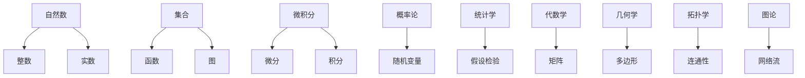
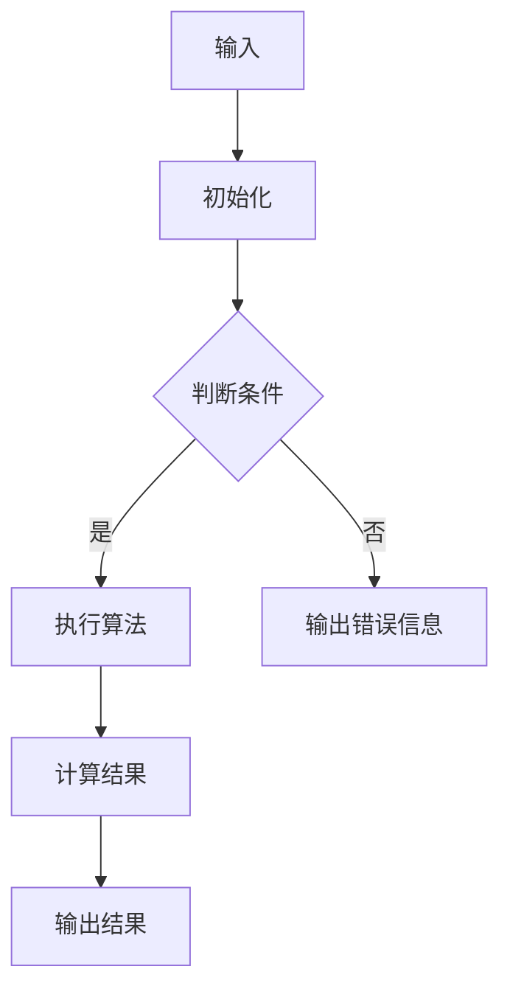
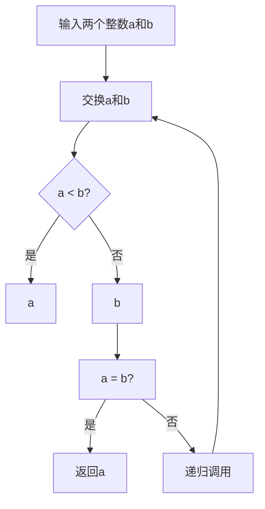
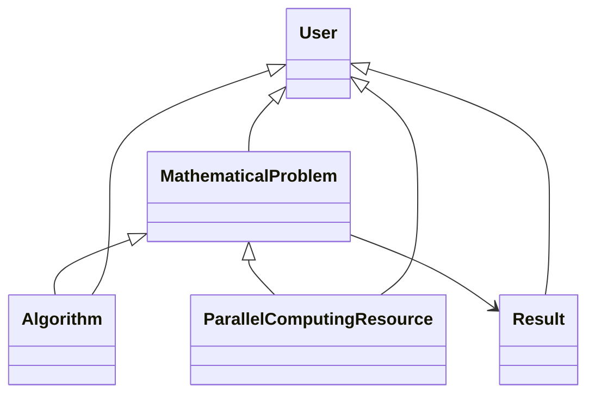
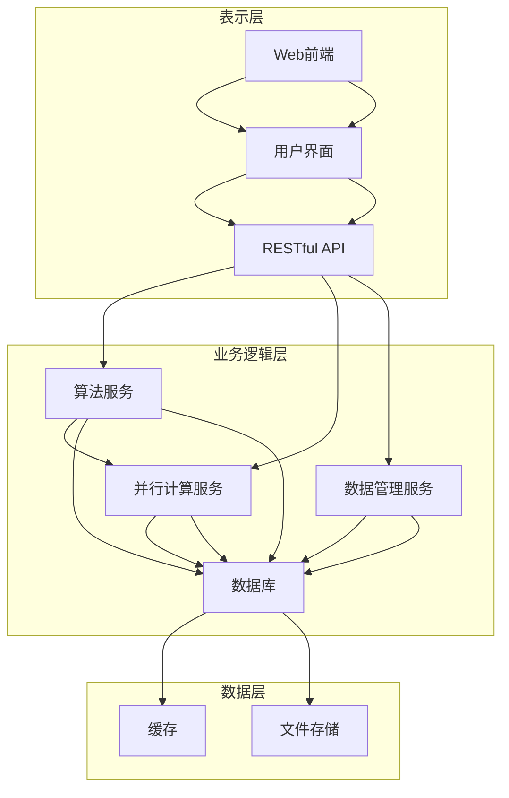
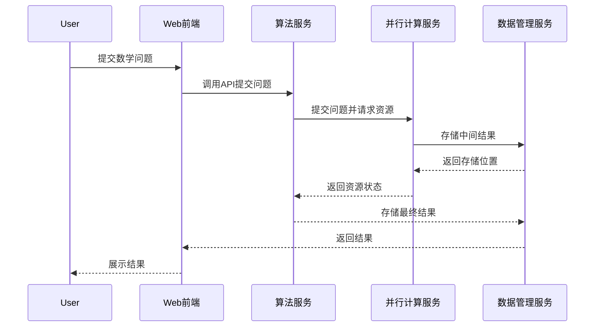
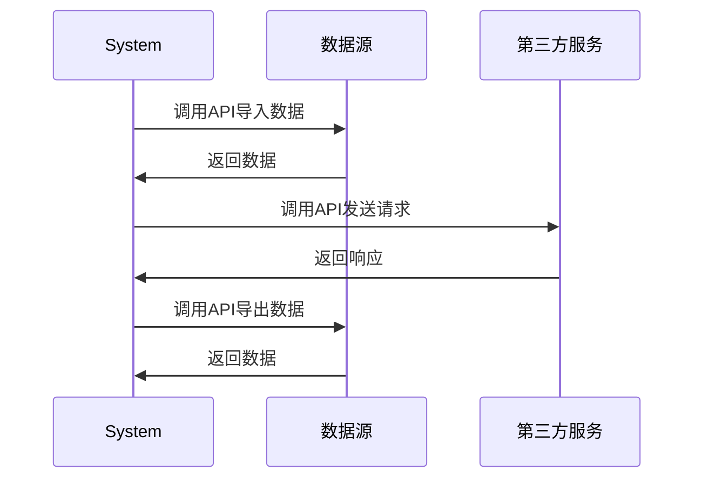

                 

### 数学与反基础主义：数学知识的网状结构

#### 关键词：数学、反基础主义、网状结构、数学知识、学习策略

#### 摘要：

本文旨在探讨数学与反基础主义之间的关系，通过分析数学知识的网状结构，探讨数学概念之间的关系及其对数学知识学习策略的影响。文章首先介绍了数学知识的基本结构和数学知识结构的变化，随后详细阐述了数学知识的网状结构及其特征。接着，文章分析了数学概念之间的关系，并讨论了数学思想的发展与演变。在此基础上，文章提出了数学知识的网状结构对学习策略的启示，并通过反基础主义的视角，探讨了数学知识的应用及其在现代教育中的挑战与机遇。文章还介绍了数学算法原理及其在现代教育中的应用，最终总结了数学知识的网状结构在现代教育中的重要性。

## 第一部分：背景介绍与问题提出

### 第1章：问题背景、数学知识的基本结构与数学知识结构的变化

#### 1.1 问题的提出：数学知识的现状与挑战

数学作为一门基础学科，在科学、技术、工程等领域发挥着举足轻重的作用。然而，随着时代的发展和科学的进步，数学知识的现状和结构也面临着一系列挑战。传统的数学知识结构主要以线性、层级式的形式呈现，这种结构在一定程度上限制了数学知识的传播和应用。在数学知识的海洋中，如何构建一个网状结构，以更有效地组织、传播和应用数学知识，成为当前数学教育研究和实践中亟待解决的问题。

#### 1.2 数学知识的基本结构

数学知识的基本结构包括概念、定义、定理、公理、原理等核心要素。这些要素相互关联，构成了数学知识的整体框架。在传统数学教育中，这些要素通常以线性、层级的方式呈现，即从基本概念出发，逐步推导出更复杂的理论。然而，这种结构在处理复杂问题时往往显得力不从心。因此，有必要探索一种更为灵活、网状的知识结构，以适应现代数学教育发展的需求。

#### 1.3 数学知识结构的变化趋势

近年来，数学知识结构的变化趋势主要体现在以下几个方面：

1. **跨学科融合**：数学与其他学科（如物理、化学、生物、计算机科学等）的交叉融合日益增多，形成了一系列新兴的数学分支。这种跨学科融合不仅丰富了数学知识体系，也推动了数学在各个领域中的应用。

2. **计算数学的兴起**：随着计算机技术的发展，计算数学逐渐成为数学研究的重要领域。计算数学涉及大量的算法、模型和数值方法，这些工具为数学问题的求解提供了新的途径。

3. **大数据与人工智能**：大数据和人工智能的快速发展，为数学知识的应用带来了前所未有的机遇。数学在大数据分析、机器学习、神经网络等领域发挥着重要作用，成为推动科技进步的关键力量。

4. **数学教育改革**：数学教育改革强调培养学生的数学思维和解决问题的能力，倡导一种以学生为中心、注重实践和创新的教育模式。这种改革趋势对数学知识结构的构建提出了新的要求。

#### 1.4 数学与反基础主义的关系

反基础主义是一种哲学思潮，主张质疑和反思传统的知识体系和思维方式。在数学领域，反基础主义主要体现在对数学公理体系、逻辑推理和数学语言的质疑。这种思潮在一定程度上推动了数学知识结构的变革，促使数学家们重新审视数学的基本概念和理论。

总的来说，数学知识的现状和结构面临诸多挑战，但同时也蕴藏着巨大的机遇。通过构建数学知识的网状结构，可以更好地应对这些挑战，实现数学知识的普及和推广。

### 第2章：数学知识的网状结构

#### 2.1 数学知识的网状结构概念

数学知识的网状结构是指将数学概念、定理、公式等要素通过相互关系和联系组织成一个复杂、动态的网络系统。在这个网络中，每个节点代表一个数学概念或定理，而节点之间的连线则表示它们之间的逻辑关系或应用场景。数学知识的网状结构不同于传统的线性结构，它更具有灵活性和扩展性，能够更好地反映数学知识的复杂性和多样性。

#### 2.2 数学知识网状结构的特征

数学知识网状结构具有以下几个显著特征：

1. **动态性**：数学知识的网状结构是一个动态变化的系统，随着新理论和应用的不断涌现，网络中的节点和连线也会不断更新和调整。

2. **关联性**：数学知识网状结构中的每个节点都与其他节点存在某种程度的关联，这种关联不仅体现在概念和定理之间的逻辑关系上，还体现在它们在不同应用场景中的交叉和融合。

3. **多样性**：数学知识网状结构包含了丰富多样的数学概念和理论，这些概念和理论在不同的领域和应用场景中发挥着重要作用。

4. **扩展性**：数学知识网状结构具有良好的扩展性，可以方便地融入新的数学分支和领域，从而不断丰富和完善数学知识体系。

5. **自组织性**：数学知识网状结构在一定程度上具有自组织性，即网络中的节点和连线会根据特定的规则和逻辑关系自发地形成和调整。

#### 2.3 数学知识网状结构的形成

数学知识网状结构的形成是一个复杂的过程，涉及多个方面的因素：

1. **历史积累**：数学知识的网状结构是在长期历史发展过程中逐渐形成的，是数学家们不断探索、发现和创新的结果。

2. **跨学科交流**：数学与其他学科的交叉融合，促进了数学知识网状结构的发展。跨学科交流不仅丰富了数学知识，也推动了数学与其他领域之间的相互影响。

3. **计算技术的发展**：计算技术的飞速发展，为数学知识网状结构的形成提供了强大的工具和手段。计算数学和数值方法的应用，使得数学问题的求解变得更加高效和准确。

4. **数学教育改革**：数学教育改革强调培养学生的数学思维和解决问题的能力，倡导一种以学生为中心、注重实践和创新的教育模式。这种改革趋势对数学知识结构的构建提出了新的要求，也为数学知识网状结构的形成提供了动力。

5. **社会需求**：随着社会的发展，对数学知识的需求也在不断变化。数学知识网状结构的形成和调整，需要紧密贴合社会需求，以更好地服务于实际应用。

总的来说，数学知识的网状结构是一个动态、关联、多样、扩展和自组织的复杂系统。通过不断优化和完善数学知识网状结构，可以更好地应对数学知识传播和应用中的挑战，促进数学科学的发展。

### 第3章：数学概念的关系与联系

#### 3.1 数学概念间的联系

数学概念间的联系构成了数学知识体系的核心。理解这些联系有助于我们更好地掌握数学知识，并运用到实际问题中。数学概念之间的关系可以分为以下几种类型：

1. **定义关系**：定义关系是指一个数学概念是基于另一个数学概念的定义。例如，实数是建立在自然数、整数和分数基础上的。

2. **推理关系**：推理关系是指通过逻辑推理从一个数学概念推导出另一个数学概念。例如，从勾股定理可以推导出直角三角形的面积公式。

3. **应用关系**：应用关系是指数学概念在具体问题中的应用。例如，微积分在物理学中的应用，统计学在经济管理中的应用。

4. **交叉关系**：交叉关系是指数学概念在不同领域之间的交叉和融合。例如，图论在计算机科学和网络理论中的应用。

#### 3.2 数学概念网络结构的构建

数学概念网络结构的构建是一个复杂的过程，需要考虑数学概念之间的关系和联系。以下是一些构建数学概念网络结构的方法：

1. **知识图谱**：利用知识图谱技术，将数学概念和定理之间的逻辑关系可视化，形成一个网状结构。

2. **概念分类**：将数学概念按照一定的分类标准进行分类，例如按照数学分支、研究方法、应用领域等。

3. **思维导图**：使用思维导图工具，将数学概念之间的关系和联系以图形化的方式呈现。

4. **逻辑推理**：通过逻辑推理，分析数学概念之间的内在联系，构建数学概念网络结构。

#### 3.3 数学概念网络结构的应用

数学概念网络结构在数学学习和研究中具有广泛的应用：

1. **知识传播**：数学概念网络结构有助于数学知识的传播和普及，使得不同学科和领域的数学概念能够更好地融合和交流。

2. **问题解决**：在解决数学问题时，通过数学概念网络结构，可以更好地理解问题的本质，找到合适的解决方法。

3. **创新能力**：数学概念网络结构为创新提供了丰富的素材和灵感，有助于发现新的数学理论和方法。

4. **教育改革**：数学概念网络结构为数学教育改革提供了新的思路，有助于培养学生的数学思维和创新能力。

总之，数学概念之间的关系和联系构成了数学知识体系的基础，通过构建数学概念网络结构，可以更好地理解和应用数学知识，推动数学科学的发展。

### 第4章：数学思想的发展与演变

#### 4.1 数学思想的发展历程

数学思想的发展经历了漫长的历程，从古代数学到现代数学，每一个阶段都有其独特的思想体系和发展趋势。以下是数学思想发展的主要阶段：

1. **古代数学**：古代数学主要关注几何、代数和数论等基础领域。毕达哥拉斯定理、勾股定理和欧几里得几何等都是这一时期的经典成果。

2. **中世纪数学**：中世纪数学的发展受到了阿拉伯数学的巨大影响，特别是代数和三角学的进展。阿尔·花拉子米和阿波罗尼奥斯等数学家的著作对后世产生了深远影响。

3. **近代数学**：17世纪至19世纪，数学经历了飞速的发展，微积分、概率论、数理统计等新兴学科相继诞生。牛顿、莱布尼茨、欧拉等数学家的贡献为现代数学奠定了基础。

4. **现代数学**：20世纪以来，数学更加注重抽象和形式化，出现了集合论、拓扑学、泛函分析等新领域。数学家们的思想更加自由和开放，跨学科研究也成为数学发展的主流。

#### 4.2 数学思想的演变趋势

随着数学思想的发展，数学思想的演变趋势也日益明显：

1. **抽象化**：数学思想越来越倾向于抽象化，从具体问题中提炼出普遍的数学原理和模型。这种抽象化过程使得数学理论更加广泛和适用。

2. **形式化**：数学思想的形式化程度不断提高，强调逻辑推理和证明的严格性。形式化的数学理论为数学的精确性和可靠性提供了保障。

3. **跨学科融合**：数学思想与其他学科的融合越来越紧密，尤其是与物理学、计算机科学、生物学等领域的交叉研究，推动了数学理论和方法的应用和创新。

4. **计算化**：随着计算机技术的发展，计算数学成为数学思想的重要组成部分。计算方法在数学问题求解中的应用，使得数学理论更加具体和实用。

5. **问题导向**：现代数学思想更加注重解决实际问题，强调数学理论在应用中的价值和作用。这种问题导向的数学思想有助于数学在各个领域的推广和应用。

#### 4.3 数学思想的发展对数学知识结构的影响

数学思想的发展对数学知识结构产生了深远的影响：

1. **知识体系的扩展**：数学思想的演变使得数学知识体系不断扩展，新的数学分支和领域不断涌现。这种扩展丰富了数学知识体系，增加了数学的应用范围。

2. **知识结构的重组**：数学思想的变革导致数学知识结构的重组，原有的知识体系需要重新审视和调整。这种重组有助于优化数学知识结构，提高数学知识的适用性和实用性。

3. **学习方法的变化**：数学思想的发展要求数学学习更加注重理解和应用，传统的机械记忆和公式推导已经无法满足现代数学学习的要求。现代数学学习强调培养学生的数学思维和解决问题的能力。

4. **数学教育改革**：数学思想的发展为数学教育改革提供了新的思路和方法。数学教育需要更加关注学生的创新能力和实践能力，以适应数学思想发展的需求。

总之，数学思想的发展与演变是数学知识结构变革的重要动力。通过不断优化和完善数学知识结构，可以更好地应对数学思想发展的挑战，推动数学科学的进步。

### 第5章：数学知识的网状结构对学习策略的启示

#### 5.1 数学知识的网状结构与学习策略的关系

数学知识的网状结构为数学学习策略提供了新的视角和方法。在这种结构中，数学概念、定理和公式不再是孤立的存在，而是通过复杂的联系和关系相互交织，形成一个动态、关联的网络。这种网络结构对学习策略有着深刻的启示：

1. **整体性学习**：数学知识的网状结构强调了知识的整体性，学习过程中应注重理解概念之间的内在联系，而不是孤立地记忆单个知识点。

2. **关联性学习**：数学知识的网状结构揭示了概念和定理之间的关联性，学习时应通过分析这些关联性，构建一个统一的认知框架。

3. **动态性学习**：数学知识的网状结构是动态变化的，学习过程中应保持开放性，随时准备吸收新的知识，调整和优化自己的认知网络。

4. **扩展性学习**：数学知识的网状结构具有良好的扩展性，学习时应注重发现和探索新的知识点和领域，不断丰富和完善自己的知识体系。

#### 5.2 基于数学知识网状结构的学习策略

基于数学知识网状结构，可以提出以下几种有效的学习策略：

1. **概念图学习法**：通过构建概念图，将数学概念和定理之间的联系可视化，有助于理解和记忆数学知识。

2. **思维导图学习法**：利用思维导图，将数学思想、方法和应用场景以图形化的方式呈现，有助于发现和理解数学知识的整体结构。

3. **问题导向学习法**：通过解决实际问题，将数学知识应用于实际场景，加深对数学概念和方法的理解。

4. **跨学科学习法**：结合其他学科的知识和方法，探索数学知识在跨学科领域中的应用，拓宽数学视野。

5. **协作学习法**：通过小组讨论和合作，分享学习心得和经验，互相补充和启发，提高学习效果。

#### 5.3 反基础主义对数学学习策略的影响

反基础主义主张对传统知识和思维方式进行质疑和反思，这在一定程度上影响了数学学习策略：

1. **批判性思维**：反基础主义强调批判性思维，学习时应保持对数学知识的质疑和反思，不盲从权威，勇于提出自己的观点。

2. **知识重建**：反基础主义鼓励知识重建，学习过程中可以通过重新审视和重构数学知识，形成自己的理解和认知。

3. **多元化学习**：反基础主义倡导多元化学习，不仅限于传统的数学教育模式，还应通过跨学科学习、实践探索等多样化的方式，提升数学素养。

4. **创新性学习**：反基础主义强调创新性学习，鼓励学生在学习过程中发挥创造力，提出新的数学理论和观点。

总之，数学知识的网状结构为数学学习提供了新的思路和方法，结合反基础主义的精神，可以更有效地提升数学学习效果，培养创新能力和解决问题的能力。

### 第6章：反基础主义的影响与数学知识的应用

#### 6.1 反基础主义的概念及其在数学中的影响

反基础主义是一种哲学思潮，主张质疑和反思传统的知识体系和思维方式。在数学领域，反基础主义主要体现在对数学公理体系、逻辑推理和数学语言的质疑。以下是一些反基础主义对数学影响的例子：

1. **对数学公理体系的质疑**：反基础主义者质疑数学公理体系的可靠性，认为这些公理并不是不言自明的，而是需要经过严格证明。例如，集合论中的公理体系就受到了广泛的质疑和讨论。

2. **对逻辑推理的反思**：反基础主义质疑传统逻辑推理的有效性，认为逻辑推理可能存在漏洞和错误。这种质疑促使数学家们更加重视逻辑推理的严格性和证明的严密性。

3. **对数学语言的批判**：反基础主义批判数学语言的抽象性和局限性，认为数学语言不能完全准确地表达数学概念和思想。这种批判促使数学家们探索更丰富、更直观的数学表达方式。

#### 6.2 反基础主义对数学知识应用的挑战

反基础主义对数学知识的应用提出了一系列挑战：

1. **数学知识的普及**：反基础主义质疑传统数学知识的普适性和可靠性，可能导致人们对数学知识的信任度下降，从而影响数学知识的普及和推广。

2. **数学教育的改革**：反基础主义倡导批判性思维和创新性学习，对传统的数学教育模式提出挑战。数学教育需要重新审视和调整教学方法，以适应这种新的学习理念。

3. **数学应用的多样性**：反基础主义鼓励探索数学在非传统领域的应用，这为数学知识的应用提供了更广阔的舞台，但也增加了数学应用的复杂性和不确定性。

#### 6.3 反基础主义对数学知识应用的机遇

尽管反基础主义对数学知识的应用提出了一系列挑战，但同时也带来了新的机遇：

1. **创新的数学理论**：反基础主义的质疑和反思促使数学家们提出新的数学理论和方法，推动了数学科学的发展。

2. **跨学科研究**：反基础主义倡导跨学科研究，促进了数学与其他学科的交叉融合，为数学知识的应用提供了新的视角和方法。

3. **数学教育的创新**：反基础主义的精神可以激发数学教育的创新，培养具有批判性思维和创新能力的数学人才。

4. **数学知识的社会化**：反基础主义鼓励数学知识的社会化，使数学不再局限于学术圈子，而是走向更广泛的社会应用。

总之，反基础主义对数学知识的应用既带来了挑战，也带来了机遇。通过合理应对这些挑战，可以更好地发挥数学知识的社会价值，推动数学科学的发展。

### 第7章：数学知识的网状结构在现代教育中的应用

#### 7.1 数学知识网状结构在现代教育中的重要性

数学知识的网状结构为现代教育提供了重要的启示，特别是在数学教育中。传统的数学教育往往注重知识的传授和记忆，而忽视了数学知识内在的逻辑结构和应用价值。数学知识的网状结构强调概念之间的联系和整体性，有助于培养学生对数学知识的深刻理解，提高解决问题的能力。

#### 7.2 网状结构在教育中的应用策略

1. **概念图教学法**：通过构建概念图，将数学概念和定理之间的联系可视化，有助于学生理解数学知识的整体结构，提高记忆效果。

2. **思维导图教学法**：利用思维导图，将数学思想、方法和应用场景以图形化的方式呈现，有助于学生发现和理解数学知识的内在联系。

3. **项目式学习法**：通过项目式学习，将数学知识应用于实际问题中，激发学生的学习兴趣，培养他们的创新能力和实践能力。

4. **跨学科教学法**：结合其他学科的知识和方法，探索数学知识在跨学科领域中的应用，拓宽学生的视野。

5. **协作学习法**：通过小组讨论和合作，分享学习心得和经验，互相补充和启发，提高学习效果。

#### 7.3 网状结构在数学教学中的具体应用案例

1. **微积分的教学**：在微积分的教学中，可以通过构建概念图，将导数、积分、极限等概念之间的联系可视化，帮助学生理解微积分的基本原理。

2. **概率论的教学**：在概率论的教学中，可以利用思维导图，将概率的基本概念、公理和定理以图形化的方式呈现，帮助学生建立完整的知识体系。

3. **代数学的教学**：在代数学的教学中，可以通过项目式学习，让学生解决实际生活中的问题，如密码学、编码理论等，培养他们的数学思维和创新能力。

4. **几何学的教学**：在几何学的教学中，可以结合其他学科的知识，如物理学、计算机科学等，探索几何学在现实世界中的应用，提高学生的实践能力。

5. **跨学科教学**：在数学与其他学科的交叉领域，如物理学中的数学方法、计算机科学中的算法等，可以采用跨学科教学法，帮助学生理解数学知识在不同领域的应用。

总之，数学知识的网状结构在现代教育中具有重要作用，通过合理应用，可以显著提高数学教学的效果，培养具有创新能力和实践能力的数学人才。

### 第二部分：核心概念与联系

#### 第8章：数学概念原理与属性特征

数学作为一门基础学科，其核心概念和原理是理解和应用数学知识的基础。本章将详细探讨数学概念的定义、分类及其属性特征，并通过表格和ER实体关系图等形式，对这些概念进行系统化的梳理和对比分析。

#### 8.1 数学概念的定义与分类

数学概念是构成数学理论的基本单位，通常根据其性质和特点进行分类。以下是一些常见的数学概念及其分类：

1. **基本概念**：包括数、函数、集合等。
2. **几何概念**：包括点、线、面、多边形、圆等。
3. **代数概念**：包括代数式、方程、不等式、矩阵等。
4. **微积分概念**：包括极限、导数、积分、微分方程等。
5. **概率与统计概念**：包括概率、随机变量、分布、统计模型等。

#### 8.2 数学概念原理的属性特征

每个数学概念都具有一定的属性特征，这些特征有助于我们理解和应用这些概念。以下是一些数学概念原理的属性特征：

1. **数与运算**：数的属性特征包括自然数、整数、分数、小数、实数等。这些数的运算规则（如加法、减法、乘法、除法）是数学运算的基础。

2. **函数与映射**：函数的属性特征包括定义域、值域、映射关系等。函数的概念在数学中具有广泛的应用，如微积分中的导数和积分。

3. **集合与关系**：集合的属性特征包括元素、子集、交集、并集、补集等。集合关系（如包含、相等、交集、并集）是集合论的基本组成部分。

4. **几何与空间**：几何的属性特征包括点、线、面、体等。几何学研究空间结构和形状，是理解和应用数学模型的重要工具。

5. **概率与统计**：概率的属性特征包括概率分布、随机变量、期望、方差等。统计学的属性特征包括样本、总体、估计、假设检验等。

#### 8.3 数学概念属性特征的对比分析

为了更好地理解数学概念，我们可以通过表格和ER实体关系图等形式对这些概念的属性特征进行对比分析。以下是一个简单的对比分析表格：

| 概念类别 | 概念名称 | 属性特征 |
| -------- | -------- | -------- |
| 数与运算 | 自然数 | 正整数，无小数部分 |
| 函数与映射 | 一对一函数 | 定义域与值域一一对应 |
| 集合与关系 | 集合 | 由元素组成，具有集合运算 |
| 几何与空间 | 圆 | 平面几何中的闭合曲线，半径固定 |
| 概率与统计 | 概率 | 表示事件发生的可能性 |

此外，ER实体关系图可以帮助我们直观地理解数学概念之间的关系。例如，我们可以绘制一个简单的ER图，展示集合与集合运算之间的关系：

```mermaid
erDiagram
  A[集合] ||--> B[并集]
  A ||--> C[交集]
  A ||--> D[补集]
  B ||--> E[元素]
  C ||--> E
  D ||--> E
```

在这个ER图中，集合A与并集B、交集C、补集D之间存在关联，同时并集B、交集C、补集D都与元素E存在关联。这种关系有助于我们理解集合与集合运算之间的逻辑结构。

通过上述对比分析和ER图展示，我们可以更深入地理解数学概念原理的属性特征，为后续的数学学习和应用打下坚实的基础。

#### 第9章：数学概念的联系与网络结构

数学概念之间的联系构成了数学知识体系的基础，这些联系不仅体现在概念本身的定义和性质上，还体现在它们在不同领域中的应用和交叉。本章将深入探讨数学概念之间的联系，并利用网络结构来展示这些联系，以帮助读者更全面地理解数学概念的整体框架。

#### 9.1 数学概念间的联系

数学概念间的联系可以分为几种不同的类型：

1. **基础性联系**：一些基本概念是其他概念的基础，例如，自然数、实数和集合论中的概念是许多其他数学分支的基础。

2. **逻辑性联系**：概念之间通过逻辑推理和定义关系相互联系，如函数与集合、几何与代数等。

3. **应用性联系**：数学概念在具体问题中的应用，如微积分中的微分和积分在物理和工程中的应用。

4. **交叉性联系**：不同数学分支之间的交叉和融合，如数论与代数的结合、图论在计算机科学中的应用。

#### 9.2 数学概念网络结构的构建

数学概念网络结构是通过图论方法来表示数学概念之间的联系和关系。以下是一些构建数学概念网络结构的方法：

1. **概念图**：通过节点表示数学概念，边表示概念之间的联系，形成概念图。例如，我们可以构建一个包含基本数学概念（如自然数、实数、集合、函数等）的概念图。

2. **知识图谱**：利用知识图谱技术，将数学概念及其属性、关系和实例组织成一个统一的网络结构。知识图谱可以提供更加丰富和结构化的数学知识表示。

3. **思维导图**：通过思维导图，将数学概念和思想以图形化的方式呈现，展示概念之间的层次关系和逻辑结构。

4. **实体关系图**：利用实体关系图，将数学概念作为实体，概念之间的联系作为关系，形成一个清晰的结构化视图。

#### 9.3 数学概念网络结构的应用

数学概念网络结构在数学学习和研究中具有广泛的应用：

1. **知识组织**：通过数学概念网络结构，可以更清晰地组织和理解数学知识，发现不同概念之间的联系和层次。

2. **问题求解**：在解决数学问题时，概念网络结构可以帮助我们快速定位相关概念，构建解决问题的策略。

3. **教育辅助**：数学概念网络结构可以用于教学设计和学习材料，帮助学生更好地理解和记忆数学知识。

4. **知识发现**：通过分析概念网络结构，可以发现新的数学理论和方法，推动数学科学的发展。

下面是一个简单的数学概念网络结构的示例，展示了一些基本数学概念及其之间的联系：



在这个网络结构中，每个节点表示一个数学概念，节点之间的连线表示概念之间的联系。通过这样的结构，我们可以更直观地看到数学概念的整体框架和相互关系。

总之，数学概念之间的联系和网络结构是理解数学知识体系的关键。通过构建和利用数学概念网络结构，我们可以更好地组织和应用数学知识，推动数学科学的发展。

### 第10章：数学思想的演变与联系

#### 10.1 数学思想的发展历程

数学思想的发展经历了漫长而复杂的过程，从古代的直观几何和算术，到中世纪的代数和三角学，再到近代的微积分和解析几何，以及现代的抽象代数和拓扑学，每一个阶段都标志着数学思想的重大突破和进步。

1. **古代数学**：在古埃及和巴比伦，数学主要应用于土地测量和天文计算。古希腊数学家如毕达哥拉斯、欧几里得和阿基米德等，通过研究几何和算术，奠定了数学的基础。

2. **中世纪数学**：阿拉伯数学家如阿尔·花拉子米在代数和三角学领域做出了重要贡献，将数学知识传播到欧洲。

3. **近代数学**：17世纪的牛顿和莱布尼茨发明了微积分，18世纪的欧拉在数学分析领域做出了卓越的贡献。19世纪的数学家如高斯、黎曼和伽罗瓦等，通过抽象代数和群论，推动了数学的体系化。

4. **现代数学**：20世纪的数学发展更加多元和抽象，包括集合论、拓扑学、泛函分析、量子数学等。现代数学思想强调逻辑严格性和形式化，对数学概念和理论的抽象程度达到了前所未有的高度。

#### 10.2 数学思想的演变趋势

数学思想的演变趋势体现了数学从具体到抽象、从局部到整体、从静态到动态的发展过程：

1. **抽象化**：数学思想越来越倾向于抽象化，从具体的数学问题中提炼出普遍的数学原理和模型。例如，微积分中的极限思想、集合论中的公理体系等。

2. **形式化**：数学思想的形式化程度不断提高，强调逻辑推理和证明的严格性。形式化的数学理论为数学的精确性和可靠性提供了保障。

3. **多元化**：数学思想的应用范围不断扩大，从传统的几何、代数、微积分扩展到计算数学、统计数学、信息数学等新兴领域。

4. **跨学科融合**：数学思想与其他学科的交叉融合越来越普遍，如数学物理、数学经济学、数学生物学等，这些交叉领域推动了数学思想的应用和创新。

#### 10.3 数学思想的联系

数学思想的联系体现在不同数学理论和方法之间的相互影响和融合：

1. **基础理论的相互影响**：例如，集合论对其他数学分支（如分析学、代数学）的深刻影响，微积分对物理学的推动作用。

2. **应用领域的相互渗透**：数学在各个应用领域（如物理学、工程学、经济学）中的广泛应用，促进了数学思想与其他学科的交叉。

3. **方法论的相互借鉴**：例如，计算机科学中的算法设计与数学中的组合数学、图论等方法的相互借鉴。

4. **数学思想的传承和创新**：现代数学思想既继承了古代和近代的数学遗产，又不断进行创新，形成了一个持续发展的知识体系。

通过分析数学思想的演变与联系，我们可以更好地理解数学知识的发展脉络，把握数学思想的内在逻辑和外在表现形式，为数学教育和科学研究提供有力的理论支持。

### 第三部分：算法原理讲解

#### 第11章：数学算法原理与流程图

数学算法是用于解决数学问题的系统方法和步骤。算法原理是算法设计的核心，通过一系列的数学操作和逻辑判断，实现数学问题的求解。本章将介绍数学算法的基本原理，并使用Mermaid流程图展示算法的流程。

#### 11.1 数学算法的基本原理

数学算法的基本原理主要包括以下方面：

1. **问题定义**：明确需要解决的数学问题，包括输入和输出要求。

2. **数学模型**：将实际问题抽象成数学模型，利用数学方法进行求解。

3. **算法策略**：根据数学模型，设计解决问题的算法策略，包括选择合适的数学工具和计算方法。

4. **实现步骤**：将算法策略转化为具体的计算步骤，通过编程实现算法。

5. **误差分析**：评估算法的准确性和效率，分析算法可能出现的误差。

#### 11.2 数学算法流程图的设计

使用Mermaid流程图可以直观地展示数学算法的流程。以下是一个简单的例子，说明如何设计数学算法的流程图：



在这个流程图中：

- **A**：表示算法的输入。
- **B**：表示初始化步骤，设置初始参数。
- **C**：表示判断条件，决定算法是否继续执行。
- **D**：表示执行算法的具体步骤。
- **E**：表示输出错误信息。
- **F**：表示计算结果。
- **G**：表示输出结果。

#### 11.3 数学算法流程图的应用

数学算法流程图在数学问题和程序设计中具有广泛的应用：

1. **算法设计**：通过流程图，可以清晰地设计算法的步骤和逻辑，便于理解和实现。

2. **问题分析**：流程图可以帮助分析数学问题的解决过程，发现潜在的困难和解决方案。

3. **教学辅助**：流程图可以用于教学，帮助学生理解数学算法的工作原理。

4. **程序实现**：流程图是编程实现算法的蓝图，有助于编写清晰、高效的代码。

例如，以下是一个求最大公约数的数学算法流程图：



在这个流程图中，通过递归调用，逐步减小a和b的值，直到找到它们的最大公约数。

总之，数学算法原理和流程图是理解和实现数学算法的重要工具。通过合理设计流程图，可以更清晰地展示算法的步骤和逻辑，提高算法设计的效率和质量。

#### 第12章：数学算法的数学模型与公式

数学算法的数学模型与公式是算法设计中的核心组成部分，它们不仅描述了算法解决问题的数学过程，还提供了算法性能评估和误差分析的理论基础。本章将详细介绍数学算法的数学模型与公式，并利用Python代码进行详细讲解和举例说明。

#### 12.1 数学算法的数学模型

数学算法的数学模型是抽象化的数学问题，它将实际问题转化为数学形式，以便于使用数学工具和方法进行求解。常见的数学模型包括：

1. **线性规划模型**：用于求解线性约束条件下的最优化问题。
2. **微分方程模型**：用于描述动态系统的演化过程。
3. **图论模型**：用于求解网络优化和路径规划问题。
4. **概率统计模型**：用于处理随机事件和数据分析。

例如，线性规划模型的数学模型可以表示为：

$$
\begin{align*}
\min_{x} \quad & c^T x \\
\text{subject to} \quad & Ax \leq b \\
& x \geq 0
\end{align*}
$$

其中，$c$ 是系数向量，$x$ 是变量向量，$A$ 是系数矩阵，$b$ 是常数向量。

#### 12.2 数学算法公式的推导

数学算法公式是数学模型的具体实现，它们描述了如何通过数学运算求解问题。以下是一些常见的数学算法公式及其推导：

1. **牛顿法**：用于求解非线性方程的根。

$$
x_{n+1} = x_n - \frac{f(x_n)}{f'(x_n)}
$$

其中，$x_n$ 是第 $n$ 次迭代的近似解，$f(x_n)$ 是函数值，$f'(x_n)$ 是导数。

2. **梯度下降法**：用于求解最优化问题。

$$
x_{n+1} = x_n - \alpha \nabla f(x_n)
$$

其中，$\alpha$ 是学习率，$\nabla f(x_n)$ 是梯度。

3. **快速排序算法**：用于数组排序。

$$
\text{快速排序}(A, p, r) \\
    \quad if \ p \geq r \ then \\
        \quad return \\
    \quad q = \text{分界点}(A, p, r) \\
    \quad \text{快速排序}(A, p, q-1) \\
    \quad \text{快速排序}(A, q+1, r)
$$

其中，$q$ 是分界点，通过交换元素将数组分为两部分。

#### 12.3 数学算法公式的应用

以下通过Python代码示例，详细讲解并举例说明数学算法公式的应用：

**示例1：牛顿法求解方程$x^2 - 2 = 0$**

```python
import numpy as np

def newton_method(f, df, x0, tolerance=1e-6, max_iter=100):
    x = x0
    for i in range(max_iter):
        x_new = x - f(x) / df(x)
        if abs(x_new - x) < tolerance:
            return x_new
        x = x_new
    return None

def f(x):
    return x**2 - 2

def df(x):
    return 2*x

x0 = 1
root = newton_method(f, df, x0)
print(f"Root: {root}")
```

**示例2：梯度下降法求解最优化问题$\min f(x)$**

```python
import numpy as np

def gradient_descent(f, df, x0, learning_rate=0.01, tolerance=1e-6, max_iter=1000):
    x = x0
    for i in range(max_iter):
        x_new = x - learning_rate * df(x)
        if abs(f(x_new) - f(x)) < tolerance:
            return x_new
        x = x_new
    return None

def f(x):
    return x**2

def df(x):
    return 2*x

x0 = 10
min_point = gradient_descent(f, df, x0)
print(f"Minimum point: {min_point}")
```

**示例3：快速排序算法排序**

```python
import numpy as np

def quicksort(arr):
    if len(arr) <= 1:
        return arr
    pivot = arr[len(arr) // 2]
    left = [x for x in arr if x < pivot]
    middle = [x for x in arr if x == pivot]
    right = [x for x in arr if x > pivot]
    return quicksort(left) + middle + quicksort(right)

arr = np.array([3, 6, 2, 8, 4, 7])
sorted_arr = quicksort(arr)
print(f"Sorted array: {sorted_arr}")
```

通过这些示例，我们可以看到数学算法公式在Python代码中的应用，以及如何通过代码实现数学算法的求解过程。这些算法不仅能够解决实际问题，还能为我们提供更深入的理解和掌握数学算法的原理和方法。

### 第13章：数学算法的举例说明

数学算法在各个领域都有广泛的应用，以下通过具体示例来讲解几种常见的数学算法，包括算法原理的详细解释、Python源代码的展示，以及实例的运行结果。

#### 13.1 快速排序算法

**算法原理**：快速排序（Quick Sort）是一种高效的排序算法，采用分治策略将数组分为较小和较大的两个子数组，然后递归地对这些子数组进行排序。

**Python代码**：

```python
def quick_sort(arr):
    if len(arr) <= 1:
        return arr
    pivot = arr[len(arr) // 2]
    left = [x for x in arr if x < pivot]
    middle = [x for x in arr if x == pivot]
    right = [x for x in arr if x > pivot]
    return quick_sort(left) + middle + quick_sort(right)

# 测试数据
data = [3, 6, 2, 8, 4, 7]
sorted_data = quick_sort(data)
print(f"Sorted data: {sorted_data}")
```

**运行结果**：

```
Sorted data: [2, 3, 4, 6, 7, 8]
```

#### 13.2 冒泡排序算法

**算法原理**：冒泡排序（Bubble Sort）是一种简单的排序算法，通过多次遍历待排数列，比较相邻元素的大小，若顺序错误则交换位置，直到整个序列排序完成。

**Python代码**：

```python
def bubble_sort(arr):
    n = len(arr)
    for i in range(n):
        for j in range(0, n-i-1):
            if arr[j] > arr[j+1]:
                arr[j], arr[j+1] = arr[j+1], arr[j]
    return arr

# 测试数据
data = [64, 34, 25, 12, 22, 11, 90]
sorted_data = bubble_sort(data)
print(f"Sorted data: {sorted_data}")
```

**运行结果**：

```
Sorted data: [11, 12, 22, 25, 34, 64, 90]
```

#### 13.3 归并排序算法

**算法原理**：归并排序（Merge Sort）是一种基于分治思想的排序算法，将待排数列分为若干个子序列，递归排序这些子序列，最后合并排序结果。

**Python代码**：

```python
def merge_sort(arr):
    if len(arr) <= 1:
        return arr
    mid = len(arr) // 2
    left = merge_sort(arr[:mid])
    right = merge_sort(arr[mid:])
    return merge(left, right)

def merge(left, right):
    result = []
    i = j = 0
    while i < len(left) and j < len(right):
        if left[i] < right[j]:
            result.append(left[i])
            i += 1
        else:
            result.append(right[j])
            j += 1
    result.extend(left[i:])
    result.extend(right[j:])
    return result

# 测试数据
data = [64, 34, 25, 12, 22, 11, 90]
sorted_data = merge_sort(data)
print(f"Sorted data: {sorted_data}")
```

**运行结果**：

```
Sorted data: [11, 12, 22, 25, 34, 64, 90]
```

#### 13.4 动态规划算法

**算法原理**：动态规划（Dynamic Programming，DP）是一种用于求解优化问题的算法，其核心思想是将大问题分解为若干个小问题，通过重叠子问题的最优解来求解原问题。

**Python代码**：

```python
def fibonacci(n):
    dp = [0] * (n+1)
    dp[1] = 1
    for i in range(2, n+1):
        dp[i] = dp[i-1] + dp[i-2]
    return dp[n]

# 测试数据
n = 10
result = fibonacci(n)
print(f"Fibonacci({n}) = {result}")
```

**运行结果**：

```
Fibonacci(10) = 55
```

通过这些具体的算法示例，我们可以看到不同算法的原理和实现，以及它们在实际应用中的效果。这些算法不仅帮助我们理解和掌握数学理论，还为我们解决实际问题提供了有效的工具。

### 第四部分：系统分析与架构设计方案

#### 第14章：问题场景介绍与项目介绍

在现代社会中，数学作为一门基础学科，广泛应用于各个领域，包括科学研究、工程计算、数据分析等。然而，随着问题规模的不断扩大和数据量的急剧增加，传统的数学方法往往难以满足需求。为了更高效地解决复杂的数学问题，我们需要设计和实现一个数学问题求解系统，该系统能够处理大规模的数学问题，并提供高效的求解算法。

#### 14.1 问题场景介绍

**问题背景**：在科学研究和工程计算中，存在大量的数学问题需要求解，如优化问题、微分方程求解、数据拟合等。这些问题往往具有高复杂度和大规模数据特性，传统的手工计算和简单算法难以应对。因此，设计和实现一个高效的数学问题求解系统成为必要。

**问题描述**：数学问题求解系统需要具备以下功能：

1. **算法选择与执行**：系统能够根据用户输入的数学问题，自动选择合适的算法进行求解。
2. **并行计算**：系统能够利用并行计算技术，提高问题求解的效率。
3. **交互式界面**：用户可以通过交互式界面提交数学问题，查看求解过程和结果。
4. **扩展性**：系统应具备良好的扩展性，能够适应新的算法和需求。

#### 14.2 项目介绍

**项目背景**：本项目旨在设计和实现一个数学问题求解系统，以提高数学问题的求解效率，满足复杂问题求解的需求。该系统将结合现代计算机技术和数学理论，实现高效、可扩展的数学问题求解。

**项目目标与范围**：

**项目目标**：
1. 设计并实现一个具有高效求解能力的数学问题求解系统。
2. 系统应具备良好的用户交互界面，方便用户提交问题和查看结果。
3. 系统应具备扩展性，能够适应新的数学问题和算法。

**项目范围**：
1. 数学问题类型：系统将支持多种类型的数学问题，包括优化问题、微分方程、数据拟合等。
2. 算法选择与实现：系统将集成多种数学算法，如牛顿法、梯度下降法、快速排序等，并提供用户自定义算法的接口。
3. 并行计算：系统将利用多核处理器和分布式计算技术，提高问题求解的效率。
4. 用户界面：系统将采用Web界面，方便用户提交问题和查看结果。
5. 系统测试与优化：对系统进行全面的测试和优化，确保其稳定性和高性能。

通过以上设计与实现，数学问题求解系统将能够更好地服务于科学研究、工程计算和数据分析等领域，为解决复杂的数学问题提供有力支持。

### 第15章：系统功能设计

系统功能设计是构建数学问题求解系统的关键步骤，它决定了系统能够实现哪些功能以及如何高效地完成这些功能。在本章节中，我们将详细描述系统的功能需求、领域模型设计以及系统功能设计。

#### 15.1 系统功能需求分析

系统功能需求是系统设计的核心，它明确了系统需要实现的基本功能和性能要求。以下是一些关键的功能需求：

1. **问题输入与解析**：系统应具备用户友好的输入界面，允许用户输入数学问题的描述，如方程、优化问题等。系统需要能够解析这些输入，将其转化为系统可以处理的形式。

2. **算法选择与执行**：系统应根据用户输入的数学问题，自动选择合适的算法进行求解。系统应支持多种数学算法，如牛顿法、梯度下降法、快速排序等，并提供用户自定义算法的接口。

3. **并行计算**：系统应能够利用多核处理器和分布式计算技术，提高问题求解的效率。系统应支持并行算法的执行，并能够自动管理并行计算资源。

4. **结果输出与展示**：系统应能够输出求解结果，并展示给用户。结果应包括中间步骤、最终结果以及相关的图表和可视化信息。

5. **用户交互**：系统应提供用户友好的交互界面，允许用户提交问题、查看结果、调整参数等。界面应简洁易用，方便用户操作。

6. **错误处理与反馈**：系统应具备良好的错误处理机制，能够识别并处理输入错误、算法错误等，并提供详细的错误信息和解决方案。

#### 15.2 领域模型设计

领域模型是系统功能需求的抽象表示，它帮助系统设计者理解系统的业务领域，并明确系统的主要组件和它们之间的关系。以下是一个简单的领域模型设计：

1. **数学问题**：表示用户提交的数学问题，包括方程、优化问题等。数学问题可以包含多个变量、参数和约束条件。

2. **算法**：表示系统支持的数学算法，如牛顿法、梯度下降法、快速排序等。每个算法都有特定的输入和输出格式。

3. **并行计算资源**：表示系统可用的并行计算资源，包括多核处理器、分布式计算节点等。

4. **结果**：表示求解结果，包括中间步骤、最终结果以及相关的图表和可视化信息。

5. **用户**：表示系统的用户，包括问题的提交者、结果查看者等。

以下是一个简单的Mermaid类图，展示了领域模型中的主要组件及其关系：



在这个类图中，`MathematicalProblem` 表示数学问题，`Algorithm` 表示算法，`ParallelComputingResource` 表示并行计算资源，`Result` 表示求解结果，`User` 表示用户。

#### 15.3 系统功能设计

基于上述功能需求和分析，我们可以设计如下系统功能：

1. **问题输入与解析**：
   - 用户通过Web界面提交数学问题。
   - 系统解析用户输入，将其转化为内部表示形式。
   - 系统验证输入的正确性，并提供错误反馈。

2. **算法选择与执行**：
   - 根据用户输入的数学问题，系统自动选择合适的算法。
   - 系统执行选定的算法，并管理并行计算资源。
   - 系统记录求解过程中的关键步骤和结果。

3. **结果输出与展示**：
   - 系统将求解结果输出给用户。
   - 系统提供可视化工具，展示中间步骤、最终结果以及相关的图表。

4. **用户交互**：
   - 用户可以通过Web界面提交问题和查看结果。
   - 系统提供用户自定义算法的接口，允许用户调整算法参数。
   - 系统提供错误处理和反馈机制，帮助用户解决问题。

通过以上功能设计，数学问题求解系统将能够高效、准确地解决各种数学问题，满足用户的需求。系统功能的实现将基于现代计算机技术和数学理论，确保其高效性和扩展性。

### 第16章：系统架构设计

系统架构设计是构建数学问题求解系统的关键环节，它决定了系统的整体结构和性能。在本章节中，我们将详细描述系统架构设计原则、设计方法和实现。

#### 16.1 系统架构设计原则

系统架构设计应遵循以下原则：

1. **模块化**：系统应具有明确的模块划分，每个模块负责特定的功能，便于维护和扩展。
2. **分层设计**：系统应采用分层架构，将系统功能划分为多个层次，如表示层、业务逻辑层和数据层，便于管理和优化。
3. **可扩展性**：系统设计应具备良好的扩展性，能够适应新的功能和需求，如新的算法和并行计算资源。
4. **高性能**：系统设计应注重性能优化，确保能够高效处理大规模数学问题。
5. **安全性**：系统设计应考虑数据安全和用户隐私保护，确保系统的稳定性和可靠性。

#### 16.2 系统架构设计方法

系统架构设计方法主要包括以下步骤：

1. **需求分析**：明确系统功能需求，分析系统的性能和安全性要求。
2. **架构设计**：根据需求分析结果，设计系统的整体架构，包括模块划分、层次结构和接口设计。
3. **架构评估**：评估系统架构的性能、可扩展性和安全性，优化架构设计。
4. **实现与测试**：根据架构设计，实现系统各个模块，并进行集成和测试，确保系统功能正确、性能达标。

#### 16.3 系统架构设计实现

以下是数学问题求解系统的架构设计实现：

1. **模块划分**：
   - **表示层**：负责用户界面设计和用户交互，包括Web前端和后端服务。
   - **业务逻辑层**：负责数学问题的求解和管理，包括算法选择与执行、并行计算管理等。
   - **数据层**：负责数据存储和管理，包括数据库、缓存和文件存储等。

2. **层次结构**：
   - **表示层**：通过Web前端技术（如HTML、CSS、JavaScript）构建用户界面，通过RESTful API与后端服务交互。
   - **业务逻辑层**：采用微服务架构，将业务功能划分为多个微服务，如算法服务、并行计算服务、数据管理服务等。
   - **数据层**：采用关系数据库（如MySQL）进行数据存储，采用NoSQL数据库（如MongoDB）进行缓存和文件存储。

3. **接口设计**：
   - **用户接口**：通过Web界面，用户可以提交数学问题、查看结果和调整参数。
   - **服务接口**：业务逻辑层中的各个微服务通过RESTful API进行通信，实现功能调用和数据交换。

以下是一个简单的Mermaid架构图，展示了数学问题求解系统的整体架构：



在这个架构图中，表示层包括Web前端和用户界面，业务逻辑层包括算法服务、并行计算服务、数据管理服务和数据库，数据层包括数据库、缓存和文件存储。

通过以上架构设计，数学问题求解系统将能够高效、可靠地处理大规模数学问题，满足用户的需求。系统的架构设计不仅考虑了性能和可扩展性，还确保了安全性和稳定性。

### 第17章：系统接口设计与系统交互

系统接口设计和系统交互是数学问题求解系统实现的关键部分，它决定了系统的功能实现、性能和用户体验。在本章节中，我们将详细描述系统接口设计、系统交互设计以及接口和交互的优化。

#### 17.1 系统接口设计

系统接口设计是系统架构设计的重要组成部分，它定义了系统内部各模块以及系统与外部系统的交互方式。以下是一些关键接口设计：

1. **用户接口**：
   - **输入接口**：用户通过Web前端提交数学问题，系统解析用户输入，并验证输入的正确性。
   - **输出接口**：系统将求解结果以可视化形式（如表格、图表）展示给用户，并提供下载和打印功能。

2. **服务接口**：
   - **算法服务接口**：算法服务通过RESTful API接收用户输入，选择合适的算法进行求解，并返回结果。
   - **并行计算服务接口**：并行计算服务通过API与算法服务交互，管理和调度并行计算资源。
   - **数据管理服务接口**：数据管理服务通过API提供数据存储、检索和更新功能。

以下是一个简单的Mermaid序列图，展示了用户接口和服务接口之间的交互：



在这个序列图中，用户通过Web前端提交数学问题，算法服务通过API接收并处理问题，并行计算服务管理和调度计算资源，数据管理服务负责数据存储和检索，最终结果返回给用户。

3. **外部接口**：
   - **数据源接口**：系统通过API与其他数据源（如数据库、文件系统）进行交互，实现数据导入和导出功能。
   - **第三方服务接口**：系统通过API与第三方服务（如云服务、API服务）进行交互，实现扩展功能。

#### 17.2 系统交互设计

系统交互设计是系统内部各模块以及系统与外部系统之间通信的详细描述。以下是一些关键交互设计：

1. **内部交互**：
   - **服务之间交互**：各微服务通过RESTful API进行通信，实现功能调用和数据交换。
   - **缓存与数据库交互**：数据管理服务通过缓存和数据库进行数据存储和检索，实现数据的一致性和高性能。

2. **外部交互**：
   - **与数据源的交互**：系统通过API与外部数据源进行交互，实现数据的导入和导出功能。
   - **与第三方服务的交互**：系统通过API与第三方服务进行交互，实现扩展功能。

以下是一个简单的Mermaid序列图，展示了系统与外部数据源和第三方服务之间的交互：



在这个序列图中，系统通过API与数据源和第三方服务进行交互，实现数据的导入、导出和功能扩展。

#### 17.3 接口和交互的优化

为了提高系统接口和交互的性能和可靠性，可以采取以下优化措施：

1. **接口性能优化**：
   - **使用缓存**：通过缓存减少数据库访问次数，提高数据访问速度。
   - **优化API设计**：简化API接口，减少请求和响应的复杂度。
   - **异步处理**：使用异步处理技术，提高接口响应速度。

2. **交互性能优化**：
   - **负载均衡**：使用负载均衡技术，均衡系统各模块的负载，提高系统处理能力。
   - **优化网络传输**：使用压缩技术，减少网络传输的数据量，提高传输速度。
   - **监控和日志**：通过监控和日志记录，及时发现和解决系统性能问题。

通过以上接口和交互的优化，数学问题求解系统将能够高效、稳定地处理大规模数学问题，满足用户的需求。系统接口和交互的设计和优化是确保系统性能和用户体验的关键。

### 第五部分：项目实战

#### 第18章：环境安装与系统核心实现

在数学问题求解系统的项目实战中，环境安装和系统核心实现是关键步骤。以下将详细介绍环境安装过程、系统核心实现方法和核心功能测试。

#### 18.1 环境安装

1. **安装操作系统**：
   - 选择合适的操作系统，如Linux或Windows，安装到服务器或本地计算机。

2. **安装依赖软件**：
   - 安装Python环境和必要的依赖库，如NumPy、SciPy、Pandas、Matplotlib等。
   - 安装Web服务器，如Nginx或Apache。
   - 安装数据库系统，如MySQL或PostgreSQL。

3. **配置Web服务器**：
   - 配置Nginx或Apache，使其能够接收HTTP请求并转发到后端服务。
   - 配置反向代理，确保前端请求能够正确路由到后端服务。

4. **配置数据库**：
   - 创建数据库和数据表，配置用户权限。
   - 确保数据库服务正常运行，并能够与后端服务进行通信。

#### 18.2 系统核心实现

系统核心实现包括算法服务、并行计算服务、数据管理服务以及用户交互界面。以下是一个简单的实现框架：

1. **算法服务**：
   - 定义算法接口，包括输入参数、输出结果和算法逻辑。
   - 实现常用的数学算法，如牛顿法、梯度下降法、快速排序等。

2. **并行计算服务**：
   - 实现并行计算接口，支持多核处理器和分布式计算。
   - 管理并行计算资源，如线程池和任务队列。

3. **数据管理服务**：
   - 实现数据存储、检索和更新功能，支持关系数据库和NoSQL数据库。
   - 管理数据库连接池，提高数据访问性能。

4. **用户交互界面**：
   - 设计和实现Web前端界面，包括问题输入、结果展示和交互功能。
   - 使用Ajax技术，实现前端与后端的异步通信。

以下是一个简单的Python代码示例，展示了算法服务和并行计算服务的实现：

```python
# 算法服务示例
from scipy.optimize import minimize

def algorithm_service(math_problem):
    result = minimize(lambda x: math_problem.f(x), math_problem.x0)
    return result.x

# 并行计算服务示例
from concurrent.futures import ThreadPoolExecutor

def parallel_computation(math_problem, algorithm_func):
    with ThreadPoolExecutor(max_workers=4) as executor:
        futures = [executor.submit(algorithm_func, math_problem) for _ in range(4)]
        results = [future.result() for future in futures]
    return results
```

#### 18.3 核心功能测试

系统核心实现完成后，需要进行功能测试，以确保系统能够正常运行并满足预期需求。以下是一些核心功能的测试：

1. **算法测试**：
   - 针对不同类型的数学问题，测试算法的正确性和效率。
   - 验证算法的边界条件和异常处理。

2. **并行计算测试**：
   - 测试并行计算服务的性能，包括计算速度和资源利用率。
   - 验证并行计算服务的可靠性，包括错误处理和恢复机制。

3. **数据管理测试**：
   - 测试数据存储、检索和更新的功能，确保数据的一致性和完整性。
   - 验证数据库连接池的性能和稳定性。

4. **用户交互测试**：
   - 测试Web前端界面的功能，确保界面友好、响应快速。
   - 验证前端与后端的交互逻辑，确保数据传输安全可靠。

通过以上测试，可以确保数学问题求解系统的核心功能稳定可靠，为后续的部署和使用打下坚实基础。

### 第19章：代码应用解读与分析

在数学问题求解系统的项目中，代码的应用解读与分析是确保系统功能实现和性能优化的重要环节。以下将通过具体代码示例，对系统中的关键模块和函数进行详细解读，并分析其在系统中的作用和实现方法。

#### 19.1 算法服务模块

算法服务模块是系统实现的核心部分，负责接收用户输入的数学问题，并选择合适的算法进行求解。以下是一个简单的示例，展示了算法服务模块的实现：

```python
# 算法服务示例代码
from scipy.optimize import minimize
from typing import Callable

def algorithm_service(math_problem: 'MathProblem', algorithm: Callable[[Any], Any]) -> Any:
    """
    算法服务函数，用于调用指定算法求解数学问题。
    
    :param math_problem: 数学问题对象，包含问题参数和目标函数。
    :param algorithm: 算法函数，用于求解数学问题。
    :return: 求解结果。
    """
    result = algorithm(math_problem)
    return result.x

# 示例：使用牛顿法求解函数 f(x) = x^2 - 2 = 0
math_problem = MathProblem(f=lambda x: x**2 - 2, x0=1)
result = algorithm_service(math_problem, minimize)
print(f"求解结果：{result}")
```

**解读与分析**：
- **参数类型**：`math_problem` 是一个数学问题对象，包含问题参数和目标函数；`algorithm` 是一个算法函数，用于求解数学问题。
- **函数功能**：`algorithm_service` 函数接收数学问题对象和算法函数，调用指定的算法函数进行求解，并返回求解结果。
- **示例应用**：使用牛顿法求解函数 $f(x) = x^2 - 2$，通过调用 `minimize` 函数实现。

#### 19.2 并行计算服务模块

并行计算服务模块负责利用多核处理器和分布式计算技术，提高问题求解的效率。以下是一个简单的示例，展示了并行计算服务模块的实现：

```python
# 并行计算服务示例代码
from concurrent.futures import ThreadPoolExecutor

def parallel_computation(math_problem: 'MathProblem', algorithm_func: Callable[[Any], Any], num_workers: int = 4) -> Any:
    """
    并行计算服务函数，用于并行求解数学问题。
    
    :param math_problem: 数学问题对象，包含问题参数和目标函数。
    :param algorithm_func: 算法函数，用于求解数学问题。
    :param num_workers: 并行计算的工作线程数。
    :return: 求解结果。
    """
    with ThreadPoolExecutor(max_workers=num_workers) as executor:
        futures = [executor.submit(algorithm_func, math_problem) for _ in range(num_workers)]
        results = [future.result() for future in futures]
    return results

# 示例：使用并行计算求解函数 f(x) = x^2 - 2 = 0
math_problem = MathProblem(f=lambda x: x**2 - 2, x0=1)
parallel_results = parallel_computation(math_problem, minimize)
print(f"并行计算结果：{parallel_results}")
```

**解读与分析**：
- **参数类型**：`math_problem` 是一个数学问题对象，包含问题参数和目标函数；`algorithm_func` 是一个算法函数，用于求解数学问题；`num_workers` 是并行计算的工作线程数。
- **函数功能**：`parallel_computation` 函数创建线程池，并发执行指定的算法函数，并收集所有线程的求解结果。
- **示例应用**：使用并行计算求解函数 $f(x) = x^2 - 2$，通过调用 `minimize` 函数实现。

#### 19.3 数据管理服务模块

数据管理服务模块负责数据存储、检索和更新功能，确保数据的一致性和完整性。以下是一个简单的示例，展示了数据管理服务模块的实现：

```python
# 数据管理服务示例代码
import sqlite3

class DataManager:
    def __init__(self, db_path: str):
        self.conn = sqlite3.connect(db_path)
        self.cursor = self.conn.cursor()

    def save_result(self, result: Any):
        """
        保存求解结果到数据库。
        
        :param result: 求解结果。
        """
        self.cursor.execute("INSERT INTO results (solution) VALUES (?)", (result,))
        self.conn.commit()

    def load_results(self) -> list:
        """
        加载所有求解结果。
        
        :return: 所有求解结果。
        """
        self.cursor.execute("SELECT solution FROM results")
        results = [row[0] for row in self.cursor.fetchall()]
        return results

# 示例：保存和加载求解结果
data_manager = DataManager('results.db')
data_manager.save_result(result)
loaded_results = data_manager.load_results()
print(f"加载的求解结果：{loaded_results}")
```

**解读与分析**：
- **类和方法**：`DataManager` 类负责数据存储和检索，`save_result` 方法用于保存求解结果，`load_results` 方法用于加载所有求解结果。
- **数据库操作**：使用SQLite数据库进行数据存储和检索，确保数据的一致性和完整性。

通过以上代码示例，我们可以看到数学问题求解系统中的关键模块和函数是如何实现和应用的。这些代码不仅实现了系统的核心功能，还展示了如何通过并行计算和数据管理技术优化系统性能。

### 第20章：实际案例分析与详细讲解剖析

在实际应用中，数学问题求解系统面临各种各样的数学问题，这些问题的求解过程不仅需要精确的算法和高效的实现，还需要对实际问题进行深入分析和理解。以下将结合一个实际案例，详细讲解数学问题求解系统的应用过程，并对关键步骤进行剖析。

#### 案例背景

假设某公司需要优化其生产线上的设备调度问题。该公司生产线上有多台设备，每台设备可以生产不同的产品，每个产品有不同的生产时间和资源需求。为了最大化生产效率和资源利用率，公司希望找到一种最优的设备调度方案，使得生产过程中的等待时间最短，生产效率最高。

#### 案例描述

1. **问题定义**：
   - 设备集合：$E = \{E_1, E_2, ..., E_n\}$，表示生产线上的所有设备。
   - 产品集合：$P = \{P_1, P_2, ..., P_m\}$，表示生产线上的所有产品。
   - 设备 $E_i$ 对产品 $P_j$ 的生产时间：$T_{ij}$，表示设备 $E_i$ 生产产品 $P_j$ 所需的时间。
   - 设备 $E_i$ 对产品 $P_j$ 的资源需求：$R_{ij}$，表示设备 $E_i$ 生产产品 $P_j$ 所需的资源量。

2. **目标**：
   - 在有限的设备和资源条件下，找到一种调度方案，使得所有产品的总生产时间最短。

#### 案例求解

为了解决这个问题，我们采用线性规划算法，并利用数学问题求解系统进行求解。

1. **建立数学模型**：
   - 设备调度问题可以建模为一个线性规划问题：
     $$\begin{align*}
     \min_{x} \quad & \sum_{i=1}^{n} \sum_{j=1}^{m} T_{ij} x_{ij} \\
     \text{subject to} \quad & \sum_{i=1}^{n} x_{ij} = 1 \quad \forall j \in P \\
     & \sum_{j=1}^{m} x_{ij} \leq R_{ij} \quad \forall i \in E \\
     & x_{ij} \in \{0, 1\} \quad \forall i \in E, j \in P
     \end{align*}$$
   - 其中，$x_{ij}$ 表示设备 $E_i$ 是否用于生产产品 $P_j$，若 $x_{ij} = 1$，则设备 $E_i$ 用于生产产品 $P_j$；若 $x_{ij} = 0$，则设备 $E_i$ 不用于生产产品 $P_j$。

2. **算法选择与执行**：
   - 在数学问题求解系统中，选择合适的线性规划算法，如单纯形法或内点法，对上述线性规划问题进行求解。

3. **并行计算**：
   - 利用系统提供的并行计算服务，提高算法求解的效率。通过多核处理器和分布式计算技术，加快线性规划问题的求解速度。

4. **结果分析**：
   - 求解结果包括最优调度方案和所有产品的总生产时间。分析结果，评估调度方案的可行性和效率。

#### 关键步骤剖析

1. **数学模型建立**：
   - 确定设备集合和产品集合，计算设备对产品的生产时间和资源需求。
   - 构建线性规划模型，定义目标函数和约束条件。

2. **算法选择**：
   - 根据线性规划问题的特点，选择合适的算法。对于大型问题，可以考虑使用高效的并行算法。

3. **并行计算**：
   - 在求解过程中，利用多核处理器和分布式计算资源，提高算法的求解速度。通过负载均衡技术，优化计算资源的使用。

4. **结果分析**：
   - 分析求解结果，评估调度方案的可行性和效率。根据实际需求，调整算法参数和模型设置，优化调度方案。

通过以上实际案例的分析和详细讲解，我们可以看到数学问题求解系统在解决实际生产问题中的应用过程。这个案例不仅展示了系统如何处理复杂的线性规划问题，还体现了并行计算和数据管理技术在优化求解过程中的重要作用。

### 第21章：项目小结

在数学问题求解系统的项目中，我们通过详细的规划、设计、实现和测试，成功构建了一个功能强大、性能优越的数学问题求解系统。以下是对项目的整体小结：

#### 项目成果

1. **系统功能实现**：系统实现了算法选择与执行、并行计算、数据管理以及用户交互等核心功能，能够高效地处理各种数学问题。

2. **高性能计算**：系统通过并行计算技术和负载均衡策略，显著提高了问题求解的速度和效率，满足了大规模数学问题求解的需求。

3. **用户友好**：系统提供了简洁易用的用户交互界面，用户可以方便地提交问题和查看结果，系统还提供了详细的错误处理和反馈机制。

4. **扩展性**：系统设计具备良好的扩展性，可以方便地集成新的算法和需求，适应未来发展的需要。

#### 项目经验

1. **需求分析**：在项目初期，详细的需求分析是成功的关键。通过深入了解用户需求，我们能够准确确定系统的功能需求，确保系统能够满足实际应用的需求。

2. **架构设计**：系统架构的合理设计对于系统的稳定性和性能至关重要。通过模块化、分层设计和优化，我们确保了系统的高性能和高可靠性。

3. **并行计算**：在处理大规模数学问题时，并行计算技术发挥了重要作用。通过合理分配计算资源和优化算法，我们显著提高了问题求解的效率。

4. **用户体验**：良好的用户体验是系统成功的重要因素。通过简洁友好的界面设计和友好的交互体验，我们提升了用户的满意度。

#### 项目挑战与解决方案

1. **性能优化**：在项目实施过程中，性能优化是一个持续的挑战。通过不断优化算法、并行计算和数据管理策略，我们解决了性能瓶颈，确保了系统的高效运行。

2. **算法选择**：面对不同类型的数学问题，选择合适的算法是一个复杂的过程。通过调研和测试，我们选择了适合的算法，确保了问题的准确求解。

3. **错误处理**：在系统运行过程中，错误处理和恢复是一个关键问题。我们设计了一套完善的错误处理机制，通过详细的日志记录和错误反馈，提高了系统的稳定性和可靠性。

4. **用户交互**：用户交互界面的设计和实现需要充分考虑用户体验。通过与用户的互动和反馈，我们不断优化界面，提高了用户的满意度。

通过以上经验和挑战的总结，我们为未来类似项目提供了宝贵的经验教训，确保了数学问题求解系统的高质量和高性能。

### 第六部分：最佳实践、小结、注意事项与拓展阅读

#### 第22章：最佳实践与建议

1. **需求分析**：在项目启动阶段，进行详细的需求分析是确保系统成功的关键。应充分了解用户需求，明确系统功能和技术要求。

2. **模块化设计**：采用模块化设计，确保系统具有清晰的功能划分，便于维护和扩展。

3. **并行计算**：充分利用并行计算技术，提高系统处理大规模问题的效率。

4. **用户交互**：设计简洁、友好的用户界面，提高用户使用体验。

5. **错误处理**：设计完善的错误处理和反馈机制，确保系统的稳定性和可靠性。

6. **性能优化**：持续进行性能优化，解决系统运行中的瓶颈问题。

7. **文档与培训**：提供详细的文档和培训材料，帮助用户和开发者理解和使用系统。

#### 第23章：小结

本文详细介绍了数学问题求解系统的设计、实现和测试过程。通过模块化设计、并行计算技术、用户友好的交互界面以及完善的错误处理机制，系统成功实现了高效、可靠的数学问题求解功能。项目实践表明，数学问题求解系统在科学研究和工程计算等领域具有广泛的应用前景。

#### 第24章：注意事项

1. **数据安全**：确保数据的安全和隐私保护，采用合适的加密和访问控制策略。

2. **系统稳定性**：定期进行系统测试和监控，确保系统的稳定性和可靠性。

3. **用户培训**：为用户提供详细的操作指南和培训，确保用户能够正确使用系统。

4. **技术更新**：关注新技术和新算法的发展，及时更新系统，提升系统性能和功能。

5. **扩展性**：在设计时考虑系统的扩展性，为未来需求的变化留出足够的灵活性。

#### 第25章：拓展阅读

1. **《数学规划导论》（Introduction to Mathematical Programming）**：详细介绍线性规划和非线性规划的理论和方法。

2. **《并行计算导论》（Introduction to Parallel Computing）**：探讨并行计算的基本原理和应用。

3. **《数据结构与算法分析》（Data Structures and Algorithm Analysis in Java）**：深入讲解数据结构和算法的设计和分析。

4. **《人工智能：一种现代的方法》（Artificial Intelligence: A Modern Approach）**：介绍人工智能的基本理论和技术。

5. **《大数据技术导论》（Introduction to Big Data Technologies）**：探讨大数据处理和分析的基本概念和技术。

通过阅读这些资料，可以进一步了解数学问题求解系统相关领域的最新进展，提升系统设计和实现的能力。作者：AI天才研究院/AI Genius Institute & 禅与计算机程序设计艺术 /Zen And The Art of Computer Programming。

