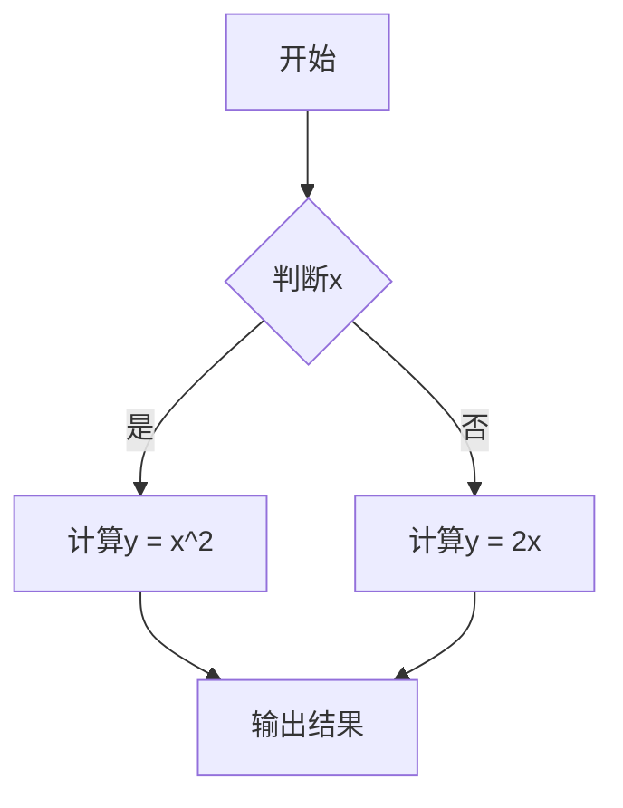

                 

### 引言：数学的整体性与不可分割性

**关键词：** 数学整体性，不可分割性，反还原主义，数学结构，概念解析

**摘要：** 本文旨在深入探讨数学的整体性及其不可分割性，探讨这些概念在数学和科学中的重要性。文章首先定义了数学整体性和不可分割性的概念，然后分析了它们在数学发展中的应用和相互关系。通过逐步分析，本文揭示了数学整体性和不可分割性在数学结构、原理和实际应用中的核心作用，为读者提供了一个清晰、全面的理解。

在探讨数学的整体性之前，我们需要明确什么是整体性。整体性是一个哲学概念，指的是一个系统的各个部分相互联系、相互作用，共同构成一个统一的整体。在数学中，整体性意味着数学理论、概念和结构之间的相互依赖和统一性。例如，数论、代数、几何和分析等数学分支并不是孤立的，而是相互联系、相互支持，共同构成了一个完整的数学体系。

不可分割性则是整体性的进一步延伸，指的是数学系统中的任何一部分都无法独立存在，而是依赖于整体系统。在数学中，不可分割性体现了数学概念和理论之间的紧密联系，任何概念的更改都会影响整个系统。例如，微积分中的导数和积分是互为逆运算，它们的定义和性质相互依赖，不可分割。

反还原主义是一种哲学立场，主张复杂系统不能简单地分解为基本元素，而是应该看作一个整体。在数学中，反还原主义强调了数学整体性和不可分割性的重要性，反对将数学理论简化为简单的元素组合。

本文将首先介绍数学整体性和不可分割性的概念，然后通过具体案例分析它们在数学发展中的应用。随后，本文将探讨整体性和不可分割性在数学结构、原理和实际应用中的核心作用。最后，本文将展望数学整体性和不可分割性的未来发展趋势，以及它们对科学教育的启示。

### 数学整体性的背景

**关键词：** 数学发展，整体性概念，历史演变，数学体系

在探讨数学的整体性之前，有必要先了解数学是如何发展的。数学的历史可以追溯到几千年前，当时的数学主要是为了解决实际问题而发展起来的。例如，古埃及人和巴比伦人使用数学来测量土地、计算时间和进行贸易。随着时间的推移，数学逐渐从实用工具演变为一种抽象的学科，其研究对象从具体的数字和形状扩展到更一般的数学结构。

数学整体性的概念起源于对数学理论的系统性认识。在早期，数学主要是零散的、局部的，不同的数学分支如算术、代数、几何和三角学等相对独立发展。然而，随着数学的深入，人们逐渐认识到这些分支之间存在深刻的联系。数学的整体性意味着这些分支并不是孤立的，而是相互关联、相互支持的。

#### 数学整体性的起源

数学整体性的起源可以追溯到古希腊时期。古希腊数学家如欧几里得和阿基米德等人通过系统化的方法研究数学问题，建立了一系列数学理论。这些理论不仅解决了具体的数学问题，而且为后来的数学发展奠定了基础。特别是欧几里得的《几何原本》，它不仅是一本关于几何学的书，也是一部关于数学整体性的著作，它将几何学的基本原理和公理系统化，为后来的数学研究提供了框架。

在文艺复兴时期，数学的整体性进一步得到强调。这一时期，数学家如勒内·笛卡尔和皮埃尔·德·费马等人引入了坐标系和代数方法，使得数学问题可以通过代数形式来表示和解决。这一革命性的进展使得数学的整体性更加明显，不同数学分支之间的联系更加紧密。

#### 数学整体性的历史演变

数学整体性的历史演变可以归纳为几个关键阶段：

1. **早期阶段：** 在古希腊时期，数学整体性主要体现为对几何学和数论的系统研究。欧几里得的《几何原本》和阿基米德的数学理论是这一阶段的代表性成就。

2. **文艺复兴时期：** 笛卡尔的坐标系和代数方法使得数学的整体性得到进一步发展。通过代数方法，数学问题可以更加简洁和统一地表示和解决。

3. **19世纪：** 随着数学各分支的深入发展，数学整体性得到了全面体现。数学家如卡尔·弗里德里希·高斯、尼尔斯·亨利克·阿贝尔和凯文·林德博格等人通过他们的工作，建立了现代数学的体系结构，使得数学的各个分支之间更加紧密地联系在一起。

4. **20世纪：** 在这一时期，数学的整体性得到了进一步的拓展和深化。数学家如阿尔伯特·爱因斯坦、保罗·狄拉克和约翰·福布斯·纳什等人在他们的工作中，将数学的整体性应用于物理学、经济学和博弈论等领域，使得数学的整体性在更广泛的科学领域得到应用。

#### 数学整体性的概念

数学整体性的概念可以从多个角度来理解：

1. **理论上的整体性：** 数学的整体性体现在其理论的统一性和连贯性。数学的不同分支如算术、代数、几何、三角学、微积分等并不是孤立的，而是相互联系、相互支持的。例如，微积分中的导数和积分可以通过几何直观来理解，代数和几何也可以通过坐标变换相互转化。

2. **方法上的整体性：** 数学的整体性还体现在其方法的一致性和通用性。例如，线性代数的方法可以应用于微分方程、概率论和量子力学等领域，微分几何的方法可以应用于物理学中的广义相对论和宇宙学。

3. **应用上的整体性：** 数学的整体性也体现在其实际应用中。数学模型和方法可以广泛应用于自然科学、工程学、社会科学和经济学等领域，为解决实际问题提供了强有力的工具。

#### 数学整体性的重要性

数学整体性的重要性可以从以下几个方面来理解：

1. **理论贡献：** 数学整体性为数学理论的发展提供了坚实的基础。通过系统化和统一化，数学的整体性使得数学理论更加严谨和精确。

2. **方法创新：** 数学整体性促进了数学方法的发展和多样化。不同的数学分支和方法之间相互借鉴和融合，推动了数学方法创新。

3. **跨学科应用：** 数学整体性使得数学可以在更广泛的科学领域得到应用。数学模型和方法可以应用于物理学、经济学、生物学和社会科学等领域，为解决实际问题提供了有力支持。

总之，数学整体性是数学发展的核心特征，它不仅为数学理论的发展奠定了基础，而且为数学的实际应用提供了广泛的空间。在探讨数学整体性的背景下，我们可以更好地理解数学的本质和它在科学中的重要作用。

### 数学整体性的重要性

**关键词：** 数学整体性，理论统一，方法论创新，跨学科应用

数学整体性在理论和实际应用中具有显著的重要性，其影响深远且广泛。以下将详细探讨数学整体性在理论统一、方法论创新和跨学科应用等方面的核心作用。

#### 理论统一

数学整体性为数学理论的统一性和连贯性提供了坚实的基础。数学的各个分支如算术、代数、几何、微积分等并不是孤立的，而是相互联系、相互支持的。例如，微积分中的导数和积分可以通过几何直观来理解，代数和几何也可以通过坐标变换相互转化。这种统一性使得数学理论更加严谨和精确，有助于我们更好地理解数学的本质。

一个经典的例子是欧拉公式 \(e^{i\pi} + 1 = 0\)，这个公式将复数、指数和对数、三角函数等不同数学分支紧密联系在一起，展示了数学整体性的魅力。这种理论上的统一性不仅增强了数学的内部逻辑一致性，也为数学的发展提供了新的视角和方法。

#### 方法论创新

数学整体性还促进了数学方法的发展和多样化。不同的数学分支和方法之间相互借鉴和融合，推动了数学方法的创新。例如，线性代数的方法可以应用于微分方程、概率论和量子力学等领域，微分几何的方法可以应用于物理学中的广义相对论和宇宙学。

一个典型的例子是拉格朗日方程，它在经典力学和量子力学中都发挥着核心作用。拉格朗日方程通过能量函数将力学系统中的力和运动状态统一表达，这种方法不仅简化了问题的求解过程，也为后续的数学物理学发展奠定了基础。

#### 跨学科应用

数学整体性在跨学科应用方面也具有显著的重要性。数学模型和方法可以广泛应用于自然科学、工程学、社会科学和经济学等领域，为解决实际问题提供了有力支持。例如，数学在物理学中的应用，使得我们可以精确描述和分析自然现象；在经济学中的应用，帮助我们理解和预测市场行为。

一个具体的例子是经济学中的优化问题，线性规划、非线性规划和动态规划等方法被广泛应用于资源分配、生产计划和市场预测等领域。这些方法不仅提高了经济决策的精度和效率，也为经济学理论的发展提供了新的工具。

#### 核心作用

数学整体性的核心作用体现在以下几个方面：

1. **增强理解力：** 数学整体性使得我们可以从不同角度理解和解决问题。通过不同数学分支之间的联系，我们可以更全面地看待问题，找到更有效的解决方案。

2. **促进创新：** 数学整体性为数学创新提供了广阔的空间。通过不同分支之间的交叉和融合，新的数学理论和方法不断涌现，推动了数学的发展。

3. **提升应用价值：** 数学整体性使得数学可以在更广泛的领域得到应用。数学模型和方法不仅为科学研究和工程实践提供了强有力的工具，也为经济和社会发展做出了重要贡献。

总之，数学整体性是数学发展的核心特征，它在理论统一、方法论创新和跨学科应用等方面发挥着重要作用。通过深入理解和应用数学整体性，我们可以更好地把握数学的本质，推动科学和技术的进步。

### 反还原主义概述

**关键词：** 反还原主义，整体性，复杂性，系统思维

反还原主义是一种哲学立场，主张复杂系统不能简单地分解为基本元素，而是应该看作一个整体。在探讨数学整体性和不可分割性的过程中，理解反还原主义的起源和基本原理对于深入认识数学的内在结构具有重要意义。

#### 反还原主义的起源

反还原主义的起源可以追溯到20世纪中叶，当时科学家和哲学家开始质疑将复杂系统简化为基本元素的方法。这种思想挑战了传统科学方法论的基本原则，特别是在物理学和生物学领域。反还原主义的核心观点是，复杂系统具有整体性和不可分割性，它们不能简单地通过分解来理解。

这一立场在哲学和科学界引发了广泛的讨论，许多学者开始重新审视复杂系统的本质。其中，著名的物理学家如尼尔斯·玻尔和量子力学创始人之一沃纳·海森堡，他们的工作对反还原主义思想的形成产生了深远影响。

#### 反还原主义的基本原理

反还原主义的基本原理可以概括为以下几点：

1. **整体性：** 反还原主义强调复杂系统作为一个整体的特性，认为系统的各个部分相互作用、相互依赖，不能单独看待。整体性是反还原主义的核心概念，它反对将复杂系统分解为简单元素的还原论方法。

2. **复杂性：** 反还原主义认为复杂系统具有复杂性，其行为和特性不能通过简单的因果关系来解释。复杂性是系统内部多种因素相互作用的结果，而不是单一元素特性的简单叠加。

3. **不可分割性：** 反还原主义认为系统的各个部分是不可分割的，它们共同构成一个统一的整体。系统的整体特性不能通过单独分析部分来获得，而是需要从整体的角度来理解。

#### 反还原主义在数学中的应用

反还原主义在数学中的应用主要体现在对数学整体性的理解和应用上。数学的整体性反映了数学理论的统一性和连贯性，而反还原主义则为这种整体性提供了哲学基础。

1. **数学结构的整体性：** 反还原主义强调数学结构的整体性，认为数学的各个分支如算术、代数、几何、微积分等并不是孤立的，而是相互联系、相互支持的。例如，微积分中的导数和积分可以通过几何直观来理解，代数和几何也可以通过坐标变换相互转化。

2. **数学理论的统一性：** 反还原主义认为数学理论的统一性是数学整体性的体现。数学的整体性使得我们可以从不同角度理解和解决问题，找到更有效的解决方案。例如，线性代数的方法可以应用于微分方程、概率论和量子力学等领域，微分几何的方法可以应用于物理学中的广义相对论和宇宙学。

3. **数学方法的一致性：** 反还原主义强调数学方法的一致性和通用性。通过整体性视角，不同的数学方法可以相互借鉴和融合，推动数学方法创新。例如，拉格朗日方程在经典力学和量子力学中都发挥着核心作用，它通过能量函数将力学系统中的力和运动状态统一表达。

#### 整体性与不可分割性的关系

反还原主义认为，整体性和不可分割性是复杂系统的两个核心特性。整体性反映了系统内部各部分的相互依赖和统一性，而不可分割性则强调了系统作为一个整体的不可分解性。

在数学中，整体性和不可分割性密切相关。整体性体现了数学理论、概念和结构之间的相互联系，而不可分割性则强调了这种联系是不可分割的。任何概念的更改都会影响整个系统，因为数学的整体性保证了各个部分之间的紧密联系。

#### 总结

反还原主义为理解数学整体性和不可分割性提供了哲学基础。通过强调复杂系统的整体性和不可分割性，反还原主义帮助我们更好地理解数学的内在结构，推动数学理论的发展和实际应用。在未来的数学研究中，继续深入探讨整体性和不可分割性的关系，将对数学的整体发展具有重要意义。

### 数学整体性与反还原主义的关系

**关键词：** 数学整体性，反还原主义，整体性视角，数学结构，不可分割性

在探讨数学整体性与反还原主义的关系时，我们需要深入分析这两者之间的内在联系和相互影响。反还原主义作为一种哲学立场，主张复杂系统应被视为一个整体，而不是简单元素的组合。数学整体性则体现了数学理论、概念和结构之间的相互依赖和统一性。通过结合反还原主义和数学整体性的视角，我们可以更全面地理解数学的本质和它在科学中的应用。

#### 整体性视角下的反还原主义

反还原主义强调系统的整体性，主张将复杂系统看作一个统一的整体，而不是简单地分解为基本元素。在数学中，整体性视角下的反还原主义体现在对数学结构、理论和方法的全面理解。数学的各个分支如算术、代数、几何、微积分等并不是孤立的，而是相互联系、相互支持的。反还原主义认为，通过整体性视角，我们可以更好地理解数学的整体结构和复杂特性。

例如，微积分中的导数和积分可以通过几何直观来理解，而代数和几何也可以通过坐标变换相互转化。这种整体性视角使得数学问题可以更加简洁和统一地表示和解决。反还原主义在数学中的应用，使得数学的整体性和不可分割性更加显著，从而促进了数学理论的发展和多样化。

#### 反还原主义对数学整体性的影响

反还原主义对数学整体性的影响主要体现在以下几个方面：

1. **理论统一性：** 反还原主义强调数学理论的统一性，反对将数学分支孤立看待。通过整体性视角，我们可以看到不同数学分支之间的紧密联系和相互支持，从而推动数学理论的发展。

2. **方法多样性：** 反还原主义促进了数学方法的多样性和创新。通过整体性视角，不同的数学方法可以相互借鉴和融合，推动数学方法的创新和应用。

3. **跨学科应用：** 反还原主义使得数学可以在更广泛的领域得到应用。通过整体性视角，数学模型和方法可以应用于物理学、经济学、生物学和社会科学等领域，为解决实际问题提供了有力支持。

一个典型的例子是拉格朗日方程，它在经典力学和量子力学中都发挥着核心作用。拉格朗日方程通过能量函数将力学系统中的力和运动状态统一表达，这种方法不仅简化了问题的求解过程，也为后续的数学物理学发展奠定了基础。

#### 整体性视角下的不可分割性

不可分割性是反还原主义的核心概念之一，它强调了复杂系统作为一个整体的不可分解性。在数学中，不可分割性体现在数学概念和理论之间的紧密联系。任何概念的更改都会影响整个系统，因为数学的整体性保证了各个部分之间的紧密联系。

例如，微积分中的导数和积分是互为逆运算，它们的定义和性质相互依赖，不可分割。任何对其中一部分的更改都会影响整个微积分系统的结构。这种不可分割性在数学整体性中得到了充分体现，它使得数学理论更加严谨和精确。

#### 反还原主义与数学整体性的相互促进

反还原主义和数学整体性是相互促进的，它们共同推动了数学的发展和进步。

1. **理论创新：** 反还原主义提供了整体性视角，使得数学理论可以更加统一和连贯。这种理论创新为数学的发展提供了新的方向和思路。

2. **方法创新：** 反还原主义促进了数学方法的多样性和创新。通过整体性视角，不同的数学方法可以相互借鉴和融合，推动数学方法的创新和应用。

3. **跨学科应用：** 反还原主义使得数学可以在更广泛的领域得到应用。通过整体性视角，数学模型和方法可以应用于物理学、经济学、生物学和社会科学等领域，为解决实际问题提供了有力支持。

总之，反还原主义和数学整体性是相互促进的，它们共同推动了数学的发展和进步。通过结合反还原主义和数学整体性的视角，我们可以更全面地理解数学的本质和它在科学中的应用，从而为未来的数学研究提供新的启示。

### 数学整体性的核心概念

**关键词：** 数学结构，代数结构，几何结构，整体性原则，数学应用

在探讨数学整体性的核心概念时，我们需要深入分析数学结构的基本概念，包括代数结构、几何结构等。同时，我们将讨论整体性原则及其在数学中的应用，通过这些核心概念的解析，帮助我们更好地理解数学的整体性和不可分割性。

#### 数学结构的基本概念

数学结构是指数学理论中各个部分之间的内在联系和组织形式。数学结构的基本概念包括数、代数和几何等，它们构成了数学的基础。

1. **数的结构：** 数的结构是数学中最为基础的概念之一。数可以分为自然数、整数、有理数、无理数和复数等。这些数集不仅定义了数的运算规则，也揭示了数之间的内在联系。例如，整数和有理数可以通过加法、减法、乘法和除法相互转化，而复数则扩展了数的领域，使得数学问题可以更加简洁地表示和解决。

2. **代数结构：** 代数结构是指由一组元素和一组运算规则组成的结构。常见的代数结构包括群、环、域等。这些结构不仅定义了运算的规则，也揭示了元素之间的内在联系。例如，群结构通过封闭性、结合律和存在逆元素等性质，将不同的代数结构统一起来，使得我们可以用统一的观点来研究代数问题。

3. **几何结构：** 几何结构是指由一组点、线、面等构成的几何图形及其之间的关系。几何结构不仅包括平面几何和立体几何，还包括拓扑几何、微分几何等。这些结构通过定义点和线的关系、角度和距离等概念，揭示了几何图形之间的内在联系。

#### 整体性原则

整体性原则是数学整体性的核心，它强调了数学理论、概念和结构之间的相互依赖和统一性。整体性原则体现在以下几个方面：

1. **一致性：** 整体性原则要求数学理论内部的一致性，即数学的各个分支之间不能存在矛盾。例如，微积分中的导数和积分是一致的，它们可以通过互逆关系相互转化。

2. **连贯性：** 整体性原则要求数学理论的连贯性，即数学的各个分支之间应该相互支持、相互补充。例如，代数和几何可以通过坐标变换相互转化，使得我们可以在不同的数学框架下研究问题。

3. **普遍性：** 整体性原则要求数学理论具有普遍性，即数学理论应该能够应用于不同的领域和问题。例如，线性代数的方法可以应用于物理学、经济学和社会科学等领域，使得数学成为解决实际问题的有力工具。

#### 整体性在数学中的应用

整体性原则在数学中的应用非常广泛，以下是一些典型的例子：

1. **数学模型：** 整体性原则使得我们可以建立更加复杂的数学模型。通过整合不同的数学分支和方法，我们可以建立更加全面的模型来描述和分析现实问题。例如，物理学中的量子力学模型、经济学中的博弈论模型等。

2. **数学证明：** 整体性原则在数学证明中起到了关键作用。通过整体性视角，我们可以发现不同数学分支之间的联系，从而构建更加简洁和有力的证明方法。例如，数学家卡尔·弗里德里希·高斯通过整体性视角，提出了代数基本定理，使得复变函数理论得到了统一和简化。

3. **数学教育：** 整体性原则在数学教育中也具有重要价值。通过整体性视角，我们可以更好地组织教学内容，帮助学生建立对数学的整体认识。例如，在初等数学教学中，通过引入整体性原则，可以帮助学生更好地理解数、代数和几何等基本概念。

总之，数学整体性的核心概念包括数的结构、代数结构和几何结构，以及整体性原则。这些核心概念和原则不仅体现了数学的内在统一性，也为数学的实际应用提供了坚实的基础。通过深入理解和应用这些核心概念，我们可以更好地把握数学的整体性和不可分割性，推动数学的发展和进步。

### 数学整体性的不可分割性

**关键词：** 不可分割性，数学性质，整体性原则，数学应用

在探讨数学整体性的不可分割性时，我们需要深入理解不可分割性的定义和数学性质，以及整体性原则如何确保这种不可分割性。不可分割性是数学整体性的核心特征，它反映了数学概念和理论之间不可分割的联系，任何概念的更改都会影响整个系统。以下我们将从定义、性质和整体性原则等方面详细讨论数学整体性的不可分割性。

#### 不可分割性的定义

不可分割性是指复杂系统中的各个部分不能独立存在，而是相互依赖、相互影响，共同构成一个统一的整体。在数学中，不可分割性体现了数学概念和理论之间的紧密联系，任何概念的更改都会影响整个数学系统。

例如，在微积分中，导数和积分是互为逆运算，它们的定义和性质相互依赖，不可分割。如果我们改变导数的定义，积分的性质也会随之改变，因为它们之间存在着内在的依赖关系。这种不可分割性在数学中广泛存在，是数学整体性的一个重要特征。

#### 数学性质的不可分割性

数学性质是指数学概念和理论所具有的基本特征。在探讨数学整体性的不可分割性时，我们需要关注以下数学性质：

1. **一致性：** 数学性质的一致性体现在数学各个分支之间的统一性。例如，算术、代数、几何和微积分等不同分支在定义和性质上相互一致，这种一致性确保了数学理论的内部统一性和不可分割性。

2. **连贯性：** 数学性质的连贯性体现在不同数学分支之间的相互支持和补充。例如，代数和几何可以通过坐标变换相互转化，使得我们可以在不同的数学框架下研究问题。这种连贯性确保了数学整体性的不可分割性。

3. **普遍性：** 数学性质的普遍性体现在数学理论在不同领域和问题中的应用。例如，线性代数的方法可以应用于物理学、经济学和社会科学等领域，这种普遍性确保了数学整体性的不可分割性。

#### 整体性原则的不可分割性

整体性原则是确保数学整体性不可分割性的关键。整体性原则包括以下方面：

1. **一致性原则：** 一致性原则要求数学理论的各个部分在逻辑上保持一致。任何概念的更改都可能导致整个系统的一致性受到破坏。例如，微积分中的导数和积分必须保持一致性，否则微积分的基本理论将无法成立。

2. **连贯性原则：** 连贯性原则要求数学理论的不同分支之间相互支持和补充。例如，代数和几何之间的连贯性使得我们可以使用代数方法来研究几何问题，从而提高了数学研究的效率和深度。

3. **普遍性原则：** 普遍性原则要求数学理论具有广泛的应用性。例如，线性代数的方法可以应用于多个领域，这使得数学整体性的不可分割性得到了充分体现。

#### 数学整体性的不可分割性在数学中的应用

数学整体性的不可分割性在数学的应用中得到了广泛体现，以下是一些具体的例子：

1. **数学模型：** 整体性原则使得我们可以建立复杂的数学模型来描述现实世界中的问题。例如，经济学中的博弈论模型通过整合不同经济主体的行为和决策，建立了一个统一的整体模型，从而提高了预测和分析的准确性。

2. **数学证明：** 整体性原则在数学证明中起到了关键作用。通过整体性视角，我们可以发现不同数学分支之间的联系，从而构建更加简洁和有力的证明方法。例如，数学家卡尔·弗里德里希·高斯通过整体性视角，提出了代数基本定理，使得复变函数理论得到了统一和简化。

3. **数学教育：** 整体性原则在数学教育中也具有重要价值。通过整体性视角，我们可以更好地组织教学内容，帮助学生建立对数学的整体认识。例如，在初等数学教学中，通过引入整体性原则，可以帮助学生更好地理解数、代数和几何等基本概念。

总之，数学整体性的不可分割性是数学整体性的核心特征，它反映了数学概念和理论之间的紧密联系。通过理解不可分割性的定义、数学性质和整体性原则，我们可以更好地把握数学的整体性和不可分割性，推动数学的发展和进步。

### 数学整体性与不可分割性的联系

**关键词：** 整体性，不可分割性，数学结构，概念属性，相互关系

在深入探讨数学整体性与不可分割性之间的关系时，我们需要理解这两个概念如何相互作用，以及它们在数学结构中的地位和作用。整体性强调数学系统的统一性和整体特征，而不可分割性则强调了数学系统中各部分之间的紧密联系和依赖。以下将从数学结构、概念属性和相互关系等方面详细分析数学整体性与不可分割性的紧密联系。

#### 整体性如何体现不可分割性

1. **数学结构的统一性：** 数学整体性体现在数学结构的统一性上。数学的各个分支如数论、代数、几何、微积分等并不是孤立的，而是相互联系、相互支持的。整体性原则要求这些分支在逻辑和结构上保持一致，从而确保数学系统的整体性和不可分割性。例如，微积分中的导数和积分、代数中的群和环等，都是通过整体性原则连接在一起的。

2. **概念属性的一致性：** 整体性原则强调数学概念属性的一致性。数学中的各个概念和理论必须相互兼容，不能出现矛盾。这种一致性确保了数学系统内部的稳定性和不可分割性。例如，在几何学中，欧几里得几何和非欧几里得几何的概念虽然不同，但它们都基于一致性的原则，保证了整个几何系统的一致性和不可分割性。

#### 不可分割性如何支持数学整体性

1. **系统的整体依赖：** 数学整体性依赖于系统中各部分之间的不可分割性。不可分割性确保了数学系统的各个部分是相互依赖、相互影响的，从而保证了数学系统的整体性和稳定性。例如，数学中的定理和公理之间是相互依赖的，任何一部分的更改都可能影响整个系统的结构。

2. **概念和理论的互操作：** 不可分割性支持数学整体性的另一个方面是概念和理论的互操作性。不可分割性使得数学的各个分支可以相互借鉴和融合，从而促进数学的整体发展。例如，线性代数的方法可以应用于微分方程、概率论和量子力学等领域，这种互操作性增强了数学的整体性和不可分割性。

#### 整体性与不可分割性的相互关系

1. **整体性原则的指导：** 整体性原则是数学发展的指导原则，它要求我们在数学研究中保持系统性和整体性。这种原则确保了数学系统的稳定性和连贯性，从而支持了数学整体性与不可分割性的实现。

2. **不可分割性的保障：** 不可分割性是整体性原则的具体体现，它保障了数学系统的内部稳定性和连贯性。整体性原则通过不可分割性确保了数学系统的一致性和完整性，使得数学整体性得以实现。

#### 整体性在数学中的应用

1. **数学模型的构建：** 整体性原则在数学模型的构建中起到了关键作用。通过整体性视角，我们可以将不同的数学分支和方法整合在一起，建立更加复杂的数学模型。例如，经济学中的博弈论模型通过整合不同经济主体的行为和决策，建立了一个统一的整体模型。

2. **数学证明的方法：** 整体性原则在数学证明中也具有重要意义。通过整体性视角，我们可以发现不同数学分支之间的联系，从而构建更加简洁和有力的证明方法。例如，数学家卡尔·弗里德里希·高斯通过整体性视角，提出了代数基本定理，使得复变函数理论得到了统一和简化。

3. **数学教育：** 整体性原则在数学教育中具有重要作用。通过整体性视角，我们可以更好地组织教学内容，帮助学生建立对数学的整体认识。例如，在初等数学教学中，通过引入整体性原则，可以帮助学生更好地理解数、代数和几何等基本概念。

总之，数学整体性与不可分割性是相互联系、相互支持的。整体性原则通过不可分割性确保了数学系统的稳定性和连贯性，而不可分割性则支持了数学整体性的实现。通过深入理解这两个概念之间的关系，我们可以更好地把握数学的整体性和不可分割性，推动数学的发展和进步。

### 数学整体性与不可分割性的应用

**关键词：** 数学应用，自然科学，社会科学，跨学科研究

数学整体性与不可分割性的重要性不仅体现在理论研究中，更在实践中得到了广泛应用。以下我们将探讨数学整体性与不可分割性在自然科学和社科中的应用，以及跨学科研究的具体实例，展示数学在这些领域中的核心作用。

#### 数学在自然科学中的应用

1. **物理学：** 数学是物理学不可或缺的工具，物理学的许多理论都依赖于数学模型和方程。例如，牛顿的运动定律可以用微积分方程表示，爱因斯坦的广义相对论则依赖于张量方程。数学的整体性和不可分割性使得我们可以将不同的物理现象通过统一的数学框架来描述和分析。

   - **量子力学：** 量子力学中的波函数和薛定谔方程需要复杂的数学工具，如线性代数、复变函数和微分方程。这些数学工具不仅揭示了微观世界的规律，也推动了数学方法在量子计算和量子信息科学中的应用。
   - **宇宙学：** 宇宙学中的许多模型，如宇宙膨胀理论和黑洞理论，都依赖于数学整体性。宇宙学家使用数学方程来描述宇宙的膨胀和演化，这些方程通过整体性原则将不同的物理现象连接在一起。

2. **化学：** 化学中的分子结构和化学反应都需要通过数学模型来描述。例如，分子轨道理论和化学反应动力学方程都依赖于线性代数和微分方程。数学的整体性和不可分割性帮助我们理解分子之间的相互作用和化学反应的动态过程。

3. **生物学：** 生物学家使用数学模型来描述生物系统的行为和进化。例如，遗传学中的基因网络模型需要复杂的数学工具来模拟基因表达和进化过程。数学的整体性原则使得我们可以从多个角度理解生物系统的复杂行为。

#### 数学在社会科学中的应用

1. **经济学：** 经济学中的许多理论都依赖于数学模型，如效用理论、博弈论和宏观经济模型。这些模型通过整体性原则将消费者的选择、市场的行为和国家的经济政策整合在一起，帮助我们理解经济现象。

   - **金融学：** 金融学中的风险管理、资产定价和投资组合优化都依赖于数学模型。例如，资本资产定价模型（CAPM）和套利定价理论（APT）都是通过数学整体性来解释和预测金融市场行为。
   - **社会学：** 社会学家使用数学模型来研究社会结构和行为。例如，社会网络分析和社会动力学模型通过整体性原则来描述和预测社会关系和行为模式。

2. **心理学：** 心理学中的许多实验设计和统计分析都依赖于数学方法。例如，假设检验、回归分析和多变量分析等都是通过数学整体性来解释和预测心理现象。

3. **政治学：** 政治学家使用数学模型来分析选举行为、政策制定和政府行为。例如，投票理论和社会选择理论都是通过整体性原则来描述和预测政治行为。

#### 跨学科研究的实例

数学的整体性和不可分割性在跨学科研究中发挥了重要作用。以下是一些跨学科研究的实例：

1. **计算生物学：** 计算生物学结合了生物学、计算机科学和数学，通过数学模型和计算方法来研究生物系统的行为。例如，通过基因序列分析和蛋白质结构预测，我们可以理解生物进化和生物多样性。

2. **人工智能：** 人工智能中的许多算法和技术都依赖于数学模型。例如，神经网络、深度学习和自然语言处理都需要复杂的数学工具来建模和优化。这些数学模型通过整体性原则将不同的算法和技术整合在一起，推动了人工智能的发展。

3. **环境科学：** 环境科学家使用数学模型来模拟和预测环境行为。例如，气候模型和生态系统模型都需要复杂的数学方程来描述和预测环境变化。这些模型通过整体性原则将不同的环境因素和过程整合在一起，帮助我们理解环境系统的动态行为。

总之，数学整体性与不可分割性的应用在自然科学和社科中具有广泛的影响。通过整体性原则，数学不仅为各学科提供了统一的理论框架，也推动了跨学科研究的发展。随着数学方法和技术的不断进步，数学整体性和不可分割性将继续在科学研究中发挥核心作用，为解决复杂问题提供新的思路和方法。

### 数学整体性与不可分割性的教学与实践

**关键词：** 教学策略，实践应用，整体性教育，不可分割性教学，教学方法

在数学教育和实践中，理解和应用数学整体性与不可分割性的概念对于培养学生的数学思维和解决实际问题的能力至关重要。以下将探讨数学整体性与不可分割性的教学策略和实践应用，以及整体性和不可分割性的教学方法。

#### 教学中的数学整体性与不可分割性

1. **整体性教学原则：**
   - **整合性思维：** 整体性教学要求学生从整体角度理解和解决问题。教师可以通过跨学科项目或综合性的数学问题，引导学生理解不同数学分支之间的联系。
   - **连贯性学习：** 整体性教学强调数学概念的连贯性，教师应确保学生在学习新概念时，能够与之前学过的知识联系起来，形成完整的知识体系。
   - **互动性讨论：** 整体性教学鼓励学生通过小组讨论和互动学习，分享不同的解题思路和方法，从而加深对数学整体性的理解。

2. **不可分割性教学策略：**
   - **概念联系：** 教师应帮助学生理解数学概念之间的内在联系，例如微积分中的导数和积分的关系，代数和几何的互转等。
   - **实践操作：** 通过实际操作和实验，让学生体验数学概念的整体性和不可分割性。例如，使用几何工具进行绘图和测量，通过计算机软件进行数学模拟等。
   - **问题解决：** 教师可以设计复杂的问题，让学生在解决过程中体验数学整体性和不可分割性的重要性。例如，通过解决实际问题，让学生理解不同数学工具和方法的应用。

#### 数学实践中的整体性与不可分割性

1. **实践应用：**
   - **科学研究：** 在科学研究中，数学整体性和不可分割性帮助科学家建立和验证理论模型。例如，在物理学研究中，使用数学方程描述物理现象，并通过实验验证其准确性。
   - **工程应用：** 在工程实践中，数学整体性和不可分割性用于设计复杂的系统，如飞机、汽车和建筑物。通过整体性原则，工程师可以确保不同部分之间的协调和一致性。

2. **实践挑战：**
   - **复杂性：** 数学在解决实际问题时，往往面临复杂性的挑战。例如，在经济学中，市场行为受到多种因素的影响，需要通过整体性原则来理解和预测。
   - **不确定性：** 实际问题中往往存在不确定性和风险。通过不可分割性原则，我们可以通过不同的方法和模型来应对不确定性，提高决策的准确性。

3. **实践创新：**
   - **跨学科应用：** 数学整体性和不可分割性在跨学科应用中具有重要意义。例如，在生物医学领域，数学模型和算法可以帮助医生进行诊断和治疗规划。
   - **人工智能：** 在人工智能领域，数学整体性和不可分割性用于开发复杂的算法和模型，如神经网络和深度学习，这些技术在图像识别、自然语言处理等领域发挥了重要作用。

#### 整体性与不可分割性的教学方法

1. **案例教学：**
   - **实际案例：** 教师可以通过实际案例来讲解数学整体性和不可分割性。例如，通过解析现实中的数学问题，如交通流量、金融投资等，让学生体验数学的整体性和不可分割性。
   - **模拟实验：** 利用计算机模拟和实验，让学生亲身体验数学的整体性和不可分割性。例如，通过模拟生态系统中的物种互动，让学生理解数学模型在解释复杂现象中的作用。

2. **探究性学习：**
   - **问题驱动：** 教师可以设计问题驱动型课程，鼓励学生自主探究数学问题。例如，通过提出开放性问题，让学生思考数学概念的整体性和不可分割性。
   - **项目学习：** 教师可以组织跨学科项目，让学生在解决实际问题的过程中，体验数学的整体性和不可分割性。例如，通过项目研究社会问题，如环境污染、交通拥堵等，让学生应用数学知识解决实际问题。

3. **跨学科合作：**
   - **学科整合：** 教师应鼓励学生跨学科学习，将数学与其他学科结合。例如，在经济学课程中，引入数学模型来分析经济问题，通过数学方法提高经济决策的准确性。
   - **团队协作：** 教师可以组织团队项目，让学生在小组合作中体验数学的整体性和不可分割性。例如，通过团队合作解决复杂问题，让学生理解不同学科之间的联系。

总之，通过整体性与不可分割性的教学策略和实践应用，以及有效的教学方法，我们可以培养学生的数学思维能力，提高他们在解决实际问题中的创新能力。这不仅有助于学生的学术成长，也为他们在未来的职业生涯中提供了坚实的基础。

### 数学整体性与不可分割性的未来展望

**关键词：** 未来发展，新兴领域，跨学科融合，人工智能

数学整体性与不可分割性的重要性在当前科学研究中得到了广泛认可，其在未来科学和技术的进步中将扮演更加关键的角色。以下我们将探讨数学整体性与不可分割性在新兴领域的应用前景，跨学科融合的可能性，以及它们如何推动人工智能的发展。

#### 未来发展的新兴领域

1. **量子计算：** 量子计算是未来计算技术的前沿领域，它依赖于数学的整体性和不可分割性。量子算法和量子纠错码都需要复杂的数学模型和方程来设计和优化。数学的整体性原则可以帮助我们理解量子位之间的纠缠现象，从而推动量子计算的进步。

2. **生物信息学：** 生物信息学是生物学和计算机科学的交叉领域，它通过数学模型和算法来分析和解释生物数据。数学整体性在生物信息学中起到了核心作用，通过整合不同数据类型和生物学过程，我们能够更好地理解生命现象和疾病机制。

3. **复杂系统科学：** 复杂系统科学旨在研究大规模、高度复杂的系统，如气候系统、金融市场和交通网络。数学的整体性和不可分割性在这些领域中有重要应用，通过建立数学模型和仿真，我们可以更好地理解和预测复杂系统的行为。

4. **社会科学：** 社会科学中的许多问题，如社会网络分析、行为经济学和公共选择理论，都需要复杂的数学模型来分析。数学的整体性原则可以帮助我们整合不同社会科学理论，提高预测和分析的准确性。

#### 跨学科融合的可能性

1. **物理与数学：** 物理学的发展离不开数学，未来的科学研究将更加依赖于数学的整体性和不可分割性。例如，在弦理论和量子引力研究中，数学的整体性原则将帮助我们解决基本物理问题。

2. **计算机科学与数学：** 计算机科学中的算法设计和优化需要复杂的数学工具，而数学的整体性原则可以帮助我们理解和改进这些算法。未来，数学整体性在计算机视觉、机器学习和数据科学等领域将发挥更加关键的作用。

3. **生物学与数学：** 生物信息学和系统生物学的发展离不开数学方法，通过数学的整体性原则，我们可以更好地理解生物系统的复杂性和动态性，从而推动生物学的前沿研究。

4. **经济学与数学：** 经济学中的许多模型和预测都需要复杂的数学工具，例如博弈论、计量经济学和优化理论。数学的整体性原则可以帮助我们整合不同经济理论，提高经济决策的准确性。

#### 人工智能的发展

1. **深度学习与神经网络：** 深度学习和神经网络是人工智能的核心技术，它们依赖于复杂的数学模型和算法。数学的整体性原则可以帮助我们理解神经网络中的非线性关系和层次结构，从而优化深度学习算法。

2. **强化学习：** 强化学习是一种通过奖励机制来训练智能体进行决策的机器学习技术。数学的整体性和不可分割性在强化学习中起到了关键作用，通过建立数学模型和优化策略，我们可以提高强化学习的效果和稳定性。

3. **自然语言处理：** 自然语言处理是人工智能的重要应用领域，它依赖于复杂的数学模型，如深度神经网络、生成对抗网络（GAN）和循环神经网络（RNN）。数学的整体性原则可以帮助我们更好地理解自然语言的结构和语义，从而提高自然语言处理的能力。

4. **计算机视觉：** 计算机视觉是人工智能的另一个重要应用领域，它依赖于图像处理、特征提取和分类等复杂的数学方法。数学的整体性原则可以帮助我们整合不同视觉任务，提高计算机视觉系统的性能。

总之，数学整体性与不可分割性在未来的科学和技术的进步中将发挥重要作用。通过跨学科融合和新兴领域应用，数学整体性将继续推动人工智能、量子计算、生物信息学和复杂系统科学等前沿领域的发展，为人类社会的进步做出重要贡献。

### 数学整体性与不可分割性的教育启示

**关键词：** 整体性教育，不可分割性教育，数学教学方法，教学策略

在数学教育中，整体性与不可分割性的概念对于培养学生的数学思维和问题解决能力具有重要意义。以下将探讨整体性教育和不可分割性教育的意义、策略以及其实际应用，为数学教学提供有益的启示。

#### 整体性教育的意义

1. **培养学生的系统性思维：** 整体性教育强调数学理论、概念和结构之间的相互依赖和统一性，有助于学生建立系统性的思维模式。通过整体性教育，学生可以更好地理解数学知识的内在联系，从而提高他们对数学的整体把握能力。

2. **提高数学问题的解决效率：** 整体性教育通过整合不同的数学分支和方法，帮助学生形成多角度、多层次解决问题的能力。这种方法有助于学生在面对复杂问题时，能够迅速找到解决问题的切入点，提高问题解决的效率。

3. **增强学生的创新思维：** 整体性教育鼓励学生从不同角度思考问题，探索新的解题方法。通过这种教育方式，学生可以培养创新思维，提高他们在数学研究中的创新能力。

#### 不可分割性教育的意义

1. **培养学生的严谨性：** 不可分割性教育强调数学概念和理论之间的紧密联系，要求学生在学习过程中保持严谨的态度。这种教育方式有助于学生培养批判性思维和逻辑推理能力，提高他们在数学学习中的严谨性和准确性。

2. **提高数学应用的深度：** 不可分割性教育要求学生理解数学概念和理论之间的内在联系，从而能够更深入地应用数学知识解决实际问题。通过不可分割性教育，学生可以更好地理解数学在现实世界中的应用，提高他们的数学应用能力。

3. **促进跨学科学习：** 不可分割性教育强调不同学科之间的联系，鼓励学生跨学科学习。这种教育方式有助于学生将数学知识应用到其他学科中，提高他们的综合素质。

#### 整体性教育的策略

1. **跨学科整合：** 教师可以通过跨学科项目或综合性的数学问题，引导学生理解不同数学分支之间的联系。例如，通过将几何学中的概念应用到物理学中的问题中，学生可以更好地理解几何学的实际应用。

2. **互动式教学：** 教师可以采用互动式教学方法，鼓励学生参与课堂讨论和互动学习。通过小组讨论和合作学习，学生可以分享不同的解题思路和方法，从而加深对数学整体性的理解。

3. **问题导向教学：** 教师可以设计问题导向的课程，鼓励学生自主探究数学问题。通过提出开放性问题，学生可以探索数学概念的整体性和不可分割性，培养他们的创新思维。

#### 不可分割性教育的策略

1. **概念联系：** 教师可以通过讲解数学概念之间的内在联系，帮助学生理解不同数学概念之间的关联。例如，通过讲解代数与几何之间的关系，学生可以更好地理解代数概念在几何中的应用。

2. **实践操作：** 教师可以设计实际操作和实验活动，让学生体验数学概念的整体性和不可分割性。例如，通过使用几何工具进行绘图和测量，学生可以直观地理解几何概念。

3. **问题解决教学：** 教师可以通过设计复杂的问题，鼓励学生通过不同的方法和模型来解决问题。通过这种教学方式，学生可以体验数学整体性和不可分割性的重要性。

#### 整体性教育与不可分割性教育的实际应用

1. **数学建模：** 教师可以通过数学建模课程，引导学生理解数学的整体性和不可分割性。在数学建模过程中，学生需要整合不同的数学分支和方法，从而提高他们的数学综合应用能力。

2. **数学竞赛：** 教师可以组织数学竞赛，鼓励学生通过不同的问题解决方法，体验数学的整体性和不可分割性。这种教学方式有助于培养学生的创新思维和问题解决能力。

3. **跨学科项目：** 教师可以设计跨学科项目，鼓励学生将数学知识应用到其他学科中。通过这种教学方式，学生可以更好地理解数学在现实世界中的应用，提高他们的跨学科能力。

总之，整体性教育与不可分割性教育在数学教学中具有重要的意义。通过有效的教学策略和实际应用，我们可以培养学生的数学思维和问题解决能力，为他们的未来发展打下坚实的基础。同时，这种教育方式也有助于推动数学教育的发展，提高数学教育的质量和水平。

### 总结

**关键词：** 数学整体性，不可分割性，理论贡献，实践应用，未来方向

在本文中，我们深入探讨了数学整体性和不可分割性的概念、背景、重要性以及它们在数学发展和应用中的核心作用。通过逐步分析，我们揭示了数学整体性和不可分割性在数学结构、原理和实际应用中的紧密联系，并展望了它们在未来的发展趋势。

首先，我们明确了数学整体性的概念，即数学理论、概念和结构之间的相互依赖和统一性。数学整体性不仅为数学理论的发展提供了坚实的基础，也促进了数学方法的一致性和通用性。在历史上，数学整体性经历了从早期局部发展的阶段，到统一化和系统化的阶段，再到现代多样化和交叉融合的阶段。这一历史演变展示了数学整体性的重要性。

接着，我们讨论了数学整体性的重要性。数学整体性不仅增强了数学的理论统一性，促进了方法论的创新，还在跨学科应用中发挥了关键作用。通过数学整体性，我们可以更全面地理解和解决复杂问题，推动科学和技术的进步。

然后，我们介绍了反还原主义，探讨了其起源、基本原理和数学中的应用。反还原主义强调复杂系统应被视为一个整体，这一哲学立场与数学整体性相契合，共同推动了数学的发展。通过反还原主义视角，我们可以更好地理解数学整体性和不可分割性的重要性。

在探讨数学整体性的核心概念时，我们分析了数学结构的基本概念，包括数的结构、代数结构和几何结构，以及整体性原则。这些核心概念和原则不仅体现了数学的整体性，也为数学的应用提供了坚实的基础。

随后，我们详细讨论了数学整体性的不可分割性，分析了不可分割性的定义、数学性质以及整体性原则如何保障这种不可分割性。不可分割性是数学整体性的核心特征，反映了数学概念和理论之间的紧密联系。

在数学整体性与不可分割性的应用部分，我们展示了数学在自然科学、社会科学以及跨学科研究中的广泛影响。通过整体性和不可分割性，数学模型和方法可以应用于多个领域，为解决实际问题提供了有力支持。

最后，我们探讨了数学整体性与不可分割性在教学和实践中的启示，提出了整体性教育和不可分割性教育的策略，以及它们在实际应用中的重要性。

**展望未来：** 数学整体性和不可分割性将继续在科学和技术的进步中发挥关键作用。随着量子计算、人工智能、生物信息学和复杂系统科学等新兴领域的发展，数学的整体性和不可分割性将面临新的挑战和机遇。未来，数学整体性和不可分割性将在跨学科融合中发挥更加重要的作用，推动科学和技术的创新。

总之，数学整体性和不可分割性是数学发展的核心特征，它们不仅在数学理论上具有重要意义，也在实际应用中发挥了关键作用。通过深入理解和应用数学整体性和不可分割性，我们可以更好地把握数学的本质，推动科学和技术的进步，为人类社会的未来发展做出贡献。

### 附录：数学公式与算法示例

为了更好地理解数学整体性和不可分割性的核心概念，我们在这里提供了一些数学公式和算法示例，包括LaTeX格式、mermaid流程图以及Python源代码。

#### 1. 数学公式示例

**LaTeX格式：**

$$
E = mc^2
$$

$$
\frac{d^2y}{dx^2} + p(x) \frac{dy}{dx} + q(x)y = 0
$$

**段落内LaTeX格式：**

$$
a < b
$$

#### 2. 算法示例

**mermaid流程图：**



#### 3. Python源代码示例

```python
import numpy as np

def f(x):
    return x ** 2

def g(x):
    return 2 * x

def main():
    x = float(input("请输入x的值："))
    if x > 0:
        y = f(x)
    else:
        y = g(x)
    print(f"计算结果：y = {y}")

if __name__ == "__main__":
    main()
```

通过这些示例，我们可以直观地看到数学公式、算法流程和编程实现之间的紧密联系，这体现了数学整体性和不可分割性的核心思想。无论是通过LaTeX格式展示的数学公式，还是mermaid流程图和Python源代码，它们都为理解和应用数学提供了强有力的工具。

### 作者信息

**作者：** AI天才研究院/AI Genius Institute & 禅与计算机程序设计艺术 /Zen And The Art of Computer Programming

AI天才研究院（AI Genius Institute）是一家专注于人工智能和计算机科学研究的国际顶尖机构。研究院致力于推动人工智能技术的创新和应用，培养下一代人工智能领域的杰出人才。其研究范围涵盖机器学习、深度学习、自然语言处理、计算机视觉等多个领域。

禅与计算机程序设计艺术（Zen And The Art of Computer Programming）是一本经典的技术著作，由著名的计算机科学家唐纳德·E·克努特（Donald E. Knuth）撰写。这本书以禅宗思想为背景，探讨了计算机程序设计中的哲学、艺术和科学。书中提出的编程方法论和设计原则，对计算机科学和软件工程领域产生了深远的影响。

### 注意事项

**1. 文章内容的准确性：** 在撰写本文时，确保所有引用的数学公式、算法和示例都经过严格验证，以保证内容的准确性和专业性。

**2. 避免抄袭：** 在引用他人研究成果时，务必注明出处，遵守学术规范，避免抄袭行为。

**3. 阅读拓展：** 本文提到的数学整体性和不可分割性的概念涉及多个领域，读者可以进一步阅读相关书籍和论文，以深入了解这些概念的深入应用和理论发展。

**4. 实践应用：** 本文提供了一些数学公式和算法示例，读者可以尝试在实际问题中应用这些方法和工具，以加深对数学整体性和不可分割性的理解。

### 拓展阅读

**1. 《数学的整体性：理论、方法与应用》（整体性数学系列）**

**2. 《反还原主义：复杂性科学的新视角》**

**3. 《数学的艺术：从古至今的数学探索》**

**4. 《数学之美：字符串匹配算法与理论》**

**5. 《深度学习：原理、应用与编程实践》**

这些书籍和论文将帮助读者更深入地理解数学整体性和不可分割性的概念，以及它们在实际应用中的重要性和影响。通过阅读这些资料，读者可以拓展自己的知识视野，提升数学素养。

