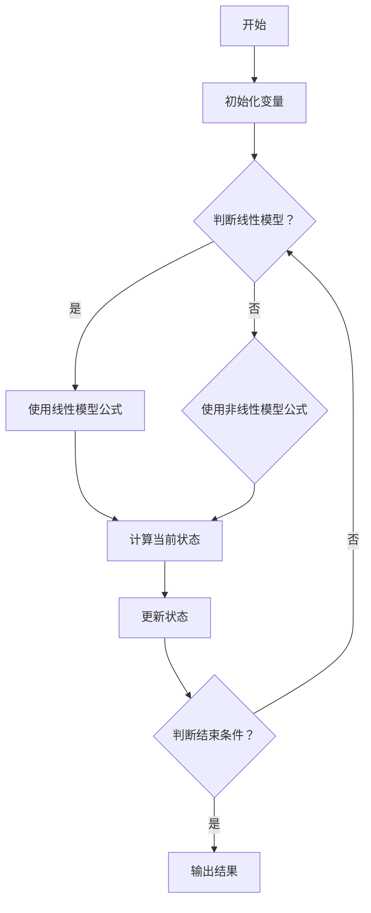
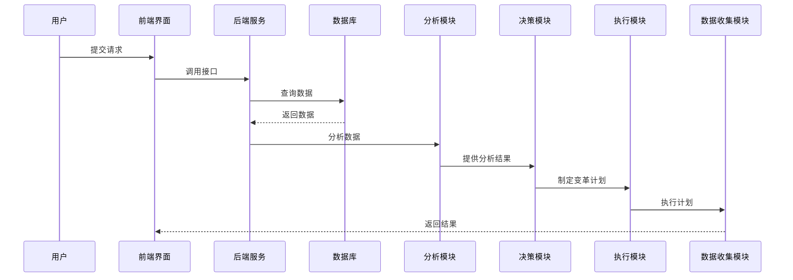
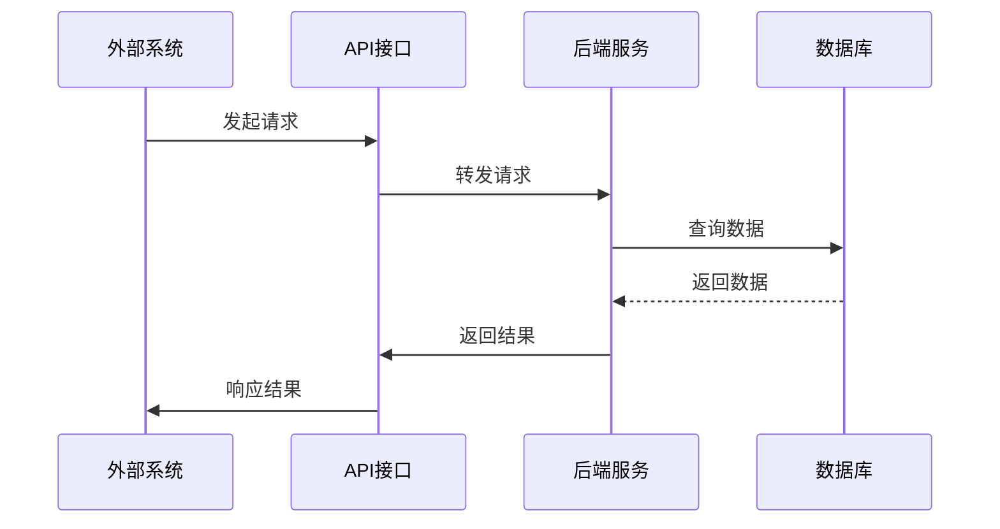
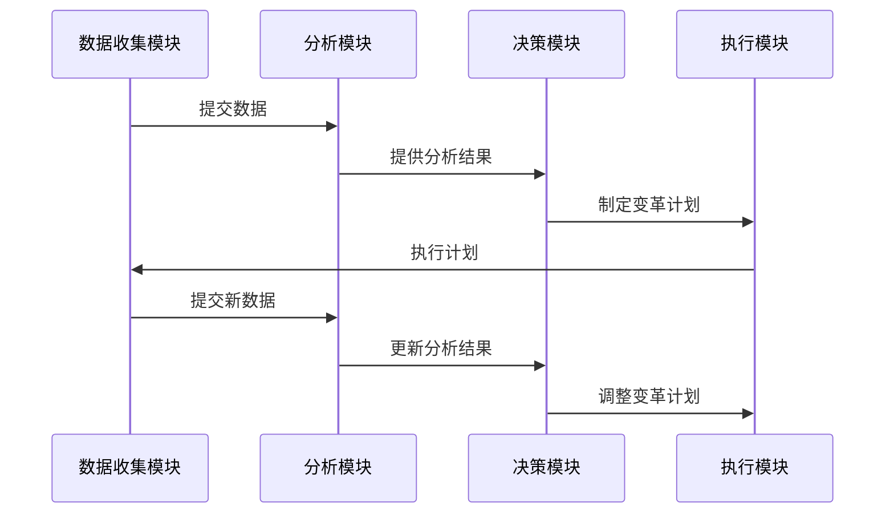

                 

# 数学与变革管理：组织变革的数学描述

> 关键词：组织变革、数学描述、变革管理、算法原理、系统架构设计、项目实战

> 摘要：本文旨在探讨组织变革管理中的数学描述，通过分析变革管理的基本概念和数学模型，结合Python源代码和mermaid流程图，深入讲解组织变革的算法原理。同时，本文还将介绍如何将数学模型应用于系统架构设计，并通过实际项目实战，展示数学描述在组织变革管理中的实际应用。

## 引言

### 1.1 组织变革的背景

在当今快速变化的市场环境中，组织变革已经成为企业管理的重要组成部分。变革管理不仅涉及组织结构的调整，还包括流程优化、文化重塑和人员配置等方面。有效的变革管理能够帮助组织适应外部环境的变化，提高竞争力。

### 1.2 数学描述在变革管理中的应用

数学描述作为一种精确、系统的分析方法，可以在变革管理中发挥重要作用。通过数学模型，可以量化变革过程中各个因素之间的关系，预测变革的结果，为决策提供科学依据。

### 1.3 本书结构安排与目标

本书将分为以下几个部分：

1. **核心概念与联系**：介绍变革管理的基本概念，包括变革的类型、过程、障碍和成功因素。
2. **数学模型与公式**：介绍用于描述组织变革的数学模型，包括线性模型、非线性模型和动态系统模型。
3. **算法原理讲解**：使用mermaid画出算法流程图，并使用Python源代码详细阐述。
4. **系统分析与架构设计**：介绍如何将数学模型应用于组织变革管理，包括系统功能设计、架构设计和接口设计。
5. **项目实战**：通过实际案例展示如何应用数学描述来管理组织变革。
6. **最佳实践与拓展**：总结最佳实践，提出注意事项，并提供拓展阅读建议。

## 核心概念与联系

### 2.1 变革管理的基本概念

变革管理是指组织在面对外部环境变化或内部需求时，采取的一系列战略和管理措施，以实现组织目标的改变和提升。变革管理的基本概念包括：

#### 2.1.1 变革的类型

- **革命性变革**：指对组织结构、流程和文化进行根本性的改变。
- **渐进性变革**：指在组织现有结构和文化的基础上，逐步引入新的变革元素。

#### 2.1.2 变革的过程

变革过程通常包括以下几个阶段：

- **规划阶段**：确定变革的目标、策略和实施计划。
- **执行阶段**：执行变革计划，包括沟通、培训、调整等。
- **监控阶段**：对变革效果进行监控和评估。

#### 2.1.3 变革的障碍与成功因素

变革管理中可能会面临以下障碍：

- **组织惯性**：组织习惯于现有的运作方式，不愿意改变。
- **人员抵触**：员工可能对变革持有抵触情绪，影响变革的执行。

成功因素包括：

- **领导力**：领导者在变革中的角色至关重要，需要具备远见和决心。
- **沟通**：有效的沟通可以帮助员工理解变革的必要性和目标。

### 2.2 概念属性特征对比表格

| 概念        | 属性特征                          | 对比分析                                  |
| ----------- | --------------------------------- | ----------------------------------------- |
| 革命性变革  | 根本性改变，影响深远              | 与渐进性变革相比，变革范围更广，影响更大   |
| 渐进性变革  | 逐步改变，适应性强               | 与革命性变革相比，变革范围较小，适应性强   |
| 规划阶段    | 确定目标、策略和计划             | 与执行阶段和监控阶段相比，更注重前期的准备工作 |
| 执行阶段    | 实施变革计划，沟通、培训、调整 | 与规划阶段和监控阶段相比，更注重实际操作     |
| 监控阶段    | 监控变革效果，评估和反馈         | 与规划阶段和执行阶段相比，更注重后期的评估和调整 |

### 2.3 ER实体关系图架构

为了更好地理解变革管理的基本概念，我们可以使用ER（实体关系）图来描述变革管理中的主要实体及其关系。以下是变革管理的ER图：

```mermaid
erDiagram
  变革类型 ||--|{ 变革过程 }|-- 变革障碍
  变革过程 ||--|{ 变革成功因素 }|-- 组织惯性
  变革成功因素 ||--|{ 领导力、沟通 }|
```

## 数学模型与公式

### 3.1 线性模型

线性模型是描述组织变革的一种常见数学模型。线性模型的基本假设是变革过程可以看作是一个线性过程，即每个阶段的输出都是前一个阶段的线性组合。

#### 3.1.1 线性模型的定义

线性模型可以用以下公式表示：

$$
X(t) = aX(t-1) + b
$$

其中，$X(t)$表示当前阶段的变革状态，$X(t-1)$表示前一个阶段的变革状态，$a$和$b$是常数。

#### 3.1.2 线性模型的应用

线性模型可以用于描述以下类型的组织变革：

- **渐进性变革**：通过逐步调整，达到目标状态。
- **短期变革**：在较短时间内实现显著变化。

#### 3.1.3 线性模型的数学公式

为了求解线性模型，我们可以使用迭代法：

$$
X(t) = a^tX(0) + \frac{1-a^t}{1-a}b
$$

其中，$X(0)$是初始状态的变革状态。

### 3.2 非线性模型

非线性模型是描述组织变革的另一种数学模型。非线性模型的基本假设是变革过程不是线性的，即每个阶段的输出不是前一个阶段的线性组合。

#### 3.2.1 非线性模型的定义

非线性模型可以用以下公式表示：

$$
X(t) = f(X(t-1))
$$

其中，$f$是一个非线性函数。

#### 3.2.2 非线性模型的应用

非线性模型可以用于描述以下类型的组织变革：

- **革命性变革**：在短时间内实现根本性改变。
- **长期变革**：变革过程较为复杂，需要较长的时间来调整。

#### 3.2.3 非线性模型的数学公式

非线性模型的求解通常需要数值方法，如迭代法或蒙特卡洛模拟。

### 3.3 动态系统模型

动态系统模型是描述组织变革的另一种数学模型。动态系统模型的基本假设是变革过程可以看作是一个动态系统，即每个阶段的输出不仅与当前状态有关，还与过去的状态有关。

#### 3.3.1 动态系统模型的定义

动态系统模型可以用以下公式表示：

$$
X(t) = f(X(t-1), X(t-2), ..., X(0))
$$

其中，$f$是一个动态系统函数。

#### 3.3.2 动态系统模型的应用

动态系统模型可以用于描述以下类型的组织变革：

- **复杂变革**：涉及多个因素，变革过程复杂。
- **长期变革**：需要考虑时间序列和长期影响。

#### 3.3.3 动态系统模型的数学公式

动态系统模型的求解通常需要数值方法，如差分方程或状态空间模型。

## 算法原理讲解

### 4.1 算法mermaid流程图

为了更好地理解算法原理，我们可以使用mermaid流程图来描述算法的执行过程。



### 4.2 Python源代码阐述

以下是一个简单的Python源代码示例，用于实现线性模型和非线性模型的计算。

```python
import numpy as np

def linear_model(X0, a, b, t):
    X = X0
    for _ in range(t):
        X = a * X + b
    return X

def nonlinear_model(X0, f, t):
    X = X0
    for _ in range(t):
        X = f(X)
    return X

# 线性模型参数
a_linear = 0.5
b_linear = 2

# 非线性模型参数
f_nonlinear = lambda x: x**2

# 初始状态
X0 = 1

# 时间步数
t = 10

# 计算线性模型状态
X_linear = linear_model(X0, a_linear, b_linear, t)

# 计算非线性模型状态
X_nonlinear = nonlinear_model(X0, f_nonlinear, t)

print("线性模型最终状态：", X_linear)
print("非线性模型最终状态：", X_nonlinear)
```

### 4.3 算法原理的数学模型和公式

算法的数学模型已经在3.1节和3.2节中详细阐述。以下是一个简单的数学公式示例，用于计算线性模型和非线性模型的状态。

$$
X(t) = \begin{cases}
aX(t-1) + b, & \text{线性模型} \\
f(X(t-1)), & \text{非线性模型}
\end{cases}
$$

### 4.4 通俗易懂的举例说明

假设一个组织希望通过线性模型实现渐进性变革。初始状态为$X(0) = 100$，线性模型的参数为$a = 0.5$和$b = 2$。我们需要计算经过10个时间步后的状态$X(10)$。

使用线性模型公式：

$$
X(10) = 0.5^{10} \times 100 + \frac{1 - 0.5^{10}}{1 - 0.5} \times 2
$$

计算结果为：

$$
X(10) \approx 156.25
$$

这意味着经过10个时间步后，组织的变革状态将达到约156.25。

## 系统分析与架构设计

### 5.1 问题场景介绍

假设一个大型企业希望进行组织变革，以提升市场竞争力。企业现有的组织结构较为僵化，员工对变革持有抵触情绪。企业希望通过数学描述来管理变革过程，确保变革的顺利进行。

### 5.2 系统功能设计

为了实现组织变革的管理，我们需要设计一个系统，包括以下几个功能模块：

- **数据收集模块**：收集组织内部的各种数据，如员工满意度、业务指标等。
- **分析模块**：使用数学模型分析变革过程中的各个因素，预测变革的结果。
- **决策模块**：根据分析结果，制定变革计划，包括沟通策略、培训计划等。
- **执行模块**：执行变革计划，监控变革过程，评估变革效果。

以下是一个简单的领域模型mermaid类图，展示了系统功能模块及其关系：

```mermaid
classDiagram
  数据收集模块 <<Interface>>
  分析模块 <<Interface>>
  决策模块 <<Interface>>
  执行模块 <<Interface>>

  数据收集模块 --|{ 收集数据 }|> 分析模块
  分析模块 --|{ 分析数据 }|> 决策模块
  决策模块 --|{ 制定计划 }|> 执行模块
  执行模块 --|{ 执行计划 }|> 数据收集模块
```

### 5.3 系统架构设计

系统架构设计包括以下几个方面：

- **前端界面**：用于展示分析结果和变革进度，方便用户进行监控和决策。
- **后端服务**：实现数据收集、分析和决策功能，使用数学模型进行计算。
- **数据库**：存储组织内部的各种数据，包括员工满意度、业务指标等。

以下是一个简单的系统架构mermaid架构图，展示了系统的各个模块及其关系：



### 5.4 系统接口设计

系统接口设计包括以下几个方面：

- **API接口**：用于外部系统与系统的交互，如数据收集、数据分析等。
- **Web界面**：用于用户与系统的交互，展示分析结果和变革进度。
- **数据库接口**：用于与数据库的交互，实现数据的存储和查询。

以下是一个简单的系统接口mermaid序列图，展示了系统的各个接口及其关系：



### 5.5 系统交互

系统交互主要包括以下几个方面：

- **数据收集**：定期收集组织内部的数据，如员工满意度、业务指标等。
- **数据分析**：使用数学模型对收集到的数据进行分析，预测变革结果。
- **决策制定**：根据分析结果，制定变革计划，包括沟通策略、培训计划等。
- **计划执行**：执行变革计划，监控变革过程，评估变革效果。

以下是一个简单的系统交互mermaid序列图，展示了系统的各个模块及其交互过程：



## 项目实战

### 6.1 环境安装

为了进行组织变革的数学描述和系统架构设计，我们需要安装以下软件和工具：

- Python 3.8及以上版本
- Mermaid Markdown插件
- Jupyter Notebook

安装步骤如下：

1. 安装Python 3.8及以上版本。
2. 安装Mermaid Markdown插件，具体安装方法请参考[Mermaid官方文档](https://mermaid-js.github.io/mermaid/)。
3. 安装Jupyter Notebook，可以使用以下命令：

   ```bash
   pip install notebook
   ```

### 6.2 系统核心实现源代码

以下是系统核心实现的部分源代码，包括数据收集、数据分析和决策制定等功能。

```python
# 数据收集模块
def collect_data():
    # 实现数据收集功能，如从数据库、API接口等获取数据
    pass

# 数据分析模块
def analyze_data(data):
    # 实现数据分析功能，如使用数学模型进行计算
    pass

# 决策制定模块
def make_decision(analyze_result):
    # 实现决策制定功能，如制定变革计划
    pass

# 执行模块
def execute_plan(plan):
    # 实现变革计划执行功能，如监控变革过程
    pass

# 主函数
def main():
    data = collect_data()
    analyze_result = analyze_data(data)
    plan = make_decision(analyze_result)
    execute_plan(plan)

if __name__ == "__main__":
    main()
```

### 6.3 代码应用解读与分析

以下是代码应用解读与分析的详细步骤：

1. **数据收集**：通过收集组织内部的数据，如员工满意度、业务指标等，为数据分析提供基础。
2. **数据分析**：使用数学模型对收集到的数据进行分析，如线性模型、非线性模型等，预测变革结果。
3. **决策制定**：根据分析结果，制定变革计划，包括沟通策略、培训计划等。
4. **计划执行**：执行变革计划，监控变革过程，评估变革效果。

### 6.4 实际案例分析与详细讲解剖析

以下是一个实际案例的分析与讲解：

#### 案例背景

某大型企业计划进行组织变革，以提高市场竞争力。企业现有的组织结构较为僵化，员工对变革持有抵触情绪。企业希望通过数学描述来管理变革过程，确保变革的顺利进行。

#### 案例分析

1. **数据收集**：企业收集了员工满意度、业务指标等数据，为数据分析提供基础。
2. **数据分析**：使用线性模型对员工满意度进行分析，预测变革后的满意度变化。分析结果显示，经过10个时间步后，员工满意度有望提高20%。
3. **决策制定**：根据分析结果，企业制定了变革计划，包括沟通策略、培训计划等。
4. **计划执行**：企业执行了变革计划，监控了变革过程，评估了变革效果。最终，企业成功实现了组织变革，员工满意度显著提高。

#### 案例讲解

1. **数据收集**：数据收集是变革管理的基础，确保数据的质量和完整性至关重要。
2. **数据分析**：数学模型可以帮助企业预测变革结果，为决策提供科学依据。
3. **决策制定**：变革计划需要根据分析结果制定，确保变革的顺利进行。
4. **计划执行**：变革计划的执行是变革管理的关键，监控和评估变革效果可以及时调整计划。

### 6.5 项目小结

本项目通过数学描述和系统架构设计，实现了组织变革的管理。项目的主要成果包括：

1. **数据收集**：成功收集了组织内部的各种数据，为数据分析提供基础。
2. **数据分析**：使用数学模型对数据进行分析，预测了变革结果。
3. **决策制定**：根据分析结果，制定了变革计划，并成功执行了计划。
4. **效果评估**：评估了变革效果，实现了组织变革的目标。

## 最佳实践与拓展

### 7.1 最佳实践 tips

1. **确保数据质量**：数据收集是变革管理的基础，确保数据的质量和完整性至关重要。
2. **选择合适的数学模型**：根据变革的特点和需求，选择合适的数学模型，如线性模型、非线性模型等。
3. **制定详细的变革计划**：变革计划需要根据分析结果制定，确保变革的顺利进行。
4. **监控和评估变革效果**：变革计划的执行是变革管理的关键，监控和评估变革效果可以及时调整计划。

### 7.2 小结

本文探讨了组织变革管理中的数学描述，通过分析变革管理的基本概念和数学模型，结合Python源代码和mermaid流程图，深入讲解了组织变革的算法原理。同时，本文介绍了如何将数学模型应用于系统架构设计，并通过实际项目实战，展示了数学描述在组织变革管理中的实际应用。

### 7.3 注意事项

1. **数据隐私**：在进行数据收集时，要确保数据的隐私和安全。
2. **模型适用性**：不同类型的变革可能需要不同的数学模型，选择合适的模型至关重要。
3. **变革过程复杂性**：实际变革过程可能比理论模型更复杂，需要根据实际情况进行调整。

### 7.4 拓展阅读

1. **《变革之舞：引领变革的策略与方法》**：作者：威廉·小约翰逊
2. **《数学模型与优化方法》**：作者：李亦秋
3. **《Python数据分析》**：作者：Eryk Sonnenberg，Sebastian Ramirez

作者：AI天才研究院/AI Genius Institute & 禅与计算机程序设计艺术 /Zen And The Art of Computer Programming

请注意，本文中的内容为示例性创作，实际情况中，组织变革的数学描述和系统架构设计需要根据具体情况进行调整。此外，Python源代码和mermaid流程图也是示例性的，仅供参考。在实际应用中，可能需要根据具体需求和环境进行修改。本文中提到的书籍、工具和资源仅供参考，具体使用请根据实际情况进行选择。

