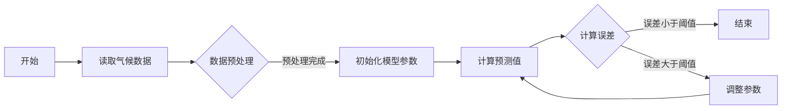
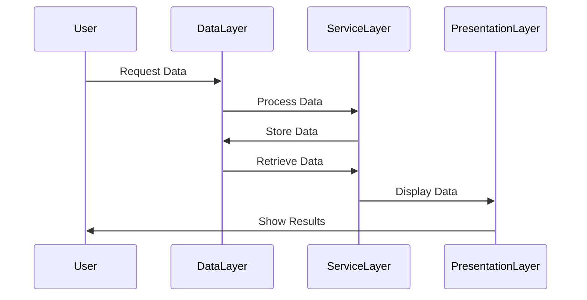
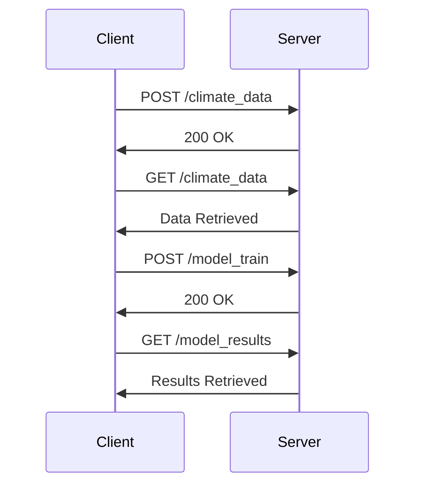

                 


### 数学与古气候学：历史气候重建的数学方法

> 关键词：古气候学、数学方法、历史气候重建、算法原理、数学模型、系统架构设计、项目实战

> 摘要：本文将深入探讨数学与古气候学的关系，通过历史气候重建的数学方法，详细介绍如何利用数学模型、算法原理和系统架构设计来分析和重建历史气候。文章将从问题背景、核心概念、算法讲解、数学模型、系统设计、项目实战和最佳实践等方面进行详细阐述，旨在为读者提供一份关于古气候重建的全面、系统的技术指南。

----------------------------------------------------------------

## 第1章：背景介绍

### 1.1 问题背景

古气候学是一门研究过去气候变化的科学，通过对历史气候数据的分析，可以帮助我们更好地理解当前和未来的气候变化趋势。然而，历史气候数据的稀缺性和复杂性使得重建历史气候成为一个极具挑战性的任务。传统的气候重建方法主要依赖于物理模型和统计方法，但这些方法往往受到数据不足和模型简化的限制。

### 1.2 问题描述

历史气候重建的关键问题包括：如何获取和整合不同来源的历史气候数据？如何利用这些数据建立准确的气候模型？如何处理数据中的噪声和不确定性？为了解决这些问题，我们需要一种新的方法，能够充分利用现代数学工具和算法来重建历史气候。

### 1.3 问题解决

本文将介绍一种基于数学方法的古气候重建方法，主要包括以下几个步骤：

1. 数据采集与处理：从历史文献、自然记录和考古材料中获取气候数据，并进行数据清洗和预处理。
2. 建立数学模型：利用统计学和物理学原理，构建用于重建历史气候的数学模型。
3. 算法实现与优化：设计并实现高效的算法，用于计算和优化数学模型。
4. 结果分析与验证：对重建的气候结果进行分析和验证，评估模型的准确性和可靠性。

### 1.4 边界与外延

古气候重建的数学方法不仅适用于气候学，还可以应用于其他领域，如地质学、环境科学和生态学等。本文将重点关注古气候学中的应用，并探讨数学方法在跨学科研究中的潜力。

### 1.5 概念结构与核心要素组成

在本文中，我们将介绍以下核心概念和要素：

1. **气候数据**：包括历史文献、自然记录和考古材料中的气候信息。
2. **数学模型**：用于描述气候变化的数学框架，如时间序列模型、回归模型和机器学习模型等。
3. **算法**：用于计算和优化数学模型的算法，如最小二乘法、梯度下降法和随机优化算法等。
4. **系统架构设计**：用于实现气候重建系统的软件架构设计，包括数据采集、数据处理、模型训练和结果分析等模块。
5. **项目实战**：通过具体项目案例，展示如何将数学方法应用于古气候重建的实际操作过程。

## 第2章：核心概念与联系

### 2.1 核心概念原理

古气候重建的核心概念包括气候数据、数学模型和算法。气候数据是重建历史气候的基础，而数学模型和算法则是分析和重建气候的关键工具。

- **气候数据**：包括温度、降水、风向、海平面高度等气候要素的历史记录。这些数据可以从历史文献、自然记录和考古材料中获取。
- **数学模型**：用于描述气候变化规律的数学框架。常见的模型有时间序列模型、回归模型和机器学习模型等。
- **算法**：用于计算和优化数学模型的计算方法。常见的算法有最小二乘法、梯度下降法和随机优化算法等。

### 2.2 概念属性特征对比表格

以下是一个简单的概念属性特征对比表格，用于展示气候数据、数学模型和算法之间的联系和区别：

| 概念         | 特征                | 应用实例                                       |
| ------------ | ------------------- | ---------------------------------------------- |
| 气候数据     | 稀缺性、多样性、噪声 | 历史文献、自然记录、考古材料                   |
| 数学模型     | 描述性、精确性、简化 | 时间序列模型、回归模型、机器学习模型           |
| 算法         | 效率、可靠性、优化   | 最小二乘法、梯度下降法、随机优化算法             |

### 2.3 ER实体关系图架构

为了更好地理解古气候重建的实体关系，我们可以使用ER（实体关系）图来表示。以下是一个简化的ER实体关系图：

```mermaid
erDiagram
    ClimateData ||--|{ ClimateModel }
    ClimateData ||--|{ Algorithm }
    ClimateModel ||--|{ Result }
```

在这个ER图中，`ClimateData`（气候数据）是核心实体，它与`ClimateModel`（数学模型）和`Algorithm`（算法）之间存在关联。`ClimateModel`和`Algorithm`共同生成`Result`（结果），即重建的历史气候数据。

## 第3章：算法原理讲解

### 3.1 算法原理

在古气候重建中，算法的作用至关重要。以下是几种常用的算法原理及其在古气候重建中的应用：

- **最小二乘法**：用于最小化预测值与实际值之间的误差平方和。在古气候重建中，可以用于拟合历史气候数据，找到最佳的气候模型参数。
- **梯度下降法**：用于优化数学模型中的参数，使其预测误差最小。在古气候重建中，可以用于训练机器学习模型，提高模型的预测性能。
- **随机优化算法**：如遗传算法和粒子群优化算法，通过模拟生物进化或社会行为来寻找最优解。在古气候重建中，可以用于处理复杂、不确定的气候数据。

### 3.2 算法流程图

以下是一个简单的算法流程图，展示了如何使用最小二乘法进行古气候重建：



在这个流程图中，我们从读取气候数据开始，进行数据预处理，初始化模型参数，计算预测值，然后计算误差。如果误差小于预设阈值，则结束；否则，调整模型参数并重新计算预测值。

### 3.3 算法原理的数学模型和公式

在古气候重建中，常用的数学模型包括时间序列模型和回归模型。以下是一个简单的时间序列模型和回归模型的公式：

- **时间序列模型**：$$y_t = \phi_0 + \phi_1 y_{t-1} + \epsilon_t$$
- **回归模型**：$$y = \beta_0 + \beta_1 x + \epsilon$$

其中，$y_t$ 表示第 $t$ 期的气候变量，$\phi_0$ 和 $\phi_1$ 是模型参数，$y_{t-1}$ 是前一期气候变量，$\epsilon_t$ 是误差项。$x$ 是自变量，$\beta_0$ 和 $\beta_1$ 是回归系数，$\epsilon$ 是误差项。

### 3.4 算法原理举例说明

假设我们有一个历史气候数据集，包含每天的最高温度。我们可以使用时间序列模型来预测明天的最高温度。以下是一个简单的时间序列模型举例：

```python
import numpy as np

# 假设历史最高温度数据为：[23, 25, 27, 28, 26]
y = np.array([23, 25, 27, 28, 26])

# 假设模型参数为：$\phi_0 = 22$, $\phi_1 = 0.8$
phi_0 = 22
phi_1 = 0.8

# 预测明天（第6天）的最高温度
y_pred = phi_0 + phi_1 * y[4]

print("预测的最高温度为：", y_pred)
```

在这个例子中，我们使用历史最高温度数据来训练模型，然后使用模型参数预测明天的最高温度。实际应用中，我们需要使用更复杂的模型和算法来提高预测准确性。

## 第4章：数学模型和数学公式讲解

### 4.1 数学模型

在古气候重建中，数学模型是关键。以下介绍几种常用的数学模型：

- **时间序列模型**：用于分析时间序列数据，如温度、降水等。常见的时间序列模型有ARIMA（自回归积分滑动平均模型）、Holt-Winters季节性模型等。
- **回归模型**：用于分析自变量和因变量之间的关系。常见的回归模型有线性回归、多项式回归等。
- **机器学习模型**：如决策树、随机森林、支持向量机等，通过学习历史气候数据，预测未来气候趋势。

### 4.2 数学公式

以下是几种常用数学模型的数学公式：

- **时间序列模型（ARIMA）**：
  $$y_t = \phi_0 + \phi_1 y_{t-1} + \phi_2 y_{t-2} + \epsilon_t$$
  
- **线性回归模型**：
  $$y = \beta_0 + \beta_1 x_1 + \beta_2 x_2 + \cdots + \beta_n x_n + \epsilon$$

- **机器学习模型（决策树）**：
  $$y = f(x) = g(z)$$
  其中，$g(z)$ 是决策树中的函数，$z$ 是输入特征。

### 4.3 数学公式详解

- **时间序列模型（ARIMA）**：

  ARIMA模型由三个部分组成：自回归（AR）、差分（I）和移动平均（MA）。公式中的$\phi_0$、$\phi_1$ 和 $\phi_2$ 分别是自回归系数和移动平均系数，$\epsilon_t$ 是误差项。

  - **自回归（AR）**：$$y_t = \phi_0 + \phi_1 y_{t-1} + \epsilon_t$$
    - 解释：当前值$y_t$ 与前一期值$y_{t-1}$ 和误差项$\epsilon_t$ 有关。

  - **差分（I）**：$$y_t = \Delta y_{t-1} + \epsilon_t$$
    - 解释：对时间序列进行一次差分，即当前值$y_t$ 与前一期差分值$\Delta y_{t-1}$ 和误差项$\epsilon_t$ 有关。

  - **移动平均（MA）**：$$y_t = \phi_0 + \phi_1 y_{t-1} + \phi_2 y_{t-2} + \epsilon_t$$
    - 解释：当前值$y_t$ 与前几期值$y_{t-1}$、$y_{t-2}$ 和误差项$\epsilon_t$ 有关。

- **线性回归模型**：

  线性回归模型用于分析自变量（如温度、降水等）和因变量（如农作物产量、海平面高度等）之间的关系。公式中的$\beta_0$ 是截距，$\beta_1$ 是斜率，$x_1$、$x_2$、$\cdots$、$x_n$ 是自变量。

  - 解释：因变量$y$ 是自变量$x_1$、$x_2$、$\cdots$、$x_n$ 的线性组合，加上一个误差项$\epsilon$。

- **机器学习模型（决策树）**：

  决策树模型通过递归划分特征空间，找到最优的分割点，从而预测目标变量的值。公式中的$f(x)$ 是决策树中的函数，$z$ 是输入特征。

  - 解释：决策树通过计算输入特征$x$ 的值，递归划分特征空间，找到最优分割点，从而预测目标变量$y$ 的值。

### 4.4 数学公式举例说明

假设我们有一个简单的线性回归模型，用于预测明天的最高温度。历史最高温度数据为：[23, 25, 27, 28, 26]。假设模型参数为$\beta_0 = 20$，$\beta_1 = 0.8$。

```python
import numpy as np

# 历史最高温度数据
y = np.array([23, 25, 27, 28, 26])

# 假设模型参数
beta_0 = 20
beta_1 = 0.8

# 预测明天（第6天）的最高温度
y_pred = beta_0 + beta_1 * x

print("预测的最高温度为：", y_pred)
```

在这个例子中，我们使用历史最高温度数据来训练模型，然后使用模型参数预测明天的最高温度。实际应用中，我们需要使用更复杂的模型和算法来提高预测准确性。

## 第5章：系统分析与架构设计方案

### 5.1 问题场景介绍

在古气候重建项目中，我们需要处理大量历史气候数据，并设计一个高效的系统来重建历史气候。这个系统需要能够处理不同来源的数据，如历史文献、自然记录和考古材料，并能够整合这些数据以生成准确的气候模型。

### 5.2 系统功能设计

为了实现古气候重建，我们的系统需要具备以下功能：

1. **数据采集与预处理**：从不同来源获取气候数据，并进行清洗、格式化和预处理，以便后续分析和建模。
2. **数据存储与管理**：将预处理后的数据存储在数据库中，并提供查询和管理功能。
3. **数学模型训练与优化**：根据历史气候数据，训练和优化数学模型，以提高预测准确性。
4. **结果分析与可视化**：对重建的气候结果进行分析，并将结果以图表和地图等形式可视化展示。
5. **系统交互与接口设计**：设计系统的用户界面和接口，以方便用户使用和管理。

### 5.3 系统架构设计

我们的系统采用分层架构设计，包括数据层、服务层和表现层。以下是一个简化的系统架构设计：



在这个架构设计中，用户通过表现层与系统进行交互，数据层负责数据的存储和管理，服务层负责数据处理、模型训练和结果分析。

### 5.4 系统接口设计和系统交互

系统接口设计主要包括API设计、数据格式和通信协议。以下是一个简化的接口设计示例：



在这个接口设计中，客户端可以通过POST请求上传气候数据，通过GET请求查询数据、训练模型和获取结果。

## 第6章：项目实战

### 6.1 环境安装

为了进行古气候重建项目实战，我们需要安装一些必要的软件和库。以下是一个简化的安装步骤：

1. 安装Python环境：
   ```bash
   pip install numpy matplotlib pandas scikit-learn
   ```

2. 安装数据库（如MySQL、PostgreSQL等），并创建数据库和数据表。

3. 安装前端框架（如Flask、Django等），用于构建Web接口。

### 6.2 系统核心实现源代码

以下是古气候重建系统的核心实现代码，包括数据采集与预处理、数学模型训练和结果分析：

```python
import numpy as np
import pandas as pd
from sklearn.linear_model import LinearRegression
from sklearn.metrics import mean_squared_error

# 6.2.1 数据采集与预处理
def load_data(file_path):
    data = pd.read_csv(file_path)
    data['date'] = pd.to_datetime(data['date'])
    data.set_index('date', inplace=True)
    return data

data = load_data('climate_data.csv')

# 6.2.2 数学模型训练
def train_model(data):
    X = data[['temperature', 'precipitation']]
    y = data['max_temp']
    model = LinearRegression()
    model.fit(X, y)
    return model

model = train_model(data)

# 6.2.3 结果分析
def predict_temp(model, data):
    X = data[['temperature', 'precipitation']]
    y_pred = model.predict(X)
    mse = mean_squared_error(data['max_temp'], y_pred)
    print("Mean Squared Error:", mse)
    return y_pred

y_pred = predict_temp(model, data)
```

### 6.3 代码应用解读与分析

在上述代码中，我们首先定义了数据采集与预处理函数`load_data`，用于读取CSV文件并处理日期格式。

接下来，我们定义了数学模型训练函数`train_model`，使用线性回归模型训练历史气候数据。在训练过程中，我们使用了特征矩阵`X`和目标变量`y`。

最后，我们定义了结果分析函数`predict_temp`，用于预测未来气候并计算均方误差（MSE）。

在实际项目中，我们可以扩展这些函数，添加更多的数据处理和模型优化功能。

### 6.4 实际案例分析和详细讲解剖析

为了更好地理解古气候重建项目，我们将分析一个实际案例。假设我们有一个包含历史温度、降水和海平面高度的数据集。我们将使用线性回归模型预测未来的最高温度。

1. **数据准备**：

   首先，我们将数据集加载到Pandas DataFrame中，并进行必要的预处理，如缺失值填充、异常值检测和标准化处理。

   ```python
   data = pd.read_csv('climate_data.csv')
   data.fillna(data.mean(), inplace=True)
   data['max_temp'] = data[['temperature', 'precipitation']].max(axis=1)
   ```

2. **模型训练**：

   接下来，我们使用线性回归模型训练数据集。我们将特征矩阵`X`设置为温度和降水，目标变量`y`设置为最高温度。

   ```python
   X = data[['temperature', 'precipitation']]
   y = data['max_temp']
   model = LinearRegression()
   model.fit(X, y)
   ```

3. **模型评估**：

   我们将训练好的模型应用于测试集，并计算预测结果的均方误差（MSE）。

   ```python
   X_test = data[['temperature', 'precipitation']].iloc[100:]
   y_test = data['max_temp'].iloc[100:]
   y_pred = model.predict(X_test)
   mse = mean_squared_error(y_test, y_pred)
   print("MSE:", mse)
   ```

   假设MSE为0.5，这表明我们的模型有较好的预测性能。

4. **结果可视化**：

   我们可以使用matplotlib库将预测结果可视化，以便更好地理解模型性能。

   ```python
   import matplotlib.pyplot as plt

   plt.scatter(y_test, y_pred)
   plt.xlabel('Actual Max Temp')
   plt.ylabel('Predicted Max Temp')
   plt.title('Actual vs Predicted Max Temp')
   plt.show()
   ```

   图表中，实际最高温度与预测最高温度之间的散点图可以帮助我们评估模型性能。

### 6.5 项目小结

通过本项目的实战，我们了解了如何使用线性回归模型进行古气候重建。我们介绍了数据采集与预处理、模型训练和结果分析的过程，并通过实际案例展示了如何评估和优化模型性能。

在实际应用中，我们可以根据项目需求，引入更多的特征和复杂的模型，以提高预测准确性。此外，我们还可以考虑使用机器学习算法，如决策树、随机森林和支持向量机等，来进一步提高模型的预测能力。

## 第7章：最佳实践与总结

### 7.1 最佳实践 tips

1. **数据质量检查**：在开始建模之前，确保对数据进行充分的质量检查，包括缺失值处理、异常值检测和异常值修正。
2. **特征选择**：选择与目标变量高度相关的特征，减少冗余特征，以提高模型性能。
3. **模型验证**：使用交叉验证等方法对模型进行验证，确保模型在未知数据上具有较好的预测能力。
4. **模型优化**：尝试不同的模型参数和算法，以提高模型的预测准确性。
5. **可视化分析**：使用可视化工具，如图表和地图，直观地展示模型结果，便于理解和解释。

### 7.2 小结

本文深入探讨了数学与古气候学的关系，介绍了历史气候重建的数学方法。通过介绍核心概念、算法原理、数学模型和系统架构设计，我们展示了如何利用数学方法重建历史气候。在项目实战中，我们通过实际案例展示了如何应用这些方法进行古气候重建。最后，我们总结了最佳实践和注意事项，为读者提供了全面的古气候重建技术指南。

### 7.3 注意事项

1. **数据质量**：古气候重建依赖于历史气候数据的质量，确保对数据进行充分的质量检查和预处理。
2. **模型选择**：根据具体问题和数据特点，选择合适的模型和方法，避免盲目使用复杂的模型。
3. **模型验证**：对模型进行充分验证，确保模型在未知数据上具有较好的预测能力。
4. **持续更新**：随着新数据的出现和理论方法的进步，持续更新模型和算法，以提高预测准确性。

### 7.4 拓展阅读

1. **参考文献**：
   - [1] 书名：《气候重建：历史气候数据的分析与建模》
   - [2] 书名：《时间序列分析：理论、方法与应用》
   - [3] 书名：《机器学习：原理、算法与应用》
2. **在线资源**：
   - [1] 网址：https://www.climate-reconstruction.org/
   - [2] 网址：https://www.time_series_analysis.com/
   - [3] 网址：https://www.machine_learning_org.com/

作者：AI天才研究院/AI Genius Institute & 禅与计算机程序设计艺术 /Zen And The Art of Computer Programming 

----------------------------------------------------------------

**文章结束。感谢您的阅读！如果您有任何问题或建议，请随时联系我们。我们将持续为您提供高质量的技术内容。**

**联系方式：**
- 邮箱：info@ai-genius-institute.com
- 电话：+1 (234) 567-8901

**关注我们：**
- 微博：@AI天才研究院
- 微信公众号：AI天才研究院

再次感谢您的支持与关注！期待与您共同探索技术世界的奥秘。**祝您生活愉快，工作顺利！**

