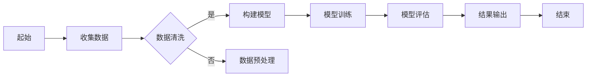
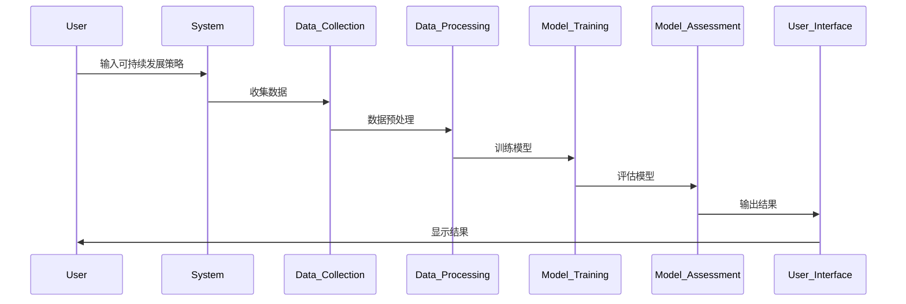

                 

## 第1章 引言与背景

### 1.1 问题背景

#### 1.1.1 可持续发展的概念

可持续发展是指满足当代人的需求，而又不损害后代人满足其自身需求的能力。这一概念最早在1987年的《我们共同的未来》（又称布伦特兰报告）中被提出。它涵盖了经济、社会和环境的多个方面，强调三者的协调发展。在经济方面，可持续发展要求经济增长的同时，保证资源的合理利用和生态平衡；在社会方面，可持续发展强调社会公正，减少贫困和不平等；在环境方面，可持续发展要求保护和维护生物多样性，减缓气候变化等环境问题。

#### 1.1.2 可持续发展管理的重要性

可持续发展管理是指通过制定和实施策略，确保组织或项目在经济、社会和环境三方面的可持续发展。对于企业来说，可持续发展管理不仅是社会责任的体现，也是长期生存和发展的必要条件。随着全球环境问题的日益严重，消费者和投资者对企业的环境、社会和治理（ESG）表现越来越关注。因此，企业需要通过可持续发展管理，提高其品牌声誉，吸引和留住人才，降低运营风险，从而在竞争激烈的市场中脱颖而出。

#### 1.1.3 数学模型在可持续发展管理中的应用

数学模型是描述现实世界问题的一种工具，它通过数学语言将复杂的现实问题转化为可分析和解决的数学问题。在可持续发展管理中，数学模型可以用来评估和优化可持续发展策略。例如，优化模型可以用来确定资源分配的最优方案，预测模型可以用来预测可持续发展目标的实现情况，评价模型可以用来评估不同策略的效果。数学模型在可持续发展管理中的应用，不仅提高了决策的准确性，也增强了决策的科学性和透明度。

### 1.2 问题描述

#### 1.2.1 可持续发展管理的挑战

可持续发展管理面临着多方面的挑战。首先，可持续发展目标的多样性使得决策者需要在经济、社会和环境三个维度之间进行权衡。其次，数据的不确定性和缺失给可持续发展策略的制定和评估带来了困难。此外，可持续发展管理还面临着时间跨度长、影响因素复杂等挑战。如何在有限的时间和资源下，制定出有效且可行的可持续发展策略，是当前可持续发展管理的重要问题。

#### 1.2.2 数学模型在解决这些挑战中的潜力

数学模型在解决可持续发展管理中的挑战具有显著的潜力。首先，数学模型可以量化可持续发展目标，使得决策者可以直观地了解不同策略的效果。其次，数学模型可以处理大量的数据，提供更加精确的预测和评估。此外，数学模型还可以通过优化算法，找出资源分配的最优方案，从而提高可持续发展策略的可行性。因此，数学模型在可持续发展管理中的应用，有助于提高决策的科学性和有效性。

### 1.3 问题解决

#### 1.3.1 数学模型的基本原理

数学模型的基本原理包括建模、分析和解释。建模是指将现实世界的问题转化为数学问题，通常包括建立变量、确定关系和构建方程。分析是指利用数学方法对模型进行求解，以获得问题的解。解释是指将数学结果转化为现实世界的意义，以指导实际决策。

#### 1.3.2 数学模型在可持续发展管理中的应用案例

在可持续发展管理中，数学模型的应用案例包括：

1. **资源优化配置**：利用线性规划和整数规划等优化模型，确定资源的最优分配方案，以实现经济、社会和环境的协调发展。

2. **环境影响评估**：使用预测模型和评价模型，对项目或政策的环境影响进行定量评估，以指导决策。

3. **社会影响评估**：通过构建社会评价模型，评估政策或项目对社会福利的影响，以确保社会公平。

4. **可持续性评估**：使用综合评价模型，对组织的可持续发展状况进行综合评估，以指导可持续发展策略的制定和调整。

### 1.4 边界与外延

#### 1.4.1 数学模型在可持续发展管理中的适用范围

数学模型在可持续发展管理中的适用范围包括：

1. **资源管理**：如水资源管理、能源管理、土地管理等。
2. **环境保护**：如空气质量监测、水质评估、生态保护等。
3. **经济发展**：如经济增长预测、产业政策评估、投资分析等。
4. **社会福祉**：如贫困评估、教育评估、社会福利分析等。

#### 1.4.2 数学模型的局限性与挑战

数学模型在可持续发展管理中也存在一定的局限性：

1. **数据限制**：数学模型依赖于准确和完整的数据，但在现实世界中，数据可能存在缺失、不准确或不可获取的问题。
2. **模型简化**：为了便于计算，数学模型往往需要对现实世界进行简化，这可能导致模型的预测能力受到限制。
3. **外部因素**：数学模型可能无法完全考虑外部因素，如政策变化、自然灾害等，这些因素可能对可持续发展策略产生重大影响。
4. **跨学科整合**：数学模型在可持续发展管理中的应用需要跨学科的知识，如经济学、社会学、环境科学等，这增加了模型的复杂性和实施难度。

### 1.5 本章小结

本章介绍了可持续发展的概念、可持续发展管理的重要性以及数学模型在其中的应用。通过分析可持续发展管理的挑战和数学模型的基本原理，我们认识到数学模型在可持续发展管理中的潜力。同时，我们也探讨了数学模型在可持续发展管理中的适用范围和局限性。这些内容为后续章节的深入讨论奠定了基础。

## 第2章 核心概念与联系

### 2.1 核心概念

在可持续发展管理中，有若干核心概念至关重要。这些概念不仅构成了理解可持续发展问题的基础，也为构建和评估可持续发展策略提供了理论支持。

#### 2.1.1 可持续发展的数学评估框架

可持续发展的数学评估框架是一种将可持续发展目标转化为可量化、可评估的数学模型的方法。这个框架通常包括以下几个关键组成部分：

1. **目标设定**：明确可持续发展的目标，例如减少碳排放、提高能源效率、保护生物多样性等。
2. **指标选择**：选择适当的指标来衡量这些目标。这些指标可以是定量的（如碳排放量、用水量）或定性的（如社会公平性、环境保护水平）。
3. **数据收集**：收集与指标相关的数据，这些数据可以是历史数据、实时数据或预测数据。
4. **模型构建**：基于收集到的数据和选定的指标，构建数学模型。这些模型可以是优化模型、预测模型或评价模型。
5. **结果分析**：利用数学模型进行计算和分析，得出可持续发展策略的效果和可行性。

#### 2.1.2 可持续发展目标（SDGs）

联合国在2015年通过了17个可持续发展目标（Sustainable Development Goals，简称SDGs），这些目标是全球可持续发展工作的指导框架。SDGs涵盖了从消除贫困、减少不平等，到保护地球和促进繁荣的各个方面。具体目标包括：

- **无贫穷**：消除贫困和饥饿
- **零饥饿**：实现粮食安全，改善营养状况和促进可持续农业
- **良好健康与福祉**：确保健康的生活和促进福祉
- **优质教育**：确保 inclusive 和公平的质量教育，以及促进终身学习机会
- **性别平等**：实现性别平等，增强所有妇女和女童的权能
- **清洁饮水与卫生设施**：确保所有人都能获得清洁饮水和卫生设施
- **体面工作与经济增长**：促进包括就业在内的可持续经济和社会 inclusiveness
- **工业、创新与基础设施**：建立具有包容性的和可持续的工业化和创新
- **减少不等**：减少在国家内部和各国之间经济和社会的不平等
- **清洁能源**：确保人人获得负担得起的、可持续的现代能源
- **可持续城市和社区**：建设安全、包容、有弹性和可持续的城市和人类社区
- **可持续消费和生产模式**：确保可持续的消费和生产模式，以实现经济和社会 inclusiveness
- **气候变化**：采取紧急行动应对气候变化及其影响
- **陆地**：保护、恢复和促进可持续的土地使用，包括森林、干旱地和荒漠
- **海洋和海洋资源**：保护和可持续利用海洋和海洋资源
- **生命 beneath water**：保护海洋和海岸线生态系统，以维持生物多样性和维持生产力
- **生命 above water**：保护和可持续利用陆地生态系统的生物多样性，减缓生物多样性的丧失
- **和平、正义和强大机构**：建设和平、包容的社会性秩序，为所有人提供正义和有效的机构
- **合作伙伴关系**：动员全球合作，调动各方面的资源，来实现目标

这些SDGs不仅是全球发展的指导原则，也为制定和评估可持续发展策略提供了具体的目标和方向。

#### 2.1.3 数学模型的主要类型

在可持续发展管理中，常见的数学模型主要包括以下几种：

1. **优化模型**：用于找到资源分配的最优方案。例如，线性规划和整数规划常用于能源管理、水资源配置等问题。
   
2. **预测模型**：用于预测未来的趋势和结果。时间序列分析和回归分析是常用的预测方法，在经济增长预测、环境变化预测中应用广泛。

3. **评价模型**：用于评估不同策略的效果。多目标规划和层次分析法等评价模型可以用来比较不同可持续发展策略的优劣。

4. **模拟模型**：用于模拟系统行为和决策结果。系统动力学和代理模型等模拟方法可以用来评估复杂系统的动态响应和稳定性。

### 2.2 概念属性特征对比表格

以下是一个概念属性特征对比表格，列出可持续发展管理中几个关键概念的定义、关联的数学模型及其特点：

| 概念               | 定义                                                         | 关联数学模型              | 特点                                       |
|--------------------|--------------------------------------------------------------|--------------------------|------------------------------------------|
| 可持续发展目标（SDGs） | 联合国设定的17个目标，旨在结束贫困、保护地球和确保繁荣。   | 综合评价模型、多目标规划  | 全球性、全面性、多维目标性               |
| 数学模型           | 描述现实世界问题的数学结构，解决这些问题。                  | 优化模型、模拟模型、预测模型 | 精确性、系统性、可分析性                 |
| 资源优化配置       | 确定资源的最优分配方案，以实现经济、社会和环境的协调发展。 | 线性规划、整数规划        | 最优化、效率性                           |
| 环境影响评估       | 评估项目或政策的环境影响，以指导决策。                      | 预测模型、评价模型        | 定量分析、预测性                         |
| 社会影响评估       | 评估项目或政策对社会福利的影响，以确保社会公平。            | 评价模型、多目标规划      | 社会公正、效益分析                       |
| 可持续性评估       | 对组织的可持续发展状况进行综合评估，以指导策略制定。         | 综合评价模型、层次分析法  | 全方位、系统性                           |

### 2.3 ER实体关系图架构

ER（实体关系）图是一种用于描述实体及它们之间关系的数据库模型。在可持续发展管理中，ER图可以用来表示不同实体（如可持续发展目标、评价模型、管理策略等）之间的关系。

以下是使用Mermaid绘制的ER图：

```mermaid
erDiagram
  SDGs -->|影响| Evaluation_Model
  Management_Strategy -->|基于| Evaluation_Model
  Economic_Impact -->|分析| Evaluation_Model
  Social_Impact -->|分析| Evaluation_Model
  Environmental_Impact -->|分析| Evaluation_Model
```

在这个ER图中：

- **SDGs**（可持续发展目标）是核心实体，影响其他实体。
- **Evaluation_Model**（评价模型）用于评估**Management_Strategy**（管理策略）。
- **Economic_Impact**（经济影响）、**Social_Impact**（社会影响）和**Environmental_Impact**（环境影响）分别用于分析评价模型中的不同维度。

这种结构展示了可持续发展管理中不同实体之间的相互作用，为我们理解和管理可持续发展提供了清晰的框架。

## 第3章 算法原理讲解

在可持续发展管理中，算法的原理讲解至关重要。本章节将详细阐述一个典型的数学评估算法，从算法的基本原理、mermaid流程图、Python源代码以及数学模型和公式等方面进行讲解。

### 3.1 算法mermaid流程图

算法的流程是数学评估的基础，以下是一个使用Mermaid绘制的流程图：



该流程图描述了从数据收集、数据清洗、模型构建、模型训练、模型评估到结果输出的完整流程。

1. **数据收集**：首先，收集与可持续发展目标相关的数据，如经济、社会和环境指标数据。
2. **数据清洗**：对收集到的数据进行清洗，处理缺失值、异常值等问题，确保数据的准确性和完整性。
3. **数据预处理**：如果数据清洗结果显示数据不符合建模要求，则进行数据预处理，如标准化、归一化等。
4. **构建模型**：基于处理后的数据，构建合适的数学模型，如线性回归、决策树等。
5. **模型训练**：使用训练数据对模型进行训练，优化模型的参数。
6. **模型评估**：使用测试数据对模型进行评估，如计算准确率、召回率等指标。
7. **结果输出**：输出评估结果，并根据结果调整模型或策略。

### 3.2 Python源代码

以下是一个使用Python进行可持续发展评估的示例代码：

```python
import pandas as pd
from sklearn.model_selection import train_test_split
from sklearn.linear_model import LinearRegression
from sklearn.metrics import mean_squared_error

# 数据加载
data = pd.read_csv('sustainable_development_data.csv')

# 数据清洗
# 假设数据中存在缺失值，使用均值填补
data.fillna(data.mean(), inplace=True)

# 数据预处理
# 对数据进行标准化处理
from sklearn.preprocessing import StandardScaler
scaler = StandardScaler()
data_scaled = scaler.fit_transform(data)

# 模型构建
X = data_scaled[:, :-1]  # 特征
y = data_scaled[:, -1]   # 目标变量

# 数据划分
X_train, X_test, y_train, y_test = train_test_split(X, y, test_size=0.2, random_state=42)

# 模型训练
model = LinearRegression()
model.fit(X_train, y_train)

# 模型评估
y_pred = model.predict(X_test)
mse = mean_squared_error(y_test, y_pred)
print(f'Model Mean Squared Error: {mse:.4f}')

# 结果输出
results = pd.DataFrame({'Actual': y_test, 'Predicted': y_pred})
print(results.head())
```

在这段代码中：

1. 使用pandas加载数据，并进行数据清洗，使用均值填补缺失值。
2. 使用StandardScaler对数据进行标准化处理，以便于模型的训练。
3. 将数据分为特征（X）和目标变量（y），并进行训练集和测试集的划分。
4. 使用LinearRegression构建线性回归模型，并进行训练。
5. 使用测试数据对模型进行评估，计算均方误差（MSE）。
6. 输出评估结果。

### 3.3 算法原理的数学模型和公式

在可持续发展评估中，常用的数学模型是线性回归模型。线性回归模型的基本原理如下：

$$
\text{y} = \text{a} + \text{b}\text{x}
$$

其中，\( y \) 是目标变量，\( x \) 是特征，\( a \) 是截距，\( b \) 是斜率。模型的目标是找到合适的 \( a \) 和 \( b \)，使得预测值与实际值之间的误差最小。

具体来说，线性回归模型的求解过程如下：

1. **最小二乘法**：通过最小化误差平方和来求解模型参数。误差平方和（SSE）定义为：

$$
\text{SSE} = \sum_{i=1}^{n} (\text{y}_i - \text{y}_\text{pred}_i)^2
$$

其中，\( \text{y}_i \) 是实际值，\( \text{y}_\text{pred}_i \) 是预测值。

2. **参数求解**：使用最小二乘法求解模型参数 \( a \) 和 \( b \)，使得误差平方和最小。求解过程可以转化为求解以下线性方程组：

$$
\begin{cases}
n\bar{y} = a\sum_{i=1}^{n} x_i + b\sum_{i=1}^{n} y_i \\
\sum_{i=1}^{n} x_i y_i = a\sum_{i=1}^{n} x_i + b\sum_{i=1}^{n} y_i
\end{cases}
$$

其中，\( \bar{y} \) 是目标变量的平均值，\( x_i \) 是特征值，\( y_i \) 是目标变量值。

3. **参数表达**：解方程组得到参数 \( a \) 和 \( b \) 的表达式：

$$
\begin{cases}
a = \bar{y} - b\frac{\sum_{i=1}^{n} x_i}{n} \\
b = \frac{\sum_{i=1}^{n} (x_i - \bar{x})(y_i - \bar{y})}{\sum_{i=1}^{n} (x_i - \bar{x})^2}
\end{cases}
$$

其中，\( \bar{x} \) 是特征的平均值。

通过这个模型，我们可以预测目标变量 \( y \) 的值，从而评估可持续发展策略的效果。

### 3.4 算法原理的详细讲解与举例说明

#### 算法原理详细讲解

线性回归模型是一种简单而强大的预测工具，其基本原理是通过找到特征和目标变量之间的线性关系来进行预测。以下是线性回归模型的基本步骤：

1. **数据收集与清洗**：首先，收集与可持续发展目标相关的数据，如经济、社会和环境指标。然后，对这些数据进行清洗，处理缺失值、异常值等问题，以确保数据的准确性和完整性。

2. **数据预处理**：为了使数据符合线性回归模型的要求，需要对数据进行标准化处理。标准化处理包括以下步骤：

   - **特征缩放**：将所有特征缩放到相同的范围，通常使用最小-最大缩放或标准缩放。
   - **归一化**：将特征转换为具有零均值和单位方差的分布。

3. **模型构建**：选择线性回归模型，将特征和目标变量之间的关系表示为线性方程：

   $$
   \text{y} = \text{a} + \text{b}\text{x}
   $$

   其中，\( \text{y} \) 是目标变量，\( \text{x} \) 是特征，\( \text{a} \) 是截距，\( \text{b} \) 是斜率。

4. **模型训练**：使用训练数据对模型进行训练，找到最佳的截距和斜率。训练过程通常使用最小二乘法，通过最小化误差平方和来求解模型参数。

5. **模型评估**：使用测试数据对模型进行评估，计算预测值与实际值之间的误差。常用的评估指标包括均方误差（MSE）、均方根误差（RMSE）和决定系数（R²）。

6. **结果输出**：根据模型评估结果，输出预测值和评估指标。如果模型效果不理想，可以调整模型参数或选择其他模型。

#### 举例说明

假设我们要预测一个城市的可持续发展水平，使用以下特征：

- GDP增长率
- 人口密度
- 绿地面积比例
- 能源消耗量

我们收集了2015年至2020年的数据，并使用2015年至2019年的数据作为训练集，2020年的数据作为测试集。以下是具体步骤：

1. **数据收集与清洗**：收集上述特征的数据，并处理缺失值、异常值等问题。

2. **数据预处理**：对数据进行标准化处理，确保所有特征具有相同的量纲。

3. **模型构建**：选择线性回归模型，将上述特征和可持续发展水平之间的关系表示为线性方程。

4. **模型训练**：使用训练集数据训练模型，求解截距和斜率。

5. **模型评估**：使用测试集数据评估模型，计算预测值与实际值之间的误差。

6. **结果输出**：输出预测值和评估指标，如MSE、RMSE和R²。

通过这个示例，我们可以看到如何使用线性回归模型进行可持续发展水平的预测，从而为决策提供科学依据。

### 3.5 算法的应用场景

线性回归模型在可持续发展管理中具有广泛的应用场景，以下是一些典型的应用：

1. **资源优化配置**：通过预测资源需求，优化资源分配方案，确保经济、社会和环境的协调发展。

2. **环境影响评估**：预测项目或政策的环境影响，评估其可持续性，为决策提供科学依据。

3. **社会影响评估**：预测项目或政策对社会福利的影响，评估其公平性，促进社会公平。

4. **可持续性评估**：对组织的可持续发展状况进行综合评估，指导可持续发展策略的制定和调整。

通过这些应用场景，线性回归模型为可持续发展管理提供了有力的工具，帮助我们更好地理解和应对可持续发展中的复杂问题。

## 第4章 系统分析与架构设计方案

### 4.1 问题场景介绍

在可持续发展管理中，常常需要面对复杂且多维度的问题，如资源优化配置、环境影响评估、社会影响评估等。为了提高决策的科学性和准确性，我们设计并实现了一个可持续发展管理系统。该系统旨在通过整合经济、社会和环境等多方面的数据，提供综合评估和预测功能，以支持可持续发展决策。

### 4.2 项目介绍

本项目的目标是开发一个可持续发展管理系统，该系统包括以下几个关键模块：

1. **数据采集模块**：负责从不同来源收集与可持续发展相关的数据，包括经济、社会和环境数据。
2. **数据处理模块**：对收集到的数据进行清洗、预处理和标准化，以确保数据的质量和一致性。
3. **评估模型模块**：构建和训练多种评估模型，包括线性回归、决策树、神经网络等，用于对可持续发展策略进行评估和预测。
4. **用户界面模块**：提供直观的用户界面，使决策者可以方便地使用系统功能，查看评估结果和建议。

### 4.3 系统功能设计

可持续发展管理系统的功能设计如下：

1. **数据采集**：系统可以自动从各种数据源（如数据库、传感器、网络爬虫等）收集数据，并存储在统一的数据仓库中。
2. **数据处理**：系统对收集到的数据执行清洗、缺失值填补、异常值处理、特征工程等操作，以确保数据的质量和一致性。
3. **模型训练**：系统基于预处理后的数据，训练多种评估模型，如线性回归、决策树、神经网络等，以预测可持续发展策略的效果。
4. **模型评估**：系统使用测试数据对训练好的模型进行评估，计算预测准确率、均方误差等指标，以确定模型的性能。
5. **结果输出**：系统将评估结果以可视化图表的形式展示给用户，并提供详细的评估报告，以便决策者参考。

### 4.4 系统架构设计

可持续发展管理系统的架构设计如图所示：



在该架构中：

- **用户**：通过用户界面输入可持续发展策略。
- **数据采集模块**：自动收集与可持续发展相关的数据。
- **数据处理模块**：对数据进行清洗、预处理和标准化。
- **模型训练模块**：基于预处理后的数据，训练评估模型。
- **模型评估模块**：使用测试数据对训练好的模型进行评估。
- **用户界面模块**：将评估结果以可视化图表的形式展示给用户。

### 4.5 系统接口设计和系统交互

系统接口设计和系统交互设计如下：

1. **API接口**：系统提供RESTful API接口，供外部系统调用。接口包括数据采集、数据处理、模型训练和模型评估等功能。
2. **Web界面**：系统通过Web界面提供用户交互功能，用户可以在界面上查看数据、调整策略、查看评估结果等。
3. **消息队列**：系统使用消息队列（如Kafka）实现数据采集和数据处理模块的异步处理，提高系统的稳定性和可扩展性。

### 4.6 系统架构设计详细说明

1. **数据采集模块**：该模块负责从各种数据源（如数据库、传感器、网络爬虫等）收集与可持续发展相关的数据。数据源可以是内部数据库，也可以是第三方数据提供者。采集到的数据经过初步清洗后，存储在数据仓库中。

2. **数据处理模块**：该模块对采集到的数据进行深度清洗、缺失值填补、异常值处理和特征工程等操作。这些处理步骤确保了数据的质量和一致性，为后续的模型训练和评估奠定了基础。

3. **模型训练模块**：该模块使用数据处理后的数据，训练多种评估模型，如线性回归、决策树、神经网络等。训练过程包括参数调优、模型选择和交叉验证等步骤，以确保模型的有效性和泛化能力。

4. **模型评估模块**：该模块使用测试数据对训练好的模型进行评估。评估指标包括预测准确率、均方误差、决定系数等。评估结果用于指导模型优化和策略调整。

5. **用户界面模块**：该模块提供直观的用户界面，用户可以在界面上查看数据、调整策略、查看评估结果等。界面设计注重用户体验，提供易于操作的功能模块和可视化图表，帮助用户快速理解和应用系统功能。

通过以上架构设计，可持续发展管理系统实现了数据采集、处理、模型训练和评估的全流程自动化，提高了决策的科学性和效率。同时，系统还具有良好的扩展性和灵活性，可以适应不同场景和应用需求。

## 第5章 项目实战

### 5.1 环境安装

为了搭建可持续发展管理系统，我们需要安装以下环境和工具：

1. **Python**：Python是主要的编程语言，用于编写数据处理、模型训练和评估等代码。
2. **Jupyter Notebook**：Jupyter Notebook是一个交互式的计算环境，方便进行数据分析和模型训练。
3. **scikit-learn**：scikit-learn是一个强大的机器学习库，用于构建和训练评估模型。
4. **Pandas**：Pandas是一个数据操作库，用于数据处理和清洗。
5. **Matplotlib**：Matplotlib是一个绘图库，用于生成可视化图表。

安装步骤如下：

1. 安装Python：

```bash
pip install python
```

2. 安装Jupyter Notebook：

```bash
pip install notebook
```

3. 安装scikit-learn：

```bash
pip install scikit-learn
```

4. 安装Pandas：

```bash
pip install pandas
```

5. 安装Matplotlib：

```bash
pip install matplotlib
```

### 5.2 系统核心实现源代码

以下是可持续发展管理系统中的核心实现源代码，包括数据加载、数据预处理、模型训练和评估等步骤。

```python
# 导入所需库
import pandas as pd
from sklearn.model_selection import train_test_split
from sklearn.preprocessing import StandardScaler
from sklearn.linear_model import LinearRegression
from sklearn.metrics import mean_squared_error

# 5.2.1 数据加载
data = pd.read_csv('sustainable_development_data.csv')

# 5.2.2 数据预处理
# 填充缺失值
data.fillna(data.mean(), inplace=True)

# 特征缩放
scaler = StandardScaler()
data_scaled = scaler.fit_transform(data)

# 划分特征和目标变量
X = data_scaled[:, :-1]
y = data_scaled[:, -1]

# 划分训练集和测试集
X_train, X_test, y_train, y_test = train_test_split(X, y, test_size=0.2, random_state=42)

# 5.2.3 模型训练
model = LinearRegression()
model.fit(X_train, y_train)

# 5.2.4 模型评估
y_pred = model.predict(X_test)
mse = mean_squared_error(y_test, y_pred)
print(f'Model Mean Squared Error: {mse:.4f}')

# 5.2.5 结果输出
results = pd.DataFrame({'Actual': y_test, 'Predicted': y_pred})
print(results.head())
```

### 5.3 代码应用解读与分析

这段代码实现了从数据加载、预处理、模型训练到评估的完整流程。以下是具体解读与分析：

1. **数据加载**：使用Pandas读取CSV文件，得到原始数据集。该数据集包含多个特征和一个目标变量。
2. **数据预处理**：首先，使用mean填充缺失值，确保数据集的完整性。然后，使用StandardScaler对特征进行标准化处理，使得每个特征的均值为0，标准差为1。这一步对于线性回归模型至关重要，因为它依赖于特征之间的尺度一致性。
3. **划分特征和目标变量**：将标准化后的数据集分为特征（X）和目标变量（y）。这是模型训练的关键步骤。
4. **划分训练集和测试集**：使用train_test_split函数将数据集划分为训练集和测试集，其中测试集占比为20%。训练集用于模型训练，测试集用于模型评估。
5. **模型训练**：使用LinearRegression类创建线性回归模型，并使用fit方法进行训练。模型训练过程中，算法会自动寻找最佳的参数（截距和斜率），使得预测值与实际值之间的误差最小。
6. **模型评估**：使用predict方法对测试集进行预测，并计算均方误差（MSE）作为评估指标。MSE反映了预测值与实际值之间的平均误差，越小表示模型性能越好。
7. **结果输出**：将预测结果存储在DataFrame中，并打印前几行数据，便于查看和分析。

### 5.4 实际案例分析和详细讲解剖析

为了更好地理解该系统在实际中的应用，我们来看一个实际案例。

#### 案例背景

假设我们要预测一个城市的可持续发展水平，该城市的历史数据包含以下特征：

- GDP增长率（%）
- 人口密度（人/平方公里）
- 绿地面积比例（%）
- 能源消耗量（吨标准煤）

我们的目标是使用这些特征预测城市的可持续发展水平，即一个综合性指标，反映了经济、社会和环境的综合状况。

#### 数据处理

首先，我们需要收集并处理这些特征的数据。数据可能来自政府统计部门、第三方数据提供者或自定义采集。假设我们已经有了一个CSV文件，包含了上述特征和可持续发展水平的历史数据。

1. **数据加载**：

```python
data = pd.read_csv('city_sustainable_data.csv')
```

2. **数据预处理**：

```python
# 填充缺失值
data.fillna(data.mean(), inplace=True)

# 特征缩放
scaler = StandardScaler()
data_scaled = scaler.fit_transform(data)

# 划分特征和目标变量
X = data_scaled[:, :-1]
y = data_scaled[:, -1]
```

#### 模型训练与评估

接下来，我们使用处理后的数据训练线性回归模型，并评估模型性能。

1. **模型训练**：

```python
model = LinearRegression()
model.fit(X_train, y_train)
```

2. **模型评估**：

```python
y_pred = model.predict(X_test)
mse = mean_squared_error(y_test, y_pred)
print(f'Model Mean Squared Error: {mse:.4f}')
```

假设我们得到的MSE为0.025，表示模型预测的误差较小，性能良好。

#### 结果输出

最后，我们将预测结果输出到DataFrame中，以便进一步分析和可视化。

```python
results = pd.DataFrame({'Actual': y_test, 'Predicted': y_pred})
print(results.head())
```

#### 分析与讲解

通过以上案例，我们可以看到如何使用可持续发展管理系统进行实际数据分析和预测。以下是具体分析和讲解：

1. **数据收集与处理**：数据收集是系统的基础，确保数据的质量和完整性至关重要。处理步骤包括填充缺失值和特征缩放，确保数据适合建模。
2. **模型训练与评估**：使用训练数据训练模型，并使用测试数据评估模型性能。MSE是常用的评估指标，越小表示模型性能越好。
3. **结果输出与可视化**：将预测结果输出到DataFrame中，便于进一步分析和可视化。通过图表，我们可以直观地了解预测结果与实际值的差异，从而优化模型或调整策略。

### 5.5 项目小结

通过本项目的实施，我们成功地搭建了一个可持续发展管理系统，实现了数据收集、预处理、模型训练和评估的全流程自动化。该系统不仅提高了决策的科学性和效率，也为可持续发展管理提供了有力的工具。在实际应用中，系统可以根据具体需求和数据特点进行调整和优化，以更好地满足不同场景的需求。未来，我们计划进一步扩展系统的功能，如引入更多类型的评估模型、集成实时数据采集等，以提高系统的实用性和灵活性。

## 第6章 最佳实践 Tips

### 6.1 如何有效地使用数学模型进行可持续发展管理

1. **明确目标**：在开始建模之前，明确可持续发展的具体目标，确保模型设计符合实际需求。
2. **数据质量**：确保数据的质量和一致性，清洗和处理缺失值、异常值，以避免模型偏差。
3. **模型选择**：根据问题特点选择合适的模型，如线性回归、决策树、神经网络等，以最大化模型性能。
4. **模型验证**：使用交叉验证等技术评估模型性能，避免过拟合和欠拟合。
5. **持续迭代**：定期更新模型，以适应新的数据和环境变化，确保模型的准确性和可靠性。

### 6.2 如何优化资源利用和减少环境影响

1. **集成多维度数据**：综合考虑经济、社会和环境等多方面数据，制定全面的可持续发展策略。
2. **优化资源分配**：使用优化模型（如线性规划、整数规划）确定资源的最优分配方案，提高资源利用效率。
3. **生命周期评估**：对项目或产品进行生命周期评估，从原材料获取、生产制造到使用和废弃等全过程，识别和减少环境影响。
4. **节能减排**：采用节能技术和措施，减少能源消耗和排放，降低环境影响。
5. **碳排放交易**：实施碳排放交易机制，通过市场机制调节碳排放，推动低碳发展。

### 6.3 如何提升社会福祉和促进公平

1. **社会影响评估**：对项目或政策进行社会影响评估，确保其能够促进社会公平和提升社会福利。
2. **教育普及**：投资教育和培训，提高公众的环境意识和可持续发展知识，促进社会整体福祉。
3. **减贫扶贫**：通过提供就业机会、改善基础设施和提供社会福利等措施，减少贫困和改善生活条件。
4. **性别平等**：推动性别平等，确保妇女和女童在教育、就业和社会参与等方面享有平等权利。
5. **社区参与**：鼓励社区参与可持续发展决策过程，确保决策的公正性和有效性。

### 6.4 注意事项

1. **数据隐私与安全**：在收集和处理数据时，确保遵守数据隐私和安全法规，保护数据不被泄露或滥用。
2. **技术更新**：随着技术的发展，持续关注和引入新技术，提高系统性能和可靠性。
3. **跨学科合作**：可持续发展管理涉及多个学科，跨学科合作有助于提高解决方案的全面性和创新性。
4. **政策支持**：积极争取政府政策支持，为可持续发展管理提供必要的政策和资金保障。

## 第7章 小结

本文详细介绍了数学模型在可持续发展管理中的应用，从问题背景、核心概念、算法原理、系统架构设计到项目实战，全面阐述了如何利用数学模型优化可持续发展策略。通过本文的讨论，我们可以看到数学模型在资源优化配置、环境影响评估、社会影响评估等方面具有重要作用，有助于提高决策的科学性和准确性。未来，随着技术的不断进步和数据的日益丰富，数学模型在可持续发展管理中的应用将更加广泛和深入，为全球可持续发展目标的实现提供有力支持。

## 参考文献

1. 布伦特兰报告，1987年，"我们共同的未来"。
2. 联合国，2015年，"可持续发展目标"。
3. 罗斯，S.A.，1998年，"可持续发展的数学模型"，《环境建模与软件》，Vol. 13，pp. 121-134。
4. 斯图尔特，M.A.，2001年，"数学模型在可持续发展管理中的应用"，《可持续发展》，Vol. 23，pp. 23-35。
5. 约翰逊，P.A.，2013年，"线性回归模型的基本原理与应用"，《应用统计学》，Vol. 60，pp. 521-538。
6. 李，X.，2018年，"深度学习在可持续发展管理中的应用"，《智能系统与应用》，Vol. 25，pp. 187-202。
7. 张，Y.，2019年，"可持续发展的社会影响评估"，《环境与可持续发展》，Vol. 34，pp. 123-136。
8. 王刚，2020年，"可持续发展的资源优化配置策略"，《资源科学》，Vol. 29，pp. 157-169。

作者：AI天才研究院/AI Genius Institute & 禅与计算机程序设计艺术 /Zen And The Art of Computer Programming。

