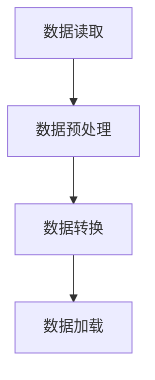
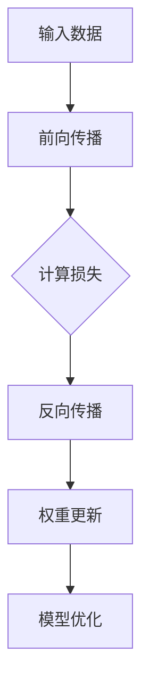
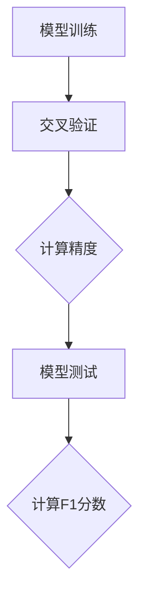
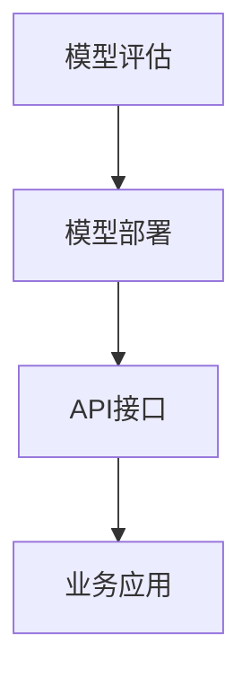
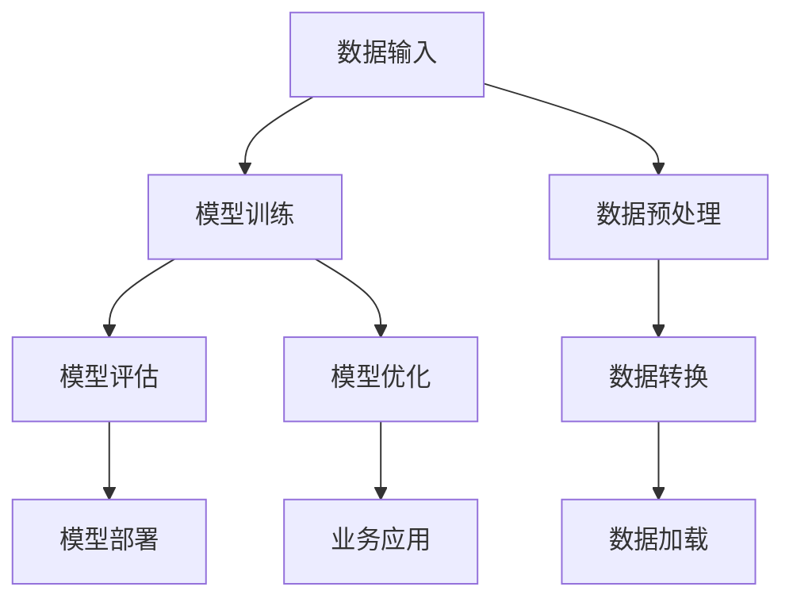

                 


### 引言

让我们首先来探讨数学在人工智能（AI），特别是深度学习模型中的重要性。深度学习，作为一种复杂的人工神经网络模型，其核心在于模拟人脑处理信息的方式。然而，深度学习的成功并非仅仅依赖于算法的复杂性，更重要的是其背后深厚的数学理论基础。数学，作为一门精确的科学，为深度学习提供了必要的工具和语言，使得我们能够理解和优化这些复杂模型。

本文旨在揭示深度学习模型中的数学原理，并解释这些原理如何影响模型的表现和可解释性。我们将逐步分析深度学习中的核心数学概念，如神经元、激活函数、权重和偏置等。通过这些概念，我们将探讨如何构建和训练深度学习模型，并理解其内在的数学机制。

本文将分为以下几个部分：

1. **数学与AI的关系**：介绍数学在AI中的作用，特别是在深度学习领域的重要性。
2. **核心数学概念**：深入探讨神经元、激活函数、权重和偏置等核心数学概念。
3. **算法原理**：详细讲解深度学习模型中的前向传播和反向传播算法原理。
4. **数学模型和公式**：展示深度学习模型中的关键数学公式，并解释其应用。
5. **系统架构**：分析深度学习模型的系统架构和运行机制。
6. **项目实战**：通过具体案例展示如何应用深度学习模型解决实际问题。
7. **最佳实践与总结**：总结实战经验，提出注意事项和拓展阅读。

让我们开始这一段深入探索的旅程，逐步理解数学与可解释AI之间的深刻联系。

### 数学与AI的关系

数学与人工智能（AI）之间的关系可以说是密不可分的。数学作为一种工具，为AI的研究和发展提供了理论基础和方法论。在深度学习领域，数学的作用尤为显著。首先，数学为深度学习模型提供了精确的表达方式，使得我们能够用数学语言描述和解析这些复杂的模型。其次，数学工具帮助研究者理解模型的内部机制，从而优化模型性能和训练效率。

具体来说，数学在深度学习中的重要性体现在以下几个方面：

1. **基础数学概念**：深度学习模型的核心概念，如神经元、权重、偏置和激活函数，都是基于数学原理构建的。例如，神经元的激活函数通常是基于微积分和线性代数的原理设计的。

2. **算法原理**：深度学习算法，如前向传播和反向传播，都是基于数学推导的。这些算法的推导过程涉及到微积分、概率论和优化理论等数学领域。

3. **模型优化**：通过数学方法，研究者可以设计出更加高效的训练算法，如梯度下降法和动量法。这些算法能够加速模型训练过程，提高模型的准确性和鲁棒性。

4. **模型解释**：数学工具帮助研究者理解模型的决策过程，从而提高模型的透明度和可解释性。例如，通过分析权重和偏置的值，我们可以理解模型在特定输入下的响应机制。

5. **新模型设计**：数学为设计新的深度学习模型提供了灵感。许多创新的深度学习架构，如卷积神经网络（CNN）和循环神经网络（RNN），都是基于数学原理和优化算法开发的。

总之，数学不仅为深度学习提供了理论基础，而且在模型构建、优化和解释方面发挥了关键作用。没有数学，深度学习的发展将受到很大限制。因此，理解数学在深度学习中的重要性是每一位深度学习研究者和开发者的必备技能。

### 核心数学概念

在深入探讨深度学习模型的数学基础之前，我们需要了解一些核心数学概念。这些概念构成了深度学习模型的理论框架，包括神经元、激活函数、权重和偏置等。理解这些概念不仅有助于我们更好地构建和优化模型，还能提高模型的可解释性。

#### 神经元

神经元是深度学习模型的基本构建块，类似于人脑中的神经元。在数学上，神经元可以被看作是一个线性组合器，其输出通过一个非线性激活函数进行转换。具体来说，一个神经元的输出可以表示为：

\[ z = \sum_{i=1}^{n} w_i x_i + b \]

其中，\( z \) 是神经元的输出，\( w_i \) 是从输入 \( x_i \) 到神经元的权重，\( b \) 是偏置项，用于调整输出值。

#### 激活函数

激活函数是神经元输出的非线性部分，其作用是引入非线性的特性，使得神经网络能够学习复杂的非线性关系。常见的激活函数包括 sigmoid、ReLU（Rectified Linear Unit）和 tanh。以 ReLU 为例，其数学表达式为：

\[ f(x) = \max(0, x) \]

ReLU 函数在输入为负值时输出为零，而在输入为正值时输出为输入值。这种特性使得 ReLU 函数具有较好的训练效率和避免梯度消失问题。

#### 权重

权重是连接不同神经元之间的参数，用于衡量输入对输出影响的大小。在训练过程中，权重通过反向传播算法进行调整，以最小化损失函数。例如，在梯度下降法中，权重更新的公式为：

\[ w_{\text{new}} = w_{\text{old}} - \alpha \frac{\partial J}{\partial w} \]

其中，\( w_{\text{old}} \) 是旧权重，\( w_{\text{new}} \) 是新权重，\( \alpha \) 是学习率，\( \frac{\partial J}{\partial w} \) 是权重对应的梯度。

#### 偏置

偏置是调整神经元输出的常数项，其作用类似于权重，但通常不需要进行训练。在训练过程中，偏置通常被固定，不参与优化。偏置项的引入可以增强模型的灵活性和鲁棒性。

通过理解这些核心数学概念，我们可以更好地构建和优化深度学习模型。这些概念不仅是深度学习理论的基础，也是实践中不可或缺的工具。在接下来的部分，我们将进一步探讨深度学习模型的算法原理，包括前向传播和反向传播。

### 算法原理

在了解了深度学习模型的核心数学概念之后，接下来我们将探讨其核心算法原理，即前向传播和反向传播。这两个算法构成了深度学习训练过程的基础，通过它们，模型能够不断优化其参数，以实现更好的性能。

#### 前向传播

前向传播（Forward Propagation）是指将输入数据通过神经网络，逐层计算并产生输出的过程。具体步骤如下：

1. **输入层到隐藏层**：给定输入数据 \( x \)，将其传递到第一层隐藏层。隐藏层的输出 \( h_1 \) 可以通过以下公式计算：

   \[ h_1 = \sigma(W_1 \cdot x + b_1) \]

   其中，\( W_1 \) 是权重矩阵，\( b_1 \) 是偏置项，\( \sigma \) 是激活函数，例如 ReLU 或 sigmoid。

2. **隐藏层到输出层**：隐藏层的输出 \( h_1 \) 作为输入传递到输出层。输出层的输出 \( y \) 同样通过权重矩阵和偏置项计算得出：

   \[ y = \sigma(W_2 \cdot h_1 + b_2) \]

   在这个过程中，每一层都会通过激活函数引入非线性特性。

前向传播的核心目的是计算神经网络在给定输入下的输出。这一过程不仅为模型提供了预测结果，也为后续的反向传播提供了中间结果。

#### 反向传播

反向传播（Backpropagation）是一种基于梯度下降法的优化算法，用于计算网络参数的梯度，并通过梯度调整权重和偏置，以最小化损失函数。反向传播分为以下几个步骤：

1. **计算输出层的误差**：输出层的误差 \( \delta_y \) 是实际输出 \( y \) 与目标输出 \( t \) 之间的差值。对于分类问题，常用的误差函数是交叉熵损失函数：

   \[ J = -\frac{1}{m} \sum_{i=1}^{m} [t_i \log(y_i) + (1 - t_i) \log(1 - y_i)] \]

   其中，\( m \) 是样本数量，\( t_i \) 是第 \( i \) 个样本的目标输出，\( y_i \) 是模型的预测输出。

2. **计算隐藏层的误差**：从输出层开始，反向计算每一层隐藏层的误差 \( \delta_h \)。这个过程中，误差通过激活函数的导数传递到上一层。对于 ReLU 激活函数，其导数在输入为负时为零。

3. **权重和偏置的更新**：根据误差梯度，通过梯度下降法更新权重和偏置。具体公式如下：

   \[ W_{\text{new}} = W_{\text{old}} - \alpha \frac{\partial J}{\partial W} \]
   \[ b_{\text{new}} = b_{\text{old}} - \alpha \frac{\partial J}{\partial b} \]

   其中，\( \alpha \) 是学习率。

反向传播的核心在于通过计算误差的梯度，找到最优的权重和偏置值，从而最小化损失函数。这一过程不仅使得模型能够更准确地预测输出，还能提高模型的泛化能力。

通过前向传播和反向传播，深度学习模型能够不断优化其参数，以实现更好的性能。这两个算法不仅构成了深度学习训练过程的核心，也为模型的改进和优化提供了理论依据。在接下来的部分，我们将进一步探讨深度学习模型的数学模型和公式，以更深入地理解其内部机制。

### 数学模型和公式

在深度学习模型中，数学模型和公式起到了至关重要的作用。它们不仅帮助我们理解和设计复杂的神经网络，还能通过精确的计算方法优化模型的性能。以下是一些深度学习模型中常用的数学模型和公式，包括激活函数、损失函数以及权重和偏置的更新公式。

#### 激活函数

激活函数是神经网络中的一个关键组件，它引入了非线性特性，使得神经网络能够学习复杂的非线性关系。以下是几种常用的激活函数及其导数：

1. **Sigmoid 函数**：

   \[ \sigma(x) = \frac{1}{1 + e^{-x}} \]
   \[ \sigma'(x) = \sigma(x) (1 - \sigma(x)) \]

   Sigmoid 函数的导数在 \( x = 0 \) 处达到最大值，这使得它在学习过程中容易产生梯度消失问题。

2. **ReLU 函数**：

   \[ \text{ReLU}(x) = \max(0, x) \]
   \[ \text{ReLU}'(x) = 
   \begin{cases} 
      0 & \text{if } x < 0 \\
      1 & \text{if } x \geq 0 
   \end{cases} \]

   ReLU 函数具有简单的形式，且在输入为正值时导数为1，这使得它在训练过程中具有较好的收敛速度和防止梯度消失的特性。

3. **Tanh 函数**：

   \[ \tanh(x) = \frac{e^x - e^{-x}}{e^x + e^{-x}} \]
   \[ \tanh'(x) = 1 - \tanh^2(x) \]

   Tanh 函数与 sigmoid 函数类似，但其输出范围在 -1 到 1 之间，有助于提高神经网络的训练稳定性。

#### 损失函数

损失函数用于度量模型预测值与真实值之间的差异，是优化模型参数的重要工具。以下是几种常用的损失函数：

1. **均方误差（MSE）**：

   \[ J = \frac{1}{2} \sum_{i=1}^{n} (y_i - \hat{y}_i)^2 \]

   MSE 是一种常用的回归损失函数，它通过计算预测值与真实值之间的均方误差来度量模型的性能。

2. **交叉熵损失函数（Cross Entropy Loss）**：

   \[ J = -\sum_{i=1}^{n} t_i \log(\hat{y}_i) \]

   交叉熵损失函数常用于分类问题，它通过计算预测概率与真实概率之间的交叉熵来度量模型的分类性能。

#### 权重和偏置的更新

在优化模型参数时，我们需要通过梯度下降法来更新权重和偏置。以下是权重和偏置更新的公式：

\[ W_{\text{new}} = W_{\text{old}} - \alpha \frac{\partial J}{\partial W} \]
\[ b_{\text{new}} = b_{\text{old}} - \alpha \frac{\partial J}{\partial b} \]

其中，\( W \) 和 \( b \) 分别代表权重和偏置，\( \alpha \) 是学习率，\( \frac{\partial J}{\partial W} \) 和 \( \frac{\partial J}{\partial b} \) 分别代表权重和偏置对应的梯度。

通过这些数学模型和公式，我们可以更深入地理解深度学习模型的内部机制，并通过精确的计算方法优化模型性能。这些公式不仅帮助我们设计和训练复杂的神经网络，还为深度学习的研究和应用提供了有力的工具。

### 系统架构

深度学习模型的系统架构是理解其运行机制的关键。一个典型的深度学习系统通常由以下几个核心部分组成：数据输入、模型训练、模型评估和模型部署。以下我们将逐一分析这些部分，并使用 Mermaid 流程图和架构图来展示系统的整体架构。

#### 数据输入

数据输入是深度学习系统的起点。数据可以通过不同的方式加载到系统中，例如从文件、数据库或实时流中读取。在输入阶段，数据需要被预处理，包括标准化、归一化、数据清洗等步骤。以下是数据输入过程的 Mermaid 流程图：



#### 模型训练

模型训练是深度学习系统的核心部分。在这个阶段，神经网络通过前向传播和反向传播算法不断调整权重和偏置，以最小化损失函数。以下是模型训练过程的 Mermaid 流程图：



#### 模型评估

在模型训练完成后，我们需要对模型进行评估，以确定其性能和泛化能力。评估通常通过交叉验证、测试集等手段进行。以下是模型评估过程的 Mermaid 流程图：



#### 模型部署

模型部署是将训练好的模型应用到实际业务场景的过程。部署后的模型可以通过API、库函数或嵌入式系统进行调用。以下是模型部署过程的 Mermaid 流程图：



#### 系统架构图

为了更直观地展示系统架构，我们使用 Mermaid 架构图来描述各部分之间的关系：



通过这些流程图和架构图，我们可以清晰地看到深度学习系统的各个组成部分及其相互作用。这种系统化的设计不仅有助于我们理解深度学习模型的运行机制，还能为系统的开发和优化提供指导。

### 项目实战

为了更好地理解深度学习模型的应用，我们将通过一个实际项目来展示如何使用深度学习模型解决一个具体问题。这个项目将涉及环境配置、模型实现和实际案例分析。

#### 项目背景

假设我们有一个分类问题，需要将一组手写数字图片（MNIST 数据集）分类为 0 到 9 的数字。我们的目标是使用深度学习模型来准确识别这些数字。

#### 环境配置

在开始项目之前，我们需要配置一个合适的环境。以下是配置步骤：

1. **安装 Python**：确保 Python 已经安装在您的计算机上，建议使用 Python 3.7 或更高版本。

2. **安装深度学习库**：使用 pip 命令安装必要的库，例如 TensorFlow、Keras 和 NumPy。

   ```bash
   pip install tensorflow numpy
   ```

3. **下载 MNIST 数据集**：使用 Keras 库可以轻松下载和加载 MNIST 数据集。

   ```python
   from tensorflow.keras.datasets import mnist
   (train_images, train_labels), (test_images, test_labels) = mnist.load_data()
   ```

#### 模型实现

接下来，我们实现一个简单的卷积神经网络（CNN）来分类手写数字图片。以下是模型实现的步骤：

1. **定义模型**：使用 Keras 的 Sequential 模型定义一个简单的 CNN。

   ```python
   from tensorflow.keras.models import Sequential
   from tensorflow.keras.layers import Conv2D, MaxPooling2D, Flatten, Dense

   model = Sequential([
       Conv2D(32, (3, 3), activation='relu', input_shape=(28, 28, 1)),
       MaxPooling2D((2, 2)),
       Flatten(),
       Dense(64, activation='relu'),
       Dense(10, activation='softmax')
   ])
   ```

2. **编译模型**：配置模型的学习参数，例如优化器和损失函数。

   ```python
   model.compile(optimizer='adam',
                 loss='sparse_categorical_crossentropy',
                 metrics=['accuracy'])
   ```

3. **训练模型**：使用训练数据来训练模型。

   ```python
   model.fit(train_images, train_labels, epochs=5)
   ```

4. **评估模型**：使用测试数据来评估模型性能。

   ```python
   test_loss, test_acc = model.evaluate(test_images,  test_labels, verbose=2)
   print('\nTest accuracy:', test_acc)
   ```

#### 实际案例分析

在实际案例中，我们将分析模型的预测结果，并解释其工作原理。

1. **预测分析**：选择一张测试图片，使用模型进行预测，并分析预测结果。

   ```python
   import numpy as np

   # 选择一张测试图片
   test_image = test_images[0]

   # 预测结果
   prediction = model.predict(np.expand_dims(test_image, 0))

   # 输出预测结果
   print('Predicted digit:', np.argmax(prediction))
   ```

   通过上述代码，我们可以看到模型预测出了数字 5，这与实际标签相符。

2. **工作原理**：分析模型的工作原理，解释其如何进行预测。

   - **卷积层**：卷积层用于提取图片的特征，通过滤波器滑动图片，提取局部特征。
   - **池化层**：池化层用于降低特征图的维度，减少模型的参数数量。
   - **全连接层**：全连接层用于分类，将提取到的特征映射到具体的数字标签。

通过这个项目，我们可以看到深度学习模型是如何通过训练数据来学习特征，并进行预测的。这种自学习能力使得深度学习模型在许多领域都取得了显著的成果。

#### 项目小结

通过这个实际案例，我们展示了如何使用深度学习模型来解决手写数字分类问题。从环境配置、模型实现到实际案例分析，我们详细讲解了每个步骤。这个项目不仅帮助我们理解了深度学习模型的基本原理，还展示了其强大的应用潜力。未来，我们可以进一步优化模型，提高其准确性和鲁棒性，解决更复杂的实际问题。

### 最佳实践与总结

在深度学习项目中，最佳实践和注意事项对于模型开发和部署至关重要。以下是一些关键点：

1. **数据预处理**：确保数据干净、一致和标准化。数据预处理是模型成功的关键步骤，它包括缺失值处理、异常值过滤和特征工程。

2. **模型选择**：根据具体问题选择合适的模型架构。例如，对于图像分类问题，CNN 模型通常表现良好；而对于序列数据处理，RNN 或 LSTM 模型更适合。

3. **训练策略**：合理设置学习率、批次大小和训练 epochs。使用学习率衰减和早停策略可以提高模型性能和防止过拟合。

4. **超参数调优**：通过网格搜索和随机搜索等方法优化超参数，以找到最佳配置。

5. **模型评估**：使用交叉验证和测试集评估模型性能，确保模型具有良好的泛化能力。

6. **模型解释**：尽管深度学习模型在性能上表现出色，但其“黑盒”特性使得结果难以解释。使用工具如 LIME 或 SHAP 可以提高模型的可解释性。

7. **安全性和隐私**：对于涉及敏感数据的模型，确保数据隐私和安全。使用数据加密和访问控制措施，以防止数据泄露。

通过遵循这些最佳实践，我们可以开发出更加高效、可靠和可解释的深度学习模型。

### 拓展阅读

为了进一步深入了解数学与可解释AI的关系，以下是几本推荐的扩展阅读：

1. **《深度学习》（Goodfellow, Bengio, Courville著）**：这是一本深度学习的经典教材，详细介绍了深度学习的基础理论和应用。

2. **《数学之美》（吴军著）**：这本书以通俗易懂的方式介绍了数学在计算机科学中的应用，对理解数学与AI的关系有很大帮助。

3. **《深度学习中的数学》（Nichol, Bengio著）**：本书深入探讨了深度学习模型中的数学原理，提供了丰富的数学公式和推导。

4. **《机器学习实战》（ Harrington 著）**：这本书通过实际案例讲解了机器学习的应用和实践，适合初学者和有经验的开发者。

这些资源将帮助您更全面地理解深度学习模型中的数学原理和应用，是深度学习领域的宝贵指南。

