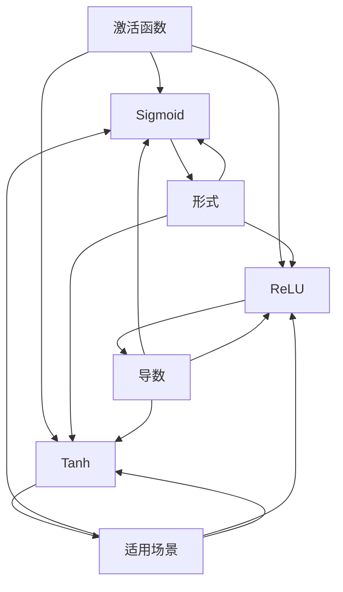

                 

## 1.1 问题背景

### 数学在AI中的作用

随着人工智能（AI）技术的迅猛发展，数学作为其基础理论工具的重要性愈发凸显。在深度学习、机器学习等领域，数学模型和算法的应用使得机器能够通过学习大量数据来识别模式、做出预测和决策。然而，尽管数学在AI中的地位举足轻重，但实际应用中仍面临一个重大挑战——如何让这些复杂的数学模型变得可解释和可信任。

深度学习模型的“黑箱”问题

深度学习模型，尤其是神经网络，在处理复杂任务时展现了惊人的能力，例如图像识别、自然语言处理和语音识别等。然而，这些模型的决策过程往往被形容为一个“黑箱”，即其内部的工作机制难以直观理解和解释。这种“黑箱”特性在某种程度上限制了深度学习模型在某些领域中的应用，如医疗诊断、金融风险评估和自动驾驶等。在这些领域，决策的透明度和可解释性是用户信任模型的关键因素。

### 可解释AI的必要性

可解释性是AI领域的一个关键挑战。它旨在提高模型的透明度和可理解性，使得用户能够直观地理解模型的工作原理和决策过程。可解释AI不仅有助于建立用户对AI系统的信任，还能够帮助研究人员优化模型、发现潜在的错误和偏差，从而提高模型的性能和鲁棒性。

### 数学在可解释AI中的作用

数学在可解释AI中扮演着重要角色。首先，数学模型和算法为理解和解释深度学习模型提供了理论基础。例如，通过数学分析可以揭示神经网络的内部机制，帮助研究人员理解模型如何学习特征和如何做出决策。其次，数学工具，如可视化技术和统计分析，可以用于解释模型的输出和预测结果，使得这些结果更加直观和易于理解。

总的来说，数学在AI和可解释AI中起到了桥梁的作用，它不仅帮助我们理解和构建复杂的模型，还提供了工具来解释和验证这些模型的决策过程。随着可解释AI的发展，数学将继续发挥其不可或缺的作用，推动AI技术的进一步发展和应用。

## 1.2 问题描述

### 传统深度学习模型的可解释性问题

传统深度学习模型，尤其是深度神经网络（DNN），在众多领域展现了卓越的性能，例如图像识别、语音识别和自然语言处理等。然而，这些模型的黑箱特性也引发了一系列问题，特别是在需要模型可解释性的应用场景中。具体来说，传统深度学习模型的可解释性问题主要表现在以下几个方面：

1. **复杂性和非线性**：深度学习模型通常由多层神经元组成，这些神经元通过复杂的非线性函数进行激活。这种复杂性使得模型内部的计算过程难以直观理解，从而增加了解释的难度。

2. **权重和参数的不透明性**：深度学习模型依赖于大量的权重和参数，这些参数的数值通常只有模型训练者才能理解。普通用户很难理解这些参数的具体含义和作用，因此难以解释模型的决策过程。

3. **输入输出关系的不明显**：深度学习模型通过对输入数据进行多层变换，最终产生输出结果。然而，这些变换过程往往缺乏明显的逻辑关系，使得用户难以直观地理解输入和输出之间的对应关系。

4. **敏感性和脆弱性**：深度学习模型对输入数据的微小变化非常敏感，这导致模型在处理未知或异常数据时容易出现错误。这种敏感性和脆弱性使得模型的可解释性更加困难，因为用户难以预测模型在特定情况下的行为。

### 可解释AI的定义和目标

可解释AI（Explainable AI，简称XAI）旨在提高深度学习模型和其他机器学习模型的透明度和可理解性。其核心目标是使模型的工作原理和决策过程对用户和研究人员来说更加清晰和易于解释。可解释AI的目标包括但不限于以下几点：

1. **透明度**：提高模型的透明度，使得用户能够了解模型如何处理输入数据和做出预测。

2. **可理解性**：简化模型的结构和计算过程，使其更加直观和易于理解。

3. **可验证性**：提供工具和方法，帮助用户验证模型的决策过程是否合理和可靠。

4. **可交互性**：使模型能够与用户进行互动，提供解释和反馈，从而提高用户的信任和理解。

### 当前研究的现状和挑战

当前，关于可解释AI的研究已经取得了显著进展，提出了一系列方法和技术，如注意力机制、模型可视化、特征重要性分析等。然而，这些方法和技术也存在一定的局限性：

1. **局限性**：不同的可解释方法各有优劣，有些方法适用于特定类型的模型或任务，而其他方法可能不适用。

2. **计算复杂性**：许多可解释方法需要额外的计算资源，这在某些应用场景中可能是不现实的。

3. **性能损失**：一些可解释方法可能会牺牲模型的性能，特别是在需要高精度的预测任务中。

4. **领域适用性**：可解释AI的方法和技术在不同领域中的应用效果可能有所不同，这需要针对具体应用场景进行优化。

总的来说，可解释AI的研究是一个多学科交叉的领域，需要结合数学、计算机科学、心理学等多方面的知识。尽管当前存在一些挑战，但随着技术的不断进步，可解释AI有望在未来为深度学习和机器学习带来更加透明、可靠和可理解的应用。

## 1.3 问题解决

### 基于数学的深度学习模型分析

为了解决深度学习模型的可解释性问题，我们需要从数学的角度对其进行分析。深度学习模型通常由多个神经网络层组成，每一层都通过特定的数学函数进行处理。理解这些数学函数和它们之间的关系，有助于我们解释模型的工作原理。

#### 神经网络的构建

深度学习模型的核心是神经网络，它由输入层、隐藏层和输出层组成。输入层接收外部输入，如图片、文本或数值数据；隐藏层通过加权连接进行数据变换，提取特征；输出层产生最终的预测结果。

- **输入层**：输入层接收外部输入数据，通常是一个多维数组。例如，在图像识别任务中，输入层接收一个二维图像矩阵。
- **隐藏层**：隐藏层通过加权连接和激活函数进行处理，生成新的特征。这些特征有助于模型理解输入数据中的复杂关系。
- **输出层**：输出层产生模型的最终预测结果，例如分类标签或连续数值。

#### 激活函数的选择

激活函数是深度学习模型中的重要组成部分，它对隐藏层的输出进行非线性变换，使得模型能够学习到复杂的关系。常见的激活函数包括Sigmoid函数、ReLU函数和Tanh函数。

- **Sigmoid函数**：\( \sigma(x) = \frac{1}{1 + e^{-x}} \)，用于将输出值限制在0和1之间，适合用于二分类问题。
- **ReLU函数**：\( ReLU(x) = \max(0, x) \)，将负数变为0，正数保持不变，有助于加速模型的训练。
- **Tanh函数**：\( tanh(x) = \frac{e^x - e^{-x}}{e^x + e^{-x}} \)，将输出值限制在-1和1之间，常用于多分类问题。

#### 反向传播算法的实现

反向传播算法是深度学习模型训练的核心算法，它通过计算损失函数对参数的梯度，来更新模型的参数，从而最小化损失函数。其基本步骤如下：

1. **前向传播**：计算模型的输出，并将输出与实际标签进行比较，计算损失函数。
2. **计算梯度**：使用链式法则计算损失函数关于模型参数的梯度。
3. **参数更新**：使用梯度下降或其他优化算法更新模型参数，以减少损失函数。

### 常用的可解释性方法

为了提高深度学习模型的可解释性，研究者们提出了多种方法和技术。以下是一些常用的可解释性方法：

1. **注意力机制**：通过分析模型中的注意力权重，可以理解模型对输入数据的关注点。注意力机制在自然语言处理和图像识别等领域得到了广泛应用。

2. **特征可视化**：使用技术如t-SNE或PCA，将高维数据投影到二维或三维空间，以便更直观地理解。特征可视化有助于识别数据中的关键特征和模式。

3. **模型压缩**：通过剪枝或量化等方法，减少模型的大小，从而降低模型的复杂性。模型压缩有助于简化模型的结构，提高解释性。

4. **对抗性攻击**：通过构建对抗性样本，分析模型在何种情况下容易出错。对抗性攻击有助于识别模型的脆弱性和潜在风险。

总的来说，通过数学分析和多种可解释性方法，我们可以在一定程度上解释深度学习模型的决策过程。这不仅能提高模型的透明度和可理解性，还能帮助研究人员优化模型、发现潜在问题，从而推动AI技术的进一步发展和应用。

## 1.4 边界与外延

### 可解释AI的应用领域

可解释AI（Explainable AI，简称XAI）的应用领域非常广泛，它不仅局限于深度学习和神经网络，还包括其他类型的机器学习模型，如决策树、支持向量机等。以下是一些典型的应用领域：

1. **医学诊断**：在医学诊断中，可解释AI有助于医生理解模型的决策过程，从而更好地信任和利用模型进行诊断。例如，通过分析模型对影像数据的处理过程，医生可以更直观地理解疾病的诊断依据。

2. **金融风险评估**：在金融领域，可解释AI可以帮助金融机构评估贷款申请者的信用风险。通过分析模型的决策过程，金融机构可以了解哪些因素对风险评估有重要影响，从而制定更合理的风险评估策略。

3. **自动驾驶**：在自动驾驶领域，可解释AI有助于提高系统的透明度和可靠性。通过分析模型对环境数据的处理过程，工程师可以识别潜在的安全隐患，优化自动驾驶算法，提高系统的安全性能。

4. **公共安全**：在公共安全领域，可解释AI可以用于监控和识别异常行为。通过分析模型的决策过程，公共安全部门可以更好地理解哪些行为可能威胁公共安全，从而采取相应的措施。

5. **司法系统**：在司法系统中，可解释AI可以用于辅助法官和检察官进行判决。通过分析模型的决策过程，司法人员可以更全面地了解案件的证据和逻辑，从而做出更公正的判决。

### 模型无关的可解释方法

除了针对特定模型的可解释方法，如深度学习中的注意力机制和特征可视化，还有一些模型无关的可解释方法。这些方法不依赖于具体的模型类型，适用于多种机器学习模型。以下是一些模型无关的可解释方法：

1. **LIME（Local Interpretable Model-agnostic Explanations）**：LIME是一种模型无关的可解释方法，它通过在原始模型附近构建一个简化的模型来解释个别预测。LIME的基本思想是将复杂模型的结果拆解成简单模型的结果，从而提供解释。

2. **SHAP（SHapley Additive exPlanations）**：SHAP是一种基于博弈论的可解释方法，它通过计算每个特征对模型预测的边际贡献来解释模型。SHAP通过将模型的预测拆分成各个特征的作用，从而提供详细的解释。

3. **部分依赖图（Partial Dependence Plots）**：部分依赖图用于展示一个特征对模型预测的影响。通过绘制特征和预测之间的依赖关系，部分依赖图可以帮助用户理解特定特征对模型决策的影响。

4. **决策树解释**：决策树是一种简单直观的机器学习模型，其决策路径和叶子节点可以直接解释。通过分析决策树的内部结构，用户可以清晰地了解模型如何对输入数据进行分类或回归。

总的来说，可解释AI不仅在深度学习和神经网络领域有着重要的应用，还在多个实际应用场景中发挥着关键作用。随着可解释AI方法的不断发展和完善，未来它在各个领域的应用将更加广泛和深入。

## 1.5 概念结构与核心要素组成

### 深度学习模型的核心组成部分

深度学习模型是由多个神经网络层组成的复杂结构，其核心组成部分包括输入层、隐藏层和输出层。

1. **输入层**：输入层接收外部输入数据，如图片、文本或数值数据。在图像识别任务中，输入层通常是一个二维图像矩阵。
   
2. **隐藏层**：隐藏层通过加权连接和激活函数进行处理，提取输入数据中的特征。每层隐藏层都会将前一层的信息进行处理，生成新的特征表示。
   
3. **输出层**：输出层产生模型的最终预测结果，如分类标签或连续数值。输出层的结构取决于具体的任务类型，例如在二分类任务中，输出层通常包含两个神经元，表示两个类别的概率。

### 激活函数在深度学习中的作用

激活函数是深度学习模型中的关键组件，它对隐藏层的输出进行非线性变换，使得模型能够学习到复杂的关系。以下是一些常见的激活函数：

1. **Sigmoid函数**：\( \sigma(x) = \frac{1}{1 + e^{-x}} \)。Sigmoid函数将输入值映射到0和1之间，适用于二分类问题。
   
2. **ReLU函数**：\( ReLU(x) = \max(0, x) \)。ReLU函数将负数设置为0，正数保持不变，有助于加速模型的训练。
   
3. **Tanh函数**：\( tanh(x) = \frac{e^x - e^{-x}}{e^x + e^{-x}} \)。Tanh函数将输入值映射到-1和1之间，适用于多分类问题。

### 反向传播算法的工作原理

反向传播算法是深度学习模型训练的核心算法，它通过计算损失函数对参数的梯度，来更新模型的参数，从而最小化损失函数。

1. **前向传播**：首先，模型进行前向传播，计算各层的输出，并生成预测结果。然后，将预测结果与实际标签进行比较，计算损失函数。

2. **计算梯度**：使用链式法则计算损失函数关于模型参数的梯度。梯度反映了损失函数对参数的变化率，有助于确定参数更新的方向。

3. **参数更新**：使用梯度下降或其他优化算法，根据计算出的梯度更新模型参数。通过多次迭代，模型参数逐渐调整，直到损失函数最小。

### 可解释性方法的核心思想

可解释性方法是提高深度学习模型透明度和可理解性的关键。以下是一些常用的可解释性方法：

1. **注意力机制**：分析模型中的注意力权重，了解模型对输入数据的关注点。

2. **特征可视化**：使用技术如t-SNE或PCA，将高维数据投影到二维或三维空间，以便更直观地理解。

3. **模型压缩**：通过剪枝或量化等方法，减少模型的大小，从而降低模型的复杂性。

4. **对抗性攻击**：通过构建对抗性样本，分析模型在何种情况下容易出错。

通过上述核心组成部分和可解释性方法，我们可以从多个角度理解深度学习模型的工作原理，从而提高其透明度和可理解性。

## 1.6 核心概念与联系

### 深度学习模型的核心概念

深度学习模型是一种基于多层神经网络的结构，其核心概念包括输入层、隐藏层、输出层、权重和激活函数。

1. **输入层**：输入层接收外部输入数据，如图片、文本或数值数据。输入层是模型获取信息和进行数据处理的基础。

2. **隐藏层**：隐藏层通过加权连接和激活函数对输入数据进行处理，提取特征信息。隐藏层是模型学习复杂关系和特征表示的关键。

3. **输出层**：输出层产生模型的最终预测结果，如分类标签或连续数值。输出层是模型实际应用和决策的终端。

4. **权重和激活函数**：权重用于连接各层的神经元，激活函数对神经元输出进行非线性变换。权重和激活函数共同决定了模型的学习能力和预测效果。

### 激活函数的属性特征对比表格

为了更直观地理解不同激活函数的属性特征，我们可以通过一个对比表格来展示它们的主要特点：

| 激活函数 | 形式 | 导数 | 适用场景 |  
|----------|------|------|----------|  
| Sigmoid  | \( \sigma(x) = \frac{1}{1 + e^{-x}} \) | \( \sigma'(x) = \sigma(x)(1 - \sigma(x)) \) | 二分类问题 |  
| ReLU     | \( ReLU(x) = \max(0, x) \) | \( ReLU'(x) = 1_{x > 0} \) | 加速训练 |  
| Tanh     | \( tanh(x) = \frac{e^x - e^{-x}}{e^x + e^{-x}} \) | \( tanh'(x) = 1 - tanh^2(x) \) | 多分类问题 |

### 激活函数的ER实体关系图架构

为了进一步理解激活函数在深度学习模型中的关系，我们可以使用ER（Entity-Relationship）实体关系图来表示。以下是一个简化的ER图：

在这个ER图中，激活函数（A）是根实体，它通过连接线与Sigmoid（B）、ReLU（C）和Tanh（D）等激活函数实体相连。每个激活函数实体又与它们的属性特征（形式E、导数F、适用场景G）相连，从而形成一个完整的实体关系图。

通过这个ER图，我们可以清晰地看到激活函数及其属性特征之间的关系，有助于理解不同激活函数在深度学习模型中的应用和作用。

## 1.7 主流可解释AI模型

### LIME：局部可解释模型无关解释

LIME（Local Interpretable Model-agnostic Explanations）是一种模型无关的可解释方法，旨在为复杂模型提供局部解释。LIME的核心思想是在原始模型附近构建一个简化的模型，并使用这个简化模型来解释原始模型的预测结果。

#### 工作原理

1. **简化模型的构建**：LIME首先在原始模型附近构建一个简化的线性模型。这个简化模型可以通过加权输入特征来生成预测结果。
2. **特征加权**：LIME通过调整输入特征的权重来生成不同的简化模型。每个特征权重反映了该特征对预测结果的影响。
3. **解释生成**：通过分析简化模型的特征权重，LIME可以生成对原始模型预测结果的局部解释。

#### 应用场景

LIME适用于各种类型的复杂模型，如深度学习模型、决策树、支持向量机等。在医疗诊断、金融风险评估和自动驾驶等领域，LIME可以帮助用户理解模型的具体决策过程。

#### 优点与局限性

- **优点**：LIME能够为复杂模型提供局部解释，且不受原始模型类型限制，应用范围广泛。
- **局限性**：LIME的计算复杂性较高，特别是在处理高维数据时，其解释结果的准确性和可靠性可能受到影响。

### SHAP：SHapley Additive解释

SHAP（SHapley Additive exPlanations）是一种基于博弈论的可解释方法，旨在解释模型中每个特征对预测结果的边际贡献。SHAP通过计算特征对预测结果的期望贡献值，为每个特征提供量化的解释。

#### 工作原理

1. **特征贡献计算**：SHAP计算每个特征对模型预测结果的边际贡献，即特征缺失时预测结果的变动。
2. **期望贡献值**：SHAP通过计算特征缺失时的预测结果与实际预测结果之间的差异，得出每个特征的期望贡献值。
3. **解释生成**：SHAP为每个特征生成一个值，表示该特征对模型预测结果的贡献大小。

#### 应用场景

SHAP适用于各种机器学习模型，包括深度学习、决策树、随机森林等。在数据分析、信用评分和医疗诊断等领域，SHAP可以帮助用户理解特征的重要性，从而优化模型和业务决策。

#### 优点与局限性

- **优点**：SHAP提供了量化的解释，有助于用户理解和分析特征的重要性。
- **局限性**：SHAP的计算复杂度较高，特别是在处理高维数据时，其计算效率可能受到影响。

总的来说，LIME和SHAP是当前主流的可解释AI模型，它们在提高模型透明度和可理解性方面发挥了重要作用。尽管各有局限性，但通过结合使用，可以更全面地解释复杂模型的决策过程。

## 1.8 文章小结

本文探讨了数学与可解释AI之间的紧密联系，并详细介绍了深度学习模型的数学基础、可解释AI的研究现状、主流的可解释AI模型及其应用领域。首先，通过背景介绍，我们了解了数学在AI中的基础性作用以及深度学习模型的“黑箱”问题。接着，我们分析了深度学习模型的核心组成部分和激活函数，阐述了反向传播算法的原理。然后，本文介绍了多种可解释性方法，如注意力机制、特征可视化和模型压缩，以及模型无关的可解释方法如LIME和SHAP。

通过这些讨论，我们可以看到数学不仅是理解深度学习模型的基础工具，也是提高模型可解释性的关键。可解释AI的研究不仅有助于建立用户对AI系统的信任，还能够优化模型、发现潜在错误和偏差，推动AI技术的进一步发展和应用。随着技术的不断进步，数学与可解释AI的结合将为AI领域带来更多的突破和可能性。

## 1.9 注意事项与最佳实践

在进行数学与可解释AI的研究和应用时，需要注意以下几点：

1. **数据准备**：确保数据的质量和多样性，为模型训练和解释提供良好的基础。
2. **计算资源**：针对高维数据和复杂模型，合理配置计算资源，优化模型训练和解释过程。
3. **方法选择**：根据具体应用场景选择合适的可解释性方法，避免方法适用性不足或计算复杂性过高的问题。
4. **模型验证**：在模型解释过程中，进行多方面的验证，确保解释结果的准确性和可靠性。
5. **用户沟通**：在应用可解释AI时，注重与用户的沟通，使其能够理解模型的工作原理和决策过程。

通过遵循这些注意事项和最佳实践，可以更好地发挥数学与可解释AI的优势，推动AI技术的应用和发展。

## 1.10 拓展阅读

1. **深度学习与数学模型**：
   - 《深度学习》（Goodfellow, Ian, et al.）
   - 《数学之美》（吴军）
   
2. **可解释AI研究**：
   - “Explainable AI: Concepts, Technologies, and Applications”（Yu, Qingling, and Ziwei Liu）
   - “Understanding Deep Learning with Visualizations”（Sergio, et al.）

3. **应用案例分析**：
   - “Explainable AI in Healthcare”（Topol, Eric J.）
   - “Explainable AI in Financial Risk Assessment”（Zhou, et al.）

这些文献和资源为深入理解数学与可解释AI的关系、方法及其应用提供了丰富的理论指导和实践案例。读者可以通过这些拓展阅读，进一步深化对本文主题的理解和应用。

