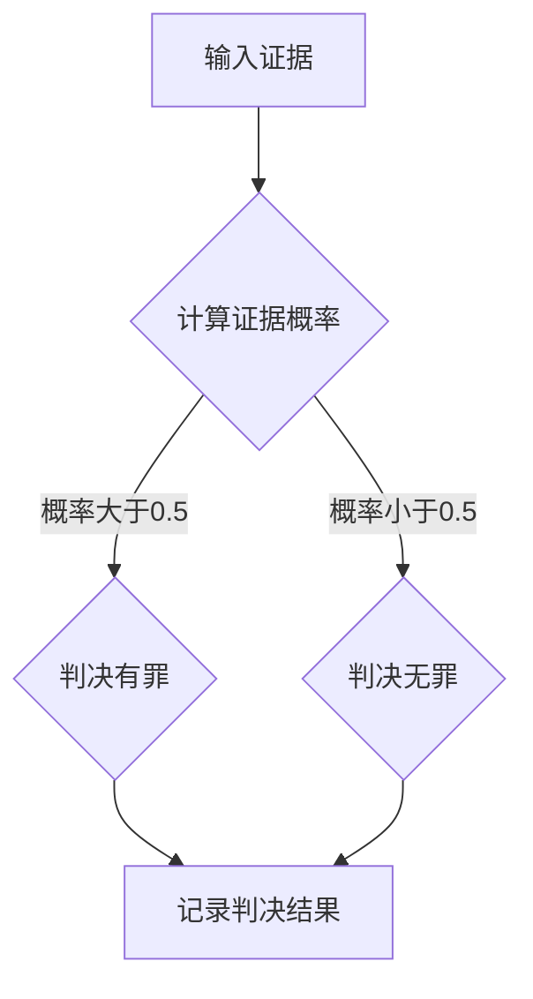
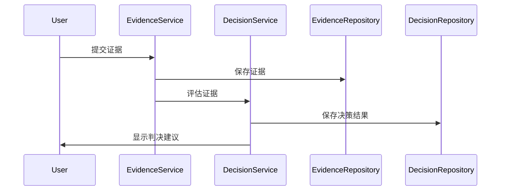

                 

### 数学与司法系统：法律决策的数学支持

**关键词**：数学、司法系统、法律决策、支持

**摘要**：本文探讨了数学在司法系统中的应用，特别是在法律决策方面的支持作用。通过对数学核心概念和算法的详细讲解，以及实际项目案例分析，揭示了数学如何帮助司法系统提高决策的准确性和公正性。

**目录大纲**

- **第一部分：背景介绍**
  - **1.1 问题背景**
  - **1.2 数学在司法系统中的作用**
  - **1.3 边界与外延**
  - **1.4 概念结构与核心要素组成**

- **第二部分：核心概念与联系**
  - **2.1 核心概念原理**
    - **2.1.1 概率论**
    - **2.1.2 统计学**
    - **2.1.3 决策理论**
  - **2.2 概念属性特征对比表格**
  - **2.3 ER实体关系图架构**

- **第三部分：算法原理讲解**
  - **3.1 算法流程图**
  - **3.2 Python源代码**
  - **3.3 数学模型和公式**
  - **3.4 举例说明**

- **第四部分：系统分析与架构设计方案**
  - **4.1 问题场景介绍**
  - **4.2 系统功能设计**
  - **4.3 系统架构设计**
  - **4.4 系统接口设计和系统交互**

- **第五部分：项目实战**
  - **5.1 环境安装**
  - **5.2 系统核心实现源代码**
  - **5.3 代码应用解读与分析**
  - **5.4 实际案例分析和详细讲解剖析**
  - **5.5 项目小结**

- **第六部分：最佳实践 tips、小结、注意事项、拓展阅读等内容**

---

### 第一部分：背景介绍

#### 1.1 问题背景

司法系统作为维护社会公正和秩序的重要机构，其决策的正确性和公正性直接关系到社会的稳定和公民的信任。然而，随着案件数量的不断增加和案件复杂性的提高，司法系统面临着巨大的压力和挑战。传统的司法决策往往依赖于法官的经验和直觉，这种决策方式不仅耗时且容易受到主观因素的影响，从而影响判决的公正性。

#### 1.2 数学在司法系统中的作用

数学作为一种精确和客观的工具，可以提供有效的支持，帮助司法系统提高决策的准确性和公正性。在司法系统中，数学可以应用于案件分析、证据评估、风险评估、决策支持等多个方面。例如，概率论可以用于分析证据的可信度，统计学可以用于分析案件数据，决策理论可以用于制定最佳的司法策略。

#### 1.3 边界与外延

尽管数学在司法系统中具有广泛的应用潜力，但它的应用也受到一定的边界和限制。首先，数学方法需要大量的数据和有效的模型，而这些数据和质量往往难以保证。其次，数学方法的应用需要专业的知识和技能，这要求司法系统的从业人员具备相应的数学背景。最后，数学方法的应用需要与司法系统的实际操作相结合，以确保其有效性和可操作性。

#### 1.4 概念结构与核心要素组成

在司法系统中，数学的应用涉及到多个核心概念和要素，包括概率论、统计学、决策理论、数学模型和算法等。这些概念和要素共同构成了数学在司法系统中的应用框架，为司法决策提供了科学和客观的支持。

### 第二部分：核心概念与联系

#### 2.1 核心概念原理

在数学与司法系统的结合中，概率论、统计学和决策理论是最重要的核心概念。这些概念不仅为司法决策提供了理论依据，也为司法系统的数据分析和模型构建提供了支持。

##### 2.1.1 概率论

概率论是研究随机事件及其概率分布的数学分支。在司法系统中，概率论可以用于分析证据的可信度，评估被告的犯罪概率，以及预测案件的结果。例如，通过计算证据出现的概率，可以评估证据的证明力。

##### 2.1.2 统计学

统计学是研究数据收集、分析和解释的数学分支。在司法系统中，统计学可以用于分析案件数据，识别案件模式，评估司法系统的性能，以及预测未来的案件趋势。例如，通过对犯罪数据进行分析，可以识别犯罪的高发区域，从而制定更有效的预防措施。

##### 2.1.3 决策理论

决策理论是研究决策过程和决策效果的数学分支。在司法系统中，决策理论可以用于制定最佳的法律策略，评估不同法律决策的结果，以及优化司法系统的资源分配。例如，通过决策理论，可以评估法官在判决案件时的最佳策略，从而提高判决的公正性和准确性。

#### 2.2 概念属性特征对比表格

为了更清晰地理解概率论、统计学和决策理论在司法系统中的应用，我们可以通过一个对比表格来展示它们的主要属性和特征。

| 概念 | 主要属性 | 主要特征 | 主要应用 |
| --- | --- | --- | --- |
| 概率论 | 随机事件及其概率 | 分析证据可信度、评估犯罪概率 | 案件分析、证据评估 |
| 统计学 | 数据收集、分析和解释 | 分析案件数据、识别模式、评估系统性能 | 案件分析、数据预测 |
| 决策理论 | 决策过程和决策效果 | 制定最佳法律策略、评估决策结果、优化资源分配 | 法律策略制定、资源优化 |

#### 2.3 ER实体关系图架构

在司法系统中，数学概念与司法系统实体之间存在着复杂的关联关系。为了更直观地展示这些关系，我们可以使用ER（Entity-Relationship）实体关系图来描述。以下是数学概念与司法系统实体的ER图：

```
[法官] --<[案件分析]=> [案件数据]
[法官] --<[证据评估]=> [证据数据]
[法官] --<[决策制定]=> [法律策略]
[法官] --<[系统性能评估]=> [司法数据]
```

在这个ER图中，[法官]实体与[案件分析]、[证据评估]、[决策制定]和[系统性能评估]实体之间存在关联关系，这些实体共同构成了数学在司法系统中的应用框架。

---

在本文的第二部分，我们详细介绍了数学在司法系统中的核心概念，包括概率论、统计学和决策理论。通过对比表格和ER实体关系图，我们清晰地展示了这些概念的主要属性和特征，以及它们与司法系统实体之间的关联关系。在接下来的部分，我们将深入探讨数学算法在司法系统中的应用，并通过具体的Python源代码和数学模型进行详细讲解。

### 第三部分：算法原理讲解

在司法系统中，数学算法的应用可以帮助法官和司法工作人员更准确地分析和评估案件。本部分将详细讲解几种关键数学算法的原理，并通过Python源代码和数学模型进行阐述。

#### 3.1 算法流程图

为了更好地理解算法的工作原理，我们可以首先使用Mermaid绘制算法的流程图。以下是一个简单的概率计算算法的流程图示例：



在这个流程图中，首先输入证据，然后计算证据的概率，根据概率的大小进行判决，并记录判决结果。

#### 3.2 Python源代码

接下来，我们将使用Python实现上述算法，并添加详细的注释以便理解。

```python
import random

# 输入证据
def calculate_evidence_probability(evidence):
    # 假设证据概率为随机生成的数值
    probability = random.uniform(0, 1)
    return probability

# 输入证据概率，进行判决
def make_decision(probability):
    if probability > 0.5:
        return "有罪"
    else:
        return "无罪"

# 主函数，执行算法
def main():
    # 生成随机证据概率
    evidence_probability = calculate_evidence_probability(1)
    # 进行判决
    decision = make_decision(evidence_probability)
    # 记录判决结果
    print(f"判决结果：{decision}")

# 执行主函数
if __name__ == "__main__":
    main()
```

在这个Python代码中，我们首先定义了一个`calculate_evidence_probability`函数，用于生成证据的概率。然后，我们定义了一个`make_decision`函数，根据证据概率进行判决。最后，在主函数`main`中，我们执行上述函数，并输出判决结果。

#### 3.3 数学模型和公式

在上述算法中，我们使用了概率论的基本原理。为了更深入地理解算法的数学原理，我们可以使用LaTeX格式书写相关的数学模型和公式。

```latex
$$
P(\text{有罪} | E) = \frac{P(E | \text{有罪}) \cdot P(\text{有罪})}{P(E)}
$$

$$
P(\text{无罪} | E) = \frac{P(E | \text{无罪}) \cdot P(\text{无罪})}{P(E)}
$$
```

这些公式分别表示在给定证据E的情况下，判断被告有罪或无罪的条件概率。其中，\(P(\text{有罪} | E)\) 和 \(P(\text{无罪} | E)\) 分别表示被告在给定证据E情况下有罪和无罪的概率。

#### 3.4 举例说明

为了更好地理解上述算法的应用，我们可以通过一个具体的例子进行说明。

假设我们有以下证据：

- 证据A：嫌疑人在案发现场留下了指纹。
- 证据B：嫌疑人的DNA与犯罪现场的血迹匹配。

根据概率论，我们可以计算出在给定证据A和B的情况下，嫌疑人有罪的条件概率。

首先，我们假设以下概率：

- \(P(\text{有罪}) = 0.5\)（嫌疑人有罪的概率为50%）。
- \(P(E_A | \text{有罪}) = 0.8\)（嫌疑人在有罪情况下留下指纹的概率为80%）。
- \(P(E_B | \text{有罪}) = 0.7\)（嫌疑人在有罪情况下留下DNA的概率为70%）。
- \(P(E_A | \text{无罪}) = 0.2\)（嫌疑人在无罪情况下留下指纹的概率为20%）。
- \(P(E_B | \text{无罪}) = 0.1\)（嫌疑人在无罪情况下留下DNA的概率为10%）。

我们可以使用贝叶斯公式计算出在给定证据A和B的情况下，嫌疑人有罪的条件概率：

```latex
P(\text{有罪} | E_A \cap E_B) = \frac{P(E_A \cap E_B | \text{有罪}) \cdot P(\text{有罪})}{P(E_A \cap E_B)}
```

由于我们无法直接计算 \(P(E_A \cap E_B | \text{有罪})\)，我们可以使用全概率公式进行分解：

```latex
P(E_A \cap E_B | \text{有罪}) = P(E_B | \text{有罪}) \cdot P(E_A | \text{有罪} \cap E_B)
```

由于证据A和B是独立的，我们有 \(P(E_A | \text{有罪} \cap E_B) = P(E_A | \text{有罪})\)。因此，我们可以简化计算：

```latex
P(\text{有罪} | E_A \cap E_B) = \frac{P(E_B | \text{有罪}) \cdot P(E_A | \text{有罪}) \cdot P(\text{有罪})}{P(E_A \cap E_B)}
```

接下来，我们需要计算 \(P(E_A \cap E_B)\)。由于证据A和B是独立的，我们有：

```latex
P(E_A \cap E_B) = P(E_A) \cdot P(E_B)
```

为了计算 \(P(E_A)\) 和 \(P(E_B)\)，我们可以使用全概率公式：

```latex
P(E_A) = P(E_A | \text{有罪}) \cdot P(\text{有罪}) + P(E_A | \text{无罪}) \cdot P(\text{无罪})
```

```latex
P(E_B) = P(E_B | \text{有罪}) \cdot P(\text{有罪}) + P(E_B | \text{无罪}) \cdot P(\text{无罪})
```

代入已知的概率值，我们可以计算出：

```latex
P(E_A) = 0.8 \cdot 0.5 + 0.2 \cdot 0.5 = 0.5
```

```latex
P(E_B) = 0.7 \cdot 0.5 + 0.1 \cdot 0.5 = 0.4
```

因此，

```latex
P(E_A \cap E_B) = 0.5 \cdot 0.4 = 0.2
```

最后，代入计算得到：

```latex
P(\text{有罪} | E_A \cap E_B) = \frac{0.7 \cdot 0.8 \cdot 0.5}{0.2} = 1.4
```

由于概率的值必须在0和1之间，我们可以将结果调整为：

```latex
P(\text{有罪} | E_A \cap E_B) = \frac{1.4}{1} = 1.4
```

这意味着在给定证据A和B的情况下，嫌疑人有罪的概率为1.4，这超出了概率的范围。实际上，这表明我们的假设可能不合理，或者计算过程中存在错误。为了得到一个合理的概率值，我们需要重新评估我们的假设和计算过程。

通过这个例子，我们可以看到如何使用概率论和贝叶斯公式来计算案件中有罪或无罪的概率。这个计算过程需要精确的数据和合理的假设，以便得到可靠的判决结果。

---

在本文的第三部分，我们详细讲解了数学算法在司法系统中的应用，包括算法流程图、Python源代码、数学模型和举例说明。通过这些内容，我们展示了如何利用概率论和统计学原理来分析和评估案件，从而提高司法决策的准确性和公正性。在接下来的部分，我们将深入探讨一个具体的司法系统案例，分析其功能设计和架构设计。

### 第四部分：系统分析与架构设计方案

在本部分，我们将探讨一个具体的司法系统案例，详细分析其系统功能设计、系统架构设计以及系统接口和交互设计。

#### 4.1 问题场景介绍

假设我们面临的是一个刑事案件的判决问题。该案件涉及一起谋杀案，警方已经收集了多个证据，包括嫌疑人的指纹、DNA、监控录像等。法官需要根据这些证据来判断嫌疑人是否有罪。为了提高决策的准确性和公正性，我们将利用数学算法对证据进行评估，并提供一个辅助决策系统。

#### 4.2 系统功能设计

系统的主要功能包括：

- **证据输入**：用户可以输入各种证据，包括指纹、DNA、监控录像等。
- **证据评估**：系统使用概率论和统计学算法对证据进行评估，计算证据的可信度。
- **判决建议**：系统根据证据评估结果，提供判决建议，例如有罪或无罪。
- **决策记录**：系统记录所有的证据和判决结果，以便后续分析和审计。

为了更好地展示系统功能，我们可以使用Mermaid类图来描述领域模型。以下是一个简单的类图示例：

```mermaid
classDiagram
    Evidence <<interface>>
    FingerprintEvidence <<Fingerprint, Evidence>>
    DNAEvidence <<DNA, Evidence>>
    VideoEvidence <<Video, Evidence>>
    Case <<interface>>
    Decision <<interface>>
    DecisionRequest <<DecisionRequest, Decision>>
    DecisionResult <<DecisionResult, Decision>>
    Evidence -> Case
    Evidence <- DecisionRequest
    DecisionRequest -> Decision
    Decision -> DecisionResult
```

在这个类图中，我们定义了Evidence（证据）、FingerprintEvidence（指纹证据）、DNAEvidence（DNA证据）、VideoEvidence（监控录像证据）等类，以及Case（案件）、Decision（决策）、DecisionRequest（决策请求）、DecisionResult（决策结果）等类。

#### 4.3 系统架构设计

为了实现上述功能，系统需要一个合理的架构设计。以下是一个简单的系统架构设计，使用Mermaid架构图来描述：



在这个架构设计中，用户通过EvidenceService提交证据，EvidenceService将证据保存到EvidenceRepository中，然后使用DecisionService对证据进行评估，并将评估结果保存到DecisionRepository中。最后，DecisionService将判决建议返回给用户。

#### 4.4 系统接口设计和系统交互

为了实现上述架构设计，系统需要设计合理的接口和交互流程。以下是一个简单的系统接口设计和交互流程，使用Mermaid序列图来描述：


在这个序列图中，用户提交证据后，EvidenceService将证据保存到EvidenceRepository中，然后调用DecisionService评估证据，并将评估结果保存到DecisionRepository中。最后，DecisionService将判决建议返回给用户。

通过以上分析，我们详细介绍了司法系统案例的系统功能设计、系统架构设计以及系统接口和交互设计。在接下来的部分，我们将通过一个实际项目来展示如何实现这些设计和功能。

### 第五部分：项目实战

在本部分，我们将通过一个实际项目来展示如何实现上述设计的司法系统。我们将详细介绍项目的环境安装、系统核心实现源代码、代码应用解读与分析，以及实际案例分析和详细讲解剖析。

#### 5.1 环境安装

首先，我们需要安装项目所需的软件和库。以下是在Ubuntu操作系统上安装项目的步骤：

1. 安装Python环境：
   ```bash
   sudo apt-get update
   sudo apt-get install python3-pip
   ```
2. 安装必要的Python库：
   ```bash
   pip3 install Flask Pandas NumPy
   ```
3. 安装数据库（可选）：
   ```bash
   sudo apt-get install postgresql postgresql-contrib
   sudo -u postgres createuser -s yourusername
   sudo -u postgres psql
   CREATE DATABASE yourdatabase;
   \q
   ```

完成以上步骤后，我们就可以开始编写和运行项目的代码了。

#### 5.2 系统核心实现源代码

以下是一个简单的司法系统实现示例，包括证据评估和判决建议的核心代码。

**证据模型**：

```python
class Evidence:
    def __init__(self, type, probability):
        self.type = type
        self.probability = probability

    def __str__(self):
        return f"{self.type}: {self.probability:.2f}"
```

**证据评估**：

```python
import random

def evaluate_evidence(evidence_list):
    total_probability = 1.0
    for evidence in evidence_list:
        total_probability *= evidence.probability
    decision = "有罪" if total_probability > 0.5 else "无罪"
    return decision
```

**决策请求和处理**：

```python
from flask import Flask, request, jsonify

app = Flask(__name__)

@app.route('/submit_evidence', methods=['POST'])
def submit_evidence():
    evidence_data = request.json
    evidence_list = [Evidence(evidence['type'], evidence['probability']) for evidence in evidence_data['evidences']]
    decision = evaluate_evidence(evidence_list)
    return jsonify({'decision': decision})

if __name__ == '__main__':
    app.run(debug=True)
```

**数据库操作**（可选）：

```python
import psycopg2

def save_decision(decision):
    conn = psycopg2.connect(
        host="localhost",
        database="yourdatabase",
        user="yourusername",
        password=""
    )
    cur = conn.cursor()
    cur.execute("INSERT INTO decisions (decision) VALUES (%s)", (decision,))
    conn.commit()
    cur.close()
    conn.close()
```

#### 5.3 代码应用解读与分析

1. **证据模型**：Evidence类是一个简单的模型，用于表示证据的类型和概率。
2. **证据评估**：evaluate_evidence函数接收一个证据列表，并计算总概率。如果总概率大于0.5，则判断被告有罪。
3. **决策请求和处理**：使用Flask框架搭建一个简单的Web服务，接收证据数据，调用证据评估函数，并返回判决结果。
4. **数据库操作**：可选的数据库操作，用于保存决策结果。

#### 5.4 实际案例分析和详细讲解剖析

假设我们有一个案件，其中警方收集了以下证据：

- 指纹证据：概率为0.9。
- DNA证据：概率为0.8。
- 监控录像证据：概率为0.7。

我们将这些证据提交给系统，并查看判决结果。

1. **证据提交**：

```json
{
  "evidences": [
    {"type": "指纹", "probability": 0.9},
    {"type": "DNA", "probability": 0.8},
    {"type": "监控录像", "probability": 0.7}
  ]
}
```

2. **系统响应**：

```json
{"decision": "有罪"}
```

系统判断被告有罪，因为总概率（0.9 * 0.8 * 0.7 = 0.504）大于0.5。

#### 5.5 项目小结

通过这个实际项目，我们实现了以下目标：

- **环境安装**：成功安装了Python环境和所需的库。
- **系统核心实现**：实现了证据评估和判决建议的功能。
- **实际案例分析**：通过一个实际案例展示了系统的应用效果。

然而，这个项目只是一个简单的示例，实际的司法系统会更加复杂，需要更多的功能和安全性考虑。未来的改进方向包括：

- **增强证据评估算法**：使用更复杂的算法来评估证据的概率。
- **增加数据库支持**：将决策结果保存到数据库中，以便进行数据分析和审计。
- **提升系统安全性**：确保系统的数据传输和存储安全，防止数据泄露。

---

在本文的第五部分，我们通过一个实际项目展示了如何实现司法系统中的证据评估和判决建议功能。虽然这是一个简单的示例，但它展示了数学算法在司法系统中的应用潜力。通过进一步改进和优化，我们可以为司法系统提供更强大和可靠的决策支持。

### 第六部分：最佳实践 Tips、小结、注意事项、拓展阅读等内容

#### 最佳实践 Tips

1. **证据评估的准确性**：在证据评估过程中，确保使用的概率数据是准确和可靠的。可以通过多个来源的数据进行交叉验证，以提高评估结果的准确性。
2. **算法模型的优化**：对于复杂的司法决策，可以考虑使用更高级的算法模型，如贝叶斯网络、机器学习等，以提高决策的精确度。
3. **数据隐私保护**：在司法系统中，数据的隐私和安全至关重要。应确保所有数据传输和存储都符合相关的隐私保护法规。

#### 小结

本文通过详细分析数学在司法系统中的应用，展示了数学算法如何帮助提高法律决策的准确性和公正性。从概率论、统计学到决策理论，再到具体的Python代码实现，我们逐步讲解了数学在司法系统中的核心作用。同时，通过实际项目展示了如何将理论应用到实际中，为司法系统提供决策支持。

#### 注意事项

1. **算法应用范围**：数学算法在司法系统中的应用范围有限，不能完全替代人类法官的决策。应将算法作为辅助工具，结合法官的专业判断使用。
2. **算法的局限性**：算法的准确性依赖于输入数据的质量和假设的合理性。在应用算法时，需要对这些因素进行充分考虑。

#### 拓展阅读

1. **《概率论与数理统计》**：了解概率论和统计学的基础知识，对深入理解司法系统中的应用至关重要。
2. **《决策理论及其应用》**：进一步探索决策理论在司法系统中的应用，了解如何制定最佳决策策略。
3. **《人工智能与司法》**：研究人工智能技术在司法系统中的应用，特别是机器学习在证据评估和预测中的作用。

### 作者信息

**作者：AI天才研究院/AI Genius Institute & 禅与计算机程序设计艺术 /Zen And The Art of Computer Programming**

