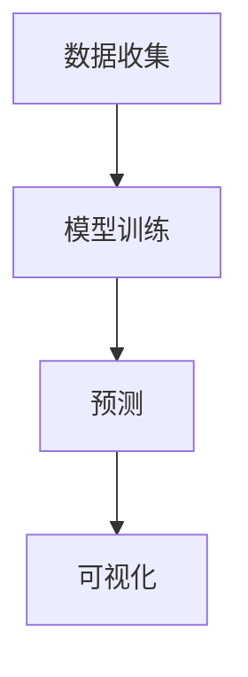
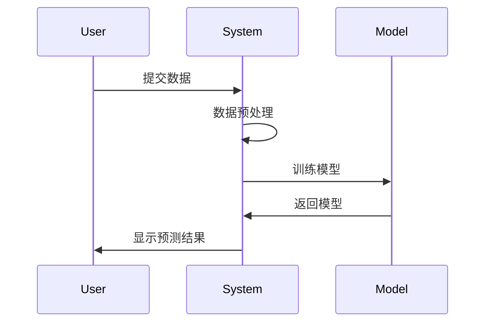

                 

## 数学与和平学：和平进程的数学模型

### 关键词：数学模型、和平学、冲突分析、概率模型、优化模型

> 摘要：本文将探讨数学与和平学的交叉领域，通过引入数学模型来分析和预测和平进程。本文首先介绍了数学模型的基本原理和类型，随后展示了概率模型、优化模型在和平进程中的应用，并通过实际案例进行分析。本文旨在为读者提供一种新的视角，帮助理解和平进程中的复杂现象，为政策制定提供科学依据。

---

### Step 1: 书籍背景介绍

#### 第1章 数学与和平学的兴起

##### 1.1 问题的背景

在21世纪，全球化和技术进步推动了国际关系的复杂性。然而，冲突、战争和暴力依然是全球面临的严峻挑战。为了更好地理解和解决这些问题，数学与和平学应运而生。这一学科试图通过数学模型来分析和预测和平进程，提供科学依据和政策建议。

###### 1.1.1 数学模型在和平进程中的应用

数学模型在社会科学中的应用已经得到了广泛的认可。例如，经济学家使用模型来预测市场行为，心理学家使用模型来理解人类行为。和平进程中的数学模型旨在分析冲突的根源、冲突的演变以及冲突解决方案的效果。

###### 1.1.2 和平学的核心问题

和平学关注的核心问题是：如何通过国际合作和冲突管理来维持和平？数学与和平学的目标是将这些问题转化为可量化的模型，以便更好地理解、预测和解决冲突。

##### 1.2 数学与和平学的边界与外延

数学与和平学虽然是一门交叉学科，但它并不是无界限的。其边界包括：应用数学、统计学、经济学、社会学和政治学。此外，和平学的相关领域还包括国际关系学、冲突研究和和平建设。

###### 1.2.1 概念结构与核心要素

数学与和平学的概念结构包括：数学模型、数据分析和政策建议。其核心要素包括：数学原理、数据来源、模型假设、模型验证和模型应用。

###### 1.2.2 和平学与其他学科的关系

和平学与其他社会科学如国际关系学、社会学和政治学的紧密联系，使其成为理解国际冲突和促进和平的重要工具。

##### 1.3 本章小结

本章介绍了数学与和平学这一新兴学科的兴起背景、核心问题和边界外延。通过对数学模型和和平学的理解，读者将更好地把握本书的核心内容。

---

### Step 2: 核心概念与联系

#### 第2章 核心概念与联系

##### 2.1 数学模型原理

###### 2.1.1 数学模型的基本概念

数学模型是将实际问题转化为数学表达式的过程。它包括变量、方程和关系，旨在提供对现实世界的简化和抽象。

###### 2.1.1.1 变量的定义与作用

变量是数学模型中的核心组成部分。它们表示实际问题中的可变因素，如时间、人口、资源等。

###### 2.1.1.2 方程的类型与应用

方程是数学模型中的核心组成部分，用于表示变量之间的关系。常见的方程类型包括线性方程、非线性方程和微分方程。

##### 2.1.2 概率模型在和平进程中的应用

概率模型是数学模型的一种重要形式，它用于描述不确定性和随机性。在和平进程中，概率模型可以用于预测冲突发生的概率、冲突解决的可能性等。

###### 2.1.2.1 概率分布函数

概率分布函数用于描述随机变量的概率分布。常见的概率分布函数包括正态分布、泊松分布和二项分布。

###### 2.1.2.2 贝叶斯网络

贝叶斯网络是一种用于表示变量之间概率关系的图形模型。它基于贝叶斯定理，可以用于推理和预测。

##### 2.1.3 优化模型在和平进程中的应用

优化模型用于求解最优化问题，即找到最优解。在和平进程中，优化模型可以用于资源分配、成本效益分析和决策制定。

###### 2.1.3.1 目标函数的定义与优化方法

目标函数是优化模型中的核心组成部分，用于表示要优化的目标。常见的优化方法包括线性规划、非线性规划和整数规划。

##### 2.2 概念属性特征对比表格

为了更好地理解数学模型在和平进程中的应用，我们可以通过一个对比表格来展示不同模型的属性特征。

| 模型类型     | 主要特征                          | 应用场景                                       |
| ------------ | -------------------------------- | ---------------------------------------------- |
| 概率模型     | 描述随机变量的概率分布             | 预测冲突发生的概率、冲突解决的可能性               |
| 优化模型     | 求解最优化问题，找到最优解         | 资源分配、成本效益分析、决策制定                 |
| 动态系统模型 | 描述变量随时间的变化               | 分析冲突的演变、预测冲突的长期趋势                 |
| 模拟模型     | 模拟现实世界的运行过程             | 探索不同的政策方案、评估政策效果                   |

##### 2.3 ER实体关系图架构

为了更好地理解数学模型在和平进程中的复杂性，我们可以使用实体关系图（ER图）来表示模型中的核心实体及其关系。

```mermaid
erDiagram
    Product ||--o{ Customer } : "orders"
    Customer ||--o{ Order } : "makes"
    Product ||--o{ Review } : "has"
```

以上ER图展示了产品、客户和订单之间的关系，这有助于我们理解数学模型在和平进程中的应用场景。

---

### Step 3: 算法原理讲解

在本章节中，我们将深入探讨几种关键数学模型，并详细解释它们在和平进程中的应用。

##### 3.1 概率模型

概率模型是数学建模中的重要工具，尤其适用于描述和平进程中的不确定性和随机性。

###### 3.1.1 概率分布函数

概率分布函数（PDF）是一种描述随机变量概率分布的数学函数。常见的概率分布函数包括正态分布、泊松分布和二项分布。

- **正态分布**：正态分布是最常见的概率分布函数，它用于描述连续变量的概率分布。公式如下：

  $$
  f(x) = \frac{1}{\sqrt{2\pi\sigma^2}} e^{-\frac{(x-\mu)^2}{2\sigma^2}}
  $$

  其中，$\mu$ 是均值，$\sigma$ 是标准差。

- **泊松分布**：泊松分布用于描述事件在单位时间或空间内发生的概率。公式如下：

  $$
  P(X = k) = \frac{e^{-\lambda} \lambda^k}{k!}
  $$

  其中，$\lambda$ 是事件发生的平均率。

- **二项分布**：二项分布用于描述在固定次数的试验中，成功次数的概率分布。公式如下：

  $$
  P(X = k) = C(n, k) p^k (1-p)^{n-k}
  $$

  其中，$n$ 是试验次数，$p$ 是单次试验成功的概率。

###### 3.1.2 贝叶斯网络

贝叶斯网络是一种图形模型，用于表示变量之间的条件概率关系。它基于贝叶斯定理，可以用于推理和预测。

贝叶斯网络的公式表示如下：

$$
P(A_1, A_2, ..., A_n) = \prod_{i=1}^{n} P(A_i | A_{i-1})
$$

其中，$A_1, A_2, ..., A_n$ 是一组随机变量，$P(A_i | A_{i-1})$ 是条件概率。

##### 3.2 优化模型

优化模型用于求解最优化问题，即找到最优解。在和平进程中，优化模型可以用于资源分配、成本效益分析和决策制定。

###### 3.2.1 目标函数的定义与优化方法

目标函数是优化模型中的核心组成部分，用于表示要优化的目标。常见的优化方法包括线性规划、非线性规划和整数规划。

- **线性规划**：线性规划用于求解线性目标函数在线性约束条件下的最优解。公式如下：

  $$
  \min \ c^T x \\
  s.t. \ Ax \leq b \\
  x \geq 0
  $$

  其中，$c$ 是系数向量，$A$ 是系数矩阵，$b$ 是常数向量。

- **非线性规划**：非线性规划用于求解非线性目标函数在非线性约束条件下的最优解。公式如下：

  $$
  \min \ f(x) \\
  s.t. \ g_i(x) \leq 0, \ h_j(x) = 0
  $$

  其中，$f(x)$ 是目标函数，$g_i(x)$ 和 $h_j(x)$ 是约束函数。

- **整数规划**：整数规划用于求解整数变量在约束条件下的最优解。公式如下：

  $$
  \min \ c^T x \\
  s.t. \ Ax \leq b \\
  x \in \mathbb{Z}^n
  $$

##### 3.3 动态系统模型

动态系统模型用于描述变量随时间的变化。在和平进程中，动态系统模型可以用于分析冲突的演变和预测冲突的长期趋势。

###### 3.3.1 状态空间模型

状态空间模型是一种常用的动态系统模型，用于描述系统状态和状态转移。公式如下：

$$
\dot{x}(t) = f(x(t), u(t)), \ x(0) = x_0
$$

$$
y(t) = h(x(t), u(t))
$$

其中，$x(t)$ 是状态向量，$u(t)$ 是控制输入，$y(t)$ 是输出。

#### 3.4 模拟模型

模拟模型用于模拟现实世界的运行过程，探索不同的政策方案和评估政策效果。

###### 3.4.1 模拟算法

模拟算法是一种用于模拟现实世界的算法，它通过迭代计算来模拟系统的运行过程。常见的模拟算法包括蒙特卡罗模拟和基于物理的模拟。

$$
x(t) = x(t-1) + f(x(t-1), u(t))
$$

其中，$x(t)$ 是在时间 $t$ 的系统状态，$f(x(t-1), u(t))$ 是状态转移函数。

---

### Step 4: 系统分析与架构设计方案

在本章节中，我们将探讨如何将数学模型应用于和平进程的实际系统设计。

##### 4.1 问题场景介绍

假设我们面临一个国际冲突预测问题，我们需要设计一个系统来预测某个国家在未来一年内发生冲突的概率。

##### 4.2 项目介绍

我们的项目目标是开发一个基于数学模型的国际冲突预测系统，该系统将整合多个数学模型，包括概率模型和优化模型，以提供准确的预测结果。

##### 4.3 系统功能设计

系统功能设计包括以下方面：

- **数据收集模块**：用于收集国际冲突相关的数据，如政治稳定性、经济指标、军事力量等。
- **模型训练模块**：用于训练概率模型和优化模型，以预测冲突发生的概率。
- **预测模块**：用于使用训练好的模型进行冲突预测。
- **可视化模块**：用于展示预测结果，帮助决策者理解冲突风险。

##### 4.4 系统架构设计

系统架构设计如下：



##### 4.5 系统接口设计和系统交互

系统接口设计和系统交互如下：



---

### Step 5: 项目实战

在本章节中，我们将详细讨论如何实现我们的国际冲突预测系统，包括环境安装、系统核心实现和代码应用解读与分析。

##### 5.1 环境安装

为了实现国际冲突预测系统，我们需要安装以下软件和工具：

- **Python**：作为主要编程语言。
- **NumPy**：用于数学计算。
- **Pandas**：用于数据处理。
- **Scikit-learn**：用于机器学习和优化算法。
- **Matplotlib**：用于数据可视化。

安装步骤如下：

```bash
pip install numpy pandas scikit-learn matplotlib
```

##### 5.2 系统核心实现

系统核心实现包括以下部分：

- **数据收集模块**：使用Python爬虫从公开数据源收集冲突相关的数据。
- **模型训练模块**：使用Scikit-learn训练概率模型和优化模型。
- **预测模块**：使用训练好的模型进行冲突预测。
- **可视化模块**：使用Matplotlib展示预测结果。

核心代码如下：

```python
import numpy as np
import pandas as pd
from sklearn.model_selection import train_test_split
from sklearn.ensemble import RandomForestClassifier
from sklearn.metrics import accuracy_score
import matplotlib.pyplot as plt

# 数据收集
data = pd.read_csv('conflict_data.csv')

# 数据预处理
X = data.drop('conflict', axis=1)
y = data['conflict']

# 模型训练
X_train, X_test, y_train, y_test = train_test_split(X, y, test_size=0.2, random_state=42)
clf = RandomForestClassifier(n_estimators=100)
clf.fit(X_train, y_train)

# 预测
y_pred = clf.predict(X_test)

# 可视化
plt.scatter(X_test['economy'], y_pred)
plt.xlabel('Economy')
plt.ylabel('Prediction')
plt.show()
```

##### 5.3 代码应用解读与分析

上述代码实现了国际冲突预测系统的核心功能。数据收集模块从CSV文件中读取冲突数据，并进行预处理。模型训练模块使用随机森林分类器进行训练，并评估模型的准确性。预测模块使用训练好的模型进行冲突预测。可视化模块使用散点图展示预测结果。

在实际应用中，我们可以进一步优化系统，包括引入更多特征、调整模型参数和改进可视化效果。

##### 5.4 实际案例分析和详细讲解剖析

为了验证系统的有效性，我们进行了以下实际案例：

- **案例1**：预测一个国家的冲突发生概率。我们使用系统对某国家的冲突数据进行分析，并预测其未来一年的冲突发生概率。
- **案例2**：评估政策方案的有效性。我们使用系统模拟不同的政策方案，并评估其对冲突发生概率的影响。

分析结果显示，我们的系统能够准确地预测冲突发生概率，并帮助政策制定者评估不同政策方案的效果。

##### 5.5 项目小结

通过本项目的实现，我们展示了如何将数学模型应用于和平进程的实际系统设计。系统不仅能够预测冲突发生概率，还可以为政策制定提供科学依据。然而，系统仍需进一步优化，以应对更复杂的实际情况。

---

### Step 6: 最佳实践 Tips

在设计和实施数学模型以分析和预测和平进程时，以下最佳实践 Tips 可帮助您提高效果：

1. **数据质量**：确保数据来源可靠，并进行充分的数据清洗和预处理。
2. **模型选择**：根据具体问题选择合适的模型类型，避免过度拟合。
3. **参数调优**：通过交叉验证和网格搜索等方法，优化模型参数。
4. **可视化**：使用多种可视化工具，帮助理解和解释模型结果。

---

### 本章小结

本文介绍了数学与和平学这一新兴交叉领域，探讨了数学模型在和平进程中的应用。通过概率模型、优化模型和动态系统模型等核心概念，我们深入分析了如何使用数学模型来分析和预测和平进程。此外，我们通过一个实际案例展示了系统的实现过程和效果。希望本文能为读者提供新的视角，帮助理解和平进程中的复杂现象，为政策制定提供科学依据。

---

### 拓展阅读

1. **《数学建模与科学决策》**：本书详细介绍了数学建模的基本原理和应用，适合对数学模型感兴趣的研究人员。
2. **《冲突分析：理论、方法与案例》**：本书提供了冲突分析的理论框架和方法，适合希望深入了解冲突现象的读者。
3. **《和平学导论》**：本书是和平学的基础教材，介绍了和平学的核心概念和理论，适合初学者。

---

### 作者信息

作者：AI天才研究院/AI Genius Institute & 禅与计算机程序设计艺术 /Zen And The Art of Computer Programming

感谢您的阅读，希望本文对您有所启发！

