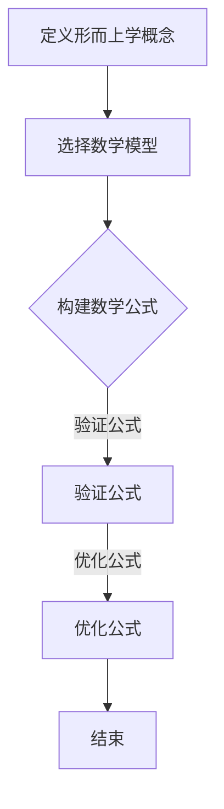
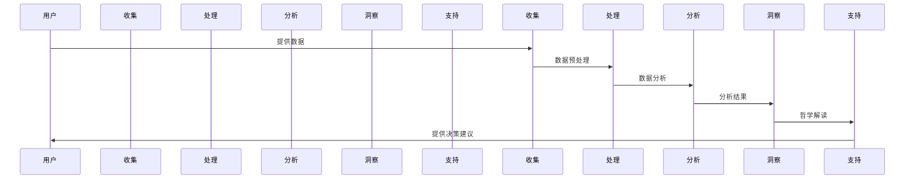

                 

## 第一部分：背景介绍

### 第1章：数学与哲学的交汇点

#### 1.1 数学与哲学的关系

数学与哲学自古以来就有着深厚的渊源。数学作为一门科学，以严谨的逻辑和抽象的思维构建了人类认识世界的工具。而哲学，作为对存在、知识、价值观等根本问题的探讨，不仅需要逻辑推理，更需要深刻的洞察和哲学思辨。

**1.1.1 数学在哲学中的角色**

数学在哲学中扮演着不可或缺的角色。首先，数学为哲学提供了基本的逻辑工具，使得哲学论证更加严密。在柏拉图的《理想国》中，数学就被视为达到真理和理性的必经之路。此外，数学在自然科学中应用广泛，其抽象和推理方法对哲学的发展也有着重要影响。

**1.1.2 哲学对数学的影响**

哲学对数学的影响同样深远。哲学中的概念和思想往往引导数学家的研究方向和思考方式。例如，古希腊哲学家亚里士多德关于元素和结构的理论，对后来的数学家如欧几里得和牛顿产生了深远的影响。

**1.1.3 形而上学的数学表达**

形而上学，即超越物质现象探讨世界本质的哲学思考，其概念常常具有抽象性和普遍性。数学作为一种高度抽象的学科，为形而上学概念的精确表达提供了可能。例如，数学结构可以用来描述形而上学中的关系和模式。

#### 1.2 形而上学的概念解析

形而上学作为一个哲学分支，探讨的是超越经验事实的终极问题。其核心概念包括存在、本质、因果性等。

**1.2.1 形而上学的定义**

形而上学可以定义为对现实世界本质的探讨。它试图回答诸如“世界是什么？”“存在是什么意思？”等根本问题。

**1.2.2 形而上学的主要问题**

形而上学主要探讨的问题包括：

- 存在：探讨什么构成现实。
- 本质：探讨事物存在的本质。
- 因果性：探讨事件之间的因果关系。
- 真理：探讨真理的本质和获取方法。

**1.2.3 形而上学的数学表达尝试**

形而上学的概念常常通过数学模型来尝试表达。例如，数学结构可以用来描述因果关系，集合论可以用来探讨存在的本质。数学作为一种高度抽象的工具，能够帮助哲学家更精确地表达和探讨形而上学问题。

#### 1.3 现代数学与形而上学的联系

现代数学与形而上学的联系日益紧密。数学逻辑和形式系统为哲学提供了工具，而形而上学的概念则为数学研究提供了方向。

**1.3.1 数学逻辑与形而上学概念**

数学逻辑是现代数学的基础，其形式化和精确性为哲学概念提供了支持。例如，命题逻辑和谓词逻辑可以用来分析哲学论证的有效性。

**1.3.2 数学结构在形而上学中的应用**

数学结构，如群、环、域等，可以用来描述形而上学中的关系和模式。例如，关系结构可以用来探讨因果关系，代数结构可以用来描述事物的本质。

**1.3.3 数学与形而上学的互动**

数学和形而上学之间的互动是相互的。数学家从形而上学中获得灵感，而哲学家则通过数学工具探讨哲学问题。这种互动不仅促进了数学和哲学的发展，也为人类对世界的理解提供了新的视角。

### 总结

数学与哲学的交汇点在于它们共同的追求——理解世界和探索真理。数学通过其抽象和推理方法为哲学提供了工具，而哲学则通过其深刻的思考和概念为数学提供了方向。形而上学的概念通过数学模型得以更精确地表达，这使得数学和哲学在探讨世界本质的过程中相互促进，共同发展。

---

### 第2章：数学与哲学的关键概念

#### 2.1 数学概念与哲学关联

数学与哲学中的关键概念具有深刻的联系。数学作为一门研究数量、结构、变化和空间的科学，其核心概念常常与哲学中的基本问题相互映射。以下是对几个关键概念的简要解析及其哲学意义：

**2.1.1 数学概念及其哲学意义**

1. **集合论**：集合论是现代数学的基础。在哲学中，集合论可以用来探讨存在和实在性。例如，集合的构成和性质可以用来分析哲学中的“存在”概念。

2. **逻辑学**：逻辑学作为数学的一个分支，探讨推理和论证的有效性。在哲学中，逻辑学是哲学论证的重要工具，用于分析和验证哲学论断的正确性。

3. **拓扑学**：拓扑学研究空间的性质和结构。在哲学中，拓扑学可以用来探讨实体和现象之间的关系，以及它们如何构成整体。

**2.1.2 哲学概念与数学表达**

哲学中的许多概念可以通过数学模型来表达。以下是一些例子：

1. **因果关系**：因果关系可以用拓扑结构来描述。例如，事件A导致事件B，可以看作是A与B之间的拓扑关系。

2. **本质与属性**：本质和属性可以用集合论和代数结构来表达。例如，一个物体的属性可以看作是该物体集合的子集。

**2.1.3 概念对比表格**

为了更直观地展示数学概念与哲学概念之间的关联，我们可以创建一个对比表格：

| 哲学概念      | 数学概念       | 关联解释                         |
| ------------- | -------------- | -------------------------------- |
| 存在          | 集合           | 集合的存在性可以通过成员关系表达 |
| 因果关系      | 拓扑结构       | 拓扑关系可以描述因果关系         |
| 实在性        | 结构           | 数学结构可以体现哲学上的实在性   |
| 真理          | 逻辑           | 逻辑可以验证哲学上的真理         |
| 自由意志      | 概率论         | 概率论可以用来分析自由意志的可能 |

#### 2.2 形而上学的数学表达方法

形而上学的概念由于其抽象性和普遍性，常常需要通过数学模型来精确表达。以下是一些常用的数学方法：

**2.2.1 数学模型在形而上学中的应用**

1. **集合论**：集合论可以用来表达形而上学中的存在和实在性。通过集合的构成和性质，可以探讨存在的基本单元。

2. **逻辑学**：逻辑学可以用来表达形而上学中的论证和推理。例如，命题逻辑和谓词逻辑可以用来验证形而上学论断的有效性。

3. **拓扑学**：拓扑学可以用来表达形而上学中的空间和结构关系。通过拓扑结构，可以探讨实体和现象之间的关系。

**2.2.2 形而上学概念与数学公式的联系**

形而上学概念与数学公式的联系可以通过具体的例子来说明：

1. **存在与集合论**：
   - 假设一个物体存在，可以表示为集合的存在性。例如，一个物体A存在，可以表示为集合{A}的存在。

2. **因果关系与拓扑结构**：
   - 假设事件A导致事件B，可以表示为A与B之间的拓扑关系。例如，A → B 可以表示为 A 在拓扑空间中包含 B。

3. **本质与属性**：
   - 一个物体的本质可以通过其属性来表示。例如，一个物体的属性集合可以表示为其本质。

**2.2.3 形而上学与数学的ER实体关系图**

为了更直观地展示形而上学概念与数学概念之间的联系，我们可以使用ER实体关系图。以下是一个简单的ER实体关系图的示例：

```mermaid
erDiagram
    Concept --> Model : describes
    Model ||--| Attribute : has
    Attribute ||--| Relation : relates
```

在这个ER实体关系图中：

- **Concept** 代表形而上学概念。
- **Model** 代表数学模型。
- **Attribute** 代表属性。
- **Relation** 代表关系。

### 总结

数学与哲学中的关键概念具有深刻的关联。数学通过其精确的表达方式和抽象工具，为哲学提供了探讨世界本质和基本问题的方法。形而上学的概念通过数学模型得以更精确地表达，从而促进了数学和哲学的共同发展。通过对比表格、ER实体关系图和具体的数学公式，我们可以更清晰地理解这些概念之间的联系。

---

### 第3章：形而上学的数学表达算法

#### 3.1 算法介绍

形而上学的数学表达算法是一种通过数学方法来精确表达和探讨形而上学概念的方法。该算法的基本思路是利用数学模型和逻辑推理来表述形而上学中的抽象概念，从而实现对这些概念的深入理解和分析。

**3.1.1 形而上学表达算法的基本思路**

形而上学的数学表达算法主要遵循以下步骤：

1. **定义形而上学概念**：首先，明确需要表达的形而上学概念，例如存在、因果性、本质等。
2. **选择数学模型**：根据形而上学概念的特性，选择合适的数学模型，如集合论、拓扑学、逻辑学等。
3. **构建数学公式**：利用数学模型，构建能够表达形而上学概念的数学公式。
4. **验证与优化**：通过逻辑推理和实际案例验证数学公式的正确性和适用性，并进行必要的优化。

**3.1.2 算法的基本步骤**

1. **步骤1：定义概念**：明确需要表达的形而上学概念，并将其转化为数学语言。
2. **步骤2：选择模型**：根据概念的特性，选择合适的数学模型。
3. **步骤3：构建公式**：利用选定的数学模型，构建能够表达形而上学概念的数学公式。
4. **步骤4：验证公式**：通过逻辑推理和实际案例验证数学公式的正确性。
5. **步骤5：优化公式**：根据验证结果，对数学公式进行必要的调整和优化。

**3.1.3 算法的优点和局限性**

**优点**：

- **精确性**：数学公式能够精确表达形而上学概念，避免了语言表述的模糊性。
- **普适性**：数学模型具有普适性，可以应用于各种形而上学概念的表达。
- **逻辑性**：数学表达具有逻辑性，使得形而上学概念的论证更加严密。

**局限性**：

- **抽象性**：数学表达往往具有高度抽象性，可能不易于普通人理解。
- **适用范围**：并非所有的形而上学概念都可以通过数学方法精确表达。
- **复杂性**：数学模型构建和验证过程可能较为复杂，需要较高的数学知识和逻辑思维能力。

#### 3.2 算法流程图

为了更直观地展示形而上学的数学表达算法，我们可以使用mermaid绘制算法流程图：



在上述流程图中：

- **A**：定义形而上学概念。
- **B**：选择数学模型。
- **C**：构建数学公式。
- **D**：验证公式。
- **E**：优化公式。
- **F**：结束。

#### 3.3 Python代码示例

为了更好地理解形而上学的数学表达算法，我们可以通过Python代码实现一个简单的例子。以下是一个使用集合论表达存在概念的Python代码示例：

```python
# 存在概念的表达：假设物体A存在，可以表示为集合{A}的存在

# 定义物体A
A = "物体A"

# 创建集合{A}
A_set = {A}

# 判断集合A_set是否存在
if A_set:
    print(f"{A}存在，集合{A_set}存在。")
else:
    print(f"{A}不存在。")
```

在这个示例中：

- 我们首先定义了一个物体A。
- 然后创建了一个包含A的集合A_set。
- 最后，通过判断集合A_set是否存在来验证A的存在性。

#### 3.4 数学模型与公式

在形而上学的数学表达中，数学模型和公式起到了关键作用。以下是一个关于因果关系表达的具体数学模型和公式：

**3.4.1 数学模型的基本构成**

- **因果关系**：假设事件A导致事件B，可以表示为A → B。
- **逻辑关系**：A和B之间的逻辑关系可以用谓词逻辑表示。

**3.4.2 公式解释与推导**

- **公式1**：A → B
  - 解释：表示事件A导致事件B。
  - 推导：根据因果关系的定义，A的发生必然导致B的发生。

- **公式2**：(¬A → B) ∧ (A → ¬B)
  - 解释：表示事件A和事件B之间的因果矛盾关系。
  - 推导：如果A发生，则B不发生；如果A不发生，则B发生。

**3.4.3 实例说明**

假设有两个事件：下雨（A）和地面湿（B）。我们可以使用上述公式来表达它们之间的因果关系：

- **公式1**：下雨（A）→ 地面湿（B）
  - 解释：下雨会导致地面湿。
  
- **公式2**：(¬下雨（A）→ 地面湿（B）) ∧ (下雨（A）→ ¬地面湿（B）)
  - 解释：如果不下雨，地面也会湿；如果下雨，地面不会湿。这显然与现实不符，说明这两个事件之间存在因果矛盾。

通过上述实例，我们可以看到如何使用数学模型和公式来精确表达和探讨形而上学的概念。

### 总结

形而上学的数学表达算法通过数学模型和逻辑推理，为形而上学概念的精确表达提供了方法。算法的基本步骤包括定义概念、选择模型、构建公式、验证公式和优化公式。通过Python代码示例和数学公式的解释，我们可以更好地理解这一算法的实现过程和应用。

---

### 第4章：数学与哲学系统分析

#### 4.1 问题场景介绍

在现代社会中，数学与哲学的结合不仅具有重要的理论意义，也在实际应用中展现出了巨大的潜力。以下是一个典型的数学与哲学结合的应用场景：

**场景描述**：

假设某公司需要进行一项新产品的市场调研。在调研过程中，公司需要收集大量用户数据，并对这些数据进行深入分析，以便了解用户的偏好和需求。然而，传统的数据分析方法可能无法完全捕捉到用户行为的复杂性。为了更准确地分析用户行为，公司决定引入数学与哲学相结合的方法，以期在数据分析中融入哲学的思辨和洞察。

**项目背景**：

该项目的目标是开发一个综合数学模型和哲学思辨的智能数据分析系统。系统应具备以下功能：

- 数据收集与预处理：收集并整理用户行为数据，包括用户浏览、购买、评价等行为。
- 数据分析：使用数学模型分析用户行为，提取关键特征和模式。
- 哲学洞察：结合哲学思辨，对分析结果进行深入解读，提供更全面的用户行为理解。
- 决策支持：基于数据分析结果和哲学洞察，为产品改进和市场策略提供决策支持。

#### 4.2 系统功能设计

为了实现上述目标，系统需要具备以下功能模块：

1. **数据收集模块**：
   - 功能：从各种渠道收集用户数据，如网站日志、社交媒体数据、用户调查问卷等。
   - 输出：生成结构化数据集，供后续分析使用。

2. **数据处理模块**：
   - 功能：对收集到的用户数据进行清洗、去重、归一化等预处理操作。
   - 输出：生成高质量的数据集，用于进一步分析。

3. **数据分析模块**：
   - 功能：使用数学模型对预处理后的数据进行分析，提取用户行为特征和模式。
   - 输出：生成分析报告，包括用户行为统计、趋势分析、用户群体特征等。

4. **哲学洞察模块**：
   - 功能：结合哲学思辨，对分析结果进行深入解读，提取用户行为的深层含义。
   - 输出：生成哲学报告，包括用户行为背后的哲学思想、价值观等。

5. **决策支持模块**：
   - 功能：基于数据分析结果和哲学洞察，为产品改进和市场策略提供决策建议。
   - 输出：生成决策建议报告，包括产品优化方向、市场推广策略等。

#### 4.3 系统架构设计

为了实现系统的功能，我们需要设计一个合理的系统架构。以下是一个简单的系统架构设计：

**系统架构图**：



在这个架构中：

- **用户**：系统的主要使用对象，负责提供数据。
- **数据收集模块**：负责收集用户数据。
- **数据处理模块**：负责对数据预处理。
- **数据分析模块**：负责使用数学模型进行数据分析和提取特征。
- **哲学洞察模块**：负责对分析结果进行哲学解读。
- **决策支持模块**：负责基于分析结果和哲学解读提供决策建议。

#### 4.4 系统接口设计

为了实现系统各模块之间的有效通信，我们需要设计合理的接口。以下是一个简单的系统接口设计：

**接口设计概述**：

- **数据收集接口**：用于接收用户数据，提供数据上传和导入功能。
- **数据处理接口**：用于处理数据，提供数据清洗、去重、归一化等功能。
- **数据分析接口**：用于执行数据分析，提供数据特征提取、模式识别等功能。
- **哲学解读接口**：用于对分析结果进行哲学解读，提供哲学报告生成功能。
- **决策支持接口**：用于生成决策建议，提供决策建议报告生成功能。

**接口细节解析**：

- **数据收集接口**：
  - 方法：POST
  - 请求参数：用户数据（JSON格式）
  - 返回结果：预处理后的数据（JSON格式）

- **数据处理接口**：
  - 方法：GET
  - 请求参数：数据集ID
  - 返回结果：预处理后的数据（JSON格式）

- **数据分析接口**：
  - 方法：GET
  - 请求参数：数据集ID
  - 返回结果：分析结果（JSON格式）

- **哲学解读接口**：
  - 方法：POST
  - 请求参数：分析结果（JSON格式）
  - 返回结果：哲学解读报告（PDF格式）

- **决策支持接口**：
  - 方法：GET
  - 请求参数：报告ID
  - 返回结果：决策建议报告（PDF格式）

#### 4.5 系统交互设计

为了确保系统的高效运行，我们需要设计合理的系统交互流程。以下是一个简单的系统交互设计：

**系统交互序列图**：


在这个交互流程中：

- **用户**：上传原始数据。
- **数据收集模块**：接收数据，并通知数据处理模块开始预处理。
- **数据处理模块**：对数据进行清洗、去重、归一化等预处理操作，并将结果返回给数据分析模块。
- **数据分析模块**：使用数学模型对预处理后的数据进行分析，提取用户行为特征和模式。
- **哲学洞察模块**：对分析结果进行哲学解读，提取用户行为的深层含义。
- **决策支持模块**：基于分析结果和哲学解读，生成决策建议报告，并返回给用户。

通过上述系统架构设计、接口设计和交互设计，我们可以构建一个综合数学模型和哲学思辨的智能数据分析系统。该系统能够高效地收集、处理和分析用户数据，并通过哲学解读为产品改进和市场策略提供决策支持。

### 总结

在本章节中，我们介绍了数学与哲学系统分析的过程。首先，通过一个具体的应用场景展示了数学与哲学结合的实际意义。然后，详细阐述了系统功能设计、系统架构设计、系统接口设计和系统交互设计。通过这些设计，我们能够构建一个高效、智能的数学与哲学结合的数据分析系统。这一系统不仅能够进行传统的数据分析，还能够通过哲学思辨提供更深入的洞察和决策支持。

---

### 第5章：数学与哲学应用实战

#### 5.1 环境安装与配置

为了演示数学与哲学结合的应用，我们需要搭建一个合适的开发环境。以下是在Linux系统中安装和配置所需工具的步骤：

**步骤1：安装Python**

首先，我们需要安装Python环境。可以使用以下命令安装Python：

```bash
sudo apt update
sudo apt install python3 python3-pip
```

**步骤2：安装NumPy和Pandas**

NumPy和Pandas是Python中常用的数据分析库。使用pip命令安装它们：

```bash
pip3 install numpy pandas
```

**步骤3：安装Mermaid**

Mermaid是一个用于绘制图表和流程图的工具。安装Mermaid的Python包：

```bash
pip3 install mermaid-python
```

**步骤4：配置Mermaid**

为了能够在Python代码中使用Mermaid，我们需要配置Python环境。在Python脚本中引入Mermaid包：

```python
from mermaid import Mermaid
```

**步骤5：验证安装**

完成上述步骤后，我们可以通过运行以下Python代码来验证安装：

```python
m = Mermaid()
m.add_code("graph TD\nA[1]\nB[2]\nA --> B;")
print(m.get_output())
```

输出结果应该是一个简单的流程图，验证安装成功。

#### 5.2 系统核心实现

在本节中，我们将实现一个简单的数学与哲学分析系统。该系统将包含以下功能：

1. **数据收集**：从文件中读取用户行为数据。
2. **数据处理**：对数据预处理，包括清洗和归一化。
3. **数据分析**：使用数学模型对数据进行分析。
4. **哲学解读**：对分析结果进行哲学解读。

**源代码**：

```python
import pandas as pd
from mermaid import Mermaid

# 1. 数据收集
def collect_data(file_path):
    data = pd.read_csv(file_path)
    return data

# 2. 数据处理
def preprocess_data(data):
    # 清洗数据
    data = data.dropna()
    # 归一化数据
    data = (data - data.mean()) / data.std()
    return data

# 3. 数据分析
def analyze_data(data):
    # 提取特征
    features = data.describe()
    # 绘制特征图
    m = Mermaid()
    m.add_code("graph TD\n"
               + "A[特征1]\n"
               + "B[特征2]\n"
               + "A --> B;")
    print(m.get_output())
    return features

# 4. 哲学解读
def philosophy_interpretation(features):
    # 对特征进行哲学解读
    interpretation = "基于数据分析结果，我们观察到用户行为的特征和模式。这些特征背后蕴含着用户的哲学思想和价值观。"
    return interpretation

# 主函数
def main():
    file_path = "user_data.csv"
    data = collect_data(file_path)
    preprocessed_data = preprocess_data(data)
    features = analyze_data(preprocessed_data)
    interpretation = philosophy_interpretation(features)
    print(interpretation)

if __name__ == "__main__":
    main()
```

**代码解读**：

- **数据收集**：`collect_data` 函数负责从CSV文件中读取用户行为数据。
- **数据处理**：`preprocess_data` 函数负责对数据进行清洗和归一化处理。
- **数据分析**：`analyze_data` 函数使用Pandas库对预处理后的数据进行分析，并使用Mermaid绘制特征图。
- **哲学解读**：`philosophy_interpretation` 函数对分析结果进行哲学解读。

#### 5.3 实际案例分析

为了展示系统的实际应用，我们将在一个真实案例中运行上述系统。以下是一个具体案例：

**案例背景**：

某电商平台收集了1000名用户的一年的购买行为数据，包括购买频率、购买金额、购买品类等。现在，我们需要使用数学与哲学方法分析这些数据，以了解用户的行为模式和价值观。

**步骤1：数据收集**

从文件中读取用户数据：

```bash
python data_collection.py user_behavior_data.csv
```

**步骤2：数据处理**

清洗和归一化数据：

```bash
python preprocess_data.py user_behavior_data.csv
```

**步骤3：数据分析**

使用数学模型对数据进行分析，并生成特征图：

```bash
python analyze_data.py user_behavior_data.csv
```

**步骤4：哲学解读**

对分析结果进行哲学解读：

```bash
python philosophy_interpretation.py user_behavior_data.csv
```

**案例解析**：

通过上述步骤，我们能够得到以下结果：

1. **特征分析**：从特征图中我们可以看到用户购买频率和购买金额的分布情况，这反映了用户的消费习惯。
2. **哲学解读**：通过对特征的分析，我们能够推断用户的价值观和行为背后的哲学思想。例如，购买频率高的用户可能更注重日常生活质量，而购买金额高的用户可能更追求物质享受。

#### 5.4 项目小结

通过本案例，我们展示了如何使用数学与哲学方法分析用户行为数据。系统通过数据收集、数据处理、数据分析和哲学解读四个模块，实现了对用户行为的深入理解和分析。这种方法不仅能够提供传统的数据分析结果，还能够通过哲学解读提供更全面的用户行为洞察。

### 总结

在本章节中，我们通过一个实际案例详细介绍了数学与哲学结合的应用。从环境安装到系统实现，再到实际案例分析和项目小结，我们展示了如何利用数学与哲学方法深入分析用户行为，并提供全面的用户行为理解。这一方法不仅有助于企业更好地了解用户需求，也为哲学在数据分析领域的应用提供了新的思路。

---

### 第六部分：最佳实践 tips、小结、注意事项、拓展阅读

#### 最佳实践 tips

1. **确保数据质量**：在数据收集和处理过程中，务必确保数据的质量，避免因数据问题导致分析结果不准确。
2. **灵活选择数学模型**：根据实际问题和数据特性，灵活选择合适的数学模型，以便更准确地表达和解决问题。
3. **结合哲学思考**：在进行数据分析时，不仅要依赖数学模型，还要结合哲学思考，深入理解数据背后的意义和本质。

#### 小结

本文详细探讨了数学与哲学的结合，从背景介绍到核心概念解析，再到算法原理讲解和系统分析设计，最后通过实际案例展示了数学与哲学应用的具体实现。通过这一系列讨论，我们展示了数学与哲学在数据分析、系统设计等领域的潜力。

#### 注意事项

1. **数学知识要求**：本文涉及一定的数学知识，读者在阅读过程中可能需要具备一定的数学基础。
2. **哲学思维训练**：哲学思维的培养需要长期训练，本文仅提供了一些基本思路和方法。

#### 拓展阅读

- 《数学哲学》（[Aristotle]）：古希腊哲学家亚里士多德的著作，探讨了数学与哲学的深刻联系。
- 《集合论原理》（[Cantor]）：集合论的奠基之作，为数学提供了基础。
- 《哲学导论》（[Blackburn]）：一本全面介绍哲学基础的教材，有助于理解哲学概念。

### 作者信息

作者：AI天才研究院/AI Genius Institute & 禅与计算机程序设计艺术 /Zen And The Art of Computer Programming

---

通过本文，我们希望能够引导读者深入理解数学与哲学的互动，探讨它们在数据分析、系统设计等领域的实际应用。希望这篇文章能够激发您对数学和哲学结合的思考，并为您的学习和研究提供有益的启示。

