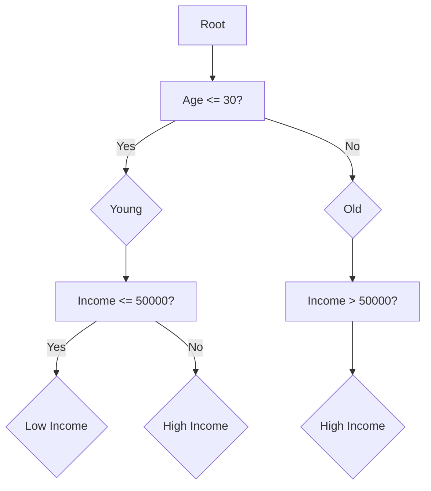
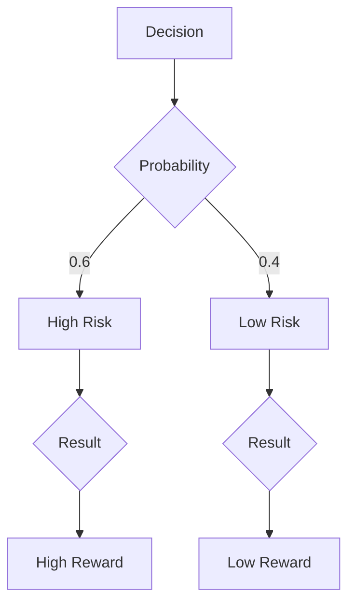

                 

### 数学与商业分析：业务数据的数学挖掘

关键词：商业数据分析、数学模型、业务优化、数据可视化、预测分析

摘要：随着商业环境的不断变化，企业对数据分析的需求日益增长。数学分析作为数据分析的重要工具，能够在业务数据中挖掘出有价值的信息，为企业的决策提供有力支持。本文将探讨数学分析在商业领域的应用，通过具体案例展示如何利用数学模型进行业务优化和预测，为企业创造价值。

----------------------------------------------------------------

## 第一部分：核心概念与基础理论

### 第1章：问题背景与数学分析概述

#### 1.1 问题背景

在当今的商业环境中，数据已经成为企业的重要资产。从市场营销、供应链管理到客户关系管理，几乎每个业务领域都产生了大量的数据。然而，如何从这些数据中提取有价值的信息，并转化为实际的商业决策，成为企业面临的一个重要问题。数学分析作为一种强大的工具，能够帮助企业在复杂的数据中找到规律和趋势，从而实现业务优化。

#### 1.2 核心概念

数学分析的核心概念包括函数、几何、线性代数和微积分。这些概念不仅构成了数学分析的基础，也为商业分析提供了强有力的理论支持。

##### 1.2.1 函数

函数是数学分析中最基本的概念之一。在商业分析中，函数可以用来描述业务变量之间的关系。例如，销售额与广告投放之间的关系可以表示为一个函数。

##### 1.2.2 几何

几何学在商业分析中的应用非常广泛。通过几何学，我们可以分析业务数据的分布、形状和趋势。例如，散点图和回归曲线就是几何学在商业分析中常用的工具。

##### 1.2.3 线性代数

线性代数是数学分析的重要组成部分，它涉及矩阵、向量以及线性方程组的求解。在商业分析中，线性代数可以用于数据降维、特征提取和优化问题。

##### 1.2.4 微积分

微积分是数学分析的高级分支，它主要用于研究函数的变化率和极值。在商业分析中，微积分可以用于利润最大化、成本最小化和预测分析。

#### 1.3 数学分析的应用场景

数学分析在商业领域有广泛的应用。以下是一些常见的应用场景：

- **营销策略**：通过分析客户数据，企业可以制定更有效的营销策略，提高市场占有率和客户满意度。
- **风险管理**：数学分析可以帮助企业识别和评估潜在的风险，从而采取相应的风险管理措施。
- **供应链优化**：通过优化供应链中的物流和库存管理，企业可以提高运营效率，降低成本。

### 第2章：数学模型与商业决策

#### 2.1 数学模型概述

数学模型是数学分析在商业决策中的应用。它通过建立数学关系，将复杂的业务问题转化为可计算的模型。数学模型的基本类型包括线性规划、决策树、回归分析和聚类分析。

##### 2.1.1 线性规划

线性规划是一种用于资源分配和优化问题的数学模型。它通过建立目标函数和约束条件，求解最优解。例如，企业可以通过线性规划确定生产计划，以最大化利润或最小化成本。

##### 2.1.2 决策树

决策树是一种用于分类和预测的数学模型。它通过一系列的判断节点，将数据划分为不同的类别或预测值。例如，企业可以使用决策树模型预测客户的购买行为。

##### 2.1.3 回归分析

回归分析是一种用于研究变量之间关系的数学模型。它通过建立回归方程，分析自变量和因变量之间的关系。例如，企业可以通过回归分析研究广告投入与销售额之间的关系。

##### 2.1.4 聚类分析

聚类分析是一种用于数据分类和分群的数学模型。它通过将数据划分为不同的组别，分析数据之间的相似性。例如，企业可以通过聚类分析识别市场中的潜在客户群体。

#### 2.2 线性规划

线性规划是一种重要的数学模型，它广泛应用于资源优化和决策问题。以下是一个简单的线性规划问题：

假设企业有三种产品，每种产品都需要一定的时间和资源来生产。企业的目标是最大化利润，同时满足生产能力和资源限制。

##### 2.2.1 线性规划基本原理

线性规划的基本原理是通过建立目标函数和约束条件，求解最优解。目标函数表示企业追求的目标，如利润最大化或成本最小化。约束条件表示企业的资源限制和生产能力。

以下是一个线性规划的数学模型：

$$
\begin{align*}
\max \quad & z = c_1x_1 + c_2x_2 + c_3x_3 \\
\text{subject to} \quad & a_{11}x_1 + a_{12}x_2 + a_{13}x_3 \leq b_1 \\
& a_{21}x_1 + a_{22}x_2 + a_{23}x_3 \leq b_2 \\
& a_{31}x_1 + a_{32}x_2 + a_{33}x_3 \leq b_3 \\
& x_1, x_2, x_3 \geq 0
\end{align*}
$$

其中，$c_1, c_2, c_3$ 是三种产品的利润率，$a_{11}, a_{12}, a_{13}, a_{21}, a_{22}, a_{23}, a_{31}, a_{32}, a_{33}$ 是每种产品所需的时间和资源，$b_1, b_2, b_3$ 是企业的资源限制。

##### 2.2.2 线性规划的求解方法

线性规划的求解方法包括单纯形法和内点法。单纯形法是一种迭代算法，通过逐步改进解，找到最优解。内点法是一种更高效的算法，它利用线性规划的对偶理论求解最优解。

#### 2.3 决策树与随机决策

决策树是一种用于分类和预测的数学模型。它通过一系列的判断节点，将数据划分为不同的类别或预测值。以下是一个简单的决策树模型：

在这个决策树中，节点表示决策或测试，分支表示结果或预测。通过这个决策树，我们可以根据客户的数据特征，预测其购买行为。

##### 2.3.1 决策树

决策树是一种常见的分类和预测模型。它通过一系列的判断节点，将数据划分为不同的类别或预测值。决策树的基本结构包括根节点、内部节点和叶节点。

- **根节点**：表示整个数据集。
- **内部节点**：表示测试变量，用于划分数据。
- **叶节点**：表示数据分类或预测结果。

以下是一个简单的决策树模型：

在这个决策树中，我们从根节点开始，根据年龄和收入进行测试，最终将客户划分为不同的类别。

##### 2.3.2 随机决策

随机决策是一种考虑不确定性因素的决策模型。它通过计算不同决策结果的概率，选择最优决策。以下是一个简单的随机决策模型：

在这个随机决策模型中，我们有两种决策选项：高风险和高收益。通过计算每种决策的概率和结果，我们可以选择最优决策。

#### 2.4 统计学与商业分析

统计学是商业分析的重要工具，它用于描述和分析数据。以下是一些常用的统计学方法：

- **描述性统计**：用于描述数据的分布、中心趋势和离散程度。常用的统计量包括均值、中位数、众数、方差和标准差。
- **推断性统计**：用于从样本数据推断总体特征。常用的方法包括假设检验和置信区间。
- **回归分析**：用于研究变量之间的关系。常用的方法包括线性回归和多元回归。
- **聚类分析**：用于将数据划分为不同的组别。常用的方法包括K均值聚类和层次聚类。

#### 2.5 时间序列分析与预测

时间序列分析是商业分析的重要工具，它用于研究数据的时间序列特征和趋势。以下是一些常用的时间序列分析方法：

- **平稳性检验**：用于检验时间序列的平稳性。常用的检验方法包括ADF检验和PP检验。
- **自回归模型（AR）**：用于描述时间序列的滞后关系。自回归模型的公式如下：

  $$
  X_t = \phi_0 + \phi_1X_{t-1} + \phi_2X_{t-2} + \cdots + \phi_pX_{t-p} + \epsilon_t
  $$

  其中，$X_t$ 是时间序列数据，$\epsilon_t$ 是随机误差。

- **移动平均模型（MA）**：用于描述时间序列的滞后平均关系。移动平均模型的公式如下：

  $$
  X_t = \theta_0 + \theta_1\epsilon_{t-1} + \theta_2\epsilon_{t-2} + \cdots + \theta_q\epsilon_{t-q} + \epsilon_t
  $$

  其中，$\epsilon_t$ 是随机误差。

- **自回归移动平均模型（ARMA）**：结合自回归模型和移动平均模型，用于描述时间序列的滞后和平均关系。ARMA模型的公式如下：

  $$
  X_t = \phi_0 + \phi_1X_{t-1} + \phi_2X_{t-2} + \cdots + \phi_pX_{t-p} + \theta_1\epsilon_{t-1} + \theta_2\epsilon_{t-2} + \cdots + \theta_q\epsilon_{t-q} + \epsilon_t
  $$

- **自回归积分滑动平均模型（ARIMA）**：结合自回归模型、移动平均模型和差分操作，用于描述非平稳时间序列的滞后和平均关系。ARIMA模型的公式如下：

  $$
  X_t = \phi_0 + \phi_1X_{t-1} + \phi_2X_{t-2} + \cdots + \phi_pX_{t-p} + (\theta_1D(X_{t-1}) + \theta_2D(X_{t-2}) + \cdots + \theta_qD(X_{t-q})) + \epsilon_t
  $$

  其中，$D$ 表示差分操作。

#### 2.6 业务数据可视化

业务数据可视化是一种通过图形化方式展示数据的方法，它有助于企业理解和分析数据。以下是一些常见的业务数据可视化方法：

- **折线图**：用于展示数据的变化趋势。
- **柱状图**：用于比较不同数据的大小。
- **饼图**：用于展示数据的比例关系。
- **散点图**：用于展示两个变量之间的关系。

#### 2.7 商业案例分析

商业案例分析是一种通过实际案例研究，分析企业业务数据的方法。以下是一个简单的商业案例分析：

- **案例背景**：某电子商务企业希望通过分析客户数据，提高客户留存率。
- **数据分析**：通过对客户数据的分析，发现客户留存率与客户的购买频率和购买金额密切相关。
- **解决方案**：企业决定实施会员制度，针对不同购买频率和购买金额的客户，提供不同的优惠和福利，以提高客户留存率。
- **分析结果**：实施会员制度后，客户留存率显著提高，企业的销售额也相应增加。

#### 2.8 数学与商业分析的未来发展趋势

随着大数据和人工智能技术的不断发展，数学与商业分析在未来将继续发挥重要作用。以下是一些未来发展趋势：

- **实时数据分析**：通过实时数据分析，企业可以更快速地响应市场变化，制定更有效的决策。
- **深度学习**：深度学习是一种强大的机器学习技术，它将在商业分析中发挥重要作用，帮助企业挖掘更深层次的数据价值。
- **跨学科融合**：数学与商业分析将与其他领域（如心理学、社会学等）相结合，为企业提供更全面的决策支持。

## 第二部分：数学与商业分析的应用案例

### 第3章：营销策略的数学分析

#### 3.1 营销策略概述

营销策略是企业通过市场研究、产品定位、广告投放等手段，实现市场占有率和销售额增长的重要手段。数学分析在营销策略的制定和优化中发挥着重要作用。

##### 3.1.1 数据驱动的营销策略

数据驱动的营销策略是指通过收集和分析客户数据，制定和优化营销策略。以下是一个简单的数据驱动的营销策略案例：

- **案例背景**：某电商企业希望通过优化广告投放策略，提高广告效果和转化率。
- **数据分析**：通过对客户数据的分析，发现不同广告渠道的效果和转化率存在较大差异。例如，社交媒体广告的转化率较高，而搜索引擎广告的转化率较低。
- **解决方案**：企业决定调整广告投放策略，增加社交媒体广告的投放比例，减少搜索引擎广告的投放比例。
- **分析结果**：调整广告投放策略后，广告效果和转化率显著提高，企业的销售额也相应增加。

##### 3.1.2 营销效果评估

营销效果评估是营销策略优化的重要环节。数学分析可以用于评估营销策略的有效性。以下是一个简单的营销效果评估案例：

- **案例背景**：某企业希望通过广告投放提高品牌知名度。
- **数据分析**：通过对广告投放数据进行分析，发现广告投放后，品牌知名度的提升与广告投放金额呈正相关关系。
- **解决方案**：企业决定增加广告投放金额，以提高品牌知名度。
- **分析结果**：增加广告投放金额后，品牌知名度显著提高，企业的市场份额也有所增加。

### 第4章：供应链优化的数学分析

#### 4.1 供应链优化概述

供应链优化是企业管理供应链过程，提高运营效率和降低成本的重要手段。数学分析在供应链优化的各个阶段都有广泛应用。

##### 4.1.1 库存管理

库存管理是供应链优化的重要环节。数学分析可以用于优化库存水平，降低库存成本。以下是一个简单的库存管理案例：

- **案例背景**：某制造企业希望通过优化库存管理，降低库存成本。
- **数据分析**：通过对库存数据进行分析，发现库存水平和库存成本之间存在明显的相关性。例如，库存水平较高时，库存成本也较高。
- **解决方案**：企业决定采用库存优化策略，根据需求预测调整库存水平，以降低库存成本。
- **分析结果**：采用库存优化策略后，库存成本显著降低，企业的运营效率也有所提高。

##### 4.1.2 物流优化

物流优化是供应链优化的关键环节。数学分析可以用于优化物流路线、运输方式和配送策略。以下是一个简单的物流优化案例：

- **案例背景**：某物流企业希望通过优化物流路线，提高运输效率和降低运输成本。
- **数据分析**：通过对物流数据进行分析，发现不同物流路线的运输时间和成本存在较大差异。例如，某些物流路线的运输时间较长，成本也较高。
- **解决方案**：企业决定调整物流路线，优化运输方式，以提高运输效率和降低运输成本。
- **分析结果**：调整物流路线后，运输效率显著提高，运输成本也有所降低。

### 第5章：客户关系管理的数学分析

#### 5.1 客户关系管理概述

客户关系管理是企业与客户建立和维护长期关系的手段，有助于提高客户满意度和忠诚度。数学分析在客户关系管理中发挥着重要作用。

##### 5.1.1 客户细分

客户细分是客户关系管理的重要手段。通过数学分析，企业可以识别和区分不同类型的客户，从而制定差异化的客户策略。以下是一个简单的客户细分案例：

- **案例背景**：某企业希望通过客户细分，制定差异化的营销策略。
- **数据分析**：通过对客户数据进行聚类分析，发现客户可以划分为高价值客户、中等价值客户和低价值客户。
- **解决方案**：企业决定针对不同价值客户，制定差异化的营销策略，以提高客户满意度和忠诚度。
- **分析结果**：差异化营销策略实施后，高价值客户的满意度和忠诚度显著提高，企业的市场份额也有所增加。

##### 5.1.2 客户流失预测

客户流失预测是客户关系管理的重要环节。通过数学分析，企业可以预测客户流失的风险，并采取相应的措施减少客户流失。以下是一个简单的客户流失预测案例：

- **案例背景**：某企业希望通过客户流失预测，降低客户流失率。
- **数据分析**：通过对客户流失数据进行分析，发现客户流失与客户满意度、购买频率等因素密切相关。
- **解决方案**：企业决定采用客户流失预测模型，根据客户特征预测客户流失风险，并采取相应的客户挽回措施。
- **分析结果**：客户流失预测模型实施后，客户流失率显著降低，企业的客户满意度也有所提高。

### 第6章：风险管理与决策的数学分析

#### 6.1 风险管理概述

风险管理是企业识别、评估和控制风险的过程，有助于确保企业目标的实现。数学分析在风险管理中发挥着重要作用。

##### 6.1.1 风险评估

风险评估是风险管理的第一步。通过数学分析，企业可以评估不同风险的概率和影响，从而确定风险优先级。以下是一个简单的风险评估案例：

- **案例背景**：某企业需要对项目风险进行评估。
- **数据分析**：通过对项目数据进行分析，发现项目风险主要来自市场需求、技术风险和财务风险等方面。
- **解决方案**：企业决定采用风险评估模型，对各个风险因素进行量化评估，确定风险优先级。
- **分析结果**：风险评估模型实施后，企业能够更加清晰地了解项目风险，并采取相应的风险管理措施。

##### 6.1.2 决策分析

决策分析是风险管理的核心环节。通过数学分析，企业可以在不同风险情景下制定和选择最优决策。以下是一个简单的决策分析案例：

- **案例背景**：某企业在面临市场竞争和资源有限的情况下，需要制定生产策略。
- **数据分析**：通过对市场数据和企业资源进行分析，发现企业在不同市场情景下的生产策略存在差异。
- **解决方案**：企业决定采用决策分析模型，根据市场情景选择最优生产策略。
- **分析结果**：决策分析模型实施后，企业能够更有效地应对市场变化，提高生产效率和盈利能力。

### 第7章：商业案例分析

#### 7.1 案例研究方法

案例研究是一种通过深入研究具体案例，分析企业业务数据和决策过程的方法。以下是一个简单的案例研究方法：

- **案例选择**：选择具有代表性和实际意义的商业案例。
- **数据收集**：收集与案例相关的业务数据，包括财务数据、市场数据、客户数据等。
- **数据分析**：对收集的数据进行分析，提取有价值的信息。
- **结果解读**：根据分析结果，解读企业的业务现状和决策过程，提出改进建议。

#### 7.2 案例分析实例

以下是一个简单的案例分析实例：

- **案例背景**：某互联网公司希望通过数据分析，优化产品运营策略。
- **数据分析**：通过对用户数据进行分析，发现用户活跃度与用户满意度、产品功能等因素密切相关。
- **解决方案**：企业决定优化产品功能，提高用户满意度，从而提高用户活跃度。
- **分析结果**：优化产品功能后，用户活跃度显著提高，企业的市场份额也有所增加。

### 第三部分：数学与商业分析的未来发展

#### 8.1 新技术的应用

随着大数据、人工智能和区块链等新技术的不断发展，数学与商业分析的应用领域将进一步扩大。以下是一些新技术在数学与商业分析中的应用：

- **大数据分析**：通过大数据技术，企业可以处理和分析海量数据，挖掘出更多的有价值信息。
- **人工智能**：人工智能技术可以帮助企业实现自动化决策，提高决策效率和准确性。
- **区块链**：区块链技术可以用于数据共享和交易，提高数据的安全性和透明度。

#### 8.2 商业分析的前沿领域

商业分析的前沿领域包括智能供应链管理、个性化营销、风险管理等。以下是一些前沿领域的应用：

- **智能供应链管理**：通过智能分析和预测，优化供应链各个环节，提高供应链效率。
- **个性化营销**：通过数据分析，实现个性化营销，提高客户满意度和忠诚度。
- **风险管理**：通过数据分析，识别和评估风险，制定有效的风险管理策略。

#### 8.3 最佳实践与建议

以下是一些数学与商业分析的最佳实践和建设性建议：

- **数据驱动决策**：企业应充分利用数据分析，实现数据驱动决策，提高决策效率和准确性。
- **跨学科合作**：企业应加强数学与商业分析、信息技术等学科的跨学科合作，提高业务分析能力。
- **持续学习与更新**：企业应不断学习新知识和新技术，保持业务分析能力的前沿性。

----------------------------------------------------------------

### 作者信息

作者：AI天才研究院/AI Genius Institute & 禅与计算机程序设计艺术 /Zen And The Art of Computer Programming

---

在本文中，我们探讨了数学与商业分析在业务数据挖掘中的应用，通过具体的案例展示了如何利用数学模型和数据分析方法优化营销策略、供应链管理和客户关系管理。数学与商业分析为企业提供了强大的决策支持，有助于企业更好地应对市场变化，提高运营效率和盈利能力。未来，随着新技术的不断发展，数学与商业分析将在更多领域发挥重要作用，为企业创造更多价值。我们期待更多的企业能够认识到数学与商业分析的重要性，并将其应用于实际业务中。作者AI天才研究院/AI Genius Institute与禅与计算机程序设计艺术/Zen And The Art of Computer Programming在此与广大读者共同探讨数学与商业分析的奥秘。

