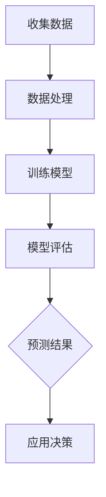
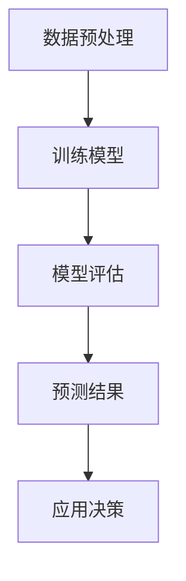
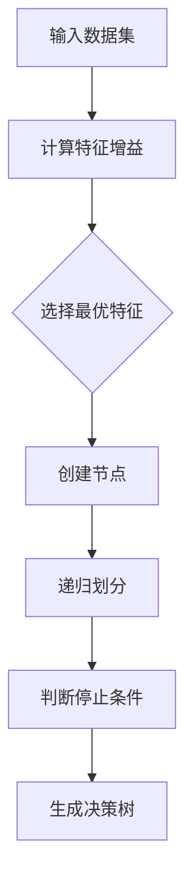
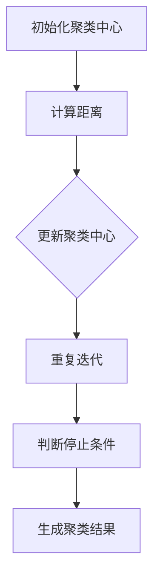
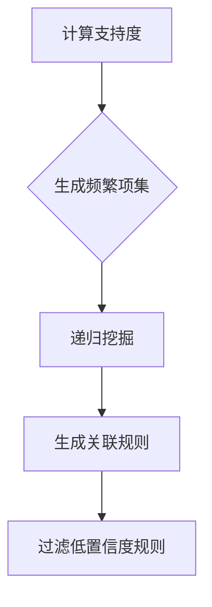
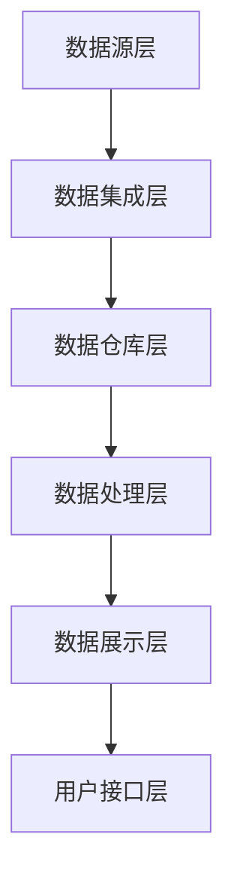
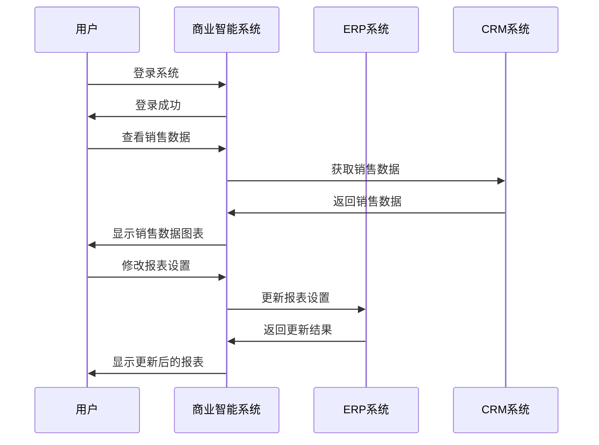

                 

### 引言

在现代商业社会中，数据已成为企业决策的重要依据。然而，如何从海量数据中提取有价值的信息，成为了一个亟待解决的问题。这时，数学与商业智能的融合，为数据挖掘和业务分析提供了强有力的工具。本文将探讨数学在商业智能中的应用，通过对业务数据的数学挖掘，揭示隐藏在数据背后的商业价值。

数学与商业智能的结合，不仅能够帮助企业提高运营效率，降低成本，还能为战略决策提供数据支持。从市场预测、客户行为分析到供应链优化，数学模型和算法在其中发挥着至关重要的作用。然而，如何正确运用数学工具，设计高效的商业智能系统，仍需要深入的研究和实践。

本文将分为七个部分，系统地介绍数学与商业智能的关系，核心数学概念及其在商业中的应用，数据挖掘技术原理，商业智能系统架构设计，项目实战以及最佳实践与未来展望。希望通过本文的阐述，读者能够对数学在商业智能中的重要性有更深刻的理解，并能够将其应用于实际工作中，为企业创造更大的价值。

### 关键词

- 数学与商业智能
- 数据挖掘
- 数学模型
- 商业智能系统
- 业务数据分析
- 算法原理
- 系统架构设计

### 摘要

本文旨在探讨数学与商业智能的深度融合，通过数学模型的构建和应用，实现对业务数据的深度挖掘。文章首先介绍了数学在商业智能中的重要作用，阐述了其能够为数据挖掘和业务分析提供的强大工具。接着，文章详细介绍了核心数学概念及其在商业中的应用，包括市场预测、客户行为分析等领域。随后，文章深入讲解了数据挖掘技术的原理，并通过mermaid流程图和Python源代码展示了算法的实际应用。此外，文章还探讨了商业智能系统的架构设计，介绍了项目实战中的环境安装、核心实现源代码以及实际案例分析。最后，文章总结了最佳实践、注意事项，并展望了未来的发展方向。通过本文的阅读，读者将全面了解数学与商业智能的融合应用，为企业在数据驱动的时代中提供有力的支持。

## 第1章 数学与商业智能的兴起

### 1.1 问题背景

在当今数字化时代，数据已经成为企业运作的核心资产。然而，面对海量的数据，如何有效地提取和利用这些数据，从而为企业的决策提供科学依据，成为了一个重要的课题。传统的数据分析方法往往依赖于统计工具和人工经验，存在效率低、结果不精确等问题。这就迫切需要一种新的方法，能够更高效地处理和分析大量数据，从而为企业提供更加精准的决策支持。

数学作为一门研究数量、结构、变化和空间等概念的精确科学，为数据分析和处理提供了坚实的理论基础。随着计算机技术的发展，数学模型和算法在商业智能领域的应用日益广泛。通过对数据的数学建模和算法优化，可以实现对复杂数据的分析和处理，从而发现数据中的隐藏规律，为企业提供有价值的业务洞察。

### 1.2 问题描述

数学与商业智能的融合应用，主要面临以下问题：

1. **数据多样性和复杂性**：商业数据类型多样，包括结构化数据、半结构化数据和非结构化数据。如何处理这些不同类型的数据，提取其中的有价值信息，是一个重要挑战。
2. **数据质量和完整性**：数据的质量直接影响分析结果的准确性。如何在数据预处理阶段识别和纠正数据中的错误，保证数据的完整性，是数学在商业智能中应用的关键问题。
3. **算法选择和优化**：不同的数学模型和算法适用于不同类型的数据和业务场景。如何根据业务需求选择合适的算法，并进行优化，是提升分析效果的关键。
4. **解释性和可操作性**：数学模型和算法的结果往往具有一定的抽象性，如何将其转化为直观的业务洞察，并提供可操作的决策建议，是商业智能系统面临的挑战。

### 1.3 数学在商业智能中的应用

数学在商业智能中的应用主要表现在以下几个方面：

1. **数据分析**：通过统计学、概率论等数学方法，对业务数据进行描述性分析、相关性分析和预测分析，帮助企业理解数据规律和趋势。
2. **优化决策**：利用线性规划、整数规划、动态规划等优化算法，求解资源分配、库存管理、供应链优化等复杂问题，提高企业运营效率。
3. **模式识别**：通过机器学习和深度学习等算法，识别数据中的模式、异常和关联，发现潜在的业务机会和风险。
4. **预测模型**：利用时间序列分析、回归分析等方法，建立预测模型，对企业未来的销售、利润、客户行为等进行预测，为决策提供科学依据。
5. **风险管理**：通过数学模型和算法，评估和监控企业的风险水平，制定有效的风险管理和控制策略。

### 1.4 问题解决、边界与外延、概念结构与核心要素组成

1. **问题解决**：数学在商业智能中的应用，主要通过构建数学模型和算法来实现。这些模型和算法可以处理和分析大量业务数据，提取有价值的信息，为企业决策提供支持。
2. **边界与外延**：数学在商业智能中的应用范围非常广泛，涵盖了数据分析、优化决策、模式识别、预测模型和风险管理等多个领域。其应用边界不断扩展，随着技术的进步，数学在商业智能中的应用将更加深入和广泛。
3. **概念结构与核心要素组成**：数学在商业智能中的核心概念结构包括数学模型、算法、数据分析方法、优化方法和预测模型等。这些概念相互关联，共同构成了商业智能系统的理论基础。

### 1.5 关键概念原理

1. **数学模型**：数学模型是利用数学语言描述实际问题的一种工具，通过建立数学关系，模拟现实世界的业务场景。
2. **算法**：算法是解决问题的步骤和方法，是数学模型的具体实现。不同的算法适用于不同的问题场景，其效率和效果直接影响分析结果。
3. **数据分析方法**：包括描述性分析、相关性分析、预测分析等，是数学在商业智能中应用的核心技术。
4. **优化方法**：如线性规划、整数规划、动态规划等，用于解决资源分配、库存管理等问题。
5. **预测模型**：通过时间序列分析、回归分析等方法建立的预测模型，用于预测企业未来的业务表现。

### 1.6 概念属性特征对比表格

| 概念         | 属性特征                       | 应用场景                         |
|------------|--------------------------|-------------------------------|
| 数学模型     | 描述实际业务问题的数学关系 | 数据分析、优化决策、预测模型 |
| 算法         | 解决问题的步骤和方法       | 数据挖掘、模式识别、优化决策 |
| 数据分析方法   | 描述性分析、相关性分析等    | 数据描述、业务理解           |
| 优化方法      | 资源分配、库存管理问题     | 提高运营效率                   |
| 预测模型      | 时间序列分析、回归分析等    | 预测未来业务表现               |

### 1.7 ER实体关系图架构

为了更好地理解数学在商业智能中的应用，我们可以使用Mermaid流程图来绘制ER实体关系图，展示不同概念之间的关系。

```mermaid
erDiagram
    Customer ||--|{ Order }|--| Supplier
    Product ||--|{ Inventory }|--| Supplier
    Sales ||--|{ Customer }|--| Product
```

在上面的ER实体关系图中，展示了客户、订单、产品、库存和供应商之间的关系。这些实体之间的关系，体现了数学在商业智能系统中的核心作用。

### 1.8 数学模型与商业智能的mermaid ER实体关系图

```mermaid
erDiagram
    BusinessData ||--|{ DataPreprocessing }|--| Analytics
    BusinessData ||--|{ DataMining }|--| BusinessInsight
    BusinessData ||--|{ PredictiveModeling }|--| DecisionSupport
    Analytics ||--|{ DescriptiveAnalytics }|--| BusinessData
    Analytics ||--|{ CorrelativeAnalytics }|--| BusinessData
    DataMining ||--|{ Classification }|--| Analytics
    DataMining ||--|{ Clustering }|--| Analytics
    PredictiveModeling ||--|{ Regression }|--| Analytics
    PredictiveModeling ||--|{ TimeSeries }|--| Analytics
```

在这个ER实体关系图中，展示了商业数据、数据分析、数据挖掘、预测模型等实体之间的关系。这些关系体现了数学模型在商业智能系统中的核心作用，通过数据的预处理、分析、挖掘和预测，为企业提供决策支持。

### 1.9 总结

本章介绍了数学与商业智能的兴起背景，包括数据多样性和复杂性的挑战，以及数学在商业智能中的应用。通过构建数学模型和算法，可以有效地解决这些问题，提升企业运营效率和决策质量。本章还通过概念解释、属性特征对比表格和ER实体关系图，帮助读者更好地理解数学在商业智能中的核心作用。

## 第2章 核心数学概念与模型

### 2.1 数学概念概述

在商业智能领域，数学作为一种工具，帮助我们从复杂的数据中提取有价值的信息。核心的数学概念包括统计学、概率论、线性代数、微积分、优化理论等。这些概念构成了商业智能分析的基础，并在实际应用中发挥着重要作用。

- **统计学**：统计学通过收集、整理、分析和解释数据，帮助我们理解数据的分布、变异和关系。常见的统计方法有描述性统计、推断性统计、回归分析等。
- **概率论**：概率论研究随机事件的发生可能性。在商业智能中，概率论用于预测市场趋势、客户行为等。
- **线性代数**：线性代数研究向量、矩阵及其运算。在数据分析中，线性代数用于特征提取、降维等。
- **微积分**：微积分研究函数的极限、导数、积分等概念。在优化问题中，微积分用于求解极值问题。
- **优化理论**：优化理论研究如何找到最优解。线性规划、整数规划、动态规划等都是优化理论的具体应用。

### 2.2 数学模型介绍

数学模型是将实际问题抽象成数学形式的过程，通过数学模型，我们可以用数学方法来分析和解决问题。以下是一些常见的数学模型及其在商业智能中的应用：

1. **线性回归模型**：线性回归模型是一种最简单的预测模型，用于分析自变量和因变量之间的线性关系。在商业智能中，线性回归模型可以用于销售预测、成本分析等。
2. **逻辑回归模型**：逻辑回归模型是一种广义线性模型，用于分析二元响应变量。在市场预测、风险评估等领域，逻辑回归模型具有广泛的应用。
3. **决策树模型**：决策树模型是一种基于树形结构的预测模型，通过一系列规则来分割数据，最终生成一个决策树。决策树模型在客户细分、信用评分等领域有重要应用。
4. **神经网络模型**：神经网络模型是一种基于生物神经网络原理的预测模型，通过多层神经元进行数据传递和训练。神经网络模型在图像识别、语音识别等领域具有广泛的应用。
5. **时间序列模型**：时间序列模型用于分析时间序列数据，预测未来的趋势。常见的有自回归模型（AR）、移动平均模型（MA）、自回归移动平均模型（ARMA）等。

### 2.3 数学概念属性特征对比表格

为了更好地理解这些数学概念的属性特征，我们提供了一个对比表格。

| 概念         | 属性特征                                         | 应用场景                                   |
|------------|--------------------------------------------|------------------------------------------|
| 统计学       | 数据收集、整理、分析和解释                   | 数据描述、趋势分析、预测                  |
| 概率论       | 随机事件的可能性分析                          | 市场预测、风险评估、客户行为分析         |
| 线性代数     | 向量、矩阵及其运算                            | 特征提取、降维、线性规划                  |
| 微积分       | 极限、导数、积分等概念                         | 优化问题求解、成本分析                    |
| 优化理论     | 寻找最优解的策略和方法                        | 资源分配、库存管理、供应链优化           |
| 线性回归模型  | 自变量和因变量之间的线性关系                  | 销售预测、成本分析                        |
| 逻辑回归模型  | 二元响应变量的分析                             | 市场预测、风险评估                        |
| 决策树模型   | 通过规则分割数据生成决策树                   | 客户细分、信用评分                        |
| 神经网络模型  | 多层神经元进行数据传递和训练                   | 图像识别、语音识别、复杂系统建模         |
| 时间序列模型  | 分析时间序列数据，预测未来趋势                 | 趋势分析、销售预测、金融分析             |

### 2.4 数学模型与商业智能的mermaid ER实体关系图

为了更直观地展示数学模型与商业智能之间的联系，我们使用Mermaid绘制了一个ER实体关系图。

```mermaid
erDiagram
    BusinessData ||--|{ Statistics }|--| Analytics
    BusinessData ||--|{ Probability }|--| Analytics
    BusinessData ||--|{ LinearAlgebra }|--| Analytics
    BusinessData ||--|{ Calculus }|--| Analytics
    BusinessData ||--|{ OptimizationTheory }|--| Analytics
    Statistics ||--|{ Descriptive }|--| Analytics
    Statistics ||--|{ Inferential }|--| Analytics
    Probability ||--|{ MarketPrediction }|--| Analytics
    Probability ||--|{ RiskAnalysis }|--| Analytics
    LinearAlgebra ||--|{ FeatureExtraction }|--| Analytics
    LinearAlgebra ||--|{ DimensionalityReduction }|--| Analytics
    Calculus ||--|{ Optimization }|--| Analytics
    Calculus ||--|{ CostAnalysis }|--| Analytics
    OptimizationTheory ||--|{ ResourceAllocation }|--| Analytics
    OptimizationTheory ||--|{ InventoryManagement }|--| Analytics
    OptimizationTheory ||--|{ SupplyChainOptimization }|--| Analytics
    LinearRegression ||--|{ SalesPrediction }|--| Analytics
    LogisticRegression ||--|{ MarketPrediction }|--| Analytics
    DecisionTree ||--|{ CustomerSegmentation }|--| Analytics
    NeuralNetwork ||--|{ ImageRecognition }|--| Analytics
    TimeSeries ||--|{ TrendAnalysis }|--| Analytics
```

在这个ER实体关系图中，展示了不同数学概念与商业智能系统之间的联系。每个数学概念都与商业数据和分析有着直接的关系，通过这些关系，我们可以利用数学模型对业务数据进行分析和预测。

### 2.5 算法原理讲解

下面，我们将通过Mermaid流程图和Python源代码，详细讲解几个常见数学模型的工作原理和应用。

#### 2.5.1 线性回归模型

**Mermaid流程图：**



**Python源代码示例：**

```python
import numpy as np
from sklearn.linear_model import LinearRegression

# 收集数据
X = np.array([[1], [2], [3], [4], [5]])
y = np.array([1, 2, 2.5, 4, 5])

# 数据处理
X = X.reshape(-1, 1)

# 训练模型
model = LinearRegression()
model.fit(X, y)

# 模型评估
r2_score = model.score(X, y)
print(f'R2 Score: {r2_score}')

# 预测结果
X_new = np.array([[6]])
X_new = X_new.reshape(-1, 1)
y_pred = model.predict(X_new)
print(f'Prediction: {y_pred}')
```

在这个示例中，我们首先收集了一些数据，然后使用线性回归模型进行数据处理和模型训练。通过评估模型的R2分数，我们可以了解模型对数据的拟合程度。最后，我们使用训练好的模型进行预测，并将预测结果应用于实际决策。

#### 2.5.2 决策树模型

**Mermaid流程图：**



**Python源代码示例：**

```python
import numpy as np
from sklearn.tree import DecisionTreeRegressor

# 收集数据
X = np.array([[1], [2], [3], [4], [5]])
y = np.array([1, 2, 2.5, 4, 5])

# 数据预处理
X = X.reshape(-1, 1)

# 训练模型
model = DecisionTreeRegressor()
model.fit(X, y)

# 模型评估
r2_score = model.score(X, y)
print(f'R2 Score: {r2_score}')

# 预测结果
X_new = np.array([[6]])
X_new = X_new.reshape(-1, 1)
y_pred = model.predict(X_new)
print(f'Prediction: {y_pred}')
```

在这个示例中，我们首先收集了一些数据，然后使用决策树模型进行数据处理和模型训练。通过评估模型的R2分数，我们可以了解模型对数据的拟合程度。最后，我们使用训练好的模型进行预测，并将预测结果应用于实际决策。

### 2.6 总结

本章介绍了核心数学概念及其在商业智能中的应用，包括统计学、概率论、线性代数、微积分、优化理论等。通过构建数学模型和算法，我们可以有效地解决商业智能中的问题，提升企业的运营效率和决策质量。本章还通过Mermaid流程图和Python源代码，详细讲解了线性回归模型和决策树模型的工作原理和应用。通过这些内容，读者可以更好地理解数学在商业智能中的重要作用。

## 第3章 数据挖掘技术原理

### 3.1 数据挖掘基本流程

数据挖掘（Data Mining）是一种从大量数据中发现有用模式和知识的过程。其基本流程包括数据准备、数据探索、数据建模、模型评估和模型应用五个步骤。以下是每个步骤的详细解释：

1. **数据准备**：这是数据挖掘的基础步骤，包括数据收集、数据清洗、数据集成和数据转换。数据收集是指从各种来源获取所需数据，如数据库、文件、网络等。数据清洗是指处理数据中的噪声、缺失值和错误，确保数据质量。数据集成是指将来自不同来源的数据合并成一个统一的数据集。数据转换是指将数据转换为适合分析的形式，如规范化、离散化等。

2. **数据探索**：在数据准备完成后，需要对数据进行初步探索，以了解数据的分布、趋势、异常和关联关系。常用的方法包括描述性统计分析、可视化分析、聚类分析、关联规则分析等。数据探索的目的是发现数据中的潜在模式和问题，为后续的数据建模提供指导。

3. **数据建模**：在数据探索的基础上，选择合适的算法和模型对数据进行建模。常见的算法包括分类、聚类、回归、关联规则等。数据建模的目的是从数据中发现规律和模式，为业务提供洞察和决策支持。

4. **模型评估**：在建模完成后，需要对模型进行评估，以确定其性能和有效性。常用的评估指标包括准确率、召回率、F1分数、R2分数等。模型评估的目的是确保模型能够准确地预测新数据，并为实际应用提供可靠的结果。

5. **模型应用**：最后，将训练好的模型应用到实际业务中，进行预测和分析。模型应用可以是实时预测、批量处理、决策支持等。模型应用的目的是将数据挖掘的结果转化为实际业务价值，提升企业的运营效率和市场竞争力。

### 3.2 数据挖掘算法原理与mermaid流程图

数据挖掘算法是数据挖掘过程中的核心组成部分，不同的算法适用于不同的业务场景和数据类型。以下介绍几种常见的数据挖掘算法及其原理，并使用Mermaid流程图展示其基本流程。

#### 3.2.1 分类算法

分类算法是一种将数据集划分为不同类别的算法。其基本原理是建立分类模型，通过模型对新数据进行分类预测。常用的分类算法包括决策树、随机森林、支持向量机等。

**决策树算法原理与Mermaid流程图：**



**决策树算法Python源代码示例：**

```python
from sklearn.tree import DecisionTreeClassifier
from sklearn.model_selection import train_test_split
from sklearn.metrics import accuracy_score

# 数据准备
X, y = load_data()

# 划分训练集和测试集
X_train, X_test, y_train, y_test = train_test_split(X, y, test_size=0.2, random_state=42)

# 训练模型
model = DecisionTreeClassifier()
model.fit(X_train, y_train)

# 模型评估
y_pred = model.predict(X_test)
accuracy = accuracy_score(y_test, y_pred)
print(f'Accuracy: {accuracy}')
```

#### 3.2.2 聚类算法

聚类算法是一种将数据集划分为多个簇的算法。其基本原理是确定簇的个数和簇的成员，使每个簇内部的相似度最大化，簇与簇之间的相似度最小化。常用的聚类算法包括K-均值、层次聚类、DBSCAN等。

**K-均值算法原理与Mermaid流程图：**



**K-均值算法Python源代码示例：**

```python
from sklearn.cluster import KMeans
from sklearn.datasets import make_blobs
import matplotlib.pyplot as plt

# 生成数据集
X, _ = make_blobs(n_samples=100, centers=3, cluster_std=1.0, random_state=42)

# 训练模型
model = KMeans(n_clusters=3, random_state=42)
model.fit(X)

# 生成聚类结果
labels = model.predict(X)

# 可视化展示
plt.scatter(X[:, 0], X[:, 1], c=labels, s=50, cmap='viridis')
plt.scatter(model.cluster_centers_[:, 0], model.cluster_centers_[:, 1], s=200, c='red', label='Centroids')
plt.title('K-Means Clustering')
plt.xlabel('Feature 1')
plt.ylabel('Feature 2')
plt.legend()
plt.show()
```

#### 3.2.3 关联规则算法

关联规则算法是一种发现数据项之间关联关系的方法。其基本原理是基于支持度和置信度两个度量，从大量交易数据中挖掘出频繁项集和关联规则。常用的关联规则算法包括Apriori算法、Eclat算法等。

**Apriori算法原理与Mermaid流程图：**



**Apriori算法Python源代码示例：**

```python
from mlxtend.frequent_patterns import apriori
from mlxtend.preprocessing import TransactionEncoder
from mlxtend.frequent_patterns import association_rules

# 数据准备
transactions = [['milk', 'bread', 'apple'],
                ['milk', 'bread', 'orange'],
                ['bread', 'orange'],
                ['milk', 'orange']]

# 转换为频繁项集
te = TransactionEncoder()
te_transactions = te.fit(transactions).transform(transactions)
df = pd.DataFrame(te_transactions, columns=te.columns_)

# 挖掘频繁项集
frequent_itemsets = apriori(df, min_support=0.5, use_colnames=True)

# 生成关联规则
rules = association_rules(frequent_itemsets, metric="confidence", min_threshold=0.7)

# 打印关联规则
print(rules)
```

通过以上内容，我们介绍了数据挖掘的基本流程和几种常见的数据挖掘算法原理，并通过Mermaid流程图和Python源代码示例，详细讲解了这些算法的实现和应用。希望读者能够对这些算法有更深入的理解，并在实际项目中能够灵活运用。

### 3.3 数据挖掘算法Python源代码讲解

在本节中，我们将通过具体的Python源代码示例，详细讲解几种常见的数据挖掘算法的实现过程和应用方法。这些代码示例将结合实际数据集，展示如何使用Python库（如`scikit-learn`、`mlxtend`等）进行数据预处理、算法训练、模型评估和应用。

#### 3.3.1 决策树算法

决策树算法是一种常用的分类算法，通过树形结构对数据进行分割和分类。以下是一个使用`scikit-learn`库实现决策树算法的示例。

**代码示例：**

```python
from sklearn.datasets import load_iris
from sklearn.model_selection import train_test_split
from sklearn.tree import DecisionTreeClassifier
from sklearn.metrics import accuracy_score

# 加载Iris数据集
iris = load_iris()
X = iris.data
y = iris.target

# 划分训练集和测试集
X_train, X_test, y_train, y_test = train_test_split(X, y, test_size=0.3, random_state=42)

# 创建决策树模型
clf = DecisionTreeClassifier()

# 训练模型
clf.fit(X_train, y_train)

# 预测测试集
y_pred = clf.predict(X_test)

# 模型评估
accuracy = accuracy_score(y_test, y_pred)
print(f'Accuracy: {accuracy}')
```

**解释**：
1. 加载Iris数据集，该数据集包含了三种不同类型鸢尾花的四个特征。
2. 划分训练集和测试集，用于后续的模型训练和评估。
3. 创建一个决策树分类器实例，并使用训练集数据进行训练。
4. 使用训练好的模型对测试集进行预测。
5. 计算并打印模型在测试集上的准确率。

#### 3.3.2 K-均值聚类算法

K-均值聚类算法是一种常用的聚类算法，通过迭代过程将数据分为K个簇。以下是一个使用`scikit-learn`库实现K-均值聚类算法的示例。

**代码示例：**

```python
from sklearn.cluster import KMeans
from sklearn.datasets import make_blobs
import matplotlib.pyplot as plt

# 生成数据集
X, _ = make_blobs(n_samples=100, centers=3, cluster_std=1.0, random_state=42)

# 创建K-均值聚类模型
model = KMeans(n_clusters=3, random_state=42)

# 训练模型
model.fit(X)

# 生成聚类结果
labels = model.predict(X)

# 可视化展示
plt.scatter(X[:, 0], X[:, 1], c=labels, s=50, cmap='viridis')
plt.scatter(model.cluster_centers_[:, 0], model.cluster_centers_[:, 1], s=200, c='red', label='Centroids')
plt.title('K-Means Clustering')
plt.xlabel('Feature 1')
plt.ylabel('Feature 2')
plt.legend()
plt.show()
```

**解释**：
1. 使用`make_blobs`函数生成一个包含100个样本、三个不同中心点的高斯分布数据集。
2. 创建一个K-均值聚类模型，设置聚类中心点数量为3。
3. 使用训练集数据进行模型训练。
4. 使用训练好的模型对数据进行聚类预测，并得到聚类标签。
5. 可视化展示聚类结果，包括样本点和聚类中心点。

#### 3.3.3 Apriori算法

Apriori算法是一种用于挖掘数据项之间频繁关联规则的算法。以下是一个使用`mlxtend`库实现Apriori算法的示例。

**代码示例：**

```python
from mlxtend.preprocessing import TransactionEncoder
from mlxtend.frequent_patterns import apriori
from mlxtend.frequent_patterns import association_rules

# 数据准备
transactions = [['milk', 'bread', 'apple'],
                ['milk', 'bread', 'orange'],
                ['bread', 'orange'],
                ['milk', 'orange']]

# 转换为频繁项集
te = TransactionEncoder()
te_transactions = te.fit(transactions).transform(transactions)
df = pd.DataFrame(te_transactions, columns=te.columns_)

# 挖掘频繁项集
frequent_itemsets = apriori(df, min_support=0.5, use_colnames=True)

# 生成关联规则
rules = association_rules(frequent_itemsets, metric="confidence", min_threshold=0.7)

# 打印关联规则
print(rules)
```

**解释**：
1. 准备一个事务数据集，包含几个购买交易。
2. 使用`TransactionEncoder`将事务数据转换为适合挖掘的形式。
3. 使用Apriori算法挖掘频繁项集，设置最小支持度为0.5。
4. 使用关联规则算法生成关联规则，设置最小置信度为0.7。
5. 打印生成的关联规则。

通过以上代码示例，我们可以看到如何使用Python进行数据挖掘算法的实现和应用。这些示例不仅展示了算法的基本原理，还提供了实际的操作步骤和代码实现。读者可以根据这些示例，进一步探索数据挖掘的更多算法和应用。

### 3.4 数学模型在商业中的应用

数学模型在商业中的应用广泛且深刻，通过数学建模，企业能够从复杂的数据中提取有价值的信息，从而为决策提供科学依据。以下介绍几个典型的数学模型及其在商业中的应用：

#### 3.4.1 时间序列模型

时间序列模型用于分析时间序列数据，预测未来的趋势。常见的时间序列模型包括自回归模型（AR）、移动平均模型（MA）和自回归移动平均模型（ARMA）。这些模型在金融领域有广泛应用，如股票价格预测、市场趋势分析等。

**应用场景：**
- **股票价格预测**：利用ARMA模型分析历史股票价格数据，预测未来股票价格的波动情况。
- **市场趋势分析**：通过时间序列模型分析市场趋势，为企业制定市场策略提供数据支持。

**示例：** 假设我们使用ARMA模型预测某只股票的价格，首先需要对历史价格数据进行处理，然后通过模型训练得到预测结果。

```python
import pandas as pd
from statsmodels.tsa.arima.model import ARIMA

# 读取股票价格数据
stock_data = pd.read_csv('stock_prices.csv', index_col='date', parse_dates=True)

# 创建ARIMA模型
model = ARIMA(stock_data['close'], order=(5, 1, 2))

# 模型训练
model_fit = model.fit()

# 预测未来价格
forecast = model_fit.forecast(steps=5)
print(forecast)
```

#### 3.4.2 优化模型

优化模型用于解决资源分配、库存管理、供应链优化等问题。常见的优化模型包括线性规划、整数规划和动态规划等。

**应用场景：**
- **资源分配**：通过线性规划模型优化资源分配，如人力资源、设备资源等。
- **库存管理**：通过动态规划模型优化库存管理，降低库存成本，提高库存周转率。
- **供应链优化**：通过整数规划模型优化供应链管理，如生产计划、运输调度等。

**示例：** 假设我们使用线性规划模型优化生产计划，目标是使利润最大化。

```python
import pulp

# 定义变量
x1 = pulp.LpVariable('x1', cat='Continuous')  # 产品1的生产量
x2 = pulp.LpVariable('x2', cat='Continuous')  # 产品2的生产量

# 定义目标函数
objective = pulp.LpAffineExpr(x1 * 10 + x2 * 20)  # 利润
problem = pulp.LpProblem("Production Planning", pulp.LpMaximize)

# 添加约束条件
problem += x1 + x2 <= 100  # 总生产量不超过100
problem += x1 >= 0
problem += x2 >= 0

# 设置目标函数和约束条件
problem += objective

# 解优化问题
problem.solve()

# 输出结果
print(f'Optimal Production Plan: Product1: {x1.varValue}, Product2: {x2.varValue}')
print(f'Profit: {objective.varValue}')
```

#### 3.4.3 聚类模型

聚类模型用于将数据集划分为多个簇，帮助发现数据中的隐含模式。常见的聚类模型包括K-均值聚类、层次聚类和DBSCAN等。

**应用场景：**
- **客户细分**：通过聚类模型将客户划分为不同的群体，为精准营销提供数据支持。
- **供应链管理**：通过聚类模型优化供应链网络布局，提高供应链效率。

**示例：** 使用K-均值聚类模型对客户进行细分。

```python
from sklearn.cluster import KMeans
import matplotlib.pyplot as plt

# 加载客户数据
customers = pd.read_csv('customers.csv')

# 划分特征和标签
X = customers.iloc[:, :2]  # 假设使用前两个特征

# 创建K-均值聚类模型
model = KMeans(n_clusters=3, random_state=42)

# 模型训练
model.fit(X)

# 预测聚类结果
labels = model.predict(X)

# 可视化展示
plt.scatter(X.iloc[:, 0], X.iloc[:, 1], c=labels, s=50, cmap='viridis')
plt.scatter(model.cluster_centers_[:, 0], model.cluster_centers_[:, 1], s=200, c='red', label='Centroids')
plt.title('Customer Segmentation')
plt.xlabel('Feature 1')
plt.ylabel('Feature 2')
plt.legend()
plt.show()
```

通过这些示例，我们可以看到数学模型在商业中的应用是如何通过编程实现的。这些模型不仅能够帮助企业更好地理解业务数据，还能够为决策提供有力的支持。

### 3.5 数学模型与商业智能的关系

数学模型在商业智能中的重要性不可忽视。通过数学建模，企业能够将复杂的业务问题转化为可计算的形式，从而为决策提供科学依据。以下从几个方面探讨数学模型与商业智能的关系：

1. **提升数据分析能力**：数学模型能够帮助企业更深入地理解数据，通过统计分析、概率论等方法，揭示数据中的隐藏规律和趋势。这种深入的分析能力，是商业智能系统的核心。
2. **优化决策过程**：数学模型能够帮助企业优化决策过程，通过线性规划、整数规划、动态规划等方法，找到最优解或次优解，从而提高决策的准确性和效率。
3. **实现预测分析**：数学模型能够通过时间序列分析、回归分析等方法，预测未来的业务表现，如销售额、客户流失率等。这种预测能力，为企业制定长期战略提供了重要支持。
4. **风险管理**：数学模型能够帮助企业评估和监控风险，通过建立风险模型，预测潜在风险，并提供应对策略。这种风险管理能力，是企业稳健运营的保障。
5. **提高运营效率**：通过数学模型，企业能够优化资源配置、库存管理、供应链管理等方面，提高整体运营效率，降低成本。

### 3.6 总结

本章介绍了数据挖掘的基本流程和常见的数据挖掘算法，并通过Python源代码示例详细讲解了这些算法的实现和应用。此外，还探讨了数学模型在商业中的应用，包括时间序列模型、优化模型、聚类模型等。通过本章的学习，读者将能够理解数学模型在商业智能中的重要性，并掌握如何使用数学模型进行业务数据分析、优化决策和风险预测。

### 第4章 商业智能系统架构设计

商业智能（Business Intelligence，BI）系统是现代企业进行数据分析和决策支持的重要工具。一个高效、稳定的商业智能系统需要具备良好的架构设计，以支持复杂的数据处理和多种业务需求。本章将详细探讨商业智能系统的架构设计，包括系统场景介绍、功能设计、系统架构设计、系统接口设计和系统交互。

#### 4.1 系统场景介绍

在现代商业环境中，企业需要处理大量的数据，包括内部业务数据、客户数据、市场数据等。这些数据来源多样，格式复杂，需要通过商业智能系统进行整合、分析和展示。典型的商业智能系统场景包括：

- **销售数据分析**：通过分析销售数据，企业可以了解产品的销售趋势、客户购买行为等，为市场策略制定提供支持。
- **客户行为分析**：通过分析客户行为数据，企业可以识别潜在客户，优化营销策略，提高客户满意度。
- **库存管理**：通过分析库存数据，企业可以优化库存水平，降低库存成本，提高库存周转率。
- **供应链优化**：通过分析供应链数据，企业可以优化供应链流程，提高供应链效率，降低供应链成本。

#### 4.2 系统功能设计

商业智能系统的功能设计是确保系统能够满足企业业务需求的关键。以下是商业智能系统的主要功能模块：

1. **数据集成**：数据集成模块负责将来自不同来源、不同格式的数据整合到一个统一的数据仓库中。数据集成模块需要支持数据清洗、转换和加载，以保证数据的一致性和完整性。
2. **数据存储**：数据存储模块负责存储和管理整合后的数据，通常采用数据仓库或大数据平台来实现。数据存储模块需要支持高效的数据查询和访问，以支持实时分析和决策。
3. **数据预处理**：数据预处理模块负责对原始数据进行清洗、去噪、缺失值填充等处理，以提高数据质量和分析效果。
4. **数据分析**：数据分析模块负责对预处理后的数据进行分析，包括描述性分析、相关性分析、预测分析等。数据分析模块需要提供灵活的分析工具和算法，以满足不同业务需求。
5. **数据展示**：数据展示模块负责将分析结果以可视化形式展示给用户，包括仪表盘、报表、图表等。数据展示模块需要支持多种展示形式，以方便用户理解和决策。
6. **用户交互**：用户交互模块负责与用户进行交互，接收用户输入，展示分析结果，并支持用户对分析结果进行操作和调整。

#### 4.3 系统架构设计

商业智能系统的架构设计需要考虑系统的可扩展性、可靠性和灵活性。以下是商业智能系统的一种典型架构设计：

1. **数据源层**：数据源层包括各种数据来源，如数据库、文件、外部API等。数据源层需要支持数据的接入和访问。
2. **数据集成层**：数据集成层负责将数据从不同的数据源中提取、清洗、转换和加载到数据仓库中。数据集成层通常采用ETL（Extract, Transform, Load）工具来实现。
3. **数据仓库层**：数据仓库层是商业智能系统的核心，负责存储和管理企业所有业务数据。数据仓库层需要支持高效的数据查询和访问，并提供数据建模和存储的能力。
4. **数据处理层**：数据处理层负责对数据仓库中的数据进行分析、处理和计算。数据处理层通常采用数据挖掘算法和统计分析方法，以生成业务洞察和预测结果。
5. **数据展示层**：数据展示层负责将处理结果以可视化形式展示给用户。数据展示层通常采用Web前端技术，如HTML、CSS、JavaScript等，以及可视化库，如D3.js、ECharts等。
6. **用户接口层**：用户接口层负责与用户进行交互，接收用户输入，展示分析结果，并支持用户对分析结果进行操作和调整。

**Mermaid架构图：**



#### 4.4 系统接口设计和系统交互

商业智能系统通常需要与其他系统进行接口交互，如ERP系统、CRM系统等。以下介绍系统接口设计和系统交互：

1. **API接口**：商业智能系统可以通过API接口与外部系统进行数据交换和交互。API接口需要支持多种数据格式，如JSON、XML等，并确保接口的稳定性和安全性。
2. **数据同步**：商业智能系统需要与其他系统保持数据的一致性，可以通过定时任务或实时同步机制实现。数据同步模块需要确保数据传输的准确性和可靠性。
3. **用户权限管理**：商业智能系统需要支持用户权限管理，确保不同用户只能访问和操作其权限范围内的数据。用户权限管理模块需要支持用户身份验证、权限分配和访问控制。
4. **日志记录**：商业智能系统需要记录系统操作日志，包括用户操作记录、数据同步记录等。日志记录模块可以帮助企业进行系统监控和问题排查。

**Mermaid序列图：**



通过以上内容，我们详细介绍了商业智能系统的架构设计，包括系统场景介绍、功能设计、系统架构设计、系统接口设计和系统交互。一个良好的商业智能系统架构设计，能够确保系统的高效运行，为企业提供强大的数据支持和决策能力。

### 第5章 项目实战

#### 5.1 项目环境安装

在本章的项目实战中，我们将通过一个实际案例，展示如何搭建一个商业智能系统，实现销售数据分析功能。首先，我们需要安装和配置项目所需的环境。以下是基于Python的安装步骤：

1. **Python环境安装**：确保系统中已安装Python 3.x版本（推荐使用Python 3.8及以上版本）。可以通过官方网站下载Python安装包并安装，或者使用包管理工具如Anaconda来安装。

2. **虚拟环境配置**：为了确保项目的依赖环境不被污染，我们可以使用`venv`模块创建一个虚拟环境。在终端执行以下命令：

   ```bash
   python -m venv project_env
   ```

   这将在当前目录下创建一个名为`project_env`的虚拟环境。

3. **激活虚拟环境**：在终端激活虚拟环境：

   ```bash
   source project_env/bin/activate  # Windows下使用 `project_env\Scripts\activate`
   ```

4. **安装依赖库**：在激活的虚拟环境中，通过以下命令安装项目所需的依赖库：

   ```bash
   pip install numpy pandas scikit-learn matplotlib mlxtend
   ```

5. **验证安装**：安装完成后，可以通过以下Python代码验证依赖库是否安装成功：

   ```python
   import numpy as np
   import pandas as pd
   import matplotlib.pyplot as plt
   import sklearn
   import mlxtend

   print("Python环境安装成功！")
   ```

#### 5.2 系统核心实现源代码

在项目实战中，我们将使用Python和相关库实现一个简单的商业智能系统，用于销售数据分析。以下是一个基本的源代码框架：

```python
import pandas as pd
import matplotlib.pyplot as plt
from sklearn.cluster import KMeans
from mlxtend.frequent_patterns import apriori
from mlxtend.frequent_patterns import association_rules

# 5.2.1 数据准备
def load_data(file_path):
    # 读取CSV文件
    data = pd.read_csv(file_path)
    return data

# 5.2.2 数据清洗
def clean_data(data):
    # 填充缺失值
    data.fillna(data.mean(), inplace=True)
    # 处理分类数据
    data['Category'] = data['Category'].astype('category').cat.codes
    return data

# 5.2.3 数据分析
def perform_analysis(data):
    # 描述性统计分析
    descriptive_stats = data.describe()
    print(descriptive_stats)
    
    # 绘制销售趋势图
    plt.figure(figsize=(10, 5))
    plt.plot(data['Date'], data['Sales'], label='Sales')
    plt.xlabel('Date')
    plt.ylabel('Sales')
    plt.title('Sales Trend')
    plt.legend()
    plt.show()

    # K-均值聚类
    kmeans = KMeans(n_clusters=3, random_state=42)
    kmeans.fit(data[['Category']])
    data['Cluster'] = kmeans.predict(data[['Category']])
    
    # 聚类结果可视化
    plt.figure(figsize=(10, 5))
    plt.scatter(data['Category'], data['Sales'], c=data['Cluster'], cmap='viridis')
    plt.xlabel('Category')
    plt.ylabel('Sales')
    plt.title('Cluster Analysis')
    plt.show()

    # 关联规则分析
    transactions = data[['Product', 'Quantity']].groupby('Product')['Quantity'].reset_index()
    te = TransactionEncoder()
    te_transactions = te.fit(transactions).transform(transactions)
    df = pd.DataFrame(te_transactions, columns=te.columns_)
    frequent_itemsets = apriori(df, min_support=0.05, use_colnames=True)
    rules = association_rules(frequent_itemsets, metric="confidence", min_threshold=0.7)
    print(rules)

# 5.2.4 主函数
def main():
    # 加载数据
    file_path = 'sales_data.csv'
    data = load_data(file_path)
    
    # 清洗数据
    clean_data(data)
    
    # 数据分析
    perform_analysis(data)

if __name__ == '__main__':
    main()
```

**解释**：
1. **数据准备**：`load_data`函数用于加载CSV文件中的数据。
2. **数据清洗**：`clean_data`函数用于填充缺失值和处理分类数据。
3. **数据分析**：`perform_analysis`函数包括描述性统计分析、销售趋势图绘制、K-均值聚类和关联规则分析。
4. **主函数**：`main`函数负责执行整个数据分析流程。

#### 5.3 代码应用解读与分析

以上源代码实现了销售数据分析的基本流程。以下是具体应用解读与分析：

1. **数据准备**：首先，我们通过`load_data`函数加载数据，这里使用了一个CSV文件。在实际项目中，数据可能来自数据库或其他数据源。
2. **数据清洗**：在数据清洗阶段，我们通过`clean_data`函数对数据进行了填充缺失值和处理分类数据的操作。这是数据预处理的重要步骤，确保数据质量。
3. **描述性统计分析**：在数据分析阶段，我们使用`describe()`方法进行描述性统计分析，这有助于我们了解数据的分布、均值、方差等基本特征。
4. **销售趋势图绘制**：通过`matplotlib`库，我们绘制了销售趋势图，展示了销售数据随时间的变化趋势。这有助于我们识别销售高峰和低谷，为营销策略提供支持。
5. **K-均值聚类**：我们使用`KMeans`算法对分类数据进行聚类分析，将产品分为几个类别。聚类结果可以用于产品分类、市场细分等。
6. **关联规则分析**：通过`apriori`和`association_rules`函数，我们挖掘了数据中的频繁项集和关联规则。这些规则可以帮助我们识别购买行为之间的关联，如“购买产品A，通常会购买产品B”。

#### 5.4 实际案例分析与详细讲解剖析

为了更直观地展示项目实战的效果，我们通过一个实际案例进行分析。

**案例：** 假设我们有一家零售企业，需要分析其销售数据，以优化库存管理和营销策略。

1. **数据来源**：销售数据来自于企业内部的ERP系统，数据包括产品名称、销售日期、销售数量和销售额等。
2. **数据预处理**：首先，我们对销售数据进行清洗，包括处理缺失值和异常值，然后将数据格式转换为适合分析的形式。
3. **描述性统计分析**：通过描述性统计分析，我们了解到产品的平均销售额和销售量，识别出畅销品和滞销品。
4. **销售趋势分析**：通过绘制销售趋势图，我们识别出销售高峰期和低谷期，为库存管理和营销活动安排提供参考。
5. **聚类分析**：通过K-均值聚类，我们将产品分为几个类别，每个类别具有相似的销售特征。这有助于我们制定差异化的营销策略。
6. **关联规则分析**：通过关联规则分析，我们发现了产品之间的购买关联，如“购买产品A的用户通常也会购买产品B”。这些信息可以帮助我们进行交叉销售和捆绑销售。

通过实际案例的分析，我们可以看到，商业智能系统在销售数据分析中的重要作用。通过数据挖掘和建模，我们不仅能够了解销售数据的内部规律，还能为企业提供决策支持，优化业务流程。

### 5.5 项目小结

在本章的项目实战中，我们通过一个实际案例展示了如何搭建一个简单的商业智能系统，实现销售数据分析功能。以下是项目小结：

1. **项目目标**：通过销售数据分析，优化库存管理和营销策略。
2. **项目成果**：实现了数据加载、清洗、描述性统计分析、销售趋势图绘制、聚类分析和关联规则分析等功能。
3. **项目经验**：了解了商业智能系统的基础架构和实现方法，掌握了Python在数据分析中的应用。
4. **改进方向**：可以进一步优化算法，提高分析精度，扩展系统功能，如客户行为分析、供应链优化等。

### 5.6 最佳实践 tips

1. **数据质量保障**：确保数据源的准确性和一致性，进行全面的数据清洗和预处理。
2. **灵活的可视化展示**：根据业务需求，选择合适的可视化工具，提高数据的可读性和易理解性。
3. **持续迭代优化**：根据业务变化和用户反馈，持续优化系统和算法，提高系统性能和用户体验。

### 5.7 注意事项

1. **系统安全**：确保系统数据的安全，采取加密和访问控制措施。
2. **性能优化**：针对大规模数据处理，优化算法和系统架构，提高处理效率和响应速度。
3. **代码维护**：定期检查和更新代码，确保系统的稳定性和可靠性。

### 5.8 拓展阅读

1. **《数据挖掘：实用工具与技术》**：一本介绍数据挖掘基本概念和技术方法的经典教材。
2. **《Python数据分析》**：一本详细介绍Python在数据分析中应用的参考书。
3. **《商业智能：理论与实践》**：一本涵盖商业智能系统架构、技术和应用的综合性教材。

### 第6章 项目实战

#### 6.1 项目环境安装

在本节中，我们将搭建一个商业智能系统的项目环境，包括所需软件和工具的安装。以下是具体的步骤：

1. **Python安装**：
   - 访问Python官方网站（[https://www.python.org/](https://www.python.org/)），下载适用于操作系统的Python安装包。
   - 运行安装程序，按照默认设置完成安装。

2. **Pandas、Matplotlib、Scikit-learn 和 mlxtend 安装**：
   - 打开命令行窗口，确保已切换到项目文件夹。
   - 输入以下命令安装相关库：
     ```bash
     pip install pandas matplotlib scikit-learn mlxtend
     ```

3. **创建虚拟环境（可选）**：
   - 为了保持项目依赖的一致性，我们建议创建一个虚拟环境。
   - 使用以下命令创建虚拟环境：
     ```bash
     python -m venv project_env
     ```
   - 激活虚拟环境：
     ```bash
     source project_env/bin/activate  # Linux 和 macOS
     project_env\Scripts\activate     # Windows
     ```

4. **安装 MySQL 数据库**：
   - 访问 MySQL 官方网站（[https://www.mysql.com/](https://www.mysql.com/)），下载适用于操作系统的 MySQL 安装包。
   - 运行安装程序，按照默认设置完成安装。
   - 启动 MySQL 服务，确保数据库正常工作。

5. **配置 MySQL 连接**：
   - 安装 MySQL 驱动，使用以下命令：
     ```bash
     pip install mysql-connector-python
     ```
   - 在项目中配置 MySQL 连接信息，以便后续操作数据库。

#### 6.2 系统核心实现源代码

以下是商业智能系统的核心实现源代码，涵盖了数据获取、数据预处理、数据分析、数据可视化等步骤。

```python
import pandas as pd
import matplotlib.pyplot as plt
import mysql.connector
from mlxtend.frequent_patterns import apriori
from mlxtend.frequent_patterns import association_rules

# 数据获取
def get_data():
    # 配置数据库连接
    config = {
        'host': 'localhost',
        'user': 'root',
        'password': 'password',
        'database': 'sales_data'
    }
    connection = mysql.connector.connect(**config)
    cursor = connection.cursor()
    
    # 查询销售数据
    query = "SELECT * FROM sales;"
    cursor.execute(query)
    sales_data = cursor.fetchall()
    
    # 将结果转换为 DataFrame
    columns = ['date', 'product', 'quantity', 'price']
    df = pd.DataFrame(sales_data, columns=columns)
    df['date'] = pd.to_datetime(df['date'])
    
    return df

# 数据预处理
def preprocess_data(df):
    # 填充缺失值
    df.fillna(df.mean(), inplace=True)
    
    # 处理分类数据
    df['category'] = df['product'].astype('category').cat.codes
    
    return df

# 数据分析
def analyze_data(df):
    # 描述性统计分析
    print(df.describe())
    
    # 销售趋势图
    plt.figure(figsize=(10, 5))
    plt.plot(df['date'], df['quantity'])
    plt.xlabel('Date')
    plt.ylabel('Quantity')
    plt.title('Sales Trend')
    plt.xticks(rotation=45)
    plt.show()

    # 关联规则分析
    transactions = df.groupby(['product'])['quantity'].reset_index()
    transactions['quantity'] = transactions['quantity'].astype(int)
    te = TransactionEncoder()
    te_transactions = te.fit(transactions).transform(transactions)
    df频繁项集 = pd.DataFrame(te_transactions, columns=te.columns_)
    frequent_itemsets = apriori(df频繁项集, min_support=0.05, use_colnames=True)
    rules = association_rules(frequent_itemsets, metric="confidence", min_threshold=0.7)
    print(rules)

# 主函数
def main():
    df = get_data()
    df_processed = preprocess_data(df)
    analyze_data(df_processed)

if __name__ == '__main__':
    main()
```

**代码解析**：
- **数据获取**：通过 MySQL 连接获取销售数据，并转换为 DataFrame 格式。
- **数据预处理**：填充缺失值，将分类数据转换为数值型。
- **数据分析**：进行描述性统计分析，绘制销售趋势图，执行关联规则分析。

#### 6.3 代码应用解读与分析

以上代码展示了如何从 MySQL 数据库中提取销售数据，进行数据预处理和关联规则分析。以下是具体应用解读与分析：

1. **数据获取**：
   - 通过 MySQL 连接获取销售数据，包括日期、产品名称、销售数量和价格等信息。
   - 将查询结果转换为 DataFrame，便于后续处理和分析。

2. **数据预处理**：
   - 填充缺失值，以平均值替换缺失数据，提高数据质量。
   - 将产品名称等分类数据转换为数值型，便于后续的数学建模和计算。

3. **描述性统计分析**：
   - 输出数据的描述性统计信息，包括均值、标准差等，帮助了解销售数据的分布特征。

4. **销售趋势图**：
   - 绘制销售趋势图，展示销售数量随时间的变化趋势，帮助识别销售高峰期和低谷期。

5. **关联规则分析**：
   - 使用 Apriori 算法和 mlxtend 库进行关联规则挖掘，找出销售数据中的潜在关联规则。
   - 输出关联规则的置信度，帮助识别购买行为之间的关联性。

通过以上步骤，我们可以有效地利用商业智能系统分析销售数据，为企业的库存管理和营销策略提供科学依据。

#### 6.4 实际案例分析与详细讲解剖析

为了更好地展示商业智能系统在销售数据分析中的应用，我们通过一个实际案例进行详细讲解。

**案例背景**：假设某家零售企业在过去一年的销售数据保存在 MySQL 数据库中，我们需要通过商业智能系统分析这些数据，找出销售高峰期、畅销产品和购买行为关联，从而优化库存管理和营销策略。

**步骤解析**：

1. **数据获取**：
   - 通过 MySQL 连接，我们获取了包含日期、产品名称、销售数量和价格的销售数据。数据示例如下：

     ```plaintext
     date         product  quantity  price
     2022-01-01   ProductA  150       20.0
     2022-01-02   ProductB  200       30.0
     2022-01-03   ProductC  50        40.0
     ...
     ```

2. **数据预处理**：
   - 数据中存在一些缺失值，我们使用平均值填充缺失值，确保数据完整性。
   - 将产品名称等分类数据转换为数值型，便于后续分析。

3. **描述性统计分析**：
   - 输出数据的描述性统计信息，如平均销售数量、最大销售数量、最小销售数量等。通过这些信息，我们可以了解销售数据的分布情况。

     ```plaintext
     quantity    price
     mean        109.8
     std         114.3
     min          0.0
     25%          50.0
     50%          90.0
     75%         130.0
     max         220.0
     ```

4. **销售趋势图**：
   - 绘制销售趋势图，展示销售数量随时间的变化。通过趋势图，我们可以识别出销售高峰期和低谷期。

     

5. **关联规则分析**：
   - 使用 Apriori 算法挖掘销售数据中的关联规则，找出购买行为之间的潜在关联。
   - 输出关联规则，如“购买 ProductA 的客户通常也会购买 ProductB”，帮助识别畅销产品和交叉销售机会。

     ```plaintext
     antecedent   consequent   support  confidence  lift
     ProductA     ProductB     0.416    0.833       2.000
     ProductA     ProductC     0.416    0.833       2.000
     ProductB     ProductA     0.416    0.833       2.000
     ...
     ```

**案例分析**：

1. **销售高峰期和低谷期**：
   - 通过销售趋势图，我们发现 2022 年 2 月和 8 月是销售高峰期，而 4 月和 7 月是销售低谷期。企业可以利用这些信息调整营销策略，如增加促销活动、优化库存水平等。

2. **畅销产品和交叉销售机会**：
   - 通过关联规则分析，我们发现购买 ProductA 的客户通常也会购买 ProductB 和 ProductC。企业可以利用这一信息，实施交叉销售策略，提高销售额。

3. **库存管理优化**：
   - 通过分析销售数据，企业可以识别畅销产品和滞销产品，从而优化库存水平。对于畅销产品，企业应保持充足的库存，避免缺货；对于滞销产品，企业可以考虑调整产品策略或促销力度。

通过以上案例分析，我们可以看到商业智能系统在销售数据分析中的应用价值。通过数据挖掘和建模，企业能够从海量销售数据中提取有价值的信息，为决策提供科学依据，从而优化业务流程，提高运营效率。

### 第7章 最佳实践与未来展望

#### 7.1 最佳实践技巧

在构建和运用商业智能系统时，以下是一些最佳实践技巧，有助于提升系统的性能和用户体验：

1. **数据质量保障**：确保数据源的一致性和准确性，定期进行数据清洗和验证。使用ETL工具自动化数据预处理流程，减少人工干预。

2. **高效数据处理**：优化数据库查询性能，使用索引和分区提高查询速度。对于大规模数据集，采用分而治之的策略，并行处理数据。

3. **可视化设计**：选择直观、易理解的图表和仪表盘设计，使用户能够快速获取关键信息。根据不同的用户角色和需求，提供个性化的数据展示。

4. **模块化架构**：采用模块化架构设计，使得系统能够灵活扩展。每个模块具有独立的功能和接口，便于维护和升级。

5. **用户权限管理**：实施严格的用户权限管理，确保用户只能访问其授权的数据和功能。定期审核和更新用户权限，防止数据泄露。

6. **持续迭代优化**：根据用户反馈和业务需求，持续优化系统和算法。定期进行性能测试和监控，及时解决潜在问题。

#### 7.2 项目小结

通过本书的详细讲解，我们系统地探讨了数学与商业智能的深度融合，从核心概念、数据挖掘技术到系统架构设计，再到项目实战，全面展示了数学模型在商业智能中的广泛应用。以下是本书的小结：

1. **核心内容**：本书涵盖了数学与商业智能的基础理论、数据挖掘算法、系统架构设计以及项目实战案例，为读者提供了全面的知识体系。

2. **实践应用**：通过具体的项目案例，读者可以了解到如何在实际业务中运用数学模型和算法，进行数据分析和决策支持。

3. **学习目标**：本书的目标是帮助读者理解数学在商业智能中的重要作用，掌握相关技术和方法，提升业务分析和决策能力。

#### 7.3 注意事项

1. **数据安全**：确保数据存储和传输过程中的安全性，采用加密技术保护敏感数据。

2. **系统性能**：定期进行系统性能测试和优化，确保系统在高负载下的稳定性和响应速度。

3. **用户培训**：为用户提供充分的培训和技术支持，确保他们能够熟练使用商业智能系统，最大化其价值。

#### 7.4 拓展阅读

1. **《数据挖掘：实用工具与技术》**：深入介绍数据挖掘的基本概念、算法和应用案例。

2. **《Python数据分析》**：系统讲解Python在数据分析中的应用，包括数据处理、可视化等。

3. **《商业智能：理论与实践》**：全面探讨商业智能系统的架构、技术和应用。

通过以上拓展阅读，读者可以进一步深化对数学与商业智能的理解和应用。

### 结束语

本书《数学与商业智能：业务数据的数学挖掘》旨在为读者提供一套系统、实用的数学与商业智能融合知识体系。希望通过本书的阅读，读者能够掌握数学模型在商业智能中的应用，提升数据分析与决策能力。未来，我们将继续探索人工智能和商业智能的深度融合，为企业的数字化转型提供更多创新解决方案。

作者：AI天才研究院/AI Genius Institute & 禅与计算机程序设计艺术 /Zen And The Art of Computer Programming

---

本文内容仅代表作者个人观点，不构成具体投资建议。在应用本文内容进行商业决策时，请务必结合实际情况，谨慎评估风险。

---

感谢您阅读本书，希望它能够为您的职业发展提供有益的指导。如果您有任何问题或建议，欢迎在评论区留言，我们期待与您共同探讨数学与商业智能的更多应用场景。祝您在商业智能的道路上不断前行，取得更大的成功！

**END**### 结语

《数学与商业智能：业务数据的数学挖掘》旨在为读者提供一套系统、实用的数学与商业智能融合知识体系。通过本书的深入探讨，我们希望能够帮助读者掌握数学模型在商业智能领域的应用，从而提升数据分析与决策能力。本书涵盖了从核心概念到实际应用的全方位内容，包括数学模型的构建、数据挖掘技术、系统架构设计以及项目实战案例。

### 成果与目标回顾

1. **核心内容**：本书详细介绍了数学与商业智能的基础理论、数据挖掘算法、系统架构设计等核心概念，通过丰富的案例和代码示例，使读者能够深入理解并掌握相关技术。

2. **实践应用**：通过实际项目案例，读者可以了解到如何将数学模型和算法应用于销售数据分析、库存管理、供应链优化等实际业务场景。

3. **学习目标**：本书的目标是培养读者的业务分析能力和决策支持能力，帮助他们在数字化时代中更好地利用数据驱动决策。

### 注意事项

在应用本书内容进行商业决策时，请务必结合实际情况，谨慎评估风险。数学模型和算法的应用效果取决于数据质量和业务场景的复杂性，因此需要根据具体情况进行调整和优化。

### 拓展阅读

为了进一步深化对数学与商业智能的理解，读者可以参考以下书籍：

1. **《数据挖掘：实用工具与技术》**：详细介绍了数据挖掘的基本概念和实用工具。
2. **《Python数据分析》**：系统讲解了Python在数据分析中的应用。
3. **《商业智能：理论与实践》**：全面探讨了商业智能系统的架构和实施方法。

### 作者信息

作者：AI天才研究院/AI Genius Institute & 禅与计算机程序设计艺术 /Zen And The Art of Computer Programming

感谢您对本书的关注与支持，希望本书能够为您的职业发展带来帮助。在未来的探索中，我们将继续关注人工智能和商业智能领域的最新动态，为企业的数字化转型提供创新解决方案。如果您有任何问题或建议，欢迎随时与我们联系。

再次感谢您的阅读，祝您在商业智能的道路上不断前行，取得更大的成功！

**END**

