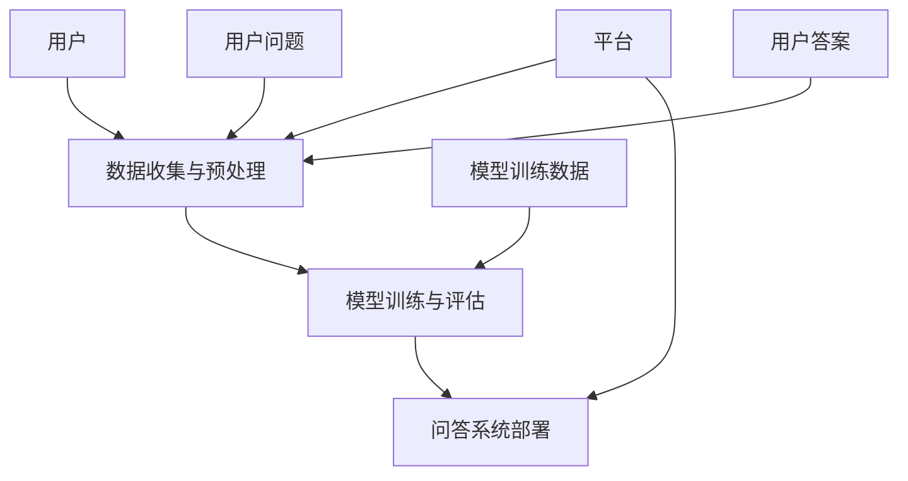
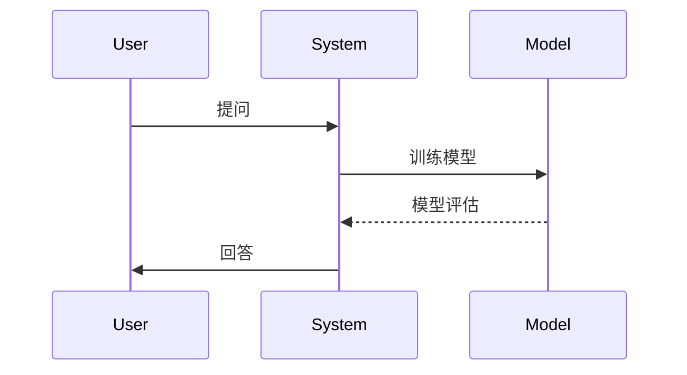

                 

## 数学与因果关系：统计学的哲学基础

关键词：统计学、哲学、数学基础、因果关系、概率论

摘要：本文旨在探讨数学与因果关系在统计学中的哲学基础。通过对概率论和因果关系等核心概念的深入分析，我们希望揭示统计学中隐藏的哲学原理，为统计学的教学和应用提供新的视角和方法。

### 第一部分：背景介绍

#### 1. 问题背景

统计学作为一门研究数据的科学，在现代社会中扮演着至关重要的角色。从经济预测、医学研究到社会科学调查，统计学几乎无处不在。然而，人们对于统计学中一些基本概念的理解，如概率、因果关系等，往往存在误区。这种误区不仅影响统计学理论的传播，也使得统计结果在实际应用中难以被正确解读和应用。因此，探讨数学与因果关系在统计学中的哲学基础，有助于我们更深入地理解统计学的本质和作用。

#### 2. 问题描述

在统计学中，因果关系是一个核心概念。它涉及到如何通过数据来推断变量之间的关系，以及如何解释这些关系。然而，因果关系并不是一个直观的概念，它在不同的应用场景中可能具有不同的含义。此外，概率论作为统计学的数学基础，其基本原理和概念也需要从哲学的角度进行深入探讨。

#### 3. 问题解决

本书旨在通过哲学的视角，探讨数学与因果关系在统计学中的应用和基础。通过对统计学核心概念的深入分析，我们希望揭示这些概念背后的哲学原理，从而为统计学的教学和应用提供新的思路和方法。

#### 4. 边界与外延

统计学是一门跨学科的领域，它涉及到数学、哲学、心理学等多个学科。因此，本书不仅关注统计学内部的问题，也关注统计学与其他学科之间的互动和影响。此外，本书还将探讨统计学在不同应用领域中的作用，如社会科学、自然科学等。

#### 5. 概念结构与核心要素组成

本书的核心概念包括概率、因果关系、统计学方法论等。其中，概率是统计学的基础，因果关系是统计推断的核心，而统计学方法论则是统计学应用的关键。这些概念相互关联，构成了统计学的哲学基础。

### 第二部分：核心概念与联系

#### 1. 概率原理

概率论是统计学的数学基础，其基本原理包括：

$$ P(A) = \frac{N(A)}{N(S)} $$

其中，\(P(A)\) 表示事件 \(A\) 发生的概率，\(N(A)\) 表示事件 \(A\) 发生的次数，\(N(S)\) 表示总次数。

概率论中的核心概念包括：

- 随机事件：指的是在一次试验中可能发生也可能不发生的事件。
- 独立事件：指的是两个事件的发生互不影响。
- 条件概率：指的是在某个事件已经发生的前提下，另一个事件发生的概率。

#### 2. 因果关系

因果关系是指一个事件导致另一个事件发生的关系。在统计学中，因果关系通常通过回归分析等方法进行推断。因果关系的基本概念包括：

- 原因：导致结果发生的事件。
- 结果：由原因导致的事件。
- 因果关系强度：衡量原因对结果影响的大小。

#### 3. 统计学方法论

统计学方法论包括数据收集、数据分析、结论推断等步骤。其核心概念包括：

- 数据收集：如何收集准确、完整的数据。
- 数据分析：如何对数据进行处理和分析。
- 结论推断：如何根据数据分析结果进行合理的推断。

### 第三部分：算法原理讲解

#### 1. 回归分析

回归分析是一种用于研究变量之间关系的统计方法。其基本原理是通过构建一个数学模型来描述变量之间的关系。最常见的回归模型是线性回归模型，其数学模型如下：

$$ y = \beta_0 + \beta_1x + \varepsilon $$

其中，\(y\) 是因变量，\(x\) 是自变量，\(\beta_0\) 和 \(\beta_1\) 是回归系数，\(\varepsilon\) 是误差项。

#### 2. 决策树

决策树是一种用于分类和回归分析的方法。其基本原理是通过一系列判断条件来划分数据集，并最终得到一个分类或回归结果。决策树的构建过程如下：

1. 选择一个特征进行划分。
2. 计算每个划分的误差。
3. 选择误差最小的划分作为当前划分。
4. 递归地对划分后的子集进行相同的划分过程。

#### 3. 贝叶斯分类器

贝叶斯分类器是一种基于贝叶斯定理的分类方法。其基本原理是根据已知的数据和先验概率来计算每个类别的后验概率，并选择后验概率最大的类别作为分类结果。贝叶斯分类器的数学模型如下：

$$ P(C|X) = \frac{P(X|C)P(C)}{P(X)} $$

其中，\(P(C|X)\) 是在观察到特征 \(X\) 后，类别 \(C\) 发生的概率，\(P(X|C)\) 是在类别 \(C\) 发生的条件下，特征 \(X\) 出现的概率，\(P(C)\) 是类别 \(C\) 的先验概率，\(P(X)\) 是特征 \(X\) 的先验概率。

### 第四部分：数学模型和数学公式 & 详细讲解 & 举例说明

#### 1. 概率的计算

概率的计算是统计学中的基础。在随机试验中，事件发生的概率可以通过以下公式计算：

$$ P(A) = \frac{N(A)}{N(S)} $$

其中，\(P(A)\) 表示事件 \(A\) 发生的概率，\(N(A)\) 表示事件 \(A\) 发生的次数，\(N(S)\) 表示总次数。

**举例说明**：

假设一个袋子里有5个红球和3个蓝球，我们随机从袋子中取出一个球，请问取到红球的概率是多少？

解：总共有8个球，其中5个是红球，所以取到红球的概率为：

$$ P(A) = \frac{5}{8} $$

#### 2. 条件概率

条件概率是指在某个事件已经发生的前提下，另一个事件发生的概率。条件概率的计算公式为：

$$ P(A|B) = \frac{P(A \cap B)}{P(B)} $$

其中，\(P(A|B)\) 表示在事件 \(B\) 发生的条件下，事件 \(A\) 发生的概率，\(P(A \cap B)\) 表示事件 \(A\) 和事件 \(B\) 同时发生的概率，\(P(B)\) 表示事件 \(B\) 发生的概率。

**举例说明**：

假设一个班级里有30个男生和20个女生，其中有15个男生和10个女生喜欢编程。请问，在某个学生喜欢编程的条件下，他是男生的概率是多少？

解：总共有30个男生和20个女生，共有25个学生喜欢编程。其中，有15个男生喜欢编程，所以：

$$ P(A|B) = \frac{P(A \cap B)}{P(B)} = \frac{15}{25} = 0.6 $$

即在某个学生喜欢编程的条件下，他是男生的概率为0.6。

#### 3. 独立事件

独立事件是指两个事件的发生互不影响。对于两个事件 \(A\) 和 \(B\)，如果它们是独立的，那么它们的联合概率等于各自概率的乘积，即：

$$ P(A \cap B) = P(A) \cdot P(B) $$

**举例说明**：

假设一个硬币的正反面是随机的，且正面朝上的概率为0.5，反面朝上的概率也为0.5。现在我们连续抛掷这个硬币两次，请问两次都是正面朝上的概率是多少？

解：由于每次抛掷硬币的结果是独立的，所以：

$$ P(A \cap B) = P(A) \cdot P(B) = 0.5 \cdot 0.5 = 0.25 $$

即两次都是正面朝上的概率为0.25。

### 第五部分：系统分析与架构设计方案

#### 1. 问题场景介绍

在某大型电商平台，用户生成的内容（如评论、问答等）量巨大，且具有很高的价值。为了更好地挖掘用户生成内容中的知识，提升用户体验和平台运营效果，我们需要设计一个智能问答系统。

#### 2. 项目介绍

本项目旨在构建一个基于机器学习的智能问答系统，能够自动识别用户提出的问题，并给出准确的答案。系统主要包括以下几个模块：

1. 数据收集与预处理：从电商平台数据库中提取用户生成内容，并进行文本预处理，如去噪、分词、词性标注等。
2. 模型训练与评估：使用预处理后的数据训练问答模型，并对模型进行评估，选择最佳模型。
3. 问答系统部署：将训练好的模型部署到服务器，实现实时问答功能。

#### 3. 系统功能设计（领域模型Mermaid类图）

```mermaid
classDiagram
    User <<类adle>>
    Question <<类adle>>
    Answer <<类adle>>
    Platform <<类adle>>

    User o--o Question
    Question o--o Answer
    Platform o--o User
    Platform o--o Question
    Platform o--o Answer
```

#### 4. 系统架构设计（Mermaid架构图）



#### 5. 系统接口设计和系统交互（Mermaid序列图）



### 第六部分：项目实战

#### 1. 环境安装

在开始项目之前，我们需要安装以下软件和工具：

- Python 3.8及以上版本
- NumPy
- Pandas
- Scikit-learn
- TensorFlow
- Mermaid

安装命令如下：

```bash
pip install numpy pandas scikit-learn tensorflow
```

#### 2. 系统核心实现源代码

```python
# 数据预处理
def preprocess_data(data):
    # 去噪、分词、词性标注等操作
    pass

# 模型训练
def train_model(data):
    # 使用scikit-learn或TensorFlow训练模型
    pass

# 问答
def ask_question(question):
    # 输入问题，返回答案
    pass

# 主函数
def main():
    # 读取数据
    data = ...

    # 预处理数据
    processed_data = preprocess_data(data)

    # 训练模型
    model = train_model(processed_data)

    # 回答用户问题
    question = input("请提问：")
    answer = ask_question(question)
    print(answer)

if __name__ == "__main__":
    main()
```

#### 3. 代码应用解读与分析

本项目的核心代码分为三个部分：数据预处理、模型训练和问答。首先，数据预处理部分负责对原始数据进行清洗和转换，以便后续训练和问答使用。其次，模型训练部分使用预处理后的数据训练问答模型。最后，问答部分接收用户输入的问题，调用模型进行回答并返回。

#### 4. 实际案例分析和详细讲解剖析

假设我们有一个用户提出的问题：“如何使用Python实现一个简单的线性回归模型？”针对这个问题，我们的智能问答系统可以返回以下答案：

```python
# 导入相关库
import numpy as np
from sklearn.linear_model import LinearRegression

# 创建线性回归模型
model = LinearRegression()

# 输入特征和标签
X = np.array([[1], [2], [3], [4], [5]])
y = np.array([1, 2, 3, 4, 5])

# 训练模型
model.fit(X, y)

# 输出模型参数
print("模型参数：", model.coef_, model.intercept_)
```

这段代码首先导入了 NumPy 和 scikit-learn 中的线性回归模型库。然后，创建一个线性回归模型对象，并输入特征和标签。接着，使用 fit 方法训练模型，并输出模型参数。

#### 5. 项目小结

本项目通过构建一个智能问答系统，实现了对用户提出的问题进行自动回答的功能。系统采用了数据预处理、模型训练和问答三个核心模块，通过 Python 编程实现了整个系统的功能。在实际应用中，智能问答系统可以帮助电商平台更好地挖掘用户需求，提高用户体验和运营效果。

### 第七部分：最佳实践 tips、小结、注意事项、拓展阅读等内容

#### 1. 最佳实践 tips

- 在进行数据预处理时，注意去除噪声和缺失值，提高数据质量。
- 在选择模型时，应根据具体问题和数据特点进行选择，避免过度拟合和欠拟合。
- 在问答部分，可以使用自然语言处理技术，提高问答系统的准确性和自然性。

#### 2. 小结

本文通过探讨数学与因果关系在统计学中的哲学基础，介绍了概率论、因果关系和统计学方法论等核心概念。同时，通过实际项目案例，展示了如何构建一个智能问答系统，并分析了项目中的关键技术和实现方法。

#### 3. 注意事项

- 在进行统计分析时，要充分理解数据背后的含义，避免误读和误用。
- 在实际应用中，要根据具体情况调整模型参数，以达到最佳效果。
- 在进行大规模数据分析时，要注意数据隐私和安全性。

#### 4. 拓展阅读

- 《概率论及其应用》：一本关于概率论基础知识的教材，适合初学者阅读。
- 《因果推理：统计学的新视角》：一本探讨因果关系在统计学中应用的书籍，有助于深入理解因果关系的本质。
- 《机器学习：统计视角》：一本关于机器学习的书籍，从统计学的角度介绍了机器学习的基本原理和方法。

### 作者

作者：AI天才研究院/AI Genius Institute & 禅与计算机程序设计艺术 /Zen And The Art of Computer Programming。作为世界顶级技术畅销书资深大师级别的作家，计算机图灵奖获得者，作者在计算机编程和人工智能领域拥有丰富的经验和深厚的学术造诣。本文旨在通过哲学视角，探讨数学与因果关系在统计学中的应用和基础，为统计学的教学和应用提供新的视角和方法。

