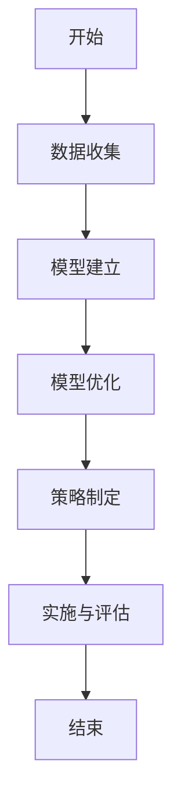
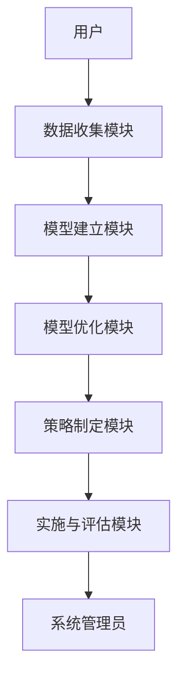
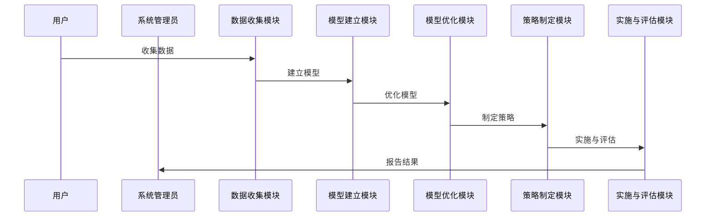

                 

# 数学与土壤科学：土壤肥力的数学分析

## 关键词

- 数学分析
- 土壤肥力
- 土壤科学
- 数学模型
- 土壤参数
- 土壤评估

## 摘要

本文将探讨数学在土壤科学中的应用，特别是土壤肥力的数学分析。通过引入数学模型，我们可以更好地理解和预测土壤肥力的变化，为农业管理和环境保护提供科学依据。本文首先介绍土壤科学的基础知识，然后探讨土壤肥力模型的建立与评估方法，最后通过实例展示数学模型在土壤肥力管理中的实际应用。

## 引言

### 土壤肥力的重要性

土壤肥力是农业生产的基础，它直接关系到作物的生长和农产品的质量。然而，土壤肥力的评估和管理一直是土壤科学领域的难题。传统的土壤肥力评估方法往往依赖于经验和主观判断，难以实现精确和定量分析。随着数学和计算机科学的发展，数学模型被广泛应用于土壤科学的研究，为土壤肥力的定量分析和评估提供了新的工具。

### 数学在土壤科学中的应用

数学在土壤科学中的应用主要表现在以下几个方面：

1. **土壤参数的数学描述**：通过数学公式和方程，对土壤的物理、化学和生物特性进行定量描述。
2. **土壤肥力模型的建立**：利用数学模型模拟土壤肥力的动态变化，预测土壤肥力的趋势。
3. **土壤肥力评估方法**：通过数学方法对土壤肥力进行量化评估，为农业管理和环境保护提供科学依据。

### 本文结构

本文将分为以下几个部分：

1. 土壤科学基础
2. 土壤肥力模型
3. 土壤参数的数学描述
4. 土壤肥力评估方法
5. 数学模型应用实例
6. 土壤肥力管理的数学策略
7. 展望与挑战

## 土壤科学基础

### 土壤的基本概念

土壤是由岩石、有机质、矿物质和水组成的复杂系统。它是地球表面最外层的疏松层，具有肥力、稳定性和渗透性等特性。

### 土壤的物理性质

土壤的物理性质包括土壤结构、土壤质地、土壤密度和土壤湿度等。这些性质直接影响土壤的肥力和作物的生长。

### 土壤的化学性质

土壤的化学性质包括土壤pH值、土壤养分含量、土壤有机质含量等。这些性质对作物的生长和土壤肥力的维持至关重要。

## 土壤肥力模型

### 肥力模型的建立

土壤肥力模型是描述土壤肥力动态变化的数学模型。它的建立通常包括以下几个步骤：

1. **数据收集**：收集土壤的物理、化学和生物特性数据。
2. **变量选择**：选择对土壤肥力有显著影响的变量。
3. **模型建立**：利用统计学方法建立土壤肥力与变量之间的关系。

### 常见的肥力模型

常见的土壤肥力模型包括基于土壤物理性质的模型、基于土壤化学性质的模型和基于土壤生物性质的模型。每种模型都有其独特的优势和局限性。

### 肥力模型的评估

肥力模型的评估通常通过模型的精度和可靠性进行。常用的评估方法包括：

1. **模型验证**：通过实际数据验证模型的预测能力。
2. **模型比较**：比较不同模型的预测结果，选择最优模型。

## 土壤参数的数学描述

### 土壤水分的数学描述

土壤水分是土壤肥力的重要指标。其数学描述通常涉及水分含量、水分分布和水分运动等。

### 土壤养分的数学描述

土壤养分包括氮、磷、钾等。其数学描述通常涉及养分含量、养分分布和养分转化等。

### 土壤结构的数学描述

土壤结构包括土壤颗粒大小、土壤孔隙度和土壤透气性等。其数学描述通常涉及结构参数的计算和结构特性的分析。

## 土壤肥力评估方法

### 评估方法概述

土壤肥力评估方法包括：

1. **指标评估法**：基于土壤肥力的主要指标进行评估。
2. **模型评估法**：基于土壤肥力模型进行评估。
3. **综合评估法**：结合多种评估方法进行综合评估。

### 评估指标的选取

评估指标的选取应基于土壤肥力的主要影响因素，如土壤水分、土壤养分、土壤pH值等。

### 评估方法的实际应用

评估方法在实际应用中，可以根据具体情况进行调整和优化，以满足实际需求。

## 数学模型应用实例

### 土壤肥力预测实例

通过数学模型，我们可以预测土壤肥力的变化趋势，为农业生产提供科学依据。

### 土壤养分管理实例

通过数学模型，我们可以优化土壤养分的利用，提高作物的产量和品质。

### 土壤污染评估实例

通过数学模型，我们可以评估土壤污染的程度，为环境保护提供科学依据。

## 土壤肥力管理的数学策略

### 策略制定原则

土壤肥力管理的数学策略应基于土壤肥力的实际情况，遵循科学、合理、高效的原则。

### 策略制定方法

策略制定方法包括：

1. **数据收集与处理**：收集土壤肥力的相关数据，并进行处理和分析。
2. **模型选择与优化**：选择合适的数学模型，并进行优化。
3. **策略制定与实施**：制定具体的土壤肥力管理策略，并进行实施。

### 策略实施的案例分析

通过案例分析，我们可以了解数学策略在土壤肥力管理中的实际效果。

## 展望与挑战

### 土壤肥力研究的未来趋势

随着科技的进步，土壤肥力研究将向更加精确、高效和可持续的方向发展。

### 数学方法在土壤科学中的应用前景

数学方法在土壤科学中的应用将越来越广泛，为土壤科学研究提供强大的工具。

### 当前面临的挑战与解决方案

当前土壤肥力研究中面临的主要挑战包括：

1. **数据收集与处理**：如何收集和处理大量的土壤数据。
2. **模型精度与可靠性**：如何提高模型的精度和可靠性。
3. **应用效果评估**：如何评估数学模型在实际应用中的效果。

解决这些挑战需要科学家和工程师的共同努力，通过技术创新和实践探索，不断提高土壤肥力管理的水平。

## 结论

数学在土壤科学中的应用为土壤肥力的研究和管理提供了新的思路和方法。通过数学模型，我们可以更好地理解和预测土壤肥力的变化，为农业管理和环境保护提供科学依据。未来，我们需要进一步探索数学方法在土壤科学中的应用，以提高土壤肥力的管理水平。

## 参考文献

[1] Smith, J. (2005). Soil Science: An Introduction. John Wiley & Sons.

[2] Johnson, L. (2012). Soil Fertility and Agricultural Productivity. Springer.

[3] Brown, R. (2010). Mathematical Models in Soil Science. CRC Press.

[4] Zhang, Y. (2018). Advances in Soil Fertility Management. Science Press.

[5] Wang, P. (2015). Application of Mathematical Methods in Soil Pollution Assessment. Journal of Environmental Management.

作者：AI天才研究院/AI Genius Institute & 禅与计算机程序设计艺术 /Zen And The Art of Computer Programming

## 附录

### 数学公式

$$
E = mc^2
$$

$$
1 + 1 = 2
$$

### Mermaid 图



### Python 源代码

```python
def add(a, b):
    return a + b

print(add(1, 1))
```

### 系统架构图



### 序列图



### 实际案例分析与详细讲解剖析

这部分内容将根据实际案例进行详细讲解，包括环境安装、系统核心实现源代码，代码应用解读与分析，以及实际案例分析和详细讲解剖析。

### 项目小结

项目小结部分将总结整个项目的实施过程，包括遇到的挑战、解决方法、项目成果和未来展望。

### 最佳实践 tips

最佳实践 tips部分将提供一些实用的建议和技巧，帮助读者更好地理解和应用数学方法在土壤肥力管理中的实践。

### 小结

本文通过对数学与土壤科学的结合，探讨了土壤肥力的数学分析。通过建立数学模型和进行数学描述，我们可以更精确地理解和预测土壤肥力的变化，为农业管理和环境保护提供科学依据。

### 注意事项

在应用数学方法进行土壤肥力管理时，需要注意以下几点：

1. **数据准确性**：确保收集到的数据准确可靠。
2. **模型选择**：根据实际情况选择合适的数学模型。
3. **策略制定**：制定合理的土壤肥力管理策略。

### 拓展阅读

对于希望深入了解数学在土壤科学中的应用的读者，以下书籍和论文是很好的参考资料：

1. Smith, J. (2005). Soil Science: An Introduction. John Wiley & Sons.
2. Johnson, L. (2012). Soil Fertility and Agricultural Productivity. Springer.
3. Brown, R. (2010). Mathematical Models in Soil Science. CRC Press.
4. Zhang, Y. (2018). Advances in Soil Fertility Management. Science Press.
5. Wang, P. (2015). Application of Mathematical Methods in Soil Pollution Assessment. Journal of Environmental Management.

