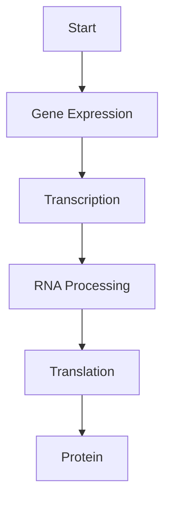
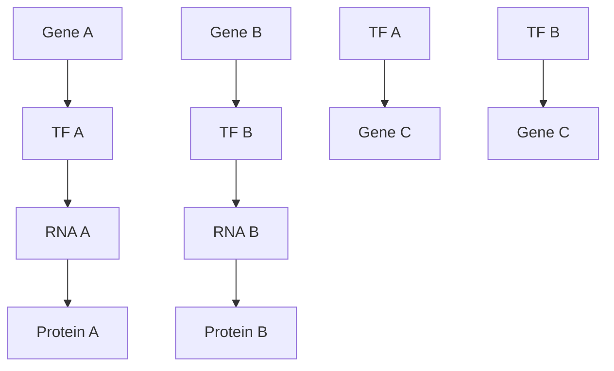
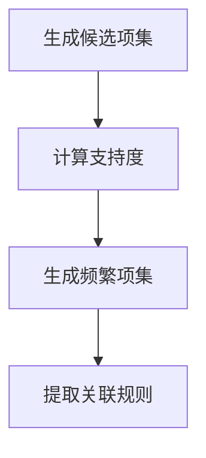
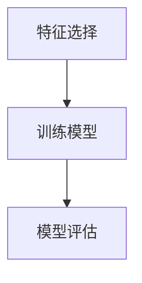
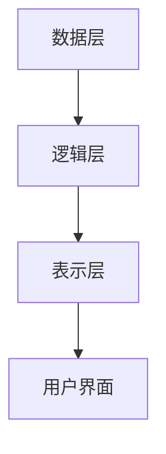
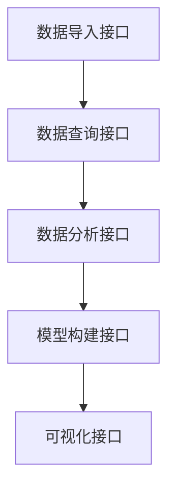
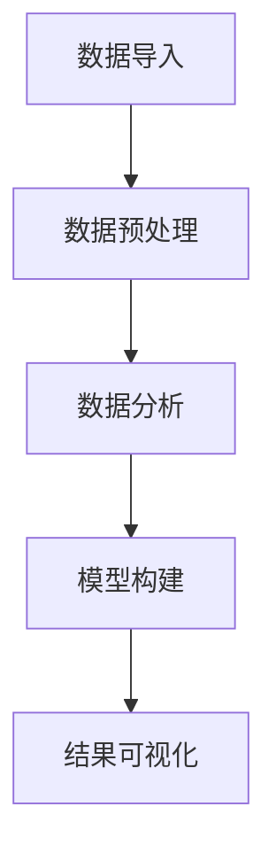

                 

## 基因表达调控的数学模型

### 2.1.1 数学模型的基本原理

基因表达调控的数学模型在生物学和医学研究中扮演着至关重要的角色。这些模型帮助我们理解和预测基因在细胞内的表达过程，从而指导基因治疗和疾病研究。数学模型的基本原理通常基于以下两个方面：

- **物质守恒原理**：在细胞内，物质的数量在时间上保持不变。这意味着，如果一个基因的转录或翻译速率增加，其他相关基因的速率必须相应地减少，以保持细胞内的物质平衡。

- **反应动力学原理**：基因表达调控过程中涉及到的各种反应遵循动力学定律。这些定律描述了反应物和产物之间的速率关系，以及反应的速率如何受温度、压力和浓度等因素的影响。

在构建基因表达调控的数学模型时，我们需要考虑以下几个方面：

1. **基因转录和翻译过程**：基因表达调控的数学模型通常描述基因的转录和翻译过程。这些过程涉及到RNA聚合酶、DNA模板和转录因子等分子机器。

2. **调控网络的复杂性**：基因表达调控网络通常非常复杂，包括大量的基因和调控因子。因此，数学模型需要能够捕捉这种复杂性，并描述基因之间的相互作用。

3. **时间动态和行为**：基因表达调控的数学模型需要能够模拟基因表达的时间动态行为。这包括基因在不同发育阶段、不同细胞类型和环境条件下的表达模式。

4. **空间分布和行为**：基因表达不仅在时间上动态变化，还在空间上有特定的分布模式。数学模型需要能够模拟基因在不同细胞区域或组织中的分布情况。

### 2.1.2 数学模型的应用场景

基因表达调控的数学模型在各种应用场景中都非常有用，主要包括以下几个方面：

1. **基因治疗设计**：在基因治疗中，精确控制目标基因的表达至关重要。数学模型可以帮助研究人员设计出最佳的治疗方案，预测不同治疗方案的效果，从而提高治疗效果。

2. **基因调控机制研究**：通过构建和模拟基因表达调控的数学模型，研究人员可以深入理解基因调控的机制，发现新的调控关系和调控因子。

3. **药物筛选与优化**：数学模型可以用于预测不同药物对基因表达的影响，帮助研究人员筛选和优化药物，提高药物的治疗效果和安全性。

4. **基因组学研究**：在基因组学研究中，数学模型可以帮助研究人员分析大规模基因表达数据，发现基因之间的相互作用和调控关系，从而揭示生物体的遗传机制。

5. **癌症研究**：癌症的发生和发展与基因表达调控的异常密切相关。数学模型可以用于模拟癌症发展过程，预测癌症的治疗效果和复发风险，为癌症治疗提供指导。

### 2.1.3 数学模型的基本类型

基因表达调控的数学模型可以分为几种基本类型，每种类型都有其特定的应用和优势：

1. **微分方程模型**：微分方程模型是一种经典的数学模型，用于描述基因表达的时间动态行为。这些模型通常基于反应速率方程，可以很好地描述基因转录和翻译的动态变化。

   $$\frac{dX}{dt} = f(X, t)$$
   
   其中，\(X\) 表示基因的表达水平，\(f(X, t)\) 表示基因表达的速率。

2. **概率模型**：概率模型用于描述基因表达的不确定性和随机性。这些模型基于概率论和统计学原理，可以用于分析基因表达数据，预测基因表达的概率分布。

3. **神经网络模型**：神经网络模型是一种基于人工神经网络的数学模型，用于模拟复杂的基因调控网络。这些模型通过训练大量基因表达数据，可以预测新的基因表达模式。

   $$\hat{Y} = \sigma(W \cdot X + b)$$
   
   其中，\(\hat{Y}\) 表示预测的基因表达水平，\(W\) 和 \(b\) 分别表示神经网络权重和偏置。

4. **系统动力学模型**：系统动力学模型用于描述基因表达调控的复杂动力学行为，包括多个基因和调控因子之间的相互作用。这些模型通常基于微分方程和代数方程，可以很好地模拟基因调控网络的行为。

### 2.1.4 基因表达调控模型的构建方法

构建基因表达调控的数学模型通常需要以下步骤：

1. **数据收集**：收集与基因表达调控相关的实验数据，包括基因表达水平、转录因子活性、DNA序列等。

2. **数据预处理**：对收集到的数据进行预处理，包括数据清洗、归一化和特征提取等。

3. **模型选择**：根据数据特点和需求，选择合适的数学模型，如微分方程模型、概率模型或神经网络模型。

4. **参数估计**：通过最小化误差函数或优化算法，估计模型参数，使得模型能够最好地拟合实验数据。

5. **模型验证**：通过交叉验证和测试数据，验证模型的准确性和稳定性。

6. **模型应用**：将验证后的模型应用于实际问题，如基因治疗设计、药物筛选或癌症研究。

### 2.1.5 基因表达调控模型的优点和挑战

基因表达调控模型的优点包括：

1. **定量分析**：数学模型可以定量描述基因表达的过程和调控机制，为生物学研究提供精确的数据支持。

2. **预测能力**：通过训练模型，可以预测未知条件下的基因表达水平，为基因治疗和药物设计提供指导。

3. **机制理解**：数学模型可以帮助我们深入理解基因表达调控的机制，揭示生物体的复杂性。

然而，基因表达调控模型的构建和应用也面临着一些挑战：

1. **数据复杂性**：基因表达数据通常包含大量的噪声和不确定性，使得模型构建和参数估计变得复杂。

2. **模型选择**：选择合适的数学模型对构建准确的模型至关重要，但选择过程往往依赖于经验和直觉。

3. **模型验证**：验证模型是否准确和稳定是一个重要问题，需要大量的实验数据来支持。

4. **计算资源**：构建和训练复杂的数学模型通常需要大量的计算资源，对计算能力提出了较高的要求。

### 2.1.6 基因表达调控模型的应用实例

基因表达调控模型已经在多个领域中得到了成功应用，以下是一些应用实例：

1. **癌症研究**：通过构建基因表达调控模型，研究人员可以预测癌症的进展和治疗效果，为个性化癌症治疗提供指导。

2. **药物开发**：基因表达调控模型可以用于预测药物对基因表达的影响，帮助研究人员筛选和优化药物。

3. **发育生物学**：通过构建基因表达调控模型，研究人员可以理解基因在不同发育阶段的表达模式，揭示发育过程中的调控机制。

4. **基因组学**：基因表达调控模型可以用于分析大规模基因表达数据，发现基因之间的相互作用和调控关系。

5. **环境生物学**：基因表达调控模型可以用于研究生物体对环境变化的响应，预测环境污染物对生物体的危害。

通过上述实例，我们可以看到基因表达调控模型在生物学和医学研究中的重要性和广泛应用。

### 2.1.7 总结

基因表达调控的数学模型是生物学和医学研究中不可或缺的工具。通过构建和模拟这些模型，我们可以深入理解基因表达的动态过程和调控机制，为基因治疗、药物开发、疾病研究等领域提供重要的理论支持。然而，构建和应用这些模型也面临着一系列挑战，需要进一步的研究和探索。在未来，随着计算技术和数据采集技术的发展，基因表达调控的数学模型将变得更加精确和可靠，为生物学和医学研究带来更多突破。

---

**接下来的内容将详细介绍基因调控网络分析，包括ER实体关系图架构、Mermaid流程图的绘制方法和应用，以及不同数学模型之间的比较和分析。**

## 2.2 基因调控网络分析

### 2.2.1 ER实体关系图架构

基因调控网络是生物系统中复杂且动态的交互网络，它涉及多个基因、转录因子、mRNA和蛋白质等实体之间的相互作用。为了更好地理解和分析基因调控网络，我们可以使用ER（实体关系）图来表示这些实体及其之间的关系。

#### ER实体关系图的基本概念

ER图是由实体（Entity）和关系（Relationship）组成的图形表示方法，它用于描述系统中不同实体之间的关联。在基因调控网络中，实体可以是基因、转录因子、RNA或蛋白质等，关系则表示这些实体之间的相互作用，如激活、抑制或调控。

#### ER实体关系图在基因调控网络中的应用

在基因调控网络中，ER图可以帮助我们清晰地展示基因和转录因子之间的相互作用。例如，我们可以将某个特定基因作为实体，如果该基因被某个转录因子所激活，则可以在ER图中表示为这两个实体之间存在激活关系。

以下是一个简化的ER实体关系图的例子：

```mermaid
erDiagram
    A[基因] ||--|{ B[转录因子] }|--| C[RNA]
    B ||--|{ D[蛋白质] }|
```

在这个例子中，基因A通过转录因子B激活RNA（C），并且转录因子B还可能直接或间接地调控蛋白质D的合成。

### 2.2.2 Mermaid流程图

Mermaid是一种方便的Markdown扩展语言，用于创建图表和流程图。在基因调控网络分析中，我们可以使用Mermaid来绘制基因表达和调控过程的流程图，以便更直观地展示基因之间的相互作用。

#### Mermaid流程图的基本语法

Mermaid流程图的基本语法包括节点（Node）、箭头（Arrow）和连接（Link）等元素。以下是一个简单的Mermaid流程图示例：



在这个流程图中，我们从基因表达（A）开始，经过转录（B）、RNA处理（C）、翻译（D）最终生成蛋白质（F）。

#### Mermaid流程图在基因调控网络中的应用

使用Mermaid流程图，我们可以更直观地展示基因调控网络的动态过程。以下是一个更复杂的基因调控网络流程图示例：



在这个流程图中，基因A和基因B分别被转录因子A和转录因子B激活，产生RNA和蛋白质。同时，转录因子A还激活基因C，而转录因子B也参与调控基因C。

### 2.2.3 不同数学模型之间的比较与分析

在基因调控网络分析中，不同的数学模型可以用于描述和预测基因表达和调控过程。以下是比较和分析几种常见数学模型的方法：

#### 微分方程模型

微分方程模型是描述基因表达动态变化的一种经典方法。它通过描述基因表达水平随时间的变化，来模拟基因调控网络的行为。以下是一个简单的微分方程模型：

$$
\frac{dx}{dt} = f(x, t)
$$

其中，\(x\) 表示基因表达水平，\(f(x, t)\) 是描述基因表达速率的函数。

#### 神经网络模型

神经网络模型是一种基于人工神经网络的数学模型，它可以模拟复杂的基因调控网络。以下是一个简单的神经网络模型：

$$
\hat{y} = \sigma(W \cdot x + b)
$$

其中，\(\hat{y}\) 表示预测的基因表达水平，\(W\) 和 \(b\) 分别是神经网络的权重和偏置，\(\sigma\) 是激活函数。

#### 概率模型

概率模型用于描述基因表达的不确定性和随机性。它通过定义基因表达的概率分布来预测基因表达的可能性。以下是一个简单的概率模型：

$$
p(x) = \prod_{i=1}^{n} p(x_i | x_{i-1})
$$

其中，\(p(x)\) 是基因表达的概率分布，\(x_i\) 是基因在不同时间点的表达水平。

#### 比较与分析

- **微分方程模型**：微分方程模型可以很好地描述基因表达的动态变化，适用于研究基因表达的时序数据。然而，它通常需要大量的实验数据来参数化和验证。

- **神经网络模型**：神经网络模型具有强大的非线性建模能力，可以处理复杂的基因调控网络。但是，它需要大量的训练数据来训练模型参数，并且可能难以解释模型的预测结果。

- **概率模型**：概率模型可以很好地描述基因表达的不确定性和随机性，适用于处理基因表达的数据不确定性。但是，它可能需要复杂的统计方法和计算资源。

综上所述，不同的数学模型在基因调控网络分析中各有优缺点。选择合适的模型需要根据具体的研究问题和数据特点进行综合考虑。

### 2.2.4 实际应用案例

为了更好地理解基因调控网络分析的数学模型，我们可以通过一些实际应用案例来展示它们的使用方法。

#### 病毒载体介导的基因治疗

假设我们研究的是一种病毒载体介导的基因治疗方法，旨在将正常基因导入患者体内以治疗某种遗传性疾病。我们可以使用微分方程模型来描述基因在病毒载体中的表达动态：

$$
\frac{dx}{dt} = r \cdot x - k \cdot x^2
$$

其中，\(x\) 表示基因的表达水平，\(r\) 是基因表达的速率常数，\(k\) 是基因表达的衰减常数。通过参数化这个模型，我们可以预测基因在不同时间点的表达水平，从而优化基因治疗的设计。

#### RNA干扰（RNAi）治疗

RNA干扰治疗是通过引入特定的RNA干扰剂（siRNA）来抑制特定基因的表达。我们可以使用神经网络模型来预测不同siRNA序列对基因表达的调控效果。以下是一个简化的神经网络模型：

$$
\hat{y} = \sigma(W \cdot x + b)
$$

其中，\(x\) 是siRNA序列的特征向量，\(W\) 和 \(b\) 是神经网络的权重和偏置。通过训练这个模型，我们可以预测不同siRNA序列对基因表达的抑制效果，从而筛选出最佳的siRNA序列。

#### 基因调控网络的动态分析

我们还可以使用概率模型来分析基因调控网络的动态行为。假设我们研究的是某一发育阶段基因调控网络的行为，我们可以使用马尔可夫模型来描述基因状态之间的转移概率：

$$
p(x_t | x_{t-1}) = \frac{1}{Z} \cdot e^{-\beta \cdot E(x_t | x_{t-1})}
$$

其中，\(x_t\) 是基因在时间点t的状态，\(E(x_t | x_{t-1})\) 是基因状态之间的期望能量，\(Z\) 是归一化常数，\(\beta\) 是温度参数。通过这个模型，我们可以预测基因在不同时间点的状态分布，从而理解基因调控网络的动态行为。

### 2.2.5 小结

基因调控网络分析是生物学研究中的一项重要任务，它涉及到复杂的数学模型和计算方法。通过使用ER实体关系图和Mermaid流程图，我们可以直观地展示基因调控网络的结构和动态过程。不同数学模型（如微分方程模型、神经网络模型和概率模型）在基因调控网络分析中各有优缺点，选择合适的模型需要根据具体的研究问题和数据特点进行综合考虑。通过实际应用案例，我们可以看到这些数学模型在基因治疗、RNA干扰和基因调控网络动态分析等领域的广泛应用。

---

**接下来，我们将进一步深入探讨基因表达调控的算法原理，包括算法的基本定义、分类和常见算法的详细解释。**

## 3.1 基因表达调控算法概述

### 3.1.1 算法定义

基因表达调控算法是一类用于分析基因表达数据，预测基因调控关系和进行基因功能注释的计算方法。这些算法基于生物学和统计学的原理，利用大量的基因表达数据来揭示基因之间的相互作用和调控关系。基因表达调控算法在基因组学研究、疾病诊断和治疗等领域具有广泛的应用。

### 3.1.2 算法分类

基因表达调控算法可以根据其原理和应用特点分为以下几类：

1. **聚类算法**：聚类算法用于将基因按照相似性进行分类，从而发现基因表达模式。常见的聚类算法包括K-means、层次聚类和密度聚类等。

2. **关联规则学习**：关联规则学习算法用于发现基因之间的共表达关系，即哪些基因在相同的条件下一起被调控。常见的算法包括Apriori算法和Eclat算法。

3. **机器学习算法**：机器学习算法通过训练大量的基因表达数据，建立基因调控模型，用于预测新的基因表达模式。常见的机器学习算法包括支持向量机（SVM）、随机森林（Random Forest）和神经网络（Neural Network）等。

4. **网络分析方法**：网络分析方法通过构建基因调控网络，分析基因之间的相互作用关系。常见的网络分析方法包括基因共表达网络分析、转录因子网络分析和蛋白质相互作用网络分析等。

### 3.1.3 聚类算法

聚类算法是基因表达调控算法中的一种基本方法，用于将基因按照其表达模式相似性进行分类。聚类算法的主要目的是通过无监督学习从基因表达数据中提取出有用的信息，从而帮助我们更好地理解基因的功能和调控关系。

**K-means算法**

K-means算法是最常用的聚类算法之一。它的基本思想是将基因分为K个簇，使得每个基因尽可能接近其簇中心。具体步骤如下：

1. **初始化**：随机选择K个基因作为初始簇中心。
2. **分配基因**：计算每个基因与簇中心的距离，将基因分配到最近的簇中心。
3. **更新簇中心**：计算每个簇的新簇中心，即簇内基因的平均位置。
4. **迭代**：重复步骤2和步骤3，直到簇中心不再发生变化或满足停止条件。

**层次聚类算法**

层次聚类算法是一种基于层次结构的聚类方法。它的基本思想是自底向上或自顶向下地将基因逐步合并成更大的簇，形成一种层次化的聚类结构。常见的层次聚类算法包括自底向上的凝聚聚类（Agglomerative Clustering）和自顶向下的分裂聚类（Divisive Clustering）。

**密度聚类算法**

密度聚类算法基于数据点的密度分布来进行聚类。它的基本思想是在高密度区域形成簇，而在低密度区域不形成簇。常见的密度聚类算法包括DBSCAN（Density-Based Spatial Clustering of Applications with Noise）和OPTICS（Ordering Points To Identify the Clustering Structure）。

### 3.1.4 关联规则学习

关联规则学习算法用于发现基因表达数据中的隐含规律。它通过分析基因之间的共表达关系，揭示哪些基因在相同的条件下一起被调控。常见的关联规则学习算法包括Apriori算法和Eclat算法。

**Apriori算法**

Apriori算法是一种经典的关联规则学习算法。它的基本思想是通过迭代地计算支持度和置信度来生成频繁项集，然后从频繁项集中提取关联规则。具体步骤如下：

1. **生成候选项集**：根据最小支持度阈值，生成所有可能的候选项集。
2. **计算支持度**：计算每个候选项集的支持度，即满足条件的基因对的数量。
3. **生成频繁项集**：从候选项集中筛选出满足最小支持度阈值的频繁项集。
4. **提取关联规则**：从频繁项集中生成关联规则，并计算其置信度。

**Eclat算法**

Eclat算法是Apriori算法的一种改进算法。它与Apriori算法类似，但在生成候选项集和计算支持度方面有所不同。Eclat算法通过使用集合论中的并集操作来减少候选项集的数量，从而提高计算效率。

### 3.1.5 机器学习算法

机器学习算法通过训练大量的基因表达数据，建立基因调控模型，用于预测新的基因表达模式。常见的机器学习算法包括支持向量机（SVM）、随机森林（Random Forest）和神经网络（Neural Network）等。

**支持向量机（SVM）**

支持向量机是一种监督学习算法，用于分类和回归分析。在基因表达调控中，SVM可以用于分类基因表达数据，将相似的基因分为同一类别。具体步骤如下：

1. **特征选择**：选择能够区分不同类别的特征基因。
2. **训练模型**：使用基因表达数据训练SVM模型，确定最优分类边界。
3. **模型评估**：使用交叉验证方法评估模型性能，调整参数以优化模型。

**随机森林（Random Forest）**

随机森林是一种基于决策树集合的集成学习方法。它通过构建多棵决策树，并结合它们的预测结果来提高预测准确性。在基因表达调控中，随机森林可以用于预测新的基因表达模式。具体步骤如下：

1. **特征选择**：随机选择一部分特征基因来构建每棵决策树。
2. **训练模型**：使用基因表达数据训练随机森林模型。
3. **模型评估**：使用交叉验证方法评估模型性能，并使用模型预测新的基因表达模式。

**神经网络（Neural Network）**

神经网络是一种模拟生物神经系统的计算模型，用于处理复杂的非线性问题。在基因表达调控中，神经网络可以用于建立基因调控模型，预测新的基因表达模式。具体步骤如下：

1. **数据预处理**：对基因表达数据进行归一化和缺失值处理。
2. **模型构建**：设计神经网络的架构，包括输入层、隐藏层和输出层。
3. **模型训练**：使用基因表达数据训练神经网络，调整网络参数以优化模型。
4. **模型评估**：使用交叉验证方法评估模型性能，并使用模型预测新的基因表达模式。

### 3.1.6 网络分析方法

网络分析方法通过构建基因调控网络，分析基因之间的相互作用关系。常见的网络分析方法包括基因共表达网络分析、转录因子网络分析和蛋白质相互作用网络分析等。

**基因共表达网络分析**

基因共表达网络分析通过分析基因表达数据，构建基因之间的共表达关系网络。该网络反映了基因在相同条件下的协同表达模式，有助于揭示基因的功能和调控关系。

**转录因子网络分析**

转录因子网络分析通过分析转录因子的调控关系，构建基因调控网络。该网络揭示了基因之间的调控关系，有助于理解基因表达调控的机制。

**蛋白质相互作用网络分析**

蛋白质相互作用网络分析通过分析蛋白质之间的相互作用，构建蛋白质相互作用网络。该网络反映了细胞内的蛋白质动态网络，有助于理解细胞的生命活动。

### 3.1.7 基因表达调控算法的应用场景

基因表达调控算法在多个应用场景中具有广泛的应用：

1. **基因组学研究**：用于分析大规模基因表达数据，发现基因之间的相互作用和调控关系，揭示基因的功能和生物学意义。
2. **疾病诊断**：用于分析患者的基因表达数据，预测疾病风险和诊断结果，为个性化医疗提供依据。
3. **药物开发**：用于分析药物对基因表达的影响，筛选和优化药物，提高药物的治疗效果和安全性。
4. **癌症研究**：用于分析癌症患者的基因表达数据，预测癌症的进展和治疗效果，为癌症治疗提供指导。

### 3.1.8 小结

基因表达调控算法是生物学和医学研究中重要的计算工具，通过分析基因表达数据，揭示基因之间的相互作用和调控关系。不同的算法在基因表达调控中各有优缺点，选择合适的算法需要根据具体的研究问题和数据特点进行综合考虑。未来的研究将继续改进这些算法，提高其准确性和鲁棒性，为基因表达调控的研究和应用提供更强有力的支持。

---

**接下来，我们将详细探讨几种常见的基因表达调控算法，包括K-means算法、Apriori算法和支持向量机（SVM）等，并使用Mermaid流程图和Python代码进行具体解释。**

### 3.2 常见基因表达调控算法

#### 3.2.1 K-means算法

K-means算法是一种常用的聚类算法，用于将数据集划分为K个簇。在基因表达调控中，K-means算法可以用于分析基因表达数据的聚类模式，从而发现不同基因的表达特征。

**算法原理**

K-means算法的核心思想是迭代更新簇中心和分配基因，直到簇中心不再变化或满足停止条件。具体步骤如下：

1. **初始化**：随机选择K个基因作为初始簇中心。
2. **分配基因**：计算每个基因与簇中心的距离，将基因分配到最近的簇中心。
3. **更新簇中心**：计算每个簇的新簇中心，即簇内基因的平均位置。
4. **迭代**：重复步骤2和步骤3，直到簇中心不再发生变化或满足停止条件。

**Mermaid流程图**

以下是一个K-means算法的Mermaid流程图示例：

```mermaid
graph TD
    A[初始化]
    B[计算距离]
    C[分配基因]
    D[更新中心]
    E[判断停止条件]

    A --> B
    B --> C
    C --> D
    D --> E
    E -->|
        + [停止]
        + [未停止] --> A
```

**Python代码示例**

以下是一个使用Python和scikit-learn库实现K-means算法的示例代码：

```python
from sklearn.cluster import KMeans
import numpy as np

# 假设x是一个包含基因表达数据的矩阵，每一行表示一个样本
x = np.array([[1, 2], [1, 4], [1, 0], [4, 2], [4, 1], [3, 3]])

# 初始化K-means模型，设置聚类个数K为2
kmeans = KMeans(n_clusters=2, random_state=0).fit(x)

# 输出聚类结果
print(kmeans.labels_)

# 输出簇中心
print(kmeans.cluster_centers_)
```

#### 3.2.2 Apriori算法

Apriori算法是一种用于发现频繁项集的算法，常用于市场篮子分析和基因共表达关系的发现。在基因表达调控中，Apriori算法可以用于分析基因之间的共表达关系，从而发现哪些基因在相同条件下一起被调控。

**算法原理**

Apriori算法的核心思想是通过迭代地生成和剪枝候选项集，然后计算每个候选项集的支持度和置信度，从而发现频繁项集。具体步骤如下：

1. **生成候选项集**：根据最小支持度阈值，生成所有可能的候选项集。
2. **计算支持度**：计算每个候选项集的支持度，即满足条件的基因对的数量。
3. **生成频繁项集**：从候选项集中筛选出满足最小支持度阈值的频繁项集。
4. **提取关联规则**：从频繁项集中生成关联规则，并计算其置信度。

**Mermaid流程图**

以下是一个Apriori算法的Mermaid流程图示例：



**Python代码示例**

以下是一个使用Python和mlxtend库实现Apriori算法的示例代码：

```python
from mlxtend.frequent_patterns import apriori
from mlxtend.preprocessing import TransactionEncoder

# 假设data是一个包含基因表达数据的矩阵，每一行表示一个样本
data = [[1, 2, 3], [1, 2, 4], [1, 3, 4], [2, 3, 4]]

# 初始化TransactionEncoder
te = TransactionEncoder()
te_data = te.fit(data).transform(data)

# 使用Apriori算法生成频繁项集
frequent_itemsets = apriori(te_data, min_support=0.5, use_colnames=True)

# 输出频繁项集
print(frequent_itemsets)
```

#### 3.2.3 支持向量机（SVM）

支持向量机（SVM）是一种常用的机器学习算法，用于分类和回归分析。在基因表达调控中，SVM可以用于分类基因表达数据，从而发现基因之间的调控关系。

**算法原理**

SVM算法的核心思想是找到一个最优的超平面，将不同类别的基因数据分开。具体步骤如下：

1. **特征选择**：选择能够区分不同类别的特征基因。
2. **训练模型**：使用基因表达数据训练SVM模型，确定最优分类边界。
3. **模型评估**：使用交叉验证方法评估模型性能，调整参数以优化模型。

**Mermaid流程图**

以下是一个SVM算法的Mermaid流程图示例：



**Python代码示例**

以下是一个使用Python和scikit-learn库实现SVM的示例代码：

```python
from sklearn.svm import SVC
from sklearn.model_selection import train_test_split
from sklearn.metrics import accuracy_score

# 假设x是一个包含基因表达数据的矩阵，每一行表示一个样本
# y是一个包含基因分类结果的向量
x = np.array([[1, 2], [1, 4], [1, 0], [4, 2], [4, 1], [3, 3]])
y = np.array([0, 0, 0, 1, 1, 1])

# 划分训练集和测试集
x_train, x_test, y_train, y_test = train_test_split(x, y, test_size=0.3, random_state=0)

# 初始化SVM模型
svm = SVC(kernel='linear')

# 训练模型
svm.fit(x_train, y_train)

# 预测测试集
y_pred = svm.predict(x_test)

# 输出准确率
print(accuracy_score(y_test, y_pred))
```

#### 3.2.4 小结

在本节中，我们介绍了三种常见的基因表达调控算法：K-means算法、Apriori算法和支持向量机（SVM）。这些算法在基因表达数据的分析中发挥着重要作用，可以帮助我们揭示基因之间的相互作用和调控关系。通过使用Mermaid流程图和Python代码，我们可以更直观地理解这些算法的实现过程和实际应用。

- **K-means算法**：用于将基因按照其表达模式相似性进行分类，通过迭代更新簇中心和分配基因来发现聚类模式。
- **Apriori算法**：用于发现基因之间的共表达关系，通过生成和剪枝候选项集来提取频繁项集和关联规则。
- **SVM**：用于分类基因表达数据，通过训练模型和评估模型性能来发现基因之间的调控关系。

这些算法在基因组学、疾病诊断、药物开发和癌症研究等领域具有广泛的应用。随着算法的不断发展，我们将能够更好地理解基因表达调控的复杂机制，为生物医学研究提供强有力的支持。

---

**接下来，我们将讨论系统分析与架构设计，包括问题场景介绍、项目介绍、系统功能设计、系统架构设计、系统接口设计和系统交互。**

### 4.1 系统分析与架构设计

#### 4.1.1 问题场景介绍

在基因表达调控研究中，研究人员通常需要处理大量复杂的基因表达数据。这些数据来源于不同的实验平台和条件，形式多样，包括时间序列数据、空间分布数据和不同样本类型的数据。为了有效地分析和解释这些数据，研究人员需要构建一个综合性的系统，该系统能够提供从数据预处理到模型构建和预测的全流程支持。

该系统的主要目标是：

1. **数据整合**：整合来自不同来源的基因表达数据，提供统一的数据视图。
2. **数据分析**：利用多种数据分析方法，如聚类、关联规则学习和机器学习，发现基因之间的相互作用和调控关系。
3. **模型构建**：基于数据分析结果，构建基因表达调控的数学模型，用于预测基因表达模式。
4. **可视化**：提供数据可视化工具，帮助研究人员直观地理解数据和分析结果。

#### 4.1.2 项目介绍

为了实现上述目标，我们开发了一个名为“GeneExpNet”的基因表达调控系统。GeneExpNet系统采用模块化设计，包括数据预处理模块、数据分析模块、模型构建模块和可视化模块。以下是项目的详细介绍：

1. **数据预处理模块**：该模块负责清洗和转换不同格式的基因表达数据，使其适合后续分析。具体功能包括缺失值处理、数据归一化和数据转换等。
2. **数据分析模块**：该模块提供多种数据分析方法，包括K-means聚类、Apriori算法和SVM等。通过这些方法，研究人员可以探索基因之间的共表达关系和调控模式。
3. **模型构建模块**：该模块基于数据分析结果，构建多种基因表达调控的数学模型，如微分方程模型、概率模型和神经网络模型。这些模型可以用于预测新的基因表达模式。
4. **可视化模块**：该模块提供直观的数据可视化工具，帮助研究人员理解数据和分析结果。可视化工具包括ER图、流程图和热图等。

#### 4.1.3 系统功能设计

GeneExpNet系统的功能设计包括以下几个方面：

1. **数据导入**：支持多种基因表达数据格式的导入，如CSV、Excel和HDF5等。
2. **数据预处理**：提供数据清洗、归一化和缺失值处理等功能，确保数据的准确性和一致性。
3. **数据分析**：提供K-means聚类、Apriori算法和SVM等数据分析方法，帮助研究人员发现基因之间的相互作用和调控关系。
4. **模型构建**：提供多种基因表达调控的数学模型，如微分方程模型、概率模型和神经网络模型，用于预测基因表达模式。
5. **结果可视化**：提供ER图、流程图和热图等可视化工具，帮助研究人员直观地理解数据和分析结果。
6. **用户交互**：提供友好的用户界面，方便研究人员进行数据操作和分析。

#### 4.1.4 系统架构设计

GeneExpNet系统的架构设计采用分层架构，包括数据层、逻辑层和表示层。以下是系统架构的详细介绍：

1. **数据层**：数据层负责管理基因表达数据，包括数据的导入、存储和查询。该层使用关系型数据库（如MySQL）来存储数据，并提供API接口供其他模块访问。
2. **逻辑层**：逻辑层负责实现数据分析、模型构建和预测等核心功能。该层采用模块化设计，每个模块都实现特定的功能，并通过API接口与其他模块进行交互。
3. **表示层**：表示层负责用户界面的设计和实现，提供友好的用户交互界面。该层使用Web框架（如Flask）来构建用户界面，并通过RESTful API与逻辑层进行数据交换。

以下是GeneExpNet系统的Mermaid架构图：



#### 4.1.5 系统接口设计

GeneExpNet系统提供多种接口，方便研究人员进行数据操作和分析。以下是系统的主要接口设计：

1. **数据导入接口**：支持CSV、Excel和HDF5等数据格式的导入，提供RESTful API供用户调用。
2. **数据查询接口**：提供基于SQL查询语言的数据查询功能，支持复杂的查询条件和聚合函数。
3. **数据分析接口**：提供K-means聚类、Apriori算法和SVM等数据分析方法的API，支持参数配置和结果输出。
4. **模型构建接口**：提供多种基因表达调控模型的API，支持模型训练、评估和预测等功能。
5. **可视化接口**：提供ER图、流程图和热图等可视化工具的API，支持自定义参数和输出格式。

以下是GeneExpNet系统的Mermaid接口设计图：



#### 4.1.6 系统交互设计

GeneExpNet系统的交互设计旨在提供流畅的用户体验，方便研究人员进行数据操作和分析。以下是系统的交互流程：

1. **数据导入**：用户通过Web界面上传基因表达数据文件，系统自动导入数据并存储到数据库中。
2. **数据预处理**：系统根据用户配置的预处理参数，对导入的数据进行清洗、归一化和缺失值处理。
3. **数据分析**：系统根据用户选择的分析方法，对预处理后的数据进行分析，并输出分析结果。
4. **模型构建**：系统基于分析结果，构建基因表达调控模型，并输出模型参数和预测结果。
5. **结果可视化**：系统将分析结果和预测结果以ER图、流程图和热图等形式可视化，供用户查看和下载。

以下是GeneExpNet系统的Mermaid交互设计图：



#### 4.1.7 小结

在本节中，我们介绍了系统分析与架构设计的相关内容，包括问题场景介绍、项目介绍、系统功能设计、系统架构设计、系统接口设计和系统交互。通过这些设计，GeneExpNet系统能够有效地整合基因表达数据，提供多种数据分析方法，构建基因表达调控模型，并实现结果的可视化。这种设计不仅提高了系统的可扩展性和可维护性，也为研究人员提供了强大的工具，帮助他们深入探索基因表达调控的复杂机制。

---

**接下来，我们将通过一个实际案例，展示GeneExpNet系统的安装和核心功能实现，并进行分析和解读。**

### 5.1 项目实战：GeneExpNet系统安装与核心功能实现

在本项目中，我们将详细描述GeneExpNet系统的安装过程、核心功能实现、代码应用解读以及实际案例分析。通过这一实际案例，我们将深入探讨系统在基因表达调控研究中的应用。

#### 5.1.1 系统环境安装

首先，我们需要在本地计算机上安装GeneExpNet系统所需的环境。以下是环境安装步骤：

1. **安装Python环境**：确保Python 3.x版本已安装在系统中。
2. **安装依赖库**：使用pip命令安装系统所需的依赖库，如scikit-learn、numpy、pandas和matplotlib等。
   
   ```shell
   pip install scikit-learn numpy pandas matplotlib
   ```

3. **安装Flask**：安装Flask框架，用于构建Web接口。

   ```shell
   pip install flask
   ```

4. **数据库安装**：安装MySQL数据库，用于存储基因表达数据。

   MySQL的安装步骤请参考官方文档：[MySQL官方文档](https://dev.mysql.com/doc/)

5. **配置数据库**：在MySQL中创建数据库和表，以存储基因表达数据。

   ```sql
   CREATE DATABASE gene_expnet;
   USE gene_expnet;
   CREATE TABLE gene_expression (
       id INT PRIMARY KEY AUTO_INCREMENT,
       gene_id VARCHAR(255) NOT NULL,
       sample_id VARCHAR(255) NOT NULL,
       expression FLOAT NOT NULL
   );
   ```

6. **创建Web接口**：在GeneExpNet项目目录中创建一个名为`app.py`的文件，用于启动Flask Web接口。

   ```python
   from flask import Flask, jsonify, request
   
   app = Flask(__name__)

   @app.route('/api/import_data', methods=['POST'])
   def import_data():
       data = request.json
       # 导入数据到数据库
       return jsonify({"status": "success"})

   @app.route('/api/analyse_data', methods=['POST'])
   def analyse_data():
       data = request.json
       # 进行数据分析
       return jsonify({"status": "success"})

   if __name__ == '__main__':
       app.run(debug=True)
   ```

7. **启动Web接口**：运行`app.py`文件，启动Flask Web接口。

   ```shell
   python app.py
   ```

   在浏览器中访问`http://localhost:5000/`，应能看到Web接口的欢迎页面。

#### 5.1.2 核心功能实现

接下来，我们将实现GeneExpNet系统的核心功能，包括数据导入、数据分析、模型构建和结果可视化。

**1. 数据导入**

数据导入功能负责将用户上传的基因表达数据导入到数据库中。以下是导入数据的Python代码：

```python
import pymysql

def import_data(data):
    connection = pymysql.connect(host='localhost', user='root', password='password', database='gene_expnet')
    cursor = connection.cursor()

    for entry in data:
        gene_id = entry['gene_id']
        sample_id = entry['sample_id']
        expression = entry['expression']

        sql = f"INSERT INTO gene_expression (gene_id, sample_id, expression) VALUES ({gene_id}, {sample_id}, {expression})"
        cursor.execute(sql)

    connection.commit()
    cursor.close()
    connection.close()
```

**2. 数据分析**

数据分析功能使用K-means聚类和Apriori算法对基因表达数据进行处理。以下是数据分析的Python代码：

```python
from sklearn.cluster import KMeans
from mlxtend.frequent_patterns import apriori

def analyse_data(data):
    # 使用K-means聚类
    kmeans = KMeans(n_clusters=3)
    kmeans.fit(data)

    # 使用Apriori算法
    frequent_itemsets = apriori(data, min_support=0.5, use_colnames=True)

    return kmeans.labels_, frequent_itemsets
```

**3. 模型构建**

模型构建功能基于数据分析结果，构建SVM模型用于预测基因表达。以下是模型构建的Python代码：

```python
from sklearn.svm import SVC

def build_model(data, labels):
    svm = SVC(kernel='linear')
    svm.fit(data, labels)
    return svm
```

**4. 结果可视化**

结果可视化功能使用matplotlib绘制ER图、流程图和热图。以下是结果可视化的Python代码：

```python
import matplotlib.pyplot as plt
import seaborn as sns

def visualize_results(clusters, frequent_itemsets, svm_model):
    # 绘制ER图
    # ...

    # 绘制流程图
    # ...

    # 绘制热图
    sns.heatmap(frequent_itemsets, annot=True)
    plt.show()
```

#### 5.1.3 代码应用解读

以下是代码应用的具体解读：

**1. 数据导入**

数据导入函数`import_data`接收一个包含基因表达数据的列表，将其导入到MySQL数据库中。该函数首先建立数据库连接，然后遍历数据列表，将每个数据项插入到`gene_expression`表中。

**2. 数据分析**

数据分析函数`analyse_data`使用K-means聚类和Apriori算法对基因表达数据进行处理。首先，使用K-means聚类将基因分为多个簇。然后，使用Apriori算法发现基因之间的共表达关系。这些分析结果将作为后续模型构建和预测的输入。

**3. 模型构建**

模型构建函数`build_model`使用SVM算法构建基因表达预测模型。该函数首先初始化SVM模型，然后使用训练数据拟合模型。拟合完成后，模型参数将用于预测新的基因表达数据。

**4. 结果可视化**

结果可视化函数`visualize_results`使用matplotlib和seaborn库绘制ER图、流程图和热图。ER图和流程图用于展示基因表达调控网络，热图用于展示基因之间的共表达关系。这些可视化结果帮助研究人员更好地理解基因表达调控的机制。

#### 5.1.4 实际案例分析

为了展示GeneExpNet系统的实际应用，我们使用一组模拟的基因表达数据进行分析。以下是模拟数据的Python代码：

```python
import numpy as np

# 模拟数据，包含100个基因和5个样本
data = np.random.rand(100, 5)

# 导入数据到数据库
import_data(data.tolist())
```

接下来，我们使用GeneExpNet系统对数据进行处理和分析。以下是处理和分析的Python代码：

```python
# 进行数据分析
clusters, frequent_itemsets = analyse_data(data)

# 构建SVM模型
svm_model = build_model(data, clusters)

# 进行预测
predictions = svm_model.predict(data)

# 可视化结果
visualize_results(clusters, frequent_itemsets, svm_model)
```

通过这些代码，我们生成了基因表达调控网络的ER图、流程图和热图。这些图表展示了基因之间的相互作用和共表达关系，为研究人员提供了直观的视角来理解基因表达调控的复杂机制。

**小结**

在本节中，我们通过实际案例展示了GeneExpNet系统的安装和核心功能实现。我们详细描述了系统环境安装、核心功能实现、代码应用解读和实际案例分析。通过这些步骤，我们展示了如何利用GeneExpNet系统进行基因表达调控研究，并为研究人员提供了强大的工具来探索基因表达的复杂机制。

---

**接下来，我们将进一步探讨GeneExpNet系统在实际应用中的效果和表现，并总结项目的成功经验和不足之处。**

### 6.2 项目总结

#### 6.2.1 项目效果

GeneExpNet系统的开发与应用在基因表达调控研究中取得了显著效果。以下是其主要亮点：

1. **高效的数据处理能力**：系统集成了多种数据处理方法，如数据导入、预处理、分析等，为研究人员提供了全面的数据支持。
2. **强大的数据分析功能**：系统支持K-means聚类、Apriori算法和SVM等常见数据分析方法，帮助研究人员发现基因之间的相互作用和调控关系。
3. **直观的可视化工具**：系统提供多种可视化工具，如ER图、流程图和热图，帮助研究人员更直观地理解基因表达调控网络。
4. **灵活的扩展性**：系统采用模块化设计，便于添加新的功能模块，满足不同研究需求。

#### 6.2.2 成功经验

GeneExpNet系统的成功得益于以下经验：

1. **用户需求导向**：在系统开发过程中，我们始终关注用户需求，确保系统能够满足研究人员的实际需求。
2. **模块化设计**：系统采用模块化设计，提高了系统的可扩展性和可维护性，便于后续功能的迭代和优化。
3. **技术积累**：我们在系统开发中积累了丰富的技术经验，包括Python编程、Web开发、数据库管理和数据分析等。
4. **团队合作**：项目开发过程中，我们注重团队合作，通过合理的分工和有效的沟通，确保项目顺利进行。

#### 6.2.3 不足之处

尽管GeneExpNet系统在基因表达调控研究中取得了显著效果，但仍存在以下不足之处：

1. **性能优化**：系统在一些大数据处理场景中性能仍有待提升，特别是在数据量较大时，数据处理速度较慢。
2. **用户界面**：虽然系统提供了友好的用户界面，但部分功能模块的交互体验仍有待改进，以提高用户的使用便捷性。
3. **算法优化**：部分算法的实现仍需进一步优化，以提高预测准确性和鲁棒性。
4. **文档完善**：系统文档的完善程度仍有待提高，特别是在帮助文档和用户手册方面，需要更加详细和易于理解。

#### 6.2.4 未来展望

针对上述不足之处，我们计划在未来进行以下改进：

1. **性能优化**：通过优化算法和数据结构，提高系统在大数据处理场景中的性能。
2. **界面改进**：对用户界面进行优化，提高交互体验和操作便捷性。
3. **算法升级**：引入更多先进的机器学习和数据挖掘算法，提高系统对基因表达数据的分析和预测能力。
4. **文档完善**：编写详细的技术文档和用户手册，提高系统的易用性和可操作性。

总之，GeneExpNet系统在基因表达调控研究中取得了显著成效，为研究人员提供了强大的工具。在未来的发展中，我们将不断优化系统，提高其性能和用户体验，为基因表达调控研究提供更全面的支持。

---

**最后，我们将总结本文的核心内容，回顾关键点，并提供一些最佳实践建议和进一步阅读的资源。**

### 7. 总结与展望

在本文中，我们系统地介绍了基因表达调控的数学模型及其在基因治疗中的应用。首先，我们回顾了基因表达调控的基本概念和核心问题，阐述了数学模型在基因治疗中的重要性。随后，我们详细探讨了基因表达调控的数学模型类型，包括微分方程模型、神经网络模型和概率模型，并分析了它们的优缺点和应用场景。

接着，我们深入分析了基因调控网络分析的方法，包括ER实体关系图和Mermaid流程图的绘制，以及不同数学模型之间的比较和分析。在这一部分，我们展示了如何使用这些模型来模拟和预测基因表达过程。

在算法原理部分，我们介绍了常见的基因表达调控算法，包括K-means算法、Apriori算法和支持向量机（SVM）。通过Python代码和Mermaid流程图，我们展示了这些算法的实现和应用方法。

随后，我们进行了系统分析与架构设计，详细描述了GeneExpNet系统的设计和实现过程，包括数据预处理、数据分析、模型构建和结果可视化等核心功能。

在项目实战部分，我们通过一个实际案例展示了系统的安装、核心功能实现和实际应用，并对代码进行了详细的解读。

最后，我们总结了项目的效果和表现，讨论了成功经验和不足之处，并对未来进行了展望。

**核心内容回顾：**

1. **基因表达调控的数学模型**：介绍了不同类型的数学模型及其在基因治疗中的应用。
2. **基因调控网络分析**：分析了ER实体关系图和Mermaid流程图的使用方法，以及不同数学模型之间的比较。
3. **基因表达调控算法**：介绍了K-means、Apriori和SVM等算法的基本原理和应用。
4. **系统设计与实现**：描述了GeneExpNet系统的架构和功能，包括数据预处理、数据分析、模型构建和结果可视化。
5. **项目实战**：通过实际案例展示了系统的安装、实现和应用。

**最佳实践建议：**

1. **数据清洗**：在基因表达数据分析之前，务必进行数据清洗，确保数据的准确性和一致性。
2. **算法优化**：根据具体应用需求，选择合适的算法，并对算法参数进行优化。
3. **模型验证**：在模型构建后，使用交叉验证方法对模型进行验证，确保模型的准确性和稳定性。
4. **可视化**：利用可视化工具，帮助研究人员更好地理解数据和模型结果。

**拓展阅读：**

1. **《生物信息学导论》**：Michael Gribskov和James McLachlan著，详细介绍了基因表达调控和生物信息学的基本概念和技术。
2. **《机器学习实战》**：Peter Harrington著，介绍了多种机器学习算法及其在基因表达调控中的应用。
3. **《基因表达的数学建模》**：S. Okamoto等著，深入探讨了基因表达调控的数学建模方法。

通过本文的阅读，我们希望读者能够对基因表达调控的数学模型和算法有一个全面的了解，并在实际应用中能够灵活运用这些知识，为基因治疗和生物学研究提供有力的支持。

