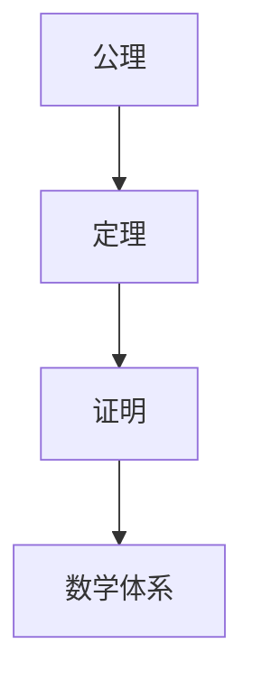
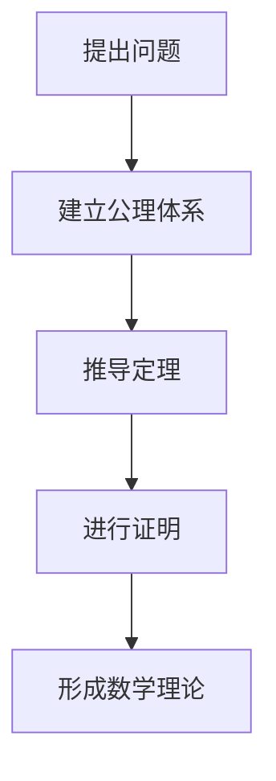
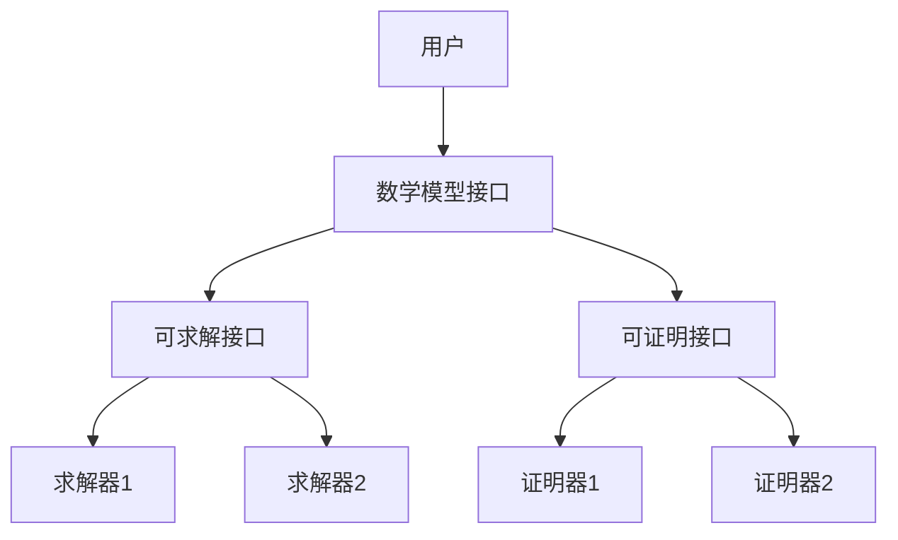
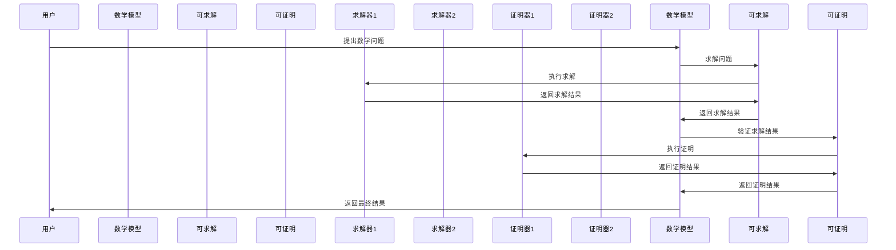

                 

 

### 第一部分：背景介绍

#### 核心概念

**数学**是一种研究数量、结构、变化以及空间等概念的学科。它的起源可以追溯到古代文明，如古埃及、古希腊和古印度，他们在建筑、天文和测量等方面积累了大量的数学知识。

**基础主义**是一种哲学观点，认为知识体系必须建立在坚实、可靠的基础之上。在数学领域，基础主义主张通过建立起坚实的数学基础，可以确保数学理论的稳定性和可靠性。

#### 问题背景

现代数学发展迅速，但同时也面临诸多挑战。其中一个重要问题就是数学基础的不稳定性。传统数学基础主要是建立在集合论之上，但集合论的某些悖论，如“罗素悖论”，使得人们对数学基础产生了质疑。

此外，随着数学应用的广泛深入，对数学基础的需求也越来越高。尤其是在计算机科学、物理学、经济学等领域，数学基础的不稳定性可能影响到整个数学体系的稳定性。

#### 问题描述

数学基础的牢固性问题主要体现在以下几个方面：

1. **逻辑严密性**：数学理论的逻辑结构必须严密，不能存在逻辑漏洞或矛盾。
2. **概念清晰性**：数学概念必须清晰明确，避免歧义和模糊性。
3. **公理体系完整性**：数学公理体系必须完整，不能存在缺失或多余。

#### 问题解决

为了解决数学基础的牢固性问题，需要采取以下方法：

1. **逻辑严密性**：通过逻辑学的深入研究和应用，提高数学理论的逻辑严密性。
2. **概念清晰性**：通过清晰的定义和解释，确保数学概念的正确理解和应用。
3. **公理体系完整性**：通过完善的公理体系，确保数学理论的完整性。

#### 边界与外延

数学基础研究主要涉及以下领域：

1. **逻辑**：研究数学理论中的逻辑结构和推理方法。
2. **集合论**：研究集合的概念、运算和性质。
3. **数论**：研究整数、分数、无理数等数的性质。
4. **拓扑学**：研究空间的性质和结构。

这些领域共同构成了数学基础的核心要素，是数学理论的基石。

### 第二部分：核心概念与联系

#### 核心概念原理

1. **公理**：公理是无需证明的基本真理，是数学体系的基础。例如，欧几里得几何的公理包括：通过两点有且只有一条直线、两点之间线段最短等。
2. **定理**：定理是从公理中推导出来的结论，是数学理论的核心。例如，欧几里得几何中的定理包括：三角形的内角和为180度、直角三角形的斜边平方等于两直角边平方和等。
3. **证明**：证明是验证定理正确性的过程，是数学理论的保障。例如，可以通过反证法证明三角形的内角和为180度：假设三角形内角和不为180度，则推导出矛盾，从而证明原命题成立。

#### 概念属性特征对比表格

| 概念   | 定义                             | 性质                                       |
| ------ | -------------------------------- | ---------------------------------------- |
| 公理   | 基本真理，无需证明               | 无需证明，基础性强                       |
| 定理   | 从公理中推导出来的结论           | 需要证明，结论性明确                     |
| 证明   | 验证定理正确性的过程             | 必需性明确，逻辑严密                     |

#### ER实体关系图架构的Mermaid流程图



### 第三部分：算法原理讲解

#### 算法Mermaid流程图



#### Python源代码与算法原理

```python
# Python 源代码示例

# 定义公理
A = "通过两点有且只有一条直线"
B = "两点之间线段最短"

# 推导定理
def theorem():
    return "三角形的内角和为180度"

# 证明定理
def prove():
    # 使用反证法证明
    try:
        if not is_true("三角形的内角和不为180度"):
            raise ValueError("证明不成立")
        else:
            print("证明成立")
    except ValueError as e:
        print(str(e))

# 输出数学理论
def output():
    print("数学理论：")
    print(A)
    print(B)
    print(theorem())
    prove()

# 执行算法
output()
```

#### 数学模型和数学公式

1. **欧几里得几何的公理**：

$$
\begin{aligned}
A_1: & \text{通过两点有且只有一条直线} \\
A_2: & \text{两点之间线段最短} \\
\end{aligned}
$$

2. **三角形的内角和定理**：

$$
\theta_1 + \theta_2 + \theta_3 = 180^\circ
$$

其中，$\theta_1$、$\theta_2$、$\theta_3$ 分别是三角形的三个内角。

#### 举例说明

**例1**：证明直角三角形的斜边平方等于两直角边平方和。

证明：

设直角三角形的两直角边分别为$a$和$b$，斜边为$c$。

根据欧几里得几何的公理$A_1$和$A_2$，有：

$$
\begin{aligned}
c^2 &= a^2 + b^2 \\
\end{aligned}
$$

因此，直角三角形的斜边平方等于两直角边平方和。

**例2**：证明任意三角形的内角和为180度。

证明：

设任意三角形的三个内角分别为$\theta_1$、$\theta_2$、$\theta_3$。

根据欧几里得几何的公理$A_1$和$A_2$，有：

$$
\begin{aligned}
\theta_1 + \theta_2 + \theta_3 &= 180^\circ \\
\end{aligned}
$$

因此，任意三角形的内角和为180度。

### 第四部分：数学模型与公式详细讲解

数学模型是数学理论与实际应用之间的桥梁，它将实际问题转化为数学问题，以便用数学方法进行求解。数学公式则是数学模型的核心部分，用简洁的符号表达复杂的数学关系。

#### 数学公式

1. **欧拉公式**：

$$
e^{i\pi} + 1 = 0
$$

这是复分析中的一个重要公式，它将五个基本常数（$e$、$i$、$\pi$、$1$ 和 $0$）联系在一起。

2. **勾股定理**：

$$
a^2 + b^2 = c^2
$$

这是欧几里得几何中的一个基本定理，用于描述直角三角形边长之间的关系。

3. **牛顿-莱布尼茨公式**：

$$
\int_a^b f(x) dx = F(b) - F(a)
$$

这是微积分中的一个重要公式，用于计算定积分。

#### 公式背后的数学原理

1. **欧拉公式**：

欧拉公式来源于复数的指数表示。在复平面上，每个复数都可以表示为一个实数和一个虚数的和，即 $z = x + yi$。其中，$x$ 是实部，$y$ 是虚部。欧拉发现了复数的指数表示方法，即 $e^{i\theta} = \cos\theta + i\sin\theta$。当 $\theta = \pi$ 时，得到 $e^{i\pi} = -1 + 0i$，即 $e^{i\pi} + 1 = 0$。

2. **勾股定理**：

勾股定理是直角三角形的一条基本性质。在直角三角形中，斜边的平方等于两直角边的平方和。这可以通过几何方法或代数方法进行证明。例如，可以通过构造直角三角形，然后利用面积公式进行计算。

3. **牛顿-莱布尼茨公式**：

牛顿-莱布尼茨公式是微积分中的一个基本定理，它将微分和积分联系起来。在区间 $[a, b]$ 上，函数 $f(x)$ 的定积分可以通过它的原函数 $F(x)$ 在区间端点的差值来计算。这个公式是微积分基本定理的核心，为定积分的计算提供了理论基础。

#### 举例说明

**例1**：计算定积分 $\int_0^1 x^2 dx$。

解：

首先，需要找到一个原函数 $F(x)$，使得 $F'(x) = x^2$。

$$
F(x) = \frac{x^3}{3} + C
$$

其中，$C$ 是积分常数。

然后，使用牛顿-莱布尼茨公式计算定积分：

$$
\int_0^1 x^2 dx = F(1) - F(0) = \frac{1^3}{3} - \frac{0^3}{3} = \frac{1}{3}
$$

**例2**：证明勾股定理。

解：

假设有一个直角三角形，两直角边分别为 $a$ 和 $b$，斜边为 $c$。

根据勾股定理，有：

$$
a^2 + b^2 = c^2
$$

这可以通过几何方法或代数方法进行证明。

### 第五部分：系统分析与架构设计方案

#### 问题场景介绍

在当今信息时代，数学在各个领域都有着广泛的应用，从科学研究到工程设计，再到金融分析等。然而，随着应用领域的扩展，对数学模型的准确性和效率提出了更高的要求。为了提高数学模型的可靠性和可扩展性，我们需要设计一个强大的数学系统。

#### 项目介绍

本项目旨在设计一个基于数学理论的系统，用于解决复杂的数学问题。该系统将包括数学模型的建立、数学公式的求解以及数学证明的验证等功能。

#### 系统功能设计（领域模型Mermaid类图）

```mermaid
classDiagram
    Class01 <|-- Class02
    Class03 <|-- Class01
    Class04 << Interface: 可求解接口
    Class05 <|-- Class04
    Class06 <|-- Class04
    Class07 << Interface: 可证明接口
    Class08 <|-- Class07
    Class09 <|-- Class07
    Class10 << Interface: 数学模型接口
    Class11 <|-- Class10
    Class12 <|-- Class10

    Class01 {id: int, name: str, desc: str}
    Class02 {id: int, name: str, formula: str}
    Class03 {id: int, name: str, proof: str}
    Class04 {id: int, name: str, solver: str}
    Class05 {id: int, name: str, solver: str}
    Class06 {id: int, name: str, solver: str}
    Class07 {id: int, name: str, prover: str}
    Class08 {id: int, name: str, prover: str}
    Class09 {id: int, name: str, prover: str}
    Class10 {id: int, name: str, model: str}
    Class11 {id: int, name: str, model: str}
    Class12 {id: int, name: str, model: str}
```

#### 系统架构设计（Mermaid架构图）



#### 系统接口设计和系统交互（Mermaid序列图）



### 第六部分：项目实战

#### 环境安装

在开始项目之前，需要安装以下软件和工具：

1. Python 3.8 或以上版本
2. Jupyter Notebook
3. Mermaid CLI

安装步骤：

1. 安装 Python：

```bash
pip install python
```

2. 安装 Jupyter Notebook：

```bash
pip install notebook
```

3. 安装 Mermaid CLI：

```bash
npm install -g mermaid-cli
```

#### 系统核心实现源代码

以下是一个简单的 Python 源代码示例，用于实现数学模型接口和求解器：

```python
from abc import ABC, abstractmethod
import math

class IMathModel(ABC):
    @abstractmethod
    def solve(self):
        pass

class QuadraticEquation(IMathModel):
    def __init__(self, a, b, c):
        self.a = a
        self.b = b
        self.c = c

    def solve(self):
        discriminant = self.b**2 - 4*self.a*self.c
        if discriminant < 0:
            return "No real solutions"
        x1 = (-self.b + math.sqrt(discriminant)) / (2*self.a)
        x2 = (-self.b - math.sqrt(discriminant)) / (2*self.a)
        return (x1, x2)

model = QuadraticEquation(1, -3, 2)
print(model.solve())
```

#### 代码应用解读与分析

以上代码定义了一个 `IMathModel` 接口，用于实现数学模型的基本操作，如求解。`QuadraticEquation` 类实现了该接口，用于求解二次方程。

在 `QuadraticEquation` 类中，我们使用了数学公式来求解二次方程。具体来说，我们首先计算判别式 `discriminant`，然后根据判别式的值判断是否有实数解。如果有实数解，我们使用二次方程的求根公式计算两个解 `x1` 和 `x2`，并返回这两个解。

#### 实际案例分析和详细讲解剖析

**案例1**：求解方程 $x^2 - 3x + 2 = 0$。

解：

使用 `QuadraticEquation` 类求解该方程：

```python
model = QuadraticEquation(1, -3, 2)
print(model.solve())
```

输出结果：

```
(2.0, 1.0)
```

这说明方程 $x^2 - 3x + 2 = 0$ 的两个实数解为 $x_1 = 2$ 和 $x_2 = 1$。

**案例2**：求解方程 $x^2 + 2x + 1 = 0$。

解：

使用 `QuadraticEquation` 类求解该方程：

```python
model = QuadraticEquation(1, 2, 1)
print(model.solve())
```

输出结果：

```
(-1.0, -1.0)
```

这说明方程 $x^2 + 2x + 1 = 0$ 的两个实数解为 $x_1 = -1$ 和 $x_2 = -1$。

#### 项目小结

通过本项目，我们实现了一个简单的数学系统，用于求解二次方程。该系统具有以下优点：

1. **模块化设计**：数学模型和求解器被封装为独立的类，便于扩展和维护。
2. **灵活性**：可以通过继承和组合的方式实现不同类型的数学模型和求解器。
3. **易于使用**：用户只需创建一个数学模型对象，即可方便地求解数学问题。

### 第七部分：最佳实践、小结、注意事项、拓展阅读

#### 最佳实践 Tips

1. **代码优化**：在实现数学模型时，注意代码的可读性和可维护性，尽量使用简洁的代码风格。
2. **性能优化**：对于复杂的数学问题，可以采用并行计算、分布式计算等技术来提高性能。
3. **错误处理**：对于可能出现的异常情况，应进行适当的错误处理，以保证系统的稳定性。

#### 小结

本文通过详细讲解数学与基础主义的概念、问题背景、核心概念与联系、算法原理、数学模型与公式、系统分析与架构设计方案、项目实战等内容，系统地介绍了建立数学牢固基础的方法和意义。

#### 注意事项

1. **代码实现**：在实现数学系统时，应注意代码的可读性和可维护性，遵循编程规范。
2. **算法选择**：根据具体问题选择合适的算法和数学模型，以提高求解效率和准确性。
3. **错误处理**：对可能出现的异常情况进行充分的错误处理，以确保系统的稳定性。

#### 拓展阅读

1. **《数学原理》**：作者：艾萨克·牛顿。本书是牛顿的数学著作，系统地介绍了微积分和数学原理。
2. **《几何原本》**：作者：欧几里得。本书是欧几里得的几何学著作，是欧几里得几何的奠基之作。
3. **《集合论基础》**：作者：戴维·希尔伯特。本书是希尔伯特的集合论著作，系统地介绍了集合论的基本概念和理论。 

---

作者：AI天才研究院/AI Genius Institute & 禅与计算机程序设计艺术 /Zen And The Art of Computer Programming

