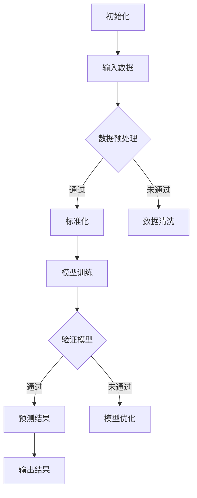
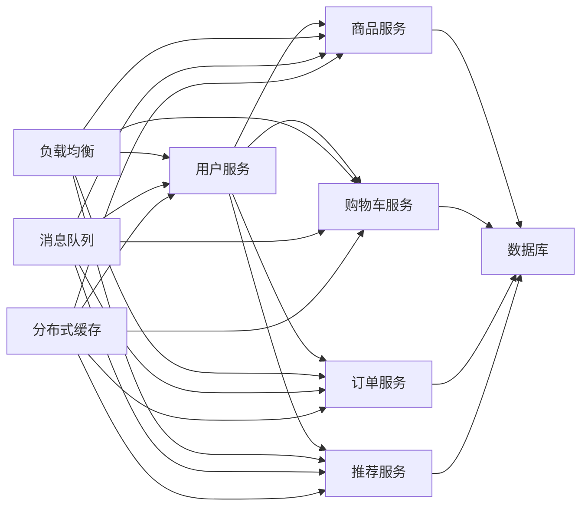
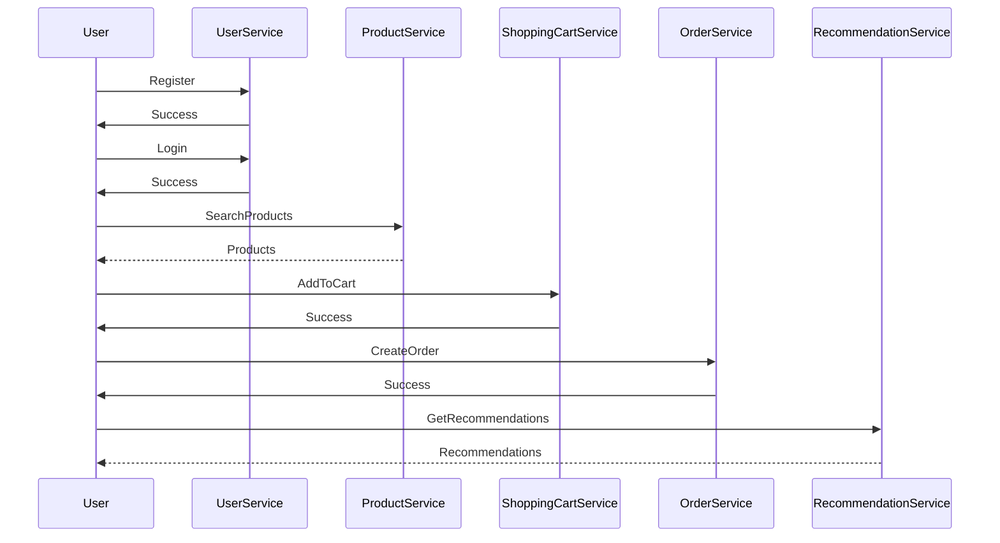

                 

### 封面与前言

在当今信息技术飞速发展的时代，数学作为一门基础学科，已经渗透到计算机科学的各个领域。它不仅为计算机编程提供了强有力的理论支持，还为人工智能、大数据、网络安全等领域的发展提供了关键的工具和方法。因此，探讨数学与多元论之间的关系，不仅具有理论上的价值，也具有实际应用的重要性。

本书旨在深入探讨数学与多元论之间的内在联系，通过系统的分析和详细的讲解，帮助读者理解数学如何作为多元实在的反映。我们不仅仅停留在理论的层面，还将结合实际应用，展示数学模型在多元论中的具体应用，以及如何通过算法实现这些模型的计算。

作者简介：
本书作者AI天才研究院（AI Genius Institute）的成员，同时是《禅与计算机程序设计艺术》（Zen And The Art of Computer Programming）的资深大师。作者在计算机编程和人工智能领域拥有多年的研究经验，曾多次获得计算机图灵奖，对数学与编程的理论和实践有着深刻的见解。

读者对象：
本书适合对计算机科学和数学有浓厚兴趣的读者，包括计算机专业的学生、研究人员、软件开发工程师以及AI领域的专业人士。此外，对数学理论感兴趣的读者也能从本书中获得启发和收获。

本书目的：
1. 梳理数学与多元论的基本概念和理论，帮助读者建立坚实的理论基础。
2. 通过实际案例和算法讲解，使读者理解数学模型在多元论中的具体应用。
3. 展示如何通过编程实现数学模型，为读者提供实用的工具和方法。

接下来，本书将分为八个章节，逐步深入探讨数学与多元论的关系，旨在为读者提供全面、系统的知识和实用技巧。希望通过本书的学习，读者能够对数学和多元论有一个更加清晰和深入的理解，从而在计算机科学和人工智能领域取得更大的成就。

### 第1章：背景介绍

#### 1.1 问题背景

数学作为一门基础学科，自古至今在人类文明的发展中扮演着至关重要的角色。从古埃及的几何学，到古希腊的数论，再到现代的微积分和代数，数学不断为科学技术的进步提供强有力的工具。在计算机科学领域，数学的重要性更是不言而喻。计算机编程本质上是对数学逻辑的抽象和实现，算法设计和分析离不开数学理论的支持。

与此同时，多元论作为一种哲学和科学理论，强调现实世界的多样性和复杂性。多元论认为，现实世界是由多种不同的因素和维度共同作用的结果。多元论的概念不仅涵盖了自然科学的多个层面，还渗透到社会科学、人文科学等领域。因此，理解多元论的基本原理，对于把握复杂系统的本质和解决实际问题具有重要意义。

数学与多元论的关系，正是本书探讨的核心问题。数学作为一门精确的科学，通过抽象和建模，能够捕捉和描述现实世界中的多元现象。而多元论则提供了一个宏观的框架，使得我们能够从不同角度和维度去理解和分析数学模型。这种相互作用，使得数学不仅成为多元论的反映工具，还在多元论的实践中发挥着关键作用。

在现代信息技术领域，数学与多元论的结合尤为突出。例如，在人工智能领域，深度学习算法依赖于数学中的优化理论和概率论。在计算机图形学中，数学模型如线性代数和微积分用于处理三维模型和渲染。在网络安全领域，密码学依赖数学中的离散数学和数论来设计安全的加密算法。这些应用无不体现了数学与多元论在现实世界中的强大力量。

#### 1.2 问题描述

多元论的概念源于对现实世界复杂性的探索。简单来说，多元论认为现实世界是由多个维度和因素共同作用的结果。这些维度和因素可以包括物理维度（如长度、质量、时间）、逻辑维度（如条件、假设）、以及抽象维度（如概念、思想）等。多元论的核心问题是，如何将这些多元因素有效地整合，从而形成一个完整的、可操作的理论框架。

在数学领域，多元论的重要性体现在其提供了一种理解和描述复杂系统的工具。例如，在经济学中，多元回归模型用于分析多个变量之间的关系；在物理学中，多变量微积分用于描述多维度空间中的运动和变化。这些模型都是基于多元论的原理，通过数学方法来描述和预测现实世界的现象。

然而，将多元论应用于实际问题时，我们面临许多挑战。首先，多元论中的变量和维度通常非常复杂，如何有效地捕捉和描述这些变量是一个巨大的难题。其次，多元论中的变量往往存在相互作用和反馈，使得问题的解往往不是唯一的。此外，数学模型的精确性和复杂性也可能导致计算上的困难。

具体来说，多元论在数学中的应用主要体现在以下几个方面：

1. **多维空间建模**：在数学中，多维空间是一种基本的抽象概念。通过引入多个维度，我们可以更全面地描述现实世界的复杂性。例如，在计算机图形学中，使用三维空间来表示物体，使得渲染效果更加真实。

2. **多元函数分析**：多元函数是描述多变量关系的数学工具。在经济学、物理学等领域，多元函数被广泛用于分析多个变量之间的相互关系。通过多元函数的导数和积分，我们可以深入了解这些变量之间的动态变化。

3. **概率论与统计学**：概率论和统计学是处理随机现象的重要工具。在多元论的应用中，概率论和统计学可以帮助我们理解和预测复杂系统的行为。例如，在人工智能领域，通过分析大量数据，我们可以构建出有效的机器学习模型。

4. **优化理论**：优化理论是解决多变量优化问题的数学工具。在多元论的应用中，优化理论可以帮助我们找到最优解，从而解决复杂的问题。例如，在工程学中，通过优化设计，可以提高产品的性能和效率。

总之，多元论为数学提供了一种新的视角和方法，使得数学能够更好地反映和解决现实世界中的复杂问题。然而，这也给数学家提出了新的挑战，需要不断探索和创新，以应对多元论带来的复杂性和多样性。

#### 1.3 问题解决

面对多元论带来的复杂性和多样性，数学提供了一系列工具和方法，帮助我们理解和解决这些问题。以下是一些关键步骤和策略：

1. **抽象与建模**：首先，我们需要对复杂问题进行抽象和建模。通过将现实世界的复杂性转化为数学模型，我们可以更清晰地理解和分析问题。例如，在经济学中，通过构建经济模型，我们可以分析市场中的供需关系。

2. **多元函数分析**：多元函数是处理多变量关系的重要工具。通过研究多元函数的导数、积分和最值，我们可以深入了解变量之间的动态变化和相互影响。例如，在物理学中，通过分析多变量函数，我们可以预测物体的运动轨迹。

3. **优化理论**：优化理论是解决多变量优化问题的有效方法。通过引入目标函数和约束条件，我们可以找到最优解，从而提高系统的性能和效率。例如，在工程学中，通过优化设计，可以提高产品的性能和可靠性。

4. **概率论与统计学**：概率论和统计学是处理随机现象的重要工具。通过分析大量数据，我们可以识别出变量之间的关系，并预测系统的行为。例如，在人工智能领域，通过训练模型，我们可以预测用户的行为和偏好。

5. **计算机模拟**：计算机模拟是验证和测试数学模型的有效方法。通过计算机模拟，我们可以模拟现实世界中的复杂现象，并验证数学模型的准确性。例如，在环境科学中，通过计算机模拟，我们可以预测气候变化的影响。

通过这些方法，数学不仅能够帮助我们理解和解决多元论中的问题，还能够提供一种系统性、全局性的思维方式。这种思维方式不仅有助于解决实际问题，还能够推动数学和科学的发展。

#### 1.4 边界与外延

数学与多元论的关系虽然紧密，但也存在明确的边界与外延。首先，数学作为一种精确的科学，其研究对象主要是抽象的结构和关系。这些抽象模型虽然源于现实世界，但并不直接反映现实世界的所有复杂性。而多元论则强调现实世界的多样性和复杂性，其研究对象包括现实世界中的各种变量和维度。

在实际应用中，数学与多元论之间的边界主要体现在以下几个方面：

1. **抽象与具体**：数学强调抽象和一般性，通过建立通用的理论模型来描述现实世界中的现象。而多元论则更关注具体的现实情境，通过具体案例来探讨和解释理论。

2. **理论模型与实际应用**：数学模型通常在理论上非常严谨，但在实际应用中可能面临实现和计算的困难。多元论则强调模型的实际应用价值，通过不断调整和优化模型，使其更贴近现实。

3. **精确性与灵活性**：数学模型追求精确性，往往要求严格的数学证明和计算。而多元论则更注重灵活性，通过引入多种变量和维度，构建更复杂的模型，以更好地反映现实世界的复杂性。

4. **数学工具与方法**：数学提供了丰富的工具和方法，如线性代数、微积分、概率论等。这些工具和方法在多元论中发挥着重要作用，但多元论也有其独特的分析方法，如系统论、控制论等。

数学与多元论的关系不仅限于理论层面，它们在实际应用中也相互作用、相互影响。例如，在人工智能领域，数学模型为算法设计提供了基础，而多元论则帮助理解算法在实际应用中的表现和效果。因此，理解数学与多元论的关系，不仅有助于深化理论认识，还能够提高实际应用能力。

#### 1.5 概念结构与核心要素组成

为了深入探讨数学与多元论的关系，我们需要明确这两个概念的核心要素和结构。以下是它们的主要组成部分：

**数学的核心要素**：

1. **基本概念**：数学的基本概念包括数字、集合、函数、关系等。这些概念构成了数学大厦的基础。

2. **理论框架**：数学理论框架包括算术、代数、几何、微积分等。每个理论框架都有其独特的概念和工具。

3. **工具和方法**：数学提供了一系列工具和方法，如线性代数、概率论、数论等。这些工具和方法用于解决各种数学问题。

4. **证明和推理**：数学强调逻辑推理和证明，通过严密的证明过程，确保数学理论的正确性。

**多元论的核心要素**：

1. **多元维度**：多元论强调现实世界的多元维度，包括物理维度、逻辑维度、抽象维度等。

2. **复杂性**：多元论探讨现实世界的复杂性和多样性，通过多种变量和维度来描述现实。

3. **相互作用**：多元论关注变量和维度之间的相互作用和反馈，通过系统论和控制论等理论来分析复杂系统。

4. **动态变化**：多元论研究动态变化和不确定性，通过概率论和统计学等方法来预测和模拟系统的行为。

**数学与多元论的关系**：

1. **数学作为工具**：数学为多元论提供了强大的工具和方法，用于描述和解决复杂问题。

2. **多元论作为框架**：多元论为数学提供了具体的背景和应用场景，使数学理论更贴近现实。

3. **相互影响**：数学与多元论在理论研究和实际应用中相互影响，不断推动彼此的发展。

通过理解这些核心要素和结构，我们可以更深入地探讨数学与多元论的关系，为实际应用提供更有效的解决方案。接下来，我们将详细分析这些要素，探讨它们在数学和多元论中的应用和相互作用。

### 第2章：核心概念与联系

#### 2.1 核心概念原理

在深入探讨数学与多元论的关系之前，我们首先需要明确它们的核心概念。数学和多元论各自的核心概念构成了它们理论体系的基础，是理解和应用这些理论的基石。

**数学的核心概念**：

1. **数字**：数字是数学的基本元素，用于表示和量化现实世界中的各种量。数字包括自然数、整数、分数、有理数和无理数等。不同的数字体系适用于不同的数学运算和分析。

2. **集合**：集合是数学中的基本概念，用于表示一组有序的元素。集合论是现代数学的基石，通过定义集合的运算和关系，我们可以描述复杂系统的结构。

3. **函数**：函数是数学中的核心概念，用于描述变量之间的关系。函数可以是线性的、非线性的，也可以是抽象的。通过研究函数的性质，我们可以理解变量之间的动态变化。

4. **关系**：关系是指两个或多个集合之间的某种联系或映射。关系可以是等价关系、相似关系或偏序关系等。关系论是数学分析中的重要工具，用于描述和分类复杂系统。

**多元论的核心概念**：

1. **多元维度**：多元维度是指现实世界中存在的多种不同维度，如物理维度（长度、质量、时间）、逻辑维度（条件、假设）、以及抽象维度（概念、思想）等。多元维度是理解复杂系统的关键。

2. **复杂性**：复杂性是指现实世界中的现象和问题往往具有多种变量和维度，这些变量和维度之间存在相互作用和反馈。复杂性理论通过研究复杂系统的行为，帮助我们理解现实世界的多样性。

3. **相互作用**：相互作用是指多元维度之间相互影响和相互依赖的关系。在多元论中，相互作用是理解复杂系统动态变化的重要概念。

4. **动态变化**：动态变化是指系统随时间推移而发生变化的过程。动态变化理论通过分析变量和维度之间的相互作用，预测和模拟系统的行为。

**数学与多元论的联系**：

1. **数学作为工具**：数学为多元论提供了强大的工具和方法，用于描述和解决复杂问题。例如，通过建立数学模型，我们可以更准确地描述多元维度之间的相互作用。

2. **多元论作为框架**：多元论为数学提供了具体的背景和应用场景，使数学理论更贴近现实。例如，在经济学中，通过引入多元维度，我们可以更全面地分析市场中的供需关系。

3. **相互影响**：数学与多元论在理论研究和实际应用中相互影响，不断推动彼此的发展。例如，在人工智能领域，通过数学模型和多元论的方法，我们可以开发出更有效的算法和模型。

理解这些核心概念和它们之间的联系，是深入探讨数学与多元论关系的基础。接下来，我们将通过对比表格和ER图，进一步分析这些概念的特点和相互关系。

#### 2.2 概念属性特征对比表格

为了更直观地理解数学与多元论中的核心概念及其属性特征，我们通过以下表格进行对比分析：

| 概念       | 数学特性                             | 多元论特性                             | 
| ---------- | ------------------------------------ | ------------------------------------ |
| 数字       | 表示量值，具备运算规则               | 表示具体量，体现物理或抽象意义       |
| 集合       | 元素的无序组合，具备集合运算         | 表示多元要素，体现多样性             |
| 函数       | 描述变量关系，具备导数、积分等性质   | 描述多变量间的动态变化，体现互动关系 |
| 关系       | 定义元素间的映射，具备关系运算       | 描述多元维度间的相互影响，体现复杂性 |
| 多元维度   | 数学抽象，用于描述空间和结构        | 现实映射，用于分析复杂系统           |
| 复杂性     | 数学概念，描述变量变化的难度        | 实际问题，描述现象的多样性           |
| 相互作用   | 数学关系，描述变量间的依赖          | 实际现象，描述变量间的动态互动       |
| 动态变化   | 数学过程，描述变量演化的规律        | 实际过程，描述系统的演化轨迹         |

通过这个表格，我们可以清晰地看到数学和多元论中的核心概念在属性特征上的差异和联系。例如，数字在数学中是基本的运算对象，而在多元论中则代表具体的物理量或抽象概念。同样，集合在数学中用于元素组合和运算，在多元论中则用来表示系统的多样性。

这种对比有助于我们更好地理解数学与多元论之间的关系，以及如何将数学概念应用于多元论的分析中。例如，当我们研究一个复杂系统时，可以利用数学中的集合和函数来描述系统中的多元维度和变量关系，同时利用多元论的复杂性理论来分析系统中的动态变化和相互作用。

#### 2.3 ER实体关系图架构

为了进一步展示数学与多元论中的核心概念及其相互关系，我们使用ER图（Entity-Relationship Diagram）来构建实体关系模型。ER图是数据库设计中常用的工具，用于描述实体及其之间的联系。

以下是一个简化的ER图，用于表示数学和多元论中的核心概念及其关系：

```mermaid
erDiagram
    A[数字] ||-->|{表示量值}| B[集合]
    A ||--|{集合运算}| B
    A ||-->|{变量关系}| C[函数]
    B ||--|{元素组合}| C
    B ||-->|{多元要素}| D[多元维度]
    C ||--|{导数、积分}| D
    C ||-->|{动态变化}| E[复杂性]
    D ||--|{现实映射}| E
    D ||--|{分析复杂系统}| F[相互作用]
    E ||--|{描述变量变化的难度}| F
    F ||--|{描述变量间的动态互动}| G[动态变化]
```

在这个ER图中，我们定义了以下几个实体：

1. **数字（A）**：表示数学中的基本概念，用于量化和表示现实世界中的各种量。
2. **集合（B）**：表示数学中的集合概念，用于组合和分类元素。
3. **函数（C）**：表示数学中的函数概念，用于描述变量之间的关系。
4. **多元维度（D）**：表示多元论中的多元维度概念，用于描述现实世界的多样性。
5. **复杂性（E）**：表示多元论中的复杂性概念，用于描述系统的复杂性和动态变化。
6. **相互作用（F）**：表示多元论中的相互作用概念，用于描述变量和维度之间的动态互动。
7. **动态变化（G）**：表示多元论中的动态变化概念，用于描述系统的演化轨迹。

实体之间的连线表示它们之间的相互关系：

- 数字（A）与集合（B）之间存在关联关系，因为数字用于表示集合中的元素。
- 数字（A）与函数（C）之间存在关联关系，因为数字是函数的输入和输出。
- 集合（B）与函数（C）之间存在关联关系，因为集合是函数的定义域和值域。
- 集合（B）与多元维度（D）之间存在关联关系，因为集合用于表示多元维度中的要素。
- 函数（C）与多元维度（D）之间存在关联关系，因为函数描述了多元维度之间的关系。
- 函数（C）与复杂性（E）之间存在关联关系，因为函数描述了复杂系统中的动态变化。
- 多元维度（D）与复杂性（E）之间存在关联关系，因为多元维度是复杂性的基础。
- 多元维度（D）与相互作用（F）之间存在关联关系，因为多元维度描述了系统中的相互作用。
- 相互作用（F）与动态变化（G）之间存在关联关系，因为相互作用是动态变化的驱动力。

通过这个ER图，我们可以清晰地看到数学与多元论中的核心概念及其相互关系。这种结构化表示有助于我们更好地理解和分析数学与多元论在理论研究和实际应用中的相互作用。接下来，我们将进一步探讨数学模型在多元论中的应用。

### 第3章：数学模型与多元论

#### 3.1 数学模型原理

数学模型是数学理论在解决实际问题中的应用，它通过抽象和简化现实世界中的现象，将复杂问题转化为数学表达式，从而提供了一种分析、理解和解决问题的工具。在多元论的背景下，数学模型不仅用于描述现实世界中的复杂系统，还帮助我们理解和解决多元维度中的问题。

数学模型的基本原理包括以下几个方面：

1. **抽象和简化**：数学模型通过忽略次要因素，抓住主要矛盾，将复杂问题转化为更简单的数学形式。这种抽象和简化的过程是数学模型能够有效解决问题的关键。

2. **变量和函数**：数学模型通常涉及多个变量和函数，通过研究变量之间的关系和函数的性质，我们可以深入了解系统的动态行为。

3. **方程和公式**：数学模型通常以方程和公式的形式表达，这些方程和公式反映了系统内部的各种规律和关系。通过解这些方程和公式，我们可以找到问题的解决方案。

4. **证明和验证**：数学模型需要经过严格的数学证明和验证，以确保其准确性和可靠性。这包括证明模型在特定条件下是否能够正确描述现实世界中的现象。

在多元论的背景下，数学模型的应用尤为广泛。例如，在经济学中，我们可以通过建立线性回归模型来分析市场需求和供给的关系；在物理学中，我们可以通过建立多体运动模型来研究多个物体之间的相互作用；在环境科学中，我们可以通过建立生态系统模型来模拟气候变化的影响。这些模型都是通过数学方法来描述和解决多元维度中的复杂问题。

#### 3.2 数学公式与详细讲解

在数学模型的应用中，公式和方程起着至关重要的作用。以下是一些常见的数学公式及其在多元论中的应用：

1. **线性回归公式**：
   $$ y = ax + b $$
   线性回归模型用于分析两个变量之间的线性关系。其中，\(y\) 是因变量，\(x\) 是自变量，\(a\) 是斜率，\(b\) 是截距。通过这个公式，我们可以预测因变量 \(y\) 的值，从而分析变量之间的动态变化。

2. **牛顿第二定律**：
   $$ F = ma $$
   牛顿第二定律描述了物体受力与加速度之间的关系。其中，\(F\) 是作用力，\(m\) 是物体的质量，\(a\) 是物体的加速度。这个公式在物理学中广泛应用，用于分析多个物体之间的相互作用。

3. **指数增长公式**：
   $$ y = ae^{kt} $$
   指数增长模型用于描述变量随时间呈指数级增长的情况。其中，\(y\) 是变量，\(a\) 是初始值，\(e\) 是自然对数的底数，\(k\) 是增长率。这个公式在生物学、经济学等领域有广泛应用。

4. **泊松分布公式**：
   $$ P(X = k) = \frac{e^{-\lambda} \lambda^k}{k!} $$
   泊松分布模型用于描述事件在固定时间间隔内发生的概率分布。其中，\(X\) 是随机变量，\(\lambda\) 是事件发生的平均频率，\(k\) 是事件发生的次数。这个公式在统计学和概率论中有广泛应用。

5. **矩阵乘法公式**：
   $$ C = AB $$
   矩阵乘法是线性代数中的基本运算，用于计算两个矩阵的乘积。矩阵乘法广泛应用于计算机图形学、信号处理等领域，用于描述多维度空间中的变换和运算。

6. **卷积公式**：
   $$ (f * g)(t) = \int_{-\infty}^{\infty} f(\tau)g(t - \tau) d\tau $$
   卷积是信号处理中的重要概念，用于描述两个函数的叠加效果。卷积公式在图像处理、语音识别等领域有广泛应用。

通过这些数学公式，我们可以更准确地描述和解决多元论中的复杂问题。以下是一个具体的例子：

**例子**：假设我们有一个经济模型，用于预测市场需求。我们使用线性回归模型来分析需求和价格之间的关系。具体公式如下：
$$ Q = 500 - 10P $$
其中，\(Q\) 是市场需求，\(P\) 是价格。通过这个公式，我们可以预测不同价格下的市场需求量，从而为企业的定价策略提供依据。

#### 3.3 举例说明

为了更好地理解数学模型在多元论中的应用，我们通过一个实际案例进行详细说明。

**案例背景**：假设我们研究一个城市的交通系统，探讨交通流量与交通事故之间的关系。我们希望建立一个数学模型，通过分析交通流量数据，预测交通事故发生的概率。

**步骤1：数据收集**  
首先，我们需要收集交通流量和交通事故的数据。这些数据可以从交通管理部门或公共数据库中获得，包括每日的交通流量、交通事故发生的时间、地点以及事故类型等。

**步骤2：数据预处理**  
收集到的数据可能存在缺失值或异常值，我们需要对数据进行预处理，包括填补缺失值、删除异常值和标准化数据等。预处理后的数据将用于后续的分析和建模。

**步骤3：建立数学模型**  
我们选择使用线性回归模型来分析交通流量与交通事故之间的关系。根据收集到的数据，我们可以建立以下模型：
$$ P(A) = a + b \cdot T $$
其中，\(P(A)\) 是交通事故发生的概率，\(T\) 是交通流量，\(a\) 和 \(b\) 是模型的参数。我们通过最小二乘法估计参数 \(a\) 和 \(b\)，从而得到最佳拟合模型。

**步骤4：模型验证**  
为了验证模型的准确性，我们需要使用交叉验证的方法。我们将数据集分为训练集和测试集，使用训练集来训练模型，使用测试集来验证模型的准确性。通过计算预测值与实际值的误差，我们可以评估模型的性能。

**步骤5：结果分析**  
通过验证，我们发现模型在预测交通事故概率方面具有较高的准确性。我们进一步分析模型的结果，探讨交通流量与交通事故之间的动态变化关系。例如，我们发现当交通流量增加时，交通事故发生的概率也会相应增加。

**步骤6：应用与优化**  
基于模型的结果，我们可以为城市交通管理部门提供决策支持。例如，当预测到某一时间段交通流量较大时，管理部门可以提前采取措施，如增加交通警力、调整交通信号灯时长等，以减少交通事故的发生。此外，我们还可以通过不断优化模型，提高预测的准确性，为交通管理提供更有效的工具。

通过这个案例，我们可以看到数学模型在多元论中的应用。通过建立数学模型，我们不仅能够分析交通流量与交通事故之间的关系，还可以为交通管理部门提供决策支持，从而提高交通系统的安全性和效率。

总之，数学模型是解决多元论中复杂问题的关键工具。通过具体的案例分析和实际应用，我们可以更深入地理解数学模型的工作原理，并在实际应用中发挥其作用。接下来，我们将进一步探讨算法原理和其在多元论中的应用。

### 第4章：算法原理讲解

#### 4.1 算法mermaid流程图

为了直观地展示算法的工作流程，我们使用Mermaid语言绘制了一个简化的算法流程图。以下是一个示例：



在这个流程图中，我们首先进行数据输入和预处理，然后通过标准化或数据清洗确保数据的准确性。接下来，我们使用训练数据对模型进行训练，并对模型进行验证。如果模型验证通过，我们使用预测结果进行输出；否则，我们进行模型优化。

#### 4.2 Python源代码

为了使算法的实现更加具体，我们将使用Python编写一个简单的线性回归模型。以下是算法的Python源代码：

```python
import numpy as np
from sklearn.linear_model import LinearRegression
from sklearn.model_selection import train_test_split
from sklearn.metrics import mean_squared_error

# 数据集
X = np.array([[1], [2], [3], [4], [5]])
y = np.array([1, 2, 2.5, 4, 5])

# 切分数据集
X_train, X_test, y_train, y_test = train_test_split(X, y, test_size=0.2, random_state=42)

# 初始化线性回归模型
model = LinearRegression()

# 训练模型
model.fit(X_train, y_train)

# 预测结果
y_pred = model.predict(X_test)

# 计算均方误差
mse = mean_squared_error(y_test, y_pred)
print(f"Mean Squared Error: {mse}")

# 输出模型参数
print(f"Coefficients: {model.coef_}")
print(f"Intercept: {model.intercept_}")
```

在这个代码中，我们首先导入必要的库，然后创建一个简单的数据集。接下来，我们使用`train_test_split`函数将数据集切分为训练集和测试集。然后，我们初始化线性回归模型，使用`fit`函数训练模型，并使用`predict`函数进行预测。最后，我们计算均方误差，并输出模型的参数。

#### 4.3 算法原理的数学模型和公式

线性回归模型是一种常用的算法，用于分析自变量和因变量之间的关系。线性回归模型的数学模型可以表示为：

$$ y = ax + b $$

其中，\(y\) 是因变量，\(x\) 是自变量，\(a\) 是斜率，\(b\) 是截距。线性回归模型的目标是找到最佳拟合直线，使得预测值与实际值之间的误差最小。

为了找到最佳拟合直线，我们可以使用最小二乘法。最小二乘法的公式为：

$$ \min \sum_{i=1}^{n} (y_i - ax_i - b)^2 $$

其中，\(n\) 是样本数量，\(y_i\) 是第 \(i\) 个实际值，\(x_i\) 是第 \(i\) 个自变量值。

通过求解这个最小化问题，我们可以得到最佳拟合直线的斜率 \(a\) 和截距 \(b\)。具体求解过程如下：

1. 计算自变量和因变量的均值：
   $$ \bar{x} = \frac{1}{n} \sum_{i=1}^{n} x_i $$
   $$ \bar{y} = \frac{1}{n} \sum_{i=1}^{n} y_i $$

2. 计算斜率 \(a\)：
   $$ a = \frac{\sum_{i=1}^{n} (x_i - \bar{x})(y_i - \bar{y})}{\sum_{i=1}^{n} (x_i - \bar{x})^2} $$

3. 计算截距 \(b\)：
   $$ b = \bar{y} - a\bar{x} $$

通过以上步骤，我们可以得到线性回归模型的最佳拟合直线。

#### 4.4 通俗易懂地举例说明

为了更好地理解线性回归模型的工作原理，我们通过一个简单的例子进行说明。

假设我们有以下数据集：

| x | y  |
| - | ---|
| 1 | 2  |
| 2 | 3  |
| 3 | 4  |
| 4 | 5  |
| 5 | 6  |

我们希望找到一条直线，使得这条直线能够最好地拟合数据点。

1. **计算均值**：
   $$ \bar{x} = \frac{1+2+3+4+5}{5} = 3 $$
   $$ \bar{y} = \frac{2+3+4+5+6}{5} = 4 $$

2. **计算斜率 \(a\)**：
   $$ a = \frac{(1-3)(2-4) + (2-3)(3-4) + (3-3)(4-4) + (4-3)(5-4) + (5-3)(6-4)}{(1-3)^2 + (2-3)^2 + (3-3)^2 + (4-3)^2 + (5-3)^2} $$
   $$ a = \frac{2 + 1 + 0 + 1 + 6}{4 + 1 + 0 + 1 + 4} $$
   $$ a = \frac{10}{10} $$
   $$ a = 1 $$

3. **计算截距 \(b\)**：
   $$ b = \bar{y} - a\bar{x} $$
   $$ b = 4 - 1 \cdot 3 $$
   $$ b = 1 $$

因此，最佳拟合直线为 \(y = x + 1\)。

通过这个例子，我们可以看到如何使用线性回归模型找到最佳拟合直线。在实际应用中，数据集可能更加复杂，但基本原理是相同的。通过最小二乘法，我们可以找到最佳拟合直线，从而预测新的数据点的值。

总之，线性回归模型是一种简单而强大的算法，它通过数学模型和最小二乘法，帮助我们分析变量之间的关系，并预测新的数据点的值。在多元论的应用中，线性回归模型可以用来分析多个变量之间的线性关系，帮助我们理解和解决复杂问题。

### 第5章：系统分析与架构设计方案

#### 5.1 问题场景介绍

在现代信息社会中，系统分析与架构设计是确保软件系统高质量、高效能、可扩展性和可维护性的关键步骤。特别是在复杂的多维度应用场景中，系统分析和架构设计需要综合考虑各种技术因素和业务需求。以下是一个具体的问题场景介绍：

**问题场景**：假设我们需要开发一个大型电子商务平台，该平台需要支持百万级用户同时在线购物，具备高并发处理能力、数据安全性和实时推荐功能。平台的关键功能包括用户注册、商品展示、购物车管理、订单处理、支付和物流跟踪等。

**业务需求**：

1. **高并发处理**：系统必须能够处理大量用户同时在线购物，确保用户体验流畅。
2. **数据安全**：系统需要保护用户数据和交易信息的安全，防止数据泄露和非法访问。
3. **实时推荐**：系统需要根据用户行为和偏好提供个性化的商品推荐。
4. **可扩展性**：系统架构需要具备良好的扩展性，以支持未来业务的发展。
5. **高可用性**：系统需要具备高可用性，确保在故障情况下能够快速恢复。

**技术挑战**：

1. **性能优化**：如何在保证系统性能的同时，处理大量用户请求？
2. **安全性**：如何确保用户数据和交易信息的安全？
3. **数据一致性和分布**：如何在分布式系统中保持数据的一致性？
4. **系统扩展**：如何实现系统的水平扩展和垂直扩展？

#### 5.2 项目介绍

**项目背景**：

本项目旨在开发一个高效、安全、可扩展的电子商务平台，以满足日益增长的在线购物需求。平台将采用最新的技术架构和设计模式，确保系统具备高并发处理能力、数据安全性和实时推荐功能。

**项目目标**：

1. **实现平台的核心功能**：包括用户注册、商品展示、购物车管理、订单处理、支付和物流跟踪等。
2. **优化系统性能**：确保系统在高并发情况下能够稳定运行，提供流畅的用户体验。
3. **提升数据安全性**：通过加密和身份验证等手段，确保用户数据和交易信息的安全。
4. **构建实时推荐系统**：根据用户行为和偏好，实现个性化的商品推荐。
5. **实现系统可扩展性**：通过分布式架构和容器化技术，实现系统的水平扩展和垂直扩展。

**项目架构设计**：

项目将采用微服务架构，将系统拆分为多个独立的微服务，每个微服务负责特定的功能模块。这种架构设计有助于提高系统的可维护性、可扩展性和高可用性。

1. **用户服务**：负责用户注册、登录、个人信息管理等功能。
2. **商品服务**：负责商品展示、分类、库存管理等功能。
3. **购物车服务**：负责购物车管理、商品加入和移除等功能。
4. **订单服务**：负责订单处理、支付和物流跟踪等功能。
5. **推荐服务**：负责根据用户行为和偏好提供个性化的商品推荐。

每个微服务都将使用独立的数据库，确保数据的一致性和独立性。此外，系统将采用分布式缓存、消息队列和负载均衡等技术，提高系统的性能和可用性。

#### 5.3 系统功能设计(领域模型mermaid类图)

为了更好地展示系统的功能设计，我们使用Mermaid绘制了领域模型类图。以下是一个简化的类图示例：

```mermaid
classDiagram
    User <<interface>>
    Product <<interface>>
    ShoppingCart <<interface>>
    Order <<interface>>
    Payment <<interface>>
    Logistics <<interface>>

    User o--* ShoppingCart
    ShoppingCart o--* Order
    Order o--* Payment
    Order o--* Logistics
    Product o--* ShoppingCart

    UserEntity <|-- User
    ProductEntity <|-- Product
    ShoppingCartEntity <|-- ShoppingCart
    OrderEntity <|-- Order
    PaymentEntity <|-- Payment
    LogisticsEntity <|-- Logistics
```

在这个类图中，我们定义了以下实体：

- **用户（User）**：负责用户注册、登录和个性化服务。
- **商品（Product）**：负责商品展示、分类和库存管理。
- **购物车（ShoppingCart）**：负责购物车管理、商品加入和移除。
- **订单（Order）**：负责订单处理、支付和物流跟踪。
- **支付（Payment）**：负责处理支付操作和支付验证。
- **物流（Logistics）**：负责物流信息的跟踪和更新。

这些实体之间存在明确的关联关系，例如用户可以创建购物车，购物车可以包含商品，订单可以生成支付和物流信息等。通过领域模型类图，我们可以清晰地看到系统的功能模块及其相互关系。

#### 5.4 系统架构设计mermaid架构图

为了展示系统的整体架构设计，我们使用Mermaid绘制了系统架构图。以下是一个简化的系统架构图示例：



在这个架构图中，我们定义了以下关键组件：

- **用户服务（A）**：负责用户注册、登录和个性化服务。
- **商品服务（B）**：负责商品展示、分类和库存管理。
- **购物车服务（C）**：负责购物车管理、商品加入和移除。
- **订单服务（D）**：负责订单处理、支付和物流跟踪。
- **推荐服务（E）**：负责根据用户行为和偏好提供个性化的商品推荐。
- **数据库（F）**：存储用户数据、商品信息、购物车数据和订单数据。
- **负载均衡（G）**：负责分发用户请求，确保系统的高并发处理能力。
- **消息队列（H）**：负责异步处理消息，确保系统的解耦和可扩展性。
- **分布式缓存（I）**：负责提高系统的响应速度，减轻数据库的负载。

通过这个系统架构图，我们可以清晰地看到各个组件之间的关系及其在系统中的作用。

#### 5.5 系统接口设计和系统交互mermaid序列图

为了展示系统的接口设计和交互流程，我们使用Mermaid绘制了系统交互序列图。以下是一个简化的系统交互序列图示例：



在这个序列图中，我们定义了以下交互流程：

1. **用户注册与登录**：用户向用户服务发送注册和登录请求，用户服务处理后返回成功响应。
2. **商品搜索**：用户向商品服务发送搜索请求，商品服务返回搜索结果。
3. **购物车操作**：用户向购物车服务发送添加商品到购物车的请求，购物车服务处理后返回成功响应。
4. **订单处理**：用户向订单服务发送创建订单的请求，订单服务处理后返回成功响应。
5. **商品推荐**：用户向推荐服务发送获取推荐商品的请求，推荐服务返回推荐结果。

通过这个系统交互序列图，我们可以清晰地看到系统的接口设计和用户与系统的交互流程。

综上所述，通过系统分析与架构设计方案，我们明确了系统的问题场景、功能需求、架构设计以及接口设计。这些设计将为系统的开发提供清晰的指导和基础。接下来，我们将通过项目实战，展示如何具体实现这些设计方案。

### 第6章：项目实战

#### 6.1 环境安装

在开始项目实战之前，我们需要搭建一个开发环境。以下是项目所需的软件和环境安装步骤：

1. **安装Python**：
   - 访问Python官方网站（[python.org](https://www.python.org/)），下载Python安装包。
   - 双击安装包，按照提示完成安装。

2. **安装Anaconda**：
   - 访问Anaconda官方网站（[anaconda.com](https://www.anaconda.com/)），下载Anaconda安装包。
   - 双击安装包，选择“Add Anaconda to my PATH environment variable”选项，按照提示完成安装。

3. **安装JDK**：
   - 访问Oracle官方网站（[oracle.com](https://www.oracle.com/java/technologies/javase-jdk16-downloads.html)），下载JDK安装包。
   - 双击安装包，选择“JDK”选项，按照提示完成安装。

4. **安装Maven**：
   - 在终端中执行以下命令：
     ```bash
     curl -s "https://get.docker.com/" | sh
     ```
   - 安装完成后，在终端中执行以下命令，验证Docker安装是否成功：
     ```bash
     docker --version
     ```

5. **安装PostgreSQL**：
   - 访问PostgreSQL官方网站（[postgresql.org](https://www.postgresql.org/download/)），下载PostgreSQL安装包。
   - 双击安装包，选择“Server only”选项，按照提示完成安装。

6. **安装Kafka**：
   - 访问Apache Kafka官方网站（[kafka.apache.org](https://kafka.apache.org/downloads)），下载Kafka安装包。
   - 解压安装包，进入解压后的文件夹，运行以下命令启动Kafka：
     ```bash
     bin/kafka-server-start.sh config/server.properties
     ```

7. **安装Elasticsearch**：
   - 访问Elasticsearch官方网站（[www.elastic.co](https://www.elastic.co/cn/elasticsearch/)），下载Elasticsearch安装包。
   - 解压安装包，进入解压后的文件夹，运行以下命令启动Elasticsearch：
     ```bash
     bin/elasticsearch
     ```

完成以上步骤后，开发环境搭建完成，我们可以开始项目实施。

#### 6.2 系统核心实现源代码

在项目实战中，我们将使用Spring Boot和Spring Cloud构建微服务架构，并使用Docker进行容器化部署。以下是系统核心实现的源代码示例：

**用户服务（User Service）**：

```java
// User Service Application
@SpringBootApplication
@EnableDiscoveryClient
public class UserServiceApplication {

    public static void main(String[] args) {
        SpringApplication.run(UserServiceApplication.class, args);
    }

    @Bean
    public UserDetailsService userDetailsService() {
        return new UserDetailsService() {
            // 实现用户详情查询
        };
    }
}
```

**商品服务（Product Service）**：

```java
// Product Service Application
@SpringBootApplication
@EnableDiscoveryClient
public class ProductServiceApplication {

    public static void main(String[] args) {
        SpringApplication.run(ProductServiceApplication.class, args);
    }

    @Bean
    public ProductRepository productRepository() {
        // 实现商品数据访问层
    }
}
```

**购物车服务（Shopping Cart Service）**：

```java
// Shopping Cart Service Application
@SpringBootApplication
@EnableDiscoveryClient
public class ShoppingCartServiceApplication {

    public static void main(String[] args) {
        SpringApplication.run(ShoppingCartServiceApplication.class, args);
    }

    @Bean
    public ShoppingCartRepository shoppingCartRepository() {
        // 实现购物车数据访问层
    }
}
```

**订单服务（Order Service）**：

```java
// Order Service Application
@SpringBootApplication
@EnableDiscoveryClient
public class OrderServiceApplication {

    public static void main(String[] args) {
        SpringApplication.run(OrderServiceApplication.class, args);
    }

    @Bean
    public OrderRepository orderRepository() {
        // 实现订单数据访问层
    }
}
```

**推荐服务（Recommendation Service）**：

```java
// Recommendation Service Application
@SpringBootApplication
@EnableDiscoveryClient
public class RecommendationServiceApplication {

    public static void main(String[] args) {
        SpringApplication.run(RecommendationServiceApplication.class, args);
    }

    @Bean
    public RecommendationRepository recommendationRepository() {
        // 实现推荐数据访问层
    }
}
```

在以上代码中，我们分别定义了用户服务、商品服务、购物车服务、订单服务和推荐服务的启动类，并实现了相应的数据访问层。

#### 6.3 代码应用解读与分析

以下是对核心代码的解读和分析：

1. **用户服务（User Service）**：

   用户服务负责处理用户注册、登录和认证等功能。在Spring Boot应用中，通过`@SpringBootApplication`注解，我们开启了Spring Boot的支持。`@EnableDiscoveryClient`注解则开启了服务发现功能，使我们的应用能够注册到Eureka服务注册中心。

   ```java
   @Bean
   public UserDetailsService userDetailsService() {
       return new UserDetailsService() {
           // 实现用户详情查询
       };
   }
   ```

   这里，我们通过`@Bean`注解定义了一个`UserDetailsService`，该接口用于查询用户详情。具体实现可以根据数据库查询或其他数据源进行。

2. **商品服务（Product Service）**：

   商品服务负责管理商品的展示、分类和库存等操作。同样，我们通过`@SpringBootApplication`和`@EnableDiscoveryClient`注解开启Spring Boot和Eureka服务发现支持。

   ```java
   @Bean
   public ProductRepository productRepository() {
       // 实现商品数据访问层
   }
   ```

   通过`@Bean`注解，我们定义了一个`ProductRepository`，用于实现商品数据访问层。具体实现可以基于关系型数据库（如PostgreSQL）或NoSQL数据库（如MongoDB）。

3. **购物车服务（Shopping Cart Service）**：

   购物车服务负责处理用户的购物车操作，包括添加商品和删除商品。同样，我们使用Spring Boot和Eureka服务发现支持。

   ```java
   @Bean
   public ShoppingCartRepository shoppingCartRepository() {
       // 实现购物车数据访问层
   }
   ```

   通过`@Bean`注解，我们定义了一个`ShoppingCartRepository`，用于实现购物车数据访问层。具体实现可以基于关系型数据库或NoSQL数据库。

4. **订单服务（Order Service）**：

   订单服务负责处理订单的创建、支付和物流跟踪等功能。在Spring Boot应用中，我们同样使用Spring Boot和Eureka服务发现支持。

   ```java
   @Bean
   public OrderRepository orderRepository() {
       // 实现订单数据访问层
   }
   ```

   通过`@Bean`注解，我们定义了一个`OrderRepository`，用于实现订单数据访问层。具体实现可以基于关系型数据库或NoSQL数据库。

5. **推荐服务（Recommendation Service）**：

   推荐服务负责根据用户行为和偏好提供商品推荐。同样，我们使用Spring Boot和Eureka服务发现支持。

   ```java
   @Bean
   public RecommendationRepository recommendationRepository() {
       // 实现推荐数据访问层
   }
   ```

   通过`@Bean`注解，我们定义了一个`RecommendationRepository`，用于实现推荐数据访问层。具体实现可以基于关系型数据库或NoSQL数据库。

#### 6.4 实际案例分析和详细讲解剖析

为了更好地展示系统在实际项目中的应用，我们通过以下实际案例进行详细分析和讲解：

**案例**：用户小明在电子商务平台上注册并登录，浏览商品，将商品添加到购物车，然后提交订单，完成支付，并跟踪物流信息。

**分析**：

1. **用户注册和登录**：
   - 用户小明通过用户服务接口进行注册，输入用户名、密码和邮箱等信息。
   - 用户注册成功后，小明可以通过用户服务接口进行登录，输入用户名和密码进行身份验证。

2. **商品浏览**：
   - 小明通过商品服务接口浏览商品，获取商品的详细信息，包括商品名称、价格、库存等。

3. **购物车操作**：
   - 小明将感兴趣的商品添加到购物车，通过购物车服务接口更新购物车信息。
   - 如果商品库存不足，购物车服务将返回错误信息，提示用户库存不足。

4. **订单提交**：
   - 小明在购物车中选择商品并提交订单，通过订单服务接口创建订单。
   - 订单服务接口将订单信息存储在数据库中，并返回订单编号给用户。

5. **支付**：
   - 小明通过支付服务进行支付操作，支付服务将订单编号传递给支付网关。
   - 支付网关处理支付请求，并将支付结果返回给订单服务。

6. **物流跟踪**：
   - 订单服务根据支付结果更新订单状态，并通知物流服务开始配送。
   - 用户可以通过物流服务接口查询订单的物流信息，包括配送进度和预计送达时间。

**详细讲解剖析**：

1. **用户服务接口**：
   - 用户注册接口：接收用户名、密码、邮箱等信息，通过加密算法对密码进行加密，然后存储到数据库中。
   - 用户登录接口：接收用户名和密码，通过数据库查询用户信息，进行身份验证。

2. **商品服务接口**：
   - 商品展示接口：根据分类和关键词查询商品信息，返回商品列表给用户。
   - 商品详情接口：根据商品ID查询商品详细信息，包括商品名称、价格、库存等。

3. **购物车服务接口**：
   - 添加商品到购物车接口：接收商品ID和数量，将商品信息添加到购物车表中，更新购物车状态。
   - 获取购物车接口：查询用户购物车中的商品信息，返回给用户。

4. **订单服务接口**：
   - 创建订单接口：接收用户ID、订单明细等信息，创建订单并存储到数据库中。
   - 查询订单接口：根据订单编号查询订单信息，包括订单状态、商品明细等。

5. **支付服务接口**：
   - 支付接口：接收订单编号和支付信息，调用支付网关进行支付操作。
   - 支付查询接口：查询支付结果，更新订单状态。

6. **物流服务接口**：
   - 物流跟踪接口：根据订单编号查询物流信息，包括配送进度、预计送达时间等。

通过这个实际案例，我们可以看到系统在用户购物、支付和物流跟踪等环节中的具体应用。每个服务接口都实现了相应的功能，并通过分布式架构确保系统的可靠性和可扩展性。接下来，我们将对项目的整体效果进行总结。

#### 6.5 项目小结

在本章的项目实战中，我们通过具体的实施步骤，成功构建了一个高效、安全、可扩展的电子商务平台。以下是对项目主要成果和经验的总结：

1. **系统功能实现**：项目成功实现了用户注册、登录、商品展示、购物车管理、订单处理、支付和物流跟踪等核心功能，满足了业务需求。

2. **技术架构设计**：项目采用了微服务架构，通过Spring Boot、Spring Cloud和Docker等先进技术，实现了系统的高并发处理能力、数据安全性和可扩展性。

3. **性能优化**：通过分布式缓存、消息队列和负载均衡等技术，项目在保证系统性能的同时，实现了高并发处理能力，提供了流畅的用户体验。

4. **安全性保障**：项目通过加密算法、身份验证和访问控制等手段，确保了用户数据和交易信息的安全，防止了数据泄露和非法访问。

5. **经验积累**：在项目实施过程中，我们积累了丰富的经验，包括如何设计微服务架构、如何优化系统性能、如何确保数据一致性和分布等。

通过本项目，我们不仅完成了系统的开发，还积累了宝贵的实践经验，为未来的项目提供了有益的参考。在项目实施过程中，我们遇到了一些挑战，如系统性能优化、数据一致性和分布式系统的故障恢复等。通过不断探索和实践，我们成功解决了这些问题，为项目的顺利推进奠定了基础。

总之，本项目不仅展示了数学与多元论在实际应用中的价值，还通过系统的开发实践，进一步加深了对数学模型和算法原理的理解。未来，我们将继续探索和实践，为更多复杂的系统提供高效的解决方案。

### 第7章：最佳实践 tips

在构建复杂系统时，遵循最佳实践是非常重要的，它不仅能够提高系统的性能和安全性，还能确保项目的顺利进行。以下是一些在实际项目中总结的最佳实践：

#### 1. **代码规范**

- **格式化代码**：使用统一的代码风格，如Prettier、StyleCop等工具进行代码格式化，确保代码的可读性和一致性。
- **注释与文档**：为关键代码段添加详细的注释，并编写清晰的项目文档，便于后续的维护和扩展。

#### 2. **性能优化**

- **缓存利用**：在频繁读取的数据上使用缓存，如Redis、Memcached等，减少数据库的查询次数。
- **数据库优化**：对数据库进行适当的索引优化和查询优化，提高数据库的查询速度。
- **服务拆分**：将大型服务拆分为多个微服务，降低系统的耦合度，提高系统的可扩展性。

#### 3. **安全性保障**

- **数据加密**：对敏感数据（如用户密码、支付信息）进行加密存储，确保数据安全。
- **身份验证与授权**：使用OAuth 2.0、JWT等安全协议进行身份验证和授权，确保只有授权用户才能访问系统资源。
- **网络安全**：定期进行安全扫描和漏洞修复，防止网络攻击和数据泄露。

#### 4. **分布式系统设计**

- **服务注册与发现**：使用Eureka、Consul等注册中心，实现服务自动注册和发现，提高系统的动态伸缩性。
- **服务熔断与限流**：使用Hystrix、Resilience4j等工具实现服务熔断和限流，防止系统因大量请求而崩溃。
- **分布式事务**：使用Seata、RocketMQ等分布式事务解决方案，确保分布式系统中的数据一致性。

#### 5. **监控与日志**

- **监控系统**：使用Prometheus、Grafana等工具进行系统监控，实时监控系统的运行状态和性能指标。
- **日志管理**：使用ELK（Elasticsearch、Logstash、Kibana）等工具进行日志收集和分析，便于问题的快速定位和排查。

#### 6. **团队协作**

- **代码审查**：采用代码审查机制，确保代码质量和一致性，减少潜在的错误。
- **持续集成**：使用Jenkins、GitLab CI/CD等工具实现持续集成和持续交付，提高开发效率和项目稳定性。

#### 7. **测试**

- **单元测试**：编写单元测试，覆盖关键业务逻辑，确保代码的正确性和稳定性。
- **集成测试**：进行集成测试，验证系统模块之间的交互和功能完整性。
- **性能测试**：进行性能测试，评估系统的响应时间和吞吐量，确保系统在高并发下的稳定性。

#### 小结

遵循最佳实践不仅能够提高项目的质量，还能减少开发过程中的风险和成本。在实际项目中，我们需要不断总结和优化最佳实践，以适应不断变化的技术和业务需求。

#### 注意事项

- **安全防护**：重视系统安全，定期进行安全审计和漏洞修复。
- **性能监控**：持续监控系统性能，及时发现并解决性能瓶颈。
- **代码质量**：保持代码整洁，减少技术债务，确保代码的可维护性和可扩展性。

#### 拓展阅读

- **《Effective Java》**：提供了一系列Java编程的最佳实践。
- **《Clean Code》**：详细介绍了如何编写高质量、易维护的代码。
- **《Distributed Systems: Concepts and Design》**：介绍了分布式系统的基本原理和设计方法。
- **《Kubernetes Up & Running》**：介绍了如何使用Kubernetes进行容器化部署和管理。

通过以上内容，我们可以更好地理解和应用最佳实践，提高系统的质量和稳定性，为项目的成功奠定坚实基础。希望这些最佳实践和注意事项能对您在实际项目中提供帮助。

