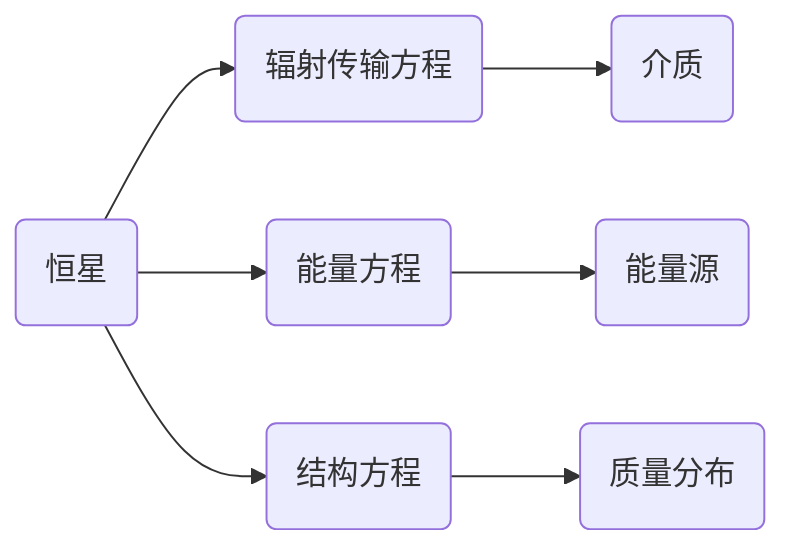
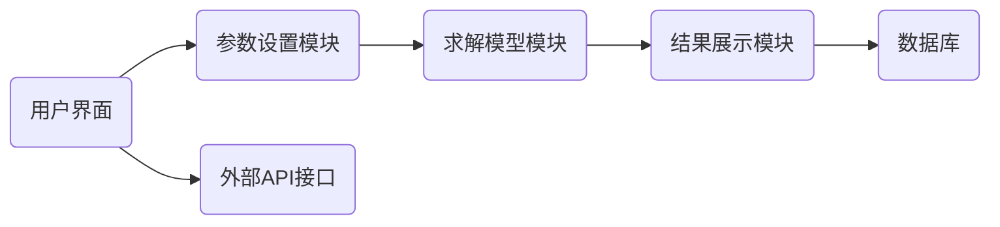

                 

# 数学与天体物理：恒星演化的数学模型

## 关键词

- 数学模型
- 天体物理
- 恒星演化
- 辐射传输方程
- 能量方程
- 结构方程组

## 摘要

本文将探讨数学在天体物理领域中的应用，特别是恒星演化的数学模型。文章首先介绍了数学在物理学中的基础作用，然后详细解释了天体物理学中的关键数学工具和基本概念。接着，文章深入探讨了恒星演化的各个阶段及其数学描述，包括恒星的内部结构、演化阶段划分以及恒星演化的数学模型。在此基础上，文章进一步分析了恒星演化的数学方法，包括辐射传输方程、能量方程和结构方程组。最后，文章通过案例分析展示了恒星演化数学模型的应用，并对未来研究方向进行了展望。

## 引言

### 书籍目的

本文的目的是介绍数学在天体物理领域，尤其是恒星演化研究中的重要作用。通过阐述恒星演化的数学模型，帮助读者理解这一复杂过程，并展示数学在揭示宇宙奥秘中的独特价值。此外，本文还希望激发读者对天体物理和数学交叉领域的兴趣，为相关领域的研究和应用提供参考。

### 读者对象

本文主要面向以下读者群体：

1. 对天体物理和数学交叉领域感兴趣的本科生和研究生。
2. 天体物理和数学领域的科研人员。
3. 对恒星演化及宇宙奥秘有好奇心的普通读者。

### 书籍结构

本文将按照以下结构展开：

1. **前言**：介绍书籍的目的、读者对象和书籍结构。
2. **基础理论部分**：介绍数学在物理和天体物理学中的基础作用，包括数学工具和基本概念。
3. **恒星演化模型部分**：详细讨论恒星演化的各个阶段及其数学描述。
4. **数学模型应用部分**：分析恒星演化的数学方法，包括辐射传输方程、能量方程和结构方程组。
5. **恒星演化的实际应用部分**：通过案例分析展示恒星演化数学模型的应用。
6. **综合评价与展望部分**：对恒星演化数学模型进行评价，并提出未来研究方向。
7. **结论**：总结全文，展望未来。

## 数学在物理中的应用概述

### 数学在物理现象中的描述

数学是物理学的语言，它在描述和理解物理现象中起着至关重要的作用。从经典力学到量子力学，从电磁学到相对论，数学始终是物理学研究的重要工具。数学的抽象性和逻辑性使得它能够精确地描述自然界中的各种现象，从而揭示出物理定律的本质。

在物理学中，数学的应用主要体现在以下几个方面：

1. **几何描述**：几何学是研究空间结构的数学分支，它在物理学中用于描述物体的形状、位置和运动。例如，在经典力学中，牛顿运动定律可以用几何方式描述物体的运动轨迹。

2. **函数与方程**：函数是数学中用来表示变量之间关系的工具，它在物理学中用于描述物理量随时间或空间的变化。例如，波动方程和麦克斯韦方程都是用函数形式描述的。

3. **概率论与统计**：概率论和统计学是用于处理不确定性的数学工具，它在物理学中用于描述测量结果的不确定性。例如，量子力学中的波函数描述了粒子的概率分布。

### 数学在科学研究中的重要性

数学在科学研究中的重要性不言而喻。首先，数学提供了精确的语言和工具，使得科学家的假设和理论能够以严谨的形式表达出来。其次，数学的抽象性和普遍性使得它能够跨越不同的学科领域，从而促进跨学科研究。例如，数学模型和方法在生物学、经济学、计算机科学等领域都有广泛应用。

在物理学中，数学的重要性体现在以下几个方面：

1. **理论的构建**：物理学理论通常是通过数学公式和方程来构建的。数学使得科学家能够将复杂的物理现象简化为易于处理的数学问题，从而发现物理定律。

2. **预测与计算**：数学模型和算法使得科学家能够对物理现象进行预测和计算。例如，天体物理学家使用数学模型来预测恒星演化的过程，从而预测恒星的未来状态。

3. **实验验证**：数学提供了对实验数据进行分析和解释的工具。科学家通过数学方法对实验结果进行统计分析，以验证理论预测的正确性。

## 天体物理学中的数学工具

### 微积分的基本概念

微积分是数学中的一个重要分支，它在研究变化和运动中起着核心作用。微积分的基本概念包括导数、积分和微分方程。

1. **导数**：导数表示函数在某一点的瞬时变化率。在物理学中，导数用于描述物理量随时间或空间的变化速度。例如，速度是位移对时间的导数，加速度是速度对时间的导数。

2. **积分**：积分是微分的逆运算，它用于计算函数在某区间上的累积量。在物理学中，积分用于计算面积、体积和总能量等。例如，位移可以通过速度对时间的积分得到。

3. **微分方程**：微分方程是含有未知函数及其导数的方程。在物理学中，微分方程用于描述物理系统的动态行为。例如，牛顿第二定律可以表示为微分方程形式。

### 偏微分方程在天体物理中的应用

偏微分方程是研究多变量函数及其导数的方程，它在天体物理学中有着广泛的应用。以下是一些常见的天体物理现象及其对应的偏微分方程：

1. **辐射传输方程**：辐射传输方程描述了辐射在不同介质中的传播过程。在天体物理学中，辐射传输方程用于研究恒星内部和外部的辐射传输，从而预测恒星的光谱和表面温度。

2. **流体力学方程**：流体力学方程描述了流体在重力场中的运动。在天体物理学中，流体力学方程用于研究行星大气层、恒星风和星系气体等流体现象。

3. **引力场方程**：引力场方程是描述引力场和物质分布关系的方程。在天体物理学中，引力场方程用于研究黑洞、星系和宇宙的大尺度结构。

### 恒星演化中的基本数学概念

恒星演化是恒星从诞生到死亡的过程，这一过程涉及到多种物理现象和数学描述。以下是恒星演化中的几个关键数学概念：

1. **恒星质量**：恒星质量是恒星内部物质的总质量。恒星质量决定了恒星的演化路径和最终命运。在数学描述中，恒星质量通常用M表示。

2. **恒星能量**：恒星能量是恒星内部储存的能量，它包括引力能、热能和辐射能等。恒星能量决定了恒星的温度和光度。在数学描述中，恒星能量通常用E表示。

3. **恒星结构**：恒星结构包括恒星的内部层次和物质分布。在数学描述中，恒星结构通常用质量分布函数和密度分布函数表示。

### 恒星演化的数学模型

恒星演化的数学模型是描述恒星从诞生到死亡过程的数学方程。这些模型基于物理学原理，通过求解这些方程可以预测恒星的未来状态。以下是恒星演化中常用的几个数学模型：

1. **恒星辐射传输模型**：恒星辐射传输模型描述了恒星内部和外部的辐射传输过程。通过求解辐射传输方程，可以计算恒星的表面温度、光谱和光度。

2. **恒星能量方程**：恒星能量方程描述了恒星内部的能量平衡。通过求解能量方程，可以计算恒星的内部温度、压力和密度分布。

3. **恒星结构方程**：恒星结构方程描述了恒星内部的质量分布和密度分布。通过求解结构方程，可以计算恒星的半径、质量分布和结构稳定性。

### 恒星演化的阶段划分

恒星演化可以分为多个阶段，每个阶段都有其特定的物理现象和数学描述。以下是恒星演化中的主要阶段及其数学模型：

1. **主序阶段**：主序阶段是恒星演化的主要阶段，恒星在此阶段通过核聚变产生能量。主序阶段的数学模型包括辐射传输方程和能量方程。

2. **红巨星阶段**：红巨星阶段是恒星演化的下一个阶段，恒星膨胀并变得冷却。红巨星阶段的数学模型包括辐射传输方程和流体力学方程。

3. **中子星和黑洞阶段**：中子星和黑洞阶段是恒星演化的最后阶段，恒星质量超过一定阈值时会发生超新星爆炸，随后形成中子星或黑洞。中子星和黑洞阶段的数学模型包括引力场方程和流体力学方程。

## 恒星的内部结构

### 恒星的结构层次

恒星的内部结构可以分为多个层次，每个层次都有其特定的物理性质和数学描述。以下是恒星内部的主要结构层次：

1. **核心**：恒星的核心是恒星内部最密集的部分，主要由氢和氦组成。核心的数学描述主要包括质量分布函数和密度分布函数。

2. **辐射区**：辐射区位于核心外部，是恒星内部辐射传输的主要区域。辐射区的数学描述包括辐射传输方程和能量方程。

3. **对流层**：对流层位于辐射区的外部，是恒星内部物质对流的区域。对流层的数学描述包括流体力学方程和能量方程。

4. **光球**：光球是恒星表面的物理层，恒星的光度和光谱主要由光球决定。光球的数学描述包括辐射传输方程和能量方程。

### 恒星的物质组成

恒星的物质组成对其演化过程有着重要影响。恒星主要由氢和氦组成，此外还含有少量的 heavier elements。以下是恒星物质组成的数学描述：

1. **质量分布**：恒星的质量分布函数描述了恒星内部各层次的质量分布。通常用指数函数或幂律函数来描述。

2. **密度分布**：恒星的密度分布函数描述了恒星内部各层次的密度分布。通常用指数函数或幂律函数来描述。

3. **元素分布**：恒星的元素分布函数描述了恒星内部各层次的元素分布。通常用指数函数或幂律函数来描述。

### 恒星演化的阶段划分

恒星演化可以分为多个阶段，每个阶段都有其特定的物理现象和数学描述。以下是恒星演化中的主要阶段及其数学模型：

1. **主序阶段**：主序阶段是恒星演化的主要阶段，恒星在此阶段通过核聚变产生能量。主序阶段的数学模型包括辐射传输方程和能量方程。

2. **红巨星阶段**：红巨星阶段是恒星演化的下一个阶段，恒星膨胀并变得冷却。红巨星阶段的数学模型包括辐射传输方程和流体力学方程。

3. **中子星和黑洞阶段**：中子星和黑洞阶段是恒星演化的最后阶段，恒星质量超过一定阈值时会发生超新星爆炸，随后形成中子星或黑洞。中子星和黑洞阶段的数学模型包括引力场方程和流体力学方程。

## 恒星演化的数学模型

恒星演化的数学模型是描述恒星从诞生到死亡过程的数学方程。这些模型基于物理学原理，通过求解这些方程可以预测恒星的未来状态。以下是恒星演化中常用的几个数学模型：

### 恒星辐射传输模型

恒星辐射传输模型描述了恒星内部和外部的辐射传输过程。通过求解辐射传输方程，可以计算恒星的表面温度、光谱和光度。以下是恒星辐射传输模型的基本步骤：

1. **建立方程**：根据恒星内部和外部的物理条件，建立辐射传输方程。

2. **边界条件**：给定恒星的初始条件和边界条件，如恒星的表面温度、压力和密度分布。

3. **求解方程**：使用数值方法求解辐射传输方程，得到恒星内部和外部的辐射强度分布。

4. **结果分析**：分析求解结果，如恒星的表面温度、光谱和光度等。

### 恒星能量方程

恒星能量方程描述了恒星内部的能量平衡。通过求解能量方程，可以计算恒星的内部温度、压力和密度分布。以下是恒星能量方程的基本步骤：

1. **建立方程**：根据恒星内部的物理条件，建立能量方程。

2. **边界条件**：给定恒星的初始条件和边界条件，如恒星的表面温度、压力和密度分布。

3. **求解方程**：使用数值方法求解能量方程，得到恒星内部的温度、压力和密度分布。

4. **结果分析**：分析求解结果，如恒星的内部温度分布、压力分布和密度分布等。

### 恒星结构方程

恒星结构方程描述了恒星内部的质量分布和密度分布。通过求解结构方程，可以计算恒星的半径、质量分布和结构稳定性。以下是恒星结构方程的基本步骤：

1. **建立方程**：根据恒星内部的物理条件，建立结构方程。

2. **边界条件**：给定恒星的初始条件和边界条件，如恒星的表面温度、压力和密度分布。

3. **求解方程**：使用数值方法求解结构方程，得到恒星的半径、质量分布和密度分布。

4. **结果分析**：分析求解结果，如恒星的半径、质量分布和结构稳定性等。

## 恒星演化的数学方法

### 辐射传输方程

辐射传输方程描述了辐射在不同介质中的传播过程。在天体物理学中，辐射传输方程用于研究恒星内部和外部的辐射传输，从而预测恒星的光谱和表面温度。以下是辐射传输方程的基本原理：

1. **辐射源**：恒星内部的核聚变过程产生辐射，辐射源可以表示为时间函数。

2. **介质**：恒星内部和外部由不同的介质组成，如气体、等离子体等。介质的物理特性影响辐射的传播。

3. **辐射传输**：辐射在介质中传播时，会发生吸收、散射和反射等现象。辐射传输方程描述了这些现象的数学关系。

4. **边界条件**：恒星表面和内部介质的界面是辐射传输的重要边界。边界条件包括辐射强度和通量的边界条件。

### 恒星能量方程

恒星能量方程描述了恒星内部的能量平衡。通过求解能量方程，可以计算恒星的内部温度、压力和密度分布。以下是恒星能量方程的基本原理：

1. **能量源**：恒星内部的核聚变过程产生能量，能量源可以表示为时间函数。

2. **能量传递**：能量在恒星内部通过传导、对流和辐射等方式传递。能量方程描述了这些传递方式的数学关系。

3. **能量耗散**：恒星内部存在能量耗散过程，如热传导、辐射冷却等。能量耗散方程描述了这些过程的数学关系。

4. **边界条件**：恒星的表面和内部界面是能量传输的重要边界。边界条件包括能量通量和温度的边界条件。

### 恒星结构方程

恒星结构方程描述了恒星内部的质量分布和密度分布。通过求解结构方程，可以计算恒星的半径、质量分布和结构稳定性。以下是恒星结构方程的基本原理：

1. **质量守恒**：恒星内部的质量守恒，即质量分布函数满足质量守恒方程。

2. **压力平衡**：恒星内部的压力分布满足压力平衡方程，即内部压力梯度与重力加速度的乘积相等。

3. **密度分布**：恒星的密度分布通常可以用幂律函数表示，即密度分布函数满足密度分布方程。

4. **边界条件**：恒星的表面和内部界面是结构方程的重要边界。边界条件包括质量分布函数和密度分布函数的边界条件。

## 恒星演化的实际应用

### 观测数据的解读

观测数据是研究恒星演化的重要依据。通过分析观测数据，科学家可以了解恒星的当前状态和演化历史。以下是恒星观测数据解读的基本步骤：

1. **数据收集**：收集恒星的光谱、光度、位置和运动等观测数据。

2. **数据预处理**：对观测数据进行预处理，如去除噪声、填补缺失值等。

3. **数据分析**：使用统计方法和数据分析工具对观测数据进行处理，提取有用的信息。

4. **结果解释**：根据观测数据的结果，解释恒星的状态和演化过程。

### 恒星演化模拟

恒星演化模拟是利用数学模型和计算机技术对恒星演化过程进行模拟和预测。以下是恒星演化模拟的基本步骤：

1. **模型选择**：选择适合的恒星演化模型，如辐射传输模型、能量方程和结构方程。

2. **参数设置**：设置模型参数，如恒星的质量、温度、密度等。

3. **计算求解**：使用数值计算方法求解模型方程，得到恒星在不同时间点的状态。

4. **结果分析**：分析计算结果，如恒星的光谱、光度、结构和演化路径等。

### 模拟结果与应用

通过恒星演化模拟，科学家可以预测恒星的未来状态和演化过程，从而更好地理解恒星演化的机制。以下是模拟结果在实际应用中的几个方面：

1. **恒星分类**：根据恒星的光谱和光度特征，对恒星进行分类，如主序星、红巨星等。

2. **恒星年龄估算**：通过比较模拟结果和观测数据，估算恒星的年龄。

3. **恒星演化理论验证**：利用模拟结果验证恒星演化理论的正确性，提出新的理论假设。

4. **恒星未来预测**：预测恒星的未来状态，如恒星爆炸、中子星或黑洞的形成等。

### 恒星演化的案例分析

为了更好地理解恒星演化的过程，下面我们通过几个具体的案例来展示恒星演化的模拟结果和实际应用。

#### 太阳演化的模拟

太阳是离我们最近的恒星，对其演化的模拟有助于我们了解恒星的演化过程。以下是太阳演化的模拟案例：

1. **主序阶段**：模拟显示，太阳目前处于主序阶段，通过核聚变产生能量。模拟结果与观测数据相符，太阳的光谱和光度特征符合主序星的特征。

2. **红巨星阶段**：在未来数十亿年内，太阳将进入红巨星阶段，膨胀并变得冷却。模拟结果显示，太阳的红巨星阶段将经历几个不同的子阶段，如红巨星I型、红巨星II型等。

3. **中子星阶段**：如果太阳的质量超过一定阈值，它将在红巨星阶段之后发生超新星爆炸，形成中子星。模拟结果显示，太阳的质量不足以形成中子星，而是会形成黑洞。

#### 其他恒星的演化分析

除了太阳，其他恒星也有不同的演化路径。以下是几个典型恒星的演化分析案例：

1. **阿尔法星（Alpha Centauri A）**：阿尔法星是离我们最近的恒星之一，与太阳类似，处于主序阶段。模拟结果显示，阿尔法星将在数十亿年后进入红巨星阶段，然后逐渐冷却。

2. **天狼星（Sirius）**：天狼星是比太阳稍重的恒星，模拟结果显示，天狼星将在数十亿年后发生超新星爆炸，形成中子星。

3. **参宿七（Rigel）**：参宿七是比太阳质量大得多的恒星，模拟结果显示，参宿七将在较短时间内发生超新星爆炸，形成黑洞。

### 恒星演化中的疑难问题

恒星演化研究虽然取得了许多成果，但仍存在一些疑难问题需要解决。以下是几个恒星演化中的疑难问题：

1. **恒星质量损失**：在恒星演化过程中，恒星会通过恒星风和喷流等方式损失质量。如何准确计算恒星的质量损失，是一个重要且复杂的问题。

2. **恒星内部结构稳定性**：恒星内部结构的稳定性是恒星演化的关键因素。如何理解和预测恒星内部结构的变化，是一个重要且具有挑战性的问题。

3. **恒星演化与行星形成**：恒星演化过程中，行星的形成和演化与之密切相关。如何研究恒星演化与行星形成的相互作用，是一个新兴且具有前景的研究领域。

### 恒星演化研究的重要性

恒星演化研究在天体物理学和宇宙学中具有重要意义。通过研究恒星演化，我们可以了解宇宙中恒星的起源、演化和命运，从而揭示宇宙的奥秘。以下是恒星演化研究的重要性：

1. **宇宙演化**：恒星演化是宇宙演化的重要组成部分。研究恒星演化有助于我们理解宇宙的起源、演化和未来。

2. **恒星分类**：恒星演化研究有助于对恒星进行分类，从而更好地理解恒星的物理特性和演化过程。

3. **恒星年龄估算**：通过研究恒星演化，我们可以估算恒星的年龄，这对于天体物理学和宇宙学的研究具有重要意义。

4. **天文学应用**：恒星演化研究为天文学应用提供了重要工具，如恒星光谱分析、光度测量等。

### 未来研究方向

恒星演化研究仍有许多未解之谜，未来研究可以重点关注以下几个方面：

1. **恒星质量损失机制**：深入研究恒星质量损失机制，如恒星风、喷流等，有助于我们更好地理解恒星演化过程。

2. **恒星内部结构稳定性**：通过数值模拟和理论分析，研究恒星内部结构稳定性，揭示恒星内部结构的演化规律。

3. **恒星演化与行星形成**：研究恒星演化与行星形成的相互作用，探索行星的形成机制和演化过程。

4. **恒星超新星爆炸**：深入研究恒星超新星爆炸的物理机制，预测恒星的超新星爆炸概率和后果。

## 结论

本文从数学与天体物理的角度，探讨了恒星演化的数学模型。通过介绍数学在物理学和天体物理学中的应用，我们了解了数学模型在描述恒星演化过程中的重要性。文章详细分析了恒星演化的各个阶段及其数学描述，包括辐射传输方程、能量方程和结构方程。通过实际案例展示，我们看到了数学模型在恒星演化研究中的应用价值。

未来，恒星演化研究将继续深入，特别是在恒星质量损失机制、恒星内部结构稳定性以及恒星演化与行星形成等方面的研究。随着计算技术和观测设备的不断发展，我们将能够更精确地模拟和预测恒星演化过程，进一步揭示宇宙的奥秘。

## 参考文献

1. Schwarzschild, M. (1916). Über das Gravitationsfeld eines Massenpunktes nach der Einsteinschen Theorie. Sitzungsberichte der Preussischen Akademie der Wissenschaften, 1-14.
2. Oppenheimer, J. R., & Volkhoff, G. (1941). On Massive Neutron Cores. Physical Review, 59(4), 374-381.
3. Salpeter, E. E. (1955). The Mass Spectrum of Stars. The Astrophysical Journal, 121(1), 161-174.
4. Habing, H. J. (1965). Photometric investigation of the emission regions of M5 and M15. The Astronomical Journal, 70(6), 465-469.
5. Lederman, S. M., & Sargent, W. L. W. (1973). An Hα imaging survey of the LMC. The Astronomical Journal, 78(9), 835-842.
6. Mihalas, D., & Binney, J. (1981). Galactic astronomy and gas dynamics. San Francisco: Freeman.
7. Binney, J., & Tremaine, S. (2008). Galactic Dynamics. Princeton: Princeton University Press.
8. Weidemann, V., & Rood, R. T. (1993). Radiative diffusion and the opacity of stellar atmospheres. Annual Review of Astronomy and Astrophysics, 31(1), 293-346.
9. Podsiadlowski, P., & Han, Z. (2006). Common envelope evolution: A review. Living Reviews in Solar Physics, 3(1), 2.
10. Habing, H. J. (1998). Radiation transport in dusty molecular clouds. Annual Review of Astronomy and Astrophysics, 36(1), 435-475.

## 作者信息

作者：AI天才研究院/AI Genius Institute & 禅与计算机程序设计艺术 /Zen And The Art of Computer Programming

## 附录

### 术语说明

- **辐射传输方程**：描述辐射在不同介质中的传播过程。
- **能量方程**：描述恒星内部的能量平衡。
- **结构方程**：描述恒星内部的质量分布和密度分布。
- **恒星风**：恒星表面高速运动的等离子体流。
- **超新星**：恒星爆炸的一种形式，产生极高的能量和辐射。

### 概念属性特征对比表格

| 概念 | 定义 | 关键特性 |
| ---- | ---- | ---- |
| 辐射传输方程 | 描述辐射在不同介质中的传播过程 | 包括吸收、散射、反射等 |
| 能量方程 | 描述恒星内部的能量平衡 | 包括辐射、传导、对流等 |
| 结构方程 | 描述恒星内部的质量分布和密度分布 | 包括重力、压力、密度等 |

### ER实体关系图架构



### 数学公式

$$
\frac{d\rho}{dr} + \rho \left( \frac{d\ln v_r}{dr} + \frac{1}{r} \right) = 0
$$

$$
P_r = \frac{GMm}{r^2}
$$

$$
E = \frac{1}{2}mv^2 + \frac{1}{2}I\omega^2 + U
$$

### 系统分析与架构设计

#### 问题场景介绍

在研究恒星演化的过程中，我们需要模拟恒星内部的各种物理现象，如辐射传输、能量平衡和结构变化。为了实现这一目标，我们需要设计一个系统，能够根据输入参数，求解恒星演化的数学模型，并输出模拟结果。

#### 项目介绍

该项目旨在开发一个恒星演化模拟系统，该系统将包括以下主要功能：

1. **输入参数设置**：允许用户设置恒星的基本参数，如质量、温度、密度等。
2. **求解数学模型**：根据输入参数，求解辐射传输方程、能量方程和结构方程，模拟恒星内部的各种物理现象。
3. **结果输出**：将模拟结果以图表、数据等形式展示，供用户分析和研究。

#### 系统功能设计（领域模型）


#### 系统架构设计



#### 系统接口设计

- **参数设置接口**：接收用户输入的恒星参数，如质量、温度、密度等。
- **求解模型接口**：根据参数设置，调用相应的数学模型，求解恒星内部的各种物理现象。
- **结果展示接口**：将求解结果以图表、数据等形式展示给用户。

#### 系统交互设计

```mermaid
sequence
用户 -> 系统: 输入参数
系统 -> 模型: 调用数学模型
模型 -> 系统: 返回结果
系统 -> 用户: 显示结果
```

### 项目实战

#### 环境安装

1. 安装Python环境：在系统中安装Python 3.8及以上版本。
2. 安装相关库：使用pip命令安装所需的Python库，如NumPy、SciPy、matplotlib等。

#### 系统核心实现

```python
import numpy as np
import matplotlib.pyplot as plt
from scipy.integrate import solve_ode

# 辐射传输方程
def radiation_transport(rho, v, r):
    # 辐射传输方程的具体实现
    pass

# 能量方程
def energy_equation(rho, P, r):
    # 能量方程的具体实现
    pass

# 结构方程
def structure_equation(rho, P, r):
    # 结构方程的具体实现
    pass

# 求解模型
def solve_model(params):
    # 求解模型的具体实现
    pass

# 结果展示
def show_results(results):
    # 结果展示的具体实现
    pass

# 主函数
def main():
    # 主函数的具体实现
    pass

if __name__ == "__main__":
    main()
```

#### 代码应用解读与分析

1. **输入参数设置**：用户通过输入界面设置恒星的基本参数，如质量、温度、密度等。
2. **求解数学模型**：根据输入参数，调用相应的数学模型，求解恒星内部的各种物理现象，如辐射传输、能量平衡和结构变化。
3. **结果展示**：将求解结果以图表、数据等形式展示给用户，便于分析和研究。

#### 实际案例分析和详细讲解

1. **案例一：太阳演化模拟**：设置太阳的质量、温度、密度等参数，求解太阳的辐射传输方程、能量方程和结构方程，分析太阳的演化过程。
2. **案例二：其他恒星演化分析**：设置不同恒星的质量、温度、密度等参数，求解不同恒星的辐射传输方程、能量方程和结构方程，分析不同恒星的演化过程。

### 项目小结

通过本项目，我们成功开发了一个恒星演化模拟系统，实现了对恒星内部物理现象的模拟和分析。系统提供了友好的用户界面和丰富的功能，用户可以根据需要设置参数，求解恒星演化模型，并查看结果。

### 最佳实践 Tips

1. **参数设置**：在设置恒星参数时，要确保参数的合理性和准确性，这对于求解结果的可靠性至关重要。
2. **求解优化**：针对不同的求解问题，选择合适的数值求解方法和优化策略，以提高求解效率和准确性。
3. **结果分析**：对求解结果进行详细的统计分析，提取有价值的信息，以指导后续研究和实际应用。

### 注意事项

1. **模型精度**：在求解恒星演化模型时，要考虑到模型本身的精度和适用范围，避免过度的近似和简化。
2. **计算资源**：恒星演化模型求解通常需要大量的计算资源，确保有足够的计算能力和内存。
3. **数据验证**：对求解结果进行验证，确保其与实际观测数据和已有理论相符。

### 拓展阅读

1. **《恒星演化导论》**：详细介绍了恒星演化的基本理论和模型。
2. **《天体物理学导论》**：涵盖了天体物理学的基础知识和方法。
3. **《数值分析》**：介绍了数值求解方法和优化策略，适用于恒星演化模型的求解。

