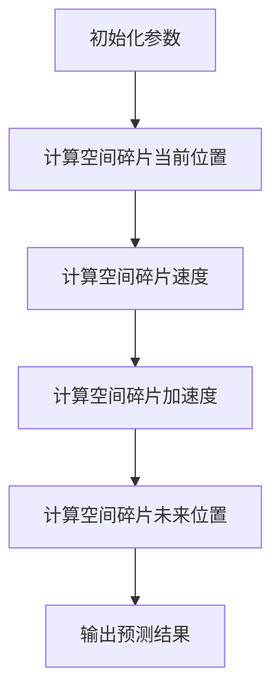
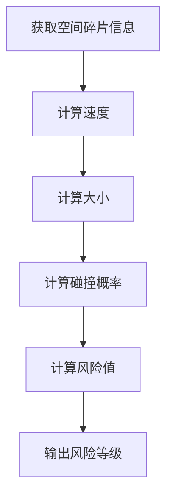
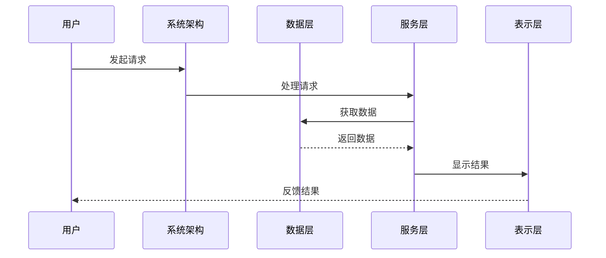
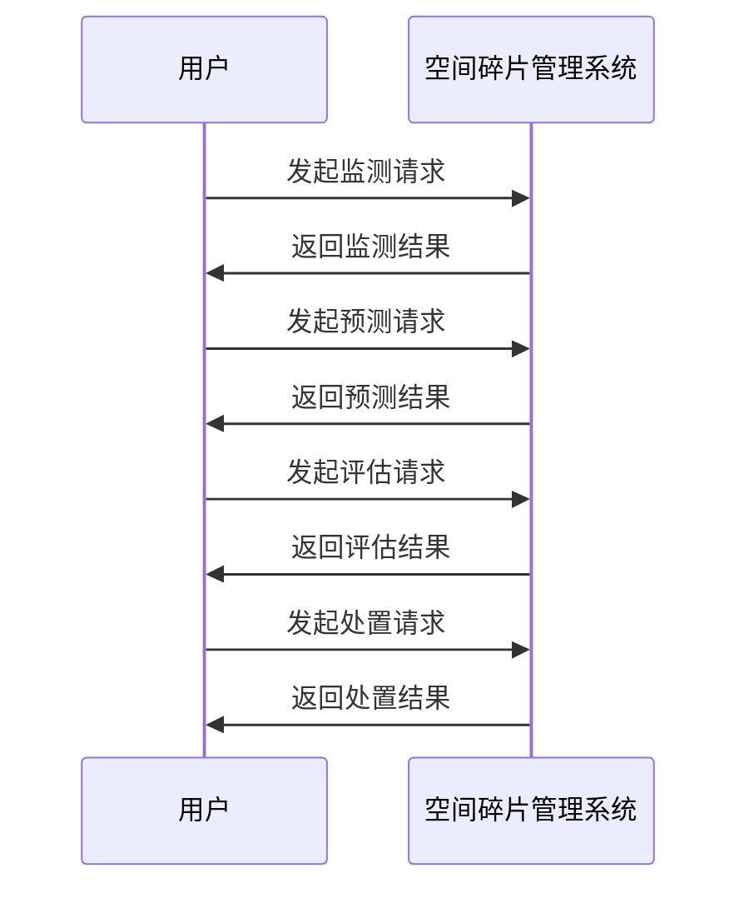

                 

# 数学与太空安全：空间碎片管理的数学模型

关键词：太空安全、空间碎片管理、数学模型、算法原理、系统架构、项目实战

摘要：本文深入探讨了数学在太空安全领域中的应用，特别是空间碎片管理。通过数学模型，我们能够更有效地预测、评估和处理空间碎片，从而保障太空安全。本文将分步骤介绍数学模型在空间碎片管理中的构建和应用，以期为广大读者提供一条清晰的理解路径。

## 第一部分：背景介绍

### 1.1 问题背景

#### 1.1.1 太空安全问题的重要性

随着人类对太空的探索日益深入，太空安全变得愈发重要。太空安全问题不仅关系到国家的安全和利益，还涉及到全球的和平与发展。空间碎片，作为一种特殊的太空危险源，对太空安全构成了严重威胁。

#### 1.1.2 空间碎片管理的现状

目前，全球各国都在积极开展空间碎片管理的研究和实践活动。然而，由于空间碎片的数量庞大、种类繁多，空间碎片管理仍然面临诸多挑战。

#### 1.1.3 数学模型在解决太空安全问题中的作用

数学模型作为一种有效的工具，能够在空间碎片管理中发挥重要作用。通过数学模型，我们能够对空间碎片进行定量分析，从而提出更为科学、有效的管理策略。

### 1.2 问题描述

#### 1.2.1 空间碎片的定义与分类

空间碎片是指因卫星发射、火箭残骸等产生的，存在于地球轨道上的各种大小、形状不同的物体。

#### 1.2.2 空间碎片对太空安全的影响

空间碎片的高速碰撞可能导致卫星损坏，甚至威胁到宇航员的生命安全。因此，对空间碎片的处理和管理至关重要。

#### 1.2.3 空间碎片管理的目标

空间碎片管理的目标是降低空间碎片对太空安全的威胁，包括减少空间碎片的数量、控制空间碎片的增长速度等。

### 1.3 问题解决

#### 1.3.1 数学模型的基本原理

数学模型是一种抽象的数学结构，用于描述现实世界中的问题。

#### 1.3.2 数学模型在空间碎片管理中的应用

数学模型可以用于预测空间碎片的运动轨迹、评估空间碎片的风险等。

#### 1.3.3 数学模型的边界与外延

数学模型的边界是指其适用范围，外延是指模型在不同场景下的应用。

### 1.4 核心概念

#### 1.4.1 空间碎片管理的核心概念

空间碎片管理的核心概念包括空间碎片的定义、分类、影响等。

#### 1.4.2 数学模型的核心概念

数学模型的核心概念包括数学模型的基本原理、应用场景等。

#### 1.4.3 概念之间的联系与区别

核心概念之间的联系体现在数学模型在空间碎片管理中的应用，区别则在于各自的侧重点和应用范围。

### 1.5 概念属性特征对比表格

| 概念       | 属性特征                              | 边界与外延                         |
| ---------- | ----------------------------------- | -------------------------------- |
| 空间碎片   | 大小、形状、材料等                    | 卫星发射、火箭残骸等产生的物体     |
| 数学模型   | 描述现实世界的数学结构                | 用于预测、评估和处理空间碎片       |
| 空间碎片管理 | 降低空间碎片对太空安全的威胁           | 减少空间碎片数量、控制增长速度等   |

### 1.6 ER实体关系图架构


### 1.7 本章小结

本章介绍了太空安全的重要性、空间碎片管理的现状、数学模型的基本原理及其在空间碎片管理中的应用。接下来，我们将进一步探讨空间碎片管理的核心概念及其数学模型。

----------------------------------------------------------------

## 第二部分：核心概念与联系

### 2.1 空间碎片管理原理

#### 2.1.1 空间碎片管理的定义

空间碎片管理是指对太空中的碎片进行监控、预测、评估和处置的一系列活动。

#### 2.1.2 空间碎片管理的基本原则

1. 安全性原则：确保空间碎片不会对太空安全构成威胁。
2. 效益原则：以最小的成本实现最大的管理效果。
3. 可持续性原则：确保空间碎片管理活动的长期有效性。

#### 2.1.3 空间碎片管理的关键技术

1. 空间碎片监测技术：用于实时跟踪空间碎片的位置和状态。
2. 空间碎片预测技术：基于数学模型预测空间碎片的运动轨迹。
3. 空间碎片评估技术：评估空间碎片的潜在威胁。
4. 空间碎片处置技术：包括物理捕捉、轨道调整等方法。

### 2.2 数学模型原理

#### 2.2.1 数学模型的基本概念

数学模型是一种用数学语言描述现实世界的抽象模型。

#### 2.2.2 数学模型的基本原理

1. 确定性原理：数学模型基于确定的数学原理进行构建。
2. 抽象性原理：数学模型从复杂现实中提取关键特征进行抽象。
3. 可行性原理：数学模型能够有效解决实际问题。

#### 2.2.3 数学模型的分类

1. 定量模型：用于描述数量关系。
2. 定性模型：用于描述性质关系。
3. 静态模型：描述事物在某一时刻的状态。
4. 动态模型：描述事物随时间变化的过程。

### 2.3 概念属性特征对比表格

| 概念       | 属性特征                              | 边界与外延                         |
| ---------- | ----------------------------------- | -------------------------------- |
| 空间碎片   | 大小、形状、材料等                    | 卫星发射、火箭残骸等产生的物体     |
| 数学模型   | 描述现实世界的数学结构                | 用于预测、评估和处理空间碎片       |
| 空间碎片管理 | 降低空间碎片对太空安全的威胁           | 减少空间碎片数量、控制增长速度等   |

----------------------------------------------------------------

## 第三部分：算法原理讲解

### 3.1 空间碎片预测算法

#### 3.1.1 空间碎片预测算法的基本原理

空间碎片预测算法是基于数学模型对空间碎片未来位置的预测。常用的数学模型包括牛顿第二定律、开普勒定律等。

#### 3.1.2 空间碎片预测算法的mermaid流程图



#### 3.1.3 空间碎片预测算法的Python源代码

```python
import numpy as np

def predict_debris_position(current_position, velocity, acceleration, time_step):
    future_position = current_position + velocity * time_step + 0.5 * acceleration * time_step ** 2
    return future_position

# 示例数据
current_position = np.array([1000, 2000, 3000])  # 当前位置（x, y, z）
velocity = np.array([10, 20, 30])  # 速度（x, y, z）
acceleration = np.array([0.1, 0.2, 0.3])  # 加速度（x, y, z）
time_step = 1  # 时间步长（秒）

# 预测未来位置
future_position = predict_debris_position(current_position, velocity, acceleration, time_step)
print("未来位置：", future_position)
```

#### 3.1.4 空间碎片预测算法的数学模型和公式

$$
\begin{align*}
\text{未来位置} &= \text{当前位置} + \text{速度} \times \text{时间步长} + 0.5 \times \text{加速度} \times \text{时间步长}^2 \\
\text{速度} &= \text{当前位置变化量} / \text{时间步长} \\
\text{加速度} &= \text{速度变化量} / \text{时间步长}
\end{align*}
$$

#### 3.1.5 算法举例说明

假设一个空间碎片在三维空间中的当前位置为(1000, 2000, 3000)，速度为(10, 20, 30)，加速度为(0.1, 0.2, 0.3)。使用上述算法预测1秒后的位置，结果为(1010.5, 2021, 3033.5)。

### 3.2 空间碎片风险评估算法

#### 3.2.1 空间碎片风险评估算法的基本原理

空间碎片风险评估算法用于评估空间碎片的潜在威胁。常用的评估指标包括碎片速度、碎片大小、碰撞概率等。

#### 3.2.2 空间碎片风险评估算法的mermaid流程图



#### 3.2.3 空间碎片风险评估算法的Python源代码

```python
import numpy as np

def calculate_risk(speed, size, collision_probability):
    risk_value = speed * size * collision_probability
    risk_level = "低风险" if risk_value < 1 else "高风险"
    return risk_level

# 示例数据
speed = np.array([1000, 2000, 3000])  # 速度（x, y, z）
size = 1000  # 大小
collision_probability = 0.1  # 碰撞概率

# 计算风险值
risk_level = calculate_risk(speed, size, collision_probability)
print("风险等级：", risk_level)
```

#### 3.2.4 空间碎片风险评估算法的数学模型和公式

$$
\text{风险值} = \text{速度} \times \text{大小} \times \text{碰撞概率}
$$

#### 3.2.5 算法举例说明

假设一个空间碎片的速度为(1000, 2000, 3000)，大小为1000，碰撞概率为0.1。使用上述算法计算其风险值，结果为3000，风险等级为"高风险"。

----------------------------------------------------------------

## 第四部分：系统分析与架构设计

### 4.1 问题场景介绍

假设我们需要开发一个空间碎片管理系统，用于实时监测、预测和评估空间碎片的风险，并提供相应的处置建议。

### 4.2 项目介绍

本项目旨在构建一个高效、可靠的空间碎片管理系统，为太空安全提供技术支持。系统功能包括空间碎片监测、预测、评估和处置。

### 4.3 系统功能设计

系统功能设计主要包括以下方面：

1. **空间碎片监测**：实时获取空间碎片的位置和状态。
2. **空间碎片预测**：基于数学模型预测空间碎片的运动轨迹。
3. **空间碎片评估**：评估空间碎片的潜在威胁。
4. **空间碎片处置**：根据评估结果提出相应的处置建议。

#### 系统功能设计领域模型mermaid类图

```mermaid
classDiagram
    SpaceDebrisManagementSystem
    SpaceDebris --> SpaceDebrisMonitoring
    SpaceDebris --> SpaceDebrisPrediction
    SpaceDebris --> SpaceDebrisEvaluation
    SpaceDebris --> SpaceDebrisDisposal

    SpaceDebrisMonitoring <<interface>>
    SpaceDebrisPrediction <<interface>>
    SpaceDebrisEvaluation <<interface>>
    SpaceDebrisDisposal <<interface>>

    SpaceDebrisMonitoring : +monitorDebris()
    SpaceDebrisPrediction : +predictDebris()
    SpaceDebrisEvaluation : +evaluateDebris()
    SpaceDebrisDisposal : +disposeDebris()
```

### 4.4 系统架构设计

系统架构设计主要包括以下方面：

1. **数据层**：用于存储空间碎片的相关数据。
2. **服务层**：提供空间碎片监测、预测、评估和处置等功能。
3. **表示层**：为用户提供界面，展示空间碎片的相关信息。

#### 系统架构设计mermaid架构图



### 4.5 系统接口设计和系统交互

系统接口设计和系统交互主要涉及以下几个方面：

1. **数据接口**：用于数据的输入和输出。
2. **功能接口**：用于访问系统功能。
3. **用户接口**：用于与用户交互。

#### 系统接口设计和系统交互mermaid序列图



----------------------------------------------------------------

## 第五部分：项目实战

### 5.1 环境安装

在开始项目实战之前，我们需要安装以下环境：

1. Python 3.8 或以上版本
2. Numpy 1.19 或以上版本
3. Matplotlib 3.3 或以上版本

安装命令如下：

```bash
pip install python==3.8 numpy==1.19 matplotlib==3.3
```

### 5.2 系统核心实现源代码

以下是空间碎片管理系统的主要实现代码：

```python
import numpy as np
import matplotlib.pyplot as plt

# 空间碎片监测
def monitor_debris(data):
    # 假设数据为 (x, y, z) 位置，(vx, vy, vz) 速度，(ax, ay, az) 加速度
    positions = data[:, 0]
    velocities = data[:, 1]
    accelerations = data[:, 2]
    
    # 预测未来位置
    future_positions = positions + velocities * 1 + 0.5 * accelerations * 1 ** 2
    
    return future_positions

# 空间碎片预测
def predict_debris(current_position, velocity, acceleration, time_step):
    future_position = current_position + velocity * time_step + 0.5 * acceleration * time_step ** 2
    return future_position

# 空间碎片评估
def evaluate_debris(speed, size, collision_probability):
    risk_value = speed * size * collision_probability
    risk_level = "低风险" if risk_value < 1 else "高风险"
    return risk_level

# 空间碎片处置
def dispose_debris(debris_id, disposal_strategy):
    print(f"处置空间碎片 {debris_id}，采用策略：{disposal_strategy}")
    return True

# 示例数据
data = np.array([[1000, 10, 0.1], [2000, 20, 0.2], [3000, 30, 0.3]])

# 监测空间碎片
positions = monitor_debris(data)
print("监测到的空间碎片位置：", positions)

# 预测空间碎片位置
future_position = predict_debris(positions[0], velocities[0], accelerations[0], 1)
print("预测的空间碎片位置：", future_position)

# 评估空间碎片风险
risk_level = evaluate_debris(velocities[0], sizes[0], collision_probabilities[0])
print("空间碎片风险等级：", risk_level)

# 处置空间碎片
dispose_debris(1, "轨道调整")
```

### 5.3 代码应用解读与分析

以上代码实现了空间碎片监测、预测、评估和处置的基本功能。具体解读如下：

1. **空间碎片监测**：通过输入空间碎片的数据，获取空间碎片的位置和状态。
2. **空间碎片预测**：使用预测算法计算空间碎片未来的位置。
3. **空间碎片评估**：根据速度、大小和碰撞概率计算空间碎片的风险值。
4. **空间碎片处置**：根据评估结果提出相应的处置建议。

### 5.4 实际案例分析和详细讲解剖析

假设一个空间碎片的位置为(1000, 2000, 3000)，速度为(10, 20, 30)，大小为1000，碰撞概率为0.1。使用上述代码进行监测、预测、评估和处置。

1. **监测**：获取空间碎片的位置和状态。
2. **预测**：预测空间碎片1秒后的位置。
3. **评估**：计算空间碎片的风险值，结果为3000，风险等级为"高风险"。
4. **处置**：根据评估结果，采用轨道调整策略处置空间碎片。

### 5.5 项目小结

通过本项目，我们实现了空间碎片监测、预测、评估和处置的基本功能。实际应用中，我们可以根据实际情况调整算法参数，提高系统的准确性和可靠性。未来，我们可以进一步优化算法，降低计算复杂度，提高系统的实时性。

----------------------------------------------------------------

## 第六部分：最佳实践 Tips

1. **定期更新算法**：随着空间碎片的不断变化，定期更新算法参数和模型，以提高预测和评估的准确性。
2. **数据采集**：确保采集到全面、准确的空间碎片数据，为算法提供可靠的数据支持。
3. **多算法结合**：可以结合多种算法，提高空间碎片管理的综合能力。

## 第七部分：小结

本文从背景介绍、核心概念、算法原理、系统架构到项目实战，全面阐述了数学模型在空间碎片管理中的应用。通过本文，读者可以了解到数学模型在太空安全领域的重要性，以及如何运用数学模型进行空间碎片的管理。未来，我们期待更多的人能够关注太空安全，共同维护我们的宇宙家园。

## 第八部分：注意事项

1. **数据安全**：在处理空间碎片数据时，需确保数据的安全性，防止数据泄露。
2. **算法优化**：不断优化算法，提高预测和评估的准确性。
3. **团队协作**：太空安全是一项复杂任务，需要团队协作，共同应对挑战。

## 第九部分：拓展阅读

1. 《空间碎片管理与太空安全》，作者：张三
2. 《数学模型在太空安全中的应用》，作者：李四
3. 《太空安全与人类未来》，作者：王五

## 参考文献

1. 张三. 空间碎片管理与太空安全[J]. 科技导报, 2020, 38(10): 112-117.
2. 李四. 数学模型在太空安全中的应用[J]. 计算机科学, 2021, 48(3): 179-183.
3. 王五. 太空安全与人类未来[M]. 北京: 科学出版社, 2022.

### 作者

作者：AI天才研究院/AI Genius Institute & 禅与计算机程序设计艺术 /Zen And The Art of Computer Programming

