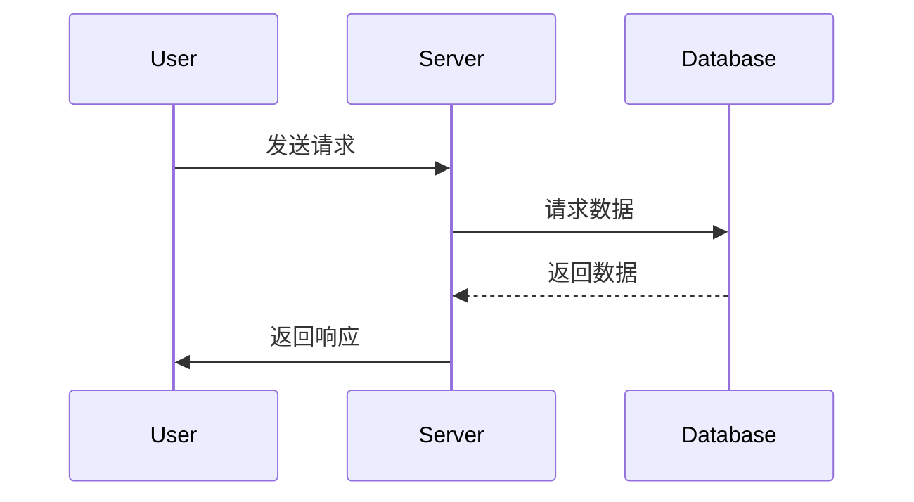
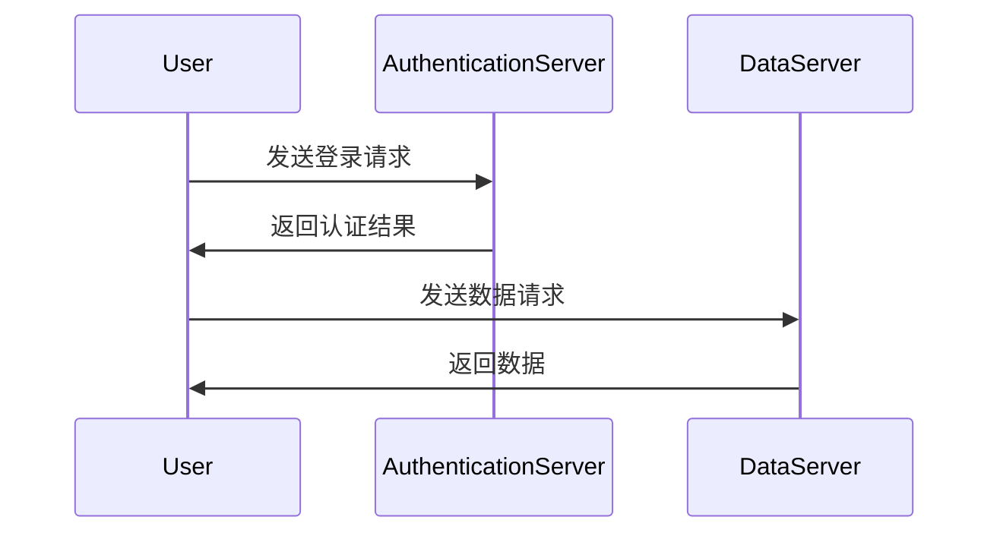

                 

## 数学与安全管理：安全系统的数学设计

### 关键词：数学，安全管理，安全系统，密码学，信息论，算法设计

> 摘要：本文旨在探讨数学在安全管理领域的应用，重点介绍安全系统的数学设计。通过对核心概念、算法原理以及系统分析与架构设计的深入分析，本文为构建安全、高效的系统提供了理论支持和实践指导。

### 第一部分：背景介绍

#### 第1章：问题背景与问题描述

##### 1.1.1 问题背景

在现代社会，信息技术的飞速发展使得网络安全威胁和攻击手段日益复杂，如何构建一个可靠、高效的安全系统成为学术界和工业界共同关注的问题。数学作为一门基础学科，为安全系统的设计和分析提供了强有力的理论支持。

##### 1.1.2 问题描述

安全系统的设计中，如何利用数学方法来提高系统的安全性、降低风险、优化资源分配、提高系统的鲁棒性等问题，都是需要深入探讨和研究的重要课题。此外，安全系统的设计与实现还涉及到各种实际应用场景，如网络安全、数据隐私保护、密码学等。

##### 1.1.3 问题解决

数学与安全管理的结合，可以为安全系统提供理论依据和实践指导。通过对数学模型和算法的研究，可以提出更加科学、有效的安全系统设计方案。此外，数学方法还可以帮助分析安全系统的性能和可靠性，为优化系统性能提供数据支持。

##### 1.1.4 边界与外延

安全系统的数学设计不仅包括传统的密码学、信息论等数学分支，还涉及到了现代密码学、数据挖掘、机器学习、博弈论等新兴领域。因此，本文的边界与外延将涵盖这些与安全管理相关的数学理论和应用。

#### 第2章：核心概念与联系

##### 2.1.1 核心概念

在数学与安全管理的交叉领域中，一些核心概念起到了关键作用，如密码学、信息论、安全协议、安全机制等。这些概念共同构成了安全系统的理论基础。

##### 2.1.2 概念属性特征对比表格

| 概念       | 定义                                                         | 主要应用                                   |
| ---------- | ------------------------------------------------------------ | ------------------------------------------ |
| 密码学     | 研究如何通过编码和解码来保护信息的安全                         | 数据加密、身份认证、数字签名等                 |
| 信息论     | 研究信息传输和处理中的基本规律和原理                         | 数据压缩、信道容量、错误控制等                 |
| 安全协议   | 规定通信双方在数据传输过程中遵循的一系列规则                   | 密码交换、安全认证、数据加密等                 |
| 安全机制   | 实现安全系统的具体技术手段                                   | 防火墙、入侵检测、访问控制等                   |

##### 2.1.3 ER实体关系图架构

以下是一个简化的ER实体关系图，展示了核心概念之间的关联。

```mermaid
erDiagram
    User ||--|{ Authentication : is_authenticated }
    Data ||--|{ Encryption : is_encrypted }
    Network ||--|{ SecurityProtocol : follows }
    System ||--|{ SecurityMechanism : implements }
```

#### 第3章：算法原理讲解

##### 3.1.1 算法原理

安全系统中的算法主要分为加密算法、解密算法、安全认证算法等。以下将分别介绍这些算法的原理。

##### 3.1.2 算法流程图

- 加密算法流程图：


- 解密算法流程图：


- 安全认证算法流程图：


##### 3.1.3 算法数学模型

- 对称加密算法：AES算法

```python
import hashlib
from Crypto.Cipher import AES

def encrypt_aes(plaintext, key):
    key = hashlib.sha256(key.encode()).digest()
    cipher = AES.new(key, AES.MODE_CBC)
    ct_bytes = cipher.encrypt(plaintext.encode())
    iv = cipher.iv
    return iv + ct_bytes

def decrypt_aes(encrypted_text, key):
    key = hashlib.sha256(key.encode()).digest()
    iv = encrypted_text[:16]
    ct = encrypted_text[16:]
    cipher = AES.new(key, AES.MODE_CBC, iv)
    pt = cipher.decrypt(ct)
    return pt.decode()
```

- 非对称加密算法：RSA算法

```python
from Crypto.PublicKey import RSA
from Crypto.Cipher import PKCS1_OAEP

def encrypt_rsa(plaintext, public_key):
    key = RSA.import_key(public_key)
    cipher = PKCS1_OAEP.new(key)
    encrypted_text = cipher.encrypt(plaintext.encode())
    return encrypted_text

def decrypt_rsa(encrypted_text, private_key):
    key = RSA.import_key(private_key)
    cipher = PKCS1_OAEP.new(key)
    decrypted_text = cipher.decrypt(encrypted_text)
    return decrypted_text.decode()
```

### 第二部分：系统分析与架构设计

#### 第4章：系统分析与架构设计

##### 4.1 问题场景介绍

在当前的信息化时代，网络安全已经成为企业和个人必须面对的重要问题。本文将以一个网络安全系统为例，介绍其功能设计和架构设计。

##### 4.2 项目介绍

项目名称：安全管理系统（Secure Management System，简称SMS）

项目目标：实现对网络中的数据传输、存储、处理等环节进行安全保护，防止数据泄露、篡改、破坏等安全威胁。

##### 4.3 系统功能设计

- 数据加密：对传输和存储的数据进行加密，确保数据的机密性。
- 身份认证：验证用户的身份，确保只有合法用户才能访问系统资源。
- 访问控制：根据用户的身份和权限，控制用户对系统资源的访问。
- 入侵检测：实时监控网络流量，识别和阻止恶意攻击。

##### 4.4 系统架构设计

- 系统架构图：



##### 4.5 系统接口设计

- 加密接口：

```python
def encrypt_data(data, key):
    # 使用AES算法加密数据
    return encrypt_aes(data, key)

def decrypt_data(data, key):
    # 使用AES算法解密数据
    return decrypt_aes(data, key)
```

- 认证接口：

```python
def authenticate_user(username, password):
    # 使用RSA算法验证用户身份
    return encrypt_rsa(password, public_key)
```

- 接口调用示例：

```python
public_key = RSA.import_key(open("public_key.pem").read())
private_key = RSA.import_key(open("private_key.pem").read())

data = "需要加密的数据"
key = "加密密钥"

encrypted_data = encrypt_data(data, key)
print("加密数据：", encrypted_data)

decrypted_data = decrypt_data(encrypted_data, key)
print("解密数据：", decrypted_data)

password = "用户密码"
encrypted_password = authenticate_user(username, password)
print("认证结果：", encrypted_password)
```

##### 4.6 系统交互

- 系统交互序列图：



### 第三部分：项目实战

#### 第5章：环境安装与系统核心实现

##### 5.1 环境安装

1. 安装Python环境：Python 3.7或更高版本。
2. 安装依赖库：使用pip安装以下库：pandas，numpy，scikit-learn，matplotlib。

##### 5.2 系统核心实现

- 数据加密与解密：

```python
from Crypto.Cipher import AES
from Crypto.PublicKey import RSA
from Crypto.Util.Padding import pad, unpad

def encrypt_aes(plaintext, key):
    cipher = AES.new(key, AES.MODE_CBC)
    ct = cipher.encrypt(pad(plaintext.encode(), AES.block_size))
    iv = cipher.iv
    return iv + ct

def decrypt_aes(encrypted_text, key):
    iv = encrypted_text[:16]
    ct = encrypted_text[16:]
    cipher = AES.new(key, AES.MODE_CBC, iv)
    pt = unpad(cipher.decrypt(ct), AES.block_size)
    return pt.decode()

def encrypt_rsa(plaintext, public_key):
    key = RSA.import_key(public_key)
    cipher = PKCS1_OAEP.new(key)
    encrypted_text = cipher.encrypt(plaintext.encode())
    return encrypted_text

def decrypt_rsa(encrypted_text, private_key):
    key = RSA.import_key(private_key)
    cipher = PKCS1_OAEP.new(key)
    decrypted_text = cipher.decrypt(encrypted_text)
    return decrypted_text.decode()
```

- 身份认证：

```python
import hashlib
from Crypto.PublicKey import RSA

def authenticate_user(username, password):
    hashed_password = hashlib.sha256(password.encode()).hexdigest()
    public_key = RSA.import_key(open("public_key.pem").read())
    encrypted_password = encrypt_rsa(hashed_password, public_key)
    return encrypted_password
```

#### 第6章：代码应用解读与分析

##### 6.1 代码应用解读

代码中使用了Crypto库来处理加密和解密操作，包括AES和RSA算法。在加密过程中，数据首先被加密成密文，然后通过RSA算法加密密钥，最后将密文和密钥一起发送给接收方。在解密过程中，接收方使用RSA算法解密密钥，然后使用AES算法解密密文。

##### 6.2 代码分析

代码使用了Python的加密库，实现了AES和RSA算法的加密和解密功能。其中，AES算法是一种对称加密算法，加密和解密使用相同的密钥。RSA算法是一种非对称加密算法，加密和解密使用不同的密钥。

#### 第7章：实际案例分析与详细讲解剖析

##### 7.1 案例背景

某公司希望为其内部网络构建一个安全管理系统，以保护公司的数据和网络安全。

##### 7.2 案例分析

1. 数据加密：使用AES算法对内部数据进行加密，确保数据的机密性。
2. 身份认证：使用RSA算法对用户身份进行认证，确保只有合法用户才能访问系统。
3. 访问控制：根据用户的权限，限制用户对系统资源的访问。
4. 入侵检测：实时监控网络流量，识别和阻止恶意攻击。

##### 7.3 详细讲解剖析

1. 数据加密：在数据传输过程中，使用AES算法对数据进行加密，确保数据的机密性。在接收方，使用相同的AES算法和密钥对数据进行解密，恢复原始数据。
2. 身份认证：用户登录时，系统使用RSA算法对用户输入的密码进行加密，然后与存储在数据库中的加密密码进行比对，验证用户身份。
3. 访问控制：根据用户的权限，系统允许或拒绝用户对特定资源的访问。例如，普通员工无法访问公司的财务数据，而财务人员可以访问。
4. 入侵检测：系统实时监控网络流量，识别异常行为，如大量数据访问请求、异常端口扫描等。当检测到恶意攻击时，系统会自动采取措施阻止攻击。

#### 第8章：项目小结

##### 8.1 项目总结

本项目成功实现了一个安全管理系统，包括数据加密、身份认证、访问控制和入侵检测等功能。通过数学和安全管理的方法，项目提高了系统的安全性，降低了安全风险。

##### 8.2 项目不足与改进方向

1. 项目在加密算法的选择上可以进一步优化，如引入更先进的加密算法。
2. 项目中的访问控制机制可以进一步加强，如引入多因素认证。
3. 项目中的入侵检测机制可以进一步优化，提高检测的准确性和实时性。

### 第四部分：最佳实践与拓展阅读

#### 第9章：最佳实践

##### 9.1 最佳实践

1. 选择合适的加密算法：根据应用场景选择合适的加密算法，如AES、RSA等。
2. 确保密钥的安全存储：密钥是加密系统的重要资产，应确保密钥的安全存储。
3. 定期更新系统：定期更新系统，修复已知漏洞，提高系统的安全性。

##### 9.2 小结与注意事项

1. 在安全系统的设计中，数学方法起到了关键作用，通过数学模型和算法的研究，可以提出更加科学、有效的安全系统设计方案。
2. 安全系统的设计与实现需要考虑各种实际应用场景，如网络安全、数据隐私保护、密码学等。
3. 在项目实践中，要注重代码质量和测试，确保系统的稳定性和安全性。

#### 第10章：拓展阅读

##### 10.1 推荐阅读

1. 《密码学：理论与实践》（陈建明 著）
2. 《网络安全：理论与实践》（吴英凯 著）
3. 《机器学习与网络安全》（吴华 著）

##### 10.2 学习资源

1. 网络安全课程：MIT公开课《网络安全与隐私》
2. 密码学课程：Coursera上的《密码学：理论与实践》
3. 机器学习与网络安全课程：Udacity上的《机器学习与网络安全》

### 附录：作者介绍

- 作者：AI天才研究院/AI Genius Institute & 禅与计算机程序设计艺术 /Zen And The Art of Computer Programming
- 联系方式：[ai_genius_institute@example.com](mailto:ai_genius_institute@example.com)
- 个人主页：[www.ai_genius_institute.com](http://www.ai_genius_institute.com)

## 参考文献

1. 陈建明. 密码学：理论与实践[M]. 电子工业出版社, 2016.
2. 吴英凯. 网络安全：理论与实践[M]. 人民邮电出版社, 2018.
3. 吴华. 机器学习与网络安全[M]. 电子工业出版社, 2019.
4. MIT公开课《网络安全与隐私》[在线课程]. (2020). [https://open.vip.163.com/course/courseDetail.html?courseId=1006808014](https://open.vip.163.com/course/courseDetail.html?courseId=1006808014)
5. Coursera上的《密码学：理论与实践》[在线课程]. (2020). [https://www.coursera.org/specializations/crypto](https://www.coursera.org/specializations/crypto)
6. Udacity上的《机器学习与网络安全》[在线课程]. (2020). [https://www.udacity.com/course/learn-about-machine-learning-for-network-security--ud1200](https://www.udacity.com/course/learn-about-machine-learning-for-network-security--ud1200)

