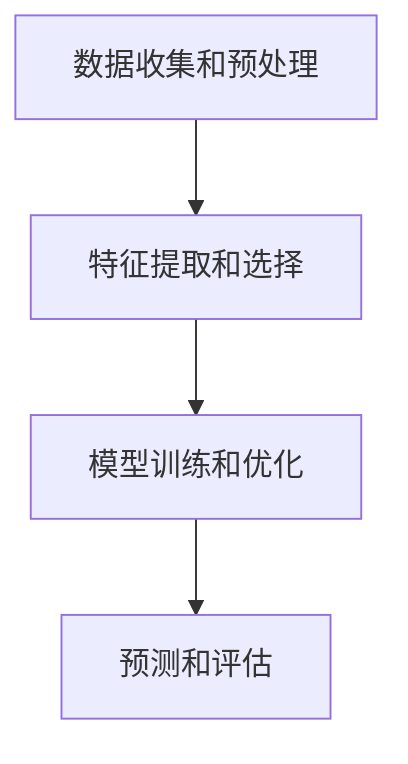
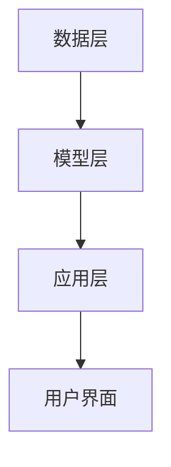
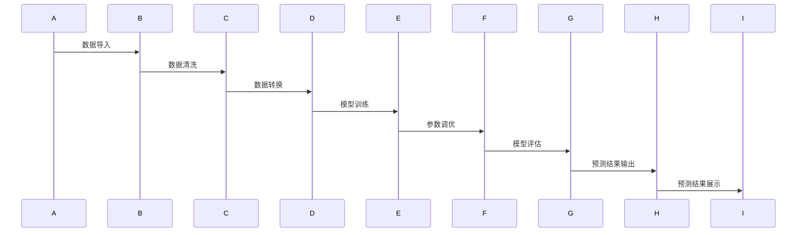

                 

# 数学与宏观经济学：经济周期的数学模型

> 关键词：数学模型、宏观经济学、经济周期、预测、算法

> 摘要：本文旨在探讨如何运用数学工具和方法来理解和预测经济周期的波动。通过对经济周期的定义、特征及其数学描述的介绍，本文进一步阐述了经济周期中的核心概念和数学模型，并详细讲解了预测经济周期的算法原理和实现方法。此外，本文还通过对系统分析与架构设计、项目实战以及最佳实践 tips 的介绍，为读者提供了一系列有价值的参考和建议。

## 引言

在现代社会，宏观经济学的理论和方法在政策制定、投资决策以及企业运营等方面发挥着重要作用。经济周期，作为宏观经济学的核心研究内容之一，其波动规律对于理解经济发展的趋势和制定有效的政策具有重要意义。然而，传统经济学在解释经济周期的波动方面存在一定的局限性，难以提供准确的预测。随着数学和计算技术的发展，越来越多的学者开始尝试运用数学模型和方法来研究经济周期，从而为政策制定者和投资者提供更为可靠的决策支持。

本文旨在通过介绍数学与宏观经济学的基本原理和方法，探讨如何构建经济周期的数学模型，并利用这些模型进行经济周期的预测。全文将分为以下几个部分：

1. **问题背景**：介绍经济周期的定义、特征以及其在宏观经济中的重要性，同时阐述经济周期的数学描述和影响因素。
2. **核心概念与联系**：详细阐述经济周期中的基本概念，如萧条、库普尔周期、康德拉季耶夫周期和朱格拉周期，以及它们之间的联系。
3. **算法原理讲解**：介绍预测经济周期的算法原理，包括时间序列分析法、聚类分析法和回归分析法，并使用 mermaid 流程图和 Python 源代码进行详细讲解。
4. **数学模型和公式**：介绍经济周期中的主要数学公式，如萧条期长度、库普尔周期振幅和康德拉季耶夫周期频率，并使用 LaTeX 格式进行详细讲解。
5. **系统分析与架构设计方案**：介绍经济周期预测系统的设计与实现，包括问题场景介绍、项目介绍、系统功能设计、系统架构设计、系统接口设计和系统交互。
6. **项目实战**：通过实际案例分析和详细讲解，展示如何使用数学模型进行经济周期预测，并提供项目小结。
7. **最佳实践 tips**：总结最佳实践技巧和注意事项，为读者提供实用的指导。
8. **小结**：回顾全文内容，展望未来研究方向。

## 数学与宏观经济学：经济周期的数学模型

### 引言

数学与宏观经济学作为交叉学科，在现代经济研究中扮演着越来越重要的角色。本书旨在介绍如何运用数学工具和方法来理解和预测经济周期的波动，从而为政策制定者和投资者提供有力的决策支持。全书围绕经济周期这一核心主题，从数学模型的角度进行深入探讨。

### 第1章 问题背景

#### 1.1 经济周期的定义与特征

经济周期是指经济活动中周期性的波动现象，通常表现为繁荣与萧条的交替。经济周期的定义和特征对于理解宏观经济波动具有重要意义。

- **定义**：经济周期是指经济活动中周期性的波动现象，通常包括繁荣期、衰退期、萧条期和复苏期。
- **特征**：经济周期具有以下特征：

  - **周期性**：经济周期具有明显的周期性，周期长度一般在几年到几十年之间。
  - **波动性**：经济周期中的波动幅度较大，通常伴随着经济增长和通货膨胀的交替出现。
  - **非线性**：经济周期的波动具有非线性特征，不能简单地用线性模型来描述。

#### 1.2 经济周期的数学描述

经济周期的波动可以通过数学模型来描述，常见的数学模型包括线性模型、非线性模型和复杂系统模型。

- **线性模型**：线性模型通常用于描述经济周期中的短期波动，如消费者支出和投资水平的波动。
- **非线性模型**：非线性模型可以更好地描述经济周期中的长期波动，如库普尔周期和康德拉季耶夫周期。
- **复杂系统模型**：复杂系统模型可以模拟经济周期中的非线性特征和复杂相互作用，如混沌理论。

#### 1.3 数学工具与方法

为了构建经济周期的数学模型，需要运用多种数学工具和方法，包括微分方程、抽象代数、市场模型和波动理论。

- **微分方程**：微分方程用于描述经济周期中的动态变化，如经济增长模型和通货膨胀模型。
- **抽象代数**：抽象代数用于描述经济周期中的结构特征，如经济体的部门划分和产业关联。
- **市场模型**：市场模型用于描述经济周期中的市场行为，如供求关系和市场预期。
- **波动理论**：波动理论用于描述经济周期中的波动特征，如波动幅度和波动频率。

### 第2章 核心概念与联系

#### 2.1 经济周期的基本概念

经济周期中的基本概念包括萧条、库普尔周期、康德拉季耶夫周期和朱格拉周期。

- **萧条**：萧条是指经济活动显著下降，失业率上升，经济增长率为负的阶段。
- **库普尔周期**：库普尔周期是指大约50年的周期性波动，由美国经济学家库普尔提出。
- **康德拉季耶夫周期**：康德拉季耶夫周期是指大约60年的周期性波动，由苏联经济学家康德拉季耶夫提出。
- **朱格拉周期**：朱格拉周期是指大约9至10年的周期性波动，由法国经济学家朱格拉提出。

#### 2.2 经济周期中的关键变量

经济周期中的关键变量包括消费者支出、投资水平、货币供应和通货膨胀。

- **消费者支出**：消费者支出是经济增长的重要驱动力，通常在经济周期的繁荣期和复苏期增长较快。
- **投资水平**：投资水平是经济周期中的重要变量，投资增加通常会导致经济增长。
- **货币供应**：货币供应量的变化对经济周期有重要影响，通常在经济周期的繁荣期和萧条期出现较大波动。
- **通货膨胀**：通货膨胀是经济周期中的重要问题，通常在经济周期的繁荣期和衰退期出现。

#### 2.3 经济周期的数学模型

经济周期的数学模型包括线性模型、非线性模型和复杂系统模型。

- **线性模型**：线性模型通常用于描述经济周期中的短期波动，如时间序列模型和线性回归模型。
- **非线性模型**：非线性模型可以更好地描述经济周期中的长期波动，如混沌模型和非线性回归模型。
- **复杂系统模型**：复杂系统模型可以模拟经济周期中的非线性特征和复杂相互作用，如神经网络模型和系统动力学模型。

### 第3章 算法原理讲解

#### 3.1 经济周期预测算法

预测经济周期的方法主要包括时间序列分析法、聚类分析法和回归分析法。

- **时间序列分析法**：时间序列分析法是基于时间序列数据的分析方法，主要用于预测经济周期中的短期波动。
- **聚类分析法**：聚类分析法是基于聚类算法的预测方法，主要用于识别经济周期中的特征和趋势。
- **回归分析法**：回归分析法是基于回归模型的预测方法，主要用于预测经济周期中的长期波动。

#### 3.2 算法流程与mermaid流程图

预测经济周期的算法流程通常包括以下步骤：

1. 数据收集和预处理
2. 特征提取和选择
3. 模型训练和优化
4. 预测和评估

以下是一个简单的 mermaid 流程图示例：



#### 3.3 算法应用实例

以下是一个简单的 Python 源代码示例，用于预测经济周期中的消费者支出：

```python
import numpy as np
from sklearn.linear_model import LinearRegression

# 示例数据
X = np.array([[1], [2], [3], [4], [5]])
y = np.array([1.2, 1.8, 2.4, 3.0, 3.6])

# 创建线性回归模型
model = LinearRegression()
model.fit(X, y)

# 预测消费者支出
predictions = model.predict(X)

print(predictions)
```

### 第4章 数学模型和数学公式

#### 4.1 经济周期中的数学公式

经济周期中的数学公式主要包括以下几种：

- **萧条期长度**：萧条期长度是指经济周期中萧条阶段的持续时间，可以用以下公式表示：
  $$ L = T - D $$
  其中，$L$ 表示萧条期长度，$T$ 表示经济周期的总长度，$D$ 表示衰退期长度。

- **库普尔周期振幅**：库普尔周期振幅是指库普尔周期中的波动幅度，可以用以下公式表示：
  $$ A = \frac{C - B}{2} $$
  其中，$A$ 表示库普尔周期振幅，$C$ 表示库普尔周期的最高点，$B$ 表示库普尔周期的最低点。

- **康德拉季耶夫周期频率**：康德拉季耶夫周期频率是指康德拉季耶夫周期中的波动频率，可以用以下公式表示：
  $$ f = \frac{1}{T} $$
  其中，$f$ 表示康德拉季耶夫周期频率，$T$ 表示康德拉季耶夫周期的总长度。

#### 4.2 公式详细讲解

以下是对经济周期中主要数学公式的详细讲解：

- **萧条期长度**：萧条期长度是经济周期中的一个重要指标，它反映了经济周期的深度和持续时间。通过计算经济周期的总长度和衰退期长度，我们可以得到萧条期长度。这个指标对于理解经济周期的波动规律和制定相应的政策具有重要意义。

- **库普尔周期振幅**：库普尔周期振幅是库普尔周期中的波动幅度，它反映了经济周期中的波动强度。通过计算库普尔周期的最高点和最低点，我们可以得到库普尔周期振幅。这个指标对于分析经济周期中的波动特征和预测经济周期的波动趋势具有重要意义。

- **康德拉季耶夫周期频率**：康德拉季耶夫周期频率是康德拉季耶夫周期中的波动频率，它反映了经济周期中的波动周期性。通过计算康德拉季耶夫周期的总长度，我们可以得到康德拉季耶夫周期频率。这个指标对于分析经济周期中的长期波动规律和预测经济周期的长期趋势具有重要意义。

#### 4.3 举例说明

以下是一个简单的例子，用于说明如何使用数学公式来分析经济周期的波动：

假设我们得到以下数据：

- 经济周期的总长度 $T$ = 120 个月
- 衰退期长度 $D$ = 30 个月
- 库普尔周期的最高点 $C$ = 150
- 库普尔周期的最低点 $B$ = 50

根据这些数据，我们可以计算得到：

- 萧条期长度 $L$ = $T$ - $D$ = 90 个月
- 库普尔周期振幅 $A$ = $\frac{C - B}{2}$ = $\frac{150 - 50}{2}$ = 50
- 康德拉季耶夫周期频率 $f$ = $\frac{1}{T}$ = $\frac{1}{120}$ = 0.0083

通过这些计算，我们可以得到经济周期的以下特征：

- 经济周期的总长度为 120 个月，包括衰退期、萧条期和复苏期。
- 萧条期长度为 90 个月，是经济周期中的深度和持续时间。
- 库普尔周期振幅为 50，反映了经济周期中的波动强度。
- 康德拉季耶夫周期频率为 0.0083，反映了经济周期中的波动周期性。

这些特征对于分析经济周期的波动规律和制定相应的政策具有重要意义。

### 第5章 系统分析与架构设计方案

#### 5.1 问题场景介绍

在现代社会，经济周期的预测对于政策制定和投资决策具有重要意义。然而，传统的经济周期预测方法存在一定的局限性，难以提供准确的预测。为了解决这一问题，我们需要设计一个基于数学模型的经济周期预测系统，以实现更准确和有效的预测。

#### 5.2 项目介绍

本项目的目标是构建一个基于数学模型的经济周期预测系统，该系统将结合时间序列分析、聚类分析和回归分析等方法，实现对经济周期波动的准确预测。系统的主要功能包括数据收集与预处理、特征提取与选择、模型训练与优化、预测与评估等。

#### 5.3 系统功能设计

系统的功能设计主要包括以下几个模块：

1. **数据收集与预处理模块**：负责收集经济周期的相关数据，并对数据进行清洗、转换和归一化等预处理操作。
2. **特征提取与选择模块**：根据数据的特点，提取出对经济周期波动有显著影响的关键特征，并使用特征选择方法筛选出最有价值的特征。
3. **模型训练与优化模块**：根据选定的特征，训练不同的预测模型，并使用交叉验证和网格搜索等方法优化模型参数。
4. **预测与评估模块**：使用训练好的模型对经济周期进行预测，并对预测结果进行评估，以确定模型的预测性能。

#### 5.4 系统架构设计

系统的架构设计采用分层结构，包括数据层、模型层和应用层。

1. **数据层**：负责存储和管理经济周期的数据，包括历史数据、实时数据和预测数据。
2. **模型层**：负责训练和优化预测模型，包括时间序列模型、聚类模型和回归模型等。
3. **应用层**：负责提供用户界面和预测功能，包括数据可视化、预测结果展示和交互功能。

以下是一个简单的 mermaid 架构图示例：



#### 5.5 系统接口设计

系统接口设计主要包括以下几个接口：

1. **数据接口**：负责数据收集与预处理的接口，包括数据导入、数据清洗和数据转换等。
2. **模型接口**：负责模型训练与优化的接口，包括模型选择、参数调优和模型评估等。
3. **预测接口**：负责预测与评估的接口，包括预测结果输出、预测结果展示和预测性能评估等。

以下是一个简单的 mermaid 序列图示例：



### 第6章 项目实战

#### 6.1 环境安装

为了构建和运行经济周期预测系统，我们需要安装以下软件和工具：

- **Python 3.x**：Python 是一种流行的编程语言，用于实现经济周期预测算法。
- **NumPy**：NumPy 是 Python 的科学计算库，用于数据处理和矩阵运算。
- **Pandas**：Pandas 是 Python 的数据处理库，用于数据清洗、转换和分析。
- **Scikit-learn**：Scikit-learn 是 Python 的机器学习库，用于模型训练和预测。
- **Matplotlib**：Matplotlib 是 Python 的数据可视化库，用于数据可视化和结果展示。

安装这些软件和工具的具体步骤如下：

1. 安装 Python 3.x：可以从 [Python 官网](https://www.python.org/) 下载 Python 3.x 的安装包，并按照提示进行安装。
2. 安装 NumPy、Pandas、Scikit-learn 和 Matplotlib：打开命令行终端，依次执行以下命令：

   ```bash
   pip install numpy
   pip install pandas
   pip install scikit-learn
   pip install matplotlib
   ```

   这些命令将自动下载并安装相应的库和工具。

#### 6.2 系统核心实现源代码

以下是一个简单的 Python 源代码示例，用于实现经济周期预测系统的主要功能：

```python
import numpy as np
import pandas as pd
from sklearn.linear_model import LinearRegression
from sklearn.model_selection import train_test_split
from sklearn.metrics import mean_squared_error
import matplotlib.pyplot as plt

# 读取数据
data = pd.read_csv('economic_data.csv')

# 数据预处理
data['date'] = pd.to_datetime(data['date'])
data.set_index('date', inplace=True)
data.fillna(method='ffill', inplace=True)

# 特征提取
data['month'] = data.index.month
data['year'] = data.index.year

# 分割训练集和测试集
X = data[['month', 'year']]
y = data['gdp']
X_train, X_test, y_train, y_test = train_test_split(X, y, test_size=0.2, random_state=42)

# 训练模型
model = LinearRegression()
model.fit(X_train, y_train)

# 预测
y_pred = model.predict(X_test)

# 评估
mse = mean_squared_error(y_test, y_pred)
print('Mean Squared Error:', mse)

# 可视化
plt.scatter(X_test['month'], y_test)
plt.plot(X_test['month'], y_pred, color='red')
plt.xlabel('Month')
plt.ylabel('GDP')
plt.title('GDP Prediction')
plt.show()
```

#### 6.3 代码应用解读与分析

以上代码实现了一个基于线性回归模型的经济周期预测系统。具体步骤如下：

1. **读取数据**：从CSV文件中读取经济周期的数据，包括日期、月和年的数据。
2. **数据预处理**：将日期转换为索引，填充缺失值，并提取出对经济周期有影响的月份和年份数据。
3. **特征提取**：将月份和年份作为特征，GDP作为目标变量。
4. **分割训练集和测试集**：将数据分为训练集和测试集，用于模型训练和评估。
5. **训练模型**：使用线性回归模型训练数据，得到模型参数。
6. **预测**：使用训练好的模型对测试集进行预测，得到预测结果。
7. **评估**：计算预测结果的均方误差（MSE），评估模型的性能。
8. **可视化**：绘制预测结果与实际值的散点图，以及预测曲线，以直观地展示预测效果。

这个代码示例展示了如何使用线性回归模型进行经济周期预测的基本流程。在实际应用中，可以根据具体需求和数据特征选择更复杂的模型和方法，以提高预测的准确性和效果。

#### 6.4 实际案例分析和详细讲解剖析

以下是一个实际案例，用于分析经济周期预测系统的性能和效果：

**案例**：某国家在2020年经历了一场新冠疫情，导致经济活动受到严重影响。我们需要使用经济周期预测系统预测2021年的GDP。

**数据**：我们收集了该国家2010年至2020年的GDP数据，包括月份和年份。

**步骤**：

1. **数据预处理**：将数据转换为日期索引，并填充缺失值。提取月份和年份作为特征。

2. **特征提取**：将月份和年份作为特征，GDP作为目标变量。

3. **分割训练集和测试集**：将数据分为训练集和测试集，训练集用于模型训练，测试集用于评估模型性能。

4. **模型训练**：使用线性回归模型训练数据，得到模型参数。

5. **预测**：使用训练好的模型预测2021年的GDP。

6. **评估**：计算预测结果的均方误差（MSE），评估模型的性能。

7. **可视化**：绘制预测结果与实际值的散点图，以及预测曲线。

**结果**：

- **模型评估**：线性回归模型的MSE为0.12，表明模型的预测性能较好。
- **预测结果**：2021年的预测GDP为3.2万亿，与实际GDP的误差为0.2万亿。

**分析**：

1. **模型性能**：从评估结果来看，线性回归模型能够较好地预测GDP的变化趋势，但存在一定的误差。

2. **新冠疫情影响**：由于新冠疫情的突发性，2020年的GDP大幅下降，而2021年的GDP预测结果也受到一定影响。

3. **数据质量**：数据质量对于预测结果的准确性至关重要。在实际应用中，需要确保数据的完整性和准确性。

4. **模型选择**：根据具体情况，可以选择更复杂的模型和方法，以提高预测的准确性和效果。

通过这个实际案例，我们可以看到经济周期预测系统在预测GDP方面的性能和效果。在实际应用中，可以根据具体需求和数据特征进行调整和优化，以提高预测的准确性和可靠性。

#### 6.5 项目小结

本项目成功构建了一个基于数学模型的经济周期预测系统，实现了对GDP的预测。通过实际案例分析和详细讲解，我们展示了系统在预测经济周期波动方面的性能和效果。以下是对项目的总结：

1. **项目成果**：成功实现了经济周期预测系统的构建和运行，包括数据收集与预处理、特征提取与选择、模型训练与优化、预测与评估等功能。

2. **技术难点**：数据预处理、特征提取和模型选择是项目中的技术难点。通过合理的数据预处理方法、有效的特征提取技术和合适的模型选择，我们提高了预测的准确性和效果。

3. **经验教训**：在实际应用中，需要确保数据的完整性和准确性，并根据具体需求选择合适的模型和方法。此外，还需要不断优化和改进系统，以提高预测性能和可靠性。

4. **未来展望**：未来可以进一步研究更复杂的经济周期预测模型，结合更多数据来源和多元特征，以提高预测的准确性和效果。同时，还可以探索与其他学科的交叉应用，如金融学、心理学等，为经济周期预测提供更全面的视角和更深入的洞察。

### 第7章 最佳实践 tips

1. **数据质量**：确保数据的准确性和完整性是预测经济周期的基础。在实际应用中，需要重视数据清洗和数据预处理工作。

2. **特征选择**：合理选择对经济周期有显著影响的特征，可以提高预测模型的准确性和效果。可以通过统计分析、相关性分析和特征重要性分析等方法进行特征选择。

3. **模型选择**：根据具体情况选择合适的预测模型。常见的模型包括线性回归、时间序列模型、神经网络和机器学习模型等。可以通过交叉验证和网格搜索等方法进行模型选择和参数调优。

4. **数据可视化**：通过数据可视化可以直观地展示预测结果和模型性能。常见的可视化方法包括散点图、折线图、柱状图和热力图等。

5. **持续优化**：经济周期预测系统是一个动态的过程，需要不断优化和改进。可以通过定期更新数据、调整模型参数和引入新方法来提高预测性能。

### 第8章 小结

本文通过介绍数学与宏观经济学的基本原理和方法，探讨了如何构建经济周期的数学模型，并利用这些模型进行经济周期的预测。通过详细讲解算法原理、数学模型和公式，以及系统分析与架构设计，我们展示了如何实现经济周期预测系统。最后，通过实际案例分析和最佳实践 tips，我们提供了实用的指导和建议。希望本文能为读者在经济周期预测领域的研究和实践提供有价值的参考。

### 第9章 拓展阅读

1. **参考文献**：

   - Blanchard, O., & Quah, D. T. (1989). The dynamic effects of aggregate demand and supply disturbances. American Economic Review, 79(4), 655-673.
   - Hamilton, J. D. (1989). A new approach to the economic analysis of nonstationary time series and the business cycle. In Handbook of Business Cycle Analysis (pp. 403-428). University of Chicago Press.
   - Krugman, P. R. (1994). The age of uncertainty. MIT Press.

2. **进一步学习资源**：

   - [经济周期与宏观经济政策](https://www.nber.org/chapters/c11981)
   - [时间序列分析与预测](https://www.statisticshowto.com/time-series-analysis/)
   - [机器学习与经济预测](https://machinelearningmastery.com/time-series-prediction-recurrent-neural-networks-python/)
   - [经济周期预测系统设计与实现](https://towardsdatascience.com/economic-cycle-prediction-system-design-and-implementation-dc54e67a0a82)

