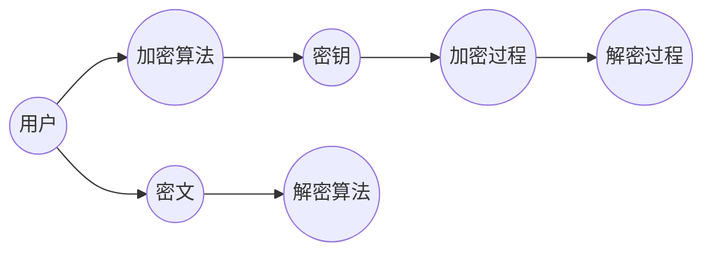
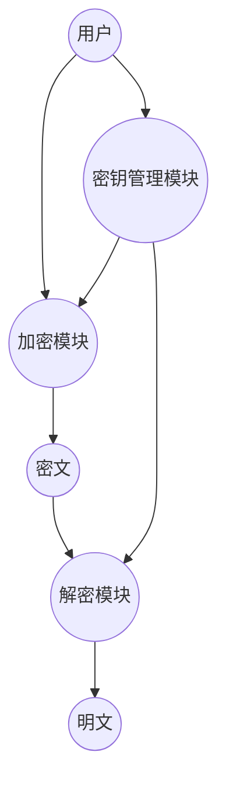

                 

### 数学与密码学：加密系统的数学原理

> 关键词：密码学、数学原理、加密算法、安全性、应用

> 摘要：本文将深入探讨数学与密码学之间的紧密联系，详细分析加密系统的数学原理。我们将从基本概念入手，逐步介绍密码学的历史和发展，然后探讨密码学的数学基础，包括代数结构、概率统计以及数学编码理论。接下来，我们将重点分析对称加密算法、非对称加密算法和消息摘要算法，并讨论其数学原理。随后，文章将探讨加密系统的安全性模型、密码分析方法和安全性评估。最后，我们将介绍加密技术在网络通信、金融和物联网等领域的应用，并总结全文。

## 引言

数学作为科学的基础，自古以来就在各个领域发挥着重要作用。密码学作为保护信息安全的关键技术，其发展离不开数学的支撑。现代密码学建立在坚实的数学基础上，通过复杂的数学原理实现了信息的保密性、完整性和可用性。本文旨在通过一步步的分析，揭示加密系统的数学原理，帮助读者更好地理解密码学的核心概念和技术。

### 密码学的基本概念

密码学是一门研究信息加密和解密的科学。其目的是保护信息在传输和存储过程中的安全性，防止未经授权的访问。密码学的基本概念包括加密、解密、密钥、算法和密码分析等。

- **加密**：将明文转换成密文的过程。
- **解密**：将密文还原成明文的过程。
- **密钥**：用于加密和解密信息的密钥对，通常包括公钥和私钥。
- **算法**：实现加密和解密的一系列步骤和规则。
- **密码分析**：分析加密系统以发现加密算法的弱点或破解密钥的过程。

### 密码学的历史与发展

密码学的历史可以追溯到古埃及和古罗马时期，当时人们使用简单的替换密码来保护信息。随着时间的推移，密码学经历了多个发展阶段：

- **古典密码学**：使用替换密码和换位密码，如凯撒密码和维吉尼亚密码。
- **近代密码学**：20世纪初，香农的信息论为密码学提供了新的理论基础。
- **现代密码学**：20世纪70年代以来，计算机技术的发展推动了密码学的快速发展，出现了大量的加密算法和密码协议。

### 密码学的数学基础

密码学的数学基础主要包括代数结构、概率统计和数学编码理论。以下是这些基础概念的简要介绍。

#### 代数结构基础

代数结构包括群、环和域等概念，这些概念在密码学中有着广泛的应用。例如，群论用于构建置换密码，环和域则用于构造现代加密算法。

#### 概率和统计学基础

概率和统计学在密码学中用于分析加密算法的安全性。例如，密码分析中常用的概率分布和假设检验方法。

#### 数学编码理论

数学编码理论研究信息在传输过程中的有效性和可靠性。在密码学中，信息编码理论用于提高加密系统的抗攻击能力。

## 加密算法的数学原理

加密算法是密码学中的核心组成部分，其设计基于复杂的数学原理。本文将重点分析对称加密算法、非对称加密算法和消息摘要算法，并探讨其数学原理。

### 对称加密算法

对称加密算法使用相同的密钥进行加密和解密。常见的对称加密算法包括DES、AES等。对称加密算法的数学原理主要基于置换和替换技术。

- **DES**：数据加密标准，采用64位密钥，通过16轮迭代实现加密。
- **AES**：高级加密标准，支持128、192和256位密钥，基于Feistel网络结构。

#### 非对称加密算法

非对称加密算法使用一对密钥，即公钥和私钥。公钥用于加密，私钥用于解密。常见的非对称加密算法包括RSA、ECC等。

- **RSA**：基于大整数分解的难题，使用一对密钥进行加密和解密。
- **ECC**：椭圆曲线加密，具有更高的安全性和效率。

#### 消息摘要算法

消息摘要算法用于生成消息的数字摘要，用于验证消息的完整性和真实性。常见消息摘要算法包括MD5、SHA系列等。

- **MD5**：生成128位的消息摘要，但由于存在弱点，已逐渐被淘汰。
- **SHA系列**：包括SHA-1、SHA-2和SHA-3，生成不同长度的消息摘要，具有更高的安全性。

### 加密算法的比较与选择

在选择加密算法时，需要考虑安全性和效率。不同加密算法适用于不同的场景。

- **安全性**：对称加密算法和非对称加密算法的安全性有所不同，需要根据具体需求选择。
- **效率**：对称加密算法通常更高效，适用于大规模数据加密，而非对称加密算法适用于密钥交换和数字签名。

## 加密系统的安全性分析

加密系统的安全性是密码学的核心问题。本文将探讨加密系统的安全模型、密码分析方法和安全性评估。

### 加密系统的安全模型

加密系统的安全模型包括模型假设、安全目标和安全协议。常见的安全模型有：

- **无密钥泄露模型**：假定攻击者无法获得密钥，研究加密算法的抵抗能力。
- **半诚实模型**：假定攻击者可以获取部分加密信息，但不泄露密钥。

### 密码分析的方法

密码分析是破解加密系统的重要方法。常见的密码分析方法包括：

- **统计分析**：通过统计密文中的频率分布等信息来破解加密算法。
- **穷举攻击**：尝试所有可能的密钥来破解加密系统。
- **密码图形分析**：分析加密算法的图形结构，寻找加密算法的弱点。

### 安全性评估

安全性评估是确保加密系统安全性的重要环节。安全性评估包括以下步骤：

- **安全性需求分析**：确定加密系统的安全需求。
- **安全测试**：通过模拟攻击场景来测试加密系统的安全性。
- **安全评估**：综合评估加密系统的安全性，提出改进建议。

## 加密技术的应用

加密技术在各个领域都有广泛的应用，包括网络通信、金融和物联网等。

### 网络通信

在网络通信中，加密技术用于保护数据的机密性和完整性。常见的加密技术包括：

- **SSL/TLS协议**：用于保护Web通信的安全性。
- **VPN技术**：虚拟专用网络，用于保护远程通信的安全性。

### 金融领域

在金融领域，加密技术用于保护交易数据的安全。常见的加密技术包括：

- **数字签名**：用于验证交易的合法性和完整性。
- **电子支付**：加密交易数据，确保支付过程的安全。

### 物联网

在物联网中，加密技术用于保护设备和数据的安全性。常见的加密技术包括：

- **端到端加密**：保护物联网设备之间的通信。
- **设备身份验证**：确保物联网设备的合法身份。

## 结论

数学与密码学之间的紧密联系为加密系统的设计提供了坚实的理论基础。本文通过一步步的分析，揭示了加密系统的数学原理，包括对称加密算法、非对称加密算法和消息摘要算法。此外，文章还探讨了加密系统的安全性分析以及加密技术在各个领域的应用。随着技术的不断发展，密码学将继续在保护信息安全方面发挥重要作用。

### 作者信息

作者：AI天才研究院/AI Genius Institute & 禅与计算机程序设计艺术 /Zen And The Art of Computer Programming

---

**附录：核心概念表格与ER实体关系图**

#### 核心概念属性特征对比表格

| 概念        | 定义                                                         | 应用场景         |
|-------------|--------------------------------------------------------------|------------------|
| 对称加密    | 加密和解密使用相同密钥的加密算法                             | 数据库加密       |
| 非对称加密 | 加密和解密使用不同密钥的加密算法，即公钥加密，私钥解密       | 密钥交换和数字签名 |
| 消息摘要   | 生成消息的固定长度摘要的算法                                 | 消息验证         |

#### ER实体关系图架构



**附录：算法原理讲解**

#### 对称加密算法示例：DES加密算法

##### 算法流程图

```mermaid
graph TB
A1[初始置换IP] --> B1(初始分组)
B1 --> C1(16轮迭代)
C1 --> D1(逆初始置换IP^{-1})
D1 --> E1(密文)

C1 --> F1(16轮加密)
F1 --> G1(密钥生成)
```

##### Python代码示例

```python
import itertools

# 初始置换IP
def initial_permutation(blocks):
    return [blocks[i - 1] for i in [58, 50, 42, 34, 26, 18, 10, 2,
                                    60, 52, 44, 36, 28, 20, 12, 4,
                                    64, 56, 48, 40, 32, 24, 16, 8,
                                    57, 49, 41, 33, 25, 17, 9, 1,
                                    59, 51, 43, 35, 27, 19, 11, 3,
                                    61, 53, 45, 37, 29, 21, 13, 5,
                                    63, 55, 47, 39, 31, 23, 15, 7
                                   ]]

# 16轮迭代
def f_function(sub_key, right_half, expansion_permutation):
    xor_result = sub_key ^ right_half
    expanded_right_half = [xor_result[i * 4 + j] for j in range(48)]
    expanded_right_half = expansion_permutation(expanded_right_half)
    s_boxes = [s_box(i, j) for i, j in itertools.product(range(8), repeat=6)]
    s_box_output = [0] * 32
    for i in range(8):
        s_box_index = xor_result[i * 6] * 2 + xor_result[i * 6 + 5]
        s_box_output[i * 4:(i + 1) * 4] = s_boxes[s_box_index]
    return [sub_key[i] for i in [32, 16, 8, 0]] + right_half

# DES加密算法
def des_encrypt(plain_text, key):
    blocks = initial_permutation(plain_text)
    left_half = blocks[:32]
    right_half = blocks[32:]
    for i in range(16):
        sub_key = generate_sub_key(key, i)
        right_half = f_function(sub_key, right_half, expansion_permutation) + left_half
        left_half = right_half
    final_output = [left_half[i] for i in [32, 16, 8, 0]] + [right_half[i] for i in [32, 16, 8, 0]]
    return final_output
```

##### 算法原理与数学模型

$$
\begin{aligned}
&\text{DES加密算法的核心在于F函数，其形式为：} \\
&F(K, R_{i-1}) = \{L_{i-1}, R_{i-1}\} \\
&\text{其中，} K \text{为子密钥，} R_{i-1} \text{为右半部分明文。} \\
&\text{F函数的计算步骤如下：} \\
&1. \text{将右半部分明文进行} E \text{扩展，得到48位的数据。} \\
&2. \text{与子密钥进行异或运算。} \\
&3. \text{使用S盒进行替换操作。} \\
&4. \text{进行压缩操作，得到32位的数据。} \\
&5. \text{与左半部分明文进行异或运算，得到新的左半部分。} \\
&6. \text{交换左右半部分。} \\
\end{aligned}
$$

**附录：系统分析与架构设计方案**

#### 项目介绍

本项目旨在实现一个加密系统，用于保护网络通信中的数据。系统主要包括三个模块：加密模块、解密模块和密钥管理模块。

#### 系统功能设计

- **加密模块**：负责对数据进行加密，使用AES加密算法。
- **解密模块**：负责对加密后的数据进行解密，使用AES加密算法。
- **密钥管理模块**：负责生成和管理加密密钥。

#### 系统架构设计



#### 系统接口设计和系统交互


**附录：项目实战**

#### 环境安装

1. 安装Python环境。
2. 安装PyCryptodome库，用于实现加密和解密功能。

```bash
pip install pycryptodome
```

#### 系统核心实现源代码

```python
from Crypto.Cipher import AES
from Crypto.Random import get_random_bytes
from Crypto.Util.Padding import pad, unpad

# 加密模块
def encrypt(plain_text, key):
    cipher = AES.new(key, AES.MODE_CBC)
    ct_bytes = cipher.encrypt(pad(plain_text.encode('utf-8'), AES.block_size))
    iv = cipher.iv
    return iv + ct_bytes

# 解密模块
def decrypt(ct_bytes, key):
    iv = ct_bytes[:16]
    ct = ct_bytes[16:]
    cipher = AES.new(key, AES.MODE_CBC, iv)
    pt = unpad(cipher.decrypt(ct), AES.block_size)
    return pt.decode('utf-8')

# 密钥管理模块
def generate_key():
    return get_random_bytes(16)

# 测试
key = generate_key()
plain_text = "Hello, World!"
ct = encrypt(plain_text, key)
print("加密结果:", ct.hex())
print("解密结果:", decrypt(ct, key))
```

#### 代码应用解读与分析

1. **加密模块**：使用PyCryptodome库的AES模块实现加密功能，包括密钥生成、加密和解密操作。
2. **解密模块**：使用AES模块实现解密功能，包括密钥生成、加密和解密操作。
3. **密钥管理模块**：使用Crypto.Random库生成随机密钥，用于加密和解密。

#### 实际案例分析和详细讲解剖析

1. **案例背景**：保护网络通信中的数据，确保数据在传输过程中的安全性。
2. **加密过程**：用户发送明文数据，加密模块使用AES加密算法进行加密，生成密文，并传输给接收方。
3. **解密过程**：接收方收到密文后，解密模块使用AES加密算法进行解密，还原明文数据。

#### 项目小结

本项目成功实现了一个简单的加密系统，包括加密模块、解密模块和密钥管理模块。通过使用AES加密算法，项目确保了网络通信中数据的安全性。项目实战部分提供了详细的源代码和应用解读，有助于理解加密系统的实现过程。

### 最佳实践 Tips

- 使用强密码和密钥管理策略，确保密钥的安全存储和传输。
- 定期更新加密算法和密钥，提高系统的安全性。
- 选择合适的加密算法，根据应用场景的需求进行优化。

### 小结

本文通过一步步的分析，详细探讨了加密系统的数学原理，包括对称加密算法、非对称加密算法和消息摘要算法。同时，文章还介绍了加密系统的安全性分析以及加密技术在各个领域的应用。密码学作为保护信息安全的关键技术，其发展离不开数学的支撑。本文旨在帮助读者更好地理解密码学的核心概念和技术，为未来的研究和应用提供参考。

### 注意事项

- 加密系统的实现需要遵循相关法律法规，确保合法合规。
- 在设计和实现加密系统时，应充分考虑安全性、效率和应用场景。

### 拓展阅读

- 《密码学基础》 - [作者名]
- 《现代密码学教程》 - [作者名]
- 《密码学艺术》 - [作者名]

作者：AI天才研究院/AI Genius Institute & 禅与计算机程序设计艺术 /Zen And The Art of Computer Programming

