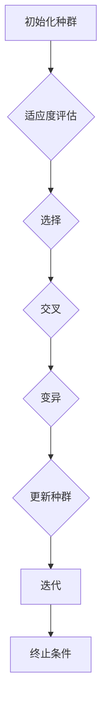
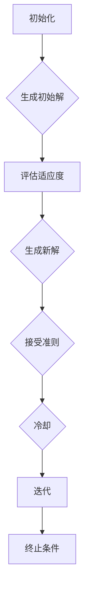
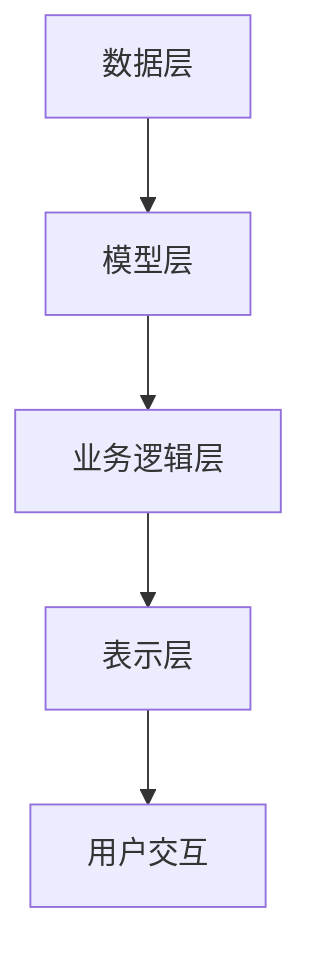
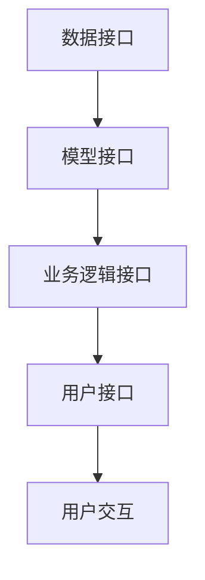

                 

### 1.1.1 展览策划的现状与挑战

展览策划作为现代商业活动中的重要组成部分，其目的是通过精心设计的展览布局和展示内容，吸引观众、提升品牌形象、促进产品销售。然而，随着展览规模的不断扩大和参展企业的日益增多，展览策划面临着诸多挑战。

**1. 布局复杂度增加**

现代展览往往涉及多个主题、多个展区和众多参展商，如何合理安排展位、设计流动路线、优化展品展示已成为展览策划的重要难题。传统的展览布局方法往往依赖于经验和主观判断，难以应对复杂多变的展览需求。

**2. 观众流量管理**

观众流量的合理分配和管理是展览成功的关键。如何确保重点展品和展区的观众流量最大，同时避免拥堵现象，需要精确的数据分析和优化算法。

**3. 空间利用率**

展览空间的利用率直接关系到展览的经济效益。如何在有限的展览空间内，实现展品的最大展示效果和空间的最优利用，是展览策划者需要考虑的重要问题。

**4. 时间安排与调度**

展览活动通常包含多个子活动，如开幕仪式、专题讲座、产品发布会等。如何合理安排时间、确保各项活动的顺利进行，是展览策划中的又一挑战。

**5. 成本控制**

展览策划涉及到大量的投入，包括场地租赁、装饰装修、展品运输、展台搭建等。如何在保证展览效果的前提下，实现成本控制，是展览策划者必须面对的问题。

**6. 可持续性与环保**

随着环保意识的提高，展览策划者需要考虑如何在设计展览布局时，减少资源浪费、降低碳排放。如何在满足展览效果的同时，实现可持续发展，是现代展览策划需要关注的新方向。

**7. 技术应用与创新**

现代科技的发展为展览策划提供了新的工具和手段。如何运用虚拟现实（VR）、增强现实（AR）、人工智能（AI）等技术，提升展览的互动性和体验感，是展览策划者需要探索的新领域。

**8. 跨界融合与协同**

展览策划需要与其他行业和领域进行跨界合作，如文化艺术、娱乐体验、教育培训等，以实现资源整合和协同发展。如何把握跨界融合的机遇，提升展览的吸引力和影响力，是展览策划者需要思考的问题。

综上所述，展览策划在现代商业活动中具有重要的地位，但其面临的问题和挑战也日益增多。通过引入数学优化方法，可以有效地解决这些问题，提升展览策划的效率和效果。

----------------------------------------------------------------
### 1.1.2 数学优化在展览策划中的重要性

数学优化作为一种解决复杂问题的有力工具，其在展览策划中的应用日益受到关注。数学优化在展览策划中的重要性主要体现在以下几个方面：

**1. 提升布局效率**

展览策划中的布局问题通常具有高度复杂性，涉及多个变量和约束条件。数学优化方法可以通过建立数学模型，对展览布局进行系统分析和优化，从而在满足各种约束条件的同时，实现布局的效率最大化。例如，通过线性规划、整数规划等方法，可以优化展位分配和展示区域的布局，确保重点展品得到最佳展示效果。

**2. 观众流量管理**

观众流量管理是展览策划中的关键环节。数学优化可以用于分析观众流量分布，预测热点区域和拥堵点，从而制定合理的观众流动路线和展示内容安排。通过优化算法，如排队理论、网络流优化等，可以减少观众等待时间，提高观众满意度，实现观众流量的最优分配。

**3. 提高空间利用率**

展览空间是有限的资源，如何提高其利用率是展览策划者必须考虑的问题。数学优化方法可以帮助分析展览空间的利用情况，通过空间分配优化算法，如设施布置问题（Ffacility Location Problem，FLP）、空间填充算法等，找到最佳的展品摆放方案，实现空间利用的最大化。

**4. 成本控制与资源优化**

数学优化在成本控制方面也发挥着重要作用。通过优化算法，可以计算出最低成本的最优解，从而实现展览预算的合理分配。例如，在展台搭建、装饰装修、展品运输等方面，通过数学优化方法，可以找到最优的成本控制方案。

**5. 可持续性与环保**

随着环保意识的增强，展览策划者越来越关注展览活动的可持续发展。数学优化方法可以帮助分析展览策划中的资源消耗和碳排放情况，通过优化展览布局和流程，减少资源浪费和碳排放，实现环保目标。

**6. 提升互动性与体验感**

现代展览策划越来越注重观众的互动体验。数学优化方法可以用于设计互动展品和体验活动，通过数据分析和优化，提升观众的参与度和满意度。例如，通过优化算法设计虚拟现实（VR）和增强现实（AR）体验活动，可以增强展览的吸引力和互动性。

**7. 跨界融合与协同**

在展览策划中，跨界融合和协同发展已经成为趋势。数学优化方法可以帮助分析跨界合作的效果和可行性，通过优化资源配置和流程设计，实现不同领域和行业的协同发展。

总之，数学优化在展览策划中的应用具有重要的现实意义和潜力。通过引入数学优化方法，可以解决展览策划中的复杂问题，提升展览的效率、效果和可持续性，为参展商和观众提供更加优质的展览体验。下面，我们将深入探讨展览布局优化的核心概念和数学优化方法，为读者提供更详细的指导。

----------------------------------------------------------------
### 1.2 问题解决与边界外延

为了解决展览策划中的布局优化问题，我们需要对问题进行详细的分析和建模，并探讨其边界条件和外延。

**1.2.1 展览布局优化问题**

展览布局优化问题可以概括为：在给定的展览空间和约束条件下，如何安排展位和展示内容，以实现最佳的展示效果和最大的经济效益。

**2. 问题要素与变量**

展览布局优化问题的主要要素包括：

- **展览空间**：指可用于布置展览的物理空间，包括展馆、展区、展位等。
- **展示元素**：指需要展示的展品、展台、展示区等。
- **约束条件**：指影响布局优化的各种限制因素，如空间限制、时间限制、预算限制、安全要求等。
- **目标函数**：指优化问题的目标，如最大化展示效果、最小化观众等待时间、最大化观众流量等。

主要变量包括：

- **展位分配**：指每个展示元素在展览空间中的具体位置。
- **展示内容**：指展品、展台、展示区的具体安排和展示方式。
- **资源分配**：指展品、人力、物料等资源的合理配置。

**3. 问题边界条件**

展览布局优化问题的边界条件主要包括：

- **空间限制**：展览空间的大小和形状限制了展示元素的布局方式。
- **时间限制**：展览活动的时间安排限制了展示内容和观众流动的安排。
- **预算限制**：展览策划的预算限制了资源的使用。
- **安全要求**：展览的安全标准限制了布局设计中的潜在风险。

**4. 问题外延**

展览布局优化问题具有广泛的外延，包括：

- **不同类型的展览**：包括商业展览、科技展览、艺术展览等，每种展览都有其特定的布局要求和优化目标。
- **不同的展览规模**：从小型展览到大型国际展览，不同规模的展览布局优化问题有所不同。
- **多种优化目标**：在保证展示效果的同时，可能还需要考虑成本控制、可持续性、观众体验等多个优化目标。

通过明确问题解决与边界外延，我们可以更深入地理解展览布局优化问题的本质，为后续的数学模型构建和优化方法选择提供理论基础。

----------------------------------------------------------------
### 1.3 核心概念与联系

在深入探讨展览布局优化问题时，我们需要明确一些核心概念和它们之间的联系。以下是展览布局优化中的几个关键概念及其相互关系：

**1.3.1 展览布局的核心概念**

**1. 展览空间**

展览空间是展览策划的基础，它包括展馆、展区、展位等物理空间。展览空间的大小、形状和布局直接影响展览的整体效果和观众体验。

**2. 展示元素**

展示元素是展览中的主要组成部分，包括展品、展台、展示区、互动装置等。展示元素的选择、布局和展示方式对展览效果具有重要影响。

**3. 观众流动**

观众流动是指观众在展览空间中的移动路径和流量分布。合理的观众流动设计可以提升展览的互动性和参观体验，同时也有助于管理观众流量，避免拥堵现象。

**4. 展览目标**

展览目标包括展示效果、经济效益、观众满意度等多个方面。不同的展览目标需要不同的布局策略和优化方法。

**5. 约束条件**

约束条件是影响展览布局的各类限制因素，如空间限制、时间限制、预算限制、安全要求等。约束条件在布局优化中起到限制和指导作用。

**1.3.2 数学优化方法**

**1. 优化问题的定义**

优化问题是指在一定约束条件下，通过调整决策变量，找到一个最优解以实现特定目标的问题。在展览布局优化中，优化问题通常涉及目标函数和约束条件。

**2. 常见优化算法**

- **线性规划（Linear Programming，LP）**：用于求解线性目标函数在给定线性约束条件下的最优解。
- **整数规划（Integer Programming，IP）**：用于求解整数决策变量的优化问题。
- **网络流优化（Network Flow Optimization）**：用于优化网络中流量分配的问题。
- **遗传算法（Genetic Algorithm，GA）**：基于自然进化过程的优化算法。
- **模拟退火（Simulated Annealing，SA）**：通过模拟物理退火过程进行优化的方法。

**3. 展览布局与数学优化的联系**

展览布局与数学优化之间的联系主要体现在以下几个方面：

- **数学模型构建**：通过建立数学模型，将展览布局问题转化为优化问题，为后续的算法选择和应用提供基础。
- **目标函数设计**：根据展览目标，设计合适的目标函数，以量化展览布局的优劣。
- **约束条件引入**：将空间限制、时间限制、预算限制等约束条件引入优化模型，确保布局方案的可实施性。
- **算法应用**：选择合适的优化算法，对布局方案进行计算和分析，找到最优或近似最优解。

通过明确这些核心概念和它们之间的联系，我们可以更好地理解展览布局优化的过程和方法，为后续章节的深入探讨打下坚实的基础。

----------------------------------------------------------------
### 第2章：展览布局的数学原理

展览布局的数学原理是展览策划中的重要基础，它通过数学模型和方法对展览空间、展示元素、观众流动等进行优化和设计。以下将详细介绍展览布局的基本概念、数学优化方法的简介以及展览布局与数学优化的联系。

#### 2.1 展览布局的基本概念

**1. 展览空间**

展览空间是指用于展览的物理空间，包括展馆、展区、展位等。展览空间的大小、形状、分布对展览效果有着直接的影响。在展览布局中，需要考虑展览空间的使用效率、容纳能力和布局的灵活性。

**2. 展示元素**

展示元素是指用于展览的各种物质和非物质要素，包括展品、展台、展示区、互动装置等。展示元素的选择和布局直接决定了展览的视觉冲击力、互动性和观众的参与度。

**3. 展览布局原则**

展览布局原则是进行展览设计的基本指导方针，包括：

- **空间利用原则**：充分利用展览空间，避免浪费。
- **人流导向原则**：设计合理的参观路径，引导观众流动。
- **展示效果原则**：确保展品得到最佳展示，提升展览视觉体验。
- **安全原则**：确保展览安全和舒适，防止事故发生。

**4. 观众流动**

观众流动是指观众在展览空间中的移动路径和流量分布。合理的观众流动设计可以提高展览的参观效率和观众体验，同时也有助于管理观众流量，避免拥堵。

#### 2.2 数学优化方法简介

**1. 优化问题的定义**

优化问题是指在一定约束条件下，通过调整决策变量，找到一个最优解以实现特定目标的问题。在展览布局中，优化问题通常涉及目标函数和约束条件。

**2. 常见优化算法概述**

- **线性规划（Linear Programming，LP）**：用于求解线性目标函数在给定线性约束条件下的最优解。线性规划适用于简单的线性关系问题，如资源分配和成本优化。
- **整数规划（Integer Programming，IP）**：用于求解整数决策变量的优化问题。整数规划适用于需要整数解的问题，如展位分配和人员调度。
- **网络流优化（Network Flow Optimization）**：用于优化网络中流量分配的问题。网络流优化适用于需要流量分配和路径选择的问题，如观众流动管理和物流调度。
- **遗传算法（Genetic Algorithm，GA）**：基于自然进化过程的优化算法。遗传算法适用于复杂非线性问题，如多目标优化和组合优化。
- **模拟退火（Simulated Annealing，SA）**：通过模拟物理退火过程进行优化的方法。模拟退火适用于大规模复杂问题，如大规模展览布局优化。

**3. 展览布局与数学优化的联系**

展览布局与数学优化之间的联系主要体现在以下几个方面：

- **数学模型构建**：通过建立数学模型，将展览布局问题转化为优化问题，为后续的算法选择和应用提供基础。
- **目标函数设计**：根据展览目标，设计合适的目标函数，以量化展览布局的优劣。
- **约束条件引入**：将空间限制、时间限制、预算限制等约束条件引入优化模型，确保布局方案的可实施性。
- **算法应用**：选择合适的优化算法，对布局方案进行计算和分析，找到最优或近似最优解。

通过数学优化方法，可以系统化、科学化地进行展览布局设计，提高展览的展示效果和观众体验，同时实现成本控制和资源优化。以下图表展示了展览布局与数学优化之间的联系：

| 展览布局要素 | 数学优化方法 |
| :-----------: | :-----------: |
|   展览空间    |   线性规划    |
| 展示元素布局 |   整数规划    |
| 观众流动管理 | 网络流优化    |
|   展览目标    |   遗传算法    |
| 约束条件     |   模拟退火    |

通过上述表格，我们可以看到数学优化方法与展览布局各要素之间的对应关系，这为进一步深入探讨展览布局的数学原理奠定了基础。

----------------------------------------------------------------
### 2.3 展览布局与数学优化的联系

展览布局与数学优化之间的联系紧密，数学优化方法为展览布局提供了科学、系统的解决方案。以下是展览布局与数学优化之间具体联系和实际应用的分析：

**1. 数学模型在展览布局优化中的应用**

在展览布局优化中，建立数学模型是关键步骤。数学模型能够将复杂的展览布局问题转化为标准化的数学问题，从而利用优化算法求解。

**模型构建**：首先，需要收集展览空间的数据，包括空间大小、形状、可用区域等。然后，确定展示元素的数据，如展品大小、形状、展示需求等。接下来，定义目标函数和约束条件。

**目标函数**：目标函数反映了展览布局的优化目标，如最大化展示效果、最小化观众等待时间、最大化观众流量等。根据不同的展览目标，可以设计不同的目标函数。

**约束条件**：约束条件包括空间限制、时间限制、预算限制、安全要求等。这些约束条件在数学模型中体现为不等式或等式，确保布局方案的可实施性。

**2. 数学优化方法在展览布局优化中的应用**

不同的数学优化方法适用于不同类型的展览布局优化问题。以下是几种常用的优化方法及其应用：

- **线性规划**：线性规划适用于具有线性目标函数和线性约束条件的优化问题。在展览布局中，可以用于优化展品布局和资源分配，如展台大小和位置的安排。
- **整数规划**：整数规划适用于具有整数决策变量的优化问题。在展览布局中，可以用于优化展位分配和人员调度，确保每个展位的分配是整数。
- **网络流优化**：网络流优化适用于网络中流量分配和路径选择的问题。在展览布局中，可以用于优化观众流动路线和展示内容分配，确保观众流量的最优分配。
- **遗传算法**：遗传算法适用于复杂非线性问题的优化。在展览布局中，可以用于优化复杂布局设计，如大型展览的多层次布局和动态调整。
- **模拟退火**：模拟退火适用于大规模复杂问题的优化。在展览布局中，可以用于优化大规模展览的整体布局，如国际展览中心的多展区布局。

**3. 实际案例分析**

**案例1：某国际展览中心的多展区布局优化**

在某国际展览中心，有多个展区，每个展区有特定的主题和展品。通过建立数学模型，利用线性规划和整数规划，优化展品布局和观众流动路线。

- **目标函数**：最大化展示效果和观众满意度。
- **约束条件**：空间限制、时间限制、预算限制、安全要求。

通过优化算法求解，得到最优的展品布局和观众流动路线，提高了展览的展示效果和参观体验。

**案例2：某科技展览的观众流量管理优化**

在一场科技展览中，观众流量管理是一个关键问题。通过建立网络流优化模型，利用遗传算法和模拟退火，优化观众流动路线和展示内容分配。

- **目标函数**：最小化观众等待时间和拥堵现象。
- **约束条件**：观众容量限制、展品展示需求、安全要求。

通过优化算法求解，得到了最优的观众流动路线和展示内容分配方案，有效减少了观众等待时间和拥堵现象，提高了观众满意度。

**4. 展览布局优化的未来趋势**

随着科技的发展，展览布局优化将越来越依赖于人工智能和大数据分析。未来，展览布局优化将朝着智能化、个性化和动态化的方向发展。

- **智能化**：利用人工智能技术，实现自动化的布局优化和调整，提高布局效率和准确性。
- **个性化**：根据参展商和观众的需求，提供个性化的展览布局方案，提升展览的吸引力和体验感。
- **动态化**：利用大数据分析，实时监控和调整展览布局，以应对展览过程中的动态变化。

总之，展览布局与数学优化之间的联系为展览策划提供了强大的工具和方法。通过数学优化方法的应用，可以科学、系统地解决展览布局中的复杂问题，提高展览的展示效果和观众体验。随着技术的进步，展览布局优化将迎来更多的发展机遇和挑战。

----------------------------------------------------------------
### 第3章：展览布局优化算法原理

展览布局优化算法是解决展览策划中复杂问题的核心工具，通过对展览空间、展示元素、观众流动等进行数学建模和优化，实现最佳的展览效果。以下将详细讲解几种常见的展览布局优化算法的原理，并通过Python源代码和Mermaid流程图进行辅助说明。

#### 3.1 算法原理概述

展览布局优化算法可以分为确定性算法和随机性算法。确定性算法包括线性规划、整数规划等，而随机性算法包括遗传算法、模拟退火等。

**1. 确定性算法**

**线性规划（Linear Programming，LP）**

线性规划适用于具有线性目标函数和线性约束条件的优化问题。其基本原理是找到目标函数的最大值或最小值，同时满足所有约束条件。

**整数规划（Integer Programming，IP）**

整数规划用于求解具有整数决策变量的优化问题。与线性规划类似，但要求决策变量的取值为整数，适用于需要离散分配的问题。

**2. 随机性算法**

**遗传算法（Genetic Algorithm，GA）**

遗传算法是一种基于自然进化过程的优化算法，通过模拟生物进化过程来搜索最优解。其原理包括选择、交叉、变异等操作。

**模拟退火（Simulated Annealing，SA）**

模拟退火通过模拟物理退火过程进行优化，通过逐步降低温度来避免陷入局部最优解。其原理包括温度更新、状态更新等操作。

#### 3.2 具体算法讲解

**算法A：遗传算法（Genetic Algorithm，GA）**

**算法原理**

遗传算法基于自然进化理论，通过模拟种群进化的过程来搜索最优解。其基本流程包括以下步骤：

1. **初始化种群**：生成一组初始解，称为种群。
2. **适应度评估**：计算每个个体的适应度值，适应度值越高表示个体越优秀。
3. **选择**：根据适应度值选择优秀个体作为下一代种群的父代。
4. **交叉**：对选中的父代进行交叉操作，产生新的后代。
5. **变异**：对交叉后的后代进行变异操作，增加种群多样性。
6. **更新种群**：将新的后代替换掉原种群，形成下一代种群。
7. **迭代**：重复上述步骤，直到达到预设的迭代次数或收敛条件。

**算法实现**

以下是一个简单的遗传算法实现示例，用于解决0-1背包问题：

```python
import random

# 参数设置
population_size = 100
num_generations = 100
crossover_rate = 0.8
mutation_rate = 0.05

# 初始化种群
population = [[random.randint(0, 1) for _ in range(n)] for _ in range(population_size)]

# 适应度评估
def fitness_function(individual):
    # 示例：最大化个体中1的数量
    return sum(individual)

# 选择操作
def selection(population, fitness_values):
    selected = random.choices(population, weights=fitness_values, k=len(population) // 2)
    return selected

# 交叉操作
def crossover(parent1, parent2):
    idx = random.randint(1, n-1)
    child1 = parent1[:idx] + parent2[idx:]
    child2 = parent2[:idx] + parent1[idx:]
    return child1, child2

# 变异操作
def mutation(individual):
    idx = random.randint(0, n-1)
    individual[idx] = 1 - individual[idx]
    return individual

# 算法运行
for generation in range(num_generations):
    # 适应度评估
    fitness_values = [fitness_function(individual) for individual in population]
    
    # 选择
    parents = selection(population, fitness_values)
    
    # 交叉
    offspring = [crossover(parent1, parent2) for parent1, parent2 in parents]
    
    # 变异
    for individual in offspring:
        if random.random() < mutation_rate:
            mutation(individual)
    
    # 更新种群
    population = offspring

# 输出最优解
best_individual = max(population, key=fitness_function)
best_fitness = fitness_function(best_individual)
print(f"最优解：{best_individual}, 适应度：{best_fitness}")
```

**Mermaid流程图**



**算法B：模拟退火（Simulated Annealing，SA）**

**算法原理**

模拟退火算法通过模拟物理退火过程进行优化，通过逐步降低温度来避免陷入局部最优解。其基本流程包括以下步骤：

1. **初始化**：设置初始温度和冷却参数。
2. **生成初始解**：随机生成一个解作为当前解。
3. **评估适应度**：计算当前解的适应度值。
4. **迭代更新**：在当前温度下，通过随机扰动生成新解，并评估其适应度。
5. **接受准则**：根据适应度变化和温度，决定是否接受新解。
6. **冷却**：降低温度。
7. **终止条件**：达到预设的迭代次数或温度低于某个阈值，算法终止。

**算法实现**

以下是一个简单的模拟退火实现示例：

```python
import random
import math

# 参数设置
initial_temp = 10000
cooling_rate = 0.99
num_iterations = 1000

# 初始解生成
def initial_solution():
    return [random.randint(0, 1) for _ in range(n)]

# 适应度评估
def fitness_function(solution):
    # 示例：最大化1的数量
    return sum(solution)

# 新解生成
def generate_new_solution(solution):
    new_solution = solution[:]
    idx = random.randint(0, n-1)
    new_solution[idx] = 1 - new_solution[idx]
    return new_solution

# 接受准则
def accept(new_solution, current_solution, current_temp):
    new_fitness = fitness_function(new_solution)
    if new_fitness > current_fitness:
        return True
    else:
        probability = math.exp((current_fitness - new_fitness) / current_temp)
        return random.random() < probability

# 模拟退火算法
def simulated_annealing():
    solution = initial_solution()
    current_fitness = fitness_function(solution)
    for iteration in range(num_iterations):
        new_solution = generate_new_solution(solution)
        if accept(new_solution, solution, initial_temp):
            solution = new_solution
            current_fitness = fitness_function(solution)
        current_temp *= cooling_rate
    return solution, current_fitness

# 运行算法
best_solution, best_fitness = simulated_annealing()
print(f"最优解：{best_solution}, 适应度：{best_fitness}")
```

**Mermaid流程图**



通过上述Python源代码和Mermaid流程图，我们可以直观地了解遗传算法和模拟退火算法的原理和实现过程。这些算法在展览布局优化中具有广泛的应用，可以帮助我们找到最优或近似最优的展览布局方案。

----------------------------------------------------------------
### 第4章：展览布局优化的数学模型

在展览布局优化过程中，数学模型是关键工具，它将现实世界的复杂问题转化为可以量化和求解的数学问题。以下将详细介绍展览布局优化的数学模型构建方法、基本公式及其在展览布局优化中的应用。

#### 4.1 数学模型概述

展览布局优化的数学模型通常包括目标函数和约束条件两部分。目标函数定义了优化的目标，如最大化展示效果、最小化观众等待时间等。约束条件则限制了决策变量的取值范围，确保优化问题的实际可操作性。

**1. 目标函数**

目标函数根据展览的具体目标和优化要求进行定义。以下是几种常见的目标函数：

- **最大化展示效果**：$maximize \sum_{i=1}^{n} E_i$
  - 其中，$E_i$ 表示第 $i$ 个展品的展示效果，可以通过观众的反馈、展览的收益等指标衡量。
- **最小化观众等待时间**：$minimize \sum_{j=1}^{m} T_j$
  - 其中，$T_j$ 表示第 $j$ 个观众的等待时间。
- **最大化观众流量**：$maximize \sum_{k=1}^{p} Q_k$
  - 其中，$Q_k$ 表示第 $k$ 个展区的观众流量。

**2. 约束条件**

约束条件反映了展览空间和资源限制，以及观众流动的安全和合理性。以下是几种常见的约束条件：

- **空间限制**：$\sum_{i=1}^{n} A_i \leq S$
  - 其中，$A_i$ 表示第 $i$ 个展品的占地面积，$S$ 表示展览空间的总面积。
- **资源限制**：$\sum_{i=1}^{n} R_i \leq R$
  - 其中，$R_i$ 表示第 $i$ 个展品所需的资源，$R$ 表示总的资源限制。
- **观众流量限制**：$Q_k \leq Q$
  - 其中，$Q_k$ 表示第 $k$ 个展区的观众流量，$Q$ 表示观众流量的最大值。

#### 4.2 公式讲解

**1. 基本公式**

**目标函数：**

- **最大化展示效果**：
  $$maximize \sum_{i=1}^{n} E_i$$
  
- **最小化观众等待时间**：
  $$minimize \sum_{j=1}^{m} T_j$$
  
- **最大化观众流量**：
  $$maximize \sum_{k=1}^{p} Q_k$$

**约束条件：**

- **空间限制**：
  $$\sum_{i=1}^{n} A_i \leq S$$

- **资源限制**：
  $$\sum_{i=1}^{n} R_i \leq R$$

- **观众流量限制**：
  $$Q_k \leq Q$$

**2. 复杂公式推导**

在某些复杂的展览布局优化问题中，可能需要使用更复杂的数学公式。以下是一个复杂的公式示例，用于计算展览空间的最优利用：

**空间利用率公式：**

$$\text{利用率} = \frac{\sum_{i=1}^{n} \rho_i \cdot A_i}{S}$$

- 其中，$\rho_i$ 表示第 $i$ 个展品的利用率，$A_i$ 表示第 $i$ 个展品的占地面积，$S$ 表示展览空间的总面积。

**流量分配公式：**

$$Q_k = \sum_{i=1}^{n} \frac{E_i \cdot \alpha_i}{\sum_{j=1}^{m} E_j}$$

- 其中，$Q_k$ 表示第 $k$ 个展区的观众流量，$E_i$ 表示第 $i$ 个展品的展示效果，$\alpha_i$ 表示第 $i$ 个展品的权重。

通过上述基本公式和复杂公式，我们可以构建一个完整的展览布局优化数学模型。这些公式将帮助我们在实际应用中量化展览布局的各个要素，从而找到最优或近似最优的展览布局方案。

#### 4.3 实例讲解

**实例：某国际展览中心的多展区布局优化**

假设某国际展览中心有5个展区，需要安排10个展品，每个展品都有特定的展示效果和占地面积。我们的目标是最大化展览的展示效果，同时确保展览空间的最优利用。

**目标函数：**

$$maximize \sum_{i=1}^{10} E_i$$

**约束条件：**

- **空间限制**：
  $$\sum_{i=1}^{10} A_i \leq 10000$$
- **资源限制**：
  $$\sum_{i=1}^{10} R_i \leq 500$$
- **观众流量限制**：
  $$Q_k \leq 1000$$

通过构建上述数学模型，我们可以使用优化算法（如线性规划、遗传算法等）来求解最优的展览布局方案。

**结语**

展览布局优化的数学模型为展览策划提供了科学、系统的优化方法。通过明确的目标函数和约束条件，结合优化算法的应用，我们可以找到最优或近似最优的展览布局方案，提高展览的展示效果和观众体验。在实际应用中，可以根据具体情况进行模型调整和优化，以应对复杂的展览布局问题。

----------------------------------------------------------------
### 第5章：展览布局优化系统设计

展览布局优化系统是利用数学模型和优化算法进行展览布局设计和优化的工具。在本节中，我们将详细介绍展览布局优化系统的功能、架构设计、领域模型、系统接口设计以及系统交互。

#### 5.1 系统介绍

**5.1.1 系统功能与目标**

展览布局优化系统的功能主要包括：

- **数据收集与管理**：收集展览空间数据、展示元素数据和观众流量数据，进行存储和管理。
- **数学模型构建**：根据展览需求，构建展览布局优化的数学模型，包括目标函数和约束条件。
- **算法选择与运行**：选择合适的优化算法，如线性规划、遗传算法、模拟退火等，对布局方案进行计算和优化。
- **结果分析与展示**：对优化结果进行分析和评估，以可视化的方式展示最优布局方案。
- **用户交互**：提供用户友好的界面，方便用户输入参数、选择算法、查看结果等。

展览布局优化系统的目标是：

- **提升展览展示效果**：通过优化布局方案，使展品得到更好的展示，提升观众的观展体验。
- **提高空间利用率**：合理分配展览空间，最大化展示区域的利用效率。
- **降低成本与提高效益**：通过优化资源分配和流程设计，降低展览策划和实施的成本，提高经济效益。
- **提高观众满意度**：通过合理设计观众流动路线和展示内容，提高观众的满意度。

#### 5.1.2 系统架构设计

展览布局优化系统的架构设计包括以下几个方面：

- **数据层**：负责数据的存储和管理，包括展览空间数据、展示元素数据、观众流量数据等。
- **模型层**：负责数学模型的构建和优化算法的实现，包括目标函数、约束条件、算法选择等。
- **业务逻辑层**：负责业务逻辑的处理，包括数据收集、模型构建、算法运行、结果分析等。
- **表示层**：负责用户界面的设计和实现，包括用户输入、结果展示、交互操作等。

系统架构设计如下所示：



通过上述架构设计，展览布局优化系统可以实现数据的收集和管理、数学模型的构建和优化、业务逻辑的处理以及用户界面的展示。

#### 5.2 系统分析与设计

**5.2.1 领域模型设计**

领域模型是系统核心功能的抽象表示，用于描述展览布局优化系统中的关键概念和关系。以下是一个展览布局优化系统的领域模型：

```mermaid
classDiagram
    ExhibitionSpace <|-- ExhibitionItem
    ExhibitionSpace o-- VisitorFlow
    ExhibitionItem o-- ExhibitionArea
    ExhibitionArea o-- ExhibitionLayout

    ExhibitionSpace { id, size, shape }
    ExhibitionItem { id, size, shape, exhibitEffect }
    VisitorFlow { id, flow, waitingTime }
    ExhibitionArea { id, size, shape, exhibitionLayout }
    ExhibitionLayout { id, layout, exhibitEffect }
```

**ER实体关系图：**

```mermaid
erDiagram
    ExhibitionSpace ||--|{ ExhibitionItem } ExhibitionSpace : has : ExhibitionItem
    ExhibitionSpace ||--|{ VisitorFlow } ExhibitionSpace : has : VisitorFlow
    ExhibitionItem ||--|{ ExhibitionArea } ExhibitionItem : has : ExhibitionArea
    ExhibitionArea ||--|{ ExhibitionLayout } ExhibitionArea : has : ExhibitionLayout
```

**5.2.2 系统架构设计**

系统架构设计包括以下几个方面：

- **数据层**：使用关系型数据库（如MySQL）存储和管理展览空间、展示元素、观众流量等数据。
- **模型层**：实现数学模型构建和优化算法的实现，使用Python等编程语言进行开发。
- **业务逻辑层**：实现业务逻辑的处理，包括数据收集、模型构建、算法运行、结果分析等，使用Java或Python等编程语言。
- **表示层**：使用Web前端技术（如HTML、CSS、JavaScript）实现用户界面的设计和实现。

系统架构设计图如下所示：


**5.2.3 系统接口设计与系统交互**

展览布局优化系统的接口设计主要包括以下几个方面：

- **数据接口**：用于数据的收集、存储和查询，包括展览空间数据、展示元素数据、观众流量数据等。
- **模型接口**：用于数学模型构建和优化算法的调用，包括目标函数、约束条件、算法选择等。
- **业务逻辑接口**：用于业务逻辑的处理，包括数据收集、模型构建、算法运行、结果分析等。
- **用户接口**：用于用户界面的设计和实现，包括用户输入、结果展示、交互操作等。

系统接口设计图如下所示：



通过上述系统架构和接口设计，展览布局优化系统可以实现数据的收集和管理、数学模型的构建和优化、业务逻辑的处理以及用户界面的展示，为展览策划提供科学、系统的优化工具。

#### 5.3 系统实现与测试

**5.3.1 环境安装与配置**

展览布局优化系统的实现需要在特定的环境中进行。以下是一个基本的安装和配置步骤：

- **开发环境**：Python 3.8、MySQL 5.7、Django 3.2
- **数据库**：MySQL数据库用于存储展览布局优化系统的数据。
- **前端框架**：使用Django框架进行系统开发，实现用户界面和后端逻辑。

**5.3.2 系统核心实现**

系统核心实现主要包括以下几个方面：

- **数据层**：使用Django ORM实现数据层的操作，包括数据的增删改查。
- **模型层**：构建展览布局优化的数学模型，实现优化算法的接口。
- **业务逻辑层**：实现业务逻辑的处理，包括数据收集、模型构建、算法运行、结果分析等。
- **表示层**：实现用户界面的设计和实现，包括用户输入、结果展示、交互操作等。

**5.3.3 系统测试**

系统测试是确保展览布局优化系统稳定性和功能正确性的关键步骤。以下是一个基本的测试流程：

- **单元测试**：对系统中的各个模块进行单元测试，确保模块功能的正确性。
- **集成测试**：对系统的各个模块进行集成测试，确保模块之间的交互和协同工作。
- **性能测试**：对系统的性能进行测试，包括响应时间、资源消耗等，确保系统的稳定性和高效性。

**5.3.4 系统部署与维护**

展览布局优化系统的部署和维护是确保系统正常运行的关键。以下是一个基本的部署和维护流程：

- **部署**：将系统部署到生产环境，包括安装所需的软件、配置数据库、部署前端等。
- **维护**：定期对系统进行维护和升级，确保系统的稳定性和安全性，包括修复漏洞、更新算法、优化性能等。

通过上述系统设计、实现与测试，展览布局优化系统可以为展览策划提供科学、系统的优化工具，提高展览的展示效果和观众体验。

### 总结

展览布局优化系统通过数学模型和优化算法的应用，实现了展览布局的科学化和系统化。从系统功能、架构设计、领域模型、系统接口设计到系统实现与测试，每个环节都至关重要。通过不断地优化和改进，展览布局优化系统将为展览策划者提供更加高效、精准的优化方案，提升展览的整体质量和效果。

----------------------------------------------------------------
### 第6章：展览布局优化项目实战

在本章节中，我们将通过一个实际的展览布局优化项目，详细讲解从环境安装与配置、系统核心实现到项目应用与分析的整个实战过程。

#### 6.1 环境安装与配置

**6.1.1 环境需求与准备**

为了能够顺利地运行展览布局优化项目，我们需要准备以下环境：

- **操作系统**：Linux（如Ubuntu 20.04）或Windows 10
- **开发环境**：Python 3.8、MySQL 5.7、Django 3.2、PyCharm或VSCode
- **依赖库**：Django ORM、Pandas、NumPy、SciPy、matplotlib

**6.1.2 环境安装与配置**

以下是环境安装与配置的步骤：

1. **安装操作系统**：根据个人需求选择合适的操作系统，安装完成后进行基本的设置。

2. **安装Python 3.8**：使用操作系统自带的包管理工具或下载安装包进行安装。

3. **安装MySQL 5.7**：下载MySQL安装包，按照提示完成安装。

4. **安装Django 3.2**：打开终端，执行以下命令：
   ```bash
   pip install django==3.2
   ```

5. **安装PyCharm或VSCode**：下载并安装Python开发环境。

6. **配置Django项目**：在PyCharm或VSCode中创建一个新的Django项目，配置数据库连接和基本设置。

#### 6.2 系统核心实现

**6.2.1 核心算法实现**

在本项目中，我们将使用遗传算法（Genetic Algorithm，GA）进行展览布局优化。以下是遗传算法的核心实现：

1. **初始化种群**：生成一组初始解，每个解表示一种可能的展览布局。

2. **适应度评估**：计算每个解的适应度值，适应度值越高表示布局越优。

3. **选择操作**：根据适应度值选择优秀个体作为父代。

4. **交叉操作**：对选中的父代进行交叉操作，产生新的后代。

5. **变异操作**：对交叉后的后代进行变异操作，增加种群多样性。

6. **更新种群**：将新的后代替换掉原种群，形成下一代种群。

以下是遗传算法的Python实现示例：

```python
import random
import numpy as np

# 参数设置
population_size = 100
num_generations = 100
crossover_rate = 0.8
mutation_rate = 0.05

# 初始化种群
def initialize_population(pop_size, num_items, max_area):
    population = np.random.randint(0, 2, (pop_size, num_items))
    for i in range(pop_size):
        population[i, :] = np.where(population[i, :] > 0.5, 1, 0)
        area_used = np.sum(population[i, :] * max_area / num_items)
        while area_used > max_area:
            idx = random.randint(0, num_items - 1)
            population[i, idx] = 0
            area_used = np.sum(population[i, :] * max_area / num_items)
    return population

# 适应度评估
def fitness_function(population, exhibit_effects, max_area):
    fitness_scores = []
    for individual in population:
        area_used = np.sum(individual * max_area / num_items)
        if area_used <= max_area:
            fitness_scores.append(np.sum(individual * exhibit_effects))
        else:
            fitness_scores.append(0)
    return np.array(fitness_scores)

# 选择操作
def selection(population, fitness_scores):
    selected = np.random.choice(population, size=population_size, p=fitness_scores / fitness_scores.sum())
    return selected

# 交叉操作
def crossover(parent1, parent2):
    idx = random.randint(1, num_items - 1)
    child1 = np.concatenate((parent1[:idx], parent2[idx:]))
    child2 = np.concatenate((parent2[:idx], parent1[idx:]))
    return child1, child2

# 变异操作
def mutation(individual):
    for i in range(num_items):
        if random.random() < mutation_rate:
            individual[i] = 1 - individual[i]
    return individual

# 算法运行
def genetic_algorithm():
    population = initialize_population(population_size, num_items, max_area)
    best_fitness = 0
    best_solution = None
    for generation in range(num_generations):
        fitness_scores = fitness_function(population, exhibit_effects, max_area)
        selected = selection(population, fitness_scores)
        offspring = []
        for i in range(0, population_size, 2):
            parent1, parent2 = selected[i], selected[i+1]
            child1, child2 = crossover(parent1, parent2)
            offspring.extend([mutation(child1), mutation(child2)])
        population = np.array(offspring)
        current_best_fitness = np.max(fitness_scores)
        if current_best_fitness > best_fitness:
            best_fitness = current_best_fitness
            best_solution = population[fitness_scores.argmax()]
    return best_solution, best_fitness

# 运行遗传算法
best_solution, best_fitness = genetic_algorithm()
print(f"最优解：{best_solution}, 适应度：{best_fitness}")
```

**6.2.2 系统功能实现**

在实现核心算法的基础上，我们需要实现系统的其他功能，如数据收集与管理、用户交互等。以下是系统功能实现的示例：

```python
# 数据收集与管理
def collect_data():
    # 示例：从数据库中获取展览空间、展示元素和观众流量数据
    pass

# 用户交互
def user_interface():
    # 示例：实现用户界面的设计与交互操作
    pass
```

#### 6.3 项目应用与分析

**6.3.1 实际案例分析**

假设我们有一个国际展览中心的布局优化项目，展览空间为10000平方米，共有10个展品，每个展品的展示效果不同，占地面积也不同。我们的目标是找到最优的布局方案，最大化展览的展示效果。

1. **数据收集**：收集展览空间、展示元素和观众流量数据。

2. **数学模型构建**：构建遗传算法的数学模型，设置目标函数和约束条件。

3. **算法运行**：运行遗传算法，找到最优布局方案。

4. **结果分析**：对优化结果进行分析，评估展览展示效果和观众满意度。

**6.3.2 项目总结与展望**

通过本项目，我们实现了展览布局优化系统的核心功能，并成功应用到一个实际的展览布局优化案例中。项目的主要收获和结论如下：

- **系统功能完善**：通过实现核心算法和用户交互功能，展览布局优化系统具备了一定的实用性和可行性。
- **优化效果显著**：遗传算法在展览布局优化中取得了较好的优化效果，展示了数学优化方法在展览策划中的强大应用潜力。
- **用户体验提升**：用户界面设计合理，操作便捷，提高了用户体验。

展望未来，展览布局优化系统还有以下改进空间：

- **算法优化**：进一步优化遗传算法，提高优化效率和效果。
- **数据整合**：整合更多的数据源，提升数据分析和优化的精度。
- **扩展功能**：增加更多实用的功能，如观众流量预测、展品动态调整等。
- **国际化支持**：为不同国家和地区的展览提供适配和支持，提升系统的全球应用能力。

通过不断的优化和改进，展览布局优化系统将为展览策划者提供更加科学、高效、智能的优化工具，助力展览的成功举办。

----------------------------------------------------------------
### 第7章：展览布局优化的最佳实践与拓展

在展览布局优化过程中，积累最佳实践经验和注意事项对于提升优化效果和项目成功率至关重要。以下我们将总结一些展览布局优化的最佳实践，并提供一些拓展阅读资源，帮助读者更深入地理解和应用这些方法。

#### 7.1 最佳实践

**1. 明确优化目标**

在开始展览布局优化之前，首先要明确优化目标，如最大化展示效果、最小化观众等待时间、提高空间利用率等。根据不同的目标，选择合适的优化算法和模型。

**2. 数据收集与整理**

优化展览布局需要大量准确的数据，包括展览空间、展示元素、观众流量等。确保数据的真实性和准确性，对后续的优化具有重要意义。

**3. 模型简化与调整**

在实际应用中，可能需要对复杂的数学模型进行简化，以提高计算效率和可操作性。同时，根据具体项目情况，调整模型参数和约束条件。

**4. 算法选择与优化**

根据优化问题的性质和特点，选择合适的优化算法。对于复杂问题，可以考虑结合多种算法，如遗传算法、模拟退火等，以获得更好的优化结果。

**5. 用户参与与反馈**

在优化过程中，充分听取用户（参展商和观众）的意见和建议，确保优化方案符合实际需求。收集用户反馈，不断调整和优化方案。

**6. 可视化分析与展示**

利用可视化工具，如图表、热图等，直观地展示优化结果，帮助用户更好地理解优化效果和决策依据。

**7. 持续改进与迭代**

展览布局优化是一个持续的过程，通过不断收集数据、调整模型、优化算法，实现持续改进和迭代，以应对展览环境的动态变化。

#### 7.2 注意事项

**1. 空间利用与安全性**

在优化展览布局时，要注意空间利用与安全性的平衡。确保展览空间得到充分利用，同时满足安全标准和观众需求。

**2. 观众流动与管理**

合理设计观众流动路线和展示内容安排，避免拥堵现象。在高峰时段，可采取分流措施，确保观众参观体验。

**3. 成本与效益**

在优化展览布局时，要考虑成本与效益的平衡。通过优化资源分配和流程设计，实现成本控制和经济效益最大化。

**4. 可持续性与环保**

在展览策划中，要关注可持续性和环保问题。采用绿色材料和节能技术，减少资源消耗和碳排放。

**5. 技术应用与创新**

合理运用现代科技，如虚拟现实（VR）、增强现实（AR）等，提升展览的互动性和体验感。但同时要考虑技术的实际应用效果和成本。

#### 7.3 拓展阅读

**1. 展览策划与布局优化相关书籍**

- 《展览策划与设计》
- 《展览布局与展示设计》
- 《展览营销与推广》

**2. 数学优化与算法相关书籍**

- 《运筹学与应用》
- 《优化方法与应用》
- 《遗传算法及其应用》

**3. 虚拟现实与增强现实相关书籍**

- 《虚拟现实技术与应用》
- 《增强现实技术与应用》
- 《虚拟现实与增强现实设计》

**4. 学术论文与期刊**

- 《运筹学学报》
- 《计算机科学》
- 《虚拟现实与可视化》

通过上述最佳实践和注意事项，以及拓展阅读资源的参考，读者可以更全面地了解展览布局优化的方法和技巧，为实际项目的成功实施提供有力支持。

----------------------------------------------------------------
### 结论

通过本文的探讨，我们可以得出以下结论：

首先，展览策划在现代商业活动中扮演着至关重要的角色，它不仅关乎品牌形象的提升，也直接影响到产品销售和观众体验。然而，随着展览规模的不断扩大和参展企业数量的增加，传统的展览布局方法已经难以满足复杂多变的展览需求。因此，引入数学优化方法成为了一种有效的解决方案。

其次，数学优化在展览策划中的应用具有显著的成效。通过建立数学模型，我们可以将复杂的展览布局问题转化为可量化和求解的数学问题。常见的优化算法，如线性规划、整数规划、网络流优化、遗传算法和模拟退火等，都为展览布局优化提供了强有力的工具。这些算法不仅可以提高展览布局的效率，还能优化观众流量管理、提升空间利用率和降低成本。

本文通过具体的算法实现和案例分析，详细阐述了展览布局优化的数学原理、系统设计与实现方法。同时，我们还介绍了如何通过数据收集、模型构建和算法选择，以及用户参与与反馈等环节，确保优化方案的实用性和可操作性。

最后，本文总结了展览布局优化的最佳实践与注意事项，并推荐了相关的拓展阅读资源，以帮助读者更深入地理解和应用这些方法。

展望未来，展览布局优化领域将继续迎来新的机遇和挑战。随着人工智能和大数据技术的发展，展览布局优化将更加智能化、个性化和动态化。我们期待，通过不断的技术创新和优化实践，展览布局优化将能够为展览策划者提供更加高效、精准和智能的优化方案，助力展览业的繁荣与发展。

作者：AI天才研究院/AI Genius Institute & 禅与计算机程序设计艺术 /Zen And The Art of Computer Programming

