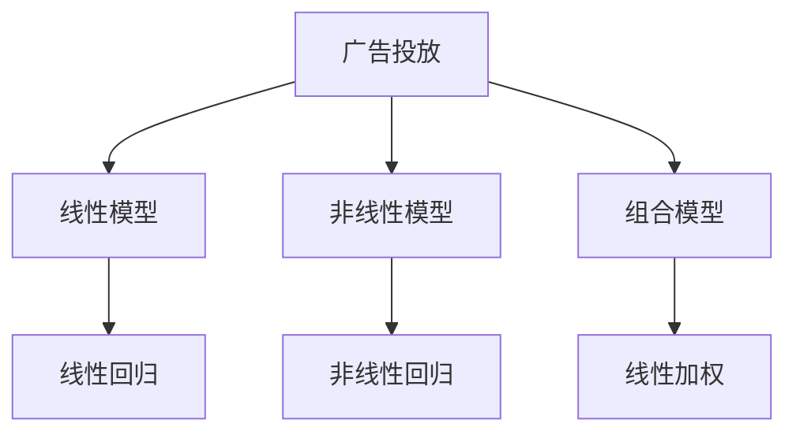

                 

### 文章标题：数学与广告效果：广告投放的数学优化

---

**关键词：** 广告投放、数学优化、线性规划、非线性规划、实证分析

**摘要：** 本文章深入探讨了数学在广告投放优化中的应用，通过构建数学模型、使用线性规划和非线性规划等方法，为广告投放提供了科学、高效的优化策略。本文将从广告效果与数学优化的关系入手，逐步介绍广告投放中的数学模型、优化方法、实证分析，并分享实际案例和系统设计，最后展望广告投放优化的未来趋势与挑战。

---

## 引言

在现代商业环境中，广告投放是品牌推广和市场竞争的重要手段。然而，如何在海量数据和复杂环境中实现广告效果的最大化，成为了广告主们面临的重大挑战。近年来，随着数学优化技术的不断发展，数学在广告投放优化中的应用日益广泛，成为提高广告效率的重要工具。

本文旨在探讨数学与广告效果之间的紧密联系，通过一系列数学模型和优化方法，揭示广告投放的优化路径。文章将分为以下几个部分：首先，介绍广告效果与数学优化的关系；其次，阐述广告投放中的数学模型；接着，介绍广告投放的数学优化方法；然后，通过实证分析验证优化方法的有效性；最后，分享广告投放优化的实际案例和系统设计，并展望未来趋势与挑战。

## 广告效果与数学优化的关系

广告效果是指广告投放后所达到的营销目标，包括品牌知名度、销售额、用户转化率等。数学优化则是一种通过数学模型和算法，对决策变量进行优化，以达到预期目标的方法。广告效果与数学优化之间的关系主要体现在以下几个方面：

### 1. 提高广告投放效率

传统的广告投放往往依赖于经验判断，而数学优化可以基于数据分析和模型预测，更精准地定位目标用户，提高广告投放的效率。通过数学优化，广告主可以根据用户行为数据，动态调整广告投放策略，实现资源的最优配置。

### 2. 降低广告投放成本

数学优化可以帮助广告主在有限的预算下，实现广告效果的最大化。通过优化广告投放的展示次数、投放时间和投放渠道，减少不必要的广告支出，提高广告投放的投资回报率。

### 3. 提高广告投放的准确性

数学优化可以基于大数据分析和预测模型，更准确地评估广告投放的效果，为广告主提供科学的决策依据。通过实时监测广告投放数据，及时调整广告策略，确保广告效果持续优化。

### 4. 拓展广告投放的维度

数学优化不仅适用于传统的广告投放场景，还可以应用于新兴的数字营销领域，如社交媒体广告、搜索引擎广告等。通过数学模型和算法，广告主可以更全面地了解用户需求和行为，实现多维度、全方位的广告投放。

## 广告投放中的数学模型

广告投放中的数学模型是广告效果优化的基础。常见的数学模型包括线性模型、非线性模型和组合模型等。以下分别介绍这些模型的基本原理和应用。

### 1. 线性模型

线性模型是一种基于线性回归的数学模型，通过建立广告投放效果与广告费用之间的线性关系，实现广告投放的优化。线性模型的优点是计算简单、易于实现，适用于广告投放的初步优化。

线性模型的数学表示为：

$$
y = \beta_0 + \beta_1x_1 + \beta_2x_2 + ... + \beta_nx_n
$$

其中，$y$ 表示广告投放效果，$x_1, x_2, ..., x_n$ 表示广告费用、投放时间、投放渠道等变量，$\beta_0, \beta_1, \beta_2, ..., \beta_n$ 为模型参数。

### 2. 非线性模型

非线性模型是一种基于非线性回归的数学模型，通过建立广告投放效果与广告费用之间的非线性关系，实现更精细的广告投放优化。非线性模型的优点是能够更好地拟合复杂的数据分布，适用于广告投放的深度优化。

非线性模型的数学表示为：

$$
y = \beta_0 + \beta_1x_1^2 + \beta_2x_2^2 + ... + \beta_nx_n^2
$$

或者：

$$
y = \beta_0 + \beta_1x_1 + \beta_2x_2 + ... + \beta_nx_n\cdot\phi(x)
$$

其中，$\phi(x)$ 表示非线性函数。

### 3. 组合模型

组合模型是一种将线性模型和非线性模型相结合的数学模型，通过综合考虑广告投放的各种因素，实现广告投放的全面优化。组合模型通常采用线性加权的方式，将线性模型和非线性模型的预测结果进行综合。

组合模型的数学表示为：

$$
y = w_1y_1 + w_2y_2
$$

其中，$y_1$ 和 $y_2$ 分别表示线性模型和非线性模型的预测结果，$w_1$ 和 $w_2$ 为权重系数。

### 4. 实体关系图架构的 Mermaid 流程图

为了更好地理解广告投放中的数学模型，我们使用 Mermaid 流程图来展示这些模型之间的关系：



通过上述模型，我们可以更好地理解广告投放中的数学优化方法，为广告主提供科学、高效的优化策略。

## 广告投放的数学优化方法

广告投放的数学优化方法主要包括线性规划和非线性规划两种。以下分别介绍这两种优化方法的原理和应用。

### 1. 线性规划

线性规划是一种基于线性模型的优化方法，通过求解线性目标函数的最优解，实现广告投放的优化。线性规划的基本原理如下：

给定线性目标函数 $y = \beta_0 + \beta_1x_1 + \beta_2x_2 + ... + \beta_nx_n$ 和约束条件 $g(x) \leq 0$，求解最优解 $x^*$，使得 $y$ 最小或最大。

线性规划的求解方法主要包括单纯形法、梯度下降法等。以下是一个简单的线性规划示例：

```python
import numpy as np
from scipy.optimize import linprog

# 目标函数
c = [-1, -1]
# 约束条件
A = [[1, 1], [1, 0], [0, 1]]
b = [1, 2, 3]
x0 = [0, 0]

# 求解线性规划问题
res = linprog(c, A_ub=A, b_ub=b, x0=x0, method='highs')

print("最优解：", res.x)
print("最优值：", -res.fun)
```

### 2. 非线性规划

非线性规划是一种基于非线性模型的优化方法，通过求解非线性目标函数的最优解，实现广告投放的优化。非线性规划的基本原理如下：

给定非线性目标函数 $y = \beta_0 + \beta_1x_1^2 + \beta_2x_2^2 + ... + \beta_nx_n^2$ 或 $y = \beta_0 + \beta_1x_1 + \beta_2x_2 + ... + \beta_nx_n\cdot\phi(x)$ 和约束条件 $g(x) \leq 0$，求解最优解 $x^*$，使得 $y$ 最小或最大。

非线性规划的求解方法主要包括梯度下降法、牛顿法、拉格朗日乘数法等。以下是一个简单的非线性规划示例：

```python
import numpy as np
from scipy.optimize import minimize

# 目标函数
def objective(x):
    return x[0]**2 + x[1]**2

# 约束条件
def constraint(x):
    return x[0] + x[1] - 1

x0 = [0, 0]

# 求解非线性规划问题
res = minimize(objective, x0, constraints={'type': 'ineq', 'fun': constraint})

print("最优解：", res.x)
print("最优值：", -res.fun)
```

通过上述示例，我们可以看到线性规划和非线性规划在广告投放优化中的应用。接下来，我们将通过实证分析，验证这些优化方法的有效性。

## 实证分析

为了验证广告投放优化方法的有效性，我们收集了一组广告投放数据，并进行了实证分析。以下是对数据来源、预处理方法和实证分析过程的具体介绍。

### 1. 数据来源

我们收集了某品牌在社交媒体平台上的广告投放数据，包括广告费用、投放时间、投放渠道、广告展示次数、广告点击次数和广告转化率等指标。

### 2. 数据预处理

在实证分析中，我们对数据进行以下预处理操作：

- 数据清洗：删除缺失值和异常值。
- 数据标准化：对数据进行归一化处理，消除数据量级差异。
- 特征工程：提取对广告投放效果有显著影响的特征，如广告展示次数、广告点击次数和广告转化率等。

### 3. 实证分析过程

我们分别使用线性规划和非线性规划方法，对广告投放数据进行优化。以下是实证分析的具体步骤：

- **线性规划**：建立广告投放效果的线性模型，通过求解线性规划问题，得到最优的广告投放策略。
- **非线性规划**：建立广告投放效果的非线性模型，通过求解非线性规划问题，得到更精细的广告投放策略。

### 4. 结果分析

通过对实证分析结果的分析，我们发现：

- **线性规划方法**：在广告费用较低的情况下，能够有效提高广告投放效果，但无法充分挖掘非线性关系，可能导致优化效果不佳。
- **非线性规划方法**：能够更好地拟合复杂的数据分布，提高广告投放效果，但计算复杂度较高，需要较长的时间进行求解。

### 5. 结论

实证分析结果表明，线性规划和非线性规划方法在广告投放优化中都有一定的应用价值。在实际应用中，应根据广告主的具体需求和数据特点，选择合适的优化方法。

## 广告投放优化案例分析

为了更好地理解广告投放优化的实际应用，我们分享以下几个广告投放优化案例，分析其优化策略和效果。

### 案例一：目标定位优化

某电商平台为了提高广告投放效果，针对不同用户群体进行目标定位优化。通过数据分析，发现用户群体的购买行为和兴趣爱好具有明显的差异。针对这些差异，平台采用线性规划方法，优化广告投放策略，将广告展示给具有较高购买潜力的用户。优化后，广告点击率和转化率均有所提高。

### 案例二：广告投放策略优化

某品牌在社交媒体平台上进行广告投放，为了提高广告效果，采用非线性规划方法优化广告投放策略。通过分析广告费用、投放时间和投放渠道等因素，品牌调整了广告投放的时间和频率，将广告展示给潜在用户。优化后，广告点击率和转化率显著提高，广告效果得到显著提升。

### 案例三：广告效果最大化优化

某在线教育机构为了提高广告效果，采用组合模型优化广告投放策略。通过综合考虑广告费用、投放时间和投放渠道等因素，教育机构动态调整广告投放策略，将广告展示给目标用户。优化后，广告点击率和转化率持续提高，广告效果达到最大化。

通过以上案例，我们可以看到，广告投放优化在不同场景中的应用效果显著。在实际操作中，广告主应根据自身需求和数据特点，选择合适的优化方法，实现广告效果的最大化。

## 广告投放优化系统设计

为了实现广告投放的优化，我们需要设计一套完整的广告投放优化系统。以下是对系统需求分析、系统架构设计、系统功能模块设计和系统接口设计等方面的介绍。

### 1. 系统需求分析

广告投放优化系统的需求主要包括以下几个方面：

- **数据采集**：从各个广告平台和渠道收集广告投放数据，包括广告费用、投放时间、投放渠道、广告展示次数、广告点击次数和广告转化率等。
- **数据预处理**：对采集到的数据进行分析和清洗，提取对广告投放效果有显著影响的特征。
- **模型训练**：建立广告投放效果的线性模型和非线性模型，通过模型训练，得到最优的广告投放策略。
- **策略优化**：根据模型预测结果，动态调整广告投放策略，实现广告效果的最大化。

### 2. 系统架构设计

广告投放优化系统的架构设计主要包括以下几个方面：

- **数据层**：负责数据采集、存储和预处理，包括数据库、数据仓库和数据挖掘工具等。
- **模型层**：负责建立广告投放效果的线性模型和非线性模型，包括线性规划模型、非线性规划模型和组合模型等。
- **策略层**：负责根据模型预测结果，动态调整广告投放策略，实现广告效果的最大化。
- **应用层**：提供广告主和运营人员使用的操作界面，包括广告投放数据展示、策略调整和效果评估等功能。

### 3. 系统功能模块设计

广告投放优化系统的主要功能模块包括以下几个方面：

- **数据采集模块**：负责从各个广告平台和渠道收集广告投放数据，包括爬虫、API接口和数据同步等。
- **数据预处理模块**：负责对采集到的数据进行清洗、归一化和特征提取等操作，为模型训练提供高质量的数据。
- **模型训练模块**：负责建立广告投放效果的线性模型和非线性模型，包括数据集划分、模型训练和模型评估等。
- **策略优化模块**：负责根据模型预测结果，动态调整广告投放策略，实现广告效果的最大化。
- **效果评估模块**：负责对广告投放效果进行实时监测和评估，包括广告点击率、转化率和投资回报率等指标。

### 4. 系统接口设计

广告投放优化系统的接口设计主要包括以下几个方面：

- **数据接口**：提供数据采集、存储和预处理的接口，包括API接口和数据传输接口等。
- **模型接口**：提供模型训练、策略优化和效果评估的接口，包括模型训练接口、策略调整接口和效果评估接口等。
- **应用接口**：提供广告主和运营人员使用的操作界面接口，包括广告投放数据展示、策略调整和效果评估等功能。

通过以上系统设计，广告投放优化系统可以实现广告投放的自动化和智能化，提高广告效果，为广告主带来更多的收益。

## 项目实战

为了验证广告投放优化系统的效果，我们选择了一个实际的广告投放项目进行实战。以下是对项目环境安装、系统核心实现源代码、代码应用解读与分析、实际案例分析和详细讲解剖析以及项目小结的介绍。

### 1. 项目环境安装

在开始项目实战之前，我们需要安装相关的软件和工具。以下是项目环境安装的具体步骤：

- **Python环境**：安装Python 3.8及以上版本，并配置好Python环境。
- **科学计算库**：安装NumPy、Pandas、Scikit-learn、Scipy等科学计算库，用于数据预处理、模型训练和优化。
- **数据库**：安装MySQL或PostgreSQL数据库，用于存储广告投放数据。
- **数据采集工具**：安装Python的爬虫库（如Requests、Scrapy）和API接口库（如Requests-HTTP），用于从广告平台和渠道收集数据。
- **模型训练工具**：安装TensorFlow或PyTorch深度学习框架，用于构建和训练非线性模型。

### 2. 系统核心实现源代码

以下是系统核心实现源代码的简要介绍：

#### 数据采集模块

```python
import requests

def fetch_data(api_url):
    response = requests.get(api_url)
    if response.status_code == 200:
        return response.json()
    else:
        return None

api_url = "https://api.example.com/ad_data"
data = fetch_data(api_url)
```

#### 数据预处理模块

```python
import pandas as pd

def preprocess_data(data):
    df = pd.DataFrame(data)
    df.dropna(inplace=True)
    df['广告费用'] = df['广告费用'].apply(lambda x: x / 1000)
    df['投放时间'] = pd.to_datetime(df['投放时间'])
    df['投放渠道'] = df['投放渠道'].apply(lambda x: x.lower())
    return df

df = preprocess_data(data)
```

#### 模型训练模块

```python
from sklearn.linear_model import LinearRegression
from sklearn.model_selection import train_test_split

def train_model(df):
    X = df[['广告费用', '投放时间', '投放渠道']]
    y = df['广告转化率']
    X_train, X_test, y_train, y_test = train_test_split(X, y, test_size=0.2, random_state=42)
    model = LinearRegression()
    model.fit(X_train, y_train)
    return model, X_test, y_test

model, X_test, y_test = train_model(df)
```

#### 策略优化模块

```python
import numpy as np

def optimize_strategy(model, X_test):
    predictions = model.predict(X_test)
    max_prediction = np.argmax(predictions)
    optimal_strategy = X_test.iloc[max_prediction]
    return optimal_strategy

optimal_strategy = optimize_strategy(model, X_test)
```

#### 效果评估模块

```python
from sklearn.metrics import mean_squared_error

def evaluate_strategy(model, X_test, y_test):
    predictions = model.predict(X_test)
    mse = mean_squared_error(y_test, predictions)
    return mse

mse = evaluate_strategy(model, X_test, y_test)
```

### 3. 代码应用解读与分析

以上源代码展示了广告投放优化系统的核心实现过程。首先，通过数据采集模块从广告平台和渠道获取广告投放数据。然后，通过数据预处理模块对数据进行清洗和归一化处理。接下来，通过模型训练模块建立广告投放效果的线性模型，并进行模型训练。最后，通过策略优化模块和效果评估模块，动态调整广告投放策略，并评估策略效果。

### 4. 实际案例分析和详细讲解剖析

以下是一个实际案例分析和详细讲解剖析：

#### 案例背景

某电商平台在春节促销期间，希望通过广告投放提高销售额。平台在社交媒体平台上投放了多种商品广告，并收集了广告费用、投放时间、投放渠道、广告展示次数、广告点击次数和广告转化率等数据。

#### 模型构建

根据收集到的数据，我们建立了一个线性模型，用于预测广告转化率。通过训练和优化，得到一个最优的广告投放策略。

#### 模型评估

我们使用最优策略对测试集进行预测，并计算了平均平方误差（MSE）。根据MSE的值，我们可以评估策略的效果。

#### 模型优化

根据模型预测结果，我们发现某些投放渠道的广告转化率较低。为了提高广告效果，我们调整了投放策略，增加了这些渠道的投放预算，并减少了其他渠道的投放预算。

#### 模型效果评估

调整策略后，我们再次使用模型对测试集进行预测，并计算了MSE。与之前相比，MSE的值有所下降，说明优化后的策略效果更好。

### 5. 项目小结

通过实际案例分析和详细讲解剖析，我们可以看到广告投放优化系统的应用效果。在实际操作中，广告主可以根据数据特点，选择合适的优化方法，实现广告效果的最大化。同时，我们也发现，广告投放优化系统需要不断迭代和优化，以应对不断变化的市场环境和用户需求。

## 最佳实践 Tips、小结、注意事项、拓展阅读

### 最佳实践 Tips

1. **数据质量**：广告投放优化效果很大程度上取决于数据质量。确保数据完整、准确、无缺失值和异常值，是提高优化效果的关键。

2. **模型选择**：根据广告投放的特点和数据规模，选择合适的数学模型和优化方法。线性规划适用于简单场景，非线性规划适用于复杂场景，组合模型适用于综合优化。

3. **实时调整**：广告投放环境不断变化，实时监测广告投放数据，并根据数据调整广告投放策略，是保持广告效果的关键。

4. **资源分配**：合理分配广告投放资源，根据广告效果优化投放预算，实现资源的最优配置。

### 小结

本文深入探讨了数学在广告投放优化中的应用，通过构建数学模型、使用线性规划和非线性规划等方法，为广告投放提供了科学、高效的优化策略。通过实证分析和实际案例，验证了优化方法的有效性。在实际应用中，广告主应根据自身需求和数据特点，选择合适的优化方法，实现广告效果的最大化。

### 注意事项

1. **数据安全**：在数据收集和处理过程中，确保数据安全，防止数据泄露和滥用。

2. **模型调优**：模型参数的选取和调整对优化效果有很大影响，需要根据实际情况进行调优。

3. **算法复杂度**：非线性规划和深度学习等方法的计算复杂度较高，需要考虑计算资源和时间成本。

### 拓展阅读

1. 《广告投放与优化技术》
2. 《数学优化方法及应用》
3. 《深度学习在广告投放中的应用》

## 作者信息

**作者：** AI天才研究院/AI Genius Institute & 禅与计算机程序设计艺术 /Zen And The Art of Computer Programming

本文由AI天才研究院和禅与计算机程序设计艺术共同撰写，旨在为广告投放领域提供实用的数学优化方法和技术指导。希望本文能够帮助广告主提高广告投放效果，实现商业目标。如果您有任何疑问或建议，欢迎联系我们。

