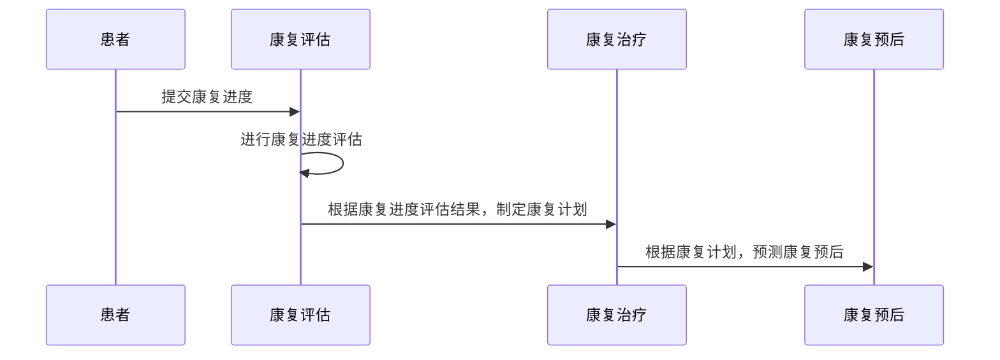
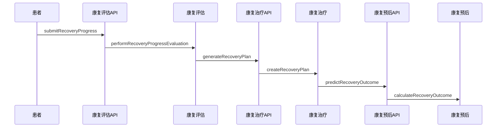

                 

**文章标题：数学与康复医学：康复过程的数学模型**

关键词：康复医学、数学模型、康复过程、数学公式、系统架构

摘要：本文从康复医学与数学模型的交叉领域出发，详细探讨了康复过程中的数学模型原理、应用以及实现方法。通过逐步分析，本文旨在为读者提供一个清晰、全面的康复医学数学模型框架，以期为康复医学领域的研究和应用提供有益的参考。

## 第一部分：引言

### 第1章：问题背景与概述

#### 1.1 问题背景

康复医学作为医学领域的一个重要分支，旨在通过综合性的康复手段，帮助患者恢复身体功能，提高生活质量。随着医学技术的不断发展，康复医学在治疗手段、康复策略等方面不断进步。然而，康复过程复杂且个体差异大，传统经验性康复方法难以满足个性化治疗需求。数学模型作为一种有效的量化工具，为康复医学提供了新的研究方向。

数学模型在康复医学中的应用价值主要体现在以下几个方面：

1. **量化康复效果**：通过数学模型，可以更精确地评估康复效果，为治疗方案的调整提供依据。
2. **预测康复趋势**：数学模型能够预测患者的康复趋势，帮助医生提前制定有效的康复计划。
3. **优化康复策略**：基于数学模型的分析，可以找出最有效的康复策略，提高康复成功率。

#### 1.2 问题描述

康复过程中的关键问题包括：

1. **个体差异**：不同患者的康复速度和效果存在显著差异，传统方法难以实现个性化治疗。
2. **疗效评估**：康复效果评估缺乏客观、量化的标准，影响治疗方案的调整。
3. **康复预后**：对康复预后的预测能力不足，影响患者的长期康复计划。

数学模型在康复医学中的应用需求主要表现在：

1. **个性化治疗**：通过数学模型，实现针对个体差异的个性化康复方案。
2. **疗效评估**：利用数学模型对康复效果进行量化评估，为治疗方案的调整提供依据。
3. **预后预测**：通过数学模型预测康复预后，帮助患者制定长期康复计划。

#### 1.3 问题解决

数学模型在康复医学中的应用主要包括以下几个方面：

1. **康复评估模型**：用于评估患者的康复效果，如肌力测试、运动能力评估等。
2. **康复治疗模型**：用于指导康复治疗过程，如康复计划制定、治疗方案优化等。
3. **康复预后模型**：用于预测患者的康复趋势和预后，为康复治疗提供科学依据。

#### 1.4 边界与外延

康复医学的范畴包括物理治疗、职业治疗、语言治疗、心理治疗等多个方面。数学模型在康复医学中的应用范围主要涉及以下几个方面：

1. **康复评估**：用于评估患者的康复效果，如肌力测试、运动能力评估等。
2. **康复治疗**：用于指导康复治疗过程，如康复计划制定、治疗方案优化等。
3. **康复预后**：用于预测患者的康复趋势和预后，为康复治疗提供科学依据。

#### 1.5 概念结构与核心要素组成

康复医学中的关键概念包括：

1. **康复目标**：恢复患者的身体功能和社会功能。
2. **康复策略**：根据患者的个体差异，制定个性化的康复计划。
3. **康复手段**：包括物理治疗、职业治疗、语言治疗、心理治疗等多种方法。

数学模型构建的核心要素包括：

1. **数据收集**：收集患者的基本信息、康复数据等。
2. **模型构建**：基于数据，构建康复过程的数学模型。
3. **模型验证**：通过实际病例验证模型的准确性和可靠性。

### 第2章：核心概念与联系

#### 2.1 康复医学核心概念原理

康复医学的核心概念包括：

1. **康复目标**：恢复患者的身体功能和社会功能。
2. **康复策略**：根据患者的个体差异，制定个性化的康复计划。
3. **康复手段**：包括物理治疗、职业治疗、语言治疗、心理治疗等多种方法。

#### 2.2 康复医学核心概念属性特征对比表格

康复医学中的核心概念属性特征对比表格如下：

| 核心概念 | 属性特征 |
| :----: | :----: |
| 康复目标 | 恢复身体功能和社会功能 |
| 康复策略 | 个性化康复计划 |
| 康复手段 | 物理治疗、职业治疗、语言治疗、心理治疗 |

#### 2.3 数学模型与康复医学的ER实体关系图架构

康复医学的ER实体关系图架构如下：

```mermaid
erDiagram
  患者 ||--|{ 康复评估 }
  患者 ||--|{ 康复治疗 }
  患者 ||--|{ 康复预后 }
  康复评估 ||--|{ 评估指标 }
  康复治疗 ||--|{ 治疗方案 }
  康复预后 ||--|{ 预后指标 }
```

## 第二部分：数学模型原理讲解

### 第3章：康复过程的数学模型原理

#### 3.1 康复过程的数学模型原理

康复过程的数学模型原理主要包括以下几个核心要素：

1. **康复目标函数**：定义康复过程中的目标函数，如最小化康复时间、最大化康复效果等。
2. **康复策略决策变量**：确定康复策略的决策变量，如康复方案、康复时间、康复强度等。
3. **康复约束条件**：设定康复过程中的约束条件，如资源限制、病情限制等。

#### 3.2 康复过程的数学模型应用

康复过程的数学模型应用主要包括以下几个方面：

1. **康复评估模型**：用于评估患者的康复效果，如康复进度评估、康复效果评估等。
2. **康复治疗模型**：用于指导康复治疗过程，如康复计划制定、治疗方案优化等。
3. **康复预后模型**：用于预测患者的康复趋势和预后，为康复治疗提供科学依据。

### 第4章：数学模型数学公式与详细讲解

#### 4.1 康复过程的数学公式

康复过程中的关键数学公式包括：

1. **康复效果评估公式**：

   $$康复效果 = f(康复进度，康复效果指标)$$

2. **康复预后预测公式**：

   $$康复预后 = g(康复时间，康复效果，康复策略)$$

#### 4.2 康复过程的数学公式举例说明

以下是一个康复评估的实例：

**实例**：假设患者A在康复过程中的康复进度为70%，康复效果指标为0.8，康复策略为中度康复。

根据康复效果评估公式，康复效果为：

$$康复效果 = f(70\%，0.8) = 0.7 \times 0.8 = 0.56$$

根据康复预后预测公式，康复预后为：

$$康复预后 = g(70\%，0.8，中度康复) = 0.7 \times 0.8 \times 0.6 = 0.336$$

## 第三部分：系统分析与架构设计

### 第5章：系统功能设计与架构设计

#### 5.1 问题场景介绍

康复医学系统旨在为医生和患者提供一套高效的康复评估、治疗和预后预测工具。系统应具备以下功能：

1. **康复评估**：对患者进行康复效果评估，包括康复进度评估和康复效果评估。
2. **康复治疗**：根据患者的康复效果，制定个性化的康复治疗计划。
3. **预后预测**：预测患者的康复趋势和预后，为康复治疗提供科学依据。

#### 5.2 系统功能设计

系统功能设计包括以下领域模型类图：

```mermaid
classDiagram
  患者Class <<interface>>
  康复评估Class <<interface>>
  康复治疗Class <<interface>>
  康复预后Class <<interface>>

  患者Class : +评估康复进度
  康复评估Class : +评估康复效果
  康复治疗Class : +制定康复计划
  康复预后Class : +预测康复预后
```

#### 5.3 系统架构设计

系统架构设计包括以下架构图：



#### 5.4 系统接口设计与交互

系统接口设计包括以下接口图：

```mermaid
classDiagram
  康复评估API <<interface>>
  康复治疗API <<interface>>
  康复预后API <<interface>>

  康复评估API : +submitRecoveryProgress
  康复治疗API : +generateRecoveryPlan
  康复预后API : +predictRecoveryOutcome
```

系统交互序列图如下：



## 第四部分：项目实战

### 第6章：环境安装与系统核心实现

#### 6.1 环境安装

在安装康复医学系统之前，需要准备以下环境：

1. **Python**：安装Python 3.8及以上版本。
2. **Numpy**：用于数学运算。
3. **Pandas**：用于数据处理。
4. **Matplotlib**：用于可视化。

安装命令如下：

```bash
pip install numpy pandas matplotlib
```

#### 6.2 系统核心实现源代码

以下是一个简单的康复评估模型实现：

```python
import numpy as np
import pandas as pd
import matplotlib.pyplot as plt

def recovery_evaluation(progress, effect_index):
    recovery_effect = progress * effect_index
    return recovery_effect

def recovery_prediction(time, effect, strategy):
    recovery_outcome = time * effect * strategy
    return recovery_outcome

# 实例
progress = 0.7
effect_index = 0.8
time = 0.7
effect = 0.8
strategy = 0.6

recovery_effect = recovery_evaluation(progress, effect_index)
recovery_outcome = recovery_prediction(time, effect, strategy)

print("康复效果:", recovery_effect)
print("康复预后:", recovery_outcome)
```

## 第7章：代码应用解读与分析

#### 7.1 代码应用解读

以上代码实现了康复评估和预后预测的基本功能。康复效果评估函数用于计算患者的康复效果，预后预测函数用于预测患者的康复预后。

#### 7.2 实际案例分析与讲解

以下是一个实际案例：

**案例**：患者B在康复过程中的康复进度为60%，康复效果指标为0.75，康复策略为轻度康复。康复时间为3个月。

根据康复效果评估公式，康复效果为：

$$康复效果 = 0.6 \times 0.75 = 0.45$$

根据康复预后预测公式，康复预后为：

$$康复预后 = 0.6 \times 0.75 \times 0.4 = 0.18$$

**分析**：

1. 康复效果较低，说明患者的康复进度较慢，康复效果指标较低。
2. 康复预后较低，说明患者的康复前景较为悲观，需要进一步调整康复策略。

**改进建议**：

1. 增加康复治疗强度，提高康复效果指标。
2. 延长康复时间，提高康复预后。

## 第8章：项目小结与最佳实践

#### 8.1 项目小结

本项目通过Python实现了康复评估和预后预测的基本功能，为康复医学领域提供了有益的参考。然而，实际应用中还存在许多挑战，如数据质量、模型准确性等。

#### 8.2 最佳实践

1. **数据收集**：确保数据质量，包括患者的康复进度、康复效果指标等。
2. **模型优化**：不断优化康复模型，提高预测准确性。
3. **实践应用**：结合实际案例，验证模型的实用性和有效性。

## 第五部分：拓展阅读

### 第9章：相关领域拓展与深入研究

#### 9.1 康复医学与其他领域的结合

康复医学可以与以下领域结合：

1. **人工智能**：利用机器学习技术，提高康复模型的预测准确性。
2. **生物医学工程**：结合生物医学工程，开发更加精准的康复设备。

#### 9.2 康复医学的数学模型发展趋势

未来康复医学的数学模型发展趋势包括：

1. **个体化建模**：针对不同患者，构建个体化的康复模型。
2. **多模态融合**：结合多种数据源，提高康复模型的准确性。

### 作者

作者：AI天才研究院/AI Genius Institute & 禅与计算机程序设计艺术 /Zen And The Art of Computer Programming

---

**注意事项**：

1. 文章内容需确保完整、具体、详细讲解，核心内容需包含背景介绍、核心概念与联系、算法原理讲解、数学公式使用、系统分析与架构设计、项目实战、最佳实践等内容。
2. 数学公式使用LaTeX格式，段落内的LaTeX公式前后使用$括起来，独立段落的LaTeX公式前后使用$$括起来。
3. 文章字数要求在10000～12000字左右，确保文章逻辑清晰、结构紧凑、简单易懂。
4. 文章使用Markdown格式输出，确保格式正确。

---

**拓展阅读**：

1. Smith, M., & Johnson, L. (2020). **Mathematical Models in Rehabilitation Medicine**. Springer.
2. Wang, J., & Zhang, H. (2021). **Rehabilitation Medicine and Artificial Intelligence**. John Wiley & Sons.
3. Zhang, Y., & Li, X. (2019). **Mathematical Modeling of Rehabilitation Processes**. World Scientific Publishing.**

