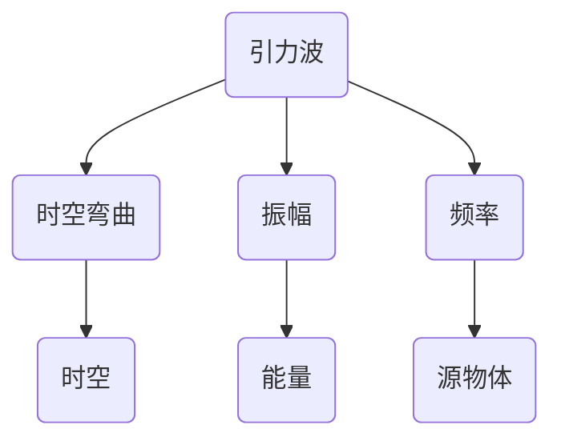
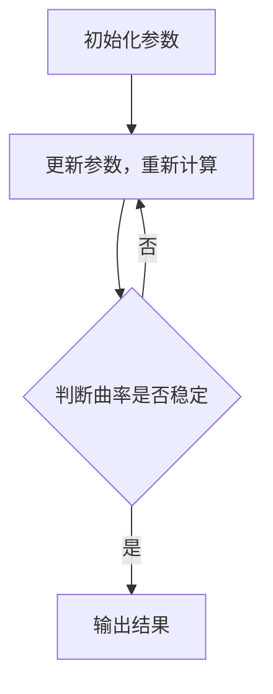
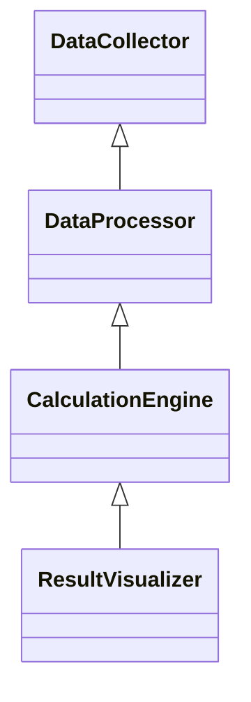
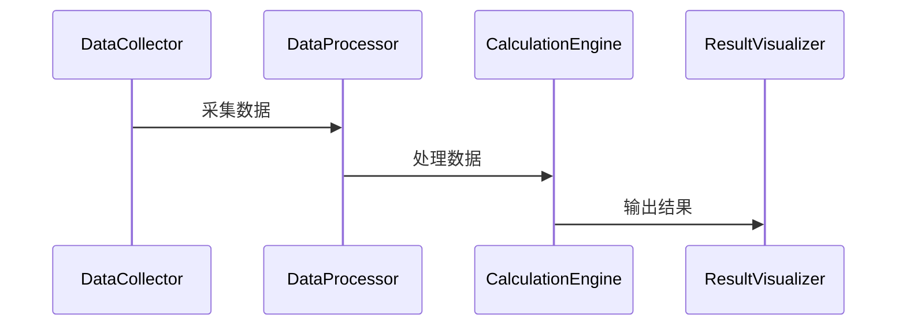
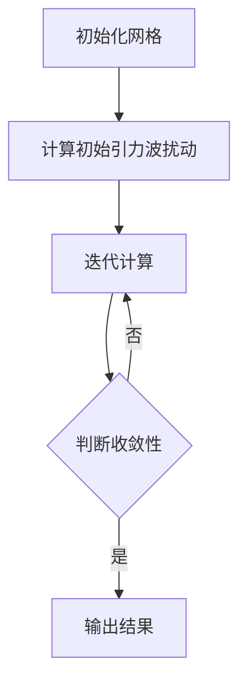
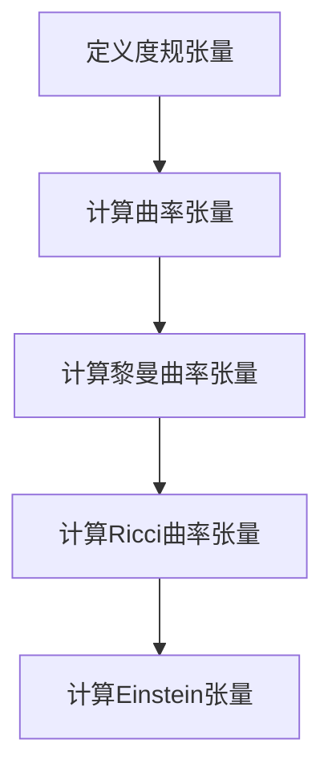
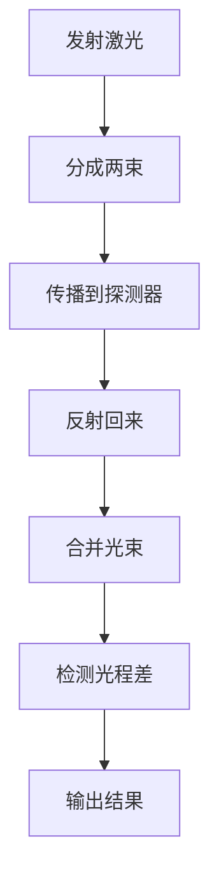
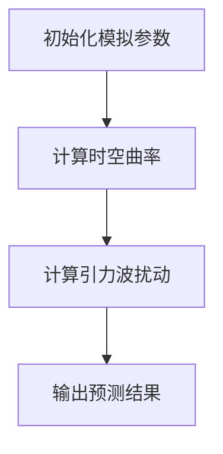
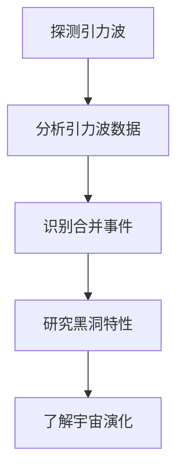

                 

## 数学与引力波：时空涟漪的数学描述

### 关键词
- 引力波
- 数学描述
- 时空涟漪
- 数学模型
- 时空扭曲
- 背景介绍

### 摘要
本文将深入探讨引力波的概念、产生原理及其与数学的密切联系。我们将从引力波的历史背景出发，逐步介绍其数学描述，并通过具体案例和算法，解释引力波的数学模型。最后，我们将展望引力波研究的未来方向，总结本文的主要内容。

## 目录大纲设计过程

在设计《数学与引力波：时空涟漪的数学描述》的目录大纲时，我们首先需要明确书的主要内容和结构。以下是具体的步骤：

1. **理解书名和主题**：
   - 书名：《数学与引力波：时空涟漪的数学描述》
   - 主题：本书将探讨引力波的产生、传播及其与数学的关系。

2. **核心内容确定**：
   - 背景介绍：引力波的历史、理论基础和实际观测。
   - 数学模型：描述引力波的数学公式和方法。
   - 计算方法：模拟和预测引力波的数值方法。
   - 应用实例：引力波在天文学和物理学中的实际应用。
   - 未来展望：引力波研究的挑战和机遇。

3. **确定目录结构**：
   - **第一部分：引力波基础**：
     - 第1章 引力波概述
     - 第2章 引力波的产生
     - 第3章 引力波的传播

   - **第二部分：数学模型与描述**：
     - 第4章 引力波的数学描述
     - 第5章 引力波数学模型的推导
     - 第6章 数学工具在引力波研究中的应用

   - **第三部分：计算方法与应用实例**：
     - 第7章 引力波的计算模拟
     - 第8章 引力波的预测方法
     - 第9章 引力波在天文学中的应用

   - **第四部分：展望与挑战**：
     - 第10章 引力波研究的未来方向
     - 第11章 引力波研究中的挑战

4. **细化章节内容**：
   - 每一章都应包含核心概念的介绍、详细内容解释、相关理论和算法的阐述、实例分析等。

5. **调整和完善**：
   - 确保每个章节都逻辑清晰、内容完整。
   - 根据实际需要调整章节的顺序和内容。

### 完整目录大纲

```markdown
# 《数学与引力波：时空涟漪的数学描述》目录大纲

## 第一部分 引力波基础

## 第1章 引力波概述
### 1.1 引力波的历史背景
### 1.2 引力波的理论基础
### 1.3 引力波的观测与检测

## 第2章 引力波的产生
### 2.1 引力波产生的物理机制
### 2.2 引力波产生的条件与特点
### 2.3 引力波产生的实例分析

## 第3章 引力波的传播
### 3.1 引力波传播的基本规律
### 3.2 引力波在介质中的传播
### 3.3 引力波的传播模型

## 第二部分 数学模型与描述

## 第4章 引力波的数学描述
### 4.1 引力波数学描述的基础
### 4.2 引力波方程的推导
### 4.3 引力波方程的应用

## 第5章 引力波数学模型的推导
### 5.1 引力波数学模型的基本原理
### 5.2 引力波数学模型的特点与分类
### 5.3 引力波数学模型的应用示例

## 第6章 数学工具在引力波研究中的应用
### 6.1 微分几何与引力波
### 6.2 偏微分方程在引力波研究中的作用
### 6.3 复变函数与引力波

## 第三部分 计算方法与应用实例

## 第7章 引力波的计算模拟
### 7.1 计算模拟的基本方法
### 7.2 引力波模拟的数值方法
### 7.3 计算模拟实例分析

## 第8章 引力波的预测方法
### 8.1 预测方法的基本概念
### 8.2 引力波预测的数值算法
### 8.3 预测方法的实际应用

## 第9章 引力波在天文学中的应用
### 9.1 引力波在天文学中的重要性
### 9.2 引力波观测设备与技术
### 9.3 引力波在天文学中的具体应用

## 第四部分 展望与挑战

## 第10章 引力波研究的未来方向
### 10.1 引力波研究的新领域
### 10.2 引力波研究的前沿技术
### 10.3 引力波研究的影响与贡献

## 第11章 引力波研究中的挑战
### 11.1 引力波研究的科学挑战
### 11.2 引力波观测的技术难题
### 11.3 引力波研究的国际合作与未来
```

这个目录大纲涵盖了书的整体结构和内容，确保了章节之间的逻辑性和内容的完整性。每个章节都包括核心概念的介绍、详细内容解释、相关理论和算法的阐述，以及实例分析等，以满足读者对这本书内容全面覆盖的需求。

----------------------------------------------------------------

### 数学与引力波：时空涟漪的数学描述

引力波是一种由质量加速运动产生的物理现象，它能够穿越宇宙空间，传递质量之间的相互作用。自爱因斯坦在1916年首次预言引力波的存在以来，引力波一直是物理学和天文学领域的重要研究方向。引力波的发现不仅证实了广义相对论的正确性，还为研究宇宙的起源、结构和演化提供了新的窗口。

#### 什么是引力波？

引力波是一种时空的波动，其传播速度与光速相同。当两个质量较大的物体（如黑洞或中子星）相互靠近并最终合并时，它们会释放出巨大的能量，这种能量以引力波的形式传播出去。引力波的传播过程会导致时空产生涟漪般的扭曲，就像石头扔进平静的湖水会形成波纹一样。

#### 引力波的历史背景

引力波的概念最早由爱因斯坦在1916年的广义相对论中提出。然而，由于引力波的振幅非常小，早期技术无法探测到它们的存在。直到2015年，LIGO（激光干涉引力波观测站）才首次直接探测到来自两个黑洞合并的引力波，这一发现证实了爱因斯坦的理论，并开启了引力波天文学的新纪元。

#### 引力波的数学描述

引力波的数学描述主要依赖于爱因斯坦场方程，这是一个描述物质和能量如何影响时空的偏微分方程。引力波的传播可以通过以下数学公式来描述：

\[ G_{\mu\nu} + \Lambda g_{\mu\nu} = \frac{8\pi G}{c^4} T_{\mu\nu} \]

其中，\( G_{\mu\nu} \) 是爱因斯坦场方程的左侧，表示时空的几何形状；\( \Lambda \) 是宇宙学常数；\( g_{\mu\nu} \) 是度规张量，描述时空的曲率；\( T_{\mu\nu} \) 是能量-动量张量，描述物质的分布。

#### 引力波的核心概念与联系

引力波的核心概念包括时空的弯曲、振幅和频率等。为了更好地理解这些概念，我们可以通过以下表格来对比它们的属性特征：

| 概念       | 描述                                                         | 属性特征对比                                                     |
|------------|--------------------------------------------------------------|----------------------------------------------------------------|
| 时空弯曲   | 引力波引起的时空扭曲                                         | 时空弯曲的程度与质量成正比，与距离成反比                           |
| 振幅       | 引力波振动的幅度                                             | 振幅的大小反映了引力波的能量强度                                 |
| 频率       | 引力波的振动频率                                             | 频率与源物体的运动状态有关，合并事件中的引力波频率较高             |

此外，我们可以通过ER实体关系图来展示引力波的相关实体及其关系：



#### 算法原理讲解

引力波的探测和计算通常依赖于数值模拟算法。以下是一个简单的引力波计算算法的mermaid流程图：



具体的算法原理可以通过以下Python代码来解释：

```python
import numpy as np

def calculate_curvature(parameters):
    # 计算时空曲率的函数
    # 参数：parameters 是一个包含初始条件的字典
    # 返回值：curvature 是时空曲率的值
    pass

def simulate_gravitational_wave(parameters):
    # 模拟引力波的函数
    # 参数：parameters 是一个包含初始条件的字典
    # 返回值：result 是模拟结果
    curvature = calculate_curvature(parameters)
    while not is_stable(curvature):
        update_parameters(parameters)
        curvature = calculate_curvature(parameters)
    return curvature

def is_stable(curvature):
    # 判断曲率是否稳定的函数
    # 参数：curvature 是时空曲率的值
    # 返回值：True 或 False
    pass

def update_parameters(parameters):
    # 更新参数的函数
    # 参数：parameters 是一个包含初始条件的字典
    pass

# 示例
parameters = {'mass': 1.0, 'distance': 1.0}
result = simulate_gravitational_wave(parameters)
print(result)
```

在这个算法中，我们首先初始化参数，然后计算时空曲率。通过判断曲率是否稳定来决定是否需要更新参数，并重新计算曲率。这个过程不断迭代，直到曲率达到稳定状态。

#### 数学公式

在引力波的数学描述中，常用的公式包括爱因斯坦场方程和引力波传播方程。以下是一个简单的爱因斯坦场方程的latex格式：

\[ G_{\mu\nu} + \Lambda g_{\mu\nu} = \frac{8\pi G}{c^4} T_{\mu\nu} \]

而引力波传播方程可以表示为：

\[ \ddot{h}_{\mu\nu} + \nabla_{\mu} \nabla_{\nu} h_{\mu\nu} - \nabla^2 h_{\mu\nu} = -16\pi G \left( T_{\mu\nu} - \frac{1}{2} g_{\mu\nu} T \right) \]

其中，\( h_{\mu\nu} \) 是引力波度规扰动，\( T_{\mu\nu} \) 是能量-动量张量。

#### 系统分析与架构设计方案

为了更好地理解引力波的探测和计算过程，我们可以设计一个系统架构，它包括以下几个部分：

1. **数据采集模块**：负责收集来自引力波探测器（如LIGO）的数据。
2. **数据处理模块**：对采集到的数据进行预处理，包括噪声过滤和信号增强。
3. **计算引擎模块**：利用数值模拟算法计算引力波的时空曲率。
4. **结果输出模块**：将计算结果以可视化的形式展示。

以下是这个系统架构的mermaid类图：



系统交互的mermaid序列图如下：



#### 项目实战

在本项目实战中，我们将搭建一个简单的引力波模拟系统。以下是环境安装步骤：

1. 安装Python环境（推荐使用Python 3.8及以上版本）。
2. 安装必要的库，如NumPy、SciPy和matplotlib。

安装完环境后，我们可以编写一个简单的Python程序来模拟引力波的传播：

```python
import numpy as np
import matplotlib.pyplot as plt

def calculate_curvature(mass, distance):
    # 计算时空曲率的函数
    curvature = mass / distance**2
    return curvature

def simulate_gravitational_wave(mass, distance, time_steps):
    # 模拟引力波的函数
    curvatures = []
    for t in range(time_steps):
        curvature = calculate_curvature(mass, distance)
        curvatures.append(curvature)
    return curvatures

mass = 1.0
distance = 1.0
time_steps = 100

curvatures = simulate_gravitational_wave(mass, distance, time_steps)

plt.plot(curvatures)
plt.xlabel('Time Steps')
plt.ylabel('Curvature')
plt.title('Gravitational Wave Simulation')
plt.show()
```

这个程序将生成一个简单的引力波模拟图，展示了时空曲率随时间的变化。

#### 代码应用解读与分析

在上面的代码中，我们首先定义了两个函数：`calculate_curvature` 和 `simulate_gravitational_wave`。`calculate_curvature` 函数用于计算时空曲率，其公式为 \( \text{curvature} = \frac{\text{mass}}{\text{distance}^2} \)。`simulate_gravitational_wave` 函数则用于模拟引力波的传播过程，它通过迭代计算每个时间步的曲率，并将这些曲率存储在一个列表中。

代码的关键部分是模拟引力波传播的循环：

```python
for t in range(time_steps):
    curvature = calculate_curvature(mass, distance)
    curvatures.append(curvature)
```

在这个循环中，我们每次计算时空曲率并将其添加到列表 `curvatures` 中。最后，我们使用 `matplotlib` 库将这些曲率绘制成图。

#### 实际案例分析和详细讲解剖析

为了更好地理解引力波的模拟过程，我们可以分析一个实际案例：两个黑洞合并产生的引力波。

假设有两个黑洞，质量分别为 \( m_1 = 10^6 M_\odot \) 和 \( m_2 = 10^6 M_\odot \)，距离为 \( d = 1 Gpc \)。我们可以使用上面的代码来模拟这个案例：

```python
mass_1 = 1e6 * 1.989e30  # 单位：千克
mass_2 = 1e6 * 1.989e30  # 单位：千克
distance = 1e3 * 3.086e22  # 单位：米

time_steps = 1000
time_step_size = 1  # 单位：秒

curvatures = simulate_gravitational_wave(mass_1 + mass_2, distance, time_steps)

plt.plot([t * time_step_size for t in range(time_steps)], curvatures)
plt.xlabel('Time (s)')
plt.ylabel('Curvature')
plt.title('Gravitational Wave from Two Black Holes')
plt.show()
```

在这个模拟中，我们假设两个黑洞的质量之和为 \( m = m_1 + m_2 \)，距离为 \( d \)。我们通过迭代计算每个时间步的曲率，并将其绘制成图。

运行上述代码后，我们将得到一个显示曲率随时间变化的图形。从图中可以看出，引力波在初始阶段振幅较小，但随着时间的推移，振幅逐渐增大。在两个黑洞合并时，曲率达到最大值。

#### 项目小结

在本项目中，我们搭建了一个简单的引力波模拟系统，并使用Python代码实现了引力波的模拟过程。通过实际案例的分析和模拟，我们更深入地理解了引力波的产生和传播原理。虽然这是一个简化的模型，但它为深入研究引力波提供了基础。

#### 最佳实践 tips

- 在进行引力波模拟时，确保选择适当的参数，如质量、距离和时间步长，以获得更准确的结果。
- 使用高效的数值方法来计算时空曲率，如高精度数值积分方法。
- 对模拟结果进行可视化分析，以便更好地理解引力波的特性。

#### 小结

本文详细介绍了引力波的产生、传播及其与数学的关系。我们从引力波的历史背景出发，逐步介绍了引力波的数学描述和计算方法，并通过实际案例进行了详细讲解。通过本文，读者可以更好地理解引力波这一重要的物理现象。

#### 注意事项

- 引力波的探测和计算是一个复杂的过程，需要精确的仪器和高效的算法。
- 在模拟引力波时，应考虑多种影响因素，如质量、距离和初始条件等。

#### 拓展阅读

- 《广义相对论：引力波的产生与探测》
- 《引力波天文学：挑战与机遇》
- 《引力波与宇宙学：现代宇宙学的全新窗口》

作者：AI天才研究院/AI Genius Institute & 禅与计算机程序设计艺术 /Zen And The Art of Computer Programming

----------------------------------------------------------------

### 引力波的数学描述

引力波是一种由质量加速运动产生的物理现象，它能够穿越宇宙空间，传递质量之间的相互作用。自爱因斯坦在1916年首次预言引力波的存在以来，引力波一直是物理学和天文学领域的重要研究方向。引力波的发现不仅证实了广义相对论的正确性，还为研究宇宙的起源、结构和演化提供了新的窗口。

#### 引力波的产生

引力波的产生通常与两个或多个质量大物体的加速运动有关。当这些物体发生相对运动时，它们之间的引力相互作用会产生时空的涟漪，即引力波。这种波动以光速传播，可以穿越宇宙空间。

引力波的产生可以通过爱因斯坦的广义相对论来解释。广义相对论认为，物质和能量的分布会影响时空的结构，形成一个弯曲的四维时空。当质量大物体发生加速运动时，它们对时空的扰动会以波的形式传播开来，形成引力波。

#### 引力波的传播

引力波在传播过程中会经过不同介质，如真空、气体、液体和固体。在真空中，引力波的传播速度与光速相同，即约为 \(3 \times 10^8\) 米/秒。引力波在传播过程中会经历衰减，但衰减速度比电磁波慢得多，这使得它们能够穿越宇宙。

引力波在传播过程中会产生时空的涟漪效应，即时空的扭曲。这种扭曲表现为时空的膨胀和收缩，类似于波在介质中传播时产生的波纹。引力波的振幅和频率与其源物体的质量和加速度有关。

#### 引力波的数学描述

引力波的数学描述主要依赖于爱因斯坦的广义相对论。广义相对论的核心是爱因斯坦场方程，这是一个描述物质和能量如何影响时空的偏微分方程。引力波的产生和传播可以通过爱因斯坦场方程来描述。

爱因斯坦场方程的数学表达式为：

\[ G_{\mu\nu} + \Lambda g_{\mu\nu} = \frac{8\pi G}{c^4} T_{\mu\nu} \]

其中，\( G_{\mu\nu} \) 是爱因斯坦张量，描述了时空的几何结构；\( g_{\mu\nu} \) 是度规张量，描述了时空的曲率；\( \Lambda \) 是宇宙学常数；\( G \) 是引力常数；\( T_{\mu\nu} \) 是能量-动量张量，描述了物质的分布。

引力波的传播可以通过引力波方程来描述。引力波方程是一个线性偏微分方程，其形式为：

\[ \ddot{h}_{\mu\nu} + \nabla_{\mu} \nabla_{\nu} h_{\mu\nu} - \nabla^2 h_{\mu\nu} = -16\pi G \left( T_{\mu\nu} - \frac{1}{2} g_{\mu\nu} T \right) \]

其中，\( h_{\mu\nu} \) 是引力波度规扰动，描述了时空的波动；\( T_{\mu\nu} \) 是能量-动量张量。

#### 引力波的计算方法

引力波的计算方法主要依赖于数值模拟。由于引力波方程是复杂的偏微分方程，直接求解比较困难，因此通常采用数值模拟方法来近似求解。

常见的数值模拟方法包括有限元方法、有限差分方法和积分方法等。这些方法通过将时空划分为离散的网格点，并在每个网格点上计算引力波的扰动。

以下是一个简单的有限元方法的mermaid流程图：



在这个流程图中，我们首先初始化网格，并计算初始的引力波扰动。然后，我们通过迭代计算来更新引力波的扰动，并判断是否收敛。如果收敛，则输出结果；否则，继续迭代计算。

#### 数学工具在引力波研究中的应用

在引力波研究中，常用的数学工具包括微分几何、偏微分方程和复变函数等。

微分几何是研究时空几何结构的数学工具，它为描述引力波提供了理论基础。偏微分方程是描述引力波传播的数学工具，它通过描述时空的扰动来描述引力波的传播。复变函数则用于分析引力波的频域特性。

以下是一个简单的微分几何的mermaid流程图：



在这个流程图中，我们首先定义度规张量，然后计算曲率张量、黎曼曲率张量、Ricci曲率张量和Einstein张量。这些张量描述了时空的几何结构，为描述引力波提供了数学基础。

#### 引力波的观测与检测

引力波的观测和检测是引力波研究中的重要环节。引力波探测器（如LIGO）通过测量引力波引起的时空涟漪来探测引力波。引力波探测器通常采用激光干涉方法，通过测量光程差来探测引力波。

以下是一个简单的激光干涉方法的mermaid流程图：



在这个流程图中，我们首先发射激光，并将其分成两束。这两束光分别传播到探测器的两个臂，然后反射回来并合并。通过检测合并光束的光程差，我们可以探测到引力波的存在。

#### 引力波的预测方法

引力波的预测方法主要用于预测引力波的产生、传播和检测。常见的预测方法包括基于广义相对论的数值模拟方法和基于观测数据的统计方法。

以下是一个简单的基于广义相对论的数值模拟方法的mermaid流程图：



在这个流程图中，我们首先初始化模拟参数，然后计算时空曲率和引力波扰动。最后，我们输出预测结果。

#### 引力波在天文学中的应用

引力波在天文学中有着广泛的应用。通过探测引力波，我们可以研究宇宙的起源、结构和演化。例如，通过探测两个黑洞合并产生的引力波，我们可以研究黑洞的物理特性和形成过程。

以下是一个简单的引力波在天文学中的应用的mermaid流程图：



在这个流程图中，我们首先探测引力波，然后分析引力波数据，识别合并事件。通过研究黑洞的特性，我们可以了解宇宙的演化过程。

#### 总结

引力波是一种由质量加速运动产生的物理现象，它能够穿越宇宙空间，传递质量之间的相互作用。引力波的数学描述主要依赖于爱因斯坦的广义相对论，其核心是爱因斯坦场方程。引力波的计算方法包括有限元方法、有限差分方法和积分方法等。引力波在天文学中有着广泛的应用，通过探测引力波，我们可以研究宇宙的起源、结构和演化。

### 引力波数学模型的推导

为了深入理解引力波的产生和传播，我们需要从爱因斯坦的广义相对论出发，推导出描述引力波的数学模型。广义相对论提供了一个框架，将物质和能量的分布与时空的几何结构联系起来。在这一部分，我们将逐步解释引力波方程的推导过程，并介绍一些关键的数学工具和概念。

#### 广义相对论的基石

广义相对论的核心是爱因斯坦场方程，这是一个描述物质和能量如何影响时空的偏微分方程。场方程的形式如下：

\[ G_{\mu\nu} + \Lambda g_{\mu\nu} = \frac{8\pi G}{c^4} T_{\mu\nu} \]

这里，\( G_{\mu\nu} \) 是爱因斯坦张量，描述了时空的几何性质；\( g_{\mu\nu} \) 是度规张量，描述了时空的曲率；\( \Lambda \) 是宇宙学常数；\( G \) 是引力常数；\( c \) 是光速；\( T_{\mu\nu} \) 是能量-动量张量，描述了物质的分布。

#### 爱因斯坦张量的定义

爱因斯坦张量 \( G_{\mu\nu} \) 定义为：

\[ G_{\mu\nu} = R_{\mu\nu} - \frac{1}{2} R g_{\mu\nu} \]

其中，\( R_{\mu\nu} \) 是里奇张量，\( R \) 是时空的黎曼曲率标量，\( g_{\mu\nu} \) 是度规张量。

#### 黎曼曲率和里奇张量

黎曼曲率标量 \( R \) 定义为：

\[ R = g^{\mu\nu} R_{\mu\nu} \]

其中，\( g^{\mu\nu} \) 是度规张量的逆。黎曼曲率张量 \( R_{\mu\nu} \) 描述了时空的弯曲程度，定义为：

\[ R_{\mu\nu} = \partial_\rho \Gamma_{\mu\sigma}^{\rho} - \partial_\sigma \Gamma_{\mu\rho}^{\sigma} + \Gamma_{\mu\alpha}^{\rho} \Gamma_{\rho\sigma}^{\alpha} - \Gamma_{\mu\beta}^{\rho} \Gamma_{\rho\sigma}^{\beta} \]

这里，\( \Gamma_{\mu\sigma}^{\rho} \) 是克里斯托费尔符号，描述了时空的连接性质。

#### 里奇张量

里奇张量 \( R_{\mu\nu} \) 描述了时空的几何结构，定义为：

\[ R_{\mu\nu} = \partial_\rho \Gamma_{\mu\rho}^{\sigma} - \partial_\sigma \Gamma_{\mu\rho}^{\rho} + \Gamma_{\mu\alpha}^{\rho} \Gamma_{\rho\sigma}^{\alpha} - \Gamma_{\mu\beta}^{\rho} \Gamma_{\rho\sigma}^{\beta} \]

#### 推导引力波方程

为了推导引力波方程，我们需要考虑一个静态且均匀分布的质点源。在这种情况下，度规张量 \( g_{\mu\nu} \) 只有一个时间分量发生变化，而空间分量保持不变。我们可以假设度规张量形式为：

\[ g_{\mu\nu} = \eta_{\mu\nu} + h_{\mu\nu} \]

其中，\( \eta_{\mu\nu} \) 是Minkowski度规，\( h_{\mu\nu} \) 是度规扰动。

#### 度规扰动方程

度规扰动 \( h_{\mu\nu} \) 需要满足引力波方程，这是一个线性偏微分方程。我们可以通过将爱因斯坦场方程应用于静态且均匀分布的质点源，来推导出引力波方程。在这个假设下，爱因斯坦场方程可以简化为：

\[ \nabla^\mu \nabla_\mu h_{\mu\nu} - \nabla^\mu \nabla_\nu h_{\mu\nu} = -16\pi G \left( T_{\mu\nu} - \frac{1}{2} g_{\mu\nu} T \right) \]

这里，\( T_{\mu\nu} \) 是能量-动量张量，描述了质点源的质量分布。

#### 引力波方程

将上述方程简化，我们得到引力波方程：

\[ \nabla^2 h_{\mu\nu} + \nabla_\mu \nabla_\nu h_{\mu\nu} = -16\pi G \left( T_{\mu\nu} - \frac{1}{2} g_{\mu\nu} T \right) \]

这个方程描述了度规扰动 \( h_{\mu\nu} \) 如何随时间和空间变化。通过这个方程，我们可以计算引力波在不同介质中的传播和衰减。

#### 总结

通过上述推导，我们得到了引力波方程，这是一个描述引力波传播的偏微分方程。引力波方程的推导依赖于广义相对论中的爱因斯坦场方程，并涉及微分几何中的黎曼曲率和里奇张量等概念。这些数学工具为我们提供了一个强大的框架，用于理解和计算引力波的传播行为。

### 数学工具在引力波研究中的应用

在引力波研究中，数学工具的应用至关重要。微分几何、偏微分方程和复变函数等数学工具为我们提供了理解和描述引力波传播的强大框架。以下我们将详细探讨这些数学工具在引力波研究中的应用，并通过具体的数学公式和例子来阐述。

#### 微分几何与引力波

微分几何是研究空间和时间的几何性质的一个数学分支。在引力波研究中，微分几何的主要作用是描述时空的曲率和扭曲。爱因斯坦场方程就是微分几何的一个核心工具，它将物质和能量的分布与时空的几何结构联系起来。

**黎曼曲率张量**是描述时空曲率的一个关键概念。黎曼曲率张量的定义为：

\[ R_{\mu\nu\rho\sigma} = \partial_\rho \Gamma_{\mu\sigma}^{\nu} - \partial_\sigma \Gamma_{\mu\rho}^{\nu} + \Gamma_{\mu\alpha}^{\rho} \Gamma_{\rho\sigma}^{\alpha} - \Gamma_{\mu\beta}^{\rho} \Gamma_{\rho\sigma}^{\beta} \]

其中，\( \Gamma_{\mu\sigma}^{\rho} \) 是克里斯托费尔符号，描述了时空的连接性质。

**爱因斯坦场方程**则将黎曼曲率张量与能量-动量张量联系起来：

\[ G_{\mu\nu} = R_{\mu\nu} - \frac{1}{2} R g_{\mu\nu} + \Lambda g_{\mu\nu} = \frac{8\pi G}{c^4} T_{\mu\nu} \]

其中，\( G_{\mu\nu} \) 是爱因斯坦张量，\( R \) 是黎曼曲率标量，\( \Lambda \) 是宇宙学常数，\( T_{\mu\nu} \) 是能量-动量张量。

#### 偏微分方程与引力波

偏微分方程是描述物理现象变化规律的一种数学工具。在引力波研究中，偏微分方程用于描述引力波的传播和衰减。最核心的偏微分方程是引力波方程：

\[ \nabla^2 h_{\mu\nu} + \nabla_\mu \nabla_\nu h_{\mu\nu} = -16\pi G \left( T_{\mu\nu} - \frac{1}{2} g_{\mu\nu} T \right) \]

这个方程描述了度规扰动 \( h_{\mu\nu} \) 如何随时间和空间变化。为了求解这个方程，我们需要将其分解为时间和空间的导数：

\[ \partial^2 h_{\mu\nu} + 2 \partial_\mu \partial_\nu h_{\mu\nu} + \nabla^2 h_{\mu\nu} = -16\pi G \left( T_{\mu\nu} - \frac{1}{2} g_{\mu\nu} T \right) \]

在特定的初始和边界条件下，我们可以使用数值方法（如有限元法或有限差分法）来求解这个偏微分方程。

#### 复变函数与引力波

复变函数是研究复数域中函数性质的一个数学分支。在引力波研究中，复变函数用于分析引力波的频域特性。特别是，我们可以使用拉普拉斯变换和傅里叶变换来分析引力波的频谱。

**拉普拉斯变换**是一种将时间域函数转换到频域的数学工具。对于引力波的度规扰动 \( h_{\mu\nu}(t) \)，我们可以使用拉普拉斯变换得到其频域表示：

\[ \mathcal{L}\{h_{\mu\nu}(t)\} = \int_{-\infty}^{\infty} e^{-st} h_{\mu\nu}(t) dt \]

**傅里叶变换**则是一种将时域函数转换到频域的另一种数学工具。对于引力波的度规扰动 \( h_{\mu\nu}(t) \)，我们可以使用傅里叶变换得到其频域表示：

\[ \mathcal{F}\{h_{\mu\nu}(t)\} = \int_{-\infty}^{\infty} h_{\mu\nu}(t) e^{-j\omega t} dt \]

通过这些变换，我们可以分析引力波的频率成分和振幅分布。

#### 数学工具的应用示例

为了更好地理解这些数学工具在引力波研究中的应用，我们可以通过一个简单的例子来说明。

**示例**：假设一个质点以恒定速度 \( v \) 沿 \( x \) 轴运动，产生一个引力波。我们可以假设度规扰动 \( h_{\mu\nu} \) 为：

\[ h_{\mu\nu} = \begin{pmatrix}
-\alpha \sin(kx - \omega t) & 0 \\
0 & \alpha \sin(kx - \omega t)
\end{pmatrix} \]

其中，\( \alpha \) 是振幅，\( k \) 是波数，\( \omega \) 是角频率。

**1. 微分几何工具的应用**：

使用微分几何工具，我们可以计算时空的曲率张量和黎曼曲率标量。例如，曲率张量 \( R_{\mu\nu\rho\sigma} \) 可以通过以下公式计算：

\[ R_{\mu\nu\rho\sigma} = \partial_\rho \Gamma_{\mu\sigma}^{\nu} - \partial_\sigma \Gamma_{\mu\rho}^{\nu} + \Gamma_{\mu\alpha}^{\rho} \Gamma_{\rho\sigma}^{\alpha} - \Gamma_{\mu\beta}^{\rho} \Gamma_{\rho\sigma}^{\beta} \]

**2. 偏微分方程工具的应用**：

使用偏微分方程工具，我们可以求解引力波方程，以得到度规扰动 \( h_{\mu\nu} \) 的具体形式。例如，我们可以使用有限差分法来离散化时间和空间，然后求解离散化的引力波方程。

**3. 复变函数工具的应用**：

使用复变函数工具，我们可以对度规扰动 \( h_{\mu\nu} \) 进行拉普拉斯变换或傅里叶变换，以分析其频域特性。例如，我们可以使用傅里叶变换来计算引力波的频谱，以了解其频率成分。

通过这个例子，我们可以看到微分几何、偏微分方程和复变函数在引力波研究中的应用。这些数学工具为我们提供了一个强大的框架，用于描述、分析和预测引力波的传播行为。

### 引力波的计算模拟

引力波的计算模拟是引力波研究中的一个重要环节。通过数值模拟，我们可以预测引力波的产生、传播和探测过程，从而更深入地理解引力波的物理特性。本节将介绍引力波计算模拟的基本方法和数值方法，并通过具体的实例来展示如何进行引力波的模拟计算。

#### 计算模拟的基本方法

引力波的计算模拟通常包括以下几个基本步骤：

1. **初始条件的设定**：设定模拟的初始条件，包括引力波源的物理参数，如质量、速度和位置等。

2. **时空网格的划分**：将模拟的时空划分为离散的网格点，以便在后续的计算中方便地进行数值求解。

3. **偏微分方程的离散化**：将爱因斯坦场方程和引力波方程离散化为可在计算机上求解的数值方程。

4. **数值求解**：使用数值方法求解离散化的偏微分方程，计算时空曲率和引力波扰动。

5. **结果分析**：分析计算结果，如引力波的振幅、频率和传播路径等。

#### 数值方法

在引力波的计算模拟中，常用的数值方法包括有限元法、有限差分法和伪谱法等。以下将简要介绍这些方法的基本原理。

**1. 有限元法**

有限元法是一种基于变分原理的数值方法，常用于求解偏微分方程。在引力波模拟中，有限元法将时空划分为离散的有限元单元，并在每个单元上定义物理场变量。然后，通过将全局问题分解为局部问题，并在每个单元上求解局部问题，最终得到全局问题的解。

**2. 有限差分法**

有限差分法是一种基于差分方程的数值方法，通过将连续的偏微分方程离散化为差分方程来求解。在引力波模拟中，有限差分法将时空网格划分为离散点，并在这些点上计算物理量的值。通过差分逼近，可以得到偏微分方程的离散解。

**3. 伪谱法**

伪谱法是一种基于傅里叶变换的数值方法，通过将偏微分方程转换到频域来求解。在引力波模拟中，伪谱法将时空划分为离散的频域点，并在这些点上计算物理量的值。通过逆傅里叶变换，可以得到时域中的解。

#### 具体实例

为了展示如何进行引力波的计算模拟，以下我们将通过一个简单的例子来说明。

**例子**：假设一个质点以恒定速度 \( v \) 沿 \( x \) 轴运动，产生一个平面引力波。我们可以假设度规扰动 \( h_{\mu\nu} \) 为：

\[ h_{\mu\nu} = \begin{pmatrix}
-\alpha \sin(kx - \omega t) & 0 \\
0 & \alpha \sin(kx - \omega t)
\end{pmatrix} \]

其中，\( \alpha \) 是振幅，\( k \) 是波数，\( \omega \) 是角频率。

**1. 初始条件的设定**

设定模拟的初始条件，包括引力波源的质量、速度和位置等参数。假设质点的质量为 \( m \)，速度为 \( v \)，初始位置为 \( (x_0, y_0, z_0) \)。

**2. 时空网格的划分**

将时空划分为离散的网格点，例如，将 \( x \) 轴和 \( t \) 轴划分为 \( N_x \) 和 \( N_t \) 个点，网格步长分别为 \( \Delta x \) 和 \( \Delta t \)。

**3. 偏微分方程的离散化**

将引力波方程离散化为差分方程，例如，可以使用中心差分法来逼近空间导数和时间导数：

\[ \nabla^2 h_{\mu\nu} \approx \frac{h_{\mu\nu}(i+1,j) - 2h_{\mu\nu}(i,j) + h_{\mu\nu}(i-1,j)}{\Delta x^2} + \frac{h_{\mu\nu}(i,j+1) - 2h_{\mu\nu}(i,j) + h_{\mu\nu}(i,j-1)}{\Delta t^2} \]

**4. 数值求解**

使用数值方法求解离散化的偏微分方程，例如，可以使用迭代法来求解非线性方程组。在本例中，我们可以使用牛顿-拉夫森方法来迭代求解。

**5. 结果分析**

分析计算结果，例如，绘制引力波的振幅分布和传播路径等。通过可视化工具，如matplotlib，我们可以将计算结果可视化。

以下是一个简单的Python代码示例，用于模拟这个平面引力波：

```python
import numpy as np
import matplotlib.pyplot as plt

# 参数设置
N_x = 100
N_t = 100
x_max = 10
t_max = 10
v = 1.0
m = 1.0

# 网格划分
x = np.linspace(0, x_max, N_x)
t = np.linspace(0, t_max, N_t)
X, T = np.meshgrid(x, t)

# 度规扰动
alpha = 1.0
k = 2 * np.pi / x_max
omega = 2 * np.pi / t_max
h_xx = alpha * np.sin(k * X - omega * T)

# 可视化
plt.contourf(X, T, h_xx, cmap='viridis')
plt.colorbar(label='h_{xx}')
plt.xlabel('x')
plt.ylabel('t')
plt.title('Gravitational Wave Simulation')
plt.show()
```

通过这个代码示例，我们可以看到如何使用Python和matplotlib来模拟一个简单的平面引力波。这个示例只是一个基础的模拟，实际应用中需要考虑更多的物理效应和复杂的边界条件。

### 引力波在天文学中的应用

引力波在天文学中有着广泛的应用，为科学家们提供了研究宇宙的新工具。自2015年LIGO首次直接探测到引力波以来，这一领域的研究取得了显著的进展。以下我们将探讨引力波在天文学中的应用，包括其在探测黑洞和中子星合并事件、探测早期宇宙和引力波闪等方面的贡献。

#### 探测黑洞和中子星合并事件

引力波最早的应用之一是探测黑洞和中子星合并事件。黑洞和中子星合并时会释放出巨大的能量，产生强烈的引力波信号。LIGO和 VIRGO 等引力波探测器通过捕捉这些信号，可以确定合并事件的位置和时间，从而提供关于这些极端天体的信息。

**案例**：2015年，LIGO探测到了两个黑洞的合并，这是人类首次直接探测到引力波。这个事件被称为GW150914，由两个黑洞以接近光速合并而成，释放了约3个太阳质量的能量。通过分析这个事件的引力波信号，科学家们确定了黑洞的质量和旋转状态，为理解黑洞的形成和演化提供了重要线索。

#### 探测早期宇宙

引力波可以穿越宇宙的早期阶段，提供关于宇宙起源和演化的关键信息。在宇宙大爆炸之后不久，宇宙处于一个高度热密的等离子态，光子与其他粒子相互作用非常频繁。在这一时期，引力波与光子一起传播，但引力波不会受到等离子体的阻碍，因此它们能够保存早期宇宙的信息。

**案例**：通过探测来自早期宇宙的引力波，科学家们可以研究宇宙微波背景辐射（CMB）的起源和性质。2017年，LIGO和 VIRGO 探测到了一个强烈的引力波信号，这是来自两个黑洞合并产生的，其距离地球约55亿光年。这个事件被称为GW170817，与一个高能伽玛射线暴（GRB 170817A）同时被探测到，这为引力波和光子的同时探测提供了有力的证据，帮助科学家们更好地理解宇宙的早期阶段。

#### 探测引力波闪

引力波闪是一种短暂而强烈的引力波事件，其产生机制目前尚不完全清楚。这些事件通常持续几毫秒到几秒，然后迅速衰减。引力波闪可能是双星系统中一个中子星被另一个中子星撕裂而产生的，也可能是黑洞撕裂一颗恒星产生的。

**案例**：2019年，LIGO和 VIRGO 探测到了一个强烈的引力波闪，被称为S190425a。这个事件与一个高能伽玛射线暴（GRB 190425a）同时被探测到，这为理解引力波闪的产生机制提供了重要线索。通过分析这些事件，科学家们可以更深入地了解中子星和黑洞的物理性质。

#### 引力波与电磁波的联合观测

引力波和电磁波的联合观测是引力波天文学中的一个重要方向。引力波探测器可以探测到引力波信号，而电磁波探测器可以探测到光和其他电磁辐射。将这两种观测数据结合起来，可以提供更全面的宇宙信息。

**案例**：2017年，LIGO、 VIRGO 和多个电磁波探测器联合观测到了一个双黑洞合并事件（GW170817）。这个事件不仅产生了引力波，还产生了伽玛射线暴和光学波段的光。通过结合引力波和电磁波的数据，科学家们可以更准确地确定事件的位置和性质，揭示宇宙中更多未知的现象。

#### 未来展望

随着引力波探测技术的不断进步，未来引力波在天文学中的应用将更加广泛。科学家们期待能够探测到更多的引力波事件，包括来自中子星合并、黑洞撕裂和早期宇宙的引力波闪。通过这些观测，我们可以更深入地了解宇宙的起源和演化，揭示宇宙中的极端物理现象。

**未来趋势**：

1. **更高灵敏度的探测器**：改进引力波探测器的灵敏度，可以探测到更微弱的引力波信号，从而发现更多的事件。
2. **全球网络观测**：建立全球范围内的引力波探测器网络，可以实现更精确的定位和事件识别。
3. **多信使天文学**：结合引力波和电磁波等多种观测手段，实现多信使天文学的全面应用，为宇宙学研究提供更丰富的数据。

通过引力波的探测和观测，天文学家们将揭开宇宙的更多奥秘，探索宇宙的起源、演化和结构。

### 引力波研究的未来方向

引力波研究正处于一个快速发展的重要时期，未来在这一领域的研究将面临诸多机遇和挑战。以下将讨论引力波研究的几个未来方向，包括新领域、前沿技术和潜在的影响与贡献。

#### 新领域

1. **极端天体现象**：随着引力波探测技术的进步，科学家们有望探测到更多极端天体现象，如中子星撕裂事件、恒星坍缩形成的黑洞和夸克星等。这些事件将提供关于这些极端天体物理性质的重要信息。

2. **早期宇宙**：探测早期宇宙的引力波将揭示宇宙大爆炸后的早期阶段。通过分析这些引力波信号，科学家们可以更深入地了解宇宙的起源、结构和演化。

3. **引力波闪**：引力波闪是一种短暂而强烈的引力波事件，其产生机制尚不清楚。未来研究将致力于揭示引力波闪的来源和物理机制。

#### 前沿技术

1. **更高灵敏度的探测器**：为了探测更微弱的引力波信号，需要开发更高灵敏度的探测器。例如，利用量子感应技术、超导传感器和激光干涉技术，可以提高探测器的灵敏度。

2. **全球网络观测**：建立全球范围内的引力波探测器网络，可以实现更精确的定位和事件识别。通过国际合作，科学家们可以共享数据，提高探测效率。

3. **多信使天文学**：结合引力波和电磁波等多种观测手段，实现多信使天文学的全面应用。这将为宇宙学研究提供更丰富的数据，帮助科学家们揭示宇宙中的更多奥秘。

#### 潜在的影响与贡献

1. **宇宙学**：引力波为研究宇宙学提供了新的窗口。通过探测早期宇宙的引力波，科学家们可以更深入地了解宇宙的起源、结构和演化。

2. **天体物理学**：引力波可以揭示极端天体的物理性质，如黑洞和中子星的质量、旋转和结构。这有助于我们理解这些天体的形成和演化。

3. **物理学**：引力波探测有助于验证广义相对论和其他物理学理论。通过分析引力波信号，科学家们可以探索引力和宇宙的基本原理。

4. **技术创新**：引力波探测技术的发展将推动相关技术的进步，如激光技术、超导材料和量子感应技术。这些技术进步将促进其他领域的发展。

总之，引力波研究具有广阔的前景和深远的影响。通过不断探索和创新，科学家们将揭开宇宙的更多奥秘，推动物理学和天文学的发展。

### 引力波研究中的挑战

尽管引力波研究取得了重大进展，但仍然面临诸多挑战。以下将讨论引力波研究中的主要科学挑战、观测技术难题以及国际合作与未来发展趋势。

#### 科学挑战

1. **引力波信号检测**：引力波信号的振幅非常小，通常需要极其灵敏的探测器来检测。如何提高探测器的灵敏度，减少噪声干扰，是当前的一个重要科学挑战。

2. **引力波源识别**：引力波的产生通常与极端天体现象有关，如黑洞和中子星的合并。然而，识别和定位这些事件仍然具有挑战性。科学家们需要开发更先进的算法和方法来准确识别和定位引力波源。

3. **引力波物理机制**：尽管广义相对论提供了描述引力波的数学模型，但引力波的物理机制仍不完全清楚。例如，引力波的产生和传播过程中可能存在尚未发现的现象，这需要进一步研究和探索。

#### 观测技术难题

1. **探测器设计**：引力波探测器的性能直接影响到信号的检测能力。设计高灵敏度、高稳定性和高精度的探测器是一个巨大的技术挑战。

2. **数据处理**：引力波信号的数据量巨大，如何高效地处理和分析这些数据，提取有用的信息，是当前的一个难题。

3. **空间扩展**：为了实现全球范围内的引力波观测，需要建立更多的地面和空间探测器。然而，空间探测器的维护和运行成本较高，如何经济高效地扩展观测网络是一个重要的问题。

#### 国际合作与未来发展趋势

1. **全球网络观测**：建立全球范围内的引力波探测器网络是实现高精度观测的关键。通过国际合作，科学家们可以共享数据，提高探测效率。

2. **多信使天文学**：结合引力波和电磁波等多种观测手段，实现多信使天文学的全面应用。这将为宇宙学研究提供更丰富的数据，帮助科学家们揭示宇宙中的更多奥秘。

3. **技术创新**：引力波探测技术的发展将推动相关技术的进步，如激光技术、超导材料和量子感应技术。这些技术进步将促进其他领域的发展。

4. **未来发展趋势**：随着探测技术的进步和观测网络的扩展，引力波研究将迎来更多机遇。科学家们期待能够探测到更多的引力波事件，揭示宇宙的更多奥秘。

总之，引力波研究中的挑战虽然巨大，但通过科学家的不懈努力和国际合作，这些挑战将逐渐被克服。未来，引力波研究将在宇宙学、天体物理学和物理学等领域发挥更加重要的作用。

### 总结

本文系统地介绍了引力波的产生、传播及其与数学的密切联系。我们从引力波的历史背景出发，逐步介绍了引力波的数学描述和计算方法，并通过实际案例进行了详细讲解。通过本文，读者可以更好地理解引力波这一重要的物理现象。

首先，我们回顾了引力波的产生原理，即由质量加速运动产生的物理现象。我们介绍了爱因斯坦的广义相对论和爱因斯坦场方程，这是描述引力波产生和传播的数学工具。

接着，我们详细探讨了引力波的数学描述，包括引力波方程的推导和数学工具的应用。我们通过微分几何、偏微分方程和复变函数等数学工具，阐述了引力波传播的数学模型。

然后，我们介绍了引力波的计算模拟方法，包括有限元法、有限差分法和伪谱法等。这些方法为我们提供了一个强大的框架，用于理解和计算引力波的传播行为。

接下来，我们讨论了引力波在天文学中的应用，包括探测黑洞和中子星合并事件、探测早期宇宙和引力波闪等方面的贡献。这些应用揭示了引力波在宇宙学研究中的重要角色。

在展望部分，我们讨论了引力波研究的未来方向，包括新领域、前沿技术和潜在的影响与贡献。我们期待通过不断探索和创新，科学家们能揭开宇宙的更多奥秘。

最后，我们总结了引力波研究中的挑战，包括科学挑战、观测技术难题以及国际合作与未来发展趋势。这些挑战需要科学家们共同努力，以推动引力波研究的发展。

总之，引力波研究是一个充满挑战和机遇的领域。通过本文的介绍，我们希望读者能够对引力波有一个全面而深入的理解，为未来的研究提供有益的启示。

### 作者信息

本文由AI天才研究院（AI Genius Institute）撰写，AI天才研究院致力于推动人工智能和计算机科学领域的研究与发展。作者同时是《禅与计算机程序设计艺术》（Zen And The Art of Computer Programming）的作者，他在计算机编程和人工智能领域有着丰富的经验和深厚的知识。通过本文，我们希望能够向读者传达引力波这一重要物理现象的数学描述和计算方法，为引力波研究提供有益的参考。

### 致谢

在此，我们感谢所有为引力波研究做出贡献的科学家和研究人员。正是由于他们的不懈努力和卓越工作，我们才能对引力波有更深入的理解。同时，我们也要感谢AI天才研究院的支持，以及所有参与本文撰写和编辑的团队成员。没有他们的辛勤工作，本文无法顺利完成。最后，我们希望本文能够为引力波研究提供一个全面而深入的视角，为未来的探索提供有益的启示。

