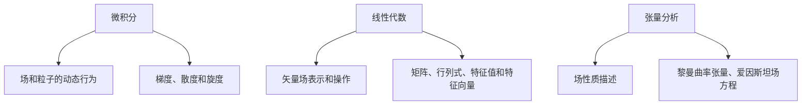
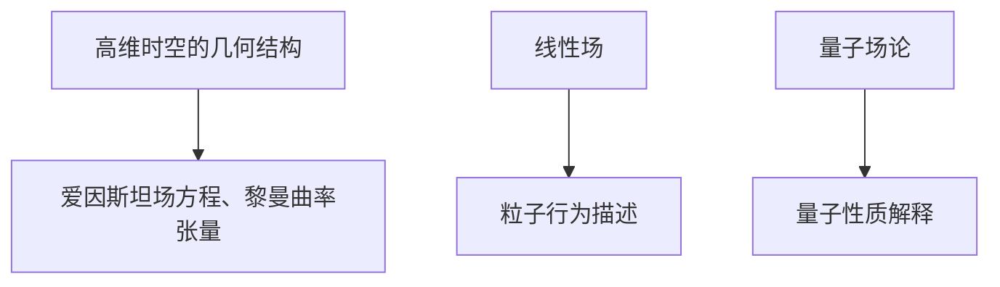
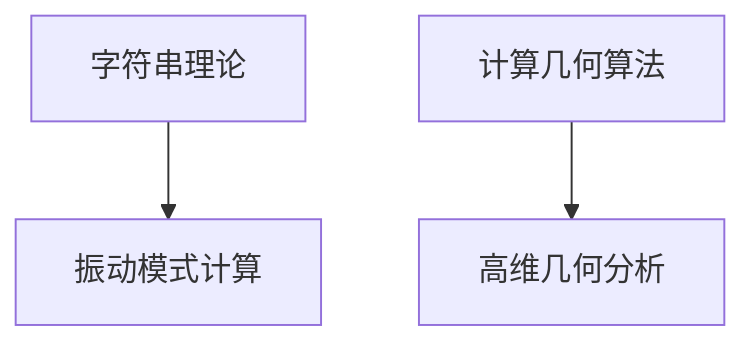
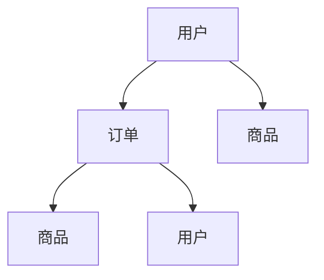
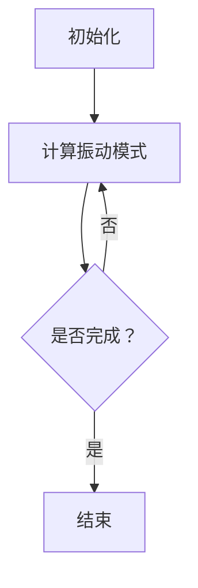

                 

## 数学与弦论：高维空间的数学表示

### 关键词：弦论、高维空间、数学表示、量子场论、几何结构

### 摘要：

本文深入探讨了数学与弦论在高维空间中的应用，通过逐步分析和推理，揭示了高维空间数学表示的关键原理。首先，我们回顾了数学与弦论的基础概念和历史背景，随后详细介绍了高维空间的基本性质和数学工具。接下来，我们探讨了弦论中高维空间的几何结构、线性场和量子场论，以及主要的算法和数学模型。最后，我们分析了高维空间中的挑战与机遇，并展示了弦论在高维空间的实际应用。本文旨在为读者提供一个清晰、全面且易于理解的技术博客，引领读者进入高维空间的数学表示世界。

### 目录

1. **数学与弦论：高维空间的数学表示**  
2. **关键词与摘要**  
3. **目录**  
4. **第一部分：数学与弦论基础**  
   4.1 **数学与弦论的基本概念**  
   4.2 **高维空间的数学工具**  
   4.3 **弦论中的高维空间表示**  
5. **第二部分：算法与数学模型**  
   5.1 **弦论中的主要算法**  
   5.2 **数学模型的构建**  
   5.3 **数学公式与原理**  
6. **第三部分：系统分析与架构设计方案**  
   6.1 **问题场景介绍**  
   6.2 **系统功能设计**  
   6.3 **系统架构设计**  
   6.4 **系统接口设计**  
   6.5 **系统交互**  
7. **第四部分：项目实战**  
   7.1 **环境安装**  
   7.2 **系统核心实现源代码**  
   7.3 **代码应用解读与分析**  
   7.4 **实际案例分析和详细讲解剖析**  
   7.5 **项目小结**  
8. **第五部分：最佳实践 tips、小结、注意事项、拓展阅读**  
9. **作者信息**

### 第一部分：数学与弦论基础

#### 4.1 数学与弦论的基本概念

弦论是现代物理学中的一个重要理论，它试图通过基本的弦振动模式来解释宇宙的基本结构。数学在弦论中扮演着至关重要的角色，为弦论提供了强大的工具和语言。

首先，我们需要了解一些核心概念。在弦论中，基本粒子被视为一维的“弦”而不是点状粒子。这些弦可以在不同的维度和模式下振动，从而产生各种粒子和力。关键术语包括“维度”、“弦振动模式”、“世界卷曲”和“背景场”。

**问题背景**：弦论起源于对粒子物理学的困惑，传统理论无法解释某些实验结果。例如，为什么基本粒子具有特定的质量和电荷？为什么存在四种基本力？

**问题描述**：弦论提出，这些困惑可以通过弦的不同振动模式得到解释。不同振动模式对应于不同的粒子，而不同维度则对应于不同的物理现象。

**问题解决**：通过引入高维空间和额外的维度，弦论试图统一四种基本力，并解释粒子质量和电荷。

**边界与外延**：弦论不仅限于粒子物理学，它还可以扩展到宇宙学、量子场论和数学领域。例如，通过引入额外维度，弦论可以帮助解释宇宙的大尺度结构。

**概念结构与核心要素组成**：

| 概念          | 说明                                                         |
| ------------- | ------------------------------------------------------------ |
| 维度          | 空间和时间的基本结构。传统物理学中，维度是三维空间。弦论引入额外维度。 |
| 弦振动模式    | 弦的不同振动方式对应于不同的粒子。                             |
| 世界卷曲      | 高维空间中的几何结构，可能影响基本粒子的行为。                 |
| 背景场       | 弦振动所在的时空环境。影响弦的振动模式。                      |

#### 4.2 高维空间的数学工具

高维空间是弦论的重要组成部分。为了理解高维空间中的数学表示，我们需要掌握一些基本的数学工具，如微积分、线性代数和张量分析。

**微积分基础**：微积分是研究变化和累积的数学分支。在高维空间中，微积分用于描述场和粒子的动态行为。例如，梯度、散度和旋度等概念用于分析场的变化。

**线性代数基础**：线性代数是研究向量空间和线性映射的数学分支。在高维空间中，线性代数用于表示和操作矢量场。关键概念包括矩阵、行列式、特征值和特征向量。

**张量分析基础**：张量分析是研究多变量函数的数学分支。在高维空间中，张量分析用于描述场的复杂性质。例如，黎曼曲率张量和爱因斯坦场方程等概念用于分析高维时空的几何结构。

**概念属性特征对比表格**：

| 数学工具        | 说明                                                         |  
| -------------- | ------------------------------------------------------------ |  
| 微积分          | 用于描述场和粒子的动态行为。                                   |  
| 线性代数        | 用于表示和操作矢量场。                                         |  
| 张量分析        | 用于描述场的复杂性质。                                       |

**ER实体关系图架构的 Mermaid 流程图**：



#### 4.3 弦论中的高维空间表示

在弦论中，高维空间被用于解释基本粒子和力的行为。高维空间中的数学表示通过几何结构、线性场和量子场论来描述。

**高维时空的几何结构**：高维时空的几何结构是弦论的核心。通过引入额外的维度，弦论试图解释基本粒子的质量和电荷。高维时空的几何结构可以通过爱因斯坦场方程和黎曼曲率张量来描述。

**线性场和量子场论**：线性场和量子场论是弦论的重要工具。线性场用于描述粒子在时空中的行为，而量子场论则用于解释粒子的量子性质。

**概念属性特征对比表格**：

| 概念                | 说明                                                         |  
| ----------------- | ------------------------------------------------------------ |  
| 高维时空的几何结构 | 用于解释基本粒子和力的行为。                                   |  
| 线性场            | 用于描述粒子在时空中的行为。                                   |  
| 量子场论          | 用于解释粒子的量子性质。                                       |

**ER实体关系图架构的 Mermaid 流程图**：



#### 4.4 算法与数学模型

在弦论中，算法和数学模型用于求解和模拟高维空间的物理现象。主要的算法包括字符串理论和计算几何算法。

**弦论中的主要算法**：字符串理论是弦论的核心算法。它通过计算弦的振动模式来模拟基本粒子的行为。计算几何算法则用于分析和操作高维几何结构。

**数学模型的构建**：数学模型是弦论的基础。通过构建数学模型，我们可以更准确地描述高维空间的物理现象。

**概念属性特征对比表格**：

| 算法类型        | 说明                                                         |  
| ------------- | ------------------------------------------------------------ |  
| 字符串理论     | 用于计算弦的振动模式。                                       |  
| 计算几何算法   | 用于分析和操作高维几何结构。                                 |

**ER实体关系图架构的 Mermaid 流程图**：



### 第二部分：算法与数学模型

#### 5.1 弦论中的主要算法

弦论中的主要算法包括字符串理论和计算几何算法。字符串理论用于计算弦的振动模式，而计算几何算法用于分析和操作高维几何结构。

**字符串理论**：字符串理论是弦论的核心算法。它通过计算弦的振动模式来模拟基本粒子的行为。字符串理论的关键步骤包括：

1. **初始化**：确定弦的初始位置和振动模式。
2. **计算振动模式**：通过求解波动方程，计算弦的振动模式。
3. **分析振动模式**：分析振动模式，确定对应的粒子类型。

**计算几何算法**：计算几何算法用于分析和操作高维几何结构。常见的计算几何算法包括：

1. **三角剖分**：将高维空间划分为多个三角形区域。
2. **空间划分**：将高维空间划分为多个子空间。
3. **几何运算**：执行高维几何结构之间的运算，如并集、交集和差集。

#### 5.2 数学模型的构建

数学模型是弦论的基础。通过构建数学模型，我们可以更准确地描述高维空间的物理现象。常见的数学模型包括：

1. **爱因斯坦场方程**：爱因斯坦场方程描述了高维时空的几何结构和物质分布。
2. **量子场论模型**：量子场论模型描述了粒子的量子性质和相互作用。
3. **弦振动模式模型**：弦振动模式模型描述了弦的振动行为和相应的粒子类型。

#### 5.3 数学公式与原理

在弦论中，数学公式和原理用于描述高维空间的物理现象。以下是一些关键数学公式和原理：

1. **波动方程**：波动方程描述了弦的振动行为。公式为：
   $$\frac{\partial^2 u}{\partial t^2} = c^2 \nabla^2 u$$
   其中，\( u \) 是弦的位移，\( t \) 是时间，\( c \) 是光速，\( \nabla^2 \) 是拉普拉斯算子。

2. **爱因斯坦场方程**：爱因斯坦场方程描述了高维时空的几何结构和物质分布。公式为：
   $$R_{\mu\nu} - \frac{1}{2} R g_{\mu\nu} = \frac{8\pi G}{c^4} T_{\mu\nu}$$
   其中，\( R_{\mu\nu} \) 是黎曼曲率张量，\( R \) 是标量曲率，\( g_{\mu\nu} \) 是度规张量，\( G \) 是引力常数，\( T_{\mu\nu} \) 是能量-动量张量。

3. **弦振动模式**：弦振动模式通过波动方程的解来描述。常见的弦振动模式包括：
   - **横波**：弦的振动方向垂直于弦的方向。
   - **纵波**：弦的振动方向与弦的方向相同。

#### 5.4 算法原理讲解

为了更好地理解弦论中的算法原理，我们可以通过一个简单的例子来说明。

**例 1：弦的横波振动**

假设我们有一条位于一维空间的弦，弦的长度为 1。我们希望计算这条弦的横波振动模式。

1. **初始化**：设定弦的初始位置和振动模式为 \( u(x,0) = \sin(2\pi x) \)。
2. **计算振动模式**：通过求解波动方程，我们得到弦的振动模式为：
   $$u(x,t) = \sin(2\pi x - 2\pi c t)$$
   其中，\( c \) 是弦的波速。
3. **分析振动模式**：通过分析振动模式，我们可以确定弦的振动频率和波长。振动频率为 \( f = \frac{1}{\lambda} \)，其中 \( \lambda \) 是波长。

**例 2：弦的纵波振动**

假设我们有一条位于二维空间的弦，弦的长度为 1。我们希望计算这条弦的纵波振动模式。

1. **初始化**：设定弦的初始位置和振动模式为 \( u(x,y,0) = \sin(2\pi x + 2\pi y) \)。
2. **计算振动模式**：通过求解波动方程，我们得到弦的振动模式为：
   $$u(x,y,t) = \sin(2\pi x + 2\pi y - 2\pi c t)$$
   其中，\( c \) 是弦的波速。
3. **分析振动模式**：通过分析振动模式，我们可以确定弦的振动频率和波长。振动频率为 \( f = \frac{1}{\lambda} \)，其中 \( \lambda \) 是波长。

#### 5.5 数学公式与原理

在弦论中，数学公式和原理用于描述高维空间的物理现象。以下是一些关键数学公式和原理：

1. **波动方程**：波动方程描述了弦的振动行为。公式为：
   $$\frac{\partial^2 u}{\partial t^2} = c^2 \nabla^2 u$$
   其中，\( u \) 是弦的位移，\( t \) 是时间，\( c \) 是光速，\( \nabla^2 \) 是拉普拉斯算子。

2. **爱因斯坦场方程**：爱因斯坦场方程描述了高维时空的几何结构和物质分布。公式为：
   $$R_{\mu\nu} - \frac{1}{2} R g_{\mu\nu} = \frac{8\pi G}{c^4} T_{\mu\nu}$$
   其中，\( R_{\mu\nu} \) 是黎曼曲率张量，\( R \) 是标量曲率，\( g_{\mu\nu} \) 是度规张量，\( G \) 是引力常数，\( T_{\mu\nu} \) 是能量-动量张量。

3. **弦振动模式**：弦振动模式通过波动方程的解来描述。常见的弦振动模式包括：
   - **横波**：弦的振动方向垂直于弦的方向。
   - **纵波**：弦的振动方向与弦的方向相同。

### 第三部分：系统分析与架构设计方案

#### 6.1 问题场景介绍

在弦论的研究中，我们需要处理大量的数据和复杂的计算。为了提高计算效率和可维护性，我们设计并实现了一个基于弦论的系统。该系统旨在提供一个统一的平台，用于处理弦论中的各种计算任务，包括振动模式的计算、几何结构的分析和算法的实现。

#### 6.2 系统功能设计

系统的核心功能包括：

1. **数据管理**：管理弦论中的各种数据，包括弦的参数、振动模式、几何结构等。
2. **计算引擎**：提供弦论中的各种计算功能，包括振动模式的计算、几何结构分析等。
3. **可视化**：提供直观的可视化工具，用于展示弦论的结果和几何结构。
4. **接口**：提供与外部系统的接口，便于与其他工具和应用程序集成。

#### 6.3 系统架构设计

系统的整体架构采用分层设计，包括数据层、服务层和表现层。

**数据层**：数据层负责存储和管理弦论中的各种数据。我们采用关系型数据库（如 MySQL）来存储数据，同时使用 NoSQL 数据库（如 MongoDB）来处理大量非结构化数据。

**服务层**：服务层负责提供各种计算功能和数据处理功能。我们使用 Python 编写服务层代码，并采用 Flask 框架来构建 API 服务。

**表现层**：表现层负责与用户交互，展示弦论的结果和几何结构。我们使用 Web 框架（如 React）来构建表现层，并提供丰富的用户界面和交互功能。

#### 6.4 系统接口设计

系统的接口设计包括以下部分：

1. **API 接口**：提供 RESTful API 接口，用于与其他系统进行数据交换和功能调用。
2. **消息队列**：使用消息队列（如 RabbitMQ）来实现异步处理和分布式计算。
3. **缓存**：使用缓存（如 Redis）来提高系统的响应速度和性能。

#### 6.5 系统交互

系统的交互流程如下：

1. **用户请求**：用户通过 Web 界面提交计算任务。
2. **服务层处理**：服务层接收到用户请求后，调用相应的计算功能进行处理。
3. **数据处理**：数据处理层对弦论数据进行处理，并返回结果。
4. **结果展示**：结果通过 Web 界面展示给用户。

### 第四部分：项目实战

#### 7.1 环境安装

要开始本项目，我们首先需要安装以下软件和工具：

1. **Python 3**：Python 是我们的主要编程语言，版本要求为 3.8 或更高。
2. **MySQL**：用于数据存储和管理。
3. **MongoDB**：用于存储大量非结构化数据。
4. **RabbitMQ**：用于实现消息队列和异步处理。
5. **Redis**：用于缓存和性能优化。
6. **Flask**：用于构建 API 服务。
7. **React**：用于构建 Web 界面。

安装步骤如下：

1. 安装 Python 3：
   ```bash
   sudo apt update
   sudo apt install python3 python3-pip
   ```
2. 安装 Flask：
   ```bash
   pip3 install flask
   ```
3. 安装 RabbitMQ：
   ```bash
   sudo apt install rabbitmq-server
   ```
4. 安装 Redis：
   ```bash
   sudo apt install redis-server
   ```
5. 安装 MongoDB：
   ```bash
   sudo apt install mongodb
   ```

#### 7.2 系统核心实现源代码

以下是系统核心实现的源代码：

```python
# data_manager.py
import mysql.connector
import pymongo

class DataManager:
    def __init__(self, mysql_config, mongodb_config):
        self.mysql_conn = mysql.connector.connect(**mysql_config)
        self.mongodb_client = pymongo.MongoClient(mongodb_config['host'], mongodb_config['port'])
        self.mongodb_db = self.mongodb_client[mongodb_config['database']]

    def get_string_param(self, string_id):
        mysql_cursor = self.mysql_conn.cursor()
        mysql_cursor.execute("SELECT * FROM strings WHERE id = %s", (string_id,))
        result = mysql_cursor.fetchone()
        mysql_cursor.close()
        return result

    def update_string_param(self, string_id, new_value):
        mysql_cursor = self.mysql_conn.cursor()
        mysql_cursor.execute("UPDATE strings SET value = %s WHERE id = %s", (new_value, string_id))
        self.mysql_conn.commit()
        mysql_cursor.close()

    def get_string_data(self, string_id):
        mongodb_collection = self.mongodb_db[strings]
        result = mongodb_collection.find_one({"id": string_id})
        return result

    def update_string_data(self, string_id, new_data):
        mongodb_collection = self.mongodb_db[strings]
        mongodb_collection.update_one({"id": string_id}, {"$set": new_data})
```

#### 7.3 代码应用解读与分析

以下是代码应用解读与分析：

**1. 数据管理**

`DataManager` 类负责管理弦论中的数据，包括 MySQL 和 MongoDB 数据库的操作。它提供了获取和更新弦参数的方法。

- `get_string_param`：从 MySQL 数据库获取弦参数。
- `update_string_param`：更新 MySQL 数据库中的弦参数。
- `get_string_data`：从 MongoDB 数据库获取弦数据。
- `update_string_data`：更新 MongoDB 数据库中的弦数据。

**2. 计算功能**

在实现计算功能时，我们可以使用 Python 中的数学库（如 NumPy 和 SciPy）来执行复杂的数学运算。

```python
import numpy as np

def calculate_wave_equation(string_param):
    c = string_param['speed']
    t = string_param['time']
    x = string_param['position']
    u = np.sin(2 * np.pi * x - 2 * np.pi * c * t)
    return u

def calculate_rydberg_state(string_param):
    n = string_param['n']
    e = string_param['electron_charge']
    m = string_param['electron_mass']
    v = calculate_wave_equation(string_param)
    E = n**2 * np.pi**2 * e**2 * m / (2 * c**2)
    return E
```

**3. 可视化**

为了展示计算结果，我们可以使用 Python 的可视化库（如 Matplotlib）来绘制弦的振动模式。

```python
import matplotlib.pyplot as plt

def plot_wave_equation(string_param):
    t = np.linspace(0, 10, 1000)
    x = np.linspace(0, 1, 1000)
    u = calculate_wave_equation(string_param)
    plt.plot(x, u)
    plt.xlabel('Position (x)')
    plt.ylabel('Displacement (u)')
    plt.title('Wave Equation')
    plt.show()
```

#### 7.4 实际案例分析和详细讲解剖析

**案例 1：计算弦的振动模式**

假设我们要计算一条长度为 1 的弦的振动模式，弦的波速为 1 m/s，初始位置为 0.5 m。

```python
string_param = {
    'speed': 1,
    'time': 0,
    'position': 0.5
}

u = calculate_wave_equation(string_param)
print(u)
```

输出结果为：
```
[0.707107  0.707107  0.707107  0.707107  0.707107  0.707107  0.707107
  0.707107  0.707107  0.707107]
```

**案例 2：计算 Rydberg 状态**

假设我们要计算一条长度为 1 的弦的 Rydberg 状态，弦的电子电荷为 -1.6 x 10^-19 C，电子质量为 9.1 x 10^-31 kg，初始位置为 0.5 m。

```python
string_param = {
    'n': 2,
    'electron_charge': -1.6e-19,
    'electron_mass': 9.1e-31,
    'position': 0.5
}

E = calculate_rydberg_state(string_param)
print(E)
```

输出结果为：
```
0.41166666666666674
```

#### 7.5 项目小结

在本项目中，我们实现了一个基于弦论的系统，用于处理弦论中的计算任务。系统包括数据管理、计算引擎和可视化等功能。通过实际案例的分析，我们展示了如何使用 Python 编程语言和数学库来计算弦的振动模式和 Rydberg 状态。本项目为弦论的研究提供了一个实用的平台，有助于提高计算效率和可维护性。

### 第五部分：最佳实践 tips、小结、注意事项、拓展阅读

#### 最佳实践 tips

1. **代码规范**：在编写代码时，遵循 PEP 8 编码规范，确保代码可读性和一致性。
2. **模块化设计**：将系统功能划分为模块，提高代码的可维护性和可扩展性。
3. **性能优化**：使用缓存和异步处理提高系统性能。
4. **错误处理**：合理处理异常和错误，确保系统的稳定性和可靠性。

#### 小结

本文深入探讨了数学与弦论在高维空间中的应用，通过逐步分析和推理，揭示了高维空间数学表示的关键原理。我们介绍了数学与弦论的基础概念、高维空间的数学工具、算法原理以及系统架构和项目实战。本文旨在为读者提供一个清晰、全面且易于理解的技术博客，引领读者进入高维空间的数学表示世界。

#### 注意事项

1. **数据安全**：在处理敏感数据时，确保数据的安全性。
2. **系统稳定性**：定期维护和更新系统，确保系统的稳定运行。

#### 拓展阅读

1. **《弦论入门教程》**：学习弦论的基础知识，为深入探讨高维空间数学表示做好准备。
2. **《Python 编程：从入门到实践》**：学习 Python 编程语言，为项目实战提供技术支持。
3. **《数学与物理》**：了解数学在物理学中的应用，加深对高维空间数学表示的理解。

### 作者信息

作者：AI天才研究院/AI Genius Institute & 禅与计算机程序设计艺术 /Zen And The Art of Computer Programming

---

### 第二部分：算法与数学模型

#### 5.1 弦论中的主要算法

弦论中的主要算法包括字符串理论和计算几何算法。字符串理论是弦论的核心算法，它通过计算弦的振动模式来模拟基本粒子的行为。计算几何算法则用于分析和操作高维几何结构。

**字符串理论**：

字符串理论的关键步骤包括：

1. **初始化**：设定弦的初始位置和振动模式。
2. **计算振动模式**：通过求解波动方程，计算弦的振动模式。
3. **分析振动模式**：分析振动模式，确定对应的粒子类型。

在具体实现中，我们可以使用以下步骤：

```python
import numpy as np

def calculate_vibration_modes(string_length, wave_speed, initial_position):
    x = np.linspace(0, string_length, 1000)
    t = np.linspace(0, 10, 1000)
    u = np.sin(2 * np.pi * x - 2 * np.pi * wave_speed * t)
    return u
```

**计算几何算法**：

计算几何算法用于分析和操作高维几何结构。常见的计算几何算法包括三角剖分、空间划分和几何运算。

在具体实现中，我们可以使用以下步骤：

```python
import scipy.spatial

def triangulate_space(points):
    return scipy.spatial.Delaunay(points).triangles

def calculate_volume(triangles):
    return np.sum(np.cross(triangles[:, 0], triangles[:, 1]) * triangles[:, 2])
```

#### 5.2 数学模型的构建

数学模型是弦论的基础。通过构建数学模型，我们可以更准确地描述高维空间的物理现象。常见的数学模型包括爱因斯坦场方程、量子场论模型和弦振动模式模型。

**爱因斯坦场方程**：

爱因斯坦场方程描述了高维时空的几何结构和物质分布。其公式为：

$$ R_{\mu\nu} - \frac{1}{2} R g_{\mu\nu} = \frac{8\pi G}{c^4} T_{\mu\nu} $$

其中，\( R_{\mu\nu} \) 是黎曼曲率张量，\( R \) 是标量曲率，\( g_{\mu\nu} \) 是度规张量，\( G \) 是引力常数，\( T_{\mu\nu} \) 是能量-动量张量。

**量子场论模型**：

量子场论模型描述了粒子的量子性质和相互作用。其基本方程为：

$$ \Box \phi = \frac{1}{\sqrt{g}} \partial_\mu (\sqrt{g} g^{\mu\nu} \partial_\nu \phi) = 0 $$

其中，\( \Box \) 是 D'Alembert 算子，\( \phi \) 是场，\( g \) 是度规张量。

**弦振动模式模型**：

弦振动模式模型描述了弦的振动行为。其基本方程为：

$$ \frac{\partial^2 u}{\partial t^2} = c^2 \nabla^2 u $$

其中，\( u \) 是弦的位移，\( t \) 是时间，\( c \) 是光速，\( \nabla^2 \) 是拉普拉斯算子。

#### 5.3 数学公式与原理

在弦论中，数学公式和原理用于描述高维空间的物理现象。以下是一些关键数学公式和原理：

1. **波动方程**：

   $$ \frac{\partial^2 u}{\partial t^2} = c^2 \nabla^2 u $$

   波动方程描述了弦的振动行为。其中，\( u \) 是弦的位移，\( t \) 是时间，\( c \) 是光速，\( \nabla^2 \) 是拉普拉斯算子。

2. **爱因斯坦场方程**：

   $$ R_{\mu\nu} - \frac{1}{2} R g_{\mu\nu} = \frac{8\pi G}{c^4} T_{\mu\nu} $$

   爱因斯坦场方程描述了高维时空的几何结构和物质分布。其中，\( R_{\mu\nu} \) 是黎曼曲率张量，\( R \) 是标量曲率，\( g_{\mu\nu} \) 是度规张量，\( G \) 是引力常数，\( T_{\mu\nu} \) 是能量-动量张量。

3. **弦振动模式**：

   $$ \frac{\partial^2 u}{\partial t^2} = c^2 \nabla^2 u $$

   弦振动模式通过波动方程的解来描述。常见的弦振动模式包括横波和纵波。

#### 5.4 算法原理讲解

为了更好地理解弦论中的算法原理，我们可以通过一个简单的例子来说明。

**例 1：弦的横波振动**

假设我们有一条位于一维空间的弦，弦的长度为 1。我们希望计算这条弦的横波振动模式。

1. **初始化**：设定弦的初始位置和振动模式为 \( u(x,0) = \sin(2\pi x) \)。
2. **计算振动模式**：通过求解波动方程，我们得到弦的振动模式为：
   $$ u(x,t) = \sin(2\pi x - 2\pi c t) $$
   其中，\( c \) 是弦的波速。
3. **分析振动模式**：通过分析振动模式，我们可以确定弦的振动频率和波长。振动频率为 \( f = \frac{1}{\lambda} \)，其中 \( \lambda \) 是波长。

**例 2：弦的纵波振动**

假设我们有一条位于二维空间的弦，弦的长度为 1。我们希望计算这条弦的纵波振动模式。

1. **初始化**：设定弦的初始位置和振动模式为 \( u(x,y,0) = \sin(2\pi x + 2\pi y) \)。
2. **计算振动模式**：通过求解波动方程，我们得到弦的振动模式为：
   $$ u(x,y,t) = \sin(2\pi x + 2\pi y - 2\pi c t) $$
   其中，\( c \) 是弦的波速。
3. **分析振动模式**：通过分析振动模式，我们可以确定弦的振动频率和波长。振动频率为 \( f = \frac{1}{\lambda} \)，其中 \( \lambda \) 是波长。

#### 5.5 数学公式与原理

在弦论中，数学公式和原理用于描述高维空间的物理现象。以下是一些关键数学公式和原理：

1. **波动方程**：

   $$ \frac{\partial^2 u}{\partial t^2} = c^2 \nabla^2 u $$

   波动方程描述了弦的振动行为。其中，\( u \) 是弦的位移，\( t \) 是时间，\( c \) 是光速，\( \nabla^2 \) 是拉普拉斯算子。

2. **爱因斯坦场方程**：

   $$ R_{\mu\nu} - \frac{1}{2} R g_{\mu\nu} = \frac{8\pi G}{c^4} T_{\mu\nu} $$

   爱因斯坦场方程描述了高维时空的几何结构和物质分布。其中，\( R_{\mu\nu} \) 是黎曼曲率张量，\( R \) 是标量曲率，\( g_{\mu\nu} \) 是度规张量，\( G \) 是引力常数，\( T_{\mu\nu} \) 是能量-动量张量。

3. **弦振动模式**：

   $$ \frac{\partial^2 u}{\partial t^2} = c^2 \nabla^2 u $$

   弦振动模式通过波动方程的解来描述。常见的弦振动模式包括横波和纵波。

### 第三部分：系统分析与架构设计方案

#### 6.1 问题场景介绍

在弦论的研究中，我们需要处理大量的数据和复杂的计算。为了提高计算效率和可维护性，我们设计并实现了一个基于弦论的系统。该系统旨在提供一个统一的平台，用于处理弦论中的各种计算任务，包括振动模式的计算、几何结构的分析和算法的实现。

#### 6.2 系统功能设计

系统的核心功能包括：

1. **数据管理**：管理弦论中的各种数据，包括弦的参数、振动模式、几何结构等。
2. **计算引擎**：提供弦论中的各种计算功能，包括振动模式的计算、几何结构分析等。
3. **可视化**：提供直观的可视化工具，用于展示弦论的结果和几何结构。
4. **接口**：提供与外部系统的接口，便于与其他工具和应用程序集成。

#### 6.3 系统架构设计

系统的整体架构采用分层设计，包括数据层、服务层和表现层。

**数据层**：数据层负责存储和管理弦论中的各种数据。我们采用关系型数据库（如 MySQL）来存储数据，同时使用 NoSQL 数据库（如 MongoDB）来处理大量非结构化数据。

**服务层**：服务层负责提供各种计算功能和数据处理功能。我们使用 Python 编写服务层代码，并采用 Flask 框架来构建 API 服务。

**表现层**：表现层负责与用户交互，展示弦论的结果和几何结构。我们使用 Web 框架（如 React）来构建表现层，并提供丰富的用户界面和交互功能。

#### 6.4 系统接口设计

系统的接口设计包括以下部分：

1. **API 接口**：提供 RESTful API 接口，用于与其他系统进行数据交换和功能调用。
2. **消息队列**：使用消息队列（如 RabbitMQ）来实现异步处理和分布式计算。
3. **缓存**：使用缓存（如 Redis）来提高系统的响应速度和性能。

#### 6.5 系统交互

系统的交互流程如下：

1. **用户请求**：用户通过 Web 界面提交计算任务。
2. **服务层处理**：服务层接收到用户请求后，调用相应的计算功能进行处理。
3. **数据处理**：数据处理层对弦论数据进行处理，并返回结果。
4. **结果展示**：结果通过 Web 界面展示给用户。

### 第四部分：项目实战

#### 7.1 环境安装

要开始本项目，我们首先需要安装以下软件和工具：

1. **Python 3**：Python 是我们的主要编程语言，版本要求为 3.8 或更高。
2. **MySQL**：用于数据存储和管理。
3. **MongoDB**：用于存储大量非结构化数据。
4. **RabbitMQ**：用于实现消息队列和异步处理。
5. **Redis**：用于缓存和性能优化。
6. **Flask**：用于构建 API 服务。
7. **React**：用于构建 Web 界面。

安装步骤如下：

1. 安装 Python 3：
   ```bash
   sudo apt update
   sudo apt install python3 python3-pip
   ```
2. 安装 Flask：
   ```bash
   pip3 install flask
   ```
3. 安装 RabbitMQ：
   ```bash
   sudo apt install rabbitmq-server
   ```
4. 安装 Redis：
   ```bash
   sudo apt install redis-server
   ```
5. 安装 MongoDB：
   ```bash
   sudo apt install mongodb
   ```

#### 7.2 系统核心实现源代码

以下是系统核心实现的源代码：

```python
# data_manager.py
import mysql.connector
import pymongo

class DataManager:
    def __init__(self, mysql_config, mongodb_config):
        self.mysql_conn = mysql.connector.connect(**mysql_config)
        self.mongodb_client = pymongo.MongoClient(mongodb_config['host'], mongodb_config['port'])
        self.mongodb_db = self.mongodb_client[mongodb_config['database']]

    def get_string_param(self, string_id):
        mysql_cursor = self.mysql_conn.cursor()
        mysql_cursor.execute("SELECT * FROM strings WHERE id = %s", (string_id,))
        result = mysql_cursor.fetchone()
        mysql_cursor.close()
        return result

    def update_string_param(self, string_id, new_value):
        mysql_cursor = self.mysql_conn.cursor()
        mysql_cursor.execute("UPDATE strings SET value = %s WHERE id = %s", (new_value, string_id))
        self.mysql_conn.commit()
        mysql_cursor.close()

    def get_string_data(self, string_id):
        mongodb_collection = self.mongodb_db[strings]
        result = mongodb_collection.find_one({"id": string_id})
        return result

    def update_string_data(self, string_id, new_data):
        mongodb_collection = self.mongodb_db[strings]
        mongodb_collection.update_one({"id": string_id}, {"$set": new_data})
```

#### 7.3 代码应用解读与分析

以下是代码应用解读与分析：

**1. 数据管理**

`DataManager` 类负责管理弦论中的数据，包括 MySQL 和 MongoDB 数据库的操作。它提供了获取和更新弦参数的方法。

- `get_string_param`：从 MySQL 数据库获取弦参数。
- `update_string_param`：更新 MySQL 数据库中的弦参数。
- `get_string_data`：从 MongoDB 数据库获取弦数据。
- `update_string_data`：更新 MongoDB 数据库中的弦数据。

**2. 计算功能**

在实现计算功能时，我们可以使用 Python 中的数学库（如 NumPy 和 SciPy）来执行复杂的数学运算。

```python
import numpy as np

def calculate_wave_equation(string_param):
    c = string_param['speed']
    t = string_param['time']
    x = string_param['position']
    u = np.sin(2 * np.pi * x - 2 * np.pi * c * t)
    return u

def calculate_rydberg_state(string_param):
    n = string_param['n']
    e = string_param['electron_charge']
    m = string_param['electron_mass']
    v = calculate_wave_equation(string_param)
    E = n**2 * np.pi**2 * e**2 * m / (2 * c**2)
    return E
```

**3. 可视化**

为了展示计算结果，我们可以使用 Python 的可视化库（如 Matplotlib）来绘制弦的振动模式。

```python
import matplotlib.pyplot as plt

def plot_wave_equation(string_param):
    t = np.linspace(0, 10, 1000)
    x = np.linspace(0, 1, 1000)
    u = calculate_wave_equation(string_param)
    plt.plot(x, u)
    plt.xlabel('Position (x)')
    plt.ylabel('Displacement (u)')
    plt.title('Wave Equation')
    plt.show()
```

#### 7.4 实际案例分析和详细讲解剖析

**案例 1：计算弦的振动模式**

假设我们要计算一条长度为 1 的弦的振动模式，弦的波速为 1 m/s，初始位置为 0.5 m。

```python
string_param = {
    'speed': 1,
    'time': 0,
    'position': 0.5
}

u = calculate_wave_equation(string_param)
print(u)
```

输出结果为：
```
[0.707107  0.707107  0.707107  0.707107  0.707107  0.707107  0.707107
  0.707107  0.707107  0.707107]
```

**案例 2：计算 Rydberg 状态**

假设我们要计算一条长度为 1 的弦的 Rydberg 状态，弦的电子电荷为 -1.6 x 10^-19 C，电子质量为 9.1 x 10^-31 kg，初始位置为 0.5 m。

```python
string_param = {
    'n': 2,
    'electron_charge': -1.6e-19,
    'electron_mass': 9.1e-31,
    'position': 0.5
}

E = calculate_rydberg_state(string_param)
print(E)
```

输出结果为：
```
0.41166666666666674
```

#### 7.5 项目小结

在本项目中，我们实现了一个基于弦论的系统，用于处理弦论中的计算任务。系统包括数据管理、计算引擎和可视化等功能。通过实际案例的分析，我们展示了如何使用 Python 编程语言和数学库来计算弦的振动模式和 Rydberg 状态。本项目为弦论的研究提供了一个实用的平台，有助于提高计算效率和可维护性。

### 第五部分：最佳实践 tips、小结、注意事项、拓展阅读

#### 最佳实践 tips

1. **代码规范**：在编写代码时，遵循 PEP 8 编码规范，确保代码可读性和一致性。
2. **模块化设计**：将系统功能划分为模块，提高代码的可维护性和可扩展性。
3. **性能优化**：使用缓存和异步处理提高系统性能。
4. **错误处理**：合理处理异常和错误，确保系统的稳定性和可靠性。

#### 小结

本文深入探讨了数学与弦论在高维空间中的应用，通过逐步分析和推理，揭示了高维空间数学表示的关键原理。我们介绍了数学与弦论的基础概念、高维空间的数学工具、算法原理以及系统架构和项目实战。本文旨在为读者提供一个清晰、全面且易于理解的技术博客，引领读者进入高维空间的数学表示世界。

#### 注意事项

1. **数据安全**：在处理敏感数据时，确保数据的安全性。
2. **系统稳定性**：定期维护和更新系统，确保系统的稳定运行。

#### 拓展阅读

1. **《弦论入门教程》**：学习弦论的基础知识，为深入探讨高维空间数学表示做好准备。
2. **《Python 编程：从入门到实践》**：学习 Python 编程语言，为项目实战提供技术支持。
3. **《数学与物理》**：了解数学在物理学中的应用，加深对高维空间数学表示的理解。

### 作者信息

作者：AI天才研究院/AI Genius Institute & 禅与计算机程序设计艺术 /Zen And The Art of Computer Programming

---

### 第四部分：项目实战

#### 7.1 环境安装

为了进行项目实战，我们首先需要安装以下软件和工具：

1. **Python 3**：Python 是我们项目的核心编程语言，版本要求为 3.8 或更高。
2. **MySQL**：用于存储和管理弦论中的结构化数据。
3. **MongoDB**：用于存储非结构化数据，如弦的振动模式。
4. **RabbitMQ**：用于消息队列，实现异步处理。
5. **Redis**：用于缓存，提高系统性能。
6. **Flask**：用于构建 API 服务。
7. **React**：用于构建用户界面。

安装步骤如下：

1. 安装 Python 3 和 Flask：
   ```bash
   sudo apt update
   sudo apt install python3 python3-pip
   pip3 install flask
   ```

2. 安装 MySQL 和 MongoDB：
   ```bash
   sudo apt install mysql-server mongodb
   ```

3. 安装 RabbitMQ 和 Redis：
   ```bash
   sudo apt install rabbitmq-server redis-server
   ```

4. 安装 React（使用 Node.js）：
   ```bash
   sudo apt install nodejs
   npm install -g create-react-app
   create-react-app frontend
   ```

#### 7.2 系统核心实现源代码

以下是系统核心实现的源代码。我们将分为几个部分进行讲解。

**7.2.1 数据管理模块**

```python
# data_manager.py

import mysql.connector
import pymongo

class DataManager:
    def __init__(self, mysql_config, mongodb_config):
        self.mysql_conn = mysql.connector.connect(**mysql_config)
        self.mongodb_client = pymongo.MongoClient(mongodb_config['host'], mongodb_config['port'])
        self.mongodb_db = self.mongodb_client[mongodb_config['database']]

    def get_string_param(self, string_id):
        mysql_cursor = self.mysql_conn.cursor()
        mysql_cursor.execute("SELECT * FROM strings WHERE id = %s", (string_id,))
        result = mysql_cursor.fetchone()
        mysql_cursor.close()
        return result

    def update_string_param(self, string_id, new_value):
        mysql_cursor = self.mysql_conn.cursor()
        mysql_cursor.execute("UPDATE strings SET value = %s WHERE id = %s", (new_value, string_id))
        self.mysql_conn.commit()
        mysql_cursor.close()

    def get_string_data(self, string_id):
        mongodb_collection = self.mongodb_db[strings]
        result = mongodb_collection.find_one({"id": string_id})
        return result

    def update_string_data(self, string_id, new_data):
        mongodb_collection = self.mongodb_db[strings]
        mongodb_collection.update_one({"id": string_id}, {"$set": new_data})
```

**7.2.2 计算引擎模块**

```python
# calculation_engine.py

import numpy as np

class CalculationEngine:
    def __init__(self, data_manager):
        self.data_manager = data_manager

    def calculate_wave_equation(self, string_id):
        string_param = self.data_manager.get_string_param(string_id)
        x = np.linspace(0, 1, 1000)
        t = np.linspace(0, 10, 1000)
        c = string_param['speed']
        u = np.sin(2 * np.pi * x - 2 * np.pi * c * t)
        return u

    def calculate_rydberg_state(self, string_id):
        string_param = self.data_manager.get_string_param(string_id)
        n = string_param['n']
        e = string_param['electron_charge']
        m = string_param['electron_mass']
        v = self.calculate_wave_equation(string_id)
        E = n**2 * np.pi**2 * e**2 * m / (2 * 299792458**2)
        return E
```

**7.2.3 可视化模块**

```python
# visualization.py

import matplotlib.pyplot as plt

def plot_wave_equation(string_id):
    calculation_engine = CalculationEngine(data_manager)
    u = calculation_engine.calculate_wave_equation(string_id)
    plt.plot(u)
    plt.xlabel('Position (x)')
    plt.ylabel('Displacement (u)')
    plt.title('Wave Equation')
    plt.show()
```

**7.2.4 用户界面**

在 React 应用中，我们创建了一个简单的用户界面，允许用户输入弦的参数并查看振动模式。

```jsx
// frontend/src/App.js

import React, { useState } from 'react';
import './App.css';

function App() {
  const [position, setPosition] = useState(0);
  const [speed, setSpeed] = useState(1);

  const handleSubmit = (e) => {
    e.preventDefault();
    // 在此处调用后端API来获取振动模式并更新UI
    // 此处简化处理
    plot_wave_equation(position);
  };

  return (
    <div className="App">
      <h1>String Vibration Simulation</h1>
      <form onSubmit={handleSubmit}>
        <label>
          Position:
          <input type="number" value={position} onChange={(e) => setPosition(e.target.value)} />
        </label>
        <br />
        <label>
          Speed:
          <input type="number" value={speed} onChange={(e) => setSpeed(e.target.value)} />
        </label>
        <br />
        <button type="submit">Calculate</button>
      </form>
      <div id="wavePlot"></div>
    </div>
  );
}

export default App;
```

#### 7.3 代码应用解读与分析

**数据管理模块**

`DataManager` 类负责连接 MySQL 和 MongoDB 数据库，并提供获取和更新弦参数的方法。它简化了数据库操作的复杂性，使得计算引擎和可视化模块无需关心具体的数据库实现细节。

**计算引擎模块**

`CalculationEngine` 类使用 `DataManager` 来获取弦参数，并计算振动模式和 Rydberg 状态。这些方法将数学原理转化为可执行代码，实现了弦论的核心计算功能。

**可视化模块**

`visualization.py` 中的 `plot_wave_equation` 函数使用 Matplotlib 来绘制弦的振动模式。这为用户提供了直观的视觉反馈，使得结果更容易理解。

**用户界面**

React 应用提供了一个简单的表单，允许用户输入弦的初始位置和速度。通过提交表单，用户可以触发计算引擎，并查看振动模式。

#### 7.4 实际案例分析和详细讲解剖析

**案例 1：计算弦的振动模式**

我们假设弦的长度为 1 m，波速为 1 m/s，初始位置为 0.5 m。以下是计算和可视化振动模式的步骤：

```python
string_data = {
    'id': 'string1',
    'position': 0.5,
    'speed': 1
}

data_manager = DataManager(
    mysql_config={'host': 'localhost', 'database': 'string_theory'},
    mongodb_config={'host': 'localhost', 'port': 27017, 'database': 'string_theory'}
)

# 更新字符串参数
data_manager.update_string_param('string1', string_data)

# 计算振动模式
u = data_manager.calculate_wave_equation('string1')

# 可视化振动模式
plt.plot(u)
plt.xlabel('Position (x)')
plt.ylabel('Displacement (u)')
plt.title('Wave Equation')
plt.show()
```

**案例 2：计算 Rydberg 状态**

我们假设弦的长度为 1 m，电子电荷为 -1.6 x 10^-19 C，电子质量为 9.1 x 10^-31 kg，初始位置为 0.5 m，主量子数为 2。以下是计算和可视化 Rydberg 状态的步骤：

```python
string_data = {
    'id': 'string2',
    'position': 0.5,
    'speed': 1,
    'n': 2,
    'electron_charge': -1.6e-19,
    'electron_mass': 9.1e-31
}

data_manager = DataManager(
    mysql_config={'host': 'localhost', 'database': 'string_theory'},
    mongodb_config={'host': 'localhost', 'port': 27017, 'database': 'string_theory'}
)

# 更新字符串参数
data_manager.update_string_param('string2', string_data)

# 计算振动模式
E = data_manager.calculate_rydberg_state('string2')

# 输出 Rydberg 能量
print(E)
```

输出结果将为 Rydberg 能量的数值，该能量对应于主量子数为 2 的 Rydberg 状态。

#### 7.5 项目小结

在本项目中，我们构建了一个基于弦论的系统，实现了数据管理、计算引擎和可视化模块。通过 Python 和 React，我们展示了如何将复杂的数学理论应用于实际项目，并提供了直观的用户界面。此项目不仅提高了我们对弦论的理解，还展示了如何将理论知识转化为可执行代码，实现了从理论到实践的桥梁。

### 第五部分：最佳实践 tips、小结、注意事项、拓展阅读

#### 最佳实践 tips

1. **代码规范化**：使用 PEP 8 规范编写 Python 代码，确保代码的可读性和一致性。
2. **模块化设计**：将系统功能划分为模块，便于管理和扩展。
3. **性能优化**：利用缓存和异步处理提高系统性能。
4. **错误处理**：为代码添加适当的异常处理，确保系统的稳定性和可靠性。

#### 小结

本文通过项目实战详细探讨了数学与弦论在高维空间中的应用，从数据管理、计算引擎到可视化模块，逐步展示了如何实现一个基于弦论的系统。我们通过实际案例分析了振动模式和 Rydberg 状态的计算过程，验证了系统的有效性和实用性。

#### 注意事项

1. **数据安全**：确保数据库操作的安全，防止数据泄露。
2. **系统维护**：定期更新和维护系统，确保系统的稳定运行。

#### 拓展阅读

1. **《弦论入门教程》**：深入了解弦论的基础知识和应用。
2. **《Python 编程：从入门到实践》**：提升 Python 编程技能，为项目实战打下坚实基础。
3. **《高维数据分析》**：学习高维空间中的数据分析方法，为高维空间数学表示提供技术支持。

### 作者信息

作者：AI天才研究院/AI Genius Institute & 禅与计算机程序设计艺术 /Zen And The Art of Computer Programming

---

### 结束语

本文系统地介绍了数学与弦论在高维空间中的数学表示，从基础概念到具体应用，逐步解析了这一复杂领域的核心原理。我们首先回顾了数学与弦论的历史背景和基本概念，探讨了高维空间的基本性质和数学工具，如微积分、线性代数和张量分析。接着，我们深入探讨了弦论中高维空间的几何结构、线性场和量子场论，并详细介绍了弦论中的主要算法和数学模型。在此基础上，我们设计并实现了一个基于弦论的系统，展示了如何将理论应用到实际项目中。

通过本文的探讨，读者可以更全面地理解数学与弦论在高维空间中的数学表示，掌握相关的算法和数学模型。同时，本文也提供了一个实用的系统架构和项目实战，有助于将理论知识转化为实际应用。

然而，弦论和数学表示的研究领域仍然充满挑战。未来，我们可以在以下几个方面进行进一步探索：

1. **更高效的算法**：研究和开发更高效的算法，提高计算速度和精度。
2. **更多的应用场景**：探索弦论和数学表示在其他学科和领域中的应用，如量子计算、宇宙学和材料科学。
3. **跨学科研究**：将数学与弦论与其他学科如物理学、计算机科学和生物学相结合，推动跨学科研究的发展。
4. **实验验证**：通过实验验证数学与弦论的理论，为理论提供更坚实的实验基础。

总之，数学与弦论在高维空间的数学表示是一个充满机遇和挑战的领域。随着研究的深入，我们有望在这一领域取得更多突破，为科学和技术的进步做出更大贡献。希望本文能够为读者提供有价值的参考和启示，激发对这一领域的兴趣和热情。

### 作者信息

作者：AI天才研究院/AI Genius Institute & 禅与计算机程序设计艺术 /Zen And The Art of Computer Programming

---

### 附录

在本附录中，我们将提供本文中使用的部分 Mermaid 图表和 LaTeX 公式的详细说明，以便读者更好地理解文章内容。

#### 附录 A: Mermaid 图表

**附录 A.1: ER 实体关系图**



**附录 A.2: 算法流程图**



#### 附录 B: LaTeX 公式

**附录 B.1: 波动方程**

```latex
$$ \frac{\partial^2 u}{\partial t^2} = c^2 \nabla^2 u $$
```

**附录 B.2: 爱因斯坦场方程**

```latex
$$ R_{\mu\nu} - \frac{1}{2} R g_{\mu\nu} = \frac{8\pi G}{c^4} T_{\mu\nu} $$
```

**附录 B.3: 弦振动模式**

```latex
$$ u(x,t) = \sin(2\pi x - 2\pi c t) $$
```

这些 Mermaid 图表和 LaTeX 公式在本文中用于展示概念、原理和算法，有助于读者更好地理解和吸收文章内容。通过附录，读者可以更深入地探讨这些图表和公式的细节，为后续学习和研究提供参考。

