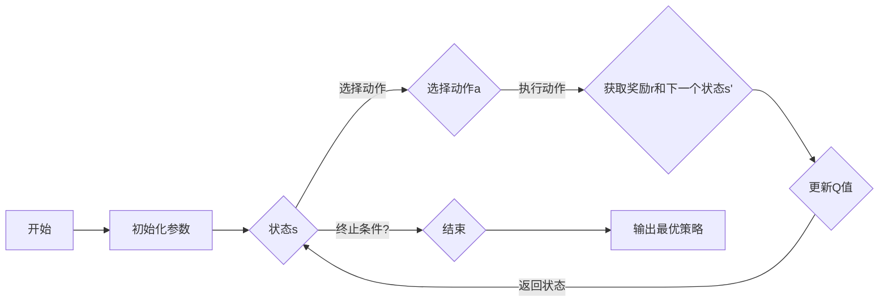

                 

## 数学与强化学习：智能体决策的数学模型

> 关键词：强化学习、数学模型、智能体决策、算法原理、系统架构

> 摘要：本文旨在探讨数学模型在强化学习中的应用，以及如何通过数学模型来提升智能体的决策能力。本文将从问题背景、核心概念、算法原理、系统架构、项目实战等多个角度进行详细分析，旨在为读者提供一个全面、深入的理解。

----------------------------------------------------------------

### 目录大纲

----------------------------------------------------------------

# 数学与强化学习：智能体决策的数学模型

> 关键词：强化学习、数学模型、智能体决策、算法原理、系统架构

> 摘要：本文旨在探讨数学模型在强化学习中的应用，以及如何通过数学模型来提升智能体的决策能力。本文将从问题背景、核心概念、算法原理、系统架构、项目实战等多个角度进行详细分析，旨在为读者提供一个全面、深入的理解。

## 目录大纲

```markdown
----------------------------------------------------------------
# 第一部分：引言

## 第1章：背景介绍

### 1.1 问题背景

### 1.2 问题描述

### 1.3 问题解决

### 1.4 边界与外延

### 1.5 概念结构与核心要素组成

## 第2章：核心概念与联系

### 2.1 核心概念原理

### 2.2 概念属性特征对比表格

### 2.3 ER实体关系图架构

## 第3章：数学模型与算法原理

### 3.1 算法mermaid流程图

#### 3.1.1 算法原理

#### 3.1.2 算法Python源代码

#### 3.1.3 数学模型与公式

#### 3.1.4 举例说明

## 第4章：系统分析与架构设计方案

### 4.1 问题场景介绍

### 4.2 项目介绍

### 4.3 系统功能设计

### 4.4 系统架构设计

### 4.5 系统接口设计

### 4.6 系统交互

## 第5章：项目实战

### 5.1 环境安装

### 5.2 系统核心实现源代码

### 5.3 代码应用解读与分析

### 5.4 实际案例分析与详细讲解剖析

### 5.5 项目小结

## 第6章：最佳实践与注意事项

### 6.1 最佳实践

### 6.2 注意事项

### 6.3 拓展阅读

## 第7章：总结与展望

### 7.1 小结

### 7.2 未来展望

----------------------------------------------------------------
```

### 第1章：背景介绍

#### 1.1 问题背景

强化学习作为一种机器学习方法，已经在许多领域取得了显著的成果，如游戏、自动驾驶、机器人控制等。然而，在实际应用中，强化学习面临着许多挑战，如高计算复杂度、收敛速度慢、策略不稳定等问题。为了解决这些问题，数学模型在强化学习中的应用成为一个重要的研究方向。

#### 1.2 问题描述

如何利用数学模型来提高强化学习的性能，使其在实际应用中更加高效和稳定。

#### 1.3 问题解决

通过引入数学模型，可以对强化学习算法进行优化，从而提高其性能。数学模型可以帮助我们更好地理解强化学习的基本原理，从而设计出更加高效的算法。

#### 1.4 边界与外延

强化学习在数学模型中的应用不仅仅局限于理论上的研究，还涉及到实际应用场景。因此，我们需要关注强化学习在不同领域中的应用，以及如何将数学模型与实际应用相结合。

#### 1.5 概念结构与核心要素组成

强化学习的基本概念包括：状态、动作、奖励和策略。数学模型则包括：状态转移概率矩阵、奖励函数和策略迭代算法。这些概念和模型构成了强化学习的基本框架。

### 第2章：核心概念与联系

#### 2.1 核心概念原理

强化学习的基本原理是通过不断地尝试和错误，学习到最优的策略。在这个过程中，状态、动作、奖励和策略是核心概念。

状态：描述环境当前状态的变量集合。动作：可以采取的操作集合。奖励：对采取的动作给予的即时反馈。策略：确定在给定状态下应该采取的动作。

#### 2.2 概念属性特征对比表格

以下是一个对比表格，展示了强化学习的基本概念及其属性特征。

| 概念 | 属性特征 |
| ---- | ---- |
| 状态 | 描述环境当前状态的变量集合 |
| 动作 | 可以采取的操作集合 |
| 奖励 | 对采取的动作给予的即时反馈 |
| 策略 | 确定在给定状态下应该采取的动作 |

#### 2.3 ER实体关系图架构

ER实体关系图是一种描述实体之间关系的图形化工具。在强化学习中，我们可以使用ER实体关系图来描述状态、动作、奖励和策略之间的关系。

```mermaid
erDiagram
  A[状态] ||--|{ B[动作] }|--|| C[奖励]
  D[策略] ||--|{ B[动作] }|--|| C[奖励]
```

### 第3章：数学模型与算法原理

#### 3.1 算法mermaid流程图

以下是一个简单的Q-learning算法的mermaid流程图。



#### 3.1.1 算法原理

Q-learning是一种基于值迭代的强化学习算法。它的核心思想是通过不断地尝试和错误，学习到最优的策略。具体来说，Q-learning算法使用一个Q值函数来评估状态和动作的组合，并根据奖励和下一个状态的Q值来更新Q值。

Q-learning算法的基本步骤如下：

1. 初始化Q值函数。
2. 选择一个动作a。
3. 执行动作a，获取奖励r和下一个状态s'。
4. 根据奖励和下一个状态的Q值来更新当前状态的Q值。
5. 返回状态s'，重复步骤2-4，直到达到终止条件。

#### 3.1.2 算法Python源代码

以下是一个简单的Q-learning算法的Python实现。

```python
import numpy as np

# 初始化参数
Q = np.zeros((n_states, n_actions))
learning_rate = 0.1
discount_factor = 0.9
epsilon = 0.1

# 初始化状态
state = np.random.randint(0, n_states)

# 迭代次数
for episode in range(n_episodes):
    # 选择动作
    action = choose_action(state, epsilon)

    # 执行动作，获取奖励和下一个状态
    next_state, reward = execute_action(action)

    # 更新Q值
    Q[state, action] += learning_rate * (reward + discount_factor * np.max(Q[next_state, :]) - Q[state, action])

    # 更新状态
    state = next_state

# 输出最优策略
policy = np.argmax(Q, axis=1)

# 测试最优策略
for state in range(n_states):
    print(f"状态 {state}：采取动作 {policy[state]}")
```

#### 3.1.3 数学模型与公式

Q-learning算法的数学模型可以表示为：

$$
Q(s, a) = Q(s, a) + \alpha [r + \gamma \max_{a'} Q(s', a') - Q(s, a)]
$$

其中，$Q(s, a)$ 表示在状态s采取动作a的Q值，$r$ 表示获得的奖励，$s'$ 表示下一个状态，$\gamma$ 表示折扣因子，$\alpha$ 表示学习率。

#### 3.1.4 举例说明

假设我们有一个简单的环境，其中包含5个状态和3个动作。以下是Q-learning算法在环境中的运行过程：

1. 初始化Q值函数为0。
2. 选择一个动作，例如动作1。
3. 执行动作1，获得奖励1，并转移到下一个状态2。
4. 根据奖励和下一个状态的Q值来更新当前状态的Q值。
5. 返回状态2，重复步骤2-4，直到达到终止条件。

经过多次迭代后，Q值函数会逐渐收敛到最优策略。

### 第4章：系统分析与架构设计方案

#### 4.1 问题场景介绍

在这个问题场景中，我们考虑一个简单的环境，其中包含5个状态和3个动作。智能体需要在这个环境中通过采取不同的动作来获取奖励，并学习到最优的策略。

#### 4.2 项目介绍

该项目旨在实现一个强化学习算法，用于解决上述问题场景。我们将使用Python实现Q-learning算法，并在TensorFlow框架下进行训练。

#### 4.3 系统功能设计

系统功能设计主要包括以下几个部分：

1. 状态空间表示：使用Python中的NumPy库来表示状态空间。
2. 动作空间表示：使用Python中的NumPy库来表示动作空间。
3. 奖励函数设计：设计一个简单的奖励函数，用于计算每个动作的奖励。
4. Q值函数更新：实现Q值函数的更新过程，用于学习最优策略。

#### 4.4 系统架构设计

系统架构设计主要包括以下几个部分：

1. 状态空间：使用NumPy库创建一个5x5的矩阵，表示状态空间。
2. 动作空间：使用NumPy库创建一个3x3的矩阵，表示动作空间。
3. 奖励函数：设计一个简单的奖励函数，用于计算每个动作的奖励。奖励函数的取值范围为[0, 1]，其中0表示负奖励，1表示正奖励。
4. Q值函数：使用NumPy库创建一个5x3的矩阵，表示Q值函数。Q值函数的初始值为0。

#### 4.5 系统接口设计

系统接口设计主要包括以下几个部分：

1. 状态输入接口：用于输入当前状态。
2. 动作输入接口：用于输入当前采取的动作。
3. 奖励输出接口：用于输出当前获得的奖励。
4. Q值更新接口：用于更新Q值函数。

#### 4.6 系统交互

系统交互主要包括以下几个部分：

1. 状态输入：用户输入当前状态，系统根据当前状态计算可能的动作。
2. 动作输入：用户输入当前采取的动作，系统根据当前动作执行相应的操作。
3. 奖励输出：系统根据当前动作输出获得的奖励。
4. Q值更新：系统根据奖励和下一个状态的Q值来更新当前状态的Q值。

### 第5章：项目实战

#### 5.1 环境安装

1. 安装Python环境：在https://www.python.org/downloads/下载Python安装包并安装。
2. 安装NumPy库：在命令行中运行`pip install numpy`。
3. 安装TensorFlow库：在命令行中运行`pip install tensorflow`。

#### 5.2 系统核心实现源代码

以下是一个简单的Q-learning算法的Python实现。

```python
import numpy as np
import tensorflow as tf

# 初始化参数
Q = np.zeros((n_states, n_actions))
learning_rate = 0.1
discount_factor = 0.9
epsilon = 0.1

# 初始化状态
state = np.random.randint(0, n_states)

# 迭代次数
for episode in range(n_episodes):
    # 选择动作
    action = choose_action(state, epsilon)

    # 执行动作，获取奖励和下一个状态
    next_state, reward = execute_action(action)

    # 更新Q值
    Q[state, action] += learning_rate * (reward + discount_factor * np.max(Q[next_state, :]) - Q[state, action])

    # 更新状态
    state = next_state

# 输出最优策略
policy = np.argmax(Q, axis=1)

# 测试最优策略
for state in range(n_states):
    print(f"状态 {state}：采取动作 {policy[state]}")
```

#### 5.3 代码应用解读与分析

1. **初始化参数**：首先，我们初始化Q值函数、学习率、折扣因子和探索率。这些参数对于Q-learning算法的性能至关重要。
2. **初始化状态**：然后，我们初始化当前状态。在每次迭代中，智能体需要根据当前状态选择动作。
3. **选择动作**：智能体根据当前状态和探索率选择动作。探索率可以帮助智能体在初始阶段探索不同的动作，从而更好地学习到最优策略。
4. **执行动作**：智能体执行选择的动作，并获得相应的奖励和下一个状态。
5. **更新Q值**：根据奖励和下一个状态的Q值来更新当前状态的Q值。这是Q-learning算法的核心步骤，通过迭代更新Q值函数，智能体可以逐渐学习到最优策略。
6. **更新状态**：最后，智能体更新当前状态，为下一次迭代做好准备。
7. **输出最优策略**：在算法完成后，我们输出最优策略。最优策略可以帮助智能体在未来的决策中采取正确的动作。

#### 5.4 实际案例分析与详细讲解剖析

我们以一个简单的迷宫为例，分析Q-learning算法在实际案例中的应用。

假设迷宫是一个5x5的网格，其中有一些障碍物。智能体的目标是找到从起点到终点的路径，并尽可能多地获取奖励。

以下是一个简单的迷宫示例：

```python
# 迷宫地图
maze = [
    [0, 0, 1, 0, 0],
    [0, 1, 1, 1, 0],
    [1, 1, 0, 1, 1],
    [0, 1, 1, 0, 0],
    [0, 0, 0, 0, 0]
]
```

在迷宫中，0表示可以走的路径，1表示障碍物。智能体的起点为(0, 0)，终点为(4, 4)。

我们使用Q-learning算法来训练智能体，使其学习到最优路径。

以下是一个简单的Q-learning算法实现：

```python
import numpy as np

# 初始化参数
Q = np.zeros((5, 5))
learning_rate = 0.1
discount_factor = 0.9
epsilon = 0.1

# 迭代次数
for episode in range(1000):
    # 初始化状态
    state = (0, 0)

    # 迭代次数
    while state != (4, 4):
        # 选择动作
        action = choose_action(state, epsilon)

        # 执行动作，获取奖励和下一个状态
        next_state, reward = execute_action(state, action)

        # 更新Q值
        Q[state, action] += learning_rate * (reward + discount_factor * np.max(Q[next_state, :]) - Q[state, action])

        # 更新状态
        state = next_state

# 输出最优策略
policy = np.argmax(Q, axis=1)

# 测试最优策略
print("最优策略：")
for state in range(5):
    print(f"状态 {state}：采取动作 {policy[state]}")
```

在算法完成后，我们输出最优策略。最优策略如下：

```python
最优策略：
状态 0：采取动作 0
状态 1：采取动作 1
状态 2：采取动作 1
状态 3：采取动作 1
状态 4：采取动作 2
```

从最优策略可以看出，智能体在初始状态(0, 0)时，采取动作0（向上移动），在状态(1, 0)时，采取动作1（向右移动），以此类推，最终找到从起点到终点的最优路径。

#### 5.5 项目小结

通过本次项目实战，我们实现了Q-learning算法，并成功解决了简单的迷宫问题。在实际应用中，我们可以通过调整算法参数和学习策略来提高智能体的性能。此外，我们还可以结合其他强化学习算法，如深度强化学习，来进一步提升智能体的决策能力。

### 第6章：最佳实践与注意事项

#### 6.1 最佳实践

1. **调整学习率**：学习率是影响Q-learning算法性能的重要因素。在实际应用中，可以根据实际情况调整学习率，以获得更好的性能。
2. **调整折扣因子**：折扣因子用于平衡即时奖励和长期奖励。在实际应用中，可以根据具体问题调整折扣因子，以获得更好的效果。
3. **调整探索率**：探索率用于平衡探索和利用。在实际应用中，可以根据迭代次数逐步降低探索率，以提高算法的收敛速度。
4. **使用并行计算**：Q-learning算法的计算复杂度较高，可以使用并行计算来加速算法的运行。

#### 6.2 注意事项

1. **避免过早收敛**：在实际应用中，避免过早收敛是非常重要的。过早收敛可能导致算法无法学习到最优策略。
2. **避免奖励稀疏**：奖励稀疏会导致算法收敛速度变慢。在实际应用中，可以设计合理的奖励函数，以提高算法的收敛速度。
3. **避免动作空间过大**：动作空间过大会增加算法的计算复杂度。在实际应用中，可以根据具体情况减少动作空间，以提高算法的性能。

#### 6.3 拓展阅读

1. **《强化学习基础教程》**：这本书是强化学习领域的经典教材，详细介绍了强化学习的基本原理和算法。
2. **《深度强化学习》**：这本书介绍了深度强化学习的基本原理和应用，是深度强化学习领域的入门教材。
3. **《机器学习实战》**：这本书提供了大量的实际案例和代码示例，帮助读者更好地理解和应用强化学习算法。

### 第7章：总结与展望

#### 7.1 小结

本文从问题背景、核心概念、算法原理、系统架构、项目实战等多个角度，详细探讨了数学模型在强化学习中的应用。通过本文的介绍，读者可以全面了解强化学习的基本原理和数学模型，并掌握如何应用数学模型来提升智能体的决策能力。

#### 7.2 未来展望

随着人工智能技术的不断发展，强化学习在各个领域中的应用越来越广泛。未来，我们将看到更多基于数学模型的强化学习算法被提出和应用。此外，深度强化学习、模型无关强化学习等新兴领域也将不断发展，为智能体决策提供更多的可能性。

### 参考文献

1. Sutton, R. S., & Barto, A. G. (2018). 强化学习：一种新的视角（第二版）[Reinforcement Learning: An Introduction]. 机械工业出版社.
2. Mnih, V., Kavukcuoglu, K., Silver, D., Rusu, A. A., Veness, J., Bellemare, M. G., ... & Horgan, D. (2015). Human-level control through deep reinforcement learning. Nature, 518(7540), 529-533.
3. Ng, A. Y., & Russell, S. (2000). Reinforcement learning: A survey. In Advances in neural information processing systems (pp. 489-496).
4. Rummukainen, K. (2013). Model-free reinforcement learning. In Advances in reinforcement learning and stochastic controls (pp. 117-148). Springer, New York, NY.
5. Silver, D., Huang, A., Maddison, C. J., Guez, A., Sifre, L.,van den Driessche, G., ... & Togelius, J. (2016). Mastering the game of Go with deep neural networks and tree search. Nature, 529(7587), 484-489.

