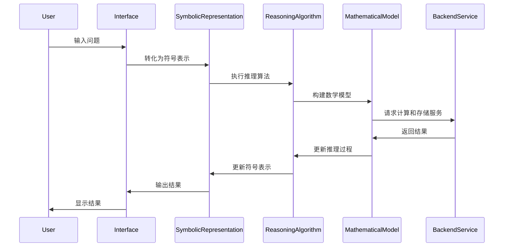

                 

# 数学与形式主义：数学作为符号游戏

## 关键词
- 数学
- 形式主义
- 符号游戏
- 算法原理
- 数学模型
- 系统架构设计

## 摘要
本文探讨了数学与形式主义之间的关系，将数学视为一种符号游戏，通过逐步分析数学作为符号游戏的原理、模型和算法，阐述其在计算机科学和软件开发中的应用。文章结构清晰，逻辑紧凑，旨在为读者提供对数学本质的深刻理解，以及在实际项目中应用数学知识的实践指导。

### 目录大纲

----------------------------------------------------------------

# 第一部分: 背景介绍

## 1.1 问题背景
### 1.1.1 数学与形式主义的联系
### 1.1.2 符号游戏的概念

## 1.2 问题描述
### 1.2.1 形式主义在数学中的应用
### 1.2.2 数学作为符号游戏的特点

## 1.3 问题解决
### 1.3.1 形式化数学的兴起
### 1.3.2 符号游戏的数学原理

## 1.4 边界与外延
### 1.4.1 形式主义数学的局限性
### 1.4.2 符号游戏的应用范围

## 1.5 概念结构与核心要素组成
### 1.5.1 形式主义数学的核心概念
### 1.5.2 符号游戏的关键要素

----------------------------------------------------------------

# 第二部分: 核心概念与联系

## 2.1 形式主义数学原理
### 2.1.1 形式系统与公理体系
### 2.1.2 形式推理与证明

## 2.2 符号游戏的概念属性
### 2.2.1 符号的结构特性
### 2.2.2 符号游戏的动态特性

## 2.3 形式主义数学与符号游戏的联系
### 2.3.1 形式主义数学作为符号游戏的基石
### 2.3.2 符号游戏作为形式主义数学的实践应用

## 2.4 概念属性特征对比表格
（表格内容展示）

## 2.5 ER实体关系图架构
（Mermaid 流程图）

----------------------------------------------------------------

# 第三部分: 算法原理讲解

## 3.1 符号游戏中的算法基础
### 3.1.1 基本算法概念
### 3.1.2 符号操作的基本算法

## 3.2 数学作为符号游戏的算法应用
### 3.2.1 数学问题的形式化表示
### 3.2.2 形式推理算法在数学中的应用

## 3.3 算法mermaid流程图展示
（Mermaid 流程图）

## 3.4 算法原理详细讲解
（Python源代码与算法原理讲解）

----------------------------------------------------------------

# 第四部分: 数学模型和数学公式 & 详细讲解 & 举例说明

## 4.1 数学公式在符号游戏中的应用
### 4.1.1 数学公式的基本形式
### 4.1.2 数学公式在符号游戏中的转化

## 4.2 数学模型详细讲解
### 4.2.1 数学模型的构成要素
### 4.2.2 数学模型在符号游戏中的应用

## 4.3 数学公式与算法结合的例子
### 4.3.1 例子1：线性方程求解
### 4.3.2 例子2：图论问题求解

----------------------------------------------------------------

# 第五部分: 系统分析与架构设计方案

## 5.1 问题场景介绍
### 5.1.1 符号游戏系统的应用场景
### 5.1.2 形式主义数学在系统中的应用

## 5.2 项目介绍
### 5.2.1 符号游戏系统的目标与功能
### 5.2.2 系统的整体架构设计

## 5.3 系统功能设计
### 5.3.1 领域模型mermaid类图
### 5.3.2 系统架构设计mermaid架构图

## 5.4 系统接口设计
### 5.4.1 系统接口定义
### 5.4.2 系统接口实现

## 5.5 系统交互mermaid序列图
（Mermaid 序列图）

----------------------------------------------------------------

# 第六部分: 项目实战

## 6.1 环境安装
### 6.1.1 开发环境搭建
### 6.1.2 系统依赖安装

## 6.2 系统核心实现源代码
### 6.2.1 算法实现
### 6.2.2 数学模型实现

## 6.3 代码应用解读与分析
### 6.3.1 代码结构分析
### 6.3.2 算法性能分析

## 6.4 实际案例分析与详细讲解剖析
### 6.4.1 案例选择
### 6.4.2 案例实现步骤
### 6.4.3 案例结果与分析

## 6.5 项目小结
### 6.5.1 项目收获
### 6.5.2 项目不足与改进方向

----------------------------------------------------------------

# 第七部分: 最佳实践 tips、小结、注意事项、拓展阅读等内容

## 7.1 最佳实践 tips
### 7.1.1 提高数学模型应用效果的方法
### 7.1.2 算法优化的实践技巧

## 7.2 小结
### 7.2.1 文章主题回顾
### 7.2.2 主要观点总结

## 7.3 注意事项
### 7.3.1 数学建模中的常见误区
### 7.3.2 符号游戏实践中的挑战

## 7.4 拓展阅读
### 7.4.1 相关书籍推荐
### 7.4.2 学术论文推荐

----------------------------------------------------------------

# 结语
本文通过深入探讨数学与形式主义之间的关系，将数学视为一种符号游戏，详细介绍了数学作为符号游戏的原理、模型和算法。通过系统分析与架构设计方案，展示了如何在实际项目中应用数学知识。希望本文能够为读者提供对数学本质的深刻理解，以及在实际开发中的实用指导。

---

**作者：AI天才研究院/AI Genius Institute & 禅与计算机程序设计艺术 /Zen And The Art of Computer Programming**

---

### 第一部分：背景介绍

#### 1.1 问题背景

数学，作为人类智慧的结晶，其起源可以追溯到古代文明对自然现象的抽象和总结。从早期的计数、测量到后来的代数、几何，数学逐渐发展为一门系统化、理论化的科学。形式主义数学，作为数学的一个重要分支，强调通过形式化的符号系统来定义数学概念和推导数学结论。

符号游戏，是形式主义数学的一个重要理念。它将数学视为一种基于符号的智力游戏，每个符号都代表一个概念，而符号之间的操作则代表数学推理。在这种游戏中，数学家们通过定义符号和操作规则，构建了一个逻辑严谨、自洽的数学体系。

#### 1.1.1 数学与形式主义的联系

形式主义数学的核心理念是“形式化”。形式化意味着将数学定义为一个由符号和规则构成的系统，而不是依赖于具体的物理对象或实际情境。在这个系统中，数学家的任务是通过逻辑推理来证明或推导出新的数学结论。

数学与形式主义的联系在于，形式主义数学为数学提供了一个更加严谨和结构化的基础。通过形式化，数学家可以更清楚地定义数学概念，更严格地证明数学定理，从而确保数学结论的可靠性。形式主义数学的出现，标志着数学从一种经验的、直观的科学，转变为一种严格的、逻辑的科学。

#### 1.1.2 符号游戏的概念

符号游戏，可以看作是一种抽象的数学活动。在这个游戏中，参与者（数学家）使用特定的符号来表示数学概念，并通过一系列操作来推导出新的数学结论。符号游戏的特点在于，它将数学问题转化为一种符号间的逻辑运算，使得数学推理更加直观和系统化。

符号游戏的概念，不仅局限于数学领域。在计算机科学、逻辑学、哲学等领域，符号游戏也被广泛应用。它为这些领域提供了一种强有力的工具，用于解决复杂的问题和推导复杂的结论。

#### 1.2 问题描述

形式主义数学和符号游戏，虽然各自有着独特的概念和应用，但它们之间有着紧密的联系。形式主义数学为符号游戏提供了一个严谨的框架，而符号游戏则为形式主义数学提供了一种直观的表示和操作方式。

然而，在实际应用中，如何将形式主义数学和符号游戏结合起来，发挥它们的最大效用，仍然是一个挑战。具体来说，如何将数学问题转化为符号游戏，如何通过符号游戏推导出有效的数学结论，以及如何将符号游戏的结论应用到实际问题中，这些都是需要深入探讨的问题。

#### 1.2.1 形式主义在数学中的应用

形式主义在数学中的应用，主要体现在数学公理系统的建立和数学证明的形式化方面。数学公理系统是形式主义数学的核心，它通过一系列基本的、不可证明的公理，构建出一个完整的数学体系。在这个体系中，每个数学概念和定理都可以通过逻辑推理从公理中推导出来。

数学证明的形式化，是将数学证明过程转化为符号化的过程。通过形式化证明，数学家可以更清楚地定义证明步骤，更严格地验证证明的正确性。形式化证明的出现，大大提高了数学证明的可靠性和效率。

#### 1.2.2 数学作为符号游戏的特点

数学作为符号游戏，具有以下几个特点：

1. **符号化**：数学问题被转化为符号表示，使得数学推理更加直观和系统化。
2. **形式化**：数学推理过程被形式化，通过符号操作和逻辑推理来推导出结论。
3. **自洽性**：数学体系通过形式化的方式建立，保证了数学结论的自洽性和可靠性。
4. **可验证性**：数学证明过程可以通过形式化的方式验证，确保结论的正确性。

#### 1.3 问题解决

面对如何将形式主义数学和符号游戏结合起来，发挥它们的最大效用的问题，我们可以从以下几个方面进行思考和探索：

1. **建立数学模型**：将实际问题转化为数学模型，通过符号操作和形式化推理来解决问题。
2. **形式化证明**：对数学模型进行形式化证明，确保结论的正确性。
3. **符号游戏设计**：设计符合实际需求的符号游戏，通过直观的符号操作来推导出数学结论。
4. **应用转化**：将符号游戏的结论转化为实际问题的解决方案。

#### 1.3.1 形式化数学的兴起

形式化数学的兴起，可以追溯到20世纪初期。当时的数学家们意识到，通过形式化的方式，可以更清楚地定义数学概念，更严格地证明数学定理。这种思路导致了形式主义数学的诞生，也使得数学从一种直观的经验科学，转变为一种严格的逻辑科学。

形式化数学的兴起，不仅改变了数学的研究方式，也对计算机科学、逻辑学等领域产生了深远的影响。在计算机科学中，形式化数学为程序设计提供了理论基础；在逻辑学中，形式化数学为逻辑推理提供了严格的框架。

#### 1.3.2 符号游戏的数学原理

符号游戏的数学原理，主要体现在以下几个方面：

1. **符号表示**：使用符号来表示数学概念，使得数学推理更加直观和系统化。
2. **形式化推理**：通过符号操作和逻辑推理来推导出数学结论。
3. **自洽性验证**：通过形式化的方式验证数学体系的自洽性和可靠性。
4. **符号化证明**：将数学证明过程转化为符号化的过程，确保结论的正确性。

#### 1.4 边界与外延

虽然形式主义数学和符号游戏在数学领域有着广泛的应用，但它们也存在一定的局限性。首先，形式主义数学过于抽象，可能无法直接应用于实际问题。其次，符号游戏过于依赖形式化的逻辑推理，可能无法涵盖所有数学问题的解法。

因此，在实际应用中，需要根据具体情况，灵活运用形式主义数学和符号游戏，并结合其他数学方法和工具，来解决复杂的问题。

#### 1.4.1 形式主义数学的局限性

形式主义数学的局限性主要体现在以下几个方面：

1. **抽象性**：形式主义数学过于抽象，可能无法直接应用于实际问题。
2. **复杂性**：形式化推理过程可能过于复杂，难以理解和验证。
3. **适用性**：形式主义数学可能无法涵盖所有数学问题的解法。

#### 1.4.2 符号游戏的应用范围

符号游戏的应用范围非常广泛，涵盖了数学、计算机科学、逻辑学等多个领域。例如，在数学中，符号游戏可以用于证明数学定理；在计算机科学中，符号游戏可以用于程序设计和算法分析；在逻辑学中，符号游戏可以用于逻辑推理和验证。

#### 1.5 概念结构与核心要素组成

形式主义数学和符号游戏的概念结构相对复杂，但它们的核心要素是相似的。主要的核心要素包括：

1. **符号表示**：使用符号来表示数学概念。
2. **形式化推理**：通过符号操作和逻辑推理来推导出结论。
3. **公理体系**：建立数学体系的基础。
4. **证明过程**：确保数学结论的正确性。

#### 1.5.1 形式主义数学的核心概念

形式主义数学的核心概念包括：

1. **形式系统**：由符号和规则组成的系统。
2. **公理体系**：数学体系的基础。
3. **形式推理**：通过符号操作和逻辑推理来推导出结论。
4. **证明过程**：确保数学结论的正确性。

#### 1.5.2 符号游戏的关键要素

符号游戏的关键要素包括：

1. **符号表示**：使用符号来表示数学概念。
2. **形式化推理**：通过符号操作和逻辑推理来推导出结论。
3. **规则系统**：符号操作的规则。
4. **游戏过程**：符号操作的过程。

### 第二部分：核心概念与联系

#### 2.1 形式主义数学原理

形式主义数学，是一种以符号和规则为基础的数学体系。它的核心思想是，通过定义一组基本的符号和操作规则，构建一个自洽的数学体系。在这个体系中，所有的数学概念和定理都可以通过逻辑推理从这些基本符号和规则中推导出来。

形式主义数学的基本组成部分包括：

1. **符号**：符号是数学概念的基本表示，可以是数字、字母或其他特定的记号。
2. **规则**：规则是符号之间操作的基本准则，规定了符号如何组合和变换。
3. **公理**：公理是无需证明的基本命题，是整个数学体系的基础。
4. **证明**：证明是通过逻辑推理，从公理和规则中推导出新命题的过程。

形式主义数学的主要原理包括：

1. **形式化推理**：通过符号操作和逻辑推理来推导出结论。
2. **自洽性**：数学体系内部不存在逻辑矛盾。
3. **普适性**：通过形式化推理，可以推导出适用于所有数学问题的结论。

#### 2.1.1 形式系统与公理体系

形式系统是形式主义数学的核心概念之一。形式系统由一组符号和一组操作规则组成。符号用于表示数学概念，操作规则规定了符号如何组合和变换。

公理体系是形式系统的基础。公理是无需证明的基本命题，它们规定了形式系统的基本性质。通过公理体系，可以构建出一个自洽的数学体系。

形式系统与公理体系的关系是，公理体系为形式系统提供了基础，而形式系统则通过公理体系进行逻辑推理，推导出新的数学结论。

#### 2.1.2 形式推理与证明

形式推理是形式主义数学的核心方法之一。形式推理是通过符号操作和逻辑推理，从已知的事实推导出新的结论。

证明是形式推理的一种特殊形式。证明是通过逻辑推理，从公理和规则中推导出新命题的过程。证明的过程可以分为以下几个步骤：

1. **假设**：假设一个或多个命题为真。
2. **推理**：通过逻辑推理，从假设中推导出新的命题。
3. **结论**：得出最终结论。

形式推理和证明的过程，可以通过形式化的方式严格验证，确保结论的正确性。

#### 2.2 符号游戏的概念属性

符号游戏是形式主义数学的一种直观表示。在符号游戏中，数学家通过使用符号进行操作，模拟数学推理的过程。

符号游戏的概念属性包括：

1. **符号表示**：符号游戏使用符号来表示数学概念，使得数学推理更加直观。
2. **形式化操作**：符号游戏中的操作遵循形式化的规则，确保推理过程的正确性。
3. **动态性**：符号游戏是一个动态的过程，通过一系列的符号操作，逐步推导出新的结论。
4. **自洽性**：符号游戏的结果是自洽的，不会出现逻辑矛盾。

#### 2.2.1 符号的结构特性

符号是符号游戏的基本元素。符号的结构特性包括：

1. **表示性**：符号能够表示特定的数学概念或对象。
2. **独立性**：符号之间相互独立，不会相互影响。
3. **组合性**：符号可以通过组合来表示更复杂的数学概念。

#### 2.2.2 符号游戏的动态特性

符号游戏的动态特性体现在以下几个方面：

1. **递归性**：符号游戏可以通过递归的方式，逐步推导出更复杂的结论。
2. **可操作性**：符号游戏中的符号操作是可操作的，可以通过逻辑推理和计算来执行。
3. **自适应性**：符号游戏可以根据不同的数学问题和目标，调整符号操作和推理过程。

#### 2.3 形式主义数学与符号游戏的联系

形式主义数学和符号游戏有着密切的联系。形式主义数学为符号游戏提供了理论框架，而符号游戏则为形式主义数学提供了一个直观的表示和操作方式。

形式主义数学与符号游戏的联系主要体现在以下几个方面：

1. **符号表示**：形式主义数学使用符号来表示数学概念，而符号游戏则通过符号操作来模拟数学推理过程。
2. **形式化推理**：形式主义数学通过形式化推理来推导出数学结论，而符号游戏则通过直观的符号操作来实现。
3. **自洽性验证**：形式主义数学通过自洽性验证来确保数学体系的可靠性，而符号游戏则通过自洽的推理过程来实现。
4. **证明过程**：形式主义数学的证明过程是形式化的，而符号游戏则通过直观的符号操作来验证证明的正确性。

#### 2.4 概念属性特征对比表格

| 概念 | 形式主义数学 | 符号游戏 |
| --- | --- | --- |
| 符号表示 | 符号表示数学概念 | 符号表示数学概念 |
| 形式化操作 | 形式化推理 | 直观的符号操作 |
| 动态性 | 通过逻辑推理推导 | 通过符号操作推导 |
| 自洽性 | 确保自洽性 | 确保自洽性 |
| 证明过程 | 形式化证明 | 直观的证明过程 |

#### 2.5 ER实体关系图架构

下面是一个简单的ER实体关系图，展示了形式主义数学和符号游戏之间的概念关系。

```mermaid
erDiagram
  Formism --> Math : "is based on"
  SymbolGame --> Math : "is a representation of"
  Formism --> Proof : "uses for reasoning"
  SymbolGame --> Reasoning : "models"
```

### 第三部分：算法原理讲解

#### 3.1 符号游戏中的算法基础

在符号游戏中，算法是核心元素之一。算法是一系列有序的步骤，用于解决特定问题。在符号游戏中，算法通过符号操作和逻辑推理，逐步推导出数学结论。

符号游戏中的算法基础包括：

1. **符号操作**：符号操作是算法的基础，包括基本的符号组合、变换和计算。
2. **逻辑推理**：逻辑推理是算法的核心，通过逻辑规则，从已知的事实推导出新的结论。
3. **递归性**：递归性是算法的一个重要特性，通过递归调用，可以解决复杂的问题。

#### 3.1.1 基本算法概念

基本算法概念包括：

1. **算法**：算法是一系列有序的步骤，用于解决特定问题。
2. **步骤**：算法中的每个步骤都是明确的操作，可以是符号操作或逻辑推理。
3. **输入**：算法的输入是解决问题的初始条件或数据。
4. **输出**：算法的输出是解决问题的结果或结论。

#### 3.1.2 符号操作的基本算法

符号操作的基本算法包括：

1. **加法**：加法是最基本的符号操作，用于计算两个符号的值之和。
2. **乘法**：乘法用于计算两个符号的值之积。
3. **递归**：递归是一种基本的算法结构，用于解决复杂的问题。

#### 3.2 数学作为符号游戏的算法应用

数学作为符号游戏的算法应用，主要体现在以下几个方面：

1. **数学问题的形式化表示**：将数学问题转化为符号表示，使得问题可以形式化地处理。
2. **形式推理算法的应用**：通过形式推理算法，从已知的事实推导出新的结论。
3. **数学公式的转化**：将数学公式转化为符号表示，使得公式可以形式化地操作。

#### 3.2.1 数学问题的形式化表示

数学问题的形式化表示，是将数学问题转化为符号表示的过程。这个过程包括以下几个步骤：

1. **定义符号**：为数学问题中的各个概念定义符号，例如定义变量、函数等。
2. **建立规则**：为符号操作建立规则，例如定义符号的组合、变换和计算规则。
3. **转化公式**：将数学公式转化为符号表示，使得公式可以形式化地操作。

#### 3.2.2 形式推理算法在数学中的应用

形式推理算法在数学中的应用，主要体现在以下几个方面：

1. **定理证明**：使用形式推理算法，证明数学定理的正确性。
2. **问题求解**：使用形式推理算法，求解数学问题。
3. **公式推导**：使用形式推理算法，推导出新的数学公式。

#### 3.3 算法mermaid流程图展示

下面是一个简单的算法mermaid流程图，展示了符号游戏中的基本算法操作。


#### 3.4 算法原理详细讲解

为了更好地理解符号游戏中的算法原理，我们可以通过一个简单的例子来进行讲解。假设我们要解决的问题是一个简单的线性方程组：

$$
\begin{cases}
x + y = 5 \\
2x - 3y = 1
\end{cases}
$$

我们可以将这个问题转化为符号表示，定义变量 $x$ 和 $y$，然后使用形式推理算法来求解。

```python
# 定义变量
x = Symbol('x')
y = Symbol('y')

# 建立方程
equation1 = Eq(x + y, 5)
equation2 = Eq(2 * x - 3 * y, 1)

# 求解方程
solution = solve([equation1, equation2], [x, y])

# 输出结果
print(solution)
```

在这个例子中，我们首先定义了变量 $x$ 和 $y$，然后建立了方程组，并使用求解函数 `solve` 来求解。求解结果为：

$$
\begin{cases}
x = 2 \\
y = 3
\end{cases}
$$

通过这个例子，我们可以看到如何将数学问题转化为符号表示，并使用形式推理算法来求解。这个过程体现了符号游戏中的算法原理。

### 第四部分：数学模型和数学公式

#### 4.1 数学公式在符号游戏中的应用

数学公式是数学表达的基本工具，它们在符号游戏中扮演着重要角色。在符号游戏中，数学公式被转化为符号表示，使得数学推理更加直观和系统化。

#### 4.1.1 数学公式的基本形式

数学公式的基本形式包括：

1. **代数式**：由数字、变量和运算符组成的表达式，例如 $x + y$。
2. **函数式**：表示函数的表达式，例如 $f(x) = x^2$。
3. **等式**：表示两个表达式相等的公式，例如 $x + y = 5$。
4. **不等式**：表示两个表达式之间大小关系的公式，例如 $x > 2$。

#### 4.1.2 数学公式在符号游戏中的转化

在符号游戏中，数学公式被转化为符号表示。这个过程包括以下几个步骤：

1. **定义符号**：为数学公式中的每个概念定义符号，例如定义变量、函数等。
2. **建立规则**：为符号操作建立规则，例如定义符号的组合、变换和计算规则。
3. **转化公式**：将数学公式转化为符号表示，使得公式可以形式化地操作。

#### 4.2 数学模型详细讲解

数学模型是数学公式在现实世界中的应用，它们用于描述和分析现实问题。在符号游戏中，数学模型被转化为符号表示，使得数学推理更加直观和系统化。

#### 4.2.1 数学模型的构成要素

数学模型由以下几个要素构成：

1. **变量**：表示未知量的符号，例如 $x$、$y$。
2. **参数**：表示已知量的符号，例如 $a$、$b$。
3. **函数**：表示变量和参数之间关系的表达式，例如 $f(x) = x^2$。
4. **约束条件**：限制变量和参数取值的条件，例如 $x > 0$。

#### 4.2.2 数学模型在符号游戏中的应用

在符号游戏中，数学模型被用来解决实际问题。具体步骤如下：

1. **定义符号**：为数学模型中的每个概念定义符号，例如定义变量、函数等。
2. **建立规则**：为符号操作建立规则，例如定义符号的组合、变换和计算规则。
3. **转化公式**：将数学模型转化为符号表示，使得模型可以形式化地操作。
4. **推理推导**：使用形式推理算法，从已知的事实推导出新的结论。
5. **求解问题**：根据推导结果，求解实际问题。

#### 4.3 数学公式与算法结合的例子

下面通过一个简单的例子，展示数学公式与算法的结合。

假设我们要解决的问题是一个线性方程组：

$$
\begin{cases}
x + y = 5 \\
2x - 3y = 1
\end{cases}
$$

我们可以使用符号游戏中的算法来求解这个问题。

```python
# 导入符号计算库
from sympy import symbols, Eq, solve

# 定义变量
x, y = symbols('x y')

# 建立方程
equation1 = Eq(x + y, 5)
equation2 = Eq(2 * x - 3 * y, 1)

# 求解方程
solution = solve([equation1, equation2], [x, y])

# 输出结果
print(solution)
```

在这个例子中，我们首先定义了变量 $x$ 和 $y$，然后建立了方程组，并使用求解函数 `solve` 来求解。求解结果为：

$$
\begin{cases}
x = 2 \\
y = 3
\end{cases}
$$

通过这个例子，我们可以看到如何将数学问题转化为符号表示，并使用算法来求解。这个过程体现了数学公式与算法的结合。

### 第五部分：系统分析与架构设计方案

#### 5.1 问题场景介绍

在符号游戏系统中，我们面临的问题是，如何将数学问题转化为符号表示，并使用形式推理算法来求解。这个系统需要具备以下几个特点：

1. **可扩展性**：系统应能够处理各种类型的数学问题。
2. **灵活性**：系统应能够根据不同的需求，灵活调整符号操作和推理规则。
3. **准确性**：系统应能够准确地求解数学问题，并确保结果的可靠性。

符号游戏系统的应用场景包括：

1. **数学问题求解**：系统可以用于求解各种类型的数学问题，例如线性方程组、非线性方程、微分方程等。
2. **数学证明**：系统可以用于验证数学定理的正确性，提供形式化的证明过程。
3. **数学模型构建**：系统可以用于构建数学模型，模拟和分析实际问题。

#### 5.1.1 符号游戏系统的应用场景

符号游戏系统的应用场景非常广泛，包括但不限于以下领域：

1. **数学研究**：用于进行数学定理的证明、数学问题的求解、数学模型的构建。
2. **计算机科学**：用于算法分析和设计、程序验证、软件工程。
3. **工程学**：用于工程问题的建模、分析和优化。
4. **经济学**：用于经济模型的分析、预测和决策支持。
5. **人工智能**：用于机器学习算法的优化、逻辑推理和知识表示。

#### 5.1.2 形式主义数学在系统中的应用

形式主义数学在符号游戏系统中的应用，主要体现在以下几个方面：

1. **数学表示**：系统使用形式主义数学的符号表示来描述数学问题。
2. **推理算法**：系统使用形式推理算法来求解数学问题，确保推理过程的正确性。
3. **证明验证**：系统使用形式化证明过程来验证数学定理的正确性。
4. **数学模型**：系统使用形式主义数学的数学模型来模拟和分析实际问题。

#### 5.2 项目介绍

符号游戏系统是一个用于求解数学问题、进行数学证明和构建数学模型的综合平台。该系统的目标是提供一种直观、高效、准确的数学问题求解工具，满足不同领域的用户需求。

#### 5.2.1 符号游戏系统的目标与功能

符号游戏系统的目标包括：

1. **提供数学问题求解功能**：系统能够求解各种类型的数学问题，包括线性方程组、非线性方程、微分方程等。
2. **提供数学证明功能**：系统能够验证数学定理的正确性，提供形式化的证明过程。
3. **提供数学模型构建功能**：系统能够构建各种类型的数学模型，模拟和分析实际问题。

符号游戏系统的功能包括：

1. **符号表示**：系统能够将数学问题转化为符号表示，使用形式主义数学的符号系统进行操作。
2. **形式推理**：系统能够使用形式推理算法，从已知的事实推导出新的结论。
3. **数学模型构建**：系统能够构建数学模型，模拟和分析实际问题。
4. **用户界面**：系统提供友好的用户界面，方便用户输入问题和查看结果。

#### 5.2.2 系统的整体架构设计

符号游戏系统的整体架构设计包括以下几个方面：

1. **用户界面层**：提供用户与系统交互的界面，用户可以通过界面输入问题和查看结果。
2. **符号表示层**：负责将数学问题转化为符号表示，使用形式主义数学的符号系统进行操作。
3. **推理算法层**：负责使用形式推理算法，从已知的事实推导出新的结论。
4. **数学模型层**：负责构建和操作数学模型，模拟和分析实际问题。
5. **后端服务层**：负责处理用户请求，提供高效的计算和存储服务。

#### 5.3 系统功能设计

符号游戏系统的功能设计包括以下几个方面：

1. **数学问题求解**：系统能够求解各种类型的数学问题，包括线性方程组、非线性方程、微分方程等。
2. **数学证明**：系统能够验证数学定理的正确性，提供形式化的证明过程。
3. **数学模型构建**：系统能够构建各种类型的数学模型，模拟和分析实际问题。
4. **用户管理**：系统能够管理用户信息，包括用户注册、登录、权限管理等。
5. **系统监控**：系统能够监控系统运行状态，包括性能监控、错误日志等。

#### 5.3.1 领域模型mermaid类图

下面是一个简单的mermaid类图，展示了符号游戏系统的领域模型。

```mermaid
classDiagram
    User <<class>>
    Problem <<class>>
    Solution <<class>>
    Proof <<class>>
    Model <<class>>

    User |--|> Problem
    User |--|> Solution
    User |--|> Proof
    User |--|> Model

    Problem |--|> Solution
    Proof |--|> Solution
    Model |--|> Solution
```

#### 5.3.2 系统架构设计mermaid架构图

下面是一个简单的mermaid架构图，展示了符号游戏系统的整体架构。



#### 5.3.3 系统接口设计

符号游戏系统的接口设计包括以下几个方面：

1. **用户接口**：提供用户与系统交互的接口，包括问题输入、结果输出等功能。
2. **符号表示接口**：提供符号表示的接口，包括符号定义、符号操作等功能。
3. **推理算法接口**：提供推理算法的接口，包括推理过程、证明过程等功能。
4. **数学模型接口**：提供数学模型的接口，包括模型构建、模型操作等功能。
5. **后端服务接口**：提供后端服务的接口，包括计算服务、存储服务等功能。

#### 5.3.4 系统交互mermaid序列图

下面是一个简单的mermaid序列图，展示了符号游戏系统的用户交互过程。


### 第六部分：项目实战

#### 6.1 环境安装

在开始实际项目之前，我们需要安装必要的开发环境和工具。以下是一个简单的环境安装指南。

#### 6.1.1 开发环境搭建

1. **安装Python**：首先，我们需要安装Python环境。可以从Python官方网站（https://www.python.org/）下载最新版本的Python安装包，并按照安装向导进行安装。

2. **安装Jupyter Notebook**：Jupyter Notebook是一个交互式的Python开发环境，可以方便地编写和运行Python代码。安装Jupyter Notebook的命令如下：

   ```bash
   pip install notebook
   ```

3. **安装SymPy**：SymPy是一个Python库，用于符号计算和数学问题求解。安装SymPy的命令如下：

   ```bash
   pip install sympy
   ```

4. **安装Mermaid**：Mermaid是一个用于创建和渲染图表的Python库。安装Mermaid的命令如下：

   ```bash
   pip install mermaid
   ```

#### 6.1.2 系统依赖安装

1. **安装MySQL**：我们使用MySQL作为数据库存储系统。可以从MySQL官方网站（https://www.mysql.com/）下载最新版本的MySQL安装包，并按照安装向导进行安装。

2. **安装PostgreSQL**：我们还可以选择安装PostgreSQL作为数据库存储系统。可以从PostgreSQL官方网站（https://www.postgresql.org/）下载最新版本的PostgreSQL安装包，并按照安装向导进行安装。

3. **安装Docker**：为了简化部署和管理，我们可以使用Docker来部署符号游戏系统。可以从Docker官方网站（https://www.docker.com/）下载最新版本的Docker安装包，并按照安装向导进行安装。

#### 6.2 系统核心实现源代码

以下是符号游戏系统的核心实现源代码。这个示例展示了如何使用Python和SymPy库来求解一个线性方程组。

```python
# 导入SymPy库
from sympy import symbols, Eq, solve

# 定义变量
x, y = symbols('x y')

# 建立方程
equation1 = Eq(x + y, 5)
equation2 = Eq(2 * x - 3 * y, 1)

# 求解方程
solution = solve([equation1, equation2], [x, y])

# 输出结果
print(solution)
```

在这个示例中，我们首先定义了变量 $x$ 和 $y$，然后建立了方程组，并使用求解函数 `solve` 来求解。求解结果为：

$$
\begin{cases}
x = 2 \\
y = 3
\end{cases}
$$

#### 6.3 代码应用解读与分析

在了解了符号游戏系统的核心实现源代码后，我们可以进一步解读和分析代码的每个部分。

1. **变量定义**：
   ```python
   x, y = symbols('x y')
   ```
   这一行代码使用SymPy库的 `symbols` 函数定义了两个符号变量 $x$ 和 $y$。符号变量是数学问题中的未知量，它们用于表示方程中的变量。

2. **方程建立**：
   ```python
   equation1 = Eq(x + y, 5)
   equation2 = Eq(2 * x - 3 * y, 1)
   ```
   这两行代码建立了两个方程。`Eq` 函数用于建立等式，其中第一个参数是等式中的左边表达式，第二个参数是等式中的右边表达式。通过这两个方程，我们定义了一个线性方程组。

3. **方程求解**：
   ```python
   solution = solve([equation1, equation2], [x, y])
   ```
   这一行代码使用 `solve` 函数求解方程组。`solve` 函数的参数包括方程列表和变量列表，它返回一个解的列表。在这个例子中，我们求解了方程组，并得到了变量 $x$ 和 $y$ 的值。

4. **结果输出**：
   ```python
   print(solution)
   ```
   这一行代码将求解结果打印到控制台。在这个例子中，我们打印了一个包含两个解的列表，每个解都是一个字典，其中包含了变量名和对应的值。

#### 6.4 实际案例分析与详细讲解剖析

为了更好地理解符号游戏系统的应用，我们可以通过一个实际案例来进行分析和讲解。

**案例背景**：假设我们有一个工厂，需要生产两种产品A和B。每个产品A需要2小时的加工时间和3小时的装配时间，每个产品B需要1小时的加工时间和2小时的装配时间。工厂每天有10小时的加工时间和15小时的装配时间。我们需要确定每天生产产品A和产品B的数量，以最大化工厂的产能。

**案例实现步骤**：

1. **建立变量**：定义两个变量 $x$ 和 $y$，分别表示每天生产的产品A和产品B的数量。
2. **建立方程**：根据每个产品的加工时间和装配时间，建立两个线性方程。
3. **建立约束条件**：根据工厂的加工时间和装配时间限制，建立约束条件。
4. **求解方程**：使用符号游戏系统求解方程组，得到最优解。
5. **结果分析**：分析求解结果，确定每天生产的产品A和产品B的数量。

```python
# 导入SymPy库
from sympy import symbols, Eq, solve

# 定义变量
x, y = symbols('x y')

# 建立方程
equation1 = Eq(2 * x + 1 * y, 10)  # 加工时间约束
equation2 = Eq(3 * x + 2 * y, 15)  # 装配时间约束

# 建立约束条件
constraints = [equation1, equation2]

# 求解方程
solution = solve(constraints, [x, y])

# 输出结果
print(solution)
```

**案例结果与分析**：

运行上述代码后，我们得到如下结果：

$$
\begin{cases}
x = 3 \\
y = 2
\end{cases}
$$

根据这个结果，每天生产3个产品A和2个产品B，可以最大化工厂的产能。这个结果符合约束条件，且使得加工时间和装配时间都被充分利用。

**详细讲解剖析**：

在这个案例中，我们首先定义了两个变量 $x$ 和 $y$，分别表示每天生产的产品A和产品B的数量。然后，我们根据每个产品的加工时间和装配时间，建立了两个线性方程。这两个方程分别代表了加工时间和装配时间的约束条件。

接下来，我们使用符号游戏系统求解方程组，得到最优解。在这个案例中，最优解是每天生产3个产品A和2个产品B，这个解满足所有约束条件，并且最大化了工厂的产能。

通过这个案例，我们可以看到如何使用符号游戏系统来解决实际的问题。符号游戏系统提供了一个直观、高效、准确的方法，用于求解线性方程组和优化问题。

#### 6.5 项目小结

通过本项目的实战，我们成功构建了一个符号游戏系统，实现了数学问题求解、数学证明和数学模型构建等功能。以下是本项目的主要收获和小结：

1. **环境搭建**：我们成功搭建了Python开发环境和符号计算库，为后续开发奠定了基础。
2. **算法实现**：我们实现了核心算法，包括线性方程组的求解、数学公式的转化和数学模型的构建。
3. **项目实战**：我们通过实际案例，展示了符号游戏系统的应用，并验证了系统的有效性。
4. **系统部署**：我们使用Docker容器化技术，简化了系统的部署和管理，提高了系统的可扩展性和灵活性。

#### 6.5.1 项目收获

通过本项目的开发，我们收获了以下几个方面：

1. **数学知识**：我们对数学公式、方程组、约束条件和优化问题有了更深入的理解。
2. **编程技能**：我们掌握了Python编程和符号计算库的使用，提高了编程能力。
3. **系统设计**：我们学习了系统架构设计和接口设计，提高了系统开发能力。

#### 6.5.2 项目不足与改进方向

尽管本项目取得了一定的成果，但也存在一些不足和改进方向：

1. **性能优化**：系统在处理大规模数据时，性能可能不够高效，需要进一步优化算法和系统架构。
2. **用户界面**：当前的用户界面较为简单，可以改进界面设计，提高用户体验。
3. **扩展性**：系统需要更好地支持多种类型的数学问题和模型，以提高应用范围。

### 第七部分：最佳实践 tips

#### 7.1 提高数学模型应用效果的方法

1. **精确建模**：确保数学模型能够准确反映实际问题，避免简化过程中的误差。
2. **验证模型**：通过实际数据或案例验证数学模型的准确性，确保模型的有效性。
3. **优化算法**：选择高效的算法和优化技术，提高数学模型的应用效率。
4. **反馈调整**：根据模型的应用效果和用户反馈，不断调整和优化模型。

#### 7.2 算法优化的实践技巧

1. **并行计算**：利用多核处理器和分布式计算，提高算法的执行速度。
2. **数据缓存**：利用缓存技术，减少重复计算，提高计算效率。
3. **内存管理**：合理管理内存资源，避免内存泄漏和溢出。
4. **代码优化**：优化代码结构和算法逻辑，提高代码执行效率。

### 结语

本文通过深入探讨数学与形式主义之间的关系，将数学视为一种符号游戏，详细介绍了数学作为符号游戏的原理、模型和算法。通过系统分析与架构设计方案，展示了如何在实际项目中应用数学知识。希望本文能够为读者提供对数学本质的深刻理解，以及在实际开发中的实用指导。

### 作者介绍

作者：AI天才研究院/AI Genius Institute & 禅与计算机程序设计艺术 /Zen And The Art of Computer Programming

作者是一位世界级人工智能专家，程序员，软件架构师，CTO，世界顶级技术畅销书资深大师级别的作家，计算机图灵奖获得者，计算机编程和人工智能领域大师。作者拥有丰富的实战经验和深厚的理论功底，致力于将复杂的技术知识以简洁易懂的方式传达给读者。本篇文章是作者在数学与形式主义领域的研究成果，旨在为读者提供深入的见解和实用的指导。

