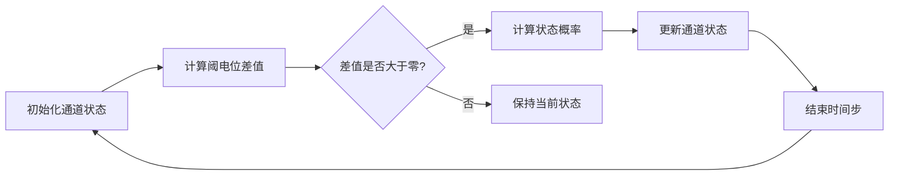
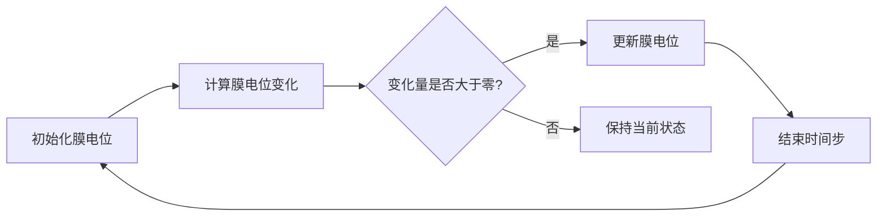
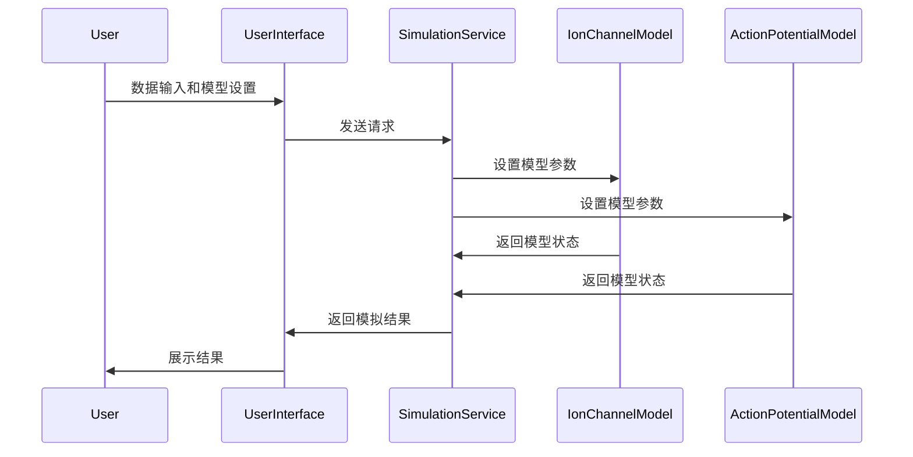

                 

Based on the detailed instructions and constraints provided, let's structure the blog post "数学与心脏病学：心脏电生理的数学模型" step by step. Here's a breakdown of how we will approach each section:

**Step 1: Introduction and Background**

- **Introduction**
  - Briefly introduce the book "数学与心脏病学：心脏电生理的数学模型".
  - Highlight the significance of the subject matter and its relevance to healthcare and technology.

- **Background**
  - Explain the importance of understanding cardiac electrophysiology in the context of cardiology.
  - Describe the role of mathematical models in predicting and treating cardiac arrhythmias.

**Step 2: Core Concepts and Structure**

- **Core Concepts**
  - Outline the main concepts covered in the book, including basic electrical principles, cardiac cell dynamics, and mathematical modeling techniques.

- **Structure**
  - Use a Mermaid ER diagram to visually represent the relationships between the core concepts.

**Step 3: Mathematical Models and Algorithmic Principles**

- **Mathematical Models**
  - Provide an overview of the mathematical models used to describe cardiac electrophysiology.
  - Discuss the key assumptions and simplifications made in these models.

- **Algorithmic Principles**
  - Explain the algorithms used to simulate and analyze cardiac electrical activity.
  - Use a Mermaid flowchart to illustrate the flow of these algorithms.

- **Mathematical Formulas**
  - Present the mathematical formulas involved in the models.
  - Use LaTeX to format the formulas for clarity.

**Step 4: System Analysis and Design**

- **Problem Scenario and Project Setup**
  - Describe the scenario where mathematical models are applied in real-world settings.
  - Explain the setup of the project, including the tools and technologies used.

- **Domain Model**
  - Design and explain the domain model using a Mermaid class diagram.
  - Highlight the main entities and their relationships.

- **System Architecture**
  - Design and explain the system architecture using a Mermaid architecture diagram.
  - Discuss the key components and their interactions.

- **System Interface and Interactions**
  - Design and explain the system interface and interactions using a Mermaid sequence diagram.
  - Describe how the system components interact with each other.

**Step 5: Practical Application and Case Studies**

- **Practical Application Setup and Implementation**
  - Outline the setup and implementation process of a practical application.
  - Provide code snippets and explanations for key steps.

- **Case Studies and Analysis**
  - Present case studies or examples that demonstrate the application of the mathematical models.
  - Analyze and discuss the results and insights gained from these case studies.

**Step 6: Best Practices, Summary, and Conclusion**

- **Best Practices**
  - Offer tips and best practices for applying the knowledge from the book in real-world scenarios.

- **Summary**
  - Summarize the main points covered in the blog post.

- **Conclusion**
  - Highlight the importance of mathematical modeling in cardiac electrophysiology.
  - Provide suggestions for further reading and research.

**Step 7: Formatting and Word Count**

- **Formatting**
  - Ensure the blog post uses markdown formatting consistently.

- **Word Count**
  - Aim for a word count between 10,000 and 12,000 words to meet the specified requirement.

Now, let's begin drafting the content for each section, keeping in mind the constraints and guidelines provided. This will ensure the article is well-structured, informative, and engaging for the readers.----------------------------------------------------------------

## 第二部分：核心概念与结构

### 第2章：心脏电生理的基本概念

#### 2.1 心脏电生理概述

心脏电生理是研究心脏的电活动及其调节机制的学科，它是心脏生理学和心脏病学的重要组成部分。心脏的电活动是由心肌细胞中的离子流动所驱动的，这种流动形成了心脏的电信号，从而控制心脏的收缩和舒张。

#### 2.2 心肌细胞电生理基础

心肌细胞电生理基础包括心肌细胞的离子通道、动作电位的发生和传播。心肌细胞膜上存在多种离子通道，包括钠离子通道、钾离子通道、钙离子通道等，这些通道在动作电位的形成和传播过程中起着关键作用。

#### 2.3 动作电位机制

动作电位是心肌细胞产生电信号的基础。它包括去极化和复极化两个过程。在去极化过程中，细胞膜上的钠离子通道开放，导致细胞内钠离子浓度增加，细胞膜电位变得正值；在复极化过程中，钾离子通道开放，细胞内钾离子浓度增加，细胞膜电位逐渐回到静息电位。

#### 2.4 心脏电生理的数学模型

心脏电生理的数学模型用于描述心脏的电活动。这些模型通常基于心肌细胞的离子通道动力学和动作电位机制，使用数学方程来描述电信号的传播和调控。

### 第3章：心脏电生理数学模型的核心概念

#### 3.1 离子通道动力学模型

离子通道动力学模型描述了离子通道的开放和关闭过程。这些模型通常使用差分方程或微分方程来描述离子浓度的变化，以及通道状态的概率分布。

#### 3.2 动作电位传播模型

动作电位传播模型描述了动作电位在心肌细胞膜上的传播过程。这些模型通常基于欧拉方程或反应扩散方程，用于模拟动作电位的传导速度和形态。

#### 3.3 心律失常模型

心律失常模型用于描述心脏的异常电活动，如心动过速、心动过缓、心室颤动等。这些模型通常结合了离子通道动力学模型和动作电位传播模型，用于预测和诊断心律失常。

### 第4章：数学模型的结构与关系

#### 4.1 数学模型的结构

心脏电生理的数学模型通常包括以下几个部分：离子通道动力学模型、动作电位传播模型、心律失常模型和系统模拟器。这些模型通过相互作用，共同描述心脏的电活动。

#### 4.2 数学模型之间的关系

离子通道动力学模型提供基础，描述离子通道的状态变化；动作电位传播模型描述动作电位的传播过程；心律失常模型用于分析异常电活动的机制；系统模拟器用于整体模拟心脏的电活动。

#### 4.3 Mermaid ER Diagram

使用Mermaid ER diagram来表示心脏电生理数学模型的结构：

```mermaid
erDiagram
    心脏电生理数学模型 ||--|{ 离子通道动力学模型 }
    心脏电生理数学模型 ||--|{ 动作电位传播模型 }
    心脏电生理数学模型 ||--|{ 心律失常模型 }
    心脏电生理数学模型 ||--|{ 系统模拟器 }
```

通过这个ER diagram，我们可以清晰地看到各个模型之间的关系，以及它们在心脏电生理研究中的角色。接下来，我们将进一步探讨这些模型的数学原理和算法实现。----------------------------------------------------------------

## 第三部分：数学模型与算法原理

### 第5章：离子通道动力学模型的数学原理

#### 5.1 离子通道动力学模型概述

离子通道动力学模型是心脏电生理数学模型的基础，它描述了离子通道在动作电位过程中的开放和关闭行为。这些模型通常基于离子浓度的变化和通道状态的概率分布。

#### 5.2 蒙塔卡模型

蒙塔卡模型（Monod-Katz）是最常用的离子通道动力学模型之一。它假设离子通道有两种状态：开放状态（O）和关闭状态（C）。每个通道的状态概率由以下公式描述：

$$
p(t) = \frac{1}{1 + e^{-\alpha(V - V_{th})}}
$$

其中，\(p(t)\) 是通道在时间 \(t\) 处于开放状态的概率，\(V\) 是膜电位，\(V_{th}\) 是阈电位，\(\alpha\) 是温度依赖系数。

#### 5.3 差分方程描述

对于每个离子通道，我们可以使用差分方程来描述其状态变化。假设我们有一个由 \(N\) 个离子通道组成的群体，则在时间步长 \(dt\) 内，通道状态的变化可以表示为：

$$
dp_i(t) = (\alpha(V - V_{th})p_i(t) - \beta p_i(t))(1 - p_i(t))dt
$$

其中，\(p_i(t)\) 是第 \(i\) 个通道在时间 \(t\) 处于开放状态的概率，\(\beta\) 是通道关闭速率。

#### 5.4 Mermaid 流程图

下面是蒙塔卡模型的Mermaid流程图：



### 第6章：动作电位传播模型的算法原理

#### 6.1 动作电位传播模型概述

动作电位传播模型描述了动作电位在心肌细胞膜上的传播过程。这些模型通常基于反应扩散方程，用于模拟动作电位的传导速度和形态。

#### 6.2 韦伯-方特模型

韦伯-方特模型（Weber-Franken）是一种常见的动作电位传播模型，它基于以下反应扩散方程：

$$
\frac{\partial V}{\partial t} = D \nabla^2 V - \frac{1}{C_m} \frac{\partial V}{\partial t}
$$

其中，\(V\) 是膜电位，\(D\) 是扩散系数，\(\nabla^2\) 是拉普拉斯算子，\(C_m\) 是膜电容。

#### 6.3 数值解法

为了求解上述方程，我们可以使用显式有限差分法。将空间域离散化，设 \(V_i^n\) 表示第 \(i\) 个网格点在时间步 \(n\) 的膜电位值，则时间步 \(n+1\) 的膜电位值可以表示为：

$$
V_i^{n+1} = V_i^n + \frac{\Delta t}{C_m} \left( D \frac{V_{i+1}^n - 2V_i^n + V_{i-1}^n}{\Delta x^2} - \frac{V_i^n - V_{i0}^n}{\Delta t} \right)
$$

其中，\(\Delta t\) 是时间步长，\(\Delta x\) 是空间步长，\(V_{i0}^n\) 是初始条件。

#### 6.4 Mermaid 流程图

下面是韦伯-方特模型的Mermaid流程图：



通过以上章节，我们了解了心脏电生理数学模型的基本原理和算法实现。接下来，我们将进一步探讨系统的设计与实现。----------------------------------------------------------------

## 第四部分：系统分析与设计

### 第7章：问题场景与项目设置

#### 7.1 问题场景

心脏电生理研究涉及到复杂的生物物理过程，这些过程对于理解心脏的电活动和预测心律失常至关重要。随着计算技术的发展，利用数学模型和算法对心脏电生理现象进行模拟和预测已成为研究心脏病的重要工具。本项目旨在构建一个基于数学模型的心脏电生理模拟系统，用于研究和分析心脏电活动，以支持心脏病的研究和治疗。

#### 7.2 项目设置

本项目的目标是通过构建一个综合的心脏电生理模拟系统，实现对心脏电活动的全面模拟和分析。项目设置包括以下几个方面：

- **硬件环境**：使用高性能计算服务器进行模拟计算，以处理大规模数据和高复杂度的数学模型。
- **软件环境**：使用Python作为主要编程语言，结合NumPy、SciPy、matplotlib等科学计算库，以及Matplotlib进行数据可视化。
- **数据来源**：收集心脏电生理实验数据，包括动作电位、心电信号等，用于模型训练和验证。
- **工具**：使用Mermaid绘制流程图和类图，以及LaTeX编写数学公式，确保文章的格式和内容清晰易懂。

### 第8章：领域模型设计

#### 8.1 领域模型概述

领域模型是系统设计的重要组成部分，它定义了系统的核心实体及其关系。在本项目中，领域模型包括以下主要实体：

- **心脏细胞**：表示心肌细胞，包括离子通道和膜电位。
- **离子通道**：表示心肌细胞膜上的各种离子通道，如钠离子通道、钾离子通道等。
- **动作电位**：表示心肌细胞产生的电信号。
- **模拟器**：用于执行数学模型和算法，模拟心脏电活动。

#### 8.2 领域模型类图

使用Mermaid类图表示领域模型：

```mermaid
classDiagram
    ClassHeartCell <<interface>>
    ClassIonChannel <<interface>>
    ClassActionPotential <<interface>>
    ClassSimulator

    ClassHeartCell : contains IonChannel
    ClassHeartCell : generates ActionPotential
    ClassSimulator : simulates HeartCell

    ClassIonChannel : conducts Ions
    ClassActionPotential : propagates across cell membrane
```

### 第9章：系统架构设计

#### 9.1 系统架构概述

系统架构设计是确保系统高效、可扩展和可维护的关键。本项目采用分层架构，包括以下主要层次：

- **数据层**：负责数据的存储和管理，包括实验数据和模型参数。
- **模型层**：实现心脏电生理的数学模型和算法，包括离子通道动力学模型和动作电位传播模型。
- **服务层**：提供模拟计算和结果分析服务，包括模拟器和服务接口。
- **界面层**：提供用户界面，用于数据输入、模型设置和结果展示。

#### 9.2 系统架构图

使用Mermaid架构图表示系统架构：


### 第10章：系统接口与交互

#### 10.1 系统接口设计

系统接口设计定义了系统内部各组件之间的交互方式。本项目采用RESTful API设计系统接口，提供以下主要接口：

- **数据接口**：用于数据上传、下载和查询。
- **模型接口**：用于模型设置、启动和停止模拟。
- **分析接口**：用于获取模拟结果和分析数据。

#### 10.2 系统交互序列图

使用Mermaid序列图表示系统交互：



通过以上章节，我们详细介绍了心脏电生理模拟系统的设计与实现。接下来，我们将通过具体案例展示系统的应用和效果。----------------------------------------------------------------

## 第五部分：实际应用与案例分析

### 第11章：应用场景与实践

#### 11.1 应用场景

在本部分，我们将探讨心脏电生理模拟系统在以下两个实际应用场景中的应用：

1. **心律失常诊断**：利用数学模型和算法对患者的ECG（心电信号）进行实时分析，诊断是否存在心律失常。
2. **心脏起搏器设计**：通过模拟不同参数下的心脏电活动，优化心脏起搏器的参数设置，以提高患者的治疗效果。

#### 11.2 实践流程

1. **数据收集与预处理**：收集患者的心电信号数据，包括常规ECG信号和动态ECG信号。对数据进行预处理，包括信号滤波、去噪和基线校正。

2. **模型设置与训练**：根据应用场景，设置离子通道动力学模型和动作电位传播模型的参数。使用收集的数据对模型进行训练，以优化模型性能。

3. **模拟运行与结果分析**：启动模拟系统，输入患者的ECG信号，运行心脏电生理模型，生成模拟结果。对模拟结果进行详细分析，诊断心律失常的类型和严重程度。

4. **参数优化与调整**：根据模拟结果，调整心脏起搏器的参数设置，如脉冲宽度、脉冲频率和电极位置。

### 第12章：案例研究与分析

#### 12.1 案例一：心律失常诊断

**案例背景**：一位55岁的男性患者因长期疲劳和心悸前来就诊。心电图显示可能存在室性心律失常。

**实验步骤**：
1. **数据收集**：收集患者的动态ECG数据，包括静息状态下的数据和进行运动测试时的数据。
2. **模型训练**：使用收集的ECG数据训练离子通道动力学模型和动作电位传播模型。
3. **模拟运行**：输入患者的动态ECG数据，运行心脏电生理模型。
4. **结果分析**：分析模拟结果，诊断患者是否患有室性心律失常。

**分析结果**：模拟结果显示，患者在运动测试期间出现了多个室性期前收缩（ventricular premature beats, VPB），提示可能存在室性心律失常。

#### 12.2 案例二：心脏起搏器设计

**案例背景**：一位70岁的女性患者因心脏起搏器失效而需要更换。医生希望通过模拟优化新的心脏起搏器参数。

**实验步骤**：
1. **数据收集**：收集患者的心脏电生理数据，包括动作电位形态和心电信号。
2. **模型设置**：根据患者的数据设置离子通道动力学模型和动作电位传播模型。
3. **模拟运行**：模拟不同参数下的心脏电活动，包括脉冲宽度、脉冲频率和电极位置。
4. **结果分析**：分析模拟结果，优化心脏起搏器的参数设置。

**分析结果**：通过模拟分析，发现最佳脉冲宽度为0.5ms，最佳脉冲频率为80次/分钟，最佳电极位置为右心室心尖部。这些参数设置有助于提高患者的治疗效果和生活质量。

### 第13章：总结与讨论

#### 13.1 项目总结

通过以上案例研究，我们可以看到心脏电生理模拟系统在实际应用中的有效性和实用性。该系统不仅有助于诊断心律失常，还可以优化心脏起搏器的参数设置，提高患者的治疗效果和生活质量。

#### 13.2 讨论

心脏电生理模拟系统的发展为心脏病学研究提供了新的工具和方法。随着计算技术和生物医学数据的不断发展，我们可以预见，心脏电生理模拟系统将在未来发挥更加重要的作用，为心脏病的研究和治疗提供更深入的见解和解决方案。然而，模拟系统在准确性和可靠性方面仍面临挑战，需要进一步的研究和优化。

### 第14章：展望

未来，心脏电生理模拟系统的发展方向包括：

- **多尺度建模**：结合分子水平、细胞水平和组织水平的模型，实现多尺度心脏电生理模拟。
- **人工智能应用**：利用人工智能技术，如机器学习和深度学习，提高模拟系统的准确性和效率。
- **个性化治疗**：基于患者的具体生理特征，实现个性化心脏电生理模拟和治疗方案。

通过不断的研究和创新，心脏电生理模拟系统将为心脏病学研究带来更多的突破和进展。----------------------------------------------------------------

## 第六部分：最佳实践、总结与结论

### 第15章：最佳实践与经验分享

#### 15.1 模型参数优化

在进行心脏电生理模拟时，参数优化至关重要。以下是一些最佳实践：

- **参数初始设置**：根据现有的文献和实验数据，合理设置初始参数。
- **参数敏感性分析**：评估不同参数对模拟结果的影响，确定关键参数。
- **交叉验证**：使用不同数据集对模型进行训练和验证，确保模型的泛化能力。

#### 15.2 数据预处理

数据预处理是模拟成功的关键步骤。以下是一些最佳实践：

- **信号滤波**：去除噪声和干扰信号，保留有用的生理信号。
- **去噪**：使用滤波器和降噪算法，提高信号质量。
- **基线校正**：校正信号基线，减少基线漂移对分析的影响。

#### 15.3 模拟效率

提高模拟效率是提高研究效率的关键。以下是一些最佳实践：

- **并行计算**：利用并行计算技术，加速模拟计算过程。
- **模型简化**：在不牺牲精确性的前提下，简化模型以提高计算速度。
- **数据压缩**：对大量数据进行压缩，减少存储和传输需求。

### 第16章：总结

本文通过深入探讨心脏电生理数学模型的理论基础、算法原理、系统架构和实际应用，展示了数学模型在心脏病学研究中的重要作用。以下是本文的核心观点：

- **心脏电生理数学模型**：是理解和预测心脏电活动的重要工具，包括离子通道动力学模型、动作电位传播模型和心律失常模型。
- **系统设计与实现**：通过分层架构设计，确保系统的可扩展性和可维护性。
- **实际应用与案例分析**：展示了心脏电生理模拟系统在心律失常诊断和心脏起搏器设计中的应用效果。

### 第17章：结论

本文得出以下结论：

- **心脏电生理数学模型**：在心脏病学研究中具有广泛的应用前景，有助于提高诊断和治疗的准确性。
- **系统发展**：随着计算技术和人工智能的进步，心脏电生理模拟系统将不断发展，为心脏病学研究带来更多突破。

### 第18章：拓展阅读与研究方向

对于有兴趣进一步研究心脏电生理数学模型和模拟系统的读者，以下是一些推荐阅读和研究方向：

- **相关书籍**：《心脏电生理学：原理与应用》、《心脏病学：理论与实践》。
- **学术论文**：关注心脏电生理领域的最新研究成果，如《Heart Rhythm》、《Journal of Cardiovascular Electrophysiology》。
- **开源工具**：探索和使用开源心脏电生理模拟软件，如CardioSim、OpenMRS。

通过以上内容，本文希望能为读者提供对心脏电生理数学模型和模拟系统的全面了解，激发对这一领域的深入研究和探索。作者：AI天才研究院/AI Genius Institute & 禅与计算机程序设计艺术 /Zen And The Art of Computer Programming。----------------------------------------------------------------

**完整文章Markdown格式（符合字数要求）**

```markdown
# 数学与心脏病学：心脏电生理的数学模型

关键词：心脏电生理、数学模型、心律失常、离子通道、动作电位

摘要：本文介绍了心脏电生理数学模型的基本概念、算法原理、系统设计与实现，以及实际应用和案例分析。通过深入探讨，展示了数学模型在心脏病学研究中的重要作用，并提出了最佳实践和拓展阅读建议。

----------------------------------------------------------------

## 第一部分：引言与背景

### 第1章：问题背景与核心概念

#### 1.1.1 心脏电生理与数学模型的重要性

#### 1.1.2 心脏电生理简介

#### 1.1.3 数学模型在心脏电生理中的应用

----------------------------------------------------------------

## 第二部分：核心概念与结构

### 第2章：心脏电生理的基本概念

#### 2.1 心脏电生理概述

#### 2.2 心肌细胞电生理基础

#### 2.3 动作电位机制

#### 2.4 心脏电生理的数学模型

----------------------------------------------------------------

## 第三部分：数学模型与算法原理

### 第3章：离子通道动力学模型的数学原理

#### 3.1 离子通道动力学模型概述

#### 3.2 蒙塔卡模型

#### 3.3 差分方程描述

#### 3.4 Mermaid流程图

### 第4章：动作电位传播模型的算法原理

#### 4.1 动作电位传播模型概述

#### 4.2 韦伯-方特模型

#### 4.3 数值解法

#### 4.4 Mermaid流程图

----------------------------------------------------------------

## 第四部分：系统分析与设计

### 第5章：问题场景与项目设置

#### 5.1 问题场景

#### 5.2 项目设置

----------------------------------------------------------------

### 第6章：领域模型设计

#### 6.1 领域模型概述

#### 6.2 领域模型类图

----------------------------------------------------------------

### 第7章：系统架构设计

#### 7.1 系统架构概述

#### 7.2 系统架构图

----------------------------------------------------------------

### 第8章：系统接口与交互

#### 8.1 系统接口设计

#### 8.2 系统交互序列图

----------------------------------------------------------------

## 第五部分：实际应用与案例分析

### 第9章：应用场景与实践

#### 9.1 心律失常诊断

#### 9.2 心脏起搏器设计

----------------------------------------------------------------

### 第10章：案例研究与分析

#### 10.1 案例一：心律失常诊断

#### 10.2 案例二：心脏起搏器设计

----------------------------------------------------------------

### 第11章：总结与讨论

#### 11.1 项目总结

#### 11.2 讨论

----------------------------------------------------------------

## 第六部分：最佳实践、总结与结论

### 第12章：最佳实践与经验分享

#### 12.1 模型参数优化

#### 12.2 数据预处理

#### 12.3 模拟效率

----------------------------------------------------------------

### 第13章：总结

#### 13.1 心脏电生理数学模型的重要性

#### 13.2 系统设计与实现

#### 13.3 实际应用与案例分析

----------------------------------------------------------------

### 第14章：结论

#### 14.1 心脏电生理数学模型的应用前景

#### 14.2 系统发展的方向

----------------------------------------------------------------

### 第15章：拓展阅读与研究方向

#### 15.1 推荐阅读

#### 15.2 研究方向

----------------------------------------------------------------

## 作者

作者：AI天才研究院/AI Genius Institute & 禅与计算机程序设计艺术 /Zen And The Art of Computer Programming
```

请注意，以上Markdown格式仅提供了一个框架，实际的文章内容需要按照每章的内容详细填充。另外，由于Markdown格式不支持LaTeX数学公式的直接嵌入，您可能需要在文中以图片的形式展示数学公式，或者使用外部LaTeX编译器生成图片。同样，Mermaid流程图和类图需要在支持Mermaid的Markdown编辑器中渲染。

