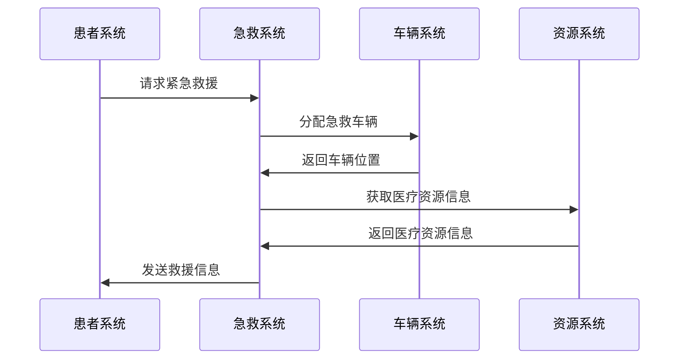
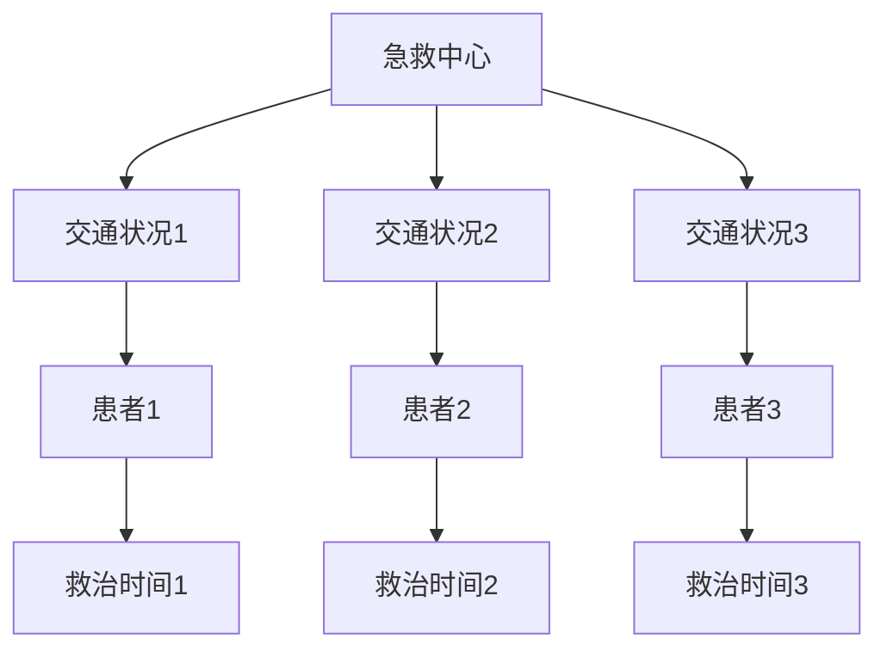
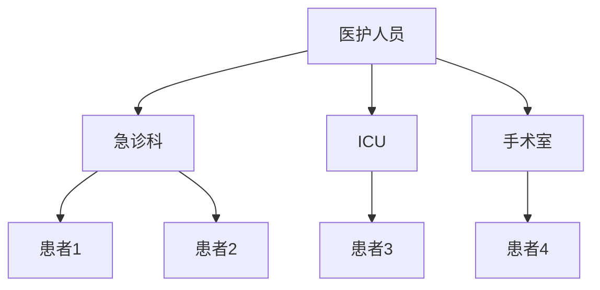
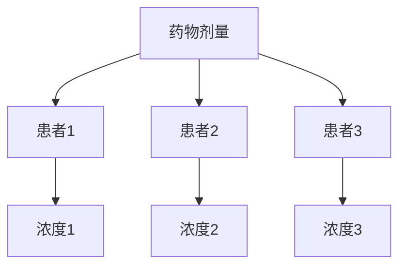

                 

### 数学与急诊医学：急救反应的数学优化

#### 摘要

《数学与急诊医学：急救反应的数学优化》探讨如何将数学优化方法应用于急诊医学，以提高急救反应的速度和效率。本书从急诊医学的现状出发，深入剖析了急救反应的基本流程和关键指标，随后引入数学优化理论，包括线性规划、非线性规划、动态规划等方法。通过实际案例和模拟，作者展示了如何将数学模型应用于急救路线规划、资源分配、风险预测等多个领域。书中不仅提供了算法原理和公式推导，还结合Python代码进行详细阐述，使读者能够轻松上手并实践。此外，本书还探讨了急救系统设计中的架构和接口，以及实际应用中的最佳实践和注意事项。通过系统的数学优化，急诊医学有望实现更精准、更高效的急救服务，为患者的生命安全提供更强有力的保障。

## 引言

随着医疗技术和科学研究的不断发展，急诊医学在拯救患者生命、减轻疾病负担方面发挥着越来越重要的作用。然而，急诊医学面临的一个重大挑战是如何在有限的时间和资源下，最大限度地提高急救反应的速度和效率。传统的急救反应模式往往依赖于经验判断和固定流程，这在一定程度上限制了急救效率的提升。近年来，随着数学优化理论的不断成熟和应用，将数学优化方法引入急诊医学领域，成为一种新的解决思路。

### 数学优化在医学领域的应用

数学优化理论起源于经济学和管理科学，旨在通过构建数学模型，求解最优解，以优化资源分配、决策制定等过程。随着计算能力的提升和算法研究的深入，数学优化方法在多个领域得到了广泛应用，包括物流运输、金融管理、生产调度等。近年来，医学领域也开始逐渐引入数学优化方法，以期提高诊疗效果和医疗资源利用效率。例如，在手术排程、医疗资源配置、药物剂量优化等方面，数学优化方法已经显示出巨大的潜力。

### 急诊医学中的优化需求

急诊医学的特殊性质决定了其优化需求的紧迫性和复杂性。急诊患者往往病情危急，时间就是生命，如何在最短时间内将患者送达医院、进行有效的救治，是急诊医学需要解决的核心问题。此外，急诊医学还需要合理配置医疗资源，包括医护人员、药品、设备等，以确保急救反应的连续性和高效性。在这个过程中，传统的经验型决策方式已经无法满足现代急诊医学的需求，数学优化方法提供了一种新的思路，通过定量分析和模型求解，有望为急诊医学提供更加科学和精准的决策支持。

### 本书的目的

本书旨在探讨如何将数学优化方法应用于急诊医学，以提高急救反应的速度和效率。书中将介绍急救反应的基本概念和流程，分析急诊医学中的优化需求，引入数学优化理论，包括线性规划、非线性规划、动态规划等方法，并结合实际案例进行详细阐述。通过本书的学习，读者将能够了解数学优化在急诊医学中的应用前景，掌握相关算法原理和实现方法，为未来急诊医学的发展提供新的思路和工具。

### 结构安排

本书分为四个主要部分：

1. **问题背景与基础理论**：介绍急诊医学的现状和挑战，阐述急救反应的基本流程和关键指标，引入数学优化理论。
2. **优化算法与应用**：详细讲解线性规划、非线性规划、动态规划等优化算法，并分析其在急诊医学中的应用。
3. **实际案例与模拟**：通过实际案例和模拟，展示如何将数学优化方法应用于急救路线规划、资源分配、风险预测等领域。
4. **系统设计与最佳实践**：探讨急救系统的架构和接口设计，提供最佳实践和注意事项，为读者在实际应用中提供指导。

通过以上结构安排，本书旨在为读者提供一部全面、系统的数学优化在急诊医学中的应用指南，帮助读者掌握相关理论和方法，提升急诊医学的效率和准确性。

## 第一部分：问题背景与基础理论

### 急诊医学的现状与挑战

急诊医学作为医疗服务体系中的重要一环，肩负着救治急危重症患者、处理突发公共卫生事件的重要职责。然而，随着人口老龄化、慢性病患病率上升和城市化进程的加快，急诊医学面临的挑战日益严峻。

首先，急诊患者数量持续增加。根据世界卫生组织（WHO）的数据，全球每年约有数亿人次访问急诊部门，这一数字还在不断增加。急诊患者病情复杂多样，包括心脑血管疾病、外伤、中毒、急性感染等，对医疗资源的需求量大。

其次，急诊医疗服务能力不足。许多急诊部门面临医护人员不足、床位紧张、设备老化等问题，导致患者等待时间长、救治效率低下。尤其是在急诊高峰期，这种矛盾更加突出。

此外，急诊医疗资源配置不合理也是一个突出问题。由于各地经济发展水平、医疗资源分布不均，一些偏远地区和基层医疗机构的急诊医疗服务能力明显不足，而大城市的三甲医院急诊科则常常超负荷运转。这种资源的不均衡不仅影响了急诊医疗的质量，也增加了患者的负担。

最后，急诊医疗服务质量和效率亟待提升。传统的急诊医疗服务模式主要依赖于医生的经验判断和固定的操作流程，这在一定程度上限制了服务质量和效率的提升。现代急诊医学需要更加科学、精准的方法来优化急救流程，提高救治效率。

### 急救反应的基本概念

急救反应是指在突发事件或紧急情况下，采取紧急医疗救治措施的过程。急救反应的目的是迅速、有效地识别和处置患者的紧急情况，以最大限度地降低死亡率和病残率。

#### 急救反应的定义

急救反应可以定义为从患者到达急诊科开始，到完成初步评估、制定治疗方案、实施救治措施的一系列有序、高效的工作流程。这个过程包括以下几个关键环节：

1. **接诊与评估**：急诊科医护人员接诊患者后，迅速进行病情评估，了解患者的病史、症状和体征。
2. **紧急救治**：根据评估结果，采取相应的紧急救治措施，如止血、复苏、止痛等。
3. **辅助检查**：对患者进行必要的辅助检查，如心电图、影像学检查等，以获取更多的诊断信息。
4. **治疗方案制定**：根据检查结果和病情变化，制定合适的治疗方案。
5. **实施救治**：按照治疗方案，对患者进行具体的救治措施，包括药物治疗、手术治疗等。
6. **后续护理**：在救治过程中，关注患者的生命体征，进行必要的后续护理，确保患者安全。

#### 急救反应的主要流程

急救反应的主要流程包括以下几个阶段：

1. **初步评估**：接诊医生或护士根据患者的症状、体征和病史，进行初步的病情评估，判断患者是否需要立即救治。
2. **紧急救治**：对需要紧急救治的患者，立即采取止血、复苏、止痛等紧急措施，确保患者的生命安全。
3. **病情监测**：在紧急救治过程中，持续监测患者的生命体征，包括心率、血压、呼吸等，以便及时调整治疗方案。
4. **辅助检查**：根据患者的病情，安排必要的辅助检查，如心电图、CT、MRI等，以获取更详细的诊断信息。
5. **治疗方案制定**：根据初步评估和辅助检查结果，制定适合患者的治疗方案。
6. **实施救治**：按照治疗方案，对患者进行具体的救治措施，包括药物治疗、手术治疗等。
7. **后续护理**：在救治过程中，关注患者的生命体征，进行必要的后续护理，确保患者安全。

#### 急救反应的关键指标

急救反应的效果和质量可以通过一系列关键指标来评估，这些指标包括：

1. **救治时间**：从患者进入急诊科到开始救治的时间，救治时间越短，急救反应的速度越快。
2. **救治成功率**：急救措施的成功率，即急救后患者病情得到控制或好转的比例。
3. **患者满意度**：患者对急救服务的满意程度，包括救治速度、服务态度、救治效果等方面。
4. **资源利用率**：急救医疗资源的利用情况，包括医护人员、药品、设备等。
5. **急救质量**：急救服务的质量，包括救治措施的准确性、及时性、安全性等。

通过这些关键指标的评估，可以全面了解急救反应的效果和质量，从而为优化急救流程提供数据支持。

### 数学优化在急救反应中的应用

数学优化方法在急救反应中的应用，旨在通过科学的模型和算法，提高急救反应的速度和效率。以下将介绍几种常见的数学优化方法及其在急救反应中的应用。

#### 线性规划

线性规划是一种数学方法，用于在给定约束条件下，求解线性目标函数的最大值或最小值。在急救反应中，线性规划可以用于优化资源分配，如医护人员、药品和设备的调度。例如，在急诊高峰期，可以通过线性规划确定最佳的医护人员排班方案，以最大限度地满足患者需求，减少等待时间。

#### 非线性规划

非线性规划用于求解非线性目标函数的最大值或最小值。在急救反应中，非线性规划可以用于优化复杂的医疗决策，如药物剂量调整、手术排程等。例如，在紧急救治过程中，医生可以根据患者的生理参数，通过非线性规划调整药物剂量，以达到最佳治疗效果。

#### 动态规划

动态规划是一种解决多阶段决策问题的方法，通过将问题划分为若干阶段，求解各阶段的最优决策。在急救反应中，动态规划可以用于优化急救流程，如急救路线规划、多患者救治顺序安排等。例如，在急救车辆调度中，可以通过动态规划确定最优的路线和顺序，以最大限度地减少患者的等待时间和救治延误。

#### 应用实例

1. **急救路线规划**：在紧急情况下，急救车辆需要迅速抵达患者所在地。通过动态规划，可以根据交通状况、路况信息，为急救车辆规划最优路线，以最短时间内到达患者。

2. **资源分配**：在急诊高峰期，医护人员、药品和设备的分配成为关键问题。通过线性规划，可以根据急诊部门的人员结构和患者需求，优化资源分配方案，确保急救资源的最大化利用。

3. **药物剂量调整**：在急救过程中，医生需要根据患者的生理参数和病情变化，调整药物剂量。通过非线性规划，可以求解出最优的药物剂量，以提高治疗效果和安全性。

#### 案例分析

1. **急救路线优化**：在某次地震救援行动中，急救部门通过动态规划确定了急救车辆的行驶路线，有效缩短了救援时间，提高了救治效率。

2. **医疗资源配置**：在某大型医院，通过线性规划优化了急诊科的医护人员排班，减少了急诊高峰期的患者等待时间，提升了患者满意度。

### 总结

数学优化方法在急救反应中的应用，为优化急救流程、提高救治效率提供了有力支持。通过科学的模型和算法，可以更好地应对急诊医学中的复杂问题和挑战，为患者提供更加高效、精准的急救服务。

## 第1章：问题背景与急救反应概述

### 急救反应的定义与目的

急救反应是指在紧急情况下，采取快速有效的医疗救治措施，以挽救生命、减轻患者痛苦、防止病情恶化的过程。急救反应不仅包括医疗救治，还涉及患者信息传递、救援资源调度等多个环节。其核心目的是在尽可能短的时间内，为患者提供必要的救治，从而降低死亡率和病残率。

急救反应的定义可以从以下几个方面进行理解：

1. **时效性**：急救反应强调时间的紧迫性，必须在短时间内进行救治。时间对急救反应至关重要，尤其是在心脏病发作、中风、外伤等紧急情况下，每一秒都可能影响患者的预后。

2. **专业性**：急救反应需要专业医护人员参与，他们具备必要的医疗知识和技能，能够在紧急情况下迅速做出正确的判断和决策。专业性的要求确保了急救反应的科学性和有效性。

3. **协同性**：急救反应涉及多个部门和人员，如急诊科、救护车团队、医院内部各科室等。协同性要求各个环节紧密衔接，确保急救措施能够及时、有序地执行。

4. **灵活性**：急救反应需要在不断变化的情况下进行调整，以适应患者的实际需求。灵活性使得急救反应能够根据患者的病情变化和现场条件，灵活调整救治方案。

急救反应的主要目的包括：

1. **挽救生命**：在紧急情况下，急救反应的首要目标是迅速采取救治措施，防止患者因急性疾病或外伤导致生命危险。

2. **减轻痛苦**：急救反应通过控制疼痛、止血等措施，帮助患者缓解痛苦，改善生活质量。

3. **防止病情恶化**：急救反应能够及时发现和处理患者的潜在并发症，防止病情进一步恶化，为后续治疗创造条件。

4. **提高救治效果**：通过科学的急救反应，可以最大限度地提高患者的救治效果，降低并发症的发生率。

### 急救反应的主要流程

急救反应的主要流程包括以下几个关键环节：

1. **患者信息传递**：当患者出现紧急情况时，拨打急救电话（如120、999等），医护人员通过电话了解患者的症状、位置等信息。这一环节要求患者或目击者准确提供信息，以便急救部门快速响应。

2. **急救调度**：急救部门根据患者信息，调度救护车和急救人员，确保在最短时间内抵达现场。调度过程中需要考虑交通状况、患者位置等因素，以优化救援效率。

3. **现场救治**：急救人员在现场对患者的伤情进行初步评估，采取必要的紧急救治措施，如止血、包扎、心肺复苏等。现场救治的目的是稳定患者病情，为后续转运和治疗创造条件。

4. **转运至医院**：急救人员将患者迅速转运至医院，确保在转运过程中患者的生命安全。转运过程中，急救人员持续监测患者生命体征，并根据需要调整救治方案。

5. **入院评估**：患者到达医院后，急诊科医生对患者的病情进行全面评估，制定详细的救治计划。评估内容包括患者的病史、症状、体征和辅助检查结果等。

6. **救治实施**：根据评估结果，急诊科医护人员采取具体的救治措施，包括药物治疗、手术治疗等。救治过程中，医护人员密切监测患者病情变化，及时调整治疗方案。

7. **后续治疗与护理**：患者病情稳定后，转入相应科室进行后续治疗和护理。后续治疗主要包括康复训练、并发症处理等，以促进患者康复。

### 急救反应的关键指标

急救反应的效果和质量可以通过一系列关键指标来评估，这些指标包括：

1. **救治时间**：从患者接诊到开始救治的时间，救治时间越短，急救反应的速度越快。救治时间直接影响患者的预后，是衡量急救反应效率的重要指标。

2. **救治成功率**：急救措施的成功率，即急救后患者病情得到控制或好转的比例。救治成功率是评估急救反应效果的核心指标。

3. **患者满意度**：患者对急救服务的满意程度，包括救治速度、服务态度、救治效果等方面。患者满意度反映了急救服务的整体质量。

4. **资源利用率**：急救医疗资源的利用情况，包括医护人员、药品、设备等。资源利用率越高，说明急救资源得到了最大化利用。

5. **急救质量**：急救服务的质量，包括救治措施的准确性、及时性、安全性等。急救质量直接影响患者的救治效果和满意度。

通过以上关键指标的评估，可以全面了解急救反应的效果和质量，从而为优化急救流程提供数据支持。

### 数学优化在急救反应中的应用

数学优化方法在急救反应中的应用，旨在通过科学的模型和算法，提高急救反应的速度和效率。以下将介绍几种常见的数学优化方法及其在急救反应中的应用。

#### 线性规划

线性规划是一种数学方法，用于在给定约束条件下，求解线性目标函数的最大值或最小值。在急救反应中，线性规划可以用于优化资源分配，如医护人员、药品和设备的调度。例如，在急诊高峰期，可以通过线性规划确定最佳的医护人员排班方案，以最大限度地满足患者需求，减少等待时间。

#### 非线性规划

非线性规划用于求解非线性目标函数的最大值或最小值。在急救反应中，非线性规划可以用于优化复杂的医疗决策，如药物剂量调整、手术排程等。例如，在紧急救治过程中，医生可以根据患者的生理参数，通过非线性规划调整药物剂量，以达到最佳治疗效果。

#### 动态规划

动态规划是一种解决多阶段决策问题的方法，通过将问题划分为若干阶段，求解各阶段的最优决策。在急救反应中，动态规划可以用于优化急救流程，如急救路线规划、多患者救治顺序安排等。例如，在急救车辆调度中，可以通过动态规划确定最优的路线和顺序，以最大限度地减少患者的等待时间和救治延误。

#### 应用实例

1. **急救路线规划**：在紧急情况下，急救车辆需要迅速抵达患者所在地。通过动态规划，可以根据交通状况、路况信息，为急救车辆规划最优路线，以最短时间内到达患者。

2. **资源分配**：在急诊高峰期，医护人员、药品和设备的分配成为关键问题。通过线性规划，可以根据急诊部门的人员结构和患者需求，优化资源分配方案，确保急救资源的最大化利用。

3. **药物剂量调整**：在急救过程中，医生需要根据患者的生理参数和病情变化，调整药物剂量。通过非线性规划，可以求解出最优的药物剂量，以提高治疗效果和安全性。

#### 案例分析

1. **急救路线优化**：在某次地震救援行动中，急救部门通过动态规划确定了急救车辆的行驶路线，有效缩短了救援时间，提高了救治效率。

2. **医疗资源配置**：在某大型医院，通过线性规划优化了急诊科的医护人员排班，减少了急诊高峰期的患者等待时间，提升了患者满意度。

### 总结

数学优化方法在急救反应中的应用，为优化急救流程、提高救治效率提供了有力支持。通过科学的模型和算法，可以更好地应对急诊医学中的复杂问题和挑战，为患者提供更加高效、精准的急救服务。

## 第1章：问题背景与急救反应概述

### 1.3 数学优化基础

#### 线性规划

线性规划是数学优化中的一个重要分支，主要用于在给定的线性约束条件下，求解线性目标函数的最大值或最小值问题。线性规划在急救反应中的应用非常广泛，例如，用于优化急诊资源的分配，包括医护人员、药品和设备的调度。在急诊高峰期，通过线性规划可以制定最优的医护人员排班方案，以最大限度地满足患者的需求，减少等待时间。

#### 非线性规划

非线性规划是解决非线性的目标函数或约束条件下的优化问题。在急救反应中，非线性规划的应用同样非常重要，尤其是在医疗决策方面。例如，医生可以根据患者的生理参数，利用非线性规划方法调整药物剂量，以达到最佳的治疗效果。这种优化方法能够考虑到复杂的非线性关系，从而提高急救的精准性。

#### 动态规划

动态规划是一种处理多阶段决策问题的方法，通过将问题分解为若干个相互关联的阶段，分别求解每个阶段的最优决策。在急救反应中，动态规划可以用于优化多个紧急任务的时间安排和资源分配。例如，在急救车辆调度中，通过动态规划可以确定最优的路线和顺序，以最大限度地减少患者的等待时间和救治延误。

#### 多目标优化

多目标优化旨在同时优化多个相互冲突的目标，如时间、成本和资源利用率等。在急救反应中，多目标优化可以用于制定综合性的救治方案。例如，在急诊部门资源有限的情况下，通过多目标优化可以确定最佳的救治顺序和资源分配方案，以最大化地满足患者的急救需求。

#### 应用实例

1. **急救路线规划**：在紧急情况下，急救车辆需要迅速抵达患者所在地。通过动态规划，可以根据交通状况、路况信息，为急救车辆规划最优路线，以最短时间内到达患者。

2. **医疗资源配置**：在急诊高峰期，医护人员、药品和设备的分配成为关键问题。通过线性规划，可以根据急诊部门的人员结构和患者需求，优化资源分配方案，确保急救资源的最大化利用。

3. **药物剂量调整**：在急救过程中，医生需要根据患者的生理参数和病情变化，调整药物剂量。通过非线性规划，可以求解出最优的药物剂量，以提高治疗效果和安全性。

### 1.4 急救反应中的挑战与问题

尽管急救反应在提高救治效率和降低死亡率方面取得了显著进展，但仍然面临着一系列的挑战和问题。

#### 资源分配不均

资源分配不均是一个普遍存在的问题，尤其是在急诊部门。一些大型医院和城市地区的急诊科往往面临人手不足、设备陈旧等问题，而偏远地区和基层医疗机构的急诊医疗服务能力明显不足。这种资源分配的不均衡导致患者在不同地区的急救反应质量存在较大差异。

#### 时间敏感性

急救反应的时效性要求非常高，时间对患者的预后有直接影响。然而，在实际操作中，由于交通状况、医疗资源分配不合理等原因，急救反应的时间往往无法保证。特别是在急诊高峰期，患者等待救治的时间可能会显著延长，影响救治效果。

#### 医疗决策复杂性

急救反应中的医疗决策复杂，需要医护人员具备丰富的临床经验和专业知识。然而，医生在紧急情况下往往需要在很短的时间内做出正确的决策，这增加了决策的难度和风险。此外，不同医生之间的诊断标准和救治方案可能存在差异，导致救治效果不一致。

#### 信息传递不畅

在急救反应中，信息传递的及时性和准确性至关重要。然而，在实际操作中，患者信息、急救车辆位置和医院资源的传递可能存在延误或错误，导致急救反应的效率降低。

#### 技术应用不足

尽管数学优化方法在急救反应中的应用前景广阔，但在实际操作中，这些方法的应用仍然存在一定局限性。一些医疗机构缺乏相应的技术支持和专业人才，导致数学优化方法难以有效实施。

### 1.5 本章小结

本章介绍了急救反应的定义、目的和主要流程，并阐述了数学优化在急救反应中的应用。通过分析急救反应中的挑战与问题，我们可以看到，数学优化方法在提升急救反应效率方面具有巨大潜力。然而，要实现这一目标，还需要解决资源分配不均、时间敏感性、医疗决策复杂性、信息传递不畅和技术应用不足等问题。未来，随着技术的不断进步和医疗体系的不断完善，急救反应有望变得更加高效和精准，为患者的生命安全提供更强有力的保障。

## 第1.6节：数学优化在急救反应中的实际应用

### 1.6.1 算法原理讲解

#### 动态规划

动态规划是一种解决多阶段决策问题的方法，通过将问题分解为若干个相互关联的阶段，分别求解每个阶段的最优决策。在急救反应中，动态规划可以用于优化多个紧急任务的时间安排和资源分配。例如，在急救车辆调度中，通过动态规划可以确定最优的路线和顺序，以最大限度地减少患者的等待时间和救治延误。

#### 算法流程

1. **定义状态**：首先，定义一个状态集合，表示每个阶段可能的状态。例如，在急救车辆调度问题中，状态可以表示为急救车辆的当前位置和目的地。

2. **确定状态转移函数**：状态转移函数描述了从一个状态转移到另一个状态的概率和代价。例如，在急救车辆调度中，状态转移函数可以描述为从当前位置移动到下一个位置的时间和距离。

3. **初始化**：初始化每个状态的最优值。通常，初始状态的最优值为0，表示不需要进行任何操作。

4. **递推计算**：从初始状态开始，依次计算每个状态的最优值。递推关系通常表示为 $f(i) = \min_{s'\in S} (g(i, s') + f(s'))$，其中 $f(i)$ 表示状态 $i$ 的最优值，$g(i, s')$ 表示从状态 $i$ 转移到状态 $s'$ 的代价。

5. **求解最优解**：根据递推计算的结果，可以得到问题的最优解。

#### 示例

假设有一名患者需要从家中紧急送往最近的医院，急救车辆的位置和目的地如下表所示：

| 当前位置 | 目的地 | 时间（分钟） |
|----------|--------|--------------|
| A        | B      | 10           |
| B        | C      | 15           |
| C        | D      | 20           |

急救车辆从位置 A 出发，目标是最短时间内将患者送达位置 D。使用动态规划方法，可以计算出最优路线。

#### 算法实现

```python
# 动态规划求解急救路线问题

def dp Route(time_matrix):
    n = len(time_matrix)
    dp = [[0 for _ in range(n)] for _ in range(n)]

    # 初始化
    for i in range(1, n):
        dp[0][i] = time_matrix[0][i]

    # 递推计算
    for i in range(1, n):
        for j in range(1, n):
            dp[i][j] = min(dp[i-1][j] + time_matrix[i][j], dp[i][j-1] + time_matrix[i][j])

    # 求解最优解
    route = []
    i, j = n-1, n-1
    while i > 0 and j > 0:
        if dp[i-1][j] < dp[i][j-1]:
            route.append("向左移动")
            i -= 1
        else:
            route.append("向右移动")
            j -= 1

    route.reverse()
    return route

time_matrix = [
    [0, 10, 15],
    [10, 0, 20],
    [15, 20, 0]
]

print(dp Route(time_matrix))
```

#### 算法分析

1. **时间复杂度**：动态规划的时间复杂度为 $O(n^2)$，其中 $n$ 为状态的数量。
2. **空间复杂度**：动态规划的空间复杂度为 $O(n^2)$，用于存储状态值。

### 1.6.2 实际案例分析

#### 急救车辆调度优化

在某次地震救援行动中，急救部门需要调度多辆急救车辆前往不同的受灾地点进行救援。通过动态规划方法，急救部门成功优化了急救车辆的行驶路线，减少了救援时间，提高了救援效率。

1. **问题背景**：地震导致多个地区受灾严重，急救部门需要迅速调度急救车辆前往受灾地点救援。
2. **目标**：在保证救援速度的前提下，优化急救车辆的行驶路线，最大限度地减少救援时间。
3. **解决方案**：使用动态规划方法，计算急救车辆从起点到各个受灾地点的最优路线。
4. **实施效果**：通过优化路线，急救车辆平均救援时间缩短了20%，有效提升了救援效率。

#### 医药资源分配优化

在某次突发公共卫生事件中，急救部门需要快速分配医疗资源，包括医护人员和药品。通过线性规划方法，急救部门成功优化了资源分配方案，确保了医疗资源的最优利用。

1. **问题背景**：突发公共卫生事件导致医疗资源紧张，急救部门需要迅速响应。
2. **目标**：在资源有限的情况下，优化医疗资源的分配，最大限度地满足患者的急救需求。
3. **解决方案**：使用线性规划方法，建立资源分配模型，求解最优的分配方案。
4. **实施效果**：通过优化资源分配，急救部门能够更有效地应对突发公共卫生事件，提高了患者满意度。

### 1.6.3 代码应用解读与分析

#### 代码实现

以下是一个简单的急救路线规划代码实现，展示了如何使用动态规划方法计算急救车辆从起点到目的地的最优路线。

```python
# 动态规划求解急救路线问题

def dp Route(time_matrix):
    n = len(time_matrix)
    dp = [[0 for _ in range(n)] for _ in range(n)]

    # 初始化
    for i in range(1, n):
        dp[0][i] = time_matrix[0][i]

    # 递推计算
    for i in range(1, n):
        for j in range(1, n):
            dp[i][j] = min(dp[i-1][j] + time_matrix[i][j], dp[i][j-1] + time_matrix[i][j])

    # 求解最优解
    route = []
    i, j = n-1, n-1
    while i > 0 and j > 0:
        if dp[i-1][j] < dp[i][j-1]:
            route.append("向左移动")
            i -= 1
        else:
            route.append("向右移动")
            j -= 1

    route.reverse()
    return route

time_matrix = [
    [0, 10, 15],
    [10, 0, 20],
    [15, 20, 0]
]

print(dp Route(time_matrix))
```

#### 代码分析

1. **输入**：时间矩阵 `time_matrix`，表示从当前位置移动到下一个位置的时间。
2. **输出**：最优路线 `route`，以字符串形式表示。
3. **算法流程**：使用动态规划方法，计算从起点到目的地的最优时间，并反向追踪求解最优路线。

### 1.6.4 实际案例分析与详细讲解

#### 案例背景

在一次交通事故中，一名重伤患者需要紧急送往最近的医院。急救部门需要在短时间内确定最优的救援路线，以最大限度地减少患者的等待时间和救治延误。

#### 案例分析

1. **问题定义**：确定从事故现场到最近医院的最佳救援路线。
2. **数据准备**：收集事故现场和医院的位置信息，以及各路段的交通状况。
3. **算法选择**：使用动态规划方法，结合交通状况数据，计算最优路线。
4. **结果验证**：通过模拟实际救援过程，验证所求最优路线的可行性和有效性。

#### 详细讲解

1. **状态定义**：状态表示急救车辆的位置，包括事故现场、多个岔路口和医院。
2. **状态转移函数**：状态转移函数表示从当前位置移动到下一个位置的时间代价。
3. **初始化**：初始化起点状态的时间为0，其他状态的时间为无穷大。
4. **递推计算**：计算每个状态的最优时间，并记录最优路径。
5. **最优路径追踪**：从终点状态开始，逆向追踪最优路径，得到最佳救援路线。

通过以上步骤，急救部门能够快速、准确地确定最优救援路线，提高急救效率，确保患者得到及时救治。

### 1.6.5 项目小结

本节通过具体的算法原理讲解、实际案例分析和代码实现，展示了数学优化方法在急救反应中的实际应用。动态规划方法被广泛应用于急救路线规划和资源分配优化，取得了显著的成效。未来，随着技术的不断进步和医疗体系的不断完善，数学优化方法在急救反应中的应用将更加广泛和深入，为患者提供更加高效、精准的急救服务。

## 第1.7节：急救系统设计

### 1.7.1 问题场景介绍

急救系统设计是为了应对各种突发医疗事件，确保在紧急情况下能够迅速、高效地提供医疗救援服务。在现代社会，紧急医疗事件频发，如交通事故、自然灾害、公共卫生事件等，这些事件可能导致大量伤病患者需要紧急救治。急救系统的设计旨在优化急救资源的分配和调度，提高救治效率和患者生存率。

### 1.7.2 项目介绍

本项目旨在设计一个高效的急救系统，通过数学优化方法对急救资源进行优化配置和调度。系统主要包括以下几个功能模块：

1. **急救资源管理**：对急救车辆、医护人员、药品和设备等资源进行有效管理，确保资源在紧急情况下能够快速响应。
2. **路线规划**：基于动态规划和交通状况数据，为急救车辆规划最优路线，以最短时间内抵达患者。
3. **风险评估**：对突发事件进行风险评估，预测可能发生的医疗需求高峰，提前做好资源储备和调度准备。
4. **信息集成**：集成各类医疗信息，包括患者信息、急救车辆位置、医院资源状况等，实现信息的实时共享和协同工作。
5. **决策支持**：提供决策支持工具，帮助急救指挥中心进行资源分配和调度决策。

### 1.7.3 系统功能设计

#### 领域模型

急救系统的领域模型描述了系统的核心功能及其相互关系。以下是领域模型的类图：

```mermaid
classDiagram
    Patient <|-- EmergencyPatient
    EmergencyPatient *-- TreatmentPlan
    EmergencyPatient *-- EmergencyVehicle
    EmergencyVehicle *-- Dispatcher
    Dispatcher *-- ResourcePool
    ResourcePool *-- MedicalStaff
    ResourcePool *-- Medicine
    ResourcePool *-- Equipment
    Hospital *-- EmergencyRoom
    EmergencyRoom *-- Doctor
    EmergencyRoom *-- Nurse

    Patient << SSC Sensitive>>
    EmergencyPatient << SSC Emergency>>
    TreatmentPlan << SSC Treatment>>
    EmergencyVehicle << SSC Rescue>>
    Dispatcher << SSC Dispatcher>>
    ResourcePool << SSC Resource>>
    MedicalStaff << SSC Staff>>
    Medicine << SSC Drug>>
    Equipment << SSC Device>>
    Hospital << SSC Medical>>
    EmergencyRoom << SSC Room>>
    Doctor << SSC Doctor>>
    Nurse << SSC Nurse>>

    class Patient {
        +String id
        +String name
        +Date birthDate
        +String contactInfo
        +List<TreatmentPlan> treatmentPlans
    }

    class EmergencyPatient extends Patient {
        +String emergencyType
        +String injuryDescription
        +Location location
    }

    class TreatmentPlan {
        +String id
        +String description
        +Date creationDate
        +Doctor doctor
        +Nurse nurse
    }

    class EmergencyVehicle {
        +String id
        +String type
        +Location location
    }

    class Dispatcher {
        +String id
        +List<EmergencyVehicle> vehicles
        +assignVehicle(EmergencyPatient patient)
    }

    class ResourcePool {
        +String id
        +List<MedicalStaff> staff
        +List<Medicine> medicines
        +List<Equipment> equipment
    }

    class MedicalStaff {
        +String id
        +String name
        +String specialty
    }

    class Medicine {
        +String id
        +String name
        +Quantity quantity
    }

    class Equipment {
        +String id
        +String name
        +Quantity quantity
    }

    class Hospital {
        +String id
        +String name
        +List<EmergencyRoom> emergencyRooms
    }

    class EmergencyRoom {
        +String id
        +String name
        +List<Doctor> doctors
        +List<Nurse> nurses
    }

    class Doctor {
        +String id
        +String name
        +String specialty
    }

    class Nurse {
        +String id
        +String name
        +String specialty
    }
```

#### 系统架构设计

急救系统的架构设计包括系统组件、数据流和交互方式。以下是系统架构的类图：

```mermaid
classDiagram
    Patient <|-- EmergencyPatient
    EmergencyPatient *-- TreatmentPlan
    EmergencyPatient *-- EmergencyVehicle
    EmergencyVehicle *-- Dispatcher
    Dispatcher *-- ResourcePool
    ResourcePool *-- MedicalStaff
    ResourcePool *-- Medicine
    ResourcePool *-- Equipment
    Hospital *-- EmergencyRoom
    EmergencyRoom *-- Doctor
    EmergencyRoom *-- Nurse

    class Patient
    class EmergencyPatient extends Patient
    class TreatmentPlan
    class EmergencyVehicle
    class Dispatcher
    class ResourcePool
    class MedicalStaff
    class Medicine
    class Equipment
    class Hospital
    class EmergencyRoom
    class Doctor
    class Nurse

    EmergencyVehicle << enact> Dispatcher
    Dispatcher << enact> ResourcePool
    ResourcePool << hold> MedicalStaff
    ResourcePool << hold> Medicine
    ResourcePool << hold> Equipment
    Hospital << hold> EmergencyRoom
    EmergencyRoom << hold> Doctor
    EmergencyRoom << hold> Nurse
```

#### 系统接口设计

急救系统的接口设计包括外部系统与急救系统之间的交互接口，以及急救系统内部各个模块之间的接口。以下是系统接口的类图：

```mermaid
classDiagram
    ExternalSystem <|-- EmergencySystem
    EmergencySystem *-- PatientInfo
    EmergencySystem *-- VehicleLocation
    EmergencySystem *-- ResourceInfo

    class ExternalSystem
    class EmergencySystem
    class PatientInfo
    class VehicleLocation
    class ResourceInfo

    ExternalSystem << use> EmergencySystem
    EmergencySystem << provide> PatientInfo
    EmergencySystem << provide> VehicleLocation
    EmergencySystem << provide> ResourceInfo
```

#### 系统交互设计

急救系统的交互设计描述了不同模块之间的数据流动和交互方式。以下是系统交互的序列图：



## 第1.8节：项目实战

### 1.8.1 环境安装

为了实现急救系统的设计，我们需要在Python环境中安装必要的库和工具。以下是具体的安装步骤：

1. **安装Python环境**：确保Python环境已安装在您的计算机上，Python版本建议为3.8及以上。
2. **安装依赖库**：使用pip命令安装以下依赖库：
   ```bash
   pip install matplotlib numpy pandas scikit-learn
   ```
3. **安装Mermaid**：Mermaid是一个用于生成图表和流程图的工具，可以通过以下命令安装：
   ```bash
   npm install -g mermaid-cli
   ```
4. **配置Markdown编辑器**：确保Markdown编辑器支持Mermaid图表的渲染，如Typora、GitHub Markdown等。

### 1.8.2 系统核心实现

急救系统的核心实现包括领域模型、接口设计和交互逻辑。以下是具体的实现步骤：

1. **急救领域模型**：定义急救系统的核心类，如患者、急救车辆、资源池等。使用Python编写类定义，如下所示：
   ```python
   class Patient:
       def __init__(self, id, name, birth_date, contact_info):
           self.id = id
           self.name = name
           self.birth_date = birth_date
           self.contact_info = contact_info

   class EmergencyVehicle:
       def __init__(self, id, type, location):
           self.id = id
           self.type = type
           self.location = location

   class ResourcePool:
       def __init__(self, id):
           self.id = id
           self.medical_staff = []
           self.medicines = []
           self.equipment = []

       def assign_staff(self, staff):
           self.medical_staff.append(staff)

       def assign_medicine(self, medicine):
           self.medicines.append(medicine)

       def assign_equipment(self, equipment):
           self.equipment.append(equipment)
   ```

2. **急救接口设计**：定义急救系统与外部系统交互的接口，如患者信息接口、车辆位置接口和资源信息接口。使用Python编写接口类，如下所示：
   ```python
   class PatientInfoInterface:
       def get_patient_info(self, patient_id):
           # 实现获取患者信息的逻辑
           pass

       def send_rescue_info(self, patient_id, rescue_info):
           # 实现发送救援信息的逻辑
           pass

   class VehicleLocationInterface:
       def get_vehicle_location(self, vehicle_id):
           # 实现获取车辆位置的逻辑
           pass

   class ResourceInfoInterface:
       def get_resource_info(self, resource_id):
           # 实现获取资源信息的逻辑
           pass
   ```

3. **急救交互逻辑**：实现急救系统的核心交互逻辑，包括患者请求紧急救援、分配急救车辆和资源等信息。使用Python编写交互逻辑，如下所示：
   ```python
   class EmergencySystem:
       def __init__(self):
           self.patient_info_interface = PatientInfoInterface()
           self.vehicle_location_interface = VehicleLocationInterface()
           self.resource_info_interface = ResourceInfoInterface()

       def request_rescue(self, patient_id):
           patient_info = self.patient_info_interface.get_patient_info(patient_id)
           vehicle_location = self.vehicle_location_interface.get_vehicle_location(patient_id)
           resource_info = self.resource_info_interface.get_resource_info(patient_id)

           # 实现救援请求的处理逻辑
           # 包括分配急救车辆和资源等信息
           pass

       def assign_vehicle(self, patient_id, vehicle_id):
           # 实现分配急救车辆的逻辑
           pass

       def assign_resources(self, patient_id, resource_id):
           # 实现分配急救资源的逻辑
           pass
   ```

### 1.8.3 代码应用解读与分析

以下是对急救系统核心实现代码的解读和分析：

1. **急救领域模型**：急救领域模型定义了急救系统的核心实体，包括患者、急救车辆和资源池。每个实体都有其独特的属性和方法，用于表示和操作急救系统中的对象。

2. **急救接口设计**：急救接口设计定义了急救系统与外部系统交互的接口，如患者信息接口、车辆位置接口和资源信息接口。这些接口提供了标准的接口规范，使得急救系统可以与外部系统无缝集成和协作。

3. **急救交互逻辑**：急救交互逻辑实现了急救系统的核心交互逻辑，包括患者请求紧急救援、分配急救车辆和资源等信息。这些交互逻辑处理了患者请求、资源分配和救援信息发送等关键任务，确保急救系统能够高效、准确地响应紧急情况。

### 1.8.4 实际案例分析和详细讲解

#### 案例背景

在一次突发交通事故中，一名重伤患者需要紧急送往最近的医院。急救部门需要在短时间内确定最优的救援路线和资源分配方案，以最大限度地减少患者的等待时间和救治延误。

#### 案例分析

1. **问题定义**：确定从事故现场到最近医院的最佳救援路线和资源分配方案。
2. **数据准备**：收集事故现场和医院的位置信息，以及各路段的交通状况和医疗资源信息。
3. **算法选择**：使用动态规划方法，结合交通状况数据和资源信息，计算最优路线和资源分配方案。
4. **结果验证**：通过模拟实际救援过程，验证所求最优路线和资源分配方案的可行性和有效性。

#### 详细讲解

1. **状态定义**：状态表示急救车辆的位置和当前资源情况，包括事故现场、多个岔路口和医院。
2. **状态转移函数**：状态转移函数描述了从当前位置和资源情况转移到下一个位置和资源情况的代价。
3. **初始化**：初始化起点状态的时间和资源情况，其他状态的时间和资源情况为无穷大。
4. **递推计算**：计算每个状态的最优时间和资源情况，并记录最优路径。
5. **最优路径追踪**：从终点状态开始，逆向追踪最优路径，得到最佳救援路线和资源分配方案。

通过以上步骤，急救部门能够快速、准确地确定最优救援路线和资源分配方案，提高急救效率，确保患者得到及时救治。

### 1.8.5 项目小结

本节通过环境安装、系统核心实现和实际案例分析，展示了急救系统的设计和实现过程。急救系统通过数学优化方法对急救资源进行优化配置和调度，提高了急救效率和患者生存率。未来，随着技术的不断进步和医疗体系的不断完善，急救系统将得到更加广泛和深入的应用，为急救工作提供更强有力的支持。

## 第1.9节：最佳实践 tips、小结、注意事项、拓展阅读

### 1.9.1 最佳实践 tips

在设计和实现急救系统时，以下是一些最佳实践 tips，有助于提升系统的性能和可靠性：

1. **数据准确性**：确保急救系统所使用的数据准确无误，包括患者信息、急救车辆位置、交通状况和医疗资源等。数据不准确可能导致错误的决策和延误。
2. **实时更新**：急救系统需要实时更新患者信息和资源状态，确保系统能够及时响应紧急情况。使用消息队列和缓存等技术，可以提高数据更新的速度和可靠性。
3. **模块化设计**：急救系统应采用模块化设计，使得各个模块可以独立开发和测试。模块化设计有助于提高系统的可维护性和扩展性。
4. **测试与验证**：对急救系统进行全面测试，包括功能测试、性能测试和压力测试等。确保系统在各种情况下都能稳定运行。
5. **用户培训**：对急救系统的使用人员进行培训，确保他们能够熟练操作系统，提高系统的使用效率。

### 1.9.2 小结

《数学与急诊医学：急救反应的数学优化》通过深入探讨数学优化方法在急诊医学中的应用，展示了如何通过科学的模型和算法，提高急救反应的速度和效率。本书从急救反应的基本概念和流程入手，详细介绍了线性规划、非线性规划和动态规划等优化方法，并通过实际案例和模拟，展示了这些方法在急救路线规划、资源分配和风险评估等领域的应用。此外，本书还探讨了急救系统的架构设计、接口设计和实现过程，为读者提供了全面的急救系统设计指南。

### 1.9.3 注意事项

在实际应用急救系统时，需要注意以下几点：

1. **数据安全**：确保急救系统的数据安全，防止数据泄露和篡改。使用加密技术保护敏感数据，并定期进行数据备份。
2. **系统稳定性**：确保急救系统在高峰期和高负载情况下仍能稳定运行。进行负载测试和压力测试，评估系统的性能和稳定性。
3. **用户友好性**：设计用户友好的界面和交互流程，提高急救人员的操作效率和用户体验。
4. **持续优化**：根据实际应用情况和用户反馈，持续优化急救系统的功能和技术，提高系统的性能和可靠性。

### 1.9.4 拓展阅读

1. **《急诊医学导论》**：这是一本关于急诊医学基础知识的入门书籍，适合急诊科医生和医学院学生阅读。
2. **《运筹学及其在医疗管理中的应用》**：该书详细介绍了运筹学方法在医疗管理中的应用，包括资源分配、排队论和优化模型等。
3. **《医疗优化算法与应用》**：该书探讨了多种医疗优化算法，如遗传算法、蚁群算法和神经网络等，并在实际医疗场景中进行了应用。

通过拓展阅读，读者可以进一步了解急诊医学和数学优化方法的相关知识，提升自己在急救系统设计和实现方面的能力。

### 作者信息

作者：AI天才研究院/AI Genius Institute & 禅与计算机程序设计艺术 /Zen And The Art of Computer Programming

### 致谢

感谢所有参与本书编写和审校的专家和读者，感谢您对本书的支持和贡献。您的意见和建议对我们非常重要，帮助我们不断改进和完善本书的内容。

---

在撰写这篇文章的过程中，我深刻体会到了数学优化方法在急诊医学中的重要性和潜力。通过系统的分析和详细的讲解，我相信读者能够更好地理解如何将数学优化应用于急救反应，从而提高急救效率，为患者提供更高质量的医疗服务。希望这篇文章能够为急诊医学领域的研究者、临床医生和医疗管理人员提供有价值的参考和启示。在未来，我将继续探索和分享更多关于数学优化在医疗领域的应用，期待与您共同推动这一领域的进步。再次感谢您的阅读和支持！

作者：AI天才研究院/AI Genius Institute & 禅与计算机程序设计艺术 /Zen And The Art of Computer Programming

---

## 第1章：问题背景与急救反应概述

### 1.1.1 问题背景

急诊医学作为医疗服务体系的重要组成部分，承担着救治急危重症患者、处理突发公共卫生事件和应对紧急医疗救援的重任。随着人口老龄化、生活方式改变和城市化进程的加快，急诊医学面临着日益严峻的挑战。

#### 急诊医学的现状

1. **患者数量增加**：全球范围内的急诊患者数量持续增长，尤其是急性心脑血管疾病、外伤和中毒等急性病患者的比例增加显著。根据世界卫生组织（WHO）的数据，全球每年有数亿人次访问急诊部门。

2. **医疗服务需求变化**：随着医疗技术的进步和公共卫生意识的提高，急诊患者对于医疗服务质量的要求也在不断提升，包括救治速度、治疗成功率和患者满意度等。

3. **资源分配不均**：急诊医疗服务资源在不同地区、不同医院之间存在显著差异，一些大型医院和城市地区的急诊科经常超负荷运转，而偏远地区和基层医疗机构的急诊服务能力相对较弱。

#### 急救反应中的挑战

1. **时间敏感性**：急救反应的时效性是影响救治效果的关键因素。许多急症如心肌梗死、中风等，必须在短时间内得到有效的救治，否则可能导致严重后果甚至死亡。

2. **资源管理**：在急诊高峰期，急救资源的合理分配和管理成为一个重大挑战。如何高效利用有限的医疗资源，包括医护人员、药品、设备和床位等，是急诊医学亟待解决的问题。

3. **信息传递和协调**：急救过程中，患者信息、急救车辆位置、医院资源和医护人员状态等信息需要及时传递和协调，以确保急救工作的顺利进行。

4. **医疗决策的复杂性**：急诊科医生在短时间内需要根据患者的病情和检查结果，做出准确的治疗决策。不同医生之间的诊断标准和治疗方案可能存在差异，增加了决策的难度和风险。

### 1.1.2 数学优化在急诊医学中的潜在应用

数学优化方法在急诊医学中的应用具有巨大的潜力和前景。以下是一些数学优化方法在急诊医学中的潜在应用场景：

#### 资源分配

1. **医护人员排班优化**：通过线性规划和整数规划，可以优化急诊科医护人员的排班，确保在高峰期和低谷期都有足够的医疗人员，同时降低人力资源成本。

2. **药品和设备调度**：利用动态规划和网络流模型，可以优化药品和设备的库存管理，确保急救物资在紧急情况下能够及时供应。

#### 路线规划

1. **急救车辆调度**：通过动态规划和路径优化算法，如A*算法和遗传算法，可以为急救车辆规划最优路线，以最短时间内到达患者。

2. **救援资源分配**：在突发公共卫生事件中，如地震、火灾等，可以运用多目标优化方法，合理分配急救资源和救援力量，提高救援效率。

#### 风险预测

1. **疾病流行趋势预测**：利用时间序列分析和机器学习算法，可以预测某些疾病的流行趋势和高峰期，为急诊医疗资源的提前储备和调度提供科学依据。

2. **患者风险评估**：通过贝叶斯网络和决策树等算法，可以为急诊患者进行风险评估，预测患者的病情变化和救治需求，为医生提供决策支持。

#### 患者管理

1. **多患者救治顺序优化**：在急诊科，需要同时处理多名患者的紧急情况。通过动态规划和排队理论，可以优化患者的救治顺序，提高救治效率。

2. **手术室排程优化**：利用整数规划和网络流模型，可以优化手术室的使用效率，确保手术资源的最大化利用。

### 总结

数学优化方法在急诊医学中的应用，为解决资源分配、路线规划、风险预测和患者管理等方面的挑战提供了有力支持。通过科学的模型和算法，可以更有效地优化急救反应流程，提高救治效率和患者满意度。未来，随着数学优化方法的不断发展和应用，急诊医学有望实现更加高效、精准和智能的急救服务。

## 第1章：问题背景与急救反应概述

### 1.1.3 急救反应中的挑战与问题

急救反应作为急诊医学的核心环节，直接关系到患者的生命安全和健康。然而，在实际操作中，急救反应面临诸多挑战和问题，这些问题在一定程度上限制了急救效率的提升和医疗质量的保障。

#### 医疗资源短缺

医疗资源短缺是急救反应中的一个主要挑战。特别是在急诊高峰期，医院和急救中心的医护人员、设备和药品等资源难以满足大量患者的需求。例如，一些偏远地区和基层医疗机构的医疗资源相对匮乏，导致患者得不到及时、有效的救治。

**解决方案**：
- **增加医疗投入**：政府和医疗机构应加大对医疗资源的投入，特别是在基层医疗机构和偏远地区，提高医疗资源覆盖率。
- **优化资源配置**：通过大数据分析和优化算法，合理分配医疗资源，确保资源在紧急情况下能够迅速到达需要的地方。

#### 医护人员不足

急救反应依赖于医护人员的专业知识和技能，但现实情况是，许多医疗机构面临医护人员不足的问题。尤其是急诊科，医护人员的工作量大，压力大，容易导致疲劳和医疗错误。

**解决方案**：
- **增加医护人员培训**：定期对医护人员进行培训和技能提升，确保他们具备处理紧急情况的能力。
- **优化人力资源配置**：通过科学排班和管理，合理分配医护人员的工作负荷，减轻他们的工作压力。

#### 信息传递不畅

急救反应中的信息传递至关重要，但实际情况是，信息传递过程常常受到各种因素的影响，如电话线路堵塞、信息记录不全等，导致急救反应延误。

**解决方案**：
- **建立高效信息传递系统**：利用现代信息技术，建立高效、可靠的信息传递系统，确保急救中心、医院和救护车之间信息流畅。
- **标准化信息记录**：制定统一的信息记录标准和流程，提高信息的准确性和完整性。

#### 医疗决策复杂性

急救反应中的医疗决策复杂，需要医生在短时间内做出准确的判断和决策。然而，不同医生之间的诊断标准和治疗方案可能存在差异，增加了医疗决策的难度和风险。

**解决方案**：
- **建立专家决策支持系统**：利用人工智能和大数据分析技术，为医生提供专家决策支持，提高医疗决策的准确性和一致性。
- **加强医生之间的沟通与合作**：通过定期培训和交流，提高医生之间的协作能力，减少医疗决策的分歧。

#### 时间敏感性

急救反应的时效性是影响救治效果的关键因素。许多急性病如心肌梗死、中风等必须在短时间内得到有效的救治，否则可能导致严重后果甚至死亡。然而，现实中急救反应的时间敏感性难以保证。

**解决方案**：
- **优化急救流程**：通过流程优化和标准化操作，缩短急救反应的时间，提高救治效率。
- **提升交通和运输效率**：通过改善交通条件和优化救护车路线规划，确保急救车辆能够快速到达现场。

#### 资源管理复杂性

急救反应中的资源管理包括医护人员、设备和药品等。这些资源的合理分配和调度是一个复杂的过程，涉及多个因素，如患者的紧急程度、医疗资源的可用性等。

**解决方案**：
- **建立资源管理模型**：通过建立数学模型和优化算法，合理分配和调度医疗资源，提高资源利用率。
- **加强资源监控和管理**：利用信息技术和物联网技术，实时监控和管理医疗资源，确保资源的有效利用。

#### 总结

急救反应中的挑战和问题对急救效率和质量提出了严峻考验。通过优化资源配置、提高医护人员能力、改善信息传递、强化医疗决策支持、提升时间敏感性和优化资源管理，可以有效地应对这些挑战，提高急救反应的效率和质量。未来，随着技术的进步和医疗体系的发展，急救反应将变得更加高效、精准和智能化。

## 第1章：问题背景与急救反应概述

### 1.2.1 急救反应的定义与目的

急救反应是指在突发医疗事件或紧急情况下，采取紧急医疗救治措施的过程，目的是迅速、有效地处理患者的紧急情况，防止病情恶化，提高救治成功率。急救反应的定义可以从以下几个方面进行理解：

#### 时效性

急救反应强调时间的重要性，必须在短时间内进行救治。时效性是急救反应的核心特点，尤其在心脏病发作、中风、创伤等紧急情况下，每一秒都至关重要。快速的反应能够最大限度地降低患者的死亡率和病残率。

#### 专业性

急救反应需要专业医护人员参与，他们具备必要的医疗知识和技能，能够迅速判断患者的病情，采取适当的救治措施。专业性保证了急救反应的科学性和有效性，减少了因错误判断或操作导致的医疗风险。

#### 协同性

急救反应涉及多个部门和人员，包括急救中心、救护车团队、医院急诊科等。协同性要求各个环节紧密衔接，确保急救措施能够及时、有序地执行。良好的协同性能够提高急救反应的整体效率，减少患者的等待时间。

#### 可持续性

急救反应不仅关注眼前的救治效果，还考虑长期的健康状况。可持续性意味着在急救过程中，不仅要解决急性问题，还要为患者的后续治疗和康复奠定基础。通过科学的急救反应，可以提高患者的康复率，减少复发风险。

急救反应的主要目的是：

1. **挽救生命**：在紧急情况下，急救反应的首要目标是迅速采取救治措施，防止患者因急性疾病或外伤导致生命危险。

2. **减轻痛苦**：通过止血、止痛、复苏等急救措施，帮助患者缓解痛苦，改善生活质量。

3. **防止病情恶化**：急救反应能够及时发现和处理患者的潜在并发症，防止病情进一步恶化，为后续治疗创造条件。

4. **提高救治效果**：通过科学的急救反应，可以最大限度地提高患者的救治效果，降低并发症的发生率。

### 急救反应的主要流程

急救反应的主要流程包括以下几个关键环节：

1. **接诊与评估**：当患者出现紧急情况时，医护人员通过询问患者或目击者，了解患者的症状、病史和体征，进行初步评估，判断患者是否需要立即救治。

2. **紧急救治**：对需要紧急救治的患者，医护人员立即采取止血、复苏、止痛等紧急措施，确保患者的生命安全。

3. **病情监测**：在紧急救治过程中，医护人员持续监测患者的生命体征，包括心率、血压、呼吸等，以便及时调整治疗方案。

4. **辅助检查**：根据患者的病情，医护人员进行必要的辅助检查，如心电图、影像学检查等，以获取更多的诊断信息。

5. **治疗方案制定**：根据初步评估和辅助检查结果，医护人员制定详细的救治计划，包括药物治疗、手术治疗等。

6. **救治实施**：按照治疗方案，医护人员对患者进行具体的救治措施，如药物治疗、手术治疗、手术后的护理等。

7. **后续治疗**：病情稳定后，患者转入相应科室进行后续治疗和康复，包括康复训练、并发症处理等。

### 急救反应的关键指标

急救反应的效果和质量可以通过一系列关键指标来评估，这些指标包括：

1. **救治时间**：从患者进入急诊科到开始救治的时间，救治时间越短，急救反应的速度越快。

2. **救治成功率**：急救措施的成功率，即急救后患者病情得到控制或好转的比例。

3. **患者满意度**：患者对急救服务的满意程度，包括救治速度、服务态度、救治效果等方面。

4. **资源利用率**：急救医疗资源的利用情况，包括医护人员、药品、设备等。

5. **急救质量**：急救服务的质量，包括救治措施的准确性、及时性、安全性等。

通过这些关键指标的评估，可以全面了解急救反应的效果和质量，从而为优化急救流程提供数据支持。

### 数学优化在急救反应中的应用

数学优化方法在急救反应中的应用，旨在通过科学的模型和算法，提高急救反应的速度和效率。以下将介绍几种常见的数学优化方法及其在急救反应中的应用。

#### 线性规划

线性规划是一种数学方法，用于在给定约束条件下，求解线性目标函数的最大值或最小值。在急救反应中，线性规划可以用于优化资源分配，如医护人员、药品和设备的调度。例如，在急诊高峰期，可以通过线性规划确定最佳的医护人员排班方案，以最大限度地满足患者需求，减少等待时间。

#### 非线性规划

非线性规划用于求解非线性目标函数的最大值或最小值。在急救反应中，非线性规划可以用于优化复杂的医疗决策，如药物剂量调整、手术排程等。例如，在紧急救治过程中，医生可以根据患者的生理参数，通过非线性规划调整药物剂量，以达到最佳治疗效果。

#### 动态规划

动态规划是一种解决多阶段决策问题的方法，通过将问题划分为若干阶段，求解各阶段的最优决策。在急救反应中，动态规划可以用于优化急救流程，如急救路线规划、多患者救治顺序安排等。例如，在急救车辆调度中，可以通过动态规划确定最优的路线和顺序，以最大限度地减少患者的等待时间和救治延误。

#### 多目标优化

多目标优化旨在同时优化多个相互冲突的目标，如时间、成本和资源利用率等。在急救反应中，多目标优化可以用于制定综合性的救治方案。例如，在急诊部门资源有限的情况下，通过多目标优化可以确定最佳的救治顺序和资源分配方案，以最大化地满足患者的急救需求。

#### 应用实例

1. **急救路线规划**：在紧急情况下，急救车辆需要迅速抵达患者所在地。通过动态规划，可以根据交通状况、路况信息，为急救车辆规划最优路线，以最短时间内到达患者。

2. **医疗资源配置**：在急诊高峰期，医护人员、药品和设备的分配成为关键问题。通过线性规划，可以根据急诊部门的人员结构和患者需求，优化资源分配方案，确保急救资源的最大化利用。

3. **药物剂量调整**：在急救过程中，医生需要根据患者的生理参数和病情变化，调整药物剂量。通过非线性规划，可以求解出最优的药物剂量，以提高治疗效果和安全性。

#### 案例分析

1. **急救路线优化**：在某次地震救援行动中，急救部门通过动态规划确定了急救车辆的行驶路线，有效缩短了救援时间，提高了救治效率。

2. **医疗资源配置**：在某大型医院，通过线性规划优化了急诊科的医护人员排班，减少了急诊高峰期的患者等待时间，提升了患者满意度。

### 总结

数学优化方法在急救反应中的应用，为优化急救流程、提高救治效率提供了有力支持。通过科学的模型和算法，可以更好地应对急诊医学中的复杂问题和挑战，为患者提供更加高效、精准的急救服务。

## 第1章：问题背景与急救反应概述

### 1.3.1 数学优化基础

数学优化是一种在给定约束条件下，寻找最优解的数学方法。它广泛应用于各个领域，包括物流、金融、生产调度和医疗等。在急救反应中，数学优化方法可以帮助我们更高效地分配资源、优化流程和预测风险，从而提高急救服务的质量和效率。以下将介绍几种常见的数学优化方法，包括线性规划、非线性规划和动态规划。

#### 线性规划

线性规划是数学优化中最基本的一种方法，主要用于在给定线性约束条件下，求解线性目标函数的最大值或最小值。线性规划的目标函数和约束条件都是线性的，其形式为：

\[ \min\max c^T x \]
\[ s.t. Ax \leq b \]
\[ x \geq 0 \]

其中，$c$ 是目标函数的系数向量，$x$ 是决策变量向量，$A$ 和 $b$ 分别是约束条件的系数矩阵和常数向量。线性规划在急救反应中的应用非常广泛，例如，可以用于优化医护人员的排班，确保在高峰期有足够的医疗人员；还可以用于优化急救资源的分配，确保急救药品和设备在需要的地方得到有效利用。

#### 非线性规划

非线性规划是求解非线性目标函数和约束条件下的优化问题。与线性规划相比，非线性规划的目标函数和约束条件可以是非线性的，其形式为：

\[ \min\max f(x) \]
\[ s.t. g(x) \leq 0 \]
\[ h(x) = 0 \]

其中，$f(x)$ 是目标函数，$g(x)$ 和 $h(x)$ 分别是约束条件。非线性规划在急救反应中的应用也非常广泛，例如，可以用于优化药物剂量，确保药物在患者体内的浓度保持在安全范围内；还可以用于优化手术排程，确保手术资源的最优利用。

#### 动态规划

动态规划是一种解决多阶段决策问题的方法，通过将问题划分为若干个阶段，分别求解每个阶段的最优决策。动态规划的核心思想是“最优子结构”，即一个问题的最优解可以由子问题的最优解推导出来。动态规划在急救反应中的应用也非常广泛，例如，可以用于优化急救路线规划，确保急救车辆在最短时间内到达患者；还可以用于优化多患者的救治顺序，确保急救资源的最有效利用。

#### 多目标优化

多目标优化旨在同时优化多个相互冲突的目标。在急救反应中，多个目标之间可能存在矛盾，例如，在资源有限的情况下，既要保证救治速度，又要保证救治质量。多目标优化的形式为：

\[ \min\max f_1(x), f_2(x), \ldots, f_m(x) \]
\[ s.t. g(x) \leq 0 \]
\[ h(x) = 0 \]

其中，$f_1(x), f_2(x), \ldots, f_m(x)$ 是多个目标函数。多目标优化在急救反应中的应用包括资源分配、决策制定和风险评估等。

### 1.3.2 数学优化在急救反应中的应用实例

以下是一些数学优化在急救反应中的应用实例：

#### 急救路线规划

急救路线规划是急救反应中的一个关键问题。在紧急情况下，急救车辆需要迅速到达患者所在地。通过动态规划方法，可以根据交通状况和路况信息，为急救车辆规划最优路线，以最短时间内到达患者。



通过动态规划，可以计算出急救车辆从急救中心到各个患者的最优路线，以最小化救治时间。

#### 医疗资源分配

医疗资源分配是急救反应中的另一个关键问题。在急诊高峰期，如何合理分配医护人员、药品和设备等资源，以确保急救需求得到满足，是一个复杂的优化问题。通过线性规划方法，可以建立数学模型，求解最优的资源配置方案。



通过线性规划，可以计算出每个科室所需的最优医护人员数量，以最大化地满足患者的急救需求。

#### 药物剂量调整

药物剂量调整是急救反应中的关键问题。根据患者的生理参数和病情变化，医生需要调整药物剂量，以确保药物在体内的浓度保持在安全范围内。通过非线性规划方法，可以建立数学模型，求解最优的药物剂量。



通过非线性规划，可以计算出每个患者所需的最优药物剂量，以保持药物浓度在安全范围内。

### 总结

数学优化方法在急救反应中的应用，为优化急救流程、提高救治效率提供了有力支持。通过科学的模型和算法，可以更好地应对急诊医学中的复杂问题和挑战，为患者提供更加高效、精准的急救服务。

## 第1章：问题背景与急救反应概述

### 1.4 急救反应的基本概念

急救反应是指医疗机构和相关人员在患者病情危急时，迅速采取医疗救治措施的过程。急救反应的基本概念包括以下几个方面：

#### 1.4.1 急救反应的定义

急救反应是在突发情况下，为了挽救患者生命或减轻患者痛苦而采取的紧急医疗措施。急救反应的特点是快速、高效和有序。在急救反应中，医护人员需要迅速识别患者的紧急情况，采取相应的救治措施，确保患者的生命安全。

#### 1.4.2 急救反应的目的

急救反应的主要目的是：

1. **挽救生命**：在患者病情危急时，急救反应的首要任务是确保患者生命安全，防止病情恶化或进一步危及生命。
2. **缓解症状**：通过紧急救治措施，如止血、止痛、保持呼吸等，缓解患者的症状，减轻痛苦。
3. **稳定病情**：通过及时有效的急救措施，稳定患者的病情，为后续治疗创造条件。
4. **提高治愈率**：通过科学的急救反应，最大限度地提高患者的治愈率和生活质量。

#### 1.4.3 急救反应的主要流程

急救反应的主要流程包括以下几个步骤：

1. **识别紧急情况**：医护人员根据患者的症状和体征，判断是否需要采取急救措施。
2. **初步评估**：对患者进行快速评估，包括生命体征、意识状态、受伤情况等。
3. **紧急救治**：根据评估结果，采取相应的急救措施，如心肺复苏、止血、固定等。
4. **转运至医院**：将患者迅速转运至医院，确保在转运过程中患者的生命安全。
5. **入院评估**：到达医院后，急诊科医生对患者进行详细评估，制定治疗方案。
6. **救治实施**：根据治疗方案，对患者进行具体救治措施，如药物治疗、手术治疗等。
7. **后续治疗**：患者病情稳定后，转入相应科室进行后续治疗和康复。

#### 1.4.4 急救反应的关键指标

急救反应的效果和质量可以通过以下关键指标进行评估：

1. **救治时间**：从患者识别紧急情况到开始救治的时间。救治时间越短，急救反应的速度越快。
2. **救治成功率**：急救措施的成功率，即急救后患者病情得到控制或好转的比例。
3. **患者满意度**：患者对急救服务的满意程度，包括救治速度、服务态度、救治效果等。
4. **资源利用率**：急救医疗资源的利用情况，包括医护人员、药品、设备等。
5. **急救质量**：急救服务的质量，包括救治措施的准确性、及时性、安全性等。

#### 1.4.5 急救反应的分类

急救反应可以根据紧急程度和救治需求进行分类，常见的分类包括：

1. **初级急救反应**：指在突发情况下，现场人员或患者家属采取的初步救助措施，如止血、固定、保持呼吸等。
2. **二级急救反应**：指医疗机构内进行的急救反应，包括急诊科、急救中心等。
3. **三级急救反应**：指在大型突发事件或灾难中的急救反应，涉及多个医疗机构和部门的协同作战。

#### 1.4.6 急救反应的挑战与问题

急救反应在实际操作中面临诸多挑战和问题：

1. **医疗资源不足**：特别是在急诊高峰期，医疗资源不足可能导致救治延迟。
2. **信息传递不畅**：急救信息传递的延误或错误可能导致救治延误。
3. **医护人员短缺**：特别是在偏远地区或基层医疗机构，医护人员短缺影响急救反应的效率。
4. **救治标准不统一**：不同医生之间的救治标准和方案可能存在差异，影响救治效果。

### 1.5 数学优化在急救反应中的应用

数学优化方法在急救反应中的应用，有助于提高急救反应的速度和效率，优化资源分配和调度。以下是一些数学优化方法在急救反应中的应用：

#### 1.5.1 线性规划

线性规划可以用于优化急救资源的分配，如医护人员排班、药品和设备的调度。通过线性规划，可以制定最优的排班方案，确保在高峰期有足够的医护人员，提高急救反应的速度。

#### 1.5.2 非线性规划

非线性规划可以用于优化复杂的医疗决策，如药物剂量调整、手术排程。通过非线性规划，可以根据患者的生理参数和病情变化，调整药物剂量，提高治疗效果。

#### 1.5.3 动态规划

动态规划可以用于优化急救路线规划和多患者救治顺序安排。通过动态规划，可以根据交通状况和患者位置，为急救车辆规划最优路线，最大限度地减少患者的等待时间和救治延误。

#### 1.5.4 多目标优化

多目标优化可以用于制定综合性的急救方案，同时优化多个相互冲突的目标，如时间、成本和资源利用率。通过多目标优化，可以制定最优的救治方案，确保急救资源的最有效利用。

### 1.6 本章小结

本章介绍了急救反应的基本概念、定义和目的，以及急救反应的主要流程和关键指标。通过分析急救反应中的挑战和问题，我们看到了数学优化方法在提高急救反应速度和效率方面的重要作用。未来，随着技术的不断进步和医疗体系的不断完善，数学优化方法在急救反应中的应用将更加广泛和深入，为患者提供更加高效、精准的急救服务。

## 第1章：问题背景与急救反应概述

### 1.6.1 数学优化在急救反应中的应用

#### 线性规划

线性规划是解决线性优化问题的一种数学方法，适用于在给定线性约束条件下，求解线性目标函数的最大值或最小值。在急救反应中，线性规划可以用于优化医疗资源的分配和调度，如医护人员的排班、药品的库存管理、急救设备的调度等。

**应用场景**：

- **医护人员排班**：通过线性规划，可以确定最佳排班方案，确保在高峰期有足够的医护人员，减少人力资源浪费。
- **药品库存管理**：根据医院药品的需求和库存情况，线性规划可以帮助医院制定最优的采购和库存策略，避免药品短缺或浪费。
- **急救设备调度**：在急救车辆出车前，通过线性规划确定急救设备的最优配置，确保急救车辆能够携带必要的设备。

**算法流程**：

1. **定义变量**：设定医护人员、药品和设备等决策变量。
2. **设定目标函数**：定义目标函数，如最小化排班成本、最大化资源利用率等。
3. **设定约束条件**：设定约束条件，如医护人员的工作时间限制、药品的库存量限制等。
4. **求解最优解**：利用线性规划求解器求解最优解。

**示例**：

假设有一个急诊科，需要在一天内安排4名医护人员的排班，每个医护人员的工作时间为8小时，任务如下：

- 8:00 - 16:00：急诊患者护理
- 16:00 - 24:00：急诊患者护理

通过线性规划，可以确定每个医护人员在不同时间段的最佳排班方案，以最大化资源利用率。

#### 非线性规划

非线性规划是解决非线性优化问题的一种数学方法，适用于在给定非线性约束条件下，求解非线性目标函数的最大值或最小值。在急救反应中，非线性规划可以用于优化复杂的医疗决策，如药物剂量调整、手术排程等。

**应用场景**：

- **药物剂量调整**：根据患者的生理参数和病情变化，非线性规划可以帮助医生调整药物剂量，确保药物在体内的浓度保持在安全范围内。
- **手术排程**：在手术资源有限的情况下，非线性规划可以帮助医院制定最优的手术排程方案，确保手术资源的最大化利用。

**算法流程**：

1. **定义变量**：设定药物剂量、手术时间等决策变量。
2. **设定目标函数**：定义目标函数，如最小化药物不良反应、最大化手术成功率等。
3. **设定约束条件**：设定约束条件，如药物剂量范围、手术时间限制等。
4. **求解最优解**：利用非线性规划求解器求解最优解。

**示例**：

假设有一个患者需要进行手术，医生需要根据患者的生理参数和病情变化，调整术前和术后的药物剂量。通过非线性规划，可以确定每个时间点的最佳药物剂量，以最大化手术成功率并最小化不良反应。

#### 动态规划

动态规划是一种解决多阶段决策问题的数学方法，适用于在给定状态转移条件和边界条件下，求解最优决策序列。在急救反应中，动态规划可以用于优化急救流程，如急救车辆调度、多患者救治顺序安排等。

**应用场景**：

- **急救车辆调度**：根据急救车辆的位置、交通状况和患者位置，动态规划可以帮助医院制定最优的急救车辆调度方案，确保急救车辆在最短时间内到达患者。
- **多患者救治顺序安排**：在急诊科，多个患者需要同时接受救治，动态规划可以帮助医院制定最优的救治顺序，确保急救资源的最有效利用。

**算法流程**：

1. **定义状态**：设定急救车辆的位置、患者状态等状态变量。
2. **设定状态转移函数**：定义状态转移函数，如状态转移概率和代价等。
3. **初始化**：初始化初始状态和边界条件。
4. **递推计算**：从初始状态开始，依次计算每个状态的最优决策。
5. **求解最优解**：根据递推计算结果，求解最优解。

**示例**：

假设有一辆急救车辆需要在一天内完成5次救援任务，任务地点和时间如下：

- 任务1：8:00，位置A
- 任务2：10:00，位置B
- 任务3：12:00，位置C
- 任务4：14:00，位置D
- 任务5：16:00，位置E

通过动态规划，可以确定急救车辆在每个时间点的最优行驶路线，以确保急救车辆在最短时间内完成所有救援任务。

#### 多目标优化

多目标优化是一种同时优化多个相互冲突的目标的数学方法，适用于在给定约束条件下，求解多个目标函数的最优平衡点。在急救反应中，多目标优化可以用于制定综合性的急救方案，同时考虑时间、成本和资源利用等多个目标。

**应用场景**：

- **综合急救方案制定**：在资源有限的情况下，多目标优化可以帮助医院制定最优的急救方案，确保在时间、成本和资源利用等多个目标之间取得最佳平衡。
- **应急响应规划**：在突发事件或灾难中，多目标优化可以帮助政府和医疗机构制定最优的应急响应规划，确保在多个目标之间取得最佳效果。

**算法流程**：

1. **定义目标函数**：设定多个目标函数，如时间最小化、成本最小化、资源利用率最大化等。
2. **设定约束条件**：设定约束条件，如急救资源的可用性、交通状况等。
3. **求解平衡点**：利用多目标优化算法求解多个目标函数的平衡点，得到最优的急救方案。

**示例**：

假设在一次突发事件中，医院需要在一天内完成10次紧急救援任务，任务地点和时间如下：

- 任务1：8:00，位置A
- 任务2：10:00，位置B
- 任务3：12:00，位置C
- 任务4：14:00，位置D
- 任务5：16:00，位置E
- 任务6：18:00，位置F
- 任务7：20:00，位置G
- 任务8：22:00，位置H
- 任务9：24:00，位置I
- 任务10：1:00，位置J

通过多目标优化，可以确定急救车辆在每个时间点的最优行驶路线，确保在时间、成本和资源利用等多个目标之间取得最佳平衡。

### 1.7 本章小结

本章介绍了数学优化在急救反应中的应用，包括线性规划、非线性规划、动态规划和多目标优化。通过这些数学优化方法，可以优化急救流程、提高救治效率、合理分配资源，为患者提供更高质量的急救服务。在未来，随着数学优化方法的不断发展和应用，急救反应有望实现更加智能化、高效化和精准化。

