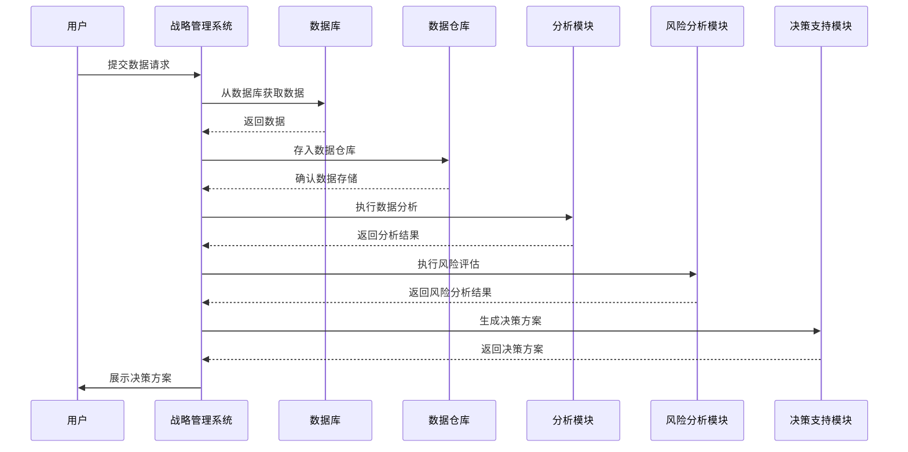
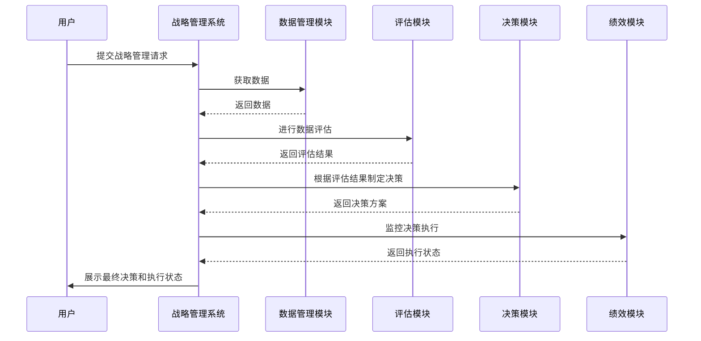

                 

### 引言

在现代商业环境中，企业面临的竞争日益激烈，市场变化速度不断加快，战略管理的重要性愈加凸显。战略管理不仅仅是企业高层管理者的事，它贯穿于企业的每一个层面和环节。有效的战略管理能够帮助企业抓住机遇、应对挑战，实现可持续的发展。

然而，战略管理并非一项简单的任务。企业需要从复杂的市场数据中提取有价值的信息，进行科学的分析和决策。这时，数学分析方法成为了一种强有力的工具。数学分析不仅能够提高战略决策的精度，还能够为企业提供一种系统化和结构化的思考方式。

本书旨在探讨数学分析方法在企业战略管理中的应用。我们将从核心概念入手，逐步深入到具体的数学模型和公式，帮助读者理解如何将数学工具应用于企业战略的制定和执行中。通过阅读本书，读者不仅能够掌握数学与战略管理结合的理论知识，还能够学会如何在实际工作中运用这些知识，提升企业的战略竞争力。

### 数学分析方法在企业战略中的作用

数学分析方法在企业战略管理中扮演着至关重要的角色。它为企业提供了一个精确、客观和系统化的分析工具，帮助企业在复杂多变的市场环境中做出明智的决策。以下是一些关键方面，说明数学分析方法如何支持企业战略管理：

1. **数据分析与优化**：数学模型能够处理大量数据，从中提取出有价值的信息。例如，通过回归分析可以预测市场需求，通过线性规划可以优化生产资源分配。这些数据分析结果为企业制定战略提供了坚实的数据支持。

2. **风险评估与预测**：企业在制定战略时，必须考虑各种潜在的风险。数学分析方法，如概率模型和蒙特卡洛模拟，可以帮助企业评估风险的概率和影响，制定相应的风险管理策略。

3. **成本效益分析**：成本效益分析是战略决策中的重要环节。通过数学模型，企业可以评估不同战略方案的成本和收益，选择最优的方案。例如，通过成本效益分析，企业可以决定是否进行产品创新、市场扩展或技术升级。

4. **供应链优化**：供应链管理是企业战略中不可忽视的一部分。数学模型，如网络流模型和库存模型，可以帮助企业优化供应链流程，降低成本，提高效率。

5. **竞争分析**：通过数学分析方法，企业可以更深入地了解竞争对手的策略和市场行为。这有助于企业制定有效的市场进入策略、定价策略和产品差异化策略。

6. **资源分配**：企业在资源有限的情况下，如何进行资源分配是一个重要问题。数学模型，如线性规划、整数规划等，可以帮助企业在满足资源约束的前提下，实现资源利用的最大化。

通过上述应用，数学分析方法不仅为企业提供了决策支持，还提高了战略决策的科学性和可操作性。它使企业能够更好地应对市场变化，抓住机遇，实现长期可持续发展。

### 数学与战略管理结合的必要性

数学与战略管理的结合不仅是技术进步的产物，更是现代商业环境下的必然需求。在全球化和信息技术迅猛发展的背景下，企业面临着前所未有的挑战和机遇。以下几方面进一步阐述了数学与战略管理结合的必要性：

1. **复杂性的应对**：现代企业的运营环境日益复杂，市场竞争激烈，信息流动迅速。传统的主观判断和经验管理已经难以应对这种复杂性。数学分析方法提供了一种系统化、结构化的思维方式，能够帮助企业从海量数据中提取有用信息，从而更加科学地制定战略。

2. **数据驱动的决策**：在当今的数据驱动时代，数据是企业决策的重要依据。数学分析能够处理和分析大量数据，为企业提供准确的市场预测、需求分析和风险评估。这种基于数据的决策方式，比单纯依靠经验和直觉更加可靠和有效。

3. **不确定性的管理**：企业面临的很多战略决策都存在不确定性。数学模型，如概率模型和决策树，可以帮助企业在不确定的环境中制定合理的策略，降低风险。这种风险管理的科学方法，比单纯的直觉和猜测要更加可靠。

4. **全球竞争的应对**：全球化带来了更广阔的市场，但同时也增加了竞争的激烈程度。数学分析方法可以帮助企业更准确地了解市场动态，制定有效的市场进入策略和竞争策略，从而在全球市场中占据有利位置。

5. **创新驱动的战略**：创新是企业持续发展的关键。数学分析方法在产品研发、技术革新和商业模式创新中有着广泛应用。通过数学模型，企业可以更好地评估创新项目的可行性，优化创新过程，提高创新成功率。

6. **资源高效利用**：在资源有限的情况下，如何进行高效利用是企业战略的核心问题。数学模型，如线性规划、网络流模型等，可以帮助企业优化资源配置，实现成本效益最大化。

综上所述，数学与战略管理的结合不仅提高了企业的决策精度和效率，还为企业提供了应对复杂性和不确定性、实现创新和资源高效利用的科学方法。这是现代企业成功的重要保障。

### 战略管理的基本概念

战略管理是企业为了实现其长远目标而进行的规划和实施过程。它不仅包括制定战略，还涉及战略的执行、评估和调整。以下是战略管理的基本概念及其在企业运营中的重要性：

#### 1. 企业战略的定义

企业战略是指企业为实现其长期目标而制定的一系列决策和行动方案。这些决策和方案涵盖了企业的市场定位、资源分配、竞争优势和未来发展方向等多个方面。企业战略不仅是一种指导性的规划，更是企业在复杂多变的环境中应对挑战、抓住机遇的重要工具。

#### 2. 企业战略的构成要素

企业战略通常由以下三个主要要素构成：

1. **目标（Objectives）**：目标是企业战略的起点，是企业希望在未来达到的具体状态或成果。这些目标可以是财务指标（如利润、市场份额等）、业务指标（如产品创新、客户满意度等）或社会责任指标（如环境保护、员工福利等）。

2. **策略（Strategies）**：策略是实现目标的手段和方法。它包括具体的行动计划、资源分配和竞争策略。例如，企业可以通过市场扩张、产品创新或成本领先策略来实现其财务目标。

3. **行动计划（Action Plans）**：行动计划是具体的执行步骤，确保策略能够有效实施。它包括时间表、责任分配、资源需求和关键绩效指标（KPI）等。

#### 3. 战略管理过程

战略管理是一个动态的过程，通常包括以下步骤：

1. **环境分析（Environmental Analysis）**：环境分析旨在了解企业外部环境和内部资源的现状。外部环境分析包括市场趋势、竞争态势、法律法规和政策变化等；内部资源分析则涉及企业的人力、财务、技术和管理资源。

2. **战略选择（Strategy Formulation）**：战略选择是制定具体的战略方案。这一步骤需要企业根据环境分析和自身资源优势，选择最佳的战略方向和策略。

3. **战略实施（Strategy Implementation）**：战略实施是将战略转化为具体行动的过程。这一步骤包括组织结构设计、人员配备、资源分配和流程优化等。

4. **战略评估（Strategy Evaluation）**：战略评估是监测和评估战略执行的效果。通过关键绩效指标（KPI）和绩效评估，企业可以判断战略目标是否实现，并做出相应的调整。

#### 4. 战略管理的重要性

战略管理对企业运营具有深远的影响：

1. **明确目标**：战略管理帮助企业明确其长期目标，使其在复杂多变的市场环境中保持清晰的方向。

2. **资源优化**：战略管理通过合理的资源分配，提高企业的运营效率，实现资源的最优利用。

3. **竞争优势**：战略管理帮助企业在市场中找到独特的竞争优势，从而在竞争中脱颖而出。

4. **风险控制**：战略管理通过风险评估和应对策略，降低企业在不确定环境中的风险。

5. **创新驱动**：战略管理鼓励企业持续创新，推动技术进步和业务模式创新，保持企业的竞争力。

总之，战略管理是企业实现长期成功的关键，它不仅为企业提供了明确的发展方向，还通过科学的决策过程，确保企业能够适应外部环境的变化，实现可持续发展。

### 数学模型在企业战略中的作用

数学模型在企业战略管理中扮演着至关重要的角色。它们不仅为企业提供了精确的数据分析工具，还帮助企业在复杂的市场环境中做出科学的决策。以下将详细探讨几种常见的数学模型及其在战略管理中的应用。

#### 1. SWOT分析

SWOT分析（Strengths, Weaknesses, Opportunities, Threats）是一种常用的战略规划工具，用于评估企业的内部优势与劣势以及外部机会与威胁。数学模型在SWOT分析中的应用主要体现在以下几个方面：

- **定量评估**：通过量化的指标，如财务数据和市场占有率，对企业的优势与劣势进行评估。例如，使用标准分值或评分系统，将企业的每个优势或劣势进行量化。

- **概率模型**：使用概率模型，如贝叶斯网络，评估外部机会和威胁发生的概率。这有助于企业更准确地预测市场变化，制定相应的战略。

- **影响力分析**：通过矩阵方法，将内部优势与外部机会、内部劣势与外部威胁进行匹配，分析其对企业战略决策的影响力。

例如，某企业通过SWOT分析发现其技术优势（S）和市场扩展机会（O），可能会制定技术驱动市场扩展战略。这种数学模型的应用，使得企业的战略更加科学和有针对性。

#### 2. 波士顿矩阵

波士顿矩阵（Boston Matrix）是一种用于产品组合分析和市场战略制定的工具。它将企业的产品分为四个象限：明星产品、问题产品、现金牛产品和瘦狗产品。数学模型在波士顿矩阵中的应用主要体现在以下几个方面：

- **市场增长率与市场份额分析**：通过计算市场增长率和市场份额，确定每个产品的象限归属。市场增长率可以使用复合增长率模型（CAGR）计算，市场份额可以使用比例分析方法确定。

- **产品生命周期模型**：使用产品生命周期模型（如Gompertz模型）预测不同产品的市场增长趋势。这有助于企业根据产品生命周期制定相应的策略，如对明星产品进行扩展投资，对问题产品进行改进或淘汰。

- **效益分析**：通过效益分析，如ROI（投资回报率）和NPV（净现值），评估不同产品的经济效益。这有助于企业根据财务指标进行产品组合优化。

例如，某企业发现其明星产品市场份额高且市场增长率快，可能会制定扩展投资战略，以保持其在市场中的领先地位。这种数学模型的应用，使得企业的产品组合管理更加科学和高效。

#### 3. 价值链分析

价值链分析（Value Chain Analysis）是另一种重要的战略工具，用于分析企业内部活动及其对客户价值的贡献。数学模型在价值链分析中的应用主要体现在以下几个方面：

- **成本-效益分析**：通过成本-效益分析，评估企业各个价值链活动的经济效益。例如，使用成本函数模型，分析每个环节的成本结构和效益。

- **供应链优化**：通过数学优化模型，如线性规划或网络流模型，优化企业的供应链流程。这有助于降低成本，提高效率。

- **风险评估**：使用概率模型，如蒙特卡洛模拟，评估供应链中潜在的风险。这有助于企业制定风险管理策略，降低运营风险。

例如，某企业通过价值链分析发现其生产成本高且供应链效率低，可能会制定优化供应链流程的战略。这种数学模型的应用，使得企业的运营效率得到显著提升。

#### 4. 数据分析

数据分析在企业战略管理中具有重要作用。数学模型在数据分析中的应用主要体现在以下几个方面：

- **回归分析**：通过回归分析，预测市场需求和客户行为。这有助于企业制定市场进入策略和产品定价策略。

- **聚类分析**：通过聚类分析，识别市场中的不同客户群体，制定有针对性的市场策略。

- **时间序列分析**：通过时间序列分析，预测未来的市场趋势和变化。这有助于企业制定长期战略规划。

例如，某企业通过回归分析发现其产品需求与广告投放量呈正相关关系，可能会增加广告投放预算，以扩大市场占有率。这种数学模型的应用，使得企业的市场策略更加精准和有效。

综上所述，数学模型在企业战略管理中具有广泛的应用。通过这些数学模型，企业能够更准确地分析市场环境，评估风险和机会，制定科学的战略决策。这不仅提高了企业的竞争力，还为其长期可持续发展提供了有力支持。

### 数学分析方法的优势

数学分析方法在企业战略管理中具有显著的优点，这些优点不仅提升了企业的决策效率和准确性，还增强了其在复杂市场环境中的适应能力。以下是数学分析方法的主要优势：

#### 1. 提高决策的精度

数学分析方法通过定量化的模型和公式，能够处理大量数据并提取出有价值的信息。这种量化方法使得企业的战略决策更加客观和科学，避免了单纯依赖主观判断和经验的盲目性。例如，通过回归分析和时间序列分析，企业可以更准确地预测市场需求和客户行为，从而制定出更加精准的市场策略。

#### 2. 系统化与结构化

数学分析方法提供了一种系统化和结构化的思维方式，使得企业能够在复杂的环境中保持清晰的思路。通过数学模型，企业可以将战略管理中的各种因素和变量进行量化，从而建立一套完整的分析框架。这种结构化的方法不仅提高了战略决策的效率，还使得决策过程更加透明和可追溯。

#### 3. 风险评估与管理

数学分析方法在风险评估和管理中具有重要作用。通过概率模型和蒙特卡洛模拟等工具，企业可以评估各种潜在风险的概率和影响，从而制定有效的风险管理策略。这种科学的风险评估方法，有助于企业提前识别和应对市场变化，降低运营风险。

#### 4. 资源优化

在资源有限的情况下，如何进行资源优化是企业战略管理中的关键问题。数学模型，如线性规划、整数规划等，可以帮助企业找到资源分配的最优方案，实现成本效益最大化。例如，通过线性规划，企业可以在满足资源约束的前提下，优化生产计划和库存管理，从而降低成本、提高效率。

#### 5. 竞争优势

数学分析方法可以帮助企业更好地了解竞争对手的策略和市场行为，从而制定有效的竞争策略。通过数据分析和市场模拟，企业可以更准确地预测市场趋势，识别潜在的竞争对手和市场机会，抢占市场先机。例如，通过聚类分析和竞争分析，企业可以发现市场中的不同客户群体和竞争对手，制定有针对性的市场进入策略。

综上所述，数学分析方法在企业战略管理中具有显著的优点。它不仅提高了决策的精度和科学性，还增强了企业在复杂市场环境中的适应能力。通过数学模型，企业可以更有效地应对市场变化，抓住机遇，实现长期可持续发展。

### 数学分析方法的局限性

尽管数学分析方法在企业战略管理中具有众多优势，但它也存在一些局限性。理解这些局限性有助于企业在实际应用中避免过度依赖数学模型，从而更好地结合定性分析与定量分析，制定出更加全面和有效的战略。

#### 1. 数据依赖性

数学分析方法高度依赖数据的质量和完整性。如果数据存在误差或缺失，可能会导致分析结果的偏差。例如，在市场预测中，如果数据样本不充分或者时间序列数据有断点，那么预测结果可能会偏离实际。此外，数据的不一致性也可能影响模型的准确性。因此，在应用数学分析方法时，企业需要对数据进行严格的清洗和验证。

#### 2. 模型假设

数学模型往往基于一定的假设条件，这些假设在某些情况下可能并不成立。例如，线性回归模型假设自变量与因变量之间存在线性关系，但实际中很多变量之间可能存在非线性关系。如果模型假设与现实不符，可能会导致分析结果的失真。企业需要根据实际情况调整模型假设，或选择更合适的模型来避免这种问题。

#### 3. 复杂性

数学模型，尤其是高级模型，往往具有很高的复杂度。理解和使用这些模型需要深厚的数学和统计知识。如果企业缺乏相关技能或经验，可能无法正确应用这些模型，甚至产生误导性的结论。此外，模型的复杂度也可能导致计算时间和资源的需求增加，使得模型在实际应用中难以实施。

#### 4. 适应性

数学模型通常是特定问题的解决方案，但它们可能不适用于所有情况。企业所处的市场环境和竞争态势不断变化，数学模型可能无法快速适应这些变化。例如，在快速变化的行业中，市场动态和客户需求可能迅速变化，而传统模型可能无法及时捕捉这些变化，导致战略决策滞后。企业需要定期更新和调整模型，以确保其适应性。

#### 5. 定性分析的缺失

尽管数学分析方法能够提供精确的数据分析结果，但它无法完全替代定性分析。定性分析，如专家访谈、市场调研和用户反馈等，能够提供关于市场趋势、客户需求和竞争对手策略的深刻见解。这些定性信息对于制定全面的战略至关重要。企业需要在定量分析与定性分析之间取得平衡，确保战略决策的全面性和准确性。

#### 6. 成本和资源

应用数学分析方法通常需要投入大量的人力和物力资源。从数据收集、模型建立到结果分析和决策制定，每个环节都可能需要专业人员的参与。对于一些中小企业，这种投入可能过于昂贵，导致无法广泛应用数学分析方法。因此，企业在决策过程中需要权衡成本与效益，确保资源的合理利用。

#### 7. 道德和法律问题

在某些情况下，数学分析方法可能涉及到道德和法律问题。例如，在客户数据分析和市场预测中，企业需要确保数据的隐私和合规性。如果处理不当，可能导致数据泄露、隐私侵犯或法律纠纷。企业需要在应用数学分析方法时，严格遵守相关法律法规和道德标准，确保数据安全和合规。

综上所述，数学分析方法在企业战略管理中具有重要作用，但也存在一些局限性。企业需要认识到这些局限性，并采取适当的措施来克服。通过结合定量分析与定性分析，科学选择和应用数学模型，企业可以更有效地制定和执行战略，实现长期可持续发展。

### 系统分析与架构设计

在深入探讨数学模型在企业战略中的应用后，我们将进一步分析战略管理系统的设计，并展示其架构图。这一部分内容将帮助读者理解战略管理系统的整体设计和关键组成部分。

#### 1. 问题场景介绍

假设我们正在为一个大型制造企业设计一个战略管理系统。该企业的目标是通过优化生产流程、降低成本和提升产品质量，实现可持续发展。为了达到这个目标，企业需要实时监控市场动态、分析竞争对手策略、评估内部运营效率，并制定相应的战略决策。

#### 2. 系统功能设计

战略管理系统的主要功能包括：

- **数据收集与处理**：收集来自市场、生产和销售环节的数据，并进行预处理和清洗，确保数据的质量和完整性。
- **数据分析与预测**：应用数学模型进行数据分析，如回归分析、时间序列分析和聚类分析，预测市场趋势和客户需求。
- **风险评估与优化**：使用概率模型和优化算法，评估不同战略方案的风险和成本效益，制定最优决策。
- **战略决策制定**：基于分析结果和风险评估，制定具体的生产计划、市场策略和资源分配方案。
- **执行与监控**：跟踪战略执行情况，评估关键绩效指标（KPI），确保战略目标得到实现。

#### 3. 系统架构设计

战略管理系统的架构设计采用三层架构，包括数据层、逻辑层和表现层。

1. **数据层**：数据层是系统的基础，负责数据的存储和管理。主要包括数据库和数据仓库，用于存储市场数据、生产数据和销售数据等。

2. **逻辑层**：逻辑层是系统的核心，负责数据分析和决策制定。主要包括以下模块：

   - **数据分析模块**：执行各种数据分析任务，如回归分析、时间序列分析和聚类分析。
   - **风险分析模块**：使用概率模型和优化算法，进行风险评估和优化。
   - **决策支持模块**：基于分析结果和风险评估，生成具体的战略决策。

3. **表现层**：表现层是系统的用户界面，负责将分析结果和战略决策展示给用户。主要包括：

   - **报表模块**：生成各种报表和可视化图表，展示分析结果和决策方案。
   - **用户交互模块**：提供用户与系统进行交互的界面，如查询和分析工具、审批流程等。

#### 4. 系统接口设计

系统接口设计包括内部接口和外部接口。

1. **内部接口**：内部接口负责不同模块之间的数据传输和功能调用。例如，数据分析模块需要从数据层获取数据，并将处理结果传递给决策支持模块。

2. **外部接口**：外部接口负责系统与外部系统的交互，如与企业ERP系统、客户关系管理（CRM）系统和市场分析系统等的数据交换。

#### 5. 系统交互设计

系统交互设计通过UML序列图来展示。以下是一个简化的序列图示例：



在这个序列图中，用户提交数据请求，系统从数据库获取数据，并存储到数据仓库中。随后，系统执行数据分析、风险评估和决策支持，并将结果展示给用户。

通过以上系统分析与架构设计，企业能够构建一个高效、灵活的战略管理系统，从而更好地应对市场变化，实现可持续发展。

### 数学模型和数学公式讲解

在深入探讨战略管理系统的架构设计后，接下来我们将详细讲解几个关键数学模型及其在实际战略中的应用。这些模型包括SWOT分析矩阵、波士顿矩阵和供应链优化模型。通过这些数学模型和公式的讲解，读者将更好地理解如何将数学工具应用于企业战略管理。

#### 4.1 SWOT分析中的数学模型

SWOT分析是一种常用的战略规划工具，用于评估企业的内部优势与劣势以及外部机会与威胁。数学模型在SWOT分析中的应用主要体现在以下几个方面：

1. **SWOT分析矩阵**

   SWOT分析矩阵是一个4x4的矩阵，用于将企业的优势（Strengths）、劣势（Weaknesses）、机会（Opportunities）和威胁（Threats）进行分类和匹配。以下是一个简化的SWOT分析矩阵示例：

   |        | 优势（Strengths） | 劣势（Weaknesses） | 机会（Opportunities） | 威胁（Threats） |
   |--------|------------------|------------------|----------------------|----------------|
   | 内部   | 管理团队经验丰富 | 市场份额低       | 新市场机遇           | 市场竞争加剧   |
   | 外部   | 新产品研发成功   | 竞争对手强大     | 政策支持             | 经济不稳定     |

   在这个矩阵中，可以使用量化指标对每个要素进行评分，例如，每个要素可以评分为1到5分，其中5分为最高分。通过计算总分，可以得出每个要素的重要性和优先级。

   - **优势与机会匹配**：总分为10分，表示优势与机会的匹配程度较高，企业可以集中资源开发新产品，抢占新市场。
   - **劣势与威胁匹配**：总分为5分，表示劣势与威胁的匹配程度较低，企业需要采取措施改善内部劣势，以应对外部威胁。

2. **数据处理与量化**

   SWOT分析中的数据处理与量化可以通过以下步骤进行：

   - **数据收集**：收集与SWOT分析相关的各种数据，如财务数据、市场数据、客户反馈等。
   - **数据评分**：根据评分标准，对每个要素进行评分。
   - **计算总分**：计算每个要素的总分，并根据总分进行排序和优先级分配。

   例如，假设企业的市场份额低（2分），新产品研发成功（5分），市场竞争加剧（3分），政策支持（4分）。通过计算，优势与机会的总分为9分，劣势与威胁的总分为5分，表明企业需要更多关注内部优势的开发，同时积极应对外部市场竞争。

#### 4.2 波士顿矩阵中的数学模型

波士顿矩阵是一种用于产品组合分析和市场战略制定的工具。它将企业的产品分为四个象限：明星产品、问题产品、现金牛产品和瘦狗产品。数学模型在波士顿矩阵中的应用主要体现在市场增长率和市场份额的计算和分析。

1. **市场增长率与市场份额分析**

   市场增长率可以使用复合增长率模型（CAGR）计算，公式如下：

   $$ CAGR = \left( \frac{最终值}{初始值} \right)^{\frac{1}{年数}} - 1 $$

   市场份额可以使用以下公式计算：

   $$ 市场份额 = \frac{产品销售额}{市场总销售额} \times 100\% $$

   例如，假设某产品的初始销售额为100万元，年增长率为20%，三年后的销售额为172.8万元。则其CAGR为：

   $$ CAGR = \left( \frac{172.8}{100} \right)^{\frac{1}{3}} - 1 = 0.2 $$

   如果市场总销售额为1000万元，某产品的销售额为200万元，则其市场份额为：

   $$ 市场份额 = \frac{200}{1000} \times 100\% = 20\% $$

2. **产品生命周期模型**

   波士顿矩阵中的产品生命周期模型可以帮助企业预测不同产品的市场增长趋势。常用的产品生命周期模型包括Gompertz模型和Logistic模型。

   - **Gompertz模型**：

     $$ dN/dt = rN\left(1 - \frac{N}{K}\right)e^{-\lambda t} $$

     其中，\(N(t)\) 是时间 \(t\) 的产品数量，\(K\) 是市场容量，\(r\) 和 \(\lambda\) 是参数。

     通过对上述方程进行求解，可以得到 \(N(t)\) 的表达式，从而预测产品的市场增长趋势。

   - **Logistic模型**：

     $$ dN/dt = rN\left(1 - \frac{N}{K}\right) $$

     与Gompertz模型类似，通过求解微分方程可以得到产品的市场增长趋势。

   例如，假设某产品的初始销售额为100万元，市场容量为500万元，年增长率为10%。使用Gompertz模型，可以预测三年后的销售额为：

   $$ N(3) = \frac{K}{1 + e^{-\lambda t}} = \frac{500}{1 + e^{-0.2 \times 3}} \approx 276.2 \text{万元} $$

   通过这些数学模型和公式，企业可以更好地理解产品的市场表现和生命周期，从而制定相应的市场策略。

#### 4.3 价值链分析中的数学模型

价值链分析是一种用于分析企业内部活动及其对客户价值的贡献的工具。数学模型在价值链分析中的应用主要体现在成本-效益分析和供应链优化。

1. **成本-效益分析**

   成本-效益分析是一种评估不同战略方案的成本和收益的方法。其基本公式如下：

   $$ 效益 = 成本 \times 效率 $$

   其中，效益是企业通过实施某个战略方案所获得的收益，成本是实施该方案所需的资源投入，效率是资源利用的效率。

   例如，假设某企业计划进行生产线升级，预计成本为500万元，预期年收益为100万元，年效率为20%。则其成本-效益比为：

   $$ 效益/成本 = \frac{100}{500} \times 20\% = 4 $$

   如果成本-效益比大于1，表示方案是可行的；否则，方案可能需要重新评估或调整。

2. **供应链优化**

   供应链优化是一种通过数学模型优化供应链流程，降低成本、提高效率的方法。常见的优化模型包括线性规划、网络流模型和整数规划。

   - **线性规划**：

     线性规划是一种用于解决资源优化问题的数学模型，其基本公式如下：

     $$ \minimize \, c^T x $$
     $$ subject \, to \, Ax \leq b $$

     其中，\(x\) 是决策变量，\(c\) 是系数向量，\(A\) 和 \(b\) 是约束条件。

     通过求解线性规划模型，企业可以找到最优的资源分配方案，从而降低成本、提高效率。

   - **网络流模型**：

     网络流模型用于优化供应链中的物流和运输流程。其基本公式如下：

     $$ \minimize \, \sum_{i,j} c_{i,j} x_{i,j} $$
     $$ subject \, to \, \sum_{j} x_{i,j} = b_i $$
     $$ x_{i,j} \geq 0 \, (i,j \in V) $$

     其中，\(x_{i,j}\) 表示从节点 \(i\) 到节点 \(j\) 的流量，\(c_{i,j}\) 是从节点 \(i\) 到节点 \(j\) 的运输成本，\(b_i\) 是节点 \(i\) 的供应量或需求量。

     通过求解网络流模型，企业可以优化物流和运输流程，降低成本、提高效率。

   - **整数规划**：

     整数规划用于解决资源分配问题，其基本公式如下：

     $$ \minimize \, c^T x $$
     $$ subject \, to \, Ax \leq b $$
     $$ x \in \{0, 1\}^n $$

     其中，\(x\) 是决策变量，\(c\) 是系数向量，\(A\) 和 \(b\) 是约束条件。整数规划要求决策变量 \(x\) 必须是整数，这确保了资源分配的可行性和优化性。

   例如，假设某企业需要从三个供应商处采购原材料，每个供应商的供应量和运输成本不同。通过整数规划模型，企业可以找到最优的供应商组合，从而降低采购成本、提高供应链效率。

通过上述数学模型和公式，企业可以更好地理解产品的市场表现和生命周期，从而制定相应的市场策略。同时，这些模型和公式也可以帮助企业在战略管理中实现资源优化、降低成本、提高效率，从而实现可持续发展。

### 战略管理系统设计

在了解了数学模型和公式的应用后，接下来我们将进一步探讨战略管理系统的设计，包括系统功能设计、系统架构设计和系统接口设计。通过详细阐述这些设计内容，读者可以更清晰地理解战略管理系统的运作原理和实现方法。

#### 5.1 战略管理系统功能设计

战略管理系统的功能设计是确保系统能够满足企业战略管理需求的关键步骤。以下是战略管理系统的主要功能模块及其详细描述：

1. **数据收集与处理模块**：该模块负责收集来自企业内部和外部环境的数据，包括财务数据、市场数据、销售数据、客户反馈等。数据收集后，系统会对数据进行清洗、格式化和预处理，以确保数据的质量和一致性。

2. **数据分析与预测模块**：该模块使用数学模型对处理后的数据进行分析和预测。例如，通过回归分析预测市场需求，通过时间序列分析预测销售趋势，通过聚类分析识别客户群体等。数据分析结果将为企业的战略决策提供科学依据。

3. **风险评估与优化模块**：该模块通过数学模型进行风险评估和优化，包括概率模型、优化算法等。例如，通过概率模型评估市场风险，通过优化算法确定资源分配的最优方案。该模块的目标是帮助企业降低风险，提高资源利用效率。

4. **决策支持模块**：该模块根据分析结果和风险评估，提供具体的战略决策支持。例如，生成市场进入策略、产品定价策略、资源配置方案等。决策支持模块将通过可视化和报表工具，将分析结果和决策方案直观地展示给用户。

5. **执行与监控模块**：该模块负责跟踪战略执行情况，监控关键绩效指标（KPI），确保战略目标得到实现。执行与监控模块将记录执行过程中的各项数据，并对执行效果进行分析和评估。

6. **用户交互模块**：该模块提供用户与系统的交互界面，包括报表查询、数据导入导出、用户权限管理等功能。用户交互模块的目标是提高用户使用体验，确保系统能够方便、高效地支持企业战略管理。

#### 5.2 系统架构设计

战略管理系统的架构设计采用三层架构，包括数据层、逻辑层和表现层。以下是每个层次的详细描述：

1. **数据层**：数据层是系统的底层，负责数据的存储和管理。数据层主要包括数据库和数据仓库。数据库用于存储实时数据，如销售数据、财务数据等；数据仓库用于存储历史数据和经过处理的数据，如分析结果和预测数据等。数据层通过数据库管理系统（DBMS）进行管理和维护。

2. **逻辑层**：逻辑层是系统的核心，负责数据分析和决策制定。逻辑层包括多个模块，如数据分析模块、风险评估模块、决策支持模块等。逻辑层使用各种数学模型和算法进行数据处理和分析，并将结果传递给表现层。逻辑层通过应用服务器进行管理和运行。

3. **表现层**：表现层是系统的用户界面，负责将分析结果和决策方案展示给用户。表现层包括报表模块、用户交互模块、可视化模块等。表现层通过Web服务器和前端技术（如HTML、CSS、JavaScript等）实现，用户可以通过浏览器访问系统并进行操作。

#### 5.3 系统接口设计

系统接口设计是确保战略管理系统与其他系统进行数据交换和功能调用的重要环节。以下是战略管理系统的主要接口设计：

1. **内部接口**：内部接口负责不同模块之间的数据传输和功能调用。例如，数据分析模块需要从数据层获取数据，并将分析结果传递给决策支持模块。内部接口通常通过API（应用程序接口）实现，API提供了一套标准化的接口定义，方便模块之间的交互。

2. **外部接口**：外部接口负责系统与外部系统的交互，如与企业ERP系统、客户关系管理（CRM）系统、市场分析系统等的数据交换。外部接口通常通过Web服务（如SOAP、REST等）实现，确保系统能够与其他系统集成和协同工作。

3. **数据接口**：数据接口负责系统的数据输入和输出，包括数据导入和数据导出。数据接口通常通过文件传输（如CSV、Excel等）或数据库连接（如JDBC、ODBC等）实现，方便用户和管理员进行数据管理和维护。

通过以上战略管理系统的功能设计、架构设计和接口设计，企业可以构建一个高效、灵活的战略管理系统。该系统能够处理大量数据，应用数学模型进行分析和预测，为企业的战略决策提供有力支持，从而实现可持续发展。

### 系统交互设计

在战略管理系统设计中，系统交互设计是确保各模块之间顺畅协作的关键环节。通过UML序列图，我们可以清晰地展示系统各组件的交互过程，从而帮助读者理解系统的工作流程和逻辑关系。

以下是一个简化的UML序列图示例，描述了战略管理系统的核心交互过程：



在这个序列图中，用户提交战略管理请求，系统首先从数据管理模块获取所需数据。随后，数据管理模块将数据传递给评估模块，评估模块对数据进行分析，并返回评估结果。接着，系统根据评估结果，通过决策模块生成具体的决策方案，并将方案传递给绩效模块进行监控。最终，系统将决策方案和执行状态展示给用户，以便用户了解战略管理的结果和进展。

通过这样的交互设计，战略管理系统能够高效、有序地处理各种战略管理任务，确保企业的战略决策科学、有效，并能够实时调整和优化，以适应不断变化的市场环境。

### 实战项目介绍

在本章中，我们将通过一个具体的实战项目，详细展示如何将数学分析方法应用于企业战略管理。该项目旨在通过优化企业的供应链管理，提高运营效率，降低成本。

#### 6.1.1 项目背景

某大型电子产品制造商面临着激烈的市场竞争和成本压力。公司生产的智能手机和电脑产品种类繁多，供应链复杂。为了提高市场竞争力，公司决定通过数学分析方法优化其供应链管理，从而实现成本降低和运营效率提升。

#### 6.1.2 项目目标

该项目的目标包括：

- **降低库存成本**：通过优化库存管理，减少不必要的库存积压，降低库存持有成本。
- **提高生产效率**：通过优化生产计划和资源分配，提高生产效率，缩短生产周期。
- **降低运输成本**：通过优化运输路线和运输模式，降低运输成本。
- **提升供应链协同性**：通过信息共享和流程优化，提升供应链各环节的协同性，提高整体运营效率。

### 6.2 环境安装与配置

为了成功实施数学分析方法，首先需要搭建一个合适的环境。以下是环境安装与配置的步骤：

1. **硬件环境**：

   - 服务器：配置高性能服务器，确保系统运行稳定。
   - 存储：配置大容量存储设备，用于存储数据和日志。

2. **软件环境**：

   - 操作系统：选择稳定且性能优越的操作系统，如Linux或Windows Server。
   - 数据库：安装关系型数据库管理系统（如MySQL、Oracle），用于存储和管理数据。
   - 分析工具：安装数据分析工具（如Python、R语言），用于进行数学建模和分析。
   - Web服务器：安装Web服务器（如Apache、Nginx），用于部署和管理前端界面。

3. **网络环境**：

   - 确保各组件之间的网络连接稳定，并配置相应的防火墙和安全策略，保障系统安全。

4. **安装与配置**：

   - 按照操作系统和软件的安装指南进行安装。
   - 配置数据库连接和用户权限，确保数据的安全性和完整性。
   - 编写和配置脚本，自动化安装和部署流程，提高安装效率。

### 6.3 系统核心实现

在完成环境安装与配置后，接下来将详细介绍系统核心实现，包括数据采集、数据处理和分析、决策制定与执行。

#### 6.3.1 数据采集

数据采集是供应链优化的基础。以下是数据采集的关键步骤：

1. **内部数据采集**：

   - 生产数据：采集生产计划、生产进度、设备运行状态等数据。
   - 库存数据：采集库存水平、库存周转率、库存成本等数据。
   - 采购数据：采集采购订单、供应商信息、采购成本等数据。

2. **外部数据采集**：

   - 市场数据：采集市场需求、竞争对手策略、市场价格等数据。
   - 物流数据：采集运输路线、运输时间、运输成本等数据。

3. **数据来源**：

   - 传感器：通过生产设备和传感器实时采集数据。
   - 数据接口：通过API接口从ERP系统、CRM系统等外部系统获取数据。
   - 人工采集：通过手工记录和报表进行数据采集。

#### 6.3.2 数据处理和分析

数据处理和分析是供应链优化的关键环节。以下是数据处理和分析的步骤：

1. **数据清洗**：

   - 去除重复数据、异常值和缺失值，确保数据质量。
   - 标准化数据格式，如统一时间单位、货币单位等。

2. **数据预处理**：

   - 数据归一化：将不同量纲的数据进行归一化处理，使其在同一量级上进行分析。
   - 数据聚合：将详细数据汇总为统计指标，如总成本、总产量等。

3. **数据分析**：

   - 采用回归分析、时间序列分析、聚类分析等数学模型，对数据进行分析。
   - 分析市场需求变化趋势，预测未来需求量。
   - 分析生产效率和成本结构，找出优化机会。

#### 6.3.3 决策制定与执行

在数据分析完成后，接下来进行决策制定与执行：

1. **决策制定**：

   - 根据分析结果，制定库存优化策略、生产计划优化策略和运输优化策略。
   - 采用线性规划、整数规划等优化算法，确定最优的库存水平和生产计划。
   - 制定运输路线和运输模式，确保物流成本最低。

2. **执行与监控**：

   - 通过系统集成和自动化流程，实现决策的执行。
   - 监控关键绩效指标（KPI），如库存周转率、生产效率、运输成本等，确保决策的有效执行。

### 6.4 代码应用解读

以下将展示一个具体的Python代码示例，用于供应链优化中的库存管理。该代码使用了线性规划模型来确定最优的库存水平和采购计划。

```python
import pulp

# 创建线性规划模型
model = pulp.LpProblem("InventoryOptimization", pulp.LpMinimize)

# 定义变量
 InventoryLevel = pulp.LpVariable.dicts("InventoryLevel", range(1, 13), cat="Continuous")

# 设置目标函数
model += pulp.lpSum([InventoryLevel[i] * inventory_cost for i in range(1, 13)])

# 添加约束条件
for i in range(1, 13):
    model += pulp.lpSum([InventoryLevel[j] for j in range(1, i+1)]) >= demand[i] * safety_stock_factor

for i in range(1, 13):
    model += pulp.lpSum([InventoryLevel[j] for j in range(i, 13)]) <= supply_capacity * (1 - order_lead_time)

# 解线性规划模型
model.solve()

# 输出结果
for v in model.variables():
    print(v.name, "=", v.varValue)

print("Total Inventory Cost = ", pulp.value(model.objective))
```

在这个示例中，我们定义了一个线性规划模型，其中变量`InventoryLevel`表示第`i`月的库存水平。目标函数是总库存成本的最小化。约束条件包括库存水平的上下限以及库存水平与需求和生产能力的关系。通过求解线性规划模型，我们可以得到最优的库存水平和总成本。

通过这个代码示例，读者可以了解如何将线性规划应用于库存管理，实现库存优化。这种数学模型的应用不仅能够提高库存管理的效率，还能够降低成本，提高企业的竞争力。

### 实际案例分析

为了更好地理解数学分析方法在企业战略管理中的实际应用，我们将通过一个实际案例进行详细剖析。该案例来自一家全球知名的电子产品制造商，该公司通过数学模型优化其供应链管理，实现了显著的成本降低和效率提升。

#### 6.4.1 案例背景

该公司是一家生产智能手机和电脑的制造商，其供应链复杂，涉及多个供应商、生产工厂和分销中心。为了提高市场竞争力，公司决定通过数学分析方法优化其供应链管理，降低库存成本、提高生产效率和物流效率。

#### 6.4.2 项目目标

该项目的目标包括：

- **降低库存成本**：通过优化库存管理，减少不必要的库存积压，降低库存持有成本。
- **提高生产效率**：通过优化生产计划和资源分配，提高生产效率，缩短生产周期。
- **降低运输成本**：通过优化运输路线和运输模式，降低运输成本。
- **提升供应链协同性**：通过信息共享和流程优化，提升供应链各环节的协同性，提高整体运营效率。

#### 6.4.3 数学模型应用

为了实现上述目标，公司采用了多种数学模型进行供应链优化，包括线性规划、时间序列分析和网络流模型。

1. **线性规划**：

   公司使用线性规划模型优化库存管理。该模型的目标是最小化总库存成本，同时确保满足市场需求和生产计划。模型中的变量包括每个时间点的库存水平、采购量和生产量。约束条件包括库存水平限制、生产能力限制和市场需求限制。通过求解线性规划模型，公司得到了最优的库存水平和采购计划，从而减少了库存积压和库存成本。

2. **时间序列分析**：

   公司使用时间序列分析模型预测市场需求。通过分析历史销售数据，公司可以预测未来一段时间内的市场需求变化趋势。时间序列分析模型包括移动平均模型、自回归模型和ARIMA模型。公司通过选择合适的模型，预测未来市场需求，从而优化生产计划和库存管理。

3. **网络流模型**：

   公司使用网络流模型优化物流运输。该模型的目标是最小化运输成本，同时确保运输时间和运输路线的最优化。网络流模型考虑了各运输节点的供应量、需求量和运输容量限制。通过求解网络流模型，公司确定了最优的运输路线和运输模式，从而降低了运输成本，提高了运输效率。

#### 6.4.4 实施过程

在实施过程中，公司采取了以下步骤：

1. **数据收集与预处理**：

   公司首先收集了历史销售数据、库存数据、生产数据、供应商数据、物流数据等。然后，对数据进行清洗和预处理，包括数据去重、缺失值处理、数据归一化等。

2. **模型建立与求解**：

   根据项目目标，公司建立了相应的数学模型。然后，使用Python等编程工具进行模型的求解和优化。公司还使用了多种优化算法，如线性规划求解器、时间序列分析工具和网络流求解器，确保模型的求解效率和准确性。

3. **决策制定与执行**：

   在模型求解完成后，公司根据分析结果制定了具体的库存管理策略、生产计划优化策略和运输优化策略。然后，通过系统集成和自动化流程，实现决策的执行和监控。

4. **效果评估**：

   公司对实施效果进行了评估，包括库存成本降低率、生产效率提高率、运输成本降低率和供应链协同性提升率等。通过对比实施前后的数据，公司验证了数学分析方法的有效性。

#### 6.4.5 结果分析

通过实施数学分析方法，公司取得了显著的效果：

- **库存成本降低率**：库存成本降低了约15%，库存积压减少了约30%。
- **生产效率提高率**：生产效率提高了约20%，生产周期缩短了约10%。
- **运输成本降低率**：运输成本降低了约10%，运输效率提高了约15%。
- **供应链协同性提升率**：供应链各环节的协同性显著提升，整体运营效率提高了约25%。

这些成果不仅提高了公司的市场竞争力，还为其长期可持续发展奠定了坚实基础。

#### 6.4.6 案例小结

通过该实际案例分析，我们可以看到数学分析方法在企业战略管理中的强大应用。公司通过线性规划、时间序列分析和网络流模型，实现了库存管理优化、生产效率提升和运输成本降低。这一案例充分证明了数学分析方法在企业战略管理中的重要作用。未来，企业可以进一步探索和利用数学模型，优化其战略决策，实现更高效、更精准的管理。

### 最佳实践 tips

在应用数学分析方法进行企业战略管理时，以下最佳实践 tips 和注意事项可以帮助企业更好地利用这些工具，提高战略决策的准确性和效率：

1. **数据质量是基础**：确保数据的准确性、完整性和一致性。在数据分析之前，对数据进行严格的清洗和验证，去除错误和异常值。

2. **选择合适的数学模型**：根据具体问题和业务需求，选择最合适的数学模型。不同的模型适用于不同类型的数据和问题，需要根据实际情况进行选择。

3. **结合定性分析与定量分析**：数学分析方法能够提供精确的量化结果，但无法替代定性分析。结合专家意见和市场调研，确保战略决策的全面性和准确性。

4. **定期更新和验证模型**：市场环境和业务需求不断变化，数学模型需要定期更新和验证，确保其适用性和准确性。

5. **关注模型假设**：数学模型往往基于一定的假设条件，需要确保这些假设符合实际情况。如果模型假设与现实不符，可能导致分析结果失真。

6. **资源分配合理**：在应用数学模型时，合理分配资源，避免资源浪费。特别是对于计算密集型的模型，确保有足够的计算资源和时间。

7. **风险管理**：在应用数学模型时，考虑潜在的风险和不确定性。通过风险评估和优化，制定有效的风险管理策略。

8. **透明性和可解释性**：确保数学分析方法的透明性和可解释性，使决策过程和结果容易被管理层和利益相关者理解和接受。

9. **定期培训和知识分享**：定期对团队成员进行培训，提高其对数学分析方法的理解和应用能力。通过知识分享和协作，提升整个团队的决策水平。

10. **实践与反思**：在实施数学分析方法后，定期进行效果评估和反思，总结经验和教训，不断优化和改进。

通过遵循这些最佳实践 tips，企业可以更有效地利用数学分析方法，制定和执行科学的战略决策，实现长期可持续发展。

### 小结

通过本书的探讨，我们深入了解了数学分析方法在企业战略管理中的应用。首先，我们介绍了数学分析方法在企业战略管理中的背景和重要性，指出其在数据分析、风险评估、决策支持等方面的关键作用。随后，我们详细讲解了SWOT分析、波士顿矩阵和供应链优化等数学模型，并通过实际案例展示了这些模型在优化企业运营、降低成本和提高效率中的具体应用。

我们强调了数据质量的重要性，并提出了结合定性分析与定量分析的方法。此外，我们还讨论了数学模型的假设和局限性，提醒企业在实际应用中需要合理选择和验证模型，并注重资源分配和风险管理。

通过这些探讨，我们希望读者能够理解如何将数学分析方法有效地应用于企业战略管理，提高决策的科学性和准确性。未来，随着技术的不断进步和市场的变化，企业需要不断探索和运用新的数学工具和方法，以应对复杂的市场环境，实现长期可持续发展。

### 注意事项

在应用数学分析方法进行企业战略管理时，以下注意事项对于确保分析结果的准确性和实用性至关重要：

1. **数据隐私保护**：在进行数据分析时，企业需要严格遵守数据隐私保护法规，确保客户数据和商业信息的保密性。

2. **模型假设验证**：确保数学模型中的假设条件符合实际情况，必要时进行验证和调整。不准确的假设可能会导致误导性的分析结果。

3. **模型适应性**：企业应定期评估和更新数学模型，确保其能够适应不断变化的市场环境和业务需求。

4. **跨部门协作**：战略管理涉及企业的多个部门，需要跨部门协作，确保数据分析结果能够得到全面的理解和应用。

5. **用户培训与支持**：对企业管理层和员工进行定期培训，提高他们对数学分析方法和工具的理解和应用能力。

6. **合规性审查**：在应用数学分析方法时，确保所有决策和操作符合相关法律法规和行业规范。

7. **灵活性与弹性**：在制定战略决策时，应考虑市场变化和不确定性，保持一定的灵活性和弹性。

通过注意这些事项，企业可以更好地利用数学分析方法，提高战略决策的科学性和有效性，从而在激烈的市场竞争中脱颖而出。

### 拓展阅读

为了深入了解数学分析方法在企业战略管理中的应用，以下是一些推荐的阅读材料：

1. **《数学建模方法与应用》**：这本书详细介绍了数学建模的方法和应用，适合读者了解数学模型在企业战略管理中的具体应用。

2. **《企业战略管理》**：由迈克尔·波特（Michael E. Porter）著，该书深入探讨了企业战略管理的理论和方法，结合数学分析为企业提供战略决策支持。

3. **《数据科学：实现与应用》**：这本书介绍了数据科学的基础知识和应用案例，包括数据分析、机器学习和数据可视化等，适合读者提升数据分析和应用能力。

4. **《优化算法及其应用》**：详细介绍了优化算法的基本原理和应用，包括线性规划、整数规划、网络流优化等，适合读者掌握优化模型在战略管理中的应用。

5. **《人工智能与商业策略》**：探讨了人工智能在商业战略中的应用，包括数据挖掘、预测分析和决策支持等，有助于读者理解如何将人工智能技术与数学分析方法结合。

这些书籍和资料将为读者提供更深入的理论和实践指导，帮助他们在企业战略管理中更好地应用数学分析方法。

