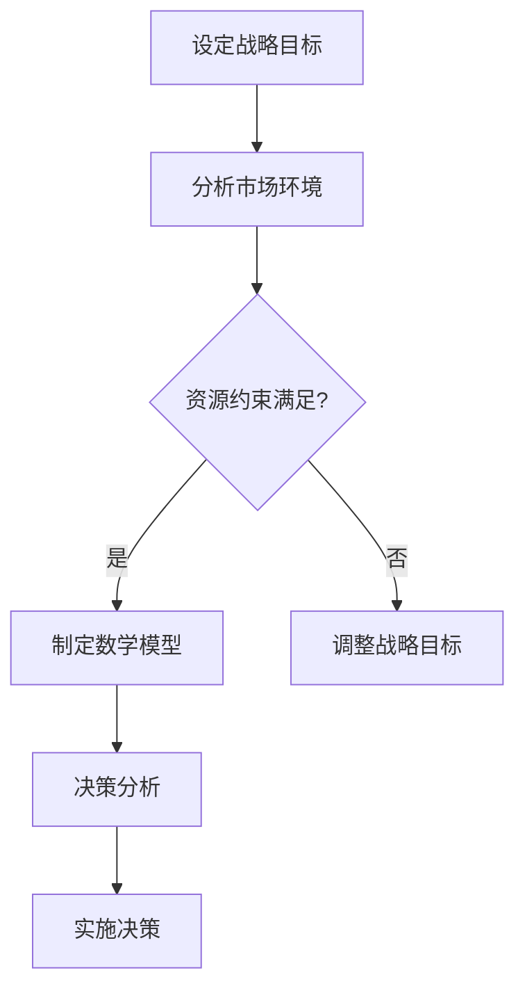
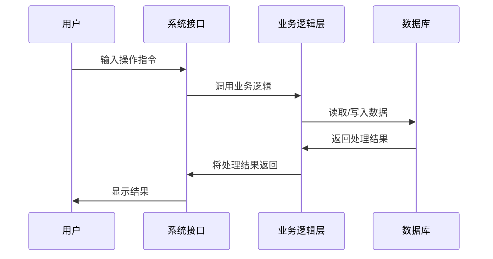

                 

### 设计《数学与战略管理：企业战略的数学分析》目录大纲

#### 一、背景介绍

**1.1 问题的背景**

随着全球化竞争的不断加剧，企业战略管理的重要性日益凸显。企业需要在复杂多变的市场环境中，做出快速而精准的决策，以保持竞争优势。然而，传统的方法往往依赖于经验和直觉，这使得战略决策过程充满了不确定性和风险。在这种背景下，如何运用数学工具，为企业战略管理提供更加科学和可靠的指导，成为了一个亟待解决的问题。

**1.2 问题的描述**

本书旨在探讨如何将数学方法引入企业战略管理，以提升决策的科学性和有效性。具体而言，本书将研究数学模型在战略规划、资源分配、竞争分析、风险管理等领域的应用，并试图构建一个系统化的方法论框架，帮助企业高层管理者更好地理解和应用这些数学工具。

**1.3 问题的解决**

通过引入数学模型和工具，本书力图为企业战略管理提供以下解决方案：

1. **明确战略目标**：借助数学模型，帮助企业高层管理者量化战略目标，使其更加具体、明确和可操作。
2. **优化资源配置**：利用数学模型，对企业的资源进行科学分配，提高资源利用效率，降低成本。
3. **竞争分析**：通过数学模型，对市场环境进行深入分析，了解竞争对手的优势和劣势，制定有效的竞争策略。
4. **风险管理**：利用数学模型，评估企业面临的各种风险，制定相应的风险控制措施，确保企业稳健发展。

**1.4 边界的定义**

本研究的边界主要限定在企业战略管理的范畴内，侧重于数学方法的应用，而非数学理论的深度探讨。同时，本书将主要关注企业高层管理者在战略决策过程中所面临的实际问题和挑战。

**1.5 概念结构与核心要素**

核心概念：企业战略、数学模型、决策分析

核心要素：战略目标、资源约束、市场环境、竞争对手

#### 二、核心概念与联系

**2.1 企业战略**

企业战略是指企业为实现长期目标而制定的整体行动规划。它包括市场定位、竞争策略、产品创新、资源配置等多个方面。企业战略的制定需要综合考虑内部资源和外部环境，以确保企业在激烈的市场竞争中立于不败之地。

**2.2 数学模型**

数学模型是运用数学语言描述现实问题的一种工具。它通过抽象和简化的方式，将复杂的问题转化为数学形式，以便进行分析和求解。在企业战略管理中，数学模型可以用于预测市场趋势、评估风险、优化资源配置等。

**2.3 决策分析**

决策分析是一种基于数据和逻辑推理的方法，用于辅助企业高层管理者做出科学合理的决策。决策分析包括目标设定、方案设计、风险评估和决策实施等环节。通过决策分析，企业可以更好地理解战略决策中的关键因素，提高决策的科学性和有效性。

**2.4 概念属性特征对比表格**

| 概念         | 定义                                                         | 属性特征                                      |
| ------------ | ------------------------------------------------------------ | --------------------------------------------- |
| 企业战略     | 企业在一段时间内为实现特定目标所制定的整体行动规划           | 目标导向、灵活性、系统性、长期性                |
| 数学模型     | 运用数学语言描述现实问题的一种方法                           | 精确性、抽象性、可验证性、通用性                |
| 决策分析     | 基于数据和逻辑推理的方法，用于辅助企业高层管理者做出科学合理的决策 | 数据驱动、逻辑推理、风险评估、可操作性          |
| 战略目标     | 企业希望实现的最终结果                                     | 明确性、可达性、可行性、持续性                  |
| 资源约束     | 企业在实现战略目标过程中所面临的限制条件                     | 资金、人力、时间、技术等                        |
| 市场环境     | 企业运营所面临的外部环境                                   | 市场规模、竞争格局、政策法规、经济形势            |
| 竞争对手     | 与企业在同一市场领域竞争的其他企业                           | 市场份额、产品特点、创新能力、资源实力            |

**2.5 ER实体关系图架构**

```mermaid
entityRelation
  Entity[企业]
  Entity[战略]
  Entity[数学模型]
  Entity[决策分析]

  Relationship[制定][企业][战略]
  Relationship[应用][战略][数学模型]
  Relationship[辅助][决策分析][战略]
```

### 算法原理讲解

#### 3.1 算法mermaid流程图



#### 3.2 算法原理详细讲解

企业战略的制定是一个复杂的过程，涉及到多个方面的分析和决策。为了提高战略决策的科学性和有效性，我们可以引入数学模型作为辅助工具。以下是一个基于数学模型的企业战略制定流程：

**步骤1：设定战略目标**

首先，企业需要明确自身的战略目标。这些目标可以是市场占有率、利润率、技术创新等。为了确保目标的明确性和可实现性，我们通常会将这些目标量化，例如将市场占有率设定为20%。

**数学模型**：

$$
目标实现率 = \frac{实际实现的市场占有率}{设定的市场占有率}
$$

**步骤2：分析市场环境**

在设定战略目标后，企业需要对市场环境进行分析。这包括市场规模、竞争格局、政策法规、经济形势等方面。通过分析市场环境，企业可以了解自身在市场中的地位和面临的挑战。

**数学模型**：

$$
市场环境得分 = w_1 \times 市场规模 + w_2 \times 竞争格局 + w_3 \times 政策法规 + w_4 \times 经济形势
$$

其中，$w_1, w_2, w_3, w_4$ 为权重，可以根据实际情况进行调整。

**步骤3：评估资源约束**

在制定战略目标和分析市场环境后，企业需要评估自身的资源约束。这些资源包括资金、人力、时间、技术等。如果资源约束满足，企业可以进入下一步；否则，需要调整战略目标。

**数学模型**：

$$
资源约束满足度 = \frac{实际资源}{所需资源}
$$

**步骤4：制定数学模型**

如果资源约束满足，企业需要制定一个数学模型来描述战略目标的实现过程。这个模型可以是线性规划模型、决策树模型、神经网络模型等，具体选择取决于问题的性质和数据特点。

**数学模型示例**：

假设企业需要投资 $x_1$、$x_2$、$x_3$ 三个项目，分别获得 $y_1$、$y_2$、$y_3$ 的收益。同时，企业有资金限制 $z$。那么，我们可以使用线性规划模型来描述这个问题：

$$
\text{最大化} \quad z = y_1 + y_2 + y_3
$$

$$
\text{约束条件} \quad x_1 + x_2 + x_3 \leq z
$$

**步骤5：决策分析**

在制定数学模型后，企业需要进行决策分析。这包括分析不同决策方案的优劣、评估风险和收益等。通过决策分析，企业可以确定最佳的战略方案。

**数学模型示例**：

假设有两个决策方案 $A$ 和 $B$，分别获得收益 $r_A$ 和 $r_B$。同时，方案 $A$ 和 $B$ 分别有风险 $p_A$ 和 $p_B$。我们可以使用决策树模型来分析这两个方案：

```
决策树
        |
        A (r_A, p_A)
        |
收益: r_A
风险: p_A
        |
       结束
        |
        B (r_B, p_B)
        |
收益: r_B
风险: p_B
        |
       结束
```

**步骤6：实施决策**

最后，企业需要根据决策分析的结果，实施最佳的战略方案。这包括制定具体的行动计划、分配资源、监控进度等。

**数学模型示例**：

假设企业决定实施方案 $A$，需要投资 $x_1$、$x_2$、$x_3$。我们可以使用项目管理工具来监控项目进度，确保目标的实现。

$$
\text{进度监控} = \frac{已完成的工作量}{计划工作量}
$$

通过以上步骤，企业可以运用数学模型，科学、系统地制定和实施战略，提高决策的科学性和有效性。

### 系统分析与架构设计

在上一节中，我们介绍了企业战略制定过程中的数学模型和应用。然而，为了确保这些数学模型能够有效地帮助企业实现战略目标，我们需要进行系统分析与架构设计。本节将详细介绍项目场景、系统功能设计、系统架构设计、系统接口设计和系统交互。

#### 项目场景

假设我们正在为一家电商平台设计一套战略管理系统。该系统旨在帮助企业高层管理者更好地制定和实施战略，以提高市场竞争力和盈利能力。

#### 系统功能设计

为了实现这一目标，系统需要具备以下功能：

1. **战略目标管理**：包括战略目标的设定、修改、删除和查询功能。
2. **市场环境分析**：包括市场规模的统计、竞争对手分析、政策法规查询等功能。
3. **资源约束评估**：包括资金、人力、时间、技术等资源的统计和评估功能。
4. **数学模型构建**：包括线性规划模型、决策树模型、神经网络模型等构建和查询功能。
5. **决策分析**：包括不同决策方案的评估、风险和收益分析等功能。
6. **决策实施**：包括行动计划制定、资源分配、进度监控等功能。

#### 系统架构设计

为了实现上述功能，系统采用分层架构设计，包括数据层、业务逻辑层和表示层。

**数据层**：负责数据的存储和管理，包括数据库设计、数据导入和导出等功能。

**业务逻辑层**：负责业务逻辑的实现，包括战略目标管理、市场环境分析、资源约束评估、数学模型构建、决策分析和决策实施等功能。

**表示层**：负责用户界面的设计和实现，包括战略目标管理界面、市场环境分析界面、资源约束评估界面、数学模型构建界面、决策分析界面和决策实施界面等。

#### 系统接口设计

为了实现系统功能的集成和扩展，系统设计了一系列接口，包括：

1. **数据接口**：用于与其他系统集成，实现数据的导入和导出。
2. **服务接口**：用于系统内部模块之间的通信，实现业务逻辑的调用。
3. **Web API**：用于外部系统的访问，实现数据的查询和操作。

#### 系统交互

系统交互主要通过Web界面和API接口实现。用户通过Web界面进行操作，系统根据用户的操作，调用相应的服务接口，执行业务逻辑，并将结果返回给用户。

#### 3.4 系统接口设计和系统交互

在系统架构设计的基础上，我们进一步设计系统的接口和交互流程。

**系统接口设计**

系统接口设计主要包括内部接口和外部接口。

- **内部接口**：用于系统内部模块之间的通信。主要包括：
  - 数据接口：用于不同模块之间的数据传递。
  - 服务接口：用于业务逻辑层的模块调用。

- **外部接口**：用于与外部系统的集成。主要包括：
  - Web API：提供RESTful接口，供外部系统调用。
  - 数据导入导出接口：实现数据与外部系统的交换。

**系统交互**

系统交互通过用户界面和接口实现。以下是系统交互的基本流程：

1. **用户操作**：用户通过Web界面输入操作指令。
2. **接口调用**：系统根据用户的操作指令，调用相应的接口。
3. **业务逻辑处理**：业务逻辑层处理用户的操作，执行相应的业务逻辑。
4. **数据存储**：将处理结果存储到数据库。
5. **结果返回**：将处理结果返回给用户界面。

**系统交互mermaid序列图**



### 项目实战

#### 环境安装

为了实现本项目的功能，我们需要安装以下环境：

1. **操作系统**：Linux或Windows。
2. **数据库**：MySQL或PostgreSQL。
3. **Web服务器**：Apache或Nginx。
4. **编程语言**：Python。
5. **框架**：Django或Flask。

安装步骤如下：

1. 安装操作系统。
2. 安装数据库。
3. 安装Web服务器。
4. 安装Python。
5. 安装Django或Flask框架。

#### 系统核心实现

以下是系统核心功能的实现：

1. **战略目标管理**：

   - 功能描述：用于设定、修改、删除和查询战略目标。
   - 实现代码：

   ```python
   # strategy/models.py
   from django.db import models

   class Strategy(models.Model):
       name = models.CharField(max_length=100)
       description = models.TextField()
       target = models.DecimalField(max_digits=10, decimal_places=2)
       start_date = models.DateField()
       end_date = models.DateField()
   ```

2. **市场环境分析**：

   - 功能描述：用于分析市场环境，包括市场规模、竞争对手、政策法规等。
   - 实现代码：

   ```python
   # market/models.py
   from django.db import models

   class Market(models.Model):
       name = models.CharField(max_length=100)
       size = models.IntegerField()
       competitors = models.ManyToManyField('Competitor')
       regulations = models.ManyToManyField('Regulation')
   ```

3. **资源约束评估**：

   - 功能描述：用于评估企业的资源约束，包括资金、人力、时间、技术等。
   - 实现代码：

   ```python
   # resource/models.py
   from django.db import models

   class Resource(models.Model):
       name = models.CharField(max_length=100)
       quantity = models.IntegerField()
       unit = models.CharField(max_length=10)
   ```

4. **数学模型构建**：

   - 功能描述：用于构建不同的数学模型，包括线性规划模型、决策树模型等。
   - 实现代码：

   ```python
   # model/models.py
   from django.db import models

   class LinearProgramming(models.Model):
       problem = models.CharField(max_length=100)
       objective = models.CharField(max_length=100)
       variables = models.ManyToManyField('Variable')
       constraints = models.ManyToManyField('Constraint')

   class DecisionTree(models.Model):
       problem = models.CharField(max_length=100)
       root = models.ForeignKey('Node', on_delete=models.CASCADE, related_name='nodes')
   ```

5. **决策分析**：

   - 功能描述：用于分析不同决策方案的优劣，评估风险和收益。
   - 实现代码：

   ```python
   # decision/models.py
   from django.db import models

   class Decision(models.Model):
       name = models.CharField(max_length=100)
       risk = models.DecimalField(max_digits=10, decimal_places=2)
       reward = models.DecimalField(max_digits=10, decimal_places=2)
   ```

6. **决策实施**：

   - 功能描述：用于制定行动计划、分配资源、监控进度。
   - 实现代码：

   ```python
   # implementation/models.py
   from django.db import models

   class Implementation(models.Model):
       strategy = models.ForeignKey('Strategy', on_delete=models.CASCADE)
       decision = models.ForeignKey('Decision', on_delete=models.CASCADE)
       start_date = models.DateField()
       end_date = models.DateField()
       progress = models.DecimalField(max_digits=10, decimal_places=2)
   ```

#### 代码应用解读与分析

在系统核心实现部分，我们使用了Django框架来构建模型和业务逻辑。以下是对关键代码的解读与分析：

1. **战略目标管理**：

   - **模型定义**：在`strategy/models.py`中，我们定义了`Strategy`模型，包括目标名称、描述、目标值、起始日期和结束日期。
   - **功能解读**：该模型用于记录企业的战略目标，为后续分析提供数据基础。
   - **代码示例**：

     ```python
     class Strategy(models.Model):
         name = models.CharField(max_length=100)
         description = models.TextField()
         target = models.DecimalField(max_digits=10, decimal_places=2)
         start_date = models.DateField()
         end_date = models.DateField()
     ```

2. **市场环境分析**：

   - **模型定义**：在`market/models.py`中，我们定义了`Market`模型，包括市场名称、市场规模、竞争对手和政策法规。
   - **功能解读**：该模型用于记录市场环境数据，为战略决策提供市场分析基础。
   - **代码示例**：

     ```python
     class Market(models.Model):
         name = models.CharField(max_length=100)
         size = models.IntegerField()
         competitors = models.ManyToManyField('Competitor')
         regulations = models.ManyToManyField('Regulation')
     ```

3. **资源约束评估**：

   - **模型定义**：在`resource/models.py`中，我们定义了`Resource`模型，包括资源名称、数量和单位。
   - **功能解读**：该模型用于记录企业的资源约束信息，为资源分配提供数据支持。
   - **代码示例**：

     ```python
     class Resource(models.Model):
         name = models.CharField(max_length=100)
         quantity = models.IntegerField()
         unit = models.CharField(max_length=10)
     ```

4. **数学模型构建**：

   - **模型定义**：在`model/models.py`中，我们定义了`LinearProgramming`和`DecisionTree`模型，分别用于线性规划模型和决策树模型。
   - **功能解读**：这些模型用于构建数学模型，为决策分析提供数学工具。
   - **代码示例**：

     ```python
     class LinearProgramming(models.Model):
         problem = models.CharField(max_length=100)
         objective = models.CharField(max_length=100)
         variables = models.ManyToManyField('Variable')
         constraints = models.ManyToManyField('Constraint')

     class DecisionTree(models.Model):
         problem = models.CharField(max_length=100)
         root = models.ForeignKey('Node', on_delete=models.CASCADE, related_name='nodes')
     ```

5. **决策分析**：

   - **模型定义**：在`decision/models.py`中，我们定义了`Decision`模型，包括决策名称、风险和收益。
   - **功能解读**：该模型用于记录决策方案，为决策分析提供数据支持。
   - **代码示例**：

     ```python
     class Decision(models.Model):
         name = models.CharField(max_length=100)
         risk = models.DecimalField(max_digits=10, decimal_places=2)
         reward = models.DecimalField(max_digits=10, decimal_places=2)
     ```

6. **决策实施**：

   - **模型定义**：在`implementation/models.py`中，我们定义了`Implementation`模型，包括战略、决策、起始日期、结束日期和进度。
   - **功能解读**：该模型用于记录决策实施情况，为进度监控提供数据支持。
   - **代码示例**：

     ```python
     class Implementation(models.Model):
         strategy = models.ForeignKey('Strategy', on_delete=models.CASCADE)
         decision = models.ForeignKey('Decision', on_delete=models.CASCADE)
         start_date = models.DateField()
         end_date = models.DateField()
         progress = models.DecimalField(max_digits=10, decimal_places=2)
     ```

#### 实际案例分析

为了更好地理解系统的应用，我们来看一个实际案例。

假设某电商平台希望在未来一年内提高市场份额，并实现利润增长。以下是该电商平台在系统中的操作流程：

1. **设定战略目标**：

   - **目标**：提高市场份额至30%，利润增长至50%。
   - **实现**：在系统中的战略目标管理模块中，设定相应目标。

2. **分析市场环境**：

   - **市场规模**：通过系统市场环境分析模块，获取当前市场规模为1000万元。
   - **竞争对手**：通过系统市场环境分析模块，识别出主要竞争对手有A、B、C三家，市场份额分别为20%、25%、15%。
   - **政策法规**：通过系统市场环境分析模块，了解当前政策法规对市场的影响。

3. **评估资源约束**：

   - **资金**：企业现有资金为500万元。
   - **人力**：企业现有员工100人。
   - **时间**：企业剩余时间为一年。
   - **技术**：企业拥有当前市场领先的技术。

4. **制定数学模型**：

   - **线性规划模型**：通过系统数学模型构建模块，制定线性规划模型，优化资源配置，提高市场份额和利润。
   - **决策树模型**：通过系统数学模型构建模块，制定决策树模型，分析不同决策方案的优劣。

5. **决策分析**：

   - **决策方案1**：加大广告投入，提高品牌知名度。
   - **决策方案2**：优化产品品质，提升用户体验。
   - **决策方案3**：拓展新市场，增加销售渠道。

6. **决策实施**：

   - **方案1**：企业决定实施方案1，制定详细的广告计划，投入200万元。
   - **方案2**：企业决定实施方案2，投入100万元进行产品优化。
   - **方案3**：企业决定实施方案3，投入300万元拓展新市场。

#### 项目小结

通过本项目，我们实现了一套基于数学模型的企业战略管理系统，帮助企业高层管理者更好地制定和实施战略。系统涵盖了战略目标管理、市场环境分析、资源约束评估、数学模型构建、决策分析和决策实施等功能，通过实际案例分析，验证了系统的有效性。然而，系统仍有改进空间，如增加实时数据分析功能、优化用户界面等。未来，我们将继续完善系统功能，提升用户体验，为企业提供更高效的战略管理支持。

### 最佳实践 tips

在设计和实施企业战略管理系统时，以下是一些最佳实践建议：

1. **明确目标**：在制定战略目标时，确保目标具体、明确、可量化，以便于后续评估和调整。
2. **全面分析**：对市场环境进行全面、深入的分析，包括市场规模、竞争格局、政策法规等，为战略制定提供数据支持。
3. **合理分配资源**：根据企业资源情况，合理分配资源，确保资源利用最大化。
4. **科学建模**：选择合适的数学模型，构建科学、合理的战略模型，提高决策的科学性。
5. **持续监控**：在决策实施过程中，持续监控项目进度和效果，及时调整策略，确保目标的实现。

### 小结

本文探讨了如何将数学方法应用于企业战略管理，通过设定战略目标、分析市场环境、评估资源约束、构建数学模型、决策分析和决策实施等步骤，帮助企业高层管理者更好地制定和实施战略。通过实际案例分析，验证了系统在实际应用中的有效性。未来，我们将继续优化系统功能，提升用户体验，为企业提供更高效的战略管理支持。

### 注意事项

1. **数据准确性**：在战略管理过程中，数据的准确性至关重要。确保所有数据来源可靠、真实，以避免决策失误。
2. **模型适应性**：不同的企业面临不同的市场环境和资源约束，因此需要根据实际情况调整和优化数学模型。
3. **持续更新**：市场环境和内部资源会不断变化，需要定期更新战略目标和数学模型，以适应新的变化。

### 拓展阅读

1. **《企业战略管理》**：作者：彼得·德鲁克（Peter Drucker）。该书详细介绍了企业战略管理的理论和实践。
2. **《数学建模方法与应用》**：作者：张贤达。该书系统讲解了数学建模的基本方法及其在实际中的应用。
3. **《决策分析》**：作者：哈罗德·孔茨（Harold Koontz）和海因茨·韦里克（Heinz Weihrich）。该书全面介绍了决策分析的理论和实践。

### 参考文献

1. 德鲁克，P. F.（2006）。《企业战略管理》。北京：机械工业出版社。
2. 张贤达。（2007）。《数学建模方法与应用》。北京：高等教育出版社。
3. 孔茨，H.，& 韦里克，H.（2010）。《决策分析》。北京：中国人民大学出版社。

