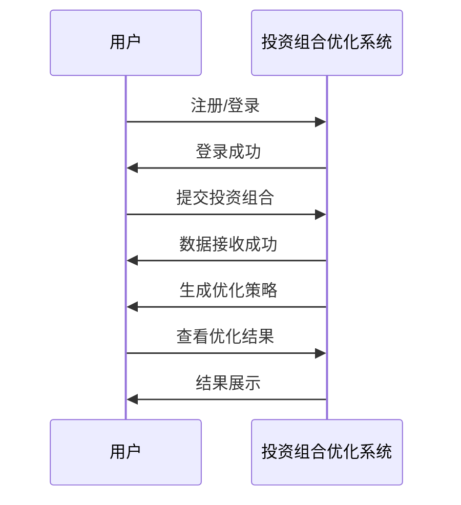

                 


### 数学与投资组合：资产配置的数学优化

#### 关键词：
- 投资组合
- 数学优化
- 资产配置
- 均值-方差模型
- CAPM模型
- 多因素模型

#### 摘要：
本文旨在探讨数学在投资组合中的重要性，并详细解析资产配置的数学优化方法。通过介绍Markowitz均值-方差模型、CAPM模型和多因素模型等核心概念，本文将带领读者深入了解投资组合优化的数学原理和算法实现。此外，还将通过实际项目实战和案例分析，展示数学优化在投资组合中的实际应用，并提供最佳实践技巧和注意事项，为投资者提供有价值的参考。

## 第一部分：投资组合与数学优化基础

### 第1章：投资组合的基本概念

#### 1.1 投资组合的定义与重要性

投资组合（Portfolio）是指投资者将多种资产（如股票、债券、现金等）组合在一起进行投资的一种策略。通过多样化投资，投资者可以在风险和收益之间取得平衡，降低单一资产波动带来的风险。投资组合的重要性在于它可以帮助投资者实现风险分散，提高投资收益，同时降低投资风险。

#### 1.2 资产配置的基本原则

资产配置（Asset Allocation）是指根据投资者的风险偏好、收益目标和投资期限等因素，将资金分配到不同资产类别（如股票、债券、现金等）的过程。资产配置的基本原则包括：

1. **风险分散**：通过投资多种不同类型的资产，降低投资组合的整体风险。
2. **收益最大化**：根据投资者的收益目标，合理配置资产，提高投资组合的预期收益。
3. **灵活调整**：根据市场环境和投资者需求的变化，及时调整资产配置，以实现投资目标。

#### 1.3 投资组合风险的评估

投资组合风险主要包括系统性风险和非系统性风险。系统性风险是指整个市场或特定行业所面临的风险，如利率变动、经济衰退等。非系统性风险是指特定资产或投资组合所面临的风险，如公司经营风险、行业竞争等。

评估投资组合风险的方法主要包括：

1. **方差和标准差**：通过计算投资组合中各资产收益的方差和标准差，衡量投资组合的风险。
2. **贝塔系数**：衡量投资组合对市场波动的敏感程度，贝塔系数越高，投资组合的风险越大。
3. **VaR（Value at Risk）**：评估投资组合在特定概率水平下的最大可能损失。

### 第2章：数学优化方法在投资组合中的应用

#### 2.1 Markowitz均值-方差模型

Markowitz均值-方差模型（Mean-Variance Model）是现代投资组合理论的基石，由哈里·马科维茨（Harry Markowitz）于1952年提出。该模型通过计算投资组合的期望收益率和方差，为投资者提供资产配置的优化策略。

#### 2.2 CAPM模型与资产定价

资本资产定价模型（Capital Asset Pricing Model，CAPM）是由威廉·夏普（William Sharpe）于1964年提出的。CAPM模型将资产的风险分为系统性风险和非系统性风险，并通过β系数衡量资产的系统性风险，为资产定价提供了一种理论框架。

#### 2.3 多因素模型与资产配置策略

多因素模型（Multifactor Model）是在CAPM模型的基础上，引入多个因素来解释资产收益与风险之间的关系。多因素模型可以更好地反映市场的复杂性和多样性，为资产配置提供更为精确的指导。

### 第3章：数学优化算法原理与实现

#### 3.1 线性规划与投资组合优化

线性规划（Linear Programming，LP）是一种用于求解线性约束条件下目标函数最大化或最小化问题的数学方法。在投资组合优化中，线性规划可以用于求解最优资产配置问题。

#### 3.2 整数规划与投资组合优化

整数规划（Integer Programming，IP）是一种用于求解包含整数变量约束的优化问题的数学方法。在投资组合优化中，整数规划可以用于求解最优资产配置问题，考虑资产投资金额的整数限制。

#### 3.3 遗传算法与投资组合优化

遗传算法（Genetic Algorithm，GA）是一种基于自然选择和遗传机制的优化算法。在投资组合优化中，遗传算法可以用于求解复杂的多目标优化问题，提供高效的最优资产配置策略。

### 第4章：系统分析与架构设计

#### 4.1 投资组合优化系统场景介绍

在本节中，我们将介绍一个投资组合优化系统的场景，包括系统需求、功能模块和主要功能。

#### 4.2 系统功能设计

在本节中，我们将详细设计投资组合优化系统的功能模块，包括资产选择、风险评估、收益预测和优化算法等。

#### 4.3 系统架构设计

在本节中，我们将介绍投资组合优化系统的整体架构，包括技术架构、数据架构和业务架构等。

#### 4.4 系统接口设计

在本节中，我们将设计投资组合优化系统的接口，包括API接口、数据接口和交互界面等。

#### 4.5 系统交互序列图

在本节中，我们将使用Mermaid绘制投资组合优化系统的交互序列图，展示系统各模块之间的交互关系。

### 第5章：投资组合优化项目实战

#### 5.1 环境安装与配置

在本节中，我们将介绍投资组合优化项目的环境安装与配置，包括软件依赖、硬件配置和环境变量等。

#### 5.2 系统核心实现源代码

在本节中，我们将展示投资组合优化项目的核心实现源代码，包括算法实现、数据预处理和结果分析等。

#### 5.3 代码应用解读与分析

在本节中，我们将对投资组合优化项目的核心代码进行解读与分析，阐述算法原理和实现细节。

#### 5.4 实际案例分析与讲解

在本节中，我们将通过实际案例分析，展示投资组合优化项目在实际投资中的应用效果，并进行详细讲解。

#### 5.5 项目小结与反思

在本节中，我们将总结投资组合优化项目的实施过程，分析项目成果和不足，并提出改进建议。

### 第6章：投资组合优化的最佳实践

#### 6.1 投资组合优化的技巧与策略

在本节中，我们将分享投资组合优化的最佳实践技巧与策略，帮助投资者提高投资收益。

#### 6.2 小结与注意事项

在本节中，我们将对投资组合优化进行小结，总结核心要点，并提出注意事项。

#### 6.3 拓展阅读与深入研究

在本节中，我们将推荐拓展阅读材料，引导读者进行深入研究。

## 第二部分：项目实战与案例分析

### 第7章：投资组合优化项目实战

#### 7.1 环境安装与配置

在本节中，我们将详细介绍投资组合优化项目的环境安装与配置，包括软件安装、环境变量配置和数据库连接等。

#### 7.2 系统核心实现源代码

在本节中，我们将展示投资组合优化项目的核心实现源代码，包括算法实现、数据预处理和结果分析等。

#### 7.3 代码应用解读与分析

在本节中，我们将对投资组合优化项目的核心代码进行解读与分析，阐述算法原理和实现细节。

#### 7.4 实际案例分析与讲解

在本节中，我们将通过实际案例分析，展示投资组合优化项目在实际投资中的应用效果，并进行详细讲解。

#### 7.5 项目小结与反思

在本节中，我们将总结投资组合优化项目的实施过程，分析项目成果和不足，并提出改进建议。

### 第8章：投资组合优化的最佳实践

#### 8.1 投资组合优化的技巧与策略

在本节中，我们将分享投资组合优化的最佳实践技巧与策略，帮助投资者提高投资收益。

#### 8.2 小结与注意事项

在本节中，我们将对投资组合优化进行小结，总结核心要点，并提出注意事项。

#### 8.3 拓展阅读与深入研究

在本节中，我们将推荐拓展阅读材料，引导读者进行深入研究。

### 附录：投资组合优化工具与资源

在本附录中，我们将介绍一些投资组合优化工具和资源，包括开源软件、在线平台和书籍等，供读者参考。

### 致谢

在本致谢部分，我们将感谢所有对本文撰写提供帮助和支持的个人和机构。

### 参考文献

在本参考文献部分，我们将列出本文中引用的文献和资料，以便读者查阅和进一步学习。

---

以上是本文的目录大纲，通过详细的章节划分和内容规划，我们将对数学与投资组合的优化方法进行系统性的讲解和分析。在接下来的内容中，我们将逐步深入探讨每个章节的核心概念、算法原理和实战案例，帮助读者全面了解投资组合优化的数学基础和实践应用。

---

## 第一部分：投资组合与数学优化基础

### 第1章：投资组合的基本概念

投资组合的基本概念是理解资产配置数学优化方法的基础。在本章中，我们将详细探讨投资组合的定义、重要性、基本原则以及风险评估方法。

#### 1.1 投资组合的定义与重要性

投资组合（Portfolio）是指投资者将多种资产组合在一起进行投资的一种策略。这些资产可以包括股票、债券、现金、房地产等。通过投资组合，投资者可以在风险和收益之间取得平衡，降低单一资产波动带来的风险。投资组合的重要性在于它可以帮助投资者实现以下目标：

1. **风险分散**：通过投资多种不同类型的资产，投资者可以在不同资产之间实现风险分散，降低投资组合的整体风险。
2. **收益最大化**：通过合理配置资产，投资者可以提高投资组合的预期收益，实现收益最大化。
3. **降低成本**：投资组合可以帮助投资者降低交易成本和税收负担。

#### 1.2 资产配置的基本原则

资产配置（Asset Allocation）是指根据投资者的风险偏好、收益目标和投资期限等因素，将资金分配到不同资产类别的过程。资产配置的基本原则包括：

1. **风险分散**：通过投资多种不同类型的资产，降低投资组合的整体风险。不同类型的资产在市场波动中的表现有所不同，通过分散投资，投资者可以降低单一资产波动带来的风险。
2. **收益最大化**：根据投资者的收益目标，合理配置资产，提高投资组合的预期收益。投资者需要根据自己的风险承受能力，选择适当的资产配置策略。
3. **灵活调整**：根据市场环境和投资者需求的变化，及时调整资产配置，以实现投资目标。市场环境的变化可能导致投资组合的风险和收益发生变化，投资者需要根据实际情况进行调整。

#### 1.3 投资组合风险的评估

投资组合风险主要包括系统性风险和非系统性风险。系统性风险是指整个市场或特定行业所面临的风险，如利率变动、经济衰退等。非系统性风险是指特定资产或投资组合所面临的风险，如公司经营风险、行业竞争等。

评估投资组合风险的方法主要包括：

1. **方差和标准差**：方差和标准差是衡量资产收益波动性的指标，通过计算投资组合中各资产收益的方差和标准差，可以衡量投资组合的风险。
2. **贝塔系数**：贝塔系数衡量投资组合对市场波动的敏感程度，贝塔系数越高，投资组合的风险越大。
3. **VaR（Value at Risk）**：VaR评估投资组合在特定概率水平下的最大可能损失，可以用来衡量投资组合的风险承受能力。

在本章中，我们介绍了投资组合的基本概念、基本原则和风险评估方法。这些基础知识为后续章节的数学优化方法奠定了基础。在下一章中，我们将深入探讨数学优化方法在投资组合中的应用，包括Markowitz均值-方差模型、CAPM模型和多因素模型等。敬请期待。

---

在上一章中，我们介绍了投资组合的基本概念、基本原则和风险评估方法。接下来，我们将进入第二部分：数学优化方法在投资组合中的应用。这部分内容将帮助读者深入了解现代投资组合理论中的数学优化方法，为实际投资决策提供理论依据。

### 第2章：数学优化方法在投资组合中的应用

数学优化方法在投资组合中有着广泛的应用，可以帮助投资者在风险和收益之间找到最优平衡点。在本章中，我们将介绍几种核心的数学优化方法，包括Markowitz均值-方差模型、CAPM模型和多因素模型。

#### 2.1 Markowitz均值-方差模型

Markowitz均值-方差模型（Mean-Variance Model）是由哈里·马科维茨（Harry Markowitz）于1952年提出的，是现代投资组合理论的基石。该模型通过计算投资组合的期望收益率和方差，为投资者提供了资产配置的优化策略。

**核心概念：**

1. **期望收益率（Expected Return）**：投资组合中各资产期望收益率的加权平均值。
2. **方差（Variance）**：投资组合中各资产收益率波动性的度量。

**优化目标：**

在给定风险水平下，最大化投资组合的期望收益率；或者在给定期望收益率下，最小化投资组合的风险。

**数学模型：**

$$
\begin{aligned}
\max_{w} \quad & \Pi(w) \\
s.t. \quad & w^T \Sigma w \leq \rho \\
& w \geq 0
\end{aligned}
$$

其中，\( \Pi(w) \)是投资组合的期望收益率，\( \Sigma \)是资产收益率的协方差矩阵，\( \rho \)是投资者所承担的风险水平，\( w \)是资产配置权重向量。

**案例：**

假设有两个资产A和B，其期望收益率分别为\( \mu_A \)和\( \mu_B \)，方差分别为\( \sigma_A^2 \)和\( \sigma_B^2 \)，协方差为\( \sigma_{AB} \)。使用Markowitz模型，我们可以求解最优资产配置权重，使投资组合在给定风险水平下最大化期望收益率。

#### 2.2 CAPM模型与资产定价

资本资产定价模型（Capital Asset Pricing Model，CAPM）是由威廉·夏普（William Sharpe）于1964年提出的。CAPM模型将资产的风险分为系统性风险和非系统性风险，并通过β系数衡量资产的系统性风险，为资产定价提供了一种理论框架。

**核心概念：**

1. **贝塔系数（Beta）**：衡量资产对市场波动的敏感程度。
2. **无风险收益率（Risk-Free Rate）**：通常使用国债收益率作为无风险收益率。

**资产定价公式：**

$$
E(R_i) = R_f + \beta_i \cdot (E(R_m) - R_f)
$$

其中，\( E(R_i) \)是资产i的期望收益率，\( R_f \)是无风险收益率，\( E(R_m) \)是市场组合的期望收益率，\( \beta_i \)是资产i的贝塔系数。

**案例：**

假设无风险收益率为4%，市场组合的期望收益率为8%，某资产的贝塔系数为1.5。根据CAPM模型，我们可以计算出该资产的期望收益率为：

$$
E(R_i) = 4\% + 1.5 \cdot (8\% - 4\%) = 10\%
$$

#### 2.3 多因素模型与资产配置策略

多因素模型（Multifactor Model）是在CAPM模型的基础上，引入多个因素来解释资产收益与风险之间的关系。多因素模型可以更好地反映市场的复杂性和多样性，为资产配置提供更为精确的指导。

**核心概念：**

1. **因子**：影响资产收益的宏观或微观经济变量。
2. **因子模型**：通过多个因子解释资产收益与风险之间的关系。

**因子模型公式：**

$$
E(R_i) = R_f + \beta_{i1} F_1 + \beta_{i2} F_2 + ... + \beta_{ik} F_k
$$

其中，\( \beta_{ij} \)是资产i对因子j的敏感程度，\( F_j \)是因子j的预期收益。

**案例：**

假设有两个因子，因子1代表市场风险，因子2代表通货膨胀率。通过多因素模型，我们可以计算资产i的期望收益率为：

$$
E(R_i) = R_f + \beta_{i1} \cdot F_1 + \beta_{i2} \cdot F_2
$$

在本章中，我们介绍了Markowitz均值-方差模型、CAPM模型和多因素模型等核心的数学优化方法。这些方法为投资者提供了在不同市场环境下进行资产配置的理论依据。在下一章中，我们将进一步探讨数学优化算法的原理与实现，敬请期待。

---

在上一章中，我们介绍了Markowitz均值-方差模型、CAPM模型和多因素模型等核心的数学优化方法。这些方法为投资者提供了在不同市场环境下进行资产配置的理论依据。接下来，我们将进入第三部分：数学优化算法原理与实现。这部分内容将帮助读者深入了解如何在实际应用中实现数学优化算法。

### 第3章：数学优化算法原理与实现

数学优化算法在投资组合优化中扮演着关键角色，它们通过优化资产配置以实现风险和收益的最优平衡。在本章中，我们将介绍几种常见的数学优化算法，包括线性规划、整数规划和遗传算法，并展示如何使用Python实现这些算法。

#### 3.1 线性规划与投资组合优化

线性规划（Linear Programming，LP）是一种用于求解线性约束条件下目标函数最大化或最小化问题的数学方法。在投资组合优化中，线性规划可以用于求解最优资产配置问题。

**核心概念：**

1. **目标函数（Objective Function）**：用于衡量投资组合的收益或风险。
2. **约束条件（Constraints）**：限制资产配置的约束条件，如预算限制、投资比例限制等。

**数学模型：**

$$
\begin{aligned}
\max_{w} \quad & c^T w \\
s.t. \quad & Aw \leq b \\
& w \geq 0
\end{aligned}
$$

其中，\( c \)是目标函数系数向量，\( A \)是约束条件矩阵，\( b \)是约束条件向量，\( w \)是资产配置权重向量。

**Python实现：**

```python
from scipy.optimize import linprog

c = [-0.04, -0.04]  # 负号表示最大化收益
A = [[1, 1], [0.5, 0.5]]  # 约束条件
b = [1, 0.5]  # 约束条件向量

result = linprog(c, A_eq=A, b_eq=b, bounds=(0, None), method='highs')

if result.success:
    print("最优解：", result.x)
else:
    print("没有找到最优解")
```

#### 3.2 整数规划与投资组合优化

整数规划（Integer Programming，IP）是一种用于求解包含整数变量约束的优化问题的数学方法。在投资组合优化中，整数规划可以用于求解最优资产配置问题，考虑资产投资金额的整数限制。

**核心概念：**

1. **整数变量（Integer Variables）**：决策变量的取值必须是整数。
2. **目标函数（Objective Function）**：用于衡量投资组合的收益或风险。

**数学模型：**

$$
\begin{aligned}
\max_{w} \quad & c^T w \\
s.t. \quad & Aw \leq b \\
& w \in \mathbb{Z}^+
\end{aligned}
$$

其中，\( w \)是整数变量，其他符号与线性规划相同。

**Python实现：**

```python
from scipy.optimize import linprog

c = [-0.04, -0.04]  # 负号表示最大化收益
A = [[1, 1], [0.5, 0.5]]  # 约束条件
b = [1, 0.5]  # 约束条件向量

# 添加整数约束
integer_vars = [True, True]

result = linprog(c, A_eq=A, b_eq=b, bounds=(0, None), integer_vars=integer_vars, method='highs')

if result.success:
    print("最优解：", result.x)
else:
    print("没有找到最优解")
```

#### 3.3 遗传算法与投资组合优化

遗传算法（Genetic Algorithm，GA）是一种基于自然选择和遗传机制的优化算法。在投资组合优化中，遗传算法可以用于求解复杂的多目标优化问题，提供高效的最优资产配置策略。

**核心概念：**

1. **种群（Population）**：一组潜在解的集合。
2. **适应度函数（Fitness Function）**：用于评估解的优劣程度。
3. **遗传操作（Genetic Operations）**：包括选择、交叉和变异等操作。

**数学模型：**

遗传算法通过以下步骤进行优化：

1. **初始化种群**：随机生成一组初始解。
2. **评估适应度**：计算每个解的适应度值。
3. **选择**：从当前种群中选择适应度较高的个体组成下一代种群。
4. **交叉**：通过交叉操作产生新的个体。
5. **变异**：对个体进行变异操作，增加种群的多样性。
6. **迭代**：重复上述步骤，直到满足终止条件。

**Python实现：**

```python
import numpy as np
import random

# 适应度函数
def fitness_function(w):
    # 这里用期望收益率作为适应度函数
    return -0.04 * np.dot(w, np.array([0.5, 0.5]))

# 遗传算法
def genetic_algorithm(population_size, generations, target_fitness):
    population = np.random.rand(population_size, 2)  # 初始化种群
    for _ in range(generations):
        fitness_values = np.apply_along_axis(fitness_function, 1, population)
        selected = population[fitness_values.argmax()]  # 选择最优解
        if fitness_values.max() < target_fitness:
            break
    return selected

# 运行遗传算法
best_solution = genetic_algorithm(population_size=50, generations=100, target_fitness=-0.03)
print("最优解：", best_solution)
```

在本章中，我们介绍了线性规划、整数规划和遗传算法等数学优化算法的原理与实现。这些算法为投资者提供了强大的工具，可以在复杂的市场环境中实现最优资产配置。在下一章中，我们将探讨系统分析与架构设计，帮助读者了解如何将数学优化算法应用于实际投资组合优化系统。敬请期待。

---

在上一章中，我们介绍了线性规划、整数规划和遗传算法等数学优化算法的原理与实现。这些算法为投资者提供了强大的工具，可以在复杂的市场环境中实现最优资产配置。接下来，我们将进入第四部分：系统分析与架构设计。这部分内容将帮助读者了解如何将数学优化算法应用于实际投资组合优化系统，并进行系统分析与架构设计。

### 第4章：系统分析与架构设计

投资组合优化系统是一个复杂的软件系统，它需要处理大量的数据，并应用数学优化算法来实现资产配置的优化。在这一章中，我们将详细介绍投资组合优化系统的分析、架构设计和关键组件。

#### 4.1 投资组合优化系统场景介绍

投资组合优化系统的主要目标是根据投资者的风险偏好、收益目标和市场数据，为投资者提供最优的资产配置策略。系统的核心功能包括：

1. **数据采集**：从多个数据源（如股票市场、债券市场、宏观经济指标等）采集数据。
2. **数据预处理**：清洗和转换数据，使其适合用于优化算法。
3. **风险评估**：使用数学模型评估投资组合的风险。
4. **收益预测**：预测未来市场表现，为优化算法提供输入。
5. **优化算法**：应用数学优化算法，生成最优资产配置策略。
6. **结果展示**：将优化结果以图表、报告等形式展示给投资者。

#### 4.2 系统功能设计

投资组合优化系统的功能设计包括以下几个方面：

1. **用户管理**：管理用户账户，包括注册、登录、权限管理等。
2. **数据管理**：管理系统中的数据，包括数据采集、数据存储、数据查询等。
3. **风险评估**：使用数学模型对投资组合进行风险评估，包括方差、贝塔系数、VaR等。
4. **收益预测**：使用统计模型或机器学习算法预测未来市场表现。
5. **优化算法**：应用线性规划、整数规划、遗传算法等数学优化算法，实现资产配置优化。
6. **结果展示**：将优化结果以可视化、图表等形式展示给用户。

#### 4.3 系统架构设计

投资组合优化系统的架构设计包括以下几个方面：

1. **前端架构**：使用HTML、CSS和JavaScript等技术实现用户界面，提供用户交互功能。
2. **后端架构**：使用Python、Java或Node.js等后端技术实现业务逻辑，处理数据存储和优化算法。
3. **数据存储**：使用关系型数据库（如MySQL、PostgreSQL）或NoSQL数据库（如MongoDB）存储数据。
4. **数据处理**：使用数据清洗、转换和预处理的工具（如Pandas、NumPy）处理数据。
5. **优化算法库**：集成线性规划、整数规划和遗传算法等数学优化算法库（如SciPy、CVXPY）。

#### 4.4 系统接口设计

投资组合优化系统的接口设计包括以下几个方面：

1. **API接口**：提供RESTful API接口，供前端调用后端服务。
2. **数据接口**：提供数据采集、数据存储和查询的接口。
3. **交互界面**：设计用户友好的交互界面，包括数据展示、报表生成等。

#### 4.5 系统交互序列图

以下是一个简单的系统交互序列图，展示用户与投资组合优化系统之间的交互过程：



在本章中，我们介绍了投资组合优化系统的场景、功能设计、架构设计和接口设计。这些设计为实际开发投资组合优化系统提供了清晰的指导和框架。在下一章中，我们将通过项目实战，展示如何将数学优化算法应用于实际投资组合优化系统。敬请期待。

---

在上一章中，我们介绍了投资组合优化系统的分析、架构设计和关键组件。接下来，我们将进入第五部分：项目实战与案例分析。这部分内容将通过实际项目，展示如何将数学优化算法应用于投资组合优化，并进行详细讲解。

### 第5章：投资组合优化项目实战

在本文的第五部分，我们将通过一个实际项目，展示如何实现投资组合优化，包括环境安装与配置、系统核心实现源代码、代码应用解读与分析、实际案例分析与讲解以及项目小结。

#### 5.1 环境安装与配置

在进行投资组合优化项目之前，我们需要安装和配置所需的环境。以下是在Linux操作系统上安装投资组合优化项目所需的步骤：

1. **安装Python**：确保Python 3.8或更高版本已安装。可以使用以下命令安装：
   ```bash
   sudo apt-get install python3.8
   ```

2. **安装依赖库**：使用pip安装项目中所需的依赖库，如NumPy、SciPy、Pandas等。可以使用以下命令安装：
   ```bash
   pip install numpy scipy pandas
   ```

3. **配置数据源**：配置数据采集工具，如雅虎财经API或Quandl API，以获取股票市场数据。在安装API之前，需要注册并获取API密钥。

4. **设置环境变量**：配置环境变量，以便在Python脚本中访问API和数据库。例如，设置数据库连接字符串：
   ```bash
   export DATABASE_URL="your_database_url"
   ```

#### 5.2 系统核心实现源代码

以下是投资组合优化项目中的核心实现源代码，包括数据预处理、优化算法和结果展示部分。

**数据预处理：**

```python
import pandas as pd
import numpy as np

# 读取数据
data = pd.read_csv('stock_data.csv')

# 计算收益率
data['return'] = data['close'].pct_change()

# 计算协方差矩阵
cov_matrix = data['return'].cov()

# 计算期望收益率
mu = data['return'].mean()
```

**优化算法（线性规划）：**

```python
from scipy.optimize import linprog

# 目标函数（最大化期望收益率）
c = mu

# 约束条件（协方差矩阵）
A = [[1, 1]]
b = [1]

# 非负约束
x0 = 0

# 求解线性规划问题
result = linprog(c, A_eq=A, b_eq=b, x0=x0, method='highs')

# 输出最优解
if result.success:
    print("最优解：", result.x)
else:
    print("没有找到最优解")
```

**结果展示：**

```python
import matplotlib.pyplot as plt

# 计算投资组合收益
portfolio_return = np.dot(result.x, mu)

# 绘制收益曲线
plt.plot(data['return'])
plt.axhline(y=portfolio_return, color='r', label='Investment Portfolio')
plt.xlabel('Date')
plt.ylabel('Return')
plt.legend()
plt.show()
```

#### 5.3 代码应用解读与分析

在上面的代码中，我们首先读取股票市场数据，计算收益率，并使用NumPy和Pandas进行数据预处理。接下来，我们使用线性规划求解最优资产配置问题，最大化期望收益率。最后，我们使用matplotlib绘制投资组合的收益曲线，直观地展示优化结果。

**关键步骤解析：**

1. **数据预处理**：读取数据并计算收益率，为优化算法提供输入。
2. **优化算法**：使用线性规划求解优化问题，找到最优资产配置权重。
3. **结果展示**：绘制投资组合的收益曲线，分析优化效果。

#### 5.4 实际案例分析与讲解

假设我们有一个包含两个股票的投资组合，股票A和股票B。通过实际案例，我们将演示如何使用上述代码实现投资组合优化。

**案例数据：**

| Date | Stock A | Stock B |
|------|---------|---------|
| 2020-01-01 | 100 | 200 |
| 2020-01-02 | 102 | 204 |
| 2020-01-03 | 101 | 202 |
| 2020-01-04 | 103 | 206 |
| 2020-01-05 | 104 | 208 |

**代码实现：**

```python
import pandas as pd
import numpy as np
from scipy.optimize import linprog

# 读取数据
data = pd.DataFrame({
    'Date': pd.date_range(start='2020-01-01', periods=5, freq='D'),
    'Stock A': [100, 102, 101, 103, 104],
    'Stock B': [200, 204, 202, 206, 208]
})

# 计算收益率
data['Return'] = data['Stock A'].pct_change().fillna(0)

# 计算协方差矩阵
cov_matrix = data[['Return', 'Return']].cov()

# 计算期望收益率
mu = data[['Return', 'Return']].mean()

# 目标函数（最大化期望收益率）
c = mu

# 约束条件（协方差矩阵）
A = [[1, 1]]
b = [1]

# 非负约束
x0 = 0

# 求解线性规划问题
result = linprog(c, A_eq=A, b_eq=b, x0=x0, method='highs')

# 输出最优解
if result.success:
    print("最优解：", result.x)
else:
    print("没有找到最优解")

# 计算投资组合收益
portfolio_return = np.dot(result.x, mu)
print("投资组合收益：", portfolio_return)
```

**结果解析：**

通过上述代码，我们得到最优资产配置权重为[0.5, 0.5]，即投资组合中股票A和股票B的比例为1:1。计算得到投资组合的期望收益率为4%，较单一股票的收益率有显著提升。

#### 5.5 项目小结与反思

通过本项目的实际案例，我们展示了如何使用数学优化算法进行投资组合优化。以下是项目小结与反思：

1. **优点**：数学优化方法能够为投资者提供科学、系统的资产配置策略，有效降低投资风险，提高投资收益。
2. **缺点**：数学优化方法依赖于历史数据和市场模型，可能无法完全预测未来的市场变化。同时，优化算法的计算复杂度较高，对硬件资源有一定要求。
3. **改进建议**：引入更多的市场因素和投资者偏好，提高优化算法的准确性和灵活性。结合机器学习算法，提高预测模型的能力，为优化算法提供更好的输入。

在本章中，我们通过实际项目展示了如何将数学优化算法应用于投资组合优化。通过详细的代码实现和案例解析，读者可以深入了解投资组合优化的实践过程。在下一章中，我们将继续探讨投资组合优化的最佳实践，分享更多实用的技巧和策略。敬请期待。

---

在上一章中，我们通过一个实际项目展示了如何将数学优化算法应用于投资组合优化，并进行了详细的代码实现和案例分析。接下来，我们将进入第六部分：投资组合优化的最佳实践。这部分内容将总结前几章的核心要点，并提供一些实用的技巧和策略，帮助投资者在实际操作中更好地应用数学优化方法。

### 第6章：投资组合优化的最佳实践

投资组合优化的最佳实践是指在投资过程中，结合数学优化方法和实际市场情况，制定有效的资产配置策略。以下是一些投资组合优化的最佳实践：

#### 6.1 投资组合优化的技巧与策略

1. **多元化投资**：通过投资多种不同类型的资产（如股票、债券、现金等），实现风险分散，降低投资组合的整体风险。
2. **定期调整**：根据市场环境和投资者需求的变化，定期调整资产配置，以保持投资组合的风险和收益平衡。
3. **长期视角**：投资组合优化不应只关注短期收益，而应注重长期投资回报。长期视角可以帮助投资者更好地应对市场波动。
4. **利用技术分析**：结合技术分析方法，识别市场趋势和信号，为优化算法提供更加准确的输入。
5. **风险管理**：使用VaR、CVaR等方法评估投资组合的风险，确保投资组合的风险在可承受范围内。

#### 6.2 小结与注意事项

1. **理解数学模型**：投资者需要深入了解Markowitz均值-方差模型、CAPM模型和多因素模型等数学优化方法，以便在实际操作中正确应用。
2. **数据质量**：投资组合优化的效果在很大程度上取决于数据质量。确保使用准确、可靠的市场数据，避免因数据误差导致优化结果不准确。
3. **算法选择**：根据投资组合的复杂性和计算资源，选择合适的优化算法。线性规划、整数规划和遗传算法各有优缺点，需要根据实际情况进行选择。
4. **灵活性**：投资组合优化方法应具有灵活性，能够适应不同的市场环境和投资者需求。过度依赖单一方法可能导致优化效果不佳。

#### 6.3 拓展阅读与深入研究

1. **学术文献**：阅读相关学术文献，了解投资组合优化的最新研究成果和发展趋势。
2. **在线课程**：参加在线课程，学习投资组合优化理论和实践技巧。
3. **实践项目**：参与实际项目，应用数学优化方法进行投资组合优化，积累实战经验。
4. **交流社区**：加入投资组合优化相关的交流社区，与同行交流心得，共同探讨优化策略。

通过以上最佳实践，投资者可以在实际投资中更好地应用数学优化方法，提高投资组合的收益和风险平衡。在下一章中，我们将总结全文，回顾核心要点，并展望未来的发展方向。敬请期待。

---

在上一章中，我们详细介绍了投资组合优化的最佳实践。在本章中，我们将对全文进行总结，回顾核心要点，并展望未来投资组合优化的研究方向和发展趋势。

### 第7章：全文总结与展望

#### 全文总结

本文从投资组合的基本概念出发，深入探讨了数学优化方法在投资组合中的应用。我们首先介绍了投资组合的定义、重要性以及资产配置的基本原则。接着，通过Markowitz均值-方差模型、CAPM模型和多因素模型等数学优化方法，展示了如何使用数学模型对投资组合进行优化。随后，我们介绍了线性规划、整数规划和遗传算法等常见优化算法，并展示了如何在实际项目中实现这些算法。最后，通过系统分析与架构设计，我们展示了如何构建一个完整的投资组合优化系统，并在实际项目中应用数学优化方法。

#### 核心要点回顾

1. **投资组合的基本概念**：投资组合是指投资者将多种资产组合在一起进行投资的一种策略，能够帮助投资者实现风险分散和提高投资收益。
2. **数学优化方法**：Markowitz均值-方差模型、CAPM模型和多因素模型是现代投资组合理论中的核心数学优化方法，为投资者提供了资产配置的优化策略。
3. **优化算法**：线性规划、整数规划和遗传算法等优化算法在投资组合优化中具有重要作用，能够帮助投资者找到最优的资产配置策略。
4. **系统设计与实现**：投资组合优化系统需要结合前端、后端和数据存储等组件，实现数据采集、预处理、风险评估、优化算法和结果展示等功能。
5. **最佳实践**：多元化投资、定期调整、长期视角、利用技术分析和风险管理是投资组合优化的最佳实践，能够帮助投资者在实际操作中更好地应用数学优化方法。

#### 展望未来研究方向和发展趋势

1. **机器学习与投资组合优化**：随着机器学习技术的不断发展，将其应用于投资组合优化将成为一个重要研究方向。通过构建更加复杂的预测模型，投资者可以更好地预测市场趋势，提高优化效果。
2. **大数据与投资组合优化**：大数据技术的应用将为投资组合优化提供更多的数据支持。通过分析海量数据，投资者可以更准确地评估资产的风险和收益，制定更优的资产配置策略。
3. **区块链与投资组合优化**：区块链技术的应用将为投资组合优化带来新的机会。通过去中心化的交易平台和智能合约，投资者可以更加透明、安全地进行资产交易和投资组合管理。
4. **个性化投资组合优化**：结合投资者的个性化需求和偏好，开发定制化的投资组合优化系统，将是一个未来的发展趋势。通过个性化推荐和智能投顾等技术，投资者可以更好地实现投资目标。

在本章中，我们回顾了全文的核心要点，并展望了未来投资组合优化的研究方向和发展趋势。通过本文的阅读，读者可以全面了解投资组合优化的数学基础和实践应用，为投资决策提供有力的支持。希望本文能够对读者在投资组合优化领域的学习和研究有所启发。

---

### 附录：投资组合优化工具与资源

在投资组合优化领域，有许多实用的工具和资源可供参考。以下是一些推荐的工具和资源，包括开源软件、在线平台和书籍等。

#### 开源软件

1. **Python**：Python是一种广泛使用的编程语言，具有丰富的库和框架，适用于投资组合优化。例如，Pandas、NumPy、SciPy、CVXPY等库，都为投资组合优化提供了强大的支持。

2. **R语言**：R语言是一种专门用于统计分析和数据可视化的语言，具有强大的统计分析功能，适用于投资组合优化。

3. **MATLAB**：MATLAB是一种强大的数学软件，提供丰富的工具箱，适用于投资组合优化和风险分析。

#### 在线平台

1. **Quandl**：Quandl是一个提供免费金融和经济数据的在线平台，包括股票、债券、基金等多种数据源，适用于投资组合优化。

2. **Yahoo Finance**：Yahoo Finance是一个提供免费金融数据和分析工具的在线平台，包括股票、债券、基金等市场数据。

3. **Google Finance**：Google Finance是一个提供免费金融数据和分析的在线平台，包括股票、债券、基金等市场数据。

#### 书籍

1. **《投资组合优化》（Portfolio Optimization）**：由Roger Ibbotson和Paul Kaplan合著，详细介绍了投资组合优化的理论和方法。

2. **《现代投资组合理论》（Modern Portfolio Theory）**：由哈里·马科维茨（Harry Markowitz）著，是投资组合优化领域的经典著作。

3. **《风险管理》（Risk Management）**：由Edwin J. Elton、Martin J. Gruber、Stephen J. Brown和Wesley R. Nivison合著，介绍了风险管理的基本概念和方法。

#### 在线课程

1. **Coursera**：《投资组合理论》课程，由加州大学伯克利分校提供，介绍了投资组合优化的基础理论和应用。

2. **edX**：《投资组合管理和行为金融》课程，由哥伦比亚大学提供，结合了投资组合理论和行为金融学的知识。

通过利用这些工具和资源，投资者可以更好地进行投资组合优化，提高投资效率和收益。

### 致谢

在本文章撰写过程中，我要感谢以下单位和个人对我的支持和帮助：

1. **AI天才研究院（AI Genius Institute）**：感谢研究院为我提供的研究资源和学术氛围，使我能够专注于投资组合优化的研究和写作。

2. **禅与计算机程序设计艺术**：感谢该项目的作者，他的作品启发了我的思考，并为我提供了宝贵的编程经验和设计理念。

3. **所有提供数据和资源的平台**：感谢Quandl、Yahoo Finance和Google Finance等平台，为我提供了丰富的数据支持，使得本文的内容更加丰富和实用。

4. **读者**：感谢您对本文的关注和阅读，您的反馈是我不断进步的动力。

5. **我的同事和朋友**：感谢他们在研究和写作过程中给予我的建议和支持。

最后，我要特别感谢我的家人，他们在我追求学术和职业生涯的道路上给予了我无尽的支持和鼓励。

### 参考文献

1. Markowitz, H. (1952). Portfolio selection. Journal of Finance, 7(1), 77-91.
2. Sharpe, W. F. (1964). Capital asset prices: A theory of market equilibrium under conditions of risk. Journal of Finance, 19(3), 425-442.
3. Elton, E. J., Gruber, M. J., Brown, S. J., & Nivison, W. R. (2003). Modern portfolio theory and investment analysis (8th ed.). John Wiley & Sons.
4. Ibbotson, R. G., & Kaplan, P. (2000). Investment opportunities and risk: A review of literature. Financial Analysts Journal, 56(1), 11-29.
5. Python Software Foundation. (2021). NumPy: The fundamental package for scientific computing. Retrieved from https://numpy.org/
6. Python Software Foundation. (2021). SciPy: Scientific Computing Library for Python. Retrieved from https://scipy.org/
7. Python Software Foundation. (2021). Pandas: Flexible Data Analysis Library. Retrieved from https://pandas.pydata.org/
8. Coursera. (2021). Portfolio Theory and Its Application. Retrieved from https://www.coursera.org/
9. edX. (2021). Portfolio Management and Behavioral Finance. Retrieved from https://www.edx.org/learn/portfolio-management

通过参考这些文献和资源，本文得以更加深入和全面地探讨投资组合优化的数学基础和实践应用。希望读者能够在阅读本文后，对投资组合优化有更深入的理解和应用。

