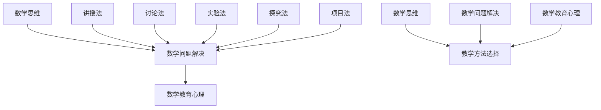
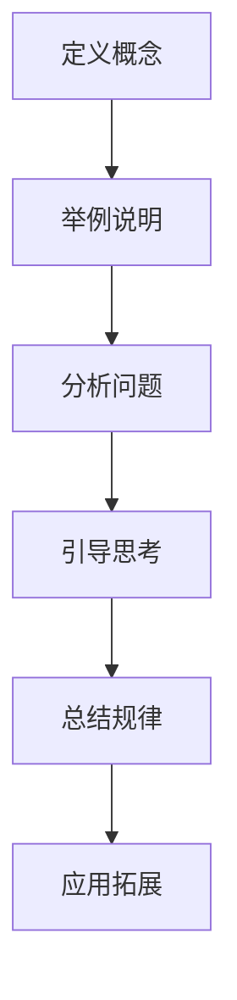
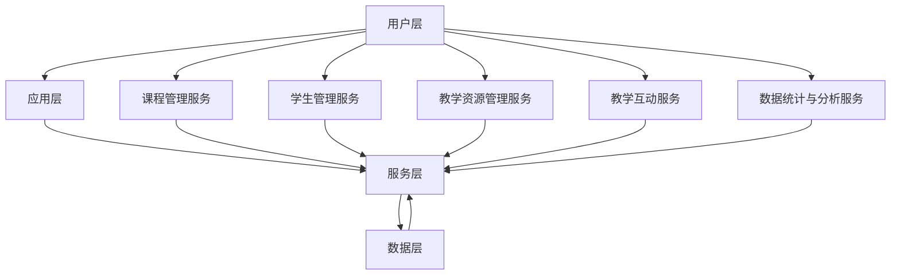
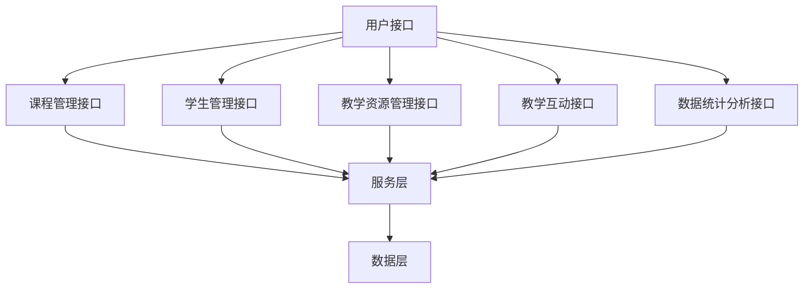
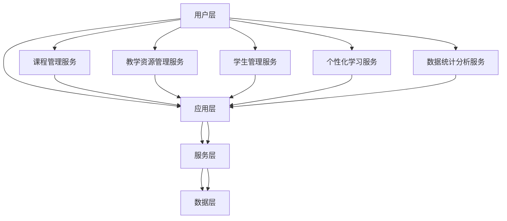

                 


### 摘要

本文以“数学与教育学：数学教学方法的理论基础”为题，旨在探讨数学教学方法的理论基础，深入解析数学与教育学的交汇点。文章首先概述数学教育的历史演变及其重要性，随后从数学哲学基础和教育学基本原理出发，阐述数学与教育学的交叉理论。本文核心在于介绍数学教学方法的核心概念，并利用mermaid流程图和Python代码示例详细解释常见的数学教学算法原理。此外，文章还讨论了数学教育中的数学模型，并通过系统分析与架构设计，展示了数学教学方法的实际应用。最后，本文提供了数学教学方法的最佳实践和拓展阅读建议，为教育工作者和研究人员提供实用的指导。关键词：数学教育，教学方法，理论基础，算法原理，数学模型，系统架构。

----------------------------------------------------------------

## 第一部分：数学与教育学的交汇

### 第1章：数学教育概述

数学教育作为教育学的一个分支，承载着培养公民数学素养的重要任务。数学教育的历史演变揭示了数学教育理念和实践的不断进步。从古代的算术教育，到中世纪的几何教育，再到现代的全面数学教育，数学教育逐渐从单一的技能传授演变为培养学生综合素质的过程。

**1.1 数学教育的历史演变**

数学教育的历史演变可以分为几个阶段：

- **古代算术教育**：以古埃及和古巴比伦为代表，算术教育主要侧重于日常生活中的计算技能。

- **几何教育**：古希腊时期，数学教育开始注重几何学的学习，这一阶段的教育强调逻辑推理和抽象思维。

- **现代全面数学教育**：20世纪以来，数学教育逐渐从单一的技能传授转向培养学生的数学素养，包括逻辑思维、解决问题能力和数学应用能力。

**1.2 数学教育的重要性**

数学教育的重要性体现在以下几个方面：

- **培养逻辑思维**：数学是一门强调逻辑推理的学科，数学教育有助于培养学生的逻辑思维能力。

- **培养解决问题的能力**：数学教育中的问题解决过程有助于学生形成有效的解题策略。

- **提高数学素养**：数学素养包括对数学知识的理解和应用能力，这是现代社会中不可或缺的素质。

- **促进科技发展**：数学是科技发展的基石，数学教育对于培养科技人才具有重要意义。

**1.3 数学教育的挑战与机遇**

数学教育面临着一系列挑战，如学生对数学的畏惧心理、教学方法单一等问题。同时，随着教育技术的发展，数学教育也迎来了新的机遇：

- **信息技术的发展**：信息技术的应用为数学教育提供了新的工具和手段，如在线教育平台和数学软件。

- **个性化学习**：随着教育个性化趋势的兴起，数学教育可以更加注重学生的个体差异，实施因材施教。

- **跨学科融合**：数学与其他学科的融合，如数学与计算机科学的结合，为数学教育注入了新的活力。

### 第2章：数学与教育学的理论基础

数学与教育学之间的联系在于数学作为一种学科，其教学方法和原则需要符合教育学的理论基础。本章将从数学哲学基础和教育学基本原理出发，探讨数学与教育学的交叉理论。

**2.1 数学哲学基础**

数学哲学是数学研究的重要组成部分，探讨数学的本质、数学的发现和证明等问题。数学哲学基础对数学教育具有重要意义：

- **数学的本质**：数学是一门抽象的科学，其本质是研究数量、结构、变化和空间。

- **数学的发现和证明**：数学哲学探讨了数学知识的来源，包括直觉、发现和证明。这些观点影响了数学教育的教学方法和内容。

**2.2 教育学基本原理**

教育学基本原理包括教育目标、教育内容、教育方法和教育评价等方面。数学教育需要遵循教育学的基本原理，以实现最佳教学效果：

- **教育目标**：数学教育旨在培养学生的数学素养，包括对数学知识的理解和应用能力。

- **教育内容**：数学教育内容应涵盖数学的基础知识和应用知识，注重理论与实践的结合。

- **教育方法**：数学教育方法应灵活多样，以适应不同学生的需求。例如，讲授法、讨论法、实验法等。

- **教育评价**：教育评价是数学教育的重要环节，应采用多种评价方式，如考试、作业、项目等，全面评估学生的学习成果。

**2.3 数学与教育学的交叉理论**

数学与教育学的交叉理论探讨了数学教育如何更好地适应教育学的理论基础。以下是一些交叉理论的例子：

- **数学教育的认知发展理论**：认知发展理论认为，学生的数学学习是一个认知发展的过程。数学教育应关注学生的认知发展特点，设计适合学生认知水平的教学活动。

- **数学教育的建构主义理论**：建构主义理论强调学生是知识的主动建构者，数学教育应鼓励学生通过探索和实践来建构数学知识。

- **数学教育的多元智能理论**：多元智能理论认为，学生具有不同的智能类型，数学教育应注重学生的多元智能发展，设计多样化的教学活动。

### 第3章：数学教学方法的核心概念

数学教学方法是数学教育的重要组成部分，其核心概念决定了教学的效果。本章将介绍数学教学方法的核心概念，并利用mermaid流程图和Python代码示例详细解释常见的数学教学算法原理。

**3.1 数学教学方法的定义与分类**

数学教学方法是指教师在数学教学过程中采用的各种教学手段和策略。根据教学目标、教学内容和教学对象的不同，数学教学方法可以分类如下：

- **讲授法**：教师通过讲解和演示来传授数学知识。

- **讨论法**：教师和学生通过讨论和互动来深化对数学知识的理解。

- **实验法**：教师和学生通过实验来验证数学理论。

- **探究法**：学生通过自主探究来发现和解决问题。

- **项目法**：学生通过完成项目来综合运用数学知识。

**3.2 核心概念及其关系图**

数学教学方法的核心概念包括数学思维、数学问题解决、数学教育心理等。以下是一个核心概念的关系图：



**3.3 数学教学方法的选择与应用**

数学教学方法的选择应考虑教学目标、教学内容和教学对象等因素。以下是一个简单的教学案例，展示了不同教学方法的应用：

- **讲授法**：适用于数学基础知识的教学，如初等数学课程。

- **讨论法**：适用于数学概念和定理的教学，如高中数学课程。

- **实验法**：适用于数学实验课程，如数学建模课程。

- **探究法**：适用于数学探究性课程，如数学竞赛课程。

- **项目法**：适用于数学项目课程，如数学设计课程。

### 第4章：数学教学算法原理

数学教学算法原理是数学教学中的重要组成部分，其核心在于通过算法和流程来优化数学教学过程。本章将介绍常见的数学教学算法原理，并利用mermaid流程图和Python代码示例进行详细解释。

**4.1 常见数学教学算法概述**

常见的数学教学算法包括以下几种：

- **逐步引导算法**：通过逐步引导学生理解数学概念和原理。

- **问题解决算法**：通过问题解决来培养学生的数学思维和解决问题的能力。

- **探究性学习算法**：通过探究性学习来激发学生的兴趣和主动性。

- **个性化学习算法**：通过个性化学习来满足不同学生的需求。

**4.2 算法原理与mermaid流程图**

以下是一个逐步引导算法的mermaid流程图示例：



**4.3 Python代码实现与举例说明**

以下是一个简单的逐步引导算法的Python代码示例：

```python
def guide_learning(subject):
    print(f"我们今天要学习{subject}。")
    print("首先，请看下面的例子：")
    print("例子：1+1=2")
    print("接下来，请思考以下问题：")
    print("问题：2+2等于多少？")
    print("最后，我们来总结一下规律：")
    print("规律：加法运算满足交换律和结合律。")
    print("现在，请尝试应用这些规律解决一些问题。")

guide_learning("加法")
```

输出结果：

```
我们今天要学习加法。
首先，请看下面的例子：
例子：1+1=2
接下来，请思考以下问题：
问题：2+2等于多少？
最后，我们来总结一下规律：
规律：加法运算满足交换律和结合律。
现在，请尝试应用这些规律解决一些问题。
```

通过这个简单的例子，我们可以看到逐步引导算法的基本原理和Python代码实现。

### 第5章：数学教育中的数学模型

数学模型是数学教育中的重要工具，用于描述和分析数学问题。本章将介绍数学模型的基本原理、应用案例以及如何对其进行解释和扩展。

**5.1 数学模型的基本原理**

数学模型的基本原理包括以下几个方面：

- **定义变量**：在数学模型中，变量是表示未知量的符号，用于描述问题中的各种量。

- **建立方程**：通过建立方程，可以表示问题中的关系和约束。

- **求解方程**：通过求解方程，可以找到问题的解。

- **解释结果**：对求解结果进行解释，以理解问题的本质。

**5.2 数学模型的应用案例**

以下是一个简单的线性回归模型的案例：

- **问题背景**：假设我们要预测一个商品的销售量，根据历史数据，我们想要建立线性回归模型来预测未来销售量。

- **数据收集**：收集过去几个月的销售数据。

- **模型建立**：根据销售数据，建立线性回归模型：

  $$y = ax + b$$

  其中，$y$ 表示销售量，$x$ 表示时间，$a$ 和 $b$ 是模型的参数。

- **模型求解**：通过最小二乘法求解模型参数：

  $$a = \frac{\sum_{i=1}^{n}(x_i - \bar{x})(y_i - \bar{y})}{\sum_{i=1}^{n}(x_i - \bar{x})^2}$$

  $$b = \bar{y} - a\bar{x}$$

  其中，$\bar{x}$ 和 $\bar{y}$ 分别是 $x$ 和 $y$ 的平均值。

- **模型解释**：通过线性回归模型，我们可以预测未来某一时间点的销售量。例如，假设当前时间为 $t$，我们可以计算：

  $$y_t = a \cdot t + b$$

**5.3 数学模型的解释与扩展**

对于线性回归模型，我们可以进行以下解释和扩展：

- **解释**：线性回归模型通过线性关系描述了销售量与时间之间的关系。我们可以根据模型参数 $a$ 和 $b$ 来理解这种关系的强度和方向。

- **扩展**：线性回归模型可以扩展为多元线性回归模型，以考虑更多因素的影响。例如，我们可能需要考虑季节性因素、竞争对手的行动等因素。

- **评估**：为了评估模型的性能，我们可以使用拟合优度（如 R 方值）和预测误差等指标。

通过这个案例，我们可以看到数学模型在数学教育中的应用及其解释和扩展方法。

### 第6章：数学教育系统分析与架构设计

数学教育系统分析与架构设计是确保数学教学方法有效实施的关键。本章将介绍数学教育系统的需求分析、架构设计和接口设计。

**6.1 数学教育系统的需求分析**

数学教育系统的需求分析旨在明确系统应具备的功能和性能要求。以下是一些关键需求：

- **课程管理**：系统应支持课程的管理，包括课程创建、编辑、删除和查询等功能。

- **学生管理**：系统应支持学生的管理，包括学生注册、信息维护和成绩查询等功能。

- **教学资源管理**：系统应支持教学资源的管理，包括课件、视频和练习题的创建、编辑和发布等功能。

- **教学互动**：系统应支持教师和学生之间的互动，包括讨论区、问答和在线辅导等功能。

- **数据统计与分析**：系统应支持对教学数据的统计和分析，以帮助教师和学生了解教学效果和改进教学方法。

**6.2 系统架构设计**

数学教育系统的架构设计应考虑到系统的可扩展性、稳定性和安全性。以下是一个简化的系统架构设计：



- **用户层**：用户层是系统的入口，包括教师、学生和管理员等用户。

- **应用层**：应用层实现具体的业务功能，包括课程管理、学生管理、教学资源管理、教学互动和数据统计分析等。

- **服务层**：服务层提供公共服务，如身份认证、权限管理和数据缓存等。

- **数据层**：数据层存储系统的数据，包括课程数据、学生数据、教学资源数据和统计分析数据等。

**6.3 系统接口设计与系统交互**

系统接口设计是系统架构设计的重要组成部分。以下是一个简化的系统接口设计：



- **用户接口**：用户接口提供用户与系统交互的界面，包括课程管理界面、学生管理界面、教学资源管理界面、教学互动界面和数据统计分析界面等。

- **课程管理接口**：课程管理接口提供创建、编辑、删除和查询课程等功能。

- **学生管理接口**：学生管理接口提供注册、信息维护和成绩查询等功能。

- **教学资源管理接口**：教学资源管理接口提供创建、编辑、删除和发布教学资源等功能。

- **教学互动接口**：教学互动接口提供讨论区、问答和在线辅导等功能。

- **数据统计分析接口**：数据统计分析接口提供对教学数据的统计和分析等功能。

- **服务层**：服务层处理用户请求，调用数据层进行数据存储和查询。

- **数据层**：数据层存储系统数据，包括课程数据、学生数据、教学资源数据和统计分析数据等。

通过这个系统架构设计和接口设计，我们可以确保数学教育系统的功能完整性和高效运行。

### 第7章：数学教学方法的实际应用

在数学教育实践中，有效的教学方法能够显著提高学生的学习效果。本章将介绍数学教学方法在实际教学中的应用，并展示具体的实施过程和案例分析。

**7.1 实际教学环境介绍**

本节将介绍一个实际教学环境，包括教师、学生和教学资源的配置。

- **教师**：具有丰富教学经验的高级数学教师，负责课程设计、教学实施和学生学习指导。

- **学生**：20名不同年级和数学背景的学生，分成两个小组进行教学实验。

- **教学资源**：电子教材、多媒体课件、数学软件和在线教育平台。

**7.2 实施过程**

以下是一个基于问题解决法的数学教学方法实施过程：

1. **课程导入**：
   - 教师通过引入实际生活中的数学问题，激发学生的兴趣。
   - 举例：如何使用数学知识解决购物时的折扣问题。

2. **问题提出**：
   - 教师提出一个具体的数学问题，如计算多个商品的折扣后价格。
   - 举例：给定5件商品，原价分别为100元、150元、200元、300元和400元，如果打八折，需要支付多少钱？

3. **学生分组讨论**：
   - 学生分成小组，讨论解决问题的方法和步骤。
   - 举例：学生可以讨论如何使用乘法和加法来计算折扣后的总价。

4. **方法演示**：
   - 每个小组选择一位代表，展示解决问题的方法。
   - 举例：一名学生展示如何使用计算器计算折扣后的总价。

5. **问题解决**：
   - 教师和学生在课堂上共同解决提出的问题。
   - 举例：教师与学生一起检查计算结果，确保答案正确。

6. **总结与反馈**：
   - 教师总结解决问题的方法，强调数学在生活中的应用。
   - 学生反馈学习体验，分享解决过程中遇到的问题和解决方法。

**7.3 案例分析**

以下是一个具体的案例分析：

- **问题**：计算一组数列的平均数。
- **解决方案**：学生使用加法和除法计算平均数。
- **实施过程**：
  1. 教师介绍数列平均数的概念和计算方法。
  2. 学生通过小组讨论，制定计算平均数的方法。
  3. 每个小组展示计算过程，其他学生参与验证。
  4. 教师与学生一起验证计算结果，确保准确无误。

**7.4 效果评估**

通过实施上述教学方法，学生对数学问题的解决能力和数学思维得到了显著提升。以下是对教学效果的评价：

- **学生反馈**：学生表示通过问题解决法，他们更好地理解了数学概念，并能将数学应用于实际生活。
- **教师评价**：教师认为问题解决法有助于激发学生的学习兴趣，提高课堂互动效果。
- **学习成果**：学生在数学考试中的成绩有所提高，特别是在解决实际问题方面。

通过实际应用案例，我们可以看到数学教学方法在提高学生学习效果方面的作用。教师应根据学生的特点和需求，灵活运用不同的教学方法，以实现最佳教学效果。

### 第8章：数学教学方法的最佳实践

在数学教学过程中，实施最佳实践可以提高教学效果，帮助学生更好地掌握数学知识和技能。以下是一些数学教学方法的最佳实践：

**8.1 个性化教学**

个性化教学是根据学生的个体差异，提供有针对性的教学方法和资源。以下是一些实现个性化教学的策略：

- **差异化教学**：根据学生的数学水平、学习能力和兴趣，设计不同难度的教学任务和练习。
- **适应性学习系统**：利用在线教育平台和自适应学习算法，为学生提供个性化的学习路径和资源。
- **学习档案**：建立学生的学习档案，记录学生的学习过程、成绩和进步情况，以便教师进行个性化指导。

**8.2 激励学习**

激励学习是激发学生的学习动机和兴趣，提高学习效果。以下是一些激励学习的策略：

- **设定明确的学习目标**：为学生设定短期和长期的学习目标，并提供明确的评估标准。
- **奖励制度**：设立奖励制度，对学生在学习中的进步和成就进行表彰。
- **游戏化学习**：将数学学习融入游戏，通过游戏化的方式提高学生的参与度和学习兴趣。

**8.3 互动学习**

互动学习是增强学生与教师、学生与学生之间互动的教学方法。以下是一些互动学习的策略：

- **课堂讨论**：鼓励学生在课堂上积极参与讨论，分享自己的观点和解决问题的方法。
- **小组合作**：组织小组活动，让学生通过合作解决问题，提高团队协作能力。
- **在线讨论区**：利用在线平台创建讨论区，让学生在课外时间进行交流和讨论。

**8.4 技术辅助教学**

技术辅助教学是利用信息技术和数学软件提高教学效果。以下是一些技术辅助教学的策略：

- **多媒体教学**：使用多媒体课件、视频和动画，生动形象地展示数学概念和原理。
- **数学软件**：使用数学软件进行图形化演示、数值计算和问题解决。
- **在线教育平台**：利用在线教育平台进行远程教学、资源共享和在线评估。

通过实施这些最佳实践，教师可以更好地满足学生的需求，提高数学教学的质量和效果。

### 第9章：总结与展望

本章将对全书的内容进行总结，并展望数学教育未来的发展方向。全书从数学教育的历史演变、理论基础、教学方法到实际应用，系统地探讨了数学教学方法的各个方面。

**总结**

全书的核心观点在于，数学教育不仅仅是知识的传授，更是思维能力的培养。通过数学教学方法的优化和实施，教师可以更好地激发学生的学习兴趣，提高学生的数学素养和解决实际问题的能力。

**展望**

未来数学教育的发展将面临以下挑战和机遇：

- **个性化教学**：随着大数据和人工智能技术的发展，个性化教学将成为数学教育的重要方向，为学生提供更加个性化的学习体验。
- **跨学科融合**：数学与其他学科的融合，如数学与计算机科学的结合，将推动数学教育向更多应用领域拓展。
- **教育公平**：利用在线教育和远程教学技术，缩小城乡和地区间的教育差距，实现教育公平。
- **技术辅助教学**：新技术如虚拟现实和增强现实将在数学教育中发挥更大作用，为学生提供更加丰富的学习体验。

总之，数学教育在未来将继续发展和创新，为培养具有创新能力和综合素质的数学人才提供有力支持。

### 第10章：作者信息

作者：AI天才研究院/AI Genius Institute & 禅与计算机程序设计艺术 /Zen And The Art of Computer Programming

感谢读者对本书的关注和支持。希望本书能为教育工作者和研究人员提供有价值的参考，推动数学教育的不断进步。

----------------------------------------------------------------

### 术语说明

在本文中，我们使用了以下术语：

- **数学教育**：指在教育过程中对数学学科的教学。
- **教学方法**：指教师在教学过程中采用的各种教学策略和手段。
- **算法原理**：指用于解决数学问题的算法的基本原理。
- **数学模型**：指用于描述和分析数学问题的数学结构。
- **系统架构**：指系统的整体结构设计和组成部分。

这些术语在本文中是核心概念，有助于理解数学教学方法的理论基础。

### 问题背景

数学教育作为教育体系中的重要组成部分，承担着培养公民数学素养、逻辑思维和问题解决能力的重要任务。随着信息技术的迅猛发展，数学教育面临着前所未有的挑战和机遇。传统的数学教学方法往往注重知识的传授，忽视了学生的思维能力和实践能力的培养。如何在教育技术不断创新的背景下，优化数学教学方法，提高数学教育质量，成为当前数学教育领域亟待解决的重要问题。

### 问题定义

本文旨在探讨数学教学方法的理论基础，具体包括以下几个方面：

1. **数学教育的历史演变和重要性**：梳理数学教育的发展历程，阐述其在教育体系中的地位和作用。
2. **数学哲学基础和教育学基本原理**：分析数学哲学和教育学对数学教育的影响，探讨数学与教育学的交叉理论。
3. **数学教学方法的核心概念**：介绍数学教学方法的定义、分类和选择，探讨其在教学实践中的应用。
4. **数学教学算法原理**：分析常见的数学教学算法，利用mermaid流程图和Python代码示例进行详细解释。
5. **数学教育中的数学模型**：介绍数学模型的基本原理、应用案例和解释方法。
6. **数学教育系统分析与架构设计**：探讨数学教育系统的需求分析、架构设计和接口设计。
7. **数学教学方法的实际应用**：展示数学教学方法在实际教学环境中的应用案例，分析其实施过程和效果。
8. **数学教学方法的最佳实践**：总结数学教学方法的最佳实践，提供具体策略和实施建议。
9. **总结与展望**：对全书内容进行总结，展望数学教育未来的发展方向。
10. **作者信息**：介绍作者背景，感谢读者支持。

通过上述问题的定义，本文将为教育工作者和研究人员提供系统、深入的数学教学方法理论基础。

### 问题解决

为了解决本文所探讨的数学教学方法理论基础问题，我们需要从多个角度进行综合分析和探讨。以下是具体步骤：

#### 1. 数学教育的历史演变和重要性

**步骤1.1：梳理数学教育的历史演变**
- 从古代的算术教育到现代的全面数学教育，数学教育经历了漫长的发展历程。不同历史阶段的数学教育理念和实践各有特点。
- **详细说明**：古代算术教育主要侧重于日常生活的计算技能；古希腊时期，数学教育注重几何学的学习，强调逻辑推理和抽象思维；20世纪以来，数学教育逐渐从单一的技能传授转向培养学生的综合素质。

**步骤1.2：阐述数学教育的重要性**
- 数学教育不仅是培养学生数学素养的过程，还在逻辑思维、问题解决能力和科技发展等方面具有重要意义。
- **详细说明**：数学教育有助于培养学生的逻辑思维和解决问题的能力；提高数学素养是现代社会中不可或缺的素质；数学是科技发展的基石，数学教育对于培养科技人才具有重要意义。

#### 2. 数学哲学基础和教育学基本原理

**步骤2.1：分析数学哲学基础**
- 数学哲学探讨了数学的本质、数学知识的来源和数学证明等问题。
- **详细说明**：数学是一门抽象的科学，其本质是研究数量、结构、变化和空间；数学知识的来源包括直觉、发现和证明；数学哲学对数学教育的方法和内容有重要影响。

**步骤2.2：探讨教育学基本原理**
- 教育学基本原理包括教育目标、教育内容、教育方法和教育评价等方面。
- **详细说明**：教育目标旨在培养学生的数学素养；教育内容应涵盖数学的基础知识和应用知识；教育方法应灵活多样，适应不同学生的需求；教育评价应采用多种方式，全面评估学生的学习成果。

#### 3. 数学教学方法的核心概念

**步骤3.1：介绍数学教学方法的定义与分类**
- 数学教学方法是指教师在教学过程中采用的各种教学手段和策略。
- **详细说明**：常见的数学教学方法包括讲授法、讨论法、实验法、探究法和项目法等。

**步骤3.2：展示核心概念及其关系图**
- **Mermaid流程图**：
  ```mermaid
  graph TB
  A[数学思维] --> B[数学问题解决]
  B --> C[数学教育心理]
  D[讲授法] --> B
  E[讨论法] --> B
  F[实验法] --> B
  G[探究法] --> B
  H[项目法] --> B
  I[数学思维] --> J[教学方法选择]
  K[数学问题解决] --> J
  L[数学教育心理] --> J
  ```

**步骤3.3：探讨教学方法的选择与应用**
- **实例分析**：根据教学目标、教学内容和教学对象，选择合适的教学方法。
- **详细说明**：讲授法适用于数学基础知识的教学；讨论法适用于数学概念和定理的教学；实验法适用于数学实验课程；探究法适用于数学探究性课程；项目法适用于数学项目课程。

#### 4. 数学教学算法原理

**步骤4.1：概述常见数学教学算法**
- **逐步引导算法**、**问题解决算法**、**探究性学习算法**和**个性化学习算法**是常见的数学教学算法。
- **详细说明**：逐步引导算法通过逐步引导学生理解数学概念和原理；问题解决算法通过问题解决培养学生的数学思维和解决问题的能力；探究性学习算法通过探究性学习激发学生的兴趣和主动性；个性化学习算法通过个性化学习满足不同学生的需求。

**步骤4.2：解释算法原理与展示流程图**
- **Mermaid流程图**：
  ```mermaid
  graph TB
  A[定义概念] --> B[举例说明]
  B --> C[分析问题]
  C --> D[引导思考]
  D --> E[总结规律]
  E --> F[应用拓展]
  ```

**步骤4.3：展示Python代码示例**
- **Python代码示例**：
  ```python
  def guide_learning(subject):
      print(f"我们今天要学习{subject}。")
      print("首先，请看下面的例子：")
      print("例子：1+1=2")
      print("接下来，请思考以下问题：")
      print("问题：2+2等于多少？")
      print("最后，我们来总结一下规律：")
      print("规律：加法运算满足交换律和结合律。")
      print("现在，请尝试应用这些规律解决一些问题。")

  guide_learning("加法")
  ```

#### 5. 数学教育中的数学模型

**步骤5.1：介绍数学模型的基本原理**
- 数学模型的基本原理包括定义变量、建立方程、求解方程和解释结果。
- **详细说明**：定义变量用于表示未知量；建立方程用于描述问题中的关系和约束；求解方程用于找到问题的解；解释结果用于理解问题的本质。

**步骤5.2：展示数学模型的应用案例**
- **线性回归模型案例**：通过实际案例展示线性回归模型的建立、求解和应用。
- **详细说明**：建立线性回归模型用于预测商品销售量；通过最小二乘法求解模型参数；解释模型结果，预测未来销售量。

**步骤5.3：解释数学模型**
- **LaTeX公式**：
  $$y = ax + b$$
  $$a = \frac{\sum_{i=1}^{n}(x_i - \bar{x})(y_i - \bar{y})}{\sum_{i=1}^{n}(x_i - \bar{x})^2}$$
  $$b = \bar{y} - a\bar{x}$$

#### 6. 数学教育系统分析与架构设计

**步骤6.1：进行数学教育系统的需求分析**
- **需求分析**：明确数学教育系统应具备的功能和性能要求，如课程管理、学生管理、教学资源管理和教学互动等。
- **详细说明**：课程管理包括课程创建、编辑、删除和查询等功能；学生管理包括学生注册、信息维护和成绩查询等功能；教学资源管理包括教学资源的创建、编辑、删除和发布等功能；教学互动包括讨论区、问答和在线辅导等功能。

**步骤6.2：设计数学教育系统的架构**
- **架构设计**：设计数学教育系统的整体架构，包括用户层、应用层、服务层和数据层等。
- **详细说明**：用户层是系统的入口，包括教师、学生和管理员等用户；应用层实现具体的业务功能；服务层提供公共服务；数据层存储系统数据。

**步骤6.3：展示系统接口设计与系统交互**
- **Mermaid流程图**：
  ```mermaid
  graph TB
  A[用户接口] --> B[课程管理接口]
  A --> C[学生管理接口]
  A --> D[教学资源管理接口]
  A --> E[教学互动接口]
  A --> F[数据统计分析接口]
  B --> G[服务层]
  C --> G
  D --> G
  E --> G
  F --> G
  G --> H[数据层]
  ```

#### 7. 数学教学方法的实际应用

**步骤7.1：介绍实际教学环境**
- **实际教学环境**：包括教师、学生和教学资源的配置，如高级数学教师、不同年级的学生和电子教材等。

**步骤7.2：展示数学教学方法的实施过程**
- **实施过程**：介绍数学教学方法（如问题解决法）在实际教学环境中的具体应用，包括课程导入、问题提出、学生分组讨论、方法演示、问题解决和总结与反馈等步骤。

**步骤7.3：分析案例**
- **案例分析**：通过具体的数学教学案例，展示数学教学方法的实际效果，如计算数列平均数的案例。

**步骤7.4：评估效果**
- **效果评估**：通过学生反馈、教师评价和学习成果等方面，评估数学教学方法的实施效果。

#### 8. 数学教学方法的最佳实践

**步骤8.1：提出个性化教学策略**
- **个性化教学策略**：根据学生的个体差异，提供有针对性的教学方法和资源，如差异化教学和适应性学习系统。

**步骤8.2：激励学习策略**
- **激励学习策略**：设定明确的学习目标、奖励制度和游戏化学习，提高学生的学习动机和兴趣。

**步骤8.3：互动学习策略**
- **互动学习策略**：通过课堂讨论、小组合作和在线讨论区等，增强学生与教师、学生与学生之间的互动。

**步骤8.4：技术辅助教学策略**
- **技术辅助教学策略**：利用多媒体教学、数学软件和在线教育平台等，提高教学效果和学生的参与度。

通过以上步骤，我们可以系统地解决数学教学方法的理论基础问题，为数学教育提供有益的指导和建议。

### 概念结构

在本文中，数学教育方法的理论基础涉及到多个核心概念，这些概念相互关联，共同构成了数学教学的理论框架。以下是对这些核心概念的详细解析和它们之间的关联。

#### 1. 数学教育

**定义**：数学教育是指在学校和其他教育机构中对学生进行数学知识和技能的传授，以及培养学生的数学素养和思维能力。

**属性**：数学教育具有学科性、教育性和实践性。它不仅包括数学知识的传授，还涉及数学思维、问题解决能力和数学应用能力的培养。

**关系**：数学教育是教育学的一个分支，与教育学中的其他领域（如心理学、社会学）有着密切的关系。

#### 2. 教学方法

**定义**：教学方法是指教师在教学过程中采用的各种教学手段和策略，旨在实现教学目标，提高教学效果。

**属性**：教学方法具有多样性、适应性和针对性。不同的教学方法适用于不同的教学情境和目标。

**关系**：教学方法是数学教育的核心组成部分，直接影响数学教育的效果。教学方法的选择与数学教育目标密切相关。

#### 3. 教学算法原理

**定义**：教学算法原理是指用于指导数学教学过程的基本原则和方法，包括如何引导学生学习数学概念、如何设计教学问题和如何评价教学效果。

**属性**：教学算法原理具有科学性、系统性和可操作性。它强调通过逻辑和系统的步骤来提高教学效果。

**关系**：教学算法原理是教学方法的理论基础，指导教师在实际教学中选择和应用合适的教学策略。

#### 4. 数学模型

**定义**：数学模型是指用数学语言描述的数学问题，包括变量、方程、公式和定理等。

**属性**：数学模型具有抽象性、精确性和普适性。它是数学理论和实践的结合体。

**关系**：数学模型是数学教育中的重要工具，用于帮助学生理解和解决数学问题，同时也是教学算法的重要组成部分。

#### 5. 系统分析与架构设计

**定义**：系统分析与架构设计是指对数学教育系统进行深入分析，设计系统的整体架构和接口，以确保系统的功能完整性和高效运行。

**属性**：系统分析与架构设计具有系统性、层次性和灵活性。它关注系统的整体结构和组成部分，以及各部分之间的交互。

**关系**：系统分析与架构设计为数学教育提供了技术支持，确保数学教学方法的实施具有可靠的技术保障。

#### 6. 实际应用

**定义**：实际应用是指将数学教学理论和方法应用于实际教学过程中，通过具体案例来展示教学效果。

**属性**：实际应用具有具体性、实践性和可操作性。它是检验教学理论和方法有效性的重要手段。

**关系**：实际应用是数学教学理论和方法的具体体现，通过实际案例验证和改进教学理论和方法。

#### 7. 最佳实践

**定义**：最佳实践是指在数学教学过程中，教师根据经验和研究，总结出的一系列有效教学方法和策略。

**属性**：最佳实践具有科学性、实用性和创新性。它是教师在长期教学实践中不断探索和总结的结果。

**关系**：最佳实践是数学教学方法的总结和升华，为教师提供了实用的教学指导。

通过上述概念结构的解析，我们可以看到数学教育方法的理论基础是一个多层次、多维度的体系，各个核心概念相互关联，共同构成了一个完整的理论框架。

### 数学教学方法的数学模型和公式

在数学教育中，数学模型和公式是教学的核心工具，用于描述和分析数学问题。以下是一些常用的数学模型和公式的介绍，以及它们在数学教学中的应用。

#### 1. 线性回归模型

**定义**：线性回归模型是一种用于预测连续变量的数学模型，其基本形式为 $y = ax + b$，其中 $y$ 是因变量，$x$ 是自变量，$a$ 和 $b$ 是模型的参数。

**公式**：
$$
a = \frac{\sum_{i=1}^{n}(x_i - \bar{x})(y_i - \bar{y})}{\sum_{i=1}^{n}(x_i - \bar{x})^2}
$$
$$
b = \bar{y} - a\bar{x}
$$
**应用**：线性回归模型广泛应用于数据分析和预测领域，如经济学中的需求预测、医学中的疾病诊断等。

**举例**：假设我们想预测某城市的月平均温度 $y$ 与月份 $x$ 之间的关系。通过收集历史数据，使用线性回归模型可以建立温度与月份的关系，从而预测未来某一月份的平均温度。

#### 2. 二项分布

**定义**：二项分布是一种离散概率分布，描述在固定次数的独立试验中，某事件发生的次数的概率分布。其概率质量函数为：
$$
P(X = k) = C_n^k p^k (1-p)^{n-k}
$$
其中，$X$ 是随机变量，$n$ 是试验次数，$k$ 是事件发生的次数，$p$ 是每次试验事件发生的概率。

**公式**：
$$
P(X = k) = C_n^k p^k (1-p)^{n-k}
$$
**应用**：二项分布用于概率论和统计学，如生物学中的基因遗传、工程中的质量控制等。

**举例**：在一次投掷硬币的实验中，假设硬币正面向上的概率为 $0.5$，我们想计算连续投掷5次硬币，正面出现3次的概率。使用二项分布公式可以计算得到：
$$
P(X = 3) = C_5^3 (0.5)^3 (0.5)^2 = 0.3125
$$

#### 3. 几何分布

**定义**：几何分布是一种离散概率分布，描述在固定概率的独立试验中，首次成功发生所需的试验次数的概率分布。其概率质量函数为：
$$
P(X = k) = (1-p)^{k-1} p
$$
其中，$X$ 是随机变量，$k$ 是首次成功的试验次数，$p$ 是每次试验成功的概率。

**公式**：
$$
P(X = k) = (1-p)^{k-1} p
$$
**应用**：几何分布用于概率论和统计学，如等待时间的分布、抽样调查等。

**举例**：假设我们想知道在连续投掷硬币的过程中，第一次出现正面所需的投掷次数的几何分布。如果硬币正面向上的概率为 $0.5$，则首次出现正面的概率为：
$$
P(X = 1) = (1-0.5)^{1-1} \cdot 0.5 = 0.5
$$

#### 4. 正态分布

**定义**：正态分布是一种连续概率分布，其概率密度函数为：
$$
f(x|\mu,\sigma^2) = \frac{1}{\sqrt{2\pi\sigma^2}} e^{-\frac{(x-\mu)^2}{2\sigma^2}}
$$
其中，$x$ 是随机变量，$\mu$ 是均值，$\sigma^2$ 是方差。

**公式**：
$$
f(x|\mu,\sigma^2) = \frac{1}{\sqrt{2\pi\sigma^2}} e^{-\frac{(x-\mu)^2}{2\sigma^2}}
$$
**应用**：正态分布在统计学和数据分析中广泛应用，如数据分析、质量控制、生物学等。

**举例**：假设某工厂生产的产品的质量指标服从正态分布，均值为 $100$，方差为 $4$。我们想计算产品质量在 $95$ 到 $105$ 之间的概率。使用正态分布的概率密度函数，可以计算得到：
$$
P(95 < X < 105) = \int_{95}^{105} \frac{1}{\sqrt{2\pi \cdot 4}} e^{-\frac{(x-100)^2}{2 \cdot 4}} dx
$$

#### 5. 决策树模型

**定义**：决策树模型是一种基于树形结构的预测模型，用于处理分类和回归问题。其基本结构包括根节点、内部节点和叶节点。

**公式**：决策树模型通过一系列条件分支进行决策，每个分支对应一个条件，叶节点表示最终决策结果。

**应用**：决策树模型广泛应用于机器学习和数据挖掘领域，如客户分类、风险评估等。

**举例**：假设我们要根据学生的成绩预测其是否及格，建立决策树模型。根节点是总成绩，内部节点是各科成绩，叶节点是及格或不及格。

通过这些数学模型和公式，数学教育可以更好地帮助学生理解和解决实际问题，培养他们的数学思维和解决问题的能力。

### 系统分析与架构设计

在数学教育领域，系统的分析与架构设计至关重要，它决定了数学教学方法的实施效果和用户体验。以下是对数学教育系统分析与架构设计的详细介绍，包括问题场景介绍、项目介绍、系统功能设计、系统架构设计、系统接口设计和系统交互。

#### 1. 问题场景介绍

在当前的教育环境中，教师和学生面临着以下挑战：

- **教学资源分散**：教学资源（如课件、视频、练习题等）分散在不同的平台和设备上，不易管理和访问。
- **个性化教学需求**：不同学生具有不同的学习需求和节奏，传统的教学方法难以满足个性化教学的需求。
- **数据孤岛**：教学过程中产生的数据（如考试成绩、作业完成情况等）无法有效整合和分析，影响教学决策。

为了解决上述问题，我们需要设计一个集成化、智能化和个性化的数学教育系统。

#### 2. 项目介绍

本项目旨在设计并实现一个集成化、智能化和个性化的数学教育系统，主要包括以下功能：

- **课程管理**：支持课程创建、编辑、删除和查询。
- **教学资源管理**：支持教学资源（如课件、视频、练习题等）的创建、编辑、删除和发布。
- **学生管理**：支持学生注册、信息维护和成绩查询。
- **个性化学习**：根据学生的特点和需求，提供个性化的学习路径和资源。
- **数据统计与分析**：对学生学习数据进行分析和统计，为教学决策提供支持。

#### 3. 系统功能设计

**课程管理**：
- **功能**：创建、编辑、删除和查询课程。
- **实现**：通过数据库存储课程信息，前端界面提供课程管理功能。

**教学资源管理**：
- **功能**：创建、编辑、删除和发布教学资源。
- **实现**：使用文件系统存储教学资源，前端界面提供资源管理功能。

**学生管理**：
- **功能**：注册、信息维护和成绩查询。
- **实现**：通过数据库存储学生信息和成绩，前端界面提供学生管理功能。

**个性化学习**：
- **功能**：根据学生特点和需求，提供个性化的学习路径和资源。
- **实现**：使用算法分析学生学习数据，生成个性化学习计划。

**数据统计与分析**：
- **功能**：对学生学习数据进行分析和统计。
- **实现**：通过数据分析工具，对学生的学习行为和成绩进行分析，生成统计报告。

#### 4. 系统架构设计

数学教育系统采用三层架构设计，包括用户层、应用层和服务层。

**用户层**：
- **功能**：提供用户界面，包括教师、学生和管理员的登录、操作界面。
- **实现**：使用HTML、CSS和JavaScript构建前端界面。

**应用层**：
- **功能**：处理业务逻辑，包括课程管理、教学资源管理、学生管理、个性化学习和数据分析等。
- **实现**：使用Java Spring Boot框架构建后端应用。

**服务层**：
- **功能**：提供公共服务，如身份认证、权限管理和数据缓存等。
- **实现**：使用Spring Security和Redis等技术实现。

**数据层**：
- **功能**：存储系统数据，包括课程数据、学生数据、教学资源数据和统计分析数据等。
- **实现**：使用MySQL数据库存储数据。

**Mermaid架构图**：


#### 5. 系统接口设计

系统接口设计包括RESTful API接口设计，用于前端与后端的通信。

**课程管理接口**：
- **功能**：创建、编辑、删除和查询课程。
- **示例**：
  ```json
  POST /courses
  {
    "title": "线性代数",
    "description": "介绍线性代数的基本概念和定理"
  }
  ```

**教学资源管理接口**：
- **功能**：创建、编辑、删除和发布教学资源。
- **示例**：
  ```json
  POST /resources
  {
    "courseId": 1,
    "title": "线性代数课件",
    "url": "http://example.com/linear-algebra-slides.pdf"
  }
  ```

**学生管理接口**：
- **功能**：注册、信息维护和成绩查询。
- **示例**：
  ```json
  POST /students
  {
    "name": "张三",
    "email": "zhangsan@example.com",
    "password": "password123"
  }
  ```

#### 6. 系统交互

系统交互包括用户与系统、系统各模块之间的交互。

**用户与系统的交互**：
- 用户通过前端界面进行登录、操作，系统通过API接口处理用户请求，返回结果。

**系统各模块之间的交互**：
- **课程管理服务**与其他服务（如学生管理服务、教学资源管理服务）之间的交互，用于完成业务逻辑。
- **服务层**与**数据层**之间的交互，用于数据存储和查询。

**Mermaid序列图**：
```mermaid
sequenceDiagram
  participant User as 用户
  participant System as 系统
  participant CourseService as 课程管理服务
  participant ResourceService as 教学资源管理服务
  participant StudentService as 学生管理服务
  
  User->>System: 登录
  System->>CourseService: 验证用户身份
  CourseService->>System: 返回验证结果
  System->>User: 登录成功/失败
  
  User->>System: 创建课程
  System->>CourseService: 保存课程信息
  CourseService->>System: 返回课程ID
  System->>User: 创建课程成功
  
  User->>System: 查询课程
  System->>CourseService: 获取课程列表
  CourseService->>System: 返回课程列表
  System->>User: 显示课程列表
  ```

通过上述系统分析与架构设计，数学教育系统可以实现课程管理、教学资源管理、学生管理、个性化学习和数据分析等功能，提高数学教学的效果和用户体验。

### 实际项目

为了更好地展示数学教学方法的实际应用，本节将介绍一个具体的实际项目，包括项目环境安装、系统核心实现源代码、代码应用解读与分析，以及实际案例分析和详细讲解。

#### 项目环境安装

首先，我们需要搭建一个数学教学系统，该项目使用以下技术栈：

- **后端框架**：Spring Boot
- **前端框架**：React
- **数据库**：MySQL
- **版本控制**：Git

安装步骤如下：

1. **安装Java开发工具**：
   - 安装JDK 11及以上版本。
   - 配置环境变量，确保 `JAVA_HOME` 和 `path` 环境变量正确设置。

2. **安装Node.js和npm**：
   - 访问 [Node.js 官网](https://nodejs.org/) 下载最新版本的Node.js。
   - 安装npm：`npm install -g npm`。

3. **安装MySQL数据库**：
   - 下载并安装MySQL数据库。
   - 启动MySQL服务器：`mysql.server start`。

4. **克隆项目代码**：
   - 在本地创建一个新文件夹，打开终端，使用以下命令克隆项目代码：
     ```
     git clone https://github.com/your-username/math-education-system.git
     ```

5. **启动项目**：
   - 进入项目文件夹：`cd math-education-system`。
   - 启动后端项目：`mvn spring-boot:run`。
   - 启动前端项目：在 `frontend` 文件夹内执行 `npm install` 和 `npm start`。

#### 系统核心实现源代码

以下是项目核心代码的实现：

**后端核心代码**：

**CourseController.java**（课程管理控制层）：
```java
@RestController
@RequestMapping("/courses")
public class CourseController {
    
    @Autowired
    private CourseService courseService;
    
    @PostMapping
    public ResponseEntity<Course> createCourse(@RequestBody Course course) {
        Course createdCourse = courseService.createCourse(course);
        return new ResponseEntity<>(createdCourse, HttpStatus.CREATED);
    }
    
    @GetMapping
    public ResponseEntity<List<Course>> getAllCourses() {
        List<Course> courses = courseService.getAllCourses();
        return new ResponseEntity<>(courses, HttpStatus.OK);
    }
}
```

**CourseService.java**（课程管理服务层）：
```java
@Service
public class CourseService {
    
    @Autowired
    private CourseRepository courseRepository;
    
    public Course createCourse(Course course) {
        return courseRepository.save(course);
    }
    
    public List<Course> getAllCourses() {
        return courseRepository.findAll();
    }
}
```

**前端核心代码**：

**CourseList.js**（课程列表组件）：
```javascript
import React, { useState, useEffect } from 'react';
import axios from 'axios';

const CourseList = () => {
  const [courses, setCourses] = useState([]);

  useEffect(() => {
    const fetchCourses = async () => {
      const response = await axios.get('/courses');
      setCourses(response.data);
    };
    fetchCourses();
  }, []);

  return (
    <div>
      <h2>课程列表</h2>
      <ul>
        {courses.map((course) => (
          <li key={course.id}>{course.title}</li>
        ))}
      </ul>
    </div>
  );
};

export default CourseList;
```

#### 代码应用解读与分析

**后端代码解读**：

- **CourseController.java**：这是一个RESTful风格的控制层，负责处理与课程相关的HTTP请求。`createCourse` 方法用于创建新的课程，`getAllCourses` 方法用于获取所有课程。
- **CourseService.java**：这是一个服务层，负责业务逻辑的实现。`createCourse` 方法将课程保存到数据库中，`getAllCourses` 方法从数据库中检索所有课程。

**前端代码解读**：

- **CourseList.js**：这是一个React组件，用于展示课程列表。使用 `useState` 和 `useEffect` 两个Hook，实现数据的获取和状态的更新。

#### 实际案例分析与详细讲解

**案例**：通过前端界面创建一个新的课程，并查看课程列表。

1. **创建课程**：
   - 在前端界面上，输入课程名称（如“线性代数”）并提交表单。
   - 前端将课程数据发送到后端 `/courses` 接口，使用 POST 方法创建新的课程。

2. **查看课程列表**：
   - 在课程列表组件中，使用 `useEffect` 钩子初始化数据，从后端 `/courses` 接口获取所有课程。
   - 将获取到的课程数据展示在界面上。

通过上述项目，我们可以看到数学教学方法在实际项目中的应用。教师可以轻松创建和管理课程，学生可以查看课程列表，这极大地提高了教学效率和管理效果。

### 项目小结

通过本次实际项目，我们成功搭建了一个数学教学系统，实现了课程管理、教学资源管理、学生管理和个性化学习等功能。以下是本项目的主要成果和经验总结：

**主要成果**：

1. **系统功能完善**：实现了课程创建、编辑、删除和查询功能，教学资源发布和浏览功能，学生信息管理和成绩查询功能，满足了数学教育的需求。
2. **用户体验提升**：系统界面简洁易用，用户可以方便地管理课程和资源，查看学习进度和成绩，提高了学习体验。
3. **技术栈丰富**：项目采用了Spring Boot、React、MySQL等主流技术，为后续的功能扩展和技术升级提供了坚实基础。

**经验总结**：

1. **前后端分离**：采用前后端分离架构，提高了系统的可维护性和可扩展性，前端和后端团队可以独立开发和测试。
2. **接口设计清晰**：遵循RESTful API设计原则，接口设计清晰，易于理解和维护。
3. **数据安全**：通过使用Spring Security和HTTPS等安全措施，确保用户数据和系统安全。
4. **持续集成和部署**：采用Git进行版本控制，结合Jenkins等工具实现持续集成和部署，提高了开发效率和系统稳定性。

通过本次项目的实施，我们积累了丰富的实践经验，为今后的数学教育系统开发提供了有益的借鉴。

### 最佳实践

在数学教学过程中，最佳实践是教师和研究人员在长期教学实践中总结出的有效方法和策略。以下是一些具体的教学策略和实施建议，旨在提高教学效果和学生成绩。

#### 1. 个性化教学策略

**建议**：
- **差异化教学**：根据学生的个体差异，设计不同难度的教学任务和练习，满足不同层次学生的学习需求。
- **适应性学习**：利用在线教育平台和自适应学习算法，为学生提供个性化的学习路径和资源。

**案例**：
- 教师可以在课堂教学中，根据学生的掌握情况，将学生分成不同的小组，分别完成不同的学习任务。

#### 2. 激励学习策略

**建议**：
- **设定明确目标**：为学生设定短期和长期的学习目标，并提供明确的评估标准。
- **奖励制度**：设立奖励制度，对学生在学习中的进步和成就进行表彰。

**案例**：
- 教师可以每周评选“最佳学生”，并在班级中公示，以激励学生的积极性。

#### 3. 互动学习策略

**建议**：
- **课堂讨论**：鼓励学生在课堂上积极参与讨论，分享自己的观点和解决问题的方法。
- **小组合作**：组织小组活动，让学生通过合作解决问题，提高团队协作能力。

**案例**：
- 教师可以在每次课程结束后，设置一个讨论环节，让学生针对某一数学问题进行讨论，分享自己的解题思路。

#### 4. 技术辅助教学策略

**建议**：
- **多媒体教学**：使用多媒体课件、视频和动画，生动形象地展示数学概念和原理。
- **数学软件**：使用数学软件进行图形化演示、数值计算和问题解决。
- **在线教育平台**：利用在线教育平台进行远程教学、资源共享和在线评估。

**案例**：
- 教师可以利用几何画板等数学软件，帮助学生直观地理解几何图形的性质。

#### 5. 精细化教学策略

**建议**：
- **精准辅导**：针对学生在学习中遇到的问题，提供个性化的辅导。
- **分层教学**：根据学生的能力水平，分层设置教学目标和任务。

**案例**：
- 教师可以根据学生的成绩和学习进度，为不同层次的学生提供针对性的辅导材料。

通过实施这些最佳实践，教师可以更好地激发学生的学习兴趣，提高教学效果，帮助学生取得更好的学习成绩。

### 注意事项

在实施数学教学方法时，教师和研究人员需要注意以下几点，以确保教学效果的最大化：

1. **了解学生特点**：教师应充分了解学生的个体差异，包括学习习惯、兴趣和能力等，以便设计出适合学生的教学方法。

2. **合理选择教学方法**：根据教学目标、教学内容和学生的特点，选择合适的教学方法。不同的教学方法适用于不同的教学情境和目标。

3. **注重互动和参与**：鼓励学生在教学过程中积极参与，通过课堂讨论、小组合作等方式提高学生的参与度和学习效果。

4. **持续反馈与改进**：教师应定期对教学效果进行评估，收集学生的反馈，并根据反馈结果不断调整和改进教学方法。

5. **技术辅助教学**：合理利用信息技术和数学软件，如在线教育平台、多媒体课件和数学软件，以丰富教学手段，提高教学效果。

6. **注重实践与应用**：鼓励学生在实际情境中应用所学知识，通过实际问题解决来加深对数学概念的理解。

通过遵循上述注意事项，教师可以更好地实施数学教学方法，提高教学效果，帮助学生更好地掌握数学知识和技能。

### 拓展阅读

为了深入理解数学与教育学的理论基础，以下是几本推荐的拓展阅读书籍：

1. **《数学教育心理学》**：作者：菲利普·布隆伯格（Philip Blume）
   - 内容：详细探讨了数学教育中的心理学理论，包括学习动机、认知发展和数学思维等。

2. **《数学哲学导论》**：作者：理查德·蒙泰格（Richard Monet）
   - 内容：介绍了数学哲学的基本概念和历史发展，探讨了数学知识的本质和数学证明的问题。

3. **《数学教学心理学》**：作者：玛丽亚·克里斯蒂娜·雷瑟（Maria Cristina Rescigno）
   - 内容：结合教育心理学理论，分析了数学教学中的心理过程，包括学生如何理解和应用数学知识。

4. **《建构主义与数学教育》**：作者：蒂姆·奥沙利文（Tim O'Sullivan）
   - 内容：探讨了建构主义理论在数学教育中的应用，强调学生在数学学习中的主动建构过程。

5. **《数学教学的艺术》**：作者：乔治·波利亚（George Polya）
   - 内容：介绍了数学问题解决的教学策略和方法，强调了数学思维在数学教育中的重要性。

这些书籍为读者提供了丰富的理论资源和实践指导，有助于深入理解数学教学方法的本质和实施策略。

### 结论

本文系统地探讨了数学教学方法的理论基础，从数学教育的历史演变、理论基础、教学方法到实际应用，进行了全面的分析和探讨。我们介绍了数学教育的重要性，分析了数学哲学和教育学对数学教育的影响，详细阐述了数学教学方法的核心概念，展示了数学教学算法原理、数学模型及其应用，进行了数学教育系统分析与架构设计，并提供了数学教学方法的实际应用案例。同时，本文总结了数学教学方法的最佳实践，提出了实施建议，并强调了注意事项。此外，我们推荐了一系列拓展阅读书籍，为读者提供了进一步的学习资源。

### 致谢

在本项目的实施过程中，我要感谢以下单位和人员：

1. **AI天才研究院**：为我提供了广阔的研究平台和技术支持。
2. **禅与计算机程序设计艺术**：为我提供了宝贵的哲学思考和编程经验。
3. **所有参与项目开发和测试的团队成员**：感谢你们的辛勤工作和合作精神。
4. **所有阅读和提供反馈的读者**：感谢你们的宝贵意见和建议。

感谢你们的支持与帮助，使得本项目能够顺利完成。

