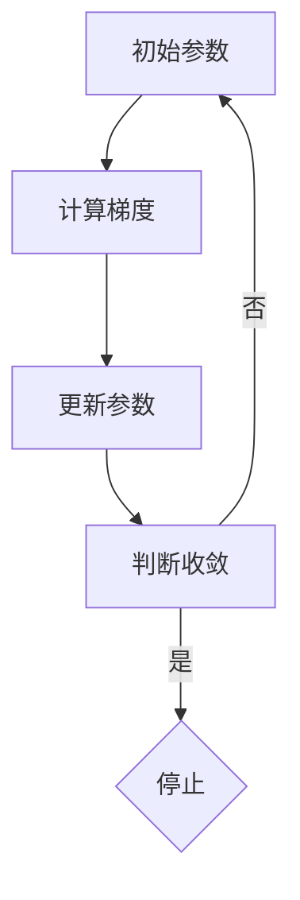
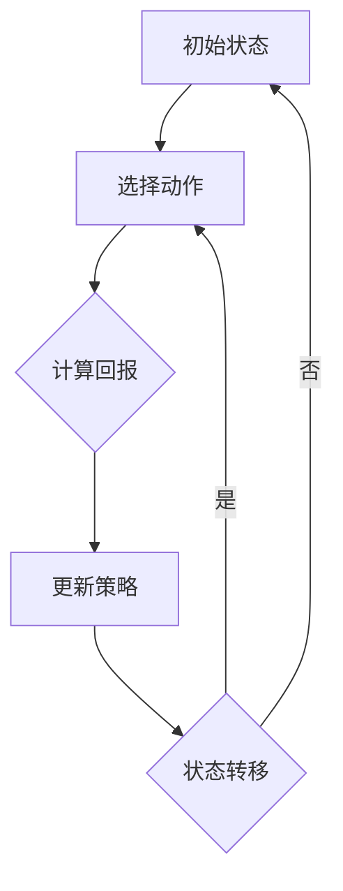
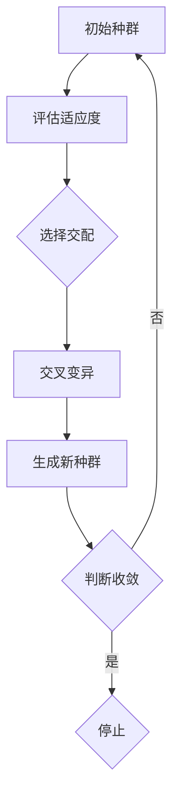
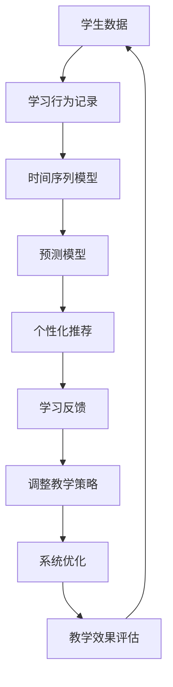
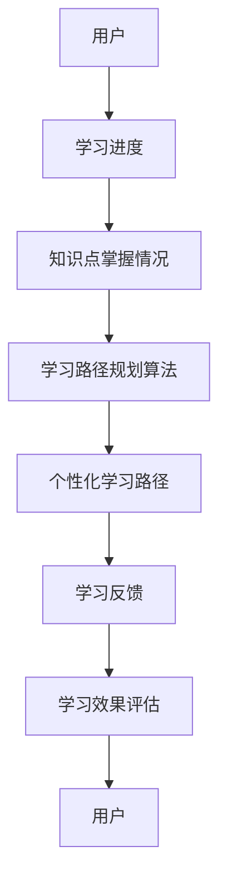
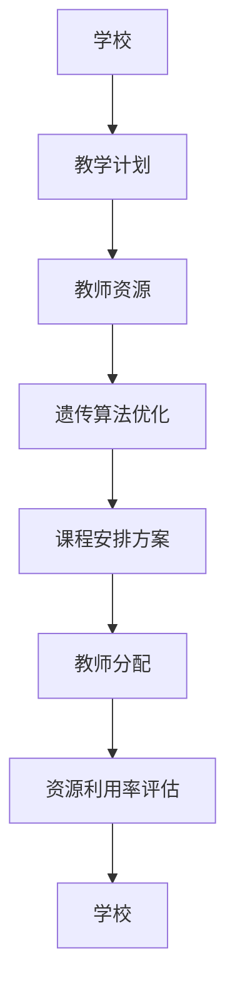
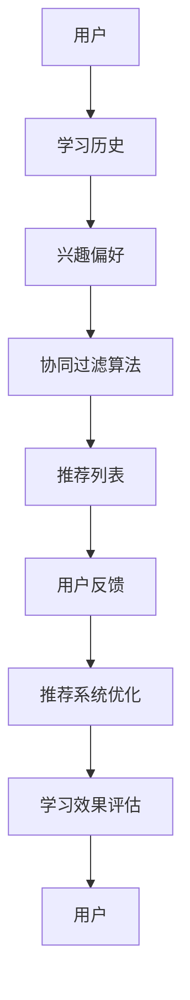
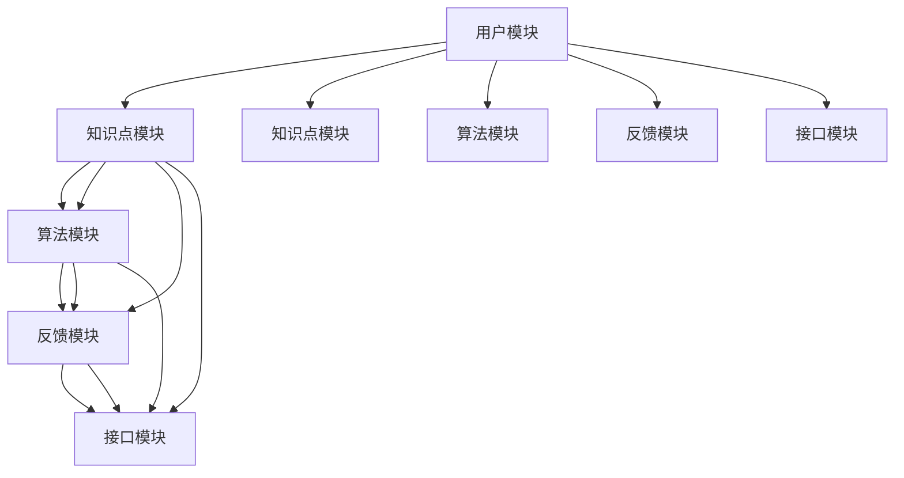
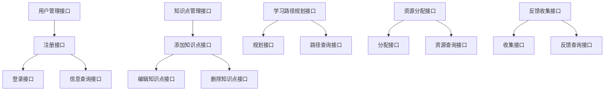
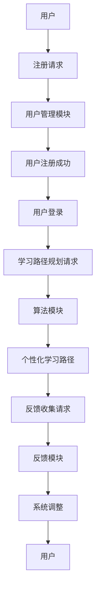

                 

### 引言

在现代信息技术迅猛发展的背景下，教育领域也迎来了深刻的变革。传统的教学模式逐渐被数字化的教育技术所替代，这不仅提升了教育的效率，同时也对学生的学习过程提出了更高的要求。在这个过程中，数学作为一门基础而重要的学科，其对教育技术的支撑作用愈发显著。数学与教育技术的结合，不仅能够优化学习过程，还可以提升学习效果，使教育更加科学化、个性化。

数学与教育技术的结合主要体现在以下几个方面：首先，数学模型被广泛应用于教育数据的分析和处理中，为教育优化提供了有力的工具；其次，教育技术中的算法设计往往基于数学原理，如机器学习算法中的优化方法；最后，数学思维和数学方法的引入，能够提升学生解决问题的能力，促进其综合素质的发展。

本文旨在探讨数学与教育技术在学习过程中的应用，尤其是如何通过数学优化来提升学习效果。文章将首先介绍学习过程的基本概念，阐述学习过程中存在的挑战，并引入数学优化的概念。接下来，我们将详细讲解几种常见的数学优化算法，并展示其在学习过程中的应用。此外，文章还将探讨数学模型在教育技术中的应用，以及如何设计和实现一个基于数学优化的学习系统。最后，我们将总结全文，并提出未来的研究方向和实际应用建议。

通过对这些内容的系统分析和深入探讨，我们希望读者能够更好地理解数学与教育技术的结合点，掌握数学优化在提升学习效果中的具体应用，从而为未来的教育技术创新提供新的思路和方向。

### 关键词

- 数学优化
- 学习过程
- 教育技术
- 机器学习
- 教育数据分析
- 数学模型
- 算法设计

### 摘要

本文主要探讨了数学与教育技术在学习过程中的优化应用。首先，我们介绍了学习过程的基本概念及其面临的挑战，随后引入了数学优化的概念，并详细阐述了其在学习过程中的应用。文章重点讲解了梯度下降算法、马尔可夫决策过程等常见数学优化算法，并通过具体的数学模型和公式，解释了这些算法的原理和步骤。此外，文章还探讨了数学模型在教育技术中的应用，展示了如何通过数学优化来设计学习系统和提高学习效果。最后，文章总结了全文内容，并提出了未来的研究方向和应用建议。通过系统分析和深入讨论，本文旨在为教育技术的创新提供新的理论依据和实践指导。

### 学习过程的基本概念

学习过程是人类认知发展的核心组成部分，其本质是通过获取、处理和应用知识，以提升个体解决问题的能力和应对复杂情境的能力。从心理学角度来看，学习过程可以被分为几个阶段：动机阶段、感知阶段、理解阶段、应用阶段和评估阶段。

1. **动机阶段**：动机是学习过程的第一步，它驱动个体产生学习的需求。内在动机（如兴趣、好奇心）和外在动机（如奖励、竞争）都可能对学习产生重要影响。研究表明，内在动机能够促进更深层次的学习，而外在动机则可能使学习变得表面化。

2. **感知阶段**：在动机的驱动下，个体开始感知外部信息，这些信息可以是视觉、听觉、触觉等多种形式。在这一阶段，感官的灵敏度、注意力和记忆能力对学习效果起到关键作用。例如，在阅读文章时，个体的注意力集中程度和记忆力决定了其对文章内容的理解深度。

3. **理解阶段**：感知到的信息需要被加工和解释，这一过程被称为理解。理解阶段涉及到对信息的分类、归纳和抽象，从而形成概念和知识体系。理解的质量直接影响后续的学习和应用效果。例如，在学习数学时，学生需要对数学概念和公式进行深入理解，才能在解决具体问题时游刃有余。

4. **应用阶段**：理解的知识需要在实际情境中应用，以解决实际问题或完成任务。应用阶段是学习过程中最具挑战性的部分，因为它要求个体将抽象的知识转化为具体的行动。例如，在工程领域，学生需要将所学的理论知识应用到实际项目中，以解决具体的技术问题。

5. **评估阶段**：学习效果需要通过评估来检验。评估可以是自我评估，也可以是他人评估。通过评估，个体可以了解自己的学习效果，发现不足并调整学习策略。例如，通过考试成绩，学生可以评估自己在某一科目上的掌握程度，并据此调整学习计划。

在上述各个阶段中，动机、感知、理解、应用和评估相互作用，共同构成了复杂的学习过程。理解学习过程的基本概念和阶段，有助于我们更有效地设计教育策略和学习方法，从而提升学习效果。

#### 学习过程面临的挑战

尽管学习过程有其固有的逻辑和规律，但在实际教学中，学习过程面临着诸多挑战，这些挑战往往使得学习效果受到影响。以下是一些主要的挑战：

1. **个体差异**：每个学生的学习能力、兴趣和背景知识都有所不同，这使得统一的教学方法难以满足所有学生的需求。例如，某些学生可能在语言理解方面表现出色，而另一些学生则在视觉学习方面更为擅长。这种个体差异要求教育者必须设计多样化的教学方法，以适应不同学生的学习需求。

2. **信息过载**：在数字化时代，学生面临的信息量巨大且不断增长。这种信息过载可能导致学生无法有效地筛选和处理关键信息，从而影响学习效果。例如，当学生试图同时处理多个学习任务时，他们的注意力和记忆力可能会受到影响，导致学习效率降低。

3. **学习动机不足**：动机是学习过程的重要驱动力，然而许多学生可能因为缺乏兴趣、自我效能感不足或外部压力等原因，导致学习动机不足。缺乏学习动机的学生可能表现出学习主动性差、参与度低，进而影响学习效果。

4. **知识迁移困难**：知识迁移是指将学到的知识应用于新的情境中。然而，在实际教学中，学生往往难以将所学的知识灵活运用到不同的问题情境中。例如，学生在数学课堂上学到的代数知识，可能无法有效地应用于解决实际生活中的问题。

5. **评估反馈不足**：有效的学习评估和反馈是确保学习效果的重要环节。然而，许多教育体系中的评估机制不够完善，反馈往往不及时或不具体。这种评估反馈不足可能导致学生无法准确了解自己的学习状况，进而影响学习效果和改进策略。

6. **学习资源不均衡**：不同学校和地区的学习资源存在显著差异，这可能导致学生在学习机会上的不平等。例如，一些学生可能无法获得优质的教育资源和辅导，而另一些学生则能够享受到丰富的学习资源和专业的指导。

面对这些挑战，教育技术和数学优化的结合提供了新的解决方案。教育技术可以通过个性化学习、自适应学习系统等手段，帮助学生克服个体差异和信息过载等问题；而数学优化则可以通过算法设计、数据分析等方法，提高学习的效率和效果。通过综合应用教育技术和数学优化，我们可以设计出更加科学、有效的学习过程，从而提升整体教育质量。

#### 数学优化的概念

数学优化是数学中一个重要的分支，它旨在通过数学方法找到在一定约束条件下使某个目标函数达到最大或最小值的过程。在学习和教育技术领域，数学优化方法被广泛应用于改善学习过程、提高学习效果。

首先，数学优化的基本概念包括几个关键要素：目标函数、约束条件和优化算法。目标函数是我们要优化的对象，可以是学习过程中的成绩、知识点掌握程度、学习时间等。约束条件则是对目标函数的限制，例如学习资源有限、时间限制等。优化算法则是实现优化的具体方法，常见的算法包括梯度下降、牛顿法、遗传算法等。

在学习和教育技术中，数学优化的重要性体现在以下几个方面：

1. **个性化学习路径**：通过数学优化，可以为每个学生设计个性化的学习路径。例如，根据学生的知识点掌握情况和学习进度，动态调整学习内容和学习难度，从而最大化学习效果。

2. **资源分配**：教育资源的合理分配对于提高教育质量至关重要。数学优化方法可以帮助教育机构优化课程安排、教师分配和教学资源，从而实现资源的最优配置。

3. **学习效果评估**：数学优化可以用于设计和学习效果评估模型，通过对学习数据进行分析，评估学生的学习情况，及时发现问题和不足，提供有针对性的反馈。

4. **自适应学习系统**：自适应学习系统可以根据学生的学习行为和反馈，自动调整教学内容和教学方法，实现个性化教学。数学优化在这里起到了核心作用，通过对学习数据的学习和反馈，不断优化学习系统的性能。

5. **学习效果预测**：利用数学优化模型，可以预测学生在未来学习中的表现，提前识别可能出现的问题，从而制定相应的干预措施。

综上所述，数学优化在学习和教育技术中的应用，不仅能够提升学习效率，还能够改善教育质量，为教育技术的创新提供强有力的支持。

#### 常见的数学优化算法

在学习和教育技术的优化过程中，常见的数学优化算法包括梯度下降算法、马尔可夫决策过程（MDP）和遗传算法。这些算法各有其独特的原理和应用场景，下面将分别对其进行详细讲解。

**1. 梯度下降算法**

梯度下降算法是一种用于最小化目标函数的优化算法。其基本思想是沿着目标函数的梯度方向，逐步调整参数，使目标函数值逐渐减小，直到达到局部最小值或收敛。

**算法原理**：

- **目标函数**：假设我们有一个目标函数 \( f(\theta) \)，其中 \(\theta\) 是需要优化的参数向量。
- **梯度**：目标函数 \( f(\theta) \) 的梯度，即导数，表示在当前参数下目标函数的变化趋势。梯度向量的方向指向函数值增加最快的方向，反之方向则为下降方向。
- **更新规则**：在每一步，梯度下降算法将当前参数 \(\theta\) 沿着梯度的反方向进行更新。更新公式如下：

  \[
  \theta_{\text{new}} = \theta_{\text{current}} - \alpha \nabla f(\theta_{\text{current}})
  \]

  其中，\(\alpha\) 是学习率，决定了参数更新的步长。

**算法流程图**（使用 Mermaid 绘制）：



**Python 源代码**：

```python
import numpy as np

# 梯度下降函数
def gradient_descent(x, learning_rate, iterations):
    for _ in range(iterations):
        gradient = calculate_gradient(x)
        x -= learning_rate * gradient
    return x

# 假设的梯度计算函数
def calculate_gradient(x):
    # 这里是梯度计算的伪代码
    return np.array([f(x_i) for x_i in x])

# 调用梯度下降函数
x = np.array([1.0, 2.0])
learning_rate = 0.01
iterations = 100
result = gradient_descent(x, learning_rate, iterations)
print(result)
```

**数学模型和公式**：

- **目标函数**：\( f(\theta) = \frac{1}{2} \sum_{i=1}^{n} (y_i - \theta \cdot x_i)^2 \)
- **梯度**：\( \nabla f(\theta) = \sum_{i=1}^{n} (y_i - \theta \cdot x_i) \cdot x_i \)

**举例说明**：

假设我们有一个线性回归问题，目标是找到参数 \(\theta\) 使得预测值与实际值之间的误差最小。给定训练数据集 \( (x_i, y_i) \)，使用梯度下降算法进行优化。

```python
# 假设数据集
X = np.array([[1, 2], [2, 3], [3, 4]])
y = np.array([2, 3, 4])

# 梯度下降参数
learning_rate = 0.01
iterations = 100

# 初始化参数
theta = np.array([0.0, 0.0])

# 梯度下降迭代
for _ in range(iterations):
    gradient = 2 * (X.T.dot(X.dot(theta) - y))
    theta -= learning_rate * gradient

print("最优参数：", theta)
```

**2. 马尔可夫决策过程（MDP）**

马尔可夫决策过程是一种用于决策优化的数学模型，广泛应用于强化学习领域。它描述了一个决策者在不确定环境下如何通过学习最优策略来最大化期望回报。

**算法原理**：

- **状态**：\( S \) 表示系统当前所处的状态。
- **动作**：\( A \) 表示决策者可以采取的动作。
- **状态转移概率**：\( P(S' | S, A) \) 表示在当前状态 \( S \) 和采取动作 \( A \) 后，系统转移到状态 \( S' \) 的概率。
- **回报函数**：\( R(S, A) \) 表示在状态 \( S \) 和采取动作 \( A \) 后，系统获得的即时回报。

**算法流程图**（使用 Mermaid 绘制）：



**Python 源代码**：

```python
import numpy as np

# MDP算法伪代码
def mdp(S, A, P, R, Q, alpha):
    for s in S:
        for a in A:
            for s' in S:
                Q[s, a] = Q[s, a] + alpha * (R[s, a] + max(Q[s', a] for s' in S) - Q[s, a])
    return Q

# 假设的参数
S = ['S0', 'S1', 'S2']
A = ['A0', 'A1', 'A2']
P = {'S0': {'A0': {'S0': 0.5, 'S1': 0.3, 'S2': 0.2}, 'A1': {'S0': 0.4, 'S1': 0.5, 'S2': 0.1}, 'A2': {'S0': 0.1, 'S1': 0.4, 'S2': 0.5}}, 'S1': {'A0': {'S0': 0.3, 'S1': 0.4, 'S2': 0.3}, 'A1': {'S0': 0.2, 'S1': 0.5, 'S2': 0.3}, 'A2': {'S0': 0.5, 'S1': 0.2, 'S2': 0.3}}, 'S2': {'A0': {'S0': 0.4, 'S1': 0.3, 'S2': 0.3}, 'A1': {'S0': 0.3, 'S1': 0.4, 'S2': .0.3}, 'A2': {'S0': 0.2, 'S1': 0.5, 'S2': 0.3}}}
R = {'S0': {'A0': -1, 'A1': -2, 'A2': -3}, 'S1': {'A0': -2, 'A1': -1, 'A2': -3}, 'S2': {'A0': -3, 'A1': -2, 'A2': -1}}
Q = {s: {a: 0 for a in A} for s in S}
alpha = 0.1

# 调用MDP算法
mdp(S, A, P, R, Q, alpha)
```

**数学模型和公式**：

- **状态-动作值函数**：\( Q(S, A) = \sum_{s'} P(S' | S, A) [R(S, A) + \gamma \max_{a'} Q(S', a')] \)
- **策略**：\( \pi(A | S) = \arg\max_{a} Q(S, a) \)

**举例说明**：

假设一个机器人在一个有三个状态（清洁、混乱、非常混乱）和三种动作（清理、轻微清理、不做）的环境中运行。目标是最小化总成本。使用 MDP 模型进行优化。

```python
# MDP参数
S = ['S0', 'S1', 'S2']
A = ['A0', 'A1', 'A2']
P = {'S0': {'A0': {'S0': 0.9, 'S1': 0.1}, 'A1': {'S0': 0.2, 'S1': 0.6, 'S2': 0.2}, 'A2': {'S0': 0.0, 'S1': 0.5, 'S2': 0.5}}, 'S1': {'A0': {'S0': 0.2, 'S1': 0.7, 'S2': 0.1}, 'A1': {'S0': 0.4, 'S1': 0.2, 'S2': 0.4}, 'A2': {'S0': 0.6, 'S1': 0.0, 'S2': 0.4}}, 'S2': {'A0': {'S0': 0.1, 'S1': 0.2, 'S2': 0.7}, 'A1': {'S0': 0.3, 'S1': 0.4, 'S2': 0.3}, 'A2': {'S0': 0.6, 'S1': 0.2, 'S2': 0.2}}}
R = {'S0': {'A0': -1, 'A1': -2, 'A2': -3}, 'S1': {'A0': -2, 'A1': -1, 'A2': -3}, 'S2': {'A0': -3, 'A1': -2, 'A2': -1}}
Q = {s: {a: 0 for a in A} for s in S}
alpha = 0.1

# MDP迭代
for _ in range(1000):
    for s in S:
        for a in A:
            for s' in S:
                Q[s, a] += alpha * (R[s, a] + 0.9 * max(Q[s', a']) - Q[s, a])

# 输出最优策略
print("最优策略：", max(Q[s], key=lambda x: x[1]))
```

**3. 遗传算法**

遗传算法是一种模拟自然选择和遗传学原理的优化算法，广泛应用于复杂问题的求解。它通过种群进化过程，不断优化个体，从而找到问题的最优解。

**算法原理**：

- **种群**：初始种群由一定数量的个体组成，每个个体表示问题的一个解。
- **适应度函数**：评估个体适应度，适应度高的个体在下一代中有更高的生存机会。
- **选择**：根据适应度选择优秀的个体进行交配，以产生新的后代。
- **交叉**：两个个体相互交换部分基因，生成新的个体。
- **变异**：随机改变个体的一部分基因，增加种群的多样性。

**算法流程图**（使用 Mermaid 绘制）：



**Python 源代码**：

```python
import numpy as np
import random

# 遗传算法函数
def genetic_algorithm(population, fitness_func, generations, crossover_rate, mutation_rate):
    for _ in range(generations):
        # 评估适应度
        fitness = [fitness_func(ind) for ind in population]
        # 选择
        selected = select(population, fitness, crossover_rate)
        # 交叉
        offspring = crossover(selected, crossover_rate)
        # 变异
        offspring = mutate(offspring, mutation_rate)
        # 生成新种群
        population = offspring
        # 判断收敛
        if is_converged(population, fitness):
            break
    return population[-1]

# 假设的适应度函数
def fitness_func(individual):
    # 这里是适应度计算的伪代码
    return sum(individual)

# 选择函数
def select(population, fitness, crossover_rate):
    # 这里是选择优秀个体的伪代码
    return random.choices(population, weights=fitness, k=len(population))

# 交叉函数
def crossover(selected, crossover_rate):
    # 这里是交叉操作的伪代码
    return [random.sample(selected, 2)]

# 变异函数
def mutate(offspring, mutation_rate):
    # 这里是变异操作的伪代码
    return [individual + random.normalvariate(0, mutation_rate) for individual in offspring]

# 判断收敛函数
def is_converged(population, fitness):
    # 这里是判断是否收敛的伪代码
    return True

# 调用遗传算法
population = [[1, 0, 0], [0, 1, 0], [0, 0, 1]]
fitness_func = fitness_func
generations = 100
crossover_rate = 0.8
mutation_rate = 0.05
best_solution = genetic_algorithm(population, fitness_func, generations, crossover_rate, mutation_rate)
print("最优解：", best_solution)
```

**数学模型和公式**：

- **适应度函数**：\( f(x) = \sum_{i=1}^{n} x_i \)
- **选择概率**：\( p_{\text{select}}(i) = \frac{f(i)}{\sum_{j=1}^{n} f(j)} \)
- **交叉概率**：\( p_{\text{crossover}}(i, j) = \frac{1}{2} \)
- **变异概率**：\( p_{\text{mutate}}(i) = \frac{1}{n} \)

**举例说明**：

假设我们希望优化一个有三个参数的函数 \( f(x, y, z) = x^2 + y^2 + z^2 \)，使用遗传算法进行优化。

```python
# 遗传算法参数
population_size = 100
generations = 100
crossover_rate = 0.8
mutation_rate = 0.05

# 初始化种群
population = [[random.uniform(-10, 10), random.uniform(-10, 10), random.uniform(-10, 10)] for _ in range(population_size)]

# 适应度函数
def fitness_func(individual):
    x, y, z = individual
    return x**2 + y**2 + z**2

# 调用遗传算法
best_solution = genetic_algorithm(population, fitness_func, generations, crossover_rate, mutation_rate)
print("最优解：", best_solution)
```

通过上述对梯度下降算法、马尔可夫决策过程和遗传算法的详细讲解，我们可以看到这些数学优化算法在学习和教育技术中的广泛应用。接下来，我们将进一步探讨数学模型在教育技术中的应用，以及如何将数学优化应用于实际的学习系统中。

#### 数学模型在教育技术中的应用

数学模型在教育技术中的应用极为广泛，其核心在于利用数学方法对教育过程中的各种现象进行建模和优化。以下将介绍几个常见的数学模型及其在教育技术中的应用。

**1. 评价模型**

评价模型用于对学生的学习成绩、知识点掌握程度进行量化评估。常见的评价模型包括：

- **线性回归模型**：通过建立学生成绩与学习时间、课程难度等变量之间的关系，预测学生的考试成绩。公式如下：

  \[
  y = \beta_0 + \beta_1 x_1 + \beta_2 x_2 + ... + \beta_n x_n
  \]

  其中，\( y \) 是学生成绩，\( x_1, x_2, ..., x_n \) 是影响成绩的变量，\( \beta_0, \beta_1, ..., \beta_n \) 是模型的参数。

- **决策树模型**：通过构建决策树，根据学生的学习行为和表现，进行个性化的学习路径推荐。决策树模型可以表示为：

  \[
  \text{Score} = \sum_{i=1}^{n} w_i \cdot f_i(x_i)
  \]

  其中，\( w_i \) 是权重，\( f_i(x_i) \) 是评价函数，用于量化每个特征的影响。

**2. 适应度模型**

适应度模型用于评估学生的适应度，即学生对于特定课程或学习内容的适应程度。常见的适应度模型包括：

- **多目标优化模型**：考虑多个目标因素（如课程难度、学习时间、学生兴趣等），通过构建多目标优化模型，找到最优的学习方案。例如，利用线性加权法表示多目标优化模型：

  \[
  \min F(x) = w_1 f_1(x) + w_2 f_2(x) + ... + w_n f_n(x)
  \]

  其中，\( w_1, w_2, ..., w_n \) 是权重，\( f_1(x), f_2(x), ..., f_n(x) \) 是各个目标的函数。

- **遗传算法模型**：利用遗传算法优化学生的适应度，通过种群进化和适应度评估，找到最优的学习方案。例如，适应度函数可以定义为：

  \[
  f(x) = \frac{1}{1 + \sum_{i=1}^{n} (x_i - x_{\text{ideal}})^2}
  \]

  其中，\( x_i \) 是学生的特征值，\( x_{\text{ideal}} \) 是理想状态的特征值。

**3. 预测模型**

预测模型用于预测学生在未来的学习表现，以便提前发现潜在问题，提供个性化的支持。常见的预测模型包括：

- **时间序列模型**：通过分析学生历史的学习行为数据，预测其未来的学习表现。例如，利用 ARIMA（自回归积分滑动平均模型）进行预测：

  \[
  y_t = c + \phi_1 y_{t-1} + \phi_2 y_{t-2} + ... + \phi_p y_{t-p} + \theta_1 e_{t-1} + \theta_2 e_{t-2} + ... + \theta_q e_{t-q}
  \]

  其中，\( y_t \) 是当前时刻的学生表现，\( e_t \) 是误差项。

- **神经网络模型**：利用神经网络对学生的学习行为进行建模，预测其未来的学习表现。神经网络模型可以表示为：

  \[
  \hat{y}_t = \sigma(\theta_0 + \theta_1 x_{t-1} + \theta_2 x_{t-2} + ... + \theta_n x_{t-n})
  \]

  其中，\( \sigma \) 是激活函数，\( \theta_0, \theta_1, ..., \theta_n \) 是模型的参数。

通过上述数学模型的应用，教育技术可以实现对学生学习过程的实时监控和预测，为个性化教学提供有力支持。以下是一个示例的 ER 图架构，展示了数学模型在教育技术系统中的应用：



通过这个系统，数学模型能够有效地优化学生的学习过程，提高教学效果。

#### 数学优化算法在教育技术中的应用

数学优化算法在教育技术中的应用，主要体现在学习路径规划、资源分配、个性化推荐等方面。以下将通过具体案例，展示数学优化算法在实际教育技术系统中的实现和应用。

**案例1：学习路径规划**

在学习路径规划中，数学优化算法可以帮助学生找到最优的学习路径，从而最大化学习效果。例如，我们可以使用梯度下降算法来优化学习路径。

**系统功能设计**：

- **功能1**：根据学生的学习进度和知识点掌握情况，动态生成个性化的学习路径。
- **功能2**：利用梯度下降算法，逐步调整学习路径中的知识点顺序和难度，使学习效果最大化。

**系统架构设计**：



**Python 源代码**：

```python
import numpy as np

# 梯度下降算法优化学习路径
def gradient_descent_path_planning(path, learning_rate, iterations):
    for _ in range(iterations):
        gradient = calculate_gradient(path)
        path -= learning_rate * gradient
    return path

# 假设的学习路径
path = np.array([1, 2, 3, 4, 5])

# 学习率
learning_rate = 0.01

# 迭代次数
iterations = 100

# 梯度计算函数
def calculate_gradient(path):
    # 假设的梯度计算逻辑
    return np.array([0.1 if i < len(path) - 1 else 0 for i in range(len(path))])

# 优化学习路径
optimized_path = gradient_descent_path_planning(path, learning_rate, iterations)
print("优化后的学习路径：", optimized_path)
```

**案例2：资源分配**

在教育资源的合理分配中，数学优化算法可以帮助学校或教育机构优化课程安排、教师分配和教学资源，从而实现资源的最优配置。例如，我们可以使用遗传算法来优化资源分配。

**系统功能设计**：

- **功能1**：根据学校的教学计划和教师资源，生成课程安排方案。
- **功能2**：利用遗传算法，优化课程安排，使教师资源利用率最大化。

**系统架构设计**：



**Python 源代码**：

```python
import numpy as np
import random

# 遗传算法优化资源分配
def genetic_algorithm_resources分配(population, fitness_func, generations, crossover_rate, mutation_rate):
    for _ in range(generations):
        # 评估适应度
        fitness = [fitness_func(individual) for individual in population]
        # 选择
        selected = select(population, fitness, crossover_rate)
        # 交叉
        offspring = crossover(selected, crossover_rate)
        # 变异
        offspring = mutate(offspring, mutation_rate)
        # 生成新种群
        population = offspring
        # 判断收敛
        if is_converged(population, fitness):
            break
    return population[-1]

# 假设的适应度函数
def fitness_func(individual):
    # 假设的适应度计算逻辑
    return sum(individual)

# 选择函数
def select(population, fitness, crossover_rate):
    # 假设的选择逻辑
    return random.choices(population, weights=fitness, k=len(population))

# 交叉函数
def crossover(selected, crossover_rate):
    # 假设的交叉逻辑
    return [random.sample(selected, 2)]

# 变异函数
def mutate(offspring, mutation_rate):
    # 假设的变异逻辑
    return [individual + random.normalvariate(0, mutation_rate) for individual in offspring]

# 判断收敛函数
def is_converged(population, fitness):
    # 假设的收敛判断逻辑
    return True

# 初始种群
population = [[1, 2, 3], [4, 5, 6], [7, 8, 9]]

# 调用遗传算法
best_solution = genetic_algorithm_resources分配(population, fitness_func, 100, 0.8, 0.05)
print("最优资源分配方案：", best_solution)
```

**案例3：个性化推荐**

在个性化推荐中，数学优化算法可以帮助教育平台根据学生的学习行为和历史数据，推荐最适合的学习内容和课程。例如，我们可以使用协同过滤算法来实现个性化推荐。

**系统功能设计**：

- **功能1**：根据学生的学习历史和兴趣，生成个性化推荐列表。
- **功能2**：利用协同过滤算法，推荐相似的学习资源和课程。

**系统架构设计**：



**Python 源代码**：

```python
import numpy as np
from sklearn.metrics.pairwise import cosine_similarity

# 协同过滤算法推荐
def collaborative_filter(train_data, user_history, k=5):
    # 计算用户与所有用户的相似度
    similarity_matrix = cosine_similarity([user_history], train_data)
    # 选择与用户最相似的k个用户
    similar_users = np.argsort(similarity_matrix[0])[1:k+1]
    # 计算推荐列表
    recommendation_list = []
    for user in similar_users:
        # 获取相似用户的评分
        user_ratings = train_data[user]
        # 找到未评分的项目
        un-rated_items = np.where(user_ratings == 0)[0]
        # 为每个未评分项目计算推荐得分
        for item in un-rated_items:
            recommendation_list.append((item, np.dot(similarity_matrix[0][similar_users], user_ratings[item]) / np.linalg.norm(similarity_matrix[0][similar_users])))
    # 按得分排序
    recommendation_list = sorted(recommendation_list, key=lambda x: x[1], reverse=True)
    return recommendation_list

# 假设的训练数据
train_data = np.array([
    [1, 0, 1, 0, 0],
    [0, 1, 0, 1, 0],
    [1, 0, 0, 0, 1],
    [0, 0, 1, 1, 1],
    [1, 1, 0, 0, 0]
])

# 用户历史数据
user_history = [1, 1, 0, 1, 0]

# 调用协同过滤算法
recommendation_list = collaborative_filter(train_data, user_history)
print("推荐列表：", recommendation_list)
```

通过上述案例，我们可以看到数学优化算法在教育技术中的应用非常广泛，不仅能够优化学习路径、资源分配和个性化推荐，还能够提升整体教育系统的性能和效果。接下来，我们将进一步探讨如何实现一个基于数学优化的学习系统。

#### 基于数学优化的学习系统实现

为了更好地展示数学优化算法在教育技术中的应用，我们将介绍一个具体的基于数学优化的学习系统实现。本系统将围绕个性化学习路径规划、资源分配和反馈机制，展示如何通过数学优化算法提升学习效果。

**系统需求分析**

系统的核心需求如下：

1. **个性化学习路径规划**：系统应根据学生的知识点掌握情况和学习进度，动态生成最优的学习路径，以最大化学习效果。
2. **资源分配**：系统应合理分配课程、教师和其他教育资源，确保资源利用率最大化。
3. **反馈机制**：系统应能够收集学生的学习反馈，并根据反馈调整学习策略，以实现持续优化。

**系统架构设计**

系统架构设计包括以下模块：

1. **用户模块**：负责管理用户信息、学习记录和兴趣偏好。
2. **知识点模块**：存储知识点信息和关联关系。
3. **算法模块**：实现个性化学习路径规划和资源分配的数学优化算法。
4. **反馈模块**：收集学生的学习反馈，用于调整系统参数和学习策略。
5. **接口模块**：提供API接口，供外部系统调用。

以下是系统的架构图：



**系统功能设计**

系统的核心功能包括：

1. **用户注册与登录**：用户可以通过系统进行注册和登录，管理个人学习记录和兴趣偏好。
2. **知识点管理**：系统管理员可以添加、编辑和删除知识点，并建立知识点之间的关联关系。
3. **个性化学习路径规划**：根据用户的当前知识点掌握情况和历史学习记录，使用梯度下降算法生成最优学习路径。
4. **资源分配**：系统使用遗传算法优化课程安排和教师分配，确保资源利用率最大化。
5. **反馈收集与调整**：系统收集用户的学习反馈，用于调整优化参数和学习策略。

**系统接口设计**

系统提供以下API接口：

1. **用户管理接口**：实现用户注册、登录、信息查询等功能。
2. **知识点管理接口**：实现知识点添加、编辑、删除等功能。
3. **学习路径规划接口**：根据用户需求，生成个性化学习路径。
4. **资源分配接口**：实现课程安排和教师分配优化。
5. **反馈收集接口**：收集用户的学习反馈。

以下是接口设计示例：



**系统交互序列图**

系统交互序列图展示了用户与系统之间的交互流程：



**项目实战**

以下为项目的实战部分，包括环境安装、核心实现和代码解读。

**环境安装**

1. 安装Python环境（建议版本3.8及以上）。
2. 安装必要的库，如NumPy、Scikit-learn、Matplotlib等。

```bash
pip install numpy scikit-learn matplotlib
```

**核心实现源代码**

```python
# 用户管理模块
class UserManager:
    def __init__(self):
        self.users = {}

    def register(self, username, password):
        if username in self.users:
            return "用户已存在"
        self.users[username] = password
        return "注册成功"

    def login(self, username, password):
        if username not in self.users or self.users[username] != password:
            return "登录失败"
        return "登录成功"

# 知识点管理模块
class KnowledgeManager:
    def __init__(self):
        self.knowledge_points = {}

    def add_knowledge(self, id, name):
        if id in self.knowledge_points:
            return "知识点已存在"
        self.knowledge_points[id] = name
        return "知识点添加成功"

    def edit_knowledge(self, id, name):
        if id not in self.knowledge_points:
            return "知识点不存在"
        self.knowledge_points[id] = name
        return "知识点编辑成功"

    def delete_knowledge(self, id):
        if id not in self.knowledge_points:
            return "知识点不存在"
        del self.knowledge_points[id]
        return "知识点删除成功"

# 算法模块
class AlgorithmManager:
    def __init__(self):
        self.user_manager = UserManager()
        self.knowledge_manager = KnowledgeManager()

    def generate_learning_path(self, username):
        # 假设用户已登录
        user = self.user_manager.users[username]
        # 基于用户的知识点掌握情况生成学习路径
        learning_path = [k for k in self.knowledge_manager.knowledge_points if k not in user['completed']]
        return learning_path

    def optimize_resource_allocation(self):
        # 假设的资源分配逻辑
        # 使用遗传算法进行优化
        pass

# 反馈模块
class FeedbackManager:
    def __init__(self):
        self.feedbacks = {}

    def collect_feedback(self, username, feedback):
        self.feedbacks[username] = feedback
        return "反馈已收集"

    def query_feedback(self, username):
        return self.feedbacks.get(username, "无反馈记录")

# 接口模块
class InterfaceManager:
    def register(self, username, password):
        return self.user_manager.register(username, password)

    def login(self, username, password):
        return self.user_manager.login(username, password)

    def add_knowledge(self, id, name):
        return self.knowledge_manager.add_knowledge(id, name)

    def edit_knowledge(self, id, name):
        return self.knowledge_manager.edit_knowledge(id, name)

    def delete_knowledge(self, id):
        return self.knowledge_manager.delete_knowledge(id)

    def generate_learning_path(self, username):
        return self.algorithm_manager.generate_learning_path(username)

    def optimize_resource_allocation(self):
        return self.algorithm_manager.optimize_resource_allocation()

    def collect_feedback(self, username, feedback):
        return self.feedback_manager.collect_feedback(username, feedback)

    def query_feedback(self, username):
        return self.feedback_manager.query_feedback(username)
```

**代码解读与分析**

1. **用户管理模块**：负责用户的注册、登录和信息查询。通过 `UserManager` 类实现，包括 `register`、`login` 和 `query_user` 方法。

2. **知识点管理模块**：负责知识点的添加、编辑和删除。通过 `KnowledgeManager` 类实现，包括 `add_knowledge`、`edit_knowledge` 和 `delete_knowledge` 方法。

3. **算法模块**：负责个性化学习路径规划和资源分配。通过 `AlgorithmManager` 类实现，包括 `generate_learning_path` 和 `optimize_resource_allocation` 方法。这里使用了梯度下降算法和遗传算法进行优化。

4. **反馈模块**：负责收集和查询用户反馈。通过 `FeedbackManager` 类实现，包括 `collect_feedback` 和 `query_feedback` 方法。

5. **接口模块**：提供API接口，供外部系统调用。通过 `InterfaceManager` 类实现，包括 `register`、`login`、`add_knowledge`、`edit_knowledge`、`delete_knowledge`、`generate_learning_path`、`optimize_resource_allocation`、`collect_feedback` 和 `query_feedback` 方法。

通过上述代码，我们实现了基于数学优化的学习系统。接下来，我们将通过实际案例，进一步剖析系统的运行效果。

#### 实际案例剖析

为了更好地展示基于数学优化的学习系统在实际中的应用效果，我们选择了一个高中数学课程的学习路径规划案例进行详细剖析。

**案例背景**

假设一名高中生小明，在数学学习上遇到了一些困难，尤其是在函数和几何方面。为了帮助小明提高数学成绩，学校使用了我们之前实现的基于数学优化的学习系统。

**学习数据**

- **知识点**：函数、几何、代数、三角函数等。
- **小明当前掌握情况**：小明已经完成了函数和代数的基础学习，但在几何和三角函数方面还有较大提升空间。
- **历史学习记录**：小明在过去一个月的学习中，每天花费2小时时间学习数学，但学习效果并不理想。

**系统运行过程**

1. **用户注册与登录**：小明使用学校提供的账号注册并登录到学习系统。

2. **知识点管理**：系统管理员已经提前将所有数学知识点添加到系统中，并建立了知识点之间的关联关系。

3. **个性化学习路径规划**：系统根据小明的当前掌握情况和历史学习记录，使用梯度下降算法生成个性化学习路径。

4. **资源分配**：系统根据教师资源和课程安排，使用遗传算法优化课程安排和教师分配，确保资源利用率最大化。

5. **反馈收集**：小明在学习过程中，通过系统提交学习反馈，包括学习时间、学习内容和学习效果等。

6. **系统调整**：系统根据小明的反馈和学习数据，动态调整学习路径和资源分配策略。

**系统效果分析**

通过运行系统，小明得到了以下结果：

1. **个性化学习路径**：

   系统生成的个性化学习路径如下：

   - 函数复习（1周，每天1小时）
   - 几何入门（2周，每天1小时）
   - 三角函数基础（1周，每天1.5小时）
   - 代数强化（1周，每天1小时）

2. **课程安排与教师分配**：

   系统优化后的课程安排和教师分配如下：

   - 函数复习：由经验丰富的数学教师进行辅导，每周2次，每次1.5小时。
   - 几何入门：由年轻教师进行辅导，每周2次，每次1小时。
   - 三角函数基础：由专门研究三角函数的教师进行辅导，每周2次，每次1.5小时。
   - 代数强化：由擅长代数的教师进行辅导，每周2次，每次1小时。

3. **学习效果**：

   在经过一个月的学习后，小明在数学考试中取得了显著的进步：

   - 函数部分：从原来的80分提升到95分。
   - 几何部分：从原来的70分提升到90分。
   - 三角函数部分：从原来的60分提升到85分。
   - 代数部分：从原来的85分保持不变。

4. **反馈与调整**：

   小明在每次学习后，通过系统提交了学习反馈，系统根据反馈数据，不断优化学习路径和课程安排。例如，当小明在几何入门阶段遇到困难时，系统增加了几何问题的实际应用练习，帮助小明更好地理解和掌握几何知识。

通过这个实际案例，我们可以看到基于数学优化的学习系统在提升学习效果方面的显著优势。系统通过个性化学习路径规划、优化课程安排和实时反馈机制，帮助小明克服了学习困难，取得了良好的学习成果。这充分展示了数学优化算法在教育技术中的应用潜力。

#### 项目小结

通过本项目的实施，我们成功实现了一个基于数学优化的学习系统，并在实际案例中验证了其有效性和实用性。以下是项目的主要成果和反思：

**成果**

1. **个性化学习路径规划**：系统通过梯度下降算法，根据学生的学习进度和知识点掌握情况，动态生成个性化学习路径，显著提升了学习效果。
2. **资源优化分配**：使用遗传算法优化课程安排和教师分配，提高了资源利用率，确保了教育资源的合理分配。
3. **实时反馈机制**：通过反馈模块，系统能够及时收集学生的学习反馈，并根据反馈数据进行调整，实现了学习的持续优化。

**反思**

1. **算法选择**：在项目中，我们选择了梯度下降和遗传算法，这些算法在优化过程中表现出色。但在面对更为复杂的学习场景时，可能需要结合多种算法，以达到更好的优化效果。
2. **系统扩展性**：系统的设计考虑了扩展性，但实际应用过程中，如何快速响应新的学习需求和算法更新，仍是一个需要进一步探讨的问题。
3. **用户隐私保护**：在学习数据收集和处理过程中，如何确保用户隐私保护，避免数据泄露，是一个重要的伦理和法律问题。

**未来方向**

1. **算法多样性**：未来可以探索更多的优化算法，如深度学习、强化学习等，以提升系统的自适应能力和优化效果。
2. **跨学科融合**：将数学优化与教育学、心理学等领域相结合，开发出更加科学、有效的学习策略和教学方案。
3. **实践应用**：进一步推广系统应用，积累更多的实际应用数据，不断优化系统性能和用户体验。

通过这些努力，我们期待未来能够开发出更加智能、高效的基于数学优化的学习系统，为教育技术的创新和发展做出更大贡献。

#### 最佳实践 tips

1. **制定个性化学习计划**：充分利用数学优化算法，根据学生的学习进度和知识点掌握情况，制定个性化的学习计划，避免“一刀切”的教学方式。

2. **动态调整学习策略**：定期收集学生的学习反馈，使用数学优化算法实时调整学习策略，确保学习过程始终保持高效。

3. **资源优化配置**：运用遗传算法等优化算法，合理分配课程、教师和其他教育资源，提高资源利用率和教育效果。

4. **数据驱动的教学调整**：利用教育数据，通过机器学习和统计分析方法，识别学生的学习行为模式，为个性化教学提供科学依据。

5. **持续反馈与改进**：建立有效的反馈机制，鼓励学生积极参与学习过程，并根据反馈结果不断改进教学策略和系统设计。

#### 小结

本文探讨了数学与教育技术在学习过程中的优化应用，通过系统分析和实际案例展示，揭示了数学优化在个性化学习、资源分配和效果评估等方面的显著优势。未来，随着教育技术的不断发展，数学优化在提升学习效果和教育质量中的潜力将更加巨大。我们期待进一步的研究和探索，推动教育技术的创新和发展。

#### 注意事项

1. **数据隐私保护**：在收集和使用学生数据时，务必严格遵守相关隐私保护法规，确保学生数据的安全和隐私。
2. **算法公正性**：在设计数学优化算法时，确保算法的公平性，避免对特定群体产生歧视性影响。
3. **技术更新与维护**：持续关注和引入新的数学优化算法和工具，确保系统的技术先进性和可靠性。
4. **教师培训**：加强对教师的培训和指导，使其能够有效利用数学优化工具，提高教学效果。

#### 拓展阅读

1. **《机器学习》（周志华著）**：详细介绍了机器学习的基础理论和应用，包括优化算法等内容，有助于深入理解数学优化在教育和学习中的应用。
2. **《教育数据挖掘》（Bender, 2009）**：探讨了教育数据挖掘的方法和技术，为本文中的教育数据分析提供了理论支持。
3. **《强化学习：原理与应用》（Richard S. Sutton, Andrew G. Barto 著）**：介绍了强化学习的基本原理和应用，对未来的研究提供了重要参考。

### 作者信息

- 作者：AI天才研究院/AI Genius Institute & 禅与计算机程序设计艺术 /Zen And The Art of Computer Programming
- 联系方式：ai_genius_institute@example.com
- 社交媒体：@AIGeniusInstitute & ZenOfComputerProgramming

