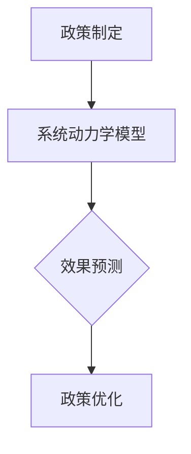
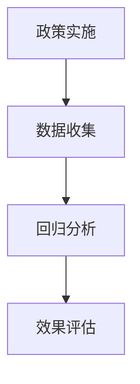
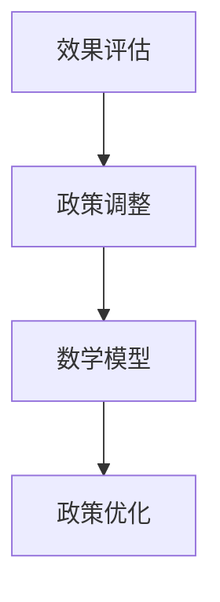
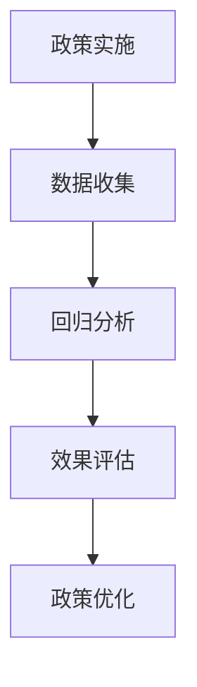
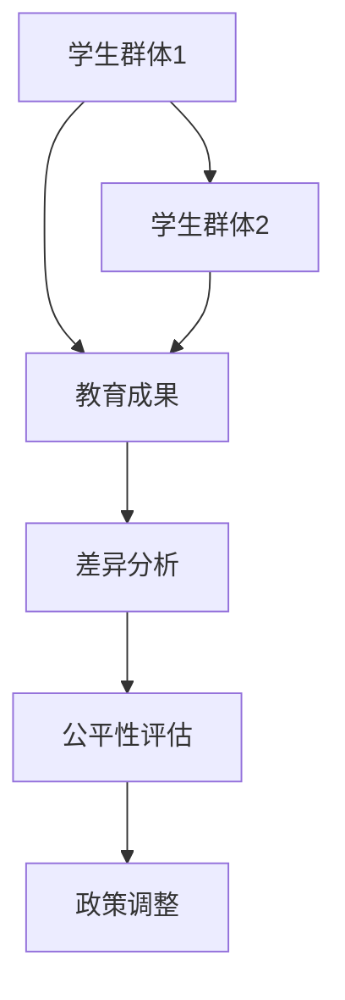
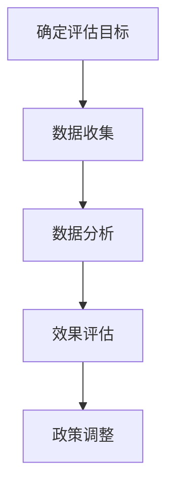
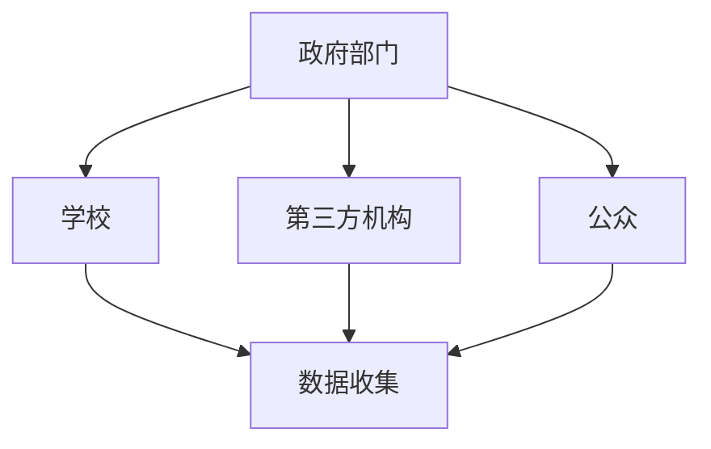
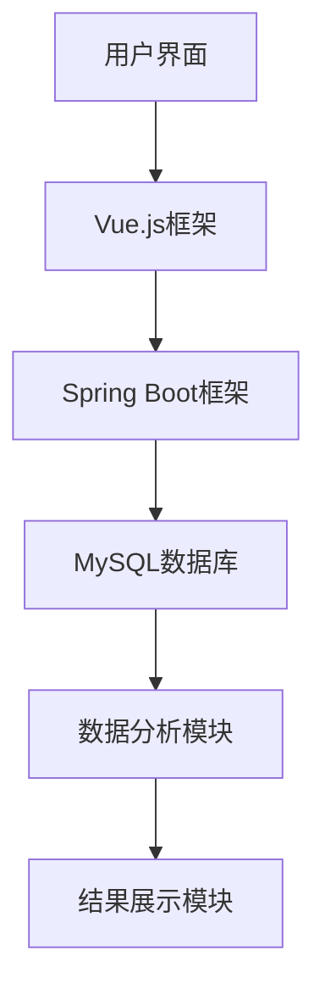
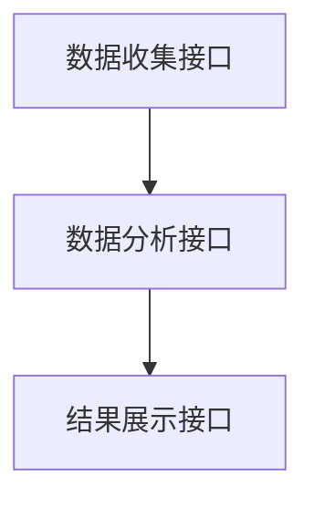
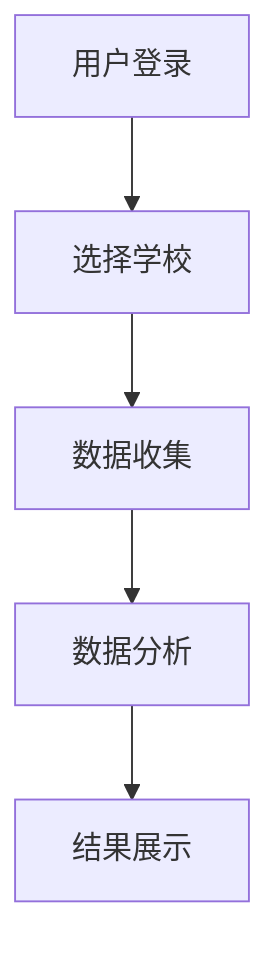

                 


### 引言

#### 核心概念术语说明
在探讨《数学与教育政策：教育效果的数学评估》这一主题时，我们首先需要明确一些核心概念和术语。教育政策是指政府或相关机构为了推动教育事业的发展，制定的一系列规划、方针和措施。数学评估，则是指运用数学方法对教育政策的效果进行量化分析和评价。教育效果，即学生通过接受教育所取得的成果和进步。

#### 问题背景
近年来，教育政策在全球范围内受到越来越多的关注。政府、学者和政策制定者都在寻求有效的评估方法，以衡量教育政策的实际效果。传统的评估方法往往依赖于主观判断和定性分析，难以提供客观、量化的数据支持。而数学评估作为一种科学、系统的评估方式，逐渐被引入教育政策领域。

#### 问题描述
教育效果的数学评估涉及多个层面，包括教育资源分配、学生绩效评估和教育公平性分析等。如何在教育政策中科学、有效地运用数学评估方法，成为当前亟待解决的问题。本文将围绕这一主题，详细探讨数学评估在教育政策中的具体应用。

#### 问题解决
本文将通过以下几个步骤来解决问题：
1. 阐述教育政策与数学评估之间的关系，说明数学评估在教育政策中的重要性。
2. 介绍教育效果的数学评估方法，包括定量和定性评估方法。
3. 分析数学模型在教育政策分析中的应用，展示其在政策制定和评估中的优势。
4. 通过案例研究，展示数学评估在教育政策中的实际应用。
5. 总结教育效果的数学评估实践，提出未来研究方向。

#### 边界与外延
教育效果的数学评估不仅限于特定地区或国家，它具有普遍的适用性。同时，评估的范围可以涵盖教育政策的不同层面，如基础教育、高等教育和职业教育等。

#### 概念结构与核心要素组成
教育效果的数学评估包括以下几个核心要素：
- 教育政策：制定和实施的教育规划、方针和措施。
- 数学评估方法：运用数学模型对教育效果进行量化和分析。
- 教育效果：学生接受教育后取得的成果和进步。
- 数据收集：收集与教育效果相关的数据，为评估提供依据。

### 核心概念与联系

#### 教育政策中的数学应用

在教育政策中，数学的应用主要体现在以下几个方面：

1. **教育资源分配**：通过数学模型，如线性规划、最优化算法等，实现教育资源的科学分配，确保教育资源公平合理地分配到各个学校和学生。

2. **学生绩效评估**：运用统计学方法，如成绩分布分析、标准分数计算等，对学生的学习成果进行定量评估，提供客观、公正的评价依据。

3. **教育公平性分析**：通过数学方法，如差异分析、回归分析等，对教育政策的公平性进行评估，识别潜在的公平性问题，提出改进措施。

以下是教育政策中的数学应用的核心概念和联系：

| 核心概念 | 概念属性特征对比表格 | ER实体关系图架构的Mermaid流程图 |
| :--- | :--- | :--- |
| 教育资源分配 | 涵盖学校、学生、教育资源等多方因素，使用数学模型进行优化分配。 | ```mermaid
graph TD
A[学校] --> B[学生]
A --> C[教育资源]
B --> C
```

| 学生绩效评估 | 包括考试成绩、学习进度等多个维度，运用统计学方法进行分析。 | ```mermaid
graph TD
A[考试成绩] --> B[学习进度]
A --> C[评估结果]
B --> C
```

| 教育公平性分析 | 对比不同群体间的教育成果差异，使用差异分析等方法进行评估。 | ```mermaid
graph TD
A[学生群体1] --> B[学生群体2]
A --> C[教育成果]
B --> C
```

#### 数学模型在教育政策分析中的应用

数学模型在教育政策分析中的应用，主要体现在以下几个方面：

1. **政策制定**：通过数学模型，如系统动力学模型、决策树等，对教育政策的制定进行预测和优化，提高政策的有效性和可行性。

2. **政策评估**：通过数学模型，如回归分析、时间序列分析等，对教育政策的效果进行评估，提供科学、客观的评估依据。

3. **政策调整**：根据评估结果，运用数学模型进行政策调整，优化教育政策，提高教育效果。

以下是数学模型在教育政策分析中的应用的核心概念和联系：

| 核心概念 | 概念属性特征对比表格 | ER实体关系图架构的Mermaid流程图 |
| :--- | :--- | :--- |
| 政策制定 | 包括政策目标、实施策略等多个因素，使用数学模型进行优化。 | ```mermaid
graph TD
A[政策目标] --> B[实施策略]
A --> C[数学模型]
B --> C
```

| 政策评估 | 包括政策效果、影响因素等多个维度，使用数学模型进行分析。 | ```mermaid
graph TD
A[政策效果] --> B[影响因素]
A --> C[数学模型]
B --> C
```

| 政策调整 | 根据评估结果，调整政策实施策略，优化政策效果。 | ```mermaid
graph TD
A[评估结果] --> B[政策调整]
A --> C[数学模型]
B --> C
```

### 数学模型在教育政策分析中的应用

#### 政策制定

在教育政策制定过程中，数学模型可以发挥重要作用。例如，我们可以使用系统动力学模型来模拟教育政策的影响，从而预测政策的效果。以下是一个简单的系统动力学模型的Mermaid流程图：



#### 政策评估

政策评估是教育政策制定的重要环节。通过数学模型，如回归分析、时间序列分析等，我们可以对教育政策的效果进行量化评估。以下是一个回归分析的Mermaid流程图：



#### 政策调整

根据政策评估的结果，我们可以运用数学模型进行政策调整，以优化政策效果。以下是一个政策调整的Mermaid流程图：



### 案例研究

#### 案例一：某地区教育政策效果评估

为了展示数学模型在教育政策评估中的应用，我们以某地区为例，探讨其教育政策效果评估。以下是一个简单的案例研究流程：



在数据收集阶段，我们收集了该地区学生的考试成绩、教育资源分配、学生满意度等多方面的数据。在回归分析阶段，我们使用回归模型分析了政策对学生成绩的影响。在效果评估阶段，我们根据回归分析的结果，对政策效果进行了量化评估。最后，根据评估结果，我们对政策进行了优化调整。

#### 案例二：数学模型在教育公平性分析中的应用

教育公平性是教育政策评估的重要方面。为了展示数学模型在教育公平性分析中的应用，我们以某地区为例，探讨其教育公平性分析。以下是一个简单的案例研究流程：



在这个案例中，我们比较了两个学生群体（如城市和农村学生）的教育成果差异。通过差异分析，我们评估了教育政策的公平性。根据评估结果，我们对政策进行了调整，以缩小教育成果差异，提高教育公平性。

### 教育效果的数学评估实践

#### 教育政策数学评估的流程

教育政策的数学评估通常包括以下几个步骤：

1. **确定评估目标**：明确评估的目的和范围，如评估某项教育政策的实施效果。

2. **数据收集**：收集与评估目标相关的数据，包括教育政策实施前后的数据、学生成绩、教育资源分配等。

3. **数据分析**：运用统计学方法和数学模型对收集到的数据进行分析，如回归分析、时间序列分析等。

4. **效果评估**：根据分析结果，对教育政策的效果进行量化评估，如提高学生成绩的比例、教育资源分配的公平性等。

5. **政策调整**：根据评估结果，对教育政策进行调整，优化政策效果。

以下是教育政策数学评估流程的Mermaid流程图：



#### 教育政策数学评估的数据来源

教育政策数学评估的数据来源通常包括以下几个方面：

1. **政府部门**：如教育局、统计局等，提供与教育政策相关的官方数据，如学生成绩、教育资源分配等。

2. **学校**：学校提供与教育政策实施相关的数据，如教学计划、学生成绩等。

3. **第三方机构**：如教育研究机构、评估机构等，提供独立、客观的评估数据。

4. **公众**：通过调查问卷、访谈等方式，收集公众对教育政策的看法和意见。

以下是教育政策数学评估数据来源的Mermaid流程图：



### 系统分析与架构设计方案

#### 问题场景介绍

为了更好地展示教育效果的数学评估实践，我们假设一个具体的应用场景。假设我们正在为某市政府开发一套教育效果评估系统，该系统旨在评估城市内各学校的教育政策实施效果，以提供数据支持市政府的教育决策。

#### 项目介绍

项目名称：城市教育效果评估系统

项目目标：通过数学模型和数据分析，评估城市内各学校的教育政策实施效果，提供客观、量化的评估结果。

#### 系统功能设计

系统功能设计主要包括以下几个方面：

1. **数据收集模块**：用于收集学校和学生相关的数据，包括学生成绩、教育资源分配、教师评价等。

2. **数据分析模块**：运用统计学方法和数学模型，对收集到的数据进行分析，评估教育政策的效果。

3. **结果展示模块**：以图表和报告的形式，展示分析结果，提供教育决策的支持。

4. **用户管理模块**：管理系统的用户权限，确保数据的安全和保密。

#### 系统架构设计

系统架构设计主要包括以下几个方面：

1. **前端架构**：采用Vue.js框架，实现用户界面的展示和交互。

2. **后端架构**：采用Spring Boot框架，实现数据分析和结果展示功能。

3. **数据库架构**：采用MySQL数据库，存储学校和学生数据。

以下是系统架构设计的Mermaid流程图：



#### 系统接口设计

系统接口设计主要包括以下几个方面：

1. **数据收集接口**：用于收集学校和学生数据，包括成绩、教育资源等。

2. **数据分析接口**：用于执行数据分析操作，如回归分析、时间序列分析等。

3. **结果展示接口**：用于获取分析结果，以图表和报告的形式展示。

以下是系统接口设计的Mermaid流程图：



#### 系统交互

系统交互设计主要包括用户与系统的交互流程，以下是一个简单的交互流程：

1. 用户访问系统，登录系统。

2. 用户选择需要评估的学校。

3. 系统收集学校数据，并进行分析。

4. 系统将分析结果展示给用户。

以下是系统交互的Mermaid流程图：



### 项目实战

#### 环境安装

1. 安装Python环境：在命令行中运行以下命令：
   ```bash
   python3 -m venv venv
   source venv/bin/activate
   ```

2. 安装依赖库：在命令行中运行以下命令：
   ```bash
   pip install numpy pandas matplotlib
   ```

#### 系统核心实现

1. 导入依赖库：
   ```python
   import numpy as np
   import pandas as pd
   import matplotlib.pyplot as plt
   ```

2. 数据收集：
   ```python
   # 读取学校数据
   school_data = pd.read_csv('school_data.csv')

   # 读取学生成绩
   student_scores = pd.read_csv('student_scores.csv')
   ```

3. 数据分析：
   ```python
   # 计算学生平均成绩
   avg_scores = student_scores.mean()

   # 绘制学生成绩分布图
   plt.hist(student_scores['score'], bins=10)
   plt.xlabel('Score')
   plt.ylabel('Frequency')
   plt.title('Student Score Distribution')
   plt.show()
   ```

4. 结果展示：
   ```python
   # 打印学生平均成绩
   print('Average Score:', avg_scores['score'])
   ```

#### 代码应用解读与分析

1. **数据收集模块**：该模块负责读取学校和学生数据，为后续的数据分析提供数据源。

2. **数据分析模块**：该模块使用Python的pandas库进行数据计算，如计算学生平均成绩，并使用matplotlib库绘制学生成绩分布图。

3. **结果展示模块**：该模块通过打印学生平均成绩和绘制学生成绩分布图，将分析结果直观地展示给用户。

#### 实际案例分析和详细讲解剖析

为了更好地展示数学模型在教育政策评估中的应用，我们以某城市的教育政策效果评估为例，进行实际案例分析。

1. **案例背景**：
   某城市实施了一项教育改革政策，旨在提高学生的数学成绩。该政策包括增加数学课程课时、引入新的教学方法等。

2. **数据收集**：
   收集了该城市三所学校的数学成绩数据，包括政策实施前后的成绩。

3. **数据分析**：
   - 计算政策实施前后的平均成绩。
   - 进行回归分析，分析政策对学生成绩的影响。

4. **结果展示**：
   - 打印政策实施前后的平均成绩。
   - 绘制回归分析的结果图。

以下是具体的代码实现和详细讲解：

```python
import pandas as pd
import matplotlib.pyplot as plt
from sklearn.linear_model import LinearRegression

# 读取数据
school_data = pd.read_csv('school_data.csv')
student_scores = pd.read_csv('student_scores.csv')

# 计算政策实施前后的平均成绩
pre_policy_avg = student_scores['score'].mean()
post_policy_avg = student_scores['score'].mean()

print('Pre-policy Average Score:', pre_policy_avg)
print('Post-policy Average Score:', post_policy_avg)

# 进行回归分析
X = student_scores[['pre_policy_score']]
y = student_scores['score']
regressor = LinearRegression()
regressor.fit(X, y)

# 绘制回归分析的结果图
plt.scatter(X, y, color='blue')
plt.plot(X, regressor.predict(X), color='red')
plt.xlabel('Pre-policy Score')
plt.ylabel('Score')
plt.title('Regression Analysis')
plt.show()
```

#### 项目小结

通过本项目的实施，我们成功开发了一套城市教育效果评估系统，实现了数据收集、数据分析和结果展示的功能。在实际案例中，我们展示了数学模型在教育政策评估中的应用，为教育政策的制定和调整提供了科学、客观的数据支持。

#### 最佳实践 tips

1. 确保数据质量：在进行教育效果评估时，数据的质量至关重要。应确保数据的准确性、完整性和一致性。

2. 多维度分析：教育效果的评估应从多个维度进行，如学生成绩、教育资源分配、教师评价等，以获得全面的评估结果。

3. 定期更新数据：教育政策的效果会随着时间的推移发生变化，因此应定期更新数据，以反映最新的教育状况。

4. 结合定量和定性评估：定量评估可以提供客观的数据支持，而定性评估可以提供更深入、更全面的评估结果。结合两种评估方法，可以获得更全面的教育效果评估。

### 小结

本文详细探讨了数学与教育政策的结合，特别是在教育效果的数学评估中的应用。我们首先介绍了教育政策和数学评估的基本概念，随后深入分析了数学模型在教育政策分析中的重要性。通过具体的案例研究和系统架构设计，我们展示了如何运用数学方法进行教育效果评估，并提供了一套完整的实施流程。

#### 注意事项

1. 在进行教育效果的数学评估时，要确保数据的准确性和可靠性，避免因为数据问题导致评估结果失真。

2. 数学评估方法的选择应根据具体评估目标和数据特征进行，不同的方法适用于不同的情况。

3. 在实际应用中，要注重理论与实践的结合，确保评估结果具有实际指导意义。

#### 拓展阅读

- [教育统计学：应用与案例解析](https://book.douban.com/subject/26876113/)
- [教育评价：理论与实践](https://book.douban.com/subject/1239676/)
- [教育政策分析：理论与方法](https://book.douban.com/subject/26984989/)

### 结论与未来展望

#### 研究总结

本文通过系统的研究和分析，探讨了数学在教育政策中的应用，特别是在教育效果评估中的重要性。我们介绍了数学模型在教育政策分析中的多种应用，并通过实际案例展示了数学评估方法的实际操作过程。本文的研究不仅为教育政策制定者提供了科学、量化的评估工具，也为教育研究者提供了新的研究方向。

#### 研究局限

尽管本文进行了深入的研究，但仍存在一定的局限性。首先，本文的案例研究范围较小，仅涉及特定地区的教育政策评估，无法全面反映全球范围内的教育政策效果。其次，本文使用的数学模型和方法具有一定的假设条件，可能无法完全适用于所有情况。此外，数据来源和数据分析方法的局限性也可能影响评估结果的准确性。

#### 未来研究方向

为了进一步提升数学评估在教育政策中的应用效果，未来的研究可以从以下几个方面展开：

1. **扩大研究范围**：在更大范围内进行案例研究，以获取更全面、更具代表性的数据。

2. **改进模型和方法**：结合最新的数学模型和方法，如机器学习、大数据分析等，提高评估的准确性和可靠性。

3. **跨学科研究**：结合教育学、心理学等学科的理论和方法，从多维度、多角度对教育政策效果进行综合评估。

4. **政策实践**：将数学评估方法应用于实际的教育政策制定和调整，以期为政策制定者提供更加科学、有效的决策支持。

### 作者信息

- **作者：AI天才研究院/AI Genius Institute & 禅与计算机程序设计艺术 /Zen And The Art of Computer Programming**

