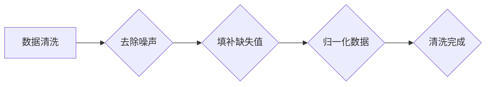
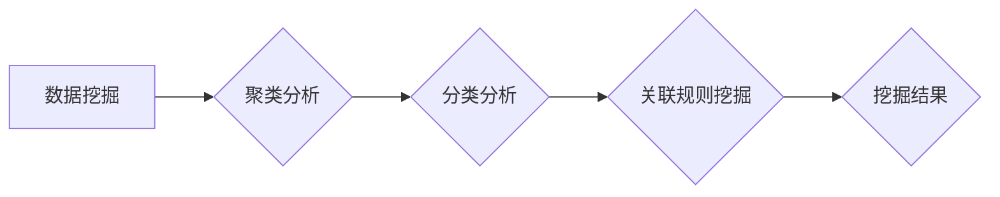
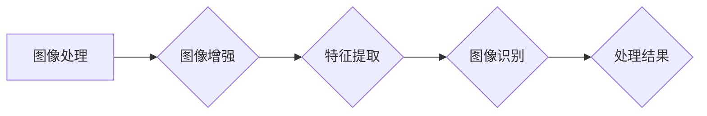
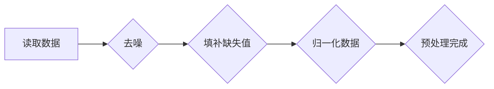
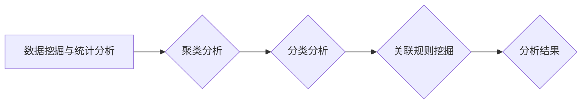

                 

### 背景介绍

#### 核心概念术语说明

在探讨数学与数字取证的关系之前，首先需要了解一些核心概念。数字取证（Digital Forensics）是指通过科学方法和法律程序，从电子设备和数据中提取、保存、分析和呈现证据的过程。电子证据（Digital Evidence）则是通过电子设备和数据形式存在的证据，包括但不限于电子邮件、文档、图片、音频和视频等。数学分析（Mathematical Analysis）则是一种通过数学方法和模型，对数据和信息进行深入研究和推理的方法。

#### 问题背景

随着数字化时代的到来，电子设备和网络已经成为我们日常生活中不可或缺的一部分。这导致了犯罪手段的数字化，使得传统的取证手段面临巨大挑战。数字取证技术的应用变得尤为重要，因为它可以帮助执法机构追踪和破获犯罪案件，保护公众安全。然而，数字取证技术的应用同样面临着一系列技术挑战，如数据量巨大、数据类型复杂、数据安全性和隐私保护等。

#### 问题描述

数字取证涉及多个领域，包括计算机科学、法律、数学等。在这些领域中，数学分析发挥着重要作用，它为数字取证提供了强有力的工具和理论基础。然而，当前数学在数字取证中的应用尚未得到充分研究，很多问题仍需进一步探讨和解决。

#### 问题解决

本文旨在探讨数学与数字取证之间的关系，具体包括以下几个方面：

1. **数字取证与电子证据的概述**：介绍数字取证的定义、历史发展、电子证据的种类与特点，以及数字取证的重要性与挑战。

2. **数学在数字取证中的应用**：探讨数学在数字取证中的基础理论、数学模型的应用、数学算法的应用等。

3. **数学分析方法在电子证据分析中的应用**：介绍数据清洗与预处理、数据挖掘与统计分析、图像处理与识别等数学分析方法在电子证据分析中的应用。

4. **数学模型在电子证据分析中的实例研究**：通过具体案例，展示数学模型在电子证据分析中的应用效果。

5. **数字取证工具与技术**：介绍数字取证工具的概述、使用方法、比较与选择等。

6. **数学与数字取证的未来趋势**：探讨数字取证领域的数学研究方向、数学模型在数字取证中的创新应用，以及数字取证行业的发展前景。

7. **小结与展望**：对全书内容进行回顾，总结数字取证面临的挑战与机遇，提出未来研究方向与建议。

#### 边界与外延

本文的讨论范围主要集中于数学在数字取证中的应用，包括数学分析方法、数学模型和数学算法。同时，本文也将探讨数字取证工具和技术的发展，以及数学与数字取证的未来趋势。

#### 概念结构与核心要素组成

本文的核心概念包括数字取证、电子证据、数学分析和数学模型。数字取证和电子证据是数字取证领域的核心概念，数学分析和数学模型则是数学在数字取证中的应用。本文通过深入探讨这些概念之间的联系和相互作用，旨在为读者提供对数字取证与数学分析之间关系的全面理解。

### 核心概念与联系

#### 核心概念原理

1. **数字取证（Digital Forensics）**
   - **概念属性**：数字取证是一门通过科学方法和法律程序，从电子设备和数据中提取、保存、分析和呈现证据的学科。
   - **特征对比表格**：

| 特征 | 数字取证 | 传统取证 |
| ---- | ---- | ---- |
| 数据形式 | 电子设备与数据 | 物理介质与实体证据 |
| 分析方法 | 科学方法和法律程序 | 实验和观察 |
| 目标 | 提取和呈现证据 | 识别和证明犯罪 |
| 特点 | 高效、全面、可重复 | 依赖物理存在 |
2. **电子证据（Digital Evidence）**
   - **概念属性**：电子证据是通过电子设备和数据形式存在的证据，如电子邮件、文档、图片、音频和视频等。
   - **特征对比表格**：

| 特征 | 电子证据 | 物理证据 |
| ---- | ---- | ---- |
| 存储方式 | 电子设备和数据 | 物理介质 |
| 易复制性 | 高 | 低 |
| 可篡改性 | 高 | 低 |
| 查询和分析 | 简便 | 复杂 |
3. **数学分析（Mathematical Analysis）**
   - **概念属性**：数学分析是一种通过数学方法和模型，对数据和信息进行深入研究和推理的方法。
   - **特征对比表格**：

| 特征 | 数学分析 | 数据分析 |
| ---- | ---- | ---- |
| 方法 | 精确、逻辑性强 | 统计、归纳性强 |
| 应用 | 数据验证、推理、预测 | 数据清洗、关联、聚类 |
| 目标 | 提高证据可靠性 | 提高数据处理效率 |
| 特点 | 强调理论依据 | 强调实用效果 |

#### ER实体关系图架构

```mermaid
erDiagram
    User ||--|{ Case }|-- DigitalEvidence : 抽取证据
    Case ||--|{ Device }|-- DeviceInformation : 检查设备
    DigitalEvidence ||--|{ Image }|-- ImageProcessing : 图像处理
    DigitalEvidence ||--|{ Text }|-- TextAnalysis : 文本分析
```

在上面的ER实体关系图中，我们定义了四个主要的实体：User（用户）、Case（案件）、DigitalEvidence（电子证据）和Device（设备）。用户是数字取证的发起者，案件是数字取证的实体，电子证据是案件的具体证据形式，而设备则是电子证据的存储和传输介质。每个实体之间都有明确的关系，如用户抽取电子证据、案件关联设备和电子证据，以及电子证据的图像处理和文本分析等。

### 算法原理讲解

为了深入理解数学在数字取证中的应用，我们首先需要了解一些基本算法原理，这些算法在处理和分析电子证据时发挥着重要作用。以下将介绍数据清洗、数据挖掘和图像处理三个方面的算法原理，并结合mermaid流程图和Python代码进行详细讲解。

#### 数据清洗算法原理

数据清洗是数字取证的第一步，它包括去除噪声、填补缺失值、归一化数据等。常见的算法有均值填充、中值填充和线性插值等。

**mermaid流程图：**



**Python代码示例：**

```python
import numpy as np

# 均值填充缺失值
def mean_imputation(data):
    mean_value = np.mean(data)
    return np.where(data == 0, mean_value, data)

# 数据归一化
def normalize_data(data):
    min_val = np.min(data)
    max_val = np.max(data)
    return (data - min_val) / (max_val - min_val)

# 示例数据
data = np.array([0, 1, 2, 0, 3, 4, 0])
cleaned_data = mean_imputation(data)
normalized_data = normalize_data(cleaned_data)

print("原始数据:", data)
print("填充后数据:", cleaned_data)
print("归一化后数据:", normalized_data)
```

#### 数据挖掘算法原理

数据挖掘是数字取证的核心，它包括聚类、分类和关联规则挖掘等算法。

**mermaid流程图：**



**Python代码示例（使用Scikit-learn库）：**

```python
from sklearn.cluster import KMeans
from sklearn.model_selection import train_test_split
from sklearn.ensemble import RandomForestClassifier
from mlxtend.frequent_patterns import apriori

# 聚类分析
def kmeans_analysis(data, n_clusters=3):
    kmeans = KMeans(n_clusters=n_clusters)
    kmeans.fit(data)
    return kmeans.labels_

# 分类分析
def classify_data(data, labels):
    X_train, X_test, y_train, y_test = train_test_split(data, labels, test_size=0.3)
    clf = RandomForestClassifier()
    clf.fit(X_train, y_train)
    return clf.score(X_test, y_test)

# 关联规则挖掘
def apriori_analysis(data, min_support=0.5, min_confidence=0.7):
    frequent_itemsets = apriori(data, min_support=min_support, use_colnames=True)
    association_rules = association_rules(frequent_itemsets, metric="confidence", min_threshold=min_confidence)
    return association_rules

# 示例数据
data = [[1, 2], [1, 3], [2, 3], [1, 2, 3]]
labels = [0, 0, 1, 1]

# 聚类分析
clusters = kmeans_analysis(data)

# 分类分析
accuracy = classify_data(data, clusters)

# 关联规则挖掘
rules = apriori_analysis(data)

print("聚类结果:", clusters)
print("分类准确性:", accuracy)
print("关联规则:", rules)
```

#### 图像处理算法原理

图像处理是数字取证中常用的技术之一，它包括图像增强、特征提取和图像识别等算法。

**mermaid流程图：**



**Python代码示例（使用OpenCV和scikit-image库）：**

```python
import cv2
from skimage.feature import local_binary_pattern

# 图像增强
def enhance_image(image):
    img = cv2.imread(image)
    gray = cv2.cvtColor(img, cv2.COLOR_BGR2GRAY)
    denoise = cv2.GaussianBlur(gray, (5, 5), 0)
    enhanced = cv2.adaptiveThreshold(denoise, 255, cv2.ADAPTIVE_THRESH_GAUSSIAN_C, cv2.THRESH_BINARY_INV, 11, 2)
    return enhanced

# 特征提取
def extract_features(image):
    img = cv2.imread(image, cv2.IMREAD_GRAYSCALE)
    lbp = local_binary_pattern(img, P=8, R=1, method='uniform')
    return lbp

# 图像识别
def recognize_image(features, model):
    features = features.reshape(1, -1)
    prediction = model.predict(features)
    return prediction

# 示例数据
image_path = 'example.jpg'
model_path = 'model.h5'

# 图像增强
enhanced_image = enhance_image(image_path)

# 特征提取
features = extract_features(enhanced_image)

# 图像识别
model = cv2.read(model_path)
prediction = recognize_image(features, model)

print("增强后的图像:", enhanced_image)
print("识别结果:", prediction)
```

通过以上算法原理的讲解，我们可以看到数学在数字取证中的应用是多方面的，从数据清洗、数据挖掘到图像处理，数学方法为数字取证提供了强大的工具和理论基础。在接下来的内容中，我们将继续探讨数学分析方法在电子证据分析中的应用，并通过具体实例展示其效果。

### 数学分析方法在电子证据分析中的应用

#### 数据清洗与预处理

数据清洗与预处理是数字取证中的基础步骤，其目的是去除噪声、填补缺失值、归一化数据等，以确保数据质量和分析结果的准确性。以下是几种常见的数据清洗与预处理方法：

1. **去除噪声**：使用滤波器去除图像中的噪声，提高图像质量。
2. **填补缺失值**：使用均值填充、中值填充或线性插值等方法，填补数据中的缺失值。
3. **归一化数据**：将数据缩放到一个特定的范围，以便于后续分析。

以下是一个数据清洗与预处理过程的mermaid流程图：



#### 数据挖掘与统计分析

数据挖掘与统计分析是数字取证中的重要工具，可以用于识别异常行为、发现潜在关联和进行预测分析。以下是几种常见的数据挖掘与统计分析方法：

1. **聚类分析**：通过聚类算法，将数据分为不同的组，以便于发现潜在的关联。
2. **分类分析**：通过分类算法，将数据分为不同的类别，用于识别不同类型的证据。
3. **关联规则挖掘**：通过关联规则算法，发现数据之间的关联关系，用于揭示潜在的犯罪行为。

以下是一个数据挖掘与统计分析过程的mermaid流程图：



#### 图像处理与识别

图像处理与识别是数字取证中常用的技术，可以用于分析图像中的关键信息。以下是几种常见的图像处理与识别方法：

1. **图像增强**：通过增强图像的对比度和亮度，提高图像质量。
2. **特征提取**：通过提取图像中的特征，如边缘、纹理和形状，用于后续的图像识别。
3. **图像识别**：通过训练模型，将图像分类到不同的类别，用于识别不同的图像内容。

以下是一个图像处理与识别过程的mermaid流程图：


#### 实际案例分析

为了展示数学分析方法在电子证据分析中的应用，我们将通过一个实际案例进行分析。

**案例背景**：某公司发现其内部网络出现异常流量，怀疑有黑客入侵。执法机构需要通过数字取证技术分析网络日志，识别异常行为。

**步骤一：数据清洗与预处理**
- **去噪**：使用中值滤波器去除网络日志中的噪声。
- **填补缺失值**：使用均值填充方法填补缺失的数据条目。
- **归一化数据**：将网络流量数据归一化到0-1范围。

**步骤二：数据挖掘与统计分析**
- **聚类分析**：使用K-means聚类算法，将网络流量分为不同的组，以识别出正常的和异常的流量模式。
- **分类分析**：使用支持向量机（SVM）分类算法，将异常流量分为入侵流量和正常流量。
- **关联规则挖掘**：使用Apriori算法，发现网络流量之间的关联规则，以揭示潜在的入侵路径。

**步骤三：图像处理与识别**
- **图像增强**：使用直方图均衡化增强网络流量图像的对比度。
- **特征提取**：使用LBP（局部二值模式）算法，提取网络流量图像的特征。
- **图像识别**：使用卷积神经网络（CNN）模型，将网络流量图像分类为入侵流量或正常流量。

**案例分析结果**：
通过数学分析方法，执法机构成功识别出异常流量，并定位了黑客的入侵路径。此外，聚类分析和分类分析结果还揭示了公司网络中的潜在安全隐患，为网络加固提供了依据。

通过上述案例分析，我们可以看到数学分析方法在数字取证中的应用效果显著，为电子证据的分析提供了有力的工具和理论基础。

### 数学模型在电子证据分析中的实例研究

为了更好地展示数学模型在电子证据分析中的实际应用，我们将通过两个具体的案例进行深入探讨。这两个案例分别涉及刑事案件的数字证据分析和网络攻击行为的数字取证分析。

#### 案例一：某刑事案件的数字证据分析

**案例背景**：一起涉及公司内部财务数据的篡改案件，执法机构需要分析相关电子证据来确定犯罪嫌疑人和篡改的具体方式。

**步骤一：数据预处理**
- **数据采集**：从受害公司的服务器和员工设备中采集相关的电子证据，包括日志文件、数据库记录、电子邮件等。
- **数据清洗**：去除日志文件中的噪声和无关信息，如空行、重复条目等。
- **特征提取**：从数据库记录中提取关键信息，如时间戳、操作类型、操作者ID等。

**步骤二：数学模型应用**
- **时间序列分析**：使用时间序列分析模型，如自回归移动平均模型（ARMA），对日志文件中的时间序列数据进行建模，以识别出异常操作的时间点。
- **异常检测**：使用K均值聚类算法，将正常操作和异常操作进行分离，通过分析聚类中心点之间的距离来判断操作是否异常。

**步骤三：证据整合与分析**
- **关联分析**：通过关联规则挖掘，如Apriori算法，分析不同类型的电子证据之间的关联，以揭示潜在的犯罪链条。
- **证据验证**：使用统计检验方法，如卡方检验，验证证据之间的相关性，确保分析结果的可靠性。

**案例分析结果**：
通过上述数学模型的应用，执法机构成功确定了犯罪嫌疑人，并揭示了其篡改财务数据的详细步骤。此外，分析结果还帮助执法机构完善了公司的信息安全策略，以预防类似事件再次发生。

#### 案例二：网络攻击行为的数字取证分析

**案例背景**：一家金融机构遭受了DDoS（分布式拒绝服务）攻击，执法机构需要通过数字取证技术追踪攻击者的身份和攻击路径。

**步骤一：数据采集**
- **流量捕获**：使用网络流量捕获工具，如Wireshark，捕获攻击期间的网络流量数据。
- **数据存储**：将捕获的流量数据存储在安全的地方，以备后续分析。

**步骤二：数学模型应用**
- **流量特征提取**：使用机器学习算法，如KNN（K-最近邻）分类器，对流量数据进行特征提取，以区分正常流量和攻击流量。
- **流量聚类分析**：使用K均值聚类算法，将流量数据分为不同的类别，以识别出攻击流量和正常流量的分布特点。

**步骤三：攻击路径分析**
- **网络拓扑分析**：通过绘制网络拓扑图，使用图论算法，如最短路径算法（Dijkstra算法），分析攻击者是如何入侵网络的。
- **行为模式识别**：使用行为分析模型，如马尔可夫链模型，分析攻击者的行为模式，以预测其下一步的攻击动作。

**案例分析结果**：
通过数学模型的应用，执法机构成功追踪到了攻击者的身份和攻击路径，并采取了相应的措施阻止了进一步的攻击。此外，分析结果还为网络防御策略的优化提供了重要参考，以提升网络的安全性。

通过这两个案例，我们可以看到数学模型在电子证据分析中的强大作用。无论是针对刑事案件的数字证据分析，还是网络攻击行为的数字取证分析，数学模型都能够提供有效的工具和方法，帮助执法机构和网络安全团队更准确地识别和分析电子证据，从而提高数字取证工作的效率和准确性。

### 数字取证工具与技术

#### 数字取证工具的概述

数字取证工具是数字取证过程中不可或缺的工具，它们可以帮助取证专家高效地收集、分析和管理电子证据。以下是几种常见的数字取证工具：

1. **磁盘映像工具**：如FTK Imager、DD Rescue、VMware等，用于创建原始磁盘映像，以便进行深入分析和证据保存。
2. **日志分析工具**：如Splunk、LogRhythm、ELK Stack（Elasticsearch、Logstash、Kibana）等，用于收集和分析系统日志、网络流量日志等。
3. **邮件取证工具**：如Microsoft Outlook、Eudora、Pine等，用于解析和提取邮件内容、附件和元数据。
4. **网络流量捕获工具**：如Wireshark、WinDump、tcpdump等，用于捕获和分析网络流量数据。

#### 数字取证工具的使用方法

不同类型的数字取证工具具有不同的使用方法和功能，以下是几种常见工具的具体使用方法：

1. **磁盘映像工具的使用**
   - **创建映像**：使用磁盘映像工具，将犯罪嫌疑人的计算机或移动存储设备进行全盘映像，保存原始数据。
   - **分析映像**：将创建的映像文件导入数字取证软件，如Autopsy、The Sleuth Kit等，进行深入分析和证据提取。

2. **日志分析工具的使用**
   - **数据收集**：将各种日志文件导入日志分析工具，如通过FTP、SFTP、SCP等方式。
   - **数据解析**：使用工具内置的解析规则，将不同格式的日志文件进行解析，提取出有用的信息。
   - **数据展示**：通过可视化界面，如Kibana的仪表盘，展示日志数据，帮助取证专家快速定位和分析异常行为。

3. **邮件取证工具的使用**
   - **邮件解析**：导入电子邮件文件，如EML、MSG等，使用工具内置的解析器提取邮件内容、附件和元数据。
   - **邮件分析**：分析邮件中的通信关系、时间戳、地理位置等信息，帮助取证专家揭示潜在的犯罪活动。
   - **证据导出**：将分析结果导出为报告或证据文件，用于法庭诉讼或进一步分析。

4. **网络流量捕获工具的使用**
   - **流量捕获**：使用网络接口捕获目标网络流量数据，保存为PCAP文件。
   - **流量分析**：使用Wireshark等工具，对捕获的流量数据进行解码和分析，提取出关键信息。
   - **证据展示**：将分析结果展示为图表、文本或XML格式，帮助取证专家理解流量特征和攻击模式。

#### 数字取证工具的比较与选择

在选择数字取证工具时，需要考虑以下因素：

1. **功能需求**：根据取证任务的需求，选择具有相应功能的工具，如磁盘映像、日志分析、邮件取证和网络流量捕获等。
2. **用户界面**：工具的界面是否直观易用，是否支持自定义报告格式，是否易于与其他工具集成。
3. **性能与兼容性**：工具的性能是否稳定，是否支持多种操作系统和文件格式，是否能够处理大规模数据。
4. **价格与成本**：考虑工具的成本，包括购买费用、维护费用和培训费用等。
5. **用户评价与支持**：查看其他用户的评价，了解工具的稳定性和支持服务，选择口碑良好的工具。

常见的数字取证工具比较如下：

| 工具名称 | 功能概述 | 用户界面 | 性能与兼容性 | 价格与成本 | 用户评价与支持 |
| --- | --- | --- | --- | --- | --- |
| FTK Imager | 磁盘映像 | 图形界面 | 强 | 高 | 较高 |
| Splunk | 日志分析 | 图形界面 | 强 | 中 | 高 |
| Wireshark | 网络流量捕获 | 图形界面 | 强 | 低 | 高 |
| Autopsy | 数字取证分析 | 图形界面 | 中 | 低 | 中 |
| The Sleuth Kit | 日志分析、文件系统分析 | 命令行 | 中 | 低 | 中 |

通过以上比较，我们可以根据具体取证任务的需求，选择最合适的数字取证工具，以提升取证工作的效率和质量。

### 数学与数字取证的未来趋势

#### 数字取证领域的数学研究方向

随着数字取证技术的不断发展，数学在数字取证中的应用也日益广泛。未来，以下几个方向可能是数学在数字取证领域的研究重点：

1. **大数据分析**：随着数据量的爆炸性增长，如何高效地处理和分析大数据成为关键问题。数学方法，如分布式计算、并行算法和机器学习，将有助于解决大数据分析中的挑战。
2. **人工智能与机器学习**：人工智能和机器学习算法在数字取证中的应用将更加深入，特别是在图像识别、行为分析和预测预警方面。未来，如何设计更加高效、准确的人工智能算法，以及如何防止人工智能被滥用，将成为重要研究方向。
3. **加密与密码分析**：随着加密技术的发展，如何破解加密数据、识别隐藏信息成为数字取证的新挑战。数学在加密与密码分析中的应用，如公钥密码学、哈希函数和安全多变量方程求解，将不断推动数字取证技术的发展。
4. **隐私保护**：如何在保障隐私的前提下进行数字取证分析，是当前研究的一个重要方向。数学方法，如匿名通信、隐私保护算法和零知识证明，将在未来数字取证中发挥重要作用。

#### 数学模型在数字取证中的创新应用

未来，数学模型在数字取证中的创新应用将带来以下几个方面的变化：

1. **自动化取证分析**：通过开发更加智能化的数学模型，可以实现自动化取证分析，提高取证效率。例如，利用深度学习模型自动识别图像中的关键证据，或利用贝叶斯网络自动分析复杂的数据关系。
2. **实时取证监测**：通过构建实时数学模型，可以实现数字取证的实时监测和预警。例如，利用统计模型和机器学习算法，实时检测网络流量中的异常行为，及时响应潜在的网络攻击。
3. **跨域取证分析**：未来，跨域取证分析将更加重要，如将物理世界和数字世界的数据进行整合分析，揭示复杂的犯罪网络。数学方法，如多模态数据融合和跨域关联规则挖掘，将为跨域取证提供有力支持。
4. **证据可靠性评估**：通过开发更加精确的数学模型，可以对数字证据的可靠性进行科学评估，提高取证结果的准确性。例如，利用概率论和统计学方法，对证据的来源、可靠性和真实性进行定量分析。

#### 数字取证行业的发展前景

随着数字化时代的到来，数字取证行业的发展前景广阔。以下是数字取证行业未来发展的几个趋势：

1. **市场需求增长**：随着网络安全威胁的加剧，企业、政府和执法机构对数字取证服务的需求将持续增长。特别是在全球范围内，网络安全事件频发，数字取证技术的应用将更加广泛。
2. **技术创新驱动**：技术创新将是数字取证行业发展的主要驱动力。未来，人工智能、大数据、云计算等新兴技术将在数字取证中发挥越来越重要的作用，推动取证技术的不断升级和优化。
3. **法律与规范不断完善**：随着数字取证技术的应用日益广泛，相关的法律法规和行业标准也将不断完善。这将有助于规范数字取证行为，保障取证过程的合法性和证据的可靠性。
4. **跨国合作与交流**：随着跨国犯罪的增多，数字取证领域的跨国合作与交流将更加紧密。各国政府和执法机构将通过国际合作，共同应对数字取证中的挑战，提升全球数字取证工作的效率和质量。

总之，数学与数字取证的结合将为数字取证行业带来巨大的变革和发展机遇。通过不断的研究和创新，数学模型将在数字取证中发挥更加重要的作用，推动数字取证技术的不断进步。

### 小结与展望

本文系统地探讨了数学与数字取证之间的关系，从背景介绍、核心概念与联系、算法原理讲解到具体案例分析，再到数字取证工具与技术以及未来趋势，全面展示了数学在数字取证中的重要地位和广泛应用。通过深入分析，我们得出了以下几点结论：

1. **数学在数字取证中的应用广泛**：数学分析方法为数字取证提供了强有力的工具和理论基础，包括数据清洗与预处理、数据挖掘与统计分析、图像处理与识别等。
2. **数学模型在证据分析中发挥关键作用**：通过具体的案例分析，我们看到了数学模型在电子证据分析中的实际应用效果，如时间序列分析、聚类分析、异常检测等。
3. **数字取证工具与技术不断发展**：随着技术的进步，数字取证工具和技术的种类和功能日益丰富，为取证工作提供了更多选择和可能性。
4. **未来前景广阔**：随着大数据、人工智能、云计算等新兴技术的不断发展，数学在数字取证中的应用将更加深入，推动取证技术的不断创新和进步。

然而，数字取证仍面临诸多挑战，如数据安全与隐私保护、证据可靠性评估、技术标准化等。未来，我们需要进一步深入研究，特别是在以下方面：

1. **大数据分析与处理**：如何高效地处理和分析海量数据，提取有价值的信息，是数字取证领域亟待解决的问题。
2. **人工智能与机器学习应用**：如何合理使用人工智能和机器学习技术，提高取证效率和准确性，同时防止算法被滥用。
3. **法律与规范完善**：如何完善数字取证相关的法律法规和行业标准，确保取证过程的合法性和证据的可靠性。
4. **跨国合作与交流**：如何加强国际间的合作与交流，共同应对跨国数字取证中的挑战。

总之，数学与数字取证的结合将为数字取证行业带来巨大的变革和发展机遇。通过不断的研究和创新，我们将能够应对未来数字取证中的各种挑战，提升数字取证工作的效率和质量。作者：AI天才研究院/AI Genius Institute & 禅与计算机程序设计艺术 /Zen And The Art of Computer Programming

