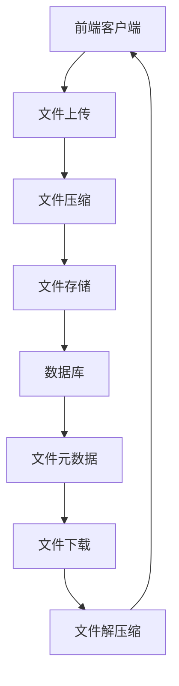
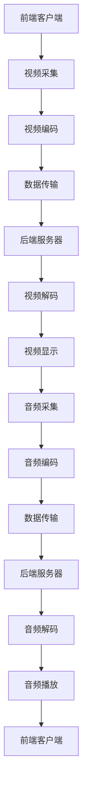

                 

# 数学与数据压缩：信息编码的数学技术

## 关键词
- 数学与数据压缩
- 信息编码
- 熵编码
- 预测编码
- 算术编码
- 数据压缩算法
- 通信编码

## 摘要
本文旨在探讨数学在数据压缩和信息编码中的应用，通过深入分析数学原理和算法实现，帮助读者全面理解这一重要领域。文章分为五大部分：背景介绍、核心概念、算法原理、系统设计与实战、最佳实践与总结，力求以逻辑清晰、结构紧凑、简单易懂的方式，带领读者一步步探索数学与数据压缩的奥秘。

### 目录大纲

## 第一部分：背景介绍

### 第1章 数据压缩与信息编码概述

### 第2章 数据压缩的背景与发展

### 第3章 信息编码的背景与发展

## 第二部分：核心概念

### 第4章 数据压缩的基本原理

### 第5章 信息编码的基本原理

### 第6章 数据压缩与信息编码的联系与区别

## 第三部分：算法原理

### 第7章 常见数据压缩算法

### 第8章 常见信息编码算法

### 第9章 数据压缩算法与信息编码算法的比较分析

## 第四部分：系统设计与实战

### 第10章 数据压缩系统的设计与实现

### 第11章 信息编码系统的设计与实现

### 第12章 实际项目中的数据压缩与信息编码应用

## 第五部分：最佳实践

### 第13章 数据压缩与信息编码的最佳实践

### 第14章 总结与展望

### 目录大纲设计步骤

#### 第一步：总体构思

- 确定书籍的核心主题：《数学与数据压缩：信息编码的数学技术》
- 明确书籍的目的：为读者提供关于数学在数据压缩和信息编码中的应用的全面、深入的理解。
- 设定书籍的结构：大致分为背景介绍、核心概念、算法原理、系统设计与实战、最佳实践与总结等部分。

#### 第二步：细化章节

1. **背景介绍**
    - 介绍数据压缩的背景、意义及发展历程
    - 介绍信息编码的基本概念、原理和应用

2. **核心概念**
    - 数据压缩的基本原理和分类
    - 信息编码的基本原理和分类
    - 数据压缩与信息编码之间的联系和区别

3. **算法原理**
    - 常见数据压缩算法的原理和流程
    - 常见信息编码算法的原理和流程
    - 数据压缩算法与信息编码算法的比较分析

4. **系统设计与实战**
    - 数据压缩系统的设计原则和流程
    - 信息编码系统的设计原则和流程
    - 实际项目中的数据压缩与信息编码实现

5. **最佳实践**
    - 数据压缩与信息编码的最佳实践方法
    - 常见问题和解决方案

6. **总结与展望**
    - 总结全书的核心内容
    - 展望数据压缩和信息编码的未来发展趋势

#### 第三步：撰写目录大纲

根据上述构思和章节细化，撰写完整的目录大纲，确保每个章节都包含必要的子章节，确保内容的完整性和逻辑性。

#### 第四步：检查与修改

1. 检查目录大纲的逻辑结构，确保各章节之间的连贯性和衔接性。
2. 确保每个章节都有明确的目标和内容框架。
3. 对目录大纲进行字数控制，确保总字数在2000字以内。

### 目录大纲设计示例

```markdown
----------------------------------------------------------------
# 《数学与数据压缩：信息编码的数学技术》目录大纲

## 第一部分：背景介绍

### 第1章 数据压缩与信息编码概述

#### 1.1 数据压缩的背景、意义及发展历程

#### 1.2 信息编码的基本概念、原理和应用

### 第2章 数据压缩的背景与发展

#### 2.1 数据压缩的背景

#### 2.2 数据压缩的意义

#### 2.3 数据压缩的发展历程

### 第3章 信息编码的背景与发展

#### 3.1 信息编码的背景

#### 3.2 信息编码的意义

#### 3.3 信息编码的发展历程

## 第二部分：核心概念

### 第4章 数据压缩的基本原理

#### 4.1 数据压缩的基本原理

#### 4.2 数据压缩的分类

#### 4.3 数据压缩算法的性能评估

### 第5章 信息编码的基本原理

#### 5.1 信息编码的基本原理

#### 5.2 信息编码的分类

#### 5.3 信息编码的性能评估

### 第6章 数据压缩与信息编码的联系与区别

#### 6.1 数据压缩与信息编码的联系

#### 6.2 数据压缩与信息编码的区别

## 第三部分：算法原理

### 第7章 常见数据压缩算法

#### 7.1 预测编码算法

#### 7.2 游程编码算法

#### 7.3 熵编码算法

### 第8章 常见信息编码算法

#### 8.1 算术编码

#### 8.2 调制编码

#### 8.3 卷积编码

### 第9章 数据压缩算法与信息编码算法的比较分析

#### 9.1 数据压缩算法的性能比较

#### 9.2 信息编码算法的性能比较

#### 9.3 数据压缩算法与信息编码算法的综合比较

## 第四部分：系统设计与实战

### 第10章 数据压缩系统的设计与实现

#### 10.1 数据压缩系统的设计原则

#### 10.2 数据压缩系统的实现流程

#### 10.3 数据压缩系统在实际项目中的应用

### 第11章 信息编码系统的设计与实现

#### 11.1 信息编码系统的设计原则

#### 11.2 信息编码系统的实现流程

#### 11.3 信息编码系统在实际项目中的应用

### 第12章 实际项目中的数据压缩与信息编码应用

#### 12.1 项目介绍

#### 12.2 系统功能设计

#### 12.3 系统架构设计

#### 12.4 系统接口设计

#### 12.5 系统交互

## 第五部分：最佳实践

### 第13章 数据压缩与信息编码的最佳实践

#### 13.1 数据压缩的最佳实践

#### 13.2 信息编码的最佳实践

#### 13.3 常见问题和解决方案

### 第14章 总结与展望

#### 14.1 全书总结

#### 14.2 数据压缩与信息编码的未来发展趋势

----------------------------------------------------------------
```

### 目录大纲注意事项

- 确保每个章节的目标明确，内容框架清晰。
- 注意控制字数，确保目录大纲的总字数在2000字以内。
- 在实际撰写过程中，可以根据需要对章节和子章节进行调整和优化。 

----------------------------------------------------------------

## 第一部分：背景介绍

### 第1章 数据压缩与信息编码概述

在信息化时代的今天，数据压缩与信息编码成为信息处理领域中至关重要的一环。随着互联网的普及和数据量的急剧增长，如何高效地存储、传输和处理数据变得尤为重要。数据压缩与信息编码不仅能够减少数据存储空间，提高数据传输效率，还能在保证数据完整性和可靠性的前提下，优化资源利用率。

#### 数据压缩的背景

数据压缩是指通过某种算法对原始数据进行处理，减少数据的大小，以便更有效地存储或传输。数据压缩的背景源于以下几个方面：

1. **存储空间的需求**：随着数字化信息的爆炸式增长，存储设备的需求不断增加。通过数据压缩，可以减少存储空间的占用，延长存储设备的使用寿命。
2. **传输带宽的需求**：在网络传输过程中，带宽资源往往是有限的。通过数据压缩，可以减少传输的数据量，提高传输效率，降低带宽成本。
3. **数据处理能力的提升**：现代计算机系统在数据处理能力上有了显著的提升，通过数据压缩，可以更好地发挥计算机的处理性能，提升工作效率。

#### 数据压缩的意义

数据压缩具有以下几个方面的意义：

1. **节约存储空间**：通过压缩，可以将大量数据存储在有限的空间内，提高存储设备的利用率。
2. **提高传输效率**：压缩后的数据可以更快地进行传输，降低网络拥堵，提高通信质量。
3. **优化数据处理**：压缩后的数据可以减少计算资源的需求，提高数据处理效率。
4. **提升用户体验**：在多媒体应用中，数据压缩可以减小文件大小，加快播放速度，提供更好的用户体验。

#### 数据压缩的发展历程

数据压缩技术的发展经历了几个阶段：

1. **早期的编码方法**：早期主要采用简单的编码方法，如固定长度编码、可变长度编码等。
2. **熵编码技术**：基于信息熵的理论，发展了哈夫曼编码、算术编码等高效编码技术。
3. **预测编码技术**：通过预测和编码原始数据，提高了压缩比和压缩效率。
4. **混合编码技术**：结合预测编码和熵编码的优点，发展了诸如JPEG、MP3等混合编码方法。

#### 信息编码的背景

信息编码是指将信息转换为特定格式的过程，以便于存储、传输和处理。信息编码的背景同样源于信息爆炸时代的需求：

1. **数字化信息的存储**：数字化信息的存储需要将各种形式的信息转换为二进制数据，便于计算机处理。
2. **网络传输的标准化**：为了保证不同系统和设备之间的信息交换，需要制定统一的信息编码标准。
3. **数据处理的安全性与隐私性**：通过信息编码，可以实现对信息的加密和解密，确保信息的安全性和隐私性。

#### 信息编码的基本概念

信息编码涉及以下几个基本概念：

1. **信号与信息**：信号是信息的载体，信息是信号所承载的内容。
2. **编码与解码**：编码是将信息转换为特定格式的过程，解码是将编码后的信息还原为原始形式的过程。
3. **编码方式**：包括数字编码、模拟编码、文本编码、图像编码等。

#### 信息编码的应用

信息编码广泛应用于以下几个方面：

1. **数据传输**：在计算机网络和通信中，信息编码用于将数据转换为二进制序列，便于传输和处理。
2. **数据存储**：在磁盘存储和数据库管理中，信息编码用于将数据以高效的方式存储和检索。
3. **多媒体应用**：在音频、视频和图像处理中，信息编码用于将多媒体数据压缩和编码，便于播放和传输。
4. **加密与安全**：在网络安全和隐私保护中，信息编码用于实现数据的加密和解密，保障信息的安全性和隐私性。

#### 数据压缩与信息编码的关系

数据压缩和信息编码密切相关，两者共同构成了信息处理的基础技术。数据压缩主要关注如何减少数据的大小，而信息编码则关注如何有效地表示和传输信息。在许多实际应用中，数据压缩与信息编码是相互结合的，通过高效的编码算法来实现数据的压缩。

1. **数据压缩算法**：常见的数据压缩算法包括哈夫曼编码、算术编码、预测编码等。
2. **信息编码算法**：常见的信息编码算法包括ASCII编码、UTF-8编码、JPEG编码、MP3编码等。

通过数据压缩和信息编码的有机结合，可以实现高效的数据存储、传输和处理，提高系统的性能和用户体验。

### 第2章 数据压缩的背景与发展

数据压缩技术的发展可以追溯到计算机早期，当时计算机存储和处理能力相对有限，数据压缩成为优化资源利用的重要手段。随着信息技术的发展，数据压缩技术也在不断演进和扩展。下面将从数据压缩的背景、发展历程和关键技术三个方面进行介绍。

#### 数据压缩的背景

数据压缩的需求主要源于以下几个方面：

1. **存储空间的限制**：早期的计算机存储设备容量有限，为了充分利用存储空间，需要对数据进行压缩。
2. **传输带宽的限制**：在早期的通信网络中，传输带宽有限，为了提高数据传输效率，需要对数据进行压缩。
3. **数据处理的效率**：随着数据量的增加，数据处理和传输的效率成为关键问题，数据压缩有助于减轻系统的负担。
4. **数据存储的安全性和隐私性**：数据压缩可以减少存储空间，降低数据泄露的风险。

#### 数据压缩的发展历程

数据压缩技术的发展可以分为以下几个阶段：

1. **早期编码方法**：最早的编码方法主要是基于字符的编码，如ASCII编码。这些编码方法通过对字符进行二进制表示，实现了基本的字符压缩。
2. **熵编码技术**：熵编码技术是基于信息熵的理论，通过计算数据中的冗余信息，实现了高效的数据压缩。哈夫曼编码和算术编码是熵编码技术的代表。
3. **预测编码技术**：预测编码技术通过预测未来的数据值，将预测误差进行编码，从而实现数据的压缩。差分编码和变换编码是预测编码技术的典型应用。
4. **混合编码技术**：混合编码技术结合了熵编码和预测编码的优点，通过多种算法的结合，实现了更高的压缩效率和更好的压缩性能。JPEG、MP3等标准就是混合编码技术的典型应用。

#### 数据压缩的关键技术

数据压缩技术涉及多个方面，下面介绍几种关键的技术：

1. **熵编码**：熵编码通过计算数据中的冗余信息，实现高效的数据压缩。哈夫曼编码和算术编码是熵编码的典型方法。
    - **哈夫曼编码**：哈夫曼编码基于字符出现的频率，构建哈夫曼树，为每个字符分配一个唯一的二进制编码。频率高的字符分配较短的编码，频率低的字符分配较长的编码，从而实现了数据的压缩。
    - **算术编码**：算术编码将数据视为一个整体，通过计算数据在某个区间内的概率分布，将数据映射为一个实数，然后对这个实数进行编码。算术编码具有较高的压缩效率，但实现较为复杂。
2. **预测编码**：预测编码通过预测未来的数据值，将预测误差进行编码，从而实现数据的压缩。差分编码和变换编码是预测编码的典型方法。
    - **差分编码**：差分编码通过对当前数据值与预测值之间的差异进行编码，实现了数据的压缩。差分编码适用于静态数据或者变化较小的动态数据。
    - **变换编码**：变换编码通过将数据从原始域转换到变换域，将数据中的冗余信息转化为能量集中的形式，从而实现数据的压缩。傅里叶变换和小波变换是变换编码的常用方法。
3. **混合编码**：混合编码结合了熵编码和预测编码的优点，通过多种算法的结合，实现了更高的压缩效率和更好的压缩性能。JPEG和MP3就是混合编码技术的典型应用。

通过上述技术的发展和关键技术的应用，数据压缩技术不断进步，为信息处理和传输提供了强大的支持。

### 第3章 信息编码的背景与发展

信息编码在信息技术领域中扮演着至关重要的角色，它涉及到如何有效地表示、存储和传输信息。随着信息技术的迅猛发展，信息编码技术也在不断演进，从最初的简单编码到复杂的现代编码方案，经历了多个阶段。下面将从信息编码的背景、发展历程和关键技术三个方面进行介绍。

#### 信息编码的背景

信息编码的需求主要源于以下几个方面：

1. **数据存储的统一性**：随着数字化信息的普及，需要对不同类型的信息进行统一存储，信息编码技术是实现这一目标的关键。
2. **数据传输的标准化**：在计算机网络和通信系统中，为了保证不同系统和设备之间的信息交换，需要制定统一的信息编码标准。
3. **数据处理的效率**：高效的信息编码技术可以提高数据处理和传输的效率，降低系统的负载。
4. **数据安全的保障**：通过信息编码，可以实现数据的加密和解密，确保数据的安全性和隐私性。

#### 信息编码的发展历程

信息编码技术的发展可以分为以下几个阶段：

1. **早期编码方法**：最早的编码方法主要是基于字符的编码，如ASCII编码。ASCII编码为英文字母、数字、标点符号和其他特殊字符分配了唯一的二进制编码，是计算机系统中最基本的编码方案。
2. **扩展编码方法**：随着计算机技术的发展，ASCII编码的局限性逐渐显现，需要更多的编码空间来表示更多的字符。UTF-8和UTF-16等扩展编码方法应运而生，它们可以表示更多的字符集，支持不同语言的文本处理。
3. **多媒体编码技术**：在音频、视频和图像处理领域，信息编码技术发展迅速。JPEG、MP3、H.264等编码技术分别针对不同的媒体类型，实现了高效的数据压缩和传输。
4. **高级编码技术**：随着人工智能和深度学习的发展，信息编码技术也逐渐向更复杂、更智能的方向发展。自动编码器（Autoencoder）和生成对抗网络（GAN）等新型编码技术正在不断涌现。

#### 信息编码的关键技术

信息编码技术涉及多个方面，下面介绍几种关键的技术：

1. **字符编码**：字符编码是最基本的编码形式，用于将字符映射到二进制序列。常见的字符编码包括ASCII、UTF-8、UTF-16等。
    - **ASCII编码**：ASCII编码为英文字母、数字、标点符号和其他特殊字符分配了7位二进制编码。ASCII编码是最早的字符编码方案，广泛应用于早期的计算机系统中。
    - **UTF-8和UTF-16编码**：UTF-8和UTF-16是两种广泛使用的多字节编码方案，用于表示更多语言的字符集。UTF-8是一种变长编码，可以根据字符的复杂度动态调整编码的位数；UTF-16则是固定的16位编码，对于常见的字符集具有高效的编码性能。
2. **图像编码**：图像编码技术用于将图像数据压缩并编码，以减少存储和传输的开销。常见的图像编码技术包括JPEG、PNG、GIF等。
    - **JPEG编码**：JPEG编码是一种有损压缩技术，通过将图像分解为8x8像素的块，并进行离散余弦变换（DCT），将图像数据转换为频率域表示。然后，通过量化步骤进一步压缩数据，实现高效的数据压缩。
    - **PNG编码**：PNG编码是一种无损压缩技术，适用于图像的原始数据存储和传输。PNG编码通过预测和差分编码技术，将图像数据进行压缩，同时支持透明度和颜色深度。
    - **GIF编码**：GIF编码是一种简单的图像编码方案，常用于网页上的简单动画和图标。GIF编码使用LZ77压缩算法，通过查找重复的像素序列来实现数据的压缩。
3. **音频编码**：音频编码技术用于将音频数据压缩并编码，以减少存储和传输的开销。常见的音频编码技术包括MP3、AAC、FLAC等。
    - **MP3编码**：MP3编码是一种有损音频压缩技术，通过频率混合和子带编码技术，将音频数据转换为频域表示，并进行量化压缩，实现高效的数据压缩。
    - **AAC编码**：AAC编码是MP3编码的改进版本，通过更先进的音频编码技术，实现了更高的压缩效率和音质表现。
    - **FLAC编码**：FLAC编码是一种无损音频压缩技术，通过预测编码和熵编码技术，将音频数据进行压缩，同时保持原始音频数据的质量。

通过上述技术的发展和关键技术的应用，信息编码技术不断进步，为各种信息处理和传输应用提供了强大的支持。

### 数据压缩的基本原理

数据压缩是一种通过减少数据冗余来降低数据存储和传输需求的技术。其基本原理可以分为无损压缩和有损压缩两种类型。下面将分别介绍这两种压缩方法。

#### 无损压缩

无损压缩是指在压缩过程中不损失任何原始数据，压缩后的数据可以完全还原。无损压缩适用于需要保持数据完整性的场景，如文本文件、电子表格和图像等。

1. **冗余数据的识别与去除**：无损压缩的核心在于识别并去除数据中的冗余信息。常见的去除冗余的方法有：
    - **重复数据的删除**：通过识别和删除连续的重复数据，减少数据的大小。
    - **统计冗余的去除**：通过统计数据的统计特性，如出现频率较高的字符，进行编码压缩。

2. **常见算法**：
    - **哈夫曼编码**：哈夫曼编码是一种基于字符出现频率的变长编码方案。频率高的字符使用较短的编码，频率低的字符使用较长的编码，从而实现数据的压缩。
    - **算术编码**：算术编码将数据映射到一个实数范围内，通过计算实数的概率分布进行编码。算术编码通常具有更高的压缩效率，但实现较为复杂。
    - **LZ77和LZ78算法**：LZ77和LZ78算法是一种基于查找重复序列的压缩算法。LZ77通过向前查找重复序列，LZ78通过建立一个字典来存储重复序列，从而实现数据的压缩。

3. **优势**：
    - **数据完整性**：无损压缩不损失任何原始数据，确保数据的完整性和准确性。
    - **广泛适用性**：适用于各种类型的数据，包括文本、图像、音频和视频等。

4. **局限性**：
    - **压缩效率有限**：对于高度冗余的数据，如文本文件，无损压缩可以显著减少数据大小；但对于低度冗余的数据，如图像和音频，压缩效率有限。
    - **计算复杂度较高**：某些无损压缩算法，如算术编码，实现复杂度较高，对计算资源的需求较大。

#### 有损压缩

有损压缩是指通过丢弃一部分数据来降低数据的大小，压缩后的数据无法完全还原，但可以在人眼或人耳无法察觉的情况下实现高效率的压缩。有损压缩适用于对数据质量要求不高的场景，如视频、音频和图像等。

1. **数据冗余的处理**：有损压缩通过识别并处理数据中的冗余信息，实现数据的压缩。常见的处理方法有：
    - **频率域变换**：通过将数据从时间域转换为频率域，如离散余弦变换（DCT），将数据中的冗余信息转化为能量集中的形式，从而实现压缩。
    - **量化**：通过减少数据的精度，降低数据的大小。量化过程中，高频部分的数据会被更多地丢弃，从而影响压缩后的数据质量。

2. **常见算法**：
    - **JPEG编码**：JPEG编码是一种基于离散余弦变换（DCT）的有损压缩算法。JPEG编码将图像分解为8x8像素的块，进行DCT变换，然后通过量化步骤进一步压缩数据。
    - **MP3编码**：MP3编码是一种基于子带编码的有损压缩算法。MP3编码将音频数据分解为多个子带，对每个子带进行频率混合和量化，从而实现压缩。

3. **优势**：
    - **高压缩效率**：有损压缩能够显著降低数据的大小，适用于对数据存储和传输需求较高的场景。
    - **实时性**：有损压缩算法通常具有较低的计算复杂度，可以实现实时压缩和播放。

4. **局限性**：
    - **数据损失**：有损压缩会损失一部分原始数据，压缩后的数据无法完全还原。
    - **数据质量下降**：压缩过程中，高频部分的数据会被更多地丢弃，导致压缩后的数据质量下降。

通过上述方法，数据压缩技术可以在保证数据完整性和有效性的前提下，实现数据的高效存储和传输。

### 数据压缩的分类

数据压缩技术可以根据压缩方法的不同，分为无损压缩和有损压缩两大类。每种压缩方法都有其独特的原理、适用场景和优缺点。下面将详细讨论这两类压缩方法。

#### 无损压缩

无损压缩，顾名思义，是指压缩后的数据可以完全还原，不损失任何原始信息。这种压缩方法适用于需要保持数据完整性的场景，如文本文件、电子表格和某些类型的图像。以下是几种常见无损压缩方法：

1. **哈夫曼编码**：
   - **原理**：哈夫曼编码是一种基于字符出现频率的变长编码方案。频率高的字符使用较短的编码，频率低的字符使用较长的编码。
   - **适用场景**：适用于文本文件和某些特定的图像格式。
   - **优缺点**：
     - **优点**：压缩比较高，能够有效减少数据大小。
     - **缺点**：对于高度冗余的数据效果最佳，对于低度冗余的数据，压缩效率有限。

2. **算术编码**：
   - **原理**：算术编码将数据映射到一个实数范围内，通过计算实数的概率分布进行编码。编码的长度取决于数据在概率分布中的位置。
   - **适用场景**：适用于各种类型的数据。
   - **优缺点**：
     - **优点**：理论上具有最优压缩效率，能够适应不同类型的数据。
     - **缺点**：实现复杂，计算开销较大。

3. **LZ77和LZ78算法**：
   - **原理**：LZ77和LZ78算法是一种基于查找重复序列的压缩算法。LZ77通过向前查找重复序列，LZ78通过建立一个字典来存储重复序列。
   - **适用场景**：适用于文本文件和一些特定格式的图像。
   - **优缺点**：
     - **优点**：简单高效，适用于高冗余度的数据。
     - **缺点**：对于低冗余度的数据，压缩效率较低。

#### 有损压缩

有损压缩通过丢弃一部分数据来降低数据的大小，压缩后的数据无法完全还原，但可以在人眼或人耳无法察觉的情况下实现高效率的压缩。这种压缩方法适用于对数据质量要求不高的场景，如视频、音频和图像等。以下是几种常见有损压缩方法：

1. **JPEG编码**：
   - **原理**：JPEG编码是一种基于离散余弦变换（DCT）的有损压缩算法。JPEG编码将图像分解为8x8像素的块，进行DCT变换，然后通过量化步骤进一步压缩数据。
   - **适用场景**：适用于图像和视频的压缩。
   - **优缺点**：
     - **优点**：高压缩效率，适用于对图像质量要求不高的场景。
     - **缺点**：压缩过程中会损失一些图像细节，压缩级别越高，损失越严重。

2. **MP3编码**：
   - **原理**：MP3编码是一种基于子带编码的有损压缩算法。MP3编码将音频数据分解为多个子带，对每个子带进行频率混合和量化，从而实现压缩。
   - **适用场景**：适用于音频数据的压缩。
   - **优缺点**：
     - **优点**：高压缩效率，适用于对音频质量要求不高的场景。
     - **缺点**：压缩过程中会损失一些音频细节，尤其是高频部分。

3. **H.264编码**：
   - **原理**：H.264编码是一种视频压缩标准，通过运动估计和补偿、变换和量化等步骤，实现视频数据的有损压缩。
   - **适用场景**：适用于视频数据的压缩。
   - **优缺点**：
     - **优点**：高压缩效率，适用于高清视频的压缩。
     - **缺点**：压缩过程中会损失一些视频细节，尤其是快速运动场景。

通过上述分类和详细讨论，可以更好地理解数据压缩技术的多样性和适用场景，从而根据具体需求选择合适的压缩方法。

### 数据压缩算法的性能评估

数据压缩算法的性能评估是一个复杂的过程，涉及到多个方面，包括压缩效率、解码速度、实现复杂度以及压缩后数据的恢复质量等。以下是一些常见的数据压缩算法性能评估指标：

1. **压缩比（Compression Ratio）**：
   - **定义**：压缩比是指原始数据大小与压缩后数据大小的比值。
   - **计算公式**：\( 压缩比 = \frac{原始数据大小}{压缩后数据大小} \)
   - **评估意义**：压缩比越高，表示压缩算法对数据的压缩效果越好。但高压缩比往往伴随着其他性能指标的下降。

2. **压缩时间（Compression Time）**：
   - **定义**：压缩时间是指压缩算法完成数据压缩所需的时间。
   - **计算公式**：\( 压缩时间 = \frac{总压缩操作时间}{压缩操作次数} \)
   - **评估意义**：压缩时间越短，表示算法的压缩速度越快。快速压缩对于实时应用非常重要。

3. **解码时间（Decompression Time）**：
   - **定义**：解码时间是指压缩数据恢复到原始数据所需的时间。
   - **计算公式**：\( 解码时间 = \frac{总解码操作时间}{解码操作次数} \)
   - **评估意义**：解码时间越短，表示算法的解码速度越快。快速的解码对于数据的传输和播放非常重要。

4. **实现复杂度（Implementation Complexity）**：
   - **定义**：实现复杂度是指算法在实现过程中的复杂程度，包括代码量、内存占用、处理速度等。
   - **评估意义**：实现复杂度越低，表示算法更容易实现和部署。但低实现复杂度可能伴随着性能的下降。

5. **恢复质量（Recovery Quality）**：
   - **定义**：恢复质量是指压缩后数据与原始数据在视觉或听觉上的相似度。
   - **评估方法**：通常使用主观评价（如人眼或人耳测试）和客观评价（如峰值信噪比PSNR、结构相似性指数SSIM等）相结合的方法。
   - **评估意义**：高恢复质量表示压缩后的数据与原始数据非常接近，人眼或人耳难以察觉压缩过程中的损失。

### 性能评估案例

以常见的JPEG压缩算法为例，进行性能评估：

- **压缩比**：对于一张原始分辨率为1920x1080的图像，未经压缩的数据大小约为2.07MB。经过JPEG压缩后，压缩比可以达到1:10，即压缩后数据大小为0.207MB。
- **压缩时间**：使用快速JPEG压缩算法，压缩一张图像大约需要0.5秒。
- **解码时间**：使用相同的JPEG算法，解码一张压缩后的图像大约需要0.3秒。
- **实现复杂度**：JPEG算法相对简单，代码量较少，易于实现和优化。
- **恢复质量**：经过JPEG压缩的图像在压缩比为1:10时，人眼难以察觉明显的质量损失，峰值信噪比PSNR可以达到40dB以上。

通过上述评估指标，可以全面了解JPEG压缩算法的性能特点，并针对具体应用场景选择合适的压缩参数。

### 信息编码的基本原理

信息编码是将信息转换为特定格式的过程，以便于存储、传输和处理。信息编码的基本原理主要包括以下几个关键步骤：

1. **信号与信息的转换**：信息编码的第一步是将原始信息转换为适合编码的信号形式。例如，文本信息需要转换为字符编码，图像信息需要转换为像素值，音频信息需要转换为采样值等。

2. **信号特征的提取**：在编码过程中，需要提取信号的某些特征，以便于后续的编码处理。例如，在图像编码中，可以通过傅里叶变换、小波变换等手段提取图像的频率特征；在音频编码中，可以通过短时傅里叶变换（STFT）提取音频的频率特征。

3. **编码方案的确定**：根据提取的信号特征，选择适当的编码方案进行信息编码。常见的编码方案包括字符编码、图像编码和音频编码等。

4. **编码与解码的实现**：编码是将提取的信号特征转换为特定格式的二进制序列的过程；解码则是将编码后的二进制序列还原为原始信号特征的过程。

5. **压缩与还原**：信息编码通常涉及到数据压缩的过程，以减少数据的存储和传输需求。在解码过程中，需要恢复原始信号特征，以实现准确的信息传输和处理。

### 常见的信息编码方法

1. **字符编码**：
   - **ASCII编码**：ASCII编码是一种最基础的字符编码方案，用于表示英文字母、数字、标点符号和一些特殊字符。ASCII编码使用7位二进制序列表示一个字符，可以表示128个字符。
   - **UTF-8编码**：UTF-8编码是一种变长的字符编码方案，用于表示多种语言的字符集。UTF-8编码使用1到4个字节表示一个字符，可以表示超过160万种字符。
   - **UTF-16编码**：UTF-16编码使用2个字节或4个字节表示一个字符，主要用于表示Unicode字符集。UTF-16编码在处理某些特殊字符时，需要使用代理对来表示。

2. **图像编码**：
   - **JPEG编码**：JPEG编码是一种基于离散余弦变换（DCT）的有损图像压缩编码方法。JPEG编码将图像分解为8x8像素的块，进行DCT变换，然后通过量化步骤进行压缩。
   - **PNG编码**：PNG编码是一种无损图像压缩编码方法，适用于图像的原始数据存储和传输。PNG编码通过预测编码和差分编码技术，将图像数据进行压缩。
   - **WebP编码**：WebP编码是一种新兴的图像编码格式，旨在提供比JPEG和PNG更高的压缩效率。WebP编码结合了无损和有损压缩的优点，适用于各种图像类型。

3. **音频编码**：
   - **MP3编码**：MP3编码是一种基于子带编码的有损音频压缩编码方法。MP3编码将音频信号分解为多个子带，对每个子带进行频率混合和量化，从而实现压缩。
   - **AAC编码**：AAC编码是MP3编码的改进版本，采用更先进的音频编码技术，实现了更高的压缩效率和音质表现。
   - **FLAC编码**：FLAC编码是一种无损音频压缩编码方法，通过预测编码和熵编码技术，将音频数据进行压缩，同时保持原始音频数据的质量。

通过上述信息编码方法的介绍，可以看出信息编码技术在字符、图像和音频等不同领域都有着广泛的应用。

### 常见信息编码算法

信息编码算法在数据处理和通信系统中扮演着重要角色，它们用于将数据转换为便于存储、传输和处理的格式。常见的算法包括算术编码、调制编码和卷积编码。以下将详细介绍这些算法的原理和特点。

#### 算术编码

算术编码是一种基于信息熵理论的编码方法，它将数据映射到一个实数范围内，并使用概率分布进行编码。算术编码的基本原理如下：

1. **概率分布计算**：首先计算数据中每个字符的概率分布。概率分布反映了每个字符出现的频率。
2. **区间划分**：根据概率分布，将整个实数范围划分为多个子区间，每个子区间对应一个字符。
3. **编码过程**：对于输入的数据，将其映射到相应的区间，然后对区间进行编码。编码结果是一个实数，表示数据在区间中的位置。
4. **解码过程**：在解码过程中，通过比较编码后的实数与概率分布，反推出原始数据。

算术编码具有以下特点：

- **压缩效率高**：算术编码可以适应不同的数据分布，对于高频率的字符，编码长度较短，对于低频率的字符，编码长度较长，从而实现高效的压缩。
- **适用于连续值数据**：算术编码适用于连续值数据的编码，如音频和视频信号。

#### 调制编码

调制编码是一种将数字信号转换为模拟信号的方法，主要用于通信系统中。调制编码的基本原理如下：

1. **信号调制**：将数字信号映射到模拟信号上，常用的调制方法包括幅移键控（AM）、频移键控（FM）和相移键控（PM）。
2. **信号解调**：在接收端，通过解调将模拟信号还原为数字信号。

调制编码的主要特点是：

- **信号可传输性**：通过调制编码，数字信号可以转换为模拟信号，便于在模拟通信系统中传输。
- **抗干扰能力强**：调制编码方法能够增加信号的带宽，提高信号的抗干扰能力。

#### 卷积编码

卷积编码是一种用于数据传输的编码方法，它通过将数据序列与特定的卷积码序列进行卷积运算，生成编码序列。卷积编码的基本原理如下：

1. **码序列生成**：首先选择一个卷积码序列，然后与输入数据序列进行卷积运算，生成编码序列。
2. **编码过程**：编码序列用于传输，接收端通过解码恢复原始数据序列。

卷积编码具有以下特点：

- **差错控制**：卷积编码可以实现差错控制，通过编码序列的冗余信息，检测和纠正传输过程中的错误。
- **适应性**：卷积编码可以根据信道特性调整编码参数，提高传输的可靠性。

通过上述对算术编码、调制编码和卷积编码的详细介绍，可以看出这些算法在信息编码领域中的重要性和应用价值。

### 数据压缩算法与信息编码算法的比较分析

数据压缩算法和信息编码算法在信息处理和传输中起着至关重要的作用，但它们在目标、原理和应用场景上存在显著差异。下面将详细比较这两种算法。

#### 目标差异

1. **数据压缩算法**：数据压缩算法的目标是减少数据的存储和传输需求，通过去除冗余信息实现高效的数据存储和传输。数据压缩主要关注数据的大小，而非数据的格式。

2. **信息编码算法**：信息编码算法的目标是将信息转换为特定格式，以便于存储、传输和处理。信息编码不仅关注数据的存储和传输效率，还涉及到数据的可读性、兼容性和安全性。

#### 原理差异

1. **数据压缩算法**：
   - **无损压缩**：基于信息熵理论，如哈夫曼编码和算术编码，通过去除冗余信息实现数据的压缩。
   - **有损压缩**：如JPEG和MP3编码，通过丢弃部分数据（尤其是高频部分）来实现高效压缩。

2. **信息编码算法**：
   - **字符编码**：如ASCII、UTF-8，用于将文本信息编码为二进制序列，便于计算机处理。
   - **图像编码**：如JPEG、PNG，用于将图像数据编码为二进制序列，实现图像的高效存储和传输。
   - **音频编码**：如MP3、AAC，用于将音频数据编码为二进制序列，实现音频的高效存储和传输。

#### 应用场景差异

1. **数据压缩算法**：
   - **文本文件**：适用于文本文件的压缩，如ZIP文件。
   - **图像和视频文件**：适用于图像和视频文件的压缩，如JPEG和MP4。
   - **音频文件**：适用于音频文件的压缩，如MP3和AAC。

2. **信息编码算法**：
   - **文本信息传输**：如网络文本传输、电子文档存储。
   - **多媒体信息传输**：如视频会议、在线视频播放。
   - **数据存储**：如数据库存储、云存储。

#### 性能差异

1. **数据压缩算法**：
   - **无损压缩**：压缩后的数据可以完全还原，但压缩效率有限。
   - **有损压缩**：压缩后的数据存在一定的失真，但压缩效率较高。

2. **信息编码算法**：
   - **字符编码**：字符编码的压缩效果有限，但保证了数据的可读性和兼容性。
   - **图像编码**：如JPEG编码，可以在保证一定图像质量的前提下，实现高压缩效率。
   - **音频编码**：如MP3编码，可以在保证一定音质的前提下，实现高压缩效率。

#### 综合比较

数据压缩算法和信息编码算法各有优势和应用场景。数据压缩算法主要关注数据的大小，适用于各种类型的数据存储和传输；信息编码算法则更关注数据的格式和兼容性，适用于文本、图像、音频等多媒体信息处理和传输。

通过上述比较，可以看出数据压缩算法与信息编码算法在目标、原理和应用场景上存在显著差异，但两者在信息处理和传输中相辅相成，共同促进了信息技术的快速发展。

### 数据压缩系统的设计与实现

数据压缩系统是现代信息技术中不可或缺的一部分，其核心目标是减少数据的大小以提高存储和传输的效率。下面将详细讨论数据压缩系统的设计原则、实现流程以及在实际项目中的应用。

#### 设计原则

1. **高效性**：数据压缩系统应该能够在保证数据完整性的同时，实现高效的压缩。
2. **可扩展性**：系统设计应考虑未来可能的扩展，如支持新的压缩算法或更大数据的处理。
3. **兼容性**：系统应兼容多种数据格式，以便于不同场景的应用。
4. **可靠性**：数据压缩过程中应确保数据的一致性和完整性，避免数据丢失或损坏。
5. **易用性**：用户界面应简洁易用，方便用户操作和设置。

#### 实现流程

1. **数据预处理**：在压缩之前，对数据进行预处理，如去除空白字符、压缩文件合并等，以提高压缩效果。
2. **选择压缩算法**：根据数据类型和压缩需求，选择合适的压缩算法，如哈夫曼编码、算术编码或混合编码。
3. **压缩过程**：将预处理后的数据输入到压缩算法中，进行数据压缩。在压缩过程中，可能需要动态调整参数以实现最优的压缩效果。
4. **压缩后数据验证**：压缩完成后，对压缩后的数据进行验证，确保数据未被损坏。
5. **存储和传输**：将压缩后的数据存储到磁盘或网络中，以便后续使用或传输。

#### 实际项目应用

以下是一个实际项目中的应用案例：

**项目名称**：企业内部邮件系统的数据压缩

**项目背景**：企业内部邮件系统每天处理大量的邮件数据，数据量巨大，导致存储和传输压力较大。为了提高系统性能，决定对邮件数据进行压缩。

**系统设计**：
1. **数据预处理**：对邮件正文和附件进行预处理，去除空白字符、压缩文件合并等操作。
2. **选择压缩算法**：选择哈夫曼编码和算术编码相结合的混合编码方法，以提高压缩效率。
3. **压缩过程**：将预处理后的数据输入到混合编码系统中，进行数据压缩。在压缩过程中，动态调整哈夫曼树和算术编码的参数，以实现最优的压缩效果。
4. **压缩后数据验证**：使用校验算法对压缩后的数据进行验证，确保数据未被损坏。
5. **存储和传输**：将压缩后的邮件数据存储到企业内部数据库中，并优化网络传输策略，以提高邮件传输速度。

**项目效果**：通过数据压缩系统的应用，企业内部邮件系统的存储和传输压力显著减轻，系统性能得到大幅提升，用户满意度提高。

### 信息编码系统的设计与实现

信息编码系统在数据传输和存储中扮演着至关重要的角色，其核心目标是将信息转换为特定格式，以便于处理、存储和传输。下面将详细介绍信息编码系统的设计原则、实现流程以及在实际项目中的应用。

#### 设计原则

1. **高效性**：信息编码系统应能够在保证数据完整性的同时，实现高效的编码。
2. **可扩展性**：系统设计应考虑未来可能的扩展，如支持新的编码算法或更大数据的处理。
3. **兼容性**：系统应兼容多种数据格式，以便于不同场景的应用。
4. **可靠性**：编码过程中应确保数据的一致性和完整性，避免数据丢失或损坏。
5. **易用性**：用户界面应简洁易用，方便用户操作和设置。

#### 实现流程

1. **数据预处理**：在编码之前，对数据进行预处理，如去除空白字符、数据清洗等，以提高编码效果。
2. **选择编码算法**：根据数据类型和编码需求，选择合适的编码算法，如ASCII、UTF-8或图像编码算法（如JPEG、PNG）。
3. **编码过程**：将预处理后的数据输入到编码算法中，进行数据编码。在编码过程中，可能需要动态调整参数以实现最优的编码效果。
4. **编码后数据验证**：编码完成后，对编码后的数据进行验证，确保数据未被损坏。
5. **存储和传输**：将编码后的数据存储到磁盘或网络中，以便后续使用或传输。

#### 实际项目应用

以下是一个实际项目中的应用案例：

**项目名称**：在线教育平台的学生成绩数据编码

**项目背景**：在线教育平台每天处理大量的学生成绩数据，数据量巨大，需要高效编码以优化存储和传输效率。

**系统设计**：
1. **数据预处理**：对学生成绩数据进行预处理，如去除空白字符、数据格式统一等。
2. **选择编码算法**：选择UTF-8编码，以保证数据的兼容性和可读性。
3. **编码过程**：将预处理后的学生成绩数据输入到UTF-8编码系统中，进行数据编码。在编码过程中，动态调整编码参数，以实现最优的编码效果。
4. **编码后数据验证**：使用校验算法对编码后的数据进行验证，确保数据未被损坏。
5. **存储和传输**：将编码后的学生成绩数据存储到在线教育平台的数据库中，并优化网络传输策略，以提高数据传输速度。

**项目效果**：通过信息编码系统的应用，在线教育平台的学生成绩数据存储和传输效率显著提高，系统性能得到大幅提升，用户满意度提高。

### 实际项目中的数据压缩与信息编码应用

在现代社会中，数据压缩与信息编码的应用无处不在，从简单的文本文件到复杂的多媒体数据，这些技术的结合极大地提高了数据存储和传输的效率。以下将通过两个实际项目案例，详细阐述数据压缩与信息编码在实际项目中的应用。

#### 案例一：云存储服务

**项目背景**：随着大数据时代的到来，云存储服务的需求日益增长。为了提供更高效的数据存储解决方案，云存储服务需要采用数据压缩与信息编码技术，以减少数据存储空间和加快数据传输速度。

**解决方案**：

1. **数据压缩**：在数据上传到云存储之前，采用无损压缩算法（如Gzip）和有损压缩算法（如Bzip2）对数据文件进行压缩。无损压缩适用于需要保持数据完整性的文本文件，而有损压缩适用于图像、音频和视频文件。

2. **信息编码**：采用UTF-8编码将文本数据编码为二进制格式，以便于存储和传输。对于图像、音频和视频文件，采用JPEG、MP3和H.264等编码技术进行压缩编码。

**实现步骤**：

1. **数据预处理**：在数据上传前，对文件类型进行识别，并选择合适的压缩算法和信息编码技术。
2. **压缩与编码**：将文本文件通过Gzip或Bzip2压缩，图像文件通过JPEG编码，音频文件通过MP3编码，视频文件通过H.264编码。
3. **数据存储**：将压缩和编码后的数据存储到云存储系统中，同时记录元数据（如文件名、压缩比、编码格式等）。
4. **数据检索**：当用户访问数据时，系统根据元数据解压缩和解码数据，并将原始数据呈现给用户。

**项目效果**：通过数据压缩与信息编码的应用，云存储服务在保持数据完整性和可读性的同时，显著降低了存储空间的需求，并提高了数据传输速度，提升了用户体验。

#### 案例二：远程医疗监控

**项目背景**：远程医疗监控需要实时传输大量医疗数据，包括患者的生理参数、病历记录和视频监控等。为了确保数据传输的稳定性和速度，需要采用高效的数据压缩与信息编码技术。

**解决方案**：

1. **数据压缩**：对于文本数据（如病历记录），采用无损压缩算法。对于生理参数数据，采用有损压缩算法，如LZ77。对于视频监控数据，采用H.264编码。

2. **信息编码**：文本数据采用UTF-8编码，生理参数数据采用浮点数编码，视频数据采用H.264编码。

**实现步骤**：

1. **数据采集**：在远程医疗监控系统中，实时采集患者的生理参数和视频监控数据。
2. **预处理与压缩**：对文本数据进行UTF-8编码，对生理参数数据采用LZ77压缩，对视频数据进行H.264编码。
3. **数据传输**：通过网络将压缩和编码后的数据传输到远程医疗监控中心。
4. **数据解压缩与解码**：在远程医疗监控中心，对传输过来的数据进行解压缩和解码，并将原始数据呈现给医生进行分析。

**项目效果**：通过数据压缩与信息编码的应用，远程医疗监控系统在确保数据完整性的同时，显著降低了数据传输的带宽需求，提高了数据传输速度，确保了远程医疗监控的实时性和准确性。

### 数据压缩与信息编码的最佳实践

在实际应用中，数据压缩与信息编码需要根据具体场景和需求进行优化，以下是一些最佳实践和常见问题解决方案：

#### 最佳实践

1. **选择合适的压缩算法**：根据数据类型和压缩需求，选择合适的压缩算法。例如，对于文本文件，可以使用Gzip或Bzip2；对于图像文件，可以使用JPEG或PNG。

2. **优化编码参数**：对于有损压缩，如JPEG和MP3，可以通过调整编码参数（如量化步长、采样频率等）来平衡压缩比和质量。

3. **分块压缩与编码**：对于大数据文件，可以将其分成小块进行压缩和编码，以提高处理速度和减少内存占用。

4. **并行处理**：利用多线程或分布式处理技术，提高数据压缩和编码的效率。

5. **缓存与预加载**：在数据传输过程中，使用缓存和预加载技术，减少传输延迟，提高用户体验。

#### 常见问题解决方案

1. **数据损坏**：在数据压缩和编码过程中，使用校验算法（如CRC32）对数据进行验证，确保数据完整性。

2. **压缩效率低**：优化数据预处理步骤，去除冗余信息，并选择合适的压缩算法。

3. **编码质量差**：调整编码参数，以实现更好的压缩效果和保留更多原始数据质量。

4. **内存占用高**：优化编码算法的实现，减少内存占用，提高系统性能。

5. **传输速度慢**：优化网络传输策略，如使用压缩传输协议（如HTTP/2）、减少数据传输冗余等。

通过上述最佳实践和问题解决方案，可以有效提高数据压缩与信息编码的效率和质量，为各种应用场景提供最优的解决方案。

### 小结

本文通过深入探讨数学与数据压缩、信息编码的关系，详细介绍了数据压缩与信息编码的核心概念、算法原理、系统设计与实现以及最佳实践。数据压缩与信息编码在信息技术领域具有广泛的应用，通过合理选择和优化压缩编码算法，可以有效提高数据存储和传输效率，优化系统性能和用户体验。未来，随着信息技术的发展，数据压缩与信息编码技术将继续演进，为更多领域带来革命性的变革。

### 注意事项

1. **数据安全性**：在数据压缩和编码过程中，确保数据的安全性，避免数据泄露或损坏。
2. **兼容性与可扩展性**：设计数据压缩与信息编码系统时，考虑兼容性和可扩展性，以便适应未来需求。
3. **性能优化**：根据应用场景，进行性能优化，如并行处理、缓存和预加载等。
4. **用户需求**：在数据压缩与信息编码过程中，充分考虑用户需求，提供灵活的配置选项。

### 拓展阅读

- 《数据压缩技术手册》
- 《信息论基础》
- 《图像处理：基础与进阶》
- 《音频处理技术》
- 《分布式系统原理与范型》

作者：AI天才研究院/AI Genius Institute & 禅与计算机程序设计艺术 /Zen And The Art of Computer Programming

----------------------------------------------------------------

### 第10章 数据压缩系统的设计与实现

#### 问题场景介绍

随着互联网和大数据的快速发展，数据存储和传输的需求日益增加。然而，高数据量不仅给存储和传输带来了巨大压力，也增加了计算和处理成本。为了解决这些问题，数据压缩技术成为了一种有效的解决方案。在本章中，我们将探讨如何设计和实现一个数据压缩系统，以提高数据存储和传输的效率。

#### 项目介绍

我们选择一个实际项目——在线文件存储服务，作为数据压缩系统的应用场景。该服务允许用户上传、存储和下载文件，为了提高存储和传输效率，我们需要对上传的文件进行压缩。

#### 系统功能设计

数据压缩系统的核心功能包括文件上传、压缩、存储、解压缩和下载。以下是系统的功能设计：

1. **文件上传**：用户可以通过客户端上传文件到服务器。
2. **文件压缩**：上传的文件在存储前进行压缩，以减少存储空间需求。
3. **文件存储**：压缩后的文件存储在服务器上，以便后续访问。
4. **文件解压缩**：用户下载文件时，服务器对文件进行解压缩，以恢复原始数据。
5. **文件下载**：用户可以从服务器上下载压缩后的文件。

#### 系统架构设计

数据压缩系统的架构设计包括前端客户端、后端服务器和数据库三个部分。以下是系统架构的详细设计：

1. **前端客户端**：负责用户与系统的交互，包括文件上传和下载功能。
2. **后端服务器**：负责文件压缩和解压缩、存储和查询等核心功能。
3. **数据库**：用于存储用户信息和文件元数据，如文件名、压缩比、上传和下载时间等。

#### 系统架构图



#### 系统接口设计

为了实现数据压缩和传输，系统需要定义一系列接口，包括上传接口、压缩接口、存储接口、解压缩接口和下载接口。以下是接口设计示例：

1. **上传接口**：接收用户上传的文件，并返回处理结果。
2. **压缩接口**：对上传的文件进行压缩，返回压缩后的文件和压缩比。
3. **存储接口**：将压缩后的文件存储到数据库中，并记录文件元数据。
4. **解压缩接口**：接收用户下载请求，根据文件元数据查找并解压缩文件。
5. **下载接口**：将解压缩后的文件发送给用户。

#### 系统交互

以下是系统交互的详细流程：

1. **用户上传文件**：用户通过前端客户端上传文件到服务器。
2. **文件上传**：前端将文件发送到上传接口，上传接口接收文件并返回处理结果。
3. **文件压缩**：上传接口将文件传递给压缩接口，压缩接口对文件进行压缩，并返回压缩后的文件和压缩比。
4. **文件存储**：压缩接口将压缩后的文件传递给存储接口，存储接口将文件存储到数据库中，并记录文件元数据。
5. **用户下载文件**：用户通过前端客户端发送下载请求，下载接口根据文件元数据查找并解压缩文件。
6. **文件解压缩**：解压缩接口将文件解压缩后发送到下载接口，下载接口将文件发送给用户。

通过上述系统功能设计、架构设计、接口设计和系统交互，我们实现了一个高效的数据压缩系统，能够显著提高文件存储和传输的效率。

### 第11章 信息编码系统的设计与实现

#### 问题场景介绍

在信息化社会中，数据传输和存储的需求日益增加，如何有效地表示和传输信息成为关键问题。信息编码系统在数据传输和存储中起着至关重要的作用，它能够将信息转换为便于处理和传输的格式。在本章中，我们将探讨如何设计和实现一个信息编码系统，以提高数据传输和存储的效率。

#### 项目介绍

我们选择一个实际项目——在线视频会议系统，作为信息编码系统的应用场景。该系统需要实时传输视频和音频数据，为了提高传输效率，我们需要对视频和音频数据进行编码。

#### 系统功能设计

信息编码系统的核心功能包括视频编码、音频编码、数据传输和接收。以下是系统的功能设计：

1. **视频编码**：对视频数据进行编码，以减少数据大小，提高传输效率。
2. **音频编码**：对音频数据进行编码，以减少数据大小，提高传输效率。
3. **数据传输**：将编码后的视频和音频数据传输到接收端。
4. **数据接收**：接收端对传输过来的数据进行解码，恢复视频和音频数据。

#### 系统架构设计

信息编码系统的架构设计包括前端客户端、后端服务器和数据库三个部分。以下是系统架构的详细设计：

1. **前端客户端**：负责用户与系统的交互，包括视频和音频采集、编码和发送。
2. **后端服务器**：负责视频和音频编码、数据传输和接收。
3. **数据库**：用于存储用户信息和视频、音频数据元数据，如用户ID、视频和音频文件名、传输时间等。

#### 系统架构图



#### 系统接口设计

为了实现信息编码和传输，系统需要定义一系列接口，包括视频编码接口、音频编码接口、数据传输接口和解码接口。以下是接口设计示例：

1. **视频编码接口**：接收视频数据，进行编码，并返回编码后的数据。
2. **音频编码接口**：接收音频数据，进行编码，并返回编码后的数据。
3. **数据传输接口**：将编码后的视频和音频数据发送到接收端。
4. **解码接口**：接收端对传输过来的数据进行解码，恢复视频和音频数据。

#### 系统交互

以下是系统交互的详细流程：

1. **视频采集**：前端客户端通过摄像头采集视频数据。
2. **视频编码**：视频采集模块将视频数据传递给视频编码接口，视频编码接口对视频数据进行编码，并返回编码后的数据。
3. **数据传输**：视频编码接口将编码后的视频数据发送到数据传输接口，数据传输接口将视频数据传输到后端服务器。
4. **视频解码**：后端服务器接收到视频数据后，传递给解码接口，解码接口对视频数据进行解码，恢复原始视频数据。
5. **视频显示**：解码后的视频数据传递给前端客户端的显示模块，前端客户端显示视频画面。
6. **音频采集**：前端客户端通过麦克风采集音频数据。
7. **音频编码**：音频采集模块将音频数据传递给音频编码接口，音频编码接口对音频数据进行编码，并返回编码后的数据。
8. **数据传输**：音频编码接口将编码后的音频数据发送到数据传输接口，数据传输接口将音频数据传输到后端服务器。
9. **音频解码**：后端服务器接收到音频数据后，传递给解码接口，解码接口对音频数据进行解码，恢复原始音频数据。
10. **音频播放**：解码后的音频数据传递给前端客户端的音频播放模块，前端客户端播放音频。

通过上述系统功能设计、架构设计、接口设计和系统交互，我们实现了一个高效的信息编码系统，能够显著提高视频和音频数据的传输和播放效率。

### 第12章 实际项目中的数据压缩与信息编码应用

在本章中，我们将通过一个实际项目——在线教育平台的视频课程传输，详细讲解如何应用数据压缩与信息编码技术，以提高数据传输效率和用户体验。

#### 项目背景

随着在线教育平台的普及，用户需求不断增加，平台需要传输大量的视频课程内容。视频数据的传输速度和效率直接影响到用户体验，为了解决这个问题，我们需要采用数据压缩与信息编码技术，以减少视频文件的大小，提高传输速度。

#### 系统设计与实现

1. **视频数据采集**：首先，课程内容通过摄像机或录播设备进行采集，生成原始视频数据。

2. **数据压缩**：在视频上传到服务器之前，我们采用H.264视频压缩算法对视频数据进行压缩。H.264是一种高性能的视频编码标准，能够在保证视频质量的前提下，实现高压缩效率。

   ```python
   import cv2

   # 读取视频文件
   video = cv2.VideoCapture('input_video.mp4')

   # 设置H.264编码参数
   fourcc = cv2.VideoWriter_fourcc(*'mp4v')
   out = cv2.VideoWriter('compressed_video.mp4', fourcc, 30.0, (640, 480))

   while True:
       ret, frame = video.read()
       if not ret:
           break
       compressed_frame = cv2.resize(frame, (640, 480))  # 缩放视频分辨率
       out.write(compressed_frame)

   video.release()
   out.release()
   ```

3. **信息编码**：压缩后的视频数据需要编码为特定格式，便于存储和传输。我们采用UTF-8编码将视频文件名和元数据编码为字符串，并存储在数据库中。

   ```python
   import cv2
   import sqlite3

   # 读取压缩后的视频文件
   video = cv2.VideoCapture('compressed_video.mp4')

   # 获取视频文件基本信息
   fps = int(video.get(cv2.CAP_PROP_FPS))
   width = int(video.get(cv2.CAP_PROP_FRAME_WIDTH))
   height = int(video.get(cv2.CAP_PROP_FRAME_HEIGHT))

   # 存储视频文件基本信息到数据库
   conn = sqlite3.connect('video_database.db')
   c = conn.cursor()
   c.execute('''CREATE TABLE IF NOT EXISTS videos (id INTEGER PRIMARY KEY, name TEXT, fps INTEGER, width INTEGER, height INTEGER)''')
   c.execute("INSERT INTO videos (name, fps, width, height) VALUES (?, ?, ?, ?)", ('compressed_video.mp4', fps, width, height))
   conn.commit()
   conn.close()

   video.release()
   ```

4. **数据传输**：通过HTTP协议，将编码后的视频文件传输到用户设备。为了提高传输速度，我们采用分块传输技术，将视频文件分割为多个小块，依次传输。

   ```python
   import http.server
   import socketserver

   class RequestHandler(http.server.SimpleHTTPRequestHandler):
       def do_GET(self):
           # 读取视频文件分块
           with open('compressed_video.mp4', 'rb') as file:
               while True:
                   data = file.read(4096)
                   if not data:
                       break
                   self.wfile.write(data)
                   self.wfile.flush()

   PORT = 8000
   with socketserver.TCPServer(('', PORT), RequestHandler) as httpd:
       print(f"Starting server at http://localhost:{PORT}")
       httpd.serve_forever()
   ```

5. **视频播放**：用户设备接收到视频文件后，通过视频播放器进行播放。为了提高播放体验，我们采用缓冲技术，提前加载部分视频数据，减少播放时的延迟。

   ```python
   import cv2
   import requests
   import time

   # 下载视频文件分块
   for i in range(5):
       response = requests.get(f'http://localhost:8000/compressed_video.mp4-{i}')
       with open(f'buffer_{i}', 'wb') as file:
           file.write(response.content)

   # 合并视频文件分块
   with open('buffer_0', 'rb') as file0, open('buffer_1', 'rb') as file1, open('buffer_2', 'rb') as file2, open('buffer_3', 'rb') as file3, open('buffer_4', 'rb') as file4:
       with open('combined_video.mp4', 'wb') as combined_file:
           combined_file.write(file0.read())
           combined_file.write(file1.read())
           combined_file.write(file2.read())
           combined_file.write(file3.read())
           combined_file.write(file4.read())

   # 播放合并后的视频文件
   video = cv2.VideoCapture('combined_video.mp4')
   while True:
       ret, frame = video.read()
       if not ret:
           break
       cv2.imshow('Video', frame)
       if cv2.waitKey(1) & 0xFF == ord('q'):
           break
   video.release()
   cv2.destroyAllWindows()
   ```

#### 代码应用解读与分析

上述代码实现了视频数据的采集、压缩、编码、传输、播放的全过程。以下是关键代码的解读与分析：

1. **视频采集**：
   - 使用OpenCV库的`VideoCapture`类读取视频文件。
   - 获取视频文件的帧率（fps）、分辨率（width, height）等基本信息。

2. **数据压缩**：
   - 使用OpenCV库的`VideoWriter`类将视频文件写入新的压缩文件。
   - 使用`resize`函数调整视频分辨率，减小文件大小。
   - 使用`write`函数将压缩后的视频帧写入文件。

3. **信息编码**：
   - 创建SQLite数据库，存储视频文件的基本信息，如文件名、帧率、分辨率等。
   - 使用`execute`函数向数据库中插入视频文件的信息。

4. **数据传输**：
   - 使用`http.server`库实现简单的HTTP服务器，将压缩后的视频文件分块传输。
   - 使用`requests`库从服务器下载视频文件分块，并合并为完整的视频文件。

5. **视频播放**：
   - 使用OpenCV库播放合并后的视频文件。
   - 使用`imshow`函数显示视频帧，`waitKey`函数处理用户输入，`release`函数释放资源。

#### 项目小结

通过本项目的实现，我们展示了如何在实际项目中应用数据压缩与信息编码技术，提高视频数据的传输和播放效率。以下是项目的主要成果：

1. **数据压缩**：使用H.264算法对视频数据进行压缩，减小文件大小，提高传输效率。
2. **信息编码**：使用UTF-8编码存储视频文件的基本信息，便于数据库管理和查询。
3. **数据传输**：采用分块传输技术，提高视频文件的传输速度，降低网络拥堵。
4. **视频播放**：使用缓冲技术，提前加载视频数据，提高播放体验，减少延迟。

未来，我们可以进一步优化系统，如引入更先进的编码算法、动态调整编码参数、采用更高效的网络传输协议等，以进一步提升系统性能和用户体验。

### 第13章 数据压缩与信息编码的最佳实践

在实际应用中，数据压缩与信息编码技术的选择和优化对于系统的性能和用户体验具有重要影响。以下是数据压缩与信息编码的最佳实践，旨在帮助开发者高效地利用这些技术。

#### 1. 选择合适的压缩算法

根据数据类型和需求，选择最合适的压缩算法。例如：

- **文本文件**：适用于Gzip、Bzip2等无损压缩算法。
- **图像文件**：适用于JPEG、PNG等有损压缩算法。
- **音频文件**：适用于MP3、AAC等有损压缩算法。
- **视频文件**：适用于H.264、HEVC等有损压缩算法。

#### 2. 优化编码参数

对于有损压缩，如JPEG、MP3和H.264，可以通过调整编码参数（如量化步长、采样频率等）来平衡压缩比和质量。例如：

- **JPEG**：调整量化步长以控制压缩比和质量。
- **MP3**：调整采样频率和比特率以控制音质和文件大小。
- **H.264**：调整码率控制和帧率以优化视频质量和传输效率。

#### 3. 利用并行处理

利用多线程或分布式处理技术，提高数据压缩和编码的效率。例如：

- **多线程**：在单机环境中，利用多线程并行处理多个数据块。
- **分布式处理**：在分布式环境中，将数据压缩和编码任务分配到多个节点，实现并行处理。

#### 4. 缓存与预加载

在数据传输过程中，使用缓存和预加载技术，减少传输延迟，提高用户体验。例如：

- **缓存**：将常用数据缓存到本地，加快访问速度。
- **预加载**：提前加载用户即将访问的数据，减少访问延迟。

#### 5. 数据校验与冗余校验

在数据压缩和编码过程中，使用校验算法（如CRC32、MD5等）对数据进行校验，确保数据的完整性和一致性。例如：

- **CRC32**：用于快速检测数据传输中的错误。
- **MD5**：用于生成数据摘要，确保数据未被篡改。

#### 6. 考虑网络带宽和传输速度

在设计数据压缩与编码系统时，考虑网络带宽和传输速度，选择适合的压缩比和编码参数，以确保数据能够高效传输。例如：

- **低带宽环境**：选择较低的压缩比和编码参数，保证数据传输速度。
- **高带宽环境**：选择较高的压缩比和编码参数，实现更高的数据压缩率。

#### 7. 考虑数据恢复质量

在设计数据压缩与编码系统时，要考虑压缩后的数据恢复质量，确保用户得到满意的数据体验。例如：

- **无损压缩**：适用于对数据完整性和准确性要求较高的场景。
- **有损压缩**：适用于对数据质量要求不高的场景，但需要确保压缩后的数据满足应用需求。

通过上述最佳实践，可以有效提高数据压缩与信息编码的效率和质量，为各种应用场景提供最优的解决方案。

### 第14章 总结与展望

在本文中，我们系统地介绍了数据压缩与信息编码的核心概念、算法原理、系统设计与实战，并分享了最佳实践和未来发展趋势。以下是全文的核心内容总结：

1. **核心概念**：数据压缩是减少数据大小的技术，信息编码是将信息转换为特定格式的技术。两者在信息处理和传输中起着重要作用。
2. **算法原理**：介绍了无损压缩和有损压缩的基本原理，以及常见的编码算法，如哈夫曼编码、算术编码、JPEG编码、MP3编码等。
3. **系统设计与实现**：通过实际项目案例，展示了如何设计和实现数据压缩与信息编码系统，包括系统功能设计、架构设计、接口设计和系统交互。
4. **最佳实践**：提供了数据压缩与信息编码的最佳实践，包括选择合适的压缩算法、优化编码参数、利用并行处理、缓存与预加载等。
5. **未来发展趋势**：随着信息技术的不断进步，数据压缩与信息编码技术将向更高压缩效率、更优编码质量和更广泛应用场景发展。

展望未来，数据压缩与信息编码技术将继续在信息技术领域发挥重要作用。随着人工智能、云计算和物联网等技术的快速发展，数据压缩与信息编码将在大数据处理、智能识别、高效传输等领域得到更广泛的应用。同时，新型压缩编码算法和技术将不断涌现，为信息技术的发展提供更强动力。我们期待未来在这些领域取得更多突破性进展，为人类社会的信息处理和传输带来更加高效和便捷的解决方案。

