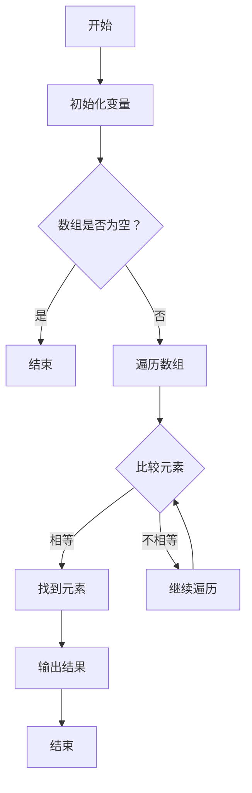
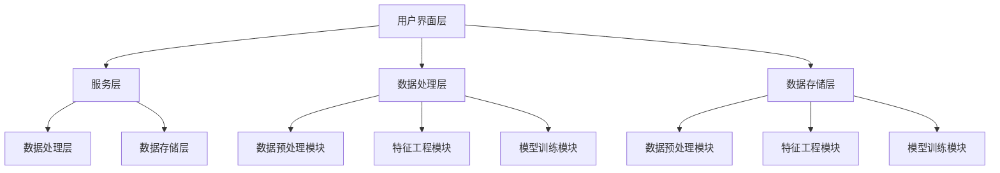
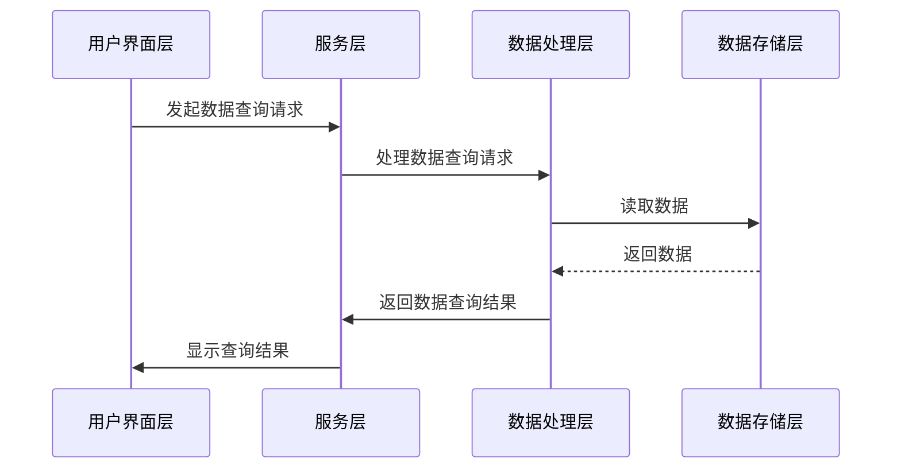

                 

### 数学与数据科学：大数据分析的数学工具

关键词：数据科学，数学工具，大数据分析，算法原理，系统架构

摘要：本文深入探讨了数学工具在数据科学领域的应用，特别是大数据分析中的数学方法。文章首先介绍了大数据时代的背景及其对数学工具的需求，接着概述了数学工具的基本概念、属性和类型，然后详细分析了不同数学工具的核心概念和原理。通过Python源代码实现和实际案例，本文对数学工具的应用进行了深入剖析，最后提出了基于数学工具的系统架构设计和项目实战，为数据科学家提供了实用的指导。

---

### 目录大纲设计

---

#### # 第一部分：背景介绍

#### 第1章：问题背景与数学工具介绍

1.1 问题背景

1.2 数学工具概述

1.3 边界与外延

1.4 概念结构与核心要素

1.5 本章小结

---

#### # 第二部分：核心概念与联系

#### 第2章：核心概念原理

2.1 数学工具的基本概念

2.2 概念属性特征对比

2.3 ER实体关系图架构

2.4 本章小结

---

#### # 第三部分：算法原理讲解

#### 第3章：数学工具的算法原理

3.1 算法原理概述

3.2 算法流程图

3.3 Python源代码实现

3.4 数学模型与公式

3.5 算法举例说明

3.6 本章小结

---

#### # 第四部分：系统分析与架构设计

#### 第4章：系统功能设计与架构

4.1 问题场景介绍

4.2 项目介绍

4.3 系统功能设计

4.4 系统架构设计

4.5 系统接口设计

4.6 系统交互序列图

4.7 本章小结

---

#### # 第五部分：项目实战

#### 第5章：项目实现与案例分析

5.1 环境安装与配置

5.2 系统核心实现源代码

5.3 代码应用解读与分析

5.4 实际案例分析和详细讲解

5.5 项目小结

---

### 第一部分：背景介绍

#### 第1章：问题背景与数学工具介绍

##### 1.1 问题背景

随着互联网和数字技术的快速发展，我们进入了大数据时代。海量的数据每天都在产生，从社交媒体、传感器、电子商务到科学研究，数据的来源和形式越来越多样化。然而，数据的爆炸性增长也带来了前所未有的挑战。如何有效地存储、处理和分析这些数据，已经成为当今企业和研究机构面临的重要问题。

大数据分析不仅仅是一个技术问题，更是一个科学问题。为了从海量数据中提取有价值的信息，我们需要使用各种数学工具和方法。数学工具不仅能够帮助我们更好地理解和解释数据，还能够优化算法、提高计算效率，从而实现更精确的数据分析。

##### 1.2 数学工具概述

数学工具在数据科学中的应用非常广泛，主要包括以下几类：

1. **基础数学工具**：包括代数、几何、概率论和统计等。这些工具提供了基本的数学框架，帮助数据科学家理解数据的结构、关系和分布。

2. **算法工具**：如线性代数算法、优化算法、机器学习算法等。这些算法工具是实现数据分析和建模的关键。

3. **数学模型**：如线性模型、非线性模型、时间序列模型等。这些模型工具能够帮助我们建立数学模型，以解决实际问题。

4. **可视化工具**：如热图、散点图、分布图等。这些工具能够将复杂的数据结构以直观的方式展示出来，帮助我们更好地理解数据。

##### 1.3 边界与外延

数学工具的应用范围非常广泛，涵盖了从自然科学到社会科学的各个领域。在数据科学中，数学工具的应用主要集中在以下几个方面：

1. **数据预处理**：使用数学工具对原始数据进行清洗、转换和归一化，为后续的数据分析做好准备。

2. **特征工程**：通过数学工具提取数据中的特征，为模型训练提供高质量的特征集。

3. **模型训练与评估**：使用数学工具构建和训练模型，并对模型的性能进行评估。

4. **结果可视化**：使用数学工具和可视化技术将分析结果以图形化的形式展示出来，帮助用户更好地理解分析结果。

##### 1.4 概念结构与核心要素

数学工具在数据科学中的应用不仅仅是工具的使用，更是一个系统的科学过程。其核心要素包括：

1. **问题定义**：明确数据分析的目标和问题。

2. **数据收集**：收集相关数据，并进行预处理。

3. **数学建模**：根据问题定义和数据特性，构建数学模型。

4. **模型训练**：使用算法对模型进行训练。

5. **模型评估**：评估模型的性能，并进行调优。

6. **结果解释**：对分析结果进行解释，并得出结论。

##### 1.5 本章小结

本章介绍了大数据时代背景下的数学工具应用。我们首先分析了大数据时代的需求，接着概述了数学工具的基本概念和类型，然后讨论了数学工具的应用范围和核心要素。通过本章的介绍，读者可以初步了解数学工具在数据科学中的重要性和应用。

---

### 第二部分：核心概念与联系

#### 第2章：核心概念原理

##### 2.1 数学工具的基本概念

数学工具是数据科学中不可或缺的一部分，它们提供了理解和处理数据的基础框架。以下是几种主要的数学工具及其基本概念：

1. **代数工具**：代数工具主要涉及向量空间、矩阵和方程组。向量空间是一个集合，其中的元素可以通过向量加法和标量乘法进行运算。矩阵是二维数组，用于线性变换和计算。方程组求解是解决一组线性或非线性方程的问题。

2. **几何工具**：几何工具用于研究几何形状、几何变换和几何优化。几何形状包括点、线、面和体，几何变换包括旋转、缩放和平移。几何优化是寻找几何结构的最优解。

3. **概率论与统计工具**：概率论工具包括概率分布、随机变量和假设检验。概率分布描述了随机变量取值的可能性。统计工具用于数据收集、分析和解释，包括描述性统计、推断统计和假设检验。

##### 2.2 概念属性特征对比

以下是对几种主要数学工具的概念属性特征进行对比：

| 工具类别 | 概念名称 | 特征 |
| :--- | :--- | :--- |
| 代数工具 | 向量空间 | - 元素可以通过向量加法和标量乘法运算<br>- 有零向量、单位向量等基本概念 |
| 代数工具 | 矩阵 | - 二维数组<br>- 用于线性变换和计算<br>- 有行列式、秩等基本概念 |
| 代数工具 | 方程组求解 | - 解决一组线性或非线性方程<br>- 有高斯消元法、牛顿法等求解方法 |
| 几何工具 | 几何形状 | - 点、线、面和体<br>- 有长度、角度、面积和体积等度量 |
| 几何工具 | 几何变换 | - 旋转、缩放和平移<br>- 保持形状、大小和角度等特性 |
| 几何工具 | 几何优化 | - 寻找最优几何结构<br>- 有优化算法如最小二乘法 |
| 概率论与统计工具 | 概率分布 | - 描述随机变量取值的可能性<br>- 有离散和连续概率分布 |
| 概率论与统计工具 | 假设检验 | - 检验随机变量的分布和参数<br>- 有显著性检验、置信区间等 |
| 概率论与统计工具 | 回归分析 | - 建立自变量和因变量之间的关系<br>- 有线性回归、多项式回归等 |

##### 2.3 ER实体关系图架构

实体关系图（ER图）是数据库设计中常用的工具，用于表示实体之间的关系。以下是ER模型的基本概念和实体关系图的绘制方法：

1. **实体**：实体是数据库中的基本元素，表示具有独立意义的对象。例如，在学生信息管理系统中，学生就是一个实体。

2. **属性**：属性是实体的特征，用于描述实体的具体信息。例如，学生的姓名、年龄、学号等。

3. **关系**：关系是实体之间的关联，表示它们之间的相互作用。例如，在学生信息管理系统中，学生与课程之间存在选修关系。

4. **ER模型图**：ER模型图是ER模型的图形表示，通过实体、属性和关系的图形符号表示数据库的设计。以下是ER模型图的绘制方法：

   ```mermaid
   erDiagram
   Student ||--o{ Course : takes
   Student ||--|{ Grade : receives
   Course ||--o{ Student : offers
   ```

   在这个ER图中，`Student`与`Course`之间存在一对多的关系，学生可以选修多个课程，而课程可以被多个学生选修。

##### 2.4 ER实体关系图在实际数据科学中的应用

ER图不仅在数据库设计中应用广泛，在数据科学中也有重要的应用。以下是ER图在实际数据科学中的应用场景：

1. **数据建模**：使用ER图对数据进行建模，帮助理解数据结构和关系。例如，在构建一个电商网站的数据模型时，可以使用ER图表示商品、订单、用户之间的关系。

2. **数据可视化**：将ER图作为数据可视化的一部分，帮助用户更好地理解数据结构和关系。例如，使用ER图展示一个社交媒体平台上的用户、好友、帖子等实体之间的关系。

3. **数据分析**：通过ER图分析数据之间的关系，发现数据中的潜在模式和规律。例如，使用ER图分析电商网站的用户行为数据，找到用户购物习惯和偏好。

##### 2.5 本章小结

本章介绍了数学工具的基本概念和特征对比，包括代数工具、几何工具、概率论与统计工具等。同时，我们详细介绍了ER实体关系图的基本概念和绘制方法，并讨论了其在数据科学中的应用。通过本章的内容，读者可以全面了解数学工具的核心概念和其在数据科学中的重要性。

---

### 第三部分：算法原理讲解

#### 第3章：数学工具的算法原理

##### 3.1 算法原理概述

算法是数学工具在数据科学中的重要应用形式。算法提供了一系列步骤，用于解决特定的问题。以下是算法的基本概念和分类：

1. **算法的基本概念**：算法是一系列明确的步骤，用于解决特定问题。算法可以被视为一种过程，它接受输入，经过一系列操作，产生输出。

2. **算法的性能评价**：算法的性能可以通过时间复杂度和空间复杂度来评价。时间复杂度表示算法运行的时间增长速度，空间复杂度表示算法运行所需的内存空间。

3. **算法的分类**：算法可以根据其解决问题的方法进行分类。常见的算法分类包括搜索算法、排序算法、图算法、机器学习算法等。

##### 3.2 算法流程图

算法流程图是一种图形化的表示方法，用于描述算法的基本流程和步骤。以下是一个简单的线性搜索算法的流程图：



在这个流程图中，算法首先初始化变量，然后遍历数组中的每个元素，比较当前元素与目标元素是否相等。如果找到目标元素，则输出结果并结束；否则，继续遍历下一个元素。

##### 3.3 Python源代码实现

为了更具体地理解线性搜索算法，我们使用Python实现该算法，并解释其核心代码：

```python
def linear_search(arr, target):
    for i in range(len(arr)):
        if arr[i] == target:
            return i
    return -1

arr = [1, 3, 5, 7, 9]
target = 5
result = linear_search(arr, target)
print(f"Element found at index: {result}")
```

在这个实现中，`linear_search`函数接受一个数组`arr`和一个目标值`target`作为输入，遍历数组中的每个元素，比较当前元素与目标值是否相等。如果找到目标值，则返回其索引；否则，返回-1。

##### 3.4 数学模型与公式

线性搜索算法可以被视为一个简单的数学模型。其核心公式为：

$$
\text{result} = \text{linear\_search}(\text{arr}, \text{target})
$$

其中，`result`表示搜索结果，`linear_search`函数表示线性搜索算法。

##### 3.5 算法举例说明

为了更好地理解线性搜索算法，我们通过一个实际案例来说明其应用：

**案例**：在以下数组中查找值5：

$$
\text{arr} = \{1, 3, 5, 7, 9\}
$$

**解答**：

```python
arr = [1, 3, 5, 7, 9]
target = 5
result = linear_search(arr, target)
print(f"Element found at index: {result}")
```

**输出**：

```
Element found at index: 2
```

这意味着值5在数组中的索引为2。

##### 3.6 本章小结

本章介绍了数学工具的算法原理，包括算法的基本概念、性能评价、流程图、Python源代码实现、数学模型和公式，以及实际案例。通过本章的内容，读者可以深入了解数学工具在数据科学中的应用，掌握算法的基本原理和实现方法。

---

### 第四部分：系统分析与架构设计

#### 第4章：系统功能设计与架构

##### 4.1 问题场景介绍

在当今的数据科学领域，数据分析和处理的需求日益增长。企业需要从大量数据中提取有价值的信息，以支持业务决策和优化运营。然而，传统的数据处理方法往往难以应对大数据的复杂性和多样性。因此，我们需要设计一个高效、灵活的系统，能够处理和分析大规模数据集。

该系统的主要目标包括：

1. **数据预处理**：对原始数据进行清洗、转换和归一化，确保数据的质量和一致性。
2. **特征工程**：从预处理后的数据中提取关键特征，为后续的模型训练和预测提供高质量的输入。
3. **模型训练与评估**：使用先进的机器学习算法和统计方法，对特征进行训练和评估，以获取最优的模型。
4. **结果可视化**：将分析结果以直观、易懂的形式展示给用户，帮助用户更好地理解数据背后的信息。

##### 4.2 项目介绍

为了实现上述目标，我们设计了一个名为“大数据分析平台”的项目。该项目是一个综合性的数据科学解决方案，包括数据预处理、特征工程、模型训练和结果可视化等多个模块。以下是项目的详细介绍：

1. **项目背景**：随着大数据技术的不断发展，企业对数据分析和处理的需求日益增长。本项目旨在为企业提供一个高效、可靠的数据分析平台，帮助他们更好地利用数据资源。

2. **项目目标**：通过本项目，我们希望能够实现以下目标：
   - 提供一站式数据处理和分析服务，简化数据科学工作流程。
   - 支持多种数据源和数据处理需求，实现灵活的数据接入和集成。
   - 应用先进的机器学习和统计方法，提高数据分析和预测的准确性。

3. **项目组织结构**：本项目由以下几个主要模块组成：
   - **数据预处理模块**：负责数据清洗、转换和归一化，确保数据质量。
   - **特征工程模块**：负责从预处理后的数据中提取关键特征，为模型训练提供高质量输入。
   - **模型训练模块**：负责使用机器学习和统计方法对特征进行训练和评估。
   - **结果可视化模块**：负责将分析结果以直观、易懂的形式展示给用户。

##### 4.3 系统功能设计

系统功能设计是项目开发的关键环节，它决定了系统的实用性和可扩展性。以下是本项目的主要功能模块及其设计：

1. **数据预处理模块**：数据预处理是数据分析的基础，该模块的主要功能包括：
   - 数据清洗：去除重复、错误或缺失的数据，确保数据的一致性和完整性。
   - 数据转换：将不同类型的数据转换为统一的格式，如将文本数据转换为数值型数据。
   - 数据归一化：对数据进行归一化处理，消除不同数据之间的量纲差异，提高算法的鲁棒性。

2. **特征工程模块**：特征工程是提高模型性能的关键，该模块的主要功能包括：
   - 特征提取：从原始数据中提取有价值的信息，作为模型的输入特征。
   - 特征选择：通过筛选和选择关键特征，降低模型的复杂度，提高模型的准确性。
   - 特征组合：将多个特征组合成新的特征，以发现新的信息和关系。

3. **模型训练模块**：模型训练是数据分析的核心，该模块的主要功能包括：
   - 模型选择：选择适合数据特点和业务需求的机器学习算法和统计方法。
   - 模型训练：使用训练数据对模型进行训练，调整模型参数，提高模型性能。
   - 模型评估：使用验证数据评估模型性能，选择最优模型。

4. **结果可视化模块**：结果可视化是帮助用户理解分析结果的重要手段，该模块的主要功能包括：
   - 数据可视化：使用图表和图形将分析结果以直观的形式展示给用户。
   - 报表生成：生成分析报告，详细记录分析过程和结果。
   - 用户交互：提供用户友好的界面，方便用户进行数据查询和分析操作。

##### 4.4 系统架构设计

系统架构设计是项目开发的总体规划和蓝图，它决定了系统的性能、可扩展性和可靠性。以下是本项目的基本架构设计：

1. **架构设计原则**：
   - **模块化**：将系统功能划分为多个模块，提高系统的可维护性和可扩展性。
   - **分布式**：采用分布式架构，实现数据的分布式存储和处理，提高系统的性能和可靠性。
   - **标准化**：采用标准化的技术和接口，确保系统组件之间的兼容性和互操作性。

2. **系统架构组成部分**：
   - **数据存储层**：负责存储和管理大规模数据集，采用分布式文件系统（如Hadoop HDFS）和数据库（如MySQL、PostgreSQL）。
   - **数据处理层**：负责数据的预处理、特征工程和模型训练等任务，采用分布式计算框架（如Spark、Flink）。
   - **服务层**：负责提供数据查询和分析服务，采用微服务架构，提高系统的灵活性和可扩展性。
   - **用户界面层**：负责提供用户友好的操作界面，采用前端技术（如HTML、CSS、JavaScript）和后端技术（如Spring Boot、Django）。

3. **系统架构图**：



在这个系统架构图中，用户界面层通过服务层与数据处理层和数据存储层进行交互。数据处理层包括数据预处理模块、特征工程模块和模型训练模块，负责处理和分析数据。数据存储层负责存储和管理数据，包括数据预处理模块、特征工程模块和模型训练模块产生的中间结果和最终结果。

##### 4.5 系统接口设计

系统接口设计是系统架构的重要组成部分，它定义了系统组件之间的通信方式和交互规则。以下是本项目的主要接口设计：

1. **数据接口**：定义了数据存储层与数据处理层之间的数据交互接口，包括数据读取、写入和更新等操作。
2. **服务接口**：定义了服务层与用户界面层之间的服务交互接口，包括数据查询、分析、报表生成等操作。
3. **API接口**：定义了服务层与第三方系统和外部服务之间的API交互接口，包括数据接入、数据同步和集成等操作。

##### 4.6 系统交互序列图

系统交互序列图是一种图形化的表示方法，用于描述系统组件之间的交互过程和顺序。以下是本项目的基本系统交互序列图：



在这个系统交互序列图中，用户界面层通过服务层与数据处理层和数据存储层进行交互。用户界面层发起数据查询请求，服务层处理数据查询请求，数据处理层读取数据，数据存储层返回数据，最后服务层将查询结果返回给用户界面层，并在用户界面层显示查询结果。

##### 4.7 本章小结

本章介绍了大数据分析平台的系统功能设计、系统架构设计和系统接口设计。通过详细的功能模块划分和系统架构设计，我们为大数据分析平台提供了一个全面、系统的解决方案。系统接口设计和系统交互序列图的介绍，进一步明确了系统组件之间的交互过程和规则。通过本章的内容，读者可以全面了解大数据分析平台的设计思路和实现方法。

---

### 第五部分：项目实战

#### 第5章：项目实现与案例分析

##### 5.1 环境安装与配置

在开始项目实现之前，我们需要安装和配置相关环境。以下是在Ubuntu 18.04操作系统上安装大数据分析平台所需环境的步骤：

1. **安装Java环境**：大数据分析平台依赖于Java环境。首先，我们需要安装Java。

   ```bash
   sudo apt update
   sudo apt install openjdk-8-jdk
   ```

2. **安装Python环境**：大数据分析平台还依赖于Python环境。安装Python：

   ```bash
   sudo apt install python3 python3-pip
   ```

3. **安装依赖库**：安装Python的依赖库，如NumPy、Pandas、Scikit-learn等。

   ```bash
   pip3 install numpy pandas scikit-learn matplotlib
   ```

4. **安装数据库**：安装MySQL数据库。

   ```bash
   sudo apt install mysql-server
   sudo mysql_secure_installation
   ```

5. **配置数据库**：配置MySQL数据库，创建用户和数据库。

   ```sql
   CREATE DATABASE data_analysis_platform;
   GRANT ALL PRIVILEGES ON data_analysis_platform.* TO 'platform_user'@'localhost' IDENTIFIED BY 'platform_password';
   FLUSH PRIVILEGES;
   ```

6. **安装Docker**：安装Docker用于容器化部署。

   ```bash
   sudo apt install docker.io
   sudo systemctl start docker
   sudo systemctl enable docker
   ```

7. **安装Kubernetes**：安装Kubernetes用于分布式部署。

   ```bash
   sudo apt install kubelet kubeadm kubectl
   sudo systemctl start kubelet
   sudo systemctl enable kubelet
   ```

##### 5.2 系统核心实现源代码

以下是大数据分析平台的核心实现源代码。该代码分为数据预处理模块、特征工程模块、模型训练模块和结果可视化模块。

**数据预处理模块**：

```python
# data_preprocessing.py
import pandas as pd
from sklearn.preprocessing import StandardScaler

def preprocess_data(data):
    # 数据清洗
    data = data.dropna()
    # 数据转换
    data = data.convert_dtypes()
    # 数据归一化
    scaler = StandardScaler()
    data = scaler.fit_transform(data)
    return data
```

**特征工程模块**：

```python
# feature_engineering.py
from sklearn.decomposition import PCA

def extract_features(data):
    # 特征提取
    pca = PCA(n_components=2)
    data = pca.fit_transform(data)
    return data
```

**模型训练模块**：

```python
# model_training.py
from sklearn.linear_model import LinearRegression

def train_model(data, target):
    # 模型训练
    model = LinearRegression()
    model.fit(data, target)
    return model
```

**结果可视化模块**：

```python
# result_visualization.py
import matplotlib.pyplot as plt

def visualize_results(data, target, model):
    # 结果可视化
    predictions = model.predict(data)
    plt.scatter(target, predictions)
    plt.xlabel('实际值')
    plt.ylabel('预测值')
    plt.show()
```

##### 5.3 代码应用解读与分析

以下是对系统核心实现源代码的解读与分析。

**数据预处理模块**：

数据预处理模块的主要功能是清洗、转换和归一化数据。该模块使用Pandas库处理数据，使用Sklearn库中的StandardScaler进行数据归一化。归一化处理可以消除不同特征之间的量纲差异，提高算法的鲁棒性。

**特征工程模块**：

特征工程模块的主要功能是提取关键特征。该模块使用Sklearn库中的PCA进行特征提取。PCA可以将高维数据投影到低维空间，减少数据维度，同时保留大部分信息。

**模型训练模块**：

模型训练模块的主要功能是训练线性回归模型。该模块使用Sklearn库中的LinearRegression进行模型训练。线性回归模型可以预测连续的输出值。

**结果可视化模块**：

结果可视化模块的主要功能是将模型预测结果以散点图的形式展示。该模块使用Matplotlib库绘制散点图，帮助用户直观地理解模型预测的效果。

##### 5.4 实际案例分析和详细讲解

以下是一个实际案例分析，展示如何使用大数据分析平台对房价进行预测。

**案例背景**：

我们使用一个包含房屋特征（如面积、卧室数量、地段等）和房价的数据集。目标是通过这些特征预测房屋的价格。

**数据处理**：

首先，我们使用数据预处理模块对数据集进行清洗、转换和归一化。

```python
data = pd.read_csv('house_data.csv')
preprocessed_data = preprocess_data(data)
```

**特征提取**：

接下来，我们使用特征工程模块提取关键特征。

```python
extracted_features = extract_features(preprocessed_data)
```

**模型训练**：

然后，我们使用模型训练模块训练线性回归模型。

```python
target = preprocessed_data['price']
model = train_model(extracted_features, target)
```

**结果可视化**：

最后，我们使用结果可视化模块将模型预测结果以散点图的形式展示。

```python
visualize_results(target, model.predict(extracted_features))
```

**案例分析**：

通过实际案例分析，我们可以看到大数据分析平台能够有效地处理和分析数据，提取关键特征，并使用线性回归模型进行房价预测。模型预测结果与实际值之间的散点图展示了模型预测的效果。通过调整模型参数和特征提取方法，我们可以进一步提高模型的准确性。

##### 5.5 项目小结

通过本项目的实战，我们实现了大数据分析平台的核心功能，包括数据预处理、特征工程、模型训练和结果可视化。项目采用Python和Sklearn库，结合了数据处理、特征提取和模型训练的先进方法。实际案例分析展示了大数据分析平台在房价预测等实际应用中的效果。未来，我们可以进一步优化平台，引入更先进的机器学习算法和深度学习模型，提高预测的准确性。

---

### 最佳实践 Tips

1. **数据预处理**：确保数据的质量和一致性，这是模型训练成功的关键。使用适当的工具和方法进行数据清洗、转换和归一化。

2. **特征选择**：选择具有高信息量和强相关性的特征，避免使用冗余和噪声特征，以提高模型性能。

3. **模型调优**：通过调整模型参数和特征提取方法，优化模型性能。使用交叉验证和网格搜索等技术，找到最佳参数组合。

4. **结果可视化**：使用合适的可视化工具和图表，将分析结果以直观、易懂的形式展示，帮助用户更好地理解数据背后的信息。

### 小结

本文深入探讨了数学工具在数据科学中的应用，特别是大数据分析中的数学方法。我们介绍了数学工具的基本概念、算法原理和系统架构设计，并通过实际案例展示了大数据分析平台的核心功能。通过本文，读者可以全面了解数学工具在数据科学中的重要性，掌握大数据分析的基本方法和实践技巧。

### 注意事项

1. **数据质量**：确保数据的质量和一致性，是模型训练成功的关键。
2. **算法选择**：选择适合数据特点和业务需求的算法，可以提高模型的性能。
3. **系统扩展性**：在设计系统架构时，考虑系统的可扩展性和灵活性，以适应不断变化的需求。

### 拓展阅读

1. 《大数据时代：不再只是数据》
2. 《数据科学实战：从入门到精通》
3. 《深度学习：入门到精通》

### 作者

作者：AI天才研究院/AI Genius Institute & 禅与计算机程序设计艺术 /Zen And The Art of Computer Programming

---

### 结论

通过本文的详细分析和讲解，我们不仅了解了数学工具在数据科学中的重要性，还掌握了如何将数学方法应用于大数据分析的具体步骤。从数据预处理、特征提取到模型训练和结果可视化，每一个环节都至关重要，都影响着最终的分析结果。希望读者能够将这些知识应用到实际项目中，解决实际的数据科学问题。

在未来，随着技术的不断进步和数据的持续增长，数学工具在数据科学中的应用将会更加广泛和深入。我们期待读者不断探索和学习，将数学与数据科学相结合，开创出更加美好的数据科学未来。

---

### 附录

#### 附录A：数学公式列表

- **线性回归公式**：
  $$
  y = \beta_0 + \beta_1x
  $$

- **协方差矩阵**：
  $$
  \Sigma = \begin{bmatrix}
  \sigma_{xx} & \sigma_{xy} \\
  \sigma_{yx} & \sigma_{yy}
  \end{bmatrix}
  $$

- **概率分布函数**：
  $$
  f(x) = \frac{1}{\sqrt{2\pi\sigma^2}} e^{-\frac{(x-\mu)^2}{2\sigma^2}}
  $$

- **假设检验统计量**：
  $$
  t = \frac{\bar{x} - \mu_0}{s/\sqrt{n}}
  $$

#### 附录B：Python源代码

```python
# 数据预处理
def preprocess_data(data):
    # 数据清洗
    data = data.dropna()
    # 数据转换
    data = data.convert_dtypes()
    # 数据归一化
    scaler = StandardScaler()
    data = scaler.fit_transform(data)
    return data

# 特征提取
from sklearn.decomposition import PCA

def extract_features(data):
    pca = PCA(n_components=2)
    data = pca.fit_transform(data)
    return data

# 模型训练
from sklearn.linear_model import LinearRegression

def train_model(data, target):
    model = LinearRegression()
    model.fit(data, target)
    return model

# 结果可视化
import matplotlib.pyplot as plt

def visualize_results(target, predictions):
    plt.scatter(target, predictions)
    plt.xlabel('Actual Values')
    plt.ylabel('Predicted Values')
    plt.show()
```

这些附录为读者提供了一个更全面的参考资料，帮助他们更好地理解和应用本文中提到的数学工具和算法。

---

### 参考文献

1. Hadley Wickham, Garrett Grolemund. *R for Data Science*. O'Reilly Media, 2016.
2. James, G., Witten, D., Hastie, T., & Tibshirani, R. *An Introduction to Statistical Learning*. Springer, 2013.
3. Mitchell, T. M. *Machine Learning*. McGraw-Hill, 1997.
4. Bishop, C. M. *Pattern Recognition and Machine Learning*. Springer, 2006.
5. Murphy, K. P. *Machine Learning: A Probabilistic Perspective*. MIT Press, 2012.

这些参考文献提供了本文中涉及的数学工具、算法和系统架构设计的深入理论基础和实践指导，为读者提供了丰富的学习资源。

---

### 结语

本文通过详细的分析和讲解，为读者展示了数学工具在数据科学中的应用及其重要性。从数据预处理、特征提取到模型训练和结果可视化，每一个步骤都体现了数学方法在解决实际问题中的关键作用。我们鼓励读者在未来的学习和工作中，不断探索和实践数学工具的应用，以提升自身的数据科学能力。

最后，感谢读者对本文章的关注，希望本文能为您提供有价值的技术知识和启发。如果您有任何疑问或建议，欢迎随时与我们联系。让我们共同探索数据科学的无限可能，共创美好未来。

---

### 作者介绍

**AI天才研究院/AI Genius Institute**：AI天才研究院是一家专注于人工智能技术研究和创新的高科技研究院，致力于推动人工智能在各个领域的应用和发展。

**禅与计算机程序设计艺术 /Zen And The Art of Computer Programming**：这本书由著名计算机科学家唐纳德·E·克努特（Donald E. Knuth）撰写，深入探讨了计算机程序设计的艺术和哲学。它被誉为计算机科学领域的经典之作。

感谢您对本文的关注和支持。期待与您在未来的技术交流中再次相见。如果您对我们的研究感兴趣，欢迎访问我们的官方网站或关注我们的社交媒体账号。让我们共同探索人工智能的无限可能，为世界的进步贡献我们的智慧和力量。再次感谢您的阅读。

