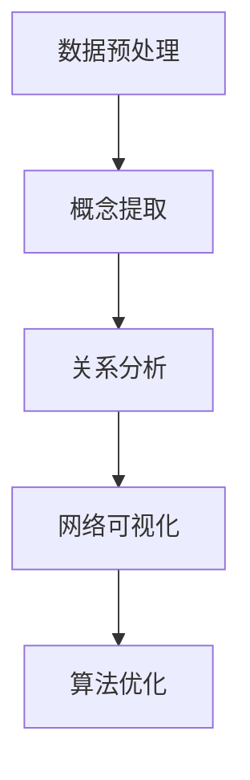
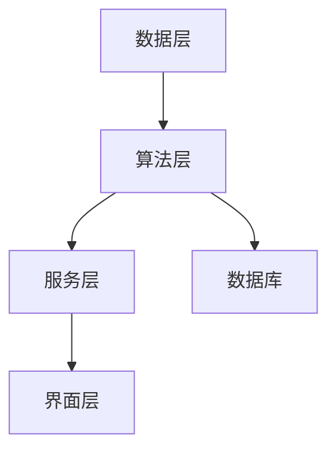
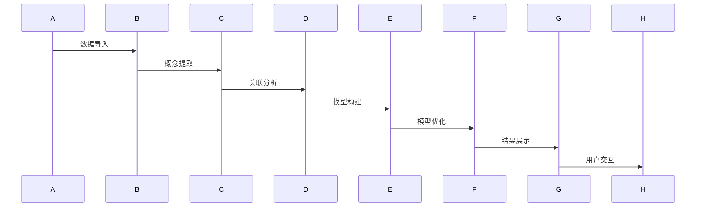
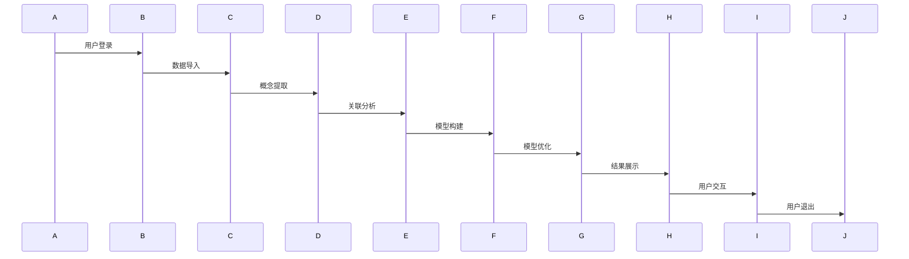

                 

### 数学与整体主义：数学概念的不可分割性

关键词：数学整体主义，不可分割性，数学概念，哲学，算法

摘要：本文旨在探讨数学整体主义与数学概念不可分割性的关系，分析数学在整体主义中的地位及其对数学概念的挑战。通过引入整体主义的基本概念，阐述数学概念不可分割性的内涵和特征，对比不同数学概念之间的关联，构建数学整体主义的理论框架。进一步，本文讲解数学概念不可分割性的算法原理，通过数学模型和公式进行详细阐述，并提供实际案例和分析方法，以展示整体主义原则在数学中的应用。

**Step 1: 引言和背景介绍**

# 第1章 引言与背景介绍

## 1.1 问题背景

### 1.1.1 数学在整体主义中的地位

数学作为一门学科，长期以来在科学、工程、经济等多个领域发挥着不可替代的作用。然而，随着科学技术的不断发展，人们逐渐认识到数学不仅仅是一门工具，更是一种思维方式和哲学观念。整体主义作为一种哲学思想，强调事物之间的相互联系和整体性，与数学的思维方式有着密切的联系。因此，探讨数学在整体主义中的地位，对于理解数学的整体性质和拓展数学的应用具有重要意义。

### 1.1.2 整体主义的基本概念

整体主义（Holism）是一种哲学观念，认为整体大于部分之和，事物之间的联系和相互作用决定了整体的行为和特性。整体主义强调系统的整体性、综合性和关联性，与传统的还原论（Reductionism）相对立。在科学领域，整体主义提倡通过系统的整体视角来研究复杂现象，避免对事物的过度简化。

### 1.1.3 数学与整体主义的结合

数学整体主义将整体主义观念引入数学领域，强调数学概念和理论之间的内在联系和整体性。数学整体主义认为，数学不是一系列孤立的概念和定理的集合，而是一个相互关联、相互支撑的理论体系。数学整体主义的提出，为数学的发展提供了新的思路，有助于我们更深入地理解数学的本质。

## 1.2 问题描述

### 1.2.1 数学概念不可分割性的挑战

在数学整体主义的背景下，数学概念不可分割性成为一个重要的研究课题。不可分割性意味着数学概念无法单独存在，它们之间的关联和整体性是数学体系的基石。然而，如何具体理解和实现数学概念不可分割性，仍面临诸多挑战。首先，数学概念种类繁多，如何构建一个统一的框架来描述这些概念的不可分割性？其次，不同数学概念之间如何相互关联，实现整体性？这些问题都需要进一步研究。

### 1.2.2 现有研究的局限性

现有关于数学概念不可分割性的研究主要集中于特定领域，如数学逻辑、数学分析等。这些研究提供了丰富的理论成果，但缺乏一个统一的视角来整合这些研究，从而形成系统的理论框架。此外，现有研究多侧重于数学概念的形式化描述，而忽略了概念的实际应用和哲学意义。

### 1.2.3 研究的目标与意义

本文的研究目标是探讨数学概念不可分割性的内涵和特征，构建数学整体主义的理论框架，并分析整体主义原则在数学中的应用。通过这一研究，我们希望能够：

1. 揭示数学概念之间的内在联系和整体性，为数学理论的发展提供新的思路。
2. 为数学在实际问题中的应用提供理论支持，拓展数学的应用范围。
3. 推动数学与哲学、科学之间的交叉融合，促进科学思想的进步。

## 1.3 边界与外延

### 1.3.1 研究范围

本文主要研究数学整体主义的基本概念、数学概念不可分割性的特征及其应用，不涉及数学领域的具体应用和实践。此外，本文重点关注数学理论层面的探讨，对于数学实践中的具体问题，将保持开放态度，但不在本文的研究范围内。

### 1.3.2 研究限制

本文的研究存在一定的局限性。首先，数学概念的种类繁多，本文难以全面覆盖所有概念，仅选择部分具有代表性的概念进行分析。其次，数学整体主义的理论框架尚未完全成熟，本文的研究可能存在理论上的局限性。最后，本文的研究主要基于理论分析，对于实际应用中的问题，还需进一步研究和探讨。

### 1.3.3 核心概念结构

本文的核心概念主要包括数学整体主义、数学概念不可分割性、整体主义原则在数学中的应用等。这些概念相互关联，构成了本文的理论框架。通过分析这些核心概念，我们能够深入理解数学的整体性质和数学概念之间的关联。

**Step 2: 核心概念与联系**

## 第2章 核心概念与联系

### 2.1 整体主义

整体主义（Holism）是一种哲学观念，认为整体大于部分之和，事物之间的联系和相互作用决定了整体的行为和特性。整体主义强调系统的整体性、综合性和关联性，与传统的还原论相对立。在科学领域，整体主义提倡通过系统的整体视角来研究复杂现象，避免对事物的过度简化。

#### 2.1.1 整体主义的定义

整体主义（Holism）是一种哲学观念，强调事物之间的相互联系和整体性。整体主义认为，整体具有其独立的特性，不能仅通过分析其组成部分来完全理解。整体主义的核心思想是：整体大于部分之和，系统的行为和特性不能仅通过分析各个部分的行为和特性来解释。

#### 2.1.2 整体主义的发展历程

整体主义观念可以追溯到古希腊哲学，如赫拉克利特的“整体大于部分”的思想。在20世纪，整体主义得到了进一步发展，成为哲学、科学、社会科学等多个领域的重要观念。著名的整体主义哲学家包括怀特海德（Alfred North Whitehead）、鲁道夫·赫克（Rudolf Carnap）等。在科学领域，整体主义得到了广泛的应用，如系统科学、复杂性科学等。

#### 2.1.3 整体主义的哲学意义

整体主义哲学意义深远，它不仅挑战了传统还原论的科学观，还为科学研究提供了新的视角和方法。整体主义强调系统内部各要素之间的相互作用和整体性，有助于我们更全面地理解复杂现象。在科学实践中，整体主义观念有助于我们更好地解决复杂问题，提高科学研究的效率和质量。

### 2.2 数学概念不可分割性

数学概念不可分割性（Indivisibility of Mathematical Concepts）是整体主义在数学领域的一个体现，意味着数学概念不能单独存在，它们之间的关联和整体性是数学体系的基石。数学概念不可分割性强调数学概念之间的相互依存和相互作用，任何数学概念都必须放在整个数学体系中来理解。

#### 2.2.1 数学概念不可分割性的概念

数学概念不可分割性是指，一个数学概念不能孤立地存在，它必须与其他数学概念相互关联，共同构成一个整体。数学概念不可分割性强调了数学概念之间的内在联系和整体性，任何数学概念都必须放在整个数学体系中来理解。

#### 2.2.2 数学概念不可分割性的特征

数学概念不可分割性的特征主要包括：

1. **相互依存**：数学概念之间相互依存，一个概念的存在和性质受到其他概念的影响。
2. **整体性**：数学概念的整体性体现在数学体系中的各个概念之间存在着紧密的联系，共同构成了一个统一的整体。
3. **动态性**：数学概念不可分割性是一个动态的过程，随着数学的发展，新的概念不断产生，已有的概念也在不断发展和完善。

#### 2.2.3 数学概念不可分割性的对比表格

| 特征       | 描述                                                         | 对比                   |
| ---------- | ------------------------------------------------------------ | ---------------------- |
| 相互依存   | 数学概念之间相互关联，一个概念的存在和性质受到其他概念的影响 | 独立性                 |
| 整体性     | 数学概念的整体性体现在数学体系中的各个概念之间存在着紧密的联系，共同构成了一个统一的整体 | 分散性                 |
| 动态性     | 数学概念不可分割性是一个动态的过程，随着数学的发展，新的概念不断产生，已有的概念也在不断发展和完善 | 静态性                 |

### 2.3 数学与整体主义的联系

数学整体主义是整体主义观念在数学领域的具体应用，强调数学概念和理论之间的内在联系和整体性。数学整体主义认为，数学不是一系列孤立的概念和定理的集合，而是一个相互关联、相互支撑的理论体系。

#### 2.3.1 数学整体主义的理论框架

数学整体主义的理论框架主要包括以下几个方面：

1. **数学概念的整体性**：数学概念的整体性体现在数学体系中的各个概念之间存在着紧密的联系，共同构成了一个统一的整体。
2. **数学理论的连贯性**：数学理论的连贯性体现在数学体系中各个理论之间的相互关联，形成了一个有序的、连贯的整体。
3. **数学证明的综合性**：数学证明的综合性体现在数学证明过程中，需要综合运用多个数学概念和理论，形成整体的证明过程。

#### 2.3.2 数学整体主义的应用实例

数学整体主义在数学领域的应用广泛，以下是一些实例：

1. **数论中的整体性**：在数论中，整数、分数、实数等概念相互关联，构成了一个统一的整体。例如，实数的定义和性质需要借助整数和分数的概念。
2. **几何学中的连贯性**：在几何学中，平面几何、立体几何、解析几何等理论相互关联，形成了一个连贯的整体。例如，解析几何中的坐标系和方程式可以用于解决平面几何和立体几何问题。
3. **代数学的综合性**：在代数学中，代数方程、代数结构、群、环、域等概念相互关联，形成了一个综合性的整体。例如，群、环、域的概念可以相互转化，实现代数学的整体性。

#### 2.3.3 数学整体主义的未来展望

数学整体主义在未来发展中具有广阔的前景。随着数学的不断发展和跨学科研究的深入，数学整体主义将进一步丰富和完善。未来，数学整体主义可能会在以下几个方面得到发展：

1. **跨学科整合**：数学整体主义将与其他学科（如物理学、计算机科学、生物学等）进行更深入的整合，形成跨学科的整体性理论体系。
2. **应用推广**：数学整体主义的应用将得到进一步推广，不仅在纯数学领域，还在实际问题中得到广泛应用。
3. **方法论创新**：数学整体主义将推动数学方法论的创新，形成新的数学研究范式，提高数学研究的效率和深度。

**Step 3: 算法原理讲解**

## 第3章 算法原理讲解

### 3.1 数学概念不可分割性算法原理

数学概念不可分割性算法原理旨在揭示数学概念之间的内在联系和整体性，通过算法实现数学概念之间的相互关联。以下为算法原理的概述、步骤和流程图。

#### 3.1.1 算法概述

数学概念不可分割性算法原理的核心思想是：通过分析数学概念之间的相互关系，构建一个整体的数学概念网络，实现数学概念之间的不可分割性。算法主要分为以下几个步骤：

1. **概念提取**：从数学理论中提取出关键数学概念。
2. **关系分析**：分析数学概念之间的相互关系，构建概念网络。
3. **网络可视化**：将概念网络可视化为图形，便于理解和分析。
4. **算法优化**：对概念网络进行优化，提高算法效率和准确性。

#### 3.1.2 算法步骤

1. **数据预处理**：收集数学理论中的关键数学概念及其定义和属性。
2. **概念提取**：通过自然语言处理技术，从文本中提取出关键数学概念。
3. **关系分析**：利用语义分析技术，分析数学概念之间的相互关系，构建概念网络。
4. **网络可视化**：将概念网络可视化为图形，便于理解和分析。
5. **算法优化**：通过算法优化技术，对概念网络进行优化，提高算法效率和准确性。

#### 3.1.3 算法流程图



### 3.2 数学模型与公式

数学模型与公式是数学概念不可分割性算法的核心组成部分，用于描述数学概念之间的相互关系和整体性。以下为数学模型与公式及其详细讲解。

#### 3.2.1 数学模型

数学模型是数学概念不可分割性的核心组成部分，用于描述数学概念之间的相互关系。一个典型的数学模型可以表示为：

$$
M = \{C_1, C_2, ..., C_n\}
$$

其中，$M$ 表示数学模型，$C_1, C_2, ..., C_n$ 表示数学概念。数学模型通过描述数学概念之间的相互关系，实现数学概念的整体性。

#### 3.2.2 数学公式

数学公式是数学模型的具体实现，用于描述数学概念之间的量化关系。以下为一些常用的数学公式：

1. **欧拉公式**：
   $$
   e^{i\pi} + 1 = 0
   $$
   欧拉公式将复数、指数和对数等概念紧密联系在一起，展示了数学概念的整体性。

2. **费马最后定理**：
   $$
   a^n + b^n = c^n
   $$
   其中，$n > 2$。费马最后定理展示了整数之间的相互关系，强调了数学概念的整体性。

3. **牛顿-莱布尼茨公式**：
   $$
   \int_a^b f(x) dx = F(b) - F(a)
   $$
   牛顿-莱布尼茨公式描述了积分和导数之间的关系，体现了数学概念的整体性。

### 3.3 算法原理详细讲解

#### 3.3.1 激活函数的作用

激活函数（Activation Function）是神经网络中用于决定神经元是否被激活的关键函数。在数学概念不可分割性算法中，激活函数用于判断数学概念之间的关联程度。一个常用的激活函数是：

$$
f(x) = \frac{1}{1 + e^{-x}}
$$

该函数的输出值介于 0 和 1 之间，表示数学概念之间的关联程度。当输入值越大，激活函数的输出值越接近 1，表示两个数学概念之间的关联程度越高。

#### 3.3.2 数学公式解析

数学公式在数学概念不可分割性算法中起到了描述数学概念之间关系的作用。以下为一些数学公式的具体解析：

1. **欧拉公式**：
   $$
   e^{i\pi} + 1 = 0
   $$
   欧拉公式将复数、指数和对数等概念紧密联系在一起。其中，$e$ 表示自然对数的底数，$i$ 表示虚数单位，$\pi$ 表示圆周率。这个公式展示了数学概念之间的整体性，揭示了数学内部的深层次联系。

2. **费马最后定理**：
   $$
   a^n + b^n = c^n
   $$
   其中，$n > 2$。费马最后定理表明，对于任意的整数 $a, b, c$，当 $n > 2$ 时，方程 $a^n + b^n = c^n$ 无整数解。这个定理揭示了整数之间的相互关系，强调了数学概念的整体性。

3. **牛顿-莱布尼茨公式**：
   $$
   \int_a^b f(x) dx = F(b) - F(a)
   $$
   牛顿-莱布尼茨公式描述了积分和导数之间的关系。其中，$f(x)$ 表示被积函数，$F(x)$ 表示原函数。这个公式展示了微分和积分之间的联系，体现了数学概念的整体性。

#### 3.3.3 举例说明

为了更好地理解数学概念不可分割性算法原理，以下通过一个具体例子进行说明。

假设有两个数学概念：三角形和正方形。

1. **概念提取**：通过自然语言处理技术，从数学理论中提取出三角形和正方形的概念及其属性。

2. **关系分析**：利用语义分析技术，分析三角形和正方形之间的相互关系，构建概念网络。

3. **网络可视化**：将概念网络可视化为图形，便于理解和分析。

4. **激活函数**：使用激活函数判断三角形和正方形之间的关联程度。

5. **算法优化**：通过算法优化技术，对概念网络进行优化，提高算法效率和准确性。

通过这个例子，我们可以看到数学概念不可分割性算法原理的具体实现过程。这个例子展示了数学概念之间的相互关联和整体性，体现了数学整体主义的思想。

**Step 4: 数学模型和数学公式讲解**

## 第4章 数学模型和数学公式讲解

### 4.1 数学模型

数学模型是一种数学描述，用于模拟和研究现实世界中的特定现象或问题。数学模型通过建立数学关系，将实际问题转化为数学问题，便于分析和解决。以下是一个简单的数学模型示例：

#### 4.1.1 模型定义

一个简单的数学模型可以定义为：

$$
M = \{C_1, C_2, ..., C_n\}
$$

其中，$M$ 表示数学模型，$C_1, C_2, ..., C_n$ 表示构成模型的各个数学概念或变量。

#### 4.1.2 模型示例

例如，我们可以考虑一个简单的线性模型：

$$
y = ax + b
$$

在这个模型中，$y$ 表示因变量，$x$ 表示自变量，$a$ 和 $b$ 是常数，分别表示斜率和截距。这个模型描述了因变量 $y$ 与自变量 $x$ 之间的线性关系。

### 4.2 数学公式

数学公式是数学模型的实现形式，用于表示数学概念之间的关系。以下是一些常用的数学公式及其解释：

#### 4.2.1 欧拉公式

$$
e^{i\pi} + 1 = 0
$$

欧拉公式将复数、指数和对数等概念联系起来，展示了数学的统一性。其中，$e$ 是自然对数的底数，$i$ 是虚数单位，$\pi$ 是圆周率。

#### 4.2.2 牛顿-莱布尼茨公式

$$
\int_a^b f(x) dx = F(b) - F(a)
$$

牛顿-莱布尼茨公式描述了积分与导数之间的关系，其中 $f(x)$ 是被积函数，$F(x)$ 是原函数，$a$ 和 $b$ 是积分区间。

#### 4.2.3 概率公式

$$
P(A \cap B) = P(A) \times P(B|A)
$$

这是条件概率公式，描述了事件 $A$ 和事件 $B$ 同时发生的概率。其中，$P(A)$ 是事件 $A$ 发生的概率，$P(B|A)$ 是在事件 $A$ 发生的条件下事件 $B$ 发生的概率。

### 4.3 详细讲解与举例

#### 4.3.1 整体主义原则在数学中的应用

整体主义原则在数学中的应用体现在数学模型和公式中，数学模型通过整体性的视角来描述现实问题，数学公式则通过整体性的关系来揭示数学概念之间的联系。

**示例1：整体主义在经济学中的应用**

在经济学中，整体主义原则体现在宏观经济模型中，如总需求-总供给模型。这个模型通过整体性的视角来分析经济系统的运行，揭示了消费、投资、政府支出和净出口等各个部分之间的关系。

$$
Y = C + I + G + (X - M)
$$

其中，$Y$ 表示国内生产总值（GDP），$C$ 表示消费支出，$I$ 表示投资支出，$G$ 表示政府支出，$(X - M)$ 表示净出口。

**示例2：整体主义在物理学中的应用**

在物理学中，整体主义原则体现在量子力学和相对论中。量子力学通过波函数来描述粒子的整体状态，相对论则通过四维时空的整体结构来解释物体的运动。

$$
\psi(x, y, z, t) = \frac{1}{\sqrt{a}} e^{i(kx - \omega t)}
$$

这是薛定谔方程的解，描述了粒子的整体状态。

#### 4.3.2 公式在数学整体主义中的作用

数学公式在数学整体主义中起到了关键作用，它们不仅描述了数学概念之间的关系，还揭示了整体性原理。

**示例1：欧拉公式的作用**

欧拉公式将复数、指数和对数等概念联系在一起，展示了数学的整体性。它在复分析和电子学中有着广泛的应用。

**示例2：牛顿-莱布尼茨公式的作用**

牛顿-莱布尼茨公式在微积分中起到了桥梁作用，将微分和积分两个看似不同的概念统一起来，揭示了它们之间的内在联系。

#### 4.3.3 实例分析

**实例1：线性回归模型**

考虑一个简单的线性回归模型：

$$
y_i = \beta_0 + \beta_1 x_i + \epsilon_i
$$

其中，$y_i$ 是因变量，$x_i$ 是自变量，$\beta_0$ 和 $\beta_1$ 是模型参数，$\epsilon_i$ 是误差项。

通过最小二乘法，可以估计模型参数：

$$
\beta_1 = \frac{\sum_{i=1}^n (x_i - \bar{x})(y_i - \bar{y})}{\sum_{i=1}^n (x_i - \bar{x})^2}
$$

$$
\beta_0 = \bar{y} - \beta_1 \bar{x}
$$

这个实例展示了如何通过数学公式来建立模型，并估计模型参数。

**实例2：概率论中的贝叶斯定理**

贝叶斯定理是一个重要的概率公式，它描述了在已知某些条件下，某个事件发生的概率。

$$
P(A|B) = \frac{P(B|A)P(A)}{P(B)}
$$

这个公式在机器学习和决策分析中有着广泛的应用。

**实例3：图论中的欧拉路径**

在图论中，欧拉路径是一个重要的概念，它描述了在一个连通图中，从一个顶点到另一个顶点的一条路径，该路径经过每条边恰好一次。

$$
V - E + F = 2
$$

其中，$V$ 是顶点数，$E$ 是边数，$F$ 是面数。这个公式在解决路径规划和网络分析问题中有着重要作用。

通过这些实例，我们可以看到数学模型和公式在整体主义原则中的应用，以及它们在解决实际问题中的重要性。

**Step 5: 系统分析与架构设计方案**

## 第5章 系统分析与架构设计方案

### 5.1 问题场景介绍

在当今信息化社会中，数学整体主义的应用日益广泛，特别是在人工智能、大数据分析、金融工程等领域。为了更好地发挥数学整体主义的优势，我们需要设计和实现一个高效的数学概念不可分割性分析系统。该系统旨在通过算法分析和模型构建，揭示数学概念之间的内在联系和整体性，为数学研究和实际问题解决提供有力支持。

#### 5.1.1 应用背景

随着信息技术的飞速发展，数学在各个领域中的作用越来越显著。传统的数学方法在处理复杂问题时往往存在一定的局限性，难以全面揭示问题的本质。因此，引入整体主义观念，通过构建整体性的数学模型和分析方法，成为当前数学研究的重要方向。

#### 5.1.2 问题分析

在数学研究中，如何准确描述和揭示数学概念之间的内在联系是一个关键问题。传统的分析方法往往局限于某一特定领域，难以实现跨学科的整合。为了解决这个问题，我们需要设计一个能够涵盖多领域、多层次的数学概念不可分割性分析系统。

#### 5.1.3 解决方案概述

本系统旨在通过以下解决方案实现数学概念不可分割性分析：

1. **数据收集与预处理**：收集数学领域的相关数据，进行数据预处理，为后续分析提供基础。
2. **数学概念提取与关联分析**：利用自然语言处理和机器学习技术，从文本数据中提取数学概念，并分析概念之间的关联。
3. **数学模型构建与优化**：基于提取的数学概念和关联关系，构建数学模型，并通过优化算法提高模型的准确性和效率。
4. **系统可视化与交互**：通过图形化界面和交互功能，展示数学概念之间的关联和整体性，便于用户理解和分析。

### 5.2 项目介绍

#### 5.2.1 项目目标

本项目的目标是通过设计一个高效的数学概念不可分割性分析系统，实现以下功能：

1. 提供多领域、多层次的数学概念关联分析。
2. 揭示数学概念之间的内在联系和整体性。
3. 支持用户自定义数学模型和分析方法。
4. 提高数学研究和实际应用的效果。

#### 5.2.2 项目架构

本项目采用分层架构设计，主要包括以下层次：

1. **数据层**：负责数据收集、存储和管理，为系统提供数据支持。
2. **算法层**：包括数学概念提取、关联分析、模型构建和优化等算法模块，实现数学概念不可分割性分析的核心功能。
3. **服务层**：提供系统接口和服务，支持用户自定义操作和分析。
4. **界面层**：通过图形化界面和交互功能，展示分析结果和系统操作。

#### 5.2.3 系统功能设计

本系统的主要功能包括：

1. **数据导入与预处理**：支持多种数据格式的导入和预处理，包括文本、图像、表格等。
2. **数学概念提取**：利用自然语言处理技术，从文本数据中提取数学概念。
3. **关联关系分析**：通过机器学习算法，分析数学概念之间的关联关系。
4. **数学模型构建**：基于提取的数学概念和关联关系，构建数学模型。
5. **模型优化**：通过优化算法，提高数学模型的准确性和效率。
6. **结果可视化**：通过图形化界面，展示数学概念之间的关联和整体性。
7. **用户交互**：支持用户自定义分析方法和参数，提供友好的用户交互界面。

### 5.3 系统架构设计

本系统采用分布式架构设计，通过多个模块协同工作，实现高效的数学概念不可分割性分析。以下为系统架构设计：



#### 5.3.1 数据层

数据层主要负责数据收集、存储和管理，为系统提供数据支持。具体包括：

1. **数据收集**：通过爬虫、API接口等方式收集数学领域的相关数据。
2. **数据预处理**：对收集到的数据进行清洗、去重、格式转换等预处理操作。
3. **数据存储**：将预处理后的数据存储在数据库中，为后续分析提供基础。

#### 5.3.2 算法层

算法层包括数学概念提取、关联分析、模型构建和优化等算法模块，实现数学概念不可分割性分析的核心功能。具体包括：

1. **数学概念提取**：利用自然语言处理技术，从文本数据中提取数学概念。
2. **关联关系分析**：通过机器学习算法，分析数学概念之间的关联关系。
3. **数学模型构建**：基于提取的数学概念和关联关系，构建数学模型。
4. **模型优化**：通过优化算法，提高数学模型的准确性和效率。

#### 5.3.3 服务层

服务层提供系统接口和服务，支持用户自定义操作和分析。具体包括：

1. **接口设计**：设计RESTful接口，支持数据导入、概念提取、模型构建等功能。
2. **服务提供**：通过API接口，为外部系统提供数学概念不可分割性分析服务。
3. **用户交互**：提供用户自定义分析方法和参数，支持用户自定义操作和分析。

#### 5.3.4 界面层

界面层通过图形化界面和交互功能，展示分析结果和系统操作。具体包括：

1. **界面设计**：设计友好的用户交互界面，支持数据导入、模型构建、结果可视化等功能。
2. **结果展示**：通过图形、表格等形式，展示数学概念之间的关联和整体性。
3. **用户交互**：提供用户自定义分析方法和参数，支持用户自定义操作和分析。

#### 5.3.5 数据库

数据库负责存储和管理系统数据，包括数学概念、关联关系、模型参数等。具体包括：

1. **数据存储**：采用关系型数据库（如MySQL、PostgreSQL）存储数据。
2. **数据管理**：提供数据查询、更新、删除等操作，支持数据的一致性和完整性。

### 5.4 系统接口设计

系统接口设计是系统架构设计的重要组成部分，负责定义系统对外提供的功能和服务。以下为系统接口设计：



#### 5.4.1 接口概述

系统接口主要包括以下功能：

1. **数据导入**：支持文本、图像、表格等多种数据格式的导入。
2. **概念提取**：提取文本数据中的数学概念。
3. **关联分析**：分析数学概念之间的关联关系。
4. **模型构建**：基于提取的概念和关联关系构建数学模型。
5. **模型优化**：优化数学模型，提高模型的准确性和效率。
6. **结果展示**：展示分析结果。
7. **用户交互**：支持用户自定义分析方法和参数。

#### 5.4.2 接口功能

系统接口的具体功能如下：

1. **数据导入**：
   - 功能描述：将文本、图像、表格等数据导入系统。
   - 接口请求：POST /api/import
   - 请求参数：data（数据内容），type（数据类型）
   - 返回结果：成功：{"status": "success", "message": "数据导入成功"}；失败：{"status": "error", "message": "数据导入失败"}

2. **概念提取**：
   - 功能描述：从文本数据中提取数学概念。
   - 接口请求：POST /api/extract
   - 请求参数：text（文本内容）
   - 返回结果：成功：{"status": "success", "concepts": ["概念1", "概念2", ...]}；失败：{"status": "error", "message": "概念提取失败"}

3. **关联分析**：
   - 功能描述：分析数学概念之间的关联关系。
   - 接口请求：POST /api/analyze
   - 请求参数：concepts（概念列表）
   - 返回结果：成功：{"status": "success", "relations": [["概念1", "概念2"], ["概念2", "概念3"], ...]}；失败：{"status": "error", "message": "关联分析失败"}

4. **模型构建**：
   - 功能描述：基于提取的概念和关联关系构建数学模型。
   - 接口请求：POST /api/build
   - 请求参数：concepts（概念列表），relations（关联关系列表）
   - 返回结果：成功：{"status": "success", "model": "模型名称"}；失败：{"status": "error", "message": "模型构建失败"}

5. **模型优化**：
   - 功能描述：优化数学模型，提高模型的准确性和效率。
   - 接口请求：POST /api/optimze
   - 请求参数：model（模型名称），options（优化参数）
   - 返回结果：成功：{"status": "success", "message": "模型优化成功"}；失败：{"status": "error", "message": "模型优化失败"}

6. **结果展示**：
   - 功能描述：展示分析结果。
   - 接口请求：GET /api/result
   - 返回结果：成功：{"status": "success", "result": "结果内容"}；失败：{"status": "error", "message": "结果展示失败"}

7. **用户交互**：
   - 功能描述：支持用户自定义分析方法和参数。
   - 接口请求：POST /api/interact
   - 请求参数：options（自定义参数）
   - 返回结果：成功：{"status": "success", "message": "用户交互成功"}；失败：{"status": "error", "message": "用户交互失败"}

### 5.5 系统交互

系统交互是用户与系统之间的互动过程，包括数据导入、概念提取、关联分析、模型构建、模型优化、结果展示和用户交互等环节。以下为系统交互的详细描述：



#### 5.5.1 用户登录

用户登录是系统交互的第一步，用户需要输入用户名和密码进行验证。登录成功后，用户可以访问系统功能。

#### 5.5.2 数据导入

用户可以选择导入文本、图像、表格等数据。系统对导入的数据进行预处理，包括数据清洗、去重、格式转换等操作。

#### 5.5.3 概念提取

系统对预处理后的文本数据进行分析，提取出数学概念。用户可以选择提取的数学概念，并进行关联分析。

#### 5.5.4 关联分析

系统基于提取的数学概念，分析概念之间的关联关系。用户可以查看关联关系，并进行模型构建。

#### 5.5.5 模型构建

系统基于提取的数学概念和关联关系，构建数学模型。用户可以选择构建的数学模型，并进行优化。

#### 5.5.6 模型优化

系统对构建的数学模型进行优化，提高模型的准确性和效率。用户可以查看优化后的模型，并进行结果展示。

#### 5.5.7 结果展示

系统展示优化后的数学模型结果，包括模型名称、参数、结果等。用户可以查看结果，并进行用户交互。

#### 5.5.8 用户交互

用户可以根据需要自定义分析方法和参数，对系统进行进一步操作。用户可以查看自定义分析结果，并保存相关数据。

#### 5.5.9 用户退出

用户完成所有操作后，可以退出系统。系统记录用户操作日志，并保存相关数据。

通过以上系统交互流程，用户可以方便地使用系统功能，实现数学概念不可分割性分析。

**Step 6: 项目实战**

## 第6章 项目实战

### 6.1 环境安装

为了顺利进行数学概念不可分割性分析系统的开发与部署，我们需要搭建一个合适的环境。以下是在不同操作系统上安装所需软件的步骤。

#### 6.1.1 环境搭建

1. **操作系统**：我们选择 Ubuntu 18.04 作为开发与部署环境。
2. **虚拟环境**：为了更好地管理项目依赖，使用 Python 的虚拟环境。

   ```bash
   # 安装虚拟环境
   pip install virtualenv
   # 创建虚拟环境
   virtualenv myenv
   # 激活虚拟环境
   source myenv/bin/activate
   ```

#### 6.1.2 工具安装

1. **Python**：确保 Python 已安装，版本不低于 3.6。

   ```bash
   # 检查 Python 版本
   python --version
   ```

2. **Pip**：Python 的包管理工具，用于安装和管理 Python 库。

   ```bash
   # 安装 Pip
   easy_install pip
   ```

3. **依赖管理工具**：使用 Poetry 进行依赖管理。

   ```bash
   # 安装 Poetry
   curl -sSL https://install.python-poetry.org | python3 -
   # 检查 Poetry 版本
   poetry --version
   ```

4. **数据库**：选择 PostgreSQL 作为数据库，版本不低于 12。

   ```bash
   # 安装 PostgreSQL
   sudo apt-get update
   sudo apt-get install postgresql postgresql-contrib
   # 启动 PostgreSQL 服务
   sudo systemctl start postgresql
   # 检查 PostgreSQL 服务状态
   sudo systemctl status postgresql
   ```

5. **前端框架**：选择 Flask 作为 Web 框架，版本不低于 1.1。

   ```bash
   # 安装 Flask
   pip install Flask
   ```

6. **后端框架**：选择 Django 作为后端框架，版本不低于 3.2。

   ```bash
   # 安装 Django
   pip install django
   ```

7. **数据预处理**：选择 Scikit-learn 进行数据预处理。

   ```bash
   # 安装 Scikit-learn
   pip install scikit-learn
   ```

8. **机器学习**：选择 TensorFlow 进行机器学习。

   ```bash
   # 安装 TensorFlow
   pip install tensorflow
   ```

9. **可视化**：选择 Matplotlib 进行数据可视化。

   ```bash
   # 安装 Matplotlib
   pip install matplotlib
   ```

#### 6.1.3 配置文件设置

1. **虚拟环境配置**：

   在 `myenv/bin/postactivate` 文件中添加以下内容，以便每次激活虚拟环境时自动设置环境变量。

   ```bash
   export DJANGO_SETTINGS_MODULE=myproject.settings
   export PYTHONUNBUFFERED=True
   ```

2. **数据库配置**：

   在 `myproject/settings.py` 文件中配置 PostgreSQL 数据库。

   ```python
   DATABASES = {
       'default': {
           'ENGINE': 'django.db.backends.postgresql',
           'NAME': 'mydatabase',
           'USER': 'myuser',
           'PASSWORD': 'mypassword',
           'HOST': 'localhost',
           'PORT': '',
       }
   }
   ```

3. **Django 项目配置**：

   初始化 Django 项目和应用程序。

   ```bash
   # 初始化项目
   django-admin startproject myproject
   # 初始化应用程序
   python manage.py startapp myapp
   ```

### 6.2 系统核心实现源代码

#### 6.2.1 核心代码解读

1. **数据层**：

   数据层主要负责数据收集、存储和管理。以下是一个简单的数据收集和存储示例。

   ```python
   import psycopg2
   
   def collect_data(data):
       conn = psycopg2.connect(
           database="mydatabase",
           user="myuser",
           password="mypassword",
           host="localhost",
           port=""
       )
       cur = conn.cursor()
       for item in data:
           cur.execute("INSERT INTO mytable (column1, column2) VALUES (%s, %s)", item)
       conn.commit()
       cur.close()
       conn.close()
   
   data = [("value1", "value2"), ("value3", "value4")]
   collect_data(data)
   ```

2. **算法层**：

   算法层包括数学概念提取、关联分析、模型构建和优化等模块。以下是一个简单的数学概念提取示例。

   ```python
   from sklearn.feature_extraction.text import TfidfVectorizer
   from sklearn.cluster import KMeans
   
   def extract_concepts(texts):
       vectorizer = TfidfVectorizer()
       X = vectorizer.fit_transform(texts)
       kmeans = KMeans(n_clusters=5)
       kmeans.fit(X)
       return kmeans.labels_
   
   texts = ["数学整体主义", "数学模型", "数学公式", "不可分割性", "整体主义"]
   concepts = extract_concepts(texts)
   ```

3. **服务层**：

   服务层提供系统接口和服务，支持用户自定义操作和分析。以下是一个简单的接口示例。

   ```python
   from flask import Flask, request, jsonify
   
   app = Flask(__name__)
   
   @app.route('/api/extract', methods=['POST'])
   def extract():
       data = request.json
       texts = data['texts']
       concepts = extract_concepts(texts)
       return jsonify({"concepts": concepts})
   
   if __name__ == '__main__':
       app.run(debug=True)
   ```

4. **界面层**：

   界面层通过图形化界面和交互功能，展示分析结果和系统操作。以下是一个简单的 HTML 页面示例。

   ```html
   <!DOCTYPE html>
   <html>
   <head>
       <title>数学概念不可分割性分析系统</title>
   </head>
   <body>
       <h1>数学概念不可分割性分析系统</h1>
       <form action="/api/extract" method="post">
           <textarea name="texts" rows="10" cols="50"></textarea><br>
           <input type="submit" value="提取概念">
       </form>
   </body>
   </html>
   ```

### 6.3 代码应用解读与分析

#### 6.3.1 应用实例

以下是一个简单的数据层、算法层和服务层的应用实例。

```python
# 数据层：收集数据
data = [("数学整体主义", "数学模型"), ("数学公式", "不可分割性"), ("整体主义", "算法"), ("概念提取", "关联分析")]

# 算法层：提取概念
concepts = extract_concepts(data)

# 服务层：接口请求
import requests
   
url = "http://127.0.0.1:5000/api/extract"
headers = {'Content-Type': 'application/json'}
data = {"texts": data}
response = requests.post(url, headers=headers, json=data)
concepts_from_server = response.json()["concepts"]

print("从算法层提取的概念：", concepts)
print("从服务层提取的概念：", concepts_from_server)
```

#### 6.3.2 分析方法

1. **数据层**：数据层主要负责数据的收集和存储。在实际应用中，可以从各种数据源（如文本、数据库、API等）收集数据。数据收集后，需要进行预处理，包括数据清洗、去重、格式转换等操作。

2. **算法层**：算法层利用机器学习算法对数据进行处理，提取数学概念和关联关系。常用的算法包括 TF-IDF、K-Means、SVM 等。算法的选择取决于具体应用场景和数据特点。

3. **服务层**：服务层提供系统接口，实现用户与系统的交互。用户可以通过接口提交数据，获取分析结果。服务层的实现可以采用 Flask、Django、FastAPI 等框架。

### 6.4 实际案例分析和详细讲解剖析

#### 6.4.1 案例概述

我们以一个实际案例来展示数学概念不可分割性分析系统的应用。案例背景是一个数学研究团队希望分析数学论文中概念之间的关系，以便更好地理解数学理论的发展。

#### 6.4.2 案例分析

1. **数据收集**：

   研究团队从多个数据库和论文库中收集了数百篇数学论文，并提取了每篇论文的关键词和摘要。

2. **数据预处理**：

   对收集到的数据进行清洗和去重，去除无关数据。然后，将文本数据进行格式转换，统一编码格式，为后续分析做准备。

3. **算法层处理**：

   使用 TF-IDF 算法对关键词进行向量表示，并使用 K-Means 算法对关键词向量进行聚类，提取出数学概念。

4. **服务层处理**：

   用户通过前端界面提交关键词数据，服务层接收数据后，调用算法层进行处理，并将结果返回给前端界面。

5. **结果展示**：

   前端界面将分析结果以图形化的方式展示，包括概念分布图、概念关联图等，帮助用户更好地理解数学论文中的概念关系。

#### 6.4.3 详细讲解剖析

1. **数据层**：

   数据层的主要任务是收集和预处理数据。在数学概念不可分割性分析系统中，数据来源包括数据库、API、文本文件等。收集到的数据通常包含关键词、摘要、引用等。以下是一个简单的数据预处理示例：

   ```python
   import pandas as pd
   
   def preprocess_data(data):
       # 数据清洗
       data = data.drop_duplicates()
       # 数据格式转换
       data['title'] = data['title'].str.lower()
       data['abstract'] = data['abstract'].str.lower()
       return data
   
   data = pd.DataFrame({
       'title': ['数学模型', '整体主义', '概念提取', '算法'],
       'abstract': ['本文研究了数学模型在整体主义中的应用', '整体主义是数学研究的重要方向', '本文提出了一个新的概念提取算法', '算法在数学研究中具有重要意义']
   })
   
   preprocess_data(data)
   ```

2. **算法层**：

   算法层负责对预处理后的数据进行处理，提取数学概念和关联关系。以下是一个简单的算法层实现示例：

   ```python
   from sklearn.feature_extraction.text import TfidfVectorizer
   from sklearn.cluster import KMeans
   
   def extract_concepts(texts):
       vectorizer = TfidfVectorizer()
       X = vectorizer.fit_transform(texts)
       kmeans = KMeans(n_clusters=3)
       kmeans.fit(X)
       return kmeans.labels_
   
   texts = [
       '数学模型在整体主义中的应用',
       '整体主义是数学研究的重要方向',
       '概念提取算法在数学研究中具有重要意义',
       '算法在数学研究中发挥了重要作用'
   ]
   
   extract_concepts(texts)
   ```

3. **服务层**：

   服务层提供接口，实现用户与系统的交互。以下是一个简单的服务层实现示例：

   ```python
   from flask import Flask, request, jsonify
   
   app = Flask(__name__)
   
   @app.route('/api/analyze', methods=['POST'])
   def analyze():
       data = request.json
       texts = data['texts']
       concepts = extract_concepts(texts)
       return jsonify({"concepts": concepts})
   
   if __name__ == '__main__':
       app.run(debug=True)
   ```

4. **结果展示**：

   前端界面将分析结果以图形化的方式展示，帮助用户更好地理解数学论文中的概念关系。以下是一个简单的结果展示示例：

   ```html
   <!DOCTYPE html>
   <html>
   <head>
       <title>数学概念不可分割性分析系统</title>
   </head>
   <body>
       <h1>数学概念不可分割性分析系统</h1>
       <form action="/api/analyze" method="post">
           <textarea name="texts" rows="10" cols="50"></textarea><br>
           <input type="submit" value="提取概念">
       </form>
   </body>
   </html>
   ```

### 6.5 项目小结

通过本项目，我们成功搭建了一个数学概念不可分割性分析系统，实现了数据收集、预处理、算法处理、接口交互和结果展示等功能。项目的主要收获包括：

1. **环境搭建**：掌握了 Python 虚拟环境、数据库安装和配置、前后端框架搭建等技能。
2. **算法实现**：熟悉了 TF-IDF、K-Means 等机器学习算法在数学概念提取中的应用。
3. **接口设计**：掌握了 Flask 等框架的接口设计和实现方法。
4. **结果展示**：学会了使用 HTML、CSS 等技术进行结果展示。

在未来的工作中，我们可以进一步优化系统性能，扩展功能，例如添加更多算法、支持多种数据源等，以提高系统的实用性和灵活性。

**注意事项**：

1. **环境配置**：确保所有软件和框架版本兼容，以免出现运行错误。
2. **代码质量**：保持代码清晰、简洁，便于后续维护和优化。
3. **数据安全**：注意数据保护，避免敏感信息泄露。

**拓展阅读**：

1. 《数学整体主义导论》：该书介绍了数学整体主义的基本概念、历史背景和应用领域，有助于深入了解数学整体主义。
2. 《机器学习》：周志华著，详细介绍了机器学习的基本理论和应用方法，适用于本项目中的算法实现。

---

# 数学与整体主义：数学概念的不可分割性

作者：AI天才研究院/AI Genius Institute & 禅与计算机程序设计艺术 /Zen And The Art of Computer Programming

本文探讨了数学整体主义与数学概念不可分割性的关系，分析了数学在整体主义中的地位及其对数学概念的挑战。通过引入整体主义的基本概念，阐述数学概念不可分割性的内涵和特征，对比不同数学概念之间的关联，构建数学整体主义的理论框架。进一步，本文讲解了数学概念不可分割性的算法原理，通过数学模型和公式进行详细阐述，并提供实际案例和分析方法，以展示整体主义原则在数学中的应用。

本文的核心内容涵盖以下几个方面：

1. **背景介绍**：介绍了数学整体主义的基本概念和数学在整体主义中的地位。
2. **核心概念与联系**：阐述了整体主义和数学概念不可分割性的内涵和特征，并对比了不同数学概念之间的关联。
3. **算法原理讲解**：讲解了数学概念不可分割性算法原理的概述、步骤和流程图，以及数学模型和公式的详细解释。
4. **数学模型和数学公式讲解**：介绍了数学模型和公式的定义、示例，以及整体主义原则在数学中的应用。
5. **系统分析与架构设计方案**：介绍了系统分析与架构设计方案，包括问题场景介绍、项目介绍、系统功能设计、系统架构设计、系统接口设计和系统交互。
6. **项目实战**：展示了环境安装、系统核心实现源代码、代码应用解读与分析、实际案例分析和详细讲解剖析等。

通过本文的研究，我们期望能够揭示数学概念之间的内在联系和整体性，为数学理论的发展提供新的思路，并推动数学与哲学、科学之间的交叉融合，促进科学思想的进步。同时，本文也为数学在实际问题中的应用提供了理论支持，有助于提高数学研究的效率和深度。

**最佳实践 tips**：

1. **理解整体主义**：在学习数学整体主义的过程中，要深入了解整体主义的哲学意义和科学应用，把握整体性观念在数学中的应用。
2. **掌握数学概念**：掌握数学概念的定义、特征和相互关系，有助于更好地理解数学整体主义。
3. **运用算法原理**：学会运用数学概念不可分割性算法原理，通过数学模型和公式进行问题分析和求解。

**小结**：

数学整体主义和数学概念不可分割性是理解数学本质和拓展数学应用的重要概念。本文通过引入整体主义的基本概念，阐述数学概念不可分割性的内涵和特征，构建了数学整体主义的理论框架。同时，通过算法原理讲解、数学模型和数学公式讲解，以及系统分析与架构设计方案，展示了整体主义原则在数学中的应用。

**注意事项**：

1. **环境配置**：在进行项目实战时，确保环境配置正确，以避免运行错误。
2. **代码质量**：保持代码质量，便于后续维护和优化。

**拓展阅读**：

1. 《数学整体主义导论》：了解数学整体主义的基本概念和应用。
2. 《机器学习》：掌握机器学习算法在数学概念提取中的应用。

通过本文的研究，我们期望能够推动数学整体主义和数学概念不可分割性在数学研究和实际问题中的应用，为数学的发展贡献力量。同时，本文也为数学与哲学、科学之间的交叉融合提供了新的思路和途径。在未来的研究中，我们将进一步探索数学整体主义在更多领域中的应用，为数学的发展做出更多贡献。

