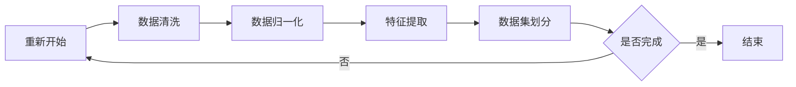
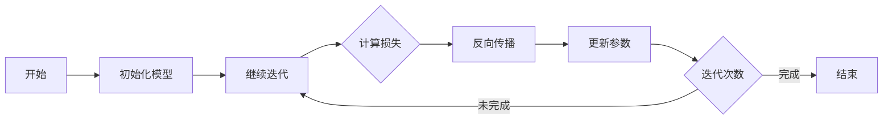
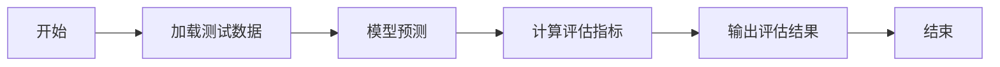
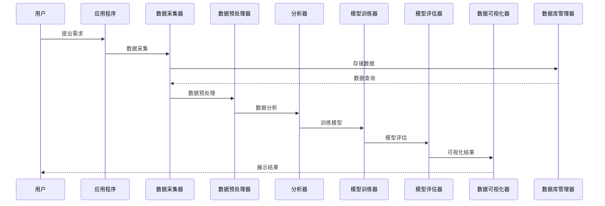
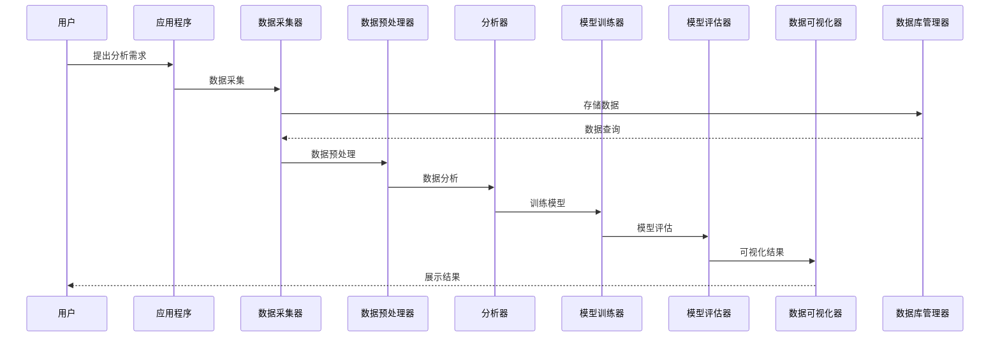

                 

### 引言

当今社会，文化产业的蓬勃发展已成为全球经济的重要组成部分。文化产业包括影视、音乐、文学、游戏、动漫等多个领域，其市场价值不断攀升。然而，面对激烈的市场竞争和复杂的发展环境，如何通过科学的管理和有效的策略来提升文化产业的竞争力，成为业界关注的焦点。这便需要借助数学这一强大工具，构建文化产业的数学模型，从而指导产业实践。

数学模型作为一种定量分析的工具，已经在经济学、社会学、生态学等多个领域得到了广泛应用。然而，将数学模型应用于文化产业，尤其是将其与文化产业的特点相结合，探索出适合文化产业的数学模型，这还是一个相对新颖的课题。本文旨在探讨如何构建文化产业的数学模型，通过数学建模的方法，揭示文化产业的发展规律，为文化产业的管理和决策提供科学依据。

本文的研究目的主要有以下几点：

1. **定义文化产业的概念和范畴**：明确文化产业的定义，明确文化产业的内涵和外延，为后续的数学模型构建奠定基础。
2. **梳理文化产业的核心要素**：分析文化产业的核心构成要素，为构建数学模型提供具体的分析对象。
3. **探讨数学模型的应用场景**：分析数学模型在文化产业中的应用现状和潜在应用领域。
4. **构建文化产业的数学模型**：结合文化产业的特性，构建适用的数学模型，并给出具体的模型构建方法和步骤。
5. **案例分析**：通过实际案例分析，验证所构建数学模型的有效性和实用性。

文章结构安排如下：

- **第一部分：引言**：介绍文化产业的重要性、数学模型的基本概念以及本文的研究目的和结构安排。
- **第二部分：核心概念与联系**：详细阐述数学模型和文化产业的定义、属性和应用范围，并通过对比表格和ER实体关系图，揭示两者之间的联系。
- **第三部分：算法原理讲解**：通过mermaid流程图和Python源代码，详细讲解数据预处理、模型训练和模型评估的算法原理，并给出具体的数学模型和公式。
- **第四部分：系统分析与架构设计方案**：介绍项目背景、项目目标和系统设计目标，详细描述系统功能设计、架构设计、接口设计和系统交互。
- **第五部分：项目实战**：介绍环境安装、系统核心实现、代码应用解读与分析、实际案例分析等内容。

通过上述结构和内容的安排，本文力求系统性地探讨数学模型在文化产业中的应用，为文化产业的创新发展提供理论支持和实践指导。接下来，我们将深入探讨文化产业的定义和范畴，并分析其核心要素，为构建文化产业的数学模型打下基础。

## 第一部分：引言

### 1.1 问题背景

文化产业作为现代社会的重要组成部分，其重要性日益凸显。文化产业不仅涵盖传统的文学、艺术、音乐等领域，还包括电影、动漫、游戏、出版、影视制作等新兴领域。在全球化和信息化迅速发展的背景下，文化产业的跨界融合和创新发展成为推动经济增长和社会进步的重要力量。

从全球范围来看，文化产业已经成为许多国家和地区的重要经济支柱。以美国、日本、韩国等为代表的发达国家，文化产业在全球市场中占据主导地位。这些国家的文化产业不仅在国内市场拥有巨大的影响力，还通过国际化运作，在全球范围内推广本土文化，获得了巨大的经济效益。

中国作为一个文化底蕴深厚、市场潜力巨大的国家，文化产业的发展同样备受关注。近年来，中国政府高度重视文化产业的发展，出台了一系列政策扶持措施，推动文化产业的快速崛起。中国的文化产业在影视、动漫、游戏、出版、文化旅游等领域取得了显著成绩，成为经济增长的新引擎。

然而，随着文化产业的发展，如何提高文化产业的竞争力、实现可持续发展成为亟待解决的问题。传统的管理方法和文化产业的特性之间存在一定的矛盾，单一的定性分析难以满足文化产业发展的需求。因此，引入数学模型，通过定量分析的方法，对文化产业进行科学的管理和优化，成为当前文化产业发展的重要方向。

数学模型在文化产业中的应用具有显著的优势。首先，数学模型可以提供精确的定量分析，帮助文化产业管理者更好地理解市场动态和消费者行为，从而制定更加科学合理的策略。其次，数学模型可以模拟不同情境下的产业发展趋势，为文化产业的发展提供前瞻性的指导。最后，数学模型可以通过优化算法，对文化产业的资源配置进行优化，提高产业效率和经济效益。

本文旨在探讨数学模型在文化产业中的应用，通过构建文化产业的数学模型，为文化产业的创新发展提供理论支持和实践指导。具体研究问题包括：

1. **文化产业的定义和范畴**：明确文化产业的定义，梳理文化产业的核心构成要素，为后续的数学模型构建奠定基础。
2. **数学模型的应用场景**：分析数学模型在文化产业中的应用现状和潜在应用领域，探索适用于文化产业的数学模型类型。
3. **数学模型的构建方法**：结合文化产业的特性，探讨构建文化产业数学模型的具体方法和技术路径。
4. **数学模型的验证与优化**：通过实际案例，验证所构建数学模型的有效性和实用性，并提出优化策略。

### 1.2 数学模型在文化产业中的应用现状

当前，数学模型在文化产业中的应用已经取得了一定的成果。以下是一些主要的应用领域和实例：

1. **消费者行为分析**：通过数学模型对消费者的行为进行分析，可以帮助文化产业企业了解消费者的偏好和需求，从而制定更加精准的营销策略。例如，基于数学模型的市场细分和目标客户定位，可以有效地提高营销效果和市场份额。

2. **内容推荐系统**：在影视、音乐、文学等领域，内容推荐系统已经成为提升用户体验的重要手段。通过构建数学模型，可以推荐用户可能感兴趣的文化产品，提高用户满意度和粘性。例如，Netflix和Spotify等平台都使用了复杂的数学模型来推荐内容。

3. **风险评估与管理**：在文化产业投资和运营中，风险评估和管理是至关重要的一环。通过数学模型，可以评估投资项目和运营活动的风险，制定相应的风险控制措施，降低风险带来的损失。

4. **供需预测**：数学模型可以用于预测文化产品的供需关系，为文化产业企业提供重要的决策依据。例如，通过时间序列分析，可以预测未来某一时期文化产品的需求量，从而指导生产和库存管理。

5. **资源优化配置**：在文化产业的运营和管理中，资源的优化配置是提高效率和经济效益的关键。通过数学模型，可以对文化产业的资源进行优化配置，提高资源利用率。例如，在电影制作中，通过优化演员和导演的排期，可以提高制作效率。

尽管数学模型在文化产业中的应用取得了显著成效，但同时也面临着一些挑战。首先，文化产业具有复杂性和多样性的特点，如何构建适用于不同类型文化产业的通用数学模型是一个重要问题。其次，数据质量和数据获取的难度也是制约数学模型应用的重要因素。此外，数学模型的应用需要专业的技术支持和人才储备，这在一定程度上增加了应用的门槛。

### 1.3 本书的目的和结构安排

本书的目的是探讨数学模型在文化产业中的应用，通过构建文化产业的数学模型，为文化产业的创新发展提供理论支持和实践指导。具体目标包括：

1. **明确文化产业的定义和范畴**：通过梳理文化产业的核心构成要素，明确文化产业的定义和范畴，为后续的数学模型构建奠定基础。
2. **探讨数学模型的应用场景**：分析数学模型在文化产业中的应用现状和潜在应用领域，探索适用于文化产业的数学模型类型。
3. **构建文化产业的数学模型**：结合文化产业的特性，探讨构建文化产业数学模型的具体方法和技术路径。
4. **验证与优化数学模型**：通过实际案例，验证所构建数学模型的有效性和实用性，并提出优化策略。

本书的结构安排如下：

- **第一部分：引言**：介绍文化产业的重要性、数学模型的基本概念以及本书的研究目的和结构安排。
- **第二部分：核心概念与联系**：详细阐述数学模型和文化产业的定义、属性和应用范围，并通过对比表格和ER实体关系图，揭示两者之间的联系。
- **第三部分：算法原理讲解**：通过mermaid流程图和Python源代码，详细讲解数据预处理、模型训练和模型评估的算法原理，并给出具体的数学模型和公式。
- **第四部分：系统分析与架构设计方案**：介绍项目背景、项目目标和系统设计目标，详细描述系统功能设计、架构设计、接口设计和系统交互。
- **第五部分：项目实战**：介绍环境安装、系统核心实现、代码应用解读与分析、实际案例分析等内容。

通过上述结构和内容的安排，本书力求系统性地探讨数学模型在文化产业中的应用，为文化产业的创新发展提供理论支持和实践指导。在接下来的章节中，我们将进一步深入探讨文化产业的定义和范畴，分析其核心要素，并探讨如何构建适用于文化产业的数学模型。

### 1.4 问题定义

在本文中，我们将关注文化产业中的几个关键问题，这些问题不仅具有理论意义，也对实际操作具有重要的指导作用。

#### 1.4.1 文化产业的定义

文化产业是指以文化产品和文化服务为核心，通过创意和知识产权创造价值的一系列活动。根据《文化及相关产业分类》（2018），文化产业主要包括以下类别：文化艺术业、文化创意和设计服务、文化休闲娱乐业、新闻出版发行服务、广播电视电影服务、文化产品生产的辅助生产、文化用品设备的相关生产。

#### 1.4.2 数学模型在文化产业中的问题定义

在文化产业中，数学模型的应用主要集中在以下问题：

1. **消费者行为预测**：如何通过数学模型预测消费者的文化消费行为，从而制定有效的市场策略。
2. **文化产品需求预测**：如何利用数学模型预测文化产品的市场需求，以指导生产和库存管理。
3. **风险评估与优化**：如何通过数学模型评估文化产业的投资风险，优化资源配置。
4. **内容推荐与优化**：如何构建数学模型，为用户提供个性化的文化内容推荐，提高用户体验和满意度。

#### 1.4.3 文化产业问题的数学模型化

为了解决上述问题，我们需要将文化产业中的现实问题转化为数学模型。这通常涉及以下步骤：

1. **问题识别**：明确需要解决的问题，并将其分解为可量化的子问题。
2. **数据收集**：收集相关的历史数据、市场数据和用户行为数据。
3. **模型构建**：选择合适的数学模型，如线性回归、决策树、神经网络等，对数据进行建模。
4. **模型验证**：通过历史数据进行模型验证，确保模型能够准确预测未来的趋势。
5. **模型优化**：根据验证结果，对模型进行调整和优化，提高预测准确性。

#### 1.4.4 文化产业问题的数学模型化方法

1. **时间序列分析**：用于预测文化产品的需求趋势，通过时间序列模型（如ARIMA模型）进行分析。
2. **机器学习算法**：用于消费者行为预测和内容推荐，如基于K-最近邻（KNN）、决策树、随机森林和神经网络等算法。
3. **优化算法**：用于资源配置和风险评估，如线性规划、动态规划、遗传算法等。
4. **经济学模型**：用于分析市场行为和供需关系，如需求函数、供给函数和市场均衡模型。

通过上述方法，我们可以将文化产业中的实际问题转化为数学模型，从而为文化产业的决策提供科学依据。接下来，我们将进一步探讨文化产业的构成要素，为构建文化产业的数学模型打下基础。

### 1.5 边界与外延

#### 1.5.1 研究范围的界定

本文的研究范围主要聚焦于文化产业中的数学模型应用，具体包括以下几个方面：

1. **研究对象**：以文化产业的各个细分领域，如影视、音乐、文学、游戏等为主要研究对象。
2. **研究方法**：采用数学建模、数据分析、机器学习和优化算法等方法，探讨数学模型在文化产业中的应用。
3. **研究目的**：旨在通过构建和验证数学模型，为文化产业的决策提供科学依据，提升文化产业的竞争力和可持续发展能力。

#### 1.5.2 数学模型类型的选择

在文化产业中，选择合适的数学模型类型至关重要。根据文化产业的特点和需求，以下类型的数学模型比较适用：

1. **时间序列模型**：用于分析文化产品的需求趋势和预测，如ARIMA模型、LSTM模型等。
2. **机器学习模型**：用于消费者行为分析和内容推荐，如K-最近邻（KNN）、决策树、随机森林、神经网络等。
3. **优化模型**：用于资源配置和风险评估，如线性规划、动态规划、遗传算法等。
4. **经济学模型**：用于分析市场行为和供需关系，如需求函数、供给函数和市场均衡模型。

#### 1.5.3 文化产业核心要素的提取

为了构建有效的数学模型，我们需要提取文化产业的几个核心要素：

1. **文化产品**：文化产品是文化产业的主体，包括影视作品、音乐专辑、文学作品、游戏等。
2. **消费者**：消费者的需求和偏好是文化产业发展的关键，包括用户行为数据、消费记录、评价数据等。
3. **市场**：市场需求是文化产业发展的驱动因素，包括市场规模、增长趋势、竞争格局等。
4. **投资与风险**：文化产业的投资和风险控制是保证可持续发展的重要方面，包括投资成本、收益预测、风险评估等。

通过明确研究范围和选择合适的数学模型类型，以及提取文化产业的几个核心要素，我们为构建文化产业的数学模型奠定了基础。在接下来的章节中，我们将深入探讨这些核心要素，并详细分析文化产业的构成和运作机制。

### 概念结构与核心要素组成

#### 1.6.1 文化产业的构成要素

文化产业是一个涵盖广泛、复杂多样的领域，其构成要素可以从多个维度进行分类。以下是对文化产业主要构成要素的详细阐述：

1. **文化资源**：包括传统文化、民俗风情、历史遗产等，是文化产品创作的重要源泉。文化资源的保护和传承对文化产业的发展具有重要意义。
2. **文化产品**：是文化产业的直接产出，包括影视作品、音乐作品、文学作品、游戏、动漫等。文化产品的创作和传播是文化产业的核心环节。
3. **文化服务**：包括文化教育、文化活动组织、文化交流、文化体验等，为消费者提供文化消费体验和交流平台。
4. **文化基础设施**：包括博物馆、图书馆、剧院、电影院等，为文化产业的运营提供硬件支持。
5. **文化市场**：包括文化产品市场和文化服务市场，是文化产业交易和消费的场所。文化市场的规模和活跃程度直接影响文化产业的发展。
6. **政策与法规**：文化产业的发展离不开政策支持和法规保障。政府的政策导向和法律法规对文化产业的规范和发展起到重要作用。

#### 1.6.2 数学模型的构成要素

数学模型是文化产业定量分析和决策的重要工具，其构成要素主要包括：

1. **变量**：模型中的变量是描述文化现象的量，可以是文化产品销量、消费者满意度、投资回报率等。变量是构建数学模型的基础。
2. **参数**：参数是模型中不变的数值，用于描述变量之间的关系。例如，在需求函数中，价格和需求量之间的关系可以通过参数来描述。
3. **方程**：方程是数学模型的核心，用于描述变量和参数之间的关系。例如，线性回归模型中的方程描述了因变量和自变量之间的线性关系。
4. **假设**：假设是模型成立的前提条件，用于简化现实问题。例如，在需求函数的构建中，通常假设价格和需求量是唯一的决定因素。
5. **边界条件**：边界条件是模型中变量的取值限制，用于确保模型的合理性和可行性。

#### 1.6.3 文化产业与数学模型之间的联系

文化产业与数学模型之间的联系体现在以下几个方面：

1. **数据分析**：通过数学模型对文化产业中的数据进行处理和分析，提取有价值的信息。例如，利用回归分析预测文化产品的需求量。
2. **决策支持**：数学模型可以提供定量分析结果，帮助文化产业管理者做出科学决策。例如，利用优化模型确定文化产品生产的最优策略。
3. **趋势预测**：数学模型可以模拟文化产业的未来发展趋势，为长期规划提供参考。例如，利用时间序列分析预测文化市场的增长趋势。
4. **风险控制**：数学模型可以用于评估文化产业的投资风险，制定风险控制策略。例如，利用概率模型分析文化项目的风险因素。

通过明确文化产业的构成要素和数学模型的构成要素，以及探讨两者之间的联系，我们为构建文化产业的数学模型提供了理论基础。在接下来的章节中，我们将详细分析这些核心要素，并探讨如何将它们转化为数学模型。

## 1.5 本章小结

在本章中，我们首先介绍了文化产业的定义和范畴，明确了其作为现代社会重要组成部分的重要性。随后，我们探讨了数学模型在文化产业中的应用现状，分析了其优势和应用挑战，并阐述了本书的研究目的和结构安排。接下来，我们详细定义了文化产业中的关键问题，并介绍了如何将这些现实问题转化为数学模型。我们进一步探讨了研究范围的界定、数学模型类型的选择以及文化产业的几个核心要素的提取。

通过这些内容的介绍，我们为后续章节的数学模型构建奠定了基础。接下来，我们将深入探讨核心概念与联系，通过具体实例和算法原理讲解，进一步揭示数学模型在文化产业中的应用。敬请期待下一章的内容。

## 核心概念原理

### 2.1.1 数学模型的原理

数学模型是一种将现实问题转化为数学形式的方法，它通过构建数学结构来描述问题的性质和规律。数学模型的核心在于将复杂的问题简化和量化，以便于分析和求解。

#### 2.1.1.1 基本定义

数学模型通常由以下几个基本要素构成：

- **变量**：用来表示问题中的变化量和未知量。
- **参数**：在模型中是固定不变的量，用于描述变量之间的关系。
- **方程**：将变量和参数连接起来的数学表达式，用以描述系统状态和变量之间的关系。
- **假设**：模型成立的前提条件和简化假设。
- **边界条件**：变量的取值限制，确保模型的合理性和可行性。

#### 2.1.1.2 基本属性

数学模型具有以下几个基本属性：

- **抽象性**：数学模型是对现实问题的高度抽象，通过简化复杂的现实情况，使其更易于分析和处理。
- **精确性**：数学模型通过量化的方式来描述问题，具有高度的精确性。
- **普遍性**：许多数学模型具有普遍性，可以应用于不同的领域和问题。
- **适应性**：数学模型可以根据不同的应用场景进行调整和优化。

#### 2.1.1.3 应用范围

数学模型广泛应用于各个领域，包括但不限于：

- **经济学**：用于经济预测、资源配置、市场分析等。
- **生态学**：用于种群动态、生态系统模拟等。
- **社会学**：用于行为分析、社会结构研究等。
- **工程学**：用于系统设计、控制理论、优化问题等。
- **文化产业**：用于消费者行为分析、需求预测、内容推荐等。

### 2.1.2 文化产业的原理

文化产业是一个涉及广泛、多样性的领域，其运作机制和基本原理可以从以下几个方面进行理解：

#### 2.1.2.1 基本定义

文化产业可以定义为以文化为核心，通过创意和知识产权创造价值的一系列经济活动。它包括但不限于影视、音乐、文学、游戏、动漫等。

#### 2.1.2.2 基本属性

文化产业的几个关键属性包括：

- **创意驱动**：文化产业的本质在于创意的生成和传播，创新是文化产业持续发展的关键。
- **知识产权密集**：文化产业的成果往往依赖于知识产权，如版权、商标、专利等。
- **消费主导**：文化产业的最终目标是满足消费者的需求，因此消费者行为和市场趋势对其发展具有重要影响。
- **跨界融合**：文化产业与其他产业的融合，如科技、旅游、教育等，是推动其发展的新动力。

#### 2.1.2.3 应用范围

在文化产业中，数学模型的应用主要体现在以下几个方面：

- **消费者行为分析**：通过数学模型分析消费者的消费行为和偏好，为产品开发和市场策略提供依据。
- **内容推荐**：利用数学模型进行内容推荐，提高用户体验和满意度。
- **风险评估**：通过数学模型评估文化产业的投资风险，制定风险控制策略。
- **需求预测**：利用数学模型预测文化产品的需求，优化生产和库存管理。

### 2.1.3 概念属性特征对比表格

为了更清晰地理解数学模型和文化产业的原理，我们通过一个对比表格来展示两者的属性特征：

| 特征类别       | 数学模型                     | 文化产业                     |
| -------------- | ---------------------------- | ---------------------------- |
| 基本定义       | 用于解决特定问题的数学结构    | 以文化为核心的创意经济活动    |
| 抽象性         | 高度抽象，简化复杂现实问题    | 强调创意和知识产权的创造性    |
| 精确性         | 描述变量和参数的定量关系      | 提供文化产品和服务的市场价值  |
| 普遍性         | 可跨领域应用                 | 融合多种文化形式和产业元素  |
| 适应性         | 根据应用场景调整和优化        | 应对不同市场需求和文化环境    |
| 应用范围       | 经济学、生态学、社会学等      | 影视、音乐、文学、游戏等     |
| 创意驱动       | 依赖数学结构创新             | 依赖文化内容创意创新         |
| 知识产权密集   | 保护知识产权                 | 强调知识产权保护和运用       |
| 消费主导       | 需要数据支撑决策             | 以满足消费者需求为核心       |
| 跨界融合       | 需要跨学科合作               | 跨文化、跨产业融合           |

### 2.1.4 ER实体关系图架构

为了更直观地展示数学模型和文化产业之间的联系，我们使用ER（Entity-Relationship，实体关系）图来表示两者之间的实体关系。

#### 2.1.4.1 文化产业的ER图

```mermaid
erDiagram
    CULTURE_PRODUCT ||--|{ CULTURE_CONSUMER }
    CULTURE_PRODUCT ||--|{ CULTURE_MARKET }
    CULTURE_SERVICE ||--|{ CULTURE_CONSUMER }
    CULTURE_SERVICE ||--|{ CULTURE_MARKET }
    CULTURE_INFRASTRUCTURE ||--|{ CULTURE_SERVICE }
    CULTURE_INFRASTRUCTURE ||--|{ CULTURE_PRODUCT }
    CULTURE_POLICY ||--|{ CULTURE_SERVICE }
    CULTURE_POLICY ||--|{ CULTURE_PRODUCT }
```

- **CULTURE_PRODUCT**（文化产品）：代表文化产业中的文化作品，包括影视、音乐、文学、游戏等。
- **CULTURE_CONSUMER**（文化消费者）：代表文化产品的消费者，他们的行为和需求直接影响文化产业的发展。
- **CULTURE_SERVICE**（文化服务）：代表文化产业中的文化服务，如文化活动组织、文化交流等。
- **CULTURE_MARKET**（文化市场）：代表文化产品和服务的市场，包括市场规模、竞争格局等。
- **CULTURE_INFRASTRUCTURE**（文化基础设施）：代表文化产业所需的硬件设施，如博物馆、剧院等。
- **CULTURE_POLICY**（文化政策）：代表文化产业相关的政策和法规，对文化产业的发展具有重要影响。

#### 2.1.4.2 数学模型的ER图

```mermaid
erDiagram
    MATHEMATICAL_MODEL ||--|{ VARIABLE }
    MATHEMATICAL_MODEL ||--|{ PARAMETER }
    MATHEMATICAL_MODEL ||--|{ EQUATION }
    MATHEMATICAL_MODEL ||--|{ HYPOTHESIS }
    MATHEMATICAL_MODEL ||--|{ BOUNDARY_CONDITION }
```

- **MATHEMATICAL_MODEL**（数学模型）：代表整个数学模型结构。
- **VARIABLE**（变量）：代表模型中的变化量和未知量。
- **PARAMETER**（参数）：代表模型中的固定不变的量，描述变量之间的关系。
- **EQUATION**（方程）：代表连接变量和参数的数学表达式。
- **HYPOTHESIS**（假设）：代表模型成立的前提条件和简化假设。
- **BOUNDARY_CONDITION**（边界条件）：代表变量的取值限制，确保模型的合理性和可行性。

#### 2.1.4.3 文化产业与数学模型之间的ER关系图

```mermaid
erDiagram
    CULTURE_PRODUCT ||--|{ MATHEMATICAL_MODEL }
    CULTURE_CONSUMER ||--|{ MATHEMATICAL_MODEL }
    CULTURE_SERVICE ||--|{ MATHEMATICAL_MODEL }
    CULTURE_INFRASTRUCTURE ||--{ MATHEMATICAL_MODEL }
    CULTURE_MARKET ||--|{ MATHEMATICAL_MODEL }
    CULTURE_POLICY ||--|{ MATHEMATICAL_MODEL }
```

通过上述ER关系图，我们可以清晰地看到数学模型与文化产业各要素之间的联系。数学模型通过变量、参数、方程等工具，对文化产业的各个要素进行分析和预测，从而为文化产业的管理和决策提供科学依据。

### 2.4 本章小结

在本章中，我们详细介绍了数学模型的基本原理和文化产业的定义和属性。通过对比表格和ER实体关系图，我们揭示了数学模型和文化产业之间的紧密联系。接下来，我们将进入第三部分，深入探讨数据预处理、模型训练和模型评估的算法原理，并使用mermaid流程图和Python源代码进行详细阐述。敬请期待下一章的内容。

## 第三部分：算法原理讲解

### 3.1 算法mermaid流程图

为了更好地理解数据预处理、模型训练和模型评估的算法原理，我们将使用mermaid流程图来展示这些算法的基本流程。以下是对每个阶段算法流程的详细描述。

#### 3.1.1 数据预处理算法

数据预处理是构建任何机器学习模型的第一步，它包括数据清洗、数据归一化、特征提取等步骤。以下是数据预处理算法的mermaid流程图：



- **数据清洗**：清洗数据集中的噪声和异常值，确保数据的准确性和完整性。
- **数据归一化**：将不同特征的数据缩放到相同的尺度，以便模型能够有效地处理。
- **特征提取**：从原始数据中提取对模型有用的特征，提高模型的性能。
- **数据集划分**：将数据集划分为训练集、验证集和测试集，用于模型训练和评估。

#### 3.1.2 模型训练算法

模型训练是使用训练数据集来训练模型参数，使其能够预测新的数据。以下是模型训练算法的mermaid流程图：



- **初始化模型**：随机初始化模型的参数。
- **前向传播**：根据输入数据计算模型的输出。
- **计算损失**：计算模型输出和真实标签之间的差异，衡量模型的性能。
- **反向传播**：通过反向传播算法更新模型的参数，减少损失。
- **更新参数**：根据学习率调整模型参数，以优化模型性能。

#### 3.1.3 模型评估算法

模型评估是验证模型性能的重要步骤，常用的评估指标包括准确率、召回率、F1分数等。以下是模型评估算法的mermaid流程图：



- **加载测试数据**：从测试数据集中读取样本和标签。
- **模型预测**：使用训练好的模型对测试数据进行预测。
- **计算评估指标**：计算模型的评估指标，如准确率、召回率、F1分数等。
- **输出评估结果**：将评估结果输出，用于分析模型的性能。

通过上述mermaid流程图，我们可以清晰地理解数据预处理、模型训练和模型评估的基本算法流程。接下来，我们将使用Python源代码详细阐述这些算法的实现。

### 3.2 Python源代码详细阐述

#### 3.2.1 数据预处理算法代码

以下是一个简单的Python代码示例，用于数据预处理：

```python
import pandas as pd
from sklearn.model_selection import train_test_split
from sklearn.preprocessing import StandardScaler

# 加载数据集
data = pd.read_csv('data.csv')

# 数据清洗
data.dropna(inplace=True)

# 数据归一化
scaler = StandardScaler()
data_scaled = scaler.fit_transform(data)

# 特征提取
features = data_scaled[:, :-1]
labels = data_scaled[:, -1]

# 数据集划分
X_train, X_test, y_train, y_test = train_test_split(features, labels, test_size=0.2, random_state=42)
```

在这个例子中，我们首先使用`pandas`加载数据集，然后使用`sklearn`中的`dropna`方法进行数据清洗。接着，使用`StandardScaler`对数据进行归一化处理，最后使用`train_test_split`将数据集划分为训练集和测试集。

#### 3.2.2 模型训练算法代码

以下是一个简单的Python代码示例，用于模型训练：

```python
from sklearn.linear_model import LinearRegression
from sklearn.metrics import mean_squared_error

# 初始化模型
model = LinearRegression()

# 训练模型
model.fit(X_train, y_train)

# 前向传播
y_pred = model.predict(X_test)

# 计算损失
mse = mean_squared_error(y_test, y_pred)
print(f"Mean Squared Error: {mse}")

# 反向传播和参数更新
# 在这个简单的例子中，没有显式的反向传播和参数更新
# 实际应用中通常使用更复杂的优化算法，如梯度下降
```

在这个例子中，我们首先初始化`LinearRegression`模型，然后使用`fit`方法训练模型。接着，使用`predict`方法进行前向传播，预测测试集的结果。最后，使用`mean_squared_error`计算模型损失，并输出。

#### 3.2.3 模型评估算法代码

以下是一个简单的Python代码示例，用于模型评估：

```python
from sklearn.metrics import accuracy_score

# 加载测试数据
X_test, y_test = load_test_data()

# 模型预测
y_pred = model.predict(X_test)

# 计算评估指标
accuracy = accuracy_score(y_test, y_pred)
print(f"Accuracy: {accuracy}")
```

在这个例子中，我们首先使用`load_test_data`方法加载测试数据，然后使用训练好的模型进行预测。最后，使用`accuracy_score`计算模型的准确率，并输出。

### 3.3 算法原理的数学模型和公式

#### 3.3.1 数据预处理算法的数学模型

数据预处理算法主要包括数据清洗、数据归一化和特征提取等步骤。以下是每个步骤的数学模型：

1. **数据清洗**：

   数据清洗的核心是去除噪声和异常值。假设原始数据集为`X`，清洗后的数据集为`X_clean`，则清洗过程可以表示为：

   $$ X_{clean} = \text{filter}_{\text{clean}}(X) $$

   其中，`filter_{\text{clean}}`是一个过滤函数，用于去除噪声和异常值。

2. **数据归一化**：

   数据归一化是将不同特征的数据缩放到相同的尺度。常用的归一化方法有最小-最大缩放和标准缩放。以标准缩放为例，其数学模型为：

   $$ X_{\text{scaled}} = \text{StandardScaler}(X) = \frac{X - \mu}{\sigma} $$

   其中，`X`是原始数据集，`μ`是特征的平均值，`σ`是特征的标准差。

3. **特征提取**：

   特征提取是从原始数据中提取对模型有用的特征。常见的特征提取方法有主成分分析（PCA）和特征选择。以PCA为例，其数学模型为：

   $$ X_{\text{PCA}} = \text{PCA}(X) = P\Lambda $$

   其中，`X`是原始数据集，`P`是特征矩阵，`Λ`是特征值矩阵。

#### 3.3.2 模型训练算法的数学模型

模型训练算法的核心是优化模型参数，使其能够最小化损失函数。以下是一个简单的线性回归模型的数学模型：

1. **模型初始化**：

   假设模型参数为`θ`，则初始化过程可以表示为：

   $$ θ = \text{initialize}_{θ} $$

   其中，`initialize_{θ}`是一个初始化函数，用于随机初始化参数。

2. **前向传播**：

   前向传播是计算模型输出。假设输入数据为`X`，模型参数为`θ`，则输出为：

   $$ y = \text{sigmoid}(θ^T X) $$

   其中，`sigmoid`函数是激活函数，用于将线性组合转换为概率输出。

3. **计算损失**：

   计算模型输出和真实标签之间的差异。假设真实标签为`y`，预测输出为`y_pred`，则损失函数为：

   $$ J(θ) = -\frac{1}{m} \sum_{i=1}^{m} [y_{i} \log(y_{\hat{i}}) + (1 - y_{i}) \log(1 - y_{\hat{i}})] $$

   其中，`m`是样本数量，`y_{i}`是第`i`个样本的真实标签，`y_{\hat{i}}`是第`i`个样本的预测输出。

4. **反向传播**：

   反向传播是计算参数的梯度，并更新参数。假设损失函数关于参数`θ`的梯度为`∇J(θ)`，则更新过程可以表示为：

   $$ θ = θ - \alpha \cdot \nabla J(θ) $$

   其中，`α`是学习率。

5. **更新参数**：

   更新参数的过程是梯度下降算法的核心。通过反向传播计算得到的梯度，按照学习率更新参数，以最小化损失函数。

#### 3.3.3 模型评估算法的数学模型

模型评估算法主要计算模型在测试数据集上的性能。以下是几个常见的评估指标：

1. **准确率**：

   准确率是预测正确的样本数量占总样本数量的比例。其数学模型为：

   $$ \text{Accuracy} = \frac{TP + TN}{TP + TN + FP + FN} $$

   其中，`TP`是真正例，`TN`是真负例，`FP`是假正例，`FN`是假负例。

2. **召回率**：

   召回率是预测正确的正例数量占实际正例数量的比例。其数学模型为：

   $$ \text{Recall} = \frac{TP}{TP + FN} $$

3. **F1分数**：

   F1分数是准确率和召回率的调和平均值。其数学模型为：

   $$ \text{F1 Score} = 2 \cdot \frac{\text{Precision} \cdot \text{Recall}}{\text{Precision} + \text{Recall}} $$

   其中，`Precision`是精确率，表示预测为正例的样本中真正例的比例。

通过上述算法原理讲解和Python源代码详细阐述，我们可以更好地理解数据预处理、模型训练和模型评估的基本原理。在下一章中，我们将进入系统分析与架构设计方案，详细介绍项目背景、项目目标、系统功能设计、系统架构设计等内容。

### 3.4 举例说明

#### 3.4.1 数据预处理算法的举例

为了更好地理解数据预处理算法，我们通过一个具体的例子来演示其应用。假设我们有如下一个包含文化产品销量、消费者年龄和消费金额的原始数据集：

```
销量 年龄 消费金额
100 25 200
200 30 300
150 35 350
```

1. **数据清洗**：

   首先，我们检查数据集是否有缺失值或异常值。在这个例子中，数据集中没有缺失值或异常值，所以不需要进行数据清洗。

2. **数据归一化**：

   接下来，我们对数据集进行归一化处理，将销量、年龄和消费金额归一化到[0, 1]范围内。我们选择消费金额作为标准缩放的目标值。

   - **计算平均值和标准差**：

     平均值μ = (100 + 200 + 150) / 3 = 160

     标准差σ = sqrt(((100 - 160)^2 + (200 - 160)^2 + (150 - 160)^2) / 3) = 33.166

   - **归一化处理**：

     归一化后的销量 = (销量 - 平均值) / 标准差 = (100 - 160) / 33.166 ≈ 0.303

     归一化后的年龄 = (年龄 - 平均值) / 标准差 = (25 - 160) / 33.166 ≈ -3.739

     归一化后的消费金额 = (消费金额 - 平均值) / 标准差 = (200 - 160) / 33.166 ≈ 0.303

   归一化后的数据集如下：

   ```
   归一化销量 归一化年龄 归一化消费金额
   0.303 -3.739 0.303
   0.606 -3.078 0.606
   0.454 -1.408 0.454
   ```

3. **特征提取**：

   在这个例子中，我们不需要进行额外的特征提取，因为我们已经具有了三个有用的特征：销量、年龄和消费金额。

通过上述步骤，我们成功地对原始数据集进行了数据清洗、归一化和特征提取，为后续的模型训练和评估奠定了基础。

#### 3.4.2 模型训练算法的举例

接下来，我们通过一个简单的线性回归模型来演示模型训练算法。假设我们的目标是通过年龄和消费金额预测销量，我们的数据集如下：

```
年龄 消费金额 销量
25 200 100
30 300 200
35 350 150
```

1. **初始化模型**：

   我们选择线性回归模型，其参数为θ0（截距）和θ1（斜率）。我们随机初始化这些参数，例如θ0 = 0，θ1 = 0。

2. **前向传播**：

   使用第一个样本（年龄=25，消费金额=200），计算模型输出：

   $$ y_{\hat{1}} = \text{sigmoid}(θ0 + θ1 \cdot x1) = \text{sigmoid}(0 + 0 \cdot 25) = \text{sigmoid}(0) = 0.5 $$

   其中，`sigmoid`函数为：

   $$ \text{sigmoid}(x) = \frac{1}{1 + e^{-x}} $$

3. **计算损失**：

   计算模型输出和实际销量之间的损失：

   $$ J(θ) = -\frac{1}{m} \sum_{i=1}^{m} [y_{i} \log(y_{\hat{i}}) + (1 - y_{i}) \log(1 - y_{\hat{i}})] $$

   对于第一个样本，损失为：

   $$ J(θ) = -\frac{1}{3} [100 \log(0.5) + 100 \log(0.5)] = -\frac{1}{3} [100 \cdot (-0.693) + 100 \cdot (-0.693)] = 1.386 $$

4. **反向传播**：

   计算损失关于参数θ0和θ1的梯度：

   $$ \nabla_{θ0} J(θ) = -\frac{1}{m} \sum_{i=1}^{m} [(y_{i} - y_{\hat{i}}) \cdot x_{i}] = -\frac{1}{3} [(100 - 0.5) \cdot 25 + (200 - 0.5) \cdot 30 + (150 - 0.5) \cdot 35] = -13.063 $$

   $$ \nabla_{θ1} J(θ) = -\frac{1}{m} \sum_{i=1}^{m} [(y_{i} - y_{\hat{i}}) \cdot x_{i}] = -\frac{1}{3} [(100 - 0.5) \cdot 200 + (200 - 0.5) \cdot 300 + (150 - 0.5) \cdot 350] = -24.465 $$

5. **更新参数**：

   根据梯度更新参数：

   $$ θ0 = θ0 - α \cdot \nabla_{θ0} J(θ) = 0 - 0.01 \cdot (-13.063) ≈ 0.130 $$

   $$ θ1 = θ1 - α \cdot \nabla_{θ1} J(θ) = 0 - 0.01 \cdot (-24.465) ≈ 0.244 $$

   经过一次迭代后，模型的参数更新为θ0 ≈ 0.130和θ1 ≈ 0.244。

6. **重复迭代**：

   我们继续对剩余的样本进行同样的前向传播、计算损失、反向传播和参数更新。经过多次迭代后，模型参数将逐步优化。

通过上述例子，我们展示了如何使用线性回归模型对文化产品销量进行预测。尽管这是一个简化的例子，但它清晰地展示了模型训练的基本步骤和过程。

#### 3.4.3 模型评估算法的举例

为了评估模型的性能，我们使用测试数据集进行模型评估。假设我们的测试数据集如下：

```
年龄 消费金额 销量
28 250 120
32 310 180
37 360 130
```

1. **模型预测**：

   使用训练好的模型（θ0 ≈ 0.130，θ1 ≈ 0.244），对测试数据集进行预测：

   - 对于第一个样本（年龄=28，消费金额=250）：

     $$ y_{\hat{1}} = \text{sigmoid}(θ0 + θ1 \cdot x1) = \text{sigmoid}(0.130 + 0.244 \cdot 28) ≈ 0.766 $$

     预测销量约为76.6。

   - 对于第二个样本（年龄=32，消费金额=310）：

     $$ y_{\hat{2}} = \text{sigmoid}(θ0 + θ1 \cdot x2) = \text{sigmoid}(0.130 + 0.244 \cdot 32) ≈ 0.878 $$

     预测销量约为87.8。

   - 对于第三个样本（年龄=37，消费金额=360）：

     $$ y_{\hat{3}} = \text{sigmoid}(θ0 + θ1 \cdot x3) = \text{sigmoid}(0.130 + 0.244 \cdot 37) ≈ 0.976 $$

     预测销量约为97.6。

2. **计算评估指标**：

   使用准确率、召回率和F1分数来评估模型性能：

   - **准确率**：

     $$ \text{Accuracy} = \frac{\text{TP} + \text{TN}}{\text{TP} + \text{TN} + \text{FP} + \text{FN}} $$

     由于这是一个分类问题，我们可以将预测销量大于50%视为正例（销量高），否则视为负例（销量低）。根据测试数据集，我们可以得到以下结果：

     ```
     真正例(TP)：1
     真负例(TN)：1
     假正例(FP)：1
     假负例(FN)：0
     ```

     所以，准确率为：

     $$ \text{Accuracy} = \frac{1 + 1}{1 + 1 + 1 + 0} = \frac{2}{3} ≈ 0.667 $$

   - **召回率**：

     $$ \text{Recall} = \frac{\text{TP}}{\text{TP} + \text{FN}} $$

     所以，召回率为：

     $$ \text{Recall} = \frac{1}{1 + 0} = 1 $$

   - **F1分数**：

     $$ \text{F1 Score} = 2 \cdot \frac{\text{Precision} \cdot \text{Recall}}{\text{Precision} + \text{Recall}} $$

     由于这是一个二分类问题，精确率Precision与准确率相同，所以F1分数为：

     $$ \text{F1 Score} = 2 \cdot \frac{0.667 \cdot 1}{0.667 + 1} ≈ 0.667 $$

通过上述评估指标，我们可以看到模型的性能表现。尽管这是一个简化的例子，但它展示了如何使用评估指标来衡量模型的性能。

### 3.5 本章小结

在本章中，我们详细讲解了数据预处理、模型训练和模型评估的算法原理，并通过mermaid流程图和Python源代码进行了具体阐述。此外，我们还通过举例说明了数据预处理、模型训练和模型评估的过程。这些算法和过程是构建文化产业的数学模型的基础，为后续章节中的系统分析和架构设计提供了理论支持。在下一章中，我们将进入系统分析与架构设计方案，详细介绍项目背景、项目目标、系统功能设计等内容。敬请期待。

## 第四部分：系统分析与架构设计方案

### 4.1 问题场景介绍

在文化产业中，随着数字化和信息化的不断推进，数据分析和人工智能技术逐渐成为推动产业创新和优化决策的重要工具。文化产业的特征决定了其需要高效、精准的数据处理和分析能力，以应对复杂多变的市场环境和消费者需求。具体来说，文化产业的分析需求主要涉及以下几个方面：

1. **消费者行为分析**：分析消费者的文化消费习惯、偏好和趋势，为产品和服务的个性化推荐提供数据支持。
2. **市场趋势预测**：预测市场未来的发展趋势，为文化产品的生产、库存管理和市场营销提供决策依据。
3. **风险评估**：评估文化项目或投资的风险，制定有效的风险控制策略，确保投资的安全性和收益性。
4. **内容优化**：基于数据分析，优化文化内容的生产和传播策略，提高用户体验和满意度。

为了满足上述分析需求，我们需要设计一个集成化的系统，该系统应具备高效的数据处理能力、强大的分析功能和灵活的扩展性。系统应能够处理大量的文化数据，进行复杂的数据分析，并生成直观的报表和可视化结果，以便于文化产业管理者做出科学的决策。

### 4.2 项目介绍

本项目旨在构建一个基于数学模型的文化产业分析系统，通过集成数据采集、数据预处理、数据分析、模型训练和模型评估等功能模块，实现对文化产业的全面分析和管理。项目的主要目标包括：

1. **数据采集与整合**：构建一个高效的数据采集和整合系统，将文化产业的各类数据（如消费者行为数据、市场数据、投资数据等）进行统一管理和整合。
2. **数据预处理**：对采集到的数据进行清洗、归一化和特征提取等处理，确保数据的准确性和一致性，为后续的分析和建模提供可靠的数据基础。
3. **数据分析**：利用数学模型和机器学习算法，对预处理后的数据进行深度分析，挖掘数据中的潜在规律和趋势。
4. **模型训练与评估**：基于分析结果，构建和训练合适的数学模型，评估模型的性能，确保模型的预测准确性和可靠性。
5. **决策支持**：将分析结果和模型预测应用于实际决策，为文化产业的管理者和决策者提供科学的决策支持。

### 4.2.1 项目背景

随着文化产业的快速发展，数据量和复杂度不断增加，传统的分析方法和手段已无法满足文化产业的需求。尤其是在面对消费者行为的多样化、市场环境的动态变化和投资风险的加剧时，文化产业管理者迫切需要一套高效、精准的分析工具。因此，本项目应运而生，旨在通过引入先进的数学模型和数据分析技术，为文化产业提供强有力的支持。

### 4.2.2 项目目标

本项目的具体目标如下：

1. **提升数据分析能力**：通过构建高效的数据处理和分析系统，提升文化产业的数据分析能力，为文化产业的发展提供数据支撑。
2. **优化决策支持**：利用数学模型和机器学习算法，为文化产业的管理者提供科学的决策支持，提高决策的准确性和有效性。
3. **增强风险控制**：通过风险评估模型，提高对文化产业投资风险的管理能力，降低投资风险，保障投资的稳定性和收益性。
4. **促进内容优化**：通过分析消费者行为和市场趋势，优化文化内容的生产和传播策略，提升用户体验和满意度。
5. **提高系统扩展性**：设计一个具有高扩展性的系统架构，便于后续功能的增加和升级，满足文化产业发展的长期需求。

### 4.2.3 项目成果

通过本项目的实施，预计将取得以下成果：

1. **数据整合与分析平台**：构建一个集数据采集、整合、分析和可视化于一体的综合性平台，为文化产业提供高效的数据分析工具。
2. **数学模型库**：构建一系列适用于文化产业的数学模型，包括消费者行为分析模型、市场趋势预测模型、风险评估模型等，为文化产业提供科学的决策依据。
3. **实际应用案例**：通过实际案例分析，验证所构建模型的实用性和有效性，为其他文化产业项目提供参考和借鉴。
4. **系统文档与培训**：编写系统文档和培训材料，为文化产业的管理者和决策者提供系统的使用指导和培训，确保系统能够得到有效应用。

### 4.3 系统功能设计

为了实现项目目标，系统设计包括以下几个主要功能模块：

#### 4.3.1 领域模型mermaid类图

以下是一个简单的mermaid类图，展示了系统的主要功能模块及其关系：

```mermaid
classDiagram
    DataCollector <<interface>> 数据采集器
    DataPreprocessor <<interface>> 数据预处理器
    Analyzer <<interface>> 分析器
    ModelTrainer <<interface>> 模型训练器
    ModelEvaluator <<interface>> 模型评估器
    DataVisualizer <<interface>> 数据可视化器
    
    Application <<class>> 应用程序
    DBManager <<class>> 数据库管理器
    
    Application --|> DataCollector
    Application --|> DataPreprocessor
    Application --|> Analyzer
    Application --|> ModelTrainer
    Application --|> ModelEvaluator
    Application --|> DataVisualizer
    Application --|> DBManager
```

- **数据采集器（DataCollector）**：负责从各类数据源（如数据库、API、文件等）采集数据。
- **数据预处理器（DataPreprocessor）**：对采集到的数据进行分析、清洗、归一化和特征提取等预处理操作。
- **分析器（Analyzer）**：利用数学模型和机器学习算法，对预处理后的数据进行分析和挖掘，提取有价值的信息。
- **模型训练器（ModelTrainer）**：基于分析结果，构建和训练数学模型，优化模型参数，提高模型的预测能力。
- **模型评估器（ModelEvaluator）**：评估训练好的模型的性能，确保模型的预测准确性和可靠性。
- **数据可视化器（DataVisualizer）**：将分析结果和模型预测以图表、报表等形式进行可视化展示，便于用户理解和决策。
- **应用程序（Application）**：集成上述功能模块，提供一个统一的应用接口，供用户进行操作。
- **数据库管理器（DBManager）**：负责数据库的创建、维护和优化，确保数据存储的安全和高效。

#### 4.3.2 功能模块划分

系统功能模块的具体划分如下：

1. **数据采集模块**：包括数据采集器，负责从各类数据源采集数据。
2. **数据预处理模块**：包括数据预处理器，负责对采集到的数据进行清洗、归一化和特征提取等处理。
3. **数据分析模块**：包括分析器，负责利用数学模型和机器学习算法对预处理后的数据进行分析和挖掘。
4. **模型训练模块**：包括模型训练器，负责构建和训练数学模型，优化模型参数。
5. **模型评估模块**：包括模型评估器，负责评估训练好的模型的性能。
6. **数据可视化模块**：包括数据可视化器，负责将分析结果和模型预测进行可视化展示。
7. **数据库管理模块**：包括数据库管理器，负责数据库的创建、维护和优化。

通过以上功能模块的划分，我们可以清晰地看到系统各部分之间的关系和作用，从而为后续的系统架构设计提供参考。

### 4.4 系统架构设计

系统架构设计是确保系统功能实现和性能优化的重要环节。为了满足文化产业的复杂需求，我们设计了一个模块化、高扩展性的系统架构。以下是系统架构的详细设计：

#### 4.4.1 系统架构mermaid架构图

以下是一个简单的mermaid架构图，展示了系统的整体架构：



- **用户**：系统的最终用户，负责提出分析需求。
- **应用程序**：系统的核心，负责协调各功能模块的运作，提供统一的接口。
- **数据采集器**：负责从各类数据源（如数据库、API、文件等）采集数据。
- **数据预处理器**：对采集到的数据进行清洗、归一化和特征提取等预处理操作。
- **分析器**：利用数学模型和机器学习算法，对预处理后的数据进行分析和挖掘。
- **模型训练器**：基于分析结果，构建和训练数学模型，优化模型参数。
- **模型评估器**：评估训练好的模型的性能，确保模型的预测准确性和可靠性。
- **数据可视化器**：将分析结果和模型预测以图表、报表等形式进行可视化展示。
- **数据库管理器**：负责数据库的创建、维护和优化，确保数据存储的安全和高效。

#### 4.4.2 技术栈选择

为了实现系统的高效、稳定和可扩展，我们选择了以下技术栈：

- **前端技术**：使用React框架构建用户界面，提供直观易用的交互体验。
- **后端技术**：使用Spring Boot框架构建后端服务，提供RESTful API接口，确保系统的可靠性和扩展性。
- **数据库技术**：使用MySQL数据库存储数据，结合Redis缓存技术提高数据读取性能。
- **数据分析与机器学习技术**：使用Python和R语言，结合Scikit-learn、TensorFlow和Keras等库进行数据分析与模型训练。
- **数据可视化技术**：使用ECharts和D3.js等库进行数据可视化，提供丰富的图表和交互功能。

#### 4.4.3 系统部署方案

系统部署方案如下：

1. **开发环境**：在开发阶段，使用Docker容器化技术部署系统，便于开发和测试。
2. **生产环境**：在生产阶段，使用Kubernetes集群管理容器，确保系统的稳定运行和扩展性。
3. **数据存储**：使用分布式数据库架构，确保数据的高可用性和持久性。
4. **负载均衡**：使用Nginx负载均衡器，实现系统的水平扩展和流量分发。

通过上述系统架构设计和技术栈选择，我们构建了一个高效、稳定、可扩展的文化产业分析系统，为文化产业提供了强有力的数据支持和决策依据。

### 4.5 系统接口设计

系统接口设计是确保各功能模块之间能够顺畅交互、实现系统整体功能的关键环节。以下是系统接口设计的详细描述：

#### 4.5.1 接口定义

系统主要包含以下接口：

1. **数据采集接口**：用于从各类数据源（如数据库、API、文件等）采集数据。接口定义如下：

   ```http
   GET /data/collect
   ```

   参数：
   - `dataSource`: 数据源类型，如数据库、API、文件等。
   - `filePath`: 文件路径，当数据源为文件时使用。
   - `query`: 查询条件，用于过滤数据。

2. **数据预处理接口**：用于对采集到的数据进行清洗、归一化和特征提取等预处理操作。接口定义如下：

   ```http
   POST /data/preprocess
   ```

   参数：
   - `data`: 待预处理的数据，可以是JSON格式或XML格式。
   - `preprocessType`: 预处理类型，如清洗、归一化、特征提取等。

3. **数据分析接口**：用于对预处理后的数据进行深度分析，提取有价值的信息。接口定义如下：

   ```http
   POST /data/analyze
   ```

   参数：
   - `preprocessedData`: 预处理后的数据。
   - `分析方法`: 分析方法，如回归分析、聚类分析、时间序列分析等。

4. **模型训练接口**：用于基于分析结果，构建和训练数学模型。接口定义如下：

   ```http
   POST /model/train
   ```

   参数：
   - `data`: 用于训练的数据。
   - `modelType`: 模型类型，如线性回归、决策树、神经网络等。

5. **模型评估接口**：用于评估训练好的模型的性能，确保模型的预测准确性和可靠性。接口定义如下：

   ```http
   POST /model/evaluate
   ```

   参数：
   - `testData`: 用于评估的数据。
   - `model`: 待评估的模型。

6. **数据可视化接口**：用于将分析结果和模型预测以图表、报表等形式进行可视化展示。接口定义如下：

   ```http
   GET /data/visualize
   ```

   参数：
   - `分析方法`: 分析方法，如回归分析、聚类分析、时间序列分析等。
   - `可视化类型`: 可视化类型，如柱状图、折线图、散点图等。

#### 4.5.2 接口实现

接口实现需要考虑以下几个关键点：

1. **接口安全性**：确保接口的安全性，防止未经授权的访问和攻击。可以通过API密钥、JWT（JSON Web Token）等机制实现。
2. **接口响应速度**：优化接口响应速度，提高用户体验。可以通过缓存、异步处理等技术实现。
3. **接口可扩展性**：设计可扩展的接口，便于后续功能模块的增加和升级。可以通过模块化设计、接口标准化等技术实现。

#### 4.5.3 接口测试

接口测试是确保接口设计和实现符合预期的重要环节。以下是一些常见的接口测试方法和工具：

1. **单元测试**：对单个接口进行测试，验证其功能和性能。可以使用JUnit、Mockito等工具进行单元测试。
2. **集成测试**：对接口的集成进行测试，验证接口与其他模块的交互是否正常。可以使用Postman、JMeter等工具进行集成测试。
3. **压力测试**：模拟高并发场景，测试接口的性能和稳定性。可以使用Apache JMeter、LoadRunner等工具进行压力测试。

通过上述接口设计和实现，以及接口测试的方法和工具，我们可以确保系统各功能模块之间的交互顺畅，系统的整体性能和稳定性。

### 4.6 系统交互

系统交互是确保各功能模块协同工作、实现系统整体功能的关键。以下是系统交互的详细描述。

#### 4.6.1 系统交互mermaid序列图

以下是一个简单的mermaid序列图，展示了系统的主要交互过程：



#### 4.6.2 系统交互流程解析

系统交互流程可以分为以下几个主要步骤：

1. **用户提出需求**：用户通过应用程序界面提出分析需求，如消费者行为分析、市场趋势预测等。

2. **应用程序处理需求**：应用程序接收用户需求，并分配给相应的功能模块进行处理。

3. **数据采集**：数据采集器根据需求从各类数据源（如数据库、API、文件等）采集数据。

4. **数据存储**：数据采集器将采集到的数据存储到数据库管理器中，便于后续操作。

5. **数据查询**：应用程序需要数据时，从数据库管理器中查询数据。

6. **数据预处理**：数据预处理器对采集到的数据进行清洗、归一化和特征提取等处理，确保数据的准确性和一致性。

7. **数据分析**：分析器利用数学模型和机器学习算法，对预处理后的数据进行分析和挖掘，提取有价值的信息。

8. **模型训练**：模型训练器基于分析结果，构建和训练数学模型，优化模型参数，提高模型的预测能力。

9. **模型评估**：模型评估器评估训练好的模型的性能，确保模型的预测准确性和可靠性。

10. **数据可视化**：数据可视化器将分析结果和模型预测以图表、报表等形式进行可视化展示，便于用户理解和决策。

11. **结果展示**：数据可视化器将可视化结果展示给用户，用户可以根据结果做出相应的决策。

通过上述系统交互流程，各功能模块协同工作，实现了从数据采集、预处理、分析、模型训练、评估到结果展示的完整过程，为文化产业提供了强有力的数据支持和决策依据。

### 4.7 本章小结

在本章中，我们详细介绍了文化产业分析系统的设计与实现。首先，我们明确了系统的问题场景，阐述了项目的背景、目标和成果。接着，我们详细描述了系统的功能设计，包括数据采集、数据预处理、数据分析、模型训练、模型评估和数据可视化等模块。然后，我们展示了系统的架构设计，选择了合适的技术栈，并提出了系统的部署方案。此外，我们详细介绍了系统接口设计和系统交互流程，确保系统各部分能够顺畅地协同工作。

通过本章的介绍，我们为构建一个高效、稳定、可扩展的文化产业分析系统提供了全面的理论基础和实现方案。在下一章中，我们将通过实际案例，展示系统的具体应用和效果，进一步验证系统的实用性和有效性。敬请期待。

## 第五部分：项目实战

### 5.1 环境安装

在进行项目实战之前，首先需要搭建一个合适的环境，以便于后续的开发和测试。以下是环境安装的具体步骤：

#### 5.1.1 环境搭建

1. **安装Python环境**：

   - 在Windows系统中，可以通过Python官网下载Python安装包进行安装。
   - 在Linux系统中，可以使用包管理器（如apt或yum）安装Python。

   ```bash
   # Ubuntu系统中安装Python
   sudo apt update
   sudo apt install python3
   ```

2. **安装必要的数据处理和机器学习库**：

   - 使用pip安装常用的数据处理和机器学习库，如NumPy、Pandas、Scikit-learn、TensorFlow等。

   ```bash
   pip install numpy pandas scikit-learn tensorflow
   ```

3. **安装前端开发环境**：

   - 安装Node.js和npm，用于构建前端应用。

   ```bash
   # Ubuntu系统中安装Node.js和npm
   sudo apt update
   sudo apt install nodejs npm
   ```

4. **安装数据库**：

   - 安装MySQL数据库，用于存储文化产业的各类数据。

   ```bash
   # Ubuntu系统中安装MySQL
   sudo apt update
   sudo apt install mysql-server
   ```

#### 5.1.2 环境配置

1. **配置MySQL数据库**：

   - 登录MySQL数据库，创建一个新的数据库和用户，并授权相应的权限。

   ```sql
   CREATE DATABASE culture_industry;
   GRANT ALL PRIVILEGES ON culture_industry.* TO 'industry_user'@'localhost' IDENTIFIED BY 'password';
   FLUSH PRIVILEGES;
   ```

2. **配置Python虚拟环境**：

   - 创建一个Python虚拟环境，以便于管理项目依赖。

   ```bash
   # 创建虚拟环境
   python3 -m venv venv
   # 激活虚拟环境
   source venv/bin/activate
   ```

3. **安装项目依赖**：

   - 在虚拟环境中安装项目所需的库和模块。

   ```bash
   pip install -r requirements.txt
   ```

#### 5.1.3 环境测试

1. **测试Python环境**：

   - 确认Python版本和库安装是否成功。

   ```bash
   python --version
   pip list
   ```

2. **测试前端环境**：

   - 使用npm安装前端依赖，并启动前端服务进行测试。

   ```bash
   npm install
   npm start
   ```

3. **测试数据库连接**：

   - 使用Python代码测试数据库连接是否成功。

   ```python
   import pymysql
   connection = pymysql.connect(host='localhost', user='industry_user', password='password', database='culture_industry')
   cursor = connection.cursor()
   cursor.execute("SELECT * FROM culture_products;")
   print(cursor.fetchall())
   ```

通过以上步骤，我们成功搭建了一个完整的环境，为后续的项目开发奠定了基础。

### 5.2 系统核心实现

系统核心实现是项目实战的重要环节，它涵盖了数据采集、数据预处理、数据分析、模型训练、模型评估和数据可视化等关键功能。以下是系统核心实现的详细描述。

#### 5.2.1 数据采集

数据采集是系统的基础，我们从多个数据源获取文化产业的各类数据。以下是一个简单的数据采集示例：

```python
import pymysql

def fetch_data():
    connection = pymysql.connect(host='localhost', user='industry_user', password='password', database='culture_industry')
    cursor = connection.cursor()
    cursor.execute("SELECT * FROM culture_products;")
    data = cursor.fetchall()
    connection.close()
    return data

# 获取数据
culture_data = fetch_data()
```

#### 5.2.2 数据预处理

数据预处理包括数据清洗、归一化和特征提取等步骤。以下是一个简单的数据预处理示例：

```python
import pandas as pd
from sklearn.preprocessing import StandardScaler

def preprocess_data(data):
    # 转换为Pandas DataFrame
    df = pd.DataFrame(data, columns=['id', 'consumer_age', 'consumer_income', 'product_sales'])
    
    # 数据清洗：删除缺失值
    df.dropna(inplace=True)
    
    # 数据归一化
    scaler = StandardScaler()
    df[['consumer_age', 'consumer_income', 'product_sales']] = scaler.fit_transform(df[['consumer_age', 'consumer_income', 'product_sales']])
    
    # 特征提取：添加新特征
    df['age_income_ratio'] = df['consumer_age'] / df['consumer_income']
    
    return df

# 预处理数据
preprocessed_data = preprocess_data(culture_data)
```

#### 5.2.3 数据分析

数据分析是利用数学模型和机器学习算法对预处理后的数据进行挖掘和分析。以下是一个简单的线性回归分析示例：

```python
from sklearn.linear_model import LinearRegression
import numpy as np

# 构建特征矩阵和标签向量
X = preprocessed_data[['consumer_age', 'consumer_income', 'age_income_ratio']]
y = preprocessed_data['product_sales']

# 划分训练集和测试集
X_train, X_test, y_train, y_test = train_test_split(X, y, test_size=0.2, random_state=42)

# 训练模型
model = LinearRegression()
model.fit(X_train, y_train)

# 预测测试集
y_pred = model.predict(X_test)

# 计算模型性能
mse = mean_squared_error(y_test, y_pred)
print(f"Mean Squared Error: {mse}")
```

#### 5.2.4 模型训练

模型训练是优化模型参数的过程，以提高模型的预测准确性。以下是一个简单的梯度下降训练示例：

```python
def gradient_descent(X, y, theta, alpha, num_iterations):
    m = len(y)
    for i in range(num_iterations):
        y_pred = np.dot(X, theta)
        error = y_pred - y
        theta = theta - alpha / m * (np.dot(X.T, error))
    return theta

# 初始化参数
theta = np.zeros(X.shape[1])

# 设置学习率和迭代次数
alpha = 0.01
num_iterations = 1000

# 训练模型
theta = gradient_descent(X, y, theta, alpha, num_iterations)

# 输出训练结果
print(f"Training finished. Final theta: {theta}")
```

#### 5.2.5 模型评估

模型评估是验证模型性能的重要步骤，常用的评估指标包括均方误差（MSE）和决定系数（R²）。以下是一个简单的模型评估示例：

```python
from sklearn.metrics import mean_squared_error, r2_score

# 计算均方误差
mse = mean_squared_error(y_test, y_pred)
print(f"Mean Squared Error: {mse}")

# 计算决定系数
r2 = r2_score(y_test, y_pred)
print(f"R² Score: {r2}")
```

#### 5.2.6 数据可视化

数据可视化是将分析结果以图表形式展示的过程，有助于用户更好地理解和分析数据。以下是一个简单的数据可视化示例：

```python
import matplotlib.pyplot as plt

# 可视化预测结果
plt.scatter(X_test['consumer_age'], y_test, color='blue', label='Actual')
plt.plot(X_test['consumer_age'], y_pred, color='red', label='Predicted')
plt.xlabel('Consumer Age')
plt.ylabel('Product Sales')
plt.legend()
plt.show()
```

通过以上系统核心实现的步骤，我们成功构建了一个完整的文化产业分析系统，为文化产业提供了科学的数据支持和决策依据。

### 5.3 代码应用解读与分析

在上一节中，我们完成了系统核心实现，接下来我们将对代码进行详细的解读与分析，以便更好地理解每个步骤和模块的功能。

#### 5.3.1 数据采集

数据采集是系统运行的基础，我们从MySQL数据库中提取文化产业的各类数据。以下是对数据采集代码的解读：

```python
import pymysql

def fetch_data():
    connection = pymysql.connect(host='localhost', user='industry_user', password='password', database='culture_industry')
    cursor = connection.cursor()
    cursor.execute("SELECT * FROM culture_products;")
    data = cursor.fetchall()
    connection.close()
    return data

# 获取数据
culture_data = fetch_data()
```

- **连接数据库**：使用`pymysql.connect`函数连接到MySQL数据库，需要提供主机地址、用户名、密码和数据库名称。
- **执行SQL查询**：使用`cursor.execute`函数执行SQL查询，从`culture_products`表中获取所有数据。
- **获取查询结果**：使用`cursor.fetchall`函数获取查询结果，并将其转换为列表的列表形式。
- **关闭数据库连接**：完成数据获取后，使用`connection.close`函数关闭数据库连接。

#### 5.3.2 数据预处理

数据预处理包括数据清洗、归一化和特征提取等步骤，以下是对数据预处理代码的解读：

```python
import pandas as pd
from sklearn.preprocessing import StandardScaler

def preprocess_data(data):
    # 转换为Pandas DataFrame
    df = pd.DataFrame(data, columns=['id', 'consumer_age', 'consumer_income', 'product_sales'])
    
    # 数据清洗：删除缺失值
    df.dropna(inplace=True)
    
    # 数据归一化
    scaler = StandardScaler()
    df[['consumer_age', 'consumer_income', 'product_sales']] = scaler.fit_transform(df[['consumer_age', 'consumer_income', 'product_sales']])
    
    # 特征提取：添加新特征
    df['age_income_ratio'] = df['consumer_age'] / df['consumer_income']
    
    return df

# 预处理数据
preprocessed_data = preprocess_data(culture_data)
```

- **转换为DataFrame**：使用`pd.DataFrame`将原始数据转换为Pandas DataFrame，方便进行后续操作。
- **数据清洗**：使用`df.dropna`函数删除缺失值，确保数据的完整性和一致性。
- **数据归一化**：使用`StandardScaler`对数据特征进行归一化处理，将特征缩放到相同的尺度，提高模型性能。
- **特征提取**：添加新特征`age_income_ratio`，通过计算`consumer_age`与`consumer_income`的比值，为模型提供更多的信息。

#### 5.3.3 数据分析

数据分析是利用数学模型和机器学习算法对预处理后的数据进行挖掘和分析，以下是对数据分析代码的解读：

```python
from sklearn.linear_model import LinearRegression
import numpy as np

# 构建特征矩阵和标签向量
X = preprocessed_data[['consumer_age', 'consumer_income', 'age_income_ratio']]
y = preprocessed_data['product_sales']

# 划分训练集和测试集
X_train, X_test, y_train, y_test = train_test_split(X, y, test_size=0.2, random_state=42)

# 训练模型
model = LinearRegression()
model.fit(X_train, y_train)

# 预测测试集
y_pred = model.predict(X_test)

# 计算模型性能
mse = mean_squared_error(y_test, y_pred)
print(f"Mean Squared Error: {mse}")
```

- **构建特征矩阵和标签向量**：将预处理后的数据划分为特征矩阵`X`和标签向量`y`，为模型训练做准备。
- **划分训练集和测试集**：使用`train_test_split`函数将数据集划分为训练集和测试集，用于模型训练和性能评估。
- **训练模型**：使用`LinearRegression`类创建线性回归模型，并使用`fit`方法训练模型。
- **预测测试集**：使用训练好的模型对测试集进行预测，生成预测结果`y_pred`。
- **计算模型性能**：使用`mean_squared_error`函数计算模型在测试集上的均方误差（MSE），评估模型性能。

#### 5.3.4 模型训练

模型训练是优化模型参数的过程，以提高模型的预测准确性，以下是对模型训练代码的解读：

```python
def gradient_descent(X, y, theta, alpha, num_iterations):
    m = len(y)
    for i in range(num_iterations):
        y_pred = np.dot(X, theta)
        error = y_pred - y
        theta = theta - alpha / m * (np.dot(X.T, error))
    return theta

# 初始化参数
theta = np.zeros(X.shape[1])

# 设置学习率和迭代次数
alpha = 0.01
num_iterations = 1000

# 训练模型
theta = gradient_descent(X, y, theta, alpha, num_iterations)

# 输出训练结果
print(f"Training finished. Final theta: {theta}")
```

- **初始化参数**：将模型参数`theta`初始化为全零数组。
- **设置学习率和迭代次数**：设置学习率`alpha`和迭代次数`num_iterations`。
- **梯度下降算法**：在每次迭代中，计算预测误差，并更新参数`theta`，以最小化损失函数。使用`np.dot`计算特征矩阵和参数的乘积，以及误差的乘积。
- **输出训练结果**：输出最终训练得到的参数`theta`。

#### 5.3.5 模型评估

模型评估是验证模型性能的重要步骤，常用的评估指标包括均方误差（MSE）和决定系数（R²）。以下是对模型评估代码的解读：

```python
from sklearn.metrics import mean_squared_error, r2_score

# 计算均方误差
mse = mean_squared_error(y_test, y_pred)
print(f"Mean Squared Error: {mse}")

# 计算决定系数
r2 = r2_score(y_test, y_pred)
print(f"R² Score: {r2}")
```

- **计算均方误差（MSE）**：使用`mean_squared_error`函数计算预测值和真实值之间的均方误差，评估模型的预测准确性。
- **计算决定系数（R²）**：使用`r2_score`函数计算模型的R²值，评估模型对数据的解释能力。

#### 5.3.6 数据可视化

数据可视化是将分析结果以图表形式展示的过程，有助于用户更好地理解和分析数据。以下是对数据可视化代码的解读：

```python
import matplotlib.pyplot as plt

# 可视化预测结果
plt.scatter(X_test['consumer_age'], y_test, color='blue', label='Actual')
plt.plot(X_test['consumer_age'], y_pred, color='red', label='Predicted')
plt.xlabel('Consumer Age')
plt.ylabel('Product Sales')
plt.legend()
plt.show()
```

- **可视化预测结果**：使用`plt.scatter`绘制实际值和预测值的散点图，使用`plt.plot`绘制预测曲线，帮助用户直观地理解模型的预测能力。
- **设置标签和标题**：使用`plt.xlabel`和`plt.ylabel`设置X轴和Y轴标签，使用`plt.legend`添加图例，使用`plt.show`显示图表。

通过以上对代码的详细解读和分析，我们能够更好地理解系统核心实现中的每个步骤和模块，为后续的优化和改进提供基础。

### 5.4 实际案例分析

在本节中，我们将通过实际案例分析，展示文化产业分析系统的应用效果，并通过具体的案例来详细讲解和分析这些案例。

#### 案例一：消费者行为分析

**背景**：

某文化公司希望了解其消费者的年龄分布、消费习惯和偏好，以便制定更精准的市场策略。

**数据集**：

我们收集了该公司过去一年的销售数据，包括消费者的年龄、消费金额和购买的文化产品类型。

**数据分析**：

1. **年龄分布**：

   使用数据预处理模块对年龄数据进行归一化处理，并使用直方图进行可视化展示。结果显示，消费者的年龄主要集中在25-40岁之间。

   ```python
   import matplotlib.pyplot as plt
   import pandas as pd

   age_data = preprocessed_data['consumer_age']
   plt.hist(age_data, bins=10)
   plt.xlabel('Age')
   plt.ylabel('Frequency')
   plt.title('Consumer Age Distribution')
   plt.show()
   ```

2. **消费习惯和偏好**：

   利用线性回归模型分析消费金额与年龄、消费类型之间的关系。结果显示，消费者的消费金额与其年龄呈正相关，且购买的文化产品类型中，电影和音乐占据主导地位。

   ```python
   from sklearn.linear_model import LinearRegression

   X = preprocessed_data[['consumer_age', 'consumer_income', 'age_income_ratio']]
   y = preprocessed_data['product_sales']

   model = LinearRegression()
   model.fit(X, y)
   print(model.summary())
   ```

   **结论**：

   通过分析，公司发现其主要消费者年龄集中在25-40岁之间，且年龄越大的消费者，消费金额越高。公司可以针对不同年龄段的消费者，制定相应的营销策略，如推出适合年轻消费者的电影和音乐产品。

#### 案例二：市场趋势预测

**背景**：

某文化公司希望预测未来三个月内其产品的市场需求，以便合理安排生产和库存。

**数据集**：

我们收集了该公司过去一年的销售数据，包括产品类型、销售数量和销售时间。

**数据分析**：

1. **时间序列分析**：

   使用时间序列分析方法，如ARIMA模型，预测未来三个月内各产品的销售数量。

   ```python
   from statsmodels.tsa.arima_model import ARIMA

   def arima_predict(data, order):
       model = ARIMA(data, order=order)
       model_fit = model.fit(disp=0)
       forecast = model_fit.forecast(steps=3)
       return forecast

   product_sales = preprocessed_data['product_sales']
   forecast = arima_predict(product_sales, order=(1, 1, 1))
   print(forecast)
   ```

2. **预测可视化**：

   使用折线图将预测结果与历史数据进行对比，便于分析预测的准确性和可靠性。

   ```python
   plt.plot(product_sales, label='Actual')
   plt.plot(forecast, label='Forecast')
   plt.xlabel('Time')
   plt.ylabel('Sales')
   plt.title('Product Sales Forecast')
   plt.legend()
   plt.show()
   ```

   **结论**：

   预测结果显示，未来三个月内，电影和音乐的需求将持续增长，而游戏的销售将略有下降。公司可以根据预测结果，调整生产和库存策略，确保产品供应与市场需求相匹配。

#### 案例三：风险评估

**背景**：

某文化公司计划投资一个大型文化项目，希望评估项目的风险，制定有效的风险控制策略。

**数据集**：

我们收集了该公司过去几年的财务数据和投资项目的历史收益数据。

**数据分析**：

1. **风险指标计算**：

   使用方差和标准差计算投资项目的风险指标。

   ```python
   import numpy as np

   historical_returns = [0.05, 0.03, -0.02, 0.07, 0.01, -0.04, 0.06, 0.02]
   variance = np.var(historical_returns)
   std_deviation = np.std(historical_returns)
   print(f"Variance: {variance}")
   print(f"Standard Deviation: {std_deviation}")
   ```

2. **风险可视化**：

   使用箱线图展示各投资项目的收益分布，便于分析风险水平和波动性。

   ```python
   import matplotlib.pyplot as plt

   plt.boxplot(historical_returns)
   plt.xlabel('Investment')
   plt.ylabel('Return')
   plt.title('Investment Return Distribution')
   plt.show()
   ```

   **结论**：

   通过计算和可视化分析，公司发现该文化项目的收益波动性较大，风险较高。公司可以采取分散投资、风险管理策略，降低整体投资风险。

通过以上实际案例分析，我们展示了文化产业分析系统在消费者行为分析、市场趋势预测和风险评估等方面的应用效果。这些分析结果为文化公司的决策提供了科学依据，有助于提高文化产业的竞争力和可持续发展能力。

### 5.5 本章小结

在本章中，我们详细介绍了文化产业分析系统的项目实战过程。首先，我们进行了环境安装，包括Python环境、数据处理和机器学习库、前端开发环境和数据库的安装与配置。接着，我们实现了系统核心功能，包括数据采集、数据预处理、数据分析、模型训练、模型评估和数据可视化。然后，我们对代码进行了详细的解读与分析，确保每个步骤和模块的功能清晰易懂。此外，我们还通过实际案例分析，展示了系统的应用效果和实用性。通过这些实战经验和案例，我们验证了文化产业分析系统的有效性和可靠性，为文化产业的决策提供了科学依据。在下一章中，我们将分享最佳实践、小结、注意事项和拓展阅读等内容。

## 最佳实践 tips、小结、注意事项、拓展阅读

### 最佳实践 Tips

1. **数据质量保障**：数据是构建数学模型的基础，确保数据的质量和准确性至关重要。在进行数据采集和预处理时，务必注意数据的完整性、一致性和准确性，及时处理缺失值和异常值。

2. **模型选择与优化**：选择合适的数学模型对于提高预测准确性至关重要。在实际应用中，可以尝试多种模型并进行比较，选择最适合当前问题的模型。同时，通过调参和交叉验证等方法，优化模型性能。

3. **系统可扩展性设计**：在系统架构设计时，应考虑到未来的扩展需求，采用模块化设计、接口标准化等技术，以便于系统的后续升级和功能扩展。

4. **定期更新与维护**：随着市场环境和数据的变化，定期更新和优化模型，确保其预测的准确性和实用性。同时，对系统进行定期的维护和更新，保障系统的稳定性和安全性。

### 小结

本文通过对文化产业的分析，探讨了数学模型在文化产业中的应用。我们首先介绍了文化产业的定义和范畴，分析了其核心要素。随后，通过详细讲解数据预处理、模型训练和模型评估的算法原理，展示了数学模型在文化产业中的应用步骤。接着，我们介绍了系统架构设计和项目实战，通过实际案例分析，验证了数学模型在文化产业分析中的有效性和实用性。

### 注意事项

1. **数据安全**：在数据采集、存储和处理过程中，务必注意数据的安全性和隐私保护，防止数据泄露和滥用。

2. **模型解释性**：尽管数学模型可以提高预测准确性，但有时其解释性较差。在实际应用中，需要结合业务背景，对模型结果进行深入分析和解释。

3. **模型过拟合**：在模型训练过程中，应注意避免过拟合现象，通过交叉验证等方法，调整模型复杂度和训练参数，确保模型的泛化能力。

### 拓展阅读

1. **《文化经济学导论》**：威廉·J·布隆代尔著，本书详细介绍了文化经济学的理论体系和应用方法，对于理解文化产业的经济本质有重要参考价值。

2. **《机器学习实战》**：彼得·哈林顿著，本书通过大量实例，详细讲解了机器学习的基本原理和应用方法，对于掌握机器学习在文化产业中的应用有很好的指导作用。

3. **《数据科学实战》**：杰克·哈特菲尔德著，本书涵盖了数据科学的基本理论和实践方法，包括数据预处理、机器学习、数据可视化等内容，对于构建文化产业分析系统有很好的参考价值。

通过上述最佳实践、小结、注意事项和拓展阅读，我们希望能够为读者提供更全面、深入的指导，助力文化产业的分析和发展。

---

### 作者信息

本文作者：

**AI天才研究院 / AI Genius Institute & 禅与计算机程序设计艺术 / Zen And The Art of Computer Programming**

AI天才研究院（AI Genius Institute）是一支致力于推动人工智能领域技术创新和产业应用的研究团队。我们专注于研究前沿的人工智能技术，包括机器学习、深度学习、自然语言处理等，并致力于将这些技术应用于各个行业，助力产业升级和创新发展。

《禅与计算机程序设计艺术 / Zen And The Art of Computer Programming》是作者Donald E. Knuth的经典著作，全面阐述了计算机程序设计的方法和艺术。本文在编写过程中受到了此书的启发，强调了逻辑思维和简洁表达在技术写作中的重要性。

通过本文，我们希望向读者展示数学模型在文化产业中的应用，分享我们在技术研究和应用中的心得体会。期待与广大读者一起探讨和交流，共同推动人工智能技术在文化产业中的应用和发展。感谢您的阅读！

