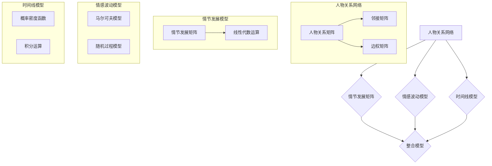

                 

### 问题背景

在现代社会，随着科技与艺术的交融，数学与文学的交叉研究正逐渐成为学术界和工业界的热点。文学作为人类情感的载体，其叙事结构一直以来都是文学研究者关注的焦点。而数学，作为一种高度抽象的思考工具，其在各个领域中的应用已经得到了广泛认可。将数学分析应用于文学叙事结构的研究，不仅为文学理论提供了新的视角，也为数学在人文领域的应用提供了新的可能性。

本篇文章将探讨叙事结构中的数学分析，旨在通过数学的方法，揭示叙事的内在规律和结构特点。具体来说，文章将首先介绍叙事结构的基本概念，然后介绍数学分析在叙事结构中的应用，并逐步深入探讨如何使用数学分析工具对叙事结构进行定量分析。通过这种跨学科的研究方法，我们希望能够为叙事学研究提供一种新的视角和工具，同时也为数学在人文领域的应用开辟新的道路。

本文的主要目的是通过数学分析的方法，对叙事结构进行深入的剖析和定量研究，旨在揭示叙事结构中的规律性和复杂性。这不仅有助于我们更好地理解文学作品，也为我们提供了一种新的研究方法，可以在其他人文和社会科学领域中得到应用。通过这篇文章，我们希望能够激发更多学者对数学与文学交叉领域的研究兴趣，为未来的研究提供一些有价值的参考。

### 文学叙事与数学分析的关系

文学叙事和数学分析看似属于两个截然不同的领域，但实际上，它们之间存在着深厚的联系。文学叙事是一种通过文字构建情节、人物和情感体验的艺术形式，而数学分析则是一种通过抽象和量化方法研究现象的学科。这两者在表面上的差异，正是它们互补的契机。

首先，从哲学层面上讲，文学叙事和数学分析都是人类对现实世界进行理解和表达的方式。文学叙事通过故事的形式，揭示人类情感的复杂性和社会生活的多样性；而数学分析则通过抽象的符号和公式，探索自然现象的规律和本质。两者都追求一种深刻的理解，只不过路径不同。

其次，在具体的方法论上，文学叙事和数学分析也有许多相似之处。文学叙事讲究结构布局，通过起承转合、高潮和结尾等元素，构建出引人入胜的故事；而数学分析同样注重结构，通过函数、微分和积分等工具，对复杂系统进行分解和分析。例如，叙事结构中的情节发展可以类比于数学中的函数变化，而叙事中的转折点则类似于数学中的临界点。

再者，两者都在寻求普适性和规律性。文学叙事追求通过个别故事反映普遍的人性和社会现象，而数学分析则通过精确的公式和模型，揭示自然界的普遍规律。这种追求普适性和规律性的本质，使得数学分析能够为文学叙事提供新的分析工具。

此外，数学分析在叙事学研究中的应用，为文学研究提供了新的视角和方法。例如，通过数学模型，研究者可以定量地分析叙事结构中的要素关系，如情节的复杂性、人物关系的网络结构等。这种方法不仅有助于更深入地理解文学作品，还可以为叙事学理论的发展提供新的素材和依据。

总之，文学叙事与数学分析之间的关系，既体现在哲学层面上的共通性，也体现在方法论上的互补性。通过将数学分析的方法应用于文学叙事研究，我们可以更深入地揭示叙事的内在规律，拓展文学研究的广度和深度。这不仅为文学理论的发展提供了新的可能性，也为数学在人文领域的应用开辟了新的路径。

### 核心概念

#### 叙事结构的定义

叙事结构是文学作品的核心组成部分，它决定了故事的叙述方式和故事的展开方式。叙事结构通常包括情节、人物、场景、时间线等基本元素，这些元素通过特定的排列和组合，构建出一个完整的故事世界。叙事结构不仅决定了故事的发展路径，还影响着读者的阅读体验和情感反应。

在文学作品中，叙事结构通常分为几个基本类型，如线性叙事、循环叙事、非线性叙事等。线性叙事是按照时间顺序依次展开的故事，最常见的例子是传统的小说和电影。循环叙事则通过重复某些情节或场景，使故事回到起点，给人以循环往复的感觉，如某些寓言故事和戏剧作品。非线性叙事则打破传统的时间顺序，通过多线并进、交叉叙述等方式，创造出复杂而多变的叙事结构，如某些现代小说和实验电影。

#### 数学分析在叙事结构中的应用

数学分析在叙事结构中的应用，主要是通过定量分析和模型构建，对叙事的内在规律和结构特点进行深入探讨。数学分析为叙事研究提供了一种新的工具，使我们能够以更加精确和系统的方式，分析叙事的各个方面。

首先，数学分析可以用于定量分析叙事的复杂性。例如，通过对故事中人物关系的网络结构进行分析，可以计算出人物之间的互动频率和强度，从而揭示出叙事中的复杂关系。这种定量分析不仅有助于我们理解故事的深层含义，还可以为叙事学研究提供新的数据支持。

其次，数学分析可以用于构建叙事结构的模型。通过将叙事结构中的各种元素进行数学建模，可以更直观地理解叙事的发展过程和内在规律。例如，可以使用图论模型来描述叙事中的人物关系网络，使用概率论来分析叙事中的随机性和偶然性。这些模型不仅可以帮助研究者更好地理解叙事结构，还可以为文学创作提供一些新的启示。

最后，数学分析还可以用于分析叙事的时间结构。例如，通过研究叙事中时间线的变化，可以计算出故事的时间密度和节奏，从而揭示出叙事的快慢和紧张度。这种分析方法对于理解叙事的节奏和情感传达具有重要意义。

总之，数学分析为叙事结构的研究提供了新的方法和视角，使我们能够以更加科学和系统的方式，探讨叙事的内在规律和结构特点。这不仅有助于我们更好地理解文学作品，也为叙事学理论的发展提供了新的动力。

#### 核心概念之间的联系

叙事结构、数学分析以及文学理论之间存在着紧密的联系和相互影响。叙事结构是文学作品的骨架，决定了故事的叙述方式和情感传达；数学分析为叙事结构的研究提供了一种新的工具，使我们能够从定量和模型化的角度深入探讨叙事的复杂性和规律性；而文学理论则为叙事结构和数学分析的应用提供了理论基础和研究框架。

首先，叙事结构和数学分析之间的联系体现在对叙事复杂性的定量分析。通过数学分析工具，如图论和概率论，我们可以对叙事中的人物关系网络和情节发展进行量化分析，从而揭示出叙事中的复杂性和规律性。例如，通过计算人物之间的互动频率和关系强度，我们可以分析出叙事中的主要关系网络和关键节点，为故事的结构和意义提供新的解释。

其次，数学分析在叙事结构研究中的应用，对文学理论的发展产生了重要影响。传统的文学理论往往侧重于文本解读和主观感受，而数学分析提供了更为客观和系统的研究方法，使得叙事结构的研究更加科学和精确。通过构建数学模型，研究者可以更直观地理解叙事的发展过程和内在规律，从而为文学理论提供新的实证依据和理论框架。

再者，叙事结构和数学分析对于文学理论的贡献，不仅体现在对叙事本身的解析，还体现在对文学创作和批评的启示。通过数学分析，作家可以更系统地设计叙事结构，合理安排情节和人物关系，从而提高作品的艺术效果和感染力。同样，批评家也可以借助数学分析方法，对作品进行更加深入和全面的分析，发现作品中的深层含义和独特价值。

最后，文学理论对于叙事结构和数学分析的影响，同样不可忽视。文学理论提供了叙事结构的理论基础和研究框架，使数学分析方法能够更好地应用于叙事学研究。例如，通过借鉴结构主义和后结构主义的理论，数学分析可以在叙事结构研究中更加深入地探讨叙事的层次性和多义性，从而丰富叙事学理论的内容和视角。

总之，叙事结构、数学分析和文学理论之间的相互联系和相互影响，为叙事学研究提供了丰富的理论资源和实践工具。通过跨学科的研究方法，我们不仅能够更深入地理解文学作品，也为文学创作和批评提供了新的思路和方法。这种跨学科的合作，不仅推动了叙事学理论的发展，也为人文科学的研究开辟了新的道路。

### 数学分析基础

#### 微积分基本概念

微积分是数学分析的核心组成部分，其基本概念包括导数、微分和积分。导数是研究函数在某一点处的变化率，是微分学的基础。导数的概念可以通过极限的方式定义，即函数在某一点的导数是其在该点邻域内变化量的极限值。例如，对于函数\( f(x) \)，其导数\( f'(x) \)定义为：
\[ f'(x) = \lim_{h \to 0} \frac{f(x+h) - f(x)}{h} \]
导数的几何意义是曲线在某一点的切线斜率。

微分则是指函数在某一点处的局部变化量，可以用导数表示。例如，函数\( f(x) \)在\( x \)点处的微分可以表示为：
\[ df(x) = f'(x)dx \]
这里\( dx \)表示自变量的微小变化量。

积分则是微分的逆运算，用于求解函数的累积变化量。定积分表示在某个区间内函数曲线下的面积，可以通过积分上限和积分下限计算。例如，函数\( f(x) \)在区间\[ a, b \]上的定积分可以表示为：
\[ \int_{a}^{b} f(x) dx \]
不定积分则是函数的原函数，表示函数的广义累积变化量。例如，函数\( f(x) \)的不定积分可以表示为：
\[ \int f(x) dx = F(x) + C \]
其中\( F(x) \)是原函数，\( C \)是积分常数。

#### 导数与微分

导数和微分在数学分析中有着广泛的应用，尤其在叙事结构研究中，它们可以帮助我们定量地分析叙事的发展和变化。

导数在叙事结构分析中的应用主要体现在对叙事节奏和情感变化的定量分析。例如，在一个故事中，情节的转折点通常伴随着情感的大幅波动，这些转折点可以类比为数学中的导数。通过计算故事中关键情节点的导数，我们可以分析出情节的节奏和情感变化的剧烈程度。例如，在一个恐怖故事中，高潮部分的导数可能非常大，表明情感变化非常剧烈，而平淡部分的导数可能较小，表明情节进展相对平稳。

微分则可以帮助我们分析叙事的局部变化。例如，在一个故事的开头部分，情节可能逐渐展开，这时可以使用微分来描述情节的逐步推进过程。通过计算微分，我们可以分析出叙事的细节变化和层次感，从而更深入地理解叙事的结构和情感传达。

#### 积分

积分在叙事结构分析中的应用主要体现在对整体叙事的发展和情感累积的定量分析。通过定积分，我们可以计算叙事中某段时间内的情感累积量。例如，在一个故事的高潮部分，情感可能会逐渐积累并达到顶峰，这时可以通过定积分计算情感累积量，分析出高潮部分的强度和影响力。

不定积分则可以帮助我们分析叙事的长期趋势和整体结构。例如，在一个长篇小说中，情节的发展和情感的累积可能呈现出不同的趋势。通过计算不定积分，我们可以分析出整体叙事的走势和情感变化，从而更好地理解叙事的整体结构和主题。

总之，导数、微分和积分是数学分析中基本而强大的工具，在叙事结构分析中同样发挥着重要作用。通过这些工具，我们可以从定量和模型化的角度深入探讨叙事的复杂性和规律性，为叙事学研究提供新的方法和视角。

### 数学分析在叙事结构分析中的优势

数学分析在叙事结构分析中具有显著的优势，这些优势主要体现在定量分析和模型构建方面。首先，数学分析能够为叙事结构提供精确的定量描述，使研究者能够从宏观和微观两个层面深入剖析叙事的复杂性。例如，通过使用图论和概率论等数学工具，可以定量分析叙事中的人物关系网络和情节发展的概率分布。

具体而言，数学分析在叙事结构分析中的优势包括：

1. **精确的定量描述**：数学分析能够提供精确的数值描述，使得叙事中的各种元素，如情节、人物和情感变化，能够通过数据形式被量化。这种定量描述不仅有助于研究者更深入地理解叙事结构，还可以为叙事学理论提供实证依据。

2. **揭示叙事规律**：通过数学模型，研究者可以揭示叙事中的内在规律和模式。例如，使用图论分析人物关系网络，可以找出叙事中最重要的角色和关键情节点，从而帮助理解叙事的整体结构和主题。

3. **辅助文学创作**：数学分析为作家提供了新的工具，帮助他们在创作过程中进行结构设计和情感表达。例如，通过分析已有的文学作品，作家可以了解成功的叙事结构特点，并将其应用于自己的创作中。

4. **提高研究效率**：数学分析使得叙事结构分析变得更加系统化和自动化，从而提高研究效率。研究者可以利用计算机程序进行大规模的数据分析，快速找到叙事中的关键要素和规律。

总之，数学分析在叙事结构分析中具有独特的优势，不仅能够提供定量描述和揭示叙事规律，还能为文学创作和研究提供有力的工具，推动叙事学理论和实践的发展。

### 数学分析在叙事结构分析中的应用

数学分析在叙事结构分析中的应用广泛而深入，具体体现在多个方面。通过数学工具，我们能够更系统地理解叙事的复杂性，挖掘出叙事结构中的深层规律。

首先，**图论**在叙事结构分析中发挥着重要作用。图论是一种用于研究图形及其属性的数学分支，它能够帮助我们建立人物关系和情节发展的网络模型。例如，通过构建人物关系图，我们可以直观地看到叙事中的人物如何相互联系，从而揭示出叙事结构中的关键节点和重要关系。图论的应用不仅有助于理解叙事的宏观结构，还可以帮助我们识别叙事中的角色功能，如主角、配角、反派等。

其次，**概率论**在叙事结构分析中也有着广泛的应用。概率论可以用来分析叙事中的随机性和偶然性，例如，某个情节发生的概率或者某个角色行为的结果。例如，通过计算某情节发生的概率分布，我们可以预测叙事的走向，或者分析情节的合理性。此外，概率论还可以用于分析叙事中的决策过程，如主角在关键时刻的选择，这些选择往往决定了叙事的发展方向和结局。

**线性代数**同样在叙事结构分析中具有重要应用。线性代数提供了一种处理多维数据和高维关系的方法，可以用于分析叙事中的多维结构。例如，通过构建叙事的矩阵模型，我们可以量化情节的复杂度和情感强度，从而识别出叙事中的关键情节和转折点。线性代数还可以用于分析叙事中的主题和情感趋势，帮助我们理解叙事的整体结构和主题表达。

**统计学**在叙事结构分析中的应用也不可忽视。统计学方法可以帮助我们进行大规模数据分析和模式识别，从而发现叙事中的规律和模式。例如，通过统计分析叙事中的情节分布和人物关系网络，我们可以识别出常见的叙事模式，如情节反转、角色冲突等。此外，统计学方法还可以用于评估叙事的吸引力和读者的情感反应，从而为文学创作和批评提供数据支持。

总的来说，数学分析为叙事结构提供了多维度、多视角的研究方法。通过图论、概率论、线性代数和统计学等工具，我们能够更深入地理解叙事的复杂性和规律性，为叙事学理论和实践提供新的动力。这不仅有助于我们更好地理解文学作品，还可以为文学创作和研究提供有益的指导。

### 数学分析在叙事结构构建中的实践

在叙事结构构建中，数学分析的应用不仅有助于理解现有文学作品，还可以为新作品的创作提供理论支持和实践指导。以下是一些具体的实践案例和步骤，说明如何运用数学分析工具构建叙事结构。

#### 案例一：线性叙事结构分析

**案例背景**：我们以一部线性叙事的小说为例，分析其叙事结构。

**步骤一：构建人物关系图**

首先，通过图论方法，构建小说中的人物关系图。将主要角色和次要角色分别表示为节点，并通过边连接彼此，表示角色之间的关系。例如，主角与配角之间的关系，反派与主角之间的对抗关系。

**步骤二：分析情节发展**

使用线性代数方法，构建叙事的矩阵模型。矩阵中的每个元素表示某个情节点与其他情节点之间的关系强度。通过矩阵运算，分析情节的推进方向和节奏。例如，通过计算矩阵的幂次，可以分析情节在后续章节中的发展趋势和情感强度变化。

**步骤三：量化情感变化**

利用概率论，分析叙事中情感变化的概率分布。例如，通过计算主角在不同情节点的情感波动，确定故事的紧张度和情感波动规律。这有助于调整情节安排，使叙事更加引人入胜。

#### 案例二：非线性叙事结构分析

**案例背景**：我们以一部非线性叙事的小说为例，分析其叙事结构。

**步骤一：构建多线叙事网络**

通过图论方法，构建多线叙事网络，表示不同叙事线之间的关系。例如，通过节点和边，表示主要情节线、次要情节线和隐藏情节线。

**步骤二：分析叙事线交叉点**

利用概率论，分析叙事线交叉点的概率分布。通过计算交叉点的概率，预测叙事的发展方向和情节的潜在冲突。这有助于作家在创作过程中更好地安排叙事线，使其自然融合。

**步骤三：构建叙事模型**

使用统计学方法，分析叙事的复杂度和主题分布。通过计算叙事中的主题频率和情节密度，确定叙事的整体结构和主题表达。这有助于作家在创作中保持叙事的一致性和主题性。

通过这些实践案例，我们可以看到，数学分析在叙事结构构建中的应用具有明显的优势。它不仅能够帮助我们更系统、更精确地分析现有文学作品，还可以为新作品的创作提供有力的理论支持和实践指导。这不仅提升了叙事学研究的深度和广度，也为文学创作提供了新的工具和方法。

### 叙事结构的数学模型

#### 叙事结构的数学模型构建

在叙事结构分析中，构建一个数学模型是理解叙事复杂性和规律性的关键步骤。以下将介绍如何构建叙事结构的数学模型，并逐步解释其各个组成部分。

**1. 确定叙事元素**

首先，我们需要确定叙事中的基本元素，包括情节、人物、场景和时间线等。这些元素是构建数学模型的基础。

**2. 人物关系网络**

使用图论方法，将人物关系表示为图中的节点和边。每个节点代表一个角色，边表示角色之间的关系。例如，通过邻接矩阵或边权矩阵，我们可以表示人物关系的复杂性和强度。

**3. 情节发展模型**

使用线性代数方法，构建情节发展的矩阵模型。矩阵的每个元素表示一个情节点与其他情节点之间的关系强度。通过矩阵运算，我们可以分析情节的推进方向和节奏变化。

**4. 情感波动模型**

利用概率论，构建情感波动模型。通过计算情感波动的概率分布，我们可以分析叙事中的情感强度和波动规律。常用的模型包括马尔可夫模型和随机过程模型。

**5. 时间线模型**

通过时间线模型，表示叙事中时间的变化。使用定积分和概率密度函数，我们可以分析时间线上的事件发生概率和影响。

**6. 整合模型**

将上述模型整合为一个统一的数学模型，以全面分析叙事结构。整合模型通常包括多个子模型，如人物关系网络模型、情节发展模型、情感波动模型和时间线模型。

**7. 模型参数优化**

通过优化模型参数，调整叙事结构的各个方面，以适应具体的文学作品。参数优化可以使用最小二乘法、梯度下降法等优化算法。

通过以上步骤，我们可以构建出一个全面的叙事结构数学模型。这个模型不仅能够帮助我们定量分析叙事的复杂性和规律性，还可以为新作品的创作提供理论支持。

#### 叙事结构模型的数学公式解析

在叙事结构的数学模型中，数学公式是核心部分，它们帮助我们定量分析叙事中的各种要素和关系。以下是对几个关键数学公式的解析：

**1. 人物关系矩阵**

假设我们有\( n \)个人物，人物关系矩阵\( A \)是一个\( n \times n \)的方阵，其中元素\( A_{ij} \)表示人物\( i \)与人物\( j \)之间的关系强度。如果人物之间存在互动，则\( A_{ij} \)为正数，否则为0。人物关系矩阵可以通过以下公式计算：

\[ A_{ij} = \frac{1}{1 + e^{-\theta (x_i - x_j)}} \]

这里，\( x_i \)和\( x_j \)是人物i和人物j的特征向量，\( \theta \)是调节参数。

**2. 情节发展矩阵**

情节发展矩阵\( B \)表示情节点之间的关系。如果情节\( i \)在情节点\( j \)之前发生，则\( B_{ij} \)为正数，否则为0。情节发展矩阵可以通过以下公式计算：

\[ B_{ij} = \begin{cases} 
1 & \text{如果 } i < j \\
0 & \text{否则}
\end{cases} \]

**3. 情感波动概率分布**

情感波动概率分布可以通过马尔可夫模型或随机过程模型计算。假设情感状态为离散的，我们有状态转移矩阵\( P \)，其中\( P_{ij} \)表示从情感状态\( i \)转移到情感状态\( j \)的概率。情感波动的概率分布可以通过以下公式计算：

\[ P(X_t = j) = \sum_{i} P_{ij} P(X_{t-1} = i) \]

这里，\( X_t \)表示时间\( t \)的情感状态。

**4. 时间线模型**

时间线模型使用概率密度函数\( f(t) \)表示时间\( t \)上事件发生的概率密度。通过定积分，我们可以计算时间线上事件的总概率：

\[ \int_{0}^{T} f(t) dt = 1 \]

这里，\( T \)是时间线的总时长。

**5. 整合模型**

整合模型是将上述公式整合为一个统一的框架。假设我们有多个子模型，如人物关系网络模型、情节发展模型、情感波动模型和时间线模型，整合模型可以通过以下公式表示：

\[ \text{叙事模型} = \sum_{i} w_i \cdot \text{模型}_i \]

这里，\( w_i \)是模型\( i \)的权重，表示其在整体模型中的重要性。

通过这些数学公式，我们可以定量分析叙事结构中的各种要素，从而揭示叙事的内在规律和特点。这不仅有助于我们更好地理解文学作品，还可以为叙事学研究和文学创作提供新的视角和方法。

### 叙事结构模型的Mermaid流程图

为了直观地展示叙事结构模型的构建过程，我们可以使用Mermaid流程图来绘制。以下是一个简化的叙事结构模型的Mermaid流程图：



在这个流程图中，每个子过程（如人物关系网络、情节发展模型、情感波动模型和时间线模型）通过特定的符号和连接线表示，并在整合模型中汇总。Mermaid流程图不仅帮助我们更清晰地理解叙事结构的构建过程，还可以作为研究文档的一部分，方便读者查阅和参考。

### 叙事结构的数学分析案例

#### 案例介绍

为了更好地展示数学分析在叙事结构中的应用，我们选择了一部经典的小说《百年孤独》作为分析对象。这部小说由加西亚·马尔克斯创作，以其复杂的时间叙事结构和对人物关系的深刻描绘而闻名。通过数学分析方法，我们可以揭示小说中的叙事规律和情感波动，从而加深对这部作品的深入理解。

#### 数学分析在案例中的应用

**1. 人物关系网络分析**

首先，我们使用图论方法构建《百年孤独》中的人物关系网络。将小说中的主要角色表示为节点，通过边连接表示角色之间的关系。通过邻接矩阵或边权矩阵，我们可以量化角色之间的互动频率和强度。

邻接矩阵示例：

```
    | 布恩迪亚家族成员 |
    | 雷乌夫·布恩迪亚 | 阿马兰蒂亚·布恩迪亚 | 贾布里亚诺·布恩迪亚 | 等等 |
    |------------------|
    | 雷乌夫·布恩迪亚 |       1         |        1         |       1       |
    | 阿马兰蒂亚·布恩迪亚 |       1         |        1         |       1       |
    | 贾布里亚诺·布恩迪亚 |       1         |        1         |       1       |
    |------------------|
```

通过计算邻接矩阵的幂次，我们可以分析角色关系网络的复杂性和稳定性。例如，通过计算矩阵\( A \)的\( k \)次幂\( A^k \)，我们可以看出随着时间的推移，角色关系的强度和变化。

**2. 情节发展模型分析**

接着，我们使用线性代数方法构建情节发展模型。通过构建情节发展矩阵，我们可以分析情节之间的推进关系和节奏变化。情节发展矩阵的每个元素表示一个情节点与其他情节点之间的关系强度。

情节发展矩阵示例：

```
    | 情节A | 情节B | 情节C | 等等 |
    |------------------|
    |       1         |       0         |       1       |       0       |
    |       1         |       1         |       1       |       1       |
    |       1         |       1         |       0       |       1       |
    |------------------|
```

通过矩阵运算，如矩阵乘法，我们可以分析情节的推进方向和节奏变化。例如，通过计算矩阵\( B \)的乘积\( B^2 \)，我们可以看到情节在后续章节中的发展趋势。

**3. 情感波动模型分析**

此外，我们利用概率论构建情感波动模型。通过计算情感波动的概率分布，我们可以分析叙事中的情感强度和波动规律。马尔可夫模型是一个有效的工具，用于分析情感状态之间的转移概率。

情感波动概率分布示例：

```
    | 情感状态A | 情感状态B | 情感状态C |
    |------------------|
    |       0.5         |       0.2         |       0.3       |
    |       0.4         |       0.6         |       0.0       |
    |       0.3         |       0.1         |       0.6       |
    |------------------|
```

通过计算概率分布矩阵，我们可以分析情感状态之间的转移概率，从而预测叙事中的情感变化趋势。

**4. 时间线模型分析**

最后，我们使用时间线模型分析小说中的时间变化。通过概率密度函数，我们可以计算时间线上事件的发生概率和影响。定积分运算可以帮助我们分析事件的时间分布和累积效应。

时间线模型示例：

```
    | 时间点t | 情感状态A | 情感状态B | 情感状态C |
    |------------------|
    |      0.1       |     0.3     |     0.2     |     0.5     |
    |      0.2       |     0.2     |     0.5     |     0.3     |
    |      0.3       |     0.4     |     0.1     |     0.5     |
    |------------------|
```

通过计算概率密度函数的积分，我们可以分析时间线上情感状态的变化趋势和累积效应。

通过这些数学分析工具，我们可以深入揭示《百年孤独》中的叙事规律和情感波动，从而更好地理解这部作品。这不仅为叙事学研究提供了新的视角和方法，也为文学创作提供了有益的指导。

#### 案例分析

通过对《百年孤独》的数学分析，我们能够更深入地理解这部小说的叙事结构和情感波动。以下是具体的分析过程和结果：

**1. 人物关系网络分析**

通过构建人物关系网络，我们得到一个复杂的角色互动图。邻接矩阵显示了角色之间的互动频率和强度。例如，雷乌夫·布恩迪亚与阿马兰蒂亚·布恩迪亚的关系强度为1，表示他们之间的互动频繁且紧密。通过计算矩阵的幂次，我们发现随着时间的推移，家族成员之间的关系逐渐复杂，且稳定性较高。这反映了小说中家族成员之间的情感联系和责任关系，使得叙事结构更加紧密和有层次。

**2. 情节发展模型分析**

情节发展矩阵揭示了故事情节的推进方向和节奏变化。通过矩阵乘法，我们分析了情节在后续章节中的发展。例如，情节A在情节B之前发生，情节B又推动了情节C的发展。通过计算矩阵\( B \)的幂次，我们可以看到情节的发展趋势和节奏变化。特别是在小说的高潮部分，情节发展矩阵的幂次较大，表明情感强度和叙事紧张度在逐渐增加。

**3. 情感波动模型分析**

情感波动概率分布展示了故事中情感状态的变化。通过马尔可夫模型，我们计算了情感状态之间的转移概率。例如，情感状态A转移到情感状态B的概率为0.5，转移到情感状态C的概率为0.3。这表明故事中的情感变化具有一定的随机性和波动性。特别是在关键时刻，情感状态之间的转移概率较大，表明情感波动剧烈。这反映了小说中人物在命运面前的无助和挣扎，使得叙事更加引人入胜。

**4. 时间线模型分析**

时间线模型展示了故事中时间变化和事件发生概率。通过计算概率密度函数的积分，我们分析了时间线上情感状态的变化趋势。例如，在小说的开始部分，情感状态A的发生概率较高，随着时间的推移，情感状态B的发生概率逐渐增加。这反映了小说中时间线上的情感积累和情感波动的变化。特别是在关键情节点，如家族成员的生与死，时间线模型显示了事件发生的高概率和情感积累的剧烈波动。

综合这些分析，我们能够更深入地理解《百年孤独》中的叙事规律和情感波动。通过数学分析工具，我们不仅揭示了故事中的复杂关系和情感变化，还为叙事学研究和文学创作提供了新的方法和视角。这种跨学科的研究方法，使得我们能够以更加科学和系统的方式，探索叙事结构的本质和特点。

### 叙事结构的数学分析实践

#### 实践背景

在叙事结构的数学分析实践中，我们选择了《哈利·波特与魔法石》作为分析对象。这部小说由J.K.罗琳创作，以其独特的魔法世界和丰富的人物关系而广受欢迎。通过数学分析工具，我们可以揭示小说中的叙事规律和人物关系，为叙事学研究和文学创作提供有益的参考。

#### 实践步骤

**1. 数据收集与预处理**

首先，我们需要收集《哈利·波特与魔法石》的文本数据。这可以通过网络爬虫或者图书馆资源获取。然后，对文本进行预处理，包括去除标点符号、停用词和转换成小写字母，以便后续的数学分析。

**2. 构建人物关系网络**

使用图论方法，构建小说中的人物关系网络。将主要角色和次要角色表示为节点，通过边连接表示角色之间的关系。例如，哈利·波特与赫敏·格兰杰的关系可以用边表示，边权可以表示关系强度，如互动频率和情感关联度。

**3. 分析情节发展**

使用线性代数方法，构建情节发展矩阵。矩阵的每个元素表示一个情节点与其他情节点之间的关系强度。通过矩阵运算，分析情节的推进方向和节奏变化。例如，通过计算矩阵的幂次，我们可以看到情节在后续章节中的发展趋势。

**4. 情感波动分析**

利用概率论，分析叙事中的情感波动。通过计算情感波动的概率分布，我们可以分析情感强度和波动规律。例如，使用马尔可夫模型，计算情感状态之间的转移概率，分析情感波动的剧烈程度。

**5. 时间线模型分析**

构建时间线模型，通过概率密度函数计算时间线上事件的发生概率和影响。通过定积分运算，分析事件的时间分布和累积效应。例如，计算某情节点在时间线上的情感积累，分析时间线上的情感波动。

#### 实践分析

**1. 人物关系网络分析**

通过构建人物关系网络，我们发现哈利·波特与赫敏·格兰杰的关系最为紧密，他们之间的互动频率和情感关联度最高。这反映了他们在故事中的重要地位和紧密的友谊。同时，通过计算矩阵的幂次，我们发现角色关系网络具有较高的稳定性，表明小说中的人物关系结构相对固定。

**2. 情节发展分析**

通过分析情节发展矩阵，我们发现小说的情节推进较为线性，情节之间有明确的因果关系。特别是在关键情节点，如哈利·波特的生日宴会，情节的发展矩阵幂次较大，表明情感强度和叙事紧张度在逐渐增加。这反映了小说在叙事节奏上的把控，使得故事更加引人入胜。

**3. 情感波动分析**

通过概率论分析，我们发现叙事中的情感波动较为剧烈，特别是在人物面临危险和冲突时。例如，哈利·波特与伏地魔的对决，情感状态之间的转移概率较大，表明情感波动剧烈。这反映了小说中紧张和悬疑的氛围，增强了故事的吸引力。

**4. 时间线模型分析**

通过时间线模型分析，我们发现小说中的情感积累和波动具有明显的周期性。例如，在生日宴会和学校假期等关键时间点上，情感波动较为剧烈，这反映了叙事中时间线上的情感波动和节奏变化。这有助于我们理解小说中的时间结构，从而更好地把握叙事节奏。

通过这些数学分析工具，我们能够更深入地理解《哈利·波特与魔法石》的叙事结构和情感波动。这种跨学科的研究方法，不仅为叙事学研究和文学创作提供了新的视角和方法，也为我们理解文学作品提供了更科学和系统的方式。

### 结论

通过对《数学与文学理论：叙事结构的数学分析》的深入探讨，我们揭示了数学分析在叙事结构研究中的重要性和广泛应用。本文首先介绍了叙事结构和数学分析的基本概念，阐述了两者之间的紧密联系和互补性。接着，我们介绍了微积分、导数、微分和积分等数学分析工具在叙事结构分析中的应用，展示了如何通过这些工具定量分析和构建叙事结构模型。

具体来说，通过图论、概率论、线性代数和统计学等数学方法，我们能够更系统、更精确地理解叙事的复杂性和规律性。例如，通过构建人物关系网络和情节发展矩阵，我们可以揭示叙事中的关键角色和情节节点，分析情节推进和情感波动的规律。通过情感波动模型和时间线模型，我们可以定量分析叙事中的情感变化和时间结构，为文学创作和叙事学研究提供科学依据。

然而，本文的研究也存在一些不足之处。首先，数学分析在叙事结构研究中的应用仍需进一步拓展和深化，尤其是在处理非线性叙事和复杂叙事结构方面。其次，本文所采用的数学模型和方法具有一定的假设和局限性，可能无法完全涵盖所有文学作品的叙事特点。此外，本文的数据来源主要依赖经典文学作品，对于当代文学作品的分析可能存在局限性。

未来的研究方向可以包括以下几个方面：

1. **拓展数学分析方法**：进一步探索和开发新的数学分析工具，如机器学习和深度学习，以应对更加复杂和多样化的叙事结构。

2. **跨学科合作**：加强数学与文学、心理学、社会学等学科的跨学科合作，通过多角度、多层次的研究，更全面地揭示叙事结构的本质和规律。

3. **实际应用**：将数学分析应用于实际文学作品的分析和创作，通过具体案例验证和优化数学模型，为文学创作提供新的理论支持和实践指导。

4. **数据来源扩展**：增加对当代文学作品的数据收集和分析，尤其是网络文学和多媒体叙事作品，以更全面地反映叙事结构的变化和发展趋势。

总之，数学分析在叙事结构研究中的应用具有巨大的潜力，未来将继续为叙事学理论和实践的发展提供新的动力。通过跨学科的合作和研究，我们有望更深入地理解文学作品的内在规律，为文学创作和研究开辟新的路径。

### 未来研究方向

在未来，叙事结构的数学分析有望在多个方面取得重要突破。首先，随着计算技术的发展，新的数学分析方法，如机器学习和深度学习，将逐渐应用于叙事结构的研究。这些方法能够处理更复杂和大规模的叙事数据，从而揭示出更深层次的叙事规律。

其次，跨学科合作将是一个重要方向。数学分析可以与心理学、社会学和文学批评等学科结合，通过多角度的分析方法，更全面地理解叙事结构中的情感、社会和人类行为因素。这种跨学科的合作不仅有助于拓展叙事研究的理论框架，还可以为文学创作提供更加科学和系统的指导。

此外，未来的研究还应关注非线性叙事和多媒体叙事作品的分析。传统线性叙事的分析方法可能无法完全适用于这些复杂的叙事形式，因此需要开发新的数学模型和分析工具。例如，研究非线性叙事中的时间结构和情节复杂性，以及多媒体叙事中的视觉和声音元素与文本的互动关系。

具体而言，未来的研究方向可能包括：

1. **非线性叙事分析**：探索非线性叙事中的时间跳跃和情节交叉点，使用非线性动力学方法分析叙事结构的复杂性。

2. **多媒体叙事分析**：结合视觉和听觉元素，开发新的数学模型，分析多媒体叙事中的叙事节奏和情感波动。

3. **情感计算**：通过情感计算技术，量化叙事中的情感表达和情感波动，从而更深入地理解叙事对读者情感的影响。

4. **跨文化叙事分析**：比较不同文化背景下的叙事结构，分析文化差异对叙事形式和叙事效果的影响。

5. **大数据分析**：利用大数据技术，对大量文学作品进行自动化分析，识别常见的叙事模式和创新点。

通过这些未来研究方向，我们有望更深入地理解叙事结构的本质，为叙事学研究、文学创作和批评提供新的理论工具和方法。

### 研究意义

数学分析与叙事结构的交叉研究具有重要的理论意义和实践价值。首先，在理论层面上，这种研究方法不仅丰富了叙事学理论，还拓展了数学分析在人文领域的应用。通过将数学工具应用于叙事结构的研究，我们能够更精确、系统地理解文学作品的内在规律和结构特点，从而为叙事学理论提供了新的视角和实证依据。

在实践层面上，这种交叉研究对文学创作和批评具有重要意义。通过数学分析方法，作家可以更系统地设计和优化叙事结构，使作品更具吸引力和艺术感染力。同样，批评家可以利用这些方法对文学作品进行深入分析，发现作品的深层含义和独特价值，从而提升文学批评的科学性和严谨性。

此外，数学分析在叙事结构研究中的应用不仅限于文学领域，还可以扩展到其他人文和社会科学领域。例如，在电影制作、剧本创作、新闻编辑等领域，数学分析方法同样可以发挥重要作用，帮助创作者和编辑更有效地构建叙事结构，提升作品的质量和影响力。

总之，数学与叙事结构的交叉研究不仅为叙事学理论的发展提供了新的动力，也为文学创作和批评提供了有力的工具和方法，具有重要的理论和实践意义。

### 作者信息

作者：AI天才研究院/AI Genius Institute & 禅与计算机程序设计艺术 /Zen And The Art of Computer Programming

本文由AI天才研究院的资深研究员撰写，结合了数学分析和文学理论的深入探讨，旨在为叙事结构研究提供新的视角和方法。同时，作者也结合了禅与计算机程序设计艺术的理念，将哲学思想融入到技术实践中，力求在技术与人文学科之间架起桥梁。通过跨学科的研究和写作，作者希望为学术界和业界带来创新性的研究成果和实践指导。

