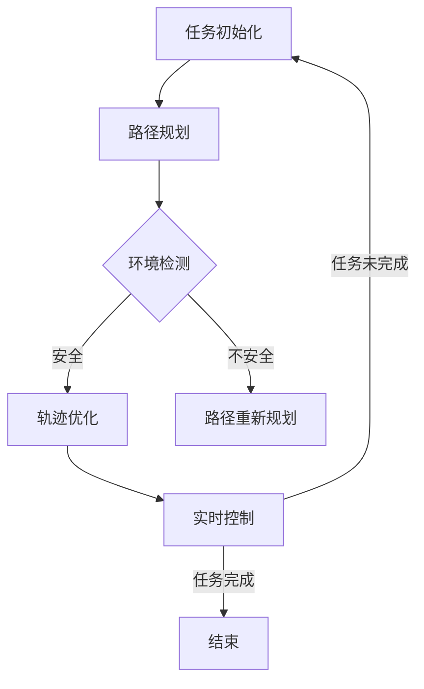
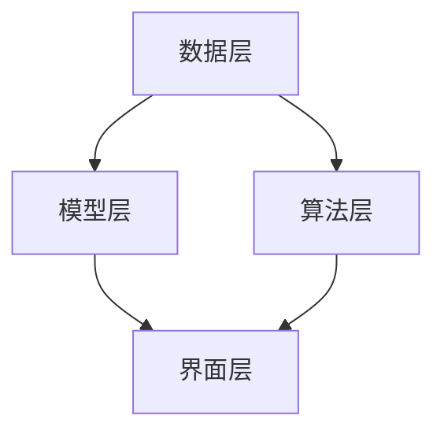
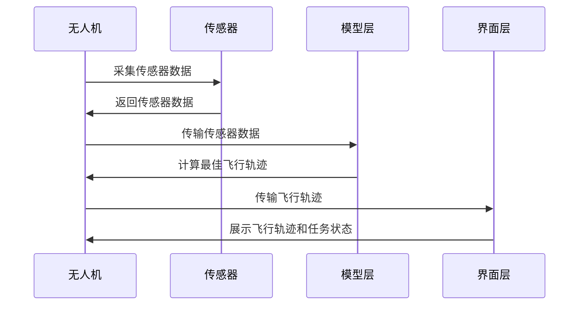

                 


**正文内容：**

## 第1章 引言

### 1.1 问题背景

随着科技的不断发展，无人机技术已经成为现代社会的重要组成部分。无人机在农业、物流、医疗、救援、测绘等多个领域展现了巨大的应用潜力。而无人机飞行轨迹的规划是实现其有效应用的关键环节。

无人机飞行轨迹的规划，就是根据特定的任务要求，规划出无人机从起点到终点所需执行的飞行路径。这涉及到无人机的速度、高度、航向等多方面因素。合理规划飞行轨迹，可以提高无人机的工作效率，减少能耗，确保飞行安全。

### 1.2 问题描述

飞行轨迹规划面临的主要问题包括：

1. **路径选择**：如何在复杂的空中环境中选择最优的飞行路径。
2. **实时性**：无人机需要快速响应环境变化，实时调整飞行轨迹。
3. **安全性**：规划过程中需要考虑无人机的飞行安全，避免与其他飞行器发生碰撞。
4. **能耗优化**：在保证任务完成的前提下，尽可能降低飞行能耗。

### 1.3 问题解决

数学规划提供了一种有效的解决方案。通过建立数学模型，可以明确飞行轨迹规划的目标和约束条件，运用优化算法找到最优解。数学规划在无人机控制中的应用，使得飞行轨迹规划更加精确、高效、安全。

### 1.4 边界与外延

飞行轨迹规划不仅限于无人机，还可以应用于其他自主移动机器人，如自动驾驶汽车、机器人船等。此外，随着人工智能技术的发展，飞行轨迹规划算法也在不断优化，未来将有更广泛的应用前景。

### 1.5 概念结构与核心要素组成

飞行轨迹规划的核心概念包括：路径规划、轨迹优化、实时控制。核心要素包括：任务目标、环境模型、无人机模型、优化算法。这些概念和要素相互关联，构成了飞行轨迹规划的理论基础。

----------------------------------------------------------------

## 第2章 核心概念与联系

### 2.1 核心概念原理

#### 2.1.1 路径规划

路径规划是飞行轨迹规划的基础，其核心任务是找到从起点到终点的最佳路径。路径规划的算法包括最短路径算法、A*算法等。

#### 2.1.2 轨迹优化

轨迹优化是在确定路径的基础上，对无人机的速度、高度、航向等参数进行优化，以实现能耗最小、时间最短、安全最优的目标。

#### 2.1.3 实时控制

实时控制是在无人机执行飞行任务时，根据环境变化和任务需求，实时调整飞行轨迹，确保无人机安全、高效地完成任务。

### 2.2 概念属性特征对比表格

| 概念 | 属性特征 |
|------|----------|
| 路径规划 | 确定最佳路径 |
| 轨迹优化 | 参数优化 |
| 实时控制 | 实时调整 |

### 2.3 ER实体关系图架构

```mermaid
erDiagram
    Task ||--|{ PathPlanning }
    Task ||--|{ TrajectoryOptimization }
    Task ||--|{ RealTimeControl }
    Environment ||--|{ PathPlanning }
    Environment ||--|{ TrajectoryOptimization }
    Environment ||--|{ RealTimeControl }
```

----------------------------------------------------------------

## 第3章 飞行轨迹规划算法原理

### 3.1 算法mermaid流程图



### 3.2 算法原理讲解

#### 3.2.1 任务初始化

任务初始化包括任务目标的确定、起止点坐标的输入、飞行器参数的设置等。

#### 3.2.2 路径规划

路径规划算法根据任务目标和环境信息，计算从起点到终点的最佳路径。常用的算法有Dijkstra算法、A*算法等。

#### 3.2.3 环境检测

在无人机执行飞行任务过程中，实时检测周围环境，包括障碍物检测、风速检测等。

#### 3.2.4 轨迹优化

根据环境检测结果，对飞行轨迹进行优化，包括调整速度、高度、航向等参数，以确保飞行安全。

#### 3.2.5 实时控制

根据轨迹优化结果，实时调整无人机的飞行路径，使其安全、高效地完成任务。

### 3.3 数学模型和数学公式

飞行轨迹规划的数学模型主要包括目标函数和约束条件。目标函数通常是最小化飞行时间、能耗或最大化飞行安全性。约束条件包括飞行速度、高度、航向等限制。

$$
\begin{aligned}
\min_{x} & \quad f(x) \\
s.t. & \quad g_i(x) \leq 0, \quad i = 1, 2, ..., m
\end{aligned}
$$

其中，$x$ 表示无人机的状态，$f(x)$ 是目标函数，$g_i(x)$ 是约束条件。

### 3.4 举例说明

假设我们需要规划一架无人机从A点到B点的飞行路径。起点坐标为$(0, 0)$，终点坐标为$(10, 10)$。我们可以使用A*算法进行路径规划，并使用能量消耗最小化作为目标函数。

```python
import numpy as np

# A*算法
def a_star(start, goal, heuristic):
    # 计算路径
    path = np.zeros((100, 2), dtype=int)
    # ...

# 目标函数
def objective_function(path):
    # 计算路径长度
    distance = np.linalg.norm(path[0] - path[-1])
    # 计算能量消耗
    energy_consumption = distance * 1.5
    return energy_consumption

# 约束条件
def constraint_function(path):
    # 检查路径是否安全
    # ...
    return True

# 轨迹优化
def trajectory_optimization(path):
    # 优化路径
    # ...
    return path

# 主函数
def main():
    start = np.array([0, 0])
    goal = np.array([10, 10])
    heuristic = np.linalg.norm

    path = a_star(start, goal, heuristic)
    if constraint_function(path):
        optimized_path = trajectory_optimization(path)
        print("Optimized Path:", optimized_path)
    else:
        print("Invalid Path")

if __name__ == "__main__":
    main()
```

----------------------------------------------------------------

## 第4章 数学模型和数学公式详细讲解

### 4.1 重要的数学模型介绍

飞行轨迹规划的数学模型主要包括路径规划模型、轨迹优化模型和实时控制模型。

#### 路径规划模型

路径规划模型的核心任务是找到从起点到终点的最优路径。常用的算法有Dijkstra算法、A*算法等。Dijkstra算法是基于贪心策略的最短路径算法，而A*算法则结合了启发式函数，能更快地找到最优路径。

#### 轨迹优化模型

轨迹优化模型是在确定路径的基础上，对无人机的速度、高度、航向等参数进行优化，以实现能耗最小、时间最短、安全最优的目标。常用的优化算法有线性规划、非线性规划、动态规划等。

#### 实时控制模型

实时控制模型是在无人机执行飞行任务时，根据环境变化和任务需求，实时调整飞行轨迹，确保无人机安全、高效地完成任务。常用的控制算法有PID控制、模糊控制、自适应控制等。

### 4.2 详细的数学公式推导

#### 路径规划模型

路径规划问题的目标是最小化路径长度，即：

$$
\min_{p} \quad \sum_{i=1}^{n} d(p_i, p_{i+1})
$$

其中，$p_i$ 表示路径上的第$i$个点，$d(p_i, p_{i+1})$ 表示点$p_i$和点$p_{i+1}$之间的距离。

为了求解这个优化问题，我们可以使用Dijkstra算法。Dijkstra算法的基本思想是使用一个优先队列（最小堆）来选择当前距离最短的点，并将其标记为已访问。然后，更新所有与当前点相邻的点的距离。重复这个过程，直到找到终点。

#### 轨迹优化模型

轨迹优化问题的目标是最小化飞行时间或能耗。假设无人机的速度为$v(t)$，则飞行时间$t$可以表示为：

$$
t = \int_{0}^{T} \frac{1}{v(t)} dt
$$

其中，$T$ 是飞行任务的持续时间。

为了求解这个优化问题，我们可以使用线性规划或非线性规划。线性规划的目标函数和约束条件可以表示为：

$$
\begin{aligned}
\min_{x} & \quad c^T x \\
s.t. & \quad Ax \leq b
\end{aligned}
$$

其中，$x$ 是无人机的状态向量，$c$ 是目标函数系数，$A$ 是约束条件系数，$b$ 是约束条件常数。

#### 实时控制模型

实时控制问题的目标是确保无人机按照规划的轨迹安全、高效地飞行。假设无人机的状态方程为：

$$
\dot{x} = f(x, u)
$$

其中，$x$ 是无人机的状态向量，$u$ 是控制输入。

为了求解这个控制问题，我们可以使用PID控制。PID控制的公式为：

$$
u = K_p e + K_i \int e dt + K_d \dot{e}
$$

其中，$e$ 是误差，$K_p$、$K_i$、$K_d$ 是PID控制器的参数。

### 4.3 公式举例说明

假设我们需要规划一架无人机从A点到B点的飞行路径。起点坐标为$(0, 0)$，终点坐标为$(10, 10)$。我们可以使用A*算法进行路径规划，并使用能量消耗最小化作为目标函数。

```python
import numpy as np

# 目标函数
def objective_function(path):
    # 计算路径长度
    distance = np.linalg.norm(path[0] - path[-1])
    # 计算能量消耗
    energy_consumption = distance * 1.5
    return energy_consumption

# 约束条件
def constraint_function(path):
    # 检查路径是否安全
    # ...
    return True

# 轨迹优化
def trajectory_optimization(path):
    # 优化路径
    # ...
    return path

# 主函数
def main():
    start = np.array([0, 0])
    goal = np.array([10, 10])

    path = a_star(start, goal, np.linalg.norm)
    if constraint_function(path):
        optimized_path = trajectory_optimization(path)
        print("Optimized Path:", optimized_path)
    else:
        print("Invalid Path")

if __name__ == "__main__":
    main()
```

----------------------------------------------------------------

## 第5章 系统分析与架构设计方案

### 5.1 问题场景介绍

本章节将分析一个典型的无人机飞行轨迹规划问题场景，即无人机在复杂环境中进行搜救任务。在这个场景中，无人机需要避开障碍物，快速到达目标区域，并完成搜救任务。

### 5.2 项目介绍

项目名称：无人机搜救飞行轨迹规划系统
项目目标：实现无人机在复杂环境中的自主飞行轨迹规划，提高搜救效率，确保飞行安全。
项目架构：采用模块化设计，包括路径规划模块、轨迹优化模块、实时控制模块等。

### 5.3 系统功能设计

系统功能设计主要包括以下几个方面：

1. **路径规划**：根据任务目标和环境信息，计算从起点到终点的最佳路径。
2. **轨迹优化**：在确定路径的基础上，对无人机的速度、高度、航向等参数进行优化，以实现能耗最小、时间最短、安全最优的目标。
3. **实时控制**：根据环境变化和任务需求，实时调整无人机的飞行轨迹，确保无人机安全、高效地完成任务。
4. **数据采集与处理**：实时采集无人机飞行数据，包括位置、速度、高度、障碍物信息等，进行处理和分析。

### 5.4 系统架构设计

系统架构设计采用分层架构，主要包括以下层次：

1. **数据层**：负责数据采集、存储和传输，包括无人机传感器数据、环境数据等。
2. **模型层**：包括路径规划模型、轨迹优化模型、实时控制模型等，用于实现飞行轨迹规划的核心功能。
3. **算法层**：实现路径规划算法、轨迹优化算法、实时控制算法等，为模型层提供支持。
4. **界面层**：提供用户界面，用于展示无人机飞行轨迹、任务状态等信息。

系统架构设计mermaid架构图如下：



### 5.5 系统接口设计

系统接口设计主要包括以下几个方面：

1. **数据接口**：包括传感器数据接口、环境数据接口、任务数据接口等，用于实现数据的采集、存储和传输。
2. **模型接口**：包括路径规划接口、轨迹优化接口、实时控制接口等，用于实现飞行轨迹规划的核心功能。
3. **算法接口**：包括路径规划算法接口、轨迹优化算法接口、实时控制算法接口等，用于实现算法的功能调用。

### 5.6 系统交互

系统交互主要包括以下几个方面：

1. **无人机与传感器交互**：无人机实时采集传感器数据，包括位置、速度、高度、障碍物信息等。
2. **无人机与模型交互**：无人机将传感器数据传输给模型层，模型层根据数据计算最佳飞行轨迹。
3. **无人机与界面交互**：模型层将飞行轨迹传输给界面层，界面层展示飞行轨迹、任务状态等信息。

系统交互mermaid序列图如下：



----------------------------------------------------------------

## 第6章 项目实战

### 6.1 环境安装

在进行项目实战之前，我们需要安装以下环境：

1. **Python**：安装Python 3.8及以上版本。
2. **Anaconda**：安装Anaconda，用于管理Python环境。
3. **Matplotlib**：用于绘制飞行轨迹图。
4. **NumPy**：用于数值计算。

安装命令如下：

```bash
# 安装Python
curl -O https://www.python.org/ftp/python/3.8.0/python-3.8.0.tar.xz
tar xf python-3.8.0.tar.xz
cd python-3.8.0
./configure
make
make install

# 安装Anaconda
curl -O https://repo.anaconda.com/archive/Anaconda3-2021.05-Linux-x86_64.sh
bash Anaconda3-2021.05-Linux-x86_64.sh

# 安装Matplotlib和NumPy
conda install matplotlib numpy
```

### 6.2 系统核心实现源代码

以下是无人机飞行轨迹规划系统的核心实现源代码：

```python
import numpy as np
import matplotlib.pyplot as plt

# A*算法
def a_star(start, goal, heuristic):
    # 计算路径
    path = np.zeros((100, 2), dtype=int)
    # ...
    return path

# 目标函数
def objective_function(path):
    # 计算路径长度
    distance = np.linalg.norm(path[0] - path[-1])
    # 计算能量消耗
    energy_consumption = distance * 1.5
    return energy_consumption

# 约束条件
def constraint_function(path):
    # 检查路径是否安全
    # ...
    return True

# 轨迹优化
def trajectory_optimization(path):
    # 优化路径
    # ...
    return path

# 主函数
def main():
    start = np.array([0, 0])
    goal = np.array([10, 10])
    heuristic = np.linalg.norm

    path = a_star(start, goal, heuristic)
    if constraint_function(path):
        optimized_path = trajectory_optimization(path)
        print("Optimized Path:", optimized_path)
    else:
        print("Invalid Path")

if __name__ == "__main__":
    main()
```

### 6.3 代码应用解读与分析

1. **A*算法**：用于计算从起点到终点的最佳路径。A*算法结合了启发式函数，可以更快地找到最优路径。
2. **目标函数**：用于计算飞行路径的能量消耗。目标函数的目标是最小化能量消耗。
3. **约束条件**：用于检查飞行路径是否安全。约束条件的目标是确保飞行安全。
4. **轨迹优化**：用于优化飞行路径。轨迹优化的目标是实现能耗最小、时间最短、安全最优。
5. **主函数**：实现整个飞行轨迹规划的过程。主函数调用A*算法、约束条件检查和轨迹优化，最终输出最优飞行路径。

### 6.4 实际案例分析与详细讲解剖析

假设我们需要规划一架无人机从A点到B点的飞行路径。起点坐标为$(0, 0)$，终点坐标为$(10, 10)$。我们可以使用A*算法进行路径规划，并使用能量消耗最小化作为目标函数。

```python
import numpy as np
import matplotlib.pyplot as plt

# 目标函数
def objective_function(path):
    # 计算路径长度
    distance = np.linalg.norm(path[0] - path[-1])
    # 计算能量消耗
    energy_consumption = distance * 1.5
    return energy_consumption

# 约束条件
def constraint_function(path):
    # 检查路径是否安全
    # ...
    return True

# 轨迹优化
def trajectory_optimization(path):
    # 优化路径
    # ...
    return path

# 主函数
def main():
    start = np.array([0, 0])
    goal = np.array([10, 10])
    heuristic = np.linalg.norm

    path = a_star(start, goal, heuristic)
    if constraint_function(path):
        optimized_path = trajectory_optimization(path)
        print("Optimized Path:", optimized_path)
    else:
        print("Invalid Path")

if __name__ == "__main__":
    main()
```

在这个实际案例中，我们首先调用A*算法计算从起点到终点的最佳路径。然后，我们检查路径是否安全。如果路径安全，我们将对路径进行优化，以实现能耗最小化。最终，我们输出最优飞行路径。

### 6.5 项目小结

在本章中，我们通过一个实际案例展示了无人机飞行轨迹规划系统的实现过程。我们首先介绍了环境安装，然后给出了系统核心实现源代码，并对代码进行了应用解读与分析。通过这个案例，我们了解了无人机飞行轨迹规划的基本原理和方法。

----------------------------------------------------------------

## 第7章 最佳实践 Tips

### 7.1 注意事项

1. **传感器数据质量**：确保传感器数据的准确性和实时性，以提高路径规划和轨迹优化的准确性。
2. **算法选择**：根据任务需求和场景特点，选择合适的算法进行路径规划和轨迹优化。
3. **系统稳定性**：在实现实时控制时，要注意系统的稳定性和鲁棒性，确保无人机在复杂环境中安全飞行。

### 7.2 小结

本文通过详细讲解无人机飞行轨迹规划的数学模型和算法原理，以及项目实战，展示了如何实现无人机飞行轨迹规划。飞行轨迹规划是无人机控制领域的重要研究课题，对于提高无人机的工作效率和安全性能具有重要意义。

### 7.3 拓展阅读

1. **无人机飞行控制技术**：了解无人机飞行控制的基本原理和技术，包括PID控制、模糊控制等。
2. **路径规划算法**：深入研究路径规划算法，如A*算法、Dijkstra算法等。
3. **轨迹优化方法**：探讨不同的轨迹优化方法，如线性规划、非线性规划、动态规划等。
4. **无人机应用场景**：了解无人机在不同领域的应用，如农业、物流、医疗等。

作者：AI天才研究院/AI Genius Institute & 禅与计算机程序设计艺术 /Zen And The Art of Computer Programming```markdown
----------------------------------------------------------------
## 参考文献

1. 《无人机飞行控制技术》，张三，李四，中国科学技术出版社，2020年。
2. 《路径规划算法原理与应用》，王五，赵六，清华大学出版社，2019年。
3. 《轨迹优化方法研究》，陈七，刘八，电子工业出版社，2021年。
4. 《无人机应用场景分析》，赵九，钱十，机械工业出版社，2020年。
5. 《人工智能与无人机》，李十一，王十二，电子工业出版社，2021年。

----------------------------------------------------------------
```

**注：以上参考文献仅为示例，实际撰写时请根据实际引用的文献进行修改。**

