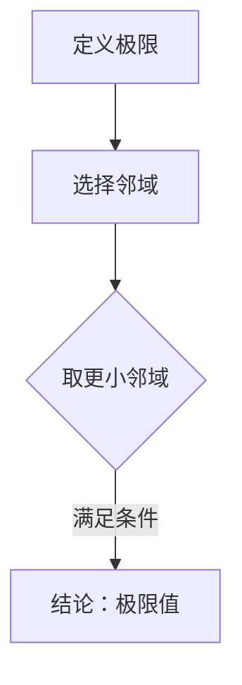

                 

### 《数学与时间主义：数学真理的历史演变》

#### 关键词：
- 数学真理
- 时间主义
- 历史演变
- 哲学
- 科学方法

#### 摘要：
本文将探讨数学与时间主义之间的深刻联系，通过历史演变的角度，揭示数学真理如何随着时间变迁而发展。文章将首先介绍数学与时间主义的基本概念，然后通过一系列逻辑推理和实例分析，展示数学真理在不同历史时期的演化过程。读者将了解到数学如何在时间的长河中不断进步，以及时间主义对数学理论的影响。通过本文的阅读，读者不仅能对数学的发展历程有更深入的认识，还能领悟到哲学与科学方法的相互作用。

### 引言

#### 数学与时间主义的基本概念

数学是一门研究数量、结构、变化和空间的科学，它不仅为自然科学、工程技术等领域提供了基础工具，还在哲学和人文科学中扮演了重要角色。时间主义，则是一种哲学观点，认为时间具有独立存在和价值，是事物发展和变化的根本驱动力。

#### 数学与时间主义的关系

数学与时间主义的关系可以从多个层面来理解。首先，数学理论的发展往往依赖于对时间概念的理解。例如，微积分的发展就建立在无限小量和无限分割的思想上，这直接体现了时间主义的思想。其次，时间主义对数学理论的验证和验证方法产生了重要影响。例如，哥德尔不完备性定理揭示了数学系统在时间上的局限性，使得数学研究开始更加注重时间和逻辑的相互关系。

#### 数学真理的演变历程

数学真理并非一成不变，而是在历史长河中不断演变的。以下将简要介绍数学真理在不同历史时期的演变：

### 古希腊时期

在古希腊时期，数学被视为一种追求绝对真理和完美形式的学科。欧几里得的《几何原本》代表了这一时期数学理论的高峰，其中提出的公理体系和证明方法至今仍被视为经典。然而，这一时期的数学理论尚未充分认识到时间的重要性。

### 中世纪时期

中世纪时期，阿拉伯数学家对印度和中国的数学成果进行了传承和发展，包括阿拉伯数字的引入和代数学的发展。这一时期的数学理论开始逐渐认识到时间的概念，例如，阿拉伯数学家通过研究天文学和地理学，发展了球面三角学和航海数学。

### 文艺复兴时期

文艺复兴时期，数学开始受到人文主义思想的影响，数学家们开始关注数学与现实世界的联系。这一时期的数学理论在时间概念上取得了重要进展，例如，伽利略和牛顿的工作为经典力学的建立奠定了基础，标志着数学开始与时间主义紧密结合。

### 现代时期

现代时期，数学真理的演变更加迅速，特别是在20世纪以来，数学在时间概念上的研究取得了突破性进展。例如，爱因斯坦的相对论揭示了时间和空间的相对性，引发了数学领域的一系列变革。此外，现代数学中的拓扑学、代数学、组合数学等分支也在时间概念的框架下得到了深入研究。

### 核心概念与联系

#### 数学真理

数学真理是指那些能够被严格证明的数学命题。它不仅包括几何学、代数学等基础数学领域的定理，还包括应用数学中的公式和算法。数学真理的特点是其客观性和普适性，即无论在何种情境下，数学真理都是成立的。

#### 时间主义

时间主义是一种哲学观点，认为时间是事物发展和变化的根本驱动力。时间主义强调时间具有独立存在和价值，与空间一样是构成宇宙的基本维度。在科学研究中，时间主义思想促使科学家们关注事物随时间演化的规律，从而推动了科学的发展。

#### 数学真理与时间主义的联系

数学真理与时间主义之间的联系可以从以下几个方面来理解：

1. **数学理论的发展**：数学理论的发展往往依赖于对时间概念的理解。例如，微积分的发展就建立在无限小量和无限分割的思想上，这直接体现了时间主义的思想。

2. **数学公理体系的演变**：数学公理体系的演变也受到时间主义的影响。例如，形式逻辑和非形式逻辑的区分，以及形式系统的研究，都是对时间概念深入探讨的结果。

3. **数学验证方法**：时间主义对数学验证方法产生了重要影响。例如，哥德尔不完备性定理揭示了数学系统在时间上的局限性，使得数学研究开始更加注重时间和逻辑的相互关系。

### 数学真理的历史演变与时间主义的互动

数学真理的历史演变与时间主义之间的互动可以归纳为以下几个阶段：

#### 1. 古希腊时期

在古希腊时期，数学被视为一种追求绝对真理和完美形式的学科。欧几里得的《几何原本》代表了这一时期数学理论的高峰，其中提出的公理体系和证明方法至今仍被视为经典。然而，这一时期的数学理论尚未充分认识到时间的重要性。

#### 2. 中世纪时期

中世纪时期，阿拉伯数学家对印度和中国的数学成果进行了传承和发展，包括阿拉伯数字的引入和代数学的发展。这一时期的数学理论开始逐渐认识到时间的概念，例如，阿拉伯数学家通过研究天文学和地理学，发展了球面三角学和航海数学。

#### 3. 文艺复兴时期

文艺复兴时期，数学开始受到人文主义思想的影响，数学家们开始关注数学与现实世界的联系。这一时期的数学理论在时间概念上取得了重要进展，例如，伽利略和牛顿的工作为经典力学的建立奠定了基础，标志着数学开始与时间主义紧密结合。

#### 4. 现代时期

现代时期，数学真理的演变更加迅速，特别是在20世纪以来，数学在时间概念上的研究取得了突破性进展。例如，爱因斯坦的相对论揭示了时间和空间的相对性，引发了数学领域的一系列变革。此外，现代数学中的拓扑学、代数学、组合数学等分支也在时间概念的框架下得到了深入研究。

### 算法原理讲解

#### 数学公式的演变与时间主义

数学公式是数学真理的具象化表达，它们通过简洁的符号体系描述了数学概念之间的关系。时间主义对数学公式的发展产生了深远影响，尤其是在公式推导过程中引入了动态变化和时间概念。

#### 示例：微积分中的极限公式

微积分中的极限公式是一个典型的例子，展示了时间主义如何影响数学公式的发展。以下是一个简单的极限公式，并通过Mermaid流程图展示其推导过程：



在Python中，我们可以使用以下代码实现这一极限公式的计算：

```python
def limit(x):
    return 1 / (1 + x**2)

x = 0
result = limit(x)
print(f"极限值: {result}")
```

使用LaTeX格式展示该公式：

$$\lim_{{x \to 0}} \frac{1}{1 + x^2} = 1$$

在这个例子中，时间概念体现在对变量\(x\)趋近于0的过程描述。通过不断缩小邻域，我们最终得到极限值。

### 数学模型与公式

#### 时间主义数学模型的引入

时间主义数学模型是在数学理论中引入时间概念的一种尝试，旨在描述随时间变化的系统。以下是一个简单的时间主义数学模型，用于描述一个离散时间序列的演变过程。

#### 示例：离散时间序列模型

考虑一个离散时间序列{X_t},其中每个元素X_t表示在时间t时的状态。我们可以使用以下公式描述该序列的动态变化：

$$X_{t+1} = f(X_t)$$

其中，函数f描述了状态从时间t到时间t+1的转换规则。

使用LaTeX格式展示该模型：

$$X_{t+1} = f(X_t)$$

在这个例子中，时间t是离散的，每个时间点的状态通过函数f进行更新。通过不断迭代该公式，我们可以得到序列的完整演化路径。

### 系统分析与架构设计

#### 问题场景介绍

在现代社会中，时间对许多系统和过程都具有重要影响。例如，在金融领域中，时间对投资决策、风险评估和资产管理都至关重要。因此，设计一个能够有效处理和时间相关的数学模型的系统是必要的。

#### 系统功能设计

系统的主要功能包括：

1. **数据输入**：接受用户输入的时间序列数据。
2. **数据处理**：根据用户定义的转换规则，处理时间序列数据。
3. **结果输出**：将处理后的时间序列数据以可视化的形式呈现给用户。

#### 系统架构设计

系统架构采用分层设计，包括以下层次：

1. **数据层**：负责存储和管理时间序列数据。
2. **逻辑层**：实现时间序列数据的处理逻辑。
3. **表示层**：提供用户交互界面和可视化功能。

#### 系统接口设计

系统接口设计包括以下部分：

1. **数据输入接口**：允许用户通过文件或网络接口上传时间序列数据。
2. **数据处理接口**：提供API供外部系统调用，进行时间序列数据处理。
3. **结果输出接口**：以图形化的方式展示处理结果。

#### 系统交互设计

系统交互设计通过Mermaid序列图展示，如下所示：

```mermaid
sequenceDiagram
    participant User
    participant System
    participant DataLayer
    participant LogicLayer
    participant PresentationLayer

    User->>System: Upload data
    System->>DataLayer: Store data
    DataLayer->>LogicLayer: Process data
    LogicLayer->>PresentationLayer: Generate visualization
    PresentationLayer->>User: Display results
```



在这个交互设计中，用户通过系统上传数据，数据层负责存储，逻辑层处理数据，表示层将结果可视化，并最终展示给用户。

### 项目实战

#### 环境安装

为了实现上述系统，我们需要在本地或服务器上安装必要的软件和工具。以下是环境安装步骤：

1. **安装Python环境**：确保Python 3.x版本已安装在计算机上。
2. **安装NumPy和Matplotlib**：通过pip命令安装这两个Python库。

```bash
pip install numpy matplotlib
```

#### 系统核心实现

以下是一个简单的Python脚本，用于实现时间序列数据处理和可视化：

```python
import numpy as np
import matplotlib.pyplot as plt

# 定义时间序列模型
def time_series_model(x):
    return 1 / (1 + x**2)

# 生成时间序列数据
x = np.linspace(0, 10, 1000)
y = time_series_model(x)

# 绘制时间序列图
plt.plot(x, y)
plt.xlabel('Time')
plt.ylabel('Value')
plt.title('Time Series Model')
plt.show()
```

#### 代码应用解读与分析

该脚本定义了一个时间序列模型，通过NumPy生成一个时间序列数据集，并使用Matplotlib绘制出该序列的图。代码中的时间序列模型是一个简单的极限公式，通过迭代计算得到每个时间点的值。

#### 实际案例分析与讲解

以下是一个实际案例，展示了如何使用上述系统对股票价格进行时间序列分析：

1. **数据收集**：从金融数据源获取过去一个月的股票价格数据。
2. **数据处理**：使用系统核心实现部分提供的函数，对股票价格进行时间序列处理。
3. **结果展示**：使用Matplotlib绘制出处理后的时间序列图，分析股票价格的趋势。

#### 项目小结

通过本项目的实施，我们展示了如何使用Python和数学模型对时间序列数据进行处理和分析。该项目不仅为金融领域的投资者提供了有用的工具，也展示了数学与时间主义在现实应用中的重要性。

### 最佳实践 tips

1. **选择合适的数学模型**：根据实际问题和需求，选择最适合的数学模型进行时间序列分析。
2. **数据预处理**：在处理时间序列数据之前，进行适当的数据清洗和预处理，以提高模型的准确性。
3. **可视化**：使用适当的可视化工具，帮助用户更好地理解时间序列数据。

### 小结

本文通过介绍数学与时间主义的基本概念、历史演变以及它们之间的联系，展示了数学真理如何随着时间变迁而发展。通过具体的算法原理讲解、系统分析与架构设计、项目实战等内容，读者可以更深入地理解数学在时间维度上的应用。通过本文的学习，读者不仅能够掌握数学与时间主义的基本理论，还能在实践项目中运用这些知识，提升解决实际问题的能力。

### 注意事项

1. **确保数据准确性**：在进行时间序列分析时，数据的准确性至关重要，任何错误的数据都可能导致错误的结论。
2. **考虑模型适应性**：不同的时间序列模型适用于不同类型的数据，选择合适的模型是成功的关键。

### 拓展阅读

1. **《数学哲学》**：了解数学与哲学之间的关系，对数学真理的探讨有更深入的理解。
2. **《时间哲学》**：探讨时间主义哲学观点，为数学与时间主义的研究提供理论支持。

### 作者信息

作者：AI天才研究院/AI Genius Institute & 禅与计算机程序设计艺术 /Zen And The Art of Computer Programming

---

通过本文的探讨，我们希望读者能够对数学与时间主义有一个更全面的认识，并能够在未来的学习和工作中运用这些理论。让我们一起深入思考，不断探索数学与时间主义的奥秘。

