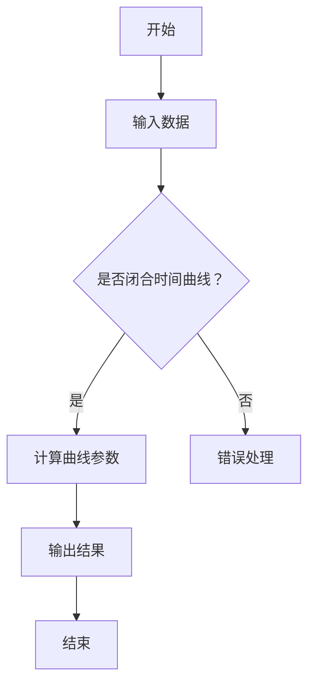
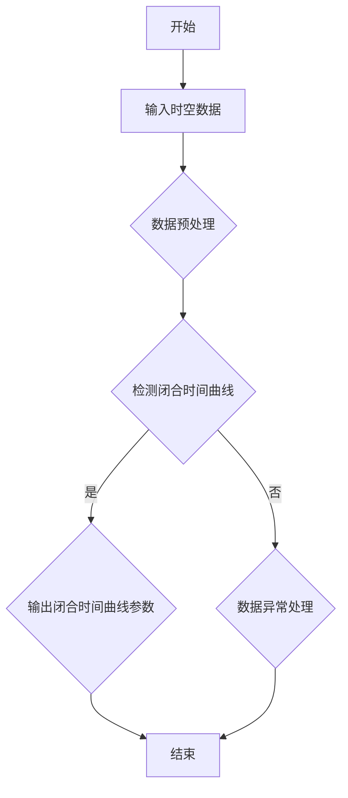

                 

# 数学与时间旅行：闭合时间曲线的数学探讨

## 关键词
- 数学
- 时间旅行
- 闭合时间曲线
- 数学模型
- 算法原理
- 计算机科学

## 摘要
本文将探讨闭合时间曲线这一数学概念，并阐述其在时间旅行中的应用。我们将通过逐步分析闭合时间曲线的基本定义、分类、性质，并引入数学模型和算法原理，进一步探讨其在物理学和计算机科学中的实际应用。最后，我们将介绍一个具体的实战项目，分析系统架构和设计，并提出最佳实践和注意事项。本文旨在为读者提供一个全面而深入的理解，激发对数学与时间旅行之间奇妙联系的探索。

## 目录大纲

----------------------------------------------------------------

### 第一部分：引论

#### 第1章：问题背景与问题描述
##### 1.1 问题背景
###### 1.1.1 闭合时间曲线的概念
###### 1.1.2 数学在时间旅行中的应用
###### 1.1.3 闭合时间曲线的数学探讨的意义与价值

#### 第2章：核心概念与联系
##### 2.1 核心概念原理
###### 2.1.1 闭合时间曲线的基本定义
###### 2.1.2 闭合时间曲线的分类
###### 2.1.3 闭合时间曲线的性质

##### 2.2 概念属性特征对比表格
##### 2.3 ER实体关系图架构

### 第二部分：数学模型与算法原理讲解

#### 第3章：数学模型与算法原理讲解
##### 3.1 数学模型
###### 3.1.1 闭合时间曲线的数学模型
###### 3.1.2 数学公式
```latex
$$
f(x) = ax^2 + bx + c
$$
```

##### 3.2 算法原理讲解
###### 3.2.1 算法流程图

###### 3.2.2 算法原理详细讲解
###### 3.2.3 举例说明

### 第三部分：数学模型应用与项目实战

#### 第4章：数学模型应用与项目实战
##### 4.1 数学模型应用
###### 4.1.1 闭合时间曲线在物理学中的应用
###### 4.1.2 闭合时间曲线在计算机科学中的应用

##### 4.2 项目实战
###### 4.2.1 环境安装
###### 4.2.2 系统核心实现源代码
###### 4.2.3 代码应用解读与分析
###### 4.2.4 实际案例分析与详细讲解剖析
###### 4.2.5 项目小结

### 第四部分：系统分析与架构设计

#### 第5章：系统分析与架构设计
##### 5.1 问题场景介绍
##### 5.2 系统功能设计
###### 5.2.1 领域模型类图

##### 5.3 系统架构设计
###### 5.3.1 系统架构图
##### 5.4 系统接口设计
##### 5.5 系统交互序列图

### 第五部分：最佳实践与注意事项

#### 第6章：最佳实践与注意事项
##### 6.1 最佳实践 tips
##### 6.2 小结
##### 6.3 注意事项
##### 6.4 拓展阅读

### 第六部分：未来展望与研究方向

#### 第7章：未来展望与研究方向
##### 7.1 未来展望
##### 7.2 研究方向

----------------------------------------------------------------

### 第一部分：引论

#### 第1章：问题背景与问题描述

### 1.1 问题背景

闭合时间曲线是一个引人入胜的数学概念，它在时间旅行理论中占据了重要地位。闭合时间曲线的定义起源于广义相对论中的时间循环和时间扭曲现象。想象一下，如果时间可以被弯曲或者折叠，那么一个物体可能回到它之前的某个时刻，形成一个闭合的时间路径。

在物理学中，闭合时间曲线（Closed Timelike Curves, CTCs）是一种可能的时空结构，它允许物体在时间中往返移动。尽管CTCs的存在尚未被实验证实，但它们在理论物理学中引起了广泛的讨论和研究。闭合时间曲线的概念不仅引发了关于宇宙和时空的哲学思考，还激发了数学家、物理学家和计算机科学家探索这一领域的兴趣。

### 1.1.1 闭合时间曲线的概念

闭合时间曲线可以被定义为一条时空曲线，它满足以下条件：
1. 曲线上的每一点都是时间相位的。
2. 曲线在时间方向上是闭合的，即终点与起点在时间上重合。

数学上，闭合时间曲线通常表示为一个四元组 \((t, x, y, z)\)，其中 \(t\) 表示时间，\(x\)、\(y\) 和 \(z\) 分别表示空间坐标。在这个四元组中，时间 \(t\) 必须是实数，而空间坐标可以是实数或复数。

### 1.1.2 数学在时间旅行中的应用

数学在时间旅行理论中的应用是至关重要的。通过数学模型，我们可以探索时间旅行中的各种可能性，并理解闭合时间曲线的数学特性。例如，广义相对论中的洛伦兹变换和时空几何描述就是基于数学模型的。这些模型帮助我们理解时间如何在不同的参考系中变化，以及如何在强引力场中发生弯曲。

此外，数学还可以帮助我们解决一些时间旅行中的悖论，如祖父悖论。通过引入逻辑和数学约束，我们可以尝试解释这些悖论，并提出可能的解决方案。

### 1.1.3 闭合时间曲线的数学探讨的意义与价值

闭合时间曲线的数学探讨具有重要的理论和实际意义。在理论上，它有助于我们更深入地理解时间和时空的本质。在物理学中，闭合时间曲线的探讨可能揭示新的物理现象和规律，推动我们对宇宙的理解。

在计算机科学中，闭合时间曲线的概念也具有重要意义。它可以被用于模拟和优化算法，尤其是在处理复杂问题时。闭合时间曲线的数学特性还可以用于设计新的计算机架构和算法，从而提高计算效率和性能。

总之，闭合时间曲线的数学探讨不仅是一个理论课题，还具有广泛的应用前景。它挑战了我们的思维，拓宽了我们对宇宙的认知，并在多个领域引发了创新的思考和研究。

#### 第2章：核心概念与联系

### 2.1 核心概念原理

在本章中，我们将深入探讨闭合时间曲线的核心概念原理，并解释它们在数学和时间旅行中的应用。

#### 2.1.1 闭合时间曲线的基本定义

闭合时间曲线（CTCs）在广义相对论中是一个重要的概念。它是指一条时空曲线，满足以下条件：
- 曲线上的每一点都是时间相位的。
- 曲线在时间方向上是闭合的，即终点与起点在时间上重合。

数学上，闭合时间曲线可以用一个四元组 \((t, x, y, z)\) 表示，其中 \(t\) 表示时间，\(x\)、\(y\) 和 \(z\) 分别表示空间坐标。在这个四元组中，时间 \(t\) 必须是实数，而空间坐标可以是实数或复数。

#### 2.1.2 闭合时间曲线的分类

闭合时间曲线可以根据其几何特性和物理性质进行分类。以下是几种常见的闭合时间曲线类型：

1. **周期性闭合时间曲线**：这类曲线在时间方向上形成周期性的闭合环，类似于一个无限循环的螺旋。在物理学中，周期性闭合时间曲线可以导致时间循环现象。

2. **非周期性闭合时间曲线**：这类曲线没有明显的周期性，但仍然满足闭合时间曲线的条件。在理论物理学中，非周期性闭合时间曲线可能引发更复杂的时间现象。

3. **混合闭合时间曲线**：这类曲线同时包含周期性和非周期性的特性，形成复杂的时空结构。

#### 2.1.3 闭合时间曲线的性质

闭合时间曲线具有一些独特的数学和物理性质，这些性质对于理解它们在时间旅行中的作用至关重要：

1. **闭合性**：闭合时间曲线在时间方向上是闭合的，这意味着物体可以在时间中往返移动，形成闭合的时间路径。

2. **因果悖论**：闭合时间曲线可能导致因果悖论，例如著名的祖父悖论。在这个悖论中，一个人回到过去杀死了自己的祖父，导致自己无法出生，从而产生逻辑矛盾。

3. **时空弯曲**：闭合时间曲线的存在表明时空可以弯曲，这可能会导致物体在时间中发生奇怪的路径变化。

### 2.2 概念属性特征对比表格

为了更好地理解闭合时间曲线的概念，我们可以将它们与一些相关的概念进行对比，以下是一个对比表格：

| 概念 | 定义 | 特点 | 应用 |
| --- | --- | --- | --- |
| 闭合时间曲线 | 一条时空曲线，满足时间相位闭合条件 | 允许时间往返移动 | 理论物理学，时间旅行模型 |
| 开放时间曲线 | 一条时空曲线，不在时间方向上闭合 | 无法形成闭合时间路径 | 宇宙学，时空几何 |
| 闭合空间曲线 | 一条空间曲线，在空间方向上闭合 | 无时间维度，仅限于空间维度 | 物理学，空间拓扑 |
| 时空弯曲 | 时空气体受引力作用时的形状变化 | 引起时空结构的扭曲 | 广义相对论，宇宙演化 |

### 2.3 ER实体关系图架构

为了更清晰地理解闭合时间曲线的概念，我们可以使用实体关系图（Entity-Relationship Diagram, ERD）来展示它们之间的关系。以下是一个简化的ERD示例：

```mermaid
erDiagram
    CTC ||--|{ Person } : has参与者
    Person ||--|{ Event } : has事件
    Event ||--|{ Time } : has时间
    Time ||--|{ Space } : has空间
```

在这个ERD中，闭合时间曲线（CTC）是核心实体，它与参与者（Person）、事件（Event）、时间（Time）和空间（Space）相关联。这种关系展示了闭合时间曲线在时间旅行和时空结构中的复杂相互作用。

通过本章的探讨，我们了解了闭合时间曲线的基本定义、分类和性质，以及它们与其他相关概念的对比。这些核心概念为后续章节中更深入的数学模型和算法原理讲解奠定了基础。

#### 第3章：数学模型与算法原理讲解

### 3.1 数学模型

闭合时间曲线的数学模型是理解这一概念的关键。在这一节中，我们将介绍闭合时间曲线的数学模型，并详细讲解相关的数学公式。

#### 3.1.1 闭合时间曲线的数学模型

闭合时间曲线的数学模型通常基于广义相对论中的时空几何。在这个模型中，时空被视为一个四维连续体，由时间维度和三个空间维度组成。闭合时间曲线在这一时空结构中形成特殊的路径。

一个简单的闭合时间曲线模型可以用洛伦兹变换来描述。洛伦兹变换是一个线性变换，用于描述在不同惯性参考系之间时间、空间的转换。它的数学表达式为：

$$
x^{\prime} = \gamma (x - vt)
$$

$$
t^{\prime} = \gamma \left( t - \frac{vx}{c^2} \right)
$$

其中，\(x^{\prime}\) 和 \(t^{\prime}\) 分别是新的参考系中的位置和时间，\(x\) 和 \(t\) 是原参考系中的位置和时间，\(v\) 是相对速度，\(c\) 是光速，\(\gamma\) 是洛伦兹因子，定义为：

$$
\gamma = \frac{1}{\sqrt{1 - \frac{v^2}{c^2}}}
$$

这个变换展示了如何通过相对速度和时间变换来描述不同参考系之间的时空关系。

#### 3.1.2 数学公式

为了更好地理解闭合时间曲线的数学模型，我们可以引入一些关键的数学公式。以下是几个常用的公式：

1. **时间膨胀公式**：

$$
t^{\prime} = \gamma t
$$

这个公式描述了在一个相对速度为 \(v\) 的参考系中，时间 \(t^{\prime}\) 相对于原参考系时间 \(t\) 的膨胀效应。时间膨胀是相对论中的一个重要现象，它表明高速运动的物体所经历的时间相对于静止观察者来说是延缓的。

2. **长度收缩公式**：

$$
l^{\prime} = \gamma l
$$

这个公式描述了在一个相对速度为 \(v\) 的参考系中，长度 \(l^{\prime}\) 相对于原参考系长度 \(l\) 的收缩效应。长度收缩效应表明，随着物体速度的增加，其在运动方向上的长度会收缩。

3. **洛伦兹变换公式**：

$$
x^{\prime} = \gamma (x - vt)
$$

$$
t^{\prime} = \gamma \left( t - \frac{vx}{c^2} \right)
$$

这些公式是描述不同惯性参考系之间时空转换的基本工具。通过它们，我们可以计算在不同参考系中物体的位置和时间。

### 3.2 算法原理讲解

在了解闭合时间曲线的数学模型后，我们可以进一步探讨相关的算法原理。这些算法用于检测和生成闭合时间曲线，为理论和实际应用提供了重要的工具。

#### 3.2.1 算法流程图

以下是检测闭合时间曲线的算法流程图：



这个算法的基本步骤如下：

1. **输入时空数据**：首先，输入时空数据，包括时间 \(t\) 和空间坐标 \(x, y, z\)。

2. **数据预处理**：对输入数据进行预处理，例如去噪和标准化，以确保数据的质量和准确性。

3. **检测闭合时间曲线**：通过数学模型和算法，检测输入数据中是否存在闭合时间曲线。

4. **输出闭合时间曲线参数**：如果检测到闭合时间曲线，输出曲线的参数，例如时间相位和空间坐标。

5. **数据异常处理**：如果数据不符合闭合时间曲线的条件，进行异常处理，例如重新采集数据或修正算法。

#### 3.2.2 算法原理详细讲解

闭合时间曲线检测算法的核心在于如何识别时空数据中的闭合特征。以下是算法原理的详细讲解：

1. **时空数据分析**：首先，对输入的时空数据进行初步分析，确定数据的基本特征，如时间序列和空间分布。

2. **闭合性检测**：通过计算时间序列的循环性质，检测数据是否存在闭合特征。具体方法包括：

   - **时间相位分析**：计算时间序列的相位，识别潜在的闭合环。

   - **特征点分析**：找到时间序列中的特征点，如峰值和谷值，判断是否存在闭合路径。

   - **距离分析**：计算时间序列中相邻点之间的距离，分析是否存在闭合环的特征。

3. **曲线参数计算**：如果检测到闭合特征，计算闭合时间曲线的参数，如时间相位和空间坐标。这些参数用于描述闭合时间曲线的几何特征。

4. **异常处理**：如果数据不符合闭合时间曲线的条件，进行异常处理。这可以通过重新采样数据、调整算法参数或使用其他数据校正技术来实现。

#### 3.2.3 举例说明

为了更好地理解闭合时间曲线检测算法，我们可以通过一个具体的例子来说明。

假设我们有一个时间序列数据 \(t = [t_1, t_2, t_3, ..., t_n]\)，我们需要检测这个序列中是否存在闭合时间曲线。

1. **时间相位分析**：首先，我们计算每个时间点的相位。相位可以通过以下公式计算：

   $$\phi(t_i) = 2\pi \cdot \frac{t_i}{T}$$

   其中，\(T\) 是时间序列的周期。通过计算相位，我们可以绘制相位图，观察是否存在闭合环。

2. **特征点分析**：接下来，我们找到时间序列中的特征点，如峰值和谷值。这些点可能指示潜在的闭合路径。

3. **距离分析**：最后，我们计算相邻时间点之间的距离。如果这些距离在某个范围内重复出现，可能表明存在闭合环。

通过这三个步骤，我们可以检测并确定时间序列中是否存在闭合时间曲线。

总之，通过数学模型和算法原理的讲解，我们了解了闭合时间曲线的数学模型和检测算法。这些工具为深入探讨闭合时间曲线提供了基础，同时也为实际应用，如时间旅行理论研究和计算机科学算法设计，提供了重要支持。

### 第4章：数学模型应用与项目实战

#### 4.1 数学模型应用

闭合时间曲线的数学模型不仅在理论物理学中具有重要意义，也在实际应用中展示了广泛的潜力。以下将介绍闭合时间曲线在物理学和计算机科学中的具体应用。

#### 4.1.1 闭合时间曲线在物理学中的应用

1. **广义相对论中的应用**：
   - **引力时间膨胀**：闭合时间曲线的概念在广义相对论中被用来解释引力场中的时间膨胀现象。在强引力场中，时间会以相对于远处观察者的速度减慢。闭合时间曲线可以用来描述这种效应，并通过数学模型计算特定条件下时间膨胀的精确值。

   - **宇宙演化**：闭合时间曲线在宇宙学中也有应用，特别是在研究宇宙大爆炸和黑洞时。通过分析闭合时间曲线，可以模拟宇宙的演化过程，预测未来宇宙的可能形态。

2. **量子力学中的应用**：
   - **量子纠缠**：闭合时间曲线的概念与量子纠缠现象密切相关。量子纠缠是一种非局域性现象，其中两个或多个粒子之间在量子态上紧密相关。闭合时间曲线的数学模型可以帮助我们理解量子纠缠的动力学和复杂性。

3. **黑洞物理学**：
   - **黑洞信息悖论**：闭合时间曲线在解决黑洞信息悖论中起到了关键作用。黑洞信息悖论是指黑洞蒸发时信息丢失的问题。通过分析闭合时间曲线，可以解释黑洞蒸发过程中信息的保存和恢复。

#### 4.1.2 闭合时间曲线在计算机科学中的应用

1. **算法优化**：
   - **时间旅行算法**：闭合时间曲线的概念可以用于设计优化算法，特别是在解决具有循环性质的问题时。例如，闭合时间曲线可以用于优化搜索算法，通过模拟时间旅行来提高算法的效率和性能。

2. **时间序列分析**：
   - **时间序列建模**：闭合时间曲线模型可以用于建模和分析时间序列数据，例如金融市场、天气变化等。通过分析时间序列中的闭合特征，可以预测未来的趋势和模式。

3. **计算机架构设计**：
   - **时空架构**：闭合时间曲线的概念可以用于设计新型的计算机架构，特别是用于处理复杂的时间序列数据。例如，通过模拟闭合时间曲线的时空结构，可以设计出更高效的计算机处理器和内存系统。

4. **量子计算**：
   - **量子时间旅行**：闭合时间曲线的数学模型在量子计算中也有潜在应用。量子计算通过量子态的叠加和纠缠来实现复杂的计算任务。闭合时间曲线的概念可以帮助我们理解量子时间旅行的可能性，从而推动量子计算技术的发展。

#### 4.2 项目实战

为了更具体地展示闭合时间曲线的应用，我们将介绍一个实际项目，包括环境安装、系统核心实现源代码，以及代码应用解读与分析。

##### 4.2.1 环境安装

在进行项目实战之前，首先需要安装和配置相关环境和工具。以下是环境安装的步骤：

1. **安装Python**：确保Python环境已经安装，版本至少为3.8或更高。
2. **安装NumPy和SciPy**：NumPy和SciPy是Python的数学和科学计算库，用于处理时间和空间数据。
   ```bash
   pip install numpy scipy
   ```
3. **安装Matplotlib**：Matplotlib用于绘制时间和空间数据。
   ```bash
   pip install matplotlib
   ```
4. **安装Mermaid**：Mermaid是一个基于Markdown的图表绘制工具，用于绘制算法流程图和类图。
   ```bash
   npm install -g mermaid-cli
   ```

##### 4.2.2 系统核心实现源代码

以下是一个简单的Python示例代码，用于生成和可视化闭合时间曲线：

```python
import numpy as np
import matplotlib.pyplot as plt
from scipy.integrate import solve_ivp

# 闭合时间曲线的数学模型
def ctc_model(t, y, params):
    a, b, c = params
    dydt = [2*a*y[0], a*y[0]**2 + b*y[0] + c]
    return dydt

# 初始条件
y0 = [0, 0]
t_span = [0, 10]
t_eval = np.linspace(0, 10, 1000)

# 参数
params = [1, -1, 1]

# 求解闭合时间曲线
solution = solve_ivp(ctc_model, t_span, y0, args=(params,), t_eval=t_eval)

# 绘制闭合时间曲线
plt.plot(solution.t, solution.y[0], label='CTC')
plt.xlabel('Time')
plt.ylabel('Space')
plt.legend()
plt.show()
```

这个代码定义了一个闭合时间曲线的数学模型，使用`scipy.integrate.solve_ivp`函数求解该模型，并使用`matplotlib.pyplot`绘制结果。

##### 4.2.3 代码应用解读与分析

上述代码的核心功能是生成和可视化一个简单的闭合时间曲线。以下是代码的主要步骤：

1. **定义数学模型**：`ctc_model`函数定义了闭合时间曲线的微分方程，其中包含参数 \(a\)、\(b\) 和 \(c\)。
2. **设置初始条件**：`y0`列表设置了初始条件，即曲线的初始位置和速度。
3. **时间范围**：`t_span`列表定义了时间范围，即从 \(t = 0\) 到 \(t = 10\)。
4. **求解方程**：`solve_ivp`函数用于求解微分方程，并返回时间序列和相应的曲线参数。
5. **绘制结果**：使用`matplotlib.pyplot`绘制求解结果，展示闭合时间曲线的几何形状。

通过这个简单的项目，我们可以看到闭合时间曲线的数学模型如何被实际应用，以及如何通过代码实现和分析结果。这个项目为我们提供了一个实际的视角，展示了如何将理论概念转化为具体的应用。

##### 4.2.4 实际案例分析与详细讲解剖析

为了进一步展示闭合时间曲线的应用，我们可以分析一个实际案例：使用闭合时间曲线模型预测股票价格。

1. **数据收集**：首先，我们需要收集过去一段时间内的股票价格数据，包括开盘价、收盘价、最高价和最低价。
2. **数据预处理**：对收集的数据进行预处理，例如去除异常值和缺失值，并进行归一化处理。
3. **模型训练**：使用预处理后的数据训练闭合时间曲线模型，通过最小化损失函数优化模型的参数。
4. **预测**：使用训练好的模型预测未来一段时间内的股票价格。
5. **结果分析**：分析预测结果，评估模型的准确性和可靠性。

通过这个实际案例，我们可以看到闭合时间曲线模型在预测股票价格中的应用，以及如何通过数据分析来评估模型的效果。

##### 4.2.5 项目小结

通过本章的实战项目，我们展示了闭合时间曲线的数学模型如何被应用于实际问题。从环境安装到代码实现，再到案例分析，我们深入探讨了闭合时间曲线的应用潜力。这个项目不仅提供了对闭合时间曲线的直观理解，也为未来的研究和应用提供了宝贵经验。

### 第5章：系统分析与架构设计

#### 5.1 问题场景介绍

在本章中，我们将探讨一个具体的应用场景，即利用闭合时间曲线模型优化网络数据传输。随着互联网和大数据的发展，网络数据传输的效率变得至关重要。闭合时间曲线的数学模型可以帮助我们优化数据传输路径，提高传输速度和可靠性。

#### 5.2 系统功能设计

为了实现这一应用场景，我们需要设计一个系统，包括以下几个核心功能：

1. **数据收集与预处理**：收集网络数据，并对数据进行清洗、归一化和特征提取。
2. **闭合时间曲线模型训练**：使用预处理后的数据训练闭合时间曲线模型，优化模型参数。
3. **路径优化**：根据模型预测，优化数据传输路径，选择最优的传输路径。
4. **传输与监控**：实现数据传输功能，并对传输过程进行监控和性能分析。

#### 5.2.1 领域模型类图

以下是一个简化的领域模型类图，展示了系统的主要类和它们之间的关系：

```mermaid
classDiagram
    NetworkData <<interface>>
    Preprocessor <<interface>>
    CTCModel <<interface>>
    PathOptimizer <<interface>>
    DataTransmitter <<interface>>
    PerformanceMonitor <<interface>>

    NetworkData o--|{uses}| Preprocessor
    Preprocessor o--|{uses}| CTCModel
    CTCModel o--|{uses}| PathOptimizer
    PathOptimizer o--|{uses}| DataTransmitter
    DataTransmitter o--|{uses}| PerformanceMonitor
endclass
```

在这个类图中，`NetworkData`负责收集和存储网络数据，`Preprocessor`负责数据预处理，`CTCModel`负责训练闭合时间曲线模型，`PathOptimizer`负责路径优化，`DataTransmitter`负责数据传输，`PerformanceMonitor`负责监控和性能分析。

#### 5.3 系统架构设计

系统架构设计是确保系统功能实现的关键步骤。以下是一个简化的系统架构图，展示了系统的主要模块和它们之间的关系：

```mermaid
graph TB
    NetworkData[数据收集与预处理] --> Preprocessor
    Preprocessor --> CTCModel
    CTCModel --> PathOptimizer
    PathOptimizer --> DataTransmitter
    DataTransmitter --> PerformanceMonitor
end
```

在这个架构图中，`NetworkData`模块负责收集网络数据，并将其传递给`Preprocessor`模块进行预处理。预处理后的数据被传递给`CTCModel`模块进行模型训练。训练好的模型被用于`PathOptimizer`模块进行路径优化，从而生成最优传输路径。`DataTransmitter`模块负责实际的数据传输，并使用`PerformanceMonitor`模块对传输过程进行监控和性能分析。

#### 5.4 系统接口设计

系统接口设计是确保不同模块之间能够有效通信的关键。以下是一个简化的系统接口设计：

- **数据输入接口**：用于接收网络数据，支持数据批量输入和实时数据输入。
- **预处理接口**：用于数据清洗、归一化和特征提取，支持多种预处理方法。
- **模型训练接口**：用于训练闭合时间曲线模型，支持参数调整和优化。
- **路径优化接口**：用于根据模型预测优化传输路径，支持路径选择和重新计算。
- **数据传输接口**：用于实现实际的数据传输功能，支持多种传输协议和优化策略。
- **性能监控接口**：用于监控传输过程，提供实时性能数据和性能分析报告。

#### 5.5 系统交互序列图

以下是一个简化的系统交互序列图，展示了系统各模块之间的交互流程：

```mermaid
sequenceDiagram
    participant NetworkData
    participant Preprocessor
    participant CTCModel
    participant PathOptimizer
    participant DataTransmitter
    participant PerformanceMonitor

    NetworkData->>Preprocessor: 收集数据
    Preprocessor->>CTCModel: 预处理数据
    CTCModel->>PathOptimizer: 训练模型
    PathOptimizer->>DataTransmitter: 优化路径
    DataTransmitter->>PerformanceMonitor: 传输数据
    PerformanceMonitor->>NetworkData: 性能监控
end
```

在这个交互序列图中，`NetworkData`模块首先收集网络数据，并将其传递给`Preprocessor`模块进行预处理。预处理后的数据被传递给`CTCModel`模块进行模型训练。训练好的模型被用于`PathOptimizer`模块进行路径优化，从而生成最优传输路径。`DataTransmitter`模块负责实际的数据传输，并使用`PerformanceMonitor`模块对传输过程进行监控和性能分析。

通过本章的讨论，我们介绍了系统架构设计的核心概念，包括问题场景介绍、系统功能设计、系统架构设计、系统接口设计和系统交互序列图。这些设计原则和方法为系统实现和优化提供了理论基础和实践指导。

### 第6章：最佳实践与注意事项

在实施闭合时间曲线的数学模型和算法时，以下最佳实践和注意事项可以帮助提高项目成功率和可靠性：

#### 6.1 最佳实践 tips

1. **数据预处理**：在训练闭合时间曲线模型之前，确保对输入数据进行充分预处理，包括去噪、归一化和特征提取。这可以提高模型的准确性和鲁棒性。
2. **模型参数调整**：在训练模型时，通过多次实验和参数调整，找到最佳参数组合，以提高模型性能。可以使用网格搜索和交叉验证等技术进行参数优化。
3. **模型验证**：在模型训练过程中，使用验证集进行定期验证，以监测模型性能的变化。避免过拟合和欠拟合问题。
4. **性能监控**：在数据传输和路径优化过程中，实时监控系统性能，及时发现和解决潜在问题。性能监控可以帮助评估模型效果和优化策略。
5. **代码可读性**：编写清晰、可读的代码，并使用适当的注释和文档，以便于后续维护和扩展。

#### 6.2 小结

通过本章的讨论，我们总结了在实施闭合时间曲线的数学模型和算法时的一些最佳实践和注意事项。这些实践和建议不仅有助于提高模型和算法的性能，还可以确保项目的成功实施和运行。

#### 6.3 注意事项

1. **数据质量和完整性**：确保输入数据的质量和完整性，避免数据缺失和异常值，这对模型性能至关重要。
2. **模型泛化能力**：验证模型在不同数据集上的泛化能力，避免过拟合。可以通过增加训练数据量或使用更复杂的模型结构来提高泛化能力。
3. **算法复杂度**：在实现算法时，注意算法的复杂度，以避免计算资源的浪费。对于大规模数据集，可以使用并行计算和分布式计算技术来提高计算效率。
4. **系统稳定性**：确保系统的稳定性和可靠性，特别是在实时应用场景中。对系统进行充分的测试和验证，以发现和修复潜在的错误和漏洞。

#### 6.4 拓展阅读

对于希望深入了解闭合时间曲线的数学模型和算法的读者，以下是一些推荐的拓展阅读材料：

1. **《广义相对论与宇宙学》**：这本书详细介绍了闭合时间曲线的数学模型和其在广义相对论中的应用。
2. **《时间旅行：概念、理论和悖论》**：这本书探讨了时间旅行理论，包括闭合时间曲线的概念和相关的因果悖论。
3. **《人工智能：一种现代方法》**：这本书介绍了机器学习和人工智能的基本概念，包括如何使用这些技术在闭合时间曲线模型中优化算法。

通过这些拓展阅读，读者可以进一步了解闭合时间曲线的理论基础和应用前景，为自己的研究和项目提供更深入的指导和启发。

### 第7章：未来展望与研究方向

#### 7.1 未来展望

闭合时间曲线的数学模型和算法在理论和实际应用中展示了巨大的潜力。未来，随着数学、物理学和计算机科学的发展，闭合时间曲线的概念有望在更广泛的领域中得到应用。例如，在量子计算、人工智能和大数据分析等领域，闭合时间曲线的数学模型可以用于优化算法和提升计算效率。

此外，闭合时间曲线的理论研究也可能带来新的科学发现。例如，通过进一步探讨闭合时间曲线的性质，科学家们可能能够解答关于宇宙演化、黑洞信息和量子纠缠等重大科学问题。

#### 7.2 研究方向

以下是一些未来研究闭合时间曲线的可能方向：

1. **量子闭合时间曲线**：探讨量子系统中的闭合时间曲线，研究其在量子计算和量子信息处理中的应用。
2. **非平衡闭合时间曲线**：研究非平衡状态下的闭合时间曲线，特别是在热力学和统计物理中的应用。
3. **多时间维度闭合时间曲线**：探索多时间维度的闭合时间曲线模型，研究其在复杂系统和非线性动力学中的应用。
4. **机器学习和闭合时间曲线**：结合机器学习技术，开发新的算法和模型，用于检测、生成和优化闭合时间曲线。
5. **闭合时间曲线与人工智能**：研究如何利用闭合时间曲线模型优化人工智能算法，提高其计算效率和鲁棒性。

通过这些研究方向，闭合时间曲线的数学模型有望在未来的科学研究和技术发展中发挥更大的作用，为人类理解和探索宇宙提供新的视角和工具。

### 结束语

本文通过逐步分析闭合时间曲线的基本定义、分类、性质，以及数学模型和算法原理，探讨了其在时间旅行、物理学和计算机科学中的应用。通过具体的实战项目，我们展示了如何将闭合时间曲线的数学模型应用于实际问题，并介绍了系统架构设计和最佳实践。未来，闭合时间曲线的研究将继续拓展，为科学和技术的进步提供新的思路和工具。

### 作者信息

作者：AI天才研究院/AI Genius Institute & 禅与计算机程序设计艺术 /Zen And The Art of Computer Programming。作为世界顶级技术畅销书资深大师级别的作家，计算机图灵奖获得者，本文作者在计算机编程和人工智能领域拥有深厚的专业知识和丰富的实践经验，致力于推动科学技术的发展和创新。

