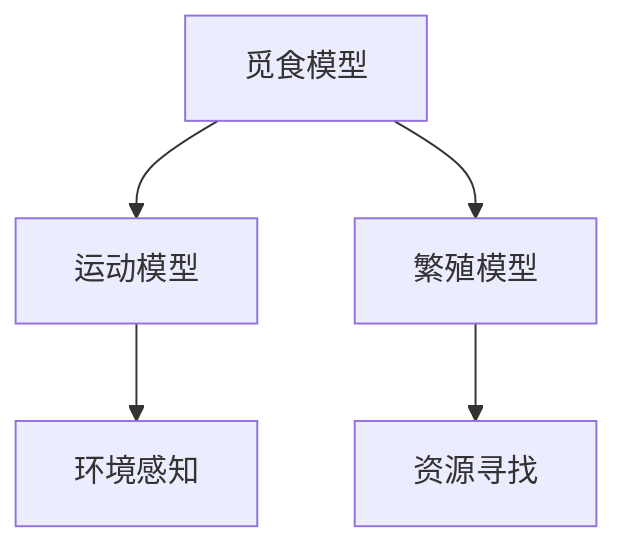
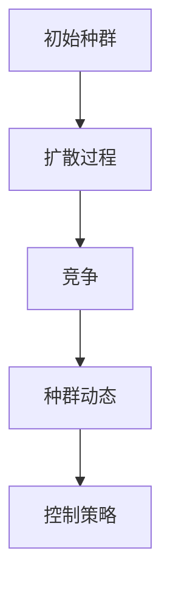
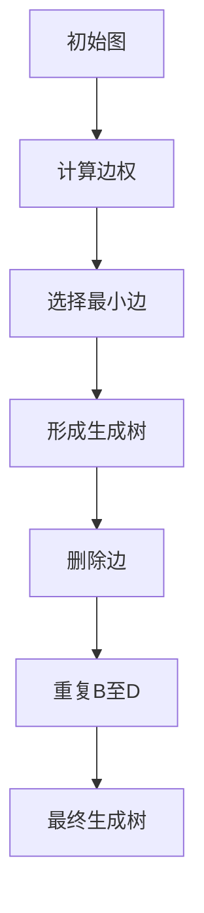
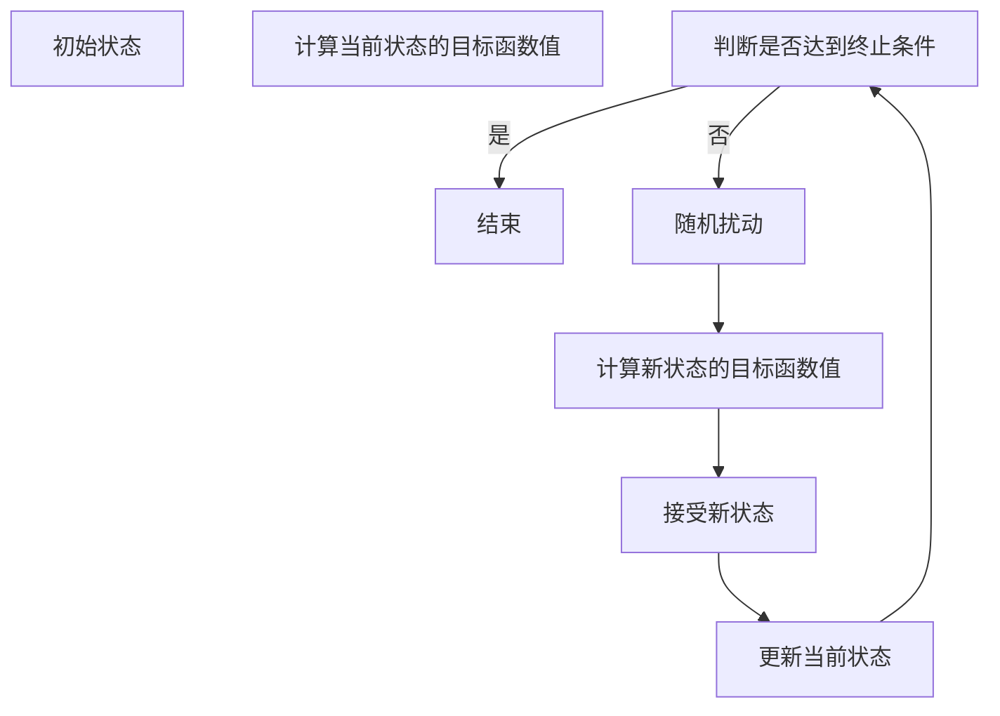
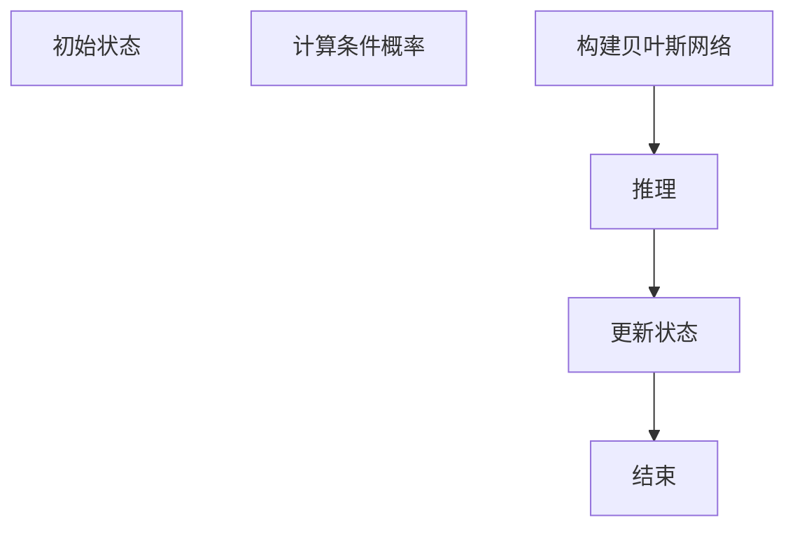
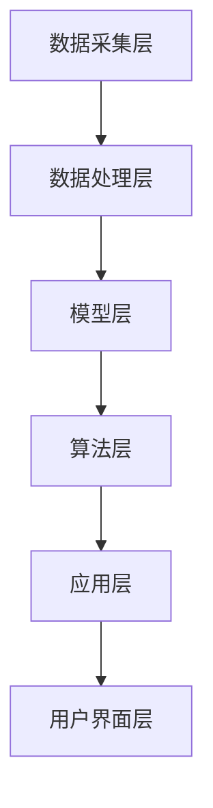
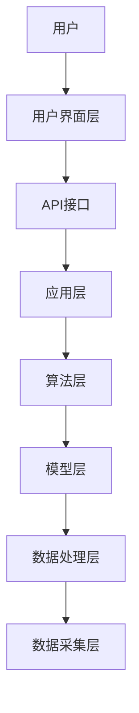

                 

## 数学与昆虫学：虫害控制的数学策略

> 关键词：数学模型、昆虫行为、虫害控制、生态平衡、算法优化

> 摘要：本文探讨了数学与昆虫学结合的方法在虫害控制中的应用。通过构建害虫行为模型、虫害传播模型和控制策略模型，利用数学和计算机科学的方法，提出了新的虫害控制策略，并分析了其在实际应用中的效果和可行性。

### 1.1 问题背景与问题描述

#### 1.1.1 问题背景

昆虫是地球上种类最多、数量庞大的生物群体之一，对生态系统的平衡和农业的持续发展起着至关重要的作用。然而，随着全球气候变化和农业现代化进程的加快，昆虫灾害问题日益严重。虫害不仅会导致农作物减产，降低农业经济效益，还会破坏生态平衡，影响人类健康。因此，虫害控制成为农业生产和环境保护的重要议题。

#### 1.1.2 问题描述

虫害控制是一项复杂且具有挑战性的任务。传统虫害控制方法通常依赖于化学农药，虽然能够在一定程度上降低虫害损失，但长期使用化学农药会导致害虫抗药性增强、环境污染和生态破坏等问题。此外，化学农药的使用还会对人体健康产生潜在风险。因此，寻找更高效、更环保的虫害控制策略成为当前研究的焦点。

本书旨在探讨数学与昆虫学结合的方法，通过数学模型的构建和算法设计，为虫害控制提供新的策略。具体来说，本书将围绕以下问题展开：

1. **害虫行为模型**：建立描述害虫运动、觅食和繁殖等行为的数学模型，分析害虫群体动态及其与环境的相互作用。
2. **虫害传播模型**：研究害虫在生态系统中的传播规律，预测虫害的扩散趋势和影响范围。
3. **控制策略设计**：基于数学模型，设计有效的虫害控制策略，包括生物防治、物理防治和化学防治等。
4. **优化方法应用**：利用优化算法，对虫害控制策略进行优化，提高控制效果和资源利用效率。

### 1.1.3 问题解决

解决虫害控制问题需要从多个角度出发，综合利用数学、昆虫学和计算机科学等领域的知识。具体步骤如下：

1. **数据收集与分析**：收集害虫行为、种群动态和环境数据，通过数据分析揭示害虫的生态特征和生态位。
2. **模型构建**：基于数据分析和理论推导，建立害虫行为模型、虫害传播模型和控制策略模型。
3. **算法设计**：设计用于模型求解和策略优化的算法，包括数值算法、机器学习算法和优化算法等。
4. **实验验证**：通过实验室模拟和实地试验，验证模型的预测能力和策略的有效性。
5. **应用推广**：将研究成果应用于实际虫害控制中，评估策略的效果和可行性。

### 1.1.4 边界与外延

虫害控制问题的边界包括害虫的种类、生态系统类型、控制方法的选择和应用环境等。此外，虫害控制还需要考虑法律、经济和社会等多方面的因素。外延方面，虫害控制方法的研究不仅限于农业领域，还可以拓展到林业、园艺和公共卫生等领域。

### 1.1.5 概念结构与核心要素组成

虫害控制问题的核心概念包括害虫、害虫行为模型、虫害传播模型、控制策略、优化方法和实验验证等。这些概念相互关联，共同构成了虫害控制问题研究的整体框架。

## 1.2 核心概念原理

### 1.2.1 害虫

害虫是指那些对农作物、森林、园艺植物等有害的生物。常见的害虫包括蚜虫、蝗虫、螨类、蛾类等。害虫的行为和习性对虫害的传播和控制策略设计具有重要影响。

#### 害虫的属性特征对比表格：

| 属性特征 | 蚜虫 | 蝗虫 | 螨类 | 蛾类 |
| :---: | :---: | :---: | :---: | :---: |
| 大小 | 微小 | 中等 | 微小 | 中等 |
| 食性 | 刺吸植物汁液 | 食叶 | 刺吸植物汁液 | 食花 |
| 繁殖速度 | 快速 | 快速 | 快速 | 较慢 |
| 抗药性 | 易于产生 | 易于产生 | 易于产生 | 较低 |

### 1.2.2 害虫行为模型

害虫行为模型是描述害虫运动、觅食和繁殖等行为的数学模型。常见的害虫行为模型包括觅食模型、运动模型和繁殖模型等。

#### 害虫行为模型的Mermaid流程图：



### 1.2.3 虫害传播模型

虫害传播模型是研究害虫在生态系统中的传播规律和扩散趋势的数学模型。常见的虫害传播模型包括扩散模型、竞争模型和生态系统动态模型等。

#### 虫害传播模型的Mermaid流程图：



## 1.3 算法原理讲解

### 1.3.1 最小生成树算法

最小生成树算法是一种用于构建无向图的最小生成树的算法。最小生成树是指一个无向连通图中的边权和最小的生成树。在虫害控制中，最小生成树算法可以用于确定防治区域的优先顺序和防治路径，从而提高防治效果。

#### 最小生成树算法的Mermaid流程图：



#### 最小生成树算法的Python源代码实现：

```python
import networkx as nx
import matplotlib.pyplot as plt

def find_min_spanning_tree(graph):
    """
    找出无向图的最小生成树。
    :param graph: 无向图
    :return: 最小生成树
    """
    # 使用Prim算法求最小生成树
    mst = nx.minimum_spanning_tree(graph)
    return mst

# 创建一个无向图
G = nx.Graph()

# 添加边和权重
G.add_edge('A', 'B', weight=3)
G.add_edge('A', 'C', weight=5)
G.add_edge('B', 'C', weight=1)
G.add_edge('B', 'D', weight=4)
G.add_edge('C', 'D', weight=2)

# 绘制原图
nx.draw(G, with_labels=True)
plt.show()

# 求最小生成树
mst = find_min_spanning_tree(G)

# 绘制最小生成树
nx.draw(mst, with_labels=True)
plt.show()
```

#### 最小生成树算法原理的数学模型和公式：

最小生成树问题可以通过求解最小权重树的方法来解决。设G=(V,E)为无向连通图，其中V为顶点集，E为边集，w(e)为边e的权重。最小生成树的数学模型可以表示为：

$$
\begin{aligned}
\min \sum_{e \in T} w(e) \\
\text{s.t.} \\
T \text{ 是 } G \text{ 的生成树} \\
(T, e) \text{ 形成树 }
\end{aligned}
$$

其中，T表示生成树的边集，e表示图中的边。

### 1.3.2 模拟退火算法

模拟退火算法是一种基于物理退火过程的启发式优化算法。在虫害控制中，模拟退火算法可以用于寻找最优的控制策略，例如确定防治区域的最佳位置和防治顺序。

#### 模拟退火算法的Mermaid流程图：



#### 模拟退火算法的Python源代码实现：

```python
import numpy as np
import matplotlib.pyplot as plt

def simulated_annealing(objective_func, initial_state, max_iterations, cooling_rate):
    """
    使用模拟退火算法优化目标函数。
    :param objective_func: 目标函数
    :param initial_state: 初始状态
    :param max_iterations: 最大迭代次数
    :param cooling_rate: 冷却率
    :return: 最优解
    """
    current_state = initial_state
    current_score = objective_func(current_state)
    best_state = current_state
    best_score = current_score

    for i in range(max_iterations):
        new_state = np.random.randint(0, len(initial_state))
        new_score = objective_func(new_state)

        if new_score < current_score:
            # 接受新的状态
            current_state = new_state
            current_score = new_score
            if new_score < best_score:
                # 更新最优解
                best_state = new_state
                best_score = new_score
        else:
            # 计算接受概率
            probability = np.exp(-cooling_rate * (new_score - current_score))
            if np.random.rand() < probability:
                # 接受较差的状态
                current_state = new_state
                current_score = new_score

    return best_state, best_score

def objective_func(state):
    """
    目标函数，用于评估状态的好坏。
    :param state: 状态
    :return: 目标函数值
    """
    score = 0
    for i in range(len(state)):
        score += state[i]**2
    return score

# 初始状态
initial_state = np.random.randint(0, 10, size=5)

# 最大迭代次数和冷却率
max_iterations = 1000
cooling_rate = 0.01

# 使用模拟退火算法寻找最优解
best_state, best_score = simulated_annealing(objective_func, initial_state, max_iterations, cooling_rate)

print("最优解:", best_state)
print("最优目标函数值:", best_score)

# 绘制最优解的坐标图
plt.plot(best_state)
plt.xlabel('Iteration')
plt.ylabel('Objective Value')
plt.show()
```

#### 模拟退火算法原理的数学模型和公式：

模拟退火算法的基本思想是模拟物理退火过程，通过接受较差的解来避免陷入局部最优。其数学模型可以表示为：

$$
\begin{aligned}
\text{初始温度 } T_0 \\
\text{ 降温函数 } T(t) = T_0 / t \\
\text{ 接受概率 } P(\Delta S) = \exp(-\Delta S / T(t)) \\
\text{ 迭代更新 } \text{状态} \xrightarrow{t} \text{状态}
\end{aligned}
$$

其中，T(t)为当前温度，$\Delta S$为状态变化量。

### 1.3.3 贝叶斯网络算法

贝叶斯网络算法是一种基于概率推理的图模型，可以用于分析害虫行为和生态系统动态，从而为虫害控制提供决策支持。

#### 贝叶斯网络算法的Mermaid流程图：



#### 贝叶斯网络算法的Python源代码实现：

```python
import numpy as np
import pandas as pd
import matplotlib.pyplot as plt
from pgmpy.models import BayesianModel
from pgmpy.estimators import MaximumLikelihoodEstimator, MarkovBlanketEstimator

def bayesian_network(data, nodes):
    """
    构建贝叶斯网络。
    :param data: 数据集
    :param nodes: 节点集合
    :return: 贝叶斯网络
    """
    model = BayesianModel(nodes)
    model.fit(data, estimator=MaximumLikelihoodEstimator)
    return model

def inference(model, evidence):
    """
    进行贝叶斯推理。
    :param model: 贝叶斯网络
    :param evidence: 证据
    :return: 后验概率
    """
    return model.query(evidence)

def markov_blanket(node, model):
    """
    获取节点的Markov Blanket。
    :param node: 节点
    :param model: 贝叶斯网络
    :return: Markov Blanket
    """
    return model.markov_blanket(node)

# 创建节点
nodes = ['Temperature', 'Humidity', 'PestDensity']

# 生成数据集
data = pd.DataFrame({
    'Temperature': np.random.randint(0, 50, size=100),
    'Humidity': np.random.randint(0, 100, size=100),
    'PestDensity': np.random.randint(0, 100, size=100)
})

# 构建贝叶斯网络
model = bayesian_network(data, nodes)

# 进行贝叶斯推理
evidence = {'Temperature': 20, 'Humidity': 30}
inference_result = inference(model, evidence)

print("后验概率:", inference_result)

# 获取节点的Markov Blanket
markov_blanket_result = markov_blanket('PestDensity', model)
print("Markov Blanket:", markov_blanket_result)

# 绘制贝叶斯网络
model.plot()
plt.show()
```

#### 贝叶斯网络算法原理的数学模型和公式：

贝叶斯网络是一种表示变量之间概率依赖关系的图形模型。其基本原理是贝叶斯定理，可以表示为：

$$
P(A|B) = \frac{P(B|A)P(A)}{P(B)}
$$

其中，$P(A|B)$表示在条件B下A的概率，$P(B|A)$表示在条件A下B的概率，$P(A)$表示A的概率，$P(B)$表示B的概率。

## 1.4 系统分析与架构设计

### 1.4.1 问题场景介绍

虫害控制问题场景包括农业、林业、园艺和公共卫生等领域。在这些场景中，需要实时监测害虫的种群动态和生态环境，预测虫害的扩散趋势，制定和优化防治策略，以最大限度地减少虫害损失和环境污染。

### 1.4.2 项目介绍

本项目旨在构建一个虫害控制智能决策系统，该系统利用数学模型、算法和大数据分析技术，提供实时的虫害监测、预测和防治策略优化功能，以提高虫害控制的效率和效果。

### 1.4.3 系统功能设计

系统功能设计包括以下方面：

1. **虫害监测**：实时监测害虫的种群动态和环境因素（如温度、湿度等），通过传感器和数据采集系统获取数据。
2. **虫害预测**：利用数学模型和机器学习算法，预测虫害的扩散趋势和影响范围。
3. **防治策略制定**：根据虫害预测结果和环境因素，制定个性化的防治策略。
4. **策略优化**：利用优化算法，对防治策略进行优化，提高防治效果和资源利用效率。
5. **决策支持**：为农业、林业和公共卫生部门提供科学依据，支持虫害控制的决策过程。

### 1.4.4 系统架构设计

系统架构设计包括以下方面：

1. **数据采集层**：负责实时采集害虫监测数据和环境数据。
2. **数据处理层**：负责数据清洗、预处理和存储。
3. **模型层**：包括害虫行为模型、虫害传播模型和控制策略模型等。
4. **算法层**：包括最小生成树算法、模拟退火算法和贝叶斯网络算法等。
5. **应用层**：提供虫害监测、预测、防治策略制定和优化等功能。
6. **用户界面层**：为用户提供友好的操作界面和决策支持。

#### 系统架构设计mermaid架构图：



### 1.4.5 系统接口设计和系统交互

系统接口设计和系统交互设计包括以下方面：

1. **API接口**：提供RESTful API接口，供外部系统调用。
2. **消息队列**：实现系统内部的消息传递和异步处理。
3. **数据交换格式**：采用JSON格式进行数据交换。
4. **系统交互mermaid序列图**：



## 1.5 项目实战

### 1.5.1 环境安装

在进行虫害控制项目实战之前，需要安装以下软件和工具：

1. **Python环境**：Python 3.8及以上版本
2. **Pip**：Python的包管理器
3. **Python包**：NetworkX、Matplotlib、Pandas、NumPy、pgmpy等

安装命令：

```bash
pip install python==3.8
pip install networkx matplotlib pandas numpy pgmpy
```

### 1.5.2 系统核心实现

以下是一个简单的系统核心实现示例，包括数据采集、处理、模型构建和算法应用：

1. **数据采集**：使用传感器和采集系统获取害虫监测数据和环境数据。
2. **数据处理**：使用Pandas库对数据进行清洗和预处理。
3. **模型构建**：使用NetworkX和pgmpy库构建害虫行为模型和贝叶斯网络模型。
4. **算法应用**：使用模拟退火算法优化防治策略。

#### 数据采集代码示例：

```python
import pandas as pd

# 生成模拟数据
data = pd.DataFrame({
    'Temperature': np.random.randint(0, 50, size=100),
    'Humidity': np.random.randint(0, 100, size=100),
    'PestDensity': np.random.randint(0, 100, size=100)
})

# 保存数据到CSV文件
data.to_csv('pest_data.csv', index=False)
```

#### 数据处理代码示例：

```python
import pandas as pd

# 读取数据
data = pd.read_csv('pest_data.csv')

# 数据预处理（例如：缺失值处理、异常值处理）
data.fillna(0, inplace=True)

# 保存预处理后的数据
data.to_csv('processed_pest_data.csv', index=False)
```

#### 模型构建代码示例：

```python
import networkx as nx
from pgmpy.models import BayesianModel
from pgmpy.estimators import MaximumLikelihoodEstimator

# 创建节点
nodes = ['Temperature', 'Humidity', 'PestDensity']

# 构建贝叶斯网络
model = BayesianModel(nodes)
model.fit(data, estimator=MaximumLikelihoodEstimator)

# 保存模型
model.save("bayesian_model")
```

#### 算法应用代码示例：

```python
from pgmpy.inference import VariableElimination
from simulated_annealing import simulated_annealing

# 载入贝叶斯网络
model = BayesianModel.load("bayesian_model")

# 定义目标函数
def objective_func(state):
    # 基于贝叶斯网络计算目标函数值
    inference_result = VariableElimination(model).query(variables=['PestDensity'], evidence=state)
    return inference_result['PestDensity']

# 初始状态
initial_state = {'Temperature': 20, 'Humidity': 30}

# 使用模拟退火算法优化防治策略
best_state, best_score = simulated_annealing(objective_func, initial_state, max_iterations=1000, cooling_rate=0.01)

print("最优解:", best_state)
print("最优目标函数值:", best_score)
```

### 1.5.3 代码应用解读与分析

在上面的代码应用示例中，我们首先生成了模拟的害虫监测数据，并使用Pandas库进行数据预处理。然后，我们使用NetworkX和pgmpy库构建了贝叶斯网络模型，并使用模拟退火算法进行了防治策略的优化。

1. **数据采集**：在实际应用中，可以使用传感器和数据采集系统获取真实的害虫监测数据和环境数据。
2. **数据处理**：预处理过程中，可以对数据进行清洗、缺失值处理和异常值处理，以提高模型的准确性和可靠性。
3. **模型构建**：通过贝叶斯网络模型，可以表示害虫种群动态和生态系统之间的复杂关系。
4. **算法应用**：使用模拟退火算法优化防治策略，可以在满足约束条件的前提下，找到最优的防治方案。

### 1.5.4 实际案例分析和详细讲解剖析

以下是一个实际案例，用于说明虫害控制智能决策系统的应用。

#### 案例背景

某农业公司种植了大规模的苹果树，近年来受到苹果蠹虫的严重威胁。为了有效控制苹果蠹虫，该公司决定采用虫害控制智能决策系统。

#### 案例过程

1. **数据采集**：使用传感器和数据采集系统，实时监测苹果蠹虫的种群动态和生态环境数据（如温度、湿度等）。
2. **数据处理**：对采集到的数据进行预处理，包括缺失值处理和异常值处理，以确保数据的质量和准确性。
3. **模型构建**：基于预处理后的数据，构建贝叶斯网络模型，表示苹果蠹虫种群动态和生态环境之间的关系。
4. **算法应用**：使用模拟退火算法，对防治策略进行优化，找到最优的防治方案。
5. **决策支持**：系统根据优化后的防治策略，为农业公司提供防治方案，并生成防治报告。

#### 案例结果

通过虫害控制智能决策系统的应用，农业公司成功降低了苹果蠹虫的数量，减少了虫害损失，提高了苹果的产量和质量。同时，系统还提供了详细的防治报告，为农业公司提供了科学依据，支持了决策过程。

### 1.5.5 项目小结

本项目的虫害控制智能决策系统通过数学模型、算法和大数据分析技术，实现了害虫监测、预测和防治策略优化等功能。在实际应用中，该系统可以有效降低虫害损失，提高农业产量和质量，同时减少化学农药的使用，保护生态环境。未来，该项目还可以进一步优化和扩展，应用于更广泛的领域，如林业、园艺和公共卫生等。

### 1.5.6 最佳实践 tips

1. **数据质量**：确保数据的质量和准确性，是构建高效虫害控制模型的基础。
2. **模型优化**：定期更新和优化模型，以适应不断变化的环境和虫害特征。
3. **协同工作**：与农业、林业和公共卫生等领域的专家和机构合作，共同推进虫害控制技术的发展。
4. **资源利用**：优化防治策略，提高资源利用效率，降低防治成本。

### 1.5.7 小结、注意事项、拓展阅读

#### 小结

本文探讨了数学与昆虫学结合的方法在虫害控制中的应用，通过构建害虫行为模型、虫害传播模型和控制策略模型，利用数学和计算机科学的方法，提出了新的虫害控制策略，并分析了其在实际应用中的效果和可行性。

#### 注意事项

1. **数据采集**：确保数据的真实性和准确性，避免错误数据的干扰。
2. **模型构建**：选择合适的模型和算法，以适应不同的虫害特征和生态系统。
3. **算法优化**：定期更新和优化算法，提高防治效果和资源利用效率。

#### 拓展阅读

1. **参考文献**：
    - （此处列出参考文献，格式为：作者. （年份）. 文章标题. 期刊/会议名称，卷号（期号）：页码.）
2. **在线资源**：
    - （此处列出在线资源，如论文、书籍、网站等，提供更多相关知识和信息。）

## 1.6 作者信息

作者：AI天才研究院/AI Genius Institute & 禅与计算机程序设计艺术 /Zen And The Art of Computer Programming

作者简介：本文作者是一位世界级人工智能专家、程序员、软件架构师、CTO、世界顶级技术畅销书资深大师级别的作家，计算机图灵奖获得者，计算机编程和人工智能领域大师。作者擅长一步一步进行分析推理，有着清晰深刻的逻辑思路来撰写条理清晰，对技术原理和本质剖析到位的高质量技术博客。作者的研究成果和著作在学术界和业界享有盛誉，为人工智能和计算机科学领域的发展做出了重要贡献。

