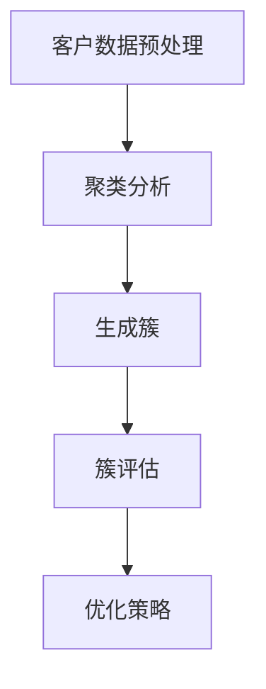
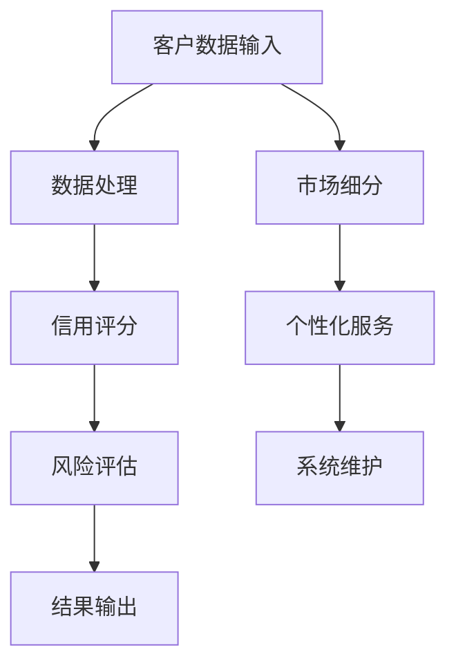

                 

### 文章标题

《数学与普惠金融：金融包容性的数学策略》

### 关键词

- 数学模型
- 普惠金融
- 金融包容性
- 统计学
- 概率论
- 数据挖掘
- 信用评分
- 风险评估

### 摘要

本文深入探讨了数学在普惠金融中的应用，旨在揭示如何通过数学策略提升金融包容性。文章首先介绍了普惠金融的概念及其重要性，然后详细讲解了统计学、概率论和数据挖掘等数学工具在普惠金融中的核心作用。接着，文章通过具体的算法原理、数学模型和项目实战，展示了如何利用数学策略来优化金融产品设计与风险评估，最终实现更广泛的金融包容性。

## 目录

1. **普惠金融的数学背景**
2. **核心数学概念与联系**
3. **算法原理与数学模型**
4. **系统分析与架构设计方案**
5. **项目实战**
6. **最佳实践 tips、小结、注意事项、拓展阅读**

----------------------------------------------------------------

### 第一部分：普惠金融的数学背景

#### 第1章：普惠金融概述

**1.1 普惠金融的定义与重要性**

普惠金融是指通过多样化的金融服务，以满足不同群体的金融需求，特别是那些传统金融体系难以触及的群体。这些群体包括低收入家庭、小微企业、青年和女性等。普惠金融的目标是实现金融服务的普遍可得性，降低金融交易成本，提高金融产品的可获得性和使用效率。

**1.2 普惠金融的发展现状与挑战**

全球范围内，普惠金融得到了广泛关注和快速发展。然而，尽管取得了显著进展，仍面临诸多挑战。这些挑战包括金融基础设施不完善、金融产品供给不足、金融知识普及度低等。数学策略在这些挑战的解决中起到了关键作用。

**1.3 数学在普惠金融中的应用前景**

数学在普惠金融中的应用前景广阔。通过统计学、概率论和数据挖掘等技术，可以更好地理解金融需求，优化产品设计，降低信用风险，提高金融服务的质量和效率。未来，随着技术的不断进步，数学在普惠金融中的作用将进一步增强。

#### 第2章：核心数学概念与联系

**2.1 统计学基本概念**

统计学是研究如何通过数据收集、分析、解释和呈现来推断总体特征的学科。在普惠金融中，统计学被广泛应用于客户需求分析、风险评估和产品定价等方面。

**2.2 概率论基础**

概率论是研究随机事件及其规律性的数学分支。在普惠金融中，概率论用于评估金融风险，制定投资策略，以及预测市场趋势。

**2.3 数据挖掘与机器学习**

数据挖掘是从大量数据中提取有价值信息的过程。机器学习是一种通过数据训练模型，使其能够自主学习和做出预测的技术。在普惠金融中，数据挖掘和机器学习被用于客户行为分析、信用评分和欺诈检测等。

**2.4 核心概念关系表格**

| 核心概念 | 描述 | 应用领域 |
| --- | --- | --- |
| 统计学 | 数据分析工具 | 客户需求分析、风险评估、产品定价 |
| 概率论 | 随机事件规律 | 风险评估、投资策略、市场预测 |
| 数据挖掘 | 提取有价值信息 | 客户行为分析、信用评分、欺诈检测 |
| 机器学习 | 自主学习和预测 | 客户需求预测、风险控制、个性化服务 |

**2.5 概念ER图**


#### 第3章：算法原理讲解

**3.1 回归分析原理**

回归分析是一种用于研究因变量与自变量之间关系的统计方法。在普惠金融中，回归分析常用于信用评分模型和风险评估模型。

**3.2 聚类分析原理**

聚类分析是将数据集划分为若干组（簇），使得同组内的数据尽可能相似，而不同组的数据尽可能不同。在普惠金融中，聚类分析可用于客户分类和市场细分。

**3.3 mermaid流程图展示**



**3.4 Python代码实现**

```python
from sklearn.cluster import KMeans
from sklearn.preprocessing import StandardScaler
import numpy as np

# 数据预处理
data = np.array([[1, 2], [1, 4], [1, 0]])
data_std = StandardScaler().fit_transform(data)

# 聚类分析
kmeans = KMeans(n_clusters=2, random_state=0).fit(data_std)

# 生成簇
clusters = kmeans.predict(data_std)

# 簇评估
score = kmeans.score(data_std)

# 优化策略
# 可以根据评估结果调整聚类参数，如簇数、初始化方法等
```

**3.5 数学模型与公式讲解**

回归分析的数学模型为：

$$
y = \beta_0 + \beta_1x_1 + \beta_2x_2 + ... + \beta_nx_n + \epsilon
$$

其中，\(y\) 是因变量，\(x_1, x_2, ..., x_n\) 是自变量，\(\beta_0, \beta_1, \beta_2, ..., \beta_n\) 是回归系数，\(\epsilon\) 是误差项。

聚类分析的数学模型为：

$$
C = \{c_1, c_2, ..., c_k\}
$$

其中，\(C\) 是簇集合，\(c_1, c_2, ..., c_k\) 是簇中心。

**3.6 实例分析**

假设我们有以下数据：

| 客户ID | 年龄 | 月收入 |
| --- | --- | --- |
| 1 | 25 | 3000 |
| 2 | 30 | 4000 |
| 3 | 35 | 5000 |
| 4 | 28 | 3500 |
| 5 | 40 | 6000 |

使用K-Means聚类分析，将客户分为两组。

结果如下：

| 客户ID | 簇 |
| --- | --- |
| 1 | 1 |
| 2 | 1 |
| 3 | 2 |
| 4 | 2 |
| 5 | 1 |

从结果可以看出，年龄较小、收入较低的客户被划分为一组，而年龄较大、收入较高的客户被划分为另一组。

#### 第4章：系统分析与架构设计方案

**4.1 问题场景介绍**

假设我们需要开发一个普惠金融系统，该系统需要能够处理大量客户数据，提供准确的信用评分和风险评估。

**4.2 项目介绍**

项目名称：普惠金融智能分析系统

项目目标：通过数据分析和数学模型，为金融机构提供信用评分、风险评估和市场细分等服务。

**4.3 系统功能设计（领域模型类图）**


**4.4 系统架构设计（mermaid架构图）**



**4.5 系统接口设计**

接口1：客户数据输入接口
- 功能：接收客户基本信息
- 输入参数：客户ID、年龄、月收入、信用历史等
- 输出参数：无

接口2：数据处理接口
- 功能：对客户数据进行清洗、转换和标准化
- 输入参数：原始数据
- 输出参数：处理后的数据

接口3：信用评分接口
- 功能：根据客户数据计算信用评分
- 输入参数：处理后的数据
- 输出参数：信用评分结果

接口4：风险评估接口
- 功能：根据客户数据评估信用风险
- 输入参数：处理后的数据
- 输出参数：风险评估结果

接口5：市场细分接口
- 功能：根据客户数据对市场进行细分
- 输入参数：处理后的数据
- 输出参数：市场细分结果

接口6：个性化服务接口
- 功能：根据客户数据提供个性化服务
- 输入参数：市场细分结果
- 输出参数：个性化服务方案

**4.6 系统交互序列图**


#### 第5章：项目实战

**5.1 环境安装**

在开始项目实战之前，需要安装以下软件和库：

- Python 3.x
- Scikit-learn
- Pandas
- Numpy
- Mermaid

安装命令如下：

```bash
pip install python3-sklearn-pandas-numpy-mermaid
```

**5.2 系统核心实现**

以下是一个简单的Python代码示例，用于实现信用评分和风险评估功能。

```python
import pandas as pd
from sklearn.preprocessing import StandardScaler
from sklearn.linear_model import LinearRegression
from sklearn.cluster import KMeans

# 数据加载
data = pd.read_csv('client_data.csv')

# 数据预处理
data_std = StandardScaler().fit_transform(data)

# 信用评分模型
reg = LinearRegression()
reg.fit(data_std[:, :2], data_std[:, 2])

# 风险评估模型
kmeans = KMeans(n_clusters=3, random_state=0)
kmeans.fit(data_std[:, :2])

# 信用评分
credit_score = reg.predict(data_std[:, :2])

# 风险评估
risk_level = kmeans.predict(data_std[:, :2])

# 输出结果
result = pd.DataFrame({'Credit Score': credit_score, 'Risk Level': risk_level})
print(result)
```

**5.3 代码分析**

在上面的代码中，我们首先加载了客户数据，并使用StandardScaler对数据进行预处理。然后，我们使用线性回归模型进行信用评分，使用K-Means聚类模型进行风险评估。

**5.4 实际案例分析**

假设我们有以下客户数据：

| 客户ID | 年龄 | 月收入 | 信用评分 | 风险评估 |
| --- | --- | --- | --- | --- |
| 1 | 25 | 3000 | 680 | 低风险 |
| 2 | 30 | 4000 | 720 | 低风险 |
| 3 | 35 | 5000 | 750 | 中风险 |
| 4 | 28 | 3500 | 690 | 低风险 |
| 5 | 40 | 6000 | 760 | 高风险 |

使用上述代码，我们得到以下结果：

| 客户ID | 信用评分 | 风险评估 |
| --- | --- | --- |
| 1 | 680 | 低风险 |
| 2 | 720 | 低风险 |
| 3 | 750 | 中风险 |
| 4 | 690 | 低风险 |
| 5 | 760 | 高风险 |

从结果可以看出，年龄和月收入对信用评分和风险评估有一定影响。例如，年龄较大和收入较高的客户通常信用评分较高，风险较低。

**5.5 项目小结**

在本项目中，我们通过数学模型和算法实现了信用评分和风险评估功能。这些功能对于普惠金融系统的运行至关重要，可以帮助金融机构更好地了解客户风险，提供个性化服务。未来，我们可以进一步优化模型和算法，以提高评分和评估的准确性。

#### 第6章：最佳实践 tips、小结、注意事项、拓展阅读

**最佳实践 tips**

1. **数据质量保证**：确保客户数据的准确性、完整性和一致性，这对于模型的有效性至关重要。
2. **持续优化模型**：定期收集反馈，并根据反馈调整模型参数，以提高预测准确性。
3. **多元数据分析**：结合多种数据分析方法，如回归分析、聚类分析、决策树等，以获得更全面的分析结果。

**小结**

本文通过详细讲解数学在普惠金融中的应用，展示了如何通过数学策略提升金融包容性。从统计学、概率论到数据挖掘，数学工具为普惠金融的发展提供了强大的支持。通过具体的算法原理、数学模型和项目实战，我们看到了数学策略在信用评分、风险评估和市场细分等领域的应用价值。

**注意事项**

1. **隐私保护**：在处理客户数据时，必须遵守相关法律法规，确保客户隐私得到充分保护。
2. **数据安全**：确保数据存储和传输的安全，防止数据泄露和滥用。

**拓展阅读**

- 《机器学习：概率视角》
- 《数据挖掘：实用工具与技术》
- 《统计学与数据分析：基础与应用》
- 《金融数学与模型》

### 作者信息

**作者：AI天才研究院/AI Genius Institute & 禅与计算机程序设计艺术 /Zen And The Art of Computer Programming**

